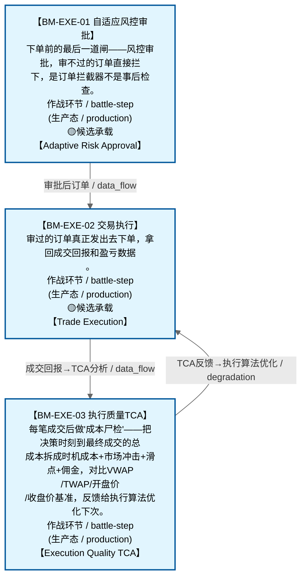

# 作战地图·执行阶段

> **[可缩放 HTML 版 / Zoomable HTML](http://localhost:8765/docs/02_enterprise_architecture/07_trading_decision_architecture/battle_map/_zoomable_html/battle_map_05_execution.html)** — Ctrl+滚轮缩放 ｜ 双击重置 ｜ Ctrl+Shift+D 切换拖动/选择模式

> battle_map §execution 阶段，3 环节。
> 本文档由 `generate_battle_map_diagram.py` 自动生成，禁止手编。

## 文档基本信息 / Document Overview

| 字段 | 值 | Field | Value |
|------|------|-------|-------|
| 阶段 | 执行（execution） | Stage | 执行 |
| 环节数 | 3 | Steps | 3 |
| 流转边 | 9 | Edges | 9 |
| 状态分布 | 🟦 运营态（已建）=3 | State Distribution | 🟦 运营态（已建）=3 |

> **图例说明 / Legend**：
> - 🟦 **蓝色实线 = 运营态环节**（production，锚点模块已建）
> - 🟧 **橙色虚线 = 设计态环节**（design，锚点模块待施工）
> - 🟥 **红色 = 弃用态**（deprecated）
> - ⬜ **灰色 = 缺失态**（missing，环节无锚点，BM-INV-001 违例）
> - 🟨 **黄色虚线 = 候选态**（candidate，承载模块在候选池）
> - **实线箭头 ``-->`` = 运营态流转**（两端均 production）
> - **虚线箭头 ``-.->`` = 非运营态流转**（含设计/候选/混合）

## 阶段图 / Stage Diagram

> 展示 执行 阶段全部 3 个环节及流转边，颜色区分五态。

## 环节详情

### BM-EXE-01 自适应风控审批 / Adaptive Risk Approval

> **大白话**：下单前的最后一道闸——风控审批，审不过的订单直接拦下，是订单拦截器不是事后检查。

**机制说明**：

L4 层。C-004 自适应风控，作为订单拦截器：C-005 生成预案→MTF→DO→C-047 裁决仓位→C-004 风控审批后才→C-002 执行。C-004 仅依赖 C-001/C-002/C-009/C-021/C-047，不依赖 C-005。

**6 件套（结构化，DB indicators JSONB）**：

| 要素 | 内容 |
|---|---|
| ① 触发条件 | 仓位指令就绪 阈值: 订单拦截器（审批后才执行） |
| ② 消费数据/因子 | 仓位指令（来自 BM-POS-01） C-001/C-002/C-009/C-021/C-047 状态（来自 多环节） |
| ③ 参数 | risk_threshold=自适应（范围 -，代码当前: max_single_position=0.10 (单标的权重上限) + HALT级违例阻断下单，状态: implemented） |
| ④ 数据流 | 输入: 仓位指令 → 处理: C-004 风控审批（订单拦截） → 输出: 审批后订单 → 下游: BM-EXE-02 交易执行 |
| ⑤ 代码映射 | C-004 / 草图§9 L4 层 |
| ⑥ 降级/中止 | C-004 不可用 → 降级硬编码仓位上限10%（应急保命轨） |

**指标文案（翻译真源 indicators_zh）**：

①触发：仓位指令就绪；②消费：BM-POS-01 仓位指令 + 多环节状态；③参数：risk_threshold=自适应；④数据流：仓位指令→C-004 审批拦截→审批后订单→BM-EXE-02；⑤代码：C-004 L4 层；⑥降级：C-004 不可用→硬编码仓位上限10%。

**锚点（环节↔模块双向关联）**：

| 目标图 | 目标ID | 角色 | 状态快照 | 真实build_status |
|---|---|---|---|---|
| depgraph | MOD-L06-001 | primary | production | generated |
| candidate | CAND-RSK-014 | supplement | deferred | — |

**有效状态**：🟦 运营态（已建） ｜ **环节自报**：design ｜ **层**：L4 ｜ **阶段**：execution

### BM-EXE-02 交易执行 / Trade Execution

> **大白话**：审过的订单真正发出去下单，拿回成交回报和盈亏数据。

**机制说明**：

L4 层。C-002 交易执行：下单+成交回报，产出交易指令+成交回报+PnL 数据。是数据流主动脉的末端执行节点。

**6 件套（结构化，DB indicators JSONB）**：

| 要素 | 内容 |
|---|---|
| ① 触发条件 | 风控审批通过 阈值: 下单+成交回报 |
| ② 消费数据/因子 | 审批后订单（来自 BM-EXE-01） |
| ③ 参数 | order_algo=自适应（范围 -，代码当前: 待实现，状态: proposed） |
| ④ 数据流 | 输入: 审批后订单 → 处理: C-002 下单+成交回报 → 输出: 交易指令+成交回报+PnL → 下游: BM-REC-01 运营清算 |
| ⑤ 代码映射 | C-002 / 草图§9 L4 层 |
| ⑥ 降级/中止 | C-002 失败 → 订单重试+告警 |

**指标文案（翻译真源 indicators_zh）**：

①触发：风控审批通过；②消费：BM-EXE-01 审批后订单；③参数：order_algo=自适应；④数据流：审批后订单→C-002 下单→交易指令+成交回报+PnL→BM-REC-01；⑤代码：C-002 L4 层；⑥降级：C-002 失败→订单重试+告警。

**锚点（环节↔模块双向关联）**：

| 目标图 | 目标ID | 角色 | 状态快照 | 真实build_status |
|---|---|---|---|---|
| depgraph | MOD-XS-002 | primary | planned | generated |
| depgraph | MOD-EX-030 | supplement | planned | planned |
| candidate | CAND-HARVEST-0021 | supplement | candidate | — |
| candidate | CAND-EX-001 | supplement | deferred | — |
| candidate | CAND-EX-002 | supplement | deferred | — |

**有效状态**：🟦 运营态（已建） ｜ **环节自报**：design ｜ **层**：L4 ｜ **阶段**：execution

### BM-EXE-03 执行质量TCA / Execution Quality TCA

> **大白话**：每笔成交后做"成本尸检"——把决策时刻到最终成交的总成本拆成时机成本+市场冲击+滑点+佣金，对比VWAP/TWAP/开盘价/收盘价基准，反馈给执行算法优化下次。

**机制说明**：

§9.2 C-046执行质量分析TCA(Trade Cost Analysis) + Implementation Shortfall。
Implementation Shortfall(IS)：决策时刻→最终成交的总成本分解(时机成本+市场冲击+滑点+佣金)。IS是执行质量的核心指标——衡量"决策意图"与"实际成交"之间的总损耗。
Pre-trade/At-trade/Post-trade三阶段TCA：
  Pre-trade：下单前预估执行成本(基于历史TCA+C-042策略容量约束)，用于执行计划生成。
  At-trade：下单时实时监控执行进度(实际执行vs计划轨迹偏差>阈值→暂停+告警)。
  Post-trade：成交后做成本归因(滑点来源/冲击成本/执行延迟)，反馈到执行算法。
执行基准对比：每笔订单vs VWAP/TWAP/开盘价/收盘价，评估执行质量优劣。
与Almgren-Chriss最优执行框架的协同：C-046历史TCA数据→执行计划生成→大单拆分策略→参与率控制(<15%分钟成交量)→执行时间窗口选择(开盘前5min/收盘前10min/均匀分布)→执行进度监控。
密度感知的执行时机优化(§9.2 v3.4新增)：基于条件PDF选择最优执行窗口——条件PDF右偏(正偏)→买入信号→优先在开盘执行(预期上涨概率高)；条件PDF左偏(负偏)→卖出信号→优先在开盘执行；条件PDF对称但宽(高不确定性)→延迟到收盘前执行。Almgren-Chriss的最优轨迹可基于条件PDF而非历史波动率计算。

**6 件套（结构化，DB indicators JSONB）**：

| 要素 | 内容 |
|---|---|
| ① 触发条件 | 成交回报到达 阈值: — |
| ② 消费数据/因子 | 成交回报（来自 BM-EXE-02） 决策时刻价格（来自 BM-BUY-04/BM-SELL-02） VWAP/TWAP/开盘价/收盘价（来自 L0） C-042策略容量（来自 L3） C-046历史TCA数据（来自 本环节） |
| ③ 参数 | IS成本分解=时机成本+市场冲击+滑点+佣金（范围 -，代码当前: 滑点slippage_bps + 佣金commission + IS shortfall(_calc_shortfall)，状态: implemented） TCA阶段=Pre-trade/At-trade/Post-trade（范围 -，代码当前: Post-trade(analyze/analyze_batch方法); Pre-trade/At-trade未实现，状态: implemented） 执行基准=VWAP/TWAP/开盘价/收盘价（范围 -，代码当前: arrival(到达价)——benchmark_price_source默认值，状态: implemented） 参与率控制=<15%分钟成交量（范围 -，代码当前: participation_rate=0.10 (10%分钟成交量)，状态: implemented） 执行进度偏差阈值=—（范围 -，代码当前: 待实现，状态: proposed） |
| ④ 数据流 | 输入: 成交回报+决策时刻价格 → 处理: IS成本分解+三阶段TCA+基准对比 → 输出: 执行质量评分+成本归因 → 下游: 反馈到BM-EXE-02执行算法(Almgren-Chriss) + BM-REC-02复盘 |
| ⑤ 代码映射 | MOD-L07-001 / 草图§9.2 C-046（MOD-L07-001 default_tca_engine） |
| ⑥ 降级/中止 | TCA引擎未就绪 → 仅记录成交不分析(复盘缺执行质量维度) |

**指标文案（翻译真源 indicators_zh）**：

①触发：成交回报到达；②消费：成交回报(BM-EXE-02)+决策时刻价格(BM-BUY-04/BM-SELL-02)+VWAP/TWAP/开盘价/收盘价(L0)+C-042策略容量(L3)+C-046历史TCA数据(本环节)；③参数：IS成本分解(时机+冲击+滑点+佣金)、Pre/At/Post三阶段、执行基准VWAP/TWAP/开盘/收盘、参与率<15%、执行进度偏差阈值(proposed)；④数据流：成交回报+决策时刻价格→IS成本分解+三阶段TCA+基准对比→执行质量评分+成本归因→反馈到执行算法+复盘；⑤代码：MOD-L07-001 default_tca_engine(stable)；⑥降级：TCA引擎未就绪→仅记录成交不分析(复盘缺执行质量维度)。

**锚点（环节↔模块双向关联）**：

| 目标图 | 目标ID | 角色 | 状态快照 | 真实build_status |
|---|---|---|---|---|
| depgraph | MOD-L07-001 | primary | stable | generated |

**有效状态**：🟦 运营态（已建） ｜ **环节自报**：design ｜ **层**：L4 ｜ **阶段**：execution

[← 返回总指挥图](battle_map_panorama.md)