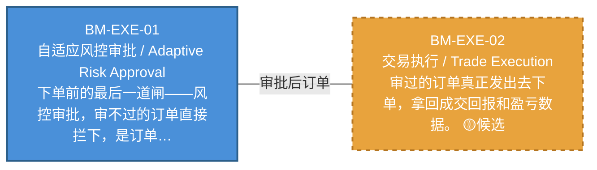

# 作战地图·执行阶段

> battle_map §execution 阶段，2 环节。

## 阶段图

## 环节详情

### BM-EXE-01 自适应风控审批 / Adaptive Risk Approval

> **大白话**：下单前的最后一道闸——风控审批，审不过的订单直接拦下，是订单拦截器不是事后检查。

**机制说明**：

L4 层。C-004 自适应风控，作为订单拦截器：C-005 生成预案→MTF→DO→C-047 裁决仓位→C-004 风控审批后才→C-002 执行。C-004 仅依赖 C-001/C-002/C-009/C-021/C-047，不依赖 C-005。

**6 件套（结构化，DB indicators JSONB）**：

| 要素 | 内容 |
|---|---|
| ① 触发条件 | 仓位指令就绪 阈值: 订单拦截器（审批后才执行） |
| ② 消费数据/因子 | 仓位指令（来自 BM-POS-01） C-001/C-002/C-009/C-021/C-047 状态（来自 多环节） |
| ③ 参数 | risk_threshold=自适应（范围 -，代码当前: 待实现，状态: proposed） |
| ④ 数据流 | 输入: 仓位指令 → 处理: C-004 风控审批（订单拦截） → 输出: 审批后订单 → 下游: BM-EXE-02 交易执行 |
| ⑤ 代码映射 | C-004 / 草图§9 L4 层 |
| ⑥ 降级/中止 | C-004 不可用 → 降级硬编码仓位上限10%（应急保命轨） |

**指标文案（翻译真源 indicators_zh）**：

①触发：仓位指令就绪；②消费：BM-POS-01 仓位指令 + 多环节状态；③参数：risk_threshold=自适应；④数据流：仓位指令→C-004 审批拦截→审批后订单→BM-EXE-02；⑤代码：C-004 L4 层；⑥降级：C-004 不可用→硬编码仓位上限10%。

**锚点（环节↔模块双向关联）**：

| 目标图 | 目标ID | 角色 | 状态快照 | 真实build_status |
|---|---|---|---|---|
| depgraph | MOD-L06-001 | primary | production | generated |

**有效状态**：🟦 运营态（已建） ｜ **环节自报**：design ｜ **层**：L4 ｜ **阶段**：execution

### BM-EXE-02 交易执行 / Trade Execution

> **大白话**：审过的订单真正发出去下单，拿回成交回报和盈亏数据。

**机制说明**：

L4 层。C-002 交易执行：下单+成交回报，产出交易指令+成交回报+PnL 数据。是数据流主动脉的末端执行节点。

**6 件套（结构化，DB indicators JSONB）**：

| 要素 | 内容 |
|---|---|
| ① 触发条件 | 风控审批通过 阈值: 下单+成交回报 |
| ② 消费数据/因子 | 审批后订单（来自 BM-EXE-01） |
| ③ 参数 | order_algo=自适应（范围 -，代码当前: 待实现，状态: proposed） |
| ④ 数据流 | 输入: 审批后订单 → 处理: C-002 下单+成交回报 → 输出: 交易指令+成交回报+PnL → 下游: BM-REC-01 运营清算 |
| ⑤ 代码映射 | C-002 / 草图§9 L4 层 |
| ⑥ 降级/中止 | C-002 失败 → 订单重试+告警 |

**指标文案（翻译真源 indicators_zh）**：

①触发：风控审批通过；②消费：BM-EXE-01 审批后订单；③参数：order_algo=自适应；④数据流：审批后订单→C-002 下单→交易指令+成交回报+PnL→BM-REC-01；⑤代码：C-002 L4 层；⑥降级：C-002 失败→订单重试+告警。

**锚点（环节↔模块双向关联）**：

| 目标图 | 目标ID | 角色 | 状态快照 | 真实build_status |
|---|---|---|---|---|
| depgraph | MOD-XS-002 | primary | planned | planned |
| depgraph | MOD-EX-030 | supplement | planned | planned |
| candidate | CAND-HARVEST-0021 | supplement | candidate | — |

**有效状态**：🟧 设计态（待施工） ｜ **环节自报**：design ｜ **层**：L4 ｜ **阶段**：execution

[← 返回总指挥图](battle_map_panorama.md)