# 作战地图·选股阶段

> **[可缩放 HTML 版 / Zoomable HTML](http://localhost:8765/docs/02_enterprise_architecture/07_trading_decision_architecture/battle_map/_zoomable_html/battle_map_05_stock_selection.html)** — Ctrl+滚轮缩放 ｜ 双击重置 ｜ Ctrl+Shift+D 切换拖动/选择模式

> battle_map §stock_selection 阶段，55 环节。
> 本文档由 `generate_battle_map_diagram.py` 自动生成，禁止手编。

## 文档基本信息 / Document Overview

| 字段 | 值 | Field | Value |
|------|------|-------|-------|
| 阶段 | 选股（stock_selection） | Stage | 选股 |
| 环节数 | 55 | Steps | 55 |
| 流转边 | 19 | Edges | 19 |
| 状态分布 | 🟦 运营态（已建）=34 ｜ 🟨 候选态（候选池）=14 ｜ 🟥 弃用态=4 ｜ 🟧 设计态（待施工）=3 | State Distribution | 🟦 运营态（已建）=34 ｜ 🟨 候选态（候选池）=14 ｜ 🟥 弃用态=4 ｜ 🟧 设计态（待施工）=3 |

> **图例说明 / Legend**：
> - 🟦 **蓝色实线 = 运营态环节**（production，锚点模块已建）
> - 🟧 **橙色虚线 = 设计态环节**（design，锚点模块待施工）
> - 🟥 **红色 = 弃用态**（deprecated）
> - ⬜ **灰色 = 缺失态**（missing，环节无锚点，BM-INV-001 违例）
> - 🟨 **黄色虚线 = 候选态**（candidate，承载模块在候选池）
> - **实线箭头 ``-->`` = 运营态流转**（两端均 production）
> - **虚线箭头 ``-.->`` = 非运营态流转**（含设计/候选/混合）

## 阶段图 / Stage Diagram

> 展示 选股 阶段全部 55 个环节及流转边，颜色区分五态。

```mermaid
%%{init: {'theme': 'base', 'themeVariables': {'primaryColor': '#eaeaea', 'primaryTextColor': '#333333', 'primaryBorderColor': '#666666', 'lineColor': '#666666', 'secondaryColor': '#eaeaea', 'tertiaryColor': '#eaeaea', 'clusterBkg': 'transparent', 'clusterBorder': 'transparent', 'fontSize': '14px'}}}%%
%% 选股阶段图
flowchart TD
    subgraph sg_BM_SEL_01 ["数据接入与预处理"]
        BM_SEL_01["【BM-SEL-01 数据接入与预处理】<br/>—<br/>选股阶段 / stock_selection<br/>（生产态 / production）<br/>🟡候选承载"]
        BM_SEL_01_A["【BM-SEL-01-A 供应商注册与适配器】<br/>—<br/>选股阶段 / stock_selection<br/>（生产态 / production）"]
        BM_SEL_01_B["【BM-SEL-01-B 行情连接器管理】<br/>—<br/>选股阶段 / stock_selection<br/>（生产态 / production）"]
        BM_SEL_01_C["【BM-SEL-01-C 故障切换与Failover】<br/>—<br/>选股阶段 / stock_selection<br/>（生产态 / production）"]
        BM_SEL_01_D["【BM-SEL-01-D 自动加载与热切换】<br/>—<br/>选股阶段 / stock_selection<br/>（生产态 / production）"]
        BM_SEL_01_E["【BM-SEL-01-E 原始数据缓存】<br/>—<br/>选股阶段 / stock_selection<br/>（生产态 / production）"]
        BM_SEL_01_F["【BM-SEL-01-F 标准化行情产出】<br/>—<br/>选股阶段 / stock_selection<br/>（生产态 / production）"]
        BM_SEL_01 -.->|嵌套| BM_SEL_01_A
        BM_SEL_01 -.->|嵌套| BM_SEL_01_B
        BM_SEL_01 -.->|嵌套| BM_SEL_01_C
        BM_SEL_01 -.->|嵌套| BM_SEL_01_D
        BM_SEL_01 -.->|嵌套| BM_SEL_01_E
        BM_SEL_01 -.->|嵌套| BM_SEL_01_F
    end
    subgraph sg_BM_SEL_02 ["因子计算与信号生成"]
        BM_SEL_02["【BM-SEL-02 因子计算与信号生成】<br/>—<br/>选股阶段 / stock_selection<br/>（弃用态 / deprecated）<br/>🟡候选承载"]
        BM_SEL_02_A["【BM-SEL-02-A 因子计算引擎】<br/>—<br/>选股阶段 / stock_selection<br/>（弃用态 / deprecated）"]
        BM_SEL_02_B["【BM-SEL-02-B 因子注册表与池管理】<br/>—<br/>选股阶段 / stock_selection<br/>（生产态 / production）"]
        BM_SEL_02_C["【BM-SEL-02-C 因子管线双模调度】<br/>—<br/>选股阶段 / stock_selection<br/>（弃用态 / deprecated）"]
        BM_SEL_02_D["【BM-SEL-02-D 因子评估-IC/IR体系】<br/>—<br/>选股阶段 / stock_selection<br/>（生产态 / production）"]
        BM_SEL_02_E["【BM-SEL-02-E 因子评估-相关性与语义去重】<br/>—<br/>选股阶段 / stock_selection<br/>（生产态 / production）"]
        BM_SEL_02_F["【BM-SEL-02-F 因子评估-分层回测与三级判断】<br/>—<br/>选股阶段 / stock_selection<br/>（生产态 / production）"]
        BM_SEL_02_G["【BM-SEL-02-G 因子衰减监控与归因】<br/>—<br/>选股阶段 / stock_selection<br/>（生产态 / production）"]
        BM_SEL_02_H["【BM-SEL-02-H 多因子合成与优化】<br/>—<br/>选股阶段 / stock_selection<br/>（生产态 / production）"]
        BM_SEL_02_I["【BM-SEL-02-I 因子治理-生命周期与门禁】<br/>—<br/>选股阶段 / stock_selection<br/>（生产态 / production）"]
        BM_SEL_02 -.->|嵌套| BM_SEL_02_A
        BM_SEL_02 -.->|嵌套| BM_SEL_02_B
        BM_SEL_02 -.->|嵌套| BM_SEL_02_C
        BM_SEL_02 -.->|嵌套| BM_SEL_02_D
        BM_SEL_02 -.->|嵌套| BM_SEL_02_E
        BM_SEL_02 -.->|嵌套| BM_SEL_02_F
        BM_SEL_02 -.->|嵌套| BM_SEL_02_G
        BM_SEL_02 -.->|嵌套| BM_SEL_02_H
        BM_SEL_02 -.->|嵌套| BM_SEL_02_I
    end
    BM_SEL_22["【BM-SEL-22 短线选股评分卡】<br/>—<br/>选股阶段 / stock_selection<br/>（生产态 / production）"]
    BM_SEL_23["【BM-SEL-23 游资接力情绪周期】<br/>—<br/>选股阶段 / stock_selection<br/>（生产态 / production）"]
    BM_SEL_24["【BM-SEL-24 量化短线强度评级】<br/>—<br/>选股阶段 / stock_selection<br/>（生产态 / production）"]
    BM_SEL_25["【BM-SEL-25 双引擎融合决策】<br/>—<br/>选股阶段 / stock_selection<br/>（生产态 / production）"]
    subgraph sg_BM_SEL_03 ["市场状态感知"]
        BM_SEL_03["【BM-SEL-03 市场状态感知】<br/>—<br/>选股阶段 / stock_selection<br/>（设计态 / design）<br/>🟡候选承载"]
        BM_SEL_03_A["【BM-SEL-03-A 市场情绪分析】<br/>—<br/>选股阶段 / stock_selection<br/>（生产态 / production）"]
        BM_SEL_03_B["【BM-SEL-03-B 市场状态传感器】<br/>—<br/>选股阶段 / stock_selection<br/>（设计态 / design）"]
        BM_SEL_03 -.->|嵌套| BM_SEL_03_A
        BM_SEL_03 -.->|嵌套| BM_SEL_03_B
    end
    BM_SEL_04["【BM-SEL-04 次日8态走势预测】<br/>—<br/>选股阶段 / stock_selection<br/>（设计态 / design）<br/>🟡候选承载"]
    subgraph sg_BM_SEL_05 ["主力行为感知"]
        BM_SEL_05["【BM-SEL-05 主力行为感知】<br/>—<br/>选股阶段 / stock_selection<br/>（生产态 / production）<br/>🟡候选承载"]
        BM_SEL_05_A["【BM-SEL-05-A 机构行为分析】<br/>—<br/>选股阶段 / stock_selection<br/>（生产态 / production）"]
        BM_SEL_05_B["【BM-SEL-05-B 资金流模式分析】<br/>—<br/>选股阶段 / stock_selection<br/>（生产态 / production）"]
        BM_SEL_05_C["【BM-SEL-05-C 盘中买卖点分析】<br/>—<br/>选股阶段 / stock_selection<br/>（生产态 / production）"]
        BM_SEL_05 -.->|嵌套| BM_SEL_05_A
        BM_SEL_05 -.->|嵌套| BM_SEL_05_B
        BM_SEL_05 -.->|嵌套| BM_SEL_05_C
    end
    BM_SEL_06["【BM-SEL-06 跨市场传导感知】<br/>—<br/>选股阶段 / stock_selection<br/>（候选态 / candidate）<br/>🟡候选承载"]
    BM_SEL_07["【BM-SEL-07 体制转换检测】<br/>—<br/>选股阶段 / stock_selection<br/>（候选态 / candidate）<br/>🟡候选承载"]
    subgraph sg_BM_SEL_08 ["板块轮动序列追踪"]
        BM_SEL_08["【BM-SEL-08 板块轮动序列追踪】<br/>—<br/>选股阶段 / stock_selection<br/>（生产态 / production）<br/>🟡候选承载"]
        BM_SEL_08_A["【BM-SEL-08-A 板块分析器】<br/>—<br/>选股阶段 / stock_selection<br/>（生产态 / production）"]
        BM_SEL_08 -.->|嵌套| BM_SEL_08_A
    end
    BM_SEL_09["【BM-SEL-09 调整周期追踪】<br/>—<br/>选股阶段 / stock_selection<br/>（候选态 / candidate）<br/>🟡候选承载"]
    BM_SEL_10["【BM-SEL-10 行情生命周期阶段】<br/>—<br/>选股阶段 / stock_selection<br/>（候选态 / candidate）<br/>🟡候选承载"]
    BM_SEL_11["【BM-SEL-11 知识图谱与因果推演】<br/>—<br/>选股阶段 / stock_selection<br/>（候选态 / candidate）<br/>🟡候选承载"]
    BM_SEL_12["【BM-SEL-12 分布特征工程】<br/>—<br/>选股阶段 / stock_selection<br/>（候选态 / candidate）<br/>🟡候选承载"]
    BM_SEL_13["【BM-SEL-13 收益率条件密度预测】<br/>—<br/>选股阶段 / stock_selection<br/>（候选态 / candidate）<br/>🟡候选承载"]
    BM_SEL_14["【BM-SEL-14 共形预测】<br/>—<br/>选股阶段 / stock_selection<br/>（候选态 / candidate）<br/>🟡候选承载"]
    BM_SEL_15["【BM-SEL-15 Survival止盈止损时间预测】<br/>—<br/>选股阶段 / stock_selection<br/>（候选态 / candidate）<br/>🟡候选承载"]
    BM_SEL_16["【BM-SEL-16 分级指标过滤】<br/>—<br/>选股阶段 / stock_selection<br/>（候选态 / candidate）<br/>🟡候选承载"]
    BM_SEL_17["【BM-SEL-17 初筛漏斗】<br/>—<br/>选股阶段 / stock_selection<br/>（候选态 / candidate）<br/>🟡候选承载"]
    BM_SEL_18["【BM-SEL-18 精筛评分】<br/>—<br/>选股阶段 / stock_selection<br/>（候选态 / candidate）<br/>🟡候选承载"]
    BM_SEL_19["【BM-SEL-19 事件驱动分布筛选】<br/>—<br/>选股阶段 / stock_selection<br/>（候选态 / candidate）<br/>🟡候选承载"]
    subgraph sg_BM_SEL_20 ["多策略交叉投票"]
        BM_SEL_20["【BM-SEL-20 多策略交叉投票】<br/>—<br/>选股阶段 / stock_selection<br/>（候选态 / candidate）<br/>🟡候选承载"]
        BM_SEL_20_A["【BM-SEL-20-A 信号合成与决策去重】<br/>—<br/>选股阶段 / stock_selection<br/>（弃用态 / deprecated）"]
        BM_SEL_20_B["【BM-SEL-20-B 多策略资金分配】<br/>—<br/>选股阶段 / stock_selection<br/>（生产态 / production）"]
        BM_SEL_20_C["【BM-SEL-20-C 策略相关性门禁】<br/>—<br/>选股阶段 / stock_selection<br/>（生产态 / production）"]
        BM_SEL_20 -.->|嵌套| BM_SEL_20_A
        BM_SEL_20 -.->|嵌套| BM_SEL_20_B
        BM_SEL_20 -.->|嵌套| BM_SEL_20_C
    end
    subgraph sg_BM_SEL_21 ["组合优化"]
        BM_SEL_21["【BM-SEL-21 组合优化】<br/>—<br/>选股阶段 / stock_selection<br/>（生产态 / production）<br/>🟡候选承载"]
        BM_SEL_21_A["【BM-SEL-21-A 策略引擎】<br/>—<br/>选股阶段 / stock_selection<br/>（生产态 / production）"]
        BM_SEL_21_B["【BM-SEL-21-B 组合优化器】<br/>—<br/>选股阶段 / stock_selection<br/>（生产态 / production）"]
        BM_SEL_21_C["【BM-SEL-21-C 再平衡调度】<br/>—<br/>选股阶段 / stock_selection<br/>（生产态 / production）"]
        BM_SEL_21_D["【BM-SEL-21-D 约束求解器】<br/>—<br/>选股阶段 / stock_selection<br/>（生产态 / production）"]
        BM_SEL_21_E["【BM-SEL-21-E 绩效归因引擎】<br/>—<br/>选股阶段 / stock_selection<br/>（生产态 / production）"]
        BM_SEL_21_F["【BM-SEL-21-F 量化策略集】<br/>—<br/>选股阶段 / stock_selection<br/>（生产态 / production）"]
        BM_SEL_21 -.->|嵌套| BM_SEL_21_A
        BM_SEL_21 -.->|嵌套| BM_SEL_21_B
        BM_SEL_21 -.->|嵌套| BM_SEL_21_C
        BM_SEL_21 -.->|嵌套| BM_SEL_21_D
        BM_SEL_21 -.->|嵌套| BM_SEL_21_E
        BM_SEL_21 -.->|嵌套| BM_SEL_21_F
    end
    BM_SEL_01 ~~~ BM_SEL_22 ~~~ BM_SEL_23 ~~~ BM_SEL_24 ~~~ BM_SEL_05 ~~~ BM_SEL_06 ~~~ BM_SEL_07 ~~~ BM_SEL_08 ~~~ BM_SEL_09 ~~~ BM_SEL_10 ~~~ BM_SEL_01_A ~~~ BM_SEL_01_B ~~~ BM_SEL_01_C ~~~ BM_SEL_01_D ~~~ BM_SEL_01_E ~~~ BM_SEL_01_F ~~~ BM_SEL_11 ~~~ BM_SEL_12 ~~~ BM_SEL_13 ~~~ BM_SEL_14 ~~~ BM_SEL_15 ~~~ BM_SEL_16 ~~~ BM_SEL_02_A ~~~ BM_SEL_02_B ~~~ BM_SEL_02_C ~~~ BM_SEL_02_D ~~~ BM_SEL_02_E ~~~ BM_SEL_02_F ~~~ BM_SEL_02_G ~~~ BM_SEL_02_H ~~~ BM_SEL_02_I ~~~ BM_SEL_03_A ~~~ BM_SEL_03_B ~~~ BM_SEL_05_A ~~~ BM_SEL_05_B ~~~ BM_SEL_05_C ~~~ BM_SEL_08_A ~~~ BM_SEL_20_A ~~~ BM_SEL_20_B ~~~ BM_SEL_20_C ~~~ BM_SEL_21_A ~~~ BM_SEL_21_B ~~~ BM_SEL_21_C ~~~ BM_SEL_21_D ~~~ BM_SEL_21_E ~~~ BM_SEL_21_F
    BM_SEL_02 ~~~ BM_SEL_25 ~~~ BM_SEL_17
    BM_SEL_03 ~~~ BM_SEL_18
    BM_SEL_04 ~~~ BM_SEL_19
    BM_SEL_01 -.->|标准化行情 / data_flow| BM_SEL_02
    BM_SEL_02 -.->|因子池 / data_flow| BM_SEL_03
    BM_SEL_03 -.->|市场状态 / data_flow| BM_SEL_04
    BM_SEL_03 -.->|C-021未就绪→跳过降级 / degradation| BM_SEL_04
    BM_SEL_16 -.->|漏斗L1→L2（~1200只） / data_flow| BM_SEL_17
    BM_SEL_17 -.->|漏斗L2→L3（~300只） / data_flow| BM_SEL_18
    BM_SEL_18 -.->|漏斗L3→L4（~50只） / data_flow| BM_SEL_19
    BM_SEL_19 -.->|漏斗L4→L5（~30只） / data_flow| BM_SEL_20
    BM_SEL_20 -.->|漏斗L5→L6 / data_flow| BM_SEL_21
    BM_SEL_22 -->|短线选股评分→双引擎融合 / data_flow| BM_SEL_25
    BM_SEL_23 -->|游资情绪→双引擎融合 / data_flow| BM_SEL_25
    BM_SEL_24 -->|量化强度→双引擎融合 / data_flow| BM_SEL_25
    BM_SEL_25 -->|双引擎决策→组合优化 / data_flow| BM_SEL_21
classDef production fill:#e1f5fe,stroke:#01579b,stroke-width:2px,color:#000
classDef design fill:#fff3e0,stroke:#e65100,stroke-width:2px,color:#000,stroke-dasharray: 5 5
classDef deprecated fill:#ffebee,stroke:#c62828,stroke-width:2px,color:#000
classDef missing fill:#eeeeee,stroke:#9e9e9e,stroke-width:2px,color:#000
classDef candidate fill:#fffde7,stroke:#f9a825,stroke-width:2px,color:#000,stroke-dasharray: 5 5
    class BM_SEL_01,BM_SEL_22,BM_SEL_23,BM_SEL_24,BM_SEL_25,BM_SEL_05,BM_SEL_08,BM_SEL_01_A,BM_SEL_01_B,BM_SEL_01_C,BM_SEL_01_D,BM_SEL_01_E,BM_SEL_01_F,BM_SEL_02_B,BM_SEL_02_D,BM_SEL_02_E,BM_SEL_02_F,BM_SEL_02_G,BM_SEL_02_H,BM_SEL_02_I,BM_SEL_21,BM_SEL_03_A,BM_SEL_05_A,BM_SEL_05_B,BM_SEL_05_C,BM_SEL_08_A,BM_SEL_20_B,BM_SEL_20_C,BM_SEL_21_A,BM_SEL_21_B,BM_SEL_21_C,BM_SEL_21_D,BM_SEL_21_E,BM_SEL_21_F production
    class BM_SEL_03,BM_SEL_04,BM_SEL_03_B design
    class BM_SEL_02,BM_SEL_02_A,BM_SEL_02_C,BM_SEL_20_A deprecated
    class BM_SEL_06,BM_SEL_07,BM_SEL_09,BM_SEL_10,BM_SEL_11,BM_SEL_12,BM_SEL_13,BM_SEL_14,BM_SEL_15,BM_SEL_16,BM_SEL_17,BM_SEL_18,BM_SEL_19,BM_SEL_20 candidate
```

## 环节详情

### BM-SEL-01 数据接入与预处理

**6 件套（结构化，DB indicators JSONB）**：

| 要素 | 内容 |
|---|---|
| ① 触发条件 | 每个 miniQMT Tick（3秒）+ 盘前定时 阈值: Tick 频率 3s |
| ② 消费数据/因子 | miniQMT/iFind/tushare 行情+新闻（来自 外部数据源） 另类数据（社交情绪/供应链）（来自 外部另类数据源） |
| ③ 参数 | tick_frequency=3s（范围 1-10s，代码当前: 3s，状态: implemented） storage_tiering=Redis热+ClickHouse温+Parquet冷（范围 -，代码当前: 待实现，状态: proposed） |
| ④ 数据流 | 输入: 外部数据源 → 处理: 事件总线+分层时序存储 → 输出: 标准化行情/因子原料 → 下游: BM-SEL-02 因子计算 |
| ⑤ 代码映射 | C-001 / 草图§2 L0 层 |
| ⑥ 降级/中止 | 数据源断流 → 仅执行卖出指令（应急保命轨） |

**锚点（环节↔模块双向关联）**：

| 目标图 | 目标ID | 角色 | 状态快照 | 真实build_status |
|---|---|---|---|---|
| depgraph | MOD-MKT-003 | primary | planned | generated |
| depgraph | MOD-INF-002 | supplement | production | generated |
| candidate | CAND-AISA-001 | supplement | candidate | — |
| candidate | CAND-DAT-001 | supplement | deferred | — |

**有效状态**：🟦 运营态（已建） ｜ **环节自报**：design ｜ **层**：L0 ｜ **阶段**：stock_selection

### BM-SEL-02 因子计算与信号生成

**6 件套（结构化，DB indicators JSONB）**：

| 要素 | 内容 |
|---|---|
| ① 触发条件 | 盘前全量 + 盘中增量（双模） 阈值: 因子池 ≤64（≤60活跃+≤4休眠） |
| ② 消费数据/因子 | 标准化行情（来自 BM-SEL-01） 因子工厂全生命周期管理（来自 C-027 因子工厂） |
| ③ 参数 | factor_pool_max=64（范围 32-128，代码当前: 待实现，状态: proposed） compute_mode=盘前全量+盘中增量（范围 -，代码当前: 待实现，状态: proposed） |
| ④ 数据流 | 输入: 标准化行情 → 处理: 因子计算+分布特征工程 → 输出: 因子池+信号原料 → 下游: BM-SEL-03 市场状态 / BM-SELL-01 突破成败 |
| ⑤ 代码映射 | C-009/C-027 / 草图§3 L1 层 |
| ⑥ 降级/中止 | 因子层全部失效 → 降级硬编码均线规则（应急保命轨） |

**锚点（环节↔模块双向关联）**：

| 目标图 | 目标ID | 角色 | 状态快照 | 真实build_status |
|---|---|---|---|---|
| depgraph | MOD-L02-001 | primary | production | deprecated |
| candidate | CAND-SIG-002 | supplement | deferred | — |
| candidate | CAND-FAC-001 | supplement | deferred | — |
| candidate | CAND-FAC-002 | supplement | deferred | — |
| candidate | CAND-INT-001 | supplement | deferred | — |

**有效状态**：🟥 弃用态 ｜ **环节自报**：design ｜ **层**：L1 ｜ **阶段**：stock_selection

### BM-SEL-22 短线选股评分卡

**6 件套（结构化，DB indicators JSONB）**：

| 要素 | 内容 |
|---|---|
| ① 触发条件 | 盘前全量+盘中增量 阈值: 7维100分评分卡 |
| ② 消费数据/因子 | 机构选股评分(目标价空间40%+基本面30%+技术趋势20%+流动性10%)（来自 L1/L2） 强庄股识别(走势独立/换手率异常/盘口神秘大单)（来自 L0/L2-B） 连板评分卡7维(连板高度/封单强度/板块效应/分歧程度/市值流动性/封板时间/催化强度)（来自 L0/L2-B） |
| ③ 参数 | 评分维度数=7维（范围 -，代码当前: 7维100分，状态: implemented） 连板潜力评分=100分制（范围 0-100，代码当前: 已实现，状态: implemented） 强庄股识别阈值=走势独立+换手异常+盘口大单（范围 -，代码当前: 已实现，状态: implemented） |
| ④ 数据流 | 输入: 因子池+资金流+盘口数据 → 处理: 7维评分+强庄股识别+连板潜力评分 → 输出: 短线选股清单+评分 → 下游: BM-SEL-25 双引擎融合决策 |
| ⑤ 代码映射 | MOD-SIG-023 / src/zephyr/signal_ashare/short_term_stock_selector.py (stable) |
| ⑥ 降级/中止 | 评分卡未就绪 → 仅技术面筛选，跳过连板/强庄维度 |

**锚点（环节↔模块双向关联）**：

| 目标图 | 目标ID | 角色 | 状态快照 | 真实build_status |
|---|---|---|---|---|
| depgraph | MOD-SIG-023 | primary | production | stable |

**有效状态**：🟦 运营态（已建） ｜ **环节自报**：design ｜ **层**：L2B ｜ **阶段**：stock_selection

### BM-SEL-23 游资接力情绪周期

**6 件套（结构化，DB indicators JSONB）**：

| 要素 | 内容 |
|---|---|
| ① 触发条件 | 盘中实时（涨停数据到达） 阈值: 6因子0-100分 |
| ② 消费数据/因子 | 连板高度(25分)+封单质量(20分)+涨停时间(15分)+开板次数(15分)+竞价强度(10分)+助攻梯队(10分)（来自 L0涨停数据） 情绪周期4+1阶段(冰点/反核/主升/疯狂/退潮)（来自 L2-C情绪） |
| ③ 参数 | 6因子权重=25/20/15/15/10/10（范围 -，代码当前: 已实现，状态: implemented） 情绪周期阶段数=4+1(冰点/反核/主升/疯狂/退潮)（范围 -，代码当前: 已实现，状态: implemented） |
| ④ 数据流 | 输入: 涨停数据+竞价+梯队 → 处理: 6因子评分→情绪周期定位→策略映射 → 输出: 游资接力情绪评分+周期阶段 → 下游: BM-SEL-25 双引擎融合决策 |
| ⑤ 代码映射 | MOD-SIG-033 / src/zephyr/signal_ashare/youzi_relay_emotion_engine.py (stable) |
| ⑥ 降级/中止 | 情绪引擎未就绪 → 仅量化强度单引擎决策 |

**锚点（环节↔模块双向关联）**：

| 目标图 | 目标ID | 角色 | 状态快照 | 真实build_status |
|---|---|---|---|---|
| depgraph | MOD-SIG-033 | primary | production | stable |

**有效状态**：🟦 运营态（已建） ｜ **环节自报**：design ｜ **层**：L2C ｜ **阶段**：stock_selection

### BM-SEL-24 量化短线强度评级

**6 件套（结构化，DB indicators JSONB）**：

| 要素 | 内容 |
|---|---|
| ① 触发条件 | 盘前+盘中增量 阈值: 6维度0-100分→A~E五级 |
| ② 消费数据/因子 | 价格动量Z-score+行业强度+相对强度+资金+技术+风险(6维度)（来自 L1/L2） 与游资引擎双引擎融合基准权重(60%游资+40%量化)（来自 BM-SEL-23） |
| ③ 参数 | 评分维度数=6维度（范围 -，代码当前: 已实现，状态: implemented） 评级等级=5级（范围 A~E，代码当前: 已实现，状态: implemented） 双引擎基准权重=60%游资+40%量化（范围 -，代码当前: 已实现，状态: implemented） |
| ④ 数据流 | 输入: 因子池+动量+资金 → 处理: 6维度评分→A~E评级→双引擎融合输入 → 输出: 量化强度评分+评级 → 下游: BM-SEL-25 双引擎融合决策 |
| ⑤ 代码映射 | MOD-SIG-034 / src/zephyr/signal_ashare/quant_short_term_strength_engine.py (stable) |
| ⑥ 降级/中止 | 强度引擎未就绪 → 仅游资情绪单引擎决策 |

**锚点（环节↔模块双向关联）**：

| 目标图 | 目标ID | 角色 | 状态快照 | 真实build_status |
|---|---|---|---|---|
| depgraph | MOD-SIG-034 | primary | production | stable |

**有效状态**：🟦 运营态（已建） ｜ **环节自报**：design ｜ **层**：L2A ｜ **阶段**：stock_selection

### BM-SEL-25 双引擎融合决策

**6 件套（结构化，DB indicators JSONB）**：

| 要素 | 内容 |
|---|---|
| ① 触发条件 | 游资+量化双引擎就绪 阈值: 6类决策输出 |
| ② 消费数据/因子 | 游资引擎信号(60%基准)（来自 BM-SEL-23） 量化引擎信号(40%基准)（来自 BM-SEL-24） 情绪周期自适应权重(冰点→量化70%/主升→游资70%/退潮→量化60%)（来自 BM-SEL-23） |
| ③ 参数 | 基准权重=60%游资+40%量化（范围 -，代码当前: 已实现，状态: implemented） 自适应权重切换=情绪周期驱动（范围 -，代码当前: 已实现，状态: implemented） 决策输出类型数=6类(主升龙头/二进三/跟风/复苏/伪强/地天反包)（范围 -，代码当前: 已实现，状态: implemented） |
| ④ 数据流 | 输入: 双引擎信号+情绪周期 → 处理: 融合+自适应权重+PDF分布信号提取 → 输出: 6类决策输出+PDF分布信号(方向/置信度/尾部风险/相对价值) → 下游: BM-SEL-21 组合优化 |
| ⑤ 代码映射 | MOD-SIG-035 / src/zephyr/signal_ashare/dual_engine_fusion_decision_engine.py (stable) |
| ⑥ 降级/中止 | 融合引擎未就绪 → 两引擎独立输出，不做融合 |

**锚点（环节↔模块双向关联）**：

| 目标图 | 目标ID | 角色 | 状态快照 | 真实build_status |
|---|---|---|---|---|
| depgraph | MOD-SIG-035 | primary | production | stable |

**有效状态**：🟦 运营态（已建） ｜ **环节自报**：design ｜ **层**：L3 ｜ **阶段**：stock_selection

### BM-SEL-03 市场状态感知

**6 件套（结构化，DB indicators JSONB）**：

| 要素 | 内容 |
|---|---|
| ① 触发条件 | 盘前 + 盘中周期触发 阈值: 3×3×3 立方体（量能=第3维度） |
| ② 消费数据/因子 | 因子池（来自 BM-SEL-02） 量能/日历修饰（来自 L2-C） |
| ③ 参数 | matrix_dims=3×3×3（范围 3×3→3×3×3，代码当前: Phase1-2: 3×3，状态: testing） regime_detection=HMM/变点（范围 -，代码当前: 待实现，状态: proposed） |
| ④ 数据流 | 输入: 因子池 → 处理: 3×3矩阵+体制转换检测 → 输出: 市场状态标签+Survival时间预测 → 下游: BM-SEL-04 次日预测 / BM-BUY-02 四轨融合 |
| ⑤ 代码映射 | C-021 / 草图§6 L2-C 层 |
| ⑥ 降级/中止 | C-021 未就绪 → 主动脉跳过本环节（8节点7跳降级模式） |

**锚点（环节↔模块双向关联）**：

| 目标图 | 目标ID | 角色 | 状态快照 | 真实build_status |
|---|---|---|---|---|
| depgraph | MOD-SIG-036 | primary | planned | planned |
| candidate | CAND-HARVEST-0007 | supplement | candidate | — |
| depgraph | MOD-SIG-025 | supplement | production | stable |

**有效状态**：🟧 设计态（待施工） ｜ **环节自报**：design ｜ **层**：L2C ｜ **阶段**：stock_selection

### BM-SEL-04 次日8态走势预测

**6 件套（结构化，DB indicators JSONB）**：

| 要素 | 内容 |
|---|---|
| ① 触发条件 | 盘前 T+1 预测（A股T+1制度） 阈值: 8态概率 P1~P8 |
| ② 消费数据/因子 | 市场状态（来自 BM-SEL-03） 条件PDF（密度预测）（来自 L2-A 密度预测） |
| ③ 参数 | state_count=8（范围 3→5→8（分阶段），代码当前: Phase1-2: 3态，状态: testing） pdf_integration=Phase4 从PDF积分派生（范围 -，代码当前: 待实现，状态: proposed） |
| ④ 数据流 | 输入: 市场状态+条件PDF → 处理: 8态预测（大盘+个股双预测） → 输出: T+1 8态概率分布 → 下游: BM-BUY-01 多情景对策 |
| ⑤ 代码映射 | C-014 / 草图§6.2 |
| ⑥ 降级/中止 | C-014 未就绪 → 降级二值涨/跌预测 |

**锚点（环节↔模块双向关联）**：

| 目标图 | 目标ID | 角色 | 状态快照 | 真实build_status |
|---|---|---|---|---|
| depgraph | MOD-SIG-037 | primary | planned | planned |
| candidate | CAND-HARVEST-0008 | supplement | candidate | — |

**有效状态**：🟧 设计态（待施工） ｜ **环节自报**：design ｜ **层**：L2C ｜ **阶段**：stock_selection

### BM-SEL-05 主力行为感知

**6 件套（结构化，DB indicators JSONB）**：

| 要素 | 内容 |
|---|---|
| ① 触发条件 | 盘前全量+盘中增量 阈值: 六阶段识别 |
| ② 消费数据/因子 | 龙虎榜/资金流/大宗交易（来自 L0） 因子池（来自 BM-SEL-02） |
| ③ 参数 | 识别阶段数=6（范围 -，代码当前: 待实现，状态: proposed） 弃庄概率门槛=95%（范围 -，代码当前: 待实现，状态: proposed） |
| ④ 数据流 | 输入: L0资金流 → 处理: C-011六阶段+C-034推演+C-035庄家+C-036合力 → 输出: 主力阶段标签+弃庄概率 → 下游: BM-SEL-17/18 漏斗加分 |
| ⑤ 代码映射 | 缺失态-未实现 / 草图§5 L2-B |
| ⑥ 降级/中止 | 主力层未就绪 → 漏斗第二/三层不加分（仅技术+基本面） |

**锚点（环节↔模块双向关联）**：

| 目标图 | 目标ID | 角色 | 状态快照 | 真实build_status |
|---|---|---|---|---|
| candidate | CAND-HARVEST-0005 | primary | candidate | — |
| depgraph | MOD-SIG-021 | primary | production | stable |
| depgraph | MOD-SIG-022 | supplement | production | stable |

**有效状态**：🟦 运营态（已建） ｜ **环节自报**：design ｜ **层**：L2B ｜ **阶段**：stock_selection

### BM-SEL-06 跨市场传导感知

**6 件套（结构化，DB indicators JSONB）**：

| 要素 | 内容 |
|---|---|
| ① 触发条件 | 美股/港股/汇率/商品异动到达 |
| ② 消费数据/因子 | 全球市场数据（来自 L0） 传导路径图（来自 L2-D知识图谱） |
| ③ 参数 | 传导系数模型=—（范围 -，代码当前: 待实现，状态: proposed） |
| ④ 数据流 | 输入: 全球异动 → 处理: C-039传导系数计算 → 输出: A股影响幅度预测 → 下游: 全量/板块重算 |
| ⑤ 代码映射 | 缺失态-未实现 / 草图§6.3 C-039 |
| ⑥ 降级/中止 | C-039未就绪 → 异动仅告警不量化传导 |

**锚点（环节↔模块双向关联）**：

| 目标图 | 目标ID | 角色 | 状态快照 | 真实build_status |
|---|---|---|---|---|
| candidate | CAND-HARVEST-0009 | primary | candidate | — |

**有效状态**：🟨 候选态（候选池） ｜ **环节自报**：design ｜ **层**：L2C ｜ **阶段**：stock_selection

### BM-SEL-07 体制转换检测

**6 件套（结构化，DB indicators JSONB）**：

| 要素 | 内容 |
|---|---|
| ① 触发条件 | 状态评分偏离+HMM/变点检测 |
| ② 消费数据/因子 | 市场状态评分（来自 BM-SEL-03） |
| ③ 参数 | 检测方法=HMM+变点（范围 -，代码当前: 待实现，状态: proposed） |
| ④ 数据流 | 输入: 状态评分 → 处理: 体制检测 → 输出: regime切换信号 → 下游: 前瞻性预警 |
| ⑤ 代码映射 | 缺失态-未实现 / 草图§6.4 |
| ⑥ 降级/中止 | 体制检测未就绪 → 仅用当前状态不预警切换 |

**锚点（环节↔模块双向关联）**：

| 目标图 | 目标ID | 角色 | 状态快照 | 真实build_status |
|---|---|---|---|---|
| candidate | CAND-HARVEST-0368 | primary | candidate | — |

**有效状态**：🟨 候选态（候选池） ｜ **环节自报**：design ｜ **层**：L2C ｜ **阶段**：stock_selection

### BM-SEL-08 板块轮动序列追踪

**6 件套（结构化，DB indicators JSONB）**：

| 要素 | 内容 |
|---|---|
| ① 触发条件 | 盘后板块强度更新 |
| ② 消费数据/因子 | 板块排名/资金流（来自 L0/L1） |
| ③ 参数 | 回踩质量等级=A/B/C（范围 -，代码当前: 待实现，状态: proposed） |
| ④ 数据流 | 输入: 板块强度 → 处理: 轮动序列追踪 → 输出: 回踩质量等级A/B/C → 下游: BM-BUY-04 买入优先级/突破失败降级 |
| ⑤ 代码映射 | 缺失态-未实现 / 草图§6.1.3 v4.1 |
| ⑥ 降级/中止 | 轮动序列未就绪 → 不按回踩质量排序标的 |

**锚点（环节↔模块双向关联）**：

| 目标图 | 目标ID | 角色 | 状态快照 | 真实build_status |
|---|---|---|---|---|
| candidate | CAND-HARVEST-1649 | primary | candidate | — |
| depgraph | MOD-SIG-026 | supplement | production | stable |

**有效状态**：🟦 运营态（已建） ｜ **环节自报**：design ｜ **层**：L2C ｜ **阶段**：stock_selection

### BM-SEL-09 调整周期追踪

**6 件套（结构化，DB indicators JSONB）**：

| 要素 | 内容 |
|---|---|
| ① 触发条件 | 盘中周期更新 阈值: 进度≥80%激活分批 |
| ② 消费数据/因子 | 板块新高占比（来自 L0） |
| ③ 参数 | 进度阈值=80%（范围 -，代码当前: 待实现，状态: proposed） 初期拦截线=40%（范围 -，代码当前: 待实现，状态: proposed） |
| ④ 数据流 | 输入: 新高占比 → 处理: 调整周期进度计算 → 输出: 进度百分比 → 下游: BM-BUY-04 分批条件①/初期拦截 |
| ⑤ 代码映射 | 缺失态-未实现 / 草图§6.6 v4.1 |
| ⑥ 降级/中止 | 调整周期未就绪 → 分批条件①缺位（2/3→1/2） |

**锚点（环节↔模块双向关联）**：

| 目标图 | 目标ID | 角色 | 状态快照 | 真实build_status |
|---|---|---|---|---|
| candidate | CAND-HARVEST-1651 | primary | candidate | — |

**有效状态**：🟨 候选态（候选池） ｜ **环节自报**：design ｜ **层**：L2C ｜ **阶段**：stock_selection

### BM-SEL-10 行情生命周期阶段

**6 件套（结构化，DB indicators JSONB）**：

| 要素 | 内容 |
|---|---|
| ① 触发条件 | 盘后阶段判定 |
| ② 消费数据/因子 | 板块新高占比趋势（来自 L0） |
| ③ 参数 | 阶段数=4（范围 -，代码当前: 待实现，状态: proposed） |
| ④ 数据流 | 输入: 新高占比趋势 → 处理: 生命周期阶段判定 → 输出: 春夏秋冬标签 → 下游: 冬季禁抄底/秋季强制离场 |
| ⑤ 代码映射 | 缺失态-未实现 / 草图§6.7 v4.1 |
| ⑥ 降级/中止 | 生命周期未就绪 → 不加季节性约束 |

**锚点（环节↔模块双向关联）**：

| 目标图 | 目标ID | 角色 | 状态快照 | 真实build_status |
|---|---|---|---|---|
| candidate | CAND-HARVEST-1642 | primary | candidate | — |

**有效状态**：🟨 候选态（候选池） ｜ **环节自报**：design ｜ **层**：L2C ｜ **阶段**：stock_selection

### BM-SEL-01-A 供应商注册与适配器

**6 件套（结构化，DB indicators JSONB）**：

| 要素 | 内容 |
|---|---|
| ① 触发条件 | 数据源供应商注册+适配器基类+星级评分+认证 阈值: iFind QPS分时段限流(盘前15/盘中8/盘后15) |
| ② 消费数据/因子 | 外部数据源配置（来自 配置管理） |
| ③ 参数 | — |
| ④ 数据流 | 输入: 数据源API配置 → 处理: 供应商注册→适配器选择→连接调度→格式校验 → 输出: RawMarketData → 下游: BM-SEL-01-B 连接器管理 |
| ⑤ 代码映射 | MOD-MKT-001/002 / D_MKT_DATA vendor |
| ⑥ 降级/中止 | 供应商不可用 → 降级到备用数据源 |

**锚点（环节↔模块双向关联）**：

| 目标图 | 目标ID | 角色 | 状态快照 | 真实build_status |
|---|---|---|---|---|
| depgraph | MOD-MKT-001 | primary | production | generated |
| depgraph | MOD-MKT-002 | supplement | production | generated |

**有效状态**：🟦 运营态（已建） ｜ **环节自报**：production ｜ **层**：L0 ｜ **阶段**：stock_selection

### BM-SEL-01-B 行情连接器管理

**6 件套（结构化，DB indicators JSONB）**：

| 要素 | 内容 |
|---|---|
| ① 触发条件 | 连接器基类+管理器+智能调度(时间窗口/优先级队列) 阈值: 分时段任务调度+重试机制 |
| ② 消费数据/因子 | 供应商适配器（来自 BM-SEL-01-A） |
| ③ 参数 | — |
| ④ 数据流 | 输入: 供应商适配器 → 处理: 连接管理→请求调度→数据拉取→PIT一致性检查 → 输出: RawMarketData → 下游: BM-SEL-01-E 原始数据缓存 |
| ⑤ 代码映射 | MOD-MKT-003 / D_MKT_DATA connectors |
| ⑥ 降级/中止 | 连接器全部失效 → 启用缓存数据+告警 |

**锚点（环节↔模块双向关联）**：

| 目标图 | 目标ID | 角色 | 状态快照 | 真实build_status |
|---|---|---|---|---|
| depgraph | MOD-MKT-003 | primary | production | generated |

**有效状态**：🟦 运营态（已建） ｜ **环节自报**：production ｜ **层**：L0 ｜ **阶段**：stock_selection

### BM-SEL-01-C 故障切换与Failover

**6 件套（结构化，DB indicators JSONB）**：

| 要素 | 内容 |
|---|---|
| ① 触发条件 | 主数据源故障→自动切换备用源 阈值: 故障检测<3秒+切换<5秒 |
| ② 消费数据/因子 | 连接器状态（来自 BM-SEL-01-B） |
| ③ 参数 | — |
| ④ 数据流 | 输入: 连接器健康状态 → 处理: 健康检测→故障判定→备用源切换→恢复回切 → 输出: Failover决策+切换日志 → 下游: BM-SEL-01-B 连接器管理 |
| ⑤ 代码映射 | MOD-MKT-004 / D_MKT_DATA failover |
| ⑥ 降级/中止 | 所有备用源均不可用 → 进入只读模式+人工介入 |

**锚点（环节↔模块双向关联）**：

| 目标图 | 目标ID | 角色 | 状态快照 | 真实build_status |
|---|---|---|---|---|
| depgraph | MOD-MKT-004 | primary | production | generated |

**有效状态**：🟦 运营态（已建） ｜ **环节自报**：production ｜ **层**：L0 ｜ **阶段**：stock_selection

### BM-SEL-01-D 自动加载与热切换

**6 件套（结构化，DB indicators JSONB）**：

| 要素 | 内容 |
|---|---|
| ① 触发条件 | 系统启动→自动加载行情模块+热切换配置 阈值: 启动<10秒完成全部模块加载 |
| ② 消费数据/因子 | 模块配置（来自 配置管理） |
| ③ 参数 | — |
| ④ 数据流 | 输入: 模块配置文件 → 处理: 配置读取→模块发现→依赖注入→实例化 → 输出: 已加载的行情模块实例 → 下游: BM-SEL-01-B 连接器管理 |
| ⑤ 代码映射 | MOD-MKT-005 / D_MKT_DATA autoload |
| ⑥ 降级/中止 | 自动加载失败 → 降级手动加载+告警 |

**锚点（环节↔模块双向关联）**：

| 目标图 | 目标ID | 角色 | 状态快照 | 真实build_status |
|---|---|---|---|---|
| depgraph | MOD-MKT-005 | primary | production | generated |

**有效状态**：🟦 运营态（已建） ｜ **环节自报**：production ｜ **层**：L0 ｜ **阶段**：stock_selection

### BM-SEL-01-E 原始数据缓存

**6 件套（结构化，DB indicators JSONB）**：

| 要素 | 内容 |
|---|---|
| ① 触发条件 | RawMarketData→列存缓存(LRU/TTL)+分区存储 阈值: 热数据Redis<10ms/温数据DuckDB<1s |
| ② 消费数据/因子 | RawMarketData（来自 BM-SEL-01-B） |
| ③ 参数 | — |
| ④ 数据流 | 输入: RawMarketData → 处理: 写入缓存→分区存储→LRU淘汰→SLA监控 → 输出: 缓存查询接口 → 下游: BM-SEL-01-F 标准化产出 |
| ⑤ 代码映射 | MOD-MKT-006 / D_MKT_DATA raw_data_cache |
| ⑥ 降级/中止 | 缓存层不可用 → 直连数据源+降级告警 |

**锚点（环节↔模块双向关联）**：

| 目标图 | 目标ID | 角色 | 状态快照 | 真实build_status |
|---|---|---|---|---|
| depgraph | MOD-MKT-006 | primary | production | generated |

**有效状态**：🟦 运营态（已建） ｜ **环节自报**：production ｜ **层**：L0 ｜ **阶段**：stock_selection

### BM-SEL-01-F 标准化行情产出

**6 件套（结构化，DB indicators JSONB）**：

| 要素 | 内容 |
|---|---|
| ① 触发条件 | RawMarketData→字段映射+清洗+去重→CTR-001 NormalizedMarketData 阈值: 标准化延迟<500ms |
| ② 消费数据/因子 | 缓存RawMarketData（来自 BM-SEL-01-E） |
| ③ 参数 | — |
| ④ 数据流 | 输入: RawMarketData → 处理: 字段映射→数值解析→清洗→去噪→去重→标准化 → 输出: CTR-001 NormalizedMarketData → 下游: BM-SEL-02 因子计算 |
| ⑤ 代码映射 | MOD-MKT_DATA / D_MKT_DATA producer |
| ⑥ 降级/中止 | 标准化失败 → 使用上一快照+标记降级 |

**锚点（环节↔模块双向关联）**：

| 目标图 | 目标ID | 角色 | 状态快照 | 真实build_status |
|---|---|---|---|---|
| depgraph | MOD-MKT_DATA | primary | production | generated |

**有效状态**：🟦 运营态（已建） ｜ **环节自报**：production ｜ **层**：L0 ｜ **阶段**：stock_selection

### BM-SEL-11 知识图谱与因果推演

**6 件套（结构化，DB indicators JSONB）**：

| 要素 | 内容 |
|---|---|
| ① 触发条件 | 事件到达→匹配受影响节点+传导路径 |
| ② 消费数据/因子 | 事件流（来自 L0） 因子池（来自 BM-SEL-02） |
| ③ 参数 | 图谱类型数=6（范围 -，代码当前: 待实现，状态: proposed） 因果方法=DML/CausalForest/DoWhy（范围 -，代码当前: 待实现，状态: proposed） |
| ④ 数据流 | 输入: 事件 → 处理: C-016图谱匹配+Causal ML筛选 → 输出: 传导链+因果因子集 → 下游: BM-SEL-19 漏斗第四层 |
| ⑤ 代码映射 | 缺失态-未实现 / 草图§7 L2-D |
| ⑥ 降级/中止 | L2-D未就绪 → 漏斗第四层跳过 |

**锚点（环节↔模块双向关联）**：

| 目标图 | 目标ID | 角色 | 状态快照 | 真实build_status |
|---|---|---|---|---|
| candidate | CAND-HARVEST-0462 | primary | candidate | — |

**有效状态**：🟨 候选态（候选池） ｜ **环节自报**：design ｜ **层**：L2D ｜ **阶段**：stock_selection

### BM-SEL-12 分布特征工程

**6 件套（结构化，DB indicators JSONB）**：

| 要素 | 内容 |
|---|---|
| ① 触发条件 | 盘前因子计算同步产出 |
| ② 消费数据/因子 | 基础因子（来自 BM-SEL-02） |
| ③ 参数 | 特征族=滞后/交互/滚动统计/签名（范围 -，代码当前: 待实现，状态: proposed） |
| ④ 数据流 | 输入: 基础因子 → 处理: 分布特征工程 → 输出: 滞后/交互/滚动/签名特征 → 下游: BM-SEL-13 密度预测输入 |
| ⑤ 代码映射 | 缺失态-未实现 / 草图§3.5 |
| ⑥ 降级/中止 | 分布特征未就绪 → 密度预测退化为点估计 |

**锚点（环节↔模块双向关联）**：

| 目标图 | 目标ID | 角色 | 状态快照 | 真实build_status |
|---|---|---|---|---|
| candidate | CAND-HARVEST-1371 | primary | candidate | — |

**有效状态**：🟨 候选态（候选池） ｜ **环节自报**：design ｜ **层**：L1 ｜ **阶段**：stock_selection

### BM-SEL-13 收益率条件密度预测

**6 件套（结构化，DB indicators JSONB）**：

| 要素 | 内容 |
|---|---|
| ① 触发条件 | 信号层产出条件PDF |
| ② 消费数据/因子 | 分布特征（来自 BM-SEL-12） 因子池（来自 BM-SEL-02） |
| ③ 参数 | Phase路径=参数化→混合→非参数化（范围 -，代码当前: 待实现，状态: proposed） 派生量=偏度/峰度/前瞻VaR/CVaR/P1~P8（范围 -，代码当前: 待实现，状态: proposed） |
| ④ 数据流 | 输入: 分布特征+因子 → 处理: 密度预测模型 → 输出: 条件PDF+派生统计量 → 下游: BM-SEL-04 8态积分/BM-SEL-21 组合优化/BM-EXE-01 共形VaR |
| ⑤ 代码映射 | 缺失态-未实现 / 草图§4.5 |
| ⑥ 降级/中止 | 密度预测未就绪 → 8态用离散估计无分布增强 |

**锚点（环节↔模块双向关联）**：

| 目标图 | 目标ID | 角色 | 状态快照 | 真实build_status |
|---|---|---|---|---|
| candidate | CAND-HARVEST-4924 | primary | candidate | — |

**有效状态**：🟨 候选态（候选池） ｜ **环节自报**：design ｜ **层**：L2A ｜ **阶段**：stock_selection

### BM-SEL-14 共形预测

**6 件套（结构化，DB indicators JSONB）**：

| 要素 | 内容 |
|---|---|
| ① 触发条件 | 密度预测输出后叠加共形区间 |
| ② 消费数据/因子 | 密度预测PDF（来自 BM-SEL-13） |
| ③ 参数 | 覆盖率=95%（范围 -，代码当前: 待实现，状态: proposed） |
| ④ 数据流 | 输入: 密度PDF → 处理: 共形预测 → 输出: 覆盖率保证区间 → 下游: BM-EXE-01 共形VaR/信号置信区间 |
| ⑤ 代码映射 | 缺失态-未实现 / 草图§1.7 |
| ⑥ 降级/中止 | 共形预测未就绪 → 区间无数学覆盖率保证 |

**锚点（环节↔模块双向关联）**：

| 目标图 | 目标ID | 角色 | 状态快照 | 真实build_status |
|---|---|---|---|---|
| candidate | CAND-HARVEST-1428 | primary | candidate | — |

**有效状态**：🟨 候选态（候选池） ｜ **环节自报**：design ｜ **层**：L2A ｜ **阶段**：stock_selection

### BM-SEL-15 Survival止盈止损时间预测

**6 件套（结构化，DB indicators JSONB）**：

| 要素 | 内容 |
|---|---|
| ① 触发条件 | 市场状态层产出时间分布 |
| ② 消费数据/因子 | 市场状态（来自 BM-SEL-03） |
| ③ 参数 | 预测目标=止盈/止损发生时间（范围 -，代码当前: 待实现，状态: proposed） |
| ④ 数据流 | 输入: 市场状态 → 处理: Survival分析 → 输出: 止盈止损时间分布 → 下游: BM-POS-01 仓位时间预算/止盈止损时点 |
| ⑤ 代码映射 | 缺失态-未实现 / 草图§1.7 |
| ⑥ 降级/中止 | Survival未就绪 → 止盈止损用固定规则 |

**锚点（环节↔模块双向关联）**：

| 目标图 | 目标ID | 角色 | 状态快照 | 真实build_status |
|---|---|---|---|---|
| candidate | CAND-HARVEST-1429 | primary | candidate | — |

**有效状态**：🟨 候选态（候选池） ｜ **环节自报**：design ｜ **层**：L2C ｜ **阶段**：stock_selection

### BM-SEL-16 分级指标过滤

**6 件套（结构化，DB indicators JSONB）**：

| 要素 | 内容 |
|---|---|
| ① 触发条件 | 3秒级Tick 阈值: 7000→1200只(>80%淘汰) |
| ② 消费数据/因子 | 涨跌停/停牌/ST标记（来自 L0） AUM分级（来自 配置） 上市天数（来自 L0） 庄家弃庄概率（来自 BM-SEL-05） |
| ③ 参数 | 成交额门槛(AUM≤100万)=≥500万（范围 -，代码当前: 待实现，状态: proposed） 次新上市<30天=绝对排除（范围 -，代码当前: 待实现，状态: proposed） 弃庄概率>95%=排除（范围 -，代码当前: 待实现，状态: proposed） |
| ④ 数据流 | 输入: 全市场~7000只 → 处理: 物理/门禁/分级/概率排除 → 输出: ~1200只 → 下游: BM-SEL-17 初筛漏斗 |
| ⑤ 代码映射 | 缺失态-未实现 / 草图§13 漏斗L1 |
| ⑥ 降级/中止 | 过滤模块未就绪 → 仅排除涨跌停/停牌，其余放行 |

**锚点（环节↔模块双向关联）**：

| 目标图 | 目标ID | 角色 | 状态快照 | 真实build_status |
|---|---|---|---|---|
| candidate | CAND-HARVEST-4377 | primary | candidate | — |

**有效状态**：🟨 候选态（候选池） ｜ **环节自报**：design ｜ **层**：L0 ｜ **阶段**：stock_selection

### BM-SEL-17 初筛漏斗

**6 件套（结构化，DB indicators JSONB）**：

| 要素 | 内容 |
|---|---|
| ① 触发条件 | 60秒级 阈值: 1200→300只 |
| ② 消费数据/因子 | 技术形态(均线/KDJ/MACD)（来自 BM-SEL-02） 量价(量比/换手)（来自 L0） 板块强度（来自 L0） C-011主力阶段（来自 BM-SEL-05） C-021市场状态（来自 BM-SEL-03） |
| ③ 参数 | 量比阈值=>1.5（范围 -，代码当前: 待实现，状态: proposed） 板块排名=前30%（范围 -，代码当前: 待实现，状态: proposed） |
| ④ 数据流 | 输入: 分级过滤输出~1200只 → 处理: 技术+量价+板块+主力+状态 → 输出: ~300只 → 下游: BM-SEL-18 精筛评分 |
| ⑤ 代码映射 | 缺失态-未实现 / 草图§13 漏斗L2 |
| ⑥ 降级/中止 | 初筛未就绪 → 直接全量进精筛（算力风险） |

**锚点（环节↔模块双向关联）**：

| 目标图 | 目标ID | 角色 | 状态快照 | 真实build_status |
|---|---|---|---|---|
| candidate | CAND-HARVEST-1648 | primary | candidate | — |

**有效状态**：🟨 候选态（候选池） ｜ **环节自报**：design ｜ **层**：L2A ｜ **阶段**：stock_selection

### BM-SEL-18 精筛评分

**6 件套（结构化，DB indicators JSONB）**：

| 要素 | 内容 |
|---|---|
| ① 触发条件 | 60秒级 阈值: 300→50只 |
| ② 消费数据/因子 | 多维因子（来自 BM-SEL-02） C-021状态偏移（来自 BM-SEL-03） C-034/C-035主力评分（来自 BM-SEL-05） C-014 8态修正（来自 BM-SEL-04） C-045拥挤度（来自 L4） 密度偏度/峰度/VaR（来自 BM-SEL-13） |
| ③ 参数 | 基础权重=价值40%/动量30%/质量20%/情绪10%（范围 -，代码当前: 待实现，状态: proposed） 状态偏移=±10%（范围 -，代码当前: 待实现，状态: proposed） 前瞻VaR扣分=15%（范围 -，代码当前: 待实现，状态: proposed） |
| ④ 数据流 | 输入: 初筛输出~300只 → 处理: 综合评分(基础+偏移+主力+8态+拥挤+密度) → 输出: Z-score排名~50只 → 下游: BM-SEL-19 事件驱动筛选 |
| ⑤ 代码映射 | 缺失态-未实现 / 草图§13 漏斗L3 |
| ⑥ 降级/中止 | 精筛未就绪 → 等权综合评分 |

**锚点（环节↔模块双向关联）**：

| 目标图 | 目标ID | 角色 | 状态快照 | 真实build_status |
|---|---|---|---|---|
| candidate | CAND-HARVEST-0375 | primary | candidate | — |

**有效状态**：🟨 候选态（候选池） ｜ **环节自报**：design ｜ **层**：L2A ｜ **阶段**：stock_selection

### BM-SEL-19 事件驱动分布筛选

**6 件套（结构化，DB indicators JSONB）**：

| 要素 | 内容 |
|---|---|
| ① 触发条件 | 60秒级 阈值: 50→30只(需事件数据源+知识图谱+NLP) |
| ② 消费数据/因子 | L2-D事件影响链（来自 BM-SEL-11） 事件驱动密度修正（来自 BM-SEL-13） 传导链路径（来自 BM-SEL-11） |
| ③ 参数 | 上涨概率下降门槛=>15%淘汰（范围 -，代码当前: 待实现，状态: proposed） 开通条件=事件数据源+知识图谱+NLP（范围 -，代码当前: 待实现，状态: proposed） |
| ④ 数据流 | 输入: 精筛输出~50只 → 处理: 事件影响+条件PDF修正+传导链 → 输出: ~30只 → 下游: BM-SEL-20 多策略投票 |
| ⑤ 代码映射 | 缺失态-未实现 / 草图§13 漏斗L4 v3.4 |
| ⑥ 降级/中止 | 未开通 → 跳过本层，第三层直接进第五层 |

**锚点（环节↔模块双向关联）**：

| 目标图 | 目标ID | 角色 | 状态快照 | 真实build_status |
|---|---|---|---|---|
| candidate | CAND-HARVEST-4937 | primary | candidate | — |

**有效状态**：🟨 候选态（候选池） ｜ **环节自报**：design ｜ **层**：L2D ｜ **阶段**：stock_selection

### BM-SEL-20 多策略交叉投票

**6 件套（结构化，DB indicators JSONB）**：

| 要素 | 内容 |
|---|---|
| ① 触发条件 | 60秒级 阈值: 30→30只 |
| ② 消费数据/因子 | 策略A价值反转（来自 L3） 策略B动量趋势（来自 L3） 策略C事件驱动（来自 L3） C-034/C-036主力合力（来自 BM-SEL-05） C-021状态否决（来自 BM-SEL-03） |
| ③ 参数 | 策略权重=A30%/B25%/C20%（范围 -，代码当前: 待实现，状态: proposed） |
| ④ 数据流 | 输入: 事件筛选输出~30只 → 处理: 多策略YES/NO+主力+合力+状态否决 → 输出: ~30只 → 下游: BM-SEL-21 组合优化 |
| ⑤ 代码映射 | 缺失态-未实现 / 草图§13 漏斗L5 |
| ⑥ 降级/中止 | 投票未就绪 → 单策略决定 |

**锚点（环节↔模块双向关联）**：

| 目标图 | 目标ID | 角色 | 状态快照 | 真实build_status |
|---|---|---|---|---|
| candidate | CAND-HARVEST-3225 | primary | candidate | — |

**有效状态**：🟨 候选态（候选池） ｜ **环节自报**：design ｜ **层**：L3 ｜ **阶段**：stock_selection

### BM-SEL-02-A 因子计算引擎

**6 件套（结构化，DB indicators JSONB）**：

| 要素 | 内容 |
|---|---|
| ① 触发条件 | 表达式AST解析+算子库(6类预定义)+增量计算调度 阈值: DSL算子空间内组合（数学/时序/截面/逻辑/比较/聚合） |
| ② 消费数据/因子 | 标准化行情 CTR-001（来自 BM-SEL-01） 因子定义 YAML DSL（来自 D-FACTOR-01） |
| ③ 参数 | factor_pool_max=64（范围 32-128，代码当前: 待实现，状态: proposed） |
| ④ 数据流 | 输入: NormalizedMarketData CTR-001 → 处理: AST解析→算子执行→标准化/去极值/中性化 → 输出: FactorSignal CTR-002/003 → 下游: BM-SEL-02-B 注册表 / BM-SEL-03 市场状态 |
| ⑤ 代码映射 | MOD-L02-001 / 03-D-FACTOR §1.1 D-FACTOR-01 |
| ⑥ 降级/中止 | 引擎AST解析失败 → 降级硬编码均线规则（应急保命轨） |

**锚点（环节↔模块双向关联）**：

| 目标图 | 目标ID | 角色 | 状态快照 | 真实build_status |
|---|---|---|---|---|
| depgraph | MOD-L02-001 | primary | production | deprecated |

**有效状态**：🟥 弃用态 ｜ **环节自报**：production ｜ **层**：L1 ｜ **阶段**：stock_selection

### BM-SEL-02-B 因子注册表与池管理

**6 件套（结构化，DB indicators JSONB）**：

| 要素 | 内容 |
|---|---|
| ① 触发条件 | 因子元数据Schema+版本树+依赖图+四维索引 阈值: 活跃池≤60 + 休眠≤4（N_max≈64） |
| ② 消费数据/因子 | 因子定义与血缘（来自 BM-SEL-02-A） |
| ③ 参数 | active_pool_max=60（范围 ≤N_max-4，代码当前: 待实现，状态: proposed） dormant_pool_max=4（范围 ≤4，代码当前: 待实现，状态: proposed） |
| ④ 数据流 | 输入: 因子定义+血缘字段 → 处理: 注册→版本管理→依赖图维护→末位淘汰 → 输出: 因子池（活跃+休眠）+ 废弃流程状态机 → 下游: BM-SEL-02-C 管线调度 |
| ⑤ 代码映射 | MOD-L02-018 / 03-D-FACTOR §1.1 D-FACTOR-02 |
| ⑥ 降级/中止 | 注册表不可用 → 使用上一交易日因子池快照 |

**锚点（环节↔模块双向关联）**：

| 目标图 | 目标ID | 角色 | 状态快照 | 真实build_status |
|---|---|---|---|---|
| depgraph | MOD-L02-018 | primary | production | generated |

**有效状态**：🟦 运营态（已建） ｜ **环节自报**：production ｜ **层**：L1 ｜ **阶段**：stock_selection

### BM-SEL-02-C 因子管线双模调度

**6 件套（结构化，DB indicators JSONB）**：

| 要素 | 内容 |
|---|---|
| ① 触发条件 | 盘前全量(03:00-09:15) + 盘中增量(09:30-15:00 事件驱动) 阈值: 盘中增量重算 <5秒/受影响标的 |
| ② 消费数据/因子 | 因子池（来自 BM-SEL-02-B） 因子依赖图DAG（来自 D-FACTOR-04） |
| ③ 参数 | compute_mode=盘前全量+盘中增量（范围 batch|incremental，代码当前: 待实现，状态: proposed） backpressure_ctr=启用（范围 CTR-BP-001~003，代码当前: 待实现，状态: proposed） |
| ④ 数据流 | 输入: 因子池+DAG+标准化行情 → 处理: DAG拓扑排序→全量回算/增量重算→断点续跑→背压 → 输出: 全量/增量因子值 → 下游: BM-SEL-02-D 评估 / BM-SEL-12 分布特征 |
| ⑤ 代码映射 | MOD-L02-001(intraday_factor_loop) / 03-D-FACTOR §1.1 D-FACTOR-04 |
| ⑥ 降级/中止 | 增量调度超时>5秒 → 降级为全量重算或沿用上一增量结果 |

**锚点（环节↔模块双向关联）**：

| 目标图 | 目标ID | 角色 | 状态快照 | 真实build_status |
|---|---|---|---|---|
| depgraph | MOD-L02-001 | primary | production | deprecated |

**有效状态**：🟥 弃用态 ｜ **环节自报**：production ｜ **层**：L1 ｜ **阶段**：stock_selection

### BM-SEL-02-D 因子评估-IC/IR体系

**6 件套（结构化，DB indicators JSONB）**：

| 要素 | 内容 |
|---|---|
| ① 触发条件 | Rank IC + ICIR计算 + IC衰减分析 + 多重回归校验 阈值: CUSUM k=0.5×IC_std，预警>2σ，行动>4σ |
| ② 消费数据/因子 | 因子值+收益率（来自 BM-SEL-02-C） |
| ③ 参数 | ic_threshold=0.03（范围 >0.03，代码当前: 待实现，状态: proposed） vif_threshold=5（范围 <5，代码当前: 待实现，状态: proposed） |
| ④ 数据流 | 输入: 因子值序列+收益率序列 → 处理: IC计算→ICIR评估→CUSUM控制图→多重回归t检验 → 输出: IC/IR指标+衰减曲线+VIF/Durbin-Watson → 下游: BM-SEL-02-E 相关性去重 |
| ⑤ 代码映射 | MOD-L02-002/003/004 / 03-D-FACTOR §1.2 FAC-ANALYSIS |
| ⑥ 降级/中止 | IC数据样本不足<60日 → 标记因子为观察态，暂不参与淘汰 |

**锚点（环节↔模块双向关联）**：

| 目标图 | 目标ID | 角色 | 状态快照 | 真实build_status |
|---|---|---|---|---|
| depgraph | MOD-L02-002 | primary | production | stable |
| depgraph | MOD-L02-003 | supplement | production | stable |
| depgraph | MOD-L02-004 | supplement | production | stable |

**有效状态**：🟦 运营态（已建） ｜ **环节自报**：production ｜ **层**：L1 ｜ **阶段**：stock_selection

### BM-SEL-02-E 因子评估-相关性与语义去重

**6 件套（结构化，DB indicators JSONB）**：

| 要素 | 内容 |
|---|---|
| ① 触发条件 | 滚动相关矩阵+条件相关性+聚类+LLM语义去重 阈值: 数值相关性>0.85 丢弃；逻辑等价→保留IC高者 |
| ② 消费数据/因子 | 因子IC排名（来自 BM-SEL-02-D） |
| ③ 参数 | corr_threshold=0.85（范围 >0.85，代码当前: 待实现，状态: proposed） |
| ④ 数据流 | 输入: 因子值矩阵+IC排名 → 处理: 相关矩阵→聚类→LLM语义等价判断→保留IC高者 → 输出: 去重后因子集+语义冗余标记 → 下游: BM-SEL-02-F 分层回测 |
| ⑤ 代码映射 | MOD-L02-005/006 / 03-D-FACTOR §1.1 D-FACTOR-09 |
| ⑥ 降级/中止 | LLM语义判断不可用 → 仅数值去重，标记待人工复核 |

**锚点（环节↔模块双向关联）**：

| 目标图 | 目标ID | 角色 | 状态快照 | 真实build_status |
|---|---|---|---|---|
| depgraph | MOD-L02-005 | primary | production | stable |
| depgraph | MOD-L02-006 | supplement | production | stable |

**有效状态**：🟦 运营态（已建） ｜ **环节自报**：production ｜ **层**：L1 ｜ **阶段**：stock_selection

### BM-SEL-02-F 因子评估-分层回测与三级判断

**6 件套（结构化，DB indicators JSONB）**：

| 要素 | 内容 |
|---|---|
| ① 触发条件 | 分层回测+过拟合检测3维度+三级判断 阈值: Walk-Forward/参数敏感性/泛化能力 三维过拟合检测 |
| ② 消费数据/因子 | 去重后因子集（来自 BM-SEL-02-E） |
| ③ 参数 | walkforward_windows=5（范围 ≥5，代码当前: 待实现，状态: proposed） |
| ④ 数据流 | 输入: 因子集+历史行情 → 处理: 分层回测→Walk-Forward→参数敏感性→泛化→三级判断 → 输出: 分层收益曲线+过拟合评分+三级判定 → 下游: BM-SEL-02-G 衰减监控 |
| ⑤ 代码映射 | MOD-L02-007/008 / 03-D-FACTOR §1.2 FAC-ANALYSIS |
| ⑥ 降级/中止 | 回测数据不足1年 → 降级为单层回测，标记低置信度 |

**锚点（环节↔模块双向关联）**：

| 目标图 | 目标ID | 角色 | 状态快照 | 真实build_status |
|---|---|---|---|---|
| depgraph | MOD-L02-007 | primary | production | generated |
| depgraph | MOD-L02-008 | supplement | production | generated |

**有效状态**：🟦 运营态（已建） ｜ **环节自报**：production ｜ **层**：L1 ｜ **阶段**：stock_selection

### BM-SEL-02-G 因子衰减监控与归因

**6 件套（结构化，DB indicators JSONB）**：

| 要素 | 内容 |
|---|---|
| ① 触发条件 | IC时序追踪+半衰期估计+制度转换检测+因子归因 阈值: CUSUM预警>2σ触发复核，行动>4σ触发淘汰 |
| ② 消费数据/因子 | 因子IC时序（来自 BM-SEL-02-D） 组合收益（来自 BM-SEL-21） |
| ③ 参数 | half_life_min=20（范围 >20交易日，代码当前: 待实现，状态: proposed） |
| ④ 数据流 | 输入: IC时序+组合收益/风险 → 处理: CUSUM→半衰期估计→制度转换→收益归因分解 → 输出: 衰减预警+半衰期+归因贡献度 → 下游: BM-SEL-02-I 治理淘汰 |
| ⑤ 代码映射 | MOD-L02-009/010 / 03-D-FACTOR §1.1 D-FACTOR-08 |
| ⑥ 降级/中止 | 衰减监控数据中断 → 沿用上一日衰减评估，标记监控降级 |

**锚点（环节↔模块双向关联）**：

| 目标图 | 目标ID | 角色 | 状态快照 | 真实build_status |
|---|---|---|---|---|
| depgraph | MOD-L02-009 | primary | production | generated |
| depgraph | MOD-L02-010 | supplement | production | generated |

**有效状态**：🟦 运营态（已建） ｜ **环节自报**：production ｜ **层**：L1 ｜ **阶段**：stock_selection

### BM-SEL-02-H 多因子合成与优化

**6 件套（结构化，DB indicators JSONB）**：

| 要素 | 内容 |
|---|---|
| ① 触发条件 | 多因子合成验证+因子组合优化（IC加权/风险预算） 阈值: 合成因子IR优于单因子最优 |
| ② 消费数据/因子 | 通过评估的因子集（来自 BM-SEL-02-F） 因子衰减状态（来自 BM-SEL-02-G） |
| ③ 参数 | synthesis_method=ic_weighted（范围 ic_weighted|risk_budget，代码当前: 待实现，状态: proposed） |
| ④ 数据流 | 输入: 因子集+IC/IR+风险预算 → 处理: IC加权→风险预算约束→组合优化→合成验证 → 输出: 合成因子信号+优化权重 → 下游: BM-SEL-12 分布特征 / BM-SEL-13 密度预测 |
| ⑤ 代码映射 | MOD-L02-011/012 / 03-D-FACTOR §1.2 FAC-ANALYSIS |
| ⑥ 降级/中止 | 合成优化求解失败 → 降级为等权合成，标记优化降级 |

**锚点（环节↔模块双向关联）**：

| 目标图 | 目标ID | 角色 | 状态快照 | 真实build_status |
|---|---|---|---|---|
| depgraph | MOD-L02-011 | primary | production | generated |
| depgraph | MOD-L02-012 | supplement | production | generated |

**有效状态**：🟦 运营态（已建） ｜ **环节自报**：production ｜ **层**：L1 ｜ **阶段**：stock_selection

### BM-SEL-02-I 因子治理-生命周期与门禁

**6 件套（结构化，DB indicators JSONB）**：

| 要素 | 内容 |
|---|---|
| ① 触发条件 | 准入门禁+运行时监控+废弃审批+灰度发布+六步流程 阈值: ABS-001门禁+漂移检测器(39类)+灰度比例 |
| ② 消费数据/因子 | 因子衰减与归因（来自 BM-SEL-02-G） 新因子候选（来自 D-FACTOR-05 Mining） |
| ③ 参数 | grayscale_ratio=10%→50%→100%（范围 0%-100%，代码当前: 待实现，状态: proposed） drift_detectors=全启（范围 39类，代码当前: 待实现，状态: proposed） |
| ④ 数据流 | 输入: 因子表现+漂移信号+新候选 → 处理: 门禁校验→灰度发布→六步流程→漂移检测→废弃审批 → 输出: 因子生命周期状态(准入/活跃/观察/休眠/废弃) → 下游: BM-SEL-02-B 池状态更新 |
| ⑤ 代码映射 | MOD-L02-013~017 / 03-D-FACTOR §1.1 D-FACTOR-07 |
| ⑥ 降级/中止 | 治理引擎不可用 → 冻结因子池变更（只读模式），告警人工介入 |

**锚点（环节↔模块双向关联）**：

| 目标图 | 目标ID | 角色 | 状态快照 | 真实build_status |
|---|---|---|---|---|
| depgraph | MOD-L02-013 | primary | production | stable |
| depgraph | MOD-L02-014 | supplement | production | stable |
| depgraph | MOD-L02-015 | supplement | production | stable |
| depgraph | MOD-L02-016 | supplement | production | stable |
| depgraph | MOD-L02-017 | supplement | production | stable |

**有效状态**：🟦 运营态（已建） ｜ **环节自报**：production ｜ **层**：L1 ｜ **阶段**：stock_selection

### BM-SEL-21 组合优化

**6 件套（结构化，DB indicators JSONB）**：

| 要素 | 内容 |
|---|---|
| ① 触发条件 | 60秒级 阈值: 30→N≤10只 |
| ② 消费数据/因子 | 候选标的+得分（来自 BM-SEL-18） 仓位上限（来自 BM-SEL-03） C-042策略容量（来自 L3） C-045拥挤度（来自 L4） 密度PDF参数（来自 BM-SEL-13） |
| ③ 参数 | 行业偏离=±10%/叠加态±15%/绝对30%（范围 -，代码当前: 待实现，状态: proposed） 相关性上限=corr<0.7（范围 -，代码当前: 待实现，状态: proposed） Kelly=半Kelly硬上限（范围 -，代码当前: 待实现，状态: proposed） |
| ④ 数据流 | 输入: 投票输出~30只 → 处理: maxΣ(w×score) s.t.仓位/容量/行业/风格/相关性/拥挤 → 输出: N只下单清单+权重 → 下游: BM-BUY-01 多情景对策 |
| ⑤ 代码映射 | MOD-PF-002 / 草图§8.5 组合优化引擎（部分建设） |
| ⑥ 降级/中止 | 组合优化未就绪 → 等权配置 |

**锚点（环节↔模块双向关联）**：

| 目标图 | 目标ID | 角色 | 状态快照 | 真实build_status |
|---|---|---|---|---|
| depgraph | MOD-PF-002 | primary | planned | generated |
| candidate | CAND-PFALLOC-001 | supplement | deferred | — |

**有效状态**：🟦 运营态（已建） ｜ **环节自报**：design ｜ **层**：L3 ｜ **阶段**：stock_selection

### BM-SEL-03-A 市场情绪分析

**6 件套（结构化，DB indicators JSONB）**：

| 要素 | 内容 |
|---|---|
| ① 触发条件 | 市场情绪指标计算(涨跌家数比/涨停家数/市场宽度/NHNL) 阈值: 3秒级miniQMT数据驱动 |
| ② 消费数据/因子 | 标准化行情（来自 BM-SEL-01-F） |
| ③ 参数 | — |
| ④ 数据流 | 输入: NormalizedMarketData → 处理: 涨跌统计→宽度计算→情绪评分 → 输出: 市场情绪指标 → 下游: BM-SEL-03 市场状态感知 |
| ⑤ 代码映射 | MOD-SIG-025 / 04-D-SIGNAL |
| ⑥ 降级/中止 | 情绪数据中断 → 沿用上一情绪评估 |

**锚点（环节↔模块双向关联）**：

| 目标图 | 目标ID | 角色 | 状态快照 | 真实build_status |
|---|---|---|---|---|
| depgraph | MOD-SIG-025 | primary | production | stable |

**有效状态**：🟦 运营态（已建） ｜ **环节自报**：production ｜ **层**：L2C ｜ **阶段**：stock_selection

### BM-SEL-03-B 市场状态传感器

**6 件套（结构化，DB indicators JSONB）**：

| 要素 | 内容 |
|---|---|
| ① 触发条件 | 趋势/波动/量能三维打分→市场状态判定 阈值: 三维评分矩阵3×3×3 |
| ② 消费数据/因子 | 市场情绪指标（来自 BM-SEL-03-A） 因子池（来自 BM-SEL-02） |
| ③ 参数 | — |
| ④ 数据流 | 输入: 情绪+因子+行情 → 处理: 三维评分→体制检测→状态判定 → 输出: MarketStateSnapshot → 下游: BM-SEL-04 8态预测 / BM-BUY-02 |
| ⑤ 代码映射 | MOD-SIG-036 / 04-D-SIGNAL |
| ⑥ 降级/中止 | 状态传感器未就绪 → 主动脉跳过8节点7跳降级 |

**锚点（环节↔模块双向关联）**：

| 目标图 | 目标ID | 角色 | 状态快照 | 真实build_status |
|---|---|---|---|---|
| depgraph | MOD-SIG-036 | primary | design | planned |

**有效状态**：🟧 设计态（待施工） ｜ **环节自报**：design ｜ **层**：L2C ｜ **阶段**：stock_selection

### BM-SEL-05-A 机构行为分析

**6 件套（结构化，DB indicators JSONB）**：

| 要素 | 内容 |
|---|---|
| ① 触发条件 | 龙虎榜机构占比+北向持仓变化+大宗交易+筹码集中度 阈值: iFind龙虎榜+北向+大宗数据 |
| ② 消费数据/因子 | 龙虎榜/大宗数据（来自 BM-SEL-01） 北向数据（来自 BM-SEL-01） |
| ③ 参数 | — |
| ④ 数据流 | 输入: 龙虎榜+北向+大宗 → 处理: 机构净流入计算→筹码集中度→龙虎榜机构占比 → 输出: 机构行为信号 → 下游: BM-SEL-05 主力行为感知 |
| ⑤ 代码映射 | MOD-SIG-021 / 04-D-SIGNAL |
| ⑥ 降级/中止 | iFind数据不可用 → 降级到miniQMT资金流 |

**锚点（环节↔模块双向关联）**：

| 目标图 | 目标ID | 角色 | 状态快照 | 真实build_status |
|---|---|---|---|---|
| depgraph | MOD-SIG-021 | primary | production | stable |

**有效状态**：🟦 运营态（已建） ｜ **环节自报**：production ｜ **层**：L2B ｜ **阶段**：stock_selection

### BM-SEL-05-B 资金流模式分析

**6 件套（结构化，DB indicators JSONB）**：

| 要素 | 内容 |
|---|---|
| ① 触发条件 | Level-2大单追踪+订单簿行为+资金流向分层 阈值: 按订单量分布分层替代主观主力/散户分类 |
| ② 消费数据/因子 | Level-2行情（来自 BM-SEL-01） |
| ③ 参数 | — |
| ④ 数据流 | 输入: Level-2行情+大单数据 → 处理: 大单追踪→撤单率分析→冰山订单检测→资金分层 → 输出: 资金流信号 → 下游: BM-SEL-05 主力行为感知 |
| ⑤ 代码映射 | MOD-SIG-022 / 04-D-SIGNAL |
| ⑥ 降级/中止 | Level-2数据缺失 → 降级到日级资金流数据 |

**锚点（环节↔模块双向关联）**：

| 目标图 | 目标ID | 角色 | 状态快照 | 真实build_status |
|---|---|---|---|---|
| depgraph | MOD-SIG-022 | primary | production | stable |

**有效状态**：🟦 运营态（已建） ｜ **环节自报**：production ｜ **层**：L2B ｜ **阶段**：stock_selection

### BM-SEL-05-C 盘中买卖点分析

**6 件套（结构化，DB indicators JSONB）**：

| 要素 | 内容 |
|---|---|
| ① 触发条件 | 盘中买卖点识别+分时量价分析 阈值: 3秒Tick管线驱动 |
| ② 消费数据/因子 | 分时行情（来自 BM-SEL-01） 资金流信号（来自 BM-SEL-05-B） |
| ③ 参数 | — |
| ④ 数据流 | 输入: 分时行情+资金流 → 处理: 量价分析→买卖点识别→信号强度评估 → 输出: 盘中买卖点信号 → 下游: BM-SEL-05 主力行为感知 |
| ⑤ 代码映射 | MOD-SIG-024 / 04-D-SIGNAL |
| ⑥ 降级/中止 | Tick管线未稳定 → 降级到分钟级分析 |

**锚点（环节↔模块双向关联）**：

| 目标图 | 目标ID | 角色 | 状态快照 | 真实build_status |
|---|---|---|---|---|
| depgraph | MOD-SIG-024 | primary | production | stable |

**有效状态**：🟦 运营态（已建） ｜ **环节自报**：production ｜ **层**：L2B ｜ **阶段**：stock_selection

### BM-SEL-08-A 板块分析器

**6 件套（结构化，DB indicators JSONB）**：

| 要素 | 内容 |
|---|---|
| ① 触发条件 | 板块强度/板块RS/风格因子暴露/资金流入分析 阈值: miniQMT+iFind分钟频数据 |
| ② 消费数据/因子 | 板块行情（来自 BM-SEL-01） 板块资金流（来自 BM-SEL-05-B） |
| ③ 参数 | — |
| ④ 数据流 | 输入: 板块分钟线+资金流 → 处理: 板块强度计算→RS排名→轮动序列追踪 → 输出: 板块轮动信号+强弱排序 → 下游: BM-SEL-08 板块轮动序列追踪 |
| ⑤ 代码映射 | MOD-SIG-026 / 04-D-SIGNAL |
| ⑥ 降级/中止 | 板块数据缺失 → 降级到日级板块数据 |

**锚点（环节↔模块双向关联）**：

| 目标图 | 目标ID | 角色 | 状态快照 | 真实build_status |
|---|---|---|---|---|
| depgraph | MOD-SIG-026 | primary | production | stable |

**有效状态**：🟦 运营态（已建） ｜ **环节自报**：production ｜ **层**：L2C ｜ **阶段**：stock_selection

### BM-SEL-20-A 信号合成与决策去重

**6 件套（结构化，DB indicators JSONB）**：

| 要素 | 内容 |
|---|---|
| ① 触发条件 | 多策略信号→重合加权重→合成信号+信号冲突检测+决策去重 阈值: 同标的同方向多策略重复信号→合并为一条指令 |
| ② 消费数据/因子 | 多策略信号（来自 BM-SEL-18 精筛评分） 因子信号（来自 BM-SEL-02-H 合成优化） |
| ③ 参数 | — |
| ④ 数据流 | 输入: 多策略信号集 → 处理: 信号叠加→冲突检测→权重重分配→决策去重 → 输出: 合成信号(CTR-007前驱) → 下游: BM-SEL-20-B 资金分配 |
| ⑤ 代码映射 | MOD-PA-002 / 06-D-PF-ALLOC PA-02 |
| ⑥ 降级/中止 | 信号合成器异常 → 降级等权合成 |

**锚点（环节↔模块双向关联）**：

| 目标图 | 目标ID | 角色 | 状态快照 | 真实build_status |
|---|---|---|---|---|
| depgraph | MOD-PA-002 | primary | production | deprecated |

**有效状态**：🟥 弃用态 ｜ **环节自报**：production ｜ **层**：L3 ｜ **阶段**：stock_selection

### BM-SEL-20-B 多策略资金分配

**6 件套（结构化，DB indicators JSONB）**：

| 要素 | 内容 |
|---|---|
| ① 触发条件 | 多策略资金分配+风险预算分配+MaxDDLimit+策略容量约束 阈值: 策略权重之和=1.0 + MaxDD≤15% |
| ② 消费数据/因子 | 合成信号（来自 BM-SEL-20-A） 风险预算（来自 D-RISK） |
| ③ 参数 | — |
| ④ 数据流 | 输入: 合成信号+风险预算 → 处理: 风险预算分解→Kelly约束→容量约束→权重分配 → 输出: 策略资金分配方案 → 下游: BM-SEL-20-C 相关性门禁 |
| ⑤ 代码映射 | MOD-PA-003 / 06-D-PF-ALLOC PA-03 |
| ⑥ 降级/中止 | 资金分配求解失败 → 降级等权分配 |

**锚点（环节↔模块双向关联）**：

| 目标图 | 目标ID | 角色 | 状态快照 | 真实build_status |
|---|---|---|---|---|
| depgraph | MOD-PA-003 | primary | production | stable |

**有效状态**：🟦 运营态（已建） ｜ **环节自报**：production ｜ **层**：L3 ｜ **阶段**：stock_selection

### BM-SEL-20-C 策略相关性门禁

**6 件套（结构化，DB indicators JSONB）**：

| 要素 | 内容 |
|---|---|
| ① 触发条件 | G12策略相关性门禁: ρ>0.85拒绝/因子重叠>60%警告/股票池重叠>70%警告 阈值: 6个月滚动窗口+尾部相关EVT |
| ② 消费数据/因子 | 资金分配方案（来自 BM-SEL-20-B） |
| ③ 参数 | — |
| ④ 数据流 | 输入: 策略组合+历史收益 → 处理: 相关性计算→因子重叠检测→股票池重叠检测→门禁裁决 → 输出: 门禁通过/拒绝/警告决策 → 下游: BM-SEL-21 组合优化 |
| ⑤ 代码映射 | MOD-PA-004 / 06-D-PF-ALLOC PA-04 |
| ⑥ 降级/中止 | 相关性数据不足 → 降级警告模式 |

**锚点（环节↔模块双向关联）**：

| 目标图 | 目标ID | 角色 | 状态快照 | 真实build_status |
|---|---|---|---|---|
| depgraph | MOD-PA-004 | primary | production | stable |

**有效状态**：🟦 运营态（已建） ｜ **环节自报**：production ｜ **层**：L3 ｜ **阶段**：stock_selection

### BM-SEL-21-A 策略引擎

**6 件套（结构化，DB indicators JSONB）**：

| 要素 | 内容 |
|---|---|
| ① 触发条件 | 策略注册+选择+信号生成+生命周期+版本控制(OCP-002) 阈值: 新策略冷启动仓位上限=正常×30% |
| ② 消费数据/因子 | 门禁通过信号（来自 BM-SEL-20-C） |
| ③ 参数 | — |
| ④ 数据流 | 输入: 门禁通过策略信号 → 处理: 策略注册→选择→信号生成→四维决策(选股/买入/卖出/仓位) → 输出: target_weights → 下游: BM-SEL-21-B 组合优化器 |
| ⑤ 代码映射 | MOD-PF-001 / 05-D-PF-CORE PC-01 |
| ⑥ 降级/中止 | 策略引擎异常 → 降级到上一交易日权重 |

**锚点（环节↔模块双向关联）**：

| 目标图 | 目标ID | 角色 | 状态快照 | 真实build_status |
|---|---|---|---|---|
| depgraph | MOD-PF-001 | primary | production | generated |

**有效状态**：🟦 运营态（已建） ｜ **环节自报**：production ｜ **层**：L3 ｜ **阶段**：stock_selection

### BM-SEL-21-B 组合优化器

**6 件套（结构化，DB indicators JSONB）**：

| 要素 | 内容 |
|---|---|
| ① 触发条件 | 均值方差+风险平价+约束求解→TargetPortfolio(CTR-007) 阈值: Kelly仓位与优化仓位取min(Kelly只减不增) |
| ② 消费数据/因子 | target_weights（来自 BM-SEL-21-A） |
| ③ 参数 | — |
| ④ 数据流 | 输入: target_weights+风险预算 → 处理: 均值方差优化→风险预算→Kelly约束→约束求解 → 输出: TargetPortfolio CTR-007 → 下游: BM-SEL-21-C 再平衡调度 |
| ⑤ 代码映射 | MOD-PF-002 / 05-D-PF-CORE PC-02 |
| ⑥ 降级/中止 | 优化求解失败 → 降级等权+风险预算 |

**锚点（环节↔模块双向关联）**：

| 目标图 | 目标ID | 角色 | 状态快照 | 真实build_status |
|---|---|---|---|---|
| depgraph | MOD-PF-002 | primary | production | generated |

**有效状态**：🟦 运营态（已建） ｜ **环节自报**：production ｜ **层**：L3 ｜ **阶段**：stock_selection

### BM-SEL-21-C 再平衡调度

**6 件套（结构化，DB indicators JSONB）**：

| 要素 | 内容 |
|---|---|
| ① 触发条件 | 阈值触发(±2%/±3%)+日历触发(每周五)+事件触发+风控触发 阈值: 收益改善>2×成本才执行；市场状态⑦⑧⑨成本系数×1.5 |
| ② 消费数据/因子 | TargetPortfolio（来自 BM-SEL-21-B） |
| ③ 参数 | — |
| ④ 数据流 | 输入: TargetPortfolio+当前持仓 → 处理: 漂移检测→触发判定→成本感知→再平衡决策 → 输出: 再平衡指令 → 下游: BM-SEL-21-D 约束求解 |
| ⑤ 代码映射 | MOD-PF-003 / 05-D-PF-CORE PC-03 |
| ⑥ 降级/中止 | 再平衡调度异常 → 延后到下一交易日 |

**锚点（环节↔模块双向关联）**：

| 目标图 | 目标ID | 角色 | 状态快照 | 真实build_status |
|---|---|---|---|---|
| depgraph | MOD-PF-003 | primary | production | generated |

**有效状态**：🟦 运营态（已建） ｜ **环节自报**：production ｜ **层**：L3 ｜ **阶段**：stock_selection

### BM-SEL-21-D 约束求解器

**6 件套（结构化，DB indicators JSONB）**：

| 要素 | 内容 |
|---|---|
| ① 触发条件 | 行业集中度≤30%+偏离基准±10%+MDD≤5%+相关性对冲≤0.7+风格暴露≤±0.3σ 阈值: 拥挤度约束(策略相关性ρ>0.8降权) |
| ② 消费数据/因子 | 再平衡指令（来自 BM-SEL-21-C） |
| ③ 参数 | — |
| ④ 数据流 | 输入: 再平衡指令+约束集 → 处理: 约束建模→求解器优化→可行性检验→权重调整 → 输出: 约束满足的最终权重 → 下游: 执行域 BM-EXE |
| ⑤ 代码映射 | MOD-PF-006 / 05-D-PF-CORE PC-04 |
| ⑥ 降级/中止 | 约束求解不可行 → 放宽软约束+告警 |

**锚点（环节↔模块双向关联）**：

| 目标图 | 目标ID | 角色 | 状态快照 | 真实build_status |
|---|---|---|---|---|
| depgraph | MOD-PF-006 | primary | production | generated |

**有效状态**：🟦 运营态（已建） ｜ **环节自报**：production ｜ **层**：L3 ｜ **阶段**：stock_selection

### BM-SEL-21-E 绩效归因引擎

**6 件套（结构化，DB indicators JSONB）**：

| 要素 | 内容 |
|---|---|
| ① 触发条件 | Brinson归因+因子归因+风险归因+策略退化检测(IC衰减>50%降权至0) 阈值: 拥挤度检测(策略相关性ρ>0.8/0.9) |
| ② 消费数据/因子 | 组合收益（来自 BM-SEL-21-B） 因子衰减（来自 BM-SEL-02-G） |
| ③ 参数 | — |
| ④ 数据流 | 输入: 组合收益+因子表现 → 处理: Brinson分解→因子归因→风险归因→退化检测 → 输出: 归因报告+退化告警 → 下游: 反馈循环 / BM-SEL-02-I 因子治理 |
| ⑤ 代码映射 | MOD-PF-007 / 05-D-PF-CORE PC-10 |
| ⑥ 降级/中止 | 归因数据不足 → 降级粗粒度归因 |

**锚点（环节↔模块双向关联）**：

| 目标图 | 目标ID | 角色 | 状态快照 | 真实build_status |
|---|---|---|---|---|
| depgraph | MOD-PF-007 | primary | production | stable |

**有效状态**：🟦 运营态（已建） ｜ **环节自报**：production ｜ **层**：L3 ｜ **阶段**：stock_selection

### BM-SEL-21-F 量化策略集

**6 件套（结构化，DB indicators JSONB）**：

| 要素 | 内容 |
|---|---|
| ① 触发条件 | TopN动量+盘口失衡+VWAP回归+盘中冲高回落策略 阈值: 多策略并行+策略引擎统一管理 |
| ② 消费数据/因子 | 因子信号（来自 BM-SEL-02-H） 行情数据（来自 BM-SEL-01） |
| ③ 参数 | — |
| ④ 数据流 | 输入: 因子+行情 → 处理: 策略信号生成→权重计算→风险调整 → 输出: 各策略target_weights → 下游: BM-SEL-21-A 策略引擎 |
| ⑤ 代码映射 | MOD-L05-001 / 05-D-PF-CORE strategies |
| ⑥ 降级/中止 | 策略集体异常 → 降级到TopN动量单策略 |

**锚点（环节↔模块双向关联）**：

| 目标图 | 目标ID | 角色 | 状态快照 | 真实build_status |
|---|---|---|---|---|
| depgraph | MOD-L05-001 | primary | production | generated |
| depgraph | MOD-PF-004 | supplement | deprecated | deprecated |
| depgraph | MOD-PF-005 | supplement | deprecated | deprecated |

**有效状态**：🟦 运营态（已建） ｜ **环节自报**：production ｜ **层**：L3 ｜ **阶段**：stock_selection

[← 返回总指挥图](battle_map_panorama.md)