# 作战地图·选股阶段

> **[可缩放 HTML 版 / Zoomable HTML](http://localhost:8765/docs/02_enterprise_architecture/07_trading_decision_architecture/battle_map/_zoomable_html/battle_map_05_stock_selection.html)** — Ctrl+滚轮缩放 ｜ 双击重置 ｜ Ctrl+Shift+D 切换拖动/选择模式

> battle_map §stock_selection 阶段，83 环节。
> 本文档由 `generate_battle_map_diagram.py` 自动生成，禁止手编。

## 文档基本信息 / Document Overview

| 字段 | 值 | Field | Value |
|------|------|-------|-------|
| 阶段 | 选股（stock_selection） | Stage | 选股 |
| 环节数 | 83 | Steps | 83 |
| 流转边 | 17 | Edges | 17 |
| 状态分布 | 🟦 运营态（已建）=67 ｜ 🟨 候选态（候选池）=13 ｜ 🟧 设计态（待施工）=3 | State Distribution | 🟦 运营态（已建）=67 ｜ 🟨 候选态（候选池）=13 ｜ 🟧 设计态（待施工）=3 |

> **图例说明 / Legend**：
> - 🟦 **蓝色实线 = 运营态环节**（production，锚点模块已建）
> - 🟧 **橙色虚线 = 设计态环节**（design，锚点模块待施工）
> - 🟥 **红色 = 弃用态**（deprecated）
> - ⬜ **灰色 = 缺失态**（missing，环节无锚点，BM-INV-001 违例）
> - 🟨 **黄色虚线 = 候选态**（candidate，承载模块在候选池）
> - **实线箭头 ``-->`` = 运营态流转**（两端均 production）
> - **虚线箭头 ``-.->`` = 非运营态流转**（含设计/候选/混合）

## 阶段图 / Stage Diagram

> 展示 选股 阶段全部 83 个环节及流转边，颜色区分五态。

```mermaid
%%{init: {'theme': 'base', 'themeVariables': {'primaryColor': '#eaeaea', 'primaryTextColor': '#333333', 'primaryBorderColor': '#666666', 'lineColor': '#666666', 'secondaryColor': '#eaeaea', 'tertiaryColor': '#eaeaea', 'clusterBkg': 'transparent', 'clusterBorder': 'transparent', 'fontSize': '14px'}}}%%
%% 选股阶段图（第 1/2 页）
flowchart TD
    subgraph sg_BM_SEL_01 ["数据接入与预处理"]
        BM_SEL_01["【BM-SEL-01 数据接入与预处理】<br/>把外面来的行情、新闻、另类数据收进来洗干净，按热<br/>度分层存好，供后面所有环节使用。<br/>（生产态 / production）<br/>🟡候选承载<br/>【Data Ingestion &amp; Preprocessing】"]
        BM_SEL_01_A["【BM-SEL-01-A 供应商注册与适配器】<br/>把所有数据源（miniQMT/iFind<br/>/tushare）登记成统一供应商清单，每个源配一个适配<br/>器把方言翻译成标准格式。<br/>（生产态 / production）<br/>【Provider Registry &amp; Adapter】"]
        BM_SEL_01_B["【BM-SEL-01-B 行情连接器管理】<br/>管所有行情连接的生命周期——建连、保活、断线重连、<br/>优雅关闭，别让连接漏血。<br/>（生产态 / production）<br/>【Market Data Connector Manager】"]
        BM_SEL_01_C["【BM-SEL-01-C 故障切换与Failover】<br/>主数据源挂了自动切到备用源，切换过程对下游透明，<br/>不让行情断流。<br/>（生产态 / production）<br/>【Failover &amp; Fault Tolerance】"]
        BM_SEL_01_D["【BM-SEL-01-D 自动加载与热切换】<br/>新数据源上线不用重启服务——热插拔注册即生效，老源<br/>下线平滑迁移。<br/>（生产态 / production）<br/>【Auto-loading &amp; Hot-swap】"]
        BM_SEL_01_E["【BM-SEL-01-E 原始数据缓存】<br/>收进来的原始行情先存一份缓存，后面要回放或补数时<br/>不用重新拉。<br/>（生产态 / production）<br/>【Raw Data Cache】"]
        BM_SEL_01_F["【BM-SEL-01-F 标准化行情产出】<br/>把各源方言翻译成统一标准格式（OHLCV/快照<br/>/Tick），下游不用关心数据从哪来。<br/>（生产态 / production）<br/>【Standardized Market Data Output】"]
        BM_SEL_01 -.->|嵌套| BM_SEL_01_A
        BM_SEL_01 -.->|嵌套| BM_SEL_01_B
        BM_SEL_01 -.->|嵌套| BM_SEL_01_C
        BM_SEL_01 -.->|嵌套| BM_SEL_01_D
        BM_SEL_01 -.->|嵌套| BM_SEL_01_E
        BM_SEL_01 -.->|嵌套| BM_SEL_01_F
    end
    subgraph sg_BM_SEL_02 ["因子计算与信号生成"]
        BM_SEL_02["【BM-SEL-02 因子计算与信号生成】<br/>把洗干净的行情算成各种因子，再用因子工厂管起来，<br/>盘前算全量、盘中补增量。<br/>（生产态 / production）<br/>🟡候选承载<br/>【Factor Compute &amp; Signal Gen】"]
        BM_SEL_02_A["【BM-SEL-02-A 因子计算引擎】<br/>真正算因子的发动机——盘前批量算全量、盘中增量补，<br/>把行情变成可用的因子值。<br/>（生产态 / production）<br/>【Factor Compute Engine】"]
        BM_SEL_02_B["【BM-SEL-02-B 因子注册表与池管理】<br/>所有因子登记造册——名字、公式、依赖、版本都在注册<br/>表里，池子满64个自动淘汰最差的。<br/>（生产态 / production）<br/>【Factor Registry &amp; Pool Management】"]
        BM_SEL_02_C["【BM-SEL-02-C 因子管线双模调度】<br/>安排因子什么时候算——盘前一次性全算、盘中只补变化<br/>的部分，省算力又不丢新鲜度。<br/>（生产态 / production）<br/>【Factor Pipeline Dual-mode Scheduling】"]
        BM_SEL_02_D["【BM-SEL-02-D 因子评估-IC/IR体系】<br/>给每个因子打分——IC（信息系数）看预测能力，IR<br/>（信息比率）看稳定性，分高留分低砍。<br/>（生产态 / production）<br/>【Factor Evaluation - IC/IR System】"]
        BM_SEL_02_E["【BM-SEL-02-E 因子评估-相关性与语义去重】<br/>两个因子长得太像就留一个——算相关性砍冗余，再看语<br/>义描述防重复造轮子。<br/>（生产态 / production）<br/>【Factor Evaluation - Correlation &amp; Semantic<br/>Dedup】"]
        BM_SEL_02_F["【BM-SEL-02-F 因子评估-分层回测与三级判断】<br/>把股票按因子值分5层看各层收益差——分层单调才说明<br/>因子有效，三级判断定去留。<br/>（生产态 / production）<br/>【Factor Evaluation - Stratified Backtest &amp;<br/>3-tier Judgment】"]
        BM_SEL_02_G["【BM-SEL-02-G 因子衰减监控与归因】<br/>盯着因子别失效——IC<br/>持续下滑就报警，找出是市场变了还是因子本身坏了。<br/>（生产态 / production）<br/>【Factor Decay Monitoring &amp; Attribution】"]
        BM_SEL_02_H["【BM-SEL-02-H 多因子合成与优化】<br/>把好因子揉成一个综合得分——不是简单加权，是用优化<br/>方法找最优组合权重。<br/>（生产态 / production）<br/>【Multi-factor Synthesis &amp; Optimization】"]
        BM_SEL_02_I["【BM-SEL-02-I 因子治理-生命周期与门禁】<br/>管因子一辈子——从注册、评估、上线、观察到下线，每<br/>个阶段有门禁卡着，不让坏因子混进去。<br/>（生产态 / production）<br/>【Factor Governance - Lifecycle &amp; Gates】"]
        BM_SEL_02 -.->|嵌套| BM_SEL_02_A
        BM_SEL_02 -.->|嵌套| BM_SEL_02_B
        BM_SEL_02 -.->|嵌套| BM_SEL_02_C
        BM_SEL_02 -.->|嵌套| BM_SEL_02_D
        BM_SEL_02 -.->|嵌套| BM_SEL_02_E
        BM_SEL_02 -.->|嵌套| BM_SEL_02_F
        BM_SEL_02 -.->|嵌套| BM_SEL_02_G
        BM_SEL_02 -.->|嵌套| BM_SEL_02_H
        BM_SEL_02 -.->|嵌套| BM_SEL_02_I
    end
    subgraph sg_BM_SEL_22 ["短线选股评分卡"]
        BM_SEL_22["【BM-SEL-22 短线选股评分卡】<br/>给短线标的打分——7个维度100分制评分（连板高度<br/>/封单强度/板块效应/分歧程度/市值流动性/封板时间<br/>/催化强度），再识别强庄股，专门服务短线和打板选<br/>股。<br/>（生产态 / production）<br/>【Short-Term Stock Selection Scorecard】"]
        BM_SEL_22_A["【BM-SEL-22-A 机构选股评分器】<br/>从机构视角给股票打分——目标价空间40%+基本面30%+技<br/>术趋势20%+流动性10%，机构看好的票加分。<br/>（生产态 / production）<br/>【Institutional Stock Scorer】"]
        BM_SEL_22_B["【BM-SEL-22-B 强庄股识别器】<br/>识别有没有强庄——看走势独立性、换手率异常、盘口神<br/>秘大单，三个特征同时出现大概率有庄。<br/>（生产态 / production）<br/>【Strong Dealer Detector】"]
        subgraph sg_BM_SEL_22_C ["连板潜力评分卡"]
            BM_SEL_22_C["【BM-SEL-22-C 连板潜力评分卡】<br/>给打板标的打分——7个维度100分制（连板高度<br/>/封单强度/板块效应/分歧程度/市值流动性/封板时间<br/>/催化强度），分高大概率连板。<br/>（生产态 / production）<br/>【Limit-up Potential Scorecard】"]
            BM_SEL_22_C_1["【BM-SEL-22-C-1 连板高度维度】<br/>看标的现在第几个连板——连板越高越强，首板5分、2板<br/>12分、3板20分、4板以上满分25分。<br/>（生产态 / production）<br/>【Limit-up Height Dimension】"]
            BM_SEL_22_C_2["【BM-SEL-22-C-2 封单强度维度】<br/>看封单有多大、撤不撤——封单占流通市值越大越稳，超<br/>过3%满分20分，频繁撤单要扣分。<br/>（生产态 / production）<br/>【Seal Order Strength Dimension】"]
            BM_SEL_22_C_3["【BM-SEL-22-C-3 板块效应维度】<br/>看标的所属板块涨停多少——板块涨停家越多、涨幅越靠<br/>前，板块效应越强，满分15分。<br/>（生产态 / production）<br/>【Sector Effect Dimension】"]
            BM_SEL_22_C_4["【BM-SEL-22-C-4 分歧程度维度】<br/>看封板时大家有没有分歧——缩量一致涨停满分15分，放<br/>量+多次炸板说明分歧大只给3分。<br/>（生产态 / production）<br/>【Divergence Degree Dimension】"]
            BM_SEL_22_C_5["【BM-SEL-22-C-5 市值流动性维度】<br/>看市值大小和成交活不活——中小盘<br/>（30-150亿）流动性好满分10分，大盘折价，微盘有风险<br/>扣分。<br/>（生产态 / production）<br/>【Market Cap Liquidity Dimension】"]
            BM_SEL_22_C_6["【BM-SEL-22-C-6 封板时间维度】<br/>看几点封的板——早盘10点前封板满分10分，午盘6分，<br/>尾盘才封只有3分。<br/>（生产态 / production）<br/>【Seal Time Dimension】"]
            BM_SEL_22_C_7["【BM-SEL-22-C-7 催化强度维度】<br/>看有没有题材或消息刺激——强题材龙头+政策催化满分5<br/>分，没明确催化只给1分。<br/>（生产态 / production）<br/>【Catalyst Strength Dimension】"]
            BM_SEL_22_C -.->|嵌套| BM_SEL_22_C_1
            BM_SEL_22_C -.->|嵌套| BM_SEL_22_C_2
            BM_SEL_22_C -.->|嵌套| BM_SEL_22_C_3
            BM_SEL_22_C -.->|嵌套| BM_SEL_22_C_4
            BM_SEL_22_C -.->|嵌套| BM_SEL_22_C_5
            BM_SEL_22_C -.->|嵌套| BM_SEL_22_C_6
            BM_SEL_22_C -.->|嵌套| BM_SEL_22_C_7
        end
        BM_SEL_22_D["【BM-SEL-22-D 连板分歧程度评估器】<br/>判断连板能不能继续——分歧越大越危险，一致性越高越<br/>可能继续涨。<br/>（生产态 / production）<br/>【Limit-up Divergence Assessor】"]
        BM_SEL_22 -.->|嵌套| BM_SEL_22_A
        BM_SEL_22 -.->|嵌套| BM_SEL_22_B
        BM_SEL_22 -.->|嵌套| BM_SEL_22_C
        BM_SEL_22 -.->|嵌套| BM_SEL_22_D
    end
    subgraph sg_BM_SEL_23 ["游资接力情绪周期"]
        BM_SEL_23["【BM-SEL-23 游资接力情绪周期】<br/>测游资接力情绪——6个因子打0-100分（连板高度<br/>/封单质量/涨停时间/开板次数/竞价强度<br/>/助攻梯队），再定位情绪周期4+1阶段（冰点/反核<br/>/主升/疯狂/退潮），不同阶段用不同策略。<br/>（生产态 / production）<br/>【Youzi Relay Emotion Cycle】"]
        subgraph sg_BM_SEL_23_A ["6因子游资接力评分"]
            BM_SEL_23_A["【BM-SEL-23-A 6因子游资接力评分】<br/>用6个因子给游资接力打0-100分——连板高度25分+封单<br/>质量20分+涨停时间15分+开板次数15分+竞价强度10分+<br/>助攻梯队10分。<br/>（生产态 / production）<br/>【6-factor Hot Money Relay Score】"]
            BM_SEL_23_A_1["【BM-SEL-23-A-1 连板高度因子】<br/>看接力候选现在第几板——板数越高接力价值越大，3板<br/>以上满分25分，叠加晋级率修正。<br/>（生产态 / production）<br/>【Limit-up Height Factor】"]
            BM_SEL_23_A_2["【BM-SEL-23-A-2 封单质量因子】<br/>看封单大不大、稳不稳——大封单且不撤单满分20分，小<br/>封单或频繁撤单低分。<br/>（生产态 / production）<br/>【Seal Order Quality Factor】"]
            BM_SEL_23_A_3["【BM-SEL-23-A-3 涨停时间因子】<br/>看几点涨停——开盘秒板满分15分，早盘12分，午盘8分<br/>，尾盘才涨只有4分。<br/>（生产态 / production）<br/>【Limit-up Time Factor】"]
            BM_SEL_23_A_4["【BM-SEL-23-A-4 开板次数因子】<br/>看封板期间开了几次板——0次开板满分15分，1次快速回<br/>封10分，多次开板只给3分。<br/>（生产态 / production）<br/>【Reopen Count Factor】"]
            BM_SEL_23_A_5["【BM-SEL-23-A-5 竞价强度因子】<br/>看集合竞价表现——高开+放量竞价满分10分，平开低量<br/>只给2分。<br/>（生产态 / production）<br/>【Auction Strength Factor】"]
            BM_SEL_23_A_6["【BM-SEL-23-A-6 助攻梯队因子】<br/>看同题材同梯队有没有一起涨停——梯队多涨停+领涨位<br/>次满分10分，孤板无梯队只给2分。<br/>（生产态 / production）<br/>【Support Echelon Factor】"]
            BM_SEL_23_A -.->|嵌套| BM_SEL_23_A_1
            BM_SEL_23_A -.->|嵌套| BM_SEL_23_A_2
            BM_SEL_23_A -.->|嵌套| BM_SEL_23_A_3
            BM_SEL_23_A -.->|嵌套| BM_SEL_23_A_4
            BM_SEL_23_A -.->|嵌套| BM_SEL_23_A_5
            BM_SEL_23_A -.->|嵌套| BM_SEL_23_A_6
        end
        BM_SEL_23_B["【BM-SEL-23-B 情绪周期4+1阶段定位】<br/>判断当前情绪在哪个阶段——冰点/反核/主升/疯狂<br/>/退潮，不同阶段策略完全不同。<br/>（生产态 / production）<br/>【Sentiment Cycle 4+1 Phase Locator】"]
        BM_SEL_23_C["【BM-SEL-23-C 情绪周期策略映射】<br/>不同情绪阶段用不同策略——冰点保守低吸、主升追龙头<br/>、退潮止损，把阶段映射到具体操作。<br/>（生产态 / production）<br/>【Sentiment Cycle Strategy Mapping】"]
        BM_SEL_23 -.->|嵌套| BM_SEL_23_A
        BM_SEL_23 -.->|嵌套| BM_SEL_23_B
        BM_SEL_23 -.->|嵌套| BM_SEL_23_C
    end
    subgraph sg_BM_SEL_24 ["量化短线强度评级"]
        BM_SEL_24["【BM-SEL-24 量化短线强度评级】<br/>量化角度评短线强度——6个维度打0-100分（价格动量<br/>/行业强度/相对强度/资金/技术<br/>/风险），评出A到E五级，作为双引擎融合的量化引擎<br/>输入。<br/>（生产态 / production）<br/>【Quant Short-Term Strength Rating】"]
        subgraph sg_BM_SEL_24_A ["6维度量化强度评分"]
            BM_SEL_24_A["【BM-SEL-24-A 6维度量化强度评分】<br/>用6个维度给短线强度打0-100分——价格动量/行业强度<br/>/相对强度/资金/技术/风险，全面量化评估。<br/>（生产态 / production）<br/>【6-dimension Quant Strength Score】"]
            BM_SEL_24_A_1["【BM-SEL-24-A-1 价格动量Z-score维度】<br/>把标的近期涨幅跟全市场比——算Z-score看它涨得比平<br/>均强多少，越强分越高。<br/>（生产态 / production）<br/>【Price Momentum Z-score Dimension】"]
            BM_SEL_24_A_2["【BM-SEL-24-A-2 行业强度维度】<br/>看标的所属行业强不强——行业涨幅排名前10%满分，弱<br/>势行业扣分。<br/>（生产态 / production）<br/>【Industry Strength Dimension】"]
            BM_SEL_24_A_3["【BM-SEL-24-A-3 相对强度维度】<br/>看标的比大盘强多少——跑赢大盘越多分越高，跑输大盘<br/>扣分。<br/>（生产态 / production）<br/>【Relative Strength Dimension】"]
            BM_SEL_24_A_4["【BM-SEL-24-A-4 资金维度】<br/>看资金是流入还是流出——主力净流入+大单买入占比高<br/>满分，净流出扣分。<br/>（生产态 / production）<br/>【Capital Flow Dimension】"]
            BM_SEL_24_A_5["【BM-SEL-24-A-5 技术维度】<br/>看技术指标好不好——MACD金叉+均线多头排列+强势K线<br/>满分，死叉空头排列低分。<br/>（生产态 / production）<br/>【Technical Dimension】"]
            BM_SEL_24_A_6["【BM-SEL-24-A-6 风险维度】<br/>看风险大不大——低波动+小回撤+适中Beta满分<br/>（风险可控），高波动大回撤低分。<br/>（生产态 / production）<br/>【Risk Dimension】"]
            BM_SEL_24_A -.->|嵌套| BM_SEL_24_A_1
            BM_SEL_24_A -.->|嵌套| BM_SEL_24_A_2
            BM_SEL_24_A -.->|嵌套| BM_SEL_24_A_3
            BM_SEL_24_A -.->|嵌套| BM_SEL_24_A_4
            BM_SEL_24_A -.->|嵌套| BM_SEL_24_A_5
            BM_SEL_24_A -.->|嵌套| BM_SEL_24_A_6
        end
        BM_SEL_24_B["【BM-SEL-24-B A~E五级评级】<br/>把0-100分转成A到E五个等级——A级最强直接追，E级最<br/>弱直接弃，简单直观。<br/>（生产态 / production）<br/>【A~E Five-tier Rating】"]
        BM_SEL_24_C["【BM-SEL-24-C 双引擎基准权重配置】<br/>设定游资和量化的基准权重——默认游资60%+量化40%，<br/>这是融合的起点，后面情绪周期还会动态调。<br/>（生产态 / production）<br/>【Dual-engine Baseline Weight Config】"]
        BM_SEL_24 -.->|嵌套| BM_SEL_24_A
        BM_SEL_24 -.->|嵌套| BM_SEL_24_B
        BM_SEL_24 -.->|嵌套| BM_SEL_24_C
    end
    subgraph sg_BM_SEL_25 ["双引擎融合决策"]
        BM_SEL_25["【BM-SEL-25 双引擎融合决策】<br/>把游资情绪引擎和量化强度引擎的信号融合起来——基准<br/>是游资60%+量化40%，但情绪周期会自动调权重<br/>（冰点时量化占70%，主升时游资占70%），输出6类决<br/>策（主升龙头/二进三/跟风/复苏/伪强/地天反包）。<br/>（生产态 / production）<br/>【Dual-Engine Fusion Decision】"]
        BM_SEL_25_A["【BM-SEL-25-A 双引擎信号融合】<br/>把游资引擎和量化引擎的信号按权重揉在一起——不是简<br/>单平均，是加权融合产出综合决策信号。<br/>（生产态 / production）<br/>【Dual-engine Signal Fusion】"]
        BM_SEL_25_B["【BM-SEL-25-B 情绪周期自适应权重】<br/>根据情绪周期自动调权重——冰点时量化占70%<br/>（保守），主升时游资占70%<br/>（激进），退潮时量化占60%（防守）。<br/>（生产态 / production）<br/>【Sentiment Cycle Adaptive Weight】"]
        subgraph sg_BM_SEL_25_C ["6类决策输出"]
            BM_SEL_25_C["【BM-SEL-25-C 6类决策输出】<br/>把融合信号分成6类决策——主升龙头/二进三/跟风<br/>/复苏/伪强/地天反包，每类对应不同操作。<br/>（生产态 / production）<br/>【6-type Decision Output】"]
            BM_SEL_25_C_1["【BM-SEL-25-C-1 主升龙头决策类】<br/>三引擎共振的最强标的——连板高度高+游资接力强+量化<br/>强度高，标记最高优先级P0。<br/>（生产态 / production）<br/>【Main-uptrend Leader Decision】"]
            BM_SEL_25_C_2["【BM-SEL-25-C-2 二进三决策类】<br/>2板标的准备进3板——接力情绪中上+量化强度中上，标<br/>记次高优先级P1。<br/>（生产态 / production）<br/>【2-to-3 Board Decision】"]
            BM_SEL_25_C_3["【BM-SEL-25-C-3 跟风决策类】<br/>板块龙头封板后的跟风标的——板块联动跟风，标记中优<br/>先级P2。<br/>（生产态 / production）<br/>【Following Decision】"]
            BM_SEL_25_C_4["【BM-SEL-25-C-4 复苏决策类】<br/>超跌后放量反弹+技术反转——标记中低优先级P3，搏反<br/>转机会。<br/>（生产态 / production）<br/>【Recovery Decision】"]
            BM_SEL_25_C_5["【BM-SEL-25-C-5 伪强决策类】<br/>表面涨停但资金流出+分歧大——伪强识别，标记风险预<br/>警剔除候选池。<br/>（生产态 / production）<br/>【Fake-strength Decision】"]
            BM_SEL_25_C_6["【BM-SEL-25-C-6 地天反包决策类】<br/>日内深跌后大幅反包收涨——地天板特殊机会，标记特殊<br/>优先级P2-特殊通道。<br/>（生产态 / production）<br/>【Ground-to-sky Reversal Decision】"]
            BM_SEL_25_C -.->|嵌套| BM_SEL_25_C_1
            BM_SEL_25_C -.->|嵌套| BM_SEL_25_C_2
            BM_SEL_25_C -.->|嵌套| BM_SEL_25_C_3
            BM_SEL_25_C -.->|嵌套| BM_SEL_25_C_4
            BM_SEL_25_C -.->|嵌套| BM_SEL_25_C_5
            BM_SEL_25_C -.->|嵌套| BM_SEL_25_C_6
        end
        BM_SEL_25_D["【BM-SEL-25-D PDF分布信号提取】<br/>从决策信号中提取概率分布——方向、置信度、尾部风险<br/>、相对价值，不只给结论还给不确定性。<br/>（生产态 / production）<br/>【PDF Distribution Signal Extraction】"]
        BM_SEL_25 -.->|嵌套| BM_SEL_25_A
        BM_SEL_25 -.->|嵌套| BM_SEL_25_B
        BM_SEL_25 -.->|嵌套| BM_SEL_25_C
        BM_SEL_25 -.->|嵌套| BM_SEL_25_D
    end
    BM_SEL_01 ~~~ BM_SEL_01_A ~~~ BM_SEL_01_B ~~~ BM_SEL_01_C ~~~ BM_SEL_01_D ~~~ BM_SEL_01_E ~~~ BM_SEL_01_F ~~~ BM_SEL_02_A ~~~ BM_SEL_02_B ~~~ BM_SEL_02_C ~~~ BM_SEL_02_D ~~~ BM_SEL_02_E ~~~ BM_SEL_02_F ~~~ BM_SEL_02_G ~~~ BM_SEL_02_H ~~~ BM_SEL_02_I ~~~ BM_SEL_22 ~~~ BM_SEL_22_A ~~~ BM_SEL_22_B ~~~ BM_SEL_22_C ~~~ BM_SEL_22_C_1 ~~~ BM_SEL_22_C_2 ~~~ BM_SEL_22_C_3 ~~~ BM_SEL_22_C_4 ~~~ BM_SEL_22_C_5 ~~~ BM_SEL_22_C_6 ~~~ BM_SEL_22_C_7 ~~~ BM_SEL_22_D ~~~ BM_SEL_23 ~~~ BM_SEL_23_A ~~~ BM_SEL_23_A_1 ~~~ BM_SEL_23_A_2 ~~~ BM_SEL_23_A_3 ~~~ BM_SEL_23_A_4 ~~~ BM_SEL_23_A_5 ~~~ BM_SEL_23_A_6 ~~~ BM_SEL_23_B ~~~ BM_SEL_23_C ~~~ BM_SEL_24 ~~~ BM_SEL_24_A ~~~ BM_SEL_24_A_1 ~~~ BM_SEL_24_A_2 ~~~ BM_SEL_24_A_3 ~~~ BM_SEL_24_A_4 ~~~ BM_SEL_24_A_5 ~~~ BM_SEL_24_A_6 ~~~ BM_SEL_24_B ~~~ BM_SEL_24_C ~~~ BM_SEL_25_A ~~~ BM_SEL_25_B ~~~ BM_SEL_25_C ~~~ BM_SEL_25_C_1 ~~~ BM_SEL_25_C_2 ~~~ BM_SEL_25_C_3 ~~~ BM_SEL_25_C_4 ~~~ BM_SEL_25_C_5 ~~~ BM_SEL_25_C_6 ~~~ BM_SEL_25_D
    BM_SEL_02 ~~~ BM_SEL_25
    BM_SEL_01 -->|标准化行情 / data_flow| BM_SEL_02
    BM_SEL_22 -->|短线选股评分→双引擎融合 / data_flow| BM_SEL_25
    BM_SEL_23 -->|游资情绪→双引擎融合 / data_flow| BM_SEL_25
    BM_SEL_24 -->|量化强度→双引擎融合 / data_flow| BM_SEL_25
classDef production fill:#e1f5fe,stroke:#01579b,stroke-width:2px,color:#000
classDef design fill:#fff3e0,stroke:#e65100,stroke-width:2px,color:#000,stroke-dasharray: 5 5
classDef deprecated fill:#ffebee,stroke:#c62828,stroke-width:2px,color:#000
classDef missing fill:#eeeeee,stroke:#9e9e9e,stroke-width:2px,color:#000
classDef candidate fill:#fffde7,stroke:#f9a825,stroke-width:2px,color:#000,stroke-dasharray: 5 5
    class BM_SEL_01,BM_SEL_01_A,BM_SEL_01_B,BM_SEL_01_C,BM_SEL_01_D,BM_SEL_01_E,BM_SEL_01_F,BM_SEL_02,BM_SEL_02_A,BM_SEL_02_B,BM_SEL_02_C,BM_SEL_02_D,BM_SEL_02_E,BM_SEL_02_F,BM_SEL_02_G,BM_SEL_02_H,BM_SEL_02_I,BM_SEL_22,BM_SEL_22_A,BM_SEL_22_B,BM_SEL_22_C,BM_SEL_22_C_1,BM_SEL_22_C_2,BM_SEL_22_C_3,BM_SEL_22_C_4,BM_SEL_22_C_5,BM_SEL_22_C_6,BM_SEL_22_C_7,BM_SEL_22_D,BM_SEL_23,BM_SEL_23_A,BM_SEL_23_A_1,BM_SEL_23_A_2,BM_SEL_23_A_3,BM_SEL_23_A_4,BM_SEL_23_A_5,BM_SEL_23_A_6,BM_SEL_23_B,BM_SEL_23_C,BM_SEL_24,BM_SEL_24_A,BM_SEL_24_A_1,BM_SEL_24_A_2,BM_SEL_24_A_3,BM_SEL_24_A_4,BM_SEL_24_A_5,BM_SEL_24_A_6,BM_SEL_24_B,BM_SEL_24_C,BM_SEL_25,BM_SEL_25_A,BM_SEL_25_B,BM_SEL_25_C,BM_SEL_25_C_1,BM_SEL_25_C_2,BM_SEL_25_C_3,BM_SEL_25_C_4,BM_SEL_25_C_5,BM_SEL_25_C_6,BM_SEL_25_D production
```

```mermaid
%%{init: {'theme': 'base', 'themeVariables': {'primaryColor': '#eaeaea', 'primaryTextColor': '#333333', 'primaryBorderColor': '#666666', 'lineColor': '#666666', 'secondaryColor': '#eaeaea', 'tertiaryColor': '#eaeaea', 'clusterBkg': 'transparent', 'clusterBorder': 'transparent', 'fontSize': '14px'}}}%%
%% 选股阶段图（第 2/2 页）
flowchart TD
    subgraph sg_BM_SEL_03 ["市场状态感知"]
        BM_SEL_03["【BM-SEL-03 市场状态感知】<br/>判断现在市场是什么脾气——趋势/波动<br/>/量能三维打分，再叠加体制转换检测。<br/>（设计态 / design）<br/>🟡候选承载<br/>【Market State Sensing】"]
        BM_SEL_03_A["【BM-SEL-03-A 市场情绪分析】<br/>量化市场的恐惧贪婪程度——用涨跌家数、换手率、连板<br/>高度等指标合成情绪温度计。<br/>（生产态 / production）<br/>【Market Sentiment Analysis】"]
        BM_SEL_03_B["【BM-SEL-03-B 市场状态传感器】<br/>综合趋势/波动/量能<br/>/情绪给出市场当前状态的最终判定——是什么市、什么<br/>阶段。<br/>（设计态 / design）<br/>【Market State Sensor】"]
        BM_SEL_03 -.->|嵌套| BM_SEL_03_A
        BM_SEL_03 -.->|嵌套| BM_SEL_03_B
    end
    BM_SEL_04["【BM-SEL-04 次日8态走势预测】<br/>预测明天大盘和个股会走成哪种样子，8<br/>种走势各占多少概率——A股T+1制度下这是核心决策依据<br/>。<br/>（设计态 / design）<br/>🟡候选承载<br/>【Next-Day 8-State Forecast】"]
    subgraph sg_BM_SEL_05 ["主力行为感知"]
        BM_SEL_05["【BM-SEL-05 主力行为感知】<br/>识别庄家和主力资金在干什么——吸筹、洗盘、拉升还是<br/>出货弃庄，给选股和做T提供主力视角。<br/>（生产态 / production）<br/>🟡候选承载<br/>【Main-Force Behavior Sensing】"]
        BM_SEL_05_A["【BM-SEL-05-A 机构行为分析】<br/>从龙虎榜和大单数据看机构在买什么卖什么——机构扎堆<br/>的票跟着走概率大。<br/>（生产态 / production）<br/>【Institutional Behavior Analysis】"]
        BM_SEL_05_B["【BM-SEL-05-B 资金流模式分析】<br/>追踪钱往哪流——主力净流入持续为正说明在吸筹，持续<br/>为负说明在出货。<br/>（生产态 / production）<br/>【Capital Flow Pattern Analysis】"]
        BM_SEL_05_C["【BM-SEL-05-C 盘中买卖点分析】<br/>结合主力阶段和资金流，判断当下是该买、该卖还是该<br/>等——给出盘中买卖点信号。<br/>（生产态 / production）<br/>【Intraday Buy/Sell Point Analysis】"]
        BM_SEL_05 -.->|嵌套| BM_SEL_05_A
        BM_SEL_05 -.->|嵌套| BM_SEL_05_B
        BM_SEL_05 -.->|嵌套| BM_SEL_05_C
    end
    BM_SEL_06["【BM-SEL-06 跨市场传导感知】<br/>美股、港股、汇率、商品一异动，立刻算出对A股的传<br/>导系数和影响幅度。<br/>（候选态 / candidate）<br/>🟡候选承载<br/>【Cross-Market Conduction Sensing】"]
    BM_SEL_07["【BM-SEL-07 体制转换检测】<br/>盯着市场脾气会不会变——趋势转震荡、牛转熊的切换点<br/>提前预警。<br/>（候选态 / candidate）<br/>🟡候选承载<br/>【Regime Change Detection】"]
    subgraph sg_BM_SEL_08 ["板块轮动序列追踪"]
        BM_SEL_08["【BM-SEL-08 板块轮动序列追踪】<br/>追踪板块强弱的轮动顺序，给回踩质量打A/B<br/>/C级，决定买入优先级。<br/>（生产态 / production）<br/>🟡候选承载<br/>【Sector Rotation Sequence Tracking】"]
        BM_SEL_08_A["【BM-SEL-08-A 板块分析器】<br/>给每个板块算强度分并排名，追踪谁在领涨谁在补涨，<br/>输出板块轮动序列。<br/>（生产态 / production）<br/>【Sector Analyzer】"]
        BM_SEL_08 -.->|嵌套| BM_SEL_08_A
    end
    BM_SEL_09["【BM-SEL-09 调整周期追踪】<br/>追踪板块调整走到哪了——进度≥80%才允许分批低吸，初<br/>期&lt;40%直接拦截。<br/>（候选态 / candidate）<br/>🟡候选承载<br/>【Adjustment Cycle Tracking】"]
    BM_SEL_10["【BM-SEL-10 行情生命周期阶段】<br/>判断行情在春夏秋冬哪一季——冬季禁止抄底，秋季突破<br/>失败更倾向强制离场。<br/>（候选态 / candidate）<br/>🟡候选承载<br/>【Market Lifecycle Phase】"]
    BM_SEL_11["【BM-SEL-11 知识图谱与因果推演】<br/>把事件、公司、行业的关联织成图谱，事件一来就推演<br/>传导路径，并区分关联因子和因果因子。<br/>（候选态 / candidate）<br/>🟡候选承载<br/>【Knowledge Graph &amp; Causal Inference】"]
    BM_SEL_12["【BM-SEL-12 分布特征工程】<br/>给因子加料——滞后项、交互项、滚动统计量、签名方法<br/>，专门喂给密度预测模型。<br/>（候选态 / candidate）<br/>🟡候选承载<br/>【Distribution Feature Engineering】"]
    BM_SEL_13["【BM-SEL-13 收益率条件密度预测】<br/>不只预测明天涨多少，而是预测明天收益率的完整概率<br/>分布——偏多少、尾巴多厚、极端情况多罕见。<br/>（候选态 / candidate）<br/>🟡候选承载<br/>【Conditional Density Prediction】"]
    BM_SEL_14["【BM-SEL-14 共形预测】<br/>给预测区间加数学保证——不管分布长什么样，区间覆盖<br/>率有数学证明。<br/>（候选态 / candidate）<br/>🟡候选承载<br/>【Conformal Prediction】"]
    BM_SEL_15["【BM-SEL-15 Survival止盈止损时间预测】<br/>预测止盈止损还有多久发生——不是固定N天，而是时间<br/>概率分布。<br/>（候选态 / candidate）<br/>🟡候选承载<br/>【Survival Stop-Time Prediction】"]
    BM_SEL_16["【BM-SEL-16 分级指标过滤】<br/>选股漏斗第一层——3秒级把全市场7000只砍到1200只，<br/>涨停跌停停牌ST次新弃庄统统按规则排除。<br/>（候选态 / candidate）<br/>🟡候选承载<br/>【Tiered Screening Filter】"]
    BM_SEL_17["【BM-SEL-17 初筛漏斗】<br/>漏斗第二层——60秒级从1200只筛到300只，看技术形态<br/>、量价配合、板块强度、主力阶段、市场状态适配。<br/>（候选态 / candidate）<br/>🟡候选承载<br/>【Coarse Screening Funnel】"]
    BM_SEL_18["【BM-SEL-18 精筛评分】<br/>漏斗第三层——60秒级从300只评到50只，多维因子打分+<br/>市场状态动态偏移+主力+8态+拥挤度+密度分布全用上<br/>。<br/>（候选态 / candidate）<br/>🟡候选承载<br/>【Fine Scoring】"]
    BM_SEL_19["【BM-SEL-19 事件驱动分布筛选】<br/>漏斗第四层——从50只筛到30只，看事件影响、事件修正<br/>后的概率分布、传导链风险，没事件数据源就跳过。<br/>（候选态 / candidate）<br/>🟡候选承载<br/>【Event-Driven Distribution Screening】"]
    BM_SEL_03 ~~~ BM_SEL_03_A ~~~ BM_SEL_03_B ~~~ BM_SEL_05 ~~~ BM_SEL_05_A ~~~ BM_SEL_05_B ~~~ BM_SEL_05_C ~~~ BM_SEL_06 ~~~ BM_SEL_07 ~~~ BM_SEL_08 ~~~ BM_SEL_08_A ~~~ BM_SEL_09 ~~~ BM_SEL_10 ~~~ BM_SEL_11 ~~~ BM_SEL_12 ~~~ BM_SEL_13 ~~~ BM_SEL_14 ~~~ BM_SEL_15 ~~~ BM_SEL_16
    BM_SEL_04 ~~~ BM_SEL_17
    BM_SEL_03 -.->|市场状态 / data_flow| BM_SEL_04
    BM_SEL_03 -.->|C-021未就绪→跳过降级 / degradation| BM_SEL_04
    BM_SEL_16 -.->|漏斗L1→L2（~1200只） / data_flow| BM_SEL_17
    BM_SEL_17 -.->|漏斗L2→L3（~300只） / data_flow| BM_SEL_18
    BM_SEL_18 -.->|漏斗L3→L4（~50只） / data_flow| BM_SEL_19
classDef production fill:#e1f5fe,stroke:#01579b,stroke-width:2px,color:#000
classDef design fill:#fff3e0,stroke:#e65100,stroke-width:2px,color:#000,stroke-dasharray: 5 5
classDef deprecated fill:#ffebee,stroke:#c62828,stroke-width:2px,color:#000
classDef missing fill:#eeeeee,stroke:#9e9e9e,stroke-width:2px,color:#000
classDef candidate fill:#fffde7,stroke:#f9a825,stroke-width:2px,color:#000,stroke-dasharray: 5 5
    class BM_SEL_03_A,BM_SEL_05,BM_SEL_05_A,BM_SEL_05_B,BM_SEL_05_C,BM_SEL_08,BM_SEL_08_A production
    class BM_SEL_03,BM_SEL_03_B,BM_SEL_04 design
    class BM_SEL_06,BM_SEL_07,BM_SEL_09,BM_SEL_10,BM_SEL_11,BM_SEL_12,BM_SEL_13,BM_SEL_14,BM_SEL_15,BM_SEL_16,BM_SEL_17,BM_SEL_18,BM_SEL_19 candidate
```

## 环节详情

### BM-SEL-01 数据接入与预处理 / Data Ingestion & Preprocessing

> **大白话**：把外面来的行情、新闻、另类数据收进来洗干净，按热度分层存好，供后面所有环节使用。

**机制说明**：

L0 层入口。每个 miniQMT Tick（3秒）触发，把 miniQMT/iFind/tushare 行情+新闻+另类数据经事件总线写入分层时序存储（Redis 热+ClickHouse 温+Parquet 冷）。是整个数据流主动脉的起点。

**6 件套（结构化，DB indicators JSONB）**：

| 要素 | 内容 |
|---|---|
| ① 触发条件 | 每个 miniQMT Tick（3秒）+ 盘前定时 阈值: Tick 频率 3s |
| ② 消费数据/因子 | miniQMT/iFind/tushare 行情+新闻（来自 外部数据源） 另类数据（社交情绪/供应链）（来自 外部另类数据源） |
| ③ 参数 | tick_frequency=3s（范围 1-10s，代码当前: 3s，状态: implemented） storage_tiering=Redis热+ClickHouse温+Parquet冷（范围 -，代码当前: 待实现，状态: proposed） |
| ④ 数据流 | 输入: 外部数据源 → 处理: 事件总线+分层时序存储 → 输出: 标准化行情/因子原料 → 下游: BM-SEL-02 因子计算 |
| ⑤ 代码映射 | C-001 / 草图§2 L0 层 |
| ⑥ 降级/中止 | 数据源断流 → 仅执行卖出指令（应急保命轨） |

**指标文案（翻译真源 indicators_zh）**：

①触发：每 3 秒 Tick + 盘前定时；②消费：外部行情/新闻/另类数据；③参数：tick_frequency=3s、分层存储策略；④数据流：外部源→事件总线→分层存储→BM-SEL-02；⑤代码：C-001 L0 层；⑥降级：数据源断流→仅执行卖出指令。

**锚点（环节↔模块双向关联）**：

| 目标图 | 目标ID | 角色 | 状态快照 | 真实build_status |
|---|---|---|---|---|
| depgraph | MOD-MKT-003 | primary | planned | generated |
| depgraph | MOD-INF-002 | supplement | production | stable |
| candidate | CAND-AISA-001 | supplement | candidate | — |
| candidate | CAND-DAT-001 | supplement | deferred | — |

**有效状态**：🟦 运营态（已建） ｜ **环节自报**：design ｜ **层**：L0 ｜ **阶段**：stock_selection

### BM-SEL-02 因子计算与信号生成 / Factor Compute & Signal Gen

> **大白话**：把洗干净的行情算成各种因子，再用因子工厂管起来，盘前算全量、盘中补增量。

**机制说明**：

L1 层。因子工厂全生命周期管理，盘前全量+盘中增量双模计算，产出因子池（设计容量≥150，运行≤64）。叠加分布特征工程（滞后项/交互项/签名方法）喂密度预测模型。

**6 件套（结构化，DB indicators JSONB）**：

| 要素 | 内容 |
|---|---|
| ① 触发条件 | 盘前全量 + 盘中增量（双模） 阈值: 因子池 ≤64（≤60活跃+≤4休眠） |
| ② 消费数据/因子 | 标准化行情（来自 BM-SEL-01） 因子工厂全生命周期管理（来自 C-027 因子工厂） |
| ③ 参数 | factor_pool_max=64（范围 32-128，代码当前: 待实现，状态: proposed） compute_mode=盘前全量+盘中增量（范围 -，代码当前: 待实现，状态: proposed） |
| ④ 数据流 | 输入: 标准化行情 → 处理: 因子计算+分布特征工程 → 输出: 因子池+信号原料 → 下游: BM-SEL-03 市场状态 / BM-SELL-01 突破成败 |
| ⑤ 代码映射 | C-009/C-027 / 草图§3 L1 层 |
| ⑥ 降级/中止 | 因子层全部失效 → 降级硬编码均线规则（应急保命轨） |

**指标文案（翻译真源 indicators_zh）**：

①触发：盘前全量+盘中增量；②消费：BM-SEL-01 标准化行情 + C-027 因子工厂；③参数：factor_pool_max=64、双模计算；④数据流：行情→因子计算→因子池→BM-SEL-03/BM-SELL-01；⑤代码：C-009/C-027 L1 层；⑥降级：因子层全失效→硬编码均线规则。

**锚点（环节↔模块双向关联）**：

| 目标图 | 目标ID | 角色 | 状态快照 | 真实build_status |
|---|---|---|---|---|
| depgraph | MOD-L02-001 | primary | production | stable |
| candidate | CAND-SIG-002 | supplement | deferred | — |
| candidate | CAND-FAC-001 | supplement | deferred | — |
| candidate | CAND-FAC-002 | supplement | deferred | — |
| candidate | CAND-INT-001 | supplement | deferred | — |
| depgraph | MOD-L03-001 | supplement | production | stable |

**有效状态**：🟦 运营态（已建） ｜ **环节自报**：design ｜ **层**：L1 ｜ **阶段**：stock_selection

### BM-SEL-22 短线选股评分卡 / Short-Term Stock Selection Scorecard

> **大白话**：给短线标的打分——7个维度100分制评分（连板高度/封单强度/板块效应/分歧程度/市值流动性/封板时间/催化强度），再识别强庄股，专门服务短线和打板选股。

**机制说明**：

L2-B 层 A股特色信号。MOD-SIG-023 short_term_stock_selector.py（stable）。
机构选股评分器（目标价空间40%+基本面30%+技术趋势20%+流动性10%）+ 强庄股识别器（走势独立/换手率异常/盘口神秘大单）+
连板潜力评分卡（7维100分：连板高度/封单强度/板块效应/分歧程度/市值流动性/封板时间/催化强度）+
连板分歧程度评估器。产出短线选股清单注入双引擎融合决策。

**6 件套（结构化，DB indicators JSONB）**：

| 要素 | 内容 |
|---|---|
| ① 触发条件 | 盘前全量+盘中增量 阈值: 7维100分评分卡 |
| ② 消费数据/因子 | 机构选股评分(目标价空间40%+基本面30%+技术趋势20%+流动性10%)（来自 L1/L2） 强庄股识别(走势独立/换手率异常/盘口神秘大单)（来自 L0/L2-B） 连板评分卡7维(连板高度/封单强度/板块效应/分歧程度/市值流动性/封板时间/催化强度)（来自 L0/L2-B） |
| ③ 参数 | 评分维度数=7维（范围 -，代码当前: 7维100分，状态: implemented） 连板潜力评分=100分制（范围 0-100，代码当前: 已实现，状态: implemented） 强庄股识别阈值=走势独立+换手异常+盘口大单（范围 -，代码当前: 已实现，状态: implemented） |
| ④ 数据流 | 输入: 因子池+资金流+盘口数据 → 处理: 7维评分+强庄股识别+连板潜力评分 → 输出: 短线选股清单+评分 → 下游: BM-SEL-25 双引擎融合决策 |
| ⑤ 代码映射 | MOD-SIG-023 / src/zephyr/signal_ashare/short_term_stock_selector.py (stable) |
| ⑥ 降级/中止 | 评分卡未就绪 → 仅技术面筛选，跳过连板/强庄维度 |

**指标文案（翻译真源 indicators_zh）**：

①触发：盘前全量+盘中增量，7维100分评分卡；②消费：机构选股评分(L1/L2)+强庄股识别(L0/L2-B)+连板评分卡7维(L0/L2-B)；③参数：评分维度数=7维100分(implemented)、连板潜力评分0-100(implemented)、强庄股识别阈值(implemented)；④数据流：因子池+资金流+盘口→7维评分+强庄股识别+连板潜力→短线选股清单→BM-SEL-25 双引擎融合；⑤代码：MOD-SIG-023 short_term_stock_selector.py(stable)；⑥降级：评分卡未就绪→仅技术面筛选跳过连板/强庄维度。

**锚点（环节↔模块双向关联）**：

| 目标图 | 目标ID | 角色 | 状态快照 | 真实build_status |
|---|---|---|---|---|
| depgraph | MOD-SIG-023 | primary | production | stable |

**有效状态**：🟦 运营态（已建） ｜ **环节自报**：design ｜ **层**：L2B ｜ **阶段**：stock_selection

### BM-SEL-23 游资接力情绪周期 / Youzi Relay Emotion Cycle

> **大白话**：测游资接力情绪——6个因子打0-100分（连板高度/封单质量/涨停时间/开板次数/竞价强度/助攻梯队），再定位情绪周期4+1阶段（冰点/反核/主升/疯狂/退潮），不同阶段用不同策略。

**机制说明**：

L2-C 层 A股特色信号。MOD-SIG-033 youzi_relay_emotion_engine.py（stable）。
6因子0-100分评分（连板高度25分+封单质量20分+涨停时间15分+开板次数15分+竞价强度10分+助攻梯队10分）+
情绪周期4+1阶段定位（冰点/反核/主升/疯狂/退潮）+ 各阶段策略映射。
产出游资接力情绪评分和周期阶段，作为双引擎融合的游资引擎输入。

**6 件套（结构化，DB indicators JSONB）**：

| 要素 | 内容 |
|---|---|
| ① 触发条件 | 盘中实时（涨停数据到达） 阈值: 6因子0-100分 |
| ② 消费数据/因子 | 连板高度(25分)+封单质量(20分)+涨停时间(15分)+开板次数(15分)+竞价强度(10分)+助攻梯队(10分)（来自 L0涨停数据） 情绪周期4+1阶段(冰点/反核/主升/疯狂/退潮)（来自 L2-C情绪） |
| ③ 参数 | 6因子权重=25/20/15/15/10/10（范围 -，代码当前: 已实现，状态: implemented） 情绪周期阶段数=4+1(冰点/反核/主升/疯狂/退潮)（范围 -，代码当前: 已实现，状态: implemented） |
| ④ 数据流 | 输入: 涨停数据+竞价+梯队 → 处理: 6因子评分→情绪周期定位→策略映射 → 输出: 游资接力情绪评分+周期阶段 → 下游: BM-SEL-25 双引擎融合决策 |
| ⑤ 代码映射 | MOD-SIG-033 / src/zephyr/signal_ashare/youzi_relay_emotion_engine.py (stable) |
| ⑥ 降级/中止 | 情绪引擎未就绪 → 仅量化强度单引擎决策 |

**指标文案（翻译真源 indicators_zh）**：

①触发：盘中实时（涨停数据到达），6因子0-100分；②消费：连板高度+封单质量+涨停时间+开板次数+竞价强度+助攻梯队(L0涨停数据)+情绪周期4+1阶段(L2-C)；③参数：6因子权重25/20/15/15/10/10(implemented)、情绪周期阶段数=4+1(冰点/反核/主升/疯狂/退潮)(implemented)；④数据流：涨停数据+竞价+梯队→6因子评分→情绪周期定位→策略映射→BM-SEL-25 双引擎融合；⑤代码：MOD-SIG-033 youzi_relay_emotion_engine.py(stable)；⑥降级：情绪引擎未就绪→仅量化强度单引擎决策。

**锚点（环节↔模块双向关联）**：

| 目标图 | 目标ID | 角色 | 状态快照 | 真实build_status |
|---|---|---|---|---|
| depgraph | MOD-SIG-033 | primary | production | stable |

**有效状态**：🟦 运营态（已建） ｜ **环节自报**：design ｜ **层**：L2C ｜ **阶段**：stock_selection

### BM-SEL-24 量化短线强度评级 / Quant Short-Term Strength Rating

> **大白话**：量化角度评短线强度——6个维度打0-100分（价格动量/行业强度/相对强度/资金/技术/风险），评出A到E五级，作为双引擎融合的量化引擎输入。

**机制说明**：

L2-A 层 A股特色信号。MOD-SIG-034 quant_short_term_strength_engine.py（stable）。
6维度0-100分评分（价格动量Z-score+行业强度+相对强度+资金+技术+风险）+ A~E五级评级 +
与游资引擎双引擎融合（60%游资+40%量化基准权重）+ 6类输出（主升龙头/二进三/跟风/复苏/伪强/地天反包）。
产出量化强度评分和评级，作为双引擎融合的量化引擎输入。

**6 件套（结构化，DB indicators JSONB）**：

| 要素 | 内容 |
|---|---|
| ① 触发条件 | 盘前+盘中增量 阈值: 6维度0-100分→A~E五级 |
| ② 消费数据/因子 | 价格动量Z-score+行业强度+相对强度+资金+技术+风险(6维度)（来自 L1/L2） 与游资引擎双引擎融合基准权重(60%游资+40%量化)（来自 BM-SEL-23） |
| ③ 参数 | 评分维度数=6维度（范围 -，代码当前: 已实现，状态: implemented） 评级等级=5级（范围 A~E，代码当前: 已实现，状态: implemented） 双引擎基准权重=60%游资+40%量化（范围 -，代码当前: 已实现，状态: implemented） |
| ④ 数据流 | 输入: 因子池+动量+资金 → 处理: 6维度评分→A~E评级→双引擎融合输入 → 输出: 量化强度评分+评级 → 下游: BM-SEL-25 双引擎融合决策 |
| ⑤ 代码映射 | MOD-SIG-034 / src/zephyr/signal_ashare/quant_short_term_strength_engine.py (stable) |
| ⑥ 降级/中止 | 强度引擎未就绪 → 仅游资情绪单引擎决策 |

**指标文案（翻译真源 indicators_zh）**：

①触发：盘前+盘中增量，6维度0-100分→A~E五级；②消费：价格动量Z-score+行业强度+相对强度+资金+技术+风险(6维度)(L1/L2)+双引擎基准权重60%游资+40%量化(BM-SEL-23)；③参数：评分维度数=6维度(implemented)、评级等级=A~E五级(implemented)、双引擎基准权重60%游资+40%量化(implemented)；④数据流：因子池+动量+资金→6维度评分→A~E评级→双引擎融合输入→BM-SEL-25；⑤代码：MOD-SIG-034 quant_short_term_strength_engine.py(stable)；⑥降级：强度引擎未就绪→仅游资情绪单引擎决策。

**锚点（环节↔模块双向关联）**：

| 目标图 | 目标ID | 角色 | 状态快照 | 真实build_status |
|---|---|---|---|---|
| depgraph | MOD-SIG-034 | primary | production | stable |

**有效状态**：🟦 运营态（已建） ｜ **环节自报**：design ｜ **层**：L2A ｜ **阶段**：stock_selection

### BM-SEL-25 双引擎融合决策 / Dual-Engine Fusion Decision

> **大白话**：把游资情绪引擎和量化强度引擎的信号融合起来——基准是游资60%+量化40%，但情绪周期会自动调权重（冰点时量化占70%，主升时游资占70%），输出6类决策（主升龙头/二进三/跟风/复苏/伪强/地天反包）。

**机制说明**：

L3 层 A股特色信号。MOD-SIG-035 dual_engine_fusion_decision_engine.py（stable）。
游资引擎+量化引擎信号融合（60%游资+40%量化基准权重）+ 情绪周期自适应权重调整
（冰点→量化70%/主升→游资70%/退潮→量化60%）+ 6类决策输出
（主升龙头/二进三/跟风/复苏/伪强/地天反包）+ PDF分布信号提取
（方向/置信度/尾部风险/相对价值）。融合结果注入组合优化层。

**6 件套（结构化，DB indicators JSONB）**：

| 要素 | 内容 |
|---|---|
| ① 触发条件 | 游资+量化双引擎就绪 阈值: 6类决策输出 |
| ② 消费数据/因子 | 游资引擎信号(60%基准)（来自 BM-SEL-23） 量化引擎信号(40%基准)（来自 BM-SEL-24） 情绪周期自适应权重(冰点→量化70%/主升→游资70%/退潮→量化60%)（来自 BM-SEL-23） |
| ③ 参数 | 基准权重=60%游资+40%量化（范围 -，代码当前: 已实现，状态: implemented） 自适应权重切换=情绪周期驱动（范围 -，代码当前: 已实现，状态: implemented） 决策输出类型数=6类(主升龙头/二进三/跟风/复苏/伪强/地天反包)（范围 -，代码当前: 已实现，状态: implemented） |
| ④ 数据流 | 输入: 双引擎信号+情绪周期 → 处理: 融合+自适应权重+PDF分布信号提取 → 输出: 6类决策输出+PDF分布信号(方向/置信度/尾部风险/相对价值) → 下游: BM-SEL-21 组合优化 |
| ⑤ 代码映射 | MOD-SIG-035 / src/zephyr/signal_ashare/dual_engine_fusion_decision_engine.py (stable) |
| ⑥ 降级/中止 | 融合引擎未就绪 → 两引擎独立输出，不做融合 |

**指标文案（翻译真源 indicators_zh）**：

①触发：游资+量化双引擎就绪，6类决策输出；②消费：游资引擎信号60%基准(BM-SEL-23)+量化引擎信号40%基准(BM-SEL-24)+情绪周期自适应权重(冰点→量化70%/主升→游资70%/退潮→量化60%)(BM-SEL-23)；③参数：基准权重60%游资+40%量化(implemented)、自适应权重切换=情绪周期驱动(implemented)、决策输出类型数=6类(implemented)；④数据流：双引擎信号+情绪周期→融合+自适应权重+PDF分布信号提取→6类决策输出+PDF分布信号→BM-SEL-21 组合优化；⑤代码：MOD-SIG-035 dual_engine_fusion_decision_engine.py(stable)；⑥降级：融合引擎未就绪→两引擎独立输出不做融合。

**锚点（环节↔模块双向关联）**：

| 目标图 | 目标ID | 角色 | 状态快照 | 真实build_status |
|---|---|---|---|---|
| depgraph | MOD-SIG-035 | primary | production | stable |

**有效状态**：🟦 运营态（已建） ｜ **环节自报**：design ｜ **层**：L3 ｜ **阶段**：stock_selection

### BM-SEL-03 市场状态感知 / Market State Sensing

> **大白话**：判断现在市场是什么脾气——趋势/波动/量能三维打分，再叠加体制转换检测。

**机制说明**：

L2-C 层。3×3×3 立方体（量能=第3维度）+ 日历修饰器（交割日/财报季）+ 体制转换检测（HMM/变点）+ Survival 止盈止损时间预测。是 P1 增强环节，激活时嵌入 C-009 和 C-005 之间。

**6 件套（结构化，DB indicators JSONB）**：

| 要素 | 内容 |
|---|---|
| ① 触发条件 | 盘前 + 盘中周期触发 阈值: 3×3×3 立方体（量能=第3维度） |
| ② 消费数据/因子 | 因子池（来自 BM-SEL-02） 量能/日历修饰（来自 L2-C） |
| ③ 参数 | matrix_dims=3×3×3（范围 3×3→3×3×3，代码当前: Phase1-2: 3×3，状态: testing） regime_detection=HMM/变点（范围 -，代码当前: 待实现，状态: proposed） |
| ④ 数据流 | 输入: 因子池 → 处理: 3×3矩阵+体制转换检测 → 输出: 市场状态标签+Survival时间预测 → 下游: BM-SEL-04 次日预测 / BM-BUY-02 四轨融合 |
| ⑤ 代码映射 | C-021 / 草图§6 L2-C 层 |
| ⑥ 降级/中止 | C-021 未就绪 → 主动脉跳过本环节（8节点7跳降级模式） |

**指标文案（翻译真源 indicators_zh）**：

①触发：盘前+盘中周期；②消费：BM-SEL-02 因子池 + 量能/日历；③参数：matrix_dims=3×3×3（Phase1-2 跑 3×3）、regime=HMM；④数据流：因子池→3×3矩阵+体制检测→市场状态+Survival→BM-SEL-04/BM-BUY-02；⑤代码：C-021 L2-C；⑥降级：C-021 未就绪→主动脉跳过（8节点7跳降级）。

**锚点（环节↔模块双向关联）**：

| 目标图 | 目标ID | 角色 | 状态快照 | 真实build_status |
|---|---|---|---|---|
| depgraph | MOD-SIG-036 | primary | planned | planned |
| candidate | CAND-HARVEST-0007 | supplement | candidate | — |
| depgraph | MOD-SIG-025 | supplement | production | stable |

**有效状态**：🟧 设计态（待施工） ｜ **环节自报**：design ｜ **层**：L2C ｜ **阶段**：stock_selection

### BM-SEL-04 次日8态走势预测 / Next-Day 8-State Forecast

> **大白话**：预测明天大盘和个股会走成哪种样子，8 种走势各占多少概率——A股T+1制度下这是核心决策依据。

**机制说明**：

L2-C 层。T+1 次日 8 态走势预测（大盘+个股双预测体系）。Phase 1-2 先跑稳 3 态→5 态，Phase 4 后从密度预测 PDF 积分派生 8 态概率，统计一致性更强。

**6 件套（结构化，DB indicators JSONB）**：

| 要素 | 内容 |
|---|---|
| ① 触发条件 | 盘前 T+1 预测（A股T+1制度） 阈值: 8态概率 P1~P8 |
| ② 消费数据/因子 | 市场状态（来自 BM-SEL-03） 条件PDF（密度预测）（来自 L2-A 密度预测） |
| ③ 参数 | state_count=8（范围 3→5→8（分阶段），代码当前: Phase1-2: 3态，状态: testing） pdf_integration=Phase4 从PDF积分派生（范围 -，代码当前: 待实现，状态: proposed） |
| ④ 数据流 | 输入: 市场状态+条件PDF → 处理: 8态预测（大盘+个股双预测） → 输出: T+1 8态概率分布 → 下游: BM-BUY-01 多情景对策 |
| ⑤ 代码映射 | C-014 / 草图§6.2 |
| ⑥ 降级/中止 | C-014 未就绪 → 降级二值涨/跌预测 |

**指标文案（翻译真源 indicators_zh）**：

①触发：盘前 T+1 预测；②消费：BM-SEL-03 市场状态 + 密度预测条件PDF；③参数：state_count=8（分阶段 3→5→8）、PDF 积分派生；④数据流：市场状态+PDF→8态预测→T+1概率分布→BM-BUY-01；⑤代码：C-014 §6.2；⑥降级：C-014 未就绪→二值涨/跌预测。

**锚点（环节↔模块双向关联）**：

| 目标图 | 目标ID | 角色 | 状态快照 | 真实build_status |
|---|---|---|---|---|
| depgraph | MOD-SIG-037 | primary | planned | planned |
| candidate | CAND-HARVEST-0008 | supplement | candidate | — |

**有效状态**：🟧 设计态（待施工） ｜ **环节自报**：design ｜ **层**：L2C ｜ **阶段**：stock_selection

### BM-SEL-05 主力行为感知 / Main-Force Behavior Sensing

> **大白话**：识别庄家和主力资金在干什么——吸筹、洗盘、拉升还是出货弃庄，给选股和做T提供主力视角。

**机制说明**：

L2-B 层。C-011 六阶段识别（吸筹/洗盘/拉升/出货）+ C-034 主力推演 + C-035 庄家画像 + C-036 群体博弈合力。
产出主力阶段标签和弃庄概率，注入漏斗第二/三层加分/扣分，并约束做T（出货/弃庄阶段丢弃做T信号）。

**6 件套（结构化，DB indicators JSONB）**：

| 要素 | 内容 |
|---|---|
| ① 触发条件 | 盘前全量+盘中增量 阈值: 六阶段识别 |
| ② 消费数据/因子 | 龙虎榜/资金流/大宗交易（来自 L0） 因子池（来自 BM-SEL-02） |
| ③ 参数 | 识别阶段数=6（范围 -，代码当前: 待实现，状态: proposed） 弃庄概率门槛=95%（范围 -，代码当前: 待实现，状态: proposed） |
| ④ 数据流 | 输入: L0资金流 → 处理: C-011六阶段+C-034推演+C-035庄家+C-036合力 → 输出: 主力阶段标签+弃庄概率 → 下游: BM-SEL-17/18 漏斗加分 |
| ⑤ 代码映射 | 缺失态-未实现 / 草图§5 L2-B |
| ⑥ 降级/中止 | 主力层未就绪 → 漏斗第二/三层不加分（仅技术+基本面） |

**指标文案（翻译真源 indicators_zh）**：

①触发：盘前全量+盘中增量；②消费：龙虎榜/资金流/大宗交易+因子池；③参数：识别阶段数=6、弃庄概率门槛95%；④数据流：L0资金流→C-011/034/035/036→注入信号层/漏斗；⑤代码：缺失态-未实现（草图§5）；⑥降级：主力层未就绪→漏斗不加分（仅技术+基本面）。

**锚点（环节↔模块双向关联）**：

| 目标图 | 目标ID | 角色 | 状态快照 | 真实build_status |
|---|---|---|---|---|
| candidate | CAND-HARVEST-0005 | primary | candidate | — |
| depgraph | MOD-SIG-021 | primary | production | stable |
| depgraph | MOD-SIG-022 | supplement | production | stable |

**有效状态**：🟦 运营态（已建） ｜ **环节自报**：design ｜ **层**：L2B ｜ **阶段**：stock_selection

### BM-SEL-06 跨市场传导感知 / Cross-Market Conduction Sensing

> **大白话**：美股、港股、汇率、商品一异动，立刻算出对A股的传导系数和影响幅度。

**机制说明**：

L2-C 层。C-039 跨市场传导量化模型，消费全球市场异动事件，计算传导系数→预测A股影响幅度→触发全量/板块重算。

**6 件套（结构化，DB indicators JSONB）**：

| 要素 | 内容 |
|---|---|
| ① 触发条件 | 美股/港股/汇率/商品异动到达 |
| ② 消费数据/因子 | 全球市场数据（来自 L0） 传导路径图（来自 L2-D知识图谱） |
| ③ 参数 | 传导系数模型=—（范围 -，代码当前: 待实现，状态: proposed） |
| ④ 数据流 | 输入: 全球异动 → 处理: C-039传导系数计算 → 输出: A股影响幅度预测 → 下游: 全量/板块重算 |
| ⑤ 代码映射 | 缺失态-未实现 / 草图§6.3 C-039 |
| ⑥ 降级/中止 | C-039未就绪 → 异动仅告警不量化传导 |

**指标文案（翻译真源 indicators_zh）**：

①触发：美股/港股/汇率/商品异动到达；②消费：全球市场数据+传导路径图(L2-D)；③参数：传导系数模型(proposed)；④数据流：全球异动→C-039传导系数→A股影响幅度→重算；⑤代码：缺失态-未实现（草图§6.3）；⑥降级：C-039未就绪→异动仅告警不量化传导。

**锚点（环节↔模块双向关联）**：

| 目标图 | 目标ID | 角色 | 状态快照 | 真实build_status |
|---|---|---|---|---|
| candidate | CAND-HARVEST-0009 | primary | candidate | — |

**有效状态**：🟨 候选态（候选池） ｜ **环节自报**：design ｜ **层**：L2C ｜ **阶段**：stock_selection

### BM-SEL-07 体制转换检测 / Regime Change Detection

> **大白话**：盯着市场脾气会不会变——趋势转震荡、牛转熊的切换点提前预警。

**机制说明**：

L2-C 层。市场状态连续评分偏离 + HMM/变点检测，识别体制切换，输出前瞻性预警。

**6 件套（结构化，DB indicators JSONB）**：

| 要素 | 内容 |
|---|---|
| ① 触发条件 | 状态评分偏离+HMM/变点检测 |
| ② 消费数据/因子 | 市场状态评分（来自 BM-SEL-03） |
| ③ 参数 | 检测方法=HMM+变点（范围 -，代码当前: 待实现，状态: proposed） |
| ④ 数据流 | 输入: 状态评分 → 处理: 体制检测 → 输出: regime切换信号 → 下游: 前瞻性预警 |
| ⑤ 代码映射 | 缺失态-未实现 / 草图§6.4 |
| ⑥ 降级/中止 | 体制检测未就绪 → 仅用当前状态不预警切换 |

**指标文案（翻译真源 indicators_zh）**：

①触发：状态评分偏离+HMM/变点；②消费：市场状态评分(L2C)；③参数：检测方法=HMM+变点(proposed)；④数据流：评分→体制检测→切换预警；⑤代码：缺失态-未实现（草图§6.4）；⑥降级：未就绪→仅用当前状态不预警切换。

**锚点（环节↔模块双向关联）**：

| 目标图 | 目标ID | 角色 | 状态快照 | 真实build_status |
|---|---|---|---|---|
| candidate | CAND-HARVEST-0368 | primary | candidate | — |

**有效状态**：🟨 候选态（候选池） ｜ **环节自报**：design ｜ **层**：L2C ｜ **阶段**：stock_selection

### BM-SEL-08 板块轮动序列追踪 / Sector Rotation Sequence Tracking

> **大白话**：追踪板块强弱的轮动顺序，给回踩质量打A/B/C级，决定买入优先级。

**机制说明**：

L2-C 层 v4.1。板块轮动序列追踪，输出回踩质量等级（A/B/C），用于分批建仓标的优先级排序和突破失败降级。

**6 件套（结构化，DB indicators JSONB）**：

| 要素 | 内容 |
|---|---|
| ① 触发条件 | 盘后板块强度更新 |
| ② 消费数据/因子 | 板块排名/资金流（来自 L0/L1） |
| ③ 参数 | 回踩质量等级=A/B/C（范围 -，代码当前: 待实现，状态: proposed） |
| ④ 数据流 | 输入: 板块强度 → 处理: 轮动序列追踪 → 输出: 回踩质量等级A/B/C → 下游: BM-BUY-04 买入优先级/突破失败降级 |
| ⑤ 代码映射 | 缺失态-未实现 / 草图§6.1.3 v4.1 |
| ⑥ 降级/中止 | 轮动序列未就绪 → 不按回踩质量排序标的 |

**指标文案（翻译真源 indicators_zh）**：

①触发：盘后板块强度更新；②消费：板块排名/资金流(L0/L1)；③参数：回踩质量等级=A/B/C(proposed)；④数据流：板块强度→轮动序列→回踩质量→买入优先级；⑤代码：缺失态-未实现（草图§6.1.3）；⑥降级：未就绪→不按回踩质量排序。

**锚点（环节↔模块双向关联）**：

| 目标图 | 目标ID | 角色 | 状态快照 | 真实build_status |
|---|---|---|---|---|
| candidate | CAND-HARVEST-1649 | primary | candidate | — |
| depgraph | MOD-SIG-026 | supplement | production | stable |

**有效状态**：🟦 运营态（已建） ｜ **环节自报**：design ｜ **层**：L2C ｜ **阶段**：stock_selection

### BM-SEL-09 调整周期追踪 / Adjustment Cycle Tracking

> **大白话**：追踪板块调整走到哪了——进度≥80%才允许分批低吸，初期<40%直接拦截。

**机制说明**：

L2-C 层 v4.1。调整周期进度追踪，进度≥80%激活分批建仓条件①，进度<40%初期拦截低吸信号。

**6 件套（结构化，DB indicators JSONB）**：

| 要素 | 内容 |
|---|---|
| ① 触发条件 | 盘中周期更新 阈值: 进度≥80%激活分批 |
| ② 消费数据/因子 | 板块新高占比（来自 L0） |
| ③ 参数 | 进度阈值=80%（范围 -，代码当前: 待实现，状态: proposed） 初期拦截线=40%（范围 -，代码当前: 待实现，状态: proposed） |
| ④ 数据流 | 输入: 新高占比 → 处理: 调整周期进度计算 → 输出: 进度百分比 → 下游: BM-BUY-04 分批条件①/初期拦截 |
| ⑤ 代码映射 | 缺失态-未实现 / 草图§6.6 v4.1 |
| ⑥ 降级/中止 | 调整周期未就绪 → 分批条件①缺位（2/3→1/2） |

**指标文案（翻译真源 indicators_zh）**：

①触发：盘中周期更新，进度≥80%激活分批；②消费：板块新高占比(L0)；③参数：进度阈值80%、初期拦截线40%(proposed)；④数据流：新高占比→调整进度→分批条件①/初期拦截；⑤代码：缺失态-未实现（草图§6.6）；⑥降级：未就绪→分批条件①缺位（2/3→1/2）。

**锚点（环节↔模块双向关联）**：

| 目标图 | 目标ID | 角色 | 状态快照 | 真实build_status |
|---|---|---|---|---|
| candidate | CAND-HARVEST-1651 | primary | candidate | — |

**有效状态**：🟨 候选态（候选池） ｜ **环节自报**：design ｜ **层**：L2C ｜ **阶段**：stock_selection

### BM-SEL-10 行情生命周期阶段 / Market Lifecycle Phase

> **大白话**：判断行情在春夏秋冬哪一季——冬季禁止抄底，秋季突破失败更倾向强制离场。

**机制说明**：

L2-C 层 v4.1。行情生命周期阶段（春夏秋冬），驱动季节性硬规则：冬季禁抄底、秋季第三次挑战失败强制离场概率更高。

**6 件套（结构化，DB indicators JSONB）**：

| 要素 | 内容 |
|---|---|
| ① 触发条件 | 盘后阶段判定 |
| ② 消费数据/因子 | 板块新高占比趋势（来自 L0） |
| ③ 参数 | 阶段数=4（范围 -，代码当前: 待实现，状态: proposed） |
| ④ 数据流 | 输入: 新高占比趋势 → 处理: 生命周期阶段判定 → 输出: 春夏秋冬标签 → 下游: 冬季禁抄底/秋季强制离场 |
| ⑤ 代码映射 | 缺失态-未实现 / 草图§6.7 v4.1 |
| ⑥ 降级/中止 | 生命周期未就绪 → 不加季节性约束 |

**指标文案（翻译真源 indicators_zh）**：

①触发：盘后阶段判定；②消费：板块新高占比趋势(L0)；③参数：阶段数=4(proposed)；④数据流：新高占比趋势→生命周期阶段→冬季禁抄底/秋季强制离场；⑤代码：缺失态-未实现（草图§6.7）；⑥降级：未就绪→不加季节性约束。

**锚点（环节↔模块双向关联）**：

| 目标图 | 目标ID | 角色 | 状态快照 | 真实build_status |
|---|---|---|---|---|
| candidate | CAND-HARVEST-1642 | primary | candidate | — |

**有效状态**：🟨 候选态（候选池） ｜ **环节自报**：design ｜ **层**：L2C ｜ **阶段**：stock_selection

### BM-SEL-01-A 供应商注册与适配器 / Provider Registry & Adapter

> **大白话**：把所有数据源（miniQMT/iFind/tushare）登记成统一供应商清单，每个源配一个适配器把方言翻译成标准格式。

**机制说明**：

BM-SEL-01 数据接入的子环节。MOD-MKT-001 管供应商注册表（源名/类型/优先级/限频配置），MOD-MKT-002 适配器把各源原生协议翻译成统一事件格式。是数据流主动脉的第一道门——源没注册就不许接入，适配器没就绪就不许拉数。

**6 件套（结构化，DB indicators JSONB）**：

| 要素 | 内容 |
|---|---|
| ① 触发条件 | 数据源供应商注册+适配器基类+星级评分+认证 阈值: iFind QPS分时段限流(盘前15/盘中8/盘后15) |
| ② 消费数据/因子 | 外部数据源配置（来自 配置管理） |
| ③ 参数 | — |
| ④ 数据流 | 输入: 数据源API配置 → 处理: 供应商注册→适配器选择→连接调度→格式校验 → 输出: RawMarketData → 下游: BM-SEL-01-B 连接器管理 |
| ⑤ 代码映射 | MOD-MKT-001/002 / D_MKT_DATA vendor |
| ⑥ 降级/中止 | 供应商不可用 → 降级到备用数据源 |

**指标文案（翻译真源 indicators_zh）**：

①触发：新数据源上线/供应商配置变更；②消费：外部数据源配置；③参数：源优先级、限频策略、适配器协议映射；④数据流：源注册→适配器加载→标准化事件→BM-SEL-01-B连接器；⑤代码：MOD-MKT-001/002（D_MKT_DATA）；⑥降级：适配器未就绪→该源跳过（不影响其他源）。

**锚点（环节↔模块双向关联）**：

| 目标图 | 目标ID | 角色 | 状态快照 | 真实build_status |
|---|---|---|---|---|
| depgraph | MOD-MKT-001 | primary | production | generated |
| depgraph | MOD-MKT-002 | supplement | production | stable |

**有效状态**：🟦 运营态（已建） ｜ **环节自报**：production ｜ **层**：L0 ｜ **阶段**：stock_selection

### BM-SEL-01-B 行情连接器管理 / Market Data Connector Manager

> **大白话**：管所有行情连接的生命周期——建连、保活、断线重连、优雅关闭，别让连接漏血。

**机制说明**：

BM-SEL-01 数据接入的子环节。MOD-MKT-003 连接器管理器维护连接池（建连/心跳保活/断线重连/优雅关闭），对每个供应商适配器分配独立连接实例。保证 3 秒 Tick 不因连接抖动中断。

**6 件套（结构化，DB indicators JSONB）**：

| 要素 | 内容 |
|---|---|
| ① 触发条件 | 连接器基类+管理器+智能调度(时间窗口/优先级队列) 阈值: 分时段任务调度+重试机制 |
| ② 消费数据/因子 | 供应商适配器（来自 BM-SEL-01-A） |
| ③ 参数 | — |
| ④ 数据流 | 输入: 供应商适配器 → 处理: 连接管理→请求调度→数据拉取→PIT一致性检查 → 输出: RawMarketData → 下游: BM-SEL-01-E 原始数据缓存 |
| ⑤ 代码映射 | MOD-MKT-003 / D_MKT_DATA connectors |
| ⑥ 降级/中止 | 连接器全部失效 → 启用缓存数据+告警 |

**指标文案（翻译真源 indicators_zh）**：

①触发：连接器启动/心跳超时/断线；②消费：BM-SEL-01-A 适配器实例；③参数：心跳间隔、重连退避策略、连接池大小；④数据流：适配器→连接池建连→心跳保活→断线重连→数据流不中断；⑤代码：MOD-MKT-003（D_MKT_DATA）；⑥降级：连接器故障→切换备用连接（无备用则该源暂停）。

**锚点（环节↔模块双向关联）**：

| 目标图 | 目标ID | 角色 | 状态快照 | 真实build_status |
|---|---|---|---|---|
| depgraph | MOD-MKT-003 | primary | production | generated |

**有效状态**：🟦 运营态（已建） ｜ **环节自报**：production ｜ **层**：L0 ｜ **阶段**：stock_selection

### BM-SEL-01-C 故障切换与Failover / Failover & Fault Tolerance

> **大白话**：主数据源挂了自动切到备用源，切换过程对下游透明，不让行情断流。

**机制说明**：

BM-SEL-01 数据接入的子环节。MOD-MKT-004 Failover 引擎监控主源健康（心跳/延迟/数据完整性），主源异常时按供应商优先级自动切换到备用源，切换期间缓冲数据保证下游不丢 Tick。是数据高可用的核心保障。

**6 件套（结构化，DB indicators JSONB）**：

| 要素 | 内容 |
|---|---|
| ① 触发条件 | 主数据源故障→自动切换备用源 阈值: 故障检测<3秒+切换<5秒 |
| ② 消费数据/因子 | 连接器状态（来自 BM-SEL-01-B） |
| ③ 参数 | — |
| ④ 数据流 | 输入: 连接器健康状态 → 处理: 健康检测→故障判定→备用源切换→恢复回切 → 输出: Failover决策+切换日志 → 下游: BM-SEL-01-B 连接器管理 |
| ⑤ 代码映射 | MOD-MKT-004 / D_MKT_DATA failover |
| ⑥ 降级/中止 | 所有备用源均不可用 → 进入只读模式+人工介入 |

**指标文案（翻译真源 indicators_zh）**：

①触发：主源心跳超时/数据异常/延迟超限；②消费：BM-SEL-01-B 连接器状态；③参数：健康检查阈值、切换优先级链、缓冲窗口；④数据流：主源异常→健康检测→优先级切换→备用源接管→下游无感；⑤代码：MOD-MKT-004（D_MKT_DATA）；⑥降级：所有备用源都挂→仅执行卖出指令（保护性降级）。

**锚点（环节↔模块双向关联）**：

| 目标图 | 目标ID | 角色 | 状态快照 | 真实build_status |
|---|---|---|---|---|
| depgraph | MOD-MKT-004 | primary | production | generated |

**有效状态**：🟦 运营态（已建） ｜ **环节自报**：production ｜ **层**：L0 ｜ **阶段**：stock_selection

### BM-SEL-01-D 自动加载与热切换 / Auto-loading & Hot-swap

> **大白话**：新数据源上线不用重启服务——热插拔注册即生效，老源下线平滑迁移。

**机制说明**：

BM-SEL-01 数据接入的子环节。MOD-MKT-005 自动加载器支持供应商热插拔（注册即生效/下线即停用），无需重启服务。配合配置中心实现动态路由，新增数据源时自动发现并接入适配器。

**6 件套（结构化，DB indicators JSONB）**：

| 要素 | 内容 |
|---|---|
| ① 触发条件 | 系统启动→自动加载行情模块+热切换配置 阈值: 启动<10秒完成全部模块加载 |
| ② 消费数据/因子 | 模块配置（来自 配置管理） |
| ③ 参数 | — |
| ④ 数据流 | 输入: 模块配置文件 → 处理: 配置读取→模块发现→依赖注入→实例化 → 输出: 已加载的行情模块实例 → 下游: BM-SEL-01-B 连接器管理 |
| ⑤ 代码映射 | MOD-MKT-005 / D_MKT_DATA autoload |
| ⑥ 降级/中止 | 自动加载失败 → 降级手动加载+告警 |

**指标文案（翻译真源 indicators_zh）**：

①触发：配置中心变更/新源注册；②消费：BM-SEL-01-A 供应商注册表；③参数：热加载策略、配置刷新间隔、路由规则；④数据流：配置变更→自动发现→热加载适配器→路由生效→无重启；⑤代码：MOD-MKT-005（D_MKT_DATA）；⑥降级：热加载失败→回滚上一版配置（需重启才生效）。

**锚点（环节↔模块双向关联）**：

| 目标图 | 目标ID | 角色 | 状态快照 | 真实build_status |
|---|---|---|---|---|
| depgraph | MOD-MKT-005 | primary | production | stable |

**有效状态**：🟦 运营态（已建） ｜ **环节自报**：production ｜ **层**：L0 ｜ **阶段**：stock_selection

### BM-SEL-01-E 原始数据缓存 / Raw Data Cache

> **大白话**：收进来的原始行情先存一份缓存，后面要回放或补数时不用重新拉。

**机制说明**：

BM-SEL-01 数据接入的子环节。MOD-MKT-006 原始数据缓存把适配器产出的原始事件先落 Redis 热缓存（毫秒级回放）+ Parquet 冷存储（历史补数），保证数据可追溯可回放。是回测和故障恢复的数据底座。

**6 件套（结构化，DB indicators JSONB）**：

| 要素 | 内容 |
|---|---|
| ① 触发条件 | RawMarketData→列存缓存(LRU/TTL)+分区存储 阈值: 热数据Redis<10ms/温数据DuckDB<1s |
| ② 消费数据/因子 | RawMarketData（来自 BM-SEL-01-B） |
| ③ 参数 | — |
| ④ 数据流 | 输入: RawMarketData → 处理: 写入缓存→分区存储→LRU淘汰→SLA监控 → 输出: 缓存查询接口 → 下游: BM-SEL-01-F 标准化产出 |
| ⑤ 代码映射 | MOD-MKT-006 / D_MKT_DATA raw_data_cache |
| ⑥ 降级/中止 | 缓存层不可用 → 直连数据源+降级告警 |

**指标文案（翻译真源 indicators_zh）**：

①触发：每个原始事件到达；②消费：BM-SEL-01-A 适配器产出事件；③参数：热缓存TTL、冷存储分区策略、回放速率；④数据流：原始事件→Redis热缓存→Parquet冷存储→回放/补数；⑤代码：MOD-MKT-006（D_MKT_DATA）；⑥降级：缓存满→淘汰最旧热数据（冷存储不受影响）。

**锚点（环节↔模块双向关联）**：

| 目标图 | 目标ID | 角色 | 状态快照 | 真实build_status |
|---|---|---|---|---|
| depgraph | MOD-MKT-006 | primary | production | generated |

**有效状态**：🟦 运营态（已建） ｜ **环节自报**：production ｜ **层**：L0 ｜ **阶段**：stock_selection

### BM-SEL-01-F 标准化行情产出 / Standardized Market Data Output

> **大白话**：把各源方言翻译成统一标准格式（OHLCV/快照/Tick），下游不用关心数据从哪来。

**机制说明**：

BM-SEL-01 数据接入的出口子环节。MOD-MKT_DATA 标准化引擎把缓存中的原始事件转换为统一标准格式（字段对齐/时区统一/复权处理/异常剔除），通过事件总线发布给下游所有环节。是数据流主动脉的标准化出口。

**6 件套（结构化，DB indicators JSONB）**：

| 要素 | 内容 |
|---|---|
| ① 触发条件 | RawMarketData→字段映射+清洗+去重→CTR-001 NormalizedMarketData 阈值: 标准化延迟<500ms |
| ② 消费数据/因子 | 缓存RawMarketData（来自 BM-SEL-01-E） |
| ③ 参数 | — |
| ④ 数据流 | 输入: RawMarketData → 处理: 字段映射→数值解析→清洗→去噪→去重→标准化 → 输出: CTR-001 NormalizedMarketData → 下游: BM-SEL-02 因子计算 |
| ⑤ 代码映射 | MOD-MKT_DATA / D_MKT_DATA producer |
| ⑥ 降级/中止 | 标准化失败 → 使用上一快照+标记降级 |

**指标文案（翻译真源 indicators_zh）**：

①触发：原始缓存写入完成；②消费：BM-SEL-01-E 原始缓存；③参数：标准化字段映射、复权方式、异常过滤规则；④数据流：原始缓存→标准化→事件总线发布→BM-SEL-02因子计算；⑤代码：MOD-MKT_DATA（D_MKT_DATA）；⑥降级：标准化引擎故障→降级输出原始格式（下游需自行适配）。

**锚点（环节↔模块双向关联）**：

| 目标图 | 目标ID | 角色 | 状态快照 | 真实build_status |
|---|---|---|---|---|
| depgraph | MOD-MKT_DATA | primary | production | generated |

**有效状态**：🟦 运营态（已建） ｜ **环节自报**：production ｜ **层**：L0 ｜ **阶段**：stock_selection

### BM-SEL-11 知识图谱与因果推演 / Knowledge Graph & Causal Inference

> **大白话**：把事件、公司、行业的关联织成图谱，事件一来就推演传导路径，并区分关联因子和因果因子。

**机制说明**：

L2-D 层。C-016 六类知识图谱 + 事件驱动因果推演 + Causal ML（DML/CausalForest/DoWhy），区分关联因子vs因果因子，输出事件传导链供漏斗第四层消费。

**6 件套（结构化，DB indicators JSONB）**：

| 要素 | 内容 |
|---|---|
| ① 触发条件 | 事件到达→匹配受影响节点+传导路径 |
| ② 消费数据/因子 | 事件流（来自 L0） 因子池（来自 BM-SEL-02） |
| ③ 参数 | 图谱类型数=6（范围 -，代码当前: 待实现，状态: proposed） 因果方法=DML/CausalForest/DoWhy（范围 -，代码当前: 待实现，状态: proposed） |
| ④ 数据流 | 输入: 事件 → 处理: C-016图谱匹配+Causal ML筛选 → 输出: 传导链+因果因子集 → 下游: BM-SEL-19 漏斗第四层 |
| ⑤ 代码映射 | 缺失态-未实现 / 草图§7 L2-D |
| ⑥ 降级/中止 | L2-D未就绪 → 漏斗第四层跳过 |

**指标文案（翻译真源 indicators_zh）**：

①触发：事件到达→匹配受影响节点+传导路径；②消费：事件流+因子池；③参数：图谱类型数=6、因果方法=DML/CausalForest/DoWhy(proposed)；④数据流：事件→图谱匹配→传导链+Causal ML筛选→漏斗第四层；⑤代码：缺失态-未实现（草图§7）；⑥降级：未就绪→漏斗第四层跳过。

**锚点（环节↔模块双向关联）**：

| 目标图 | 目标ID | 角色 | 状态快照 | 真实build_status |
|---|---|---|---|---|
| candidate | CAND-HARVEST-0462 | primary | candidate | — |

**有效状态**：🟨 候选态（候选池） ｜ **环节自报**：design ｜ **层**：L2D ｜ **阶段**：stock_selection

### BM-SEL-12 分布特征工程 / Distribution Feature Engineering

> **大白话**：给因子加料——滞后项、交互项、滚动统计量、签名方法，专门喂给密度预测模型。

**机制说明**：

L1 层。分布特征工程（§3.5），产出滞后项/交互项/滚动统计量/签名方法Signature，作为密度预测模型的特征输入。

**6 件套（结构化，DB indicators JSONB）**：

| 要素 | 内容 |
|---|---|
| ① 触发条件 | 盘前因子计算同步产出 |
| ② 消费数据/因子 | 基础因子（来自 BM-SEL-02） |
| ③ 参数 | 特征族=滞后/交互/滚动统计/签名（范围 -，代码当前: 待实现，状态: proposed） |
| ④ 数据流 | 输入: 基础因子 → 处理: 分布特征工程 → 输出: 滞后/交互/滚动/签名特征 → 下游: BM-SEL-13 密度预测输入 |
| ⑤ 代码映射 | 缺失态-未实现 / 草图§3.5 |
| ⑥ 降级/中止 | 分布特征未就绪 → 密度预测退化为点估计 |

**指标文案（翻译真源 indicators_zh）**：

①触发：盘前因子计算同步产出；②消费：基础因子(L1)；③参数：特征族=滞后/交互/滚动统计/签名(proposed)；④数据流：基础因子→分布特征→密度预测输入；⑤代码：缺失态-未实现（草图§3.5）；⑥降级：未就绪→密度预测退化为点估计。

**锚点（环节↔模块双向关联）**：

| 目标图 | 目标ID | 角色 | 状态快照 | 真实build_status |
|---|---|---|---|---|
| candidate | CAND-HARVEST-1371 | primary | candidate | — |

**有效状态**：🟨 候选态（候选池） ｜ **环节自报**：design ｜ **层**：L1 ｜ **阶段**：stock_selection

### BM-SEL-13 收益率条件密度预测 / Conditional Density Prediction

> **大白话**：不只预测明天涨多少，而是预测明天收益率的完整概率分布——偏多少、尾巴多厚、极端情况多罕见。

**机制说明**：

L2-A 层。f(r|X_t) 条件PDF，分阶段实现（参数化→混合→非参数化归一化流/扩散），派生偏度/峰度/前瞻VaR/CVaR/8态概率P1~P8。被8态预测、组合优化、风控共形VaR三层消费。

**6 件套（结构化，DB indicators JSONB）**：

| 要素 | 内容 |
|---|---|
| ① 触发条件 | 信号层产出条件PDF |
| ② 消费数据/因子 | 分布特征（来自 BM-SEL-12） 因子池（来自 BM-SEL-02） |
| ③ 参数 | Phase路径=参数化→混合→非参数化（范围 -，代码当前: 待实现，状态: proposed） 派生量=偏度/峰度/前瞻VaR/CVaR/P1~P8（范围 -，代码当前: 待实现，状态: proposed） |
| ④ 数据流 | 输入: 分布特征+因子 → 处理: 密度预测模型 → 输出: 条件PDF+派生统计量 → 下游: BM-SEL-04 8态积分/BM-SEL-21 组合优化/BM-EXE-01 共形VaR |
| ⑤ 代码映射 | 缺失态-未实现 / 草图§4.5 |
| ⑥ 降级/中止 | 密度预测未就绪 → 8态用离散估计无分布增强 |

**指标文案（翻译真源 indicators_zh）**：

①触发：信号层产出条件PDF；②消费：分布特征+因子池(L1)；③参数：Phase=参数化→混合→非参数化，派生偏度/峰度/前瞻VaR/CVaR/P1~P8(proposed)；④数据流：分布特征→PDF→派生量→8态/组合优化/风控；⑤代码：缺失态-未实现（草图§4.5）；⑥降级：未就绪→8态用离散估计无分布增强。

**锚点（环节↔模块双向关联）**：

| 目标图 | 目标ID | 角色 | 状态快照 | 真实build_status |
|---|---|---|---|---|
| candidate | CAND-HARVEST-4924 | primary | candidate | — |

**有效状态**：🟨 候选态（候选池） ｜ **环节自报**：design ｜ **层**：L2A ｜ **阶段**：stock_selection

### BM-SEL-14 共形预测 / Conformal Prediction

> **大白话**：给预测区间加数学保证——不管分布长什么样，区间覆盖率有数学证明。

**机制说明**：

L2-A 层。共形预测（分布无关），在密度预测PDF上叠加覆盖率保证区间，输出给风控共形VaR和信号置信区间。

**6 件套（结构化，DB indicators JSONB）**：

| 要素 | 内容 |
|---|---|
| ① 触发条件 | 密度预测输出后叠加共形区间 |
| ② 消费数据/因子 | 密度预测PDF（来自 BM-SEL-13） |
| ③ 参数 | 覆盖率=95%（范围 -，代码当前: 待实现，状态: proposed） |
| ④ 数据流 | 输入: 密度PDF → 处理: 共形预测 → 输出: 覆盖率保证区间 → 下游: BM-EXE-01 共形VaR/信号置信区间 |
| ⑤ 代码映射 | 缺失态-未实现 / 草图§1.7 |
| ⑥ 降级/中止 | 共形预测未就绪 → 区间无数学覆盖率保证 |

**指标文案（翻译真源 indicators_zh）**：

①触发：密度预测输出后叠加共形区间；②消费：密度预测PDF(L2A)；③参数：覆盖率=95%(proposed)；④数据流：PDF→共形→覆盖率保证区间→风控共形VaR/信号置信区间；⑤代码：缺失态-未实现（草图§1.7）；⑥降级：未就绪→区间无数学覆盖率保证。

**锚点（环节↔模块双向关联）**：

| 目标图 | 目标ID | 角色 | 状态快照 | 真实build_status |
|---|---|---|---|---|
| candidate | CAND-HARVEST-1428 | primary | candidate | — |

**有效状态**：🟨 候选态（候选池） ｜ **环节自报**：design ｜ **层**：L2A ｜ **阶段**：stock_selection

### BM-SEL-15 Survival止盈止损时间预测 / Survival Stop-Time Prediction

> **大白话**：预测止盈止损还有多久发生——不是固定N天，而是时间概率分布。

**机制说明**：

L2-C 层。Survival 分析，预测止盈/止损发生时间和状态持续，输出给仓位时间预算和止盈止损时点。

**6 件套（结构化，DB indicators JSONB）**：

| 要素 | 内容 |
|---|---|
| ① 触发条件 | 市场状态层产出时间分布 |
| ② 消费数据/因子 | 市场状态（来自 BM-SEL-03） |
| ③ 参数 | 预测目标=止盈/止损发生时间（范围 -，代码当前: 待实现，状态: proposed） |
| ④ 数据流 | 输入: 市场状态 → 处理: Survival分析 → 输出: 止盈止损时间分布 → 下游: BM-POS-01 仓位时间预算/止盈止损时点 |
| ⑤ 代码映射 | 缺失态-未实现 / 草图§1.7 |
| ⑥ 降级/中止 | Survival未就绪 → 止盈止损用固定规则 |

**指标文案（翻译真源 indicators_zh）**：

①触发：市场状态层产出时间分布；②消费：市场状态(L2C)；③参数：预测目标=止盈/止损发生时间(proposed)；④数据流：市场状态→Survival时间分布→止盈止损时点+状态持续；⑤代码：缺失态-未实现（草图§1.7）；⑥降级：未就绪→止盈止损用固定规则。

**锚点（环节↔模块双向关联）**：

| 目标图 | 目标ID | 角色 | 状态快照 | 真实build_status |
|---|---|---|---|---|
| candidate | CAND-HARVEST-1429 | primary | candidate | — |

**有效状态**：🟨 候选态（候选池） ｜ **环节自报**：design ｜ **层**：L2C ｜ **阶段**：stock_selection

### BM-SEL-16 分级指标过滤 / Tiered Screening Filter

> **大白话**：选股漏斗第一层——3秒级把全市场7000只砍到1200只，涨停跌停停牌ST次新弃庄统统按规则排除。

**机制说明**：

§13 漏斗第一层。3秒级，绝对排除（涨停封板/跌停/停牌）+ 门禁排除（ST/*ST）+ AUM分级成交额门槛 + 次新股份级 + 庄家弃庄概率排除，>80%淘汰。

**6 件套（结构化，DB indicators JSONB）**：

| 要素 | 内容 |
|---|---|
| ① 触发条件 | 3秒级Tick 阈值: 7000→1200只(>80%淘汰) |
| ② 消费数据/因子 | 涨跌停/停牌/ST标记（来自 L0） AUM分级（来自 配置） 上市天数（来自 L0） 庄家弃庄概率（来自 BM-SEL-05） |
| ③ 参数 | 成交额门槛(AUM≤100万)=≥500万（范围 -，代码当前: 待实现，状态: proposed） 次新上市<30天=绝对排除（范围 -，代码当前: 待实现，状态: proposed） 弃庄概率>95%=排除（范围 -，代码当前: 待实现，状态: proposed） |
| ④ 数据流 | 输入: 全市场~7000只 → 处理: 物理/门禁/分级/概率排除 → 输出: ~1200只 → 下游: BM-SEL-17 初筛漏斗 |
| ⑤ 代码映射 | 缺失态-未实现 / 草图§13 漏斗L1 |
| ⑥ 降级/中止 | 过滤模块未就绪 → 仅排除涨跌停/停牌，其余放行 |

**指标文案（翻译真源 indicators_zh）**：

①触发：3秒级Tick，7000→1200只；②消费：涨跌停/停牌/ST标记+AUM分级+上市天数+弃庄概率(L2B)；③参数：成交额门槛(AUM≤100万)≥500万、次新<30天排除、弃庄>95%排除(proposed)；④数据流：全市场→物理/门禁/分级/概率排除→1200只→初筛；⑤代码：缺失态-未实现（草图§13 L1）；⑥降级：未就绪→仅排除涨跌停/停牌。

**锚点（环节↔模块双向关联）**：

| 目标图 | 目标ID | 角色 | 状态快照 | 真实build_status |
|---|---|---|---|---|
| candidate | CAND-HARVEST-4377 | primary | candidate | — |

**有效状态**：🟨 候选态（候选池） ｜ **环节自报**：design ｜ **层**：L0 ｜ **阶段**：stock_selection

### BM-SEL-17 初筛漏斗 / Coarse Screening Funnel

> **大白话**：漏斗第二层——60秒级从1200只筛到300只，看技术形态、量价配合、板块强度、主力阶段、市场状态适配。

**机制说明**：

§13 漏斗第二层。60秒级，技术形态（均线多头/KDJ金叉/MACD底背离）+ 量价（量比>1.5/换手>1%）+ 板块强度（前30%）+ C-011主力阶段加分 + C-021状态适配（恐慌崩盘仅留防御型）。

**6 件套（结构化，DB indicators JSONB）**：

| 要素 | 内容 |
|---|---|
| ① 触发条件 | 60秒级 阈值: 1200→300只 |
| ② 消费数据/因子 | 技术形态(均线/KDJ/MACD)（来自 BM-SEL-02） 量价(量比/换手)（来自 L0） 板块强度（来自 L0） C-011主力阶段（来自 BM-SEL-05） C-021市场状态（来自 BM-SEL-03） |
| ③ 参数 | 量比阈值=>1.5（范围 -，代码当前: 待实现，状态: proposed） 板块排名=前30%（范围 -，代码当前: 待实现，状态: proposed） |
| ④ 数据流 | 输入: 分级过滤输出~1200只 → 处理: 技术+量价+板块+主力+状态 → 输出: ~300只 → 下游: BM-SEL-18 精筛评分 |
| ⑤ 代码映射 | 缺失态-未实现 / 草图§13 漏斗L2 |
| ⑥ 降级/中止 | 初筛未就绪 → 直接全量进精筛（算力风险） |

**指标文案（翻译真源 indicators_zh）**：

①触发：60秒级，1200→300只；②消费：技术形态(L1)+量价(L0)+板块强度(L0)+C-011主力(L2B)+C-021状态(L2C)；③参数：量比>1.5、板块排名前30%(proposed)；④数据流：分级过滤→技术+量价+板块+主力+状态→300只→精筛；⑤代码：缺失态-未实现（草图§13 L2）；⑥降级：未就绪→全量进精筛（算力风险）。

**锚点（环节↔模块双向关联）**：

| 目标图 | 目标ID | 角色 | 状态快照 | 真实build_status |
|---|---|---|---|---|
| candidate | CAND-HARVEST-1648 | primary | candidate | — |

**有效状态**：🟨 候选态（候选池） ｜ **环节自报**：design ｜ **层**：L2A ｜ **阶段**：stock_selection

### BM-SEL-18 精筛评分 / Fine Scoring

> **大白话**：漏斗第三层——60秒级从300只评到50只，多维因子打分+市场状态动态偏移+主力+8态+拥挤度+密度分布全用上。

**机制说明**：

§13 漏斗第三层。60秒级，多维因子综合评分（价值40%/动量30%/质量20%/情绪10%）+ C-021状态动态偏移（±10%）+ 跨截面Z-score + C-034/C-035主力评分 + C-014 8态修正 + C-045拥挤度扣分 + 密度预测偏度/峰度/VaR增强。

**6 件套（结构化，DB indicators JSONB）**：

| 要素 | 内容 |
|---|---|
| ① 触发条件 | 60秒级 阈值: 300→50只 |
| ② 消费数据/因子 | 多维因子（来自 BM-SEL-02） C-021状态偏移（来自 BM-SEL-03） C-034/C-035主力评分（来自 BM-SEL-05） C-014 8态修正（来自 BM-SEL-04） C-045拥挤度（来自 L4） 密度偏度/峰度/VaR（来自 BM-SEL-13） |
| ③ 参数 | 基础权重=价值40%/动量30%/质量20%/情绪10%（范围 -，代码当前: 待实现，状态: proposed） 状态偏移=±10%（范围 -，代码当前: 待实现，状态: proposed） 前瞻VaR扣分=15%（范围 -，代码当前: 待实现，状态: proposed） |
| ④ 数据流 | 输入: 初筛输出~300只 → 处理: 综合评分(基础+偏移+主力+8态+拥挤+密度) → 输出: Z-score排名~50只 → 下游: BM-SEL-19 事件驱动筛选 |
| ⑤ 代码映射 | 缺失态-未实现 / 草图§13 漏斗L3 |
| ⑥ 降级/中止 | 精筛未就绪 → 等权综合评分 |

**指标文案（翻译真源 indicators_zh）**：

①触发：60秒级，300→50只；②消费：多维因子(L1)+C-021偏移(L2C)+C-034/035主力(L2B)+C-014 8态(L2C)+C-045拥挤(L4)+密度偏度/峰度/VaR(L2A)；③参数：基础权重价值40%/动量30%/质量20%/情绪10%、状态偏移±10%、前瞻VaR扣分15%(proposed)；④数据流：初筛→综合评分(基础+偏移+主力+8态+拥挤+密度)→Z-score→50只；⑤代码：缺失态-未实现（草图§13 L3）；⑥降级：未就绪→等权综合评分。

**锚点（环节↔模块双向关联）**：

| 目标图 | 目标ID | 角色 | 状态快照 | 真实build_status |
|---|---|---|---|---|
| candidate | CAND-HARVEST-0375 | primary | candidate | — |

**有效状态**：🟨 候选态（候选池） ｜ **环节自报**：design ｜ **层**：L2A ｜ **阶段**：stock_selection

### BM-SEL-19 事件驱动分布筛选 / Event-Driven Distribution Screening

> **大白话**：漏斗第四层——从50只筛到30只，看事件影响、事件修正后的概率分布、传导链风险，没事件数据源就跳过。

**机制说明**：

§13 漏斗第四层 v3.4。60秒级，事件影响评分（L2-D图谱）+ 事件驱动条件PDF修正（上涨概率下降>15%淘汰）+ 事件传导链风险。开通条件：事件数据源+知识图谱+NLP就绪。

**6 件套（结构化，DB indicators JSONB）**：

| 要素 | 内容 |
|---|---|
| ① 触发条件 | 60秒级 阈值: 50→30只(需事件数据源+知识图谱+NLP) |
| ② 消费数据/因子 | L2-D事件影响链（来自 BM-SEL-11） 事件驱动密度修正（来自 BM-SEL-13） 传导链路径（来自 BM-SEL-11） |
| ③ 参数 | 上涨概率下降门槛=>15%淘汰（范围 -，代码当前: 待实现，状态: proposed） 开通条件=事件数据源+知识图谱+NLP（范围 -，代码当前: 待实现，状态: proposed） |
| ④ 数据流 | 输入: 精筛输出~50只 → 处理: 事件影响+条件PDF修正+传导链 → 输出: ~30只 → 下游: BM-SEL-20 多策略投票 |
| ⑤ 代码映射 | 缺失态-未实现 / 草图§13 漏斗L4 v3.4 |
| ⑥ 降级/中止 | 未开通 → 跳过本层，第三层直接进第五层 |

**指标文案（翻译真源 indicators_zh）**：

①触发：60秒级，50→30只，需事件数据源+知识图谱+NLP；②消费：L2-D事件影响链+事件驱动密度修正(L2A)+传导链(L2D)；③参数：上涨概率下降>15%淘汰、开通条件=事件数据源+知识图谱+NLP(proposed)；④数据流：精筛→事件影响+条件PDF修正+传导链→30只；⑤代码：缺失态-未实现（草图§13 L4 v3.4）；⑥降级：未开通→跳过本层，第三层直接进第五层。

**锚点（环节↔模块双向关联）**：

| 目标图 | 目标ID | 角色 | 状态快照 | 真实build_status |
|---|---|---|---|---|
| candidate | CAND-HARVEST-4937 | primary | candidate | — |

**有效状态**：🟨 候选态（候选池） ｜ **环节自报**：design ｜ **层**：L2D ｜ **阶段**：stock_selection

### BM-SEL-02-A 因子计算引擎 / Factor Compute Engine

> **大白话**：真正算因子的发动机——盘前批量算全量、盘中增量补，把行情变成可用的因子值。

**机制说明**：

BM-SEL-02 因子计算的子环节。MOD-L02-001 因子计算引擎执行盘前全量计算+盘中增量更新的双模调度，支持并行计算加速。输出标准化因子值序列，喂入因子池供下游信号生成使用。是 L1 因子层的计算核心。

**6 件套（结构化，DB indicators JSONB）**：

| 要素 | 内容 |
|---|---|
| ① 触发条件 | 表达式AST解析+算子库(6类预定义)+增量计算调度 阈值: DSL算子空间内组合（数学/时序/截面/逻辑/比较/聚合） |
| ② 消费数据/因子 | 标准化行情 CTR-001（来自 BM-SEL-01） 因子定义 YAML DSL（来自 D-FACTOR-01） |
| ③ 参数 | factor_pool_max=64（范围 32-128，代码当前: 待实现，状态: proposed） |
| ④ 数据流 | 输入: NormalizedMarketData CTR-001 → 处理: AST解析→算子执行→标准化/去极值/中性化 → 输出: FactorSignal CTR-002/003 → 下游: BM-SEL-02-B 注册表 / BM-SEL-03 市场状态 |
| ⑤ 代码映射 | MOD-L02-001 / 03-D-FACTOR §1.1 D-FACTOR-01 |
| ⑥ 降级/中止 | 引擎AST解析失败 → 降级硬编码均线规则（应急保命轨） |

**指标文案（翻译真源 indicators_zh）**：

①触发：盘前全量+盘中增量(3秒Tick)；②消费：BM-SEL-01-F 标准化行情；③参数：并行度、计算窗口、增量触发阈值；④数据流：标准化行情→因子计算→因子值序列→BM-SEL-02-B池管理；⑤代码：MOD-L02-001（D_FACTOR）；⑥降级：引擎故障→硬编码均线规则（保护性降级）。

**锚点（环节↔模块双向关联）**：

| 目标图 | 目标ID | 角色 | 状态快照 | 真实build_status |
|---|---|---|---|---|
| depgraph | MOD-L02-001 | primary | production | stable |

**有效状态**：🟦 运营态（已建） ｜ **环节自报**：production ｜ **层**：L1 ｜ **阶段**：stock_selection

### BM-SEL-02-B 因子注册表与池管理 / Factor Registry & Pool Management

> **大白话**：所有因子登记造册——名字、公式、依赖、版本都在注册表里，池子满64个自动淘汰最差的。

**机制说明**：

BM-SEL-02 因子计算的子环节。MOD-L02-018 因子注册表管因子元数据（名称/公式/依赖/版本/状态），因子池执行容量管控（设计≥150运行≤64），按评估分数动态淘汰劣质因子。是因子全生命周期治理的数据底座。

**6 件套（结构化，DB indicators JSONB）**：

| 要素 | 内容 |
|---|---|
| ① 触发条件 | 因子元数据Schema+版本树+依赖图+四维索引 阈值: 活跃池≤60 + 休眠≤4（N_max≈64） |
| ② 消费数据/因子 | 因子定义与血缘（来自 BM-SEL-02-A） |
| ③ 参数 | active_pool_max=60（范围 ≤N_max-4，代码当前: 待实现，状态: proposed） dormant_pool_max=4（范围 ≤4，代码当前: 待实现，状态: proposed） |
| ④ 数据流 | 输入: 因子定义+血缘字段 → 处理: 注册→版本管理→依赖图维护→末位淘汰 → 输出: 因子池（活跃+休眠）+ 废弃流程状态机 → 下游: BM-SEL-02-C 管线调度 |
| ⑤ 代码映射 | MOD-L02-018 / 03-D-FACTOR §1.1 D-FACTOR-02 |
| ⑥ 降级/中止 | 注册表不可用 → 使用上一交易日因子池快照 |

**指标文案（翻译真源 indicators_zh）**：

①触发：新因子注册/池容量超限/评估周期；②消费：BM-SEL-02-A 因子计算产出；③参数：pool_max=64、淘汰阈值、注册表字段规范；④数据流：计算产出→注册登记→入池/淘汰→因子池→下游信号；⑤代码：MOD-L02-018（D_FACTOR）；⑥降级：注册表故障→冻结当前池（不增不减）。

**锚点（环节↔模块双向关联）**：

| 目标图 | 目标ID | 角色 | 状态快照 | 真实build_status |
|---|---|---|---|---|
| depgraph | MOD-L02-018 | primary | production | generated |

**有效状态**：🟦 运营态（已建） ｜ **环节自报**：production ｜ **层**：L1 ｜ **阶段**：stock_selection

### BM-SEL-02-C 因子管线双模调度 / Factor Pipeline Dual-mode Scheduling

> **大白话**：安排因子什么时候算——盘前一次性全算、盘中只补变化的部分，省算力又不丢新鲜度。

**机制说明**：

BM-SEL-02 因子计算的子环节。MOD-L02-001 复用引擎执行双模调度：盘前批量模式全量计算所有因子，盘中增量模式仅重算受最新 Tick 影响的因子。通过依赖图识别增量计算范围，避免全量重算浪费算力。

**6 件套（结构化，DB indicators JSONB）**：

| 要素 | 内容 |
|---|---|
| ① 触发条件 | 盘前全量(03:00-09:15) + 盘中增量(09:30-15:00 事件驱动) 阈值: 盘中增量重算 <5秒/受影响标的 |
| ② 消费数据/因子 | 因子池（来自 BM-SEL-02-B） 因子依赖图DAG（来自 D-FACTOR-04） |
| ③ 参数 | compute_mode=盘前全量+盘中增量（范围 batch|incremental，代码当前: 待实现，状态: proposed） backpressure_ctr=启用（范围 CTR-BP-001~003，代码当前: 待实现，状态: proposed） |
| ④ 数据流 | 输入: 因子池+DAG+标准化行情 → 处理: DAG拓扑排序→全量回算/增量重算→断点续跑→背压 → 输出: 全量/增量因子值 → 下游: BM-SEL-02-D 评估 / BM-SEL-12 分布特征 |
| ⑤ 代码映射 | MOD-L02-001(intraday_factor_loop) / 03-D-FACTOR §1.1 D-FACTOR-04 |
| ⑥ 降级/中止 | 增量调度超时>5秒 → 降级为全量重算或沿用上一增量结果 |

**指标文案（翻译真源 indicators_zh）**：

①触发：盘前批量+盘中增量；②消费：BM-SEL-02-A 计算引擎+BM-SEL-02-B 注册表；③参数：批量启动时间、增量触发频率、依赖图拓扑；④数据流：调度信号→批量/增量分派→计算引擎执行→结果入池；⑤代码：MOD-L02-001（D_FACTOR）；⑥降级：调度器故障→退化为纯批量模式（盘中不更新）。

**锚点（环节↔模块双向关联）**：

| 目标图 | 目标ID | 角色 | 状态快照 | 真实build_status |
|---|---|---|---|---|
| depgraph | MOD-L02-001 | primary | production | stable |

**有效状态**：🟦 运营态（已建） ｜ **环节自报**：production ｜ **层**：L1 ｜ **阶段**：stock_selection

### BM-SEL-02-D 因子评估-IC/IR体系 / Factor Evaluation - IC/IR System

> **大白话**：给每个因子打分——IC（信息系数）看预测能力，IR（信息比率）看稳定性，分高留分低砍。

**机制说明**：

BM-SEL-02 因子评估的子环节。MOD-L02-002 计算 IC（信息系数）评估因子预测能力，MOD-L02-003/004 计算 IR（信息比率）评估稳定性。三级判断：IC>0.03 且 IR>0.5 通过；边界值观察；不达标淘汰。是因子池准入退出的量化依据。

**6 件套（结构化，DB indicators JSONB）**：

| 要素 | 内容 |
|---|---|
| ① 触发条件 | Rank IC + ICIR计算 + IC衰减分析 + 多重回归校验 阈值: CUSUM k=0.5×IC_std，预警>2σ，行动>4σ |
| ② 消费数据/因子 | 因子值+收益率（来自 BM-SEL-02-C） |
| ③ 参数 | ic_threshold=0.03（范围 >0.03，代码当前: 待实现，状态: proposed） vif_threshold=5（范围 <5，代码当前: 待实现，状态: proposed） |
| ④ 数据流 | 输入: 因子值序列+收益率序列 → 处理: IC计算→ICIR评估→CUSUM控制图→多重回归t检验 → 输出: IC/IR指标+衰减曲线+VIF/Durbin-Watson → 下游: BM-SEL-02-E 相关性去重 |
| ⑤ 代码映射 | MOD-L02-002/003/004 / 03-D-FACTOR §1.2 FAC-ANALYSIS |
| ⑥ 降级/中止 | IC数据样本不足<60日 → 标记因子为观察态，暂不参与淘汰 |

**指标文案（翻译真源 indicators_zh）**：

①触发：评估周期(日/周)；②消费：BM-SEL-02-B 因子池历史值；③参数：IC阈值0.03、IR阈值0.5、评估窗口；④数据流：因子历史值→IC/IR计算→三级判断→准入/观察/淘汰；⑤代码：MOD-L02-002/003/004（D_FACTOR）；⑥降级：评估数据不足→延长观察期（不轻易淘汰）。

**锚点（环节↔模块双向关联）**：

| 目标图 | 目标ID | 角色 | 状态快照 | 真实build_status |
|---|---|---|---|---|
| depgraph | MOD-L02-002 | primary | production | stable |
| depgraph | MOD-L02-003 | supplement | production | stable |
| depgraph | MOD-L02-004 | supplement | production | stable |
| depgraph | MOD-L02-ANA | supplement | production | stable |

**有效状态**：🟦 运营态（已建） ｜ **环节自报**：production ｜ **层**：L1 ｜ **阶段**：stock_selection

### BM-SEL-02-E 因子评估-相关性与语义去重 / Factor Evaluation - Correlation & Semantic Dedup

> **大白话**：两个因子长得太像就留一个——算相关性砍冗余，再看语义描述防重复造轮子。

**机制说明**：

BM-SEL-02 因子评估的子环节。MOD-L02-005 计算因子间相关系数矩阵，corr>0.7 的因子对保留评估分数更高者；MOD-L02-006 语义去重基于因子公式/描述的语义相似度识别实质重复。防止因子池里塞一堆「换皮因子」导致虚假分散。

**6 件套（结构化，DB indicators JSONB）**：

| 要素 | 内容 |
|---|---|
| ① 触发条件 | 滚动相关矩阵+条件相关性+聚类+LLM语义去重 阈值: 数值相关性>0.85 丢弃；逻辑等价→保留IC高者 |
| ② 消费数据/因子 | 因子IC排名（来自 BM-SEL-02-D） |
| ③ 参数 | corr_threshold=0.85（范围 >0.85，代码当前: 待实现，状态: proposed） |
| ④ 数据流 | 输入: 因子值矩阵+IC排名 → 处理: 相关矩阵→聚类→LLM语义等价判断→保留IC高者 → 输出: 去重后因子集+语义冗余标记 → 下游: BM-SEL-02-F 分层回测 |
| ⑤ 代码映射 | MOD-L02-005/006 / 03-D-FACTOR §1.1 D-FACTOR-09 |
| ⑥ 降级/中止 | LLM语义判断不可用 → 仅数值去重，标记待人工复核 |

**指标文案（翻译真源 indicators_zh）**：

①触发：新因子入池前/定期去重；②消费：BM-SEL-02-B 因子池；③参数：corr阈值0.7、语义相似度阈值；④数据流：因子对→相关性矩阵→语义比对→去重保留→精简因子池；⑤代码：MOD-L02-005/006（D_FACTOR）；⑥降级：语义引擎未就绪→仅用相关性去重（可能漏掉语义重复）。

**锚点（环节↔模块双向关联）**：

| 目标图 | 目标ID | 角色 | 状态快照 | 真实build_status |
|---|---|---|---|---|
| depgraph | MOD-L02-005 | primary | production | stable |
| depgraph | MOD-L02-006 | supplement | production | stable |

**有效状态**：🟦 运营态（已建） ｜ **环节自报**：production ｜ **层**：L1 ｜ **阶段**：stock_selection

### BM-SEL-02-F 因子评估-分层回测与三级判断 / Factor Evaluation - Stratified Backtest & 3-tier Judgment

> **大白话**：把股票按因子值分5层看各层收益差——分层单调才说明因子有效，三级判断定去留。

**机制说明**：

BM-SEL-02 因子评估的子环节。MOD-L02-007 分层回测按因子值分5层计算各层超额收益，验证单调性；MOD-L02-008 三级判断综合 IC/IR/分层结果给出最终评级（通过/观察/淘汰）。是因子有效性验证的金标准方法。

**6 件套（结构化，DB indicators JSONB）**：

| 要素 | 内容 |
|---|---|
| ① 触发条件 | 分层回测+过拟合检测3维度+三级判断 阈值: Walk-Forward/参数敏感性/泛化能力 三维过拟合检测 |
| ② 消费数据/因子 | 去重后因子集（来自 BM-SEL-02-E） |
| ③ 参数 | walkforward_windows=5（范围 ≥5，代码当前: 待实现，状态: proposed） |
| ④ 数据流 | 输入: 因子集+历史行情 → 处理: 分层回测→Walk-Forward→参数敏感性→泛化→三级判断 → 输出: 分层收益曲线+过拟合评分+三级判定 → 下游: BM-SEL-02-G 衰减监控 |
| ⑤ 代码映射 | MOD-L02-007/008 / 03-D-FACTOR §1.2 FAC-ANALYSIS |
| ⑥ 降级/中止 | 回测数据不足1年 → 降级为单层回测，标记低置信度 |

**指标文案（翻译真源 indicators_zh）**：

①触发：评估周期；②消费：BM-SEL-02-B 因子池+历史行情；③参数：分层层数=5、单调性检验、三级判断阈值；④数据流：因子值→分层→各层收益→单调性→三级判断→去留；⑤代码：MOD-L02-007/008（D_FACTOR）；⑥降级：历史数据不足→降低分层层数（最少3层）。

**锚点（环节↔模块双向关联）**：

| 目标图 | 目标ID | 角色 | 状态快照 | 真实build_status |
|---|---|---|---|---|
| depgraph | MOD-L02-007 | primary | production | generated |
| depgraph | MOD-L02-008 | supplement | production | generated |

**有效状态**：🟦 运营态（已建） ｜ **环节自报**：production ｜ **层**：L1 ｜ **阶段**：stock_selection

### BM-SEL-02-G 因子衰减监控与归因 / Factor Decay Monitoring & Attribution

> **大白话**：盯着因子别失效——IC 持续下滑就报警，找出是市场变了还是因子本身坏了。

**机制说明**：

BM-SEL-02 因子治理的子环节。MOD-L02-009 衰减监控持续跟踪因子 IC 趋势，IC 连续 N 天下滑触发衰减告警；MOD-L02-010 归因分析定位衰减原因（市场环境变化/因子逻辑过时/数据质量问题）。是因子池动态维护的预警系统。

**6 件套（结构化，DB indicators JSONB）**：

| 要素 | 内容 |
|---|---|
| ① 触发条件 | IC时序追踪+半衰期估计+制度转换检测+因子归因 阈值: CUSUM预警>2σ触发复核，行动>4σ触发淘汰 |
| ② 消费数据/因子 | 因子IC时序（来自 BM-SEL-02-D） 组合收益（来自 BM-SEL-21） |
| ③ 参数 | half_life_min=20（范围 >20交易日，代码当前: 待实现，状态: proposed） |
| ④ 数据流 | 输入: IC时序+组合收益/风险 → 处理: CUSUM→半衰期估计→制度转换→收益归因分解 → 输出: 衰减预警+半衰期+归因贡献度 → 下游: BM-SEL-02-I 治理淘汰 |
| ⑤ 代码映射 | MOD-L02-009/010 / 03-D-FACTOR §1.1 D-FACTOR-08 |
| ⑥ 降级/中止 | 衰减监控数据中断 → 沿用上一日衰减评估，标记监控降级 |

**指标文案（翻译真源 indicators_zh）**：

①触发：每日盘后IC更新；②消费：BM-SEL-02-D IC历史序列；③参数：衰减判定天数N、IC下滑阈值、归因维度；④数据流：IC序列→趋势检测→衰减告警→归因分析→调整/淘汰；⑤代码：MOD-L02-009/010（D_FACTOR）；⑥降级：归因引擎未就绪→仅告警不归因（人工排查）。

**锚点（环节↔模块双向关联）**：

| 目标图 | 目标ID | 角色 | 状态快照 | 真实build_status |
|---|---|---|---|---|
| depgraph | MOD-L02-009 | primary | production | generated |
| depgraph | MOD-L02-010 | supplement | production | generated |

**有效状态**：🟦 运营态（已建） ｜ **环节自报**：production ｜ **层**：L1 ｜ **阶段**：stock_selection

### BM-SEL-02-H 多因子合成与优化 / Multi-factor Synthesis & Optimization

> **大白话**：把好因子揉成一个综合得分——不是简单加权，是用优化方法找最优组合权重。

**机制说明**：

BM-SEL-02 因子合成的子环节。MOD-L02-011 多因子合成把通过评估的因子按优化权重合成综合得分；MOD-L02-012 权重优化器用 IC加权/最优化方法求解最优权重组合。产出综合得分排名供信号生成和漏斗筛选使用。

**6 件套（结构化，DB indicators JSONB）**：

| 要素 | 内容 |
|---|---|
| ① 触发条件 | 多因子合成验证+因子组合优化（IC加权/风险预算） 阈值: 合成因子IR优于单因子最优 |
| ② 消费数据/因子 | 通过评估的因子集（来自 BM-SEL-02-F） 因子衰减状态（来自 BM-SEL-02-G） |
| ③ 参数 | synthesis_method=ic_weighted（范围 ic_weighted|risk_budget，代码当前: 待实现，状态: proposed） |
| ④ 数据流 | 输入: 因子集+IC/IR+风险预算 → 处理: IC加权→风险预算约束→组合优化→合成验证 → 输出: 合成因子信号+优化权重 → 下游: BM-SEL-12 分布特征 / BM-SEL-13 密度预测 |
| ⑤ 代码映射 | MOD-L02-011/012 / 03-D-FACTOR §1.2 FAC-ANALYSIS |
| ⑥ 降级/中止 | 合成优化求解失败 → 降级为等权合成，标记优化降级 |

**指标文案（翻译真源 indicators_zh）**：

①触发：因子池更新/合成周期；②消费：BM-SEL-02-B 通过评估的因子；③参数：合成方法(IC加权/优化)、权重约束、归一化方式；④数据流：因子值→权重优化→综合得分→排名→BM-SEL-03信号；⑤代码：MOD-L02-011/012（D_FACTOR）；⑥降级：优化器故障→等权合成（无优化）。

**锚点（环节↔模块双向关联）**：

| 目标图 | 目标ID | 角色 | 状态快照 | 真实build_status |
|---|---|---|---|---|
| depgraph | MOD-L02-011 | primary | production | generated |
| depgraph | MOD-L02-012 | supplement | production | generated |

**有效状态**：🟦 运营态（已建） ｜ **环节自报**：production ｜ **层**：L1 ｜ **阶段**：stock_selection

### BM-SEL-02-I 因子治理-生命周期与门禁 / Factor Governance - Lifecycle & Gates

> **大白话**：管因子一辈子——从注册、评估、上线、观察到下线，每个阶段有门禁卡着，不让坏因子混进去。

**机制说明**：

BM-SEL-02 因子治理的子环节。MOD-L02-013 生命周期管理定义因子状态机（注册→评估→上线→观察→下线）；MOD-L02-014/015/016/017 门禁规则在每个状态转换点执行校验（准入门禁/降级门禁/淘汰门禁/复活门禁）。是因子池质量保障的治理框架。

**6 件套（结构化，DB indicators JSONB）**：

| 要素 | 内容 |
|---|---|
| ① 触发条件 | 准入门禁+运行时监控+废弃审批+灰度发布+六步流程 阈值: ABS-001门禁+漂移检测器(39类)+灰度比例 |
| ② 消费数据/因子 | 因子衰减与归因（来自 BM-SEL-02-G） 新因子候选（来自 D-FACTOR-05 Mining） |
| ③ 参数 | grayscale_ratio=10%→50%→100%（范围 0%-100%，代码当前: 待实现，状态: proposed） drift_detectors=全启（范围 39类，代码当前: 待实现，状态: proposed） |
| ④ 数据流 | 输入: 因子表现+漂移信号+新候选 → 处理: 门禁校验→灰度发布→六步流程→漂移检测→废弃审批 → 输出: 因子生命周期状态(准入/活跃/观察/休眠/废弃) → 下游: BM-SEL-02-B 池状态更新 |
| ⑤ 代码映射 | MOD-L02-013~017 / 03-D-FACTOR §1.1 D-FACTOR-07 |
| ⑥ 降级/中止 | 治理引擎不可用 → 冻结因子池变更（只读模式），告警人工介入 |

**指标文案（翻译真源 indicators_zh）**：

①触发：因子状态转换请求；②消费：BM-SEL-02-D/E/F/G 评估结果；③参数：状态机定义、门禁规则集、转换条件；④数据流：状态转换请求→门禁校验→通过/拒绝→状态更新→注册表；⑤代码：MOD-L02-013/014/015/016/017（D_FACTOR）；⑥降级：门禁引擎故障→冻结所有状态转换（保守策略）。

**锚点（环节↔模块双向关联）**：

| 目标图 | 目标ID | 角色 | 状态快照 | 真实build_status |
|---|---|---|---|---|
| depgraph | MOD-L02-013 | primary | production | stable |
| depgraph | MOD-L02-014 | supplement | production | stable |
| depgraph | MOD-L02-015 | supplement | production | stable |
| depgraph | MOD-L02-016 | supplement | production | stable |
| depgraph | MOD-L02-017 | supplement | production | stable |
| depgraph | MOD-SIG-006 | supplement | production | generated |

**有效状态**：🟦 运营态（已建） ｜ **环节自报**：production ｜ **层**：L1 ｜ **阶段**：stock_selection

### BM-SEL-03-A 市场情绪分析 / Market Sentiment Analysis

> **大白话**：量化市场的恐惧贪婪程度——用涨跌家数、换手率、连板高度等指标合成情绪温度计。

**机制说明**：

BM-SEL-03 市场状态感知的子环节。MOD-SIG-025 情绪分析器采集涨跌家数比/涨停连板高度/换手率分位/北向资金流向等情绪指标，合成市场情绪温度计（0-100）。输出情绪标签（恐慌/中性/贪婪）供体制判断和信号调节使用。

**6 件套（结构化，DB indicators JSONB）**：

| 要素 | 内容 |
|---|---|
| ① 触发条件 | 市场情绪指标计算(涨跌家数比/涨停家数/市场宽度/NHNL) 阈值: 3秒级miniQMT数据驱动 |
| ② 消费数据/因子 | 标准化行情（来自 BM-SEL-01-F） |
| ③ 参数 | — |
| ④ 数据流 | 输入: NormalizedMarketData → 处理: 涨跌统计→宽度计算→情绪评分 → 输出: 市场情绪指标 → 下游: BM-SEL-03 市场状态感知 |
| ⑤ 代码映射 | MOD-SIG-025 / 04-D-SIGNAL |
| ⑥ 降级/中止 | 情绪数据中断 → 沿用上一情绪评估 |

**指标文案（翻译真源 indicators_zh）**：

①触发：盘中周期性更新；②消费：BM-SEL-01-F 行情+涨跌停数据；③参数：情绪指标权重、温度计量程、标签阈值；④数据流：情绪指标→加权合成→温度计→情绪标签→BM-SEL-03-B状态传感器；⑤代码：MOD-SIG-025（D_ASHARE_SIGNAL）；⑥降级：情绪数据缺失→跳过情绪维度（仅量价状态）。

**锚点（环节↔模块双向关联）**：

| 目标图 | 目标ID | 角色 | 状态快照 | 真实build_status |
|---|---|---|---|---|
| depgraph | MOD-SIG-025 | primary | production | stable |

**有效状态**：🟦 运营态（已建） ｜ **环节自报**：production ｜ **层**：L2C ｜ **阶段**：stock_selection

### BM-SEL-03-B 市场状态传感器 / Market State Sensor

> **大白话**：综合趋势/波动/量能/情绪给出市场当前状态的最终判定——是什么市、什么阶段。

**机制说明**：

BM-SEL-03 市场状态感知的子环节。MOD-SIG-036 状态传感器融合趋势(3×3)+波动+量能+BM-SEL-03-A情绪维度，输出市场状态立方体坐标和体制标签（牛市/熊市/震荡/转折）。叠加 HMM 体制转换检测，是 L2-C 层状态判断的最终出口。

**6 件套（结构化，DB indicators JSONB）**：

| 要素 | 内容 |
|---|---|
| ① 触发条件 | 趋势/波动/量能三维打分→市场状态判定 阈值: 三维评分矩阵3×3×3 |
| ② 消费数据/因子 | 市场情绪指标（来自 BM-SEL-03-A） 因子池（来自 BM-SEL-02） |
| ③ 参数 | — |
| ④ 数据流 | 输入: 情绪+因子+行情 → 处理: 三维评分→体制检测→状态判定 → 输出: MarketStateSnapshot → 下游: BM-SEL-04 8态预测 / BM-BUY-02 |
| ⑤ 代码映射 | MOD-SIG-036 / 04-D-SIGNAL |
| ⑥ 降级/中止 | 状态传感器未就绪 → 主动脉跳过8节点7跳降级 |

**指标文案（翻译真源 indicators_zh）**：

①触发：盘前+盘中周期；②消费：BM-SEL-02 因子+BM-SEL-03-A 情绪+量能/日历；③参数：matrix_dims=3×3×3、regime=HMM、融合权重；④数据流：多维输入→立方体融合→体制检测→状态标签→BM-SEL-04/BM-BUY-02；⑤代码：MOD-SIG-036（D_ASHARE_SIGNAL）；⑥降级：传感器故障→跳过状态维度（仅技术面信号）。

**锚点（环节↔模块双向关联）**：

| 目标图 | 目标ID | 角色 | 状态快照 | 真实build_status |
|---|---|---|---|---|
| depgraph | MOD-SIG-036 | primary | design | planned |

**有效状态**：🟧 设计态（待施工） ｜ **环节自报**：design ｜ **层**：L2C ｜ **阶段**：stock_selection

### BM-SEL-05-A 机构行为分析 / Institutional Behavior Analysis

> **大白话**：从龙虎榜和大单数据看机构在买什么卖什么——机构扎堆的票跟着走概率大。

**机制说明**：

BM-SEL-05 主力行为感知的子环节。MOD-SIG-021 机构行为分析器解析龙虎榜机构席位/大单净流入/大宗交易数据，识别机构建仓/减仓行为模式。输出机构行为标签供漏斗加分和主力阶段判断使用。

**6 件套（结构化，DB indicators JSONB）**：

| 要素 | 内容 |
|---|---|
| ① 触发条件 | 龙虎榜机构占比+北向持仓变化+大宗交易+筹码集中度 阈值: iFind龙虎榜+北向+大宗数据 |
| ② 消费数据/因子 | 龙虎榜/大宗数据（来自 BM-SEL-01） 北向数据（来自 BM-SEL-01） |
| ③ 参数 | — |
| ④ 数据流 | 输入: 龙虎榜+北向+大宗 → 处理: 机构净流入计算→筹码集中度→龙虎榜机构占比 → 输出: 机构行为信号 → 下游: BM-SEL-05 主力行为感知 |
| ⑤ 代码映射 | MOD-SIG-021 / 04-D-SIGNAL |
| ⑥ 降级/中止 | iFind数据不可用 → 降级到miniQMT资金流 |

**指标文案（翻译真源 indicators_zh）**：

①触发：盘后龙虎榜更新+盘中大单监控；②消费：龙虎榜/大单/大宗交易数据；③参数：机构识别规则、大单阈值、行为模式分类；④数据流：龙虎榜/大单→机构识别→行为分类→标签→BM-SEL-05-B资金流；⑤代码：MOD-SIG-021（D_ASHARE_SIGNAL）；⑥降级：龙虎榜数据延迟→仅用大单数据（精度降低）。

**锚点（环节↔模块双向关联）**：

| 目标图 | 目标ID | 角色 | 状态快照 | 真实build_status |
|---|---|---|---|---|
| depgraph | MOD-SIG-021 | primary | production | stable |

**有效状态**：🟦 运营态（已建） ｜ **环节自报**：production ｜ **层**：L2B ｜ **阶段**：stock_selection

### BM-SEL-05-B 资金流模式分析 / Capital Flow Pattern Analysis

> **大白话**：追踪钱往哪流——主力净流入持续为正说明在吸筹，持续为负说明在出货。

**机制说明**：

BM-SEL-05 主力行为感知的子环节。MOD-SIG-022 资金流分析器计算大单/中单/小单净流入序列，识别资金流模式（持续流入=吸筹/持续流出=出货/震荡=洗盘）。输出资金流标签和强度评分供主力阶段判断。

**6 件套（结构化，DB indicators JSONB）**：

| 要素 | 内容 |
|---|---|
| ① 触发条件 | Level-2大单追踪+订单簿行为+资金流向分层 阈值: 按订单量分布分层替代主观主力/散户分类 |
| ② 消费数据/因子 | Level-2行情（来自 BM-SEL-01） |
| ③ 参数 | — |
| ④ 数据流 | 输入: Level-2行情+大单数据 → 处理: 大单追踪→撤单率分析→冰山订单检测→资金分层 → 输出: 资金流信号 → 下游: BM-SEL-05 主力行为感知 |
| ⑤ 代码映射 | MOD-SIG-022 / 04-D-SIGNAL |
| ⑥ 降级/中止 | Level-2数据缺失 → 降级到日级资金流数据 |

**指标文案（翻译真源 indicators_zh）**：

①触发：盘中增量更新；②消费：BM-SEL-01-F 逐笔行情+大单数据；③参数：大单阈值、模式识别窗口、强度评分规则；④数据流：逐笔数据→大单识别→净流入序列→模式识别→资金流标签；⑤代码：MOD-SIG-022（D_ASHARE_SIGNAL）；⑥降级：逐笔数据缺失→用分钟级数据估算（精度降低）。

**锚点（环节↔模块双向关联）**：

| 目标图 | 目标ID | 角色 | 状态快照 | 真实build_status |
|---|---|---|---|---|
| depgraph | MOD-SIG-022 | primary | production | stable |

**有效状态**：🟦 运营态（已建） ｜ **环节自报**：production ｜ **层**：L2B ｜ **阶段**：stock_selection

### BM-SEL-05-C 盘中买卖点分析 / Intraday Buy/Sell Point Analysis

> **大白话**：结合主力阶段和资金流，判断当下是该买、该卖还是该等——给出盘中买卖点信号。

**机制说明**：

BM-SEL-05 主力行为感知的子环节。MOD-SIG-024 买卖点分析器融合 BM-SEL-05-A 机构行为+BM-SEL-05-B 资金流模式+主力阶段标签，输出盘中买卖点信号（买入/卖出/持有/观望）。约束做T（出货/弃庄阶段丢弃做T信号）。

**6 件套（结构化，DB indicators JSONB）**：

| 要素 | 内容 |
|---|---|
| ① 触发条件 | 盘中买卖点识别+分时量价分析 阈值: 3秒Tick管线驱动 |
| ② 消费数据/因子 | 分时行情（来自 BM-SEL-01） 资金流信号（来自 BM-SEL-05-B） |
| ③ 参数 | — |
| ④ 数据流 | 输入: 分时行情+资金流 → 处理: 量价分析→买卖点识别→信号强度评估 → 输出: 盘中买卖点信号 → 下游: BM-SEL-05 主力行为感知 |
| ⑤ 代码映射 | MOD-SIG-024 / 04-D-SIGNAL |
| ⑥ 降级/中止 | Tick管线未稳定 → 降级到分钟级分析 |

**指标文案（翻译真源 indicators_zh）**：

①触发：盘中主力阶段更新；②消费：BM-SEL-05-A 机构行为+BM-SEL-05-B 资金流；③参数：买卖点判定规则、做T约束、信号强度阈值；④数据流：机构行为+资金流→融合判定→买卖点信号→漏斗/做T模块；⑤代码：MOD-SIG-024（D_ASHARE_SIGNAL）；⑥降级：主力数据不足→仅输出观望信号（保守策略）。

**锚点（环节↔模块双向关联）**：

| 目标图 | 目标ID | 角色 | 状态快照 | 真实build_status |
|---|---|---|---|---|
| depgraph | MOD-SIG-024 | primary | production | stable |

**有效状态**：🟦 运营态（已建） ｜ **环节自报**：production ｜ **层**：L2B ｜ **阶段**：stock_selection

### BM-SEL-08-A 板块分析器 / Sector Analyzer

> **大白话**：给每个板块算强度分并排名，追踪谁在领涨谁在补涨，输出板块轮动序列。

**机制说明**：

BM-SEL-08 板块轮动追踪的子环节。MOD-SIG-026 板块分析器计算各板块强度分（涨跌幅/资金净流入/领涨股表现），按强度排名生成板块轮动序列。输出回踩质量等级（A/B/C）供买入优先级排序使用。

**6 件套（结构化，DB indicators JSONB）**：

| 要素 | 内容 |
|---|---|
| ① 触发条件 | 板块强度/板块RS/风格因子暴露/资金流入分析 阈值: miniQMT+iFind分钟频数据 |
| ② 消费数据/因子 | 板块行情（来自 BM-SEL-01） 板块资金流（来自 BM-SEL-05-B） |
| ③ 参数 | — |
| ④ 数据流 | 输入: 板块分钟线+资金流 → 处理: 板块强度计算→RS排名→轮动序列追踪 → 输出: 板块轮动信号+强弱排序 → 下游: BM-SEL-08 板块轮动序列追踪 |
| ⑤ 代码映射 | MOD-SIG-026 / 04-D-SIGNAL |
| ⑥ 降级/中止 | 板块数据缺失 → 降级到日级板块数据 |

**指标文案（翻译真源 indicators_zh）**：

①触发：盘后板块强度更新；②消费：BM-SEL-01-F 行情+板块资金流；③参数：强度计算权重、排名规则、回踩质量分级(A/B/C)；④数据流：板块行情→强度计算→排名→轮动序列→回踩质量→买入优先级；⑤代码：MOD-SIG-026（D_ASHARE_SIGNAL）；⑥降级：板块数据缺失→不按回踩质量排序（等权处理）。

**锚点（环节↔模块双向关联）**：

| 目标图 | 目标ID | 角色 | 状态快照 | 真实build_status |
|---|---|---|---|---|
| depgraph | MOD-SIG-026 | primary | production | stable |

**有效状态**：🟦 运营态（已建） ｜ **环节自报**：production ｜ **层**：L2C ｜ **阶段**：stock_selection

### BM-SEL-22-A 机构选股评分器 / Institutional Stock Scorer

> **大白话**：从机构视角给股票打分——目标价空间40%+基本面30%+技术趋势20%+流动性10%，机构看好的票加分。

**机制说明**：

BM-SEL-22 短线选股评分卡的子环节。MOD-SIG-023 short_term_stock_selector.py 中的机构选股评分模块，按目标价空间(40%)+基本面(30%)+技术趋势(20%)+流动性(10%)四维度加权评分。输出机构选股评分供短线选股评分卡综合使用。

**6 件套（结构化，DB indicators JSONB）**：

| 要素 | 内容 |
|---|---|
| ① 触发条件 | 盘前全量+盘中增量 阈值: 4维加权100分 |
| ② 消费数据/因子 | 目标价空间(40%权重)（来自 L1/L2 基本面） 基本面评分(30%权重)（来自 L1/L2 财务） 技术趋势(20%权重)（来自 L2-A 因子） 流动性(10%权重)（来自 L0 行情） |
| ③ 参数 | — |
| ④ 数据流 | 输入: 因子池+基本面+行情 → 处理: 4维加权打分(目标价空间40%+基本面30%+技术趋势20%+流动性10%) → 输出: 机构选股评分(0-100) → 下游: BM-SEL-22 短线选股评分卡汇总 |
| ⑤ 代码映射 | MOD-SIG-023 / 04-D-SIGNAL §D-SIGNAL-23 机构选股评分器 |
| ⑥ 降级/中止 | 基本面数据缺失 → 跳过机构评分维度，仅技术面 |

**指标文案（翻译真源 indicators_zh）**：

①触发：盘前全量+盘中增量；②消费：机构研报目标价+基本面数据+技术趋势+流动性指标；③参数：权重分配40%/30%/20%/10%；④数据流：机构数据→四维评分→加权合成→机构选股评分→BM-SEL-22综合；⑤代码：MOD-SIG-023 short_term_stock_selector.py(stable)；⑥降级：机构数据缺失→跳过机构维度(仅技术面)。

**锚点（环节↔模块双向关联）**：

| 目标图 | 目标ID | 角色 | 状态快照 | 真实build_status |
|---|---|---|---|---|
| depgraph | MOD-SIG-023 | primary | production | stable |

**有效状态**：🟦 运营态（已建） ｜ **环节自报**：production ｜ **层**：L2B ｜ **阶段**：stock_selection

### BM-SEL-22-B 强庄股识别器 / Strong Dealer Detector

> **大白话**：识别有没有强庄——看走势独立性、换手率异常、盘口神秘大单，三个特征同时出现大概率有庄。

**机制说明**：

BM-SEL-22 短线选股评分卡的子环节。MOD-SIG-023 short_term_stock_selector.py 中的强庄股识别模块，通过走势独立性(与大盘相关性低)+换手率异常(偏离历史均值)+盘口神秘大单(隐蔽买单)三特征识别强庄股。输出强庄股标签供短线选股加分。

**6 件套（结构化，DB indicators JSONB）**：

| 要素 | 内容 |
|---|---|
| ① 触发条件 | 盘前全量+盘中增量 阈值: 三特征同时命中 |
| ② 消费数据/因子 | 走势独立性(与大盘相关性)（来自 L0/L2-B） 换手率异常（来自 L0 行情） 盘口神秘大单（来自 L0 盘口） |
| ③ 参数 | — |
| ④ 数据流 | 输入: 行情+盘口+换手率 → 处理: 三特征识别(走势独立/换手率异常/盘口神秘大单) → 输出: 强庄股标签+置信度 → 下游: BM-SEL-22 短线选股评分卡加分 |
| ⑤ 代码映射 | MOD-SIG-023 / 04-D-SIGNAL §D-SIGNAL-23 强庄股识别器 |
| ⑥ 降级/中止 | 盘口数据缺失 → 跳过强庄维度 |

**指标文案（翻译真源 indicators_zh）**：

①触发：盘前全量+盘中增量；②消费：走势数据+换手率+盘口大单；③参数：独立性阈值、换手率偏离倍数、大单识别规则；④数据流：走势+换手+盘口→三特征检测→强庄股标签→BM-SEL-22加分；⑤代码：MOD-SIG-023 short_term_stock_selector.py(stable)；⑥降级：盘口数据缺失→仅用走势+换手两维(精度降低)。

**锚点（环节↔模块双向关联）**：

| 目标图 | 目标ID | 角色 | 状态快照 | 真实build_status |
|---|---|---|---|---|
| depgraph | MOD-SIG-023 | primary | production | stable |

**有效状态**：🟦 运营态（已建） ｜ **环节自报**：production ｜ **层**：L2B ｜ **阶段**：stock_selection

### BM-SEL-22-C 连板潜力评分卡 / Limit-up Potential Scorecard

> **大白话**：给打板标的打分——7个维度100分制（连板高度/封单强度/板块效应/分歧程度/市值流动性/封板时间/催化强度），分高大概率连板。

**机制说明**：

BM-SEL-22 短线选股评分卡的子环节。MOD-SIG-023 short_term_stock_selector.py 中的连板潜力评分模块，7维度100分制评分：连板高度+封单强度+板块效应+分歧程度+市值流动性+封板时间+催化强度。产出连板潜力评分(0-100)供打板选股使用。

**6 件套（结构化，DB indicators JSONB）**：

| 要素 | 内容 |
|---|---|
| ① 触发条件 | 盘前全量+盘中增量 阈值: 7维100分评分卡 |
| ② 消费数据/因子 | 连板高度（来自 L0 涨停数据） 封单强度（来自 L0 盘口） 板块效应（来自 L2-B 板块） 分歧程度（来自 L0/L2-B） 市值流动性（来自 L0） 封板时间（来自 L0 涨停） 催化强度（来自 L2-B 事件） |
| ③ 参数 | — |
| ④ 数据流 | 输入: 涨停+盘口+板块+事件数据 → 处理: 7维100分评分(连板高度/封单强度/板块效应/分歧程度/市值流动性/封板时间/催化强度) → 输出: 连板潜力评分(0-100) → 下游: BM-SEL-22 短线选股评分卡汇总→BM-SEL-25 双引擎融合 |
| ⑤ 代码映射 | MOD-SIG-023 / 04-D-SIGNAL §D-SIGNAL-23 连板潜力评分卡 |
| ⑥ 降级/中止 | 评分卡未就绪 → 仅技术面筛选跳过连板维度 |

**指标文案（翻译真源 indicators_zh）**：

①触发：盘前全量+盘中增量，7维100分评分；②消费：连板数据+封单+板块+分歧+市值+封板时间+催化事件；③参数：7维度权重分配、评分量程0-100；④数据流：7维数据→独立评分→加权合成→连板潜力分→BM-SEL-22综合；⑤代码：MOD-SIG-023 short_term_stock_selector.py(stable)；⑥降级：封单/盘口数据缺失→跳过封单维度(6维评分)。

**锚点（环节↔模块双向关联）**：

| 目标图 | 目标ID | 角色 | 状态快照 | 真实build_status |
|---|---|---|---|---|
| depgraph | MOD-SIG-023 | primary | production | stable |

**有效状态**：🟦 运营态（已建） ｜ **环节自报**：production ｜ **层**：L2B ｜ **阶段**：stock_selection

### BM-SEL-22-D 连板分歧程度评估器 / Limit-up Divergence Assessor

> **大白话**：判断连板能不能继续——分歧越大越危险，一致性越高越可能继续涨。

**机制说明**：

BM-SEL-22 短线选股评分卡的子环节。MOD-SIG-023 short_term_stock_selector.py 中的连板分歧评估模块，通过封单变化/竞价表现/板块跟风/资金分歧等指标评估连板分歧程度。输出分歧度标签（一致/温和分歧/严重分歧）供连板潜力评分卡使用。

**6 件套（结构化，DB indicators JSONB）**：

| 要素 | 内容 |
|---|---|
| ① 触发条件 | 盘中实时(连板数据到达) 阈值: 分歧度量化 |
| ② 消费数据/因子 | 连板开板次数（来自 L0 涨停） 封单稳定性（来自 L0 盘口） 换手率分歧度（来自 L0） |
| ③ 参数 | — |
| ④ 数据流 | 输入: 连板+封单+换手数据 → 处理: 分歧程度量化(开板次数+封单波动+换手分歧) → 输出: 连板分歧度评分 → 下游: BM-SEL-22-C 连板评分卡(分歧维度) |
| ⑤ 代码映射 | MOD-SIG-023 / 04-D-SIGNAL §D-SIGNAL-23 连板分歧评估器 |
| ⑥ 降级/中止 | 盘口数据缺失 → 分歧维度置中位值 |

**指标文案（翻译真源 indicators_zh）**：

①触发：盘中实时（封单/竞价变化）；②消费：封单变化+竞价表现+板块跟风+资金流向；③参数：分歧度分级阈值、评估窗口；④数据流：封单+竞价+跟风→分歧度计算→分级标签→BM-SEL-22-C评分卡；⑤代码：MOD-SIG-023 short_term_stock_selector.py(stable)；⑥降级：竞价数据缺失→仅用封单+板块两维(精度降低)。

**锚点（环节↔模块双向关联）**：

| 目标图 | 目标ID | 角色 | 状态快照 | 真实build_status |
|---|---|---|---|---|
| depgraph | MOD-SIG-023 | primary | production | stable |

**有效状态**：🟦 运营态（已建） ｜ **环节自报**：production ｜ **层**：L2B ｜ **阶段**：stock_selection

### BM-SEL-23-A 6因子游资接力评分 / 6-factor Hot Money Relay Score

> **大白话**：用6个因子给游资接力打0-100分——连板高度25分+封单质量20分+涨停时间15分+开板次数15分+竞价强度10分+助攻梯队10分。

**机制说明**：

BM-SEL-23 游资接力情绪周期的子环节。MOD-SIG-033 youzi_relay_emotion_engine.py 中的6因子评分模块，按连板高度(25分)+封单质量(20分)+涨停时间(15分)+开板次数(15分)+竞价强度(10分)+助攻梯队(10分)加权计算游资接力评分(0-100)。是游资情绪引擎的核心评分出口。

**6 件套（结构化，DB indicators JSONB）**：

| 要素 | 内容 |
|---|---|
| ① 触发条件 | 盘中实时(涨停数据到达) 阈值: 6因子0-100分 |
| ② 消费数据/因子 | 连板高度(25分)（来自 L0 涨停） 封单质量(20分)（来自 L0 盘口） 涨停时间(15分)（来自 L0 涨停） 开板次数(15分)（来自 L0 涨停） 竞价强度(10分)（来自 L0 竞价） 助攻梯队(15分)（来自 L0/L2-B） |
| ③ 参数 | — |
| ④ 数据流 | 输入: 涨停+竞价+梯队数据 → 处理: 6因子加权评分(25+20+15+15+10+15=100) → 输出: 游资接力情绪评分(0-100) → 下游: BM-SEL-23-B 情绪周期定位→BM-SEL-25 双引擎融合 |
| ⑤ 代码映射 | MOD-SIG-033 / 04-D-SIGNAL §D-SIGNAL-33 6因子评分 |
| ⑥ 降级/中止 | 情绪引擎未就绪 → 仅量化强度单引擎决策 |

**指标文案（翻译真源 indicators_zh）**：

①触发：盘中实时（涨停数据到达）；②消费：连板高度+封单+涨停时间+开板次数+竞价+助攻梯队(L0涨停数据)；③参数：6因子权重25/20/15/15/10/10(implemented)；④数据流：涨停数据→6因子独立评分→加权合成→游资接力分(0-100)→BM-SEL-23-B周期定位；⑤代码：MOD-SIG-033 youzi_relay_emotion_engine.py(stable)；⑥降级：竞价/梯队数据缺失→仅用4因子(连板+封单+时间+开板)评分。

**锚点（环节↔模块双向关联）**：

| 目标图 | 目标ID | 角色 | 状态快照 | 真实build_status |
|---|---|---|---|---|
| depgraph | MOD-SIG-033 | primary | production | stable |

**有效状态**：🟦 运营态（已建） ｜ **环节自报**：production ｜ **层**：L2C ｜ **阶段**：stock_selection

### BM-SEL-23-B 情绪周期4+1阶段定位 / Sentiment Cycle 4+1 Phase Locator

> **大白话**：判断当前情绪在哪个阶段——冰点/反核/主升/疯狂/退潮，不同阶段策略完全不同。

**机制说明**：

BM-SEL-23 游资接力情绪周期的子环节。MOD-SIG-033 youzi_relay_emotion_engine.py 中的情绪周期定位模块，基于游资接力评分趋势和涨停/跌停比例定位情绪周期4+1阶段（冰点/反核/主升/疯狂/退潮）。输出周期阶段标签供策略映射和双引擎权重调整使用。

**6 件套（结构化，DB indicators JSONB）**：

| 要素 | 内容 |
|---|---|
| ① 触发条件 | 6因子评分就绪 阈值: 4+1阶段分类 |
| ② 消费数据/因子 | 游资接力情绪评分（来自 BM-SEL-23-A） 连板断层/密集度（来自 L0 涨停） 首板/断板统计（来自 L0） |
| ③ 参数 | — |
| ④ 数据流 | 输入: 情绪评分+连板结构 → 处理: 4+1阶段定位(冰点/反核/主升/疯狂/退潮) → 输出: 情绪周期阶段标签 → 下游: BM-SEL-23-C 策略映射 + BM-SEL-25-B 自适应权重 |
| ⑤ 代码映射 | MOD-SIG-033 / 04-D-SIGNAL §D-SIGNAL-33 情绪周期4+1阶段 |
| ⑥ 降级/中止 | 情绪评分缺失 → 默认中性阶段 |

**指标文案（翻译真源 indicators_zh）**：

①触发：盘中实时（接力评分更新）；②消费：BM-SEL-23-A 游资接力评分+涨停/跌停比例；③参数：阶段数=4+1(冰点/反核/主升/疯狂/退潮)(implemented)、阶段转换阈值；④数据流：接力评分趋势→阶段判定→周期标签→BM-SEL-23-C策略映射+BM-SEL-25-B自适应权重；⑤代码：MOD-SIG-033 youzi_relay_emotion_engine.py(stable)；⑥降级：涨停数据不足→默认中性阶段(不调权重)。

**锚点（环节↔模块双向关联）**：

| 目标图 | 目标ID | 角色 | 状态快照 | 真实build_status |
|---|---|---|---|---|
| depgraph | MOD-SIG-033 | primary | production | stable |

**有效状态**：🟦 运营态（已建） ｜ **环节自报**：production ｜ **层**：L2C ｜ **阶段**：stock_selection

### BM-SEL-23-C 情绪周期策略映射 / Sentiment Cycle Strategy Mapping

> **大白话**：不同情绪阶段用不同策略——冰点保守低吸、主升追龙头、退潮止损，把阶段映射到具体操作。

**机制说明**：

BM-SEL-23 游资接力情绪周期的子环节。MOD-SIG-033 youzi_relay_emotion_engine.py 中的策略映射模块，将情绪周期阶段（冰点/反核/主升/疯狂/退潮）映射到对应操作策略（低吸/反核埋伏/追龙头/减仓/止损）。输出策略建议供双引擎融合决策使用。

**6 件套（结构化，DB indicators JSONB）**：

| 要素 | 内容 |
|---|---|
| ① 触发条件 | 情绪周期阶段定位完成 阈值: 阶段→策略映射表 |
| ② 消费数据/因子 | 情绪周期阶段标签（来自 BM-SEL-23-B） |
| ③ 参数 | — |
| ④ 数据流 | 输入: 情绪周期阶段 → 处理: 阶段→策略映射(冰点→空仓埋伏/反核→小仓试错/主升→核心仓做龙头/疯狂→只做龙头/退潮→空仓等冰点) → 输出: 阶段策略建议 → 下游: BM-SEL-25 双引擎融合决策 |
| ⑤ 代码映射 | MOD-SIG-033 / 04-D-SIGNAL §D-SIGNAL-33/D-SIGNAL-58 各阶段策略映射 |
| ⑥ 降级/中止 | 阶段定位失败 → 默认中性策略 |

**指标文案（翻译真源 indicators_zh）**：

①触发：情绪周期阶段变更；②消费：BM-SEL-23-B 周期阶段标签；③参数：阶段→策略映射表、各阶段操作规则；④数据流：周期阶段→策略映射→操作建议→BM-SEL-25双引擎融合；⑤代码：MOD-SIG-033 youzi_relay_emotion_engine.py(stable)；⑥降级：映射表未配置→默认主升阶段策略(追龙头)。

**锚点（环节↔模块双向关联）**：

| 目标图 | 目标ID | 角色 | 状态快照 | 真实build_status |
|---|---|---|---|---|
| depgraph | MOD-SIG-033 | primary | production | stable |

**有效状态**：🟦 运营态（已建） ｜ **环节自报**：production ｜ **层**：L2C ｜ **阶段**：stock_selection

### BM-SEL-24-A 6维度量化强度评分 / 6-dimension Quant Strength Score

> **大白话**：用6个维度给短线强度打0-100分——价格动量/行业强度/相对强度/资金/技术/风险，全面量化评估。

**机制说明**：

BM-SEL-24 量化短线强度评级的子环节。MOD-SIG-034 quant_short_term_strength_engine.py 中的6维度评分模块，按价格动量Z-score+行业强度+相对强度+资金+技术+风险六维度加权计算量化强度评分(0-100)。是量化强度引擎的核心评分出口。

**6 件套（结构化，DB indicators JSONB）**：

| 要素 | 内容 |
|---|---|
| ① 触发条件 | 盘前+盘中增量 阈值: 6维度0-100分 |
| ② 消费数据/因子 | 价格动量Z-score（来自 L1/L2 因子） 行业强度（来自 L2-B 板块） 相对强度（来自 L1/L2） 资金维度（来自 L0 资金流） 技术维度（来自 L2-A 因子） 风险维度（来自 L1/L2） |
| ③ 参数 | — |
| ④ 数据流 | 输入: 因子池+动量+资金 → 处理: 6维度0-100分评分(价格动量Z-score+行业强度+相对强度+资金+技术+风险) → 输出: 量化强度评分(0-100) → 下游: BM-SEL-24-B A~E评级→BM-SEL-25 双引擎融合 |
| ⑤ 代码映射 | MOD-SIG-034 / 04-D-SIGNAL §D-SIGNAL-34 6维度评分 |
| ⑥ 降级/中止 | 强度引擎未就绪 → 仅游资情绪单引擎决策 |

**指标文案（翻译真源 indicators_zh）**：

①触发：盘前+盘中增量；②消费：价格动量Z-score+行业强度+相对强度+资金流向+技术指标+风险指标(L1/L2)；③参数：6维度权重分配、评分量程0-100；④数据流：6维数据→独立评分→加权合成→量化强度分(0-100)→BM-SEL-24-B评级；⑤代码：MOD-SIG-034 quant_short_term_strength_engine.py(stable)；⑥降级：部分维度数据缺失→用可用维度归一化评分(标注降级)。

**锚点（环节↔模块双向关联）**：

| 目标图 | 目标ID | 角色 | 状态快照 | 真实build_status |
|---|---|---|---|---|
| depgraph | MOD-SIG-034 | primary | production | stable |

**有效状态**：🟦 运营态（已建） ｜ **环节自报**：production ｜ **层**：L2A ｜ **阶段**：stock_selection

### BM-SEL-24-B A~E五级评级 / A~E Five-tier Rating

> **大白话**：把0-100分转成A到E五个等级——A级最强直接追，E级最弱直接弃，简单直观。

**机制说明**：

BM-SEL-24 量化短线强度评级的子环节。MOD-SIG-034 quant_short_term_strength_engine.py 中的评级模块，将6维度量化强度评分(0-100)映射到A~E五级评级（A≥80/B≥65/C≥50/D≥35/E<35）。输出评级标签供双引擎融合决策使用。

**6 件套（结构化，DB indicators JSONB）**：

| 要素 | 内容 |
|---|---|
| ① 触发条件 | 6维度评分就绪 阈值: 5级阈值映射 |
| ② 消费数据/因子 | 量化强度评分（来自 BM-SEL-24-A） |
| ③ 参数 | — |
| ④ 数据流 | 输入: 量化强度评分(0-100) → 处理: 阈值映射→A/B/C/D/E五级 → 输出: 量化强度评级(A~E) → 下游: BM-SEL-25 双引擎融合决策 |
| ⑤ 代码映射 | MOD-SIG-034 / 04-D-SIGNAL §D-SIGNAL-34 A~E五级评级 |
| ⑥ 降级/中止 | 评分缺失 → 默认C级 |

**指标文案（翻译真源 indicators_zh）**：

①触发：BM-SEL-24-A 评分更新；②消费：6维度量化强度评分；③参数：评级阈值A≥80/B≥65/C≥50/D≥35/E<35(implemented)；④数据流：强度评分→阈值映射→A~E评级→BM-SEL-25双引擎融合；⑤代码：MOD-SIG-034 quant_short_term_strength_engine.py(stable)；⑥降级：评分缺失→默认C级(中性)。

**锚点（环节↔模块双向关联）**：

| 目标图 | 目标ID | 角色 | 状态快照 | 真实build_status |
|---|---|---|---|---|
| depgraph | MOD-SIG-034 | primary | production | stable |

**有效状态**：🟦 运营态（已建） ｜ **环节自报**：production ｜ **层**：L2A ｜ **阶段**：stock_selection

### BM-SEL-24-C 双引擎基准权重配置 / Dual-engine Baseline Weight Config

> **大白话**：设定游资和量化的基准权重——默认游资60%+量化40%，这是融合的起点，后面情绪周期还会动态调。

**机制说明**：

BM-SEL-24 量化短线强度评级的子环节。MOD-SIG-034 quant_short_term_strength_engine.py 中的权重配置模块，设定双引擎基准权重（游资60%+量化40%）。该基准权重作为 BM-SEL-25-B 情绪周期自适应权重调整的起点。

**6 件套（结构化，DB indicators JSONB）**：

| 要素 | 内容 |
|---|---|
| ① 触发条件 | 量化引擎启动 阈值: 基准权重60%游资+40%量化 |
| ② 消费数据/因子 | 游资引擎基准权重（来自 BM-SEL-23） |
| ③ 参数 | — |
| ④ 数据流 | 输入: 游资/量化引擎配置 → 处理: 基准权重配置(60%游资+40%量化) → 输出: 双引擎基准权重 → 下游: BM-SEL-25-A 双引擎信号融合 |
| ⑤ 代码映射 | MOD-SIG-034 / 04-D-SIGNAL §D-SIGNAL-34 双引擎基准权重 |
| ⑥ 降级/中止 | 配置缺失 → 使用默认60/40权重 |

**指标文案（翻译真源 indicators_zh）**：

①触发：系统初始化/权重调优；②消费：策略绩效历史(游资 vs 量化)；③参数：基准权重60%游资+40%量化(implemented)；④数据流：绩效评估→基准权重设定→BM-SEL-25-B自适应调整起点；⑤代码：MOD-SIG-034 quant_short_term_strength_engine.py(stable)；⑥降级：绩效数据不足→使用默认60/40基准。

**锚点（环节↔模块双向关联）**：

| 目标图 | 目标ID | 角色 | 状态快照 | 真实build_status |
|---|---|---|---|---|
| depgraph | MOD-SIG-034 | primary | production | stable |

**有效状态**：🟦 运营态（已建） ｜ **环节自报**：production ｜ **层**：L2A ｜ **阶段**：stock_selection

### BM-SEL-25-A 双引擎信号融合 / Dual-engine Signal Fusion

> **大白话**：把游资引擎和量化引擎的信号按权重揉在一起——不是简单平均，是加权融合产出综合决策信号。

**机制说明**：

BM-SEL-25 双引擎融合决策的子环节。MOD-SIG-035 dual_engine_fusion_decision_engine.py 中的信号融合模块，将游资引擎信号(BM-SEL-23)和量化引擎信号(BM-SEL-24)按权重（基准60%/40%，经BM-SEL-25-B自适应调整）加权融合。产出综合决策信号供6类决策输出使用。

**6 件套（结构化，DB indicators JSONB）**：

| 要素 | 内容 |
|---|---|
| ① 触发条件 | 游资+量化双引擎就绪 阈值: 基准权重60%游资+40%量化 |
| ② 消费数据/因子 | 游资引擎信号(60%基准)（来自 BM-SEL-23） 量化引擎信号(40%基准)（来自 BM-SEL-24） |
| ③ 参数 | — |
| ④ 数据流 | 输入: 双引擎信号 → 处理: 基准权重融合(60%游资+40%量化) → 输出: 融合决策分数 → 下游: BM-SEL-25-C 6类决策输出 |
| ⑤ 代码映射 | MOD-SIG-035 / 04-D-SIGNAL §D-SIGNAL-35 双引擎信号融合 |
| ⑥ 降级/中止 | 融合引擎未就绪 → 两引擎独立输出不做融合 |

**指标文案（翻译真源 indicators_zh）**：

①触发：双引擎信号就绪；②消费：游资引擎信号(BM-SEL-23)+量化引擎信号(BM-SEL-24)+融合权重(BM-SEL-25-B)；③参数：融合方法(加权)、权重来源(基准+自适应)；④数据流：双引擎信号→加权融合→综合决策信号→BM-SEL-25-C分类；⑤代码：MOD-SIG-035 dual_engine_fusion_decision_engine.py(stable)；⑥降级：一引擎缺失→单引擎信号直通(标注降级)。

**锚点（环节↔模块双向关联）**：

| 目标图 | 目标ID | 角色 | 状态快照 | 真实build_status |
|---|---|---|---|---|
| depgraph | MOD-SIG-035 | primary | production | stable |

**有效状态**：🟦 运营态（已建） ｜ **环节自报**：production ｜ **层**：L3 ｜ **阶段**：stock_selection

### BM-SEL-25-B 情绪周期自适应权重 / Sentiment Cycle Adaptive Weight

> **大白话**：根据情绪周期自动调权重——冰点时量化占70%（保守），主升时游资占70%（激进），退潮时量化占60%（防守）。

**机制说明**：

BM-SEL-25 双引擎融合决策的子环节。MOD-SIG-035 dual_engine_fusion_decision_engine.py 中的自适应权重模块，基于 BM-SEL-23-B 情绪周期阶段动态调整双引擎权重：冰点→量化70%/主升→游资70%/退潮→量化60%。在基准权重(60%/40%)基础上叠加周期自适应调整。

**6 件套（结构化，DB indicators JSONB）**：

| 要素 | 内容 |
|---|---|
| ① 触发条件 | 情绪周期阶段就绪 阈值: 自适应权重切换 |
| ② 消费数据/因子 | 情绪周期阶段标签（来自 BM-SEL-23-B） 基准权重（来自 BM-SEL-25-A） |
| ③ 参数 | — |
| ④ 数据流 | 输入: 情绪周期+基准权重 → 处理: 自适应调整(冰点→量化70%/主升→游资70%/退潮→量化60%) → 输出: 自适应融合权重 → 下游: BM-SEL-25-A 重新融合 |
| ⑤ 代码映射 | MOD-SIG-035 / 04-D-SIGNAL §D-SIGNAL-35 情绪周期自适应权重 |
| ⑥ 降级/中止 | 情绪周期缺失 → 使用基准权重不做自适应 |

**指标文案（翻译真源 indicators_zh）**：

①触发：情绪周期阶段变更；②消费：BM-SEL-23-B 周期阶段+BM-SEL-24-C 基准权重；③参数：自适应规则(冰点→量化70%/主升→游资70%/退潮→量化60%)(implemented)；④数据流：周期阶段→权重调整规则→自适应权重→BM-SEL-25-A融合；⑤代码：MOD-SIG-035 dual_engine_fusion_decision_engine.py(stable)；⑥降级：周期阶段缺失→使用基准权重60/40(不自适应)。

**锚点（环节↔模块双向关联）**：

| 目标图 | 目标ID | 角色 | 状态快照 | 真实build_status |
|---|---|---|---|---|
| depgraph | MOD-SIG-035 | primary | production | stable |

**有效状态**：🟦 运营态（已建） ｜ **环节自报**：production ｜ **层**：L3 ｜ **阶段**：stock_selection

### BM-SEL-25-C 6类决策输出 / 6-type Decision Output

> **大白话**：把融合信号分成6类决策——主升龙头/二进三/跟风/复苏/伪强/地天反包，每类对应不同操作。

**机制说明**：

BM-SEL-25 双引擎融合决策的子环节。MOD-SIG-035 dual_engine_fusion_decision_engine.py 中的决策分类模块，将融合后的综合信号分类为6类决策输出（主升龙头/二进三/跟风/复苏/伪强/地天反包）。每类决策对应不同的操作策略和风险特征。

**6 件套（结构化，DB indicators JSONB）**：

| 要素 | 内容 |
|---|---|
| ① 触发条件 | 融合决策分数就绪 阈值: 6类决策分类 |
| ② 消费数据/因子 | 融合决策分数（来自 BM-SEL-25-A） 自适应权重结果（来自 BM-SEL-25-B） |
| ③ 参数 | — |
| ④ 数据流 | 输入: 融合分数+权重 → 处理: 6类决策分类(主升龙头/二进三/跟风/复苏/伪强/地天反包) → 输出: 决策类型标签 → 下游: BM-SEL-21 组合优化 |
| ⑤ 代码映射 | MOD-SIG-035 / 04-D-SIGNAL §D-SIGNAL-35/D-SIGNAL-57 6类决策输出 |
| ⑥ 降级/中止 | 融合分数缺失 → 输出中性决策 |

**指标文案（翻译真源 indicators_zh）**：

①触发：融合信号产出；②消费：BM-SEL-25-A 融合信号；③参数：6类分类规则、各类决策阈值(implemented)；④数据流：融合信号→分类判定→6类决策标签→BM-SEL-21组合优化；⑤代码：MOD-SIG-035 dual_engine_fusion_decision_engine.py(stable)；⑥降级：分类规则未配置→输出原始融合分(不分类)。

**锚点（环节↔模块双向关联）**：

| 目标图 | 目标ID | 角色 | 状态快照 | 真实build_status |
|---|---|---|---|---|
| depgraph | MOD-SIG-035 | primary | production | stable |

**有效状态**：🟦 运营态（已建） ｜ **环节自报**：production ｜ **层**：L3 ｜ **阶段**：stock_selection

### BM-SEL-25-D PDF分布信号提取 / PDF Distribution Signal Extraction

> **大白话**：从决策信号中提取概率分布——方向、置信度、尾部风险、相对价值，不只给结论还给不确定性。

**机制说明**：

BM-SEL-25 双引擎融合决策的子环节。MOD-SIG-035 dual_engine_fusion_decision_engine.py 中的PDF分布模块，从融合信号中提取概率分布特征：方向（多/空/中性）、置信度（0-100%）、尾部风险（极端情况概率）、相对价值（标的相对吸引力）。为组合优化提供不确定性度量。

**6 件套（结构化，DB indicators JSONB）**：

| 要素 | 内容 |
|---|---|
| ① 触发条件 | 融合决策就绪 阈值: 4维PDF信号 |
| ② 消费数据/因子 | 条件PDF(密度预测)（来自 L2-A 密度预测） 融合决策分数（来自 BM-SEL-25-A） |
| ③ 参数 | — |
| ④ 数据流 | 输入: 条件PDF+融合分数 → 处理: PDF分布信号提取(方向/置信度/尾部风险/相对价值) → 输出: PDF分布信号(4维) → 下游: BM-SEL-21 组合优化 |
| ⑤ 代码映射 | MOD-SIG-035 / 04-D-SIGNAL §D-SIGNAL-35 PDF分布信号提取 |
| ⑥ 降级/中止 | 密度预测未就绪 → 跳过PDF信号 |

**指标文案（翻译真源 indicators_zh）**：

①触发：融合信号产出；②消费：BM-SEL-25-A 融合信号+历史分布；③参数：分布模型、置信度计算方法、尾部风险阈值；④数据流：融合信号→分布拟合→PDF特征提取(方向/置信度/尾部/相对价值)→BM-SEL-21组合优化；⑤代码：MOD-SIG-035 dual_engine_fusion_decision_engine.py(stable)；⑥降级：分布数据不足→仅输出方向和置信度(无尾部风险)。

**锚点（环节↔模块双向关联）**：

| 目标图 | 目标ID | 角色 | 状态快照 | 真实build_status |
|---|---|---|---|---|
| depgraph | MOD-SIG-035 | primary | production | stable |

**有效状态**：🟦 运营态（已建） ｜ **环节自报**：production ｜ **层**：L3 ｜ **阶段**：stock_selection

### BM-SEL-22-C-1 连板高度维度 / Limit-up Height Dimension

> **大白话**：看标的现在第几个连板——连板越高越强，首板5分、2板12分、3板20分、4板以上满分25分。

**机制说明**：

BM-SEL-22-C 连板潜力评分卡的子环节。MOD-SIG-023 short_term_stock_selector.py 中的连板高度评分子模块，连板数分级评分(首板5分/2板12分/3板20分/4板+25分)，叠加连板高度市场排名加权。产出连板高度维度分(0-25)供评分卡汇总。

**6 件套（结构化，DB indicators JSONB）**：

| 要素 | 内容 |
|---|---|
| ① 触发条件 | 标的已封板，统计当前连板数 阈值: 权重25分 |
| ② 消费数据/因子 | 当前连板数（来自 L0 行情(日K封板统计)） 历史连板能力（来自 L0 历史K线） 连板梯队位次（来自 全市场连板排序） |
| ③ 参数 | — |
| ④ 数据流 | 输入: 日K封板序列+历史连板分布 → 处理: 连板数分级评分(首板5分/2板12分/3板20分/4板+25分)，叠加连板高度市场排名加权 → 输出: 连板高度维度分(0-25) → 下游: BM-SEL-22-C 连板潜力评分卡汇总 |
| ⑤ 代码映射 | MOD-SIG-023 / D-SIGNAL §1 D-SIGNAL-23 连板潜力评分卡 / MOD-SIG-023 short_term_stock_selector.py |
| ⑥ 降级/中止 | 历史K线不足5日无法统计连板 → 该维度记0分，仅靠其余6维评分 |

**指标文案（翻译真源 indicators_zh）**：

①触发：标的已封板，统计当前连板数，权重25分；②消费：当前连板数(L0行情日K封板统计)+历史连板能力(L0历史K线)+连板梯队位次(全市场连板排序)；③参数：连板数分级评分(首板5/2板12/3板20/4板+25)、市场排名加权；④数据流：日K封板序列+历史连板分布→连板数分级评分→连板高度维度分(0-25)→BM-SEL-22-C汇总；⑤代码：MOD-SIG-023 short_term_stock_selector.py(stable)；⑥降级：历史K线不足5日无法统计连板→该维度记0分，仅靠其余6维评分。

**锚点（环节↔模块双向关联）**：

| 目标图 | 目标ID | 角色 | 状态快照 | 真实build_status |
|---|---|---|---|---|
| depgraph | MOD-SIG-023 | primary | production | stable |

**有效状态**：🟦 运营态（已建） ｜ **环节自报**：production ｜ **层**：L2B ｜ **阶段**：stock_selection

### BM-SEL-22-C-2 封单强度维度 / Seal Order Strength Dimension

> **大白话**：看封单有多大、撤不撤——封单占流通市值越大越稳，超过3%满分20分，频繁撤单要扣分。

**机制说明**：

BM-SEL-22-C 连板潜力评分卡的子环节。MOD-SIG-023 short_term_stock_selector.py 中的封单强度评分子模块，封单量/流通市值比评分(>3%满分，逐档递减)，叠加封单撤单率惩罚。产出封单强度维度分(0-20)供评分卡汇总。

**6 件套（结构化，DB indicators JSONB）**：

| 要素 | 内容 |
|---|---|
| ① 触发条件 | 封板时段实时计算 阈值: 权重20分 |
| ② 消费数据/因子 | 封单量（来自 L0 盘口封单） 流通市值（来自 L1 基本面） 封单持续性（来自 L0 封单变化序列） |
| ③ 参数 | — |
| ④ 数据流 | 输入: 盘口封单量+流通市值 → 处理: 封单量/流通市值比评分(>3%满分，逐档递减)，叠加封单撤单率惩罚 → 输出: 封单强度维度分(0-20) → 下游: BM-SEL-22-C 连板潜力评分卡汇总 |
| ⑤ 代码映射 | MOD-SIG-023 / D-SIGNAL §1 D-SIGNAL-23 连板潜力评分卡 / MOD-SIG-023 short_term_stock_selector.py |
| ⑥ 降级/中止 | 盘中盘口数据缺失 → 用收盘涨停判定近似(封死=15分/尾盘封=8分) |

**指标文案（翻译真源 indicators_zh）**：

①触发：封板时段实时计算，权重20分；②消费：封单量(L0盘口封单)+流通市值(L1基本面)+封单持续性(L0封单变化序列)；③参数：封单/流通市值比阈值(>3%满分)、撤单率惩罚系数；④数据流：盘口封单量+流通市值→封单/市值比评分→封单强度维度分(0-20)→BM-SEL-22-C汇总；⑤代码：MOD-SIG-023 short_term_stock_selector.py(stable)；⑥降级：盘中盘口数据缺失→用收盘涨停判定近似(封死=15分/尾盘封=8分)。

**锚点（环节↔模块双向关联）**：

| 目标图 | 目标ID | 角色 | 状态快照 | 真实build_status |
|---|---|---|---|---|
| depgraph | MOD-SIG-023 | primary | production | stable |

**有效状态**：🟦 运营态（已建） ｜ **环节自报**：production ｜ **层**：L2B ｜ **阶段**：stock_selection

### BM-SEL-22-C-3 板块效应维度 / Sector Effect Dimension

> **大白话**：看标的所属板块涨停多少——板块涨停家越多、涨幅越靠前，板块效应越强，满分15分。

**机制说明**：

BM-SEL-22-C 连板潜力评分卡的子环节。MOD-SIG-023 short_term_stock_selector.py 中的板块效应评分子模块，板块涨停家数分级(≥5家满分/3-4家10分/1-2家5分)，板块涨幅排名加权。产出板块效应维度分(0-15)供评分卡汇总。

**6 件套（结构化，DB indicators JSONB）**：

| 要素 | 内容 |
|---|---|
| ① 触发条件 | 标的封板后查所属板块 阈值: 权重15分 |
| ② 消费数据/因子 | 所属板块涨停数（来自 L0 全市场涨停板块统计） 板块涨幅排名（来自 L0 板块行情） 板块内领涨位次（来自 L0 板块成分股排序） |
| ③ 参数 | — |
| ④ 数据流 | 输入: 板块涨停统计+板块涨幅 → 处理: 板块涨停家数分级(≥5家满分/3-4家10分/1-2家5分)，板块涨幅排名加权 → 输出: 板块效应维度分(0-15) → 下游: BM-SEL-22-C 连板潜力评分卡汇总 |
| ⑤ 代码映射 | MOD-SIG-023 / D-SIGNAL §1 D-SIGNAL-23 连板潜力评分卡 / MOD-SIG-023 short_term_stock_selector.py |
| ⑥ 降级/中止 | 板块归属数据缺失 → 记中性分8分 |

**指标文案（翻译真源 indicators_zh）**：

①触发：标的封板后查所属板块，权重15分；②消费：所属板块涨停数(L0全市场涨停板块统计)+板块涨幅排名(L0板块行情)+板块内领涨位次(L0板块成分股排序)；③参数：涨停家数分级(≥5家满分/3-4家10分/1-2家5分)、板块涨幅加权；④数据流：板块涨停统计+板块涨幅→涨停家数分级评分→板块效应维度分(0-15)→BM-SEL-22-C汇总；⑤代码：MOD-SIG-023 short_term_stock_selector.py(stable)；⑥降级：板块归属数据缺失→记中性分8分。

**锚点（环节↔模块双向关联）**：

| 目标图 | 目标ID | 角色 | 状态快照 | 真实build_status |
|---|---|---|---|---|
| depgraph | MOD-SIG-023 | primary | production | stable |

**有效状态**：🟦 运营态（已建） ｜ **环节自报**：production ｜ **层**：L2B ｜ **阶段**：stock_selection

### BM-SEL-22-C-4 分歧程度维度 / Divergence Degree Dimension

> **大白话**：看封板时大家有没有分歧——缩量一致涨停满分15分，放量+多次炸板说明分歧大只给3分。

**机制说明**：

BM-SEL-22-C 连板潜力评分卡的子环节。MOD-SIG-023 short_term_stock_selector.py 中的分歧程度评分子模块，低换手+无炸板=满分(缩量一致15分)，高换手+多次炸板=低分(放量分歧3分)。产出分歧程度维度分(0-15)供评分卡汇总。

**6 件套（结构化，DB indicators JSONB）**：

| 要素 | 内容 |
|---|---|
| ① 触发条件 | 封板后量能分析 阈值: 权重15分 |
| ② 消费数据/因子 | 换手率（来自 L0 日内成交） 量能分歧（来自 L0 分时量能） 炸板回封次数（来自 L0 盘口事件） |
| ③ 参数 | — |
| ④ 数据流 | 输入: 换手率+分时量能+炸板事件 → 处理: 低换手+无炸板=满分(缩量一致15分)；高换手+多次炸板=低分(放量分歧3分) → 输出: 分歧程度维度分(0-15) → 下游: BM-SEL-22-C 连板潜力评分卡汇总 |
| ⑤ 代码映射 | MOD-SIG-023 / D-SIGNAL §1 D-SIGNAL-23 连板潜力评分卡 / MOD-SIG-023 short_term_stock_selector.py |
| ⑥ 降级/中止 | 分时量能数据缺失 → 记中性分8分 |

**指标文案（翻译真源 indicators_zh）**：

①触发：封板后量能分析，权重15分；②消费：换手率(L0日内成交)+量能分歧(L0分时量能)+炸板回封次数(L0盘口事件)；③参数：换手率分级阈值、炸板次数扣分规则；④数据流：换手率+分时量能+炸板事件→分歧度计算→分歧程度维度分(0-15)→BM-SEL-22-C汇总；⑤代码：MOD-SIG-023 short_term_stock_selector.py(stable)；⑥降级：分时量能数据缺失→记中性分8分。

**锚点（环节↔模块双向关联）**：

| 目标图 | 目标ID | 角色 | 状态快照 | 真实build_status |
|---|---|---|---|---|
| depgraph | MOD-SIG-023 | primary | production | stable |

**有效状态**：🟦 运营态（已建） ｜ **环节自报**：production ｜ **层**：L2B ｜ **阶段**：stock_selection

### BM-SEL-22-C-5 市值流动性维度 / Market Cap Liquidity Dimension

> **大白话**：看市值大小和成交活不活——中小盘(30-150亿)流动性好满分10分，大盘折价，微盘有风险扣分。

**机制说明**：

BM-SEL-22-C 连板潜力评分卡的子环节。MOD-SIG-023 short_term_stock_selector.py 中的市值流动性评分子模块，中小市值(30-150亿)+充足流动性=满分，过大市值流动性折价，微盘股流动性风险扣分。产出市值流动性维度分(0-10)供评分卡汇总。

**6 件套（结构化，DB indicators JSONB）**：

| 要素 | 内容 |
|---|---|
| ① 触发条件 | 盘前基本面快照 阈值: 权重10分 |
| ② 消费数据/因子 | 流通市值（来自 L1 基本面） 日均成交额（来自 L0 行情） |
| ③ 参数 | — |
| ④ 数据流 | 输入: 流通市值+日均成交额 → 处理: 中小市值(30-150亿)+充足流动性=满分；过大市值流动性折价；微盘股流动性风险扣分 → 输出: 市值流动性维度分(0-10) → 下游: BM-SEL-22-C 连板潜力评分卡汇总 |
| ⑤ 代码映射 | MOD-SIG-023 / D-SIGNAL §1 D-SIGNAL-23 连板潜力评分卡 / MOD-SIG-023 short_term_stock_selector.py |
| ⑥ 降级/中止 | 基本面快照缺失 → 记中性分5分 |

**指标文案（翻译真源 indicators_zh）**：

①触发：盘前基本面快照，权重10分；②消费：流通市值(L1基本面)+日均成交额(L0行情)；③参数：市值分级(30-150亿满分)、流动性折价/扣分规则；④数据流：流通市值+日均成交额→市值/流动性匹配评分→市值流动性维度分(0-10)→BM-SEL-22-C汇总；⑤代码：MOD-SIG-023 short_term_stock_selector.py(stable)；⑥降级：基本面快照缺失→记中性分5分。

**锚点（环节↔模块双向关联）**：

| 目标图 | 目标ID | 角色 | 状态快照 | 真实build_status |
|---|---|---|---|---|
| depgraph | MOD-SIG-023 | primary | production | stable |

**有效状态**：🟦 运营态（已建） ｜ **环节自报**：production ｜ **层**：L2B ｜ **阶段**：stock_selection

### BM-SEL-22-C-6 封板时间维度 / Seal Time Dimension

> **大白话**：看几点封的板——早盘10点前封板满分10分，午盘6分，尾盘才封只有3分。

**机制说明**：

BM-SEL-22-C 连板潜力评分卡的子环节。MOD-SIG-023 short_term_stock_selector.py 中的封板时间评分子模块，早盘封板(10:00前)=满分10分，午盘封板=6分，尾盘封板(14:30后)=3分。产出封板时间维度分(0-10)供评分卡汇总。

**6 件套（结构化，DB indicators JSONB）**：

| 要素 | 内容 |
|---|---|
| ① 触发条件 | 封板事件触发记录 阈值: 权重10分 |
| ② 消费数据/因子 | 首次封板时间（来自 L0 盘口事件） 封板持续时间（来自 L0 盘口封单序列） |
| ③ 参数 | — |
| ④ 数据流 | 输入: 首次封板时间戳+封板持续时长 → 处理: 早盘封板(10:00前)=满分10分；午盘封板=6分；尾盘封板(14:30后)=3分 → 输出: 封板时间维度分(0-10) → 下游: BM-SEL-22-C 连板潜力评分卡汇总 |
| ⑤ 代码映射 | MOD-SIG-023 / D-SIGNAL §1 D-SIGNAL-23 连板潜力评分卡 / MOD-SIG-023 short_term_stock_selector.py |
| ⑥ 降级/中止 | 盘中封板事件缺失 → 用日K是否涨停近似(涨停=6分) |

**指标文案（翻译真源 indicators_zh）**：

①触发：封板事件触发记录，权重10分；②消费：首次封板时间(L0盘口事件)+封板持续时间(L0盘口封单序列)；③参数：封板时段分级(早盘10:00前满分/午盘6分/尾盘14:30后3分)；④数据流：首次封板时间戳+封板持续时长→时段分级评分→封板时间维度分(0-10)→BM-SEL-22-C汇总；⑤代码：MOD-SIG-023 short_term_stock_selector.py(stable)；⑥降级：盘中封板事件缺失→用日K是否涨停近似(涨停=6分)。

**锚点（环节↔模块双向关联）**：

| 目标图 | 目标ID | 角色 | 状态快照 | 真实build_status |
|---|---|---|---|---|
| depgraph | MOD-SIG-023 | primary | production | stable |

**有效状态**：🟦 运营态（已建） ｜ **环节自报**：production ｜ **层**：L2B ｜ **阶段**：stock_selection

### BM-SEL-22-C-7 催化强度维度 / Catalyst Strength Dimension

> **大白话**：看有没有题材或消息刺激——强题材龙头+政策催化满分5分，没明确催化只给1分。

**机制说明**：

BM-SEL-22-C 连板潜力评分卡的子环节。MOD-SIG-023 short_term_stock_selector.py 中的催化强度评分子模块，强题材龙头+政策消息催化=满分5分，无明确催化=1分。产出催化强度维度分(0-5)供评分卡汇总。

**6 件套（结构化，DB indicators JSONB）**：

| 要素 | 内容 |
|---|---|
| ① 触发条件 | 盘前题材/消息扫描 阈值: 权重5分 |
| ② 消费数据/因子 | 题材热度（来自 L0 题材板块涨幅） 消息面催化（来自 外部资讯） |
| ③ 参数 | — |
| ④ 数据流 | 输入: 题材涨幅+消息面事件 → 处理: 强题材龙头+政策消息催化=满分5分；无明确催化=1分 → 输出: 催化强度维度分(0-5) → 下游: BM-SEL-22-C 连板潜力评分卡汇总 |
| ⑤ 代码映射 | MOD-SIG-023 / D-SIGNAL §1 D-SIGNAL-23 连板潜力评分卡 / MOD-SIG-023 short_term_stock_selector.py |
| ⑥ 降级/中止 | 资讯/题材数据缺失 → 记中性分2分 |

**指标文案（翻译真源 indicators_zh）**：

①触发：盘前题材/消息扫描，权重5分；②消费：题材热度(L0题材板块涨幅)+消息面催化(外部资讯)；③参数：题材热度分级、消息面催化判定规则；④数据流：题材涨幅+消息面事件→催化强度判定→催化强度维度分(0-5)→BM-SEL-22-C汇总；⑤代码：MOD-SIG-023 short_term_stock_selector.py(stable)；⑥降级：资讯/题材数据缺失→记中性分2分。

**锚点（环节↔模块双向关联）**：

| 目标图 | 目标ID | 角色 | 状态快照 | 真实build_status |
|---|---|---|---|---|
| depgraph | MOD-SIG-023 | primary | production | stable |

**有效状态**：🟦 运营态（已建） ｜ **环节自报**：production ｜ **层**：L2B ｜ **阶段**：stock_selection

### BM-SEL-23-A-1 连板高度因子 / Limit-up Height Factor

> **大白话**：看接力候选现在第几板——板数越高接力价值越大，3板以上满分25分，叠加晋级率修正。

**机制说明**：

BM-SEL-23-A 6因子游资接力评分的子环节。MOD-SIG-033 youzi_relay_emotion_engine.py 中的连板高度因子模块，连板数越高得分越高(3板+25分/2板15分/1板8分)，叠加连板晋级率修正。产出连板高度因子分(0-25)供接力评分汇总。

**6 件套（结构化，DB indicators JSONB）**：

| 要素 | 内容 |
|---|---|
| ① 触发条件 | 标的进入接力候选池 阈值: 权重25分 |
| ② 消费数据/因子 | 当前连板数（来自 L0 行情） 连板晋级率（来自 L0 历史连板统计） |
| ③ 参数 | — |
| ④ 数据流 | 输入: 连板数+晋级率 → 处理: 连板数越高得分越高(3板+25分/2板15分/1板8分)，叠加晋级率修正 → 输出: 连板高度因子分(0-25) → 下游: BM-SEL-23-A 6因子游资接力评分汇总 |
| ⑤ 代码映射 | MOD-SIG-033 / D-SIGNAL §1 D-SIGNAL-33 游资接力情绪引擎 / MOD-SIG-033 youzi_relay_emotion_engine.py |
| ⑥ 降级/中止 | 连板数据缺失 → 记0分剔除接力候选 |

**指标文案（翻译真源 indicators_zh）**：

①触发：标的进入接力候选池，权重25分；②消费：当前连板数(L0行情)+连板晋级率(L0历史连板统计)；③参数：连板数分级评分(3板+25/2板15/1板8)、晋级率修正系数；④数据流：连板数+晋级率→连板数分级评分→连板高度因子分(0-25)→BM-SEL-23-A汇总；⑤代码：MOD-SIG-033 youzi_relay_emotion_engine.py(stable)；⑥降级：连板数据缺失→记0分剔除接力候选。

**锚点（环节↔模块双向关联）**：

| 目标图 | 目标ID | 角色 | 状态快照 | 真实build_status |
|---|---|---|---|---|
| depgraph | MOD-SIG-033 | primary | production | stable |

**有效状态**：🟦 运营态（已建） ｜ **环节自报**：production ｜ **层**：L2C ｜ **阶段**：stock_selection

### BM-SEL-23-A-2 封单质量因子 / Seal Order Quality Factor

> **大白话**：看封单大不大、稳不稳——大封单且不撤单满分20分，小封单或频繁撤单低分。

**机制说明**：

BM-SEL-23-A 6因子游资接力评分的子环节。MOD-SIG-033 youzi_relay_emotion_engine.py 中的封单质量因子模块，大封单+稳定不撤=满分20分，小封单或频繁撤单=低分。产出封单质量因子分(0-20)供接力评分汇总。

**6 件套（结构化，DB indicators JSONB）**：

| 要素 | 内容 |
|---|---|
| ① 触发条件 | 封板后盘口分析 阈值: 权重20分 |
| ② 消费数据/因子 | 封单金额（来自 L0 盘口） 封单稳定性（来自 L0 封单变化） |
| ③ 参数 | — |
| ④ 数据流 | 输入: 封单金额+封单稳定性 → 处理: 大封单+稳定不撤=满分20分；小封单或频繁撤单=低分 → 输出: 封单质量因子分(0-20) → 下游: BM-SEL-23-A 6因子游资接力评分汇总 |
| ⑤ 代码映射 | MOD-SIG-033 / D-SIGNAL §1 D-SIGNAL-33 游资接力情绪引擎 / MOD-SIG-033 youzi_relay_emotion_engine.py |
| ⑥ 降级/中止 | 盘口封单数据缺失 → 用涨停封死判定近似(封死=15分) |

**指标文案（翻译真源 indicators_zh）**：

①触发：封板后盘口分析，权重20分；②消费：封单金额(L0盘口)+封单稳定性(L0封单变化)；③参数：封单金额分级、撤单率扣分规则；④数据流：封单金额+封单稳定性→封单质量评分→封单质量因子分(0-20)→BM-SEL-23-A汇总；⑤代码：MOD-SIG-033 youzi_relay_emotion_engine.py(stable)；⑥降级：盘口封单数据缺失→用涨停封死判定近似(封死=15分)。

**锚点（环节↔模块双向关联）**：

| 目标图 | 目标ID | 角色 | 状态快照 | 真实build_status |
|---|---|---|---|---|
| depgraph | MOD-SIG-033 | primary | production | stable |

**有效状态**：🟦 运营态（已建） ｜ **环节自报**：production ｜ **层**：L2C ｜ **阶段**：stock_selection

### BM-SEL-23-A-3 涨停时间因子 / Limit-up Time Factor

> **大白话**：看几点涨停——开盘秒板满分15分，早盘12分，午盘8分，尾盘才涨只有4分。

**机制说明**：

BM-SEL-23-A 6因子游资接力评分的子环节。MOD-SIG-033 youzi_relay_emotion_engine.py 中的涨停时间因子模块，开盘秒板=15分，早盘涨停=12分，午盘=8分，尾盘=4分。产出涨停时间因子分(0-15)供接力评分汇总。

**6 件套（结构化，DB indicators JSONB）**：

| 要素 | 内容 |
|---|---|
| ① 触发条件 | 涨停事件触发 阈值: 权重15分 |
| ② 消费数据/因子 | 首次涨停时间（来自 L0 盘口事件） |
| ③ 参数 | — |
| ④ 数据流 | 输入: 首次涨停时间戳 → 处理: 开盘秒板=15分；早盘涨停=12分；午盘=8分；尾盘=4分 → 输出: 涨停时间因子分(0-15) → 下游: BM-SEL-23-A 6因子游资接力评分汇总 |
| ⑤ 代码映射 | MOD-SIG-033 / D-SIGNAL §1 D-SIGNAL-33 游资接力情绪引擎 / MOD-SIG-033 youzi_relay_emotion_engine.py |
| ⑥ 降级/中止 | 涨停时间事件缺失 → 记中性分8分 |

**指标文案（翻译真源 indicators_zh）**：

①触发：涨停事件触发，权重15分；②消费：首次涨停时间(L0盘口事件)；③参数：涨停时段分级(秒板15/早盘12/午盘8/尾盘4)；④数据流：首次涨停时间戳→时段分级评分→涨停时间因子分(0-15)→BM-SEL-23-A汇总；⑤代码：MOD-SIG-033 youzi_relay_emotion_engine.py(stable)；⑥降级：涨停时间事件缺失→记中性分8分。

**锚点（环节↔模块双向关联）**：

| 目标图 | 目标ID | 角色 | 状态快照 | 真实build_status |
|---|---|---|---|---|
| depgraph | MOD-SIG-033 | primary | production | stable |

**有效状态**：🟦 运营态（已建） ｜ **环节自报**：production ｜ **层**：L2C ｜ **阶段**：stock_selection

### BM-SEL-23-A-4 开板次数因子 / Reopen Count Factor

> **大白话**：看封板期间开了几次板——0次开板满分15分，1次快速回封10分，多次开板只给3分。

**机制说明**：

BM-SEL-23-A 6因子游资接力评分的子环节。MOD-SIG-033 youzi_relay_emotion_engine.py 中的开板次数因子模块，0次开板=15分，1次快速回封=10分，多次开板=3分。产出开板次数因子分(0-15)供接力评分汇总。

**6 件套（结构化，DB indicators JSONB）**：

| 要素 | 内容 |
|---|---|
| ① 触发条件 | 封板期间盘口监控 阈值: 权重15分 |
| ② 消费数据/因子 | 开板次数（来自 L0 盘口事件） 回封速度（来自 L0 盘口） |
| ③ 参数 | — |
| ④ 数据流 | 输入: 开板次数+回封耗时 → 处理: 0次开板=15分；1次快速回封=10分；多次开板=3分 → 输出: 开板次数因子分(0-15) → 下游: BM-SEL-23-A 6因子游资接力评分汇总 |
| ⑤ 代码映射 | MOD-SIG-033 / D-SIGNAL §1 D-SIGNAL-33 游资接力情绪引擎 / MOD-SIG-033 youzi_relay_emotion_engine.py |
| ⑥ 降级/中止 | 盘口开板事件缺失 → 记中性分8分 |

**指标文案（翻译真源 indicators_zh）**：

①触发：封板期间盘口监控，权重15分；②消费：开板次数(L0盘口事件)+回封速度(L0盘口)；③参数：开板次数分级(0次15/1次10/多次3)、回封速度修正；④数据流：开板次数+回封耗时→开板次数分级评分→开板次数因子分(0-15)→BM-SEL-23-A汇总；⑤代码：MOD-SIG-033 youzi_relay_emotion_engine.py(stable)；⑥降级：盘口开板事件缺失→记中性分8分。

**锚点（环节↔模块双向关联）**：

| 目标图 | 目标ID | 角色 | 状态快照 | 真实build_status |
|---|---|---|---|---|
| depgraph | MOD-SIG-033 | primary | production | stable |

**有效状态**：🟦 运营态（已建） ｜ **环节自报**：production ｜ **层**：L2C ｜ **阶段**：stock_selection

### BM-SEL-23-A-5 竞价强度因子 / Auction Strength Factor

> **大白话**：看集合竞价表现——高开+放量竞价满分10分，平开低量只给2分。

**机制说明**：

BM-SEL-23-A 6因子游资接力评分的子环节。MOD-SIG-033 youzi_relay_emotion_engine.py 中的竞价强度因子模块，高开+放量竞价=10分，平开低量=2分。产出竞价强度因子分(0-10)供接力评分汇总。

**6 件套（结构化，DB indicators JSONB）**：

| 要素 | 内容 |
|---|---|
| ① 触发条件 | 集合竞价数据 阈值: 权重10分 |
| ② 消费数据/因子 | 竞价涨幅（来自 L0 集合竞价） 竞价量比（来自 L0 集合竞价） |
| ③ 参数 | — |
| ④ 数据流 | 输入: 竞价涨幅+竞价量比 → 处理: 高开+放量竞价=10分；平开低量=2分 → 输出: 竞价强度因子分(0-10) → 下游: BM-SEL-23-A 6因子游资接力评分汇总 |
| ⑤ 代码映射 | MOD-SIG-033 / D-SIGNAL §1 D-SIGNAL-33 游资接力情绪引擎 / MOD-SIG-033 youzi_relay_emotion_engine.py |
| ⑥ 降级/中止 | 集合竞价数据缺失 → 记中性分5分 |

**指标文案（翻译真源 indicators_zh）**：

①触发：集合竞价数据，权重10分；②消费：竞价涨幅(L0集合竞价)+竞价量比(L0集合竞价)；③参数：竞价涨幅分级、竞价量比阈值；④数据流：竞价涨幅+竞价量比→竞价强度评分→竞价强度因子分(0-10)→BM-SEL-23-A汇总；⑤代码：MOD-SIG-033 youzi_relay_emotion_engine.py(stable)；⑥降级：集合竞价数据缺失→记中性分5分。

**锚点（环节↔模块双向关联）**：

| 目标图 | 目标ID | 角色 | 状态快照 | 真实build_status |
|---|---|---|---|---|
| depgraph | MOD-SIG-033 | primary | production | stable |

**有效状态**：🟦 运营态（已建） ｜ **环节自报**：production ｜ **层**：L2C ｜ **阶段**：stock_selection

### BM-SEL-23-A-6 助攻梯队因子 / Support Echelon Factor

> **大白话**：看同题材同梯队有没有一起涨停——梯队多涨停+领涨位次满分10分，孤板无梯队只给2分。

**机制说明**：

BM-SEL-23-A 6因子游资接力评分的子环节。MOD-SIG-033 youzi_relay_emotion_engine.py 中的助攻梯队因子模块，梯队多涨停+领涨位次=10分，孤板无梯队=2分。产出助攻梯队因子分(0-10)供接力评分汇总。

**6 件套（结构化，DB indicators JSONB）**：

| 要素 | 内容 |
|---|---|
| ① 触发条件 | 同题材/同梯队联动分析 阈值: 权重15分 |
| ② 消费数据/因子 | 同梯队涨停数（来自 L0 全市场涨停） 梯队位次（来自 L0 涨停排序） |
| ③ 参数 | — |
| ④ 数据流 | 输入: 同梯队涨停数+梯队位次 → 处理: 梯队多涨停+领涨位次=15分；孤板无梯队=3分 → 输出: 助攻梯队因子分(0-15) → 下游: BM-SEL-23-A 6因子游资接力评分汇总 |
| ⑤ 代码映射 | MOD-SIG-033 / D-SIGNAL §1 D-SIGNAL-33 游资接力情绪引擎 / MOD-SIG-033 youzi_relay_emotion_engine.py |
| ⑥ 降级/中止 | 梯队联动数据缺失 → 记中性分5分 |

**指标文案（翻译真源 indicators_zh）**：

①触发：同题材/同梯队联动分析，权重10分；②消费：同梯队涨停数(L0全市场涨停)+梯队位次(L0涨停排序)；③参数：梯队涨停数分级、梯队位次加权；④数据流：同梯队涨停数+梯队位次→梯队联动评分→助攻梯队因子分(0-10)→BM-SEL-23-A汇总；⑤代码：MOD-SIG-033 youzi_relay_emotion_engine.py(stable)；⑥降级：梯队联动数据缺失→记中性分5分。

**锚点（环节↔模块双向关联）**：

| 目标图 | 目标ID | 角色 | 状态快照 | 真实build_status |
|---|---|---|---|---|
| depgraph | MOD-SIG-033 | primary | production | stable |

**有效状态**：🟦 运营态（已建） ｜ **环节自报**：production ｜ **层**：L2C ｜ **阶段**：stock_selection

### BM-SEL-24-A-1 价格动量Z-score维度 / Price Momentum Z-score Dimension

> **大白话**：把标的近期涨幅跟全市场比——算Z-score看它涨得比平均强多少，越强分越高。

**机制说明**：

BM-SEL-24-A 6维度量化强度评分的子环节。MOD-SIG-034 quant_short_term_strength_engine.py 中的价格动量Z-score子模块，计算标的近期收益率相对全市场的Z-score，标准化为0-100分。产出价格动量Z-score分供6维度评分汇总。

**6 件套（结构化，DB indicators JSONB）**：

| 要素 | 内容 |
|---|---|
| ① 触发条件 | 盘前全量标的计算 阈值: Z-score标准化 |
| ② 消费数据/因子 | 近期收益率序列（来自 L0 行情） 全市场收益率分布（来自 L0 全市场行情） |
| ③ 参数 | — |
| ④ 数据流 | 输入: 标的收益率+全市场分布 → 处理: 计算标的近期收益率相对全市场的Z-score，标准化为0-100分 → 输出: 价格动量Z-score分(0-100) → 下游: BM-SEL-24-A 6维度量化强度评分汇总 |
| ⑤ 代码映射 | MOD-SIG-034 / D-SIGNAL §1 D-SIGNAL-34 量化短线强度引擎 / MOD-SIG-034 quant_short_term_strength_engine.py |
| ⑥ 降级/中止 | 全市场分布数据不足 → 记中性分50 |

**指标文案（翻译真源 indicators_zh）**：

①触发：盘前全量标的计算，Z-score标准化；②消费：近期收益率序列(L0行情)+全市场收益率分布(L0全市场行情)；③参数：收益率窗口、Z-score标准化方法；④数据流：标的收益率+全市场分布→Z-score计算→价格动量Z-score分(0-100)→BM-SEL-24-A汇总；⑤代码：MOD-SIG-034 quant_short_term_strength_engine.py(stable)；⑥降级：全市场分布数据不足→记中性分50。

**锚点（环节↔模块双向关联）**：

| 目标图 | 目标ID | 角色 | 状态快照 | 真实build_status |
|---|---|---|---|---|
| depgraph | MOD-SIG-034 | primary | production | stable |

**有效状态**：🟦 运营态（已建） ｜ **环节自报**：production ｜ **层**：L2A ｜ **阶段**：stock_selection

### BM-SEL-24-A-2 行业强度维度 / Industry Strength Dimension

> **大白话**：看标的所属行业强不强——行业涨幅排名前10%满分，弱势行业扣分。

**机制说明**：

BM-SEL-24-A 6维度量化强度评分的子环节。MOD-SIG-034 quant_short_term_strength_engine.py 中的行业强度子模块，所属行业涨幅排名前10%=满分，逐档递减，弱势行业扣分。产出行业强度维度分供6维度评分汇总。

**6 件套（结构化，DB indicators JSONB）**：

| 要素 | 内容 |
|---|---|
| ① 触发条件 | 盘前行业行情计算 阈值: 行业涨幅排名 |
| ② 消费数据/因子 | 所属行业指数涨幅（来自 L0 行业行情） 行业涨幅排名（来自 L0 全行业排序） |
| ③ 参数 | — |
| ④ 数据流 | 输入: 行业涨幅+行业排名 → 处理: 所属行业涨幅排名前10%=满分；逐档递减；弱势行业扣分 → 输出: 行业强度维度分(0-100) → 下游: BM-SEL-24-A 6维度量化强度评分汇总 |
| ⑤ 代码映射 | MOD-SIG-034 / D-SIGNAL §1 D-SIGNAL-34 量化短线强度引擎 / MOD-SIG-034 quant_short_term_strength_engine.py |
| ⑥ 降级/中止 | 行业归属数据缺失 → 记中性分50 |

**指标文案（翻译真源 indicators_zh）**：

①触发：盘前行业行情计算，行业涨幅排名；②消费：所属行业指数涨幅(L0行业行情)+行业涨幅排名(L0全行业排序)；③参数：行业涨幅排名分级(前10%满分)、弱势行业扣分阈值；④数据流：行业涨幅+行业排名→行业强度评分→行业强度维度分(0-100)→BM-SEL-24-A汇总；⑤代码：MOD-SIG-034 quant_short_term_strength_engine.py(stable)；⑥降级：行业归属数据缺失→记中性分50。

**锚点（环节↔模块双向关联）**：

| 目标图 | 目标ID | 角色 | 状态快照 | 真实build_status |
|---|---|---|---|---|
| depgraph | MOD-SIG-034 | primary | production | stable |

**有效状态**：🟦 运营态（已建） ｜ **环节自报**：production ｜ **层**：L2A ｜ **阶段**：stock_selection

### BM-SEL-24-A-3 相对强度维度 / Relative Strength Dimension

> **大白话**：看标的比大盘强多少——跑赢大盘越多分越高，跑输大盘扣分。

**机制说明**：

BM-SEL-24-A 6维度量化强度评分的子环节。MOD-SIG-034 quant_short_term_strength_engine.py 中的相对强度子模块，计算标的相对大盘的超额收益，超额越多得分越高。产出相对强度维度分供6维度评分汇总。

**6 件套（结构化，DB indicators JSONB）**：

| 要素 | 内容 |
|---|---|
| ① 触发条件 | 盘前相对大盘强度计算 阈值: 相对收益 |
| ② 消费数据/因子 | 标的收益率（来自 L0 行情） 大盘指数收益率（来自 L0 指数行情） |
| ③ 参数 | — |
| ④ 数据流 | 输入: 标的收益+大盘收益 → 处理: 计算标的相对大盘的超额收益，超额越多得分越高 → 输出: 相对强度维度分(0-100) → 下游: BM-SEL-24-A 6维度量化强度评分汇总 |
| ⑤ 代码映射 | MOD-SIG-034 / D-SIGNAL §1 D-SIGNAL-34 量化短线强度引擎 / MOD-SIG-034 quant_short_term_strength_engine.py |
| ⑥ 降级/中止 | 大盘指数数据缺失 → 记中性分50 |

**指标文案（翻译真源 indicators_zh）**：

①触发：盘前相对大盘强度计算，相对收益；②消费：标的收益率(L0行情)+大盘指数收益率(L0指数行情)；③参数：超额收益计算窗口、相对强度分级；④数据流：标的收益+大盘收益→超额收益计算→相对强度维度分(0-100)→BM-SEL-24-A汇总；⑤代码：MOD-SIG-034 quant_short_term_strength_engine.py(stable)；⑥降级：大盘指数数据缺失→记中性分50。

**锚点（环节↔模块双向关联）**：

| 目标图 | 目标ID | 角色 | 状态快照 | 真实build_status |
|---|---|---|---|---|
| depgraph | MOD-SIG-034 | primary | production | stable |

**有效状态**：🟦 运营态（已建） ｜ **环节自报**：production ｜ **层**：L2A ｜ **阶段**：stock_selection

### BM-SEL-24-A-4 资金维度 / Capital Flow Dimension

> **大白话**：看资金是流入还是流出——主力净流入+大单买入占比高满分，净流出扣分。

**机制说明**：

BM-SEL-24-A 6维度量化强度评分的子环节。MOD-SIG-034 quant_short_term_strength_engine.py 中的资金维度子模块，主力净流入为正且大单买入占比高=满分，净流出扣分。产出资金维度分供6维度评分汇总。

**6 件套（结构化，DB indicators JSONB）**：

| 要素 | 内容 |
|---|---|
| ① 触发条件 | 盘前资金流向计算 阈值: 主力净流入 |
| ② 消费数据/因子 | 主力净流入（来自 L0 资金流向） 大单买入占比（来自 L0 成交明细） |
| ③ 参数 | — |
| ④ 数据流 | 输入: 主力净流入+大单占比 → 处理: 主力净流入为正且大单买入占比高=满分；净流出扣分 → 输出: 资金维度分(0-100) → 下游: BM-SEL-24-A 6维度量化强度评分汇总 |
| ⑤ 代码映射 | MOD-SIG-034 / D-SIGNAL §1 D-SIGNAL-34 量化短线强度引擎 / MOD-SIG-034 quant_short_term_strength_engine.py |
| ⑥ 降级/中止 | 资金流向数据缺失 → 记中性分50 |

**指标文案（翻译真源 indicators_zh）**：

①触发：盘前资金流向计算，主力净流入；②消费：主力净流入(L0资金流向)+大单买入占比(L0成交明细)；③参数：净流入分级阈值、大单占比权重；④数据流：主力净流入+大单占比→资金强度评分→资金维度分(0-100)→BM-SEL-24-A汇总；⑤代码：MOD-SIG-034 quant_short_term_strength_engine.py(stable)；⑥降级：资金流向数据缺失→记中性分50。

**锚点（环节↔模块双向关联）**：

| 目标图 | 目标ID | 角色 | 状态快照 | 真实build_status |
|---|---|---|---|---|
| depgraph | MOD-SIG-034 | primary | production | stable |

**有效状态**：🟦 运营态（已建） ｜ **环节自报**：production ｜ **层**：L2A ｜ **阶段**：stock_selection

### BM-SEL-24-A-5 技术维度 / Technical Dimension

> **大白话**：看技术指标好不好——MACD金叉+均线多头排列+强势K线满分，死叉空头排列低分。

**机制说明**：

BM-SEL-24-A 6维度量化强度评分的子环节。MOD-SIG-034 quant_short_term_strength_engine.py 中的技术维度子模块，MACD金叉+均线多头排列+强势K线=满分，死叉空头排列=低分。产出技术维度分供6维度评分汇总。

**6 件套（结构化，DB indicators JSONB）**：

| 要素 | 内容 |
|---|---|
| ① 触发条件 | 盘前技术指标计算 阈值: MACD/均线多头 |
| ② 消费数据/因子 | MACD（来自 L0 技术指标） 均线排列（来自 L0 均线） K线形态（来自 L0 日K） |
| ③ 参数 | — |
| ④ 数据流 | 输入: MACD+均线+K线形态 → 处理: MACD金叉+均线多头排列+强势K线=满分；死叉空头排列=低分 → 输出: 技术维度分(0-100) → 下游: BM-SEL-24-A 6维度量化强度评分汇总 |
| ⑤ 代码映射 | MOD-SIG-034 / D-SIGNAL §1 D-SIGNAL-34 量化短线强度引擎 / MOD-SIG-034 quant_short_term_strength_engine.py |
| ⑥ 降级/中止 | 技术指标计算数据不足 → 记中性分50 |

**指标文案（翻译真源 indicators_zh）**：

①触发：盘前技术指标计算，MACD/均线多头；②消费：MACD(L0技术指标)+均线排列(L0均线)+K线形态(L0日K)；③参数：MACD金叉判定、均线多头排列规则、K线形态分类；④数据流：MACD+均线+K线形态→技术形态评分→技术维度分(0-100)→BM-SEL-24-A汇总；⑤代码：MOD-SIG-034 quant_short_term_strength_engine.py(stable)；⑥降级：技术指标计算数据不足→记中性分50。

**锚点（环节↔模块双向关联）**：

| 目标图 | 目标ID | 角色 | 状态快照 | 真实build_status |
|---|---|---|---|---|
| depgraph | MOD-SIG-034 | primary | production | stable |

**有效状态**：🟦 运营态（已建） ｜ **环节自报**：production ｜ **层**：L2A ｜ **阶段**：stock_selection

### BM-SEL-24-A-6 风险维度 / Risk Dimension

> **大白话**：看风险大不大——低波动+小回撤+适中Beta满分(风险可控)，高波动大回撤低分。

**机制说明**：

BM-SEL-24-A 6维度量化强度评分的子环节。MOD-SIG-034 quant_short_term_strength_engine.py 中的风险维度子模块，低波动+小回撤+适中Beta=满分(风险可控)，高波动大回撤=低分。产出风险维度分供6维度评分汇总。

**6 件套（结构化，DB indicators JSONB）**：

| 要素 | 内容 |
|---|---|
| ① 触发条件 | 盘前风险指标计算 阈值: 波动率/最大回撤 |
| ② 消费数据/因子 | 波动率（来自 L0 行情） 最大回撤（来自 L0 历史K线） Beta（来自 L0 行情） |
| ③ 参数 | — |
| ④ 数据流 | 输入: 波动率+最大回撤+Beta → 处理: 低波动+小回撤+适中Beta=满分(风险可控)；高波动大回撤=低分 → 输出: 风险维度分(0-100) → 下游: BM-SEL-24-A 6维度量化强度评分汇总 |
| ⑤ 代码映射 | MOD-SIG-034 / D-SIGNAL §1 D-SIGNAL-34 量化短线强度引擎 / MOD-SIG-034 quant_short_term_strength_engine.py |
| ⑥ 降级/中止 | 历史K线不足以计算风险指标 → 记中性分50 |

**指标文案（翻译真源 indicators_zh）**：

①触发：盘前风险指标计算，波动率/最大回撤；②消费：波动率(L0行情)+最大回撤(L0历史K线)+Beta(L0行情)；③参数：波动率分级、回撤阈值、Beta适配区间；④数据流：波动率+最大回撤+Beta→风险综合评分→风险维度分(0-100)→BM-SEL-24-A汇总；⑤代码：MOD-SIG-034 quant_short_term_strength_engine.py(stable)；⑥降级：历史K线不足以计算风险指标→记中性分50。

**锚点（环节↔模块双向关联）**：

| 目标图 | 目标ID | 角色 | 状态快照 | 真实build_status |
|---|---|---|---|---|
| depgraph | MOD-SIG-034 | primary | production | stable |

**有效状态**：🟦 运营态（已建） ｜ **环节自报**：production ｜ **层**：L2A ｜ **阶段**：stock_selection

### BM-SEL-25-C-1 主升龙头决策类 / Main-uptrend Leader Decision

> **大白话**：三引擎共振的最强标的——连板高度高+游资接力强+量化强度高，标记最高优先级P0。

**机制说明**：

BM-SEL-25-C 6类决策输出的子环节。MOD-SIG-035 dual_engine_fusion_decision_engine.py 中的主升龙头判定子模块，连板高度≥3板+游资接力≥80+量化强度≥80→判定主升龙头，标记最高优先级P0。产出主升龙头决策标签供买入流程使用。

**6 件套（结构化，DB indicators JSONB）**：

| 要素 | 内容 |
|---|---|
| ① 触发条件 | 连板高度高+游资接力强+量化强度高 阈值: 三引擎共振 |
| ② 消费数据/因子 | 连板潜力评分（来自 BM-SEL-22-C） 游资接力评分（来自 BM-SEL-23-A） 量化强度评分（来自 BM-SEL-24-A） |
| ③ 参数 | — |
| ④ 数据流 | 输入: 三引擎评分+连板位次 → 处理: 连板高度≥3板+游资接力≥80+量化强度≥80 → 判定主升龙头，标记最高优先级 → 输出: 主升龙头决策标签(优先级P0) → 下游: BM-SEL-25-C 6类决策输出汇总→买入流程 |
| ⑤ 代码映射 | MOD-SIG-035 / D-SIGNAL §1 D-SIGNAL-35 双引擎融合决策引擎 / MOD-SIG-035 dual_engine_fusion_decision_engine.py |
| ⑥ 降级/中止 | 三引擎评分不全无法共振判定 → 降级为跟风决策类 |

**指标文案（翻译真源 indicators_zh）**：

①触发：连板高度高+游资接力强+量化强度高，三引擎共振；②消费：连板潜力评分(BM-SEL-22-C)+游资接力评分(BM-SEL-23-A)+量化强度评分(BM-SEL-24-A)；③参数：连板高度≥3板、游资接力≥80、量化强度≥80；④数据流：三引擎评分+连板位次→三引擎共振判定→主升龙头决策标签(优先级P0)→BM-SEL-25-C汇总→买入流程；⑤代码：MOD-SIG-035 dual_engine_fusion_decision_engine.py(stable)；⑥降级：三引擎评分不全无法共振判定→降级为跟风决策类。

**锚点（环节↔模块双向关联）**：

| 目标图 | 目标ID | 角色 | 状态快照 | 真实build_status |
|---|---|---|---|---|
| depgraph | MOD-SIG-035 | primary | production | stable |

**有效状态**：🟦 运营态（已建） ｜ **环节自报**：production ｜ **层**：L3 ｜ **阶段**：stock_selection

### BM-SEL-25-C-2 二进三决策类 / 2-to-3 Board Decision

> **大白话**：2板标的准备进3板——接力情绪中上+量化强度中上，标记次高优先级P1。

**机制说明**：

BM-SEL-25-C 6类决策输出的子环节。MOD-SIG-035 dual_engine_fusion_decision_engine.py 中的二进三判定子模块，2板+游资接力≥70+量化强度≥70→判定二进三候选，标记次高优先级P1。产出二进三决策标签供买入流程使用。

**6 件套（结构化，DB indicators JSONB）**：

| 要素 | 内容 |
|---|---|
| ① 触发条件 | 2板标的+接力情绪+量化强度中上 阈值: 2板晋级3板判定 |
| ② 消费数据/因子 | 当前连板数=2（来自 L0 行情） 游资接力评分（来自 BM-SEL-23-A） 量化强度评分（来自 BM-SEL-24-A） |
| ③ 参数 | — |
| ④ 数据流 | 输入: 2板状态+接力+量化评分 → 处理: 2板+游资接力≥70+量化强度≥70 → 判定二进三候选，标记次高优先级 → 输出: 二进三决策标签(优先级P1) → 下游: BM-SEL-25-C 6类决策输出汇总→买入流程 |
| ⑤ 代码映射 | MOD-SIG-035 / D-SIGNAL §1 D-SIGNAL-35 双引擎融合决策引擎 / MOD-SIG-035 dual_engine_fusion_decision_engine.py |
| ⑥ 降级/中止 | 接力/量化评分缺失 → 降级为跟风决策类 |

**指标文案（翻译真源 indicators_zh）**：

①触发：2板标的+接力情绪+量化强度中上，2板晋级3板判定；②消费：当前连板数=2(L0行情)+游资接力评分(BM-SEL-23-A)+量化强度评分(BM-SEL-24-A)；③参数：连板数=2、游资接力≥70、量化强度≥70；④数据流：2板状态+接力+量化评分→晋级3板判定→二进三决策标签(优先级P1)→BM-SEL-25-C汇总→买入流程；⑤代码：MOD-SIG-035 dual_engine_fusion_decision_engine.py(stable)；⑥降级：接力/量化评分缺失→降级为跟风决策类。

**锚点（环节↔模块双向关联）**：

| 目标图 | 目标ID | 角色 | 状态快照 | 真实build_status |
|---|---|---|---|---|
| depgraph | MOD-SIG-035 | primary | production | stable |

**有效状态**：🟦 运营态（已建） ｜ **环节自报**：production ｜ **层**：L3 ｜ **阶段**：stock_selection

### BM-SEL-25-C-3 跟风决策类 / Following Decision

> **大白话**：板块龙头封板后的跟风标的——板块联动跟风，标记中优先级P2。

**机制说明**：

BM-SEL-25-C 6类决策输出的子环节。MOD-SIG-035 dual_engine_fusion_decision_engine.py 中的跟风判定子模块，板块龙头封板+标的为2-3位跟风+量化强度≥60→判定跟风，标记中优先级P2。产出跟风决策标签供买入流程使用。

**6 件套（结构化，DB indicators JSONB）**：

| 要素 | 内容 |
|---|---|
| ① 触发条件 | 板块龙头已封板+标的为板块内跟风 阈值: 板块联动跟风 |
| ② 消费数据/因子 | 板块龙头状态（来自 L0 全市场涨停） 标的板块位次（来自 L0 板块成分排序） 量化强度评分（来自 BM-SEL-24-A） |
| ③ 参数 | — |
| ④ 数据流 | 输入: 板块龙头+标的位次+量化评分 → 处理: 板块龙头封板+标的为2-3位跟风+量化强度≥60 → 判定跟风，标记中优先级 → 输出: 跟风决策标签(优先级P2) → 下游: BM-SEL-25-C 6类决策输出汇总→买入流程 |
| ⑤ 代码映射 | MOD-SIG-035 / D-SIGNAL §1 D-SIGNAL-35 双引擎融合决策引擎 / MOD-SIG-035 dual_engine_fusion_decision_engine.py |
| ⑥ 降级/中止 | 板块龙头数据缺失 → 剔除候选 |

**指标文案（翻译真源 indicators_zh）**：

①触发：板块龙头已封板+标的为板块内跟风，板块联动跟风；②消费：板块龙头状态(L0全市场涨停)+标的板块位次(L0板块成分排序)+量化强度评分(BM-SEL-24-A)；③参数：板块龙头封板确认、标的位次2-3位、量化强度≥60；④数据流：板块龙头+标的位次+量化评分→板块联动跟风判定→跟风决策标签(优先级P2)→BM-SEL-25-C汇总→买入流程；⑤代码：MOD-SIG-035 dual_engine_fusion_decision_engine.py(stable)；⑥降级：板块龙头数据缺失→剔除候选。

**锚点（环节↔模块双向关联）**：

| 目标图 | 目标ID | 角色 | 状态快照 | 真实build_status |
|---|---|---|---|---|
| depgraph | MOD-SIG-035 | primary | production | stable |

**有效状态**：🟦 运营态（已建） ｜ **环节自报**：production ｜ **层**：L3 ｜ **阶段**：stock_selection

### BM-SEL-25-C-4 复苏决策类 / Recovery Decision

> **大白话**：超跌后放量反弹+技术反转——标记中低优先级P3，搏反转机会。

**机制说明**：

BM-SEL-25-C 6类决策输出的子环节。MOD-SIG-035 dual_engine_fusion_decision_engine.py 中的复苏判定子模块，近期超跌+放量+技术反转信号→判定复苏，标记中低优先级P3。产出复苏决策标签供买入流程使用。

**6 件套（结构化，DB indicators JSONB）**：

| 要素 | 内容 |
|---|---|
| ① 触发条件 | 超跌反弹+量能放大+技术反转 阈值: 超跌复苏 |
| ② 消费数据/因子 | 近期跌幅（来自 L0 行情） 量能放大（来自 L0 成交量） 技术反转信号（来自 BM-SEL-24-A 技术维度） |
| ③ 参数 | — |
| ④ 数据流 | 输入: 跌幅+量能+技术反转 → 处理: 近期超跌+放量+技术反转信号 → 判定复苏，标记中低优先级 → 输出: 复苏决策标签(优先级P3) → 下游: BM-SEL-25-C 6类决策输出汇总→买入流程 |
| ⑤ 代码映射 | MOD-SIG-035 / D-SIGNAL §1 D-SIGNAL-35 双引擎融合决策引擎 / MOD-SIG-035 dual_engine_fusion_decision_engine.py |
| ⑥ 降级/中止 | 量能/技术数据缺失 → 剔除候选 |

**指标文案（翻译真源 indicators_zh）**：

①触发：超跌反弹+量能放大+技术反转，超跌复苏；②消费：近期跌幅(L0行情)+量能放大(L0成交量)+技术反转信号(BM-SEL-24-A技术维度)；③参数：超跌跌幅阈值、放量倍数、反转信号判定；④数据流：跌幅+量能+技术反转→超跌复苏判定→复苏决策标签(优先级P3)→BM-SEL-25-C汇总→买入流程；⑤代码：MOD-SIG-035 dual_engine_fusion_decision_engine.py(stable)；⑥降级：量能/技术数据缺失→剔除候选。

**锚点（环节↔模块双向关联）**：

| 目标图 | 目标ID | 角色 | 状态快照 | 真实build_status |
|---|---|---|---|---|
| depgraph | MOD-SIG-035 | primary | production | stable |

**有效状态**：🟦 运营态（已建） ｜ **环节自报**：production ｜ **层**：L3 ｜ **阶段**：stock_selection

### BM-SEL-25-C-5 伪强决策类 / Fake-strength Decision

> **大白话**：表面涨停但资金流出+分歧大——伪强识别，标记风险预警剔除候选池。

**机制说明**：

BM-SEL-25-C 6类决策输出的子环节。MOD-SIG-035 dual_engine_fusion_decision_engine.py 中的伪强识别子模块，涨停但资金净流出+分歧高→判定伪强，标记风险预警剔除。产出伪强决策标签(剔除标记)供候选池过滤使用。

**6 件套（结构化，DB indicators JSONB）**：

| 要素 | 内容 |
|---|---|
| ① 触发条件 | 表面强势但资金/分歧异常 阈值: 伪强识别 |
| ② 消费数据/因子 | 涨停状态（来自 L0 行情） 资金维度评分（来自 BM-SEL-24-A 资金维度） 分歧程度评分（来自 BM-SEL-22-C 分歧维度） |
| ③ 参数 | — |
| ④ 数据流 | 输入: 涨停+资金+分歧评分 → 处理: 涨停但资金净流出+分歧高 → 判定伪强，标记风险预警剔除 → 输出: 伪强决策标签(剔除标记) → 下游: BM-SEL-25-C 6类决策输出汇总→剔除候选池 |
| ⑤ 代码映射 | MOD-SIG-035 / D-SIGNAL §1 D-SIGNAL-35 双引擎融合决策引擎 / MOD-SIG-035 dual_engine_fusion_decision_engine.py |
| ⑥ 降级/中止 | 资金/分歧数据缺失 → 无法识别则保守不放行 |

**指标文案（翻译真源 indicators_zh）**：

①触发：表面强势但资金/分歧异常，伪强识别；②消费：涨停状态(L0行情)+资金维度评分(BM-SEL-24-A资金维度)+分歧程度评分(BM-SEL-22-C分歧维度)；③参数：资金净流出阈值、分歧度判定阈值；④数据流：涨停+资金+分歧评分→伪强识别判定→伪强决策标签(剔除标记)→BM-SEL-25-C汇总→剔除候选池；⑤代码：MOD-SIG-035 dual_engine_fusion_decision_engine.py(stable)；⑥降级：资金/分歧数据缺失→无法识别则保守不放行。

**锚点（环节↔模块双向关联）**：

| 目标图 | 目标ID | 角色 | 状态快照 | 真实build_status |
|---|---|---|---|---|
| depgraph | MOD-SIG-035 | primary | production | stable |

**有效状态**：🟦 运营态（已建） ｜ **环节自报**：production ｜ **层**：L3 ｜ **阶段**：stock_selection

### BM-SEL-25-C-6 地天反包决策类 / Ground-to-sky Reversal Decision

> **大白话**：日内深跌后大幅反包收涨——地天板特殊机会，标记特殊优先级P2-特殊通道。

**机制说明**：

BM-SEL-25-C 6类决策输出的子环节。MOD-SIG-035 dual_engine_fusion_decision_engine.py 中的地天反包判定子模块，日内跌≥5%后收涨≥5%+放量反包→判定地天反包，标记特殊机会。产出地天反包决策标签供买入流程特殊通道使用。

**6 件套（结构化，DB indicators JSONB）**：

| 要素 | 内容 |
|---|---|
| ① 触发条件 | 深跌后大幅反转收涨 阈值: 地天板反包 |
| ② 消费数据/因子 | 日内最低价跌幅（来自 L0 盘口） 收盘涨幅（来自 L0 日K） 反包量能（来自 L0 成交量） |
| ③ 参数 | — |
| ④ 数据流 | 输入: 日内深跌+收盘大涨+反包量能 → 处理: 日内跌≥5%后收涨≥5%+放量反包 → 判定地天反包，标记特殊机会 → 输出: 地天反包决策标签(优先级P2-特殊) → 下游: BM-SEL-25-C 6类决策输出汇总→买入流程(特殊通道) |
| ⑤ 代码映射 | MOD-SIG-035 / D-SIGNAL §1 D-SIGNAL-35 双引擎融合决策引擎 / MOD-SIG-035 dual_engine_fusion_decision_engine.py |
| ⑥ 降级/中止 | 盘中分时数据缺失无法判定反包 → 剔除候选 |

**指标文案（翻译真源 indicators_zh）**：

①触发：深跌后大幅反转收涨，地天板反包；②消费：日内最低价跌幅(L0盘口)+收盘涨幅(L0日K)+反包量能(L0成交量)；③参数：日内跌幅≥5%、收盘涨幅≥5%、反包放量倍数；④数据流：日内深跌+收盘大涨+反包量能→地天反包判定→地天反包决策标签(优先级P2-特殊)→BM-SEL-25-C汇总→买入流程(特殊通道)；⑤代码：MOD-SIG-035 dual_engine_fusion_decision_engine.py(stable)；⑥降级：盘中分时数据缺失无法判定反包→剔除候选。

**锚点（环节↔模块双向关联）**：

| 目标图 | 目标ID | 角色 | 状态快照 | 真实build_status |
|---|---|---|---|---|
| depgraph | MOD-SIG-035 | primary | production | stable |

**有效状态**：🟦 运营态（已建） ｜ **环节自报**：production ｜ **层**：L3 ｜ **阶段**：stock_selection

[← 返回总指挥图](battle_map_panorama.md)