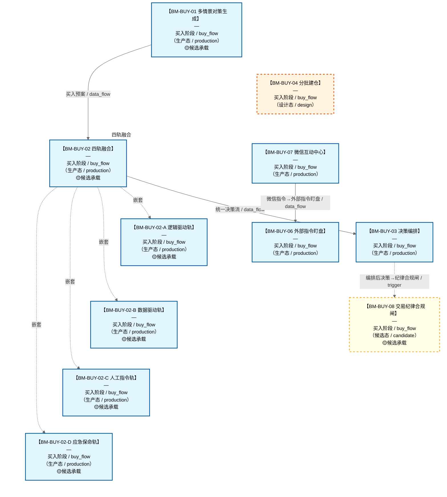

# 作战地图·买入阶段

> **[可缩放 HTML 版 / Zoomable HTML](http://localhost:8765/docs/02_enterprise_architecture/07_trading_decision_architecture/battle_map/_zoomable_html/battle_map_06_buy_flow.html)** — Ctrl+滚轮缩放 ｜ 双击重置 ｜ Ctrl+Shift+D 切换拖动/选择模式

> battle_map §buy_flow 阶段，11 环节。
> 本文档由 `generate_battle_map_diagram.py` 自动生成，禁止手编。

## 文档基本信息 / Document Overview

| 字段 | 值 | Field | Value |
|------|------|-------|-------|
| 阶段 | 买入（buy_flow） | Stage | 买入 |
| 环节数 | 11 | Steps | 11 |
| 流转边 | 12 | Edges | 12 |
| 状态分布 | 🟦 运营态（已建）=9 ｜ 🟧 设计态（待施工）=1 ｜ 🟨 候选态（候选池）=1 | State Distribution | 🟦 运营态（已建）=9 ｜ 🟧 设计态（待施工）=1 ｜ 🟨 候选态（候选池）=1 |

> **图例说明 / Legend**：
> - 🟦 **蓝色实线 = 运营态环节**（production，锚点模块已建）
> - 🟧 **橙色虚线 = 设计态环节**（design，锚点模块待施工）
> - 🟥 **红色 = 弃用态**（deprecated）
> - ⬜ **灰色 = 缺失态**（missing，环节无锚点，BM-INV-001 违例）
> - 🟨 **黄色虚线 = 候选态**（candidate，承载模块在候选池）
> - **实线箭头 ``-->`` = 运营态流转**（两端均 production）
> - **虚线箭头 ``-.->`` = 非运营态流转**（含设计/候选/混合）

## 阶段图 / Stage Diagram

> 展示 买入 阶段全部 11 个环节及流转边，颜色区分五态。

## 环节详情

### BM-BUY-01 多情景对策生成

**6 件套（结构化，DB indicators JSONB）**：

| 要素 | 内容 |
|---|---|
| ① 触发条件 | 次日8态预测就绪 阈值: 7种价格运动情景 |
| ② 消费数据/因子 | 8态预测（来自 BM-SEL-04） 策略工厂策略库（来自 C-006 策略工厂） |
| ③ 参数 | scenario_count=7（范围 5-10，代码当前: 待实现，状态: proposed） |
| ④ 数据流 | 输入: 8态+策略库 → 处理: 多情景对策匹配 → 输出: 买入预案 → 下游: BM-BUY-02 四轨融合 |
| ⑤ 代码映射 | C-005 / 草图§8 L3 层 |
| ⑥ 降级/中止 | C-005 失效 → 降级固定策略查表 |

**锚点（环节↔模块双向关联）**：

| 目标图 | 目标ID | 角色 | 状态快照 | 真实build_status |
|---|---|---|---|---|
| depgraph | MOD-PF-002 | primary | planned | generated |
| depgraph | MOD-L05-001 | supplement | stable | generated |
| candidate | CAND-HARVEST-0015 | supplement | candidate | — |

**有效状态**：🟦 运营态（已建） ｜ **环节自报**：design ｜ **层**：L3 ｜ **阶段**：buy_flow

### BM-BUY-02 四轨融合

**6 件套（结构化，DB indicators JSONB）**：

| 要素 | 内容 |
|---|---|
| ① 触发条件 | 四路信号就绪（逻辑/数据/人工/应急） 阈值: 优先级 应急>人工>自动 |
| ② 消费数据/因子 | 逻辑驱动轨（买入预案）（来自 BM-BUY-01） 数据驱动轨（AI Discovery）（来自 轨道2） 人工指令轨（来自 轨道3） 应急保命轨（来自 轨道4） |
| ③ 参数 | priority_order=应急>人工>自动（范围 -，代码当前: 待实现，状态: proposed） |
| ④ 数据流 | 输入: 四路信号 → 处理: 四轨融合器(MTF)优先级仲裁 → 输出: 统一决策流 → 下游: BM-BUY-03 决策编排 |
| ⑤ 代码映射 | MTF(v8.0) / 草图§1.8 主动脉 |
| ⑥ 降级/中止 | MTF 不可用 → 降级逻辑轨单线决策 |

**锚点（环节↔模块双向关联）**：

| 目标图 | 目标ID | 角色 | 状态快照 | 真实build_status |
|---|---|---|---|---|
| depgraph | MOD-PF-006 | primary | planned | generated |
| candidate | CAND-HARVEST-0926 | supplement | candidate | — |

**有效状态**：🟦 运营态（已建） ｜ **环节自报**：design ｜ **层**：L3 ｜ **阶段**：buy_flow

### BM-BUY-03 决策编排

**6 件套（结构化，DB indicators JSONB）**：

| 要素 | 内容 |
|---|---|
| ① 触发条件 | 统一决策流就绪 阈值: 5条决策路径（买/卖/做T/人工/应急） |
| ② 消费数据/因子 | 统一决策流（来自 BM-BUY-02） |
| ③ 参数 | path_count=5（范围 -，代码当前: 待实现，状态: proposed） |
| ④ 数据流 | 输入: 统一决策流 → 处理: 决策编排器(DO)优先级仲裁+冲突消解+去重+时序编排 → 输出: 编排后决策 → 下游: BM-POS-01 仓位裁决 |
| ⑤ 代码映射 | DO(v8.0) / 草图§1.8 主动脉 |
| ⑥ 降级/中止 | DO 不可用 → 降级直通仓位裁决 |

**锚点（环节↔模块双向关联）**：

| 目标图 | 目标ID | 角色 | 状态快照 | 真实build_status |
|---|---|---|---|---|
| depgraph | MOD-PF-007 | primary | planned | stable |

**有效状态**：🟦 运营态（已建） ｜ **环节自报**：design ｜ **层**：L3 ｜ **阶段**：buy_flow

### BM-BUY-04 分批建仓

**6 件套（结构化，DB indicators JSONB）**：

| 要素 | 内容 |
|---|---|
| ① 触发条件 | 满足2/3（调整周期到位/二次回落/缩量） 阈值: 2/3 |
| ② 消费数据/因子 | §6.6 调整周期进度（来自 BM-SEL-03） §6.7 生命周期阶段（来自 BM-SEL-03） §6.1.3 轮动序列（来自 BM-SEL-03） 量比（来自 BM-SEL-02） C-031 置信度分层(高置信度→激进建仓/低置信度→分批建仓)（来自 C-031(横切)） |
| ③ 参数 | batch_count=2（范围 2-4，代码当前: 待实现，状态: proposed） batch_interval=1交易日（范围 1-3，代码当前: 待实现，状态: proposed） satisfy_threshold=2/3（范围 1/3-3/3，代码当前: 待实现，状态: proposed） confidence_tier_mode=高置信度→激进建仓/低置信度→分批建仓（范围 激进/分批，代码当前: 待实现，状态: proposed） |
| ④ 数据流 | 输入: 进度+阶段+轮动+置信度 → 处理: 分批条件判定+置信度分层调节建仓节奏 → 输出: L3.5 分批仓位方案 → 下游: BM-POS-01 仓位裁决 |
| ⑤ 代码映射 | MOD-待定 / 草图§1.3 v4.1 |
| ⑥ 降级/中止 | 跌破前低 → 暂停后续批次→触发止损评估 |

**锚点（环节↔模块双向关联）**：

| 目标图 | 目标ID | 角色 | 状态快照 | 真实build_status |
|---|---|---|---|---|
| depgraph | MOD-PA-006 | primary | planned | planned |

**有效状态**：🟧 设计态（待施工） ｜ **环节自报**：design ｜ **层**：L3 ｜ **阶段**：buy_flow

### BM-BUY-06 外部指令盯盘

**6 件套（结构化，DB indicators JSONB）**：

| 要素 | 内容 |
|---|---|
| ① 触发条件 | 用户指令到达(微信/前端)，交易时段实时+盘前集合竞价 阈值: 集合竞价09:15-09:25, 连续竞价09:30-15:00 |
| ② 消费数据/因子 | 用户指令(标的+方向+数量+紧急度) 风控减仓名单(BM-EXE-01) C-031置信度(横切) C-047仓位裁决 C-018多账户AUM |
| ③ 参数 | 大额确认阈值=B-013.6（范围 —，代码当前: None，状态: proposed） 集合竞价时段=09:15-09:25（范围 —，代码当前: None，状态: proposed） 连续竞价时段=09:30-15:00（范围 —，代码当前: None，状态: proposed） priority_order=风控>仓位裁决>置信度>执行（范围 —，代码当前: None，状态: proposed） |
| ④ 数据流 | 输入: 用户指令(微信/前端) → 处理: C-013解析→C-004风控→C-047仓位裁决→C-031置信度→C-002执行→C-018多账户分仓 → 输出: 执行结果→微信推送确认 / 拦截结果→微信推送拦截原因 → 下游: 微信推送, C-018多账户分仓 |
| ⑤ 代码映射 | MOD-L08-001 trade_panel / D-TRADING-01/05/06 / §8.4 C-013 外部指令盯盘 |
| ⑥ 降级/中止 | 风控拦截建仓 或 C-047未就绪 → 风控拦截→通知用户拦截原因(C-004优先级>用户指令)；C-047未就绪→跳过仓位裁决按原始目标执行 |

**锚点（环节↔模块双向关联）**：

| 目标图 | 目标ID | 角色 | 状态快照 | 真实build_status |
|---|---|---|---|---|
| depgraph | MOD-L08-001 | primary | stable | generated |

**有效状态**：🟦 运营态（已建） ｜ **环节自报**：design ｜ **层**：横切 ｜ **阶段**：buy_flow

### BM-BUY-07 微信互动中心

**6 件套（结构化，DB indicators JSONB）**：

| 要素 | 内容 |
|---|---|
| ① 触发条件 | 用户微信消息（实时） 阈值: 实时 |
| ② 消费数据/因子 | 用户指令（自然语言） |
| ③ 参数 | parse_mode=自然语言解析（范围 自然语言/结构化，代码当前: None，状态: proposed） notify_list=多人通知列表（范围 —，代码当前: None，状态: proposed） |
| ④ 数据流 | 输入: 用户微信消息 → 处理: D-TRADING-06 解析/路由 → 输出: 标准指令 → 下游: BM-BUY-06外部指令盯盘→执行结果→微信推送 |
| ⑤ 代码映射 | D-TRADING-06 / C-019 微信多人互动 |
| ⑥ 降级/中止 | 微信API不可用 → 前端/其他通道接收指令 |

**锚点（环节↔模块双向关联）**：

| 目标图 | 目标ID | 角色 | 状态快照 | 真实build_status |
|---|---|---|---|---|
| depgraph | MOD-INF-039 | supplement | planned | generated |

**有效状态**：🟦 运营态（已建） ｜ **环节自报**：design ｜ **层**：横切 ｜ **阶段**：buy_flow

### BM-BUY-08 交易纪律合规闸

**6 件套（结构化，DB indicators JSONB）**：

| 要素 | 内容 |
|---|---|
| ① 触发条件 | 买入决策形成后/分批建仓每批下单前 阈值: 四项严禁任一触发即拦截 |
| ② 消费数据/因子 | 编排后决策（来自 BM-BUY-03） C-004 风控信号(价格偏离度/持仓亏损/风险敞口/交易频率)（来自 BM-EXE-01/C-004） 持仓状态（来自 BM-POS-01） C-031 置信度分层（来自 C-031(横切)） |
| ③ 参数 | chase_high_threshold=价格追涨幅度阈值(踏空追高)（范围 —，代码当前: 待实现，状态: proposed） avg_down_loss_threshold=-5%(持仓亏损后继续加仓同标的=被套补仓)（范围 -3%~-8%，代码当前: 待实现，状态: proposed） revenge_loss_threshold=-2%(当日亏损后交易频率/单笔规模异常增加=亏损报复)（范围 -1%~-3%，代码当前: 待实现，状态: proposed） pride_consecutive_wins=连续盈利N笔后单笔风险敞口超常规(盈利骄傲)（范围 N=3~5，代码当前: 待实现，状态: proposed） |
| ④ 数据流 | 输入: 编排后决策+风控信号+持仓状态+置信度 → 处理: 四项严禁检测(①踏空追高拒绝 ②被套补仓拒绝 ③盈利骄傲告警 ④亏损报复停盘) → 输出: 合规通过→放行 / 违规→Hard Block拦截或Warning推送 → 下游: BM-EXE-01 风控执行 |
| ⑤ 代码映射 | D-COMPLIANCE-23(CAND-HARVEST-0169,未开发) / 18-D-TRADING §7.1.2 / A6§12.2.2 |
| ⑥ 降级/中止 | D-COMPLIANCE-23未开发 → 降级由C-004(BM-EXE-01)代管四项严禁检测 |

**锚点（环节↔模块双向关联）**：

| 目标图 | 目标ID | 角色 | 状态快照 | 真实build_status |
|---|---|---|---|---|
| candidate | CAND-HARVEST-0169 | primary | candidate | — |

**有效状态**：🟨 候选态（候选池） ｜ **环节自报**：design ｜ **层**：L3 ｜ **阶段**：buy_flow

### BM-BUY-02-A 逻辑驱动轨

**6 件套（结构化，DB indicators JSONB）**：

| 要素 | 内容 |
|---|---|
| ① 触发条件 | — |
| ② 消费数据/因子 | — |
| ③ 参数 | — |
| ④ 数据流 | 输入: — → 处理: — → 输出: — → 下游: — |
| ⑤ 代码映射 | — / — |
| ⑥ 降级/中止 | — |

**锚点**：⚠ 无（BM-INV-001 君子协定违例——环节无锚点=悬空决策）

**有效状态**：🟦 运营态（已建） ｜ **环节自报**：production ｜ **层**：L3 ｜ **阶段**：buy_flow

### BM-BUY-02-B 数据驱动轨

**6 件套（结构化，DB indicators JSONB）**：

| 要素 | 内容 |
|---|---|
| ① 触发条件 | — |
| ② 消费数据/因子 | — |
| ③ 参数 | — |
| ④ 数据流 | 输入: — → 处理: — → 输出: — → 下游: — |
| ⑤ 代码映射 | — / — |
| ⑥ 降级/中止 | — |

**锚点**：⚠ 无（BM-INV-001 君子协定违例——环节无锚点=悬空决策）

**有效状态**：🟦 运营态（已建） ｜ **环节自报**：design ｜ **层**：L3 ｜ **阶段**：buy_flow

### BM-BUY-02-C 人工指令轨

**6 件套（结构化，DB indicators JSONB）**：

| 要素 | 内容 |
|---|---|
| ① 触发条件 | — |
| ② 消费数据/因子 | — |
| ③ 参数 | — |
| ④ 数据流 | 输入: — → 处理: — → 输出: — → 下游: — |
| ⑤ 代码映射 | — / — |
| ⑥ 降级/中止 | — |

**锚点**：⚠ 无（BM-INV-001 君子协定违例——环节无锚点=悬空决策）

**有效状态**：🟦 运营态（已建） ｜ **环节自报**：production ｜ **层**：L3 ｜ **阶段**：buy_flow

### BM-BUY-02-D 应急保命轨

**6 件套（结构化，DB indicators JSONB）**：

| 要素 | 内容 |
|---|---|
| ① 触发条件 | — |
| ② 消费数据/因子 | — |
| ③ 参数 | — |
| ④ 数据流 | 输入: — → 处理: — → 输出: — → 下游: — |
| ⑤ 代码映射 | — / — |
| ⑥ 降级/中止 | — |

**锚点**：⚠ 无（BM-INV-001 君子协定违例——环节无锚点=悬空决策）

**有效状态**：🟦 运营态（已建） ｜ **环节自报**：production ｜ **层**：L3 ｜ **阶段**：buy_flow

[← 返回总指挥图](battle_map_panorama.md)