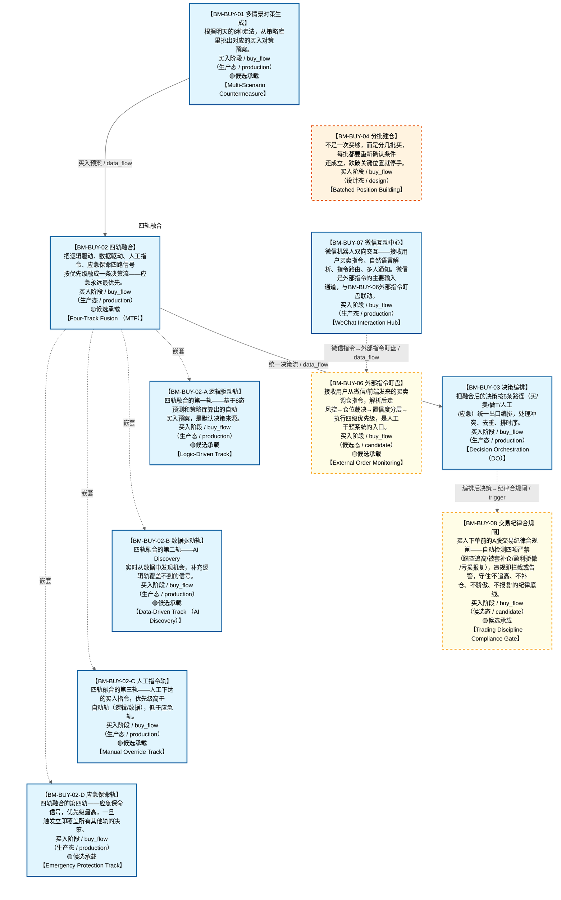

# 作战地图·买入阶段

> **[可缩放 HTML 版 / Zoomable HTML](http://localhost:8765/docs/02_enterprise_architecture/07_trading_decision_architecture/battle_map/_zoomable_html/battle_map_06_buy_flow.html)** — Ctrl+滚轮缩放 ｜ 双击重置 ｜ Ctrl+Shift+D 切换拖动/选择模式

> battle_map §buy_flow 阶段，11 环节。
> 本文档由 `generate_battle_map_diagram.py` 自动生成，禁止手编。

## 文档基本信息 / Document Overview

| 字段 | 值 | Field | Value |
|------|------|-------|-------|
| 阶段 | 买入（buy_flow） | Stage | 买入 |
| 环节数 | 11 | Steps | 11 |
| 流转边 | 12 | Edges | 12 |
| 状态分布 | 🟦 运营态（已建）=8 ｜ 🟨 候选态（候选池）=2 ｜ 🟧 设计态（待施工）=1 | State Distribution | 🟦 运营态（已建）=8 ｜ 🟨 候选态（候选池）=2 ｜ 🟧 设计态（待施工）=1 |

> **图例说明 / Legend**：
> - 🟦 **蓝色实线 = 运营态环节**（production，锚点模块已建）
> - 🟧 **橙色虚线 = 设计态环节**（design，锚点模块待施工）
> - 🟥 **红色 = 弃用态**（deprecated）
> - ⬜ **灰色 = 缺失态**（missing，环节无锚点，BM-INV-001 违例）
> - 🟨 **黄色虚线 = 候选态**（candidate，承载模块在候选池）
> - **实线箭头 ``-->`` = 运营态流转**（两端均 production）
> - **虚线箭头 ``-.->`` = 非运营态流转**（含设计/候选/混合）

## 阶段图 / Stage Diagram

> 展示 买入 阶段全部 11 个环节及流转边，颜色区分五态。

## 环节详情

### BM-BUY-01 多情景对策生成 / Multi-Scenario Countermeasure

> **大白话**：根据明天的8种走法，从策略库里挑出对应的买入对策预案。

**机制说明**：

L3 层。C-005 多情景对策，基于次日 8 态预测匹配 7 种价格运动情景，结合 C-006 策略工厂策略库生成买入预案。是四轨融合器逻辑驱动轨的输入。

**6 件套（结构化，DB indicators JSONB）**：

| 要素 | 内容 |
|---|---|
| ① 触发条件 | 次日8态预测就绪 阈值: 7种价格运动情景 |
| ② 消费数据/因子 | 8态预测（来自 BM-SEL-04） 策略工厂策略库（来自 C-006 策略工厂） |
| ③ 参数 | scenario_count=7（范围 5-10，代码当前: 待实现，状态: proposed） |
| ④ 数据流 | 输入: 8态+策略库 → 处理: 多情景对策匹配 → 输出: 买入预案 → 下游: BM-BUY-02 四轨融合 |
| ⑤ 代码映射 | C-005 / 草图§8 L3 层 |
| ⑥ 降级/中止 | C-005 失效 → 降级固定策略查表 |

**指标文案（翻译真源 indicators_zh）**：

①触发：8态预测就绪；②消费：BM-SEL-04 8态 + C-006 策略库；③参数：scenario_count=7；④数据流：8态+策略库→多情景对策→买入预案→BM-BUY-02；⑤代码：C-005 L3 层；⑥降级：C-005 失效→固定策略查表。

**锚点（环节↔模块双向关联）**：

| 目标图 | 目标ID | 角色 | 状态快照 | 真实build_status |
|---|---|---|---|---|
| depgraph | MOD-PF-002 | primary | planned | generated |
| depgraph | MOD-L05-001 | supplement | stable | stable |
| candidate | CAND-HARVEST-0015 | supplement | candidate | — |

**有效状态**：🟦 运营态（已建） ｜ **环节自报**：design ｜ **层**：L3 ｜ **阶段**：buy_flow

### BM-BUY-02 四轨融合 / Four-Track Fusion (MTF)

> **大白话**：把逻辑驱动、数据驱动、人工指令、应急保命四路信号按优先级融成一条决策流——应急永远最优先。

**机制说明**：

L3 层 v8.0。四轨融合器(MTF)嵌入 C-005 和决策编排器之间，将逻辑驱动轨+数据驱动轨(AI Discovery)+人工指令轨+应急保命轨四路信号融合为统一决策流，优先级 应急>人工>自动。

**6 件套（结构化，DB indicators JSONB）**：

| 要素 | 内容 |
|---|---|
| ① 触发条件 | 四路信号就绪（逻辑/数据/人工/应急） 阈值: 优先级 应急>人工>自动 |
| ② 消费数据/因子 | 逻辑驱动轨（买入预案）（来自 BM-BUY-01） 数据驱动轨（AI Discovery）（来自 轨道2） 人工指令轨（来自 轨道3） 应急保命轨（来自 轨道4） |
| ③ 参数 | priority_order=应急>人工>自动（范围 -，代码当前: 待实现，状态: proposed） |
| ④ 数据流 | 输入: 四路信号 → 处理: 四轨融合器(MTF)优先级仲裁 → 输出: 统一决策流 → 下游: BM-BUY-03 决策编排 |
| ⑤ 代码映射 | MTF(v8.0) / 草图§1.8 主动脉 |
| ⑥ 降级/中止 | MTF 不可用 → 降级逻辑轨单线决策 |

**指标文案（翻译真源 indicators_zh）**：

①触发：四路信号就绪；②消费：BM-BUY-01 逻辑轨 + 轨道2/3/4；③参数：priority_order=应急>人工>自动；④数据流：四路信号→MTF优先级仲裁→统一决策流→BM-BUY-03；⑤代码：MTF(v8.0) §1.8；⑥降级：MTF 不可用→逻辑轨单线决策。

**锚点（环节↔模块双向关联）**：

| 目标图 | 目标ID | 角色 | 状态快照 | 真实build_status |
|---|---|---|---|---|
| depgraph | MOD-PF-006 | primary | planned | generated |
| candidate | CAND-HARVEST-0926 | supplement | candidate | — |

**有效状态**：🟦 运营态（已建） ｜ **环节自报**：design ｜ **层**：L3 ｜ **阶段**：buy_flow

### BM-BUY-03 决策编排 / Decision Orchestration (DO)

> **大白话**：把融合后的决策按5条路径（买/卖/做T/人工/应急）统一出口编排，处理冲突、去重、排时序。

**机制说明**：

L3 层 v8.0。决策编排器(DO)嵌入四轨融合器和 C-047 之间，作为 5 条决策路径的统一出口，执行优先级仲裁+冲突消解+去重+时序编排。

**6 件套（结构化，DB indicators JSONB）**：

| 要素 | 内容 |
|---|---|
| ① 触发条件 | 统一决策流就绪 阈值: 5条决策路径（买/卖/做T/人工/应急） |
| ② 消费数据/因子 | 统一决策流（来自 BM-BUY-02） |
| ③ 参数 | path_count=5（范围 -，代码当前: 待实现，状态: proposed） |
| ④ 数据流 | 输入: 统一决策流 → 处理: 决策编排器(DO)优先级仲裁+冲突消解+去重+时序编排 → 输出: 编排后决策 → 下游: BM-POS-01 仓位裁决 |
| ⑤ 代码映射 | DO(v8.0) / 草图§1.8 主动脉 |
| ⑥ 降级/中止 | DO 不可用 → 降级直通仓位裁决 |

**指标文案（翻译真源 indicators_zh）**：

①触发：统一决策流就绪；②消费：BM-BUY-02 统一决策流；③参数：path_count=5；④数据流：统一决策流→DO 仲裁/消解/去重/时序→编排后决策→BM-POS-01；⑤代码：DO(v8.0) §1.8；⑥降级：DO 不可用→直通仓位裁决。

**锚点（环节↔模块双向关联）**：

| 目标图 | 目标ID | 角色 | 状态快照 | 真实build_status |
|---|---|---|---|---|
| depgraph | MOD-PF-007 | primary | planned | stable |

**有效状态**：🟦 运营态（已建） ｜ **环节自报**：design ｜ **层**：L3 ｜ **阶段**：buy_flow

### BM-BUY-04 分批建仓 / Batched Position Building

> **大白话**：不是一次买够，而是分几批买，每批都要重新确认条件还成立，跌破关键位置就停手。

**机制说明**：

分批建仓环节把单次买入拆成 N 批，每批买入前重新校验触发条件（满足 M/N 阈值）。
目的是降低择时风险——避免一次性在错误时点满仓。每批之间留间隔（默认 1 交易日），
让市场给出二次确认。任一批次触发降级条件（如跌破前低）则暂停后续批次并进入止损评估。

**6 件套（结构化，DB indicators JSONB）**：

| 要素 | 内容 |
|---|---|
| ① 触发条件 | 满足2/3（调整周期到位/二次回落/缩量） 阈值: 2/3 |
| ② 消费数据/因子 | §6.6 调整周期进度（来自 BM-SEL-03） §6.7 生命周期阶段（来自 BM-SEL-03） §6.1.3 轮动序列（来自 BM-SEL-03） 量比（来自 BM-SEL-02） C-031 置信度分层(高置信度→激进建仓/低置信度→分批建仓)（来自 C-031(横切)） |
| ③ 参数 | batch_count=2（范围 2-4，代码当前: 待实现，状态: proposed） batch_interval=1交易日（范围 1-3，代码当前: 待实现，状态: proposed） satisfy_threshold=2/3（范围 1/3-3/3，代码当前: 待实现，状态: proposed） confidence_tier_mode=高置信度→激进建仓/低置信度→分批建仓（范围 激进/分批，代码当前: 待实现，状态: proposed） |
| ④ 数据流 | 输入: 进度+阶段+轮动+置信度 → 处理: 分批条件判定+置信度分层调节建仓节奏 → 输出: L3.5 分批仓位方案 → 下游: BM-POS-01 仓位裁决 |
| ⑤ 代码映射 | MOD-待定 / 草图§1.3 v4.1 |
| ⑥ 降级/中止 | 跌破前低 → 暂停后续批次→触发止损评估 |

**指标文案（翻译真源 indicators_zh）**：

①触发：满足 2/3（调整周期到位 / 二次回落 / 缩量）才放行下一批；
②消费：§6.6 建仓进度、§6.7 阶段判定、§6.1.3 轮动序列、量比、C-031 置信度分层；
③参数：分批数=2（可配 2-4）、间隔=1 交易日、满足阈值=2/3、置信度分层模式=高置信度→激进建仓/低置信度→分批建仓；
④数据流：进度+阶段+轮动+置信度→条件判定+置信度调节建仓节奏→L3.5 仓位决策→L4 执行；
⑤代码映射：MOD-xxx / src/zephyr/.../xxx.py；
⑥降级：跌破前低→暂停后续批次→止损评估。

**锚点（环节↔模块双向关联）**：

| 目标图 | 目标ID | 角色 | 状态快照 | 真实build_status |
|---|---|---|---|---|
| depgraph | MOD-PA-006 | primary | planned | planned |

**有效状态**：🟧 设计态（待施工） ｜ **环节自报**：design ｜ **层**：L3 ｜ **阶段**：buy_flow

### BM-BUY-06 外部指令盯盘 / External Order Monitoring

> **大白话**：接收用户从微信/前端发来的买卖调仓指令，解析后走风控→仓位裁决→置信度分层→执行四级优先级，是人工干预系统的入口。

**机制说明**：

§8.4 C-013 外部指令盯盘。数据流：用户指令(微信/前端)→C-013指令解析→C-004风控检查→C-047仓位裁决→C-031置信度分层→C-002执行。
输入：用户买入/卖出/调仓指令(标的代码+方向+数量+紧急程度)。
处理规则：C-013解析用户意图→转化为标准交易指令；C-004风控检查(标的在风控减仓名单→拦截建仓→通知用户)；C-031置信度分层(大额下单需人工确认B-013.6)；通过检查→C-002执行。
与C-004/C-047/C-031四级优先级：1风控(C-004硬阻断)>2仓位裁决(C-047裁决实际下单量)>3置信度分层(C-031影响建仓节奏)>4执行(C-013)。
C-047未就绪降级：跳过仓位裁决，按原始目标参数执行，日志标记"仓位裁决跳过"。
多账户分仓(C-018/D-TRADING-05)：外部指令按AUM分仓到多账户，独立风控/独立PnL/独立报告(同信任域非多租户)。
微信双向互动(C-019/D-TRADING-06)：微信是外部指令主要输入通道，支持指令路由/自然语言解析/多人通知，与C-013联动。
输出：执行结果→微信推送确认 / 拦截结果→微信推送拦截原因。
运行时间：交易时段(09:30-15:00)实时接收；盘前(09:15-09:25)仅接受集合竞价指令。
与§16冲突矩阵关系：C-004风控拦截 vs C-013外部指令→风控>用户指令(C-004优先)。

**6 件套（结构化，DB indicators JSONB）**：

| 要素 | 内容 |
|---|---|
| ① 触发条件 | 用户指令到达(微信/前端)，交易时段实时+盘前集合竞价 阈值: 集合竞价09:15-09:25, 连续竞价09:30-15:00 |
| ② 消费数据/因子 | 用户指令(标的+方向+数量+紧急度) 风控减仓名单(BM-EXE-01) C-031置信度(横切) C-047仓位裁决 C-018多账户AUM |
| ③ 参数 | 大额确认阈值=B-013.6（范围 —，代码当前: None，状态: proposed） 集合竞价时段=09:15-09:25（范围 —，代码当前: None，状态: proposed） 连续竞价时段=09:30-15:00（范围 —，代码当前: None，状态: proposed） priority_order=风控>仓位裁决>置信度>执行（范围 —，代码当前: None，状态: proposed） |
| ④ 数据流 | 输入: 用户指令(微信/前端) → 处理: C-013解析→C-004风控→C-047仓位裁决→C-031置信度→C-002执行→C-018多账户分仓 → 输出: 执行结果→微信推送确认 / 拦截结果→微信推送拦截原因 → 下游: 微信推送, C-018多账户分仓 |
| ⑤ 代码映射 | MOD-L08-001 trade_panel / D-TRADING-01/05/06 / §8.4 C-013 外部指令盯盘 |
| ⑥ 降级/中止 | 风控拦截建仓 或 C-047未就绪 → 风控拦截→通知用户拦截原因(C-004优先级>用户指令)；C-047未就绪→跳过仓位裁决按原始目标执行 |

**指标文案（翻译真源 indicators_zh）**：

①触发：用户指令到达(微信/前端)，交易时段实时+盘前集合竞价；②消费：用户指令(标的+方向+数量+紧急度)+风控减仓名单(BM-EXE-01)+C-031置信度(横切)+C-047仓位裁决+C-018多账户AUM；③参数：大额确认阈值B-013.6、集合竞价09:15-09:25、连续竞价09:30-15:00、priority_order=风控>仓位裁决>置信度>执行(proposed)；④数据流：用户指令→C-013解析→C-004风控→C-047仓位裁决→C-031置信度→C-002执行→C-018多账户分仓→微信推送；⑤代码：MOD-L08-001 trade_panel(stable，前端入口)、D-TRADING-01/05/06(未开发)；⑥降级：风控拦截建仓→通知用户拦截原因(C-004优先级>用户指令)，C-047未就绪→跳过仓位裁决按原始目标执行。

**锚点（环节↔模块双向关联）**：

| 目标图 | 目标ID | 角色 | 状态快照 | 真实build_status |
|---|---|---|---|---|
| candidate | CAND-HARVEST-0017 | primary | candidate | — |

**有效状态**：🟨 候选态（候选池） ｜ **环节自报**：design ｜ **层**：横切 ｜ **阶段**：buy_flow

### BM-BUY-07 微信互动中心 / WeChat Interaction Hub

> **大白话**：微信机器人双向交互——接收用户买卖指令、自然语言解析、指令路由、多人通知。微信是外部指令的主要输入通道，与BM-BUY-06外部指令盯盘联动。

**机制说明**：

L3/决策层。C-019●核心微信多人互动(D-TRADING-06)。微信机器人双向交互/指令路由/自然语言解析/多人通知。
与C-013联动：微信是外部指令的主要输入通道，用户微信消息→自然语言解析→标准指令→BM-BUY-06外部指令盯盘。
输出：执行结果→微信推送确认 / 拦截结果→微信推送拦截原因 / 多人通知（多人订阅同一策略）。

**6 件套（结构化，DB indicators JSONB）**：

| 要素 | 内容 |
|---|---|
| ① 触发条件 | 用户微信消息（实时） 阈值: 实时 |
| ② 消费数据/因子 | 用户指令（自然语言） |
| ③ 参数 | parse_mode=自然语言解析（范围 自然语言/结构化，代码当前: None，状态: proposed） notify_list=多人通知列表（范围 —，代码当前: None，状态: proposed） |
| ④ 数据流 | 输入: 用户微信消息 → 处理: D-TRADING-06 解析/路由 → 输出: 标准指令 → 下游: BM-BUY-06外部指令盯盘→执行结果→微信推送 |
| ⑤ 代码映射 | D-TRADING-06 / C-019 微信多人互动 |
| ⑥ 降级/中止 | 微信API不可用 → 前端/其他通道接收指令 |

**指标文案（翻译真源 indicators_zh）**：

①触发：用户微信消息（实时）；②消费：用户指令（自然语言）；③参数：parse_mode=自然语言解析、notify_list=多人通知列表；④数据流：用户微信消息→D-TRADING-06 解析/路由→标准指令→BM-BUY-06外部指令盯盘→执行结果→微信推送；⑤代码：D-TRADING-06(未开发)、C-019；⑥降级：微信API不可用→前端/其他通道接收指令。

**锚点（环节↔模块双向关联）**：

| 目标图 | 目标ID | 角色 | 状态快照 | 真实build_status |
|---|---|---|---|---|
| depgraph | MOD-INF-039 | supplement | planned | generated |

**有效状态**：🟦 运营态（已建） ｜ **环节自报**：design ｜ **层**：横切 ｜ **阶段**：buy_flow

### BM-BUY-08 交易纪律合规闸 / Trading Discipline Compliance Gate

> **大白话**：买入下单前的A股交易纪律合规闸——自动检测四项严禁（踏空追高/被套补仓/盈利骄傲/亏损报复），违规即拦截或告警，守住"不追高、不补仓、不骄傲、不报复"的纪律底线。

**机制说明**：

§7.1.2 A股交易纪律四项严禁自动化检测（源自A6§12.2.2，由 D-COMPLIANCE-23 A-Share Trading Discipline Checker 执行，未开发时由 C-004 代管）。
四项严禁：①踏空追高——价格追涨幅度超阈值+买入在急剧拉升后→C-004 价格偏离度检测→Hard Block 拒绝追高买入；②被套补仓——持仓亏损>X%(建议-5%)后继续加仓同标的→C-004 持仓亏损+同标的加仓检测→Hard Block 拒绝补仓；③盈利骄傲——连续盈利N笔后单笔风险敞口超常规→C-004 风险敞口变化率检测→Warning 推送；④亏损报复——当日亏损>Y%(建议-2%)后交易频率/单笔规模异常增加→C-004 交易行为异常检测→Hard Block 触发强制停盘(Kill Switch 轻量版)。
定位：买入决策形成后/分批建仓每批下单前的合规闸，位于 BM-BUY-03 决策编排之后、BM-EXE-01 风控执行之前。纪律检查是辅助工具，最终纪律责任归人类交易者。

**6 件套（结构化，DB indicators JSONB）**：

| 要素 | 内容 |
|---|---|
| ① 触发条件 | 买入决策形成后/分批建仓每批下单前 阈值: 四项严禁任一触发即拦截 |
| ② 消费数据/因子 | 编排后决策（来自 BM-BUY-03） C-004 风控信号(价格偏离度/持仓亏损/风险敞口/交易频率)（来自 BM-EXE-01/C-004） 持仓状态（来自 BM-POS-01） C-031 置信度分层（来自 C-031(横切)） |
| ③ 参数 | chase_high_threshold=价格追涨幅度阈值(踏空追高)（范围 —，代码当前: 待实现，状态: proposed） avg_down_loss_threshold=-5%(持仓亏损后继续加仓同标的=被套补仓)（范围 -3%~-8%，代码当前: 待实现，状态: proposed） revenge_loss_threshold=-2%(当日亏损后交易频率/单笔规模异常增加=亏损报复)（范围 -1%~-3%，代码当前: 待实现，状态: proposed） pride_consecutive_wins=连续盈利N笔后单笔风险敞口超常规(盈利骄傲)（范围 N=3~5，代码当前: 待实现，状态: proposed） |
| ④ 数据流 | 输入: 编排后决策+风控信号+持仓状态+置信度 → 处理: 四项严禁检测(①踏空追高拒绝 ②被套补仓拒绝 ③盈利骄傲告警 ④亏损报复停盘) → 输出: 合规通过→放行 / 违规→Hard Block拦截或Warning推送 → 下游: BM-EXE-01 风控执行 |
| ⑤ 代码映射 | D-COMPLIANCE-23(CAND-HARVEST-0169,未开发) / 18-D-TRADING §7.1.2 / A6§12.2.2 |
| ⑥ 降级/中止 | D-COMPLIANCE-23未开发 → 降级由C-004(BM-EXE-01)代管四项严禁检测 |

**指标文案（翻译真源 indicators_zh）**：

①触发：买入决策形成后/分批建仓每批下单前；②消费：编排后决策(BM-BUY-03)+C-004风控信号(价格偏离度/持仓亏损/风险敞口/交易频率)+持仓状态(BM-POS-01)+C-031置信度分层；③参数：追涨幅度阈值、被套补仓亏损阈值-5%(-3%~-8%)、亏损报复阈值-2%(-1%~-3%)、连续盈利N笔N=3~5(proposed)；④数据流：编排后决策+风控信号+持仓+置信度→四项严禁检测→合规通过放行/违规Hard Block拦截或Warning→BM-EXE-01风控执行；⑤代码：D-COMPLIANCE-23 A-Share Trading Discipline Checker(CAND-HARVEST-0169,未开发)、C-004代管；⑥降级：D-COMPLIANCE-23未开发→由C-004(BM-EXE-01)代管四项严禁检测。

**锚点（环节↔模块双向关联）**：

| 目标图 | 目标ID | 角色 | 状态快照 | 真实build_status |
|---|---|---|---|---|
| candidate | CAND-HARVEST-0169 | primary | candidate | — |

**有效状态**：🟨 候选态（候选池） ｜ **环节自报**：design ｜ **层**：L3 ｜ **阶段**：buy_flow

### BM-BUY-02-A 逻辑驱动轨 / Logic-Driven Track

> **大白话**：四轨融合的第一轨——基于8态预测和策略库算出的自动买入预案，是默认决策来源。

**机制说明**：

BM-BUY-02 四轨融合的子环节（depth=1）。逻辑驱动轨接收 BM-BUY-01 多情景对策生成的买入预案，
基于次日 8 态预测匹配价格运动情景，结合 C-006 策略工厂策略库生成结构化买入信号。
在四轨中优先级最低（自动档），当无人工指令和应急信号时由本轨主导决策。

**6 件套（结构化，DB indicators JSONB）**：

| 要素 | 内容 |
|---|---|
| ① 触发条件 | — |
| ② 消费数据/因子 | — |
| ③ 参数 | — |
| ④ 数据流 | 输入: — → 处理: — → 输出: — → 下游: — |
| ⑤ 代码映射 | — / — |
| ⑥ 降级/中止 | — |

**指标文案（翻译真源 indicators_zh）**：

①触发：BM-BUY-01 买入预案就绪；②消费：BM-BUY-01 多情景对策 + C-006 策略库；
③参数：scenario_count=7、priority=auto（最低）；④数据流：8态+策略库→买入预案→逻辑轨信号→MTF 仲裁；
⑤代码：C-005 L3 层；⑥降级：C-005 失效→固定策略查表。

**锚点**：⚠ 无（BM-INV-001 君子协定违例——环节无锚点=悬空决策）

**有效状态**：🟦 运营态（已建） ｜ **环节自报**：production ｜ **层**：L3 ｜ **阶段**：buy_flow

### BM-BUY-02-B 数据驱动轨 / Data-Driven Track (AI Discovery)

> **大白话**：四轨融合的第二轨——AI Discovery 实时从数据中发现机会，补充逻辑轨覆盖不到的信号。

**机制说明**：

BM-BUY-02 四轨融合的子环节（depth=1）。数据驱动轨由 AI Discovery 模块驱动，
基于实时量能、因子突变、分布特征工程等数据信号发现交易机会，与逻辑驱动轨并行运行。
优先级与逻辑轨同级（自动档），两轨信号在 MTF 中合并去重后输出。

**6 件套（结构化，DB indicators JSONB）**：

| 要素 | 内容 |
|---|---|
| ① 触发条件 | — |
| ② 消费数据/因子 | — |
| ③ 参数 | — |
| ④ 数据流 | 输入: — → 处理: — → 输出: — → 下游: — |
| ⑤ 代码映射 | — / — |
| ⑥ 降级/中止 | — |

**指标文案（翻译真源 indicators_zh）**：

①触发：实时数据信号（量能/因子突变）；②消费：BM-SEL-02 因子池 + 量能/分布特征；
③参数：discovery_mode=AI、priority=auto；④数据流：因子+量能→AI Discovery→数据轨信号→MTF 仲裁；
⑤代码：轨道2 AI Discovery；⑥降级：AI Discovery 不可用→仅逻辑轨单线决策。

**锚点**：⚠ 无（BM-INV-001 君子协定违例——环节无锚点=悬空决策）

**有效状态**：🟦 运营态（已建） ｜ **环节自报**：design ｜ **层**：L3 ｜ **阶段**：buy_flow

### BM-BUY-02-C 人工指令轨 / Manual Override Track

> **大白话**：四轨融合的第三轨——人工下达的买入指令，优先级高于自动轨（逻辑/数据），低于应急轨。

**机制说明**：

BM-BUY-02 四轨融合的子环节（depth=1）。人工指令轨接收交易员通过前端下达的买入指令，
在 MTF 仲裁中优先级高于逻辑轨和数据轨（自动档），低于应急保命轨。
人工指令一旦下达即覆盖自动轨决策，但会被应急信号覆盖。用于人工干预和策略微调。

**6 件套（结构化，DB indicators JSONB）**：

| 要素 | 内容 |
|---|---|
| ① 触发条件 | — |
| ② 消费数据/因子 | — |
| ③ 参数 | — |
| ④ 数据流 | 输入: — → 处理: — → 输出: — → 下游: — |
| ⑤ 代码映射 | — / — |
| ⑥ 降级/中止 | — |

**指标文案（翻译真源 indicators_zh）**：

①触发：人工下达买入指令；②消费：前端指令输入 + 用户策略配置；
③参数：priority=manual（高于 auto，低于 emergency）；④数据流：前端指令→人工轨信号→MTF 仲裁（覆盖自动轨）；
⑤代码：轨道3 人工指令接口；⑥降级：无降级（人工指令为终态决策，仅被应急覆盖）。

**锚点**：⚠ 无（BM-INV-001 君子协定违例——环节无锚点=悬空决策）

**有效状态**：🟦 运营态（已建） ｜ **环节自报**：production ｜ **层**：L3 ｜ **阶段**：buy_flow

### BM-BUY-02-D 应急保命轨 / Emergency Protection Track

> **大白话**：四轨融合的第四轨——应急保命信号，优先级最高，一旦触发立即覆盖所有其他轨的决策。

**机制说明**：

BM-BUY-02 四轨融合的子环节（depth=1）。应急保命轨监听风控止损、极端行情、系统故障等应急信号，
在 MTF 仲裁中优先级最高（应急>人工>自动）。一旦触发，立即覆盖逻辑轨/数据轨/人工轨的决策，
执行保命操作（如紧急卖出、暂停买入、清仓等）。是资金安全的最后一道防线。

**6 件套（结构化，DB indicators JSONB）**：

| 要素 | 内容 |
|---|---|
| ① 触发条件 | — |
| ② 消费数据/因子 | — |
| ③ 参数 | — |
| ④ 数据流 | 输入: — → 处理: — → 输出: — → 下游: — |
| ⑤ 代码映射 | — / — |
| ⑥ 降级/中止 | — |

**指标文案（翻译真源 indicators_zh）**：

①触发：风控止损 / 极端行情 / 系统故障；②消费：风控模块信号 + 极端行情检测；
③参数：priority=emergency（最高）；④数据流：应急信号→应急轨→MTF 仲裁（覆盖所有其他轨）→紧急操作；
⑤代码：轨道4 应急保命模块；⑥降级：无降级（应急为最高优先级终态决策）。

**锚点**：⚠ 无（BM-INV-001 君子协定违例——环节无锚点=悬空决策）

**有效状态**：🟦 运营态（已建） ｜ **环节自报**：production ｜ **层**：L3 ｜ **阶段**：buy_flow

[← 返回总指挥图](battle_map_panorama.md)