# 作战地图·买入阶段

> **[可缩放 HTML 版 / Zoomable HTML](http://localhost:8765/docs/02_enterprise_architecture/07_trading_decision_architecture/battle_map/_zoomable_html/battle_map_06_buy_flow.html)** — Ctrl+滚轮缩放 ｜ 双击重置 ｜ Ctrl+Shift+D 切换拖动/选择模式

> battle_map §buy_flow 阶段，25 环节（33 锚点）。
> 🔑 锚点表 `battle_map_anchors` 是环节↔模块**双向对齐枢纽**（step↔module 唯一查找真源），详见各环节「锚点」小节。
> 本文档由 `generate_battle_map_diagram.py` 自动生成，禁止手编。

## 文档基本信息 / Document Overview

| 字段 | 值 | Field | Value |
|------|------|-------|-------|
| 阶段 | 买入（buy_flow） | Stage | 买入 |
| 环节数 | 25 | Steps | 25 |
| 锚点数（双向对齐） | 33 | Anchors (Bidirectional) | 33 |
| 流转边 | 12 | Edges | 12 |
| 状态分布 | 🟧 设计态（待施工）=18 ｜ 🟦 运营态（已建）=6 ｜ 🟨 候选态（候选池）=1 | State Distribution | 🟧 设计态（待施工）=18 ｜ 🟦 运营态（已建）=6 ｜ 🟨 候选态（候选池）=1 |

> **图例说明 / Legend**：
> - 🟦 **蓝色实线 = 运营态环节**（production，锚点模块已建）
> - 🟧 **橙色虚线 = 设计态环节**（design，锚点模块待施工）
> - 🟧**设计态子环节** = 父环节已建但此子环节待施工（特殊标记，易被忽略）
> - 🟥 **红色 = 弃用态**（deprecated）
> - ⬜ **灰色 = 缺失态**（missing，环节无锚点，BM-INV-001 违例）
> - 🟨 **黄色虚线 = 候选态**（candidate，承载模块在候选池）
> - **实线箭头 ``-->`` = 运营态流转**（两端均 production）
> - **虚线箭头 ``-.->`` = 非运营态流转**（含设计/候选/混合）

## 阶段图 / Stage Diagram

> 展示 买入 阶段全部 25 个环节及流转边，颜色区分五态。

```mermaid
%%{init: {'theme': 'base', 'themeVariables': {'primaryColor': '#eaeaea', 'primaryTextColor': '#333333', 'primaryBorderColor': '#666666', 'lineColor': '#666666', 'secondaryColor': '#eaeaea', 'tertiaryColor': '#eaeaea', 'clusterBkg': 'transparent', 'clusterBorder': 'transparent', 'fontSize': '14px'}}}%%
%% 买入阶段图
flowchart TD
    BM_BUY_09["【BM-BUY-09 信息合规】<br/>管信息合规，确保数据来源、使用、披露都符合法规，<br/>防止信息违规。<br/>（生产态 / production）<br/>【Information Compliance】"]
    BM_BUY_10["【BM-BUY-10 合规技术深度】<br/>合规的技术实现深度，包括可追溯性、不可篡改性、审<br/>计日志等技术保障。<br/>（设计态 / design）<br/>【Compliance Technical Depth】"]
    BM_BUY_01["【BM-BUY-01 多情景对策生成】<br/>根据明天的8种走法，从策略库里挑出对应的买入对策<br/>预案。<br/>（生产态 / production）<br/>🟡候选承载<br/>【Multi-Scenario Countermeasure】"]
    BM_BUY_11["【BM-BUY-11 合规持续运营】<br/>合规体系的持续运营，包括定期审查、规则更新、培训<br/>等持续性工作。<br/>（设计态 / design）<br/>【Compliance Continuous Operation】"]
    BM_BUY_12["【BM-BUY-12 硬边界裁定】<br/>硬边界裁定——不可逾越的合规红线，触发即阻断，不可<br/>人工覆盖。<br/>（设计态 / design）<br/>【Hard Boundary Adjudication】"]
    BM_BUY_13["【BM-BUY-13 合规裁定扩展-EU AI Act】<br/>EU AI Act<br/>合规扩展，针对欧盟AI法规的额外合规要求。<br/>（设计态 / design）<br/>【Compliance Extension - EU AI Act】"]
    BM_BUY_15["【BM-BUY-15 交易合规检测】<br/>检测异常交易行为、市场操纵、速率违规、程序化交易<br/>报告义务等交易合规。<br/>（设计态 / design）<br/>【Trading Compliance Detection】"]
    subgraph sg_BM_BUY_02 ["四轨融合"]
        BM_BUY_02["【BM-BUY-02 四轨融合】<br/>把逻辑驱动、数据驱动、人工指令、应急保命四路信号<br/>按优先级融成一条决策流——应急永远最优先。<br/>（生产态 / production）<br/>🟡候选承载<br/>【Four-Track Fusion （MTF）】"]
        subgraph sg_BM_BUY_02_A ["逻辑驱动轨"]
            BM_BUY_02_A["⛔ 基础设施运行时域，设计已就绪，等待开发排期<br/>【BM-BUY-02-A 逻辑驱动轨】<br/>四轨融合的第一轨——基于8态预测和策略库算出的自动<br/>买入预案，是默认决策来源。<br/>（设计态 / design）<br/>🟧设计态子环节<br/>【Logic-Driven Track】"]
            subgraph sg_BM_BUY_02_A_1 ["市场状态预测"]
                BM_BUY_02_A_1["【BM-BUY-02-A-1 市场状态预测】<br/>预测大盘接下来走哪种状态——用3×3矩阵分9态+2叠加态<br/>+8态走势预测+体制转换检测，给买入决策提供市场环<br/>境判断。<br/>（设计态 / design）<br/>🟧设计态子环节<br/>【Market State Prediction】"]
                BM_BUY_02_A_1_a["【BM-BUY-02-A-1-a 3×3矩阵分类】<br/>把大盘分成9种状态——大盘趋势（上涨/震荡<br/>/下跌）×波动率（高/中<br/>/低）=3×3矩阵，每种状态对应不同的买入策略。<br/>（设计态 / design）<br/>🟧设计态子环节<br/>【3x3 Matrix Classification】"]
                BM_BUY_02_A_1_b["【BM-BUY-02-A-1-b 2叠加态检测】<br/>检测2种极端市场状态——极端牛和极端熊，这俩不走3×3<br/>矩阵，单独标出来触发特殊买入/不买策略。<br/>（设计态 / design）<br/>🟧设计态子环节<br/>【2 Superposition States Detection】"]
                BM_BUY_02_A_1_c["【BM-BUY-02-A-1-c T+1次日8态走势预测】<br/>预测明天大盘走8种走势的哪一种——基于3×3矩阵和叠加<br/>态推算T+1次日的8种走势概率分布，指导次日买入。<br/>（设计态 / design）<br/>🟧设计态子环节<br/>【T+1 Next-Day 8-State Prediction】"]
                BM_BUY_02_A_1_d["【BM-BUY-02-A-1-d 体制转换检测】<br/>检测大盘是不是在变盘——用HMM隐马尔可夫和变点检测<br/>识别市场体制转换（牛转熊<br/>/熊转牛），变盘时调整买入策略。<br/>（设计态 / design）<br/>🟧设计态子环节<br/>【Regime Shift Detection】"]
                BM_BUY_02_A_1 -.->|嵌套| BM_BUY_02_A_1_a
                BM_BUY_02_A_1 -.->|嵌套| BM_BUY_02_A_1_b
                BM_BUY_02_A_1 -.->|嵌套| BM_BUY_02_A_1_c
                BM_BUY_02_A_1 -.->|嵌套| BM_BUY_02_A_1_d
            end
            BM_BUY_02_A_2["【BM-BUY-02-A-2 因子直通裁决（Model-Free Factor<br/>Fusion）】<br/>策略库没覆盖的标的、或几个策略打架<br/>（2买2卖）时，不让决策卡死——直接用因子加权融合算<br/>出买入决策，绕过策略层。<br/>（设计态 / design）<br/>🟧设计态子环节<br/>【Factor Direct Fusion Adjudication】"]
            BM_BUY_02_A -.->|嵌套| BM_BUY_02_A_1
            BM_BUY_02_A -.->|嵌套| BM_BUY_02_A_2
        end
        BM_BUY_02_B["【BM-BUY-02-B 数据驱动轨】<br/>四轨融合的第二轨——AI Discovery<br/>实时从数据中发现机会，补充逻辑轨覆盖不到的信号。<br/>（生产态 / production）<br/>【Data-Driven Track （AI Discovery）】"]
        BM_BUY_02_C["【BM-BUY-02-C 人工指令轨】<br/>四轨融合的第三轨——人工下达的买入指令，优先级高于<br/>自动轨（逻辑/数据），低于应急轨。<br/>（生产态 / production）<br/>【Manual Override Track】"]
        BM_BUY_02_D["【BM-BUY-02-D 应急保命轨】<br/>四轨融合的第四轨——应急保命信号，优先级最高，一旦<br/>触发立即覆盖所有其他轨的决策。<br/>（设计态 / design）<br/>🟧设计态子环节<br/>【Emergency Protection Track】"]
        BM_BUY_02 -.->|嵌套| BM_BUY_02_A
        BM_BUY_02 -.->|嵌套| BM_BUY_02_B
        BM_BUY_02 -.->|嵌套| BM_BUY_02_C
        BM_BUY_02 -.->|嵌套| BM_BUY_02_D
    end
    BM_BUY_03["【BM-BUY-03 决策编排】<br/>把融合后的决策按5条路径（买/卖/做T/人工<br/>/应急）统一出口编排，处理冲突、去重、排时序。<br/>（生产态 / production）<br/>【Decision Orchestration （DO）】"]
    BM_BUY_04["【BM-BUY-04 分批建仓】<br/>不是一次买够，而是分几批买，每批都要重新确认条件<br/>还成立，跌破关键位置就停手。<br/>（设计态 / design）<br/>【Batched Position Building】"]
    BM_BUY_06["【BM-BUY-06 外部指令盯盘】<br/>接收用户从微信/前端发来的买卖调仓指令，解析后走<br/>风控→仓位裁决→置信度分层→执行四级优先级，是人工<br/>干预系统的入口。<br/>（候选态 / candidate）<br/>🟡候选承载<br/>【External Order Monitoring】"]
    BM_BUY_07["【BM-BUY-07 微信互动中心】<br/>微信机器人双向交互——接收用户买卖指令、自然语言解<br/>析、指令路由、多人通知。微信是外部指令的主要输入<br/>通道，与BM-BUY-06外部指令盯盘联动。<br/>（设计态 / design）<br/>【WeChat Interaction Hub】"]
    subgraph sg_BM_BUY_08 ["交易纪律合规闸"]
        BM_BUY_08["⛔ 治理文档域，设计已就绪，等待开发排期<br/>【BM-BUY-08 交易纪律合规闸】<br/>买入下单前的A股交易纪律合规闸——自动检测四项严禁<br/>（踏空追高/被套补仓/盈利骄傲<br/>/亏损报复），违规即拦截或告警，守住'不追高、不补<br/>仓、不骄傲、不报复'的纪律底线。<br/>（设计态 / design）<br/>🟡候选承载<br/>【Trading Discipline Compliance Gate】"]
        BM_BUY_08_A["【BM-BUY-08-A 四项必做清单自动化检测】<br/>每天盘前/盘中/盘后<br/>/晚间4个时点自动检查四项必做清单做没做完，没做完<br/>就推送提醒，盘中违规直接拦。<br/>（设计态 / design）<br/>🟧设计态子环节<br/>【Four-Must-Do Checklist Auto-Detection】"]
        BM_BUY_08_B["【BM-BUY-08-B 四项严禁自动化检测】<br/>下单前和盘中实时检测四项严禁行为（追高/补仓<br/>/骄傲/频繁），命中就硬拦不让下单。<br/>（设计态 / design）<br/>🟧设计态子环节<br/>【Four-Forbidden Auto-Detection】"]
        BM_BUY_08 -.->|嵌套| BM_BUY_08_A
        BM_BUY_08 -.->|嵌套| BM_BUY_08_B
    end
    BM_BUY_09 ~~~ BM_BUY_10 ~~~ BM_BUY_01 ~~~ BM_BUY_11 ~~~ BM_BUY_12 ~~~ BM_BUY_13 ~~~ BM_BUY_15 ~~~ BM_BUY_04 ~~~ BM_BUY_02_A_1 ~~~ BM_BUY_02_A_1_a ~~~ BM_BUY_02_A_1_b ~~~ BM_BUY_02_A_1_c ~~~ BM_BUY_02_A_1_d ~~~ BM_BUY_07 ~~~ BM_BUY_02_A ~~~ BM_BUY_02_A_2 ~~~ BM_BUY_02_B ~~~ BM_BUY_02_C ~~~ BM_BUY_02_D ~~~ BM_BUY_08_A ~~~ BM_BUY_08_B
    BM_BUY_02 ~~~ BM_BUY_06
    BM_BUY_01 -->|买入预案 / data_flow| BM_BUY_02
    BM_BUY_02 -->|统一决策流 / data_flow| BM_BUY_03
    BM_BUY_07 -.->|微信指令→外部指令盯盘 / data_flow| BM_BUY_06
    BM_BUY_03 -.->|编排后决策→纪律合规闸 / trigger| BM_BUY_08
classDef production fill:#e1f5fe,stroke:#01579b,stroke-width:2px,color:#000
classDef design fill:#fff3e0,stroke:#e65100,stroke-width:2px,color:#000,stroke-dasharray: 5 5
classDef deprecated fill:#ffebee,stroke:#c62828,stroke-width:2px,color:#000
classDef missing fill:#eeeeee,stroke:#9e9e9e,stroke-width:2px,color:#000
classDef candidate fill:#fffde7,stroke:#f9a825,stroke-width:2px,color:#000,stroke-dasharray: 5 5
    class BM_BUY_09,BM_BUY_01,BM_BUY_02,BM_BUY_03,BM_BUY_02_B,BM_BUY_02_C production
    class BM_BUY_10,BM_BUY_11,BM_BUY_12,BM_BUY_13,BM_BUY_15,BM_BUY_04,BM_BUY_02_A_1,BM_BUY_02_A_1_a,BM_BUY_02_A_1_b,BM_BUY_02_A_1_c,BM_BUY_02_A_1_d,BM_BUY_07,BM_BUY_08,BM_BUY_02_A,BM_BUY_02_A_2,BM_BUY_02_D,BM_BUY_08_A,BM_BUY_08_B design
    class BM_BUY_06 candidate
```

## 环节详情

### BM-BUY-09 信息合规 / Information Compliance

> **大白话**：管信息合规，确保数据来源、使用、披露都符合法规，防止信息违规。

**机制说明**：

信息合规层。管理数据来源合法性、使用合规性、披露合规性。确保非公开信息不违规使用，公开信息合规披露。

**6 件套（结构化，DB indicators JSONB）**：

| 要素 | 内容 |
|---|---|
| ① 触发条件 | 交易前/通信发生时/盘后审计 |
| ② 消费数据/因子 | 交易记录+通信日志+内幕信息标记 |
| ③ 参数 | 内幕交易深度防护、通信监控、信息隔离墙 |
| ④ 数据流 | 通信/交易→内幕检测→通信监控→合规存档→BM-REC监管报告 |
| ⑤ 代码映射 | 待开发（planned，D_COMPLIANCE域） |
| ⑥ 降级/中止 | 检测失效→人工合规复核+延迟交易 |

**指标文案（翻译真源 indicators_zh）**：

①触发：交易前/通信发生时/盘后审计；②消费：交易记录+通信日志+内幕信息标记；③参数：内幕交易深度防护、通信监控、信息隔离墙；④数据流：通信/交易→内幕检测→通信监控→合规存档→BM-REC监管报告；⑤代码映射：待开发（planned，D_COMPLIANCE域）；⑥降级：检测失效→人工合规复核+延迟交易。

**锚点（环节↔模块双向关联）**：

| 目标图 | 目标ID | 角色 | 状态快照 | 真实build_status |
|---|---|---|---|---|
| depgraph | MOD-L10-001 | primary | stable | generated |

**有效状态**：🟦 运营态（已建） ｜ **环节自报**：design ｜ **层**：L3 ｜ **阶段**：buy_flow

### BM-BUY-10 合规技术深度 / Compliance Technical Depth

> **大白话**：合规的技术实现深度，包括可追溯性、不可篡改性、审计日志等技术保障。

**机制说明**：

合规技术深度。可追溯性(每笔决策可回溯)+不可篡改性(审计日志防篡改)+实时监控(合规状态实时可见)+技术证据链(监管检查可取证)。

**6 件套（结构化，DB indicators JSONB）**：

| 要素 | 内容 |
|---|---|
| ① 触发条件 | 合规规则变更/RegTech自动化触发 |
| ② 消费数据/因子 | 合规规则库+法规更新+BM-BUY-08交易纪律配置 |
| ③ 参数 | 合规策略即代码、合规规则版本控制与回测、合规事件升级、RegTech自动化、SBOM合规、合规例外审批流 |
| ④ 数据流 | 法规→合规规则编码→版本控制→回测验证→自动化执行→BM-BUY-08合规闸 |
| ⑤ 代码映射 | 待开发（planned，D_COMPLIANCE域） |
| ⑥ 降级/中止 | 自动化失效→人工合规检查(降效率) |

**指标文案（翻译真源 indicators_zh）**：

①触发：合规规则变更/RegTech自动化触发；②消费：合规规则库+法规更新+BM-BUY-08交易纪律配置；③参数：合规策略即代码、合规规则版本控制与回测、合规事件升级、RegTech自动化、SBOM合规、合规例外审批流；④数据流：法规→合规规则编码→版本控制→回测验证→自动化执行→BM-BUY-08合规闸；⑤代码映射：待开发（planned，D_COMPLIANCE域）；⑥降级：自动化失效→人工合规检查(降效率)。

**锚点（环节↔模块双向关联）**：

| 目标图 | 目标ID | 角色 | 状态快照 | 真实build_status |
|---|---|---|---|---|
| depgraph | MOD-CMP-003 | primary | planned | planned |

**有效状态**：🟧 设计态（待施工） ｜ **环节自报**：design ｜ **层**：L3 ｜ **阶段**：buy_flow

### BM-BUY-01 多情景对策生成 / Multi-Scenario Countermeasure

> **大白话**：根据明天的8种走法，从策略库里挑出对应的买入对策预案。

**机制说明**：

L3 层。C-005 多情景对策，基于次日 8 态预测匹配 7 种价格运动情景，结合 C-006 策略工厂策略库生成买入预案。是四轨融合器逻辑驱动轨的输入。

**6 件套（结构化，DB indicators JSONB）**：

| 要素 | 内容 |
|---|---|
| ① 触发条件 | 次日8态预测就绪 阈值: 7种价格运动情景 |
| ② 消费数据/因子 | 8态预测（来自 BM-SEL-04） 策略工厂策略库（来自 C-006 策略工厂） |
| ③ 参数 | scenario_count=7（范围 5-10，代码当前: 待实现，状态: proposed） |
| ④ 数据流 | 输入: 8态+策略库 → 处理: 多情景对策匹配 → 输出: 买入预案 → 下游: BM-BUY-02 四轨融合 |
| ⑤ 代码映射 | C-005 / 草图§8 L3 层 |
| ⑥ 降级/中止 | C-005 失效 → 降级固定策略查表 |

**指标文案（翻译真源 indicators_zh）**：

①触发：8态预测就绪；②消费：BM-SEL-04 8态 + C-006 策略库；③参数：scenario_count=7；④数据流：8态+策略库→多情景对策→买入预案→BM-BUY-02；⑤代码：C-005 L3 层；⑥降级：C-005 失效→固定策略查表。
📌 概念覆盖清单（草稿H3逐字登记）：§8.2 多情景对策与预案(C-005)

**锚点（环节↔模块双向关联）**：

| 目标图 | 目标ID | 角色 | 状态快照 | 真实build_status |
|---|---|---|---|---|
| depgraph | MOD-PF-002 | primary | planned | stable |
| depgraph | MOD-L05-001 | supplement | stable | generated |
| candidate | CAND-HARVEST-0015 | supplement | candidate | — |

**有效状态**：🟦 运营态（已建） ｜ **环节自报**：design ｜ **层**：L3 ｜ **阶段**：buy_flow

### BM-BUY-11 合规持续运营 / Compliance Continuous Operation

> **大白话**：合规体系的持续运营，包括定期审查、规则更新、培训等持续性工作。

**机制说明**：

合规持续运营。定期审查(季度合规审查)+规则更新(法规变化同步更新)+培训考核(人员合规培训)+持续监控(7x24合规状态监控)。

**6 件套（结构化，DB indicators JSONB）**：

| 要素 | 内容 |
|---|---|
| ① 触发条件 | 持续运营/监管要求/定期审查 |
| ② 消费数据/因子 | 交易历史+客户信息+法规库+BM-REC-02-F监管报告 |
| ③ 参数 | AML/KYC引擎、合规证据图、法规自动解析与跨法规协调、合规知识持续积累 |
| ④ 数据流 | 交易/客户数据→AML/KYC检测→合规证据归档→监管报告→知识积累 |
| ⑤ 代码映射 | 待开发（planned，D_COMPLIANCE域） |
| ⑥ 降级/中止 | AML引擎失效→人工审查+延迟报告(合规风险) |

**指标文案（翻译真源 indicators_zh）**：

①触发：持续运营/监管要求/定期审查；②消费：交易历史+客户信息+法规库+BM-REC-02-F监管报告；③参数：AML/KYC引擎、合规证据图、法规自动解析与跨法规协调、合规知识持续积累；④数据流：交易/客户数据→AML/KYC检测→合规证据归档→监管报告→知识积累；⑤代码映射：待开发（planned，D_COMPLIANCE域）；⑥降级：AML引擎失效→人工审查+延迟报告(合规风险)。

**锚点（环节↔模块双向关联）**：

| 目标图 | 目标ID | 角色 | 状态快照 | 真实build_status |
|---|---|---|---|---|
| depgraph | MOD-CMP-004 | primary | planned | planned |

**有效状态**：🟧 设计态（待施工） ｜ **环节自报**：design ｜ **层**：L3 ｜ **阶段**：buy_flow

### BM-BUY-12 硬边界裁定 / Hard Boundary Adjudication

> **大白话**：硬边界裁定——不可逾越的合规红线，触发即阻断，不可人工覆盖。

**机制说明**：

硬边界裁定。不可逾越的合规红线：内幕交易/操纵市场/违规减持等。触发即阻断，不可人工覆盖，不可AI自主修改。属immutable禁区。

**6 件套（结构化，DB indicators JSONB）**：

| 要素 | 内容 |
|---|---|
| ① 触发条件 | 新功能设计时/功能上线门禁 |
| ② 消费数据/因子 | 功能设计规格+合规规则库+BM-BUY-10合规技术配置 |
| ③ 参数 | 裁定原则、47项功能二元裁定、能建功能实施顺序、门禁激活后扩展顺序 |
| ④ 数据流 | 功能规格→二元裁定(能建/禁建)→门禁记录→上线/拒绝 |
| ⑤ 代码映射 | 待开发（planned，D_COMPLIANCE域） |
| ⑥ 降级/中止 | 裁定未决→暂缓功能上线(安全优先) |

**指标文案（翻译真源 indicators_zh）**：

①触发：新功能设计时/功能上线门禁；②消费：功能设计规格+合规规则库+BM-BUY-10合规技术配置；③参数：裁定原则、47项功能二元裁定、能建功能实施顺序、门禁激活后扩展顺序；④数据流：功能规格→二元裁定(能建/禁建)→门禁记录→上线/拒绝；⑤代码映射：待开发（planned，D_COMPLIANCE域）；⑥降级：裁定未决→暂缓功能上线(安全优先)。；📌 概念覆盖清单（草稿H3逐字登记）：§29.39 架构增强裁定书（2026-05-26更新）；域级裁定汇总；§30.8 §30域级裁定汇总

**锚点（环节↔模块双向关联）**：

| 目标图 | 目标ID | 角色 | 状态快照 | 真实build_status |
|---|---|---|---|---|
| depgraph | MOD-CMP-005 | primary | planned | planned |

**有效状态**：🟧 设计态（待施工） ｜ **环节自报**：design ｜ **层**：L3 ｜ **阶段**：buy_flow

### BM-BUY-13 合规裁定扩展-EU AI Act / Compliance Extension - EU AI Act

> **大白话**：EU AI Act 合规扩展，针对欧盟AI法规的额外合规要求。

**机制说明**：

EU AI Act合规扩展。针对欧盟AI法规的额外要求：AI系统风险分类、透明度义务、人类监督要求、高风险AI系统特殊义务等。

**6 件套（结构化，DB indicators JSONB）**：

| 要素 | 内容 |
|---|---|
| ① 触发条件 | EU AI Act合规要求/跨境AI业务 |
| ② 消费数据/因子 | AI系统清单+EU AI Act法规+风险分级标准 |
| ③ 参数 | 新增功能二元裁定、EU AI Act合规架构增强、AI系统风险分级 |
| ④ 数据流 | AI系统→风险分级→合规裁定→监管报告→功能限制/放行 |
| ⑤ 代码映射 | 待开发（planned，D_COMPLIANCE域） |
| ⑥ 降级/中止 | EU AI Act未就绪→限制跨境AI功能(合规优先) |

**指标文案（翻译真源 indicators_zh）**：

①触发：EU AI Act合规要求/跨境AI业务；②消费：AI系统清单+EU AI Act法规+风险分级标准；③参数：新增功能二元裁定、EU AI Act合规架构增强、AI系统风险分级；④数据流：AI系统→风险分级→合规裁定→监管报告→功能限制/放行；⑤代码映射：待开发（planned，D_COMPLIANCE域）；⑥降级：EU AI Act未就绪→限制跨境AI功能(合规优先)。；📌 概念覆盖清单（草稿H3逐字登记）：§29.25 EU AI Act合规架构增强（→A6合规架构🔒）

**锚点（环节↔模块双向关联）**：

| 目标图 | 目标ID | 角色 | 状态快照 | 真实build_status |
|---|---|---|---|---|
| depgraph | MOD-CMP-006 | primary | planned | planned |

**有效状态**：🟧 设计态（待施工） ｜ **环节自报**：design ｜ **层**：L3 ｜ **阶段**：buy_flow

### BM-BUY-15 交易合规检测 / Trading Compliance Detection

> **大白话**：检测异常交易行为、市场操纵、速率违规、程序化交易报告义务等交易合规。

**机制说明**：

交易合规检测层。异常交易行为检测(虚假申报/对倒/拉抬打压)+市场操纵防护(账户关联/利益输送)+速率与时间约束(委托频率/撤单率)+程序化交易报告义务。

**6 件套（结构化，DB indicators JSONB）**：

| 要素 | 内容 |
|---|---|
| ① 触发条件 | 订单提交前(Pre-Trade)/盘中实时(3秒Tick刷新)/首次交易前(报告义务)。区别于BM-BUY-08交易纪律闸(行为纪律四项严禁)，本环节是合规检测层：异常交易行为+市场操纵+速率约束+程序化报告 |
| ② 消费数据/因子 | 实时订单流 + 3秒Tick行情 + 账户持仓 + 报单时序(微秒级) + 同一实控人关联账户合并数据 |
| ③ 参数 | 4类异常交易行为阈值(瞬时申报速率>15笔/秒[2026.4.7新规]/频繁撤单率>15%/频繁拉抬打压价格偏离度+成交量占比/短时间大额成交合并持仓变动率) + 市场操纵4类(Spoofing幌骗:挂单-撤单模式+意图分析/Layering分层/Wash Trade自交易跨账户/尾盘操纵) + 速率约束(单标的参与率≤5%+Almgren-Chriss冲击模型取较小值+订单停留≥50μs时间锁) + 程序化交易报告6项(账户基本信息/交易软件信息/6大类策略类型/最高申报速率miniQMT 10笔/秒/单日最高申报笔数/重大变更T+1报告) + 铁律:先报告后交易 |
| ④ 数据流 | 订单→C-004风控引擎实时检测→命中阈值→Hard Block(自动限速/拒绝撤单/暂停交易/限仓)+告警→合规数据库持久化→监管报送(T+1)→审计证据链(→§3报告合规) |
| ⑤ 代码映射 | 待开发（planned，D_COMPLIANCE域；C-004风控引擎嵌入检测规则；C-002执行域实现50μs时间锁） |
| ⑥ 降级/中止 | 检测引擎失效→Hard Block拒绝发送任何订单(安全失败，宁可不交易不可违规)；报告未完成确认前C-002执行域拒绝订单 |

**指标文案（翻译真源 indicators_zh）**：

①触发：订单提交前(Pre-Trade)/盘中实时(3秒Tick刷新)/首次交易前(报告义务)。区别于BM-BUY-08交易纪律闸(行为纪律四项严禁)，本环节是合规检测层：异常交易行为+市场操纵+速率约束+程序化报告；②消费：实时订单流 + 3秒Tick行情 + 账户持仓 + 报单时序(微秒级) + 同一实控人关联账户合并数据；③参数：4类异常交易行为阈值(瞬时申报速率>15笔/秒[2026.4.7新规]/频繁撤单率>15%/频繁拉抬打压价格偏离度+成交量占比/短时间大额成交合并持仓变动率) + 市场操纵4类(Spoofing幌骗:挂单-撤单模式+意图分析/Layering分层/Wash Trade自交易跨账户/尾盘操纵) + 速率约束(单标的参与率≤5%+Almgren-Chriss冲击模型取较小值+订单停留≥50μs时间锁) + 程序化交易报告6项(账户基本信息/交易软件信息/6大类策略类型/最高申报速率miniQMT 10笔/秒/单日最高申报笔数/重大变更T+1报告) + 铁律:先报告后交易；④数据流：订单→C-004风控引擎实时检测→命中阈值→Hard Block(自动限速/拒绝撤单/暂停交易/限仓)+告警→合规数据库持久化→监管报送(T+1)→审计证据链(→§3报告合规)；⑤代码映射：待开发（planned，D_COMPLIANCE域；C-004风控引擎嵌入检测规则；C-002执行域实现50μs时间锁）；⑥降级：检测引擎失效→Hard Block拒绝发送任何订单(安全失败，宁可不交易不可违规)；报告未完成确认前C-002执行域拒绝订单。

**锚点（环节↔模块双向关联）**：

| 目标图 | 目标ID | 角色 | 状态快照 | 真实build_status |
|---|---|---|---|---|
| depgraph | MOD-CMP-007 | primary | planned | planned |

**有效状态**：🟧 设计态（待施工） ｜ **环节自报**：design ｜ **层**：L3 ｜ **阶段**：buy_flow

### BM-BUY-02 四轨融合 / Four-Track Fusion (MTF)

> **大白话**：把逻辑驱动、数据驱动、人工指令、应急保命四路信号按优先级融成一条决策流——应急永远最优先。

**机制说明**：

L3 层 v8.0。四轨融合器(MTF，Multi-Track Fusion，v8.0可建设项#8)嵌入 C-005 和决策编排器之间，将逻辑驱动轨+数据驱动轨(AI Discovery)+人工指令轨+应急保命轨四路信号融合为统一决策流，优先级 应急>人工>自动。

**6 件套（结构化，DB indicators JSONB）**：

| 要素 | 内容 |
|---|---|
| ① 触发条件 | 四路信号就绪（逻辑/数据/人工/应急） 阈值: 优先级 应急>人工>自动 |
| ② 消费数据/因子 | 逻辑驱动轨（买入预案）（来自 BM-BUY-01） 数据驱动轨（AI Discovery）（来自 轨道2） 人工指令轨（来自 轨道3） 应急保命轨（来自 轨道4） |
| ③ 参数 | priority_order=应急>人工>自动（范围 -，代码当前: 待实现，状态: proposed） |
| ④ 数据流 | 输入: 四路信号 → 处理: 四轨融合器(MTF)优先级仲裁 → 输出: 统一决策流 → 下游: BM-BUY-03 决策编排 |
| ⑤ 代码映射 | MTF(v8.0) / 草图§1.8 主动脉 |
| ⑥ 降级/中止 | MTF 不可用 → 降级逻辑轨单线决策 |

**指标文案（翻译真源 indicators_zh）**：

①触发：四路信号就绪；②消费：BM-BUY-01 逻辑轨 + 轨道2/3/4；③参数：priority_order=应急>人工>自动；④数据流：四路信号→MTF优先级仲裁→统一决策流→BM-BUY-03；⑤代码：MTF(v8.0) §1.8；⑥降级：MTF 不可用→逻辑轨单线决策。
📌 概念覆盖清单（草稿H3逐字登记）：§1.8 数据流主动脉与正向闭环；§2.2 事件总线事件分类；§21.2 资产覆盖矩阵；§24.0 数据源总览；数据流向主线；依赖矩阵（谁依赖谁）；§29.3 模型注册与实验管理 (Model Registry + Experiment Track；§29.8 签名方法 (Signature Methods / Rough Path Theory)；§29.12 另类数据源扩展；§3.3 采集增强能力（v4.0新增）；1.1 数据源总览；2.1 基本面数据源；2.2 另类数据源；§11.1.2 在线存储（Online Store）；§11.3.3 版本对齐详解；§17.4 D-FACTOR 因子域缺失模块

**锚点（环节↔模块双向关联）**：

| 目标图 | 目标ID | 角色 | 状态快照 | 真实build_status |
|---|---|---|---|---|
| depgraph | MOD-PF-006 | primary | planned | stable |
| candidate | CAND-HARVEST-0926 | supplement | candidate | — |

**有效状态**：🟦 运营态（已建） ｜ **环节自报**：design ｜ **层**：L3 ｜ **阶段**：buy_flow

### BM-BUY-03 决策编排 / Decision Orchestration (DO)

> **大白话**：把融合后的决策按5条路径（买/卖/做T/人工/应急）统一出口编排，处理冲突、去重、排时序。

**机制说明**：

L3 层 v8.0。决策编排器(DO)嵌入四轨融合器和 C-047 之间，作为 5 条决策路径的统一出口，执行优先级仲裁+冲突消解+去重+时序编排。🆕v8.2
多Agent协作采用投票优先多Agent架构（先投票后辩论，投票<100行代码，辩论备用，§29.39裁定17，MOD-INF-048
supplement 锚点；Agent架构主体不挂作战地图，仅在本调用点挂载）。

**6 件套（结构化，DB indicators JSONB）**：

| 要素 | 内容 |
|---|---|
| ① 触发条件 | 统一决策流就绪 阈值: 5条决策路径（买/卖/做T/人工/应急） |
| ② 消费数据/因子 | 统一决策流（来自 BM-BUY-02） |
| ③ 参数 | path_count=5（范围 -，代码当前: 待实现，状态: proposed） |
| ④ 数据流 | 输入: 统一决策流 → 处理: 决策编排器(DO)优先级仲裁+冲突消解+去重+时序编排 → 输出: 编排后决策 → 下游: BM-POS-01 仓位裁决 |
| ⑤ 代码映射 | DO(v8.0) / 草图§1.8 主动脉 |
| ⑥ 降级/中止 | DO 不可用 → 降级直通仓位裁决 |

**指标文案（翻译真源 indicators_zh）**：

①触发：统一决策流就绪；②消费：BM-BUY-02 统一决策流；③参数：path_count=5；④数据流：统一决策流→DO 仲裁/消解/去重/时序→编排后决策→BM-POS-01；⑤代码：DO(v8.0) §1.8；⑥降级：DO 不可用→直通仓位裁决。
📌 概念覆盖清单（草稿H3逐字登记）：模块36 买入后即时验证与快速纠错模型（Post-Entry Instant Validation；§11.1 C-030 决策溯源链；§11.2 C-031 置信度分层决策；1.5 设计决策汇总；2.5 设计决策汇总；3.5 设计决策汇总；4.4 设计决策汇总；5.4 设计决策汇总；6.4 设计决策汇总；§8.5 设计决策汇总；§11.8 设计决策汇总

**锚点（环节↔模块双向关联）**：

| 目标图 | 目标ID | 角色 | 状态快照 | 真实build_status |
|---|---|---|---|---|
| depgraph | MOD-PF-007 | primary | planned | stable |
| depgraph | MOD-FEEDBACK_LOOP | primary | planned | generated |
| depgraph | SH-DB-001 | primary | stable | planned |
| depgraph | MOD-INF-016 | supplement | stable | generated |
| depgraph | MOD-INF-048 | supplement | planned | planned |

**有效状态**：🟦 运营态（已建） ｜ **环节自报**：design ｜ **层**：L3 ｜ **阶段**：buy_flow

### BM-BUY-04 分批建仓 / Batched Position Building

> **大白话**：不是一次买够，而是分几批买，每批都要重新确认条件还成立，跌破关键位置就停手。

**机制说明**：

分批建仓环节把单次买入拆成 N 批，每批买入前重新校验触发条件（满足 M/N 阈值）。
目的是降低择时风险——避免一次性在错误时点满仓。每批之间留间隔（默认 1 交易日），
让市场给出二次确认。任一批次触发降级条件（如跌破前低）则暂停后续批次并进入止损评估。

**6 件套（结构化，DB indicators JSONB）**：

| 要素 | 内容 |
|---|---|
| ① 触发条件 | 满足2/3（调整周期到位/二次回落/缩量） 阈值: 2/3 |
| ② 消费数据/因子 | §6.6 调整周期进度（来自 BM-SEL-03） §6.7 生命周期阶段（来自 BM-SEL-03） §6.1.3 轮动序列（来自 BM-SEL-03） 量比（来自 BM-SEL-02） C-031 置信度分层(高置信度→激进建仓/低置信度→分批建仓)（来自 C-031(横切)） |
| ③ 参数 | batch_count=2（范围 2-4，代码当前: 待实现，状态: proposed） batch_interval=1交易日（范围 1-3，代码当前: 待实现，状态: proposed） satisfy_threshold=2/3（范围 1/3-3/3，代码当前: 待实现，状态: proposed） confidence_tier_mode=高置信度→激进建仓/低置信度→分批建仓（范围 激进/分批，代码当前: 待实现，状态: proposed） |
| ④ 数据流 | 输入: 进度+阶段+轮动+置信度 → 处理: 分批条件判定+置信度分层调节建仓节奏 → 输出: L3.5 分批仓位方案 → 下游: BM-POS-01 仓位裁决 |
| ⑤ 代码映射 | MOD-待定 / 草图§1.3 v4.1 |
| ⑥ 降级/中止 | 跌破前低 → 暂停后续批次→触发止损评估 |

**指标文案（翻译真源 indicators_zh）**：

①触发：满足 2/3（调整周期到位 / 二次回落 / 缩量）才放行下一批；
②消费：§6.6 建仓进度、§6.7 阶段判定、§6.1.3 轮动序列、量比、C-031 置信度分层；
③参数：分批数=2（可配 2-4）、间隔=1 交易日、满足阈值=2/3、置信度分层模式=高置信度→激进建仓/低置信度→分批建仓；
④数据流：进度+阶段+轮动+置信度→条件判定+置信度调节建仓节奏→L3.5 仓位决策→L4 执行；
⑤代码映射：MOD-xxx / src/zephyr/.../xxx.py；
⑥降级：跌破前低→暂停后续批次→止损评估。

**锚点（环节↔模块双向关联）**：

| 目标图 | 目标ID | 角色 | 状态快照 | 真实build_status |
|---|---|---|---|---|
| depgraph | MOD-PA-006 | primary | planned | planned |

**有效状态**：🟧 设计态（待施工） ｜ **环节自报**：design ｜ **层**：L3 ｜ **阶段**：buy_flow

### BM-BUY-02-A-1 市场状态预测 / Market State Prediction

> **大白话**：预测大盘接下来走哪种状态——用3×3矩阵分9态+2叠加态+8态走势预测+体制转换检测，给买入决策提供市场环境判断。

**机制说明**：

BM-BUY-02-A 逻辑驱动轨的孙环节（depth=2）。对应决策图L2C层，整合3×3矩阵+2叠加态+三层大盘预测+T+1次日8态走势预测+体制转换检测(HMM/变点)。产出market_state_prediction供逻辑轨买入预案使用。

**6 件套（结构化，DB indicators JSONB）**：

| 要素 | 内容 |
|---|---|
| ① 触发条件 | 盘前全量计算 |
| ② 消费数据/因子 | L0行情+L1因子+大盘指数 |
| ③ 参数 | 3×3矩阵维度、叠加态阈值、HMM状态数 |
| ④ 数据流 | 行情+因子→矩阵分类+叠加态+8态预测→market_state_prediction→BM-BUY-02-A逻辑轨 |
| ⑤ 代码映射 | L2C层(planned) |
| ⑥ 降级/中止 | L2C失效→仅用趋势线判断 |

**指标文案（翻译真源 indicators_zh）**：

①触发：盘前全量计算；②消费：L0行情+L1因子+大盘指数；③参数：3×3矩阵维度、叠加态阈值、HMM状态数；④数据流：行情+因子→矩阵分类+叠加态+8态预测→market_state_prediction→BM-BUY-02-A逻辑轨；⑤代码：L2C层(planned)；⑥降级：L2C失效→仅用趋势线判断。

**锚点（环节↔模块双向关联）**：

| 目标图 | 目标ID | 角色 | 状态快照 | 真实build_status |
|---|---|---|---|---|
| depgraph | MOD-SIG-036 | primary | planned | planned |

**有效状态**：🟧 设计态（待施工） ｜ **环节自报**：design ｜ **层**：L2C ｜ **阶段**：buy_flow

### BM-BUY-02-A-1-a 3×3矩阵分类 / 3x3 Matrix Classification

> **大白话**：把大盘分成9种状态——大盘趋势(上涨/震荡/下跌)×波动率(高/中/低)=3×3矩阵，每种状态对应不同的买入策略。

**机制说明**：

BM-BUY-02-A-1 市场状态预测的曾孙环节（depth=3）。3×3矩阵=大盘趋势(3)×波动率(3)=9态分类，每态对应不同买入策略权重。

**6 件套（结构化，DB indicators JSONB）**：

| 要素 | 内容 |
|---|---|
| ① 触发条件 | 盘前大盘行情计算 |
| ② 消费数据/因子 | 大盘指数收益率(L0)+波动率(L0) |
| ③ 参数 | 趋势分类阈值、波动率分级 |
| ④ 数据流 | 大盘收益+波动率→3×3矩阵→9态分类→BM-BUY-02-A-1汇总 |
| ⑤ 代码映射 | L2C(planned) |
| ⑥ 降级/中止 | 矩阵数据缺失→仅用趋势单维判断 |

**指标文案（翻译真源 indicators_zh）**：

①触发：盘前大盘行情计算；②消费：大盘指数收益率(L0)+波动率(L0)；③参数：趋势分类阈值、波动率分级；④数据流：大盘收益+波动率→3×3矩阵→9态分类→BM-BUY-02-A-1汇总；⑤代码：L2C(planned)；⑥降级：矩阵数据缺失→仅用趋势单维判断。

**锚点（环节↔模块双向关联）**：

| 目标图 | 目标ID | 角色 | 状态快照 | 真实build_status |
|---|---|---|---|---|
| depgraph | MOD-SIG-036 | primary | planned | planned |

**有效状态**：🟧 设计态（待施工） ｜ **环节自报**：design ｜ **层**：L2C ｜ **阶段**：buy_flow

### BM-BUY-02-A-1-b 2叠加态检测 / 2 Superposition States Detection

> **大白话**：检测2种极端市场状态——极端牛和极端熊，这俩不走3×3矩阵，单独标出来触发特殊买入/不买策略。

**机制说明**：

BM-BUY-02-A-1 市场状态预测的曾孙环节（depth=3）。检测极端牛/极端熊2种叠加态，覆盖3×3矩阵分类，触发特殊策略。

**6 件套（结构化，DB indicators JSONB）**：

| 要素 | 内容 |
|---|---|
| ① 触发条件 | 盘中实时监测 |
| ② 消费数据/因子 | 大盘涨幅(L0)+成交量(L0) |
| ③ 参数 | 极端牛/熊阈值 |
| ④ 数据流 | 大盘涨幅+量能→叠加态检测→极端标签→BM-BUY-02-A-1汇总 |
| ⑤ 代码映射 | L2C(planned) |
| ⑥ 降级/中止 | 叠加态判定失效→仅用3×3矩阵 |

**指标文案（翻译真源 indicators_zh）**：

①触发：盘中实时监测；②消费：大盘涨幅(L0)+成交量(L0)；③参数：极端牛/熊阈值；④数据流：大盘涨幅+量能→叠加态检测→极端标签→BM-BUY-02-A-1汇总；⑤代码：L2C(planned)；⑥降级：叠加态判定失效→仅用3×3矩阵。

**锚点（环节↔模块双向关联）**：

| 目标图 | 目标ID | 角色 | 状态快照 | 真实build_status |
|---|---|---|---|---|
| depgraph | MOD-SIG-036 | primary | planned | planned |

**有效状态**：🟧 设计态（待施工） ｜ **环节自报**：design ｜ **层**：L2C ｜ **阶段**：buy_flow

### BM-BUY-02-A-1-c T+1次日8态走势预测 / T+1 Next-Day 8-State Prediction

> **大白话**：预测明天大盘走8种走势的哪一种——基于3×3矩阵和叠加态推算T+1次日的8种走势概率分布，指导次日买入。

**机制说明**：

BM-BUY-02-A-1 市场状态预测的曾孙环节（depth=3）。基于3×3矩阵+2叠加态推算T+1次日8种走势概率分布，输出走势预测供买入时机判断。8态=3×3矩阵9态合并1对不可能态=8，或基于历史聚类8态分类。

**6 件套（结构化，DB indicators JSONB）**：

| 要素 | 内容 |
|---|---|
| ① 触发条件 | 盘前预测 |
| ② 消费数据/因子 | 3×3矩阵分类结果+2叠加态检测结果+历史走势序列(L0) |
| ③ 参数 | 8态定义、概率分布模型、预测窗口T+1 |
| ④ 数据流 | 矩阵+叠加态→8态概率分布→走势预测→BM-BUY-02-A-1汇总 |
| ⑤ 代码映射 | L2C(planned) |
| ⑥ 降级/中止 | 预测模型失效→等概率8态默认 |

**指标文案（翻译真源 indicators_zh）**：

①触发：盘前预测；②消费：3×3矩阵分类结果+2叠加态检测结果+历史走势序列(L0)；③参数：8态定义、概率分布模型、预测窗口T+1；④数据流：矩阵+叠加态→8态概率分布→走势预测→BM-BUY-02-A-1汇总；⑤代码：L2C(planned)；⑥降级：预测模型失效→等概率8态默认。

**锚点（环节↔模块双向关联）**：

| 目标图 | 目标ID | 角色 | 状态快照 | 真实build_status |
|---|---|---|---|---|
| depgraph | MOD-SIG-037 | primary | planned | planned |

**有效状态**：🟧 设计态（待施工） ｜ **环节自报**：design ｜ **层**：L2C ｜ **阶段**：buy_flow

### BM-BUY-02-A-1-d 体制转换检测 / Regime Shift Detection

> **大白话**：检测大盘是不是在变盘——用HMM隐马尔可夫和变点检测识别市场体制转换（牛转熊/熊转牛），变盘时调整买入策略。

**机制说明**：

BM-BUY-02-A-1 市场状态预测的曾孙环节（depth=3）。HMM隐马尔可夫+变点检测识别市场体制转换，输出体制转换信号供策略调整。

**6 件套（结构化，DB indicators JSONB）**：

| 要素 | 内容 |
|---|---|
| ① 触发条件 | 每日盘后/盘前 |
| ② 消费数据/因子 | 大盘指数历史序列(L0) |
| ③ 参数 | HMM状态数、变点检测窗口 |
| ④ 数据流 | 大盘历史序列→HMM+变点检测→体制转换信号→BM-BUY-02-A-1汇总 |
| ⑤ 代码映射 | L2C(planned) |
| ⑥ 降级/中止 | HMM失效→仅用变点检测 |

**指标文案（翻译真源 indicators_zh）**：

①触发：每日盘后/盘前；②消费：大盘指数历史序列(L0)；③参数：HMM状态数、变点检测窗口；④数据流：大盘历史序列→HMM+变点检测→体制转换信号→BM-BUY-02-A-1汇总；⑤代码：L2C(planned)；⑥降级：HMM失效→仅用变点检测。

**锚点（环节↔模块双向关联）**：

| 目标图 | 目标ID | 角色 | 状态快照 | 真实build_status |
|---|---|---|---|---|
| depgraph | MOD-SIG-036 | primary | planned | planned |

**有效状态**：🟧 设计态（待施工） ｜ **环节自报**：design ｜ **层**：L2C ｜ **阶段**：buy_flow

### BM-BUY-06 外部指令盯盘 / External Order Monitoring

> **大白话**：接收用户从微信/前端发来的买卖调仓指令，解析后走风控→仓位裁决→置信度分层→执行四级优先级，是人工干预系统的入口。

**机制说明**：

§8.4 C-013 外部指令盯盘。数据流：用户指令(微信/前端)→C-013指令解析→C-004风控检查→C-047仓位裁决→C-031置信度分层→C-002执行。
输入：用户买入/卖出/调仓指令(标的代码+方向+数量+紧急程度)。
处理规则：C-013解析用户意图→转化为标准交易指令；C-004风控检查(标的在风控减仓名单→拦截建仓→通知用户)；C-031置信度分层(大额下单需人工确认B-013.6)；通过检查→C-002执行。
与C-004/C-047/C-031四级优先级：1风控(C-004硬阻断)>2仓位裁决(C-047裁决实际下单量)>3置信度分层(C-031影响建仓节奏)>4执行(C-013)。
C-047未就绪降级：跳过仓位裁决，按原始目标参数执行，日志标记"仓位裁决跳过"。
多账户分仓(C-018/D-TRADING-05)：外部指令按AUM分仓到多账户，独立风控/独立PnL/独立报告(同信任域非多租户)。
微信双向互动(C-019/D-TRADING-06)：微信是外部指令主要输入通道，支持指令路由/自然语言解析/多人通知，与C-013联动。
输出：执行结果→微信推送确认 / 拦截结果→微信推送拦截原因。
运行时间：交易时段(09:30-15:00)实时接收；盘前(09:15-09:25)仅接受集合竞价指令。
与§16冲突矩阵关系：C-004风控拦截 vs C-013外部指令→风控>用户指令(C-004优先)。

**6 件套（结构化，DB indicators JSONB）**：

| 要素 | 内容 |
|---|---|
| ① 触发条件 | 用户指令到达(微信/前端)，交易时段实时+盘前集合竞价 阈值: 集合竞价09:15-09:25, 连续竞价09:30-15:00 |
| ② 消费数据/因子 | 用户指令(标的+方向+数量+紧急度) 风控减仓名单(BM-EXE-01) C-031置信度(横切) C-047仓位裁决 C-018多账户AUM |
| ③ 参数 | 大额确认阈值=B-013.6（范围 —，代码当前: None，状态: proposed） 集合竞价时段=09:15-09:25（范围 —，代码当前: None，状态: proposed） 连续竞价时段=09:30-15:00（范围 —，代码当前: None，状态: proposed） priority_order=风控>仓位裁决>置信度>执行（范围 —，代码当前: None，状态: proposed） |
| ④ 数据流 | 输入: 用户指令(微信/前端) → 处理: C-013解析→C-004风控→C-047仓位裁决→C-031置信度→C-002执行→C-018多账户分仓 → 输出: 执行结果→微信推送确认 / 拦截结果→微信推送拦截原因 → 下游: 微信推送, C-018多账户分仓 |
| ⑤ 代码映射 | MOD-L08-001 trade_panel / D-TRADING-01/05/06 / §8.4 C-013 外部指令盯盘 |
| ⑥ 降级/中止 | 风控拦截建仓 或 C-047未就绪 → 风控拦截→通知用户拦截原因(C-004优先级>用户指令)；C-047未就绪→跳过仓位裁决按原始目标执行 |

**指标文案（翻译真源 indicators_zh）**：

①触发：用户指令到达(微信/前端)，交易时段实时+盘前集合竞价；②消费：用户指令(标的+方向+数量+紧急度)+风控减仓名单(BM-EXE-01)+C-031置信度(横切)+C-047仓位裁决+C-018多账户AUM；③参数：大额确认阈值B-013.6、集合竞价09:15-09:25、连续竞价09:30-15:00、priority_order=风控>仓位裁决>置信度>执行(proposed)；④数据流：用户指令→C-013解析→C-004风控→C-047仓位裁决→C-031置信度→C-002执行→C-018多账户分仓→微信推送；⑤代码：MOD-L08-001 trade_panel(stable，前端入口)、D-TRADING-01/05/06(未开发)；⑥降级：风控拦截建仓→通知用户拦截原因(C-004优先级>用户指令)，C-047未就绪→跳过仓位裁决按原始目标执行。
📌 概念覆盖清单（草稿H3逐字登记）：§24.1 外部系统交互矩阵

**锚点（环节↔模块双向关联）**：

| 目标图 | 目标ID | 角色 | 状态快照 | 真实build_status |
|---|---|---|---|---|
| candidate | CAND-HARVEST-0017 | primary | candidate | — |

**有效状态**：🟨 候选态（候选池） ｜ **环节自报**：design ｜ **层**：横切 ｜ **阶段**：buy_flow

### BM-BUY-07 微信互动中心 / WeChat Interaction Hub

> **大白话**：微信机器人双向交互——接收用户买卖指令、自然语言解析、指令路由、多人通知。微信是外部指令的主要输入通道，与BM-BUY-06外部指令盯盘联动。

**机制说明**：

L3/决策层。C-019●核心微信多人互动(D-TRADING-06)。微信机器人双向交互/指令路由/自然语言解析/多人通知。
与C-013联动：微信是外部指令的主要输入通道，用户微信消息→自然语言解析→标准指令→BM-BUY-06外部指令盯盘。
输出：执行结果→微信推送确认 / 拦截结果→微信推送拦截原因 / 多人通知（多人订阅同一策略）。

**6 件套（结构化，DB indicators JSONB）**：

| 要素 | 内容 |
|---|---|
| ① 触发条件 | 用户微信消息（实时） 阈值: 实时 |
| ② 消费数据/因子 | 用户指令（自然语言） |
| ③ 参数 | parse_mode=自然语言解析（范围 自然语言/结构化，代码当前: None，状态: proposed） notify_list=多人通知列表（范围 —，代码当前: None，状态: proposed） |
| ④ 数据流 | 输入: 用户微信消息 → 处理: D-TRADING-06 解析/路由 → 输出: 标准指令 → 下游: BM-BUY-06外部指令盯盘→执行结果→微信推送 |
| ⑤ 代码映射 | D-TRADING-06 / C-019 微信多人互动 |
| ⑥ 降级/中止 | 微信API不可用 → 前端/其他通道接收指令 |

**指标文案（翻译真源 indicators_zh）**：

①触发：用户微信消息（实时）；②消费：用户指令（自然语言）；③参数：parse_mode=自然语言解析、notify_list=多人通知列表；④数据流：用户微信消息→D-TRADING-06 解析/路由→标准指令→BM-BUY-06外部指令盯盘→执行结果→微信推送；⑤代码：D-TRADING-06(未开发)、C-019；⑥降级：微信API不可用→前端/其他通道接收指令。

**锚点（环节↔模块双向关联）**：

| 目标图 | 目标ID | 角色 | 状态快照 | 真实build_status |
|---|---|---|---|---|
| depgraph | MOD-INF-039 | supplement | planned | planned |

**有效状态**：🟧 设计态（待施工） ｜ **环节自报**：design ｜ **层**：横切 ｜ **阶段**：buy_flow

### BM-BUY-08 交易纪律合规闸 / Trading Discipline Compliance Gate

> **大白话**：买入下单前的A股交易纪律合规闸——自动检测四项严禁（踏空追高/被套补仓/盈利骄傲/亏损报复），违规即拦截或告警，守住"不追高、不补仓、不骄傲、不报复"的纪律底线。

**机制说明**：

§7.1.2 A股交易纪律四项严禁自动化检测（源自A6§12.2.2，由 D-COMPLIANCE-23 A-Share Trading Discipline Checker 执行，未开发时由 C-004 代管）。
四项严禁：①踏空追高——价格追涨幅度超阈值+买入在急剧拉升后→C-004 价格偏离度检测→Hard Block 拒绝追高买入；②被套补仓——持仓亏损>X%(建议-5%)后继续加仓同标的→C-004 持仓亏损+同标的加仓检测→Hard Block 拒绝补仓；③盈利骄傲——连续盈利N笔后单笔风险敞口超常规→C-004 风险敞口变化率检测→Warning 推送；④亏损报复——当日亏损>Y%(建议-2%)后交易频率/单笔规模异常增加→C-004 交易行为异常检测→Hard Block 触发强制停盘(Kill Switch 轻量版)。
定位：买入决策形成后/分批建仓每批下单前的合规闸，位于 BM-BUY-03 决策编排之后、BM-EXE-01 风控执行之前。纪律检查是辅助工具，最终纪律责任归人类交易者。

**6 件套（结构化，DB indicators JSONB）**：

| 要素 | 内容 |
|---|---|
| ① 触发条件 | 买入决策形成后/分批建仓每批下单前 阈值: 四项严禁任一触发即拦截 |
| ② 消费数据/因子 | 编排后决策（来自 BM-BUY-03） C-004 风控信号(价格偏离度/持仓亏损/风险敞口/交易频率)（来自 BM-EXE-01/C-004） 持仓状态（来自 BM-POS-01） C-031 置信度分层（来自 C-031(横切)） |
| ③ 参数 | chase_high_threshold=价格追涨幅度阈值(踏空追高)（范围 —，代码当前: 待实现，状态: proposed） avg_down_loss_threshold=-5%(持仓亏损后继续加仓同标的=被套补仓)（范围 -3%~-8%，代码当前: 待实现，状态: proposed） revenge_loss_threshold=-2%(当日亏损后交易频率/单笔规模异常增加=亏损报复)（范围 -1%~-3%，代码当前: 待实现，状态: proposed） pride_consecutive_wins=连续盈利N笔后单笔风险敞口超常规(盈利骄傲)（范围 N=3~5，代码当前: 待实现，状态: proposed） |
| ④ 数据流 | 输入: 编排后决策+风控信号+持仓状态+置信度 → 处理: 四项严禁检测(①踏空追高拒绝 ②被套补仓拒绝 ③盈利骄傲告警 ④亏损报复停盘) → 输出: 合规通过→放行 / 违规→Hard Block拦截或Warning推送 → 下游: BM-EXE-01 风控执行 |
| ⑤ 代码映射 | D-COMPLIANCE-23(CAND-HARVEST-0169,未开发) / 18-D-TRADING §7.1.2 / A6§12.2.2 |
| ⑥ 降级/中止 | D-COMPLIANCE-23未开发 → 降级由C-004(BM-EXE-01)代管四项严禁检测 |

**指标文案（翻译真源 indicators_zh）**：

①触发：买入决策形成后/分批建仓每批下单前；②消费：编排后决策(BM-BUY-03)+C-004风控信号(价格偏离度/持仓亏损/风险敞口/交易频率)+持仓状态(BM-POS-01)+C-031置信度分层；③参数：追涨幅度阈值、被套补仓亏损阈值-5%(-3%~-8%)、亏损报复阈值-2%(-1%~-3%)、连续盈利N笔N=3~5(proposed)；④数据流：编排后决策+风控信号+持仓+置信度→四项严禁检测→合规通过放行/违规Hard Block拦截或Warning→BM-EXE-01风控执行；⑤代码：D-COMPLIANCE-23 A-Share Trading Discipline Checker(CAND-HARVEST-0169,未开发)、C-004代管；⑥降级：D-COMPLIANCE-23未开发→由C-004(BM-EXE-01)代管四项严禁检测。

**锚点（环节↔模块双向关联）**：

| 目标图 | 目标ID | 角色 | 状态快照 | 真实build_status |
|---|---|---|---|---|
| candidate | CAND-HARVEST-0169 | primary | candidate | — |
| depgraph | MOD-INF-033 | primary | stable | planned |

**有效状态**：🟧 设计态（待施工） ｜ **环节自报**：design ｜ **层**：L3 ｜ **阶段**：buy_flow

### BM-BUY-02-A 逻辑驱动轨 / Logic-Driven Track

> **大白话**：四轨融合的第一轨——基于8态预测和策略库算出的自动买入预案，是默认决策来源。

**机制说明**：

BM-BUY-02 四轨融合的子环节（depth=1）。逻辑驱动轨接收 BM-BUY-01 多情景对策生成的买入预案，
基于次日 8 态预测匹配价格运动情景，结合 C-006 策略工厂策略库生成结构化买入信号。
在四轨中优先级最低（自动档），当无人工指令和应急信号时由本轨主导决策。

**6 件套（结构化，DB indicators JSONB）**：

| 要素 | 内容 |
|---|---|
| ① 触发条件 | BM-BUY-01 买入预案就绪 |
| ② 消费数据/因子 | BM-BUY-01 多情景对策 + C-006 策略库 |
| ③ 参数 | scenario_count=7、priority=auto（最低） |
| ④ 数据流 | 8态+策略库→买入预案→逻辑轨信号→MTF 仲裁 |
| ⑤ 代码映射 | C-005 L3 层 |
| ⑥ 降级/中止 | C-005 失效→固定策略查表 |

**指标文案（翻译真源 indicators_zh）**：

①触发：BM-BUY-01 买入预案就绪；②消费：BM-BUY-01 多情景对策 + C-006 策略库；
③参数：scenario_count=7、priority=auto（最低）、🆕v7.0多策略共振融合层（Strategy Convergence Fusion：全部同向→强共振/多数同向→中等/分歧→弱→因子直通裁决，铁律=入场和出场逻辑100%匹配）；④数据流：8态+策略库→买入预案→逻辑轨信号→MTF 仲裁；
⑤代码：C-005 L3 层；⑥降级：C-005 失效→固定策略查表。

**锚点（环节↔模块双向关联）**：

| 目标图 | 目标ID | 角色 | 状态快照 | 真实build_status |
|---|---|---|---|---|
| depgraph | MOD-INF-039 | primary | stable | planned |

**有效状态**：🟧 设计态（待施工） ｜ **环节自报**：production ｜ **层**：L3 ｜ **阶段**：buy_flow

### BM-BUY-02-A-2 因子直通裁决（Model-Free Factor Fusion） / Factor Direct Fusion Adjudication

> **大白话**：策略库没覆盖的标的、或几个策略打架（2买2卖）时，不让决策卡死——直接用因子加权融合算出买入决策，绕过策略层。

**机制说明**：

BM-BUY-02-A 逻辑驱动轨的孙环节（depth=2），v7.0 因子直通层。当策略未覆盖（无策略覆盖的标的+因子信号强烈）
或策略冲突（2买2卖分歧）时，因子加权融合直接产生决策，不经过策略层（交易决策架构 L575-577）。
v8.0 四轨中作为轨道1逻辑驱动的补充路径（L585）；同机制在卖出轨（L743，BM-SELL-02 supplement 锚点）与
仓位轨（L827，Kelly+风险预算直接产生仓位决策，BM-POS-01 indicators）复用。

**6 件套（结构化，DB indicators JSONB）**：

| 要素 | 内容 |
|---|---|
| ① 触发条件 | 策略未覆盖（无策略覆盖的标的+因子信号强烈）或策略冲突（2买2卖分歧） |
| ② 消费数据/因子 | L1因子池 + L2-A买入信号 + C-006策略库覆盖状态 |
| ③ 参数 | 因子加权融合权重；直通触发条件=未覆盖|冲突；绕过策略层直接产生决策；v7.0新增 |
| ④ 数据流 | 因子信号→因子加权融合→因子直通裁决→直接产生买入决策→MTF四轨仲裁（轨道1逻辑驱动补充路径） |
| ⑤ 代码映射 | MOD-INF-047 src/zephyr/orchestrator/factor_direct_fusion_engine.py（planned） |
| ⑥ 降级/中止 | 因子直通失效→仅多策略共振；共振分歧→降级L6审查 |

**指标文案（翻译真源 indicators_zh）**：

①触发：策略未覆盖（无策略覆盖+因子信号强烈）或策略冲突（2买2卖分歧）；②消费：L1因子池+L2-A买入信号+C-006策略库覆盖状态；③参数：因子加权融合权重、直通触发条件=未覆盖|冲突(proposed)、绕过策略层直接产生决策、v7.0新增；④数据流：因子信号→因子加权融合→因子直通裁决→买入决策→MTF仲裁；⑤代码：MOD-INF-047 因子直通融合引擎(planned)；⑥降级：因子直通失效→仅多策略共振，共振分歧→降级L6审查。

**锚点（环节↔模块双向关联）**：

| 目标图 | 目标ID | 角色 | 状态快照 | 真实build_status |
|---|---|---|---|---|
| depgraph | MOD-INF-047 | primary | planned | planned |

**有效状态**：🟧 设计态（待施工） ｜ **环节自报**：design ｜ **层**：L3 ｜ **阶段**：buy_flow

### BM-BUY-02-B 数据驱动轨 / Data-Driven Track (AI Discovery)

> **大白话**：四轨融合的第二轨——AI Discovery 实时从数据中发现机会，补充逻辑轨覆盖不到的信号。

**机制说明**：

BM-BUY-02 四轨融合的子环节（depth=1）。数据驱动轨由 AI Discovery 模块驱动，
基于实时量能、因子突变、分布特征工程等数据信号发现交易机会，与逻辑驱动轨并行运行。
🆕v7.0 轨道2模型族：端到端DL（原始量价→方向信号）/RL策略（状态→动作，自适应市场变化，DQN 等，🆕RL增强）/Alpha挖掘（GFlowNet/遗传规划自动发现）
→ AI信号融合 → AI级决策信号。
优先级与逻辑轨同级（自动档），两轨信号在 MTF 中合并去重后输出。

**6 件套（结构化，DB indicators JSONB）**：

| 要素 | 内容 |
|---|---|
| ① 触发条件 | 实时数据信号（量能/因子突变） |
| ② 消费数据/因子 | BM-SEL-02 因子池 + 量能/分布特征 |
| ③ 参数 | discovery_mode=AI、priority=auto |
| ④ 数据流 | 因子+量能→AI Discovery→数据轨信号→MTF 仲裁 |
| ⑤ 代码映射 | 轨道2 AI Discovery |
| ⑥ 降级/中止 | AI Discovery 不可用→仅逻辑轨单线决策 |

**指标文案（翻译真源 indicators_zh）**：

①触发：实时数据信号（量能/因子突变）；②消费：BM-SEL-02 因子池 + 量能/分布特征；
③参数：discovery_mode=AI、priority=auto、轨道2模型族=端到端DL/RL策略(DQN)/Alpha挖掘(GFlowNet/遗传规划)；④数据流：因子+量能→AI Discovery→数据轨信号→MTF 仲裁；
⑤代码：轨道2 AI Discovery；⑥降级：AI Discovery 不可用→仅逻辑轨单线决策。

**锚点（环节↔模块双向关联）**：

| 目标图 | 目标ID | 角色 | 状态快照 | 真实build_status |
|---|---|---|---|---|
| depgraph | MOD-INF-002 | primary | stable | generated |

**有效状态**：🟦 运营态（已建） ｜ **环节自报**：design ｜ **层**：L3 ｜ **阶段**：buy_flow

### BM-BUY-02-C 人工指令轨 / Manual Override Track

> **大白话**：四轨融合的第三轨——人工下达的买入指令，优先级高于自动轨（逻辑/数据），低于应急轨。

**机制说明**：

BM-BUY-02 四轨融合的子环节（depth=1）。人工指令轨接收交易员通过前端下达的买入指令，
在 MTF 仲裁中优先级高于逻辑轨和数据轨（自动档），低于应急保命轨。
人工指令一旦下达即覆盖自动轨决策，但会被应急信号覆盖。用于人工干预和策略微调。

**6 件套（结构化，DB indicators JSONB）**：

| 要素 | 内容 |
|---|---|
| ① 触发条件 | 人工下达买入指令 |
| ② 消费数据/因子 | 前端指令输入 + 用户策略配置 |
| ③ 参数 | priority=manual（高于 auto，低于 emergency） |
| ④ 数据流 | 前端指令→人工轨信号→MTF 仲裁（覆盖自动轨） |
| ⑤ 代码映射 | 轨道3 人工指令接口 |
| ⑥ 降级/中止 | 无降级（人工指令为终态决策，仅被应急覆盖） |

**指标文案（翻译真源 indicators_zh）**：

①触发：人工下达买入指令；②消费：前端指令输入 + 用户策略配置；
③参数：priority=manual（高于 auto，低于 emergency）；④数据流：前端指令→人工轨信号→MTF 仲裁（覆盖自动轨）；
⑤代码：轨道3 人工指令接口；⑥降级：无降级（人工指令为终态决策，仅被应急覆盖）。

**锚点（环节↔模块双向关联）**：

| 目标图 | 目标ID | 角色 | 状态快照 | 真实build_status |
|---|---|---|---|---|
| depgraph | MOD-FEEDBACK_LOOP | supplement | planned | generated |

**有效状态**：🟦 运营态（已建） ｜ **环节自报**：production ｜ **层**：L3 ｜ **阶段**：buy_flow

### BM-BUY-02-D 应急保命轨 / Emergency Protection Track

> **大白话**：四轨融合的第四轨——应急保命信号，优先级最高，一旦触发立即覆盖所有其他轨的决策。

**机制说明**：

BM-BUY-02 四轨融合的子环节（depth=1）。应急保命轨监听风控止损、极端行情、系统故障等应急信号，
在 MTF 仲裁中优先级最高（应急>人工>自动）。一旦触发，立即覆盖逻辑轨/数据轨/人工轨的决策，
执行保命操作（如紧急卖出、暂停买入、清仓等）。是资金安全的最后一道防线。

**6 件套（结构化，DB indicators JSONB）**：

| 要素 | 内容 |
|---|---|
| ① 触发条件 | 风控止损 / 极端行情 / 系统故障 |
| ② 消费数据/因子 | 风控模块信号 + 极端行情检测 |
| ③ 参数 | priority=emergency（最高） |
| ④ 数据流 | 应急信号→应急轨→MTF 仲裁（覆盖所有其他轨）→紧急操作 |
| ⑤ 代码映射 | 轨道4 应急保命模块 |
| ⑥ 降级/中止 | 无降级（应急为最高优先级终态决策） |

**指标文案（翻译真源 indicators_zh）**：

①触发：风控止损 / 极端行情 / 系统故障；②消费：风控模块信号 + 极端行情检测；
③参数：priority=emergency（最高）；④数据流：应急信号→应急轨→MTF 仲裁（覆盖所有其他轨）→紧急操作；
⑤代码：轨道4 应急保命模块；⑥降级：无降级（应急为最高优先级终态决策）。

**锚点（环节↔模块双向关联）**：

| 目标图 | 目标ID | 角色 | 状态快照 | 真实build_status |
|---|---|---|---|---|
| depgraph | MOD-INF-039 | supplement | stable | planned |

**有效状态**：🟧 设计态（待施工） ｜ **环节自报**：production ｜ **层**：L3 ｜ **阶段**：buy_flow

### BM-BUY-08-A 四项必做清单自动化检测 / Four-Must-Do Checklist Auto-Detection

> **大白话**：每天盘前/盘中/盘后/晚间4个时点自动检查四项必做清单做没做完，没做完就推送提醒，盘中违规直接拦。

**机制说明**：

交易日4时点(盘前08:00/盘中/盘后/晚间)自动检测四项必做清单完成度。盘前超时→Warning；盘中违规→Hard Block(C-004实时检查)；盘后偏差分析。属纪律辅助非阻断(盘中执行除外)。

**6 件套（结构化，DB indicators JSONB）**：

| 要素 | 内容 |
|---|---|
| ① 触发条件 | 交易日4个关键时点(盘前/盘中/盘后/晚间)自动检测四项必做清单完成度 |
| ② 消费数据/因子 | 工作流完成度信号 + C-004实时风控参数 + 复盘报告生成状态 + 分析任务提交状态 |
| ③ 参数 | 盘前复核(08:00前完成:前日复盘摘要+今日计划+风险检查清单;超时→Warning推送) + 盘中执行(策略信号合规检查+风控参数确认+仓位限额验证;C-004实时检查→Hard Block) + 盘后复盘(当日决策回顾+偏差分析+纪律自评;未完成→次日开盘前Warning) + 晚间分析(收盘数据+明日策略+风险预判;未完成→次日盘前Warning) |
| ④ 数据流 | 4时点工作流信号→完成度检测→未完成Warning推送/盘中违规Hard Block→合规数据库→审计 |
| ⑤ 代码映射 | 待开发（planned，D_COMPLIANCE域，D-COMPLIANCE-23 A-Share Trading Discipline Checker） |
| ⑥ 降级/中止 | 检测失效→降级人工 checklist；不影响交易执行(必做是纪律辅助非阻断,盘中执行除外) |

**指标文案（翻译真源 indicators_zh）**：

①触发：交易日4个关键时点(盘前/盘中/盘后/晚间)自动检测四项必做清单完成度；②消费：工作流完成度信号 + C-004实时风控参数 + 复盘报告生成状态 + 分析任务提交状态；③参数：盘前复核(08:00前完成:前日复盘摘要+今日计划+风险检查清单;超时→Warning推送) + 盘中执行(策略信号合规检查+风控参数确认+仓位限额验证;C-004实时检查→Hard Block) + 盘后复盘(当日决策回顾+偏差分析+纪律自评;未完成→次日开盘前Warning) + 晚间分析(收盘数据+明日策略+风险预判;未完成→次日盘前Warning)；④数据流：4时点工作流信号→完成度检测→未完成Warning推送/盘中违规Hard Block→合规数据库→审计；⑤代码映射：待开发（planned，D_COMPLIANCE域，D-COMPLIANCE-23 A-Share Trading Discipline Checker）；⑥降级：检测失效→降级人工 checklist；不影响交易执行(必做是纪律辅助非阻断,盘中执行除外)。

**锚点（环节↔模块双向关联）**：

| 目标图 | 目标ID | 角色 | 状态快照 | 真实build_status |
|---|---|---|---|---|
| depgraph | MOD-CMP-001 | primary | planned | planned |

**有效状态**：🟧 设计态（待施工） ｜ **环节自报**：design ｜ **层**：L3 ｜ **阶段**：buy_flow

### BM-BUY-08-B 四项严禁自动化检测 / Four-Forbidden Auto-Detection

> **大白话**：下单前和盘中实时检测四项严禁行为（追高/补仓/骄傲/频繁），命中就硬拦不让下单。

**机制说明**：

订单提交前+盘中实时检测四项严禁：①踏空追高(价格追涨超阈值→Hard Block)②被套补仓(亏损>X%加仓→Hard Block)③盈利骄傲(连续盈利后风险敞口超常规→Warning)④频繁交易(频率超限→Kill Switch轻量版)。安全失败=保守Hard Block。

**6 件套（结构化，DB indicators JSONB）**：

| 要素 | 内容 |
|---|---|
| ① 触发条件 | 订单提交前+盘中实时检测四项严禁交易行为，触发即Hard Block |
| ② 消费数据/因子 | 订单流 + 价格偏离度(C-004) + 持仓盈亏 + 同标的加仓记录 + 风险敞口变化率 + 交易频率/单笔规模 |
| ③ 参数 | 踏空追高(价格追涨幅度超阈值+买入在急剧拉升后→Hard Block拒绝追高) + 被套补仓(持仓亏损>X%后继续加仓同一标的,X由合规官设定建议-5%→Hard Block拒绝补仓) + 盈利骄傲(连续盈利N笔后单笔风险敞口超常规→Warning推送提醒) + 亏损报复(当日亏损>Y%后交易频率/单笔规模异常增加,Y建议-2%→Hard Block触发强制停盘Kill Switch轻量版仅限该策略) |
| ④ 数据流 | 订单+盘中行为→4项严禁检测→命中→Hard Block/Warning/Kill Switch轻量版→合规数据库→违规统计/趋势追踪 |
| ⑤ 代码映射 | 待开发（planned，D_COMPLIANCE域，D-COMPLIANCE-23；C-004风控引擎嵌入检测） |
| ⑥ 降级/中止 | 检测引擎失效→保守Hard Block拒绝订单(安全失败)；Kill Switch轻量版失效→升级全局Kill Switch(RC-03) |

**指标文案（翻译真源 indicators_zh）**：

①触发：订单提交前+盘中实时检测四项严禁交易行为，触发即Hard Block；②消费：订单流 + 价格偏离度(C-004) + 持仓盈亏 + 同标的加仓记录 + 风险敞口变化率 + 交易频率/单笔规模；③参数：踏空追高(价格追涨幅度超阈值+买入在急剧拉升后→Hard Block拒绝追高) + 被套补仓(持仓亏损>X%后继续加仓同一标的,X由合规官设定建议-5%→Hard Block拒绝补仓) + 盈利骄傲(连续盈利N笔后单笔风险敞口超常规→Warning推送提醒) + 亏损报复(当日亏损>Y%后交易频率/单笔规模异常增加,Y建议-2%→Hard Block触发强制停盘Kill Switch轻量版仅限该策略)；④数据流：订单+盘中行为→4项严禁检测→命中→Hard Block/Warning/Kill Switch轻量版→合规数据库→违规统计/趋势追踪；⑤代码映射：待开发（planned，D_COMPLIANCE域，D-COMPLIANCE-23；C-004风控引擎嵌入检测）；⑥降级：检测引擎失效→保守Hard Block拒绝订单(安全失败)；Kill Switch轻量版失效→升级全局Kill Switch(RC-03)。

**锚点（环节↔模块双向关联）**：

| 目标图 | 目标ID | 角色 | 状态快照 | 真实build_status |
|---|---|---|---|---|
| depgraph | MOD-CMP-002 | primary | planned | planned |

**有效状态**：🟧 设计态（待施工） ｜ **环节自报**：design ｜ **层**：L3 ｜ **阶段**：buy_flow

[← 返回总指挥图](battle_map_panorama.md)