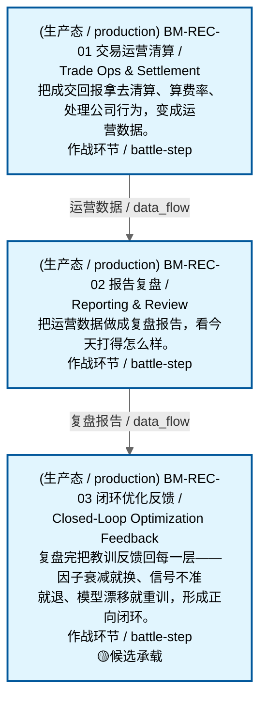

# 作战地图·对账阶段

> **[可缩放 HTML 版 / Zoomable HTML](http://localhost:8765/docs/02_enterprise_architecture/07_trading_decision_architecture/battle_map/_zoomable_html/battle_map_06_reconciliation.html)** — Ctrl+滚轮缩放 ｜ 双击重置 ｜ Ctrl+Shift+D 切换拖动/选择模式

> battle_map §reconciliation 阶段，3 环节。
> 本文档由 `generate_battle_map_diagram.py` 自动生成，禁止手编。

## 文档基本信息 / Document Overview

| 字段 | 值 | Field | Value |
|------|------|-------|-------|
| 阶段 | 对账（reconciliation） | Stage | 对账 |
| 环节数 | 3 | Steps | 3 |
| 流转边 | 5 | Edges | 5 |
| 状态分布 | 🟦 运营态（已建）=3 | State Distribution | 🟦 运营态（已建）=3 |

> **图例说明 / Legend**：
> - 🟦 **蓝色实线 = 运营态环节**（production，锚点模块已建）
> - 🟧 **橙色虚线 = 设计态环节**（design，锚点模块待施工）
> - 🟥 **红色 = 弃用态**（deprecated）
> - ⬜ **灰色 = 缺失态**（missing，环节无锚点，BM-INV-001 违例）
> - 🟨 **黄色虚线 = 候选态**（candidate，承载模块在候选池）
> - **实线箭头 ``-->`` = 运营态流转**（两端均 production）
> - **虚线箭头 ``-.->`` = 非运营态流转**（含设计/候选/混合）

## 阶段图 / Stage Diagram

> 展示 对账 阶段全部 3 个环节及流转边，颜色区分五态。

## 环节详情

### BM-REC-01 交易运营清算 / Trade Ops & Settlement

> **大白话**：把成交回报拿去清算、算费率、处理公司行为，变成运营数据。

**机制说明**：

L5/运营层。C-017 交易运营：清算/费率/公司行为。是闭环反馈路径的起点，承接 C-002 交易执行产出。

**6 件套（结构化，DB indicators JSONB）**：

| 要素 | 内容 |
|---|---|
| ① 触发条件 | 成交回报就绪 阈值: 清算/费率/公司行为 |
| ② 消费数据/因子 | 成交回报（来自 BM-EXE-02） |
| ③ 参数 | settle_cycle=T+1（范围 -，代码当前: 待实现，状态: proposed） |
| ④ 数据流 | 输入: 成交回报 → 处理: C-017 清算+费率+公司行为 → 输出: 运营数据 → 下游: BM-REC-02 报告复盘 |
| ⑤ 代码映射 | C-017 / 草图§1.8 闭环反馈 |
| ⑥ 降级/中止 | C-017 不可用 → 手动清算兜底 |

**指标文案（翻译真源 indicators_zh）**：

①触发：成交回报就绪；②消费：BM-EXE-02 成交回报；③参数：settle_cycle=T+1；④数据流：成交回报→C-017 清算/费率/公司行为→运营数据→BM-REC-02；⑤代码：C-017 §1.8 闭环；⑥降级：C-017 不可用→手动清算兜底。

**锚点（环节↔模块双向关联）**：

| 目标图 | 目标ID | 角色 | 状态快照 | 真实build_status |
|---|---|---|---|---|
| depgraph | MOD-TRADING-003 | primary | planned | generated |
| depgraph | MOD-RPT-027 | supplement | planned | generated |

**有效状态**：🟦 运营态（已建） ｜ **环节自报**：design ｜ **层**：L5 ｜ **阶段**：reconciliation

### BM-REC-02 报告复盘 / Reporting & Review

> **大白话**：把运营数据做成复盘报告，看今天打得怎么样。

**机制说明**：

L5 层。C-010 报告复盘：把运营数据加工成复盘报告，作为闭环优化的输入素材。MOD-RPT-027 是自我复盘的输入素材。

**6 件套（结构化，DB indicators JSONB）**：

| 要素 | 内容 |
|---|---|
| ① 触发条件 | 运营数据就绪 阈值: 复盘报告 |
| ② 消费数据/因子 | 运营数据（来自 BM-REC-01） |
| ③ 参数 | report_freq=日/周（范围 -，代码当前: 待实现，状态: proposed） |
| ④ 数据流 | 输入: 运营数据 → 处理: C-010 报告复盘 → 输出: 复盘报告 → 下游: BM-REC-03 闭环优化 |
| ⑤ 代码映射 | C-010 / 草图§1.8 闭环反馈 |
| ⑥ 降级/中止 | C-010 不可用 → 降级基础 PnL 报表 |

**指标文案（翻译真源 indicators_zh）**：

①触发：运营数据就绪；②消费：BM-REC-01 运营数据；③参数：report_freq=日/周；④数据流：运营数据→C-010 报告复盘→复盘报告→BM-REC-03；⑤代码：C-010 §1.8 闭环；⑥降级：C-010 不可用→基础 PnL 报表。

**锚点（环节↔模块双向关联）**：

| 目标图 | 目标ID | 角色 | 状态快照 | 真实build_status |
|---|---|---|---|---|
| depgraph | MOD-RPT-026 | primary | planned | generated |
| depgraph | MOD-RPT-015 | supplement | planned | planned |

**有效状态**：🟦 运营态（已建） ｜ **环节自报**：design ｜ **层**：L5 ｜ **阶段**：reconciliation

### BM-REC-03 闭环优化反馈 / Closed-Loop Optimization Feedback

> **大白话**：复盘完把教训反馈回每一层——因子衰减就换、信号不准就退、模型漂移就重训，形成正向闭环。

**机制说明**：

L5 层。C-007 闭环优化：反馈到 L1~L4+L3.5 每层（IC衰减→因子替代、准确率监控→信号退役、漂移检测→模型重训练、A/B 淘汰、阈值校准）。每轮迭代改动必须经过 C-003 回测门禁。

**6 件套（结构化，DB indicators JSONB）**：

| 要素 | 内容 |
|---|---|
| ① 触发条件 | 复盘报告就绪 阈值: 反馈到 L1~L4+L3.5 每层 |
| ② 消费数据/因子 | 复盘报告（来自 BM-REC-02） |
| ③ 参数 | feedback_layers=L1~L4+L3.5（范围 -，代码当前: IC衰减1~20期(max_lag=20)+半衰期(compute_half_life)——单层因子质量反馈; L1~L4+L3.5多层架构未完整实现，状态: implemented） |
| ④ 数据流 | 输入: 复盘报告 → 处理: C-007 闭环优化（IC衰减/准确率/漂移检测→重训练） → 输出: 因子/信号/策略/风控迭代信号 → 下游: BM-SEL-02 因子计算（反向闭环） |
| ⑤ 代码映射 | C-007 / 草图§1.8 闭环反馈 |
| ⑥ 降级/中止 | C-007 不可用 → 降级人工复盘 |

**指标文案（翻译真源 indicators_zh）**：

①触发：复盘报告就绪；②消费：BM-REC-02 复盘报告；③参数：feedback_layers=L1~L4+L3.5；④数据流：复盘报告→C-007 闭环优化→迭代信号→BM-SEL-02（反向闭环）；⑤代码：C-007 §1.8 闭环；⑥降级：C-007 不可用→人工复盘。

**锚点（环节↔模块双向关联）**：

| 目标图 | 目标ID | 角色 | 状态快照 | 真实build_status |
|---|---|---|---|---|
| depgraph | MOD-L02-004 | primary | production | stable |
| candidate | CAND-WFO-001 | supplement | deferred | — |
| candidate | CAND-SIM-002 | supplement | deferred | — |
| candidate | CAND-BT-001 | supplement | deferred | — |

**有效状态**：🟦 运营态（已建） ｜ **环节自报**：design ｜ **层**：L5 ｜ **阶段**：reconciliation

[← 返回总指挥图](battle_map_panorama.md)