# 交易决策作战地图（横切视图）

> **[可缩放 HTML 版 / Zoomable HTML](http://localhost:8765/docs/02_enterprise_architecture/07_trading_decision_architecture/battle_map/_zoomable_html/battle_map_07_cross_cutting.html)** — Ctrl+滚轮缩放 ｜ 双击重置 ｜ Ctrl+Shift+D 切换拖动/选择模式

> 横切贯穿全流程的全局机制：§13 筛选漏斗 / §14 盘中实时事件处理 / §16 能力冲突矩阵与仲裁规则
>           + 4 系统级横切（四模式开关 / 应急保命降级 / 四轨并行 / 共享信号注入，迁移自 trading_flow_narrative.yaml）。
> 真源：`module_translation_registry.yaml` §battle_map_cross_cutting 段（规则数据，TRAE-062）。
> 本文档由 `generate_battle_map_diagram.py` 自动生成，禁止手编。

## 文档基本信息 / Document Overview

| 字段 | 值 | Field | Value |
|------|------|-------|-------|
| 横切类别数 | 11 | Categories | 11 |
| 涵盖章节 | §13 / §14 / §16 / §15 / §1.7 + 4 系统级 | Sections | §13 / §14 / §16 / §15 / §1.7 + 4 sys |
| 真源 | module_translation_registry.yaml | Source | YAML registry |

> **图例说明 / Legend**：
> - 🟦 **蓝色实线 = 运营态环节**（production，锚点模块已建）
> - 🟧 **橙色虚线 = 设计态环节**（design，锚点模块待施工）
> - 🟥 **红色 = 弃用态**（deprecated）
> - ⬜ **灰色 = 缺失态**（missing，环节无锚点，BM-INV-001 违例）
> - 🟨 **黄色虚线 = 候选态**（candidate，承载模块在候选池）
> - **实线箭头 ``-->`` = 运营态流转**（两端均 production）
> - **虚线箭头 ``-.->`` = 非运营态流转**（含设计/候选/混合）

## 横切视图总览 / Cross-Cutting Overview

> 展示全部 11 个横切机制，颜色区分五态。

```mermaid
%%{init: {'theme': 'base', 'themeVariables': {'primaryColor': '#eaeaea', 'primaryTextColor': '#333333', 'primaryBorderColor': '#666666', 'lineColor': '#666666', 'secondaryColor': '#eaeaea', 'tertiaryColor': '#eaeaea', 'clusterBkg': 'transparent', 'clusterBorder': 'transparent', 'fontSize': '14px'}}}%%
%% 横切视图总览
flowchart TD
    CC_01["（设计态 / design） §13 筛选漏斗模型 / Screening<br/>Funnel Model<br/>从全市场~7000只股票开始，经过6层过滤漏斗逐层筛选<br/>，最终选出≤10只下单标的。 每层注入不同信号<br/>（技术面/基本面/主力行为/市场状态/事件驱动<br/>/多策略交叉）。<br/>横切机制 / cross-cutting"]
    CC_02["（设计态 / design） §14 盘中实时事件处理 /<br/>Intraday Real-time Event Processing<br/>盘中7类事件到达后立即触发增量信号修正。事件类型<br/>决定处理流水线，影响范围决定重算粒度。 叠加5分钟<br/>持仓对账机制，防止系统持仓视图与券商实际不一致。<br/>横切机制 / cross-cutting"]
    CC_03["（设计态 / design） §15 计算节奏与时序 / Compute<br/>Cadence &amp; Timeline<br/>全流程24小时时序框架，把盘前数据拉取、盘中实时决<br/>策、盘后研究迭代串成一条标准作业流水线。<br/>横切机制 / cross-cutting"]
    CC_04["（设计态 / design） §16 能力冲突矩阵与仲裁规则 /<br/>Capability Conflict Matrix &amp; Arbitration<br/>31个能力冲突场景的仲裁规则。核心原则：防御永远优<br/>先于进攻，风控（C-004）高于一切， 仓位上限<br/>（C-047）硬约束仅次于风控，卖出决策排在买入之前<br/>（卖比买紧急）。<br/>横切机制 / cross-cutting"]
    CC_05["（设计态 / design） §1.7 分布感知增强体系 /<br/>Distribution-Aware Enhancement System<br/>把'预测一个数'升级为'预测一个分布'的完整方法论体<br/>系，让系统知道不确定性有多大， 而不是只给一个点<br/>估计。包含4个方法论，从不同角度刻画分布。<br/>横切机制 / cross-cutting"]
    CC_06["（设计态 / design） — 四模式开关（回测/Paper<br/>/Shadow/实盘） / Four-Mode Switch<br/>同一套决策代码路径，通过模式开关切换运行形态，保<br/>证 sim↔实盘同构：   - backtest  —— 历史数据回放<br/>+ 模拟撮合，验证策略   - paper     —— 实时数据<br/>+ 模拟下单不成交，验证实时链路   - shadow    ——<br/>实时数据 + 全链路实跑不下单，测量 sim↔live<br/>divergence   - live      —— 实时数据 +<br/>真实下单 模式开关在执行层（execution<br/>flow）生效，不影响信号/策略<br/>/风控的决策逻辑。 实盘同构铁律：回测引擎必须串入<br/>D_POSITION + D_RISK，不跳过仓位和风控。<br/>横切机制 / cross-cutting"]
    CC_07["（设计态 / design） — 应急保命降级路径 /<br/>Emergency Fail-Safe Degradation Path<br/>当模型/策略/信号失效时，系统逐级降级保命——每一层<br/>失效都有硬编码兜底， 保证交易系统在最坏情况下仍<br/>能'活着'且不爆雷。降级触发由 Kill Switch 熔断 +<br/>数据健康监控驱动。 注意：这是系统级横切降级级联<br/>，区别于各环节 6 件套里的 ⑥降级/中止<br/>（后者是单环节级）。<br/>横切机制 / cross-cutting"]
    CC_08["（设计态 / design） — 四轨并行架构 / Four-Track<br/>Parallel Architecture<br/>交易决策不是单条流水线，而是四条轨道同时跑，按优<br/>先级接管：   ① 模型驱动轨（主力）——<br/>L0数据→L1因子→L2信号→L3策略→L4风控，正常交易走这<br/>条   ② 数据驱动轨（补充）—— 端到端 DL<br/>信号，模型驱动轨信号不足时补充   ③ 人工指令轨<br/>（干预）—— 人工买入/卖出/调仓<br/>/风控干预，优先级高于自动轨   ④ 应急保命轨<br/>（兜底）—— 全系统降级到最简规则，仅执行卖出 +<br/>硬编码上限 四轨的输出在 L3<br/>策略组合层融合，按优先级仲裁。人工指令 &gt;<br/>模型驱动 &gt; 数据驱动； 应急保命轨触发时压制所有其<br/>他轨。<br/>横切机制 / cross-cutting"]
    CC_09["（设计态 / design） — 共享信号注入层 / Shared<br/>Signal Injection Layer<br/>选股、买入、卖出三个流程共享同一批信号源——不重复<br/>造信号。 信号工厂统一产出 Insight（方向/置信度<br/>/时间跨度），注入到：   -<br/>选股流：信号作为筛选漏斗的输入   -<br/>买入流：信号作为四轨融合的输入   -<br/>卖出流：信号反转作为卖出触发之一 信号仓位分离铁<br/>律：signal 节点不能直接连 order，必须经<br/>portfolio_target 中转。<br/>横切机制 / cross-cutting"]
    CC_10["（设计态 / design） D-SIGNAL §3 信号生命周期治理<br/>/ Signal Lifecycle Governance<br/>信号不是'产生即用完'的一次性产物，而是有完整生命<br/>周期：生成→校准→降级监控→ 衰减追踪→绩效追踪→版本<br/>管理→审计→废弃。每个阶段都有对应能力保障信号质量<br/> 和可追溯性，避免'信号失效了还在用'。<br/>横切机制 / cross-cutting"]
    CC_11["（设计态 / design） D-FACTOR §7 因子治理引擎 /<br/>Factor Governance Engine<br/>因子不是'算出来就用'的，而是要经过完整治理：注册<br/>→评估→治理门禁→衰减监控→ 相关性分析→废弃审批。因<br/>子池有容量上限（活跃池≤60，设计容量≥150），通过<br/>末位淘汰+批量裁剪维持因子池健康。<br/>横切机制 / cross-cutting"]
    CC_01 ~~~ CC_02 ~~~ CC_03 ~~~ CC_04 ~~~ CC_05 ~~~ CC_06 ~~~ CC_07 ~~~ CC_08 ~~~ CC_09 ~~~ CC_10 ~~~ CC_11
classDef production fill:#e1f5fe,stroke:#01579b,stroke-width:2px,color:#000
classDef design fill:#fff3e0,stroke:#e65100,stroke-width:2px,color:#000,stroke-dasharray: 5 5
classDef deprecated fill:#ffebee,stroke:#c62828,stroke-width:2px,color:#000
classDef missing fill:#eeeeee,stroke:#9e9e9e,stroke-width:2px,color:#000
classDef candidate fill:#fffde7,stroke:#f9a825,stroke-width:2px,color:#000,stroke-dasharray: 5 5
    class CC_01,CC_02,CC_03,CC_04,CC_05,CC_06,CC_07,CC_08,CC_09,CC_10,CC_11 design
```

## 筛选漏斗模型 / Screening Funnel Model（§13）

> **大白话**：从全市场~7000只股票开始，经过6层过滤漏斗逐层筛选，最终选出≤10只下单标的。
每层注入不同信号（技术面/基本面/主力行为/市场状态/事件驱动/多策略交叉）。

**机制说明**：

v0.1的5层筛选漏斗仅基于技术面/基本面，v2.0在每层注入主力行为/市场状态/庄家识别/拥挤度等多维信号。
漏斗按算力约束分级：3秒级（>80%淘汰）→60秒级（初筛/精筛/事件/多策略）→组合优化。
AUM分级动态调整成交额门槛；市场状态（⑧加速下跌/⑨恐慌崩盘）会收紧入选条件。

**关联环节**：[BM-SEL-01](battle_map_01_stock_selection.md)、[BM-SEL-02](battle_map_01_stock_selection.md)、[BM-SEL-03](battle_map_01_stock_selection.md)、[BM-SEL-04](battle_map_01_stock_selection.md)

### 漏斗层级（6层过滤）

| 层 | 名称 | 延迟 | 吞吐 | 筛选条件 |
|---|---|---|---|---|
| L1 | 分级指标过滤 | 3秒级 | 全市场~7000 → ~1200只 | - 绝对排除：涨停封板/跌停/停牌（物理约束，不可协商） - 门禁排除：ST/*ST（需专用策略开通，条件：Sharpe>1.0+Purged K-Fold+仿真5天） - 分级门槛·成交额：AUM≤100万→日成交额≥500万；100-500万→≥1000万；500-2000万→≥3000万；>2000万→≥5000万 - 分级门槛·次新股：上市<30天排除；30-90天需评分>85分位+仓位减半；≥90天正常 - 概率门槛：C-035弃庄概率>95%排除；70-95%降权（评分扣20%） |
| L2 | 初筛漏斗 | 60秒级 | ~1200 → ~300只 | - 技术形态：均线多头/KDJ金叉/MACD底背离 - 量价配合：量比>1.5/换手率>1% - 板块强度：所在板块排名前30% - C-011主力行为六阶段标注（吸筹/洗盘阶段加分） - C-021市场状态适配（⑧加速下跌/⑨恐慌崩盘→仅保留防御型标的） |
| L3 | 精筛评分 | 60秒级 | ~300 → ~50只 | - 多维因子综合评分（基础权重：价值40%+动量30%+质量20%+情绪10%） - 市场状态动态偏移：①②趋势向上→动量+10%/价值-10%；⑦⑧⑨→价值+10%/动量-10%；⑩事件驱动→情绪+10%/价值-10% - 跨截面排名（Z-score标准化）+ 技术时点信号（KDJ金叉/RSI底背离/BOLL下轨突破） - C-034主力推演评分 + C-035庄家信号评分 + C-014大盘预测修正（次日上涨概率>60%加分） - C-045拥挤度扣分（因子拥挤度超限→降权） - C-014 T+1次日8态预测约束（5条规则：上涨型加分/冲高回落止盈/下跌型降权/剧烈震荡减半/低置信度保守仓位） - 收益率条件密度预测增强（偏度>0加分5%；偏度<0扣分5%；峰度>3扣分10%+仓位下调；95%VaR超阈值扣分15%；双峰标记高不确定性） |
| L4 | 事件驱动分布筛选（v3.4新增） | 60秒级 | ~50 → ~30只 | - 事件影响评分（消费L2-D知识图谱事件影响链：负面→淘汰/正面→加分/无→不调整） - 事件驱动条件分布修正（事件修正PDF偏移>阈值→标记事件敏感；上涨概率下降>15%→淘汰；上升>15%→加分；双峰→高不确定性） - 事件传导链风险（负面传导链下游→降权；正面传导链下游→加分） - 开通条件：结构化A股事件数据源+L2-D知识图谱+NLP情感分析；未开通时跳过本层 |
| L5 | 多策略交叉 | 60秒级 | ~30 → ~30只 | - 策略A价值反转 YES/NO（权重30%） - 策略B动量趋势 YES/NO（权重25%） - 策略C事件驱动 YES/NO（权重20%） - C-034主力行为信号投票 + C-036群体博弈合力投票 - C-021市场状态约束（状态不允许→否决买入） |
| L6 | 组合优化 | 60秒级 | ~30 → N只（N≤10） | - 行业分散（日常≤±10%；叠加态⑪≤±15%；绝对上限30%） - 市值分散（大盘/中盘/小盘均衡）+ 风险预算（波动率/最大回撤约束） - 风格暴露约束（≤±0.3标准差）+ 相关性约束（corr<0.7） - C-042策略容量约束 + C-045拥挤度约束 + C-036群体博弈合力（偏空→整体降仓） |

## 盘中实时事件处理 / Intraday Real-time Event Processing（§14）

> **大白话**：盘中7类事件到达后立即触发增量信号修正。事件类型决定处理流水线，影响范围决定重算粒度。
叠加5分钟持仓对账机制，防止系统持仓视图与券商实际不一致。

**机制说明**：

7类事件按级别（公司/行业/区域/全球/货币商品/情绪资金/政治地缘）到达事件总线，
经C-016知识图谱+C-039跨市场传导+C-038黑天鹅模式分析后，触发L1因子增量重算→
L2信号修正→L3组合优化调仓→L4风控执行。所有事件延迟要求<5秒。
持仓对账每5分钟与miniQMT自动对账，差异>0立即告警+冻结+修正（这不是灾备，是日常运行）。

**关联环节**：[BM-SEL-02](battle_map_01_stock_selection.md)、[BM-EXE-01](battle_map_05_execution.md)、[BM-EXE-02](battle_map_05_execution.md)、[BM-REC-01](battle_map_06_reconciliation.md)

### 事件类型清单（7类）

| 级别 | 事件类型 | 触发源 | 影响范围 | 重算粒度 | 延迟 |
|---|---|---|---|---|---|
| **公司级** | 突发公告/停牌复牌/问询函/大股东增减持/涨跌停/可转债异动 | iFind+miniQMT | 个股→板块 | 个股+高相关标的 | <5秒 |
| **行业级** | 产业政策突变/行业突发事件/行业数据发布 | iFind+新闻 | 板块 | 板块内全部标的 | <5秒 |
| **区域传导** | 日韩股市异动/港股异动/台海事件 | iFind | 全市场/板块 | C-039传导路径 | <5秒 |
| **全球宏观** | 美股期货异动/VIX异动/欧洲股市开盘 | iFind | 全市场 | 全量重算 | <5秒 |
| **货币商品** | 人民币汇率异动/大宗商品异动/国债收益率/央行操作 | iFind | 全市场/板块 | C-039传导路径 | <5秒 |
| **情绪资金** | 北向异动/分析师评级/社交媒体/ETF申赎/融资融券 | iFind+miniQMT | 全市场/个股 | 视影响范围 | <5秒 |
| **政治地缘** | 地缘冲突/制裁关税/高层人事政策 | 新闻 | 全市场 | 全量重算 | <5秒 |

### 事件处理流水线

1. 事件总线(Event Bus)接收
2. C-016知识图谱匹配受影响节点→传导路径分析
3. C-039跨市场传导计算传导系数→预测A股影响幅度
4. C-038黑天鹅模式匹配历史极端事件模式
5. L1因子层受影响标的增量因子重算
6. L2-A信号修正 / L2-B主力行为推演更新 / L2-C市场状态可能切换
7. L3组合优化调仓指令修正
8. L4风控检查→执行

### 盘中持仓对账机制

| 维度 | 规则 |
|---|---|
| 对账频率 | 每5分钟与miniQMT持仓查询自动对账一次 |
| 差异处理 | 差异>0→立即告警(C-015)+冻结差异标的交易+自动修正持仓视图 |
| 审计记录 | 对账结果写入审计链(C-043)，含差异详情+修正动作 |
| 降级模式 | miniQMT持仓查询不可用→暂停对账+告警+基于本地持仓继续运行（风控参数自动收紧10%） |

## 计算节奏与时序 / Compute Cadence & Timeline（§15）

> **大白话**：全流程24小时时序框架，把盘前数据拉取、盘中实时决策、盘后研究迭代串成一条标准作业流水线。

**机制说明**：

三段式时序：盘前（03:00-09:15）→盘中（09:15-15:00）→盘后（15:00-23:59）。
盘前做全量因子计算和策略预案；盘中做增量信号和实时决策（3秒tick驱动）；盘后做复盘和模型迭代。
每个阶段有明确的计算频率和CPU负载特征，确保资源分配合理。

**关联环节**：[BM-SEL-01](battle_map_01_stock_selection.md)、[BM-SEL-02](battle_map_01_stock_selection.md)、[BM-BUY-01](battle_map_02_buy_flow.md)、[BM-SELL-01](battle_map_03_sell_flow.md)、[BM-POS-01](battle_map_04_position_management.md)、[BM-EXE-01](battle_map_05_execution.md)、[BM-EXE-02](battle_map_05_execution.md)、[BM-REC-01](battle_map_06_reconciliation.md)

### 时序阶段（盘前→盘中→盘后）

| 阶段 | 时间 | 关键动作 |
|---|---|---|
| 盘前 | 03:00-09:15 | 03:00 全市场历史数据补全（昨日收盘后增量） 04:00 因子工厂全量计算（~150因子，全市场~7000只） 06:00 信号工厂批量产出（基于昨日因子+今日预案） 08:00 策略工厂多情景对策生成（L3层） 08:30 市场状态预判（C-021）+ T+1次日预测（C-014） 09:00 仓位预分配 + 风控预检 09:15 集合竞价准备就绪 |
| 盘中 | 09:15-15:00 | 09:15-09:30 集合竞价阶段，接收集合竞价数据 09:30-11:30 上午连续竞价，3秒tick驱动决策流 11:30-13:00 午间休市，策略微调+风控复盘 13:00-15:00 下午连续竞价，尾盘特殊处理（14:57收盘集合竞价） |
| 盘后 | 15:00-23:59 | 15:00-16:00 交易运营清算（C-017）+ 成交回报核对 16:00-18:00 报告复盘（C-010）+ TCA分析（C-046） 18:00-20:00 闭环优化（C-007）→反馈L1-L4各层 20:00-23:59 模型重训练（C-029）+ 因子迭代（C-027） |

### 计算频率汇总

| 频率 | 计算内容 | 标的数 | CPU负载 | 数据源 |
|---|---|---|---|---|
| tick级(3s) | tick数据写入+实时风控监控 | 全市场持仓标的 | 中 | miniQMT实时推送 |
| 分钟级 | 增量因子计算+信号更新 | 候选池~500只 | 高 | tick聚合 |
| 5分钟级 | 策略对策更新+仓位再平衡评估 | 持仓~10只 | 中 | 分钟信号 |
| 日级(盘后) | 全量因子重算+模型重训练+复盘 | 全市场~7000只 | 极高(GPU) | 全天数据 |

## 能力冲突矩阵与仲裁规则 / Capability Conflict Matrix & Arbitration（§16）

> **大白话**：31个能力冲突场景的仲裁规则。核心原则：防御永远优先于进攻，风控(C-004)高于一切，
仓位上限(C-047)硬约束仅次于风控，卖出决策排在买入之前（卖比买紧急）。

**机制说明**：

冲突分三类：决策冲突（两能力给相反指令→按优先级仲裁）、循环依赖（两能力互依→
架构解耦/时序分离）、数据反馈（非决策冲突→正常闭环不仲裁）。
优先级总原则：风控(C-004)>C-047仓位上限>市场状态(C-021)>卖出决策引擎>
T+1次日预测(C-014)>安全防护(C-033/C-031)>交易策略(C-005/C-012)>
买入决策(C-006)>研究探索(C-006/C-007/C-027)。
市场状态排在次日预测之前，因为市场状态决定仓位硬上限（⑨恐慌崩盘仓位上限10%），
而次日预测仅修正信号权重——仓位硬约束优先于信号权重调整。

**关联环节**：[BM-EXE-01](battle_map_05_execution.md)、[BM-POS-01](battle_map_04_position_management.md)、[BM-SELL-02](battle_map_03_sell_flow.md)、[BM-BUY-02](battle_map_02_buy_flow.md)

### 仲裁优先级总原则（防御永远优先于进攻）

| 排名 | 优先级持有者 | 说明 |
|---|---|---|
| 1 | 风控(C-004) | 高于一切，人类也不可撤销已执行风控动作 |
| 2 | C-047仓位上限 | 硬约束，仅次于风控 |
| 3 | 市场状态(C-021) | 决定仓位硬上限（⑨恐慌崩盘仓位上限10%） |
| 4 | 卖出决策引擎 | 卖比买紧急 |
| 5 | T+1次日预测(C-014) | 仅修正信号权重 |
| 6 | 安全防护(C-033/C-031) | — |
| 7 | 交易策略(C-005/C-012) | — |
| 8 | 买入决策(C-006) | — |
| 9 | 研究探索(C-006/C-007/C-027) | — |

### 冲突场景清单（31 条）

| # | 冲突方 | 冲突场景 | 仲裁规则 | 胜出 |
|---|---|---|---|---|
| 1 | C-004风控 vs C-031置信度 | 风控触发清仓 vs AI置信度高认为不该清 | 风控>一切，人类也不可撤销已执行风控动作 | C-004 |
| 2 | C-004风控 vs C-013外部指令 | 用户指令建仓 vs 标的在风控减仓名单 | 风控拦截建仓→通知用户 | C-004 |
| 3 | C-004风控 vs C-012做T | 做T信号触发 vs 标的在风控减仓名单 | 做T信号直接丢弃 | C-004 |
| 4 | C-004风控 vs C-005多情景对策 | 预案说跌5%加仓但风控说跌5%减仓 | 风控veto优先；风控触发熔断时预案自动失效 | C-004 |
| 5 | C-035庄家 vs C-012做T | 庄家出货/弃庄阶段 vs 做T信号触发 | 做T信号自动丢弃（出货/弃庄均丢弃）；仅吸筹/洗盘允许做T | C-035 |
| 6 | C-007自治进化 vs C-033过拟合防护 | 进化要调参，防护要锁参 | C-033设边界（B-008≤3参数/p-hacking锁定），C-007在边界内自由优化 | C-033设边界 |
| 7 | C-007自治进化 vs C-031人机信任 | AI置信度95%自主执行但人类连续否决 | 人类否决不可被AI覆盖；否决学习调整AI置信度评分 | C-031 |
| 8 | C-006策略工厂 vs C-010报告复盘 | 新策略上线后旧策略复盘数据被稀释 | A/B并行期间分别统计独立PnL；A退役后历史数据保留在策略墓地 | 各自独立统计 |
| 9 | C-027因子工厂 vs C-033过拟合防护 | 新因子IC显著但多重检验校正后不显著 | 验证为准；未通过Bonferroni/BH校正→进入观察池非正式因子池 | C-033 |
| 10 | C-014大盘预测 vs C-021市场状态 | 循环依赖 | C-021用C-014的T-1日预测，C-014用C-021的T日实时状态 | 时序分离 |
| 11 | C-009信号管线 vs C-004风控 | 循环依赖 | 共享存储+事件总线解耦 | 架构解耦 |
| 12 | C-004风控 vs C-002交易执行 | 循环依赖(C-002订单须经C-004审批; C-004读取C-002持仓/订单状态) | 共享存储+事件总线解耦 | 架构解耦 |
| 13 | C-047仓位管理 vs C-004风控 | 循环依赖(C-047依赖C-004仓位硬约束; C-004依赖C-047实际仓位数据) | C-047将仓位快照写入共享存储→C-004从存储读取→C-004风控结果通过事件总线异步推送C-047 | 架构解耦 |
| 14 | C-009信号管线 vs C-006策略工厂 | 循环依赖 | C-009启动用默认策略列表，C-006异步注册新策略 | 时序分离 |
| 15 | C-009信号管线 vs C-027因子工厂 | 循环依赖 | C-009启动用默认因子列表（上次快照），C-027异步注册新因子 | 时序分离 |
| 16 | C-042策略容量 vs C-046 TCA | 循环依赖 | C-046先用简化模型运行1个月→C-042校准→C-046切换 | 时序分离 |
| 17 | C-026执行运营 vs C-046 TCA | 数据反馈（非决策冲突） | C-046消费C-026成交回报做TCA，C-026消费C-046的TCA结果优化下单算法——正常数据反馈闭环，不属决策冲突，无需仲裁 | 不适用 |
| 18 | C-027末位淘汰 vs C-007⑬批量裁剪 | 因子池管理 | 末位淘汰优先(日常维护活跃池至N_max)；批量裁剪兜底(全池≤N_max，当前≈64，设计容量≥150) | C-027>C-007⑬ |
| 19 | C-031置信度 vs C-013外部指令 | 人类指令 vs AI置信度低 | 人类显式指令优先，但置信度<80%推送风险提示 | C-013优先 |
| 20 | C-004流动性监控 vs C-012做T | 标的流动性不足 vs 做T信号触发 | 流动性评分低于阈值→做T信号丢弃（流动性不足时做T可能无法及时平仓） | C-004优先 |
| 21 | C-004相关性体制 vs C-004 VaR | 相关性趋同 vs VaR计算基于历史相关性 | 相关性体制切换→VaR置信度自动上调（如95%→99%）+仓位上限降低 | 相关性体制优先 |
| 22 | C-006冷启动 vs C-005风险预算 | 冷启动观察期仓位限制 vs 风险预算分配仓位 | 冷启动期内冷启动仓位上限优先（min(风险预算仓位×冷启动系数, 正常仓位50%)） | 冷启动优先 |
| 23 | C-014次日8态预测 vs C-005多情景对策 | 次日8态预测偏空 vs 预案建议加仓 | 下跌型(P4+P6)>60%→加仓信号降权/推迟；冲高回落型(P2)>40%→设止盈；置信度<50%→保守仓位 | C-014优先 |
| 24 | 卖出信号融合 vs C-004风控 | 多卖出信号综合意愿中等(50-70%) vs 风控未触发 | 卖出信号融合结果优先，但风控有最终否决权（风控触发时无条件覆盖） | C-004优先 |
| 25 | 卖出信号 vs C-006买入信号 | 同标的同时有买入信号+卖出信号 | 卖出优先（保守原则）：卖出信号触发→买入信号自动丢弃；买入先于卖出触发时需重新评估 | 卖出优先 |
| 26 | 部分减仓 vs 全仓清仓 | 卖出信号强烈(>80%)但风控仅要求减仓 | 取更激进一方：风控说减仓30%+卖出信号>80%→升级为清仓；风控说减仓70%+卖出信号50%→按风控比例执行 | max(卖出信号, 风控) |
| 27 | C-047仓位裁决 vs C-004风控上限 | 仓位引擎输出仓位 vs 风控仓位上限 | C-047裁决结果不得突破风控上限（风控硬上限不可绕过） | C-004优先 |
| 28 | C-047仓位裁决 vs C-021市场状态仓位 | 仓位引擎输出仓位 vs 市场状态仓位上限 | 市场状态仓位上限为硬约束，C-047仓位不得超过此上限 | C-021硬约束 |
| 29 | 跨策略仓位合并 vs 单票仓位上限 | 多策略同标的→合并仓位超单票上限 | 按策略优先级截断：高优先级策略优先分配仓位，合并后不得超过硬上限 | 硬上限优先 |
| 30 | 仓位再平衡 vs C-004风控 | 再平衡要加仓 vs 风控限制加仓 | 风控禁止时跳过该标的加仓；风控仅限制时缩量执行（风控始终优先） | C-004优先 |
| 31 | 资金曲线缩放 vs 策略仓位 | 回撤>10%需降仓位 vs 策略信号强烈要求满仓 | 资金曲线缩放优先：回撤期仓位上限不受策略信号影响（系统性保护优先） | 资金曲线优先 |

## 分布感知增强体系 / Distribution-Aware Enhancement System（§1.7）

> **大白话**：把"预测一个数"升级为"预测一个分布"的完整方法论体系，让系统知道不确定性有多大，
而不是只给一个点估计。包含4个方法论，从不同角度刻画分布。

**机制说明**：

传统量化只预测点估计（如"明天涨2%"），分布感知预测完整概率分布（如"明天收益率
有70%概率在0-3%区间，10%概率跌超2%"）。4方法论分工：密度预测画分布形状、
共形预测给覆盖率保证区间、Survival预测事件发生时间、Causal ML找因果效应。
叠加态模式：4方法论可叠加使用，互相校验，取最保守结果。

**关联环节**：[BM-SEL-12](battle_map_01_stock_selection.md)、[BM-SEL-13](battle_map_01_stock_selection.md)、[BM-SEL-14](battle_map_01_stock_selection.md)、[BM-SEL-15](battle_map_01_stock_selection.md)、[BM-SEL-11](battle_map_01_stock_selection.md)

### 四方法论分工（从点估计升级为完整分布描述）

| 方法论 | 回答的问题 | 输出 | 下游消费 | 实现阶段 | 关联环节 |
|---|---|---|---|---|---|
| 收益率条件密度预测 | 分布长什么样？ | 条件PDF f(r|X_t) | 仓位Kelly公式+信号分布感知融合 | design | BM-SEL-12 |
| 共形预测 | 区间有多可靠？ | 覆盖率保证的预测区间 | 风控共形VaR+信号置信区间 | design | BM-SEL-13 |
| Survival止盈止损时间预测 | 什么时候该止盈/止损？ | 事件发生时间分布（止盈/止损触发时间） | 卖出决策引擎+仓位时间衰减 | design | BM-SEL-15 |
| Causal ML因果推断 | 因果效应有多大？ | 因果效应估计（ATE/CATE） | 因子因果筛选+策略效应归因 | design | BM-SEL-14 |

### 叠加态模式

4方法论可叠加使用，互相校验：
密度预测画分布→共形预测在分布上切区间→Survival预测分布上事件时间→
Causal ML验证分布背后的因果机制。叠加使用时取最保守结果。

## 四模式开关（回测/Paper/Shadow/实盘） / Four-Mode Switch（—）

> **大白话**：同一套决策代码路径，通过模式开关切换运行形态，保证 sim↔实盘同构：
  - backtest  —— 历史数据回放 + 模拟撮合，验证策略
  - paper     —— 实时数据 + 模拟下单不成交，验证实时链路
  - shadow    —— 实时数据 + 全链路实跑不下单，测量 sim↔live divergence
  - live      —— 实时数据 + 真实下单
模式开关在执行层（execution flow）生效，不影响信号/策略/风控的决策逻辑。
实盘同构铁律：回测引擎必须串入 D_POSITION + D_RISK，不跳过仓位和风控。

**机制说明**：

模式开关仅切换执行层下单方式（模拟撮合 / 模拟不成交 / 全链路不下单 / 真实下单），
信号 / 策略 / 风控 / 仓位裁决的决策逻辑在四模式下完全一致——这是 sim↔实盘同构的保证。
回测引擎必须串入 D_POSITION + D_RISK，跳过仓位或风控裁决会破坏同构。

**关联环节**：[BM-EXE-02](battle_map_05_execution.md)

### 模式清单

| 模式ID | 名称 | 数据源 | 下单方式 |
|---|---|---|---|
| backtest | 回测模式 | 历史回放 | 模拟撮合 |
| paper | Paper 模式 | 实时 | 模拟下单不成交 |
| shadow | Shadow 模式 | 实时 | 全链路实跑不下单 |
| live | 实盘模式 | 实时 | 真实下单 |

## 应急保命降级路径 / Emergency Fail-Safe Degradation Path（—）

> **大白话**：当模型/策略/信号失效时，系统逐级降级保命——每一层失效都有硬编码兜底，
保证交易系统在最坏情况下仍能"活着"且不爆雷。降级触发由 Kill Switch 熔断 + 数据健康监控驱动。
注意：这是系统级横切降级级联，区别于各环节 6 件套里的 ⑥降级/中止（后者是单环节级）。

**机制说明**：

降级是逐级的：L2 信号失效先用硬编码均线信号兜底，L3 策略失效再退到固定比例仓位，
L4 风控失效退到硬编码 10% 单票上限，最严重的数据断流则只卖不买（防止基于坏数据下单）。
Kill Switch 熔断器 + 数据健康监控是两个触发源，任一触发即进入对应层降级。
降级后系统仍受硬上限约束（如 10% 单票上限），不会因降级而失控。

**关联环节**：[BM-EXE-01](battle_map_05_execution.md)、[BM-POS-02](battle_map_04_position_management.md)

### 降级路径（逐级保命）

| 触发条件 | 失效层 | 降级行为 |
|---|---|---|
| L2 信号失效 | L2 信号层 | 硬编码均线信号 |
| L3 策略失效 | L3 策略层 | 固定比例仓位 |
| L4 风控失效 | L4 风控层 | 硬编码 10% 单票上限 |
| 数据断流 | L0 数据层 | 仅执行卖出（不买入） |

## 四轨并行架构 / Four-Track Parallel Architecture（—）

> **大白话**：交易决策不是单条流水线，而是四条轨道同时跑，按优先级接管：
  ① 模型驱动轨（主力）—— L0数据→L1因子→L2信号→L3策略→L4风控，正常交易走这条
  ② 数据驱动轨（补充）—— 端到端 DL 信号，模型驱动轨信号不足时补充
  ③ 人工指令轨（干预）—— 人工买入/卖出/调仓/风控干预，优先级高于自动轨
  ④ 应急保命轨（兜底）—— 全系统降级到最简规则，仅执行卖出 + 硬编码上限
四轨的输出在 L3 策略组合层融合，按优先级仲裁。人工指令 > 模型驱动 > 数据驱动；
应急保命轨触发时压制所有其他轨。

**机制说明**：

四轨是"同一套决策架构的四种输入源"，不是四套独立系统——它们共享数据层/因子层/风控层，
只在 L2/L3 的信号生成与策略组合层各自贡献信号，再由 L3 按 priority 仲裁融合。
优先级总原则：人工指令轨 > 模型驱动轨 > 数据驱动轨；应急保命轨一旦触发即压制全部其他轨
（因应急轨含硬编码兜底，不依赖任何模型/策略）。仲裁结果产出唯一 portfolio_target，
再交给 L4 风控做最终否决。应急保命轨的降级路径详见"应急保命降级路径"横切段。

**关联环节**：[BM-BUY-01](battle_map_02_buy_flow.md)、[BM-SELL-01](battle_map_03_sell_flow.md)、[BM-EXE-01](battle_map_05_execution.md)

### 四轨清单

| 轨道 | 角色 | 优先级 | 说明 |
|---|---|---|---|
| model_driven | 模型驱动轨（主力） | 1 | L0数据→L1因子→L2信号→L3策略→L4风控，正常交易走这条 |
| data_driven | 数据驱动轨（补充） | 2 | 端到端 DL 信号，模型驱动轨信号不足时补充 |
| human_override | 人工指令轨（干预） | 3 | 人工买入/卖出/调仓/风控干预，优先级高于自动轨 |
| emergency | 应急保命轨（兜底） | 4 | 全系统降级到最简规则，仅执行卖出 + 硬编码上限，触发时压制所有其他轨 |

## 共享信号注入层 / Shared Signal Injection Layer（—）

> **大白话**：选股、买入、卖出三个流程共享同一批信号源——不重复造信号。
信号工厂统一产出 Insight（方向/置信度/时间跨度），注入到：
  - 选股流：信号作为筛选漏斗的输入
  - 买入流：信号作为四轨融合的输入
  - 卖出流：信号反转作为卖出触发之一
信号仓位分离铁律：signal 节点不能直接连 order，必须经 portfolio_target 中转。

**机制说明**：

共享信号注入是"一处生产、三处消费"的扇出结构，避免三个流程各自造信号导致不一致。
信号工厂是唯一生产者（L2-A 层），产出标准 Insight 契约（direction/confidence/horizon），
通过事件总线/共享存储分发到三个消费流。三处消费模式不同：选股把信号当筛选漏斗输入，
买入把信号当四轨融合的输入，卖出把信号反转当卖出触发之一。
信号仓位分离铁律（DEC-INV-002）刻在 decisiongraph schema 中——signal 节点
cannot_directly_connect_to=[order]，必须经 portfolio_target 中转，这是防止信号
绕过仓位裁决直接下单的硬约束。

**关联环节**：[BM-SEL-02](battle_map_01_stock_selection.md)、[BM-BUY-01](battle_map_02_buy_flow.md)、[BM-SELL-01](battle_map_03_sell_flow.md)

## 信号生命周期治理 / Signal Lifecycle Governance（D-SIGNAL §3）

> **大白话**：信号不是"产生即用完"的一次性产物，而是有完整生命周期：生成→校准→降级监控→
衰减追踪→绩效追踪→版本管理→审计→废弃。每个阶段都有对应能力保障信号质量
和可追溯性，避免"信号失效了还在用"。

**机制说明**：

信号生命周期横切贯穿信号从生产到废弃的全过程，由 D-SIGNAL 域 7 个能力协同：
  ① D-SIGNAL-01 Synthesizer（信号合成+权重分配，产出标准 Insight 契约）
  ② D-SIGNAL-17 Confidence Calibrator（Platt/Isotonic/温度缩放校准+ECE/MCE 评估）
  ③ D-SIGNAL-03 Degradation Monitor（三级降级 MILD/MODERATE/SEVERE，SEVERE 立即撤销）
  ④ D-SIGNAL-08 Decay Tracker（半衰期估计+衰减曲线拟合+消散预警）
  ⑤ D-SIGNAL-11 Performance Tracker（滚动 IC/IR/Sharpe+归因分解+基准比较+异常检测）
  ⑥ D-SIGNAL-12 Version Manager（版本树+A/B 分流+灰度发布+回滚引擎）
  ⑦ D-SIGNAL-06 Audit Logger（WORM 不可变存储+事件溯源+合规报告，MiFID II 5 年保留）
  ⑧ D-SIGNAL-14 Lifecycle Manager（7 状态机：研发/测试/灰度/生产/观察/废弃/归档）
核心原则：降级判断必须可审计——每次降级决策的输入/阈值/结果必须记录；
SEVERE 降级→立即撤销所有相关信号（E-SG-02）→通知 D-PORTFOLIO 停止建仓→通知 D-RISK 重新评估。
与应急保命降级路径横切的关系：本横切是信号级降级（单一信号失效），
应急保命降级是系统级降级（整个 L2 信号层失效）。

**关联环节**：[BM-SEL-02](battle_map_01_stock_selection.md)、[BM-SEL-22](battle_map_01_stock_selection.md)、[BM-SEL-23](battle_map_01_stock_selection.md)、[BM-SEL-24](battle_map_01_stock_selection.md)、[BM-SEL-25](battle_map_01_stock_selection.md)、[BM-BUY-01](battle_map_02_buy_flow.md)、[BM-SELL-01](battle_map_03_sell_flow.md)

### 生命周期阶段

| 阶段 | 名称 | 能力 | 说明 |
|---|---|---|---|
| generation | 信号生成 | D-SIGNAL-01 Synthesizer | 信号合成+权重分配，产出标准 Insight 契约（direction/confidence/horizon） |
| calibration | 置信度校准 | D-SIGNAL-17 Confidence Calibrator | Platt Scaling/Isotonic Regression/温度缩放，校准质量 ECE/MCE 评估+自适应校准 |
| degradation_monitor | 降级监控 | D-SIGNAL-03 Degradation Monitor | 三级降级 MILD/MODERATE/SEVERE，输入因子 IC/IR+信号置信度+数据质量评分 |
| decay_track | 衰减追踪 | D-SIGNAL-08 Decay Tracker | 半衰期估计器+衰减曲线拟合+消散预警+历史衰减对比 |
| performance | 绩效追踪 | D-SIGNAL-11 Performance Tracker | 滚动 IC/IR/Sharpe+归因分解+基准比较+异常检测 |
| versioning | 版本管理 | D-SIGNAL-12 Version Manager | 版本树管理+A/B 分流器+灰度发布调度+回滚引擎 |
| audit | 审计日志 | D-SIGNAL-06 Audit Logger | 事件采集器+WORM 写入器+查询接口+合规报告生成器，MiFID II 5 年保留 |
| retirement | 废弃流程 | D-SIGNAL-14 Lifecycle Manager | 7 状态机（研发/测试/灰度/生产/观察/废弃/归档）+准入门禁+灰度调度+废弃审批 |

### 降级级别

| 级别 | 触发条件 | 动作 | 下游影响 |
|---|---|---|---|
| MILD | 因子 IC 衰减 | 通知+降权 | 通知下游信号置信度下调 |
| MODERATE | 多因子同时衰减 | 通知+建议暂停 | 建议暂停相关策略建仓 |
| SEVERE | 数据源故障/模型崩溃 | 立即撤销所有相关信号（E-SG-02） | 通知 D-PORTFOLIO 停止建仓+通知 D-RISK 重新评估 |

## 因子治理引擎 / Factor Governance Engine（D-FACTOR §7）

> **大白话**：因子不是"算出来就用"的，而是要经过完整治理：注册→评估→治理门禁→衰减监控→
相关性分析→废弃审批。因子池有容量上限（活跃池≤60，设计容量≥150），通过
末位淘汰+批量裁剪维持因子池健康。

**机制说明**：

因子治理横切贯穿因子从注册到废弃的全过程，由 D-FACTOR 域 5 个能力协同：
  ① D-FACTOR-02 Registry（因子注册表：元数据 Schema+版本树+依赖图+废弃流程+因子血缘+四维索引）
  ② D-FACTOR-03 Evaluation（评估+过拟合检测 3 维度 Walk-Forward/参数敏感性/泛化+前视偏差+
     多重回归校验 t 统计量/VIF 方差膨胀/Durbin-Watson 残差自相关+IC 偏差率监控>0.1%否决+
     CUSUM 控制图 k=0.5σ 预警>2σ 行动>4σ）
  ③ D-FACTOR-07 Governance Engine（准入门禁+运行时监控+废弃审批+漂移检测 39 类+
     因子-模型联合优化 R&D-Agent-Quant：因子 IC 衰减评估模型敏感度，模型精度下降
     反向评估高贡献因子→优先保留，高贡献因子保留率>80%）
  ④ D-FACTOR-08 Decay Monitor（IC 时序追踪+半衰期估计+制度转换检测+衰减预警+
     CUSUM 控制图比滚动 IC 更早发现衰减趋势）
  ⑤ D-FACTOR-09 Correlation Analyzer（滚动相关矩阵+条件相关性+聚类分析+共线性检测+
     因子语义去重 LLM 判断经济学逻辑等价性：数值不同但逻辑等价→保留 IC 高者+
     标记"语义冗余"；逻辑不等价但数值相关→保留两者+标记"数值相关但逻辑独立"）
因子池管理双机制（原"末位淘汰"+"批量裁剪"）：
  - IC-Based Factor Replacement：活跃池满 N_max-4 时新因子逐个对比池内 IC 最低者，
    核心因子标记不参与末位淘汰
  - Batch Factor Pruning：全池≥64 时按 IC 从休眠/观察中裁撤，兜底维护全池≤N_max
因子池容量：运行上限 N_max≈64，设计容量≥150，活跃池≤N_max-4≈60，休眠≤4。
与信号生命周期横切的关系：因子衰减→触发信号降级（D-SIGNAL-03），
因子废弃→相关信号进入观察期（D-SIGNAL-14）。

**关联环节**：[BM-SEL-03](battle_map_01_stock_selection.md)、[BM-SEL-05](battle_map_01_stock_selection.md)、[BM-SEL-11](battle_map_01_stock_selection.md)、[BM-SEL-12](battle_map_01_stock_selection.md)、[BM-SEL-13](battle_map_01_stock_selection.md)

### 治理阶段

| 阶段 | 名称 | 能力 | 说明 |
|---|---|---|---|
| registration | 因子注册 | D-FACTOR-02 Registry | 元数据 Schema+版本树+依赖图+废弃流程状态机+因子血缘+四维索引（名称/类别/状态/SLA） |
| evaluation | 因子评估 | D-FACTOR-03 Evaluation | 过拟合检测 3 维度+前视偏差检测+多重回归（t/VIF/DW）+IC 偏差率>0.1%否决+CUSUM 控制图 |
| gatekeeping | 治理门禁 | D-FACTOR-07 Governance Engine | 准入门禁+运行时监控+废弃审批+漂移检测 39 类+因子-模型联合优化（高贡献因子保留率>80%） |
| decay_monitor | 衰减监控 | D-FACTOR-08 Decay Monitor | IC 时序追踪+半衰期估计+CUSUM 控制图（k=0.5σ，预警>2σ，行动>4σ）+制度转换检测 |
| correlation | 相关性分析 | D-FACTOR-09 Correlation Analyzer | 滚动相关矩阵+条件相关性+聚类+共线性 VIF+因子语义去重（LLM 判断逻辑等价性） |
| retirement | 废弃审批 | D-FACTOR-07 Governance Engine | 废弃流程状态机+漂移检测触发+高贡献因子保留率>80%+因子-模型联合优化评估 |

### 因子池容量

| 参数 | 值 |
|---|---|
| 运行上限 N_max | 64 |
| 活跃池上限 | 60 |
| 休眠上限 | 4 |
| 设计容量 | 150 |

### 因子池管理机制

| 机制 | 名称 | 触发条件 | 说明 |
|---|---|---|---|
| ic_replacement | IC-Based Factor Replacement（末位淘汰） | 活跃池满 N_max-4 时新因子逐个对比池内 IC 最低者 | 核心因子标记不参与末位淘汰 |
| batch_pruning | Batch Factor Pruning（批量裁剪） | 全池≥64 时按 IC 从休眠/观察中裁撤 | 兜底机制，维护全池≤N_max |

[← 返回总指挥图](battle_map_panorama.md)