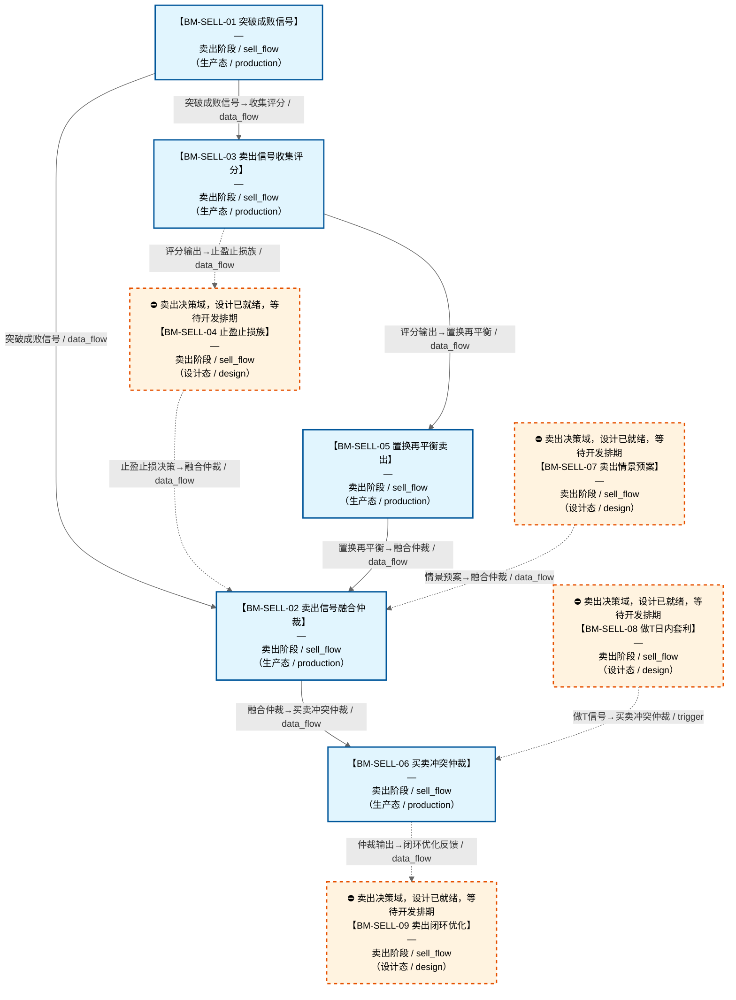

# 作战地图·卖出阶段

> **[可缩放 HTML 版 / Zoomable HTML](http://localhost:8765/docs/02_enterprise_architecture/07_trading_decision_architecture/battle_map/_zoomable_html/battle_map_07_sell_flow.html)** — Ctrl+滚轮缩放 ｜ 双击重置 ｜ Ctrl+Shift+D 切换拖动/选择模式

> battle_map §sell_flow 阶段，9 环节。
> 本文档由 `generate_battle_map_diagram.py` 自动生成，禁止手编。

## 文档基本信息 / Document Overview

| 字段 | 值 | Field | Value |
|------|------|-------|-------|
| 阶段 | 卖出（sell_flow） | Stage | 卖出 |
| 环节数 | 9 | Steps | 9 |
| 流转边 | 17 | Edges | 17 |
| 状态分布 | 🟦 运营态（已建）=5 ｜ 🟧 设计态（待施工）=4 | State Distribution | 🟦 运营态（已建）=5 ｜ 🟧 设计态（待施工）=4 |

> **图例说明 / Legend**：
> - 🟦 **蓝色实线 = 运营态环节**（production，锚点模块已建）
> - 🟧 **橙色虚线 = 设计态环节**（design，锚点模块待施工）
> - 🟥 **红色 = 弃用态**（deprecated）
> - ⬜ **灰色 = 缺失态**（missing，环节无锚点，BM-INV-001 违例）
> - 🟨 **黄色虚线 = 候选态**（candidate，承载模块在候选池）
> - **实线箭头 ``-->`` = 运营态流转**（两端均 production）
> - **虚线箭头 ``-.->`` = 非运营态流转**（含设计/候选/混合）

## 阶段图 / Stage Diagram

> 展示 卖出 阶段全部 9 个环节及流转边，颜色区分五态。

## 环节详情

### BM-SELL-01 突破成败信号

**6 件套（结构化，DB indicators JSONB）**：

| 要素 | 内容 |
|---|---|
| ① 触发条件 | 触及压力位后判定 阈值: N日站稳=成功；回落>阈值=失败；K≥3次失败=强制离场 |
| ② 消费数据/因子 | 压力位（前高/均线/斐波那契）（来自 BM-SEL-02 L1因子层） 挑战次数（来自 L2-A） |
| ③ 参数 | stand_days=N日（范围 3-10，代码当前: 待实现，状态: proposed） fail_pullback_threshold=阈值（范围 -，代码当前: 待实现，状态: proposed） force_exit_attempts=3（范围 2-5，代码当前: 3，状态: implemented） |
| ④ 数据流 | 输入: 压力位+挑战次数 → 处理: 突破成败判定 → 输出: 持有/止损/强制清仓信号 → 下游: BM-SELL-02 卖出融合仲裁 |
| ⑤ 代码映射 | MOD-待定 / 草图§1.4 v4.1 |
| ⑥ 降级/中止 | 突破成败判定未就绪 → 降级§8.2 支撑位破位→立即清仓 |

**锚点（环节↔模块双向关联）**：

| 目标图 | 目标ID | 角色 | 状态快照 | 真实build_status |
|---|---|---|---|---|
| depgraph | MOD-SELL-003 | primary | planned | stable |

**有效状态**：🟦 运营态（已建） ｜ **环节自报**：design ｜ **层**：L2A ｜ **阶段**：sell_flow

### BM-SELL-03 卖出信号收集评分

**6 件套（结构化，DB indicators JSONB）**：

| 要素 | 内容 |
|---|---|
| ① 触发条件 | 持仓分级触发(Watch秒级/Monitor 5分钟级/Hold事件驱动) 阈值: Watch List扫描=秒级 |
| ② 消费数据/因子 | 持仓列表(成本/盈亏/天数/状态)（来自 BM-POS-01） 7类卖出信号源（来自 L2-A/L2-B/L2-C/L2-D） L2-B主力阶段（来自 BM-SEL-05） L2-C市场状态+日历约束（来自 BM-SEL-03） L2-D黑天鹅事件（来自 BM-SEL-11） |
| ③ 参数 | Watch List扫描频率=秒级（范围 -，代码当前: 待实现，状态: proposed） Monitor List扫描频率=5分钟（范围 -，代码当前: 待实现，状态: proposed） 共振权重倍数=×1.5（范围 -，代码当前: 待实现，状态: proposed） 时间框架层级=日线→60min→15min（范围 -，代码当前: 日线/60min/15min/5min/UNKNOWN（SignalTimeFrame枚举），状态: implemented） 熊市卖出阈值降低=—（范围 -，代码当前: 待实现，状态: proposed） |
| ④ 数据流 | 输入: 持仓+7类信号源 → 处理: 分级+收集+多时间框架共振+市场状态条件化权重 → 输出: 卖出信号评分+紧迫度 → 下游: BM-SELL-02 融合仲裁 / BM-SELL-04 止盈止损族 |
| ⑤ 代码映射 | MOD-SELL-000+MOD-SELL-001+MOD-SELL-002 / 草图§1.4第零层+第一层（MOD-SELL-000分级+MOD-SELL-001收集+MOD-SELL-002评分） |
| ⑥ 降级/中止 | 评分器未就绪 → 各卖出信号独立触发不经过融合（保守原则） |

**锚点（环节↔模块双向关联）**：

| 目标图 | 目标ID | 角色 | 状态快照 | 真实build_status |
|---|---|---|---|---|
| depgraph | MOD-SELL-001 | primary | stable | stable |
| depgraph | MOD-SELL-002 | supplement | planned | planned |
| depgraph | MOD-SELL-000 | supplement | planned | planned |

**有效状态**：🟦 运营态（已建） ｜ **环节自报**：design ｜ **层**：L2A ｜ **阶段**：sell_flow

### BM-SELL-07 卖出情景预案

**6 件套（结构化，DB indicators JSONB）**：

| 要素 | 内容 |
|---|---|
| ① 触发条件 | 盘前预计算/盘中情景触发(暴跌>3%/黑天鹅/涨跌停/异常开盘/Gap) 阈值: 暴跌阈值3% |
| ② 消费数据/因子 | 大盘指数（来自 BM-SEL-01） 板块持仓（来自 BM-POS-01） 个股利空事件（来自 BM-SEL-11） 开盘数据（来自 D-MKT-DATA） 流动性（来自 BM-EXE-01） |
| ③ 参数 | 暴跌阈值=3%（范围 -，代码当前: 待实现，状态: proposed） Gap放量阈值=140%均量（范围 -，代码当前: 待实现，状态: proposed） Gap跌幅阈值=5%（范围 -，代码当前: 待实现，状态: proposed） Gap回补比例=50%（范围 -，代码当前: 待实现，状态: proposed） |
| ④ 数据流 | 输入: 盘前大盘/板块/事件 → 处理: 盘前预案生成→盘中情景匹配→预案执行(分批/市价/排队/集合竞价) → 输出: 6类卖出预案 → 下游: BM-SELL-02 融合仲裁 |
| ⑤ 代码映射 | MOD-SELL-013 / 草图§1.3 SELL-13 + C-005多情景对策 |
| ⑥ 降级/中止 | 预案器未就绪 → 退化为实时逐只卖出决策（跳过预案直接走BM-SELL-03收集评分） |

**锚点（环节↔模块双向关联）**：

| 目标图 | 目标ID | 角色 | 状态快照 | 真实build_status |
|---|---|---|---|---|
| depgraph | MOD-SELL-013 | primary | planned | planned |

**有效状态**：🟧 设计态（待施工） ｜ **环节自报**：design ｜ **层**：L3 ｜ **阶段**：sell_flow

### BM-SELL-04 止盈止损族

**6 件套（结构化，DB indicators JSONB）**：

| 要素 | 内容 |
|---|---|
| ① 触发条件 | 评分输出>阈值 / 突破成败信号触发 阈值: — |
| ② 消费数据/因子 | 卖出信号评分（来自 BM-SELL-03） 策略类型（来自 L3策略工厂） ATR波动率（来自 BM-SEL-02） 密度PDF分位数（来自 BM-SEL-13） 压力位/支撑位（来自 BM-SEL-02） 突破成败信号（来自 BM-SELL-01） |
| ③ 参数 | 止盈位=PDF 75%分位数（范围 -，代码当前: 待实现，状态: proposed） 止损位=PDF 5%分位数（范围 -，代码当前: 待实现，状态: proposed） 止损偏移=1-2%防猎杀（范围 -，代码当前: 待实现，状态: proposed） 趋势策略止损=宽止损+移动（范围 -，代码当前: 待实现，状态: proposed） 均值回归止损=中等+固定（范围 -，代码当前: 待实现，状态: proposed） 高频止损=极紧（范围 -，代码当前: 待实现，状态: proposed） Carry止损=极宽或无（范围 -，代码当前: 待实现，状态: proposed） |
| ④ 数据流 | 输入: 评分+策略类型+波动率 → 处理: 止盈策略族+止损策略族+逻辑止损族+猎杀防护+期权定价评估 → 输出: 止盈/止损决策(部分/全部清仓) → 下游: BM-SELL-02 融合仲裁 / BM-SELL-05 置换再平衡 |
| ⑤ 代码映射 | MOD-SELL-004+MOD-SELL-005/014/015/017 / 草图§1.4第二层（MOD-SELL-004止盈+MOD-SELL-005止损+MOD-SELL-014范式+MOD-SELL-015猎杀+MOD-SELL-017分批） |
| ⑥ 降级/中止 | 策略类型→止损范式映射未就绪 → 退化为固定止损范式 |

**锚点（环节↔模块双向关联）**：

| 目标图 | 目标ID | 角色 | 状态快照 | 真实build_status |
|---|---|---|---|---|
| depgraph | MOD-SELL-004 | primary | planned | planned |
| depgraph | MOD-SELL-005 | supplement | planned | planned |
| depgraph | MOD-SELL-014 | supplement | planned | generated |
| depgraph | MOD-SELL-015 | supplement | stable | stable |
| depgraph | MOD-SELL-017 | supplement | planned | planned |

**有效状态**：🟧 设计态（待施工） ｜ **环节自报**：design ｜ **层**：L3 ｜ **阶段**：sell_flow

### BM-SELL-05 置换再平衡卖出

**6 件套（结构化，DB indicators JSONB）**：

| 要素 | 内容 |
|---|---|
| ① 触发条件 | 候选池有更优标的 / 权重偏离>阈值 / 周五强制再平衡 阈值: — |
| ② 消费数据/因子 | 候选池(更优标的)（来自 BM-SEL-21） 当前持仓权重（来自 BM-POS-01） 目标权重（来自 BM-POS-02） 交易成本（来自 BM-EXE-03/C-046） |
| ③ 参数 | 组合漂移阈值=±2%（范围 -，代码当前: 0.05，状态: implemented） 单标的漂移阈值=±3%（范围 -，代码当前: 0.05，状态: implemented） 再平衡收益改善=>2×交易成本（范围 -，代码当前: 待实现，状态: proposed） 倒金字塔减仓=20%-30%-50%（范围 -，代码当前: 待实现，状态: proposed） 批次间隔=1交易日（范围 -，代码当前: 待实现，状态: proposed） 阴跌/加速下跌/恐慌崩盘成本系数=×1.5（范围 -，代码当前: 待实现，状态: proposed） |
| ④ 数据流 | 输入: 候选池+持仓权重 → 处理: 机会成本驱动置换+权重偏离再平衡+倒金字塔分批退出 → 输出: 置换/再平衡卖出清单 → 下游: BM-SELL-02 融合仲裁 → BM-POS-01 仓位调整 |
| ⑤ 代码映射 | MOD-SELL-006 / 草图§1.4 第二层（MOD-SELL-006置换+MOD-POS-004再平衡引擎） |
| ⑥ 降级/中止 | 再平衡引擎未就绪 → 仅机会成本驱动置换，跳过权重偏离再平衡 |

**锚点（环节↔模块双向关联）**：

| 目标图 | 目标ID | 角色 | 状态快照 | 真实build_status |
|---|---|---|---|---|
| depgraph | MOD-SELL-006 | primary | planned | stable |
| depgraph | MOD-POS-004 | supplement | planned | stable |

**有效状态**：🟦 运营态（已建） ｜ **环节自报**：design ｜ **层**：L3 ｜ **阶段**：sell_flow

### BM-SELL-08 做T日内套利

**6 件套（结构化，DB indicators JSONB）**：

| 要素 | 内容 |
|---|---|
| ① 触发条件 | 今日波动率预期>做T空间阈值 + 风险可控 + 底仓净数量不变 阈值: 做T胜率>70% |
| ② 消费数据/因子 | 全部持仓列表（来自 BM-POS-01） 分时因子(量比/CVD/VPIN)（来自 BM-SEL-02/C-009管线） C-011/C-035主力阶段（来自 BM-SEL-05） 流动性评分（来自 BM-EXE-01/C-004） 风控减仓名单（来自 BM-EXE-01） |
| ③ 参数 | 单次做T上限=≤底仓30%（范围 -，代码当前: 待实现，状态: proposed） 净收益门槛=≥1.5%（范围 -，代码当前: 待实现，状态: proposed） 失误止损=1.5%（范围 -，代码当前: 待实现，状态: proposed） 做T空间阈值=今日波动率预期（范围 -，代码当前: 待实现，状态: proposed） 单次最大亏损硬上限=—（范围 -，代码当前: 待实现，状态: proposed） |
| ④ 数据流 | 输入: 持仓+分时因子 → 处理: 做T机会识别+方向约束(强涨只正T/强跌只反T) → 输出: T-Trade指令(先买后卖/先卖后买) → 下游: BM-SELL-06 买卖冲突仲裁 + BM-POS-01 仓位裁决(底仓不变)→BM-EXE-01 风控→BM-EXE-02 执行 |
| ⑤ 代码映射 | MOD-SELL-018 / 草图§8.3 C-012 + §1.4第五层 T-Trade Coordinator |
| ⑥ 降级/中止 | 底仓不足/流动性不足/标的在风控减仓名单/C-035判定出货弃庄 → 做T信号直接丢弃（见§5.6注入规则表） |

**锚点（环节↔模块双向关联）**：

| 目标图 | 目标ID | 角色 | 状态快照 | 真实build_status |
|---|---|---|---|---|
| depgraph | MOD-SELL-018 | primary | planned | planned |

**有效状态**：🟧 设计态（待施工） ｜ **环节自报**：design ｜ **层**：L3 ｜ **阶段**：sell_flow

### BM-SELL-02 卖出信号融合仲裁

**6 件套（结构化，DB indicators JSONB）**：

| 要素 | 内容 |
|---|---|
| ① 触发条件 | 7类卖出信号+突破成败汇总 阈值: 最高优先级=强制清仓 |
| ② 消费数据/因子 | 突破成败信号（来自 BM-SELL-01） 7类卖出信号（来自 卖出策略工厂） |
| ③ 参数 | signal_count=7+1（范围 -，代码当前: 无最小信号数限制（加权平均融合，0信号返回0.0），状态: implemented） |
| ④ 数据流 | 输入: 多源卖出信号 → 处理: 融合仲裁（最高优先级取胜） → 输出: 卖出决策 → 下游: BM-POS-01 仓位裁决 |
| ⑤ 代码映射 | MOD-SELL-007+MOD-SELL-001/002/009 / 草图§1.4第三层（MOD-SELL-007融合+MOD-SELL-009紧迫度） |
| ⑥ 降级/中止 | 融合仲裁未就绪 → 降级各卖出信号独立触发（不经融合） |

**锚点（环节↔模块双向关联）**：

| 目标图 | 目标ID | 角色 | 状态快照 | 真实build_status |
|---|---|---|---|---|
| depgraph | MOD-SELL-007 | primary | planned | stable |
| depgraph | MOD-SELL-001 | supplement | planned | stable |
| depgraph | MOD-SELL-002 | supplement | planned | planned |
| depgraph | MOD-SELL-009 | supplement | stable | stable |

**有效状态**：🟦 运营态（已建） ｜ **环节自报**：design ｜ **层**：L3 ｜ **阶段**：sell_flow

### BM-SELL-06 买卖冲突仲裁

**6 件套（结构化，DB indicators JSONB）**：

| 要素 | 内容 |
|---|---|
| ① 触发条件 | 同标的同时有买入+卖出信号 / C-012做T vs 风控/庄家 / C-013 vs 风控 阈值: — |
| ② 消费数据/因子 | 买入信号（来自 BM-BUY-04） 卖出信号（来自 BM-SELL-03/04/05） C-012做T信号（来自 BM-BUY-05） C-004风控状态（来自 BM-EXE-01） C-035庄家阶段（来自 BM-SEL-05） C-013外部指令（来自 BM-BUY-06） |
| ③ 参数 | 买卖冲突=卖出优先(保守原则)（范围 -，代码当前: 待实现，状态: proposed） C-012 vs C-004=风控优先（范围 -，代码当前: 待实现，状态: proposed） C-012 vs C-035出货弃庄=做T信号丢弃（范围 -，代码当前: 待实现，状态: proposed） C-013 vs C-004=风控优先（范围 -，代码当前: 待实现，状态: proposed） 流动性不足 vs C-012=做T信号丢弃（范围 -，代码当前: 待实现，状态: proposed） |
| ④ 数据流 | 输入: 买卖信号+做T+外部指令+风控+庄家 → 处理: 冲突检测+优先级仲裁(§16冲突矩阵权威定义) → 输出: 统一决策指令 → 下游: BM-POS-01 仓位裁决 → BM-EXE-01 风控 → BM-EXE-02 执行 |
| ⑤ 代码映射 | MOD-SELL-008 / 草图§1.4 第四层 + §16冲突矩阵 |
| ⑥ 降级/中止 | 仲裁器未就绪 → 按硬规则(卖出优先/风控优先)兜底 |

**锚点（环节↔模块双向关联）**：

| 目标图 | 目标ID | 角色 | 状态快照 | 真实build_status |
|---|---|---|---|---|
| depgraph | MOD-SELL-008 | primary | stable | stable |

**有效状态**：🟦 运营态（已建） ｜ **环节自报**：design ｜ **层**：L3.5 ｜ **阶段**：sell_flow

### BM-SELL-09 卖出闭环优化

**6 件套（结构化，DB indicators JSONB）**：

| 要素 | 内容 |
|---|---|
| ① 触发条件 | 卖出执行完成后N天复盘 阈值: 复盘窗口N天 |
| ② 消费数据/因子 | 卖出执行回报（来自 BM-EXE-02） 卖出决策记录（来自 BM-SELL-02） 卖出后N天价格（来自 BM-SEL-01） |
| ③ 参数 | 复盘窗口=N天（范围 -，代码当前: 待实现，状态: proposed） 准确率分组维度=信号类型/策略类型（范围 -，代码当前: 待实现，状态: proposed） A/B显著性阈值=p<0.05（范围 -，代码当前: 待实现，状态: proposed） |
| ④ 数据流 | 输入: 卖出执行+决策记录+卖出后价格 → 处理: 准确率统计+A/B检验+执行质量评分 → 输出: 信号权重/策略参数调整建议 + E-SELL-04 SellLoopFeedback → 下游: D-REPORTING → 学习系统 → BM-SELL-03信号权重/BM-SELL-04策略参数/BM-EXE执行策略 |
| ⑤ 代码映射 | MOD-SELL-010+MOD-SELL-011+MOD-SELL-012 / 草图§1.4 SELL-10/11/12 + §7第四层 |
| ⑥ 降级/中止 | 闭环优化未就绪 → 跳过复盘，卖出策略参数保持静态不动态调整 |

**锚点（环节↔模块双向关联）**：

| 目标图 | 目标ID | 角色 | 状态快照 | 真实build_status |
|---|---|---|---|---|
| depgraph | MOD-SELL-010 | primary | planned | planned |
| depgraph | MOD-SELL-011 | supplement | planned | planned |
| depgraph | MOD-SELL-012 | supplement | planned | planned |

**有效状态**：🟧 设计态（待施工） ｜ **环节自报**：design ｜ **层**：L4 ｜ **阶段**：sell_flow

[← 返回总指挥图](battle_map_panorama.md)