# 作战地图·卖出阶段

> **[可缩放 HTML 版 / Zoomable HTML](http://localhost:8765/docs/02_enterprise_architecture/07_trading_decision_architecture/battle_map/_zoomable_html/battle_map_07_sell_flow.html)** — Ctrl+滚轮缩放 ｜ 双击重置 ｜ Ctrl+Shift+D 切换拖动/选择模式

> battle_map §sell_flow 阶段，14 环节（26 锚点）。
> 🔑 锚点表 `battle_map_anchors` 是环节↔模块**双向对齐枢纽**（step↔module 唯一查找真源），详见各环节「锚点」小节。
> 本文档由 `generate_battle_map_diagram.py` 自动生成，禁止手编。

## 文档基本信息 / Document Overview

| 字段 | 值 | Field | Value |
|------|------|-------|-------|
| 阶段 | 卖出（sell_flow） | Stage | 卖出 |
| 环节数 | 14 | Steps | 14 |
| 锚点数（双向对齐） | 26 | Anchors (Bidirectional) | 26 |
| 流转边 | 17 | Edges | 17 |
| 状态分布 | 🟦 运营态（已建）=7 ｜ 🟧 设计态（待施工）=7 | State Distribution | 🟦 运营态（已建）=7 ｜ 🟧 设计态（待施工）=7 |

> **图例说明 / Legend**：
> - 🟦 **蓝色实线 = 运营态环节**（production，锚点模块已建）
> - 🟧 **橙色虚线 = 设计态环节**（design，锚点模块待施工）
> - 🟧**设计态子环节** = 父环节已建但此子环节待施工（特殊标记，易被忽略）
> - 🟥 **红色 = 弃用态**（deprecated）
> - ⬜ **灰色 = 缺失态**（missing，环节无锚点，BM-INV-001 违例）
> - 🟨 **黄色虚线 = 候选态**（candidate，承载模块在候选池）
> - **实线箭头 ``-->`` = 运营态流转**（两端均 production）
> - **虚线箭头 ``-.->`` = 非运营态流转**（含设计/候选/混合）

## 阶段图 / Stage Diagram

> 展示 卖出 阶段全部 14 个环节及流转边，颜色区分五态。

```mermaid
%%{init: {'theme': 'base', 'themeVariables': {'primaryColor': '#eaeaea', 'primaryTextColor': '#333333', 'primaryBorderColor': '#666666', 'lineColor': '#666666', 'secondaryColor': '#eaeaea', 'tertiaryColor': '#eaeaea', 'clusterBkg': 'transparent', 'clusterBorder': 'transparent', 'fontSize': '14px'}}}%%
%% 卖出阶段图
flowchart TD
    BM_SELL_01["【BM-SELL-01 突破成败信号】<br/>判断股价冲压力位是冲上去了还是冲不动——冲上去留着<br/>，冲不动止损，连冲3次不行强制清仓。<br/>（生产态 / production）<br/>【Breakout Success/Failure Signal】"]
    BM_SELL_03["【BM-SELL-03 卖出信号收集评分】<br/>卖出端的'信号层'——先把持仓分级（Watch/Monitor<br/>/Hold），再收集7类卖出信号，多时间框架共振加权，<br/>产出卖出信号评分和紧迫度。<br/>（生产态 / production）<br/>【Sell Signal Collection &amp; Scoring】"]
    BM_SELL_07["⛔ 卖出决策域，设计已就绪，等待开发排期<br/>【BM-SELL-07 卖出情景预案】<br/>盘前预计算卖出预案——暴跌分级退出/板块联动<br/>/黑天鹅应急/涨跌停排队/异常开盘<br/>/Gap开盘决策，盘中触发时直接执行预案而非实时计算<br/>，对标Citadel PM式预案卖出。<br/>（设计态 / design）<br/>【Exit Scenario Planner】"]
    subgraph sg_BM_SELL_04 ["止盈止损族"]
        BM_SELL_04["⛔ 卖出决策域，设计已就绪，等待开发排期<br/>【BM-SELL-04 止盈止损族】<br/>卖出端的'策略工厂'——根据策略类型用不同的止盈止损<br/>范式（趋势宽止损/均值回归中止损/套利无止损<br/>/高频紧止损/Carry宽止损），叠加猎杀防护和期权定价<br/>评估。<br/>（设计态 / design）<br/>【Take-Profit &amp; Stop-Loss Strategy Family】"]
        BM_SELL_04_A["⛔ 卖出决策域，设计已就绪，等待开发排期<br/>【BM-SELL-04-A 止盈族】<br/>卖出时怎么止盈——固定止盈/移动止盈/分批止盈<br/>/时间加权止盈四种方式，根据策略类型选合适的止盈<br/>方法锁定利润。<br/>（设计态 / design）<br/>🟧设计态子环节<br/>【Take-Profit Strategy Family】"]
        BM_SELL_04_B["⛔ 卖出决策域，设计已就绪，等待开发排期<br/>【BM-SELL-04-B 止损族】<br/>卖出时怎么止损——固定止损/波动率止损（ATR）<br/>/密度感知止损/移动止损，叠加基本面/技术面/事件<br/>/主力出货的逻辑止损，控制亏损。<br/>（设计态 / design）<br/>🟧设计态子环节<br/>【Stop-Loss Strategy Family】"]
        BM_SELL_04_C["【BM-SELL-04-C 策略止损范式】<br/>不同策略用不同止损风格——趋势跟踪用宽止损<br/>（防被震出）、均值回归用中止损<br/>（不盈利即论点错误）、套利无传统止损、高频极紧止损<br/>、Carry极宽或无止损。<br/>（生产态 / production）<br/>【Strategy-Specific Stop Framework】"]
        BM_SELL_04_D["【BM-SELL-04-D 猎杀防护】<br/>防止损位被庄家猎杀——止损位偏移1-2%防猎杀，到止损<br/>位不立即卖而是进入观察期，收盘价确认才执行，把止<br/>损当隐含看跌期权定价评估成本。<br/>（生产态 / production）<br/>【Stop-Hunting Protection】"]
        BM_SELL_04_E["⛔ 卖出决策域，设计已就绪，等待开发排期<br/>【BM-SELL-04-E 分批退出】<br/>卖出时不一次卖完——等分退出（1/3-1/3-1/3）<br/>/倒金字塔（50-30-20）/混合退出<br/>/风险驱动退出，分批卖降低择时风险，反弹超阈值还<br/>能逆向中止。<br/>（设计态 / design）<br/>🟧设计态子环节<br/>【Scaling Out】"]
        BM_SELL_04 -.->|嵌套| BM_SELL_04_A
        BM_SELL_04 -.->|嵌套| BM_SELL_04_B
        BM_SELL_04 -.->|嵌套| BM_SELL_04_C
        BM_SELL_04 -.->|嵌套| BM_SELL_04_D
        BM_SELL_04 -.->|嵌套| BM_SELL_04_E
    end
    BM_SELL_05["【BM-SELL-05 置换再平衡卖出】<br/>机会成本驱动+权重偏离驱动的被动卖出——候选池有更<br/>优标的就卖A买B，权重偏离超阈值或周五强制再平衡就<br/>调整，用倒金字塔分批退出。<br/>（生产态 / production）<br/>【Replacement &amp; Rebalance Sell】"]
    BM_SELL_08["⛔ 卖出决策域，设计已就绪，等待开发排期<br/>【BM-SELL-08 做T日内套利】<br/>A股T+1约束下的日内套利——每天扫全部持仓，找有日内<br/>T+0空间的票，先买后卖或先卖后买赚差价，底仓净数<br/>量不变。<br/>（设计态 / design）<br/>【Intraday T+0 Arbitrage】"]
    BM_SELL_02["【BM-SELL-02 卖出信号融合仲裁】<br/>把所有卖出信号（含突破成败）汇总加权融合，算出综<br/>合卖出意愿0~1，再按紧迫度匹配执行策略——紧急清仓<br/>市价单、从容退出限价单耐心等。<br/>（生产态 / production）<br/>【Sell Signal Fusion Arbitration】"]
    BM_SELL_06["【BM-SELL-06 买卖冲突仲裁】<br/>同一只票同时有买入和卖出信号时怎么办——卖出优先<br/>（保守原则）；做T信号遇到风控减仓<br/>/庄家出货怎么办——直接丢弃；外部指令遇到风控拦截<br/>怎么办——风控优先。<br/>（生产态 / production）<br/>【Buy-Sell Conflict Arbitration】"]
    BM_SELL_09["⛔ 卖出决策域，设计已就绪，等待开发排期<br/>【BM-SELL-09 卖出闭环优化】<br/>卖出后复盘——统计信号准确率（假阳性<br/>/假阴性）、做策略A/B测试、追踪执行质量（滑点<br/>/冲击成本/延迟），反馈调整信号权重与策略参数，让<br/>卖出越做越准。<br/>（设计态 / design）<br/>【Sell Closed-loop Optimization】"]
    BM_SELL_01 ~~~ BM_SELL_07 ~~~ BM_SELL_04_A ~~~ BM_SELL_04_B ~~~ BM_SELL_04_C ~~~ BM_SELL_04_D ~~~ BM_SELL_04_E ~~~ BM_SELL_08
    BM_SELL_04 ~~~ BM_SELL_05
    BM_SELL_01 -->|突破成败信号 / data_flow| BM_SELL_02
    BM_SELL_01 -->|突破成败信号→收集评分 / data_flow| BM_SELL_03
    BM_SELL_03 -.->|评分输出→止盈止损族 / data_flow| BM_SELL_04
    BM_SELL_03 -->|评分输出→置换再平衡 / data_flow| BM_SELL_05
    BM_SELL_04 -.->|止盈止损决策→融合仲裁 / data_flow| BM_SELL_02
    BM_SELL_05 -->|置换再平衡→融合仲裁 / data_flow| BM_SELL_02
    BM_SELL_02 -->|融合仲裁→买卖冲突仲裁 / data_flow| BM_SELL_06
    BM_SELL_07 -.->|情景预案→融合仲裁 / data_flow| BM_SELL_02
    BM_SELL_08 -.->|做T信号→买卖冲突仲裁 / trigger| BM_SELL_06
    BM_SELL_06 -.->|仲裁输出→闭环优化反馈 / data_flow| BM_SELL_09
classDef production fill:#e1f5fe,stroke:#01579b,stroke-width:2px,color:#000
classDef design fill:#fff3e0,stroke:#e65100,stroke-width:2px,color:#000,stroke-dasharray: 5 5
classDef deprecated fill:#ffebee,stroke:#c62828,stroke-width:2px,color:#000
classDef missing fill:#eeeeee,stroke:#9e9e9e,stroke-width:2px,color:#000
classDef candidate fill:#fffde7,stroke:#f9a825,stroke-width:2px,color:#000,stroke-dasharray: 5 5
    class BM_SELL_01,BM_SELL_03,BM_SELL_04_C,BM_SELL_04_D,BM_SELL_05,BM_SELL_02,BM_SELL_06 production
    class BM_SELL_07,BM_SELL_04,BM_SELL_04_A,BM_SELL_04_B,BM_SELL_04_E,BM_SELL_08,BM_SELL_09 design
```

## 环节详情

### BM-SELL-01 突破成败信号 / Breakout Success/Failure Signal

> **大白话**：判断股价冲压力位是冲上去了还是冲不动——冲上去留着，冲不动止损，连冲3次不行强制清仓。

**机制说明**：

L2-A 层 v4.1。突破成败信号模型：压力位来自 L1 因子层，突破成功（N日站稳+放量）→持有/加仓，突破失败（回落>阈值）→止损，第 K≥3 次挑战失败→强制清仓。

**6 件套（结构化，DB indicators JSONB）**：

| 要素 | 内容 |
|---|---|
| ① 触发条件 | 触及压力位后判定 阈值: N日站稳=成功；回落>阈值=失败；K≥3次失败=强制离场 |
| ② 消费数据/因子 | 压力位（前高/均线/斐波那契）（来自 BM-SEL-02 L1因子层） 挑战次数（来自 L2-A） |
| ③ 参数 | stand_days=N日（范围 3-10，代码当前: 待实现，状态: proposed） fail_pullback_threshold=阈值（范围 -，代码当前: 待实现，状态: proposed） force_exit_attempts=3（范围 2-5，代码当前: 3，状态: implemented） |
| ④ 数据流 | 输入: 压力位+挑战次数 → 处理: 突破成败判定 → 输出: 持有/止损/强制清仓信号 → 下游: BM-SELL-02 卖出融合仲裁 |
| ⑤ 代码映射 | MOD-待定 / 草图§1.4 v4.1 |
| ⑥ 降级/中止 | 突破成败判定未就绪 → 降级§8.2 支撑位破位→立即清仓 |

**指标文案（翻译真源 indicators_zh）**：

①触发：触及压力位后判定；②消费：BM-SEL-02 压力位因子 + 挑战次数；③参数：stand_days=N日、fail_pullback_threshold、force_exit_attempts=3；④数据流：压力位+挑战次数→突破成败判定→持有/止损/清仓信号→BM-SELL-02；⑤代码：§1.4 v4.1；⑥降级：判定未就绪→§8.2 支撑位破位立即清仓。

**锚点（环节↔模块双向关联）**：

| 目标图 | 目标ID | 角色 | 状态快照 | 真实build_status |
|---|---|---|---|---|
| depgraph | MOD-SELL-003 | primary | planned | stable |

**有效状态**：🟦 运营态（已建） ｜ **环节自报**：design ｜ **层**：L2A ｜ **阶段**：sell_flow

### BM-SELL-03 卖出信号收集评分 / Sell Signal Collection & Scoring

> **大白话**：卖出端的"信号层"——先把持仓分级(Watch/Monitor/Hold)，再收集7类卖出信号，多时间框架共振加权，产出卖出信号评分和紧迫度。

**机制说明**：

§1.4 第零层持仓分级 + 第一层卖出信号层 + v6.0多时间框架共振。
第零层持仓分级(Position Triage)：不是所有持仓都需同等监控。🔴Watch List(亏损接近止损/主力异常/突破关键位/量价背离)→实时卖出信号生成+融合仲裁(秒级)；🟡Monitor List(正常持仓)→定期扫描(5分钟级)；🟢Hold List(深度盈利+远离止损+长期持有)→仅重大事件触发。分级维度：风险敞口/盈亏状态/信号活跃度/流动性/持仓状态机阶段。动态升降：Monitor→Watch(亏损扩大5%)/Watch→Monitor(风险解除)。
第一层7类卖出信号：基本面恶化/技术面顶部形态/量价背离/主力出货/相对强弱/机会成本置换/时间止损。v4.1突破成败信号(已在BM-SELL-01)。v8.2拥挤度卖出信号。
v6.0多时间框架共振：每个卖出信号标注时间框架(日线/60min/15min/5min)，三级嵌套(日线定方向→60min定日内趋势→15min定交易级信号)，共振检测(多时间框架同方向→权重×1.5)，冲突消解(小周期与大周期冲突→大周期为准)。
L2-B/C/D显式注入：L2-B吸筹期降权/出货期加权；L2-C熊市阈值降低/牛市提高；L2-C v8.0日历约束(交割日/财报前/节前)；L2-D黑天鹅→绕过融合仲裁直接强制卖出。

**6 件套（结构化，DB indicators JSONB）**：

| 要素 | 内容 |
|---|---|
| ① 触发条件 | 持仓分级触发(Watch秒级/Monitor 5分钟级/Hold事件驱动) 阈值: Watch List扫描=秒级 |
| ② 消费数据/因子 | 持仓列表(成本/盈亏/天数/状态)（来自 BM-POS-01） 7类卖出信号源（来自 L2-A/L2-B/L2-C/L2-D） L2-B主力阶段（来自 BM-SEL-05） L2-C市场状态+日历约束（来自 BM-SEL-03） L2-D黑天鹅事件（来自 BM-SEL-11） |
| ③ 参数 | Watch List扫描频率=秒级（范围 -，代码当前: 待实现，状态: proposed） Monitor List扫描频率=5分钟（范围 -，代码当前: 待实现，状态: proposed） 共振权重倍数=×1.5（范围 -，代码当前: 待实现，状态: proposed） 时间框架层级=日线→60min→15min（范围 -，代码当前: 日线/60min/15min/5min/UNKNOWN（SignalTimeFrame枚举），状态: implemented） 熊市卖出阈值降低=—（范围 -，代码当前: 待实现，状态: proposed） |
| ④ 数据流 | 输入: 持仓+7类信号源 → 处理: 分级+收集+多时间框架共振+市场状态条件化权重 → 输出: 卖出信号评分+紧迫度 → 下游: BM-SELL-02 融合仲裁 / BM-SELL-04 止盈止损族 |
| ⑤ 代码映射 | MOD-SELL-000+MOD-SELL-001+MOD-SELL-002 / 草图§1.4第零层+第一层（MOD-SELL-000分级+MOD-SELL-001收集+MOD-SELL-002评分） |
| ⑥ 降级/中止 | 评分器未就绪 → 各卖出信号独立触发不经过融合（保守原则） |

**指标文案（翻译真源 indicators_zh）**：

①触发：持仓分级触发(Watch秒级/Monitor 5分钟级/Hold事件驱动)；②消费：持仓列表(BM-POS-01)+7类卖出信号源(L2A/B/C/D)+主力阶段(BM-SEL-05)+市场状态+日历(BM-SEL-03)+黑天鹅事件(BM-SEL-11)；③参数：Watch秒级/Monitor 5分钟、共振权重×1.5、日线→60min→15min三级(proposed)；④数据流：持仓+信号源→分级+收集+共振+状态条件化权重→评分+紧迫度→融合仲裁/止盈止损族；⑤代码：MOD-SELL-000 持仓分级器(planned)+MOD-SELL-001 收集器(stable)+MOD-SELL-002 评分器(planned)；⑥降级：评分器未就绪→各卖出信号独立触发不经过融合(保守原则)。

**锚点（环节↔模块双向关联）**：

| 目标图 | 目标ID | 角色 | 状态快照 | 真实build_status |
|---|---|---|---|---|
| depgraph | MOD-SELL-001 | primary | stable | stable |
| depgraph | MOD-SELL-002 | supplement | planned | planned |
| depgraph | MOD-SELL-000 | supplement | planned | planned |

**有效状态**：🟦 运营态（已建） ｜ **环节自报**：design ｜ **层**：L2A ｜ **阶段**：sell_flow

### BM-SELL-07 卖出情景预案 / Exit Scenario Planner

> **大白话**：盘前预计算卖出预案——暴跌分级退出/板块联动/黑天鹅应急/涨跌停排队/异常开盘/Gap开盘决策，盘中触发时直接执行预案而非实时计算，对标Citadel PM式预案卖出。

**机制说明**：

§1.3 卖出情景预案层（SELL-13）+ C-005多情景对策。盘前预计算6类卖出预案，盘中触发直接执行预案（而非实时计算）。
①暴跌分级退出预案：大盘暴跌>3%→预定义退出优先级+退出方式+分批退出比例。
②板块联动卖出预案：同板块持仓集体评估→联动卖出（非逐只独立处理）。
③黑天鹅应急退出预案：个股突发利空→市价单+排队策略+次日集合竞价预案。
④涨跌停排队预案：封死涨跌停→次日集合竞价卖出方案+排队优先级。
⑤异常开盘预案：高开/低开异常→量价背离判定+分批退出vs持有观察决策树。
⑥v6.0 Gap开盘决策框架：Gap Up+放量(>140%均量)+创新高→趋势延续→持有；Gap Up+缩量+量价背离→诱多→反T卖出；Gap Down+恐慌放量+跌幅>5%→不卖最低点→等拉回再卖(OBSERVING)；Gap Down+缩量→主力洗盘→正T买入；Gap部分回补(50%)+量能不够→确认反转→卖出。
预案执行：盘前加载→盘中触发时直接执行预案。与BM-SELL-03收集评分联动（预案触发→信号源加权）。

**6 件套（结构化，DB indicators JSONB）**：

| 要素 | 内容 |
|---|---|
| ① 触发条件 | 盘前预计算/盘中情景触发(暴跌>3%/黑天鹅/涨跌停/异常开盘/Gap) 阈值: 暴跌阈值3% |
| ② 消费数据/因子 | 大盘指数（来自 BM-SEL-01） 板块持仓（来自 BM-POS-01） 个股利空事件（来自 BM-SEL-11） 开盘数据（来自 D-MKT-DATA） 流动性（来自 BM-EXE-01） |
| ③ 参数 | 暴跌阈值=3%（范围 -，代码当前: 待实现，状态: proposed） Gap放量阈值=140%均量（范围 -，代码当前: 待实现，状态: proposed） Gap跌幅阈值=5%（范围 -，代码当前: 待实现，状态: proposed） Gap回补比例=50%（范围 -，代码当前: 待实现，状态: proposed） |
| ④ 数据流 | 输入: 盘前大盘/板块/事件 → 处理: 盘前预案生成→盘中情景匹配→预案执行(分批/市价/排队/集合竞价) → 输出: 6类卖出预案 → 下游: BM-SELL-02 融合仲裁 |
| ⑤ 代码映射 | MOD-SELL-013 / 草图§1.3 SELL-13 + C-005多情景对策 |
| ⑥ 降级/中止 | 预案器未就绪 → 退化为实时逐只卖出决策（跳过预案直接走BM-SELL-03收集评分） |

**指标文案（翻译真源 indicators_zh）**：

①触发：盘前预计算/盘中情景触发(暴跌>3%/黑天鹅/涨跌停/异常开盘/Gap)；②消费：大盘指数+板块持仓+个股利空事件(BM-SEL-11)+开盘数据+流动性(BM-EXE-01)；③参数：暴跌阈值3%、Gap放量阈值140%均量、Gap跌幅阈值5%、回补比例50%(proposed)；④数据流：盘前大盘/板块/事件→6类预案生成→盘中情景匹配→预案执行(分批/市价/排队/集合竞价)→BM-SELL-02融合仲裁；⑤代码：MOD-SELL-013 exit_scenario_planner(planned)；⑥降级：预案器未就绪→退化为实时逐只卖出决策（跳过预案直接走BM-SELL-03收集评分）。

**锚点（环节↔模块双向关联）**：

| 目标图 | 目标ID | 角色 | 状态快照 | 真实build_status |
|---|---|---|---|---|
| depgraph | MOD-SELL-013 | primary | planned | planned |

**有效状态**：🟧 设计态（待施工） ｜ **环节自报**：design ｜ **层**：L3 ｜ **阶段**：sell_flow

### BM-SELL-04 止盈止损族 / Take-Profit & Stop-Loss Strategy Family

> **大白话**：卖出端的"策略工厂"——根据策略类型用不同的止盈止损范式(趋势宽止损/均值回归中止损/套利无止损/高频紧止损/Carry宽止损)，叠加猎杀防护和期权定价评估。

**机制说明**：

§1.4 第二层卖出策略工厂(C-006卖出子集) + v6.0策略类型→止损范式映射 + 止损猎杀防护 + 止损期权定价评估。
止盈策略族：固定止盈/移动止盈/分批止盈/时间加权止盈。
v6.0策略类型→止损范式映射层(Strategy-Specific Stop Framework)：趋势跟踪→宽止损(否则必被震出)+移动止损为主；均值回归→中等止损(不盈利=论点错误)+固定止损为主；统计套利→无传统止损(用组合对冲+仓位管理替代)；高频→极紧止损(论点失效立即退出)；Carry→极宽止损或无止损(接受小亏大赚)。
止损策略族：固定止损/波动率止损(ATR)/密度感知止损/移动止损。逻辑止损族：基本面/技术面/事件/主力出货止损。
v6.0止损猎杀防护(Stop-Hunting Protection)：止损位偏移1-2%防猎杀；软止损模式(到达止损位→不立即执行→进入OBSERVING观察期→收盘价<止损位→执行/收回→解除)。
v6.0止损期权定价评估(Stop-Loss as Embedded Option)：设止损=卖出隐含看跌期权→止损越紧隐含期权费越高→成本过高则换退出方式(时间止损/手动观察退出)。
v4.1突破成败策略族：压力位突破失败→止损卖出；第K次挑战失败(K≥3)→强制离场。
v6.0分批退出模式(Scaling Out)：等分退出(1/3-1/3-1/3)/倒金字塔(50%-30%-20%)/混合退出/风险驱动退出/逆向中止(第一批卖出后反弹超X%→暂停剩余批次)。
密度感知动态止盈止损：止盈位=条件PDF的75%分位数(正偏时更高/负偏时更保守)；止损位=条件PDF的5%分位数(厚尾时止损更宽/薄尾时更紧)。

**6 件套（结构化，DB indicators JSONB）**：

| 要素 | 内容 |
|---|---|
| ① 触发条件 | 评分输出>阈值 / 突破成败信号触发 阈值: — |
| ② 消费数据/因子 | 卖出信号评分（来自 BM-SELL-03） 策略类型（来自 L3策略工厂） ATR波动率（来自 BM-SEL-02） 密度PDF分位数（来自 BM-SEL-13） 压力位/支撑位（来自 BM-SEL-02） 突破成败信号（来自 BM-SELL-01） |
| ③ 参数 | 止盈位=PDF 75%分位数（范围 -，代码当前: 待实现，状态: proposed） 止损位=PDF 5%分位数（范围 -，代码当前: 待实现，状态: proposed） 止损偏移=1-2%防猎杀（范围 -，代码当前: 待实现，状态: proposed） 趋势策略止损=宽止损+移动（范围 -，代码当前: 待实现，状态: proposed） 均值回归止损=中等+固定（范围 -，代码当前: 待实现，状态: proposed） 高频止损=极紧（范围 -，代码当前: 待实现，状态: proposed） Carry止损=极宽或无（范围 -，代码当前: 待实现，状态: proposed） |
| ④ 数据流 | 输入: 评分+策略类型+波动率 → 处理: 止盈策略族+止损策略族+逻辑止损族+猎杀防护+期权定价评估 → 输出: 止盈/止损决策(部分/全部清仓) → 下游: BM-SELL-02 融合仲裁 / BM-SELL-05 置换再平衡 |
| ⑤ 代码映射 | MOD-SELL-004+MOD-SELL-005/014/015/017 / 草图§1.4第二层（MOD-SELL-004止盈+MOD-SELL-005止损+MOD-SELL-014范式+MOD-SELL-015猎杀+MOD-SELL-017分批） |
| ⑥ 降级/中止 | 策略类型→止损范式映射未就绪 → 退化为固定止损范式 |

**指标文案（翻译真源 indicators_zh）**：

①触发：评分输出>阈值/突破成败信号触发；②消费：卖出评分(BM-SELL-03)+策略类型(L3)+ATR波动率(BM-SEL-02)+密度PDF分位数(BM-SEL-13)+压力位/支撑位(BM-SEL-02)+突破成败信号(BM-SELL-01)；③参数：止盈位PDF 75%分位数、止损位PDF 5%分位数、止损偏移1-2%、趋势宽/均值回归中/高频紧/Carry宽(proposed)；④数据流：评分+策略类型+波动率→止盈族+止损族+逻辑止损+猎杀防护+期权定价→止盈/止损决策→融合仲裁/置换再平衡；⑤代码：MOD-SELL-004 止盈(planned)+MOD-SELL-005 止损(planned)+MOD-SELL-014 策略止损范式(planned)+MOD-SELL-015 猎杀防护(stable)+MOD-SELL-017 分批退出(planned)；⑥降级：策略类型→止损范式映射未就绪→退化为固定止损范式。

**锚点（环节↔模块双向关联）**：

| 目标图 | 目标ID | 角色 | 状态快照 | 真实build_status |
|---|---|---|---|---|
| depgraph | MOD-SELL-004 | primary | planned | planned |
| depgraph | MOD-SELL-005 | supplement | planned | planned |
| depgraph | MOD-SELL-014 | supplement | planned | generated |
| depgraph | MOD-SELL-015 | supplement | stable | stable |
| depgraph | MOD-SELL-017 | supplement | planned | planned |

**有效状态**：🟧 设计态（待施工） ｜ **环节自报**：design ｜ **层**：L3 ｜ **阶段**：sell_flow

### BM-SELL-04-A 止盈族 / Take-Profit Strategy Family

> **大白话**：卖出时怎么止盈——固定止盈/移动止盈/分批止盈/时间加权止盈四种方式，根据策略类型选合适的止盈方法锁定利润。

**机制说明**：

BM-SELL-04 止盈止损族的子环节（depth=1）。止盈策略族：固定止盈(到价即卖)/移动止盈(跟踪最高价回撤)/分批止盈(分档卖出)/时间加权止盈(持有越久止盈线越低)。密度感知动态止盈：止盈位=条件PDF的75%分位数(正偏时更高/负偏时更保守)。

**6 件套（结构化，DB indicators JSONB）**：

| 要素 | 内容 |
|---|---|
| ① 触发条件 | 评分输出>止盈阈值 阈值: — |
| ② 消费数据/因子 | 卖出信号评分（来自 BM-SELL-03） 密度PDF分位数（来自 BM-SEL-13） |
| ③ 参数 | 止盈位=PDF 75%分位数（范围 -，代码当前: 待实现，状态: proposed） 止盈范式=固定/移动/分批/时间加权（范围 -，代码当前: 待实现，状态: proposed） |
| ④ 数据流 | 输入: 评分+密度PDF → 处理: 止盈策略族(固定/移动/分批/时间加权)+密度感知动态止盈 → 输出: 止盈决策(触发条件+止盈比例+止盈紧迫度) → 下游: BM-SELL-02 融合仲裁 |
| ⑤ 代码映射 | MOD-SELL-004 / 草图§1.4止盈策略族 |
| ⑥ 降级/中止 | 密度感知未就绪 → 固定止盈 |

**指标文案（翻译真源 indicators_zh）**：

①触发：评分输出>止盈阈值；②消费：卖出评分(BM-SELL-03)+密度PDF分位数(BM-SEL-13)+策略类型(L3)；③参数：止盈位PDF 75%分位数、固定/移动/分批/时间加权模式(proposed)；④数据流：评分+PDF→止盈位计算→止盈信号→BM-SELL-04汇总→融合仲裁；⑤代码：MOD-SELL-004 止盈(planned)；⑥降级：密度PDF缺失→退化为固定止盈。

**锚点（环节↔模块双向关联）**：

| 目标图 | 目标ID | 角色 | 状态快照 | 真实build_status |
|---|---|---|---|---|
| depgraph | MOD-SELL-004 | primary | planned | planned |

**有效状态**：🟧 设计态（待施工） ｜ **环节自报**：design ｜ **层**：L3 ｜ **阶段**：sell_flow

### BM-SELL-04-B 止损族 / Stop-Loss Strategy Family

> **大白话**：卖出时怎么止损——固定止损/波动率止损(ATR)/密度感知止损/移动止损，叠加基本面/技术面/事件/主力出货的逻辑止损，控制亏损。

**机制说明**：

BM-SELL-04 止盈止损族的子环节（depth=1）。止损策略族：固定止损(到价即卖)/波动率止损(ATR动态)/密度感知止损/移动止损。逻辑止损族：基本面止损/技术面止损/事件止损/主力出货止损。密度感知动态止损：止损位=条件PDF的5%分位数(厚尾时更宽/薄尾时更紧)。

**6 件套（结构化，DB indicators JSONB）**：

| 要素 | 内容 |
|---|---|
| ① 触发条件 | 评分<止损阈值 / 突破失败信号 阈值: — |
| ② 消费数据/因子 | 卖出信号评分（来自 BM-SELL-03） ATR波动率（来自 BM-SEL-02） 密度PDF分位数（来自 BM-SEL-13） 突破成败信号（来自 BM-SELL-01） |
| ③ 参数 | 止损位=PDF 5%分位数（范围 -，代码当前: 待实现，状态: proposed） ATR倍数k=—（范围 1.5-2日内/3-4波段，代码当前: 待实现，状态: proposed） 止损范式=固定/ATR/密度感知/移动（范围 -，代码当前: 待实现，状态: proposed） |
| ④ 数据流 | 输入: 评分+波动率+突破信号 → 处理: 止损策略族+逻辑止损族+突破成败策略族+密度感知动态止损 → 输出: 止损决策/强制离场(第K次失败K≥3) → 下游: BM-SELL-02 融合仲裁 / 强制清仓 |
| ⑤ 代码映射 | MOD-SELL-005 / 草图§1.4止损策略族+逻辑止损族+突破成败策略族 |
| ⑥ 降级/中止 | 密度感知未就绪 → 固定/ATR止损 |

**指标文案（翻译真源 indicators_zh）**：

①触发：评分输出<止损阈值/逻辑止损信号触发；②消费：卖出评分(BM-SELL-03)+ATR波动率(BM-SEL-02)+密度PDF分位数(BM-SEL-13)+主力出货信号(BM-SEL-05)；③参数：止损位PDF 5%分位数、ATR倍数、固定/波动率/密度/移动模式(proposed)；④数据流：评分+波动率+PDF→止损位计算+逻辑止损检测→止损信号→BM-SELL-04汇总→融合仲裁；⑤代码：MOD-SELL-005 止损(planned)；⑥降级：ATR/PDF缺失→退化为固定止损。

**锚点（环节↔模块双向关联）**：

| 目标图 | 目标ID | 角色 | 状态快照 | 真实build_status |
|---|---|---|---|---|
| depgraph | MOD-SELL-005 | primary | planned | planned |

**有效状态**：🟧 设计态（待施工） ｜ **环节自报**：design ｜ **层**：L3 ｜ **阶段**：sell_flow

### BM-SELL-04-C 策略止损范式 / Strategy-Specific Stop Framework

> **大白话**：不同策略用不同止损风格——趋势跟踪用宽止损(防被震出)、均值回归用中止损(不盈利即论点错误)、套利无传统止损、高频极紧止损、Carry极宽或无止损。

**机制说明**：

BM-SELL-04 止盈止损族的子环节（depth=1）。v6.0策略类型→止损范式映射层：趋势跟踪→宽止损+移动止损为主；均值回归→中等止损+固定止损为主；统计套利→无传统止损(组合对冲+仓位管理替代)；高频→极紧止损(论点失效立即退出)；Carry→极宽止损或无止损(接受小亏大赚)。

**6 件套（结构化，DB indicators JSONB）**：

| 要素 | 内容 |
|---|---|
| ① 触发条件 | 策略类型确定 阈值: — |
| ② 消费数据/因子 | 策略类型（来自 L3 CapitalAllocationResult） |
| ③ 参数 | 趋势策略止损=宽止损+移动为主（范围 -，代码当前: 待实现，状态: proposed） 均值回归止损=中等+固定为主（范围 -，代码当前: 待实现，状态: proposed） 统计套利止损=无传统止损(组合对冲+仓位管理)（范围 -，代码当前: 待实现，状态: proposed） 高频止损=极紧(论点失效立即退出)（范围 -，代码当前: 待实现，状态: proposed） Carry止损=极宽或无(小亏大赚)（范围 -，代码当前: 待实现，状态: proposed） |
| ④ 数据流 | 输入: 策略类型 → 处理: 策略类型→止损范式映射 → 输出: StopParadigmSelection(范式选择) → 下游: BM-SELL-04-B 止损族参数调整 |
| ⑤ 代码映射 | MOD-SELL-014 / 草图§1.4 v6.0策略类型→止损范式映射层 |
| ⑥ 降级/中止 | 策略类型→止损范式映射未就绪 → 退化为固定止损范式 |

**指标文案（翻译真源 indicators_zh）**：

①触发：策略类型确定后映射止损范式；②消费：策略类型(L3 C-006策略工厂)+ATR波动率(BM-SEL-02)；③参数：趋势宽/均值回归中/高频紧/Carry宽/套利无(proposed)；④数据流：策略类型→止损范式映射→范式参数→BM-SELL-04-B止损族执行；⑤代码：MOD-SELL-014 策略止损范式(planned)；⑥降级：映射未就绪→退化为固定止损范式。

**锚点（环节↔模块双向关联）**：

| 目标图 | 目标ID | 角色 | 状态快照 | 真实build_status |
|---|---|---|---|---|
| depgraph | MOD-SELL-014 | primary | planned | generated |

**有效状态**：🟦 运营态（已建） ｜ **环节自报**：design ｜ **层**：L3 ｜ **阶段**：sell_flow

### BM-SELL-04-D 猎杀防护 / Stop-Hunting Protection

> **大白话**：防止损位被庄家猎杀——止损位偏移1-2%防猎杀，到止损位不立即卖而是进入观察期，收盘价确认才执行，把止损当隐含看跌期权定价评估成本。

**机制说明**：

BM-SELL-04 止盈止损族的子环节（depth=1）。v6.0止损猎杀防护：止损位偏移1-2%防猎杀；软止损模式(到达止损位→不立即执行→进入OBSERVING观察期→收盘价<止损位→执行/收回→解除)。止损期权定价评估：设止损=卖出隐含看跌期权→止损越紧隐含期权费越高→成本过高则换退出方式(时间止损/手动观察退出)。

**6 件套（结构化，DB indicators JSONB）**：

| 要素 | 内容 |
|---|---|
| ① 触发条件 | 止损位临近 阈值: — |
| ② 消费数据/因子 | 止损位（来自 BM-SELL-04-B） |
| ③ 参数 | 止损偏移=防猎杀偏移（范围 1-2%，代码当前: 待实现，状态: proposed） OBSERVING观察期=收盘价<止损位确认（范围 -，代码当前: 待实现，状态: proposed） 隐含期权费阈值=成本过高则换退出方式（范围 -，代码当前: 待实现，状态: proposed） |
| ④ 数据流 | 输入: 止损位 → 处理: 偏移+软止损OBSERVING+期权定价评估 → 输出: AdjustedStopLevel(调整后止损位与执行方式) → 下游: BM-SELL-04-B 止损族执行位调整 |
| ⑤ 代码映射 | MOD-SELL-015 / 草图§1.4 v6.0止损猎杀防护+止损期权定价评估 |
| ⑥ 降级/中止 | 期权定价未就绪 → 仅用偏移+软止损 |

**指标文案（翻译真源 indicators_zh）**：

①触发：价格触及止损位±偏移带；②消费：止损位(BM-SELL-04-B)+收盘价(L0行情)；③参数：止损偏移1-2%、软止损观察期、期权费阈值(proposed)；④数据流：止损位+偏移→猎杀防护带→软止损观察→确认执行/收回→BM-SELL-04汇总；⑤代码：MOD-SELL-015 猎杀防护(stable)；⑥降级：猎杀防护失效→硬止损立即执行(无观察期)。

**锚点（环节↔模块双向关联）**：

| 目标图 | 目标ID | 角色 | 状态快照 | 真实build_status |
|---|---|---|---|---|
| depgraph | MOD-SELL-015 | primary | stable | stable |

**有效状态**：🟦 运营态（已建） ｜ **环节自报**：design ｜ **层**：L3 ｜ **阶段**：sell_flow

### BM-SELL-04-E 分批退出 / Scaling Out

> **大白话**：卖出时不一次卖完——等分退出(1/3-1/3-1/3)/倒金字塔(50-30-20)/混合退出/风险驱动退出，分批卖降低择时风险，反弹超阈值还能逆向中止。

**机制说明**：

BM-SELL-04 止盈止损族的子环节（depth=1）。v6.0分批退出模式：等分退出(1/3-1/3-1/3)/倒金字塔(50%-30%-20%)/混合退出(止盈第一批+移动止损第二批)/风险驱动退出(按MRC减仓)/逆向中止(第一批卖出后反弹超X%→暂停剩余批次→重新评估)。

**6 件套（结构化，DB indicators JSONB）**：

| 要素 | 内容 |
|---|---|
| ① 触发条件 | 止盈/止损决策需分批执行 阈值: — |
| ② 消费数据/因子 | 止盈决策（来自 BM-SELL-04-A） 止损决策（来自 BM-SELL-04-B） 紧迫度（来自 BM-SELL-02） |
| ③ 参数 | 分批比例=等分1/3-1/3-1/3/倒金字塔50-30-20/混合/风险驱动（范围 -，代码当前: 待实现，状态: proposed） 反弹中止阈值X%=第一批卖出后反弹超X%→暂停（范围 -，代码当前: 待实现，状态: proposed） 批次间隔=—（范围 ≥1交易日/紧迫>0.8可盘中，代码当前: 待实现，状态: proposed） |
| ④ 数据流 | 输入: 止盈/止损决策+紧迫度 → 处理: 分批退出计划(等分/倒金字塔/混合/风险驱动)+逆向中止 → 输出: ScalingOutPlan(分批订单计划) → 下游: D-EX-CORE 分批下单 |
| ⑤ 代码映射 | MOD-SELL-017 / 草图§1.4 v6.0分批退出模式 |
| ⑥ 降级/中止 | 分批计划未就绪 → 一次性执行 |

**指标文案（翻译真源 indicators_zh）**：

①触发：止盈/止损决策需分批执行；②消费：止盈/止损信号(BM-SELL-04-A/B)+仓位(BM-POS-01)+反弹幅度(L0)；③参数：等分/倒金字塔/混合/风险驱动模式、批次比例、逆向中止反弹阈值X%(proposed)；④数据流：止盈止损信号→分批模式选择→批次执行计划→BM-SELL-04汇总→执行；⑤代码：MOD-SELL-017 分批退出(planned)；⑥降级：分批引擎未就绪→一次性全部退出。

**锚点（环节↔模块双向关联）**：

| 目标图 | 目标ID | 角色 | 状态快照 | 真实build_status |
|---|---|---|---|---|
| depgraph | MOD-SELL-017 | primary | planned | planned |

**有效状态**：🟧 设计态（待施工） ｜ **环节自报**：design ｜ **层**：L3 ｜ **阶段**：sell_flow

### BM-SELL-05 置换再平衡卖出 / Replacement & Rebalance Sell

> **大白话**：机会成本驱动+权重偏离驱动的被动卖出——候选池有更优标的就卖A买B，权重偏离超阈值或周五强制再平衡就调整，用倒金字塔分批退出。

**机制说明**：

§1.4 第二层置换策略族 + 组合再平衡驱动卖出 + v6.0分批退出模式。
置换策略族：机会成本驱动的卖出(卖A买B)——候选池有更优标的→置换卖出当前持仓中相对弱势的标的。
组合再平衡驱动卖出：权重偏离>阈值→被动卖出。§20.13约束13.3-13.4：组合总仓位漂移>±2%触发再平衡评估；单标的漂移>±3%触发标的级再平衡评估。再平衡执行前必须计算预期收益改善vs交易成本(佣金+滑点+冲击成本)，只有预期收益改善>2×交易成本时才执行。市场状态为⑦阴跌/⑧加速下跌/⑨恐慌崩盘时成本系数×1.5。
v6.0分批退出模式(Scaling Out Architecture)：等分退出(1/3-1/3-1/3)/倒金字塔退出(50%-30%-20%)/混合退出(止盈第一批+移动止损第二批)/风险驱动退出(按MRC减仓)/逆向中止条件(第一批卖出后价格反弹超X%→暂停剩余批次→重新评估)。批次间隔：至少1个交易日/紧迫度>0.8时可缩短至盘中。
再平衡频率(§20.3)：日频信号驱动+周频强制再平衡(每周五收盘后)。

**6 件套（结构化，DB indicators JSONB）**：

| 要素 | 内容 |
|---|---|
| ① 触发条件 | 候选池有更优标的 / 权重偏离>阈值 / 周五强制再平衡 阈值: — |
| ② 消费数据/因子 | 候选池(更优标的)（来自 BM-SEL-21） 当前持仓权重（来自 BM-POS-01） 目标权重（来自 BM-POS-02） 交易成本（来自 BM-EXE-03/C-046） |
| ③ 参数 | 组合漂移阈值=±2%（范围 -，代码当前: 0.05，状态: implemented） 单标的漂移阈值=±3%（范围 -，代码当前: 0.05，状态: implemented） 再平衡收益改善=>2×交易成本（范围 -，代码当前: 待实现，状态: proposed） 倒金字塔减仓=20%-30%-50%（范围 -，代码当前: 待实现，状态: proposed） 批次间隔=1交易日（范围 -，代码当前: 待实现，状态: proposed） 阴跌/加速下跌/恐慌崩盘成本系数=×1.5（范围 -，代码当前: 待实现，状态: proposed） |
| ④ 数据流 | 输入: 候选池+持仓权重 → 处理: 机会成本驱动置换+权重偏离再平衡+倒金字塔分批退出 → 输出: 置换/再平衡卖出清单 → 下游: BM-SELL-02 融合仲裁 → BM-POS-01 仓位调整 |
| ⑤ 代码映射 | MOD-SELL-006 / 草图§1.4 第二层（MOD-SELL-006置换+MOD-POS-004再平衡引擎） |
| ⑥ 降级/中止 | 再平衡引擎未就绪 → 仅机会成本驱动置换，跳过权重偏离再平衡 |

**指标文案（翻译真源 indicators_zh）**：

①触发：候选池有更优标的/权重偏离>阈值/周五强制再平衡；②消费：候选池(BM-SEL-21)+当前持仓权重(BM-POS-01)+目标权重(BM-POS-02)+交易成本(BM-EXE-03)；③参数：组合漂移±2%、单标的±3%、再平衡收益改善>2×成本、倒金字塔20-30-50%、批次间隔1交易日、阴跌/加速下跌/恐慌崩盘成本×1.5(proposed)；④数据流：候选池+持仓权重→机会成本置换+权重偏离再平衡+倒金字塔分批→卖出清单→融合仲裁→仓位调整；⑤代码：MOD-SELL-006 置换(planned)+MOD-POS-004 再平衡引擎(planned)；⑥降级：再平衡引擎未就绪→仅机会成本驱动置换，跳过权重偏离再平衡。

**锚点（环节↔模块双向关联）**：

| 目标图 | 目标ID | 角色 | 状态快照 | 真实build_status |
|---|---|---|---|---|
| depgraph | MOD-SELL-006 | primary | planned | stable |
| depgraph | MOD-POS-004 | supplement | planned | stable |

**有效状态**：🟦 运营态（已建） ｜ **环节自报**：design ｜ **层**：L3 ｜ **阶段**：sell_flow

### BM-SELL-08 做T日内套利 / Intraday T+0 Arbitrage

> **大白话**：A股T+1约束下的日内套利——每天扫全部持仓，找有日内T+0空间的票，先买后卖或先卖后买赚差价，底仓净数量不变。

**机制说明**：

§8.3 C-012 独立做T信号管线 + §1.4第五层 T-Trade Coordinator。每日扫描全部持仓→分析每只当天是否有日内套利空间。
触发条件三选三全满足：今日波动率预期>做T空间阈值 + 风险可控(单次最大亏损<硬上限) + 底仓净数量不变。
两种模式：先买后卖(低位买入→高位卖出底仓部分) / 先卖后买(高位卖出底仓→低位买回)。
方向约束：黄线持续向上(强涨)→只做正T / 黄线持续向下(强跌)→只做反T。
做T仓位铁律：单次做T≤底仓30% / 净收益<1.5%不做 / 失误止损1.5% / 做T胜率目标>70%。
与其他信号交互(§5.6注入规则表权威定义)：C-004风控减仓→做T信号直接丢弃；C-035判定出货/弃庄→做T信号自动丢弃；流动性不足→做T信号丢弃；C-011洗盘阶段→做T允许。

**6 件套（结构化，DB indicators JSONB）**：

| 要素 | 内容 |
|---|---|
| ① 触发条件 | 今日波动率预期>做T空间阈值 + 风险可控 + 底仓净数量不变 阈值: 做T胜率>70% |
| ② 消费数据/因子 | 全部持仓列表（来自 BM-POS-01） 分时因子(量比/CVD/VPIN)（来自 BM-SEL-02/C-009管线） C-011/C-035主力阶段（来自 BM-SEL-05） 流动性评分（来自 BM-EXE-01/C-004） 风控减仓名单（来自 BM-EXE-01） |
| ③ 参数 | 单次做T上限=≤底仓30%（范围 -，代码当前: 待实现，状态: proposed） 净收益门槛=≥1.5%（范围 -，代码当前: 待实现，状态: proposed） 失误止损=1.5%（范围 -，代码当前: 待实现，状态: proposed） 做T空间阈值=今日波动率预期（范围 -，代码当前: 待实现，状态: proposed） 单次最大亏损硬上限=—（范围 -，代码当前: 待实现，状态: proposed） |
| ④ 数据流 | 输入: 持仓+分时因子 → 处理: 做T机会识别+方向约束(强涨只正T/强跌只反T) → 输出: T-Trade指令(先买后卖/先卖后买) → 下游: BM-SELL-06 买卖冲突仲裁 + BM-POS-01 仓位裁决(底仓不变)→BM-EXE-01 风控→BM-EXE-02 执行 |
| ⑤ 代码映射 | MOD-SELL-018 / 草图§8.3 C-012 + §1.4第五层 T-Trade Coordinator |
| ⑥ 降级/中止 | 底仓不足/流动性不足/标的在风控减仓名单/C-035判定出货弃庄 → 做T信号直接丢弃（见§5.6注入规则表） |

**指标文案（翻译真源 indicators_zh）**：

①触发：今日波动率预期>做T空间阈值+风险可控+底仓不变(做T胜率>70%)；②消费：全部持仓(BM-POS-01)+分时因子(BM-SEL-02)+主力阶段(BM-SEL-05)+流动性评分(BM-EXE-01)+风控减仓名单(BM-EXE-01)；③参数：单次做T≤底仓30%、净收益≥1.5%、失误止损1.5%(proposed)；④数据流：持仓+分时→机会识别+方向约束→T指令→仓位裁决(底仓不变)→风控→执行；⑤代码：MOD-SELL-018 t_trade_coordinator(planned)；⑥降级：底仓不足/流动性不足/风控减仓/庄家出货弃庄→做T信号直接丢弃。

**锚点（环节↔模块双向关联）**：

| 目标图 | 目标ID | 角色 | 状态快照 | 真实build_status |
|---|---|---|---|---|
| depgraph | MOD-SELL-018 | primary | planned | planned |

**有效状态**：🟧 设计态（待施工） ｜ **环节自报**：design ｜ **层**：L3 ｜ **阶段**：sell_flow

### BM-SELL-02 卖出信号融合仲裁 / Sell Signal Fusion Arbitration

> **大白话**：把所有卖出信号（含突破成败）汇总加权融合，算出综合卖出意愿0~1，再按紧迫度匹配执行策略——紧急清仓市价单、从容退出限价单耐心等。

**机制说明**：

§1.4 第三层融合仲裁层（SELL-07/09）+ §7第三层。
多信号加权融合（SELL-07）：多卖出信号加权融合（如止盈70%+主力出货85%→综合卖出意愿评分0~1）+融合算法三选——加权平均（基线）/贝叶斯融合（含先验更新）/Dempster-Shafer证据理论（处理信号冲突不确定性）+信号一致性检查（同标的多信号方向一致性）。
紧迫度评分→执行策略映射（SELL-09）：紧急清仓（风控触发/主力弃庄/第K次挑战失败K≥3）→紧迫度1.0→市价单快速执行；中等（技术面卖出/相对强弱卖出）→紧迫度0.6→限价单+时间限制；从容退出（止盈/再平衡）→紧迫度0.3→限价单+耐心等待。
最高优先级规则：强制清仓（风控/黑天鹅）永远取胜，绕过融合意愿评分直接执行。卖出决策引擎是复合能力（§20.16），不单独分配 C 编号。

**6 件套（结构化，DB indicators JSONB）**：

| 要素 | 内容 |
|---|---|
| ① 触发条件 | 7类卖出信号+突破成败汇总 阈值: 最高优先级=强制清仓 |
| ② 消费数据/因子 | 突破成败信号（来自 BM-SELL-01） 7类卖出信号（来自 卖出策略工厂） |
| ③ 参数 | signal_count=7+1（范围 -，代码当前: 无最小信号数限制（加权平均融合，0信号返回0.0），状态: implemented） |
| ④ 数据流 | 输入: 多源卖出信号 → 处理: 融合仲裁（最高优先级取胜） → 输出: 卖出决策 → 下游: BM-POS-01 仓位裁决 |
| ⑤ 代码映射 | MOD-SELL-007+MOD-SELL-001/002/009 / 草图§1.4第三层（MOD-SELL-007融合+MOD-SELL-009紧迫度） |
| ⑥ 降级/中止 | 融合仲裁未就绪 → 降级各卖出信号独立触发（不经融合） |

**指标文案（翻译真源 indicators_zh）**：

①触发：7类卖出信号+突破成败汇总+风控强制清仓；②消费：BM-SELL-01 突破成败 + 卖出策略工厂7类信号(BM-SELL-04/05) + 收集评分(BM-SELL-03)；③参数：融合算法=加权平均/贝叶斯/D-S证据、紧迫度阈值1.0/0.6/0.3、共振权重×1.5(proposed)；④数据流：多源卖出信号→加权融合(综合意愿0~1)+紧迫度评分→执行策略映射→卖出决策→BM-SELL-06买卖冲突仲裁→BM-POS-01；⑤代码：MOD-SELL-007 融合引擎(stable)+MOD-SELL-009 紧迫度评分器(stable)；⑥降级：融合未就绪→各信号独立触发(止盈/止损/风控卖出各自直接执行，跳过融合仲裁)。

**锚点（环节↔模块双向关联）**：

| 目标图 | 目标ID | 角色 | 状态快照 | 真实build_status |
|---|---|---|---|---|
| depgraph | MOD-SELL-007 | primary | planned | stable |
| depgraph | MOD-SELL-001 | supplement | planned | stable |
| depgraph | MOD-SELL-002 | supplement | planned | planned |
| depgraph | MOD-SELL-009 | supplement | stable | stable |

**有效状态**：🟦 运营态（已建） ｜ **环节自报**：design ｜ **层**：L3 ｜ **阶段**：sell_flow

### BM-SELL-06 买卖冲突仲裁 / Buy-Sell Conflict Arbitration

> **大白话**：同一只票同时有买入和卖出信号时怎么办——卖出优先(保守原则)；做T信号遇到风控减仓/庄家出货怎么办——直接丢弃；外部指令遇到风控拦截怎么办——风控优先。

**机制说明**：

§1.4 第四层卖出信号融合与仲裁 + §16能力冲突矩阵(权威定义)。
卖出vs买入冲突仲裁：同标的有买入+卖出信号→卖出优先(保守原则)。
部分卖出vs全部清仓决策树：根据卖出紧迫度评分(紧急清仓vs从容退出)+信号强度决定。
卖出紧迫度评分：紧急清仓(黑天鹅/风控熔断)vs从容退出(机会成本/再平衡)。
§16冲突矩阵权威定义的交互规则(与§9.3重叠条目以§16为准)：
  C-004风控拦截 vs C-013外部指令→风控>用户指令，建仓被拦截→通知用户(C-004优先)；
  C-004风控拦截 vs C-031置信度→风控不可被AI否决，人类也不可撤销已执行风控动作(C-004优先)；
  C-012做T vs C-004风控→标的在风控减仓名单→做T信号直接丢弃(C-004优先)；
  C-012做T vs C-035庄家→庄家出货/弃庄阶段→做T信号自动丢弃(C-035优先)；
  流动性不足 vs C-012做T→标的流动性评分低于阈值→做T信号丢弃(流动性优先)；
  C-032资金曲线异常 vs C-004熔断→连续亏损→C-015告警→触发C-031降级(C-032→C-031)；
  相关性体制切换 vs C-004 VaR→相关性趋同→VaR置信度上调+仓位上限降低；
  体制转换预警 vs C-005多情景对策→HMM/CUSUM检测到体制转换→预案自动切换为保守型；
  密度预测尾部风险 vs C-004风控→前瞻性95%CVaR>阈值→触发风控减仓(即使历史模拟VaR未超限)；
  密度预测校准失败 vs C-004风控→尾部校准不通过→前瞻性VaR/CVaR降级为历史模拟+流动性溢价；
  密度预测偏度 vs C-031置信度→PDF偏度与信号方向相反→置信度下调15%→可能降级执行模式。
跨域 Hard Block 与卖出约束（D-RISK §7.2/§7.x，SURV-005）：跌停板不卖出——当前价=跌停价时不提交卖出订单（无法成交，RK-02 Pre-Trade Checker Hard Block），卖出决策标记"跌停待执行"排队次日集合竞价；尾盘操纵检测——收盘前N分钟异常交易（C-004/RK-03）影响卖出信号可信度；假拉升真出货——拉升段主动卖单占比>60%判定为假拉升（对倒/卖单主导），触发主力出货卖出信号加权（SELL-01④主力出货）+仓位上限下调拒绝追高买入。

**6 件套（结构化，DB indicators JSONB）**：

| 要素 | 内容 |
|---|---|
| ① 触发条件 | 同标的同时有买入+卖出信号 / C-012做T vs 风控/庄家 / C-013 vs 风控 阈值: — |
| ② 消费数据/因子 | 买入信号（来自 BM-BUY-04） 卖出信号（来自 BM-SELL-03/04/05） C-012做T信号（来自 BM-SELL-08） C-004风控状态（来自 BM-EXE-01） C-035庄家阶段（来自 BM-SEL-05） C-013外部指令（来自 BM-BUY-06） |
| ③ 参数 | 买卖冲突=卖出优先(保守原则)（范围 -，代码当前: 待实现，状态: proposed） C-012 vs C-004=风控优先（范围 -，代码当前: 待实现，状态: proposed） C-012 vs C-035出货弃庄=做T信号丢弃（范围 -，代码当前: 待实现，状态: proposed） C-013 vs C-004=风控优先（范围 -，代码当前: 待实现，状态: proposed） 流动性不足 vs C-012=做T信号丢弃（范围 -，代码当前: 待实现，状态: proposed） |
| ④ 数据流 | 输入: 买卖信号+做T+外部指令+风控+庄家 → 处理: 冲突检测+优先级仲裁(§16冲突矩阵权威定义) → 输出: 统一决策指令 → 下游: BM-POS-01 仓位裁决 → BM-EXE-01 风控 → BM-EXE-02 执行 |
| ⑤ 代码映射 | MOD-SELL-008 / 草图§1.4 第四层 + §16冲突矩阵 |
| ⑥ 降级/中止 | 仲裁器未就绪 → 按硬规则(卖出优先/风控优先)兜底 |

**指标文案（翻译真源 indicators_zh）**：

①触发：同标的同时有买入+卖出信号/C-012做T vs 风控庄家/C-013 vs 风控/跌停板卖出约束；②消费：买入信号(BM-BUY-04)+卖出信号(BM-SELL-03/04/05)+做T信号(BM-SELL-08)+风控状态(BM-EXE-01)+庄家阶段(BM-SEL-05)+外部指令(BM-BUY-06)+跌停板价格状态(D-RISK SURV-005)；③参数：买卖冲突→卖出优先、C-012 vs C-004→风控优先、C-012 vs C-035出货弃庄→做T丢弃、C-013 vs C-004→风控优先、流动性不足 vs C-012→做T丢弃、跌停板→不提交卖单排队次日(proposed)；④数据流：买卖信号+做T+外部指令+风控+庄家+跌停约束→冲突检测+优先级仲裁(§16权威)→统一决策→仓位裁决→风控→执行；⑤代码：MOD-SELL-008 buy_sell_conflict_arbitrator(stable)；⑥降级：仲裁器未就绪→按硬规则(卖出优先/风控优先)兜底。

**锚点（环节↔模块双向关联）**：

| 目标图 | 目标ID | 角色 | 状态快照 | 真实build_status |
|---|---|---|---|---|
| depgraph | MOD-SELL-008 | primary | stable | stable |

**有效状态**：🟦 运营态（已建） ｜ **环节自报**：design ｜ **层**：L3.5 ｜ **阶段**：sell_flow

### BM-SELL-09 卖出闭环优化 / Sell Closed-loop Optimization

> **大白话**：卖出后复盘——统计信号准确率(假阳性/假阴性)、做策略A/B测试、追踪执行质量(滑点/冲击成本/延迟)，反馈调整信号权重与策略参数，让卖出越做越准。

**机制说明**：

§1.4 卖出闭环优化层（SELL-10/11/12）+ §7第四层。卖出后N天复盘三维度。
SELL-10 卖出信号准确率监控：卖出后N天内是否继续下跌？→准确率统计(按信号类型/策略类型分组)+假阳性分析(卖了又涨→止损过紧?)+假阴性分析(没卖继续跌→信号漏判?)+准确率趋势→动态调整信号权重。
SELL-11 卖出策略A/B测试：止盈线8% vs 10%/移动止损vs固定止损/分批止盈vs一次性止盈→统计显著性检验→参数调整建议。
SELL-12 卖出执行质量追踪：滑点/冲击成本/执行延迟/分批执行效果→执行质量评分→反馈至卖出执行策略优化。
产出 E-SELL-04 SellLoopFeedback → D-REPORTING → C-010/C-007/C-033 → 学习系统，闭环反馈给 BM-SELL-03 信号权重 + BM-SELL-04 策略参数 + BM-EXE 执行策略。

**6 件套（结构化，DB indicators JSONB）**：

| 要素 | 内容 |
|---|---|
| ① 触发条件 | 卖出执行完成后N天复盘 阈值: 复盘窗口N天 |
| ② 消费数据/因子 | 卖出执行回报（来自 BM-EXE-02） 卖出决策记录（来自 BM-SELL-02） 卖出后N天价格（来自 BM-SEL-01） |
| ③ 参数 | 复盘窗口=N天（范围 -，代码当前: 待实现，状态: proposed） 准确率分组维度=信号类型/策略类型（范围 -，代码当前: 待实现，状态: proposed） A/B显著性阈值=p<0.05（范围 -，代码当前: 待实现，状态: proposed） |
| ④ 数据流 | 输入: 卖出执行+决策记录+卖出后价格 → 处理: 准确率统计+A/B检验+执行质量评分 → 输出: 信号权重/策略参数调整建议 + E-SELL-04 SellLoopFeedback → 下游: D-REPORTING → 学习系统 → BM-SELL-03信号权重/BM-SELL-04策略参数/BM-EXE执行策略 |
| ⑤ 代码映射 | MOD-SELL-010+MOD-SELL-011+MOD-SELL-012 / 草图§1.4 SELL-10/11/12 + §7第四层 |
| ⑥ 降级/中止 | 闭环优化未就绪 → 跳过复盘，卖出策略参数保持静态不动态调整 |

**指标文案（翻译真源 indicators_zh）**：

①触发：卖出执行完成后N天复盘；②消费：卖出执行回报(BM-EXE-02)+卖出决策记录(BM-SELL-02)+卖出后N天价格(BM-SEL-01)；③参数：复盘窗口N天、准确率分组维度(信号类型/策略类型)、A/B显著性阈值(proposed)；④数据流：卖出执行+决策记录+卖出后价格→准确率统计+A/B检验+执行质量评分→信号权重/策略参数调整建议→E-SELL-04 SellLoopFeedback→D-REPORTING→学习系统；⑤代码：MOD-SELL-010 准确率监控(planned)+MOD-SELL-011 A/B测试(planned)+MOD-SELL-012 执行质量追踪(planned)；⑥降级：闭环优化未就绪→跳过复盘，卖出策略参数保持静态不动态调整。

**锚点（环节↔模块双向关联）**：

| 目标图 | 目标ID | 角色 | 状态快照 | 真实build_status |
|---|---|---|---|---|
| depgraph | MOD-SELL-010 | primary | planned | planned |
| depgraph | MOD-SELL-011 | supplement | planned | planned |
| depgraph | MOD-SELL-012 | supplement | planned | planned |

**有效状态**：🟧 设计态（待施工） ｜ **环节自报**：design ｜ **层**：L4 ｜ **阶段**：sell_flow

[← 返回总指挥图](battle_map_panorama.md)