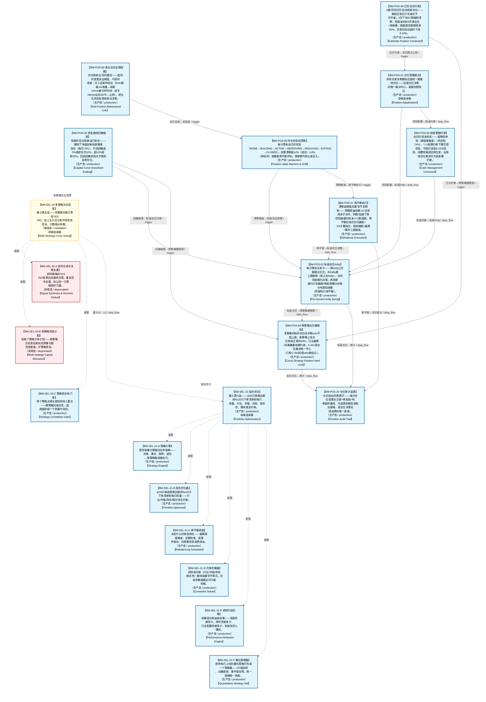

# 作战地图·仓位阶段

> **[可缩放 HTML 版 / Zoomable HTML](http://localhost:8765/docs/02_enterprise_architecture/07_trading_decision_architecture/battle_map/_zoomable_html/battle_map_08_position_management.html)** — Ctrl+滚轮缩放 ｜ 双击重置 ｜ Ctrl+Shift+D 切换拖动/选择模式

> battle_map §position_management 阶段，21 环节。
> 本文档由 `generate_battle_map_diagram.py` 自动生成，禁止手编。

## 文档基本信息 / Document Overview

| 字段 | 值 | Field | Value |
|------|------|-------|-------|
| 阶段 | 仓位（position_management） | Stage | 仓位 |
| 环节数 | 21 | Steps | 21 |
| 流转边 | 30 | Edges | 30 |
| 状态分布 | 🟦 运营态（已建）=18 ｜ 🟥 弃用态=2 ｜ 🟨 候选态（候选池）=1 | State Distribution | 🟦 运营态（已建）=18 ｜ 🟥 弃用态=2 ｜ 🟨 候选态（候选池）=1 |

> **图例说明 / Legend**：
> - 🟦 **蓝色实线 = 运营态环节**（production，锚点模块已建）
> - 🟧 **橙色虚线 = 设计态环节**（design，锚点模块待施工）
> - 🟧**设计态子环节** = 父环节已建但此子环节待施工（特殊标记，易被忽略）
> - 🟥 **红色 = 弃用态**（deprecated）
> - ⬜ **灰色 = 缺失态**（missing，环节无锚点，BM-INV-001 违例）
> - 🟨 **黄色虚线 = 候选态**（candidate，承载模块在候选池）
> - **实线箭头 ``-->`` = 运营态流转**（两端均 production）
> - **虚线箭头 ``-.->`` = 非运营态流转**（含设计/候选/混合）

## 阶段图 / Stage Diagram

> 展示 仓位 阶段全部 21 个环节及流转边，颜色区分五态。

## 环节详情

### BM-POS-01 仓位管理裁决 / Position Adjudication

> **大白话**：所有买卖决策都到这里统一算最终仓位——这是仓位决策的唯一裁决中心，谁都别想绕过。

**机制说明**：

L3.5 层。C-047（P0，v4.0 新增）仓位管理唯一裁决中心，嵌入决策编排器和 C-004 之间。所有仓位决策（含分批仓位方案）经 C-047 裁决后才进入风控审批和执行。

**6 件套（结构化，DB indicators JSONB）**：

| 要素 | 内容 |
|---|---|
| ① 触发条件 | 编排后决策（买/卖）就绪 阈值: 仓位决策唯一裁决中心 |
| ② 消费数据/因子 | 编排后决策（来自 BM-BUY-03） 卖出决策（来自 BM-SELL-02） 分批仓位方案（来自 BM-BUY-04） |
| ③ 参数 | position_cap=目标仓位（范围 -，代码当前: 待实现，状态: proposed） |
| ④ 数据流 | 输入: 买/卖决策+分批方案 → 处理: C-047 仓位唯一裁决 → 输出: 最终仓位指令 → 下游: BM-EXE-01 风控审批 |
| ⑤ 代码映射 | C-047 / 草图§1.8 主动脉（v4.0新增 P0） |
| ⑥ 降级/中止 | C-047 不可用 → 降级固定比例仓位查表 |

**指标文案（翻译真源 indicators_zh）**：

①触发：编排后决策（买/卖）就绪；②消费：BM-BUY-03 编排决策 + BM-SELL-02 卖出决策 + BM-BUY-04 分批方案；③参数：position_cap=目标仓位；④数据流：买/卖决策+分批方案→C-047唯一裁决→最终仓位指令→BM-EXE-01；⑤代码：C-047 §1.8（v4.0 P0）；⑥降级：C-047 不可用→固定比例仓位查表。

**锚点（环节↔模块双向关联）**：

| 目标图 | 目标ID | 角色 | 状态快照 | 真实build_status |
|---|---|---|---|---|
| candidate | CAND-HARVEST-0019 | supplement | candidate | — |
| depgraph | MOD-POS-001 | primary | stable | generated |

**有效状态**：🟦 运营态（已建） ｜ **环节自报**：design ｜ **层**：L3.5 ｜ **阶段**：position_management

### BM-POS-06 现金管理约束 / Cash Management Constraint

> **大白话**：仓位的"现金刹车"——留够保命钱(最低储备金)+机会钱(X%)，T+1结算约束下算可用资金，节假日多留5-15%现金，闲置钱做逆回购生息，反馈给仓位裁决作为现金硬约束。

**机制说明**：

D-POSITION §1.1 POS-06 Cash Manager + §7.1 第一层组合层现金约束。
现金管理独立子模块(T+1结算约束下现金规划刚需)：资金流水+结算状态 → 可用资金头寸+现金约束 → 反馈 POS-01 仓位裁决。
约束体系：
  最低储备金：账户最低现金底线，任何仓位决策不可突破。
  机会储备X%：预留用于突发机会的现金比例。
  T+1结算约束：当日卖出资金T+1才可用，仓位决策须按T+1可用资金计算。
  现金储备≥最低阈值：低于阈值自动收紧仓位上限。
  节假日持币规划：节前2天+节后1天提高现金比例5-15%(规避节假日不确定性)。
  闲置资金逆回购：闲置现金做逆回购生息，提升资金利用率。
与POS-01的反馈：现金约束作为组合层第一道约束，仓位裁决必须在现金可用额度内决策。

**6 件套（结构化，DB indicators JSONB）**：

| 要素 | 内容 |
|---|---|
| ① 触发条件 | 资金流水变更 / 结算状态更新 / 节假日临近 阈值: — |
| ② 消费数据/因子 | 资金流水+结算状态（来自 D-EX-CORE CTR-006） 最低储备金配置（来自 D-PF-CORE） 节假日日历（来自 D-DATA） |
| ③ 参数 | 最低储备金=账户最低现金底线（范围 -，代码当前: 最低储备金约束，状态: implemented） 机会储备X%=预留突发机会现金比例（范围 -，代码当前: 机会储备比例，状态: implemented） T+1结算约束=当日卖出资金T+1才可用（范围 -，代码当前: T+1结算约束，状态: implemented） 节假日现金比例=节前2天+节后1天提高5-15%（范围 5-15%，代码当前: 节假日持币规划，状态: implemented） 闲置资金逆回购=闲置现金逆回购生息（范围 -，代码当前: 逆回购，状态: implemented） |
| ④ 数据流 | 输入: 资金流水+结算状态 → 处理: 可用资金计算+现金约束判定 → 输出: 现金头寸+现金约束 → 下游: BM-POS-01 仓位裁决(现金可用额度内决策) |
| ⑤ 代码映射 | MOD-POS-006 / D-POSITION §1.1 POS-06 + §7.1 第一层组合层现金约束 |
| ⑥ 降级/中止 | 现金管理器未就绪 → 按T+1可用资金粗略估算(可能高估可用资金，需风控层兜底) |

**指标文案（翻译真源 indicators_zh）**：

①触发：资金流水变更/结算状态更新/节假日临近；②消费：资金流水+结算状态(D-EX-CORE CTR-006)+最低储备金配置+节假日日历(D-DATA)；③参数：最低储备金、机会储备X%、T+1结算、节假日现金比例5-15%、闲置资金逆回购(implemented)；④数据流：资金流水+结算→可用资金计算+现金约束判定→现金头寸+现金约束→反馈POS-01仓位裁决(现金可用额度内决策)；⑤代码：MOD-POS-006 cash_manager(stable)；⑥降级：现金管理器未就绪→按T+1可用资金粗略估算(可能高估可用资金，需风控层兜底)。

**锚点（环节↔模块双向关联）**：

| 目标图 | 目标ID | 角色 | 状态快照 | 真实build_status |
|---|---|---|---|---|
| depgraph | MOD-POS-006 | primary | stable | stable |

**有效状态**：🟦 运营态（已建） ｜ **环节自报**：design ｜ **层**：L3.5 ｜ **阶段**：position_management

### BM-POS-08 日历仓位约束 / Calendar Position Constraint

> **大白话**：A股"风险日历"自动收紧仓位——期权交割日只许减仓不许开新，4月下旬ST股强制清零，财报发布前3天降仓位+禁新建，微盘股空窗期收紧50%，交割日前后临时下调5-10%。

**机制说明**：

D-POSITION §1.5 POS-17 Calendar Position Constraint + §7.4 A股风险日历→仓位约束(v8.0)。
日历仓位约束：A股风险日历 + 当前日期 → CalendarPositionAlert + 临时仓位上限调整。
可预测周期性风险事件驱动的自动仓位收紧(仓位框架自优化的日历维度)：
  股指期货交割日(每月第三个周五)：交割日前1日VaR置信度95%→99%。
  股指期权交割日(每月第四个周三)：否决新开仓位(仅允许减仓)。
  年报预告截止日(1月31日)：截止日前5日否决未出预告个股新买入。
  年报+一季报截止日(4月30日)：4月下旬ST股仓位强制清零。
  半年报预告截止日(7月15日)：截止日前5日否决未出预告个股新买入。
  股东信息空窗期(11月-次年4月30日)：微盘股(<50亿市值)仓位上限收紧50%。
  交割日前2天+后1天：仓位上限临时下调5-10%。
  财报发布前3天：该标的仓位上限临时下调+禁止新建。
产出：CalendarPositionAlert事件(E-POS-06) → D-RISK/D-REPORTING，并临时调整仓位上限反馈POS-01/POS-10。

**6 件套（结构化，DB indicators JSONB）**：

| 要素 | 内容 |
|---|---|
| ① 触发条件 | 当前日期命中风险日历事件 阈值: — |
| ② 消费数据/因子 | A股风险日历（来自 D-DATA） 当前持仓（来自 D-EX-CORE） ST标记（来自 D-FACTOR） 市值分类（来自 D-FACTOR） |
| ③ 参数 | 期权交割日=否决新开仓位(仅允许减仓)（范围 -，代码当前: 期权交割日否决新开仓，状态: implemented） 4月下旬ST清零=ST股仓位强制清零（范围 -，代码当前: 年报截止日ST清零，状态: implemented） 预告截止日前5日=否决未出预告个股新买入（范围 -，代码当前: 预告截止日前5日否决新买入，状态: implemented） 微盘股空窗期=<50亿市值仓位上限收紧50%（范围 -，代码当前: 股东信息空窗期微盘股收紧50%，状态: implemented） 交割日前后=仓位上限临时下调5-10%（范围 5-10%，代码当前: 交割日前后下调5-10%，状态: implemented） 财报前3天=标的仓位上限下调+禁止新建（范围 -，代码当前: 财报前3天降仓位+禁新建，状态: implemented） |
| ④ 数据流 | 输入: 风险日历+当前日期 → 处理: 日历事件匹配+临时仓位上限调整 → 输出: CalendarPositionAlert+临时仓位上限 → 下游: BM-POS-01 仓位裁决上限 / BM-POS-04 跨策略硬限制 |
| ⑤ 代码映射 | MOD-POS-017 / D-POSITION §1.5 POS-17 + §7.4 A股风险日历 |
| ⑥ 降级/中止 | 日历数据缺失 → 跳过日历约束(仅依赖市场状态仓位上限，可能漏防周期性风险) |

**指标文案（翻译真源 indicators_zh）**：

①触发：当前日期命中风险日历事件；②消费：A股风险日历(D-DATA)+当前持仓(D-EX-CORE)+ST标记+市值分类(D-FACTOR)；③参数：期权交割日仅减仓、4月下旬ST清零、预告截止日前5日否决新买入、微盘股空窗期收紧50%、交割日前后下调5-10%、财报前3天降仓位+禁新建(implemented)；④数据流：风险日历+当前日期→日历事件匹配+临时仓位上限调整→CalendarPositionAlert→仓位裁决上限(BM-POS-01)+跨策略硬限制(BM-POS-04)；⑤代码：MOD-POS-017 calendar_position_constraint(stable)；⑥降级：日历数据缺失→跳过日历约束(仅依赖市场状态仓位上限，可能漏防周期性风险)。

**锚点（环节↔模块双向关联）**：

| 目标图 | 目标ID | 角色 | 状态快照 | 真实build_status |
|---|---|---|---|---|
| depgraph | MOD-POS-017 | primary | stable | generated |

**有效状态**：🟦 运营态（已建） ｜ **环节自报**：design ｜ **层**：L3.5 ｜ **阶段**：position_management

### BM-POS-02 标级仓位Kelly / Per-Symbol Kelly Sizing

> **大白话**：每只票该买多少——用Kelly公式算理论仓位，半Kelly硬上限截断(禁止全Kelly)，在风险配额内决策，再用密度PDF的偏度/峰度/前瞻VaR做分布感知调整(防御性只减不增)。

**机制说明**：

§1.5 第四层标层 + §20.13约束13.2半Kelly硬上限 + §4.5.1-A3 Kelly公式升级。
Kelly仓位决策：从条件PDF直接积分计算胜率p和赔率b→Kelly分数→半Kelly仓位(0.5×f*)。
半Kelly约束为硬上限(约束13.2)：禁止使用全Kelly(定义与完整论证见约束12.13)。
v5.0风险配额约束：Kelly在风险配额内决策(每标的边际风险贡献MRC)——架构范式从"独立Kelly+硬约束截断"升级为"风险预算+约束优化"。
分布感知调整(防御性原则，默认只减不增)：
  偏度调整：偏度>0(正偏=上涨惊喜概率高)→仓位×(1+偏度调整系数)；偏度<0(负偏=下跌风险大)→仓位×(1-|偏度|调整系数)。
  峰度调整：超额峰度>0(厚尾=极端事件概率高)→仓位×(1-峰度惩罚系数)；超额峰度≤0→不调整。
  前瞻性VaR约束：前瞻性95%VaR>阈值→仓位上限自动下调；前瞻性95%CVaR>阈值→仓位上限进一步下调(CVaR比VaR更严格)。
  调整后约束：调整后仓位≤原优化仓位(防御性原则，默认只减不增)。⚠️正偏分布允许有限加仓但幅度不超过原优化仓位的10%(约束12.6)。
Kelly仓位与原优化仓位取较小值(防御性原则: Kelly只减不增)。

**6 件套（结构化，DB indicators JSONB）**：

| 要素 | 内容 |
|---|---|
| ① 触发条件 | 买入信号到达 / 再平衡触发 阈值: — |
| ② 消费数据/因子 | 买入信号+得分（来自 BM-BUY-04） 风险配额(每标的MRC)（来自 BM-POS-01风险预算层） 密度PDF(偏度/峰度/VaR/CVaR)（来自 BM-SEL-13） 流动性评分(退出时间<1天)（来自 BM-EXE-01） |
| ③ 参数 | Kelly公式=0.5×f*(半Kelly)（范围 -，代码当前: 待实现，状态: proposed） 半Kelly硬上限=禁止全Kelly（范围 -，代码当前: 待实现，状态: proposed） 偏度调整系数=正偏×(1+α)/负偏×(1-|α|)（范围 -，代码当前: 待实现，状态: proposed） 峰度惩罚系数=超额峰度>0→×(1-β)（范围 -，代码当前: 待实现，状态: proposed） 前瞻VaR阈值=95%VaR>阈值→仓位上限下调（范围 -，代码当前: 待实现，状态: proposed） 正偏加仓幅度=≤原优化仓位10%（范围 -，代码当前: 待实现，状态: proposed） |
| ④ 数据流 | 输入: 信号+风险配额+密度PDF → 处理: Kelly求解→半Kelly截断→风险配额约束→分布感知调整(防御性只减不增) → 输出: 标级仓位建议 → 下游: BM-POS-04 跨策略硬限制 → BM-EXE-01 风控 |
| ⑤ 代码映射 | MOD-POS-001 / 草图§1.5 第四层 + §20.13约束13.2 |
| ⑥ 降级/中止 | Kelly引擎未就绪 → 降级为固定比例仓位(按市场状态查表§20.3) |

**指标文案（翻译真源 indicators_zh）**：

①触发：买入信号到达/再平衡触发；②消费：买入信号+得分(BM-BUY-04)+风险配额MRC(BM-POS-01风险预算层)+密度PDF偏度/峰度/VaR/CVaR(BM-SEL-13)+流动性评分(BM-EXE-01)；③参数：Kelly=0.5×f*(半Kelly)、半Kelly硬上限、偏度调整系数、峰度惩罚系数、前瞻VaR阈值、正偏加仓≤10%(proposed)；④数据流：信号+风险配额+密度PDF→Kelly求解→半Kelly截断→风险配额约束→分布调整(只减不增)→标级仓位→跨策略硬限制→风控；⑤代码：MOD-POS-001 position_sizing_engine(planned)；⑥降级：Kelly引擎未就绪→降级为固定比例仓位(按市场状态查表§20.3)。

**锚点（环节↔模块双向关联）**：

| 目标图 | 目标ID | 角色 | 状态快照 | 真实build_status |
|---|---|---|---|---|
| depgraph | MOD-POS-001 | primary | stable | generated |

**有效状态**：🟦 运营态（已建） ｜ **环节自报**：design ｜ **层**：L3.5 ｜ **阶段**：position_management

### BM-POS-03 持仓状态机漂移 / Position State Machine & Drift

> **大白话**：每只票有自己的状态(NONE→BUILDING→ACTIVE→OBSERVING→REDUCING→EXITING→CLOSED)，权重漂移超±2%(组合)/±3%(单标的)就触发再平衡评估，观察期内禁止新买入。

**机制说明**：

§1.4 v6.0持仓状态机扩展 + §20.13约束13.3-13.4仓位漂移再平衡。
持仓状态机(每标的独立)：NONE→BUILDING→ACTIVE→OBSERVING→REDUCING→EXITING→CLOSED(冷却期)。
OBSERVING(观察期)：软止损触发/异常开盘/暴跌不直接卖→进入观察期。观察期超时(收盘前15min)→确认执行 / 观察期收回(价格回到止损位上方)→解除。观察期内禁止新买入(防止在不确定状态下加仓)。
仓位漂移再平衡阈值(约束13.3)：组合总仓位漂移超过±2%时触发再平衡评估；单标的仓位漂移超过±3%时触发标的级再平衡评估。再平衡评估不等于立即执行——须综合考虑交易成本(见13.4)。
再平衡成本-收益决策规则(约束13.4)：再平衡执行前必须计算预期收益改善vs交易成本(佣金+滑点+冲击成本)。只有预期收益改善>2×交易成本时才执行再平衡。市场状态为⑦阴跌/⑧加速下跌/⑨恐慌崩盘时成本系数×1.5。
v6.0持仓时间预算(Position Time Budget)：每标的最大持仓时间→超时自动触发退出评估。时间预算由策略类型+市场状态决定：趋势策略>30天/均值回归<10天。持仓时间超预算→信号评分器自动提升卖出信号权重。

**6 件套（结构化，DB indicators JSONB）**：

| 要素 | 内容 |
|---|---|
| ① 触发条件 | 状态转换事件 / 仓位漂移>阈值 阈值: — |
| ② 消费数据/因子 | 持仓状态(NONE/BUILDING/ACTIVE/OBSERVING/REDUCING/EXITING/CLOSED)（来自 BM-POS-01） 当前权重（来自 BM-POS-01） 目标权重（来自 BM-POS-02） 漂移幅度（来自 BM-POS-01） |
| ③ 参数 | 组合漂移触发评估=±2%（范围 -，代码当前: 待实现，状态: proposed） 单标的漂移触发评估=±3%（范围 -，代码当前: 待实现，状态: proposed） OBSERVING超时=收盘前15min（范围 -，代码当前: 15分钟 (observing_confirm_minutes=15)，状态: implemented） 观察期禁止新买入=是（范围 -，代码当前: OBSERVING状态逻辑规则（enter_observing后禁止新开仓），状态: implemented） 再平衡收益改善门槛=>2×交易成本（范围 -，代码当前: 待实现，状态: proposed） |
| ④ 数据流 | 输入: 持仓状态+权重 → 处理: 状态机迁移+漂移检测+再平衡成本-收益决策 → 输出: 再平衡评估结果(执行/解除) → 下游: BM-POS-02 标级仓位调整 / BM-SELL-05 置换再平衡 |
| ⑤ 代码映射 | MOD-POS-002 / 草图§1.4 v6.0（MOD-POS-002状态机+MOD-POS-003漂移监控） |
| ⑥ 降级/中止 | 状态机未就绪 → 全部按ACTIVE处理，漂移监控退化为日终对账 |

**指标文案（翻译真源 indicators_zh）**：

①触发：状态转换事件/仓位漂移>阈值；②消费：持仓状态(NONE/BUILDING/ACTIVE/OBSERVING/REDUCING/EXITING/CLOSED)(BM-POS-01)+当前权重(BM-POS-01)+目标权重(BM-POS-02)+漂移幅度(BM-POS-01)；③参数：组合漂移±2%、单标的±3%、OBSERVING超时收盘前15min、观察期禁止新买入、再平衡收益改善>2×成本(proposed)；④数据流：持仓状态+权重→状态机迁移+漂移检测+再平衡成本-收益决策→再平衡评估结果→标级仓位调整/置换再平衡；⑤代码：MOD-POS-002 状态机(stable)+MOD-POS-003 漂移监控(stable)；⑥降级：状态机未就绪→全部按ACTIVE处理，漂移监控退化为日终对账。

**锚点（环节↔模块双向关联）**：

| 目标图 | 目标ID | 角色 | 状态快照 | 真实build_status |
|---|---|---|---|---|
| depgraph | MOD-POS-002 | primary | stable | stable |
| depgraph | MOD-POS-003 | supplement | stable | stable |

**有效状态**：🟦 运营态（已建） ｜ **环节自报**：design ｜ **层**：L3.5 ｜ **阶段**：position_management

### BM-POS-07 再平衡执行 / Rebalance Execution

> **大白话**：漂移超阈值后算"划不划得来"——预期收益改善>2×交易成本才动手，阴跌/加速下跌/恐慌崩盘时成本×1.5更谨慎，再平衡后组合仓位偏差<1%才算到位，周频强制+偏离+事件三类触发。

**机制说明**：

D-POSITION §1.1 POS-04 Rebalance Engine + §7.1 第四层动态层 + §20.13约束13.4再平衡成本-收益决策。
再平衡引擎：DriftDetected(漂移检测) + 再平衡调度 → RebalanceTriggered事件 + 调仓指令列表。
再平衡成本-收益决策规则(约束13.4)：再平衡执行前必须计算预期收益改善vs交易成本(佣金+滑点+冲击成本)。
  只有预期收益改善>2×交易成本时才执行再平衡。
  市场状态为⑦阴跌/⑧加速下跌/⑨恐慌崩盘时成本系数×1.5(恶化市场更谨慎)。
三类触发源：
  日历触发：周频强制再平衡评估(防止长期不调导致偏离累积)。
  偏离触发：组合±2%/单标的±3%漂移(来自POS-03)。
  事件触发：重大事件(黑天鹅/政策变化)驱动的紧急再平衡。
再平衡执行后约束：组合仓位偏差<1%(执行质量SLA)。
与POS-03的关系：POS-03漂移监控触发评估→POS-04再平衡决策(成本-收益)→执行→反馈POS-01/POS-02仓位调整。

**6 件套（结构化，DB indicators JSONB）**：

| 要素 | 内容 |
|---|---|
| ① 触发条件 | DriftDetected漂移检测 / 周频日历 / 重大事件 阈值: 组合±2%/单标的±3% |
| ② 消费数据/因子 | 漂移检测结果（来自 BM-POS-03） 交易成本（来自 BM-EXE-03） 市场状态（来自 BM-SEL-03/C-021） 当前持仓（来自 D-EX-CORE CTR-006） |
| ③ 参数 | 收益改善门槛=>2×交易成本（范围 -，代码当前: 再平衡收益改善>2×成本，状态: implemented） 恶化市场成本系数=⑦⑧⑨成本×1.5（范围 -，代码当前: 恶化市场成本系数×1.5，状态: implemented） 周频强制触发=周频强制再平衡评估（范围 -，代码当前: 周频日历触发，状态: implemented） 再平衡后偏差=<1%（范围 -，代码当前: 组合仓位偏差<1%，状态: implemented） |
| ④ 数据流 | 输入: 漂移检测+再平衡调度 → 处理: 成本-收益决策 → 输出: RebalanceTriggered+调仓指令 → 下游: BM-POS-02 标级仓位调整 / BM-POS-10 仓位审计 |
| ⑤ 代码映射 | MOD-POS-004 / D-POSITION §1.1 POS-04 + §7.1 第四层 + §20.13约束13.4 |
| ⑥ 降级/中止 | 再平衡引擎未就绪 → 仅机会成本驱动置换，跳过权重偏离再平衡(保守原则) |

**指标文案（翻译真源 indicators_zh）**：

①触发：DriftDetected漂移检测/周频日历/重大事件；②消费：漂移检测结果(BM-POS-03)+交易成本(BM-EXE-03)+市场状态(BM-SEL-03/C-021)+当前持仓(D-EX-CORE CTR-006)；③参数：收益改善门槛>2×交易成本、⑦⑧⑨成本系数×1.5、周频强制触发、再平衡后偏差<1%(implemented)；④数据流：漂移检测+调度→成本-收益决策→RebalanceTriggered+调仓指令→标级仓位调整(BM-POS-02)+仓位审计(BM-POS-10)；⑤代码：MOD-POS-004 rebalance_engine(stable)；⑥降级：再平衡引擎未就绪→仅机会成本驱动置换，跳过权重偏离再平衡(保守原则)。

**锚点（环节↔模块双向关联）**：

| 目标图 | 目标ID | 角色 | 状态快照 | 真实build_status |
|---|---|---|---|---|
| depgraph | MOD-POS-004 | primary | stable | stable |

**有效状态**：🟦 运营态（已建） ｜ **环节自报**：design ｜ **层**：L3.5 ｜ **阶段**：position_management

### BM-POS-09 卖出仓位反馈链路 / Sell-Position Bidirectional Link

> **大白话**：仓位和卖出"双向通话"——盈利时放宽卖出阈值、亏损时收紧；买入后即时验证(5min跌破1%放量→观察/15min破分时均线→减半/30min反向2ATR→止损)，把仓位状态反馈给卖出决策。

**机制说明**：

D-POSITION §1.4 POS-16 Sell-Position Bidirectional Link(v6.0)。
卖出-仓位双向链路：SellDecision + 仓位状态 → PositionStateFeedback → D-SELL-DECISION。
双向反馈机制：
  盈利状态→卖出阈值放宽(让利润奔跑，减少过早止盈)。
  亏损状态→卖出阈值收紧(加速止损，控制亏损)。
买入后即时验证(防止买入即套)：
  5min跌破买入价>1%且放量→进入观察期(OBSERVING)。
  15min跌破分时均线且反弹无力→减仓50%。
  30min反向运动>2ATR→全部止损。
与POS-02状态机联动：即时验证结果驱动状态机迁移(BUILDING→OBSERVING→REDUCING→EXITING)。
PositionStateFeedback作为D-SELL-DECISION的输入，实现仓位状态→卖出决策的闭环。

**6 件套（结构化，DB indicators JSONB）**：

| 要素 | 内容 |
|---|---|
| ① 触发条件 | 卖出决策到达 / 买入后即时验证窗口 / 仓位状态变更 阈值: — |
| ② 消费数据/因子 | 卖出决策（来自 BM-SELL-02 CTR-SELL-001） 仓位状态（来自 BM-POS-01/03） 买入价+分时均线+ATR（来自 D-MKT_DATA） |
| ③ 参数 | 盈利放宽阈值=盈利状态→卖出阈值放宽（范围 -，代码当前: 盈利状态卖出阈值放宽，状态: implemented） 亏损收紧阈值=亏损状态→卖出阈值收紧（范围 -，代码当前: 亏损状态卖出阈值收紧，状态: implemented） 5min跌破1%放量=→观察期(OBSERVING)（范围 -，代码当前: 5min跌破买入价>1%且放量→观察，状态: implemented） 15min破分时均线=→减仓50%（范围 -，代码当前: 15min跌破分时均线→减仓50%，状态: implemented） 30min反向2ATR=→全部止损（范围 -，代码当前: 30min反向运动>2ATR→全部止损，状态: implemented） |
| ④ 数据流 | 输入: 卖出决策+仓位状态 → 处理: 盈亏状态判定+即时验证 → 输出: PositionStateFeedback → 下游: D-SELL-DECISION 卖出阈值动态调整 / BM-POS-03 状态机 |
| ⑤ 代码映射 | MOD-POS-016 / D-POSITION §1.4 POS-16 Sell-Position Bidirectional Link(v6.0) |
| ⑥ 降级/中止 | 双向链路未就绪 → 卖出阈值固定不随盈亏调整(可能过早止盈或过晚止损) |

**指标文案（翻译真源 indicators_zh）**：

①触发：卖出决策到达/买入后即时验证窗口/仓位状态变更；②消费：卖出决策(BM-SELL-02 CTR-SELL-001)+仓位状态(BM-POS-01/03)+买入价+分时均线+ATR(D-MKT_DATA)；③参数：盈利放宽阈值、亏损收紧阈值、5min跌破1%放量→观察、15min破分时均线→减半、30min反向2ATR→止损(implemented)；④数据流：卖出决策+仓位状态→盈亏状态判定+即时验证→PositionStateFeedback→D-SELL-DECISION(卖出阈值动态调整)+状态机(BM-POS-03)；⑤代码：MOD-POS-016 sell_position_link(stable)；⑥降级：双向链路未就绪→卖出阈值固定不随盈亏调整(可能过早止盈或过晚止损)。

**锚点（环节↔模块双向关联）**：

| 目标图 | 目标ID | 角色 | 状态快照 | 真实build_status |
|---|---|---|---|---|
| depgraph | MOD-POS-016 | primary | stable | stable |

**有效状态**：🟦 运营态（已建） ｜ **环节自报**：design ｜ **层**：L3.5 ｜ **阶段**：position_management

### BM-POS-04 跨策略仓位硬限制 / Cross-Strategy Position Hard Limit

> **大白话**：多策略同标的仓位合并取sum不超上限，新策略上线仓位砍到正常的30%，行业偏离/风格暴露有硬约束，C-047是仓位裁决唯一中心(只有C-004风控veto能绕过)。

**机制说明**：

§1.5 第三层策略层 + §20.3仓位上限框架 + §20.13约束13.1仓位裁决不可绕过。
跨策略仓位合并：同标的多策略合并→取sum不超上限。
策略冷启动约束：新策略仓位上限=正常×30%(防止新策略未验证即满仓)。
仓位上限框架(§20.3，市场状态驱动动态调整)：C-021市场状态判定→9态(①平稳牛市80%/②动量牛市80%/③恐慌反弹60%/④窄幅盘整40%/⑤宽幅震荡50%/⑥压缩突破60%/⑦阴跌30%/⑧加速下跌20%/⑨恐慌崩盘10%)+2叠加态(⑩事件驱动=基础×70%/⑪板块轮动=基础，行业集中度放宽至±15%)。
集中度控制(§20.3)：单一行业偏离不超过基准±10%(板块轮动叠加态⑪激活时放宽至±15%，绝对上限30%)；大小盘/价值成长风格暴露不超过±0.3标准差。
仓位裁决不可绕过(约束13.1)：所有常规仓位决策必须经过C-047裁决，任何能力不可绕过C-047直接设置仓位。⚠️例外：①C-004风控veto(风控优先级最高，可否决C-047的仓位裁决)；②§29.10即时反应引擎紧急子通道(仅限减仓操作、绕过四层裁决流程但仍受C-047仓位上限约束、须事后补录)。
仲裁规则——风险预算仓位 vs 市场状态仓位上限：当风险预算计算出的仓位超过市场状态驱动的仓位上限时，市场状态仓位上限为硬上限，风险预算分配的仓位不可超过该上限(取min)。

**6 件套（结构化，DB indicators JSONB）**：

| 要素 | 内容 |
|---|---|
| ① 触发条件 | 多策略同标的仓位合并 / 新策略上线 / 仓位上限框架触发 阈值: — |
| ② 消费数据/因子 | 各策略仓位建议（来自 BM-POS-02） 策略冷启动状态（来自 L3策略工厂） 仓位上限框架(9态+2叠加态)（来自 BM-SEL-03/C-021） 行业偏离/风格暴露（来自 BM-SEL-21） C-047仓位裁决（来自 BM-POS-01） |
| ③ 参数 | 同标的多策略合并=取sum不超上限（范围 -，代码当前: 待实现，状态: proposed） 新策略仓位上限=正常×30%（范围 -，代码当前: 待实现，状态: proposed） 行业偏离=±10%/叠加态±15%/绝对30%（范围 -，代码当前: 绝对≤30% (sector_absolute_cap=0.30) / 基准±10% (sector_baseline_deviation=0.10)，状态: implemented） 风格暴露=±0.3标准差（范围 -，代码当前: 待实现，状态: proposed） 仓位裁决不可绕过=C-047唯一裁决(例外:C-004风控veto)（范围 -，代码当前: 待实现，状态: proposed） |
| ④ 数据流 | 输入: 多策略仓位+冷启动+上限框架 → 处理: 合并+冷启动折扣+行业/风格硬约束截断+C-047裁决 → 输出: 实际仓位(≤硬上限) → 下游: BM-EXE-01 风控审批 → BM-EXE-02 执行 |
| ⑤ 代码映射 | MOD-POS-010 / 草图§1.5 第三层 + §20.13约束13.1 |
| ⑥ 降级/中止 | 限制器未就绪 → 单策略独立决策(超限风险，需风控层兜底) |

**指标文案（翻译真源 indicators_zh）**：

①触发：多策略同标的仓位合并/新策略上线/仓位上限框架触发；②消费：各策略仓位建议(BM-POS-02)+策略冷启动状态(L3策略工厂)+仓位上限框架9态+2叠加态(BM-SEL-03/C-021)+行业偏离/风格暴露(BM-SEL-21)+C-047仓位裁决(BM-POS-01)；③参数：同标的多策略取sum不超上限、新策略仓位=正常×30%、行业偏离±10%/叠加态±15%/绝对30%、风格暴露±0.3标准差、C-047唯一裁决(例外C-004风控veto)(proposed)；④数据流：多策略仓位+冷启动+上限框架→合并+冷启动折扣+行业/风格硬约束截断+C-047裁决→实际仓位(≤硬上限)→风控→执行；⑤代码：MOD-POS-010 position_limit_enforcer(stable)；⑥降级：限制器未就绪→单策略独立决策(超限风险，需风控层兜底)。

**锚点（环节↔模块双向关联）**：

| 目标图 | 目标ID | 角色 | 状态快照 | 真实build_status |
|---|---|---|---|---|
| depgraph | MOD-POS-010 | primary | stable | stable |

**有效状态**：🟦 运营态（已建） ｜ **环节自报**：design ｜ **层**：L3.5 ｜ **阶段**：position_management

### BM-POS-05 资金曲线回撤缩放 / Capital Curve Drawdown Scaling

> **大白话**：系统的"自动驾驶油门刹车"——赚钱了净值创新高就慢慢加仓(每次+5%)，亏钱回撤超5%就砍仓位10%、超10%就砍20%，回到回撤前高点才能恢复原仓位。

**机制说明**：

§9.1 C-032资金曲线自诊断 + §20.13约束13.5资金曲线驱动的仓位缩放。
C-032资金曲线自诊断(跨层)：预判层预警(结构性恶化早期预警)+监控层异常检测(资金曲线异常模式检测)。
资金曲线驱动的仓位缩放(约束13.5)：
  盈利扩张：组合净值创新高后，可逐步扩大总仓位上限(每次+5%，最大不超过§20.3框架的硬上限)。
  亏损收缩：组合回撤超过5%时，总仓位上限自动缩减10%；回撤超过10%时，总仓位上限自动缩减20%。
  恢复条件：净值回到回撤前高点方可恢复原仓位上限。
连续亏损触发链(§9.1熔断层)：连续N个交易日亏损→C-032资金曲线检测→C-015推送告警+触发C-031降级+AI输出诊断报告。
C-032异常模式检测：识别资金曲线的结构性恶化(非随机下行趋势)vs随机波动，区分"正常回撤"和"策略失效"。

**6 件套（结构化，DB indicators JSONB）**：

| 要素 | 内容 |
|---|---|
| ① 触发条件 | 组合净值更新 / 回撤超阈值 / 连续亏损 阈值: — |
| ② 消费数据/因子 | 组合净值历史（来自 BM-REC-01） 回撤幅度（来自 BM-POS-01） 连续亏损天数（来自 BM-EXE-01/C-032） 资金曲线异常模式（来自 C-032） |
| ③ 参数 | 回撤>5%=仓位上限缩减10%（范围 -，代码当前: warning_threshold=0.05, 缩减10%(loss_contraction_5pct=0.10), 仓位上限0.80，状态: implemented） 回撤>10%=仓位上限缩减20%（范围 -，代码当前: critical_threshold=0.10, 缩减20%(loss_contraction_10pct=0.20), 仓位上限0.50，状态: implemented） 盈利扩张=每次+5%(不超§20.3硬上限)（范围 -，代码当前: profit_expansion_step=0.05(每次新高+5%), 硬上限2.00x，状态: implemented） 恢复条件=净值回到回撤前高点（范围 -，代码当前: 净值回到回撤前高点 → 解除收缩，状态: implemented） 连续N日亏损触发=C-032检测→C-015告警→C-031降级（范围 -，代码当前: 待实现，状态: proposed） |
| ④ 数据流 | 输入: 净值+回撤+连续亏损 → 处理: 资金曲线自诊断+回撤检测+仓位上限缩放/扩张 → 输出: 仓位上限缩放系数 → 下游: BM-POS-02 标级仓位约束 / BM-POS-04 跨策略硬限制 |
| ⑤ 代码映射 | MOD-POS-007 / 草图§9.1 C-032（MOD-POS-007资金曲线+MOD-POS-008回撤控制） |
| ⑥ 降级/中止 | 回撤控制器未就绪 → 仅资金曲线告警不自动缩放(需人工干预) |

**指标文案（翻译真源 indicators_zh）**：

①触发：组合净值更新/回撤超阈值/连续亏损；②消费：组合净值历史(BM-REC-01)+回撤幅度(BM-POS-01)+连续亏损天数(BM-EXE-01/C-032)+资金曲线异常模式(C-032)；③参数：回撤>5%→仓位上限缩减10%、回撤>10%→缩减20%、盈利扩张每次+5%(不超§20.3硬上限)、恢复条件=净值回到回撤前高点、连续N日亏损→C-032检测→C-015告警→C-031降级(proposed)；④数据流：净值+回撤+连续亏损→资金曲线自诊断+回撤检测+仓位上限缩放/扩张→仓位上限缩放系数→标级仓位约束/跨策略硬限制；⑤代码：MOD-POS-007 资金曲线(stable)+MOD-POS-008 回撤控制(planned)；⑥降级：回撤控制器未就绪→仅资金曲线告警不自动缩放(需人工干预)。

**锚点（环节↔模块双向关联）**：

| 目标图 | 目标ID | 角色 | 状态快照 | 真实build_status |
|---|---|---|---|---|
| depgraph | MOD-POS-007 | primary | stable | stable |
| depgraph | MOD-POS-008 | supplement | stable | stable |

**有效状态**：🟦 运营态（已建） ｜ **环节自报**：design ｜ **层**：L3.5 ｜ **阶段**：position_management

### BM-POS-10 仓位审计追溯 / Position Audit Trail

> **大白话**：仓位变动的"黑匣子"——每次仓位变更全记录+审批链+哈希链防篡改，可追溯到报告域和治理域，是仓位决策合规追溯的唯一真源。

**机制说明**：

D-POSITION §1.3 POS-09 Position Audit Logger。
仓位审计日志：仓位变更事件 → 仓位审计报告 → D-REPORTING + D-GOVERNANCE。
审计要素：全记录(每次仓位变更)+审批链(决策→裁决→风控→执行全链路)+可追溯(哈希链防篡改)。
审计范围：仓位裁决(C-047)决策+标级Kelly仓位+漂移再平衡+资金曲线缩放+日历约束调整+跨策略合并等全部仓位变更事件。
审计报告产出：PositionAuditReport → D-REPORTING(报告域归档) + D-GOVERNANCE(治理域合规审计)。
与不变量INV-POS-001(仓位裁决不可绕过)的关系：审计日志是"不可绕过"的事后验证手段——所有仓位决策必须留痕，无留痕=绕过裁决。
哈希链机制：每条审计记录含前一条哈希，篡改任意记录会导致后续哈希全部失效，确保审计完整性。

**6 件套（结构化，DB indicators JSONB）**：

| 要素 | 内容 |
|---|---|
| ① 触发条件 | 任意仓位变更事件(裁决/Kelly/漂移/再平衡/缩放/日历/合并) 阈值: — |
| ② 消费数据/因子 | 仓位变更事件（来自 BM-POS-01~09全部环节） 审批链（来自 D-RISK C-004） 执行结果（来自 D-EX-CORE） |
| ③ 参数 | 全记录=每次仓位变更全记录（范围 -，代码当前: 全记录，状态: implemented） 审批链=决策→裁决→风控→执行全链路（范围 -，代码当前: 审批链，状态: implemented） 哈希链防篡改=前一条哈希链接（范围 -，代码当前: 哈希链防篡改，状态: implemented） |
| ④ 数据流 | 输入: 仓位变更事件 → 处理: 全记录+审批链+哈希链 → 输出: PositionAuditReport → 下游: D-REPORTING 归档 / D-GOVERNANCE 合规审计 |
| ⑤ 代码映射 | MOD-POS-009 / D-POSITION §1.3 POS-09 Position Audit Logger |
| ⑥ 降级/中止 | 审计日志器未就绪 → 仓位决策阻断(审计是合规底线，无审计不允许执行，保守原则) |

**指标文案（翻译真源 indicators_zh）**：

①触发：任意仓位变更事件(裁决/Kelly/漂移/再平衡/缩放/日历/合并)；②消费：仓位变更事件(BM-POS-01~09全部环节)+审批链(D-RISK C-004)+执行结果(D-EX-CORE)；③参数：全记录、审批链、哈希链防篡改(implemented)；④数据流：仓位变更事件→全记录+审批链+哈希链→PositionAuditReport→D-REPORTING归档+D-GOVERNANCE合规审计；⑤代码：MOD-POS-009 position_audit_logger(stable)；⑥降级：审计日志器未就绪→仓位决策阻断(审计是合规底线，无审计不允许执行，保守原则)。

**锚点（环节↔模块双向关联）**：

| 目标图 | 目标ID | 角色 | 状态快照 | 真实build_status |
|---|---|---|---|---|
| depgraph | MOD-POS-009 | primary | stable | stable |

**有效状态**：🟦 运营态（已建） ｜ **环节自报**：design ｜ **层**：L3.5 ｜ **阶段**：position_management

### BM-SEL-20 多策略交叉投票 / Multi-Strategy Cross Voting

> **大白话**：漏斗第五层——多策略对每只票投YES/NO，加上主力合力和市场状态否决，少数服从多数。

**机制说明**：

§13 漏斗第五层。60秒级，策略A价值反转(30%)+策略B动量趋势(25%)+策略C事件驱动(20%)投票 + C-034/C-036主力合力投票 + C-021状态否决（状态不允许→否决买入）。

**6 件套（结构化，DB indicators JSONB）**：

| 要素 | 内容 |
|---|---|
| ① 触发条件 | 60秒级 阈值: 30→30只 |
| ② 消费数据/因子 | 策略A价值反转（来自 L3） 策略B动量趋势（来自 L3） 策略C事件驱动（来自 L3） C-034/C-036主力合力（来自 BM-SEL-05） C-021状态否决（来自 BM-SEL-03） |
| ③ 参数 | 策略权重=A30%/B25%/C20%（范围 -，代码当前: 待实现，状态: proposed） |
| ④ 数据流 | 输入: 事件筛选输出~30只 → 处理: 多策略YES/NO+主力+合力+状态否决 → 输出: ~30只 → 下游: BM-SEL-21 组合优化 |
| ⑤ 代码映射 | 缺失态-未实现 / 草图§13 漏斗L5 |
| ⑥ 降级/中止 | 投票未就绪 → 单策略决定 |

**指标文案（翻译真源 indicators_zh）**：

①触发：60秒级，30→30只；②消费：策略A/B/C(L3)+C-034/036主力合力(L2B)+C-021状态否决(L2C)；③参数：策略权重A30%/B25%/C20%(proposed)；④数据流：事件筛选→多策略YES/NO+主力+合力+状态否决→30只；⑤代码：缺失态-未实现（草图§13 L5）；⑥降级：未就绪→单策略决定。

**锚点（环节↔模块双向关联）**：

| 目标图 | 目标ID | 角色 | 状态快照 | 真实build_status |
|---|---|---|---|---|
| candidate | CAND-HARVEST-3225 | primary | candidate | — |

**有效状态**：🟨 候选态（候选池） ｜ **环节自报**：design ｜ **层**：L3 ｜ **阶段**：position_management

### BM-SEL-21 组合优化 / Portfolio Optimization

> **大白话**：漏斗第六层——从30只里算出最终N≤10只下单清单和每只权重，行业、市值、风险、相关性、拥挤度全约束。

**机制说明**：

§13 漏斗第六层 + §8.5 组合优化引擎。max Σ(w×score) s.t. 仓位上限(C-021)/容量(C-042)/行业偏离(±10%)/风格暴露/相关性(corr<0.7)/拥挤度(C-045)。叠加分布感知仓位调整（偏度/峰度/前瞻VaR）+ Kelly半仓位。

**6 件套（结构化，DB indicators JSONB）**：

| 要素 | 内容 |
|---|---|
| ① 触发条件 | 60秒级 阈值: 30→N≤10只 |
| ② 消费数据/因子 | 候选标的+得分（来自 BM-SEL-18） 仓位上限（来自 BM-SEL-03） C-042策略容量（来自 L3） C-045拥挤度（来自 L4） 密度PDF参数（来自 BM-SEL-13） |
| ③ 参数 | 行业偏离=±10%/叠加态±15%/绝对30%（范围 -，代码当前: 待实现，状态: proposed） 相关性上限=corr<0.7（范围 -，代码当前: 待实现，状态: proposed） Kelly=半Kelly硬上限（范围 -，代码当前: 待实现，状态: proposed） |
| ④ 数据流 | 输入: 投票输出~30只 → 处理: maxΣ(w×score) s.t.仓位/容量/行业/风格/相关性/拥挤 → 输出: N只下单清单+权重 → 下游: BM-BUY-01 多情景对策 |
| ⑤ 代码映射 | MOD-PF-002 / 草图§8.5 组合优化引擎（部分建设） |
| ⑥ 降级/中止 | 组合优化未就绪 → 等权配置 |

**指标文案（翻译真源 indicators_zh）**：

①触发：60秒级，30→N≤10只；②消费：候选标的+得分(L2A)+仓位上限(L2C)+C-042容量(L3)+C-045拥挤(L4)+密度PDF(L2A)；③参数：行业偏离±10%/叠加态±15%/绝对30%、corr<0.7、半Kelly硬上限(proposed)；④数据流：投票输出→优化求解→N只下单清单→买入流；⑤代码：MOD-PF-002 组合优化器（部分建设）；⑥降级：未就绪→等权配置。

**锚点（环节↔模块双向关联）**：

| 目标图 | 目标ID | 角色 | 状态快照 | 真实build_status |
|---|---|---|---|---|
| depgraph | MOD-PF-002 | primary | planned | generated |
| candidate | CAND-PFALLOC-001 | supplement | deferred | — |

**有效状态**：🟦 运营态（已建） ｜ **环节自报**：design ｜ **层**：L3 ｜ **阶段**：position_management

### BM-SEL-20-A 信号合成与决策去重 / Signal Synthesis & Decision Dedup

> **大白话**：把多策略的YES/NO投票合成最终决策，重复信号去重，别让同一只票被投好几遍。

**机制说明**：

BM-SEL-20 多策略交叉投票的子环节。MOD-PA-002 信号合成器把策略A/B/C的YES/NO投票按权重合成综合决策，同时执行决策去重（同一标的多策略信号合并为单一决策）。是漏斗第五层投票结果的标准化出口。

**6 件套（结构化，DB indicators JSONB）**：

| 要素 | 内容 |
|---|---|
| ① 触发条件 | 多策略信号→重合加权重→合成信号+信号冲突检测+决策去重 阈值: 同标的同方向多策略重复信号→合并为一条指令 |
| ② 消费数据/因子 | 多策略信号（来自 BM-SEL-18 精筛评分） 因子信号（来自 BM-SEL-02-H 合成优化） |
| ③ 参数 | — |
| ④ 数据流 | 输入: 多策略信号集 → 处理: 信号叠加→冲突检测→权重重分配→决策去重 → 输出: 合成信号(CTR-007前驱) → 下游: BM-SEL-20-B 资金分配 |
| ⑤ 代码映射 | MOD-PA-002 / 06-D-PF-ALLOC PA-02 |
| ⑥ 降级/中止 | 信号合成器异常 → 降级等权合成 |

**指标文案（翻译真源 indicators_zh）**：

①触发：60秒级投票周期；②消费：策略A/B/C(L3)投票+主力合力(L2B)；③参数：策略权重A30%/B25%/C20%、去重规则；④数据流：多策略投票→加权合成→去重→综合决策→BM-SEL-20-B资金分配；⑤代码：MOD-PA-002（D_PF_ALLOC）；⑥降级：合成器故障→单策略决定（无交叉验证）。

**锚点（环节↔模块双向关联）**：

| 目标图 | 目标ID | 角色 | 状态快照 | 真实build_status |
|---|---|---|---|---|
| depgraph | MOD-PA-002 | primary | production | deprecated |

**有效状态**：🟥 弃用态 ｜ **环节自报**：production ｜ **层**：L3 ｜ **阶段**：position_management

### BM-SEL-20-B 多策略资金分配 / Multi-strategy Capital Allocation

> **大白话**：给每个策略分多少钱——按策略历史表现和风险预算分配资金额度，好策略多给。

**机制说明**：

BM-SEL-20 多策略交叉投票的子环节。MOD-PA-003 资金分配器按策略历史Sharpe/胜率/最大回撤分配资金额度，叠加风险预算约束（单策略不超过总资金X%）。输出各策略可用资金上限供组合优化使用。

**6 件套（结构化，DB indicators JSONB）**：

| 要素 | 内容 |
|---|---|
| ① 触发条件 | 多策略资金分配+风险预算分配+MaxDDLimit+策略容量约束 阈值: 策略权重之和=1.0 + MaxDD≤15% |
| ② 消费数据/因子 | 合成信号（来自 BM-SEL-20-A） 风险预算（来自 D-RISK） |
| ③ 参数 | — |
| ④ 数据流 | 输入: 合成信号+风险预算 → 处理: 风险预算分解→Kelly约束→容量约束→权重分配 → 输出: 策略资金分配方案 → 下游: BM-SEL-20-C 相关性门禁 |
| ⑤ 代码映射 | MOD-PA-003 / 06-D-PF-ALLOC PA-03 |
| ⑥ 降级/中止 | 资金分配求解失败 → 降级等权分配 |

**指标文案（翻译真源 indicators_zh）**：

①触发：投票合成后/资金重分配周期；②消费：BM-SEL-20-A 综合决策+策略历史绩效；③参数：分配方法(绩效加权/风险预算)、单策略资金上限；④数据流：策略绩效→资金分配→额度上限→BM-SEL-21组合优化；⑤代码：MOD-PA-003（D_PF_ALLOC）；⑥降级：分配器故障→等额分配（无绩效加权）。

**锚点（环节↔模块双向关联）**：

| 目标图 | 目标ID | 角色 | 状态快照 | 真实build_status |
|---|---|---|---|---|
| depgraph | MOD-PA-003 | primary | production | deprecated |

**有效状态**：🟥 弃用态 ｜ **环节自报**：production ｜ **层**：L3 ｜ **阶段**：position_management

### BM-SEL-20-C 策略相关性门禁 / Strategy Correlation Gate

> **大白话**：两个策略太相关就别同时上重仓——算策略间相关性，超阈值砍掉一个防集中风险。

**机制说明**：

BM-SEL-20 多策略交叉投票的子环节。MOD-PA-004 相关性门禁计算策略间收益相关系数，corr>0.7 的策略对仅保留绩效更优者重仓。防止「多策略」实为「单策略换皮」导致虚假分散。

**6 件套（结构化，DB indicators JSONB）**：

| 要素 | 内容 |
|---|---|
| ① 触发条件 | G12策略相关性门禁: ρ>0.85拒绝/因子重叠>60%警告/股票池重叠>70%警告 阈值: 6个月滚动窗口+尾部相关EVT |
| ② 消费数据/因子 | 资金分配方案（来自 BM-SEL-20-B） |
| ③ 参数 | — |
| ④ 数据流 | 输入: 策略组合+历史收益 → 处理: 相关性计算→因子重叠检测→股票池重叠检测→门禁裁决 → 输出: 门禁通过/拒绝/警告决策 → 下游: BM-SEL-21 组合优化 |
| ⑤ 代码映射 | MOD-PA-004 / 06-D-PF-ALLOC PA-04 |
| ⑥ 降级/中止 | 相关性数据不足 → 降级警告模式 |

**指标文案（翻译真源 indicators_zh）**：

①触发：策略上线前/定期相关性检查；②消费：各策略历史收益序列；③参数：corr阈值0.7、保留规则、检查窗口；④数据流：策略收益→相关性矩阵→超阈值告警→砍冗余→精简策略集；⑤代码：MOD-PA-004（D_PF_ALLOC）；⑥降级：相关性数据不足→跳过门禁（标记待复查）。

**锚点（环节↔模块双向关联）**：

| 目标图 | 目标ID | 角色 | 状态快照 | 真实build_status |
|---|---|---|---|---|
| depgraph | MOD-PA-004 | primary | production | stable |

**有效状态**：🟦 运营态（已建） ｜ **环节自报**：production ｜ **层**：L3 ｜ **阶段**：position_management

### BM-SEL-21-A 策略引擎 / Strategy Engine

> **大白话**：管所有量化策略的生命周期——注册、激活、暂停、退役，按策略集调度执行。

**机制说明**：

BM-SEL-21 组合优化的子环节。MOD-PF-001 策略引擎管策略全生命周期（注册/激活/暂停/退役），按策略集调度执行并产出策略信号。是组合优化的策略信号入口，对接 BM-SEL-20 投票输出。

**6 件套（结构化，DB indicators JSONB）**：

| 要素 | 内容 |
|---|---|
| ① 触发条件 | 策略注册+选择+信号生成+生命周期+版本控制(OCP-002) 阈值: 新策略冷启动仓位上限=正常×30% |
| ② 消费数据/因子 | 门禁通过信号（来自 BM-SEL-20-C） |
| ③ 参数 | — |
| ④ 数据流 | 输入: 门禁通过策略信号 → 处理: 策略注册→选择→信号生成→四维决策(选股/买入/卖出/仓位) → 输出: target_weights → 下游: BM-SEL-21-B 组合优化器 |
| ⑤ 代码映射 | MOD-PF-001 / 05-D-PF-CORE PC-01 |
| ⑥ 降级/中止 | 策略引擎异常 → 降级到上一交易日权重 |

**指标文案（翻译真源 indicators_zh）**：

①触发：策略调度周期/状态变更；②消费：BM-SEL-20-A 综合决策；③参数：策略集定义、调度规则、状态机；④数据流：综合决策→策略引擎调度→策略信号→BM-SEL-21-B优化器；⑤代码：MOD-PF-001（D_PF_CORE）；⑥降级：引擎故障→退化为单策略模式（无策略集调度）。

**锚点（环节↔模块双向关联）**：

| 目标图 | 目标ID | 角色 | 状态快照 | 真实build_status |
|---|---|---|---|---|
| depgraph | MOD-PF-001 | primary | production | generated |

**有效状态**：🟦 运营态（已建） ｜ **环节自报**：production ｜ **层**：L3 ｜ **阶段**：position_management

### BM-SEL-21-B 组合优化器 / Portfolio Optimizer

> **大白话**：从30只候选里算出最终N≤10只下单清单和每只权重——行业/市值/风险/相关性全约束。

**机制说明**：

BM-SEL-21 组合优化的核心子环节。MOD-PF-002 组合优化器求解 max Σ(w×score) s.t. 仓位上限/容量/行业偏离(±10%)/风格暴露/相关性(corr<0.7)/拥挤度约束，叠加分布感知仓位调整（偏度/峰度/前瞻VaR）+ Kelly半仓位。产出最终下单清单和权重。

**6 件套（结构化，DB indicators JSONB）**：

| 要素 | 内容 |
|---|---|
| ① 触发条件 | 均值方差+风险平价+约束求解→TargetPortfolio(CTR-007) 阈值: Kelly仓位与优化仓位取min(Kelly只减不增) |
| ② 消费数据/因子 | target_weights（来自 BM-SEL-21-A） |
| ③ 参数 | — |
| ④ 数据流 | 输入: target_weights+风险预算 → 处理: 均值方差优化→风险预算→Kelly约束→约束求解 → 输出: TargetPortfolio CTR-007 → 下游: BM-SEL-21-C 再平衡调度 |
| ⑤ 代码映射 | MOD-PF-002 / 05-D-PF-CORE PC-02 |
| ⑥ 降级/中止 | 优化求解失败 → 降级等权+风险预算 |

**指标文案（翻译真源 indicators_zh）**：

①触发：60秒级，30→N≤10只；②消费：候选标的+得分(L2A)+仓位上限(L2C)+C-042容量(L3)+C-045拥挤(L4)+密度PDF(L2A)；③参数：行业偏离±10%/叠加态±15%/绝对30%、corr<0.7、半Kelly硬上限；④数据流：投票输出→优化求解→N只下单清单+权重→买入流；⑤代码：MOD-PF-002（D_PF_CORE，部分建设）；⑥降级：优化器故障→等权配置（无优化）。

**锚点（环节↔模块双向关联）**：

| 目标图 | 目标ID | 角色 | 状态快照 | 真实build_status |
|---|---|---|---|---|
| depgraph | MOD-PF-002 | primary | production | generated |

**有效状态**：🟦 运营态（已建） ｜ **环节自报**：production ｜ **层**：L3 ｜ **阶段**：position_management

### BM-SEL-21-C 再平衡调度 / Rebalancing Scheduler

> **大白话**：决定什么时候该调仓——偏离阈值触发、定期检查、或事件驱动，别频繁交易浪费成本。

**机制说明**：

BM-SEL-21 组合优化的子环节。MOD-PF-003 再平衡调度器管理调仓触发条件（偏离阈值触发/定期检查/事件驱动），在交易成本和组合偏离间取平衡。输出再平衡决策（调仓/不调仓/部分调仓）供组合优化器执行。

**6 件套（结构化，DB indicators JSONB）**：

| 要素 | 内容 |
|---|---|
| ① 触发条件 | 阈值触发(±2%/±3%)+日历触发(每周五)+事件触发+风控触发 阈值: 收益改善>2×成本才执行；市场状态⑦⑧⑨成本系数×1.5 |
| ② 消费数据/因子 | TargetPortfolio（来自 BM-SEL-21-B） |
| ③ 参数 | — |
| ④ 数据流 | 输入: TargetPortfolio+当前持仓 → 处理: 漂移检测→触发判定→成本感知→再平衡决策 → 输出: 再平衡指令 → 下游: BM-SEL-21-D 约束求解 |
| ⑤ 代码映射 | MOD-PF-003 / 05-D-PF-CORE PC-03 |
| ⑥ 降级/中止 | 再平衡调度异常 → 延后到下一交易日 |

**指标文案（翻译真源 indicators_zh）**：

①触发：偏离阈值/定期周期/事件；②消费：当前持仓+目标权重(BM-SEL-21-B)；③参数：偏离触发阈值、再平衡频率、成本约束；④数据流：持仓偏离→触发判定→再平衡决策→组合优化器执行；⑤代码：MOD-PF-003（D_PF_CORE）；⑥降级：调度器故障→仅定期再平衡（无阈值触发）。

**锚点（环节↔模块双向关联）**：

| 目标图 | 目标ID | 角色 | 状态快照 | 真实build_status |
|---|---|---|---|---|
| depgraph | MOD-PF-003 | primary | production | generated |

**有效状态**：🟦 运营态（已建） ｜ **环节自报**：production ｜ **层**：L3 ｜ **阶段**：position_management

### BM-SEL-21-D 约束求解器 / Constraint Solver

> **大白话**：把所有约束（行业/市值/风险/相关性）翻译成数学不等式，交给求解器算出可行最优解。

**机制说明**：

BM-SEL-21 组合优化的子环节。MOD-PF-006 约束求解器把组合优化约束（行业偏离/风格暴露/相关性/容量/拥挤度）形式化为线性/二次约束不等式组，调用凸优化求解器求解。是组合优化器的数学引擎。

**6 件套（结构化，DB indicators JSONB）**：

| 要素 | 内容 |
|---|---|
| ① 触发条件 | 行业集中度≤30%+偏离基准±10%+MDD≤5%+相关性对冲≤0.7+风格暴露≤±0.3σ 阈值: 拥挤度约束(策略相关性ρ>0.8降权) |
| ② 消费数据/因子 | 再平衡指令（来自 BM-SEL-21-C） |
| ③ 参数 | — |
| ④ 数据流 | 输入: 再平衡指令+约束集 → 处理: 约束建模→求解器优化→可行性检验→权重调整 → 输出: 约束满足的最终权重 → 下游: 执行域 BM-EXE |
| ⑤ 代码映射 | MOD-PF-006 / 05-D-PF-CORE PC-04 |
| ⑥ 降级/中止 | 约束求解不可行 → 放宽软约束+告警 |

**指标文案（翻译真源 indicators_zh）**：

①触发：组合优化求解请求；②消费：BM-SEL-21-B 约束配置+候选标的；③参数：约束类型(线性/二次)、求解器算法、容差；④数据流：约束配置→形式化→求解器→最优权重→BM-SEL-21-B；⑤代码：MOD-PF-006（D_PF_CORE）；⑥降级：求解器超时→放宽约束（如放宽行业偏离到±15%）。

**锚点（环节↔模块双向关联）**：

| 目标图 | 目标ID | 角色 | 状态快照 | 真实build_status |
|---|---|---|---|---|
| depgraph | MOD-PF-006 | primary | production | generated |

**有效状态**：🟦 运营态（已建） ｜ **环节自报**：production ｜ **层**：L3 ｜ **阶段**：position_management

### BM-SEL-21-E 绩效归因引擎 / Performance Attribution Engine

> **大白话**：拆解组合收益来自哪——选股贡献多少、择时贡献多少、行业配置贡献多少，知道钱怎么赚的。

**机制说明**：

BM-SEL-21 组合优化的子环节。MOD-PF-007 绩效归因引擎把组合收益分解为选股效应/择时效应/行业配置效应/交互效应，Brinson多期归因。输出归因报告供策略迭代和风险预算调整使用。

**6 件套（结构化，DB indicators JSONB）**：

| 要素 | 内容 |
|---|---|
| ① 触发条件 | Brinson归因+因子归因+风险归因+策略退化检测(IC衰减>50%降权至0) 阈值: 拥挤度检测(策略相关性ρ>0.8/0.9) |
| ② 消费数据/因子 | 组合收益（来自 BM-SEL-21-B） 因子衰减（来自 BM-SEL-02-G） |
| ③ 参数 | — |
| ④ 数据流 | 输入: 组合收益+因子表现 → 处理: Brinson分解→因子归因→风险归因→退化检测 → 输出: 归因报告+退化告警 → 下游: 反馈循环 / BM-SEL-02-I 因子治理 |
| ⑤ 代码映射 | MOD-PF-007 / 05-D-PF-CORE PC-10 |
| ⑥ 降级/中止 | 归因数据不足 → 降级粗粒度归因 |

**指标文案（翻译真源 indicators_zh）**：

①触发：盘后归因周期；②消费：组合持仓+收益+基准；③参数：归因方法(Brinson)、分解维度、基准定义；④数据流：组合收益→Brinson分解→归因报告→策略迭代(BM-RES-07)；⑤代码：MOD-PF-007（D_PF_CORE）；⑥降级：归因引擎故障→仅输出总收益（无分解）。

**锚点（环节↔模块双向关联）**：

| 目标图 | 目标ID | 角色 | 状态快照 | 真实build_status |
|---|---|---|---|---|
| depgraph | MOD-PF-007 | primary | production | stable |

**有效状态**：🟦 运营态（已建） ｜ **环节自报**：production ｜ **层**：L3 ｜ **阶段**：position_management

### BM-SEL-21-F 量化策略集 / Quantitative Strategy Set

> **大白话**：把所有已上线的量化策略打包成一个策略集——价值反转、动量趋势、事件驱动等，统一管理统一调度。

**机制说明**：

BM-SEL-21 组合优化的子环节。量化策略集是所有已上线量化策略的集合容器，包含价值反转策略(A,30%权重)+动量趋势策略(B,25%权重)+事件驱动策略(C,20%权重)等。由 BM-SEL-21-A 策略引擎统一调度，是组合优化的策略信号来源。

**6 件套（结构化，DB indicators JSONB）**：

| 要素 | 内容 |
|---|---|
| ① 触发条件 | TopN动量+盘口失衡+VWAP回归+盘中冲高回落策略 阈值: 多策略并行+策略引擎统一管理 |
| ② 消费数据/因子 | 因子信号（来自 BM-SEL-02-H） 行情数据（来自 BM-SEL-01） |
| ③ 参数 | — |
| ④ 数据流 | 输入: 因子+行情 → 处理: 策略信号生成→权重计算→风险调整 → 输出: 各策略target_weights → 下游: BM-SEL-21-A 策略引擎 |
| ⑤ 代码映射 | MOD-L05-001 / 05-D-PF-CORE strategies |
| ⑥ 降级/中止 | 策略集体异常 → 降级到TopN动量单策略 |

**指标文案（翻译真源 indicators_zh）**：

①触发：策略上线/下线；②消费：各策略信号产出；③参数：策略集成员、权重分配(A30%/B25%/C20%)、准入门禁；④数据流：策略集→引擎调度→策略信号→BM-SEL-20投票→BM-SEL-21-B优化；⑤代码：策略集定义在BM-SEL-21-A策略引擎(MOD-PF-001)中管理；⑥降级：策略集为空→仅执行卖出指令（保护性降级）。

**锚点（环节↔模块双向关联）**：

| 目标图 | 目标ID | 角色 | 状态快照 | 真实build_status |
|---|---|---|---|---|
| depgraph | MOD-L05-001 | primary | production | generated |

**有效状态**：🟦 运营态（已建） ｜ **环节自报**：production ｜ **层**：L3 ｜ **阶段**：position_management

[← 返回总指挥图](battle_map_panorama.md)