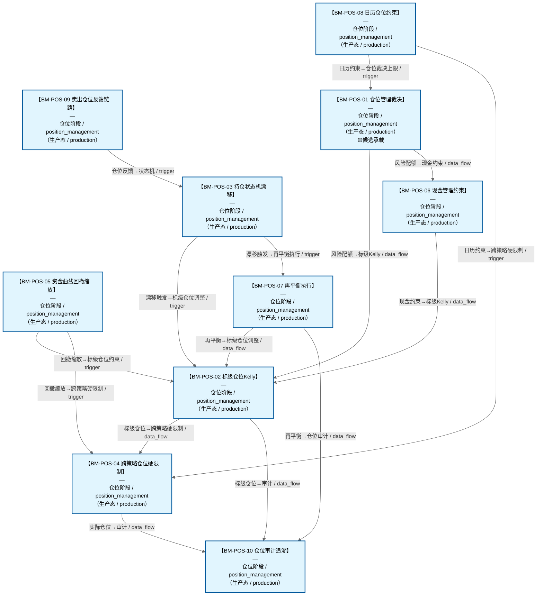

# 作战地图·仓位阶段

> **[可缩放 HTML 版 / Zoomable HTML](http://localhost:8765/docs/02_enterprise_architecture/07_trading_decision_architecture/battle_map/_zoomable_html/battle_map_08_position_management.html)** — Ctrl+滚轮缩放 ｜ 双击重置 ｜ Ctrl+Shift+D 切换拖动/选择模式

> battle_map §position_management 阶段，10 环节。
> 本文档由 `generate_battle_map_diagram.py` 自动生成，禁止手编。

## 文档基本信息 / Document Overview

| 字段 | 值 | Field | Value |
|------|------|-------|-------|
| 阶段 | 仓位（position_management） | Stage | 仓位 |
| 环节数 | 10 | Steps | 10 |
| 流转边 | 26 | Edges | 26 |
| 状态分布 | 🟦 运营态（已建）=10 | State Distribution | 🟦 运营态（已建）=10 |

> **图例说明 / Legend**：
> - 🟦 **蓝色实线 = 运营态环节**（production，锚点模块已建）
> - 🟧 **橙色虚线 = 设计态环节**（design，锚点模块待施工）
> - 🟥 **红色 = 弃用态**（deprecated）
> - ⬜ **灰色 = 缺失态**（missing，环节无锚点，BM-INV-001 违例）
> - 🟨 **黄色虚线 = 候选态**（candidate，承载模块在候选池）
> - **实线箭头 ``-->`` = 运营态流转**（两端均 production）
> - **虚线箭头 ``-.->`` = 非运营态流转**（含设计/候选/混合）

## 阶段图 / Stage Diagram

> 展示 仓位 阶段全部 10 个环节及流转边，颜色区分五态。

## 环节详情

### BM-POS-01 仓位管理裁决

**6 件套（结构化，DB indicators JSONB）**：

| 要素 | 内容 |
|---|---|
| ① 触发条件 | 编排后决策（买/卖）就绪 阈值: 仓位决策唯一裁决中心 |
| ② 消费数据/因子 | 编排后决策（来自 BM-BUY-03） 卖出决策（来自 BM-SELL-02） 分批仓位方案（来自 BM-BUY-04） |
| ③ 参数 | position_cap=目标仓位（范围 -，代码当前: 待实现，状态: proposed） |
| ④ 数据流 | 输入: 买/卖决策+分批方案 → 处理: C-047 仓位唯一裁决 → 输出: 最终仓位指令 → 下游: BM-EXE-01 风控审批 |
| ⑤ 代码映射 | C-047 / 草图§1.8 主动脉（v4.0新增 P0） |
| ⑥ 降级/中止 | C-047 不可用 → 降级固定比例仓位查表 |

**锚点（环节↔模块双向关联）**：

| 目标图 | 目标ID | 角色 | 状态快照 | 真实build_status |
|---|---|---|---|---|
| depgraph | MOD-POS-001 | primary | planned | generated |
| candidate | CAND-HARVEST-0019 | supplement | candidate | — |

**有效状态**：🟦 运营态（已建） ｜ **环节自报**：design ｜ **层**：L3.5 ｜ **阶段**：position_management

### BM-POS-06 现金管理约束

**6 件套（结构化，DB indicators JSONB）**：

| 要素 | 内容 |
|---|---|
| ① 触发条件 | 资金流水变更 / 结算状态更新 / 节假日临近 阈值: — |
| ② 消费数据/因子 | 资金流水+结算状态（来自 D-EX-CORE CTR-006） 最低储备金配置（来自 D-PF-CORE） 节假日日历（来自 D-DATA） |
| ③ 参数 | 最低储备金=账户最低现金底线（范围 -，代码当前: 最低储备金约束，状态: implemented） 机会储备X%=预留突发机会现金比例（范围 -，代码当前: 机会储备比例，状态: implemented） T+1结算约束=当日卖出资金T+1才可用（范围 -，代码当前: T+1结算约束，状态: implemented） 节假日现金比例=节前2天+节后1天提高5-15%（范围 5-15%，代码当前: 节假日持币规划，状态: implemented） 闲置资金逆回购=闲置现金逆回购生息（范围 -，代码当前: 逆回购，状态: implemented） |
| ④ 数据流 | 输入: 资金流水+结算状态 → 处理: 可用资金计算+现金约束判定 → 输出: 现金头寸+现金约束 → 下游: BM-POS-01 仓位裁决(现金可用额度内决策) |
| ⑤ 代码映射 | MOD-POS-006 / D-POSITION §1.1 POS-06 + §7.1 第一层组合层现金约束 |
| ⑥ 降级/中止 | 现金管理器未就绪 → 按T+1可用资金粗略估算(可能高估可用资金，需风控层兜底) |

**锚点（环节↔模块双向关联）**：

| 目标图 | 目标ID | 角色 | 状态快照 | 真实build_status |
|---|---|---|---|---|
| depgraph | MOD-POS-006 | primary | stable | stable |

**有效状态**：🟦 运营态（已建） ｜ **环节自报**：design ｜ **层**：L3.5 ｜ **阶段**：position_management

### BM-POS-08 日历仓位约束

**6 件套（结构化，DB indicators JSONB）**：

| 要素 | 内容 |
|---|---|
| ① 触发条件 | 当前日期命中风险日历事件 阈值: — |
| ② 消费数据/因子 | A股风险日历（来自 D-DATA） 当前持仓（来自 D-EX-CORE） ST标记（来自 D-FACTOR） 市值分类（来自 D-FACTOR） |
| ③ 参数 | 期权交割日=否决新开仓位(仅允许减仓)（范围 -，代码当前: 期权交割日否决新开仓，状态: implemented） 4月下旬ST清零=ST股仓位强制清零（范围 -，代码当前: 年报截止日ST清零，状态: implemented） 预告截止日前5日=否决未出预告个股新买入（范围 -，代码当前: 预告截止日前5日否决新买入，状态: implemented） 微盘股空窗期=<50亿市值仓位上限收紧50%（范围 -，代码当前: 股东信息空窗期微盘股收紧50%，状态: implemented） 交割日前后=仓位上限临时下调5-10%（范围 5-10%，代码当前: 交割日前后下调5-10%，状态: implemented） 财报前3天=标的仓位上限下调+禁止新建（范围 -，代码当前: 财报前3天降仓位+禁新建，状态: implemented） |
| ④ 数据流 | 输入: 风险日历+当前日期 → 处理: 日历事件匹配+临时仓位上限调整 → 输出: CalendarPositionAlert+临时仓位上限 → 下游: BM-POS-01 仓位裁决上限 / BM-POS-04 跨策略硬限制 |
| ⑤ 代码映射 | MOD-POS-017 / D-POSITION §1.5 POS-17 + §7.4 A股风险日历 |
| ⑥ 降级/中止 | 日历数据缺失 → 跳过日历约束(仅依赖市场状态仓位上限，可能漏防周期性风险) |

**锚点（环节↔模块双向关联）**：

| 目标图 | 目标ID | 角色 | 状态快照 | 真实build_status |
|---|---|---|---|---|
| depgraph | MOD-POS-017 | primary | stable | generated |

**有效状态**：🟦 运营态（已建） ｜ **环节自报**：design ｜ **层**：L3.5 ｜ **阶段**：position_management

### BM-POS-02 标级仓位Kelly

**6 件套（结构化，DB indicators JSONB）**：

| 要素 | 内容 |
|---|---|
| ① 触发条件 | 买入信号到达 / 再平衡触发 阈值: — |
| ② 消费数据/因子 | 买入信号+得分（来自 BM-BUY-04） 风险配额(每标的MRC)（来自 BM-POS-01风险预算层） 密度PDF(偏度/峰度/VaR/CVaR)（来自 BM-SEL-13） 流动性评分(退出时间<1天)（来自 BM-EXE-01） |
| ③ 参数 | Kelly公式=0.5×f*(半Kelly)（范围 -，代码当前: 待实现，状态: proposed） 半Kelly硬上限=禁止全Kelly（范围 -，代码当前: 待实现，状态: proposed） 偏度调整系数=正偏×(1+α)/负偏×(1-|α|)（范围 -，代码当前: 待实现，状态: proposed） 峰度惩罚系数=超额峰度>0→×(1-β)（范围 -，代码当前: 待实现，状态: proposed） 前瞻VaR阈值=95%VaR>阈值→仓位上限下调（范围 -，代码当前: 待实现，状态: proposed） 正偏加仓幅度=≤原优化仓位10%（范围 -，代码当前: 待实现，状态: proposed） |
| ④ 数据流 | 输入: 信号+风险配额+密度PDF → 处理: Kelly求解→半Kelly截断→风险配额约束→分布感知调整(防御性只减不增) → 输出: 标级仓位建议 → 下游: BM-POS-04 跨策略硬限制 → BM-EXE-01 风控 |
| ⑤ 代码映射 | MOD-POS-001 / 草图§1.5 第四层 + §20.13约束13.2 |
| ⑥ 降级/中止 | Kelly引擎未就绪 → 降级为固定比例仓位(按市场状态查表§20.3) |

**锚点（环节↔模块双向关联）**：

| 目标图 | 目标ID | 角色 | 状态快照 | 真实build_status |
|---|---|---|---|---|
| depgraph | MOD-POS-001 | primary | planned | generated |

**有效状态**：🟦 运营态（已建） ｜ **环节自报**：design ｜ **层**：L3.5 ｜ **阶段**：position_management

### BM-POS-03 持仓状态机漂移

**6 件套（结构化，DB indicators JSONB）**：

| 要素 | 内容 |
|---|---|
| ① 触发条件 | 状态转换事件 / 仓位漂移>阈值 阈值: — |
| ② 消费数据/因子 | 持仓状态(NONE/BUILDING/ACTIVE/OBSERVING/REDUCING/EXITING/CLOSED)（来自 BM-POS-01） 当前权重（来自 BM-POS-01） 目标权重（来自 BM-POS-02） 漂移幅度（来自 BM-POS-01） |
| ③ 参数 | 组合漂移触发评估=±2%（范围 -，代码当前: 待实现，状态: proposed） 单标的漂移触发评估=±3%（范围 -，代码当前: 待实现，状态: proposed） OBSERVING超时=收盘前15min（范围 -，代码当前: 15分钟 (observing_confirm_minutes=15)，状态: implemented） 观察期禁止新买入=是（范围 -，代码当前: OBSERVING状态逻辑规则（enter_observing后禁止新开仓），状态: implemented） 再平衡收益改善门槛=>2×交易成本（范围 -，代码当前: 待实现，状态: proposed） |
| ④ 数据流 | 输入: 持仓状态+权重 → 处理: 状态机迁移+漂移检测+再平衡成本-收益决策 → 输出: 再平衡评估结果(执行/解除) → 下游: BM-POS-02 标级仓位调整 / BM-SELL-05 置换再平衡 |
| ⑤ 代码映射 | MOD-POS-002 / 草图§1.4 v6.0（MOD-POS-002状态机+MOD-POS-003漂移监控） |
| ⑥ 降级/中止 | 状态机未就绪 → 全部按ACTIVE处理，漂移监控退化为日终对账 |

**锚点（环节↔模块双向关联）**：

| 目标图 | 目标ID | 角色 | 状态快照 | 真实build_status |
|---|---|---|---|---|
| depgraph | MOD-POS-002 | primary | stable | stable |
| depgraph | MOD-POS-003 | supplement | stable | stable |

**有效状态**：🟦 运营态（已建） ｜ **环节自报**：design ｜ **层**：L3.5 ｜ **阶段**：position_management

### BM-POS-07 再平衡执行

**6 件套（结构化，DB indicators JSONB）**：

| 要素 | 内容 |
|---|---|
| ① 触发条件 | DriftDetected漂移检测 / 周频日历 / 重大事件 阈值: 组合±2%/单标的±3% |
| ② 消费数据/因子 | 漂移检测结果（来自 BM-POS-03） 交易成本（来自 BM-EXE-03） 市场状态（来自 BM-SEL-03/C-021） 当前持仓（来自 D-EX-CORE CTR-006） |
| ③ 参数 | 收益改善门槛=>2×交易成本（范围 -，代码当前: 再平衡收益改善>2×成本，状态: implemented） 恶化市场成本系数=⑦⑧⑨成本×1.5（范围 -，代码当前: 恶化市场成本系数×1.5，状态: implemented） 周频强制触发=周频强制再平衡评估（范围 -，代码当前: 周频日历触发，状态: implemented） 再平衡后偏差=<1%（范围 -，代码当前: 组合仓位偏差<1%，状态: implemented） |
| ④ 数据流 | 输入: 漂移检测+再平衡调度 → 处理: 成本-收益决策 → 输出: RebalanceTriggered+调仓指令 → 下游: BM-POS-02 标级仓位调整 / BM-POS-10 仓位审计 |
| ⑤ 代码映射 | MOD-POS-004 / D-POSITION §1.1 POS-04 + §7.1 第四层 + §20.13约束13.4 |
| ⑥ 降级/中止 | 再平衡引擎未就绪 → 仅机会成本驱动置换，跳过权重偏离再平衡(保守原则) |

**锚点（环节↔模块双向关联）**：

| 目标图 | 目标ID | 角色 | 状态快照 | 真实build_status |
|---|---|---|---|---|
| depgraph | MOD-POS-004 | primary | stable | stable |

**有效状态**：🟦 运营态（已建） ｜ **环节自报**：design ｜ **层**：L3.5 ｜ **阶段**：position_management

### BM-POS-09 卖出仓位反馈链路

**6 件套（结构化，DB indicators JSONB）**：

| 要素 | 内容 |
|---|---|
| ① 触发条件 | 卖出决策到达 / 买入后即时验证窗口 / 仓位状态变更 阈值: — |
| ② 消费数据/因子 | 卖出决策（来自 BM-SELL-02 CTR-SELL-001） 仓位状态（来自 BM-POS-01/03） 买入价+分时均线+ATR（来自 D-MKT_DATA） |
| ③ 参数 | 盈利放宽阈值=盈利状态→卖出阈值放宽（范围 -，代码当前: 盈利状态卖出阈值放宽，状态: implemented） 亏损收紧阈值=亏损状态→卖出阈值收紧（范围 -，代码当前: 亏损状态卖出阈值收紧，状态: implemented） 5min跌破1%放量=→观察期(OBSERVING)（范围 -，代码当前: 5min跌破买入价>1%且放量→观察，状态: implemented） 15min破分时均线=→减仓50%（范围 -，代码当前: 15min跌破分时均线→减仓50%，状态: implemented） 30min反向2ATR=→全部止损（范围 -，代码当前: 30min反向运动>2ATR→全部止损，状态: implemented） |
| ④ 数据流 | 输入: 卖出决策+仓位状态 → 处理: 盈亏状态判定+即时验证 → 输出: PositionStateFeedback → 下游: D-SELL-DECISION 卖出阈值动态调整 / BM-POS-03 状态机 |
| ⑤ 代码映射 | MOD-POS-016 / D-POSITION §1.4 POS-16 Sell-Position Bidirectional Link(v6.0) |
| ⑥ 降级/中止 | 双向链路未就绪 → 卖出阈值固定不随盈亏调整(可能过早止盈或过晚止损) |

**锚点（环节↔模块双向关联）**：

| 目标图 | 目标ID | 角色 | 状态快照 | 真实build_status |
|---|---|---|---|---|
| depgraph | MOD-POS-016 | primary | stable | stable |

**有效状态**：🟦 运营态（已建） ｜ **环节自报**：design ｜ **层**：L3.5 ｜ **阶段**：position_management

### BM-POS-04 跨策略仓位硬限制

**6 件套（结构化，DB indicators JSONB）**：

| 要素 | 内容 |
|---|---|
| ① 触发条件 | 多策略同标的仓位合并 / 新策略上线 / 仓位上限框架触发 阈值: — |
| ② 消费数据/因子 | 各策略仓位建议（来自 BM-POS-02） 策略冷启动状态（来自 L3策略工厂） 仓位上限框架(9态+2叠加态)（来自 BM-SEL-03/C-021） 行业偏离/风格暴露（来自 BM-SEL-21） C-047仓位裁决（来自 BM-POS-01） |
| ③ 参数 | 同标的多策略合并=取sum不超上限（范围 -，代码当前: 待实现，状态: proposed） 新策略仓位上限=正常×30%（范围 -，代码当前: 待实现，状态: proposed） 行业偏离=±10%/叠加态±15%/绝对30%（范围 -，代码当前: 绝对≤30% (sector_absolute_cap=0.30) / 基准±10% (sector_baseline_deviation=0.10)，状态: implemented） 风格暴露=±0.3标准差（范围 -，代码当前: 待实现，状态: proposed） 仓位裁决不可绕过=C-047唯一裁决(例外:C-004风控veto)（范围 -，代码当前: 待实现，状态: proposed） |
| ④ 数据流 | 输入: 多策略仓位+冷启动+上限框架 → 处理: 合并+冷启动折扣+行业/风格硬约束截断+C-047裁决 → 输出: 实际仓位(≤硬上限) → 下游: BM-EXE-01 风控审批 → BM-EXE-02 执行 |
| ⑤ 代码映射 | MOD-POS-010 / 草图§1.5 第三层 + §20.13约束13.1 |
| ⑥ 降级/中止 | 限制器未就绪 → 单策略独立决策(超限风险，需风控层兜底) |

**锚点（环节↔模块双向关联）**：

| 目标图 | 目标ID | 角色 | 状态快照 | 真实build_status |
|---|---|---|---|---|
| depgraph | MOD-POS-010 | primary | stable | stable |

**有效状态**：🟦 运营态（已建） ｜ **环节自报**：design ｜ **层**：L3.5 ｜ **阶段**：position_management

### BM-POS-05 资金曲线回撤缩放

**6 件套（结构化，DB indicators JSONB）**：

| 要素 | 内容 |
|---|---|
| ① 触发条件 | 组合净值更新 / 回撤超阈值 / 连续亏损 阈值: — |
| ② 消费数据/因子 | 组合净值历史（来自 BM-REC-01） 回撤幅度（来自 BM-POS-01） 连续亏损天数（来自 BM-EXE-01/C-032） 资金曲线异常模式（来自 C-032） |
| ③ 参数 | 回撤>5%=仓位上限缩减10%（范围 -，代码当前: warning_threshold=0.05, 缩减10%(loss_contraction_5pct=0.10), 仓位上限0.80，状态: implemented） 回撤>10%=仓位上限缩减20%（范围 -，代码当前: critical_threshold=0.10, 缩减20%(loss_contraction_10pct=0.20), 仓位上限0.50，状态: implemented） 盈利扩张=每次+5%(不超§20.3硬上限)（范围 -，代码当前: profit_expansion_step=0.05(每次新高+5%), 硬上限2.00x，状态: implemented） 恢复条件=净值回到回撤前高点（范围 -，代码当前: 净值回到回撤前高点 → 解除收缩，状态: implemented） 连续N日亏损触发=C-032检测→C-015告警→C-031降级（范围 -，代码当前: 待实现，状态: proposed） |
| ④ 数据流 | 输入: 净值+回撤+连续亏损 → 处理: 资金曲线自诊断+回撤检测+仓位上限缩放/扩张 → 输出: 仓位上限缩放系数 → 下游: BM-POS-02 标级仓位约束 / BM-POS-04 跨策略硬限制 |
| ⑤ 代码映射 | MOD-POS-007 / 草图§9.1 C-032（MOD-POS-007资金曲线+MOD-POS-008回撤控制） |
| ⑥ 降级/中止 | 回撤控制器未就绪 → 仅资金曲线告警不自动缩放(需人工干预) |

**锚点（环节↔模块双向关联）**：

| 目标图 | 目标ID | 角色 | 状态快照 | 真实build_status |
|---|---|---|---|---|
| depgraph | MOD-POS-007 | primary | stable | stable |
| depgraph | MOD-POS-008 | supplement | planned | stable |

**有效状态**：🟦 运营态（已建） ｜ **环节自报**：design ｜ **层**：L3.5 ｜ **阶段**：position_management

### BM-POS-10 仓位审计追溯

**6 件套（结构化，DB indicators JSONB）**：

| 要素 | 内容 |
|---|---|
| ① 触发条件 | 任意仓位变更事件(裁决/Kelly/漂移/再平衡/缩放/日历/合并) 阈值: — |
| ② 消费数据/因子 | 仓位变更事件（来自 BM-POS-01~09全部环节） 审批链（来自 D-RISK C-004） 执行结果（来自 D-EX-CORE） |
| ③ 参数 | 全记录=每次仓位变更全记录（范围 -，代码当前: 全记录，状态: implemented） 审批链=决策→裁决→风控→执行全链路（范围 -，代码当前: 审批链，状态: implemented） 哈希链防篡改=前一条哈希链接（范围 -，代码当前: 哈希链防篡改，状态: implemented） |
| ④ 数据流 | 输入: 仓位变更事件 → 处理: 全记录+审批链+哈希链 → 输出: PositionAuditReport → 下游: D-REPORTING 归档 / D-GOVERNANCE 合规审计 |
| ⑤ 代码映射 | MOD-POS-009 / D-POSITION §1.3 POS-09 Position Audit Logger |
| ⑥ 降级/中止 | 审计日志器未就绪 → 仓位决策阻断(审计是合规底线，无审计不允许执行，保守原则) |

**锚点（环节↔模块双向关联）**：

| 目标图 | 目标ID | 角色 | 状态快照 | 真实build_status |
|---|---|---|---|---|
| depgraph | MOD-POS-009 | primary | stable | stable |

**有效状态**：🟦 运营态（已建） ｜ **环节自报**：design ｜ **层**：L3.5 ｜ **阶段**：position_management

[← 返回总指挥图](battle_map_panorama.md)