# 作战地图·风控管控阶段

> **[可缩放 HTML 版 / Zoomable HTML](http://localhost:8765/docs/02_enterprise_architecture/07_trading_decision_architecture/battle_map/_zoomable_html/battle_map_09_risk_control.html)** — Ctrl+滚轮缩放 ｜ 双击重置 ｜ Ctrl+Shift+D 切换拖动/选择模式

> battle_map §risk_control 阶段，8 环节。
> 本文档由 `generate_battle_map_diagram.py` 自动生成，禁止手编。

## 文档基本信息 / Document Overview

| 字段 | 值 | Field | Value |
|------|------|-------|-------|
| 阶段 | 风控管控（risk_control） | Stage | 风控管控 |
| 环节数 | 8 | Steps | 8 |
| 流转边 | 10 | Edges | 10 |
| 状态分布 | 🟦 运营态（已建）=7 ｜ 🟨 候选态（候选池）=1 | State Distribution | 🟦 运营态（已建）=7 ｜ 🟨 候选态（候选池）=1 |

> **图例说明 / Legend**：
> - 🟦 **蓝色实线 = 运营态环节**（production，锚点模块已建）
> - 🟧 **橙色虚线 = 设计态环节**（design，锚点模块待施工）
> - 🟥 **红色 = 弃用态**（deprecated）
> - ⬜ **灰色 = 缺失态**（missing，环节无锚点，BM-INV-001 违例）
> - 🟨 **黄色虚线 = 候选态**（candidate，承载模块在候选池）
> - **实线箭头 ``-->`` = 运营态流转**（两端均 production）
> - **虚线箭头 ``-.->`` = 非运营态流转**（含设计/候选/混合）

## 阶段图 / Stage Diagram

> 展示 风控管控 阶段全部 8 个环节及流转边，颜色区分五态。

```mermaid
%%{init: {'theme': 'base', 'themeVariables': {'primaryColor': '#eaeaea', 'primaryTextColor': '#333333', 'primaryBorderColor': '#666666', 'lineColor': '#666666', 'secondaryColor': '#eaeaea', 'tertiaryColor': '#eaeaea', 'clusterBkg': 'transparent', 'clusterBorder': 'transparent', 'fontSize': '14px'}}}%%
%% 风控管控阶段图
flowchart TD
    BM_RC_01["【BM-RC-01 风控策略与限额管理】<br/>—<br/>风控管控阶段 / risk_control<br/>（生产态 / production）"]
    BM_RC_02["【BM-RC-02 盘前风控检查】<br/>—<br/>风控管控阶段 / risk_control<br/>（生产态 / production）"]
    BM_RC_03["【BM-RC-03 Kill Switch熔断】<br/>—<br/>风控管控阶段 / risk_control<br/>（候选态 / candidate）<br/>🟡候选承载"]
    BM_RC_04["【BM-RC-04 盘中持仓风控监控】<br/>—<br/>风控管控阶段 / risk_control<br/>（生产态 / production）"]
    BM_RC_05["【BM-RC-05 A股特色止损】<br/>—<br/>风控管控阶段 / risk_control<br/>（生产态 / production）<br/>🟡候选承载"]
    BM_RC_06["【BM-RC-06 系统性风险检测】<br/>—<br/>风控管控阶段 / risk_control<br/>（生产态 / production）<br/>🟡候选承载"]
    BM_RC_07["【BM-RC-07 风险预算与VaR】<br/>—<br/>风控管控阶段 / risk_control<br/>（生产态 / production）"]
    BM_RC_08["【BM-RC-08 盘后审计与压力测试】<br/>—<br/>风控管控阶段 / risk_control<br/>（生产态 / production）"]
    BM_RC_01 -->|策略→盘前检查 / data_flow| BM_RC_02
    BM_RC_02 -.->|检查→Kill Switch / trigger| BM_RC_03
    BM_RC_03 -.->|熔断→盘中监控 / data_flow| BM_RC_04
    BM_RC_04 -->|监控→止损 / trigger| BM_RC_05
    BM_RC_05 -->|止损→系统性风险 / trigger| BM_RC_06
    BM_RC_06 -->|系统性→风险预算 / data_flow| BM_RC_07
    BM_RC_07 -->|预算→盘后审计 / trigger| BM_RC_08
classDef production fill:#e1f5fe,stroke:#01579b,stroke-width:2px,color:#000
classDef design fill:#fff3e0,stroke:#e65100,stroke-width:2px,color:#000,stroke-dasharray: 5 5
classDef deprecated fill:#ffebee,stroke:#c62828,stroke-width:2px,color:#000
classDef missing fill:#eeeeee,stroke:#9e9e9e,stroke-width:2px,color:#000
classDef candidate fill:#fffde7,stroke:#f9a825,stroke-width:2px,color:#000,stroke-dasharray: 5 5
    class BM_RC_01,BM_RC_02,BM_RC_04,BM_RC_05,BM_RC_06,BM_RC_07,BM_RC_08 production
    class BM_RC_03 candidate
```

## 环节详情

### BM-RC-01 风控策略与限额管理

**6 件套（结构化，DB indicators JSONB）**：

| 要素 | 内容 |
|---|---|
| ① 触发条件 | — |
| ② 消费数据/因子 | — |
| ③ 参数 | — |
| ④ 数据流 | 输入: — → 处理: — → 输出: — → 下游: — |
| ⑤ 代码映射 | — / — |
| ⑥ 降级/中止 | — |

**锚点（环节↔模块双向关联）**：

| 目标图 | 目标ID | 角色 | 状态快照 | 真实build_status |
|---|---|---|---|---|
| depgraph | MOD-L04-001 | primary | stable | generated |

**有效状态**：🟦 运营态（已建） ｜ **环节自报**：production ｜ **层**：L4 ｜ **阶段**：risk_control

### BM-RC-02 盘前风控检查

**6 件套（结构化，DB indicators JSONB）**：

| 要素 | 内容 |
|---|---|
| ① 触发条件 | — |
| ② 消费数据/因子 | — |
| ③ 参数 | — |
| ④ 数据流 | 输入: — → 处理: — → 输出: — → 下游: — |
| ⑤ 代码映射 | — / — |
| ⑥ 降级/中止 | — |

**锚点（环节↔模块双向关联）**：

| 目标图 | 目标ID | 角色 | 状态快照 | 真实build_status |
|---|---|---|---|---|
| depgraph | MOD-L04-001 | primary | stable | generated |

**有效状态**：🟦 运营态（已建） ｜ **环节自报**：production ｜ **层**：L4 ｜ **阶段**：risk_control

### BM-RC-03 Kill Switch熔断

**6 件套（结构化，DB indicators JSONB）**：

| 要素 | 内容 |
|---|---|
| ① 触发条件 | — |
| ② 消费数据/因子 | — |
| ③ 参数 | — |
| ④ 数据流 | 输入: — → 处理: — → 输出: — → 下游: — |
| ⑤ 代码映射 | — / — |
| ⑥ 降级/中止 | — |

**锚点（环节↔模块双向关联）**：

| 目标图 | 目标ID | 角色 | 状态快照 | 真实build_status |
|---|---|---|---|---|
| candidate | CAND-HARVEST-4324 | primary | planned | — |

**有效状态**：🟨 候选态（候选池） ｜ **环节自报**：production ｜ **层**：L4 ｜ **阶段**：risk_control

### BM-RC-04 盘中持仓风控监控

**6 件套（结构化，DB indicators JSONB）**：

| 要素 | 内容 |
|---|---|
| ① 触发条件 | — |
| ② 消费数据/因子 | — |
| ③ 参数 | — |
| ④ 数据流 | 输入: — → 处理: — → 输出: — → 下游: — |
| ⑤ 代码映射 | — / — |
| ⑥ 降级/中止 | — |

**锚点（环节↔模块双向关联）**：

| 目标图 | 目标ID | 角色 | 状态快照 | 真实build_status |
|---|---|---|---|---|
| depgraph | MOD-L04-001 | primary | stable | generated |
| depgraph | MOD-RK-011 | supplement | stable | generated |

**有效状态**：🟦 运营态（已建） ｜ **环节自报**：production ｜ **层**：L4 ｜ **阶段**：risk_control

### BM-RC-05 A股特色止损

**6 件套（结构化，DB indicators JSONB）**：

| 要素 | 内容 |
|---|---|
| ① 触发条件 | — |
| ② 消费数据/因子 | — |
| ③ 参数 | — |
| ④ 数据流 | 输入: — → 处理: — → 输出: — → 下游: — |
| ⑤ 代码映射 | — / — |
| ⑥ 降级/中止 | — |

**锚点（环节↔模块双向关联）**：

| 目标图 | 目标ID | 角色 | 状态快照 | 真实build_status |
|---|---|---|---|---|
| depgraph | MOD-L04-001 | primary | stable | generated |
| candidate | CAND-HARVEST-0135 | supplement | planned | — |

**有效状态**：🟦 运营态（已建） ｜ **环节自报**：production ｜ **层**：L4 ｜ **阶段**：risk_control

### BM-RC-06 系统性风险检测

**6 件套（结构化，DB indicators JSONB）**：

| 要素 | 内容 |
|---|---|
| ① 触发条件 | — |
| ② 消费数据/因子 | — |
| ③ 参数 | — |
| ④ 数据流 | 输入: — → 处理: — → 输出: — → 下游: — |
| ⑤ 代码映射 | — / — |
| ⑥ 降级/中止 | — |

**锚点（环节↔模块双向关联）**：

| 目标图 | 目标ID | 角色 | 状态快照 | 真实build_status |
|---|---|---|---|---|
| depgraph | MOD-RK-10 | primary | stable | generated |
| candidate | CAND-HARVEST-0722 | supplement | deferred | — |

**有效状态**：🟦 运营态（已建） ｜ **环节自报**：production ｜ **层**：L4 ｜ **阶段**：risk_control

### BM-RC-07 风险预算与VaR

**6 件套（结构化，DB indicators JSONB）**：

| 要素 | 内容 |
|---|---|
| ① 触发条件 | — |
| ② 消费数据/因子 | — |
| ③ 参数 | — |
| ④ 数据流 | 输入: — → 处理: — → 输出: — → 下游: — |
| ⑤ 代码映射 | — / — |
| ⑥ 降级/中止 | — |

**锚点（环节↔模块双向关联）**：

| 目标图 | 目标ID | 角色 | 状态快照 | 真实build_status |
|---|---|---|---|---|
| depgraph | MOD-RK-05 | primary | stable | generated |
| depgraph | MOD-RK-08 | supplement | stable | generated |

**有效状态**：🟦 运营态（已建） ｜ **环节自报**：production ｜ **层**：L4 ｜ **阶段**：risk_control

### BM-RC-08 盘后审计与压力测试

**6 件套（结构化，DB indicators JSONB）**：

| 要素 | 内容 |
|---|---|
| ① 触发条件 | — |
| ② 消费数据/因子 | — |
| ③ 参数 | — |
| ④ 数据流 | 输入: — → 处理: — → 输出: — → 下游: — |
| ⑤ 代码映射 | — / — |
| ⑥ 降级/中止 | — |

**锚点（环节↔模块双向关联）**：

| 目标图 | 目标ID | 角色 | 状态快照 | 真实build_status |
|---|---|---|---|---|
| depgraph | MOD-RK-20 | primary | stable | stable |
| depgraph | MOD-RK-16 | supplement | stable | generated |

**有效状态**：🟦 运营态（已建） ｜ **环节自报**：production ｜ **层**：L4 ｜ **阶段**：risk_control

[← 返回总指挥图](battle_map_panorama.md)