# 作战地图·风控管控阶段

> **[可缩放 HTML 版 / Zoomable HTML](http://localhost:8765/docs/02_enterprise_architecture/07_trading_decision_architecture/battle_map/_zoomable_html/battle_map_09_risk_control.html)** — Ctrl+滚轮缩放 ｜ 双击重置 ｜ Ctrl+Shift+D 切换拖动/选择模式

> battle_map §risk_control 阶段，40 环节。
> 本文档由 `generate_battle_map_diagram.py` 自动生成，禁止手编。

## 文档基本信息 / Document Overview

| 字段 | 值 | Field | Value |
|------|------|-------|-------|
| 阶段 | 风控管控（risk_control） | Stage | 风控管控 |
| 环节数 | 40 | Steps | 40 |
| 流转边 | 10 | Edges | 10 |
| 状态分布 | 🟦 运营态（已建）=34 ｜ 🟧 设计态（待施工）=5 ｜ 🟨 候选态（候选池）=1 | State Distribution | 🟦 运营态（已建）=34 ｜ 🟧 设计态（待施工）=5 ｜ 🟨 候选态（候选池）=1 |

> **图例说明 / Legend**：
> - 🟦 **蓝色实线 = 运营态环节**（production，锚点模块已建）
> - 🟧 **橙色虚线 = 设计态环节**（design，锚点模块待施工）
> - 🟧**设计态子环节** = 父环节已建但此子环节待施工（特殊标记，易被忽略）
> - 🟥 **红色 = 弃用态**（deprecated）
> - ⬜ **灰色 = 缺失态**（missing，环节无锚点，BM-INV-001 违例）
> - 🟨 **黄色虚线 = 候选态**（candidate，承载模块在候选池）
> - **实线箭头 ``-->`` = 运营态流转**（两端均 production）
> - **虚线箭头 ``-.->`` = 非运营态流转**（含设计/候选/混合）

## 阶段图 / Stage Diagram

> 展示 风控管控 阶段全部 40 个环节及流转边，颜色区分五态。

```mermaid
%%{init: {'theme': 'base', 'themeVariables': {'primaryColor': '#eaeaea', 'primaryTextColor': '#333333', 'primaryBorderColor': '#666666', 'lineColor': '#666666', 'secondaryColor': '#eaeaea', 'tertiaryColor': '#eaeaea', 'clusterBkg': 'transparent', 'clusterBorder': 'transparent', 'fontSize': '14px'}}}%%
%% 风控管控阶段图
flowchart TD
    subgraph sg_BM_RC_01 ["风控策略与限额管理"]
        BM_RC_01["【BM-RC-01 风控策略与限额管理】<br/>风控的'宪法'——策略<br/>CRUD+版本管理+9种限额类型+消耗追踪+预警分级+审批<br/>流。<br/>（生产态 / production）<br/>【Risk Policy &amp; Limit Management】"]
        BM_RC_01_A["【BM-RC-01-A 风控策略CRUD与版本管理】<br/>风控规则的增删改查带版本管理——改了规则能追溯历史<br/>版本，出问题能回滚。<br/>（生产态 / production）<br/>【Risk Strategy CRUD &amp; Versioning】"]
        BM_RC_01_B["【BM-RC-01-B 九种限额类型与消耗追踪】<br/>九种限额（仓位/行业/杠杆/亏损<br/>/集中度等）各管各的，实时追踪每个限额还剩多少额<br/>度。<br/>（生产态 / production）<br/>【Nine Limit Types &amp; Usage Tracking】"]
        BM_RC_01_C["【BM-RC-01-C 预警分级与审批流】<br/>风控告警分级别——黄色提醒、橙色警告、红色紧急，各<br/>级别走不同的审批和处置流程。<br/>（生产态 / production）<br/>【Alert Tiering &amp; Approval Flow】"]
        BM_RC_01 -.->|嵌套| BM_RC_01_A
        BM_RC_01 -.->|嵌套| BM_RC_01_B
        BM_RC_01 -.->|嵌套| BM_RC_01_C
    end
    subgraph sg_BM_RC_02 ["盘前风控检查"]
        BM_RC_02["【BM-RC-02 盘前风控检查】<br/>下单前过五关——仓位限额→行业集中度→杠杆率→合规规<br/>则→Kill Switch 状态，任一不过就拒单。<br/>（生产态 / production）<br/>【Pre-Trade Risk Check】"]
        BM_RC_02_A["【BM-RC-02-A 仓位限额检查】<br/>盘前查仓位有没有超限额——单票超了、总仓位超了，在<br/>下单前就拦住。<br/>（生产态 / production）<br/>【Position Limit Check】"]
        BM_RC_02_B["【BM-RC-02-B 行业集中度检查】<br/>查行业集中度——单个行业持仓占比不能太高，防止行业<br/>暴雷时全军覆没。<br/>（生产态 / production）<br/>【Industry Concentration Check】"]
        BM_RC_02_C["【BM-RC-02-C 杠杆率检查】<br/>查杠杆率——融资融券的杠杆不能超监管和自营设定的红<br/>线。<br/>（生产态 / production）<br/>【Leverage Ratio Check】"]
        BM_RC_02_D["【BM-RC-02-D 合规规则检查】<br/>查合规规则——T+1<br/>约束、涨跌停板限制、禁买池等A股特色合规要求，盘<br/>前全过一遍。<br/>（生产态 / production）<br/>【Compliance Rule Check】"]
        BM_RC_02_E["【BM-RC-02-E Kill Switch状态检查】<br/>查 Kill Switch<br/>开关状态——如果熔断开关被拉下了，任何新下单都得拦<br/>住。<br/>（生产态 / production）<br/>【Kill Switch Status Check】"]
        BM_RC_02 -.->|嵌套| BM_RC_02_A
        BM_RC_02 -.->|嵌套| BM_RC_02_B
        BM_RC_02 -.->|嵌套| BM_RC_02_C
        BM_RC_02 -.->|嵌套| BM_RC_02_D
        BM_RC_02 -.->|嵌套| BM_RC_02_E
    end
    subgraph sg_BM_RC_03 ["Kill Switch熔断"]
        BM_RC_03["【BM-RC-03 Kill Switch熔断】<br/>系统的'急停按钮'——回撤超 Emergency<br/>/VaR超限且无法减仓<br/>/Owner手动，任一触发即熔断，冷却 30 分钟。<br/>（生产态 / production）<br/>🟡候选承载<br/>【Kill Switch Circuit Breaker】"]
        BM_RC_03_A["【BM-RC-03-A 触发条件判定】<br/>Kill Switch<br/>的触发条件判定——哪些指标破了红线就该拉闸，逻辑集<br/>中管理不散落各处。<br/>（生产态 / production）<br/>【Trigger Condition Evaluation】"]
        BM_RC_03_B["【BM-RC-03-B 状态机与冷却期】<br/>Kill Switch<br/>触发后进入冷却期——状态机管'触发→冷却→恢复'全过程<br/>，冷却期内禁止重开。<br/>（生产态 / production）<br/>【State Machine &amp; Cooldown Period】"]
        BM_RC_03_C["【BM-RC-03-C Owner确认重置与多域通知】<br/>Kill Switch 恢复需要 Owner 确认，同时通知交易<br/>/风控/合规多个域，不能偷偷重开。<br/>（生产态 / production）<br/>【Owner Confirm &amp; Multi-Domain Notify】"]
        BM_RC_03 -.->|嵌套| BM_RC_03_A
        BM_RC_03 -.->|嵌套| BM_RC_03_B
        BM_RC_03 -.->|嵌套| BM_RC_03_C
    end
    subgraph sg_BM_RC_04 ["盘中持仓风控监控"]
        BM_RC_04["【BM-RC-04 盘中持仓风控监控】<br/>盘中盯着持仓——实时算<br/>VaR、回撤、因子暴露、相关性矩阵，超阈值就告警。<br/>（生产态 / production）<br/>【Real-Time Portfolio Risk Monitoring】"]
        BM_RC_04_A["【BM-RC-04-A VaR实时计算】<br/>盘中实时算 VaR<br/>（风险价值）——当前持仓在给定置信度下最大可能亏多<br/>少，秒级更新。<br/>（生产态 / production）<br/>【Real-Time VaR Calculation】"]
        BM_RC_04_B["【BM-RC-04-B 回撤实时追踪】<br/>盘中实时追踪回撤——从净值高点回撤了多少，逼近预警<br/>线就报警。<br/>（生产态 / production）<br/>【Real-Time Drawdown Tracking】"]
        BM_RC_04_C["【BM-RC-04-C 因子暴露与相关性矩阵】<br/>实时算因子暴露和持仓相关性矩阵——防止看似分散的持<br/>仓其实押注了同一个因子。<br/>（生产态 / production）<br/>【Factor Exposure &amp; Correlation Matrix】"]
        BM_RC_04_D["【BM-RC-04-D 告警生成】<br/>把风控监控的异常信号转成结构化告警——分级、去重、<br/>路由到对应的处置人。<br/>（生产态 / production）<br/>【Alert Generation】"]
        BM_RC_04_E["【BM-RC-04-E 流动性风险监控】<br/>监控持仓流动性——单票成交量能不能承载当前仓位，跌<br/>停时卖不出去怎么办。<br/>（设计态 / design）<br/>🟧设计态子环节<br/>【Liquidity Risk Monitoring】"]
        BM_RC_04_F["【BM-RC-04-F AI/Agent风险监控】<br/>盯 AI/Agent 自己的行为——防止 LLM<br/>幻觉导致异常下单、Agent 死循环狂交易等新型风险。<br/>（设计态 / design）<br/>🟧设计态子环节<br/>【AI/Agent Risk Monitoring】"]
        BM_RC_04 -.->|嵌套| BM_RC_04_A
        BM_RC_04 -.->|嵌套| BM_RC_04_B
        BM_RC_04 -.->|嵌套| BM_RC_04_C
        BM_RC_04 -.->|嵌套| BM_RC_04_D
        BM_RC_04 -.->|嵌套| BM_RC_04_E
        BM_RC_04 -.->|嵌套| BM_RC_04_F
    end
    subgraph sg_BM_RC_05 ["A股特色止损"]
        BM_RC_05["【BM-RC-05 A股特色止损】<br/>A股专用的 6 种止损——固定比例-7%/关键支撑破位<br/>/逻辑失效/竞价不及预期/分时破位<br/>/板块退潮，加日2%周5%月10%亏损限额强制停盘。<br/>（生产态 / production）<br/>🟡候选承载<br/>【A-Share Stop-Loss】"]
        BM_RC_05_A["【BM-RC-05-A 六种A股止损模式】<br/>六种A股特色止损模式——涨停板打开止损、连板断板止<br/>损、龙头退位止损等，按场景匹配。<br/>（生产态 / production）<br/>【Six A-Share Stop-Loss Patterns】"]
        BM_RC_05_B["【BM-RC-05-B 通用止损引擎】<br/>通用止损引擎——固定百分比止损、移动止损、ATR<br/>止损等标准模式，所有策略共用。<br/>（生产态 / production）<br/>【Universal Stop-Loss Engine】"]
        BM_RC_05_C["【BM-RC-05-C 亏损限额强制停盘】<br/>亏损到限额强制停盘——日内亏 X% 或周内亏 Y%<br/>直接关交易权限，防止上头硬扛。<br/>（候选态 / candidate）<br/>🟡候选承载<br/>【Loss Limit Forced Halt】"]
        BM_RC_05 -.->|嵌套| BM_RC_05_A
        BM_RC_05 -.->|嵌套| BM_RC_05_B
        BM_RC_05 -.->|嵌套| BM_RC_05_C
    end
    subgraph sg_BM_RC_06 ["系统性风险检测"]
        BM_RC_06["【BM-RC-06 系统性风险检测】<br/>盯着融资盘平仓潮/量化踩踏/流动性危机/政策转向<br/>/外围冲击 5 大信号，≥3 个就清仓。<br/>（生产态 / production）<br/>🟡候选承载<br/>【Systemic Risk Detection】"]
        BM_RC_06_A["【BM-RC-06-A 五大信号扫描】<br/>扫描五大系统性风险信号——大盘破位、流动性枯竭、波<br/>动率飙升、跨市场传导异常、政策黑天鹅。<br/>（生产态 / production）<br/>【Five Signal Scanning】"]
        BM_RC_06_B["【BM-RC-06-B 尾部风险监控】<br/>监控尾部风险——小概率大亏损的事件，用 EVT<br/>（极值理论）估算极端情况下的损失。<br/>（生产态 / production）<br/>【Tail Risk Monitoring】"]
        BM_RC_06_C["【BM-RC-06-C 三级警报与清仓执行】<br/>系统性风险三级警报——黄/橙<br/>/红，红色级别直接清仓保命，不等确认先跑。<br/>（生产态 / production）<br/>🟡候选承载<br/>【Three-Tier Alert &amp; Liquidation】"]
        BM_RC_06_D["【BM-RC-06-D 拥挤度检测】<br/>检测交易拥挤度——同一个策略太多人用会导致踩踏，拥<br/>挤度高时提前减仓。<br/>（设计态 / design）<br/>🟧设计态子环节<br/>【Crowding Detection】"]
        BM_RC_06 -.->|嵌套| BM_RC_06_A
        BM_RC_06 -.->|嵌套| BM_RC_06_B
        BM_RC_06 -.->|嵌套| BM_RC_06_C
        BM_RC_06 -.->|嵌套| BM_RC_06_D
    end
    subgraph sg_BM_RC_07 ["风险预算与VaR"]
        BM_RC_07["【BM-RC-07 风险预算与VaR】<br/>把风险当预算分给各资产——VaR<br/>三阶段演进：参数法→蒙特卡洛→Basel III<br/>三角验证，风险预算优化求解器分配。<br/>（生产态 / production）<br/>【Risk Budget &amp; VaR】"]
        BM_RC_07_A["【BM-RC-07-A VaR三阶段演进】<br/>VaR 计算三阶段演进——历史模拟→参数法→蒙特卡洛，精<br/>度逐步提升。<br/>（生产态 / production）<br/>【VaR Three-Stage Evolution】"]
        BM_RC_07_B["【BM-RC-07-B 风险预算优化求解】<br/>风险预算优化求解——给定总风险预算，怎么分配到各资<br/>产/策略使收益最大化。<br/>（生产态 / production）<br/>【Risk Budget Optimization】"]
        BM_RC_07_C["【BM-RC-07-C 风险贡献与再平衡】<br/>算每个持仓的风险贡献占比，超预算的减仓、低于预算<br/>的加仓，定期再平衡。<br/>（生产态 / production）<br/>【Risk Contribution &amp; Rebalancing】"]
        BM_RC_07 -.->|嵌套| BM_RC_07_A
        BM_RC_07 -.->|嵌套| BM_RC_07_B
        BM_RC_07 -.->|嵌套| BM_RC_07_C
    end
    subgraph sg_BM_RC_08 ["盘后审计与压力测试"]
        BM_RC_08["【BM-RC-08 盘后审计与压力测试】<br/>收盘后做两件事——日终 PnL<br/>对账+归因偏差检测+合规报告；再加压力测试<br/>（历史情景/假设情景/反向压力测试）看策略韧性。<br/>（生产态 / production）<br/>【Post-Trade Audit &amp; Stress Test】"]
        BM_RC_08_A["【BM-RC-08-A 日终PnL对账与合规报告】<br/>日终对账——实际盈亏和系统记录对不上就查原因，同时<br/>生成合规报告留档。<br/>（生产态 / production）<br/>【Daily PnL Reconciliation &amp; Compliance Report】"]
        BM_RC_08_B["【BM-RC-08-B 风险归因分解】<br/>把盈亏拆解到风险因子——今天赚的钱是哪个因子贡献的<br/>、哪个因子拖后腿，归因清楚。<br/>（生产态 / production）<br/>【Risk Attribution Decomposition】"]
        BM_RC_08_C["【BM-RC-08-C 压力测试】<br/>压力测试——模拟极端场景（2015股灾<br/>/2020疫情）下持仓会亏多少，确保扛得住。<br/>（生产态 / production）<br/>【Stress Testing】"]
        BM_RC_08_D["【BM-RC-08-D 模型风险审计】<br/>审计模型风险——模型有没有过拟合、有没有数据泄漏、<br/>上线后有没有衰减，定期检查。<br/>（设计态 / design）<br/>🟧设计态子环节<br/>【Model Risk Audit】"]
        BM_RC_08_E["【BM-RC-08-E 操作风险审计】<br/>审计操作风险——下单有没有写错代码、权限有没有滥用<br/>、系统有没有故障导致异常交易。<br/>（设计态 / design）<br/>🟧设计态子环节<br/>【Operational Risk Audit】"]
        BM_RC_08 -.->|嵌套| BM_RC_08_A
        BM_RC_08 -.->|嵌套| BM_RC_08_B
        BM_RC_08 -.->|嵌套| BM_RC_08_C
        BM_RC_08 -.->|嵌套| BM_RC_08_D
        BM_RC_08 -.->|嵌套| BM_RC_08_E
    end
    BM_RC_01 ~~~ BM_RC_01_A ~~~ BM_RC_01_B ~~~ BM_RC_01_C ~~~ BM_RC_02_A ~~~ BM_RC_02_B ~~~ BM_RC_02_C ~~~ BM_RC_02_D ~~~ BM_RC_02_E ~~~ BM_RC_03_A ~~~ BM_RC_03_B ~~~ BM_RC_03_C ~~~ BM_RC_04_A ~~~ BM_RC_04_B ~~~ BM_RC_04_C ~~~ BM_RC_04_D ~~~ BM_RC_04_E ~~~ BM_RC_04_F ~~~ BM_RC_05_A ~~~ BM_RC_05_B ~~~ BM_RC_05_C ~~~ BM_RC_06_A ~~~ BM_RC_06_B ~~~ BM_RC_06_C ~~~ BM_RC_06_D ~~~ BM_RC_07_A ~~~ BM_RC_07_B ~~~ BM_RC_07_C ~~~ BM_RC_08_A ~~~ BM_RC_08_B ~~~ BM_RC_08_C ~~~ BM_RC_08_D ~~~ BM_RC_08_E
    BM_RC_01 -->|策略→盘前检查 / data_flow| BM_RC_02
    BM_RC_02 -->|检查→Kill Switch / trigger| BM_RC_03
    BM_RC_03 -->|熔断→盘中监控 / data_flow| BM_RC_04
    BM_RC_04 -->|监控→止损 / trigger| BM_RC_05
    BM_RC_05 -->|止损→系统性风险 / trigger| BM_RC_06
    BM_RC_06 -->|系统性→风险预算 / data_flow| BM_RC_07
    BM_RC_07 -->|预算→盘后审计 / trigger| BM_RC_08
classDef production fill:#e1f5fe,stroke:#01579b,stroke-width:2px,color:#000
classDef design fill:#fff3e0,stroke:#e65100,stroke-width:2px,color:#000,stroke-dasharray: 5 5
classDef deprecated fill:#ffebee,stroke:#c62828,stroke-width:2px,color:#000
classDef missing fill:#eeeeee,stroke:#9e9e9e,stroke-width:2px,color:#000
classDef candidate fill:#fffde7,stroke:#f9a825,stroke-width:2px,color:#000,stroke-dasharray: 5 5
    class BM_RC_01,BM_RC_01_A,BM_RC_01_B,BM_RC_01_C,BM_RC_02,BM_RC_02_A,BM_RC_02_B,BM_RC_02_C,BM_RC_02_D,BM_RC_02_E,BM_RC_03,BM_RC_03_A,BM_RC_03_B,BM_RC_03_C,BM_RC_04,BM_RC_04_A,BM_RC_04_B,BM_RC_04_C,BM_RC_04_D,BM_RC_05,BM_RC_05_A,BM_RC_05_B,BM_RC_06,BM_RC_06_A,BM_RC_06_B,BM_RC_06_C,BM_RC_07,BM_RC_07_A,BM_RC_07_B,BM_RC_07_C,BM_RC_08,BM_RC_08_A,BM_RC_08_B,BM_RC_08_C production
    class BM_RC_04_E,BM_RC_04_F,BM_RC_06_D,BM_RC_08_D,BM_RC_08_E design
    class BM_RC_05_C candidate
```

## 环节详情

### BM-RC-01 风控策略与限额管理 / Risk Policy & Limit Management

> **大白话**：风控的"宪法"——策略 CRUD+版本管理+9种限额类型+消耗追踪+预警分级+审批流。

**机制说明**：

RK-01 Risk Policy Manager 提供风控策略CRUD+版本管理+AGG-007聚合根+CTR-003生产+策略状态机(DRAFT→ACTIVE→DEPRECATED)+冲突检测；
RK-06 Risk Limit Manager 提供9种限额类型(SINGLE_INSTRUMENT_NOTIONAL/SECTOR_EXPOSURE/GROSS_NOTIONAL/NET_NOTIONAL/VAR_95/VAR_99/MAX_DRAWDOWN/LEVERAGE/FACTOR_EXPOSURE)+消耗追踪+预警分级+审批流。
是风控管控的"规则真源"，所有风控检查都基于此。

**6 件套（结构化，DB indicators JSONB）**：

| 要素 | 内容 |
|---|---|
| ① 触发条件 | — |
| ② 消费数据/因子 | — |
| ③ 参数 | — |
| ④ 数据流 | 输入: — → 处理: — → 输出: — → 下游: — |
| ⑤ 代码映射 | — / — |
| ⑥ 降级/中止 | — |

**指标文案（翻译真源 indicators_zh）**：

①触发：风控官配置策略/定时review；②消费：D-EX-CORE 持仓快照+D-FACTOR 因子暴露；③参数：策略状态机、9种限额类型、消耗追踪、预警分级、审批流；④数据流：策略配置→限额管理→CTR-003 RiskLimits→BM-RC-02盘前检查+BM-RC-04盘中监控；⑤代码：RK-01 risk_manager（stable, production）+RK-06 default_position_limit_checker（stable, production）；⑥降级：限额管理器未就绪→硬编码保守限额(无动态调整)。

**锚点（环节↔模块双向关联）**：

| 目标图 | 目标ID | 角色 | 状态快照 | 真实build_status |
|---|---|---|---|---|
| depgraph | MOD-L04-001 | primary | stable | generated |

**有效状态**：🟦 运营态（已建） ｜ **环节自报**：production ｜ **层**：L4 ｜ **阶段**：risk_control

### BM-RC-01-A 风控策略CRUD与版本管理 / Risk Strategy CRUD & Versioning

> **大白话**：风控规则的增删改查带版本管理——改了规则能追溯历史版本，出问题能回滚。

**机制说明**：

C-004三层体系: 预判(事前风险评估)+监控(盘中实时)+熔断(触发即停)+B-001~B-006硬边界约束。承载模块: MOD-L04-001。出处: 依赖图/01-跨域交叉点与因果链.md L244 D-RISK C-004 自适应风控

**6 件套（结构化，DB indicators JSONB）**：

| 要素 | 内容 |
|---|---|
| ① 触发条件 | C-004自适应风控三层体系 阈值: 预判层+监控层+熔断层+B-001~B-006硬边界 |
| ② 消费数据/因子 | 持仓快照+因子暴露+市场状态（来自 D-EX-CORE / D-FACTOR） |
| ③ 参数 | — |
| ④ 数据流 | 输入: 策略配置+持仓+市场 → 处理: C-004三层体系: 预判(事前风险评估)+监控(盘中实时)+熔断(触发即停)+B-001~B-006硬边界约束 → 输出: Active策略集+风险预判报告 → 下游: BM-RC-01-B 限额管理 |
| ⑤ 代码映射 | MOD-L04-001 / 依赖图/01-跨域交叉点与因果链.md L244 D-RISK C-004 自适应风控 |
| ⑥ 降级/中止 | 策略管理器未就绪 → 硬编码保守限额(无动态调整) |

**指标文案（翻译真源 indicators_zh）**：

①触发：C-004自适应风控三层体系（阈值: 预判层+监控层+熔断层+B-001~B-006硬边界）；②消费：持仓快照+因子暴露+市场状态（来自 D-EX-CORE / D-FACTOR）；③参数：—；④数据流：策略配置+持仓+市场→C-004三层体系: 预判(事前风险评估)+监控(盘中实时)+熔断(触发即停)+B-001~B-006硬边界约束→Active策略集+风险预判报告→BM-RC-01-B 限额管理；⑤代码：MOD-L04-001 / 依赖图/01-跨域交叉点与因果链.md L244 D-RISK C-004 自适应风控；⑥降级：策略管理器未就绪→硬编码保守限额(无动态调整)。

**锚点（环节↔模块双向关联）**：

| 目标图 | 目标ID | 角色 | 状态快照 | 真实build_status |
|---|---|---|---|---|
| depgraph | MOD-L04-001 | primary | production | generated |

**有效状态**：🟦 运营态（已建） ｜ **环节自报**：production ｜ **层**：L4 ｜ **阶段**：risk_control

### BM-RC-01-B 九种限额类型与消耗追踪 / Nine Limit Types & Usage Tracking

> **大白话**：九种限额（仓位/行业/杠杆/亏损/集中度等）各管各的，实时追踪每个限额还剩多少额度。

**机制说明**：

限额定义+消耗追踪(notional 占用)。承载模块: MOD-L04-001。出处: risk/risk_limits.py

**6 件套（结构化，DB indicators JSONB）**：

| 要素 | 内容 |
|---|---|
| ① 触发条件 | 策略激活后配置限额 阈值: 9种: SINGLE_INSTRUMENT/SECTOR/GROSS/NET/VAR_95/VAR_99/MAX_DD/LEVERAGE/FACTOR |
| ② 消费数据/因子 | 持仓敞口（来自 D-EX-CORE） |
| ③ 参数 | — |
| ④ 数据流 | 输入: 策略+持仓 → 处理: 限额定义+消耗追踪(notional 占用) → 输出: RiskLimits(CTR-003) → 下游: BM-RC-02 盘前检查 + BM-RC-04 盘中监控 |
| ⑤ 代码映射 | MOD-L04-001 / risk/risk_limits.py |
| ⑥ 降级/中止 | 限额管理器未就绪 → 硬编码保守限额 |

**指标文案（翻译真源 indicators_zh）**：

①触发：策略激活后配置限额（阈值: 9种: SINGLE_INSTRUMENT/SECTOR/GROSS/NET/VAR_95/VAR_99/MAX_DD/LEVERAGE/FACTOR）；②消费：持仓敞口（来自 D-EX-CORE）；③参数：—；④数据流：策略+持仓→限额定义+消耗追踪(notional 占用)→RiskLimits(CTR-003)→BM-RC-02 盘前检查 + BM-RC-04 盘中监控；⑤代码：MOD-L04-001 / risk/risk_limits.py；⑥降级：限额管理器未就绪→硬编码保守限额。

**锚点（环节↔模块双向关联）**：

| 目标图 | 目标ID | 角色 | 状态快照 | 真实build_status |
|---|---|---|---|---|
| depgraph | MOD-L04-001 | primary | production | generated |

**有效状态**：🟦 运营态（已建） ｜ **环节自报**：production ｜ **层**：L4 ｜ **阶段**：risk_control

### BM-RC-01-C 预警分级与审批流 / Alert Tiering & Approval Flow

> **大白话**：风控告警分级别——黄色提醒、橙色警告、红色紧急，各级别走不同的审批和处置流程。

**机制说明**：

分级预警+审批流(合规官放行)。承载模块: MOD-L04-001。出处: risk/risk_manager.py

**6 件套（结构化，DB indicators JSONB）**：

| 要素 | 内容 |
|---|---|
| ① 触发条件 | 限额消耗达阈值 阈值: 预警分级(WARNING/CRITICAL/EMERGENCY) |
| ② 消费数据/因子 | 限额消耗（来自 BM-RC-01-B） |
| ③ 参数 | — |
| ④ 数据流 | 输入: 限额消耗 → 处理: 分级预警+审批流(合规官放行) → 输出: 审批结果+预警事件 → 下游: BM-RC-04 盘中监控告警 |
| ⑤ 代码映射 | MOD-L04-001 / risk/risk_manager.py |
| ⑥ 降级/中止 | 审批流不可用 → 保守拒单待人工 |

**指标文案（翻译真源 indicators_zh）**：

①触发：限额消耗达阈值（阈值: 预警分级(WARNING/CRITICAL/EMERGENCY)）；②消费：限额消耗（来自 BM-RC-01-B）；③参数：—；④数据流：限额消耗→分级预警+审批流(合规官放行)→审批结果+预警事件→BM-RC-04 盘中监控告警；⑤代码：MOD-L04-001 / risk/risk_manager.py；⑥降级：审批流不可用→保守拒单待人工。

**锚点（环节↔模块双向关联）**：

| 目标图 | 目标ID | 角色 | 状态快照 | 真实build_status |
|---|---|---|---|---|
| depgraph | MOD-L04-001 | primary | production | generated |

**有效状态**：🟦 运营态（已建） ｜ **环节自报**：production ｜ **层**：L4 ｜ **阶段**：risk_control

### BM-RC-02 盘前风控检查 / Pre-Trade Risk Check

> **大白话**：下单前过五关——仓位限额→行业集中度→杠杆率→合规规则→Kill Switch 状态，任一不过就拒单。

**机制说明**：

RK-02 Pre-Trade Checker 提供5步检查链(仓位限额→行业集中度→杠杆率→合规规则→Kill Switch状态)+幂等+Fail-Closed(50ms SLA)+E-RK-04。
是风控的"门卫"，硬阻断不合格订单。Fail-Closed=检查超时即拒单(保守)。

**6 件套（结构化，DB indicators JSONB）**：

| 要素 | 内容 |
|---|---|
| ① 触发条件 | — |
| ② 消费数据/因子 | — |
| ③ 参数 | — |
| ④ 数据流 | 输入: — → 处理: — → 输出: — → 下游: — |
| ⑤ 代码映射 | — / — |
| ⑥ 降级/中止 | — |

**指标文案（翻译真源 indicators_zh）**：

①触发：BM-BUY/BM-SELL 下单请求；②消费：BM-RC-01 RiskLimits+持仓+Kill Switch状态；③参数：5步检查链、幂等、Fail-Closed、50ms SLA；④数据流：下单请求→5步检查→通过/拒绝(E-RK-04 PreTradeRejected)→BM-EXE执行/拦截；⑤代码：RK-02 risk_validator（stable, production）；⑥降级：检查超时→Fail-Closed拒单(保守,不放过)。

**锚点（环节↔模块双向关联）**：

| 目标图 | 目标ID | 角色 | 状态快照 | 真实build_status |
|---|---|---|---|---|
| depgraph | MOD-L04-001 | primary | stable | generated |

**有效状态**：🟦 运营态（已建） ｜ **环节自报**：production ｜ **层**：L4 ｜ **阶段**：risk_control

### BM-RC-02-A 仓位限额检查 / Position Limit Check

> **大白话**：盘前查仓位有没有超限额——单票超了、总仓位超了，在下单前就拦住。

**机制说明**：

5级否决规则引擎同步拦截(延迟<50ms P99, HC-RISK-03不可绕过, HC-RISK-02不可人工否决): P2否决新开仓: VaR>3%/集中度>5%NAV。承载模块: MOD-L04-001。出处: 依赖图/05-D-PF-CORE-组合核心域.md §8.1-8.2 5级否决+硬边界

**6 件套（结构化，DB indicators JSONB）**：

| 要素 | 内容 |
|---|---|
| ① 触发条件 | 盘前/下单前同步拦截 阈值: 5级否决体系: P2否决新开仓: VaR>3%/集中度>5%NAV |
| ② 消费数据/因子 | 持仓快照+风险指标（来自 D-EX-CORE / D-RISK） |
| ③ 参数 | — |
| ④ 数据流 | 输入: 持仓+风险指标 → 处理: 5级否决规则引擎同步拦截(延迟<50ms P99, HC-RISK-03不可绕过, HC-RISK-02不可人工否决): P2否决新开仓: VaR>3%/集中度>5%NAV → 输出: PASS/FAIL+否决指令 → 下游: BM-EXE 执行域 |
| ⑤ 代码映射 | MOD-L04-001 / 依赖图/05-D-PF-CORE-组合核心域.md §8.1-8.2 5级否决+硬边界 |
| ⑥ 降级/中止 | 风控引擎未就绪 → Fail-Closed(HB-SEC-09): 拒绝所有下单 |

**指标文案（翻译真源 indicators_zh）**：

①触发：盘前/下单前同步拦截（阈值: 5级否决体系: P2否决新开仓: VaR>3%/集中度>5%NAV）；②消费：持仓快照+风险指标（来自 D-EX-CORE / D-RISK）；③参数：—；④数据流：持仓+风险指标→5级否决规则引擎同步拦截(延迟<50ms P99, HC-RISK-03不可绕过, HC-RISK-02不可人工否决): P2否决新开仓: VaR>3%/集中度>5%NAV→PASS/FAIL+否决指令→BM-EXE 执行域；⑤代码：MOD-L04-001 / 依赖图/05-D-PF-CORE-组合核心域.md §8.1-8.2 5级否决+硬边界；⑥降级：风控引擎未就绪→Fail-Closed(HB-SEC-09): 拒绝所有下单。

**锚点（环节↔模块双向关联）**：

| 目标图 | 目标ID | 角色 | 状态快照 | 真实build_status |
|---|---|---|---|---|
| depgraph | MOD-L04-001 | primary | production | generated |

**有效状态**：🟦 运营态（已建） ｜ **环节自报**：production ｜ **层**：L4 ｜ **阶段**：risk_control

### BM-RC-02-B 行业集中度检查 / Industry Concentration Check

> **大白话**：查行业集中度——单个行业持仓占比不能太高，防止行业暴雷时全军覆没。

**机制说明**：

5级否决规则引擎同步拦截(延迟<50ms P99, HC-RISK-03不可绕过, HC-RISK-02不可人工否决): P2否决: 行业偏离>基准±10%, 绝对30%上限。承载模块: MOD-L04-001。出处: 依赖图/05-D-PF-CORE-组合核心域.md §8.1-8.2 5级否决+硬边界

**6 件套（结构化，DB indicators JSONB）**：

| 要素 | 内容 |
|---|---|
| ① 触发条件 | 盘前/下单前同步拦截 阈值: 5级否决体系: P2否决: 行业偏离>基准±10%, 绝对30%上限 |
| ② 消费数据/因子 | 持仓快照+风险指标（来自 D-EX-CORE / D-RISK） |
| ③ 参数 | — |
| ④ 数据流 | 输入: 持仓+风险指标 → 处理: 5级否决规则引擎同步拦截(延迟<50ms P99, HC-RISK-03不可绕过, HC-RISK-02不可人工否决): P2否决: 行业偏离>基准±10%, 绝对30%上限 → 输出: PASS/FAIL+否决指令 → 下游: BM-EXE 执行域 |
| ⑤ 代码映射 | MOD-L04-001 / 依赖图/05-D-PF-CORE-组合核心域.md §8.1-8.2 5级否决+硬边界 |
| ⑥ 降级/中止 | 风控引擎未就绪 → Fail-Closed(HB-SEC-09): 拒绝所有下单 |

**指标文案（翻译真源 indicators_zh）**：

①触发：盘前/下单前同步拦截（阈值: 5级否决体系: P2否决: 行业偏离>基准±10%, 绝对30%上限）；②消费：持仓快照+风险指标（来自 D-EX-CORE / D-RISK）；③参数：—；④数据流：持仓+风险指标→5级否决规则引擎同步拦截(延迟<50ms P99, HC-RISK-03不可绕过, HC-RISK-02不可人工否决): P2否决: 行业偏离>基准±10%, 绝对30%上限→PASS/FAIL+否决指令→BM-EXE 执行域；⑤代码：MOD-L04-001 / 依赖图/05-D-PF-CORE-组合核心域.md §8.1-8.2 5级否决+硬边界；⑥降级：风控引擎未就绪→Fail-Closed(HB-SEC-09): 拒绝所有下单。

**锚点（环节↔模块双向关联）**：

| 目标图 | 目标ID | 角色 | 状态快照 | 真实build_status |
|---|---|---|---|---|
| depgraph | MOD-RK-07 | primary | production | generated |

**有效状态**：🟦 运营态（已建） ｜ **环节自报**：production ｜ **层**：L4 ｜ **阶段**：risk_control

### BM-RC-02-C 杠杆率检查 / Leverage Ratio Check

> **大白话**：查杠杆率——融资融券的杠杆不能超监管和自营设定的红线。

**机制说明**：

5级否决规则引擎同步拦截(延迟<50ms P99, HC-RISK-03不可绕过, HC-RISK-02不可人工否决): P1强制减仓: 日亏损>2%NAV/回撤>10%。承载模块: MOD-L04-001。出处: 依赖图/05-D-PF-CORE-组合核心域.md §8.1-8.2 5级否决+硬边界

**6 件套（结构化，DB indicators JSONB）**：

| 要素 | 内容 |
|---|---|
| ① 触发条件 | 盘前/下单前同步拦截 阈值: 5级否决体系: P1强制减仓: 日亏损>2%NAV/回撤>10% |
| ② 消费数据/因子 | 持仓快照+风险指标（来自 D-EX-CORE / D-RISK） |
| ③ 参数 | — |
| ④ 数据流 | 输入: 持仓+风险指标 → 处理: 5级否决规则引擎同步拦截(延迟<50ms P99, HC-RISK-03不可绕过, HC-RISK-02不可人工否决): P1强制减仓: 日亏损>2%NAV/回撤>10% → 输出: PASS/FAIL+否决指令 → 下游: BM-EXE 执行域 |
| ⑤ 代码映射 | MOD-L04-001 / 依赖图/05-D-PF-CORE-组合核心域.md §8.1-8.2 5级否决+硬边界 |
| ⑥ 降级/中止 | 风控引擎未就绪 → Fail-Closed(HB-SEC-09): 拒绝所有下单 |

**指标文案（翻译真源 indicators_zh）**：

①触发：盘前/下单前同步拦截（阈值: 5级否决体系: P1强制减仓: 日亏损>2%NAV/回撤>10%）；②消费：持仓快照+风险指标（来自 D-EX-CORE / D-RISK）；③参数：—；④数据流：持仓+风险指标→5级否决规则引擎同步拦截(延迟<50ms P99, HC-RISK-03不可绕过, HC-RISK-02不可人工否决): P1强制减仓: 日亏损>2%NAV/回撤>10%→PASS/FAIL+否决指令→BM-EXE 执行域；⑤代码：MOD-L04-001 / 依赖图/05-D-PF-CORE-组合核心域.md §8.1-8.2 5级否决+硬边界；⑥降级：风控引擎未就绪→Fail-Closed(HB-SEC-09): 拒绝所有下单。

**锚点（环节↔模块双向关联）**：

| 目标图 | 目标ID | 角色 | 状态快照 | 真实build_status |
|---|---|---|---|---|
| depgraph | MOD-L04-001 | primary | production | generated |

**有效状态**：🟦 运营态（已建） ｜ **环节自报**：production ｜ **层**：L4 ｜ **阶段**：risk_control

### BM-RC-02-D 合规规则检查 / Compliance Rule Check

> **大白话**：查合规规则——T+1 约束、涨跌停板限制、禁买池等A股特色合规要求，盘前全过一遍。

**机制说明**：

5级否决规则引擎同步拦截(延迟<50ms P99, HC-RISK-03不可绕过, HC-RISK-02不可人工否决): P3否决单笔: 涨跌停买入/持仓超限 + A股合规代管(不操纵市场/持仓限额/涨跌停约束)。承载模块: MOD-L04-001。出处: 依赖图/05-D-PF-CORE-组合核心域.md §8.1-8.2 5级否决+硬边界

**6 件套（结构化，DB indicators JSONB）**：

| 要素 | 内容 |
|---|---|
| ① 触发条件 | 盘前/下单前同步拦截 阈值: 5级否决体系: P3否决单笔: 涨跌停买入/持仓超限 + A股合规代管(不操纵市场/持仓限额/涨跌停约束) |
| ② 消费数据/因子 | 持仓快照+风险指标（来自 D-EX-CORE / D-RISK） |
| ③ 参数 | — |
| ④ 数据流 | 输入: 持仓+风险指标 → 处理: 5级否决规则引擎同步拦截(延迟<50ms P99, HC-RISK-03不可绕过, HC-RISK-02不可人工否决): P3否决单笔: 涨跌停买入/持仓超限 + A股合规代管(不操纵市场/持仓限额/涨跌停约束) → 输出: PASS/FAIL+否决指令 → 下游: BM-EXE 执行域 |
| ⑤ 代码映射 | MOD-L04-001 / 依赖图/05-D-PF-CORE-组合核心域.md §8.1-8.2 5级否决+硬边界 |
| ⑥ 降级/中止 | 风控引擎未就绪 → Fail-Closed(HB-SEC-09): 拒绝所有下单 |

**指标文案（翻译真源 indicators_zh）**：

①触发：盘前/下单前同步拦截（阈值: 5级否决体系: P3否决单笔: 涨跌停买入/持仓超限 + A股合规代管(不操纵市场/持仓限额/涨跌停约束)）；②消费：持仓快照+风险指标（来自 D-EX-CORE / D-RISK）；③参数：—；④数据流：持仓+风险指标→5级否决规则引擎同步拦截(延迟<50ms P99, HC-RISK-03不可绕过, HC-RISK-02不可人工否决): P3否决单笔: 涨跌停买入/持仓超限 + A股合规代管(不操纵市场/持仓限额/涨跌停约束)→PASS/FAIL+否决指令→BM-EXE 执行域；⑤代码：MOD-L04-001 / 依赖图/05-D-PF-CORE-组合核心域.md §8.1-8.2 5级否决+硬边界；⑥降级：风控引擎未就绪→Fail-Closed(HB-SEC-09): 拒绝所有下单。

**锚点（环节↔模块双向关联）**：

| 目标图 | 目标ID | 角色 | 状态快照 | 真实build_status |
|---|---|---|---|---|
| depgraph | MOD-L04-001 | primary | production | generated |

**有效状态**：🟦 运营态（已建） ｜ **环节自报**：production ｜ **层**：L4 ｜ **阶段**：risk_control

### BM-RC-02-E Kill Switch状态检查 / Kill Switch Status Check

> **大白话**：查 Kill Switch 开关状态——如果熔断开关被拉下了，任何新下单都得拦住。

**机制说明**：

5级否决规则引擎同步拦截(延迟<50ms P99, HC-RISK-03不可绕过, HC-RISK-02不可人工否决): P0 Kill Switch: 系统性风险/风控崩溃/AI自治熔断5条件。承载模块: MOD-L04-001。出处: 依赖图/05-D-PF-CORE-组合核心域.md §8.1-8.2 5级否决+硬边界

**6 件套（结构化，DB indicators JSONB）**：

| 要素 | 内容 |
|---|---|
| ① 触发条件 | 盘前/下单前同步拦截 阈值: 5级否决体系: P0 Kill Switch: 系统性风险/风控崩溃/AI自治熔断5条件 |
| ② 消费数据/因子 | 持仓快照+风险指标（来自 D-EX-CORE / D-RISK） |
| ③ 参数 | — |
| ④ 数据流 | 输入: 持仓+风险指标 → 处理: 5级否决规则引擎同步拦截(延迟<50ms P99, HC-RISK-03不可绕过, HC-RISK-02不可人工否决): P0 Kill Switch: 系统性风险/风控崩溃/AI自治熔断5条件 → 输出: PASS/FAIL+否决指令 → 下游: BM-EXE 执行域 |
| ⑤ 代码映射 | MOD-L04-001 / 依赖图/05-D-PF-CORE-组合核心域.md §8.1-8.2 5级否决+硬边界 |
| ⑥ 降级/中止 | 风控引擎未就绪 → Fail-Closed(HB-SEC-09): 拒绝所有下单 |

**指标文案（翻译真源 indicators_zh）**：

①触发：盘前/下单前同步拦截（阈值: 5级否决体系: P0 Kill Switch: 系统性风险/风控崩溃/AI自治熔断5条件）；②消费：持仓快照+风险指标（来自 D-EX-CORE / D-RISK）；③参数：—；④数据流：持仓+风险指标→5级否决规则引擎同步拦截(延迟<50ms P99, HC-RISK-03不可绕过, HC-RISK-02不可人工否决): P0 Kill Switch: 系统性风险/风控崩溃/AI自治熔断5条件→PASS/FAIL+否决指令→BM-EXE 执行域；⑤代码：MOD-L04-001 / 依赖图/05-D-PF-CORE-组合核心域.md §8.1-8.2 5级否决+硬边界；⑥降级：风控引擎未就绪→Fail-Closed(HB-SEC-09): 拒绝所有下单。

**锚点（环节↔模块双向关联）**：

| 目标图 | 目标ID | 角色 | 状态快照 | 真实build_status |
|---|---|---|---|---|
| depgraph | MOD-INF-018 | primary | production | generated |

**有效状态**：🟦 运营态（已建） ｜ **环节自报**：production ｜ **层**：L4 ｜ **阶段**：risk_control

### BM-RC-03 Kill Switch熔断 / Kill Switch Circuit Breaker

> **大白话**：系统的"急停按钮"——回撤超 Emergency/VaR超限且无法减仓/Owner手动，任一触发即熔断，冷却 30 分钟。

**机制说明**：

RK-17 Kill Switch Integration 提供状态机(OPEN/CLOSED)+触发条件3种(回撤>EMERGENCY/VaR超限+无法减仓/Owner手动)+冷却期30min+多域通知+Owner确认重置。
是风控的"最后一道防线"，触发即停止一切新开仓。

**6 件套（结构化，DB indicators JSONB）**：

| 要素 | 内容 |
|---|---|
| ① 触发条件 | — |
| ② 消费数据/因子 | — |
| ③ 参数 | — |
| ④ 数据流 | 输入: — → 处理: — → 输出: — → 下游: — |
| ⑤ 代码映射 | — / — |
| ⑥ 降级/中止 | — |

**指标文案（翻译真源 indicators_zh）**：

①触发：回撤>EMERGENCY/VaR超限+无法减仓/Owner手动；②消费：BM-RC-04 盘中监控信号+Owner指令；③参数：状态机(OPEN/CLOSED)、3种触发条件、冷却期30min、Owner确认重置；④数据流：触发条件→Kill Switch CLOSED→停止新开仓+多域通知→冷却30min→Owner确认→重置；⑤代码：RK-17 kill_switch（stable, production）；⑥降级：Kill Switch未就绪→人工紧急停盘(响应慢)。

**锚点（环节↔模块双向关联）**：

| 目标图 | 目标ID | 角色 | 状态快照 | 真实build_status |
|---|---|---|---|---|
| candidate | CAND-HARVEST-4324 | primary | planned | — |
| depgraph | MOD-INF-018 | primary | production | generated |

**有效状态**：🟦 运营态（已建） ｜ **环节自报**：production ｜ **层**：L4 ｜ **阶段**：risk_control

### BM-RC-03-A 触发条件判定 / Trigger Condition Evaluation

> **大白话**：Kill Switch 的触发条件判定——哪些指标破了红线就该拉闸，逻辑集中管理不散落各处。

**机制说明**：

VR-009 5条件评估+4路径激活(同步<1ms/人工<100ms/定时<1ms/外部<1s)。承载模块: MOD-INF-018。出处: 依赖图/05-D-PF-CORE-组合核心域.md §8.1 VR-009+多路径激活

**6 件套（结构化，DB indicators JSONB）**：

| 要素 | 内容 |
|---|---|
| ① 触发条件 | VR-009 AI自治熔断5条件任一: ①Agent越界>0 ②模型漂移PSI>0.5 ③自治等级异常跳变(跨≥2级) ④资源消耗超限(CPU>90%持续60s) ⑤连续否决5min>10次 阈值: 多路径激活: AI自动<1ms | 人工一键<100ms(CLI/Web/微信) | 定时熔断<1ms(核心进程无心跳>5s) | 外部信号<1s(A9运维告警) |
| ② 消费数据/因子 | 盘中监控信号+Owner指令+Agent行为+心跳（来自 BM-RC-04 / 人工 / D-AUTONOMY） |
| ③ 参数 | — |
| ④ 数据流 | 输入: 回撤+VaR+Owner+Agent行为+心跳 → 处理: VR-009 5条件评估+4路径激活(同步<1ms/人工<100ms/定时<1ms/外部<1s) → 输出: KillSwitch触发/不触发 → 下游: BM-RC-03-B 状态机 |
| ⑤ 代码映射 | MOD-INF-018 / 依赖图/05-D-PF-CORE-组合核心域.md §8.1 VR-009+多路径激活 |
| ⑥ 降级/中止 | 信号缺失 → 保守熔断(停止新开仓), HB-SEC-09 Fail-Closed |

**指标文案（翻译真源 indicators_zh）**：

①触发：VR-009 AI自治熔断5条件任一: ①Agent越界>0 ②模型漂移PSI>0.5 ③自治等级异常跳变(跨≥2级) ④资源消耗超限(CPU>90%持续60s) ⑤连续否决5min>10次（阈值: 多路径激活: AI自动<1ms | 人工一键<100ms(CLI/Web/微信) | 定时熔断<1ms(核心进程无心跳>5s) | 外部信号<1s(A9运维告警)）；②消费：盘中监控信号+Owner指令+Agent行为+心跳（来自 BM-RC-04 / 人工 / D-AUTONOMY）；③参数：—；④数据流：回撤+VaR+Owner+Agent行为+心跳→VR-009 5条件评估+4路径激活(同步<1ms/人工<100ms/定时<1ms/外部<1s)→KillSwitch触发/不触发→BM-RC-03-B 状态机；⑤代码：MOD-INF-018 / 依赖图/05-D-PF-CORE-组合核心域.md §8.1 VR-009+多路径激活；⑥降级：信号缺失→保守熔断(停止新开仓), HB-SEC-09 Fail-Closed。

**锚点（环节↔模块双向关联）**：

| 目标图 | 目标ID | 角色 | 状态快照 | 真实build_status |
|---|---|---|---|---|
| depgraph | MOD-INF-018 | primary | production | generated |

**有效状态**：🟦 运营态（已建） ｜ **环节自报**：production ｜ **层**：L4 ｜ **阶段**：risk_control

### BM-RC-03-B 状态机与冷却期 / State Machine & Cooldown Period

> **大白话**：Kill Switch 触发后进入冷却期——状态机管'触发→冷却→恢复'全过程，冷却期内禁止重开。

**机制说明**：

状态机迁移(OPEN/CLOSED)+冷却计时30min+分层本地评估+受控重入门控。承载模块: MOD-INF-018。出处: 依赖图/01-跨域交叉点与因果链.md L86,124-125 硬边界

**6 件套（结构化，DB indicators JSONB）**：

| 要素 | 内容 |
|---|---|
| ① 触发条件 | 触发条件命中 阈值: 状态 OPEN→CLOSED; 冷却期30min; HB-SEC-06交易通道熔断必须人工恢复; HB-GOV-08 KS必须分层且本地评估; HB-GOV-09 KS激活后必须受控重入 |
| ② 消费数据/因子 | 触发信号（来自 BM-RC-03-A） |
| ③ 参数 | — |
| ④ 数据流 | 输入: 触发信号 → 处理: 状态机迁移(OPEN/CLOSED)+冷却计时30min+分层本地评估+受控重入门控 → 输出: KillSwitch=CLOSED(拒新单+撤未成交+暂停再平衡) → 下游: BM-RC-03-C Owner确认重置 |
| ⑤ 代码映射 | MOD-INF-018 / 依赖图/01-跨域交叉点与因果链.md L86,124-125 硬边界 |
| ⑥ 降级/中止 | 状态机异常 → 保守保持CLOSED, HB-SEC-06人工恢复 |

**指标文案（翻译真源 indicators_zh）**：

①触发：触发条件命中（阈值: 状态 OPEN→CLOSED; 冷却期30min; HB-SEC-06交易通道熔断必须人工恢复; HB-GOV-08 KS必须分层且本地评估; HB-GOV-09 KS激活后必须受控重入）；②消费：触发信号（来自 BM-RC-03-A）；③参数：—；④数据流：触发信号→状态机迁移(OPEN/CLOSED)+冷却计时30min+分层本地评估+受控重入门控→KillSwitch=CLOSED(拒新单+撤未成交+暂停再平衡)→BM-RC-03-C Owner确认重置；⑤代码：MOD-INF-018 / 依赖图/01-跨域交叉点与因果链.md L86,124-125 硬边界；⑥降级：状态机异常→保守保持CLOSED, HB-SEC-06人工恢复。

**锚点（环节↔模块双向关联）**：

| 目标图 | 目标ID | 角色 | 状态快照 | 真实build_status |
|---|---|---|---|---|
| depgraph | MOD-INF-018 | primary | production | generated |

**有效状态**：🟦 运营态（已建） ｜ **环节自报**：production ｜ **层**：L4 ｜ **阶段**：risk_control

### BM-RC-03-C Owner确认重置与多域通知 / Owner Confirm & Multi-Domain Notify

> **大白话**：Kill Switch 恢复需要 Owner 确认，同时通知交易/风控/合规多个域，不能偷偷重开。

**机制说明**：

Owner确认→状态重置OPEN+多域通知(D-AUTONOMY→D-EXECUTION→D-PORTFOLIO Saga无补偿)+因果链2: ManualResetGate→CooldownPeriodMinutes→Deactivated。承载模块: MOD-INF-018。出处: 依赖图/01-跨域交叉点与因果链.md L568 因果链2 + L725 Saga

**6 件套（结构化，DB indicators JSONB）**：

| 要素 | 内容 |
|---|---|
| ① 触发条件 | 冷却期结束+Owner确认 阈值: ManualResetGate: Owner确认重置 |
| ② 消费数据/因子 | 冷却完成信号（来自 BM-RC-03-B） |
| ③ 参数 | — |
| ④ 数据流 | 输入: 冷却完成 → 处理: Owner确认→状态重置OPEN+多域通知(D-AUTONOMY→D-EXECUTION→D-PORTFOLIO Saga无补偿)+因果链2: ManualResetGate→CooldownPeriodMinutes→Deactivated → 输出: KillSwitch=OPEN(恢复开仓) → 下游: BM-RC-02-E 盘前检查放行 |
| ⑤ 代码映射 | MOD-INF-018 / 依赖图/01-跨域交叉点与因果链.md L568 因果链2 + L725 Saga |
| ⑥ 降级/中止 | Owner未确认 → 保持CLOSED不恢复 |

**指标文案（翻译真源 indicators_zh）**：

①触发：冷却期结束+Owner确认（阈值: ManualResetGate: Owner确认重置）；②消费：冷却完成信号（来自 BM-RC-03-B）；③参数：—；④数据流：冷却完成→Owner确认→状态重置OPEN+多域通知(D-AUTONOMY→D-EXECUTION→D-PORTFOLIO Saga无补偿)+因果链2: ManualResetGate→CooldownPeriodMinutes→Deactivated→KillSwitch=OPEN(恢复开仓)→BM-RC-02-E 盘前检查放行；⑤代码：MOD-INF-018 / 依赖图/01-跨域交叉点与因果链.md L568 因果链2 + L725 Saga；⑥降级：Owner未确认→保持CLOSED不恢复。

**锚点（环节↔模块双向关联）**：

| 目标图 | 目标ID | 角色 | 状态快照 | 真实build_status |
|---|---|---|---|---|
| depgraph | MOD-INF-018 | primary | production | generated |

**有效状态**：🟦 运营态（已建） ｜ **环节自报**：production ｜ **层**：L4 ｜ **阶段**：risk_control

### BM-RC-04 盘中持仓风控监控 / Real-Time Portfolio Risk Monitoring

> **大白话**：盘中盯着持仓——实时算 VaR、回撤、因子暴露、相关性矩阵，超阈值就告警。

**机制说明**：

RK-03 Portfolio Risk Monitor 提供持仓实时监控+VaR+回撤+告警+因子暴露计算+相关性矩阵+CTR-P1-008 RiskDashboardSnapshot；
RK-11 Drawdown Real-Time Tracker 提供最大回撤实时跟踪+峰值谷值+三级阈值(-5%WARNING/-10%CRITICAL/-15%EMERGENCY)+回撤恢复检测+资金曲线诊断。
是盘中风控的"眼睛"，产出 RiskLimitBreached/DrawdownAlerted 事件。

**6 件套（结构化，DB indicators JSONB）**：

| 要素 | 内容 |
|---|---|
| ① 触发条件 | — |
| ② 消费数据/因子 | — |
| ③ 参数 | — |
| ④ 数据流 | 输入: — → 处理: — → 输出: — → 下游: — |
| ⑤ 代码映射 | — / — |
| ⑥ 降级/中止 | — |

**指标文案（翻译真源 indicators_zh）**：

①触发：盘中实时(每Tick/定时)；②消费：D-EX-CORE 持仓快照+D-MKT-DATA 行情；③参数：VaR计算、回撤三级阈值(-5%/-10%/-15%)、因子暴露、相关性矩阵、CTR-P1-008；④数据流：持仓+行情→VaR+回撤+因子暴露→告警(E-RK-01/E-RK-03)→BM-RC-03 Kill Switch判定；⑤代码：RK-03 risk_limits（stable, production）+RK-11（planned）；⑥降级：回撤追踪器未就绪→仅VaR监控(无回撤分级)。

**锚点（环节↔模块双向关联）**：

| 目标图 | 目标ID | 角色 | 状态快照 | 真实build_status |
|---|---|---|---|---|
| depgraph | MOD-L04-001 | primary | stable | generated |
| depgraph | MOD-RK-011 | supplement | stable | generated |

**有效状态**：🟦 运营态（已建） ｜ **环节自报**：production ｜ **层**：L4 ｜ **阶段**：risk_control

### BM-RC-04-A VaR实时计算 / Real-Time VaR Calculation

> **大白话**：盘中实时算 VaR（风险价值）——当前持仓在给定置信度下最大可能亏多少，秒级更新。

**机制说明**：

参数法VaR实时计算+5级分级预警(绿/黄/橙/红/黑)。承载模块: MOD-RK-05。出处: 依赖图/05-D-PF-CORE-组合核心域.md §8.1 L221-229 VaR 5级分级

**6 件套（结构化，DB indicators JSONB）**：

| 要素 | 内容 |
|---|---|
| ① 触发条件 | 盘中实时(每Tick/定时) 阈值: VaR 5级分级: 绿VaR_95<2%正常 / 黄2-4%新开仓减半 / 橙4-6%禁止新开+减仓30% / 红>6%减仓50%+只平不开 / 黑CVaR>10%全部清仓 |
| ② 消费数据/因子 | 持仓快照+行情（来自 D-EX-CORE / D-MKT-DATA） |
| ③ 参数 | — |
| ④ 数据流 | 输入: 持仓+行情 → 处理: 参数法VaR实时计算+5级分级预警(绿/黄/橙/红/黑) → 输出: 实时VaR值+分级预警 → 下游: BM-RC-04-D 告警判定 |
| ⑤ 代码映射 | MOD-RK-05 / 依赖图/05-D-PF-CORE-组合核心域.md §8.1 L221-229 VaR 5级分级 |
| ⑥ 降级/中止 | VaR计算器未就绪 → 仅限额检查(无概率性风控), HB-SEC-09 Fail-Closed |

**指标文案（翻译真源 indicators_zh）**：

①触发：盘中实时(每Tick/定时)（阈值: VaR 5级分级: 绿VaR_95<2%正常 / 黄2-4%新开仓减半 / 橙4-6%禁止新开+减仓30% / 红>6%减仓50%+只平不开 / 黑CVaR>10%全部清仓）；②消费：持仓快照+行情（来自 D-EX-CORE / D-MKT-DATA）；③参数：—；④数据流：持仓+行情→参数法VaR实时计算+5级分级预警(绿/黄/橙/红/黑)→实时VaR值+分级预警→BM-RC-04-D 告警判定；⑤代码：MOD-RK-05 / 依赖图/05-D-PF-CORE-组合核心域.md §8.1 L221-229 VaR 5级分级；⑥降级：VaR计算器未就绪→仅限额检查(无概率性风控), HB-SEC-09 Fail-Closed。

**锚点（环节↔模块双向关联）**：

| 目标图 | 目标ID | 角色 | 状态快照 | 真实build_status |
|---|---|---|---|---|
| depgraph | MOD-RK-05 | primary | production | generated |

**有效状态**：🟦 运营态（已建） ｜ **环节自报**：production ｜ **层**：L4 ｜ **阶段**：risk_control

### BM-RC-04-B 回撤实时追踪 / Real-Time Drawdown Tracking

> **大白话**：盘中实时追踪回撤——从净值高点回撤了多少，逼近预警线就报警。

**机制说明**：

峰值谷值追踪+系统性风险5级分级(绿/黄/橙/红/黑)+Pod级止损(Soft/Hard/全系统)+回撤恢复检测。承载模块: MOD-RK-011。出处: 依赖图/07-D-POSITION-仓位管理域.md §1.3 POS-08 Drawdown Controller

**6 件套（结构化，DB indicators JSONB）**：

| 要素 | 内容 |
|---|---|
| ① 触发条件 | 盘中实时 阈值: 系统性风险5级: 绿VaR<2% / 黄2-4% / 橙4-6% / 红>6% / 黑CVaR>10% + Pod止损: Soft Stop单策略回撤>5% / Hard Stop>10%关闭策略 / 全系统>10%触发KillSwitch |
| ② 消费数据/因子 | 资金曲线+VaR（来自 D-EX-CORE / BM-RC-04-A） |
| ③ 参数 | — |
| ④ 数据流 | 输入: 资金曲线+VaR → 处理: 峰值谷值追踪+系统性风险5级分级(绿/黄/橙/红/黑)+Pod级止损(Soft/Hard/全系统)+回撤恢复检测 → 输出: DrawdownAlerted+Pod止损指令 → 下游: BM-RC-03 Kill Switch判定 |
| ⑤ 代码映射 | MOD-RK-011 / 依赖图/07-D-POSITION-仓位管理域.md §1.3 POS-08 Drawdown Controller |
| ⑥ 降级/中止 | 回撤追踪器未就绪 → 仅VaR监控(无回撤分级) |

**指标文案（翻译真源 indicators_zh）**：

①触发：盘中实时（阈值: 系统性风险5级: 绿VaR<2% / 黄2-4% / 橙4-6% / 红>6% / 黑CVaR>10% + Pod止损: Soft Stop单策略回撤>5% / Hard Stop>10%关闭策略 / 全系统>10%触发KillSwitch）；②消费：资金曲线+VaR（来自 D-EX-CORE / BM-RC-04-A）；③参数：—；④数据流：资金曲线+VaR→峰值谷值追踪+系统性风险5级分级(绿/黄/橙/红/黑)+Pod级止损(Soft/Hard/全系统)+回撤恢复检测→DrawdownAlerted+Pod止损指令→BM-RC-03 Kill Switch判定；⑤代码：MOD-RK-011 / 依赖图/07-D-POSITION-仓位管理域.md §1.3 POS-08 Drawdown Controller；⑥降级：回撤追踪器未就绪→仅VaR监控(无回撤分级)。

**锚点（环节↔模块双向关联）**：

| 目标图 | 目标ID | 角色 | 状态快照 | 真实build_status |
|---|---|---|---|---|
| depgraph | MOD-RK-011 | primary | production | generated |

**有效状态**：🟦 运营态（已建） ｜ **环节自报**：production ｜ **层**：L4 ｜ **阶段**：risk_control

### BM-RC-04-C 因子暴露与相关性矩阵 / Factor Exposure & Correlation Matrix

> **大白话**：实时算因子暴露和持仓相关性矩阵——防止看似分散的持仓其实押注了同一个因子。

**机制说明**：

因子暴露计算+相关性矩阵。承载模块: MOD-RK-16。出处: core/risk_decomposition.py

**6 件套（结构化，DB indicators JSONB）**：

| 要素 | 内容 |
|---|---|
| ① 触发条件 | 盘中定时 阈值: FACTOR_EXPOSURE 限额 |
| ② 消费数据/因子 | 因子暴露（来自 D-FACTOR） 持仓（来自 D-EX-CORE） |
| ③ 参数 | — |
| ④ 数据流 | 输入: 持仓+因子 → 处理: 因子暴露计算+相关性矩阵 → 输出: 暴露矩阵(CTR-P1-008) → 下游: BM-RC-04-D 告警 |
| ⑤ 代码映射 | MOD-RK-16 / core/risk_decomposition.py |
| ⑥ 降级/中止 | 因子数据缺失 → 跳过因子暴露检查 |

**指标文案（翻译真源 indicators_zh）**：

①触发：盘中定时（阈值: FACTOR_EXPOSURE 限额）；②消费：因子暴露（来自 D-FACTOR）、持仓（来自 D-EX-CORE）；③参数：—；④数据流：持仓+因子→因子暴露计算+相关性矩阵→暴露矩阵(CTR-P1-008)→BM-RC-04-D 告警；⑤代码：MOD-RK-16 / core/risk_decomposition.py；⑥降级：因子数据缺失→跳过因子暴露检查。

**锚点（环节↔模块双向关联）**：

| 目标图 | 目标ID | 角色 | 状态快照 | 真实build_status |
|---|---|---|---|---|
| depgraph | MOD-RK-16 | primary | production | stable |

**有效状态**：🟦 运营态（已建） ｜ **环节自报**：production ｜ **层**：L4 ｜ **阶段**：risk_control

### BM-RC-04-D 告警生成 / Alert Generation

> **大白话**：把风控监控的异常信号转成结构化告警——分级、去重、路由到对应的处置人。

**机制说明**：

阈值比对→告警事件生成。承载模块: MOD-L04-001。出处: risk/risk_limits.py

**6 件套（结构化，DB indicators JSONB）**：

| 要素 | 内容 |
|---|---|
| ① 触发条件 | VaR/回撤/因子超阈值 阈值: RiskLimitBreached / DrawdownAlerted |
| ② 消费数据/因子 | VaR+回撤+因子暴露（来自 BM-RC-04-A/B/C） |
| ③ 参数 | — |
| ④ 数据流 | 输入: 监控指标 → 处理: 阈值比对→告警事件生成 → 输出: E-RK-01/E-RK-03 告警事件 → 下游: BM-RC-03 Kill Switch 判定 |
| ⑤ 代码映射 | MOD-L04-001 / risk/risk_limits.py |
| ⑥ 降级/中止 | 告警通道异常 → 日志兜底+保守熔断 |

**指标文案（翻译真源 indicators_zh）**：

①触发：VaR/回撤/因子超阈值（阈值: RiskLimitBreached / DrawdownAlerted）；②消费：VaR+回撤+因子暴露（来自 BM-RC-04-A/B/C）；③参数：—；④数据流：监控指标→阈值比对→告警事件生成→E-RK-01/E-RK-03 告警事件→BM-RC-03 Kill Switch 判定；⑤代码：MOD-L04-001 / risk/risk_limits.py；⑥降级：告警通道异常→日志兜底+保守熔断。

**锚点（环节↔模块双向关联）**：

| 目标图 | 目标ID | 角色 | 状态快照 | 真实build_status |
|---|---|---|---|---|
| depgraph | MOD-L04-001 | primary | production | generated |

**有效状态**：🟦 运营态（已建） ｜ **环节自报**：production ｜ **层**：L4 ｜ **阶段**：risk_control

### BM-RC-04-E 流动性风险监控 / Liquidity Risk Monitoring

> **大白话**：监控持仓流动性——单票成交量能不能承载当前仓位，跌停时卖不出去怎么办。

**机制说明**：

参与率计算+LVaR+Amihud illiquidity+Kyle lambda+退出时间估计+流动性螺旋检测。承载模块: (depgraph无实现-设计态)。出处: 依赖图/01-跨域交叉点与因果链.md L251

**6 件套（结构化，DB indicators JSONB）**：

| 要素 | 内容 |
|---|---|
| ① 触发条件 | 盘中实时 阈值: 参与率/LVaR/Amihud/Kyle/退出时间/流动性螺旋 |
| ② 消费数据/因子 | 成交量+持仓+行情（来自 D-MKT-DATA / D-EX-CORE） |
| ③ 参数 | — |
| ④ 数据流 | 输入: 成交量+持仓 → 处理: 参与率计算+LVaR+Amihud illiquidity+Kyle lambda+退出时间估计+流动性螺旋检测 → 输出: 流动性风险评分 → 下游: BM-RC-04-D 告警判定 |
| ⑤ 代码映射 | (depgraph无实现-设计态) / 依赖图/01-跨域交叉点与因果链.md L251 |
| ⑥ 降级/中止 | 流动性监控未就绪 → 跳过流动性检查 |

**指标文案（翻译真源 indicators_zh）**：

①触发：盘中实时（阈值: 参与率/LVaR/Amihud/Kyle/退出时间/流动性螺旋）；②消费：成交量+持仓+行情（来自 D-MKT-DATA / D-EX-CORE）；③参数：—；④数据流：成交量+持仓→参与率计算+LVaR+Amihud illiquidity+Kyle lambda+退出时间估计+流动性螺旋检测→流动性风险评分→BM-RC-04-D 告警判定；⑤代码：(depgraph无实现-设计态) / 依赖图/01-跨域交叉点与因果链.md L251；⑥降级：流动性监控未就绪→跳过流动性检查。

**锚点**：⚠ 无（BM-INV-001 君子协定违例——环节无锚点=悬空决策）

**有效状态**：🟧 设计态（待施工） ｜ **环节自报**：design ｜ **层**：L4 ｜ **阶段**：risk_control

### BM-RC-04-F AI/Agent风险监控 / AI/Agent Risk Monitoring

> **大白话**：盯 AI/Agent 自己的行为——防止 LLM 幻觉导致异常下单、Agent 死循环狂交易等新型风险。

**机制说明**：

OWASP Agentic Security Top10扫描+AST对抗测试+MCP协议安全映射。承载模块: (depgraph无实现-设计态)。出处: 依赖图/01-跨域交叉点与因果链.md L253

**6 件套（结构化，DB indicators JSONB）**：

| 要素 | 内容 |
|---|---|
| ① 触发条件 | 盘中持续 阈值: OWASP ASI+AST+MCP完整映射 |
| ② 消费数据/因子 | Agent行为日志+调用链（来自 D-AUTONOMY） |
| ③ 参数 | — |
| ④ 数据流 | 输入: Agent行为+调用链 → 处理: OWASP Agentic Security Top10扫描+AST对抗测试+MCP协议安全映射 → 输出: AI风险告警 → 下游: BM-RC-03 Kill Switch(AI自治熔断VR-009) |
| ⑤ 代码映射 | (depgraph无实现-设计态) / 依赖图/01-跨域交叉点与因果链.md L253 |
| ⑥ 降级/中止 | AI风险监控未就绪 → 限制Agent自治等级 |

**指标文案（翻译真源 indicators_zh）**：

①触发：盘中持续（阈值: OWASP ASI+AST+MCP完整映射）；②消费：Agent行为日志+调用链（来自 D-AUTONOMY）；③参数：—；④数据流：Agent行为+调用链→OWASP Agentic Security Top10扫描+AST对抗测试+MCP协议安全映射→AI风险告警→BM-RC-03 Kill Switch(AI自治熔断VR-009)；⑤代码：(depgraph无实现-设计态) / 依赖图/01-跨域交叉点与因果链.md L253；⑥降级：AI风险监控未就绪→限制Agent自治等级。

**锚点**：⚠ 无（BM-INV-001 君子协定违例——环节无锚点=悬空决策）

**有效状态**：🟧 设计态（待施工） ｜ **环节自报**：design ｜ **层**：L4 ｜ **阶段**：risk_control

### BM-RC-05 A股特色止损 / A-Share Stop-Loss

> **大白话**：A股专用的 6 种止损——固定比例-7%/关键支撑破位/逻辑失效/竞价不及预期/分时破位/板块退潮，加日2%周5%月10%亏损限额强制停盘。

**机制说明**：

RK-04 Stop Loss Engine 提供4种止损(固定/追踪/ATR/时间)+Kill Switch触发/重置+A股特色止损(6种模式)；
RK-09 A-Share Stop-Loss Rule Engine 提供6种A股止损(固定比例-7%/关键支撑破位/逻辑失效/竞价不及预期/分时破位/板块退潮)+亏损限额(日2%/周5%/月10%)+强制停盘+强制复盘。
是 A股策略的"逃生舱"，与卖出决策联动（止损触发走 BM-SELL 流程）。

**6 件套（结构化，DB indicators JSONB）**：

| 要素 | 内容 |
|---|---|
| ① 触发条件 | — |
| ② 消费数据/因子 | — |
| ③ 参数 | — |
| ④ 数据流 | 输入: — → 处理: — → 输出: — → 下游: — |
| ⑤ 代码映射 | — / — |
| ⑥ 降级/中止 | — |

**指标文案（翻译真源 indicators_zh）**：

①触发：持仓跌破止损条件/亏损限额触达；②消费：BM-RC-04 盘中监控+个股行情；③参数：6种A股止损模式、亏损限额(日2%/周5%/月10%)、强制停盘/复盘；④数据流：止损条件→止损引擎→止损单→BM-SELL卖出流程+Kill Switch联动；⑤代码：RK-04 stop_loss（stable, production）+RK-09（planned）；⑥降级：A股止损引擎未就绪→仅通用止损(无A股特色)。

**锚点（环节↔模块双向关联）**：

| 目标图 | 目标ID | 角色 | 状态快照 | 真实build_status |
|---|---|---|---|---|
| depgraph | MOD-L04-001 | primary | stable | generated |
| candidate | CAND-HARVEST-0135 | supplement | planned | — |

**有效状态**：🟦 运营态（已建） ｜ **环节自报**：production ｜ **层**：L4 ｜ **阶段**：risk_control

### BM-RC-05-A 六种A股止损模式 / Six A-Share Stop-Loss Patterns

> **大白话**：六种A股特色止损模式——涨停板打开止损、连板断板止损、龙头退位止损等，按场景匹配。

**机制说明**：

6种止损模式扫描。承载模块: MOD-RK-09。出处: core/ashare_stop_loss_engine.py

**6 件套（结构化，DB indicators JSONB）**：

| 要素 | 内容 |
|---|---|
| ① 触发条件 | 持仓跌破止损条件 阈值: 固定-7% / 支撑破位 / 逻辑失效 / 竞价不及预期 / 分时破位 / 板块退潮 |
| ② 消费数据/因子 | 个股行情+盘中监控（来自 D-MKT-DATA / BM-RC-04） |
| ③ 参数 | — |
| ④ 数据流 | 输入: 个股行情+持仓 → 处理: 6种止损模式扫描 → 输出: 止损单 → 下游: BM-SELL 卖出流程 |
| ⑤ 代码映射 | MOD-RK-09 / core/ashare_stop_loss_engine.py |
| ⑥ 降级/中止 | A股止损引擎未就绪 → 仅通用止损(无A股特色) |

**指标文案（翻译真源 indicators_zh）**：

①触发：持仓跌破止损条件（阈值: 固定-7% / 支撑破位 / 逻辑失效 / 竞价不及预期 / 分时破位 / 板块退潮）；②消费：个股行情+盘中监控（来自 D-MKT-DATA / BM-RC-04）；③参数：—；④数据流：个股行情+持仓→6种止损模式扫描→止损单→BM-SELL 卖出流程；⑤代码：MOD-RK-09 / core/ashare_stop_loss_engine.py；⑥降级：A股止损引擎未就绪→仅通用止损(无A股特色)。

**锚点（环节↔模块双向关联）**：

| 目标图 | 目标ID | 角色 | 状态快照 | 真实build_status |
|---|---|---|---|---|
| depgraph | MOD-RK-09 | primary | production | generated |

**有效状态**：🟦 运营态（已建） ｜ **环节自报**：production ｜ **层**：L4 ｜ **阶段**：risk_control

### BM-RC-05-B 通用止损引擎 / Universal Stop-Loss Engine

> **大白话**：通用止损引擎——固定百分比止损、移动止损、ATR 止损等标准模式，所有策略共用。

**机制说明**：

4种通用止损评估+Kill Switch 触发/重置联动。承载模块: MOD-L04-001。出处: implementations/default_stop_loss_engine.py

**6 件套（结构化，DB indicators JSONB）**：

| 要素 | 内容 |
|---|---|
| ① 触发条件 | 止损条件触发 阈值: 固定/追踪/ATR/时间 4种模式 |
| ② 消费数据/因子 | 持仓+行情（来自 D-EX-CORE / D-MKT-DATA） |
| ③ 参数 | — |
| ④ 数据流 | 输入: 止损信号 → 处理: 4种通用止损评估+Kill Switch 触发/重置联动 → 输出: 止损单 → 下游: BM-SELL 卖出流程 |
| ⑤ 代码映射 | MOD-L04-001 / implementations/default_stop_loss_engine.py |
| ⑥ 降级/中止 | 止损引擎异常 → 人工紧急停盘 |

**指标文案（翻译真源 indicators_zh）**：

①触发：止损条件触发（阈值: 固定/追踪/ATR/时间 4种模式）；②消费：持仓+行情（来自 D-EX-CORE / D-MKT-DATA）；③参数：—；④数据流：止损信号→4种通用止损评估+Kill Switch 触发/重置联动→止损单→BM-SELL 卖出流程；⑤代码：MOD-L04-001 / implementations/default_stop_loss_engine.py；⑥降级：止损引擎异常→人工紧急停盘。

**锚点（环节↔模块双向关联）**：

| 目标图 | 目标ID | 角色 | 状态快照 | 真实build_status |
|---|---|---|---|---|
| depgraph | MOD-L04-001 | primary | production | generated |

**有效状态**：🟦 运营态（已建） ｜ **环节自报**：production ｜ **层**：L4 ｜ **阶段**：risk_control

### BM-RC-05-C 亏损限额强制停盘 / Loss Limit Forced Halt

> **大白话**：亏损到限额强制停盘——日内亏 X% 或周内亏 Y% 直接关交易权限，防止上头硬扛。

**机制说明**：

三级限额判定→强制停盘1-3天+强制复盘。承载模块: CAND-HARVEST-0135。出处: 候选 D-RISK-27 A-Share Stop-Loss

**6 件套（结构化，DB indicators JSONB）**：

| 要素 | 内容 |
|---|---|
| ① 触发条件 | 亏损限额触达 阈值: 日2% / 周5% / 月10% |
| ② 消费数据/因子 | 累计盈亏（来自 D-EX-CORE） |
| ③ 参数 | — |
| ④ 数据流 | 输入: 日/周/月盈亏 → 处理: 三级限额判定→强制停盘1-3天+强制复盘 → 输出: 停盘指令 → 下游: BM-POS 仓位调整 |
| ⑤ 代码映射 | CAND-HARVEST-0135 / 候选 D-RISK-27 A-Share Stop-Loss |
| ⑥ 降级/中止 | 限额引擎未就绪 → 人工监控停盘 |

**指标文案（翻译真源 indicators_zh）**：

①触发：亏损限额触达（阈值: 日2% / 周5% / 月10%）；②消费：累计盈亏（来自 D-EX-CORE）；③参数：—；④数据流：日/周/月盈亏→三级限额判定→强制停盘1-3天+强制复盘→停盘指令→BM-POS 仓位调整；⑤代码：CAND-HARVEST-0135 / 候选 D-RISK-27 A-Share Stop-Loss；⑥降级：限额引擎未就绪→人工监控停盘。

**锚点（环节↔模块双向关联）**：

| 目标图 | 目标ID | 角色 | 状态快照 | 真实build_status |
|---|---|---|---|---|
| candidate | CAND-HARVEST-0135 | primary | planned | — |

**有效状态**：🟨 候选态（候选池） ｜ **环节自报**：design ｜ **层**：L4 ｜ **阶段**：risk_control

### BM-RC-06 系统性风险检测 / Systemic Risk Detection

> **大白话**：盯着融资盘平仓潮/量化踩踏/流动性危机/政策转向/外围冲击 5 大信号，≥3 个就清仓。

**机制说明**：

RK-10 A-Share Systemic Risk Detector 提供5大信号(融资盘平仓潮/量化踩踏/流动性危机/政策转向/外围冲击)+5信号扫描+三级警报(1因子停开仓/2因子降30%/≥3因子清仓)+情绪断路器+逃生执行器；
RK-15 Tail Risk Monitor 提供EVT/POT模型+尾部依赖矩阵(Copula)+跳跃检测+极值预警+FRTB尾部风险加价。
是"黑天鹅预警"的核心，防止系统性踩踏。

**6 件套（结构化，DB indicators JSONB）**：

| 要素 | 内容 |
|---|---|
| ① 触发条件 | — |
| ② 消费数据/因子 | — |
| ③ 参数 | — |
| ④ 数据流 | 输入: — → 处理: — → 输出: — → 下游: — |
| ⑤ 代码映射 | — / — |
| ⑥ 降级/中止 | — |

**指标文案（翻译真源 indicators_zh）**：

①触发：盘中5信号扫描/尾部异常；②消费：融资余额+流动性+政策新闻+外围指数+尾部数据；③参数：5大信号、三级警报(1停/2降30%/≥3清仓)、EVT/POT模型、Copula尾部依赖、FRTB加价；④数据流：5信号+尾部数据→系统性风险检测→三级警报→BM-RC-03 Kill Switch+清仓执行；⑤代码：RK-10/RK-15（planned）；⑥降级：系统性风险检测未就绪→仅个股止损(无系统性预警)。

**锚点（环节↔模块双向关联）**：

| 目标图 | 目标ID | 角色 | 状态快照 | 真实build_status |
|---|---|---|---|---|
| depgraph | MOD-RK-10 | primary | stable | generated |
| candidate | CAND-HARVEST-0722 | supplement | deferred | — |

**有效状态**：🟦 运营态（已建） ｜ **环节自报**：production ｜ **层**：L4 ｜ **阶段**：risk_control

### BM-RC-06-A 五大信号扫描 / Five Signal Scanning

> **大白话**：扫描五大系统性风险信号——大盘破位、流动性枯竭、波动率飙升、跨市场传导异常、政策黑天鹅。

**机制说明**：

5信号扫描+情绪断路器。承载模块: MOD-RK-10。出处: core/ashare_systemic_risk_detector.py

**6 件套（结构化，DB indicators JSONB）**：

| 要素 | 内容 |
|---|---|
| ① 触发条件 | 盘中5信号扫描 阈值: 融资盘平仓潮/量化踩踏/流动性危机/政策转向/外围冲击 |
| ② 消费数据/因子 | 融资余额+流动性+政策新闻+外围指数（来自 D-MKT-DATA / D-DATA） |
| ③ 参数 | — |
| ④ 数据流 | 输入: 5类市场信号 → 处理: 5信号扫描+情绪断路器 → 输出: 命中信号数 → 下游: BM-RC-06-C 三级警报 |
| ⑤ 代码映射 | MOD-RK-10 / core/ashare_systemic_risk_detector.py |
| ⑥ 降级/中止 | 系统性风险检测未就绪 → 仅个股止损(无系统性预警) |

**指标文案（翻译真源 indicators_zh）**：

①触发：盘中5信号扫描（阈值: 融资盘平仓潮/量化踩踏/流动性危机/政策转向/外围冲击）；②消费：融资余额+流动性+政策新闻+外围指数（来自 D-MKT-DATA / D-DATA）；③参数：—；④数据流：5类市场信号→5信号扫描+情绪断路器→命中信号数→BM-RC-06-C 三级警报；⑤代码：MOD-RK-10 / core/ashare_systemic_risk_detector.py；⑥降级：系统性风险检测未就绪→仅个股止损(无系统性预警)。

**锚点（环节↔模块双向关联）**：

| 目标图 | 目标ID | 角色 | 状态快照 | 真实build_status |
|---|---|---|---|---|
| depgraph | MOD-RK-10 | primary | production | generated |

**有效状态**：🟦 运营态（已建） ｜ **环节自报**：production ｜ **层**：L4 ｜ **阶段**：risk_control

### BM-RC-06-B 尾部风险监控 / Tail Risk Monitoring

> **大白话**：监控尾部风险——小概率大亏损的事件，用 EVT（极值理论）估算极端情况下的损失。

**机制说明**：

EVT/POT模型+Copula尾部依赖+跳跃检测+FRTB加价。承载模块: MOD-RK-15。出处: core/tail_risk_monitor.py

**6 件套（结构化，DB indicators JSONB）**：

| 要素 | 内容 |
|---|---|
| ① 触发条件 | 尾部异常检测 阈值: EVT/POT 极值预警 |
| ② 消费数据/因子 | 尾部数据+跳跃检测（来自 D-MKT-DATA） |
| ③ 参数 | — |
| ④ 数据流 | 输入: 收益分布尾部 → 处理: EVT/POT模型+Copula尾部依赖+跳跃检测+FRTB加价 → 输出: 极值预警 → 下游: BM-RC-06-C 三级警报 |
| ⑤ 代码映射 | MOD-RK-15 / core/tail_risk_monitor.py |
| ⑥ 降级/中止 | 尾部监控未就绪 → 跳过尾部加价 |

**指标文案（翻译真源 indicators_zh）**：

①触发：尾部异常检测（阈值: EVT/POT 极值预警）；②消费：尾部数据+跳跃检测（来自 D-MKT-DATA）；③参数：—；④数据流：收益分布尾部→EVT/POT模型+Copula尾部依赖+跳跃检测+FRTB加价→极值预警→BM-RC-06-C 三级警报；⑤代码：MOD-RK-15 / core/tail_risk_monitor.py；⑥降级：尾部监控未就绪→跳过尾部加价。

**锚点（环节↔模块双向关联）**：

| 目标图 | 目标ID | 角色 | 状态快照 | 真实build_status |
|---|---|---|---|---|
| depgraph | MOD-RK-15 | primary | production | stable |

**有效状态**：🟦 运营态（已建） ｜ **环节自报**：production ｜ **层**：L4 ｜ **阶段**：risk_control

### BM-RC-06-C 三级警报与清仓执行 / Three-Tier Alert & Liquidation

> **大白话**：系统性风险三级警报——黄/橙/红，红色级别直接清仓保命，不等确认先跑。

**机制说明**：

三级警报判定+逃生执行器。承载模块: MOD-RK-10。出处: core/ashare_systemic_risk_detector.py

**6 件套（结构化，DB indicators JSONB）**：

| 要素 | 内容 |
|---|---|
| ① 触发条件 | 信号数≥1 阈值: 1因子停开仓 / 2因子降30% / ≥3因子清仓 |
| ② 消费数据/因子 | 信号数+尾部预警（来自 BM-RC-06-A/B） |
| ③ 参数 | — |
| ④ 数据流 | 输入: 命中信号数 → 处理: 三级警报判定+逃生执行器 → 输出: 清仓/降仓指令 → 下游: BM-RC-03 Kill Switch + BM-POS |
| ⑤ 代码映射 | MOD-RK-10 / core/ashare_systemic_risk_detector.py |
| ⑥ 降级/中止 | 警报器异常 → 保守清仓 |

**指标文案（翻译真源 indicators_zh）**：

①触发：信号数≥1（阈值: 1因子停开仓 / 2因子降30% / ≥3因子清仓）；②消费：信号数+尾部预警（来自 BM-RC-06-A/B）；③参数：—；④数据流：命中信号数→三级警报判定+逃生执行器→清仓/降仓指令→BM-RC-03 Kill Switch + BM-POS；⑤代码：MOD-RK-10 / core/ashare_systemic_risk_detector.py；⑥降级：警报器异常→保守清仓。

**锚点（环节↔模块双向关联）**：

| 目标图 | 目标ID | 角色 | 状态快照 | 真实build_status |
|---|---|---|---|---|
| depgraph | MOD-RK-10 | primary | production | generated |
| candidate | CAND-HARVEST-0722 | supplement | deferred | — |

**有效状态**：🟦 运营态（已建） ｜ **环节自报**：production ｜ **层**：L4 ｜ **阶段**：risk_control

### BM-RC-06-D 拥挤度检测 / Crowding Detection

> **大白话**：检测交易拥挤度——同一个策略太多人用会导致踩踏，拥挤度高时提前减仓。

**机制说明**：

拥挤度计算(因子拥挤+策略逻辑相似度)+去杠杆+悖论防护。承载模块: (depgraph无实现-设计态)。出处: 依赖图/01-跨域交叉点与因果链.md L248

**6 件套（结构化，DB indicators JSONB）**：

| 要素 | 内容 |
|---|---|
| ① 触发条件 | 盘中定时/盘后 阈值: 因子/策略拥挤度+深度增强(策略逻辑相似度+去杠杆+悖论防护) |
| ② 消费数据/因子 | 因子暴露+策略持仓（来自 D-FACTOR / D-PF-CORE） |
| ③ 参数 | — |
| ④ 数据流 | 输入: 因子+策略持仓 → 处理: 拥挤度计算(因子拥挤+策略逻辑相似度)+去杠杆+悖论防护 → 输出: 拥挤度预警 → 下游: BM-RC-06-C 三级警报 |
| ⑤ 代码映射 | (depgraph无实现-设计态) / 依赖图/01-跨域交叉点与因果链.md L248 |
| ⑥ 降级/中止 | 拥挤度检测未就绪 → 跳过拥挤度检查 |

**指标文案（翻译真源 indicators_zh）**：

①触发：盘中定时/盘后（阈值: 因子/策略拥挤度+深度增强(策略逻辑相似度+去杠杆+悖论防护)）；②消费：因子暴露+策略持仓（来自 D-FACTOR / D-PF-CORE）；③参数：—；④数据流：因子+策略持仓→拥挤度计算(因子拥挤+策略逻辑相似度)+去杠杆+悖论防护→拥挤度预警→BM-RC-06-C 三级警报；⑤代码：(depgraph无实现-设计态) / 依赖图/01-跨域交叉点与因果链.md L248；⑥降级：拥挤度检测未就绪→跳过拥挤度检查。

**锚点**：⚠ 无（BM-INV-001 君子协定违例——环节无锚点=悬空决策）

**有效状态**：🟧 设计态（待施工） ｜ **环节自报**：design ｜ **层**：L4 ｜ **阶段**：risk_control

### BM-RC-07 风险预算与VaR / Risk Budget & VaR

> **大白话**：把风险当预算分给各资产——VaR 三阶段演进：参数法→蒙特卡洛→Basel III 三角验证，风险预算优化求解器分配。

**机制说明**：

RK-05 VaR Calculator 提供三阶段演进——Phase1参数法+历史模拟并发(取max)→Phase2加蒙特卡洛(GPU CuPy/RTX3090)→Phase3 Basel III三角验证+乘数因子+压力VaR；
RK-08 Risk Budget Allocator 提供风险预算分配+优化求解器+风险贡献计算器+再平衡触发+约束处理器。
是风控的"量化核心"，把"风险"从定性变定量。

**6 件套（结构化，DB indicators JSONB）**：

| 要素 | 内容 |
|---|---|
| ① 触发条件 | — |
| ② 消费数据/因子 | — |
| ③ 参数 | — |
| ④ 数据流 | 输入: — → 处理: — → 输出: — → 下游: — |
| ⑤ 代码映射 | — / — |
| ⑥ 降级/中止 | — |

**指标文案（翻译真源 indicators_zh）**：

①触发：盘前预算分配/盘中VaR重算；②消费：BM-RC-04 持仓+BM-RC-01 限额；③参数：VaR三阶段(参数法/蒙特卡洛/Basel III三角)、GPU CuPy/RTX3090、风险预算优化求解器、风险贡献计算；④数据流：持仓+限额→VaR计算+风险预算分配→再平衡触发→BM-POS仓位调整；⑤代码：RK-05/RK-08（planned）；⑥降级：VaR计算器未就绪→仅限额检查(无概率性风控)。

**锚点（环节↔模块双向关联）**：

| 目标图 | 目标ID | 角色 | 状态快照 | 真实build_status |
|---|---|---|---|---|
| depgraph | MOD-RK-05 | primary | stable | generated |
| depgraph | MOD-RK-08 | supplement | stable | generated |

**有效状态**：🟦 运营态（已建） ｜ **环节自报**：production ｜ **层**：L4 ｜ **阶段**：risk_control

### BM-RC-07-A VaR三阶段演进 / VaR Three-Stage Evolution

> **大白话**：VaR 计算三阶段演进——历史模拟→参数法→蒙特卡洛，精度逐步提升。

**机制说明**：

三阶段VaR(参数法→蒙特卡洛→Basel III三角验证)。承载模块: MOD-RK-05。出处: core/var_calculator.py

**6 件套（结构化，DB indicators JSONB）**：

| 要素 | 内容 |
|---|---|
| ① 触发条件 | 盘前预算/盘中VaR重算 阈值: Phase1参数法+历史模拟 → Phase2蒙特卡洛(GPU) → Phase3 Basel III三角 |
| ② 消费数据/因子 | 持仓+限额（来自 BM-RC-04 / BM-RC-01） |
| ③ 参数 | — |
| ④ 数据流 | 输入: 持仓+收益分布 → 处理: 三阶段VaR(参数法→蒙特卡洛→Basel III三角验证) → 输出: VaR值+乘数因子 → 下游: BM-RC-07-B 风险预算 |
| ⑤ 代码映射 | MOD-RK-05 / core/var_calculator.py |
| ⑥ 降级/中止 | VaR计算器未就绪 → 仅限额检查(无概率性风控) |

**指标文案（翻译真源 indicators_zh）**：

①触发：盘前预算/盘中VaR重算（阈值: Phase1参数法+历史模拟 → Phase2蒙特卡洛(GPU) → Phase3 Basel III三角）；②消费：持仓+限额（来自 BM-RC-04 / BM-RC-01）；③参数：—；④数据流：持仓+收益分布→三阶段VaR(参数法→蒙特卡洛→Basel III三角验证)→VaR值+乘数因子→BM-RC-07-B 风险预算；⑤代码：MOD-RK-05 / core/var_calculator.py；⑥降级：VaR计算器未就绪→仅限额检查(无概率性风控)。

**锚点（环节↔模块双向关联）**：

| 目标图 | 目标ID | 角色 | 状态快照 | 真实build_status |
|---|---|---|---|---|
| depgraph | MOD-RK-05 | primary | production | generated |

**有效状态**：🟦 运营态（已建） ｜ **环节自报**：production ｜ **层**：L4 ｜ **阶段**：risk_control

### BM-RC-07-B 风险预算优化求解 / Risk Budget Optimization

> **大白话**：风险预算优化求解——给定总风险预算，怎么分配到各资产/策略使收益最大化。

**机制说明**：

风险预算优化求解器分配+风险贡献计算器。承载模块: MOD-RK-08。出处: core/risk_budget_allocator.py

**6 件套（结构化，DB indicators JSONB）**：

| 要素 | 内容 |
|---|---|
| ① 触发条件 | VaR产出后分配预算 阈值: 风险预算优化求解器 |
| ② 消费数据/因子 | VaR值+限额（来自 BM-RC-07-A / BM-RC-01） |
| ③ 参数 | — |
| ④ 数据流 | 输入: VaR+资产协方差 → 处理: 风险预算优化求解器分配+风险贡献计算器 → 输出: 各资产风险预算 → 下游: BM-RC-07-C 再平衡 |
| ⑤ 代码映射 | MOD-RK-08 / core/risk_budget_allocator.py |
| ⑥ 降级/中止 | 求解器未收敛 → 等比例预算(保守) |

**指标文案（翻译真源 indicators_zh）**：

①触发：VaR产出后分配预算（阈值: 风险预算优化求解器）；②消费：VaR值+限额（来自 BM-RC-07-A / BM-RC-01）；③参数：—；④数据流：VaR+资产协方差→风险预算优化求解器分配+风险贡献计算器→各资产风险预算→BM-RC-07-C 再平衡；⑤代码：MOD-RK-08 / core/risk_budget_allocator.py；⑥降级：求解器未收敛→等比例预算(保守)。

**锚点（环节↔模块双向关联）**：

| 目标图 | 目标ID | 角色 | 状态快照 | 真实build_status |
|---|---|---|---|---|
| depgraph | MOD-RK-08 | primary | production | generated |

**有效状态**：🟦 运营态（已建） ｜ **环节自报**：production ｜ **层**：L4 ｜ **阶段**：risk_control

### BM-RC-07-C 风险贡献与再平衡 / Risk Contribution & Rebalancing

> **大白话**：算每个持仓的风险贡献占比，超预算的减仓、低于预算的加仓，定期再平衡。

**机制说明**：

风险贡献计算+再平衡触发+约束处理器。承载模块: MOD-RK-08。出处: core/risk_budget_allocator.py

**6 件套（结构化，DB indicators JSONB）**：

| 要素 | 内容 |
|---|---|
| ① 触发条件 | 预算偏离阈值 阈值: 再平衡触发阈值 |
| ② 消费数据/因子 | 风险预算+实际暴露（来自 BM-RC-07-B / BM-RC-04） |
| ③ 参数 | — |
| ④ 数据流 | 输入: 预算 vs 实际 → 处理: 风险贡献计算+再平衡触发+约束处理器 → 输出: 再平衡信号 → 下游: BM-POS 仓位调整 |
| ⑤ 代码映射 | MOD-RK-08 / core/risk_budget_allocator.py |
| ⑥ 降级/中止 | 再平衡器异常 → 人工再平衡 |

**指标文案（翻译真源 indicators_zh）**：

①触发：预算偏离阈值（阈值: 再平衡触发阈值）；②消费：风险预算+实际暴露（来自 BM-RC-07-B / BM-RC-04）；③参数：—；④数据流：预算 vs 实际→风险贡献计算+再平衡触发+约束处理器→再平衡信号→BM-POS 仓位调整；⑤代码：MOD-RK-08 / core/risk_budget_allocator.py；⑥降级：再平衡器异常→人工再平衡。

**锚点（环节↔模块双向关联）**：

| 目标图 | 目标ID | 角色 | 状态快照 | 真实build_status |
|---|---|---|---|---|
| depgraph | MOD-RK-08 | primary | production | generated |
| depgraph | MOD-RK-16 | supplement | production | stable |

**有效状态**：🟦 运营态（已建） ｜ **环节自报**：production ｜ **层**：L4 ｜ **阶段**：risk_control

### BM-RC-08 盘后审计与压力测试 / Post-Trade Audit & Stress Test

> **大白话**：收盘后做两件事——日终 PnL 对账+归因偏差检测+合规报告；再加压力测试(历史情景/假设情景/反向压力测试)看策略韧性。

**机制说明**：

RK-16 Risk Decomposition Engine 提供因子贡献分析器+残差分析器+边际风险计算器+成分风险器+Brinson风险归因；
RK-20 Post-Trade Daily Auditor 提供日终PnL对账+归因偏差检测+合规报告生成+日终检查清单+问题追溯修正+CTR-P1-011 RiskMetricsReport；
RK-12 Stress Test Engine 提供历史情景(2008/2015/2020)+假设情景+反向压力测试+敏感性分析+传染效应+压力报告。
是风控的"事后复盘+前瞻压力"，与 BM-REC 对账环节联动（归因反馈）。

**6 件套（结构化，DB indicators JSONB）**：

| 要素 | 内容 |
|---|---|
| ① 触发条件 | — |
| ② 消费数据/因子 | — |
| ③ 参数 | — |
| ④ 数据流 | 输入: — → 处理: — → 输出: — → 下游: — |
| ⑤ 代码映射 | — / — |
| ⑥ 降级/中止 | — |

**指标文案（翻译真源 indicators_zh）**：

①触发：盘后定时/合规要求；②消费：D-EX-CORE 成交记录+BM-RC-04 盘中监控+持仓快照；③参数：Brinson归因、日终PnL对账、合规报告、历史情景(2008/2015/2020)、反向压力测试、敏感性分析、传染效应；④数据流：成交+持仓→PnL对账+归因+合规报告(CTR-P1-011)→BM-RES-07策略迭代+BM-REC对账；⑤代码：RK-16/RK-20（planned）+RK-12（planned）；⑥降级：盘后审计器未就绪→人工Excel对账(效率低,易错)。

**锚点（环节↔模块双向关联）**：

| 目标图 | 目标ID | 角色 | 状态快照 | 真实build_status |
|---|---|---|---|---|
| depgraph | MOD-RK-20 | primary | stable | stable |
| depgraph | MOD-RK-16 | supplement | stable | stable |

**有效状态**：🟦 运营态（已建） ｜ **环节自报**：production ｜ **层**：L4 ｜ **阶段**：risk_control

### BM-RC-08-A 日终PnL对账与合规报告 / Daily PnL Reconciliation & Compliance Report

> **大白话**：日终对账——实际盈亏和系统记录对不上就查原因，同时生成合规报告留档。

**机制说明**：

日终PnL对账+归因偏差检测+合规报告(CTR-P1-011)。承载模块: MOD-RK-20。出处: core/daily_auditor.py

**6 件套（结构化，DB indicators JSONB）**：

| 要素 | 内容 |
|---|---|
| ① 触发条件 | 盘后定时/合规要求 阈值: 日终检查清单 |
| ② 消费数据/因子 | 成交记录+持仓快照（来自 D-EX-CORE） |
| ③ 参数 | — |
| ④ 数据流 | 输入: 成交+持仓 → 处理: 日终PnL对账+归因偏差检测+合规报告(CTR-P1-011) → 输出: RiskMetricsReport → 下游: BM-RES-07 策略迭代 / BM-REC 对账 |
| ⑤ 代码映射 | MOD-RK-20 / core/daily_auditor.py |
| ⑥ 降级/中止 | 盘后审计器未就绪 → 人工Excel对账(效率低) |

**指标文案（翻译真源 indicators_zh）**：

①触发：盘后定时/合规要求（阈值: 日终检查清单）；②消费：成交记录+持仓快照（来自 D-EX-CORE）；③参数：—；④数据流：成交+持仓→日终PnL对账+归因偏差检测+合规报告(CTR-P1-011)→RiskMetricsReport→BM-RES-07 策略迭代 / BM-REC 对账；⑤代码：MOD-RK-20 / core/daily_auditor.py；⑥降级：盘后审计器未就绪→人工Excel对账(效率低)。

**锚点（环节↔模块双向关联）**：

| 目标图 | 目标ID | 角色 | 状态快照 | 真实build_status |
|---|---|---|---|---|
| depgraph | MOD-RK-20 | primary | production | stable |

**有效状态**：🟦 运营态（已建） ｜ **环节自报**：production ｜ **层**：L4 ｜ **阶段**：risk_control

### BM-RC-08-B 风险归因分解 / Risk Attribution Decomposition

> **大白话**：把盈亏拆解到风险因子——今天赚的钱是哪个因子贡献的、哪个因子拖后腿，归因清楚。

**机制说明**：

Brinson归因+因子贡献+残差+边际风险+成分风险。承载模块: MOD-RK-16。出处: core/risk_decomposition.py

**6 件套（结构化，DB indicators JSONB）**：

| 要素 | 内容 |
|---|---|
| ① 触发条件 | 盘后归因 阈值: Brinson 归因偏差 |
| ② 消费数据/因子 | 成交+持仓+因子（来自 D-EX-CORE / D-FACTOR） |
| ③ 参数 | — |
| ④ 数据流 | 输入: PnL+因子暴露 → 处理: Brinson归因+因子贡献+残差+边际风险+成分风险 → 输出: 归因报告 → 下游: BM-RES-07 策略迭代 |
| ⑤ 代码映射 | MOD-RK-16 / core/risk_decomposition.py |
| ⑥ 降级/中止 | 归因引擎未就绪 → 跳过归因(仅PnL对账) |

**指标文案（翻译真源 indicators_zh）**：

①触发：盘后归因（阈值: Brinson 归因偏差）；②消费：成交+持仓+因子（来自 D-EX-CORE / D-FACTOR）；③参数：—；④数据流：PnL+因子暴露→Brinson归因+因子贡献+残差+边际风险+成分风险→归因报告→BM-RES-07 策略迭代；⑤代码：MOD-RK-16 / core/risk_decomposition.py；⑥降级：归因引擎未就绪→跳过归因(仅PnL对账)。

**锚点（环节↔模块双向关联）**：

| 目标图 | 目标ID | 角色 | 状态快照 | 真实build_status |
|---|---|---|---|---|
| depgraph | MOD-RK-16 | primary | production | stable |

**有效状态**：🟦 运营态（已建） ｜ **环节自报**：production ｜ **层**：L4 ｜ **阶段**：risk_control

### BM-RC-08-C 压力测试 / Stress Testing

> **大白话**：压力测试——模拟极端场景（2015股灾/2020疫情）下持仓会亏多少，确保扛得住。

**机制说明**：

历史情景+假设情景+反向压力测试+敏感性+传染效应。承载模块: MOD-RK-12。出处: core/stress_test_engine.py

**6 件套（结构化，DB indicators JSONB）**：

| 要素 | 内容 |
|---|---|
| ① 触发条件 | 盘后/合规要求 阈值: 历史情景 2008/2015/2020 |
| ② 消费数据/因子 | 持仓+情景数据（来自 D-EX-CORE / D-DATA） |
| ③ 参数 | — |
| ④ 数据流 | 输入: 持仓+情景 → 处理: 历史情景+假设情景+反向压力测试+敏感性+传染效应 → 输出: 压力报告 → 下游: BM-RES-07 策略迭代 |
| ⑤ 代码映射 | MOD-RK-12 / core/stress_test_engine.py |
| ⑥ 降级/中止 | 压力测试引擎未就绪 → 跳过压力测试 |

**指标文案（翻译真源 indicators_zh）**：

①触发：盘后/合规要求（阈值: 历史情景 2008/2015/2020）；②消费：持仓+情景数据（来自 D-EX-CORE / D-DATA）；③参数：—；④数据流：持仓+情景→历史情景+假设情景+反向压力测试+敏感性+传染效应→压力报告→BM-RES-07 策略迭代；⑤代码：MOD-RK-12 / core/stress_test_engine.py；⑥降级：压力测试引擎未就绪→跳过压力测试。

**锚点（环节↔模块双向关联）**：

| 目标图 | 目标ID | 角色 | 状态快照 | 真实build_status |
|---|---|---|---|---|
| depgraph | MOD-RK-12 | primary | production | stable |

**有效状态**：🟦 运营态（已建） ｜ **环节自报**：production ｜ **层**：L4 ｜ **阶段**：risk_control

### BM-RC-08-D 模型风险审计 / Model Risk Audit

> **大白话**：审计模型风险——模型有没有过拟合、有没有数据泄漏、上线后有没有衰减，定期检查。

**机制说明**：

SR 26-2模型风险管理+5类漂移检测(数据/概念/预测/标签/特征)+CUSUM变点+过拟合检测+训练-服务一致性验证。承载模块: (depgraph无实现-设计态)。出处: 依赖图/01-跨域交叉点与因果链.md L250

**6 件套（结构化，DB indicators JSONB）**：

| 要素 | 内容 |
|---|---|
| ① 触发条件 | 盘后/定时 阈值: SR 26-2/5类漂移检测/CUSUM/过拟合防护/训练-服务一致性 |
| ② 消费数据/因子 | 模型预测+实际收益（来自 D-ML-SERVE / D-REPORTING） |
| ③ 参数 | — |
| ④ 数据流 | 输入: 模型预测+实际 → 处理: SR 26-2模型风险管理+5类漂移检测(数据/概念/预测/标签/特征)+CUSUM变点+过拟合检测+训练-服务一致性验证 → 输出: 模型风险报告 → 下游: BM-RES 策略迭代 / 因果链3 模型漂移→降级 |
| ⑤ 代码映射 | (depgraph无实现-设计态) / 依赖图/01-跨域交叉点与因果链.md L250 |
| ⑥ 降级/中止 | 模型风险审计未就绪 → 人工抽检 |

**指标文案（翻译真源 indicators_zh）**：

①触发：盘后/定时（阈值: SR 26-2/5类漂移检测/CUSUM/过拟合防护/训练-服务一致性）；②消费：模型预测+实际收益（来自 D-ML-SERVE / D-REPORTING）；③参数：—；④数据流：模型预测+实际→SR 26-2模型风险管理+5类漂移检测(数据/概念/预测/标签/特征)+CUSUM变点+过拟合检测+训练-服务一致性验证→模型风险报告→BM-RES 策略迭代 / 因果链3 模型漂移→降级；⑤代码：(depgraph无实现-设计态) / 依赖图/01-跨域交叉点与因果链.md L250；⑥降级：模型风险审计未就绪→人工抽检。

**锚点**：⚠ 无（BM-INV-001 君子协定违例——环节无锚点=悬空决策）

**有效状态**：🟧 设计态（待施工） ｜ **环节自报**：design ｜ **层**：L4 ｜ **阶段**：risk_control

### BM-RC-08-E 操作风险审计 / Operational Risk Audit

> **大白话**：审计操作风险——下单有没有写错代码、权限有没有滥用、系统有没有故障导致异常交易。

**机制说明**：

系统故障检测+人为错误识别+Agent失控检测+级联失败分析。承载模块: (depgraph无实现-设计态)。出处: 依赖图/01-跨域交叉点与因果链.md L252

**6 件套（结构化，DB indicators JSONB）**：

| 要素 | 内容 |
|---|---|
| ① 触发条件 | 盘后/事件驱动 阈值: 系统故障/人为错误/Agent失控/级联失败 |
| ② 消费数据/因子 | 系统日志+操作记录+Agent行为（来自 D-INFRA / D-AUTONOMY） |
| ③ 参数 | — |
| ④ 数据流 | 输入: 系统日志+操作记录 → 处理: 系统故障检测+人为错误识别+Agent失控检测+级联失败分析 → 输出: 操作风险报告 → 下游: BM-RES 策略迭代 |
| ⑤ 代码映射 | (depgraph无实现-设计态) / 依赖图/01-跨域交叉点与因果链.md L252 |
| ⑥ 降级/中止 | 操作风险审计未就绪 → 人工巡检 |

**指标文案（翻译真源 indicators_zh）**：

①触发：盘后/事件驱动（阈值: 系统故障/人为错误/Agent失控/级联失败）；②消费：系统日志+操作记录+Agent行为（来自 D-INFRA / D-AUTONOMY）；③参数：—；④数据流：系统日志+操作记录→系统故障检测+人为错误识别+Agent失控检测+级联失败分析→操作风险报告→BM-RES 策略迭代；⑤代码：(depgraph无实现-设计态) / 依赖图/01-跨域交叉点与因果链.md L252；⑥降级：操作风险审计未就绪→人工巡检。

**锚点**：⚠ 无（BM-INV-001 君子协定违例——环节无锚点=悬空决策）

**有效状态**：🟧 设计态（待施工） ｜ **环节自报**：design ｜ **层**：L4 ｜ **阶段**：risk_control

[← 返回总指挥图](battle_map_panorama.md)