# 作战地图·风控管控阶段

> **[可缩放 HTML 版 / Zoomable HTML](http://localhost:8765/docs/02_enterprise_architecture/07_trading_decision_architecture/battle_map/_zoomable_html/battle_map_09_risk_control.html)** — Ctrl+滚轮缩放 ｜ 双击重置 ｜ Ctrl+Shift+D 切换拖动/选择模式

> battle_map §risk_control 阶段，8 环节。
> 本文档由 `generate_battle_map_diagram.py` 自动生成，禁止手编。

## 文档基本信息 / Document Overview

| 字段 | 值 | Field | Value |
|------|------|-------|-------|
| 阶段 | 风控管控（risk_control） | Stage | 风控管控 |
| 环节数 | 8 | Steps | 8 |
| 流转边 | 10 | Edges | 10 |
| 状态分布 | 🟦 运营态（已建）=7 ｜ 🟨 候选态（候选池）=1 | State Distribution | 🟦 运营态（已建）=7 ｜ 🟨 候选态（候选池）=1 |

> **图例说明 / Legend**：
> - 🟦 **蓝色实线 = 运营态环节**（production，锚点模块已建）
> - 🟧 **橙色虚线 = 设计态环节**（design，锚点模块待施工）
> - 🟥 **红色 = 弃用态**（deprecated）
> - ⬜ **灰色 = 缺失态**（missing，环节无锚点，BM-INV-001 违例）
> - 🟨 **黄色虚线 = 候选态**（candidate，承载模块在候选池）
> - **实线箭头 ``-->`` = 运营态流转**（两端均 production）
> - **虚线箭头 ``-.->`` = 非运营态流转**（含设计/候选/混合）

## 阶段图 / Stage Diagram

> 展示 风控管控 阶段全部 8 个环节及流转边，颜色区分五态。

```mermaid
%%{init: {'theme': 'base', 'themeVariables': {'primaryColor': '#eaeaea', 'primaryTextColor': '#333333', 'primaryBorderColor': '#666666', 'lineColor': '#666666', 'secondaryColor': '#eaeaea', 'tertiaryColor': '#eaeaea', 'clusterBkg': 'transparent', 'clusterBorder': 'transparent', 'fontSize': '14px'}}}%%
%% 风控管控阶段图
flowchart TD
    BM_RC_01["【BM-RC-01 风控策略与限额管理】<br/>风控的'宪法'——策略<br/>CRUD+版本管理+9种限额类型+消耗追踪+预警分级+审批<br/>流。<br/>（生产态 / production）<br/>【Risk Policy &amp; Limit Management】"]
    BM_RC_02["【BM-RC-02 盘前风控检查】<br/>下单前过五关——仓位限额→行业集中度→杠杆率→合规规<br/>则→Kill Switch 状态，任一不过就拒单。<br/>（生产态 / production）<br/>【Pre-Trade Risk Check】"]
    BM_RC_03["【BM-RC-03 Kill Switch熔断】<br/>系统的'急停按钮'——回撤超 Emergency<br/>/VaR超限且无法减仓<br/>/Owner手动，任一触发即熔断，冷却 30 分钟。<br/>（候选态 / candidate）<br/>🟡候选承载<br/>【Kill Switch Circuit Breaker】"]
    BM_RC_04["【BM-RC-04 盘中持仓风控监控】<br/>盘中盯着持仓——实时算<br/>VaR、回撤、因子暴露、相关性矩阵，超阈值就告警。<br/>（生产态 / production）<br/>【Real-Time Portfolio Risk Monitoring】"]
    BM_RC_05["【BM-RC-05 A股特色止损】<br/>A股专用的 6 种止损——固定比例-7%/关键支撑破位<br/>/逻辑失效/竞价不及预期/分时破位<br/>/板块退潮，加日2%周5%月10%亏损限额强制停盘。<br/>（生产态 / production）<br/>🟡候选承载<br/>【A-Share Stop-Loss】"]
    BM_RC_06["【BM-RC-06 系统性风险检测】<br/>盯着融资盘平仓潮/量化踩踏/流动性危机/政策转向<br/>/外围冲击 5 大信号，≥3 个就清仓。<br/>（生产态 / production）<br/>🟡候选承载<br/>【Systemic Risk Detection】"]
    BM_RC_07["【BM-RC-07 风险预算与VaR】<br/>把风险当预算分给各资产——VaR<br/>三阶段演进：参数法→蒙特卡洛→Basel III<br/>三角验证，风险预算优化求解器分配。<br/>（生产态 / production）<br/>【Risk Budget &amp; VaR】"]
    BM_RC_08["【BM-RC-08 盘后审计与压力测试】<br/>收盘后做两件事——日终 PnL<br/>对账+归因偏差检测+合规报告；再加压力测试<br/>（历史情景/假设情景/反向压力测试）看策略韧性。<br/>（生产态 / production）<br/>【Post-Trade Audit &amp; Stress Test】"]
    BM_RC_01 -->|策略→盘前检查 / data_flow| BM_RC_02
    BM_RC_02 -.->|检查→Kill Switch / trigger| BM_RC_03
    BM_RC_03 -.->|熔断→盘中监控 / data_flow| BM_RC_04
    BM_RC_04 -->|监控→止损 / trigger| BM_RC_05
    BM_RC_05 -->|止损→系统性风险 / trigger| BM_RC_06
    BM_RC_06 -->|系统性→风险预算 / data_flow| BM_RC_07
    BM_RC_07 -->|预算→盘后审计 / trigger| BM_RC_08
classDef production fill:#e1f5fe,stroke:#01579b,stroke-width:2px,color:#000
classDef design fill:#fff3e0,stroke:#e65100,stroke-width:2px,color:#000,stroke-dasharray: 5 5
classDef deprecated fill:#ffebee,stroke:#c62828,stroke-width:2px,color:#000
classDef missing fill:#eeeeee,stroke:#9e9e9e,stroke-width:2px,color:#000
classDef candidate fill:#fffde7,stroke:#f9a825,stroke-width:2px,color:#000,stroke-dasharray: 5 5
    class BM_RC_01,BM_RC_02,BM_RC_04,BM_RC_05,BM_RC_06,BM_RC_07,BM_RC_08 production
    class BM_RC_03 candidate
```

## 环节详情

### BM-RC-01 风控策略与限额管理 / Risk Policy & Limit Management

> **大白话**：风控的"宪法"——策略 CRUD+版本管理+9种限额类型+消耗追踪+预警分级+审批流。

**机制说明**：

RK-01 Risk Policy Manager 提供风控策略CRUD+版本管理+AGG-007聚合根+CTR-003生产+策略状态机(DRAFT→ACTIVE→DEPRECATED)+冲突检测；
RK-06 Risk Limit Manager 提供9种限额类型(SINGLE_INSTRUMENT_NOTIONAL/SECTOR_EXPOSURE/GROSS_NOTIONAL/NET_NOTIONAL/VAR_95/VAR_99/MAX_DRAWDOWN/LEVERAGE/FACTOR_EXPOSURE)+消耗追踪+预警分级+审批流。
是风控管控的"规则真源"，所有风控检查都基于此。

**6 件套（结构化，DB indicators JSONB）**：

| 要素 | 内容 |
|---|---|
| ① 触发条件 | — |
| ② 消费数据/因子 | — |
| ③ 参数 | — |
| ④ 数据流 | 输入: — → 处理: — → 输出: — → 下游: — |
| ⑤ 代码映射 | — / — |
| ⑥ 降级/中止 | — |

**指标文案（翻译真源 indicators_zh）**：

①触发：风控官配置策略/定时review；②消费：D-EX-CORE 持仓快照+D-FACTOR 因子暴露；③参数：策略状态机、9种限额类型、消耗追踪、预警分级、审批流；④数据流：策略配置→限额管理→CTR-003 RiskLimits→BM-RC-02盘前检查+BM-RC-04盘中监控；⑤代码：RK-01 risk_manager（stable, production）+RK-06 default_position_limit_checker（stable, production）；⑥降级：限额管理器未就绪→硬编码保守限额(无动态调整)。

**锚点（环节↔模块双向关联）**：

| 目标图 | 目标ID | 角色 | 状态快照 | 真实build_status |
|---|---|---|---|---|
| depgraph | MOD-L04-001 | primary | stable | generated |

**有效状态**：🟦 运营态（已建） ｜ **环节自报**：production ｜ **层**：L4 ｜ **阶段**：risk_control

### BM-RC-02 盘前风控检查 / Pre-Trade Risk Check

> **大白话**：下单前过五关——仓位限额→行业集中度→杠杆率→合规规则→Kill Switch 状态，任一不过就拒单。

**机制说明**：

RK-02 Pre-Trade Checker 提供5步检查链(仓位限额→行业集中度→杠杆率→合规规则→Kill Switch状态)+幂等+Fail-Closed(50ms SLA)+E-RK-04。
是风控的"门卫"，硬阻断不合格订单。Fail-Closed=检查超时即拒单(保守)。

**6 件套（结构化，DB indicators JSONB）**：

| 要素 | 内容 |
|---|---|
| ① 触发条件 | — |
| ② 消费数据/因子 | — |
| ③ 参数 | — |
| ④ 数据流 | 输入: — → 处理: — → 输出: — → 下游: — |
| ⑤ 代码映射 | — / — |
| ⑥ 降级/中止 | — |

**指标文案（翻译真源 indicators_zh）**：

①触发：BM-BUY/BM-SELL 下单请求；②消费：BM-RC-01 RiskLimits+持仓+Kill Switch状态；③参数：5步检查链、幂等、Fail-Closed、50ms SLA；④数据流：下单请求→5步检查→通过/拒绝(E-RK-04 PreTradeRejected)→BM-EXE执行/拦截；⑤代码：RK-02 risk_validator（stable, production）；⑥降级：检查超时→Fail-Closed拒单(保守,不放过)。

**锚点（环节↔模块双向关联）**：

| 目标图 | 目标ID | 角色 | 状态快照 | 真实build_status |
|---|---|---|---|---|
| depgraph | MOD-L04-001 | primary | stable | generated |

**有效状态**：🟦 运营态（已建） ｜ **环节自报**：production ｜ **层**：L4 ｜ **阶段**：risk_control

### BM-RC-03 Kill Switch熔断 / Kill Switch Circuit Breaker

> **大白话**：系统的"急停按钮"——回撤超 Emergency/VaR超限且无法减仓/Owner手动，任一触发即熔断，冷却 30 分钟。

**机制说明**：

RK-17 Kill Switch Integration 提供状态机(OPEN/CLOSED)+触发条件3种(回撤>EMERGENCY/VaR超限+无法减仓/Owner手动)+冷却期30min+多域通知+Owner确认重置。
是风控的"最后一道防线"，触发即停止一切新开仓。

**6 件套（结构化，DB indicators JSONB）**：

| 要素 | 内容 |
|---|---|
| ① 触发条件 | — |
| ② 消费数据/因子 | — |
| ③ 参数 | — |
| ④ 数据流 | 输入: — → 处理: — → 输出: — → 下游: — |
| ⑤ 代码映射 | — / — |
| ⑥ 降级/中止 | — |

**指标文案（翻译真源 indicators_zh）**：

①触发：回撤>EMERGENCY/VaR超限+无法减仓/Owner手动；②消费：BM-RC-04 盘中监控信号+Owner指令；③参数：状态机(OPEN/CLOSED)、3种触发条件、冷却期30min、Owner确认重置；④数据流：触发条件→Kill Switch CLOSED→停止新开仓+多域通知→冷却30min→Owner确认→重置；⑤代码：RK-17 kill_switch（stable, production）；⑥降级：Kill Switch未就绪→人工紧急停盘(响应慢)。

**锚点（环节↔模块双向关联）**：

| 目标图 | 目标ID | 角色 | 状态快照 | 真实build_status |
|---|---|---|---|---|
| candidate | CAND-HARVEST-4324 | primary | planned | — |

**有效状态**：🟨 候选态（候选池） ｜ **环节自报**：production ｜ **层**：L4 ｜ **阶段**：risk_control

### BM-RC-04 盘中持仓风控监控 / Real-Time Portfolio Risk Monitoring

> **大白话**：盘中盯着持仓——实时算 VaR、回撤、因子暴露、相关性矩阵，超阈值就告警。

**机制说明**：

RK-03 Portfolio Risk Monitor 提供持仓实时监控+VaR+回撤+告警+因子暴露计算+相关性矩阵+CTR-P1-008 RiskDashboardSnapshot；
RK-11 Drawdown Real-Time Tracker 提供最大回撤实时跟踪+峰值谷值+三级阈值(-5%WARNING/-10%CRITICAL/-15%EMERGENCY)+回撤恢复检测+资金曲线诊断。
是盘中风控的"眼睛"，产出 RiskLimitBreached/DrawdownAlerted 事件。

**6 件套（结构化，DB indicators JSONB）**：

| 要素 | 内容 |
|---|---|
| ① 触发条件 | — |
| ② 消费数据/因子 | — |
| ③ 参数 | — |
| ④ 数据流 | 输入: — → 处理: — → 输出: — → 下游: — |
| ⑤ 代码映射 | — / — |
| ⑥ 降级/中止 | — |

**指标文案（翻译真源 indicators_zh）**：

①触发：盘中实时(每Tick/定时)；②消费：D-EX-CORE 持仓快照+D-MKT-DATA 行情；③参数：VaR计算、回撤三级阈值(-5%/-10%/-15%)、因子暴露、相关性矩阵、CTR-P1-008；④数据流：持仓+行情→VaR+回撤+因子暴露→告警(E-RK-01/E-RK-03)→BM-RC-03 Kill Switch判定；⑤代码：RK-03 risk_limits（stable, production）+RK-11（planned）；⑥降级：回撤追踪器未就绪→仅VaR监控(无回撤分级)。

**锚点（环节↔模块双向关联）**：

| 目标图 | 目标ID | 角色 | 状态快照 | 真实build_status |
|---|---|---|---|---|
| depgraph | MOD-L04-001 | primary | stable | generated |
| depgraph | MOD-RK-011 | supplement | stable | generated |

**有效状态**：🟦 运营态（已建） ｜ **环节自报**：production ｜ **层**：L4 ｜ **阶段**：risk_control

### BM-RC-05 A股特色止损 / A-Share Stop-Loss

> **大白话**：A股专用的 6 种止损——固定比例-7%/关键支撑破位/逻辑失效/竞价不及预期/分时破位/板块退潮，加日2%周5%月10%亏损限额强制停盘。

**机制说明**：

RK-04 Stop Loss Engine 提供4种止损(固定/追踪/ATR/时间)+Kill Switch触发/重置+A股特色止损(6种模式)；
RK-09 A-Share Stop-Loss Rule Engine 提供6种A股止损(固定比例-7%/关键支撑破位/逻辑失效/竞价不及预期/分时破位/板块退潮)+亏损限额(日2%/周5%/月10%)+强制停盘+强制复盘。
是 A股策略的"逃生舱"，与卖出决策联动（止损触发走 BM-SELL 流程）。

**6 件套（结构化，DB indicators JSONB）**：

| 要素 | 内容 |
|---|---|
| ① 触发条件 | — |
| ② 消费数据/因子 | — |
| ③ 参数 | — |
| ④ 数据流 | 输入: — → 处理: — → 输出: — → 下游: — |
| ⑤ 代码映射 | — / — |
| ⑥ 降级/中止 | — |

**指标文案（翻译真源 indicators_zh）**：

①触发：持仓跌破止损条件/亏损限额触达；②消费：BM-RC-04 盘中监控+个股行情；③参数：6种A股止损模式、亏损限额(日2%/周5%/月10%)、强制停盘/复盘；④数据流：止损条件→止损引擎→止损单→BM-SELL卖出流程+Kill Switch联动；⑤代码：RK-04 stop_loss（stable, production）+RK-09（planned）；⑥降级：A股止损引擎未就绪→仅通用止损(无A股特色)。

**锚点（环节↔模块双向关联）**：

| 目标图 | 目标ID | 角色 | 状态快照 | 真实build_status |
|---|---|---|---|---|
| depgraph | MOD-L04-001 | primary | stable | generated |
| candidate | CAND-HARVEST-0135 | supplement | planned | — |

**有效状态**：🟦 运营态（已建） ｜ **环节自报**：production ｜ **层**：L4 ｜ **阶段**：risk_control

### BM-RC-06 系统性风险检测 / Systemic Risk Detection

> **大白话**：盯着融资盘平仓潮/量化踩踏/流动性危机/政策转向/外围冲击 5 大信号，≥3 个就清仓。

**机制说明**：

RK-10 A-Share Systemic Risk Detector 提供5大信号(融资盘平仓潮/量化踩踏/流动性危机/政策转向/外围冲击)+5信号扫描+三级警报(1因子停开仓/2因子降30%/≥3因子清仓)+情绪断路器+逃生执行器；
RK-15 Tail Risk Monitor 提供EVT/POT模型+尾部依赖矩阵(Copula)+跳跃检测+极值预警+FRTB尾部风险加价。
是"黑天鹅预警"的核心，防止系统性踩踏。

**6 件套（结构化，DB indicators JSONB）**：

| 要素 | 内容 |
|---|---|
| ① 触发条件 | — |
| ② 消费数据/因子 | — |
| ③ 参数 | — |
| ④ 数据流 | 输入: — → 处理: — → 输出: — → 下游: — |
| ⑤ 代码映射 | — / — |
| ⑥ 降级/中止 | — |

**指标文案（翻译真源 indicators_zh）**：

①触发：盘中5信号扫描/尾部异常；②消费：融资余额+流动性+政策新闻+外围指数+尾部数据；③参数：5大信号、三级警报(1停/2降30%/≥3清仓)、EVT/POT模型、Copula尾部依赖、FRTB加价；④数据流：5信号+尾部数据→系统性风险检测→三级警报→BM-RC-03 Kill Switch+清仓执行；⑤代码：RK-10/RK-15（planned）；⑥降级：系统性风险检测未就绪→仅个股止损(无系统性预警)。

**锚点（环节↔模块双向关联）**：

| 目标图 | 目标ID | 角色 | 状态快照 | 真实build_status |
|---|---|---|---|---|
| depgraph | MOD-RK-10 | primary | stable | generated |
| candidate | CAND-HARVEST-0722 | supplement | deferred | — |

**有效状态**：🟦 运营态（已建） ｜ **环节自报**：production ｜ **层**：L4 ｜ **阶段**：risk_control

### BM-RC-07 风险预算与VaR / Risk Budget & VaR

> **大白话**：把风险当预算分给各资产——VaR 三阶段演进：参数法→蒙特卡洛→Basel III 三角验证，风险预算优化求解器分配。

**机制说明**：

RK-05 VaR Calculator 提供三阶段演进——Phase1参数法+历史模拟并发(取max)→Phase2加蒙特卡洛(GPU CuPy/RTX3090)→Phase3 Basel III三角验证+乘数因子+压力VaR；
RK-08 Risk Budget Allocator 提供风险预算分配+优化求解器+风险贡献计算器+再平衡触发+约束处理器。
是风控的"量化核心"，把"风险"从定性变定量。

**6 件套（结构化，DB indicators JSONB）**：

| 要素 | 内容 |
|---|---|
| ① 触发条件 | — |
| ② 消费数据/因子 | — |
| ③ 参数 | — |
| ④ 数据流 | 输入: — → 处理: — → 输出: — → 下游: — |
| ⑤ 代码映射 | — / — |
| ⑥ 降级/中止 | — |

**指标文案（翻译真源 indicators_zh）**：

①触发：盘前预算分配/盘中VaR重算；②消费：BM-RC-04 持仓+BM-RC-01 限额；③参数：VaR三阶段(参数法/蒙特卡洛/Basel III三角)、GPU CuPy/RTX3090、风险预算优化求解器、风险贡献计算；④数据流：持仓+限额→VaR计算+风险预算分配→再平衡触发→BM-POS仓位调整；⑤代码：RK-05/RK-08（planned）；⑥降级：VaR计算器未就绪→仅限额检查(无概率性风控)。

**锚点（环节↔模块双向关联）**：

| 目标图 | 目标ID | 角色 | 状态快照 | 真实build_status |
|---|---|---|---|---|
| depgraph | MOD-RK-05 | primary | stable | generated |
| depgraph | MOD-RK-08 | supplement | stable | generated |

**有效状态**：🟦 运营态（已建） ｜ **环节自报**：production ｜ **层**：L4 ｜ **阶段**：risk_control

### BM-RC-08 盘后审计与压力测试 / Post-Trade Audit & Stress Test

> **大白话**：收盘后做两件事——日终 PnL 对账+归因偏差检测+合规报告；再加压力测试(历史情景/假设情景/反向压力测试)看策略韧性。

**机制说明**：

RK-16 Risk Decomposition Engine 提供因子贡献分析器+残差分析器+边际风险计算器+成分风险器+Brinson风险归因；
RK-20 Post-Trade Daily Auditor 提供日终PnL对账+归因偏差检测+合规报告生成+日终检查清单+问题追溯修正+CTR-P1-011 RiskMetricsReport；
RK-12 Stress Test Engine 提供历史情景(2008/2015/2020)+假设情景+反向压力测试+敏感性分析+传染效应+压力报告。
是风控的"事后复盘+前瞻压力"，与 BM-REC 对账环节联动（归因反馈）。

**6 件套（结构化，DB indicators JSONB）**：

| 要素 | 内容 |
|---|---|
| ① 触发条件 | — |
| ② 消费数据/因子 | — |
| ③ 参数 | — |
| ④ 数据流 | 输入: — → 处理: — → 输出: — → 下游: — |
| ⑤ 代码映射 | — / — |
| ⑥ 降级/中止 | — |

**指标文案（翻译真源 indicators_zh）**：

①触发：盘后定时/合规要求；②消费：D-EX-CORE 成交记录+BM-RC-04 盘中监控+持仓快照；③参数：Brinson归因、日终PnL对账、合规报告、历史情景(2008/2015/2020)、反向压力测试、敏感性分析、传染效应；④数据流：成交+持仓→PnL对账+归因+合规报告(CTR-P1-011)→BM-RES-07策略迭代+BM-REC对账；⑤代码：RK-16/RK-20（planned）+RK-12（planned）；⑥降级：盘后审计器未就绪→人工Excel对账(效率低,易错)。

**锚点（环节↔模块双向关联）**：

| 目标图 | 目标ID | 角色 | 状态快照 | 真实build_status |
|---|---|---|---|---|
| depgraph | MOD-RK-20 | primary | stable | stable |
| depgraph | MOD-RK-16 | supplement | stable | generated |

**有效状态**：🟦 运营态（已建） ｜ **环节自报**：production ｜ **层**：L4 ｜ **阶段**：risk_control

[← 返回总指挥图](battle_map_panorama.md)