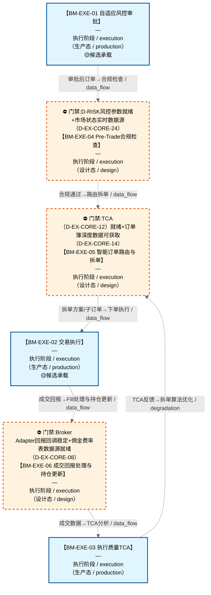

# 作战地图·执行阶段

> **[可缩放 HTML 版 / Zoomable HTML](http://localhost:8765/docs/02_enterprise_architecture/07_trading_decision_architecture/battle_map/_zoomable_html/battle_map_10_execution.html)** — Ctrl+滚轮缩放 ｜ 双击重置 ｜ Ctrl+Shift+D 切换拖动/选择模式

> battle_map §execution 阶段，6 环节。
> 本文档由 `generate_battle_map_diagram.py` 自动生成，禁止手编。

## 文档基本信息 / Document Overview

| 字段 | 值 | Field | Value |
|------|------|-------|-------|
| 阶段 | 执行（execution） | Stage | 执行 |
| 环节数 | 6 | Steps | 6 |
| 流转边 | 14 | Edges | 14 |
| 状态分布 | 🟦 运营态（已建）=3 ｜ 🟧 设计态（待施工）=3 | State Distribution | 🟦 运营态（已建）=3 ｜ 🟧 设计态（待施工）=3 |

> **图例说明 / Legend**：
> - 🟦 **蓝色实线 = 运营态环节**（production，锚点模块已建）
> - 🟧 **橙色虚线 = 设计态环节**（design，锚点模块待施工）
> - 🟥 **红色 = 弃用态**（deprecated）
> - ⬜ **灰色 = 缺失态**（missing，环节无锚点，BM-INV-001 违例）
> - 🟨 **黄色虚线 = 候选态**（candidate，承载模块在候选池）
> - **实线箭头 ``-->`` = 运营态流转**（两端均 production）
> - **虚线箭头 ``-.->`` = 非运营态流转**（含设计/候选/混合）

## 阶段图 / Stage Diagram

> 展示 执行 阶段全部 6 个环节及流转边，颜色区分五态。

## 环节详情

### BM-EXE-01 自适应风控审批

**6 件套（结构化，DB indicators JSONB）**：

| 要素 | 内容 |
|---|---|
| ① 触发条件 | 仓位指令就绪 阈值: 订单拦截器（审批后才执行） |
| ② 消费数据/因子 | 仓位指令（来自 BM-POS-01） C-001/C-002/C-009/C-021/C-047 状态（来自 多环节） |
| ③ 参数 | risk_threshold=自适应（范围 -，代码当前: max_single_position=0.10 (单标的权重上限) + HALT级违例阻断下单，状态: implemented） |
| ④ 数据流 | 输入: 仓位指令 → 处理: C-004 风控审批（订单拦截） → 输出: 审批后订单 → 下游: BM-EXE-04 Pre-Trade合规检查 |
| ⑤ 代码映射 | C-004 / 草图§9 L4 层 |
| ⑥ 降级/中止 | C-004 不可用 → 降级硬编码仓位上限10%（应急保命轨） |

**锚点（环节↔模块双向关联）**：

| 目标图 | 目标ID | 角色 | 状态快照 | 真实build_status |
|---|---|---|---|---|
| depgraph | MOD-L06-001 | primary | production | generated |
| candidate | CAND-RSK-014 | supplement | deferred | — |

**有效状态**：🟦 运营态（已建） ｜ **环节自报**：design ｜ **层**：L4 ｜ **阶段**：execution

### BM-EXE-04 Pre-Trade合规检查

**6 件套（结构化，DB indicators JSONB）**：

| 要素 | 内容 |
|---|---|
| ① 触发条件 | 风控审批通过(BM-EXE-01) 阈值: Pre-Trade合规主链6项顺序检查 |
| ② 消费数据/因子 | 审批后订单（来自 BM-EXE-01） 市场状态(涨跌停)（来自 L0） 持仓/撤单率/参与率实时累计（来自 多环节） |
| ③ 参数 | 报单停留时间锁=≥50μs（范围 -，代码当前: 待实现，状态: proposed） 参与率=≤5%（范围 -，代码当前: 待实现，状态: proposed） 撤单率=≤15%（范围 -，代码当前: 待实现，状态: proposed） Wash Trade检测=自交易检测（范围 -，代码当前: 待实现，状态: proposed） report_confirmed前置=先报后交易（范围 -，代码当前: 待实现，状态: proposed） |
| ④ 数据流 | 输入: 审批后订单 → 处理: Pre-Trade合规主链6项顺序检查+操纵防护(Wash Trade/Spoofing/Layering) → 输出: 合规通过订单 → 下游: BM-EXE-05 智能订单路由与拆单 |
| ⑤ 代码映射 | MOD-EX-024+MOD-EX-007 / 草图§9 L4层+A6§Pre-Trade |
| ⑥ 降级/中止 | 合规引擎不可用 → Fail-Closed拒所有新订单(C-004默认拒绝) |

**锚点（环节↔模块双向关联）**：

| 目标图 | 目标ID | 角色 | 状态快照 | 真实build_status |
|---|---|---|---|---|
| depgraph | MOD-EX-024 | primary | planned | planned |
| depgraph | MOD-EX-007 | supplement | planned | planned |

**有效状态**：🟧 设计态（待施工） ｜ **环节自报**：design ｜ **层**：L4 ｜ **阶段**：execution

### BM-EXE-05 智能订单路由与拆单

**6 件套（结构化，DB indicators JSONB）**：

| 要素 | 内容 |
|---|---|
| ① 触发条件 | Pre-Trade合规通过(BM-EXE-04) 阈值: 拆单+路由 |
| ② 消费数据/因子 | 合规通过订单（来自 BM-EXE-04） 盘口流动性（来自 L0） C-046历史TCA数据（来自 BM-EXE-03） C-042策略容量（来自 L3） |
| ③ 参数 | 算法=自适应选择（范围 TWAP/VWAP/ICEBERG/POV/IS/ALT，代码当前: algo_trading_engine(stable)，状态: implemented） 参与率=<15%分钟成交量(时变)（范围 -，代码当前: participation_rate=0.10，状态: implemented） 执行时间窗口=开盘前5min/收盘前10min/均匀分布（范围 -，代码当前: 待实现，状态: proposed） Almgren-Chriss最优轨迹=E[cost]+λ×Var[cost]（范围 -，代码当前: order_splitter待实现，状态: proposed） 执行进度偏差阈值=—（范围 -，代码当前: 待实现，状态: proposed） |
| ④ 数据流 | 输入: 合规通过订单 → 处理: Almgren-Chriss最优轨迹+算法选择+大单拆分+参与率控制+流动性前置检查 → 输出: 子订单序列 → 下游: BM-EXE-02 交易执行 |
| ⑤ 代码映射 | MOD-EX-014+MOD-XS-001/004/005/011 / 草图§9.2 Almgren-Chriss+§15执行算法 |
| ⑥ 降级/中止 | Order Splitter未就绪 → 整单直发(无拆单，冲击成本升高) |

**锚点（环节↔模块双向关联）**：

| 目标图 | 目标ID | 角色 | 状态快照 | 真实build_status |
|---|---|---|---|---|
| depgraph | MOD-EX-014 | primary | planned | planned |
| depgraph | MOD-XS-001 | supplement | stable | generated |
| depgraph | MOD-XS-004 | supplement | stable | generated |
| depgraph | MOD-XS-005 | supplement | stable | generated |

**有效状态**：🟧 设计态（待施工） ｜ **环节自报**：design ｜ **层**：L4 ｜ **阶段**：execution

### BM-EXE-02 交易执行

**6 件套（结构化，DB indicators JSONB）**：

| 要素 | 内容 |
|---|---|
| ① 触发条件 | 拆单方案就绪(BM-EXE-05) 阈值: 下单+成交回报 |
| ② 消费数据/因子 | 子订单序列（来自 BM-EXE-05） |
| ③ 参数 | order_algo=自适应（范围 -，代码当前: 待实现，状态: proposed） miniqmt_rate=10笔/秒（范围 -，代码当前: 下单速率10笔/秒+同标的间隔≥500ms，状态: implemented） |
| ④ 数据流 | 输入: 子订单序列 → 处理: C-002 下单(miniQMT通道)+成交回报 → 输出: 交易指令+成交回报+PnL → 下游: BM-EXE-06 成交回报处理与持仓更新 + BM-REC-01 运营清算 |
| ⑤ 代码映射 | C-002 / 草图§9 L4 层 / MOD-XS-002 broker_adapter |
| ⑥ 降级/中止 | C-002 失败 → 下单零重试(幂等Key HB-07)+告警 |

**锚点（环节↔模块双向关联）**：

| 目标图 | 目标ID | 角色 | 状态快照 | 真实build_status |
|---|---|---|---|---|
| depgraph | MOD-XS-002 | primary | planned | generated |
| depgraph | MOD-EX-030 | supplement | planned | planned |
| candidate | CAND-HARVEST-0021 | supplement | candidate | — |
| candidate | CAND-EX-001 | supplement | deferred | — |
| candidate | CAND-EX-002 | supplement | deferred | — |

**有效状态**：🟦 运营态（已建） ｜ **环节自报**：design ｜ **层**：L4 ｜ **阶段**：execution

### BM-EXE-06 成交回报处理与持仓更新

**6 件套（结构化，DB indicators JSONB）**：

| 要素 | 内容 |
|---|---|
| ① 触发条件 | 成交回报到达(BM-EXE-02) 阈值: — |
| ② 消费数据/因子 | 成交回报（来自 BM-EXE-02） 订单状态（来自 BM-EXE-02） |
| ③ 参数 | 订单7状态机=7状态（范围 PENDING→SUBMITTED→PARTIAL/FILLED/CANCELLED/REJECTED/EXPIRED，代码当前: order_manager(stable)，状态: implemented） 部分成交聚合=聚合器（范围 -，代码当前: fill_processor待实现，状态: proposed） 费用计算=佣金/印花税/过户费（范围 -，代码当前: 待实现，状态: proposed） T+1结算=T+1（范围 -，代码当前: A股T+1，状态: implemented） 持仓对账周期=5min（范围 -，代码当前: position_reconciler(stable)，状态: implemented） Saga超时=≤5s（范围 -，代码当前: order_execution_saga(stable)，状态: implemented） |
| ④ 数据流 | 输入: 成交回报+订单状态 → 处理: Fill解析+部分成交聚合+费用计算+持仓更新+订单状态机流转+持仓对账 → 输出: 持仓快照+PnL → 下游: BM-EXE-03(TCA) + BM-POS-03(持仓状态机) + BM-REC-01(清算) |
| ⑤ 代码映射 | MOD-EX-008+MOD-EX-002+MOD-EX-057+MOD-EX-056 / 草图§9 L4层+§13 Saga |
| ⑥ 降级/中止 | Fill Processor未就绪 → 仅原始成交记录(持仓更新延迟，依赖盘后对账) |

**锚点（环节↔模块双向关联）**：

| 目标图 | 目标ID | 角色 | 状态快照 | 真实build_status |
|---|---|---|---|---|
| depgraph | MOD-EX-008 | primary | planned | planned |
| depgraph | MOD-EX-002 | supplement | stable | stable |
| depgraph | MOD-EX-057 | supplement | stable | stable |
| depgraph | MOD-EX-056 | supplement | stable | generated |

**有效状态**：🟧 设计态（待施工） ｜ **环节自报**：design ｜ **层**：L4 ｜ **阶段**：execution

### BM-EXE-03 执行质量TCA

**6 件套（结构化，DB indicators JSONB）**：

| 要素 | 内容 |
|---|---|
| ① 触发条件 | 成交回报到达 阈值: — |
| ② 消费数据/因子 | 成交回报（来自 BM-EXE-06） 决策时刻价格（来自 BM-BUY-04/BM-SELL-02） VWAP/TWAP/开盘价/收盘价（来自 L0） C-042策略容量（来自 L3） C-046历史TCA数据（来自 本环节） |
| ③ 参数 | IS成本分解=时机成本+市场冲击+滑点+佣金（范围 -，代码当前: 滑点slippage_bps + 佣金commission + IS shortfall(_calc_shortfall)，状态: implemented） TCA阶段=Pre-trade/At-trade/Post-trade（范围 -，代码当前: Post-trade(analyze/analyze_batch方法); Pre-trade/At-trade未实现，状态: implemented） 执行基准=VWAP/TWAP/开盘价/收盘价（范围 -，代码当前: arrival(到达价)——benchmark_price_source默认值，状态: implemented） 参与率控制=<15%分钟成交量（范围 -，代码当前: participation_rate=0.10 (10%分钟成交量)，状态: implemented） 执行进度偏差阈值=—（范围 -，代码当前: 待实现，状态: proposed） |
| ④ 数据流 | 输入: 成交回报+决策时刻价格 → 处理: IS成本分解+三阶段TCA+基准对比 → 输出: 执行质量评分+成本归因 → 下游: 反馈到BM-EXE-05拆单算法(Almgren-Chriss) + BM-REC-02复盘 |
| ⑤ 代码映射 | MOD-L07-001 / 草图§9.2 C-046（MOD-L07-001 default_tca_engine） |
| ⑥ 降级/中止 | TCA引擎未就绪 → 仅记录成交不分析(复盘缺执行质量维度) |

**锚点（环节↔模块双向关联）**：

| 目标图 | 目标ID | 角色 | 状态快照 | 真实build_status |
|---|---|---|---|---|
| depgraph | MOD-L07-001 | primary | stable | generated |

**有效状态**：🟦 运营态（已建） ｜ **环节自报**：design ｜ **层**：L4 ｜ **阶段**：execution

[← 返回总指挥图](battle_map_panorama.md)