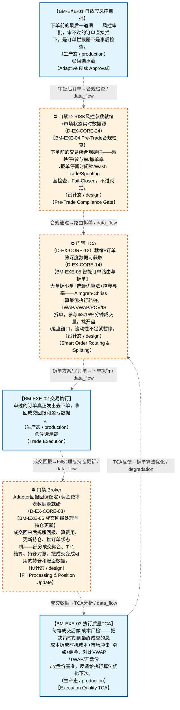

# 作战地图·执行阶段

> **[可缩放 HTML 版 / Zoomable HTML](http://localhost:8765/docs/02_enterprise_architecture/07_trading_decision_architecture/battle_map/_zoomable_html/battle_map_10_execution.html)** — Ctrl+滚轮缩放 ｜ 双击重置 ｜ Ctrl+Shift+D 切换拖动/选择模式

> battle_map §execution 阶段，6 环节（47 锚点）。
> 🔑 锚点表 `battle_map_anchors` 是环节↔模块**双向对齐枢纽**（step↔module 唯一查找真源），详见各环节「锚点」小节。
> 本文档由 `generate_battle_map_diagram.py` 自动生成，禁止手编。

## 文档基本信息 / Document Overview

| 字段 | 值 | Field | Value |
|------|------|-------|-------|
| 阶段 | 执行（execution） | Stage | 执行 |
| 环节数 | 6 | Steps | 6 |
| 锚点数（双向对齐） | 47 | Anchors (Bidirectional) | 47 |
| 流转边 | 14 | Edges | 14 |
| 状态分布 | 🟦 运营态（已建）=3 ｜ 🟧 设计态（待施工）=3 | State Distribution | 🟦 运营态（已建）=3 ｜ 🟧 设计态（待施工）=3 |

> **图例说明 / Legend**：
> - 🟦 **蓝色实线 = 运营态环节**（production，锚点模块已建）
> - 🟧 **橙色虚线 = 设计态环节**（design，锚点模块待施工）
> - 🟧**设计态子环节** = 父环节已建但此子环节待施工（特殊标记，易被忽略）
> - 🟥 **红色 = 弃用态**（deprecated）
> - ⬜ **灰色 = 缺失态**（missing，环节无锚点，BM-INV-001 违例）
> - 🟨 **黄色虚线 = 候选态**（candidate，承载模块在候选池）
> - **实线箭头 ``-->`` = 运营态流转**（两端均 production）
> - **虚线箭头 ``-.->`` = 非运营态流转**（含设计/候选/混合）

## 阶段图 / Stage Diagram

> 展示 执行 阶段全部 6 个环节及流转边，颜色区分五态。

## 环节详情

### BM-EXE-01 自适应风控审批 / Adaptive Risk Approval

> **大白话**：下单前的最后一道闸——风控审批，审不过的订单直接拦下，是订单拦截器不是事后检查。

**机制说明**：

L4 层。C-004 自适应风控，作为订单拦截器：C-005 生成预案→MTF→DO→C-047 裁决仓位→C-004 风控审批后才→C-002 执行。C-004 仅依赖 C-001/C-002/C-009/C-021/C-047，不依赖 C-005。

**6 件套（结构化，DB indicators JSONB）**：

| 要素 | 内容 |
|---|---|
| ① 触发条件 | 仓位指令就绪 阈值: 订单拦截器（审批后才执行） |
| ② 消费数据/因子 | 仓位指令（来自 BM-POS-01） C-001/C-002/C-009/C-021/C-047 状态（来自 多环节） |
| ③ 参数 | risk_threshold=自适应（范围 -，代码当前: max_single_position=0.10 (单标的权重上限) + HALT级违例阻断下单，状态: implemented） |
| ④ 数据流 | 输入: 仓位指令 → 处理: C-004 风控审批（订单拦截） → 输出: 审批后订单 → 下游: BM-EXE-04 Pre-Trade合规检查 |
| ⑤ 代码映射 | C-004 / 草图§9 L4 层 |
| ⑥ 降级/中止 | C-004 不可用 → 降级硬编码仓位上限10%（应急保命轨） |

**指标文案（翻译真源 indicators_zh）**：

①触发：仓位指令就绪；②消费：BM-POS-01 仓位指令 + 多环节状态；③参数：risk_threshold=自适应；④数据流：仓位指令→C-004 审批拦截→审批后订单→BM-EXE-04；⑤代码：C-004 L4 层；⑥降级：C-004 不可用→硬编码仓位上限10%。
📌 概念覆盖清单（草稿H3逐字登记）：§9.1 C-004 自适应风控三层体系（→A4风险架构）；§5.1 风控规则变更审批流；§5.3 风控审计；§7.2 事中在线适应；§15.6 ARA自适应风险架构原则

**锚点（环节↔模块双向关联）**：

| 目标图 | 目标ID | 角色 | 状态快照 | 真实build_status |
|---|---|---|---|---|
| depgraph | MOD-L06-001 | primary | production | generated |
| candidate | CAND-RSK-014 | supplement | deferred | — |

**有效状态**：🟦 运营态（已建） ｜ **环节自报**：design ｜ **层**：L4 ｜ **阶段**：execution

### BM-EXE-04 Pre-Trade合规检查 / Pre-Trade Compliance Gate

> **大白话**：下单前的交易所合规硬闸——涨跌停/参与率/撤单率/报单停留时间锁/Wash Trade/Spoofing 全检查，Fail-Closed，不过就拦。

**机制说明**：

L4 层。C-002 执行域 Pre-Trade 合规主链（D-EX-CORE-24 Pre-Execution Checker + D-EX-CORE-07 Execution Risk Gate）。
与 BM-EXE-01 的 C-004 仓位风控互补：C-004 管仓位/单笔上限（自适应风控），本环节管交易所合规硬阻断（2026.4.7新规）。
Pre-Trade 合规检查主链6项顺序（均 Hard Block）：涨跌停→参与率(≤5%)→持仓限额→行业集中度→撤单率(≤15%)→报单停留时间锁(≥50μs)。
并行阻塞管道：Wash Trade 自交易检测(C-002执行域) + Spoofing/Layering/尾盘操纵检测(C-004)。
程序化交易报告先报后交易铁律：report_confirmed=False→拒绝所有订单。
Fail-Closed：合规规则引擎不可用→C-004默认拒绝所有订单→C-002亦不可用→Kill Switch自动触发。

**6 件套（结构化，DB indicators JSONB）**：

| 要素 | 内容 |
|---|---|
| ① 触发条件 | 风控审批通过(BM-EXE-01) 阈值: Pre-Trade合规主链6项顺序检查 |
| ② 消费数据/因子 | 审批后订单（来自 BM-EXE-01） 市场状态(涨跌停)（来自 L0） 持仓/撤单率/参与率实时累计（来自 多环节） |
| ③ 参数 | 报单停留时间锁=≥50μs（范围 -，代码当前: 待实现，状态: proposed） 参与率=≤5%（范围 -，代码当前: 待实现，状态: proposed） 撤单率=≤15%（范围 -，代码当前: 待实现，状态: proposed） Wash Trade检测=自交易检测（范围 -，代码当前: 待实现，状态: proposed） report_confirmed前置=先报后交易（范围 -，代码当前: 待实现，状态: proposed） |
| ④ 数据流 | 输入: 审批后订单 → 处理: Pre-Trade合规主链6项顺序检查+操纵防护(Wash Trade/Spoofing/Layering) → 输出: 合规通过订单 → 下游: BM-EXE-05 智能订单路由与拆单 |
| ⑤ 代码映射 | MOD-EX-024+MOD-EX-007 / 草图§9 L4层+A6§Pre-Trade |
| ⑥ 降级/中止 | 合规引擎不可用 → Fail-Closed拒所有新订单(C-004默认拒绝) |

**指标文案（翻译真源 indicators_zh）**：

①触发：风控审批通过(BM-EXE-01)；②消费：BM-EXE-01 审批后订单 + 市场状态(涨跌停)+持仓/撤单率/参与率实时累计；③参数：报单停留时间锁≥50μs、参与率≤5%、撤单率≤15%、Wash Trade检测、Spoofing/Layering检测、report_confirmed前置；④数据流：审批后订单→Pre-Trade合规主链6项顺序检查+操纵防护→合规通过订单→BM-EXE-05；⑤代码：MOD-EX-024 pre_execution_checker(planned)+MOD-EX-007 execution_risk_gate(planned) / 草图§9 L4层+A6§Pre-Trade；⑥降级：合规引擎不可用→Fail-Closed拒所有新订单(C-004默认拒绝)。
📌 概念覆盖清单（草稿H3逐字登记）：日内量能结构与订单流分析模型（Intraday Volume Structure & Order F；§11.2.1 因子元数据（Metadata）；§17.6 D-COMPLIANCE 合规监管域缺失模块

**锚点（环节↔模块双向关联）**：

| 目标图 | 目标ID | 角色 | 状态快照 | 真实build_status |
|---|---|---|---|---|
| depgraph | MOD-EX-024 | primary | planned | planned |
| depgraph | MOD-EX-007 | supplement | planned | planned |

**有效状态**：🟧 设计态（待施工） ｜ **环节自报**：design ｜ **层**：L4 ｜ **阶段**：execution

### BM-EXE-05 智能订单路由与拆单 / Smart Order Routing & Splitting

> **大白话**：大单拆小单+选最优算法+控参与率——Almgren-Chriss 算最优执行轨迹，TWAP/VWAP/POV/IS 拆单，参与率<15%分钟成交量，挑开盘/尾盘窗口，流动性不足就暂停。

**机制说明**：

L4 层。D-EX-CORE-14 Order Splitter（Almgren-Chriss 最优执行轨迹）+ D-EX-SOR 智能路由域。
Almgren-Chriss 最优执行框架：执行计划生成(基于TCA历史+策略容量)→大单拆分策略(最优轨迹)→参与率控制(<15%分钟成交量)→执行时间窗口选择→执行进度监控(实际vs计划偏差>阈值→暂停+告警)→流动性前置检查(不足→暂停+告警)。
算法清单(XS-05 Algo Trading Engine)：TWAP/VWAP/ICEBERG/POV/Implementation Shortfall/ALT(激进流动性摄取)。
时变参与率(降本15-25%)：开盘(9:30-10:00)15% / 上午(10:00-11:30)10% / 午盘(13:00-14:00)5% / 尾盘(14:00-15:00)15%。
XS-01 Optimal Order Router：延迟/成交率/费用三维加权选最优券商。XS-04 Execution Scheduler：TWAP/VWAP时间切片调度。XS-11 Algo Execution Selector：按订单特征(大小/紧急度/流动性)自动选算法。
🆕XS-EXT 扩展路由模块系列（5个）：✅滑点分析已建；❌执行质量评分/交易成本优化/多框架路由/执行引擎智能路由（门禁：需多市场环境）。
miniQMT个人账户不支持券商端VWAP/TWAP算法接口，本系统自行实现拆单逻辑。SOR不做风控判断(风控由BM-EXE-01/04做)。

**6 件套（结构化，DB indicators JSONB）**：

| 要素 | 内容 |
|---|---|
| ① 触发条件 | Pre-Trade合规通过(BM-EXE-04) 阈值: 拆单+路由 |
| ② 消费数据/因子 | 合规通过订单（来自 BM-EXE-04） 盘口流动性（来自 L0） C-046历史TCA数据（来自 BM-EXE-03） C-042策略容量（来自 L3） |
| ③ 参数 | 算法=自适应选择（范围 TWAP/VWAP/ICEBERG/POV/IS/ALT，代码当前: algo_trading_engine(stable)，状态: implemented） 参与率=<15%分钟成交量(时变)（范围 -，代码当前: participation_rate=0.10，状态: implemented） 执行时间窗口=开盘前5min/收盘前10min/均匀分布（范围 -，代码当前: 待实现，状态: proposed） Almgren-Chriss最优轨迹=E[cost]+λ×Var[cost]（范围 -，代码当前: order_splitter待实现，状态: proposed） 执行进度偏差阈值=—（范围 -，代码当前: 待实现，状态: proposed） |
| ④ 数据流 | 输入: 合规通过订单 → 处理: Almgren-Chriss最优轨迹+算法选择+大单拆分+参与率控制+流动性前置检查 → 输出: 子订单序列 → 下游: BM-EXE-02 交易执行 |
| ⑤ 代码映射 | MOD-EX-014+MOD-XS-001/004/005/011 / 草图§9.2 Almgren-Chriss+§15执行算法 |
| ⑥ 降级/中止 | Order Splitter未就绪 → 整单直发(无拆单，冲击成本升高) |

**指标文案（翻译真源 indicators_zh）**：

①触发：Pre-Trade合规通过(BM-EXE-04)；②消费：BM-EXE-04 合规通过订单 + 盘口流动性(L0)+C-046历史TCA(BM-EXE-03)+C-042策略容量(L3)；③参数：算法=TWAP/VWAP/ICEBERG/POV/IS/ALT、参与率<15%分钟成交量(时变:开盘15%/上午10%/午盘5%/尾盘15%)、执行时间窗口=开盘前5min/收盘前10min/均匀分布、流动性前置检查、执行进度偏差阈值(proposed)；④数据流：合规订单→Almgren-Chriss最优轨迹+算法选择+大单拆分+参与率控制→子订单序列→BM-EXE-02；⑤代码：MOD-EX-014 order_splitter(planned)+MOD-XS-001/004/005/011(stable) / 草图§9.2 Almgren-Chriss+§15执行算法；⑥降级：Order Splitter未就绪→整单直发(无拆单，冲击成本升高)。

**锚点（环节↔模块双向关联）**：

| 目标图 | 目标ID | 角色 | 状态快照 | 真实build_status |
|---|---|---|---|---|
| depgraph | MOD-EX-014 | primary | planned | planned |
| depgraph | MOD-XS-001 | supplement | stable | stable |
| depgraph | MOD-XS-004 | supplement | stable | stable |
| depgraph | MOD-XS-005 | supplement | stable | stable |
| depgraph | MOD-XS-011 | primary | stable | stable |
| depgraph | MOD-EX_SOR | primary | stable | generated |
| depgraph | MOD-XS-014 | primary | stable | stable |
| depgraph | MOD-EX-042 | supplement | planned | planned |
| depgraph | MOD-EX-060 | supplement | planned | planned |
| depgraph | MOD-EX-061 | supplement | planned | planned |

**有效状态**：🟧 设计态（待施工） ｜ **环节自报**：design ｜ **层**：L4 ｜ **阶段**：execution

### BM-EXE-02 交易执行 / Trade Execution

> **大白话**：审过的订单真正发出去下单，拿回成交回报和盈亏数据。

**机制说明**：

L4 层。C-002 交易执行：下单+成交回报，产出交易指令+成交回报+PnL 数据。是数据流主动脉的末端执行节点。🆕v8.0
执行策略选择器（MOD-EX-062，根据市场状态选择最优执行策略：TWAP/VWAP/IS/POV/增强Almgren-Chriss），决策以 DecisionOrder 契约下发；🆕v3.5 执行算法子层（拆单/参与率/Almgren-Chriss最优执行框架，见BM-EXE-05）。

**6 件套（结构化，DB indicators JSONB）**：

| 要素 | 内容 |
|---|---|
| ① 触发条件 | 拆单方案就绪(BM-EXE-05) 阈值: 下单+成交回报 |
| ② 消费数据/因子 | 子订单序列（来自 BM-EXE-05） |
| ③ 参数 | order_algo=自适应（范围 -，代码当前: 待实现，状态: proposed） miniqmt_rate=10笔/秒（范围 -，代码当前: 下单速率10笔/秒+同标的间隔≥500ms，状态: implemented） |
| ④ 数据流 | 输入: 子订单序列 → 处理: C-002 下单(miniQMT通道)+成交回报 → 输出: 交易指令+成交回报+PnL → 下游: BM-EXE-06 成交回报处理与持仓更新 + BM-REC-01 运营清算 |
| ⑤ 代码映射 | C-002 / 草图§9 L4 层 / MOD-XS-002 broker_adapter |
| ⑥ 降级/中止 | C-002 失败 → 下单零重试(幂等Key HB-07)+告警 |

**指标文案（翻译真源 indicators_zh）**：

①触发：拆单方案就绪(BM-EXE-05)；②消费：BM-EXE-05 子订单序列；③参数：order_algo=自适应、miniQMT下单速率10笔/秒、同标的间隔≥500ms；④数据流：子订单→C-002 下单(miniQMT通道)→交易指令+成交回报+PnL→BM-EXE-06；⑤代码：C-002 L4 层 / MOD-XS-002 broker_adapter；⑥降级：C-002 失败→下单零重试(幂等Key HB-07)+告警。
📌 概念覆盖清单（草稿H3逐字登记）：§9.3 风控与执行的交互规则；旅程1：盘前准备 → 集合竞价 → 盘中执行（交易时段主流程）；交易日时间激活视图；§29.C 交易与执行增强；§30.3 核心交易链域缺失模块；§1.6 交易对手风险

**锚点（环节↔模块双向关联）**：

| 目标图 | 目标ID | 角色 | 状态快照 | 真实build_status |
|---|---|---|---|---|
| depgraph | MOD-XS-002 | primary | planned | stable |
| depgraph | MOD-EX-030 | supplement | planned | planned |
| candidate | CAND-HARVEST-0021 | supplement | candidate | — |
| candidate | CAND-EX-001 | supplement | deferred | — |
| candidate | CAND-EX-002 | supplement | deferred | — |
| depgraph | MOD-XS-013 | primary | stable | stable |
| depgraph | MOD-EX-049 | primary | stable | stable |
| depgraph | MOD-EX-050 | primary | stable | stable |
| depgraph | MOD-EX-055 | primary | stable | stable |
| depgraph | MOD-INF-035 | primary | planned | planned |
| depgraph | MOD-TRADING-001 | primary | stable | generated |
| depgraph | MOD-RESOURCE_OPTIMIZATION_ENGINE | supplement | stable | planned |
| depgraph | MOD-EX-021 | supplement | planned | planned |
| depgraph | MOD-EX-029 | supplement | planned | planned |
| depgraph | MOD-EX-031 | supplement | planned | planned |
| depgraph | MOD-EX-032 | supplement | planned | planned |
| depgraph | MOD-EX-033 | supplement | planned | planned |
| depgraph | MOD-EX-035 | supplement | planned | planned |
| depgraph | MOD-EX-058 | supplement | planned | planned |
| depgraph | MOD-EX-059 | supplement | planned | planned |
| depgraph | MOD-EX-062 | primary | planned | planned |

**有效状态**：🟦 运营态（已建） ｜ **环节自报**：design ｜ **层**：L4 ｜ **阶段**：execution

### BM-EXE-06 成交回报处理与持仓更新 / Fill Processing & Position Update

> **大白话**：成交回来后拆解回报、算费用、更新持仓、推订单状态机——部分成交聚合、T+1 结算、持仓对账，把成交变成可用的持仓和账面数据。

**机制说明**：

L4 层。D-EX-CORE-08 Fill Processor + D-EX-CORE-04 Position Tracker + D-EX-CORE-11 Order State Machine + D-EX-CORE-57 下单执行Saga编排器 + D-EX-CORE-56 持仓对账器。
Fill Processor(D-EX-CORE-08)：成交解析器+部分成交聚合器+成交归因器+费用计算器(佣金/印花税/过户费)，T+1结算合规。
Position Tracker(D-EX-CORE-04)：AGG-002 Position聚合根(symbol/quantity/avg_cost/market_value/unrealized_pnl)，方案C(风控发指令+Fill回调写入)，每笔成交后更新Redis，持仓数据3秒内一致。
Order State Machine(D-EX-CORE-11)：7状态机 PENDING→{SUBMITTED,CANCELLED}/SUBMITTED→{PARTIAL,FILLED,CANCELLED,REJECTED,EXPIRED}/PARTIAL→{FILLED,CANCELLED,REJECTED,EXPIRED}，持久化+事件发射。
下单执行Saga(D-EX-CORE-57)：编排式六步(风控检查→信号确认→下单提交→成交确认→持仓更新→报告生成)，≤5s超时硬约束，补偿幂等，Redis Stream状态持久化。
持仓对账(D-EX-CORE-56)：每5分钟与miniQMT持仓查询自动对账，差异>0→立即告警+冻结该标的交易，恢复后先对账不一致→D-L1降级。
最终一致性：订单成交→持仓更新<100ms。

**6 件套（结构化，DB indicators JSONB）**：

| 要素 | 内容 |
|---|---|
| ① 触发条件 | 成交回报到达(BM-EXE-02) 阈值: — |
| ② 消费数据/因子 | 成交回报（来自 BM-EXE-02） 订单状态（来自 BM-EXE-02） |
| ③ 参数 | 订单7状态机=7状态（范围 PENDING→SUBMITTED→PARTIAL/FILLED/CANCELLED/REJECTED/EXPIRED，代码当前: order_manager(stable)，状态: implemented） 部分成交聚合=聚合器（范围 -，代码当前: fill_processor待实现，状态: proposed） 费用计算=佣金/印花税/过户费（范围 -，代码当前: 待实现，状态: proposed） T+1结算=T+1（范围 -，代码当前: A股T+1，状态: implemented） 持仓对账周期=5min（范围 -，代码当前: position_reconciler(stable)，状态: implemented） Saga超时=≤5s（范围 -，代码当前: order_execution_saga(stable)，状态: implemented） |
| ④ 数据流 | 输入: 成交回报+订单状态 → 处理: Fill解析+部分成交聚合+费用计算+持仓更新+订单状态机流转+持仓对账 → 输出: 持仓快照+PnL → 下游: BM-EXE-03(TCA) + BM-POS-03(持仓状态机) + BM-REC-01(清算) |
| ⑤ 代码映射 | MOD-EX-008+MOD-EX-002+MOD-EX-057+MOD-EX-056 / 草图§9 L4层+§13 Saga |
| ⑥ 降级/中止 | Fill Processor未就绪 → 仅原始成交记录(持仓更新延迟，依赖盘后对账) |

**指标文案（翻译真源 indicators_zh）**：

①触发：成交回报到达(BM-EXE-02)；②消费：BM-EXE-02 成交回报 + 订单状态；③参数：订单7状态机(PENDING→SUBMITTED→PARTIAL/FILLED/CANCELLED/REJECTED/EXPIRED)、部分成交聚合、费用计算=佣金/印花税/过户费、T+1结算、持仓对账周期=5min、Saga超时≤5s；④数据流：成交回报→Fill解析+部分成交聚合+费用计算+持仓更新+订单状态机流转→持仓快照+PnL→BM-EXE-03(TCA)+BM-POS-03(持仓状态机)+BM-REC-01(清算)；⑤代码：MOD-EX-008 fill_processor(planned)+MOD-EX-002 tracker(stable)+MOD-EX-057 saga(stable)+MOD-EX-056 reconciler(stable) / 草图§9 L4层+§13 Saga；⑥降级：Fill Processor未就绪→仅原始成交记录(持仓更新延迟，依赖盘后对账)。

**锚点（环节↔模块双向关联）**：

| 目标图 | 目标ID | 角色 | 状态快照 | 真实build_status |
|---|---|---|---|---|
| depgraph | MOD-EX-008 | primary | planned | planned |
| depgraph | MOD-EX-002 | supplement | stable | stable |
| depgraph | MOD-EX-057 | supplement | stable | stable |
| depgraph | MOD-EX-056 | supplement | stable | stable |
| depgraph | MOD-EX-001 | primary | stable | stable |
| depgraph | MOD-EX-003 | primary | stable | generated |

**有效状态**：🟧 设计态（待施工） ｜ **环节自报**：design ｜ **层**：L4 ｜ **阶段**：execution

### BM-EXE-03 执行质量TCA / Execution Quality TCA

> **大白话**：每笔成交后做"成本尸检"——把决策时刻到最终成交的总成本拆成时机成本+市场冲击+滑点+佣金，对比VWAP/TWAP/开盘价/收盘价基准，反馈给执行算法优化下次。

**机制说明**：

§9.2 C-046执行质量分析TCA(Trade Cost Analysis) + Implementation Shortfall。
Implementation Shortfall(IS)：决策时刻→最终成交的总成本分解(时机成本+市场冲击+滑点+佣金)。IS是执行质量的核心指标——衡量"决策意图"与"实际成交"之间的总损耗。
Pre-trade/At-trade/Post-trade三阶段TCA：
  Pre-trade：下单前预估执行成本(基于历史TCA+C-042策略容量约束)，用于执行计划生成。
  At-trade：下单时实时监控执行进度(实际执行vs计划轨迹偏差>阈值→暂停+告警)。
  Post-trade：成交后做成本归因(滑点来源/冲击成本/执行延迟)，反馈到执行算法。
执行基准对比：每笔订单vs VWAP/TWAP/开盘价/收盘价，评估执行质量优劣。
与Almgren-Chriss最优执行框架的协同：C-046历史TCA数据→执行计划生成→大单拆分策略→参与率控制(<15%分钟成交量)→执行时间窗口选择(开盘前5min/收盘前10min/均匀分布)→执行进度监控。
密度感知的执行时机优化(§9.2 v3.4新增)：基于条件PDF选择最优执行窗口——条件PDF右偏(正偏)→买入信号→优先在开盘执行(预期上涨概率高)；条件PDF左偏(负偏)→卖出信号→优先在开盘执行；条件PDF对称但宽(高不确定性)→延迟到收盘前执行。Almgren-Chriss的最优轨迹可基于条件PDF而非历史波动率计算。

**6 件套（结构化，DB indicators JSONB）**：

| 要素 | 内容 |
|---|---|
| ① 触发条件 | 成交回报到达 阈值: — |
| ② 消费数据/因子 | 成交回报（来自 BM-EXE-06） 决策时刻价格（来自 BM-BUY-04/BM-SELL-02） VWAP/TWAP/开盘价/收盘价（来自 L0） C-042策略容量（来自 L3） C-046历史TCA数据（来自 本环节） |
| ③ 参数 | IS成本分解=时机成本+市场冲击+滑点+佣金（范围 -，代码当前: 滑点slippage_bps + 佣金commission + IS shortfall(_calc_shortfall)，状态: implemented） TCA阶段=Pre-trade/At-trade/Post-trade（范围 -，代码当前: Post-trade(analyze/analyze_batch方法); Pre-trade/At-trade未实现，状态: implemented） 执行基准=VWAP/TWAP/开盘价/收盘价（范围 -，代码当前: arrival(到达价)——benchmark_price_source默认值，状态: implemented） 参与率控制=<15%分钟成交量（范围 -，代码当前: participation_rate=0.10 (10%分钟成交量)，状态: implemented） 执行进度偏差阈值=—（范围 -，代码当前: 待实现，状态: proposed） |
| ④ 数据流 | 输入: 成交回报+决策时刻价格 → 处理: IS成本分解+三阶段TCA+基准对比 → 输出: 执行质量评分+成本归因 → 下游: 反馈到BM-EXE-05拆单算法(Almgren-Chriss) + BM-REC-02复盘 |
| ⑤ 代码映射 | MOD-L07-001 / 草图§9.2 C-046（MOD-L07-001 default_tca_engine） |
| ⑥ 降级/中止 | TCA引擎未就绪 → 仅记录成交不分析(复盘缺执行质量维度) |

**指标文案（翻译真源 indicators_zh）**：

①触发：成交回报到达；②消费：成交回报(BM-EXE-06)+决策时刻价格(BM-BUY-04/BM-SELL-02)+VWAP/TWAP/开盘价/收盘价(L0)+C-042策略容量(L3)+C-046历史TCA数据(本环节)；③参数：IS成本分解(时机+冲击+滑点+佣金)、Pre/At/Post三阶段、执行基准VWAP/TWAP/开盘/收盘、参与率<15%、执行进度偏差阈值(proposed)；④数据流：成交回报+决策时刻价格→IS成本分解+三阶段TCA+基准对比→执行质量评分+成本归因→反馈到BM-EXE-05拆单算法+BM-REC-02复盘；⑤代码：MOD-L07-001 default_tca_engine(stable)；⑥降级：TCA引擎未就绪→仅记录成交不分析(复盘缺执行质量维度)。
📌 概念覆盖清单（草稿H3逐字登记）：§29.36 因果强化学习 Causal RL（v6.0新增）

**锚点（环节↔模块双向关联）**：

| 目标图 | 目标ID | 角色 | 状态快照 | 真实build_status |
|---|---|---|---|---|
| depgraph | MOD-L07-001 | primary | stable | generated |
| depgraph | MOD-EX_SOR_EXT-001 | primary | stable | stable |
| depgraph | MOD-EX_SOR_EXT-002 | primary | stable | stable |
| depgraph | MOD-EX_SOR_EXT-003 | primary | stable | stable |
| depgraph | MOD-EX-012 | supplement | planned | planned |
| depgraph | MOD-EX-036 | supplement | planned | planned |

**有效状态**：🟦 运营态（已建） ｜ **环节自报**：design ｜ **层**：L4 ｜ **阶段**：execution

[← 返回总指挥图](battle_map_panorama.md)