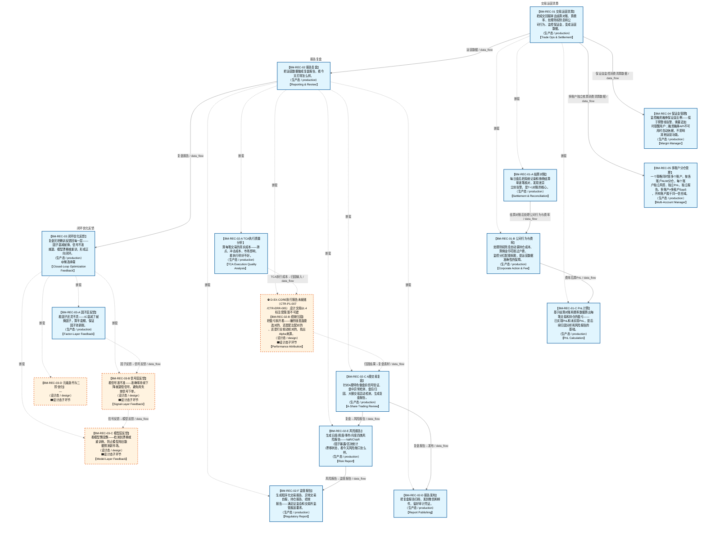

# 作战地图·对账阶段

> **[可缩放 HTML 版 / Zoomable HTML](http://localhost:8765/docs/02_enterprise_architecture/07_trading_decision_architecture/battle_map/_zoomable_html/battle_map_11_reconciliation.html)** — Ctrl+滚轮缩放 ｜ 双击重置 ｜ Ctrl+Shift+D 切换拖动/选择模式

> battle_map §reconciliation 阶段，18 环节（24 锚点）。
> 🔑 锚点表 `battle_map_anchors` 是环节↔模块**双向对齐枢纽**（step↔module 唯一查找真源），详见各环节「锚点」小节。
> 本文档由 `generate_battle_map_diagram.py` 自动生成，禁止手编。

## 文档基本信息 / Document Overview

| 字段 | 值 | Field | Value |
|------|------|-------|-------|
| 阶段 | 对账（reconciliation） | Stage | 对账 |
| 环节数 | 18 | Steps | 18 |
| 锚点数（双向对齐） | 24 | Anchors (Bidirectional) | 24 |
| 流转边 | 18 | Edges | 18 |
| 状态分布 | 🟦 运营态（已建）=14 ｜ 🟧 设计态（待施工）=4 | State Distribution | 🟦 运营态（已建）=14 ｜ 🟧 设计态（待施工）=4 |

> **图例说明 / Legend**：
> - 🟦 **蓝色实线 = 运营态环节**（production，锚点模块已建）
> - 🟧 **橙色虚线 = 设计态环节**（design，锚点模块待施工）
> - 🟧**设计态子环节** = 父环节已建但此子环节待施工（特殊标记，易被忽略）
> - 🟥 **红色 = 弃用态**（deprecated）
> - ⬜ **灰色 = 缺失态**（missing，环节无锚点，BM-INV-001 违例）
> - 🟨 **黄色虚线 = 候选态**（candidate，承载模块在候选池）
> - **实线箭头 ``-->`` = 运营态流转**（两端均 production）
> - **虚线箭头 ``-.->`` = 非运营态流转**（含设计/候选/混合）

## 阶段图 / Stage Diagram

> 展示 对账 阶段全部 18 个环节及流转边，颜色区分五态。

## 环节详情

### BM-REC-01 交易运营清算 / Trade Ops & Settlement

> **大白话**：把成交回报拿去结算对账、算费率、处理除权除息和公司行为、监控保证金，变成运营数据。

**机制说明**：

L5/运营层。C-017 交易运营五子能力：①保证金管理(D-TRADING-04 融资融券保证金比例监控/预警/追加)②结算对账(D-TRADING-02 每日15:30后自动对账，系统记录vs券商结算单，差异告警，A股T+1)③除权除息(D-TRADING-03 除权日自动调整持仓成本+目标价)④费率(D-TRADING-03 佣金/印花税/过户费计算→向C-010供PnL数据)⑤公司行为(D-TRADING-03 分红/配股/拆股监控→通知用户)。
是闭环反馈路径的起点，承接 C-002 交易执行产出。事件：E-TR-01 SettlementCompleted / E-TR-02 ReconciliationCompleted / E-TR-03 CorporateActionAdjusted / E-TR-04 MarginWarning / E-TR-05 MarginUnavailable。
降级：融资融券API不可用时保证金管理自动休眠，休眠期间向C-004发送E-TR-05"保证金数据不可用"事件。

**6 件套（结构化，DB indicators JSONB）**：

| 要素 | 内容 |
|---|---|
| ① 触发条件 | 成交回报就绪 + 每日15:30自动触发(A股T+1) 阈值: settles_at=15:30 |
| ② 消费数据/因子 | BM-EXE-02 成交回报 券商结算单 |
| ③ 参数 | settle_cycle=T+1（范围 T+0/T+1，代码当前: T+1，状态: production） settles_at=15:30（范围 盘后时段，代码当前: None，状态: proposed） fee_types=佣金/印花税/过户费（范围 —，代码当前: None，状态: proposed） corporate_action_types=分红/配股/拆股（范围 —，代码当前: None，状态: proposed） |
| ④ 数据流 | 输入: 成交回报 + 券商结算单 → 处理: C-017 ①保证金/②结算对账/③除权除息/④费率/⑤公司行为 → 输出: 运营数据 + E-TR-01/02/03/04/05事件 → 下游: BM-REC-02 报告复盘, C-010 PnL(费率数据) |
| ⑤ 代码映射 | D-TRADING-02/03/04 / C-017 §1.8 闭环 |
| ⑥ 降级/中止 | C-017不可用 或 融资融券API不可用 → C-017不可用→手动清算兜底；融资融券API不可用→保证金管理休眠+E-TR-05 |

**指标文案（翻译真源 indicators_zh）**：

①触发：成交回报就绪 + 结算对账每日15:30自动触发(A股T+1)；②消费：BM-EXE-02 成交回报 + 券商结算单；③参数：settle_cycle=T+1、settles_at=15:30、fee_types=佣金/印花税/过户费、corporate_action_types=分红/配股/拆股；④数据流：成交回报→C-017①保证金/②结算对账/③除权除息/④费率/⑤公司行为→运营数据→BM-REC-02，费率→C-010 PnL；⑤代码：D-TRADING-02/03/04(未开发)、C-017 §1.8 闭环；⑥降级：C-017不可用→手动清算兜底，融资融券API不可用→保证金管理休眠+E-TR-05。

**锚点（环节↔模块双向关联）**：

| 目标图 | 目标ID | 角色 | 状态快照 | 真实build_status |
|---|---|---|---|---|
| depgraph | MOD-TRADING-003 | primary | planned | generated |
| depgraph | MOD-RPT-027 | supplement | planned | generated |

**有效状态**：🟦 运营态（已建） ｜ **环节自报**：design ｜ **层**：L5 ｜ **阶段**：reconciliation

### BM-REC-02 报告复盘 / Reporting & Review

> **大白话**：把运营数据做成复盘报告，看今天打得怎么样。

**机制说明**：

L5 层。C-010 报告复盘：把运营数据加工成复盘报告，作为闭环优化的输入素材。MOD-RPT-027 是自我复盘的输入素材。

**6 件套（结构化，DB indicators JSONB）**：

| 要素 | 内容 |
|---|---|
| ① 触发条件 | 运营数据就绪 阈值: 复盘报告 |
| ② 消费数据/因子 | 运营数据（来自 BM-REC-01） |
| ③ 参数 | report_freq=日/周（范围 -，代码当前: 待实现，状态: proposed） |
| ④ 数据流 | 输入: 运营数据 → 处理: C-010 报告复盘 → 输出: 复盘报告 → 下游: BM-REC-03 闭环优化 |
| ⑤ 代码映射 | C-010 / 草图§1.8 闭环反馈 |
| ⑥ 降级/中止 | C-010 不可用 → 降级基础 PnL 报表 |

**指标文案（翻译真源 indicators_zh）**：

①触发：运营数据就绪；②消费：BM-REC-01 运营数据；③参数：report_freq=日/周；④数据流：运营数据→C-010 报告复盘→复盘报告→BM-REC-03；⑤代码：C-010 §1.8 闭环；⑥降级：C-010 不可用→基础 PnL 报表。

**锚点（环节↔模块双向关联）**：

| 目标图 | 目标ID | 角色 | 状态快照 | 真实build_status |
|---|---|---|---|---|
| depgraph | MOD-RPT-026 | primary | planned | generated |
| depgraph | MOD-RPT-015 | supplement | planned | planned |

**有效状态**：🟦 运营态（已建） ｜ **环节自报**：design ｜ **层**：L5 ｜ **阶段**：reconciliation

### BM-REC-03 闭环优化反馈 / Closed-Loop Optimization Feedback

> **大白话**：复盘完把教训反馈回每一层——因子衰减就换、信号不准就退、模型漂移就重训，形成正向闭环。

**机制说明**：

L5 层。C-007 闭环优化：反馈到 L1~L4+L3.5 每层（IC衰减→因子替代、准确率监控→信号退役、漂移检测→模型重训练、A/B 淘汰、阈值校准）。每轮迭代改动必须经过 C-003 回测门禁。

**6 件套（结构化，DB indicators JSONB）**：

| 要素 | 内容 |
|---|---|
| ① 触发条件 | 复盘报告就绪 阈值: 反馈到 L1~L4+L3.5 每层 |
| ② 消费数据/因子 | 复盘报告（来自 BM-REC-02） |
| ③ 参数 | feedback_layers=L1~L4+L3.5（范围 -，代码当前: IC衰减1~20期(max_lag=20)+半衰期(compute_half_life)——单层因子质量反馈; L1~L4+L3.5多层架构未完整实现，状态: implemented） |
| ④ 数据流 | 输入: 复盘报告 → 处理: C-007 闭环优化（IC衰减/准确率/漂移检测→重训练） → 输出: 因子/信号/策略/风控迭代信号 → 下游: BM-SEL-02 因子计算（反向闭环） |
| ⑤ 代码映射 | C-007 / 草图§1.8 闭环反馈 |
| ⑥ 降级/中止 | C-007 不可用 → 降级人工复盘 |

**指标文案（翻译真源 indicators_zh）**：

①触发：复盘报告就绪；②消费：BM-REC-02 复盘报告；③参数：feedback_layers=L1~L4+L3.5；④数据流：复盘报告→C-007 闭环优化→迭代信号→BM-SEL-02（反向闭环）；⑤代码：C-007 §1.8 闭环；⑥降级：C-007 不可用→人工复盘。

**锚点（环节↔模块双向关联）**：

| 目标图 | 目标ID | 角色 | 状态快照 | 真实build_status |
|---|---|---|---|---|
| depgraph | MOD-L02-004 | primary | production | stable |
| candidate | CAND-WFO-001 | supplement | deferred | — |
| candidate | CAND-SIM-002 | supplement | deferred | — |
| candidate | CAND-BT-001 | supplement | deferred | — |

**有效状态**：🟦 运营态（已建） ｜ **环节自报**：design ｜ **层**：L5 ｜ **阶段**：reconciliation

### BM-REC-04 保证金管理 / Margin Manager

> **大白话**：监控融资融券保证金比例——低于预警线告警、需要追加时提醒用户；融资融券API不可用时自动休眠，不影响其他运营功能。

**机制说明**：

L5/运营层。C-017●核心子能力①保证金管理(D-TRADING-04)。融资融券保证金比例监控/预警/追加提醒。
降级可休眠：融资融券API不可用时自动休眠，休眠期间向C-004发送E-TR-05"保证金数据不可用"事件，不阻塞结算对账/除权费率等其他运营功能。
事件：E-TR-04 MarginWarning（保证金比例低于预警线）/ E-TR-05 MarginUnavailable（保证金API不可用，休眠）。

**6 件套（结构化，DB indicators JSONB）**：

| 要素 | 内容 |
|---|---|
| ① 触发条件 | 融资融券持仓+保证金比例实时监控 阈值: margin_warning_line/margin_maintain_line |
| ② 消费数据/因子 | BM-REC-01 清算数据 券商融资融券API |
| ③ 参数 | margin_warning_line=预警线（范围 —，代码当前: None，状态: proposed） margin_maintain_line=维持担保比例线（范围 —，代码当前: None，状态: proposed） |
| ④ 数据流 | 输入: 清算数据+融资融券API → 处理: D-TRADING-04 保证金监控 → 输出: E-TR-04预警/E-TR-05不可用 → 下游: C-004风控+用户通知 |
| ⑤ 代码映射 | D-TRADING-04 / C-017① 保证金管理 |
| ⑥ 降级/中止 | 融资融券API不可用 → 保证金管理休眠+E-TR-05，其他运营功能不受影响 |

**指标文案（翻译真源 indicators_zh）**：

①触发：融资融券持仓+保证金比例实时监控；②消费：BM-REC-01 清算数据 + 券商融资融券API；③参数：margin_warning_line=预警线、margin_maintain_line=维持担保比例线；④数据流：清算数据→D-TRADING-04 保证金监控→E-TR-04预警/E-TR-05不可用→C-004风控+用户通知；⑤代码：D-TRADING-04(未开发)、C-017①；⑥降级：融资融券API不可用→保证金管理休眠+E-TR-05，其他运营功能不受影响。

**锚点（环节↔模块双向关联）**：

| 目标图 | 目标ID | 角色 | 状态快照 | 真实build_status |
|---|---|---|---|---|
| depgraph | MOD-TRADING-003 | supplement | planned | generated |

**有效状态**：🟦 运营态（已建） ｜ **环节自报**：design ｜ **层**：L5 ｜ **阶段**：reconciliation

### BM-REC-05 多账户分仓管理 / Multi-Account Manager

> **大白话**：一个策略同时管多个账户，按各账户AUM分仓，每个账户独立风控、独立PnL、独立报告。多账户≠多租户SaaS，所有账户属于同一信任域。

**机制说明**：

L5/运营层。C-018●核心多账户多策略(D-TRADING-05)。按AUM分仓/独立风控/独立PnL/独立报告。
多账户≠多租户SaaS：所有账户属于同一信任域，无需租户隔离。
事件：E-TR-06 MultiAccountAllocated（多账户分仓完成）。
与BM-BUY-06联动：外部指令按AUM分仓到多账户；与BM-REC-01联动：多账户独立结算对账。

**6 件套（结构化，DB indicators JSONB）**：

| 要素 | 内容 |
|---|---|
| ① 触发条件 | 交易指令需多账户分仓时 + 对账时多账户独立核算 阈值: 多账户场景 |
| ② 消费数据/因子 | BM-BUY-03 决策编排产出 各账户AUM BM-REC-01 清算数据 |
| ③ 参数 | alloc_method=按AUM（范围 按AUM/等额，代码当前: None，状态: proposed） independent_risk=独立风控（范围 —，代码当前: None，状态: proposed） independent_pnl=独立PnL（范围 —，代码当前: None，状态: proposed） independent_report=独立报告（范围 —，代码当前: None，状态: proposed） |
| ④ 数据流 | 输入: 决策编排产出+各账户AUM → 处理: D-TRADING-05 按AUM分仓 → 输出: E-TR-06分配结果 → 下游: D-REPORTING独立报告 |
| ⑤ 代码映射 | D-TRADING-05 / C-018 多账户多策略 |
| ⑥ 降级/中止 | 多账户模式不可用 → 单账户模式→不分仓直接执行 |

**指标文案（翻译真源 indicators_zh）**：

①触发：交易指令需多账户分仓时 + 对账时多账户独立核算；②消费：BM-BUY-03 决策编排产出 + 各账户AUM + BM-REC-01 清算数据；③参数：alloc_method=按AUM、独立风控/独立PnL/独立报告；④数据流：决策→D-TRADING-05 按AUM分仓→E-TR-06分配结果→D-REPORTING独立报告；⑤代码：D-TRADING-05(未开发)、C-018；⑥降级：单账户模式→不分仓直接执行。

**锚点（环节↔模块双向关联）**：

| 目标图 | 目标ID | 角色 | 状态快照 | 真实build_status |
|---|---|---|---|---|
| depgraph | MOD-TRADING-003 | supplement | planned | generated |

**有效状态**：🟦 运营态（已建） ｜ **环节自报**：design ｜ **层**：L5 ｜ **阶段**：reconciliation

### BM-REC-01-A 结算对账 / Settlement & Reconciliation

> **大白话**：每日盘后把系统记录和券商结算单逐笔核对，发现差异立刻告警，是T+1对账的核心。

**机制说明**：

BM-REC-01 交易运营清算的子环节（depth=1）。C-017●核心子能力②结算对账(D-TRADING-02)。
每日15:30后自动对账：系统成交记录vs券商结算单逐笔比对，差异告警，A股T+1结算。
事件E-TR-01 SettlementCompleted / E-TR-02 ReconciliationCompleted。

**6 件套（结构化，DB indicators JSONB）**：

| 要素 | 内容 |
|---|---|
| ① 触发条件 | 成交回报就绪+每日15:30自动触发(A股T+1) |
| ② 消费数据/因子 | BM-EXE-02成交回报+券商结算单 |
| ③ 参数 | settle_cycle=T+1、settles_at=15:30 |
| ④ 数据流 | 成交回报→D-TRADING-02结算对账→运营数据→BM-REC-02 |
| ⑤ 代码映射 | MOD-TRADING-003 settlement_reconciliation.py(stable)、C-017② |
| ⑥ 降级/中止 | D-TRADING-02不可用→手动清算兜底 |

**指标文案（翻译真源 indicators_zh）**：

①触发：成交回报就绪+每日15:30自动触发(A股T+1)；②消费：BM-EXE-02成交回报+券商结算单；③参数：settle_cycle=T+1、settles_at=15:30；④数据流：成交回报→D-TRADING-02结算对账→运营数据→BM-REC-02；⑤代码：MOD-TRADING-003 settlement_reconciliation.py(stable)、C-017②；⑥降级：D-TRADING-02不可用→手动清算兜底。

**锚点（环节↔模块双向关联）**：

| 目标图 | 目标ID | 角色 | 状态快照 | 真实build_status |
|---|---|---|---|---|
| depgraph | MOD-TRADING-003 | primary | production | generated |

**有效状态**：🟦 运营态（已建） ｜ **环节自报**：production ｜ **层**：L5 ｜ **阶段**：reconciliation

### BM-REC-01-B 公司行为与费率 / Corporate Action & Fee

> **大白话**：处理除权除息自动调持仓成本、算佣金印花税过户费、监控分红配股拆股，是运营数据准确性的保障。

**机制说明**：

BM-REC-01 交易运营清算的子环节（depth=1）。C-017●核心子能力③④⑤：
③除权除息(D-TRADING-03 除权日自动调整持仓成本+目标价)④费率(佣金/印花税/过户费→向C-010供PnL数据)⑤公司行为(分红/配股/拆股监控→通知用户)。
事件E-TR-03 CorporateActionAdjusted。

**6 件套（结构化，DB indicators JSONB）**：

| 要素 | 内容 |
|---|---|
| ① 触发条件 | 除权除息日+公司行为公告 |
| ② 消费数据/因子 | BM-REC-01-A清算数据+公告 |
| ③ 参数 | fee_types=佣金/印花税/过户费、corporate_action_types=分红/配股/拆股 |
| ④ 数据流 | 清算数据→D-TRADING-03除权除息/费率/公司行为→调整后持仓+费率→C-010 PnL |
| ⑤ 代码映射 | MOD-TRADING-004 corporate_action_processor.py(stable)、C-017③④⑤ |
| ⑥ 降级/中止 | D-TRADING-03不可用→手动调整持仓成本 |

**指标文案（翻译真源 indicators_zh）**：

①触发：除权除息日+公司行为公告；②消费：BM-REC-01-A清算数据+公告；③参数：fee_types=佣金/印花税/过户费、corporate_action_types=分红/配股/拆股；④数据流：清算数据→D-TRADING-03除权除息/费率/公司行为→调整后持仓+费率→C-010 PnL；⑤代码：MOD-TRADING-004 corporate_action_processor.py(stable)、C-017③④⑤；⑥降级：D-TRADING-03不可用→手动调整持仓成本。

**锚点（环节↔模块双向关联）**：

| 目标图 | 目标ID | 角色 | 状态快照 | 真实build_status |
|---|---|---|---|---|
| depgraph | MOD-TRADING-004 | primary | production | generated |

**有效状态**：🟦 运营态（已建） ｜ **环节自报**：production ｜ **层**：L5 ｜ **阶段**：reconciliation

### BM-REC-01-C PnL计算 / PnL Calculation

> **大白话**：基于结算对账和费率数据算出每笔交易和持仓的盈亏——已实现PnL和未实现PnL，是后续归因分析和风险报告的基础。

**机制说明**：

BM-REC-01 交易运营清算的子环节（depth=1）。MOD-TRADING-002 pnl_calculator.py(stable)。
消费结算对账(BM-REC-01-A)和公司行为与费率(BM-REC-01-B)数据，计算已实现PnL(卖出-买入-费率)和未实现PnL(市价-成本)。
产出PnL数据→CTR-TRD-01→D-REPORTING(C-010)供归因分析使用。

**6 件套（结构化，DB indicators JSONB）**：

| 要素 | 内容 |
|---|---|
| ① 触发条件 | 结算对账+费率计算完成后 |
| ② 消费数据/因子 | BM-REC-01-A清算数据+BM-REC-01-B费率数据 |
| ③ 参数 | pnl_type=realized/unrealized |
| ④ 数据流 | 清算+费率→MOD-TRADING-002 PnL计算→PnL数据→BM-REC-02归因 |
| ⑤ 代码映射 | MOD-TRADING-002 pnl_calculator.py(stable)、CTR-TRD-01 |
| ⑥ 降级/中止 | PnL计算失败→手动计算兜底 |

**指标文案（翻译真源 indicators_zh）**：

①触发：结算对账+费率计算完成后；②消费：BM-REC-01-A清算数据+BM-REC-01-B费率数据；③参数：pnl_type=realized/unrealized；④数据流：清算+费率→MOD-TRADING-002 PnL计算→PnL数据→BM-REC-02归因；⑤代码：MOD-TRADING-002 pnl_calculator.py(stable)、CTR-TRD-01；⑥降级：PnL计算失败→手动计算兜底。

**锚点（环节↔模块双向关联）**：

| 目标图 | 目标ID | 角色 | 状态快照 | 真实build_status |
|---|---|---|---|---|
| depgraph | MOD-TRADING-002 | primary | — | generated |

**有效状态**：🟦 运营态（已建） ｜ **环节自报**：production ｜ **层**：L5 ｜ **阶段**：reconciliation

### BM-REC-02-E 风险报告 / Risk Report

> **大白话**：生成日度/周度/事件/月度四类风险报告——VaR/CVaR/因子暴露/否决统计/漂移状态，看今天风险敞口怎么样。

**机制说明**：

BM-REC-02 报告复盘的子环节（depth=1）。MOD-RPT-008 risk_report_engine.py(stable)。
消费D-RISK诊断结果(CTR-P1-008 RiskDashboardSnapshot + CTR-P1-011 RiskMetricsReport)，生成4类风险报告：日度风险摘要(VaR/CVaR/因子暴露/否决统计/漂移状态/Amihud非流动性)、周度风险深度(压力测试+漂移趋势+策略拥挤度+模型健康度)、事件风险快报(触发事件+影响评估+处置建议)、月度风险治理(风控参数变更审计+否决规则有效性+合规检查)。
产出风险报告→BM-REC-02-D报告发布。

**6 件套（结构化，DB indicators JSONB）**：

| 要素 | 内容 |
|---|---|
| ① 触发条件 | 每日收盘后+事件触发 |
| ② 消费数据/因子 | D-RISK诊断结果(CTR-P1-008/011)+BM-REC-02-C复盘数据 |
| ③ 参数 | report_freq=日/周/事件/月 |
| ④ 数据流 | D-RISK诊断→MOD-RPT-008风险报告→4类报告→BM-REC-02-D发布 |
| ⑤ 代码映射 | MOD-RPT-008 risk_report_engine.py(stable)、D-REPORTING-08 |
| ⑥ 降级/中止 | D-RISK不可用→基础风险摘要 |

**指标文案（翻译真源 indicators_zh）**：

①触发：每日收盘后+事件触发；②消费：D-RISK诊断结果(CTR-P1-008/011)+BM-REC-02-C复盘数据；③参数：report_freq=日/周/事件/月；④数据流：D-RISK诊断→MOD-RPT-008风险报告→4类报告→BM-REC-02-D发布；⑤代码：MOD-RPT-008 risk_report_engine.py(stable)、D-REPORTING-08；⑥降级：D-RISK不可用→基础风险摘要。

**锚点（环节↔模块双向关联）**：

| 目标图 | 目标ID | 角色 | 状态快照 | 真实build_status |
|---|---|---|---|---|
| depgraph | MOD-RPT-008 | primary | — | generated |

**有效状态**：🟦 运营态（已建） ｜ **环节自报**：production ｜ **层**：L5 ｜ **阶段**：reconciliation

### BM-REC-02-F 监管报告 / Regulatory Report

> **大白话**：生成程序化交易报告、异常交易自报、持仓报告、绩效报告——满足证监会和交易所监管报送要求。

**机制说明**：

BM-REC-02 报告复盘的子环节（depth=1）。MOD-RPT-006 regulatory_report_generator.py(stable)。
生成4类监管报告：程序化交易报告(交易运营数据)、异常交易自报(保证金异常/结算差异事件)、持仓报告(持仓结构/集中度/行业偏离)、绩效报告(收益/风险/归因)。
当前手动填报，GATE-002(AUM≥1000万)或GATE-003(跨市场)激活后自动化接口。产出监管报告→BM-REC-02-D报告发布。

**6 件套（结构化，DB indicators JSONB）**：

| 要素 | 内容 |
|---|---|
| ① 触发条件 | 月/季+事件驱动 |
| ② 消费数据/因子 | BM-REC-01运营数据+BM-REC-02-E风险报告+BM-REC-02-C复盘数据 |
| ③ 参数 | report_type=程序化交易/异常交易/持仓/绩效 |
| ④ 数据流 | 运营+风险+复盘数据→MOD-RPT-006监管报告→4类报告→BM-REC-02-D发布 |
| ⑤ 代码映射 | MOD-RPT-006 regulatory_report_generator.py(stable)、D-REPORTING-06 |
| ⑥ 降级/中止 | 自动化接口不可用→手动填报 |

**指标文案（翻译真源 indicators_zh）**：

①触发：月/季+事件驱动；②消费：BM-REC-01运营数据+BM-REC-02-E风险报告+BM-REC-02-C复盘数据；③参数：report_type=程序化交易/异常交易/持仓/绩效；④数据流：运营+风险+复盘数据→MOD-RPT-006监管报告→4类报告→BM-REC-02-D发布；⑤代码：MOD-RPT-006 regulatory_report_generator.py(stable)、D-REPORTING-06；⑥降级：自动化接口不可用→手动填报。

**锚点（环节↔模块双向关联）**：

| 目标图 | 目标ID | 角色 | 状态快照 | 真实build_status |
|---|---|---|---|---|
| depgraph | MOD-RPT-006 | primary | — | generated |

**有效状态**：🟦 运营态（已建） ｜ **环节自报**：production ｜ **层**：L5 ｜ **阶段**：reconciliation

### BM-REC-02-A TCA执行质量分析 / TCA Execution Quality Analysis

> **大白话**：算每笔交易的真实成本——滑点、冲击成本、市场影响，看执行得好不好。

**机制说明**：

BM-REC-02 报告复盘的子环节（depth=1）。D-REPORTING-01 TCA Engine：交易成本分析(滑点/冲击成本/市场影响量化)。
输入CTR-005 Fill+CTR-006 PositionSnapshot。承接BM-EXE-03执行质量数据，输出TCA报告供绩效归因消费。

**6 件套（结构化，DB indicators JSONB）**：

| 要素 | 内容 |
|---|---|
| ① 触发条件 | 成交回报就绪 |
| ② 消费数据/因子 | BM-EXE-03执行质量+CTR-005成交+CTR-006持仓 |
| ③ 参数 | tca_metrics=滑点/冲击成本/市场影响 |
| ④ 数据流 | 成交→D-REPORTING-01 TCA→TCA报告→BM-REC-02-B绩效归因 |
| ⑤ 代码映射 | MOD-L07-001 default_tca_engine.py(generated)、D-REPORTING-01 |
| ⑥ 降级/中止 | TCA不可用→仅名义成本统计 |

**指标文案（翻译真源 indicators_zh）**：

①触发：成交回报就绪；②消费：BM-EXE-03执行质量+CTR-005成交+CTR-006持仓；③参数：tca_metrics=滑点/冲击成本/市场影响；④数据流：成交→D-REPORTING-01 TCA→TCA报告→BM-REC-02-B绩效归因；⑤代码：MOD-L07-001 default_tca_engine.py(generated)、D-REPORTING-01；⑥降级：TCA不可用→仅名义成本统计。

**锚点（环节↔模块双向关联）**：

| 目标图 | 目标ID | 角色 | 状态快照 | 真实build_status |
|---|---|---|---|---|
| depgraph | MOD-L07-001 | supplement | production | generated |

**有效状态**：🟦 运营态（已建） ｜ **环节自报**：production ｜ **层**：L5 ｜ **阶段**：reconciliation

### BM-REC-02-B 绩效归因 / Performance Attribution

> **大白话**：把盈亏拆开看——赚的钱是选股选对的、还是配比配对的、还是行业轮动轮对的，找出Alpha来源。

**机制说明**：

BM-REC-02 报告复盘的子环节（depth=1）。D-REPORTING-02 Attribution Engine：
Brinson归因(配置效应+选择效应+交互效应)+因子归因+风险归因+策略退化检测(IC衰减>50%=退化+拥挤度检测+自动降权)。
输入CTR-005+CTR-006+CTR-P1-001。MOD-RPT-015 planned未实现，MOD-L07-001 default_attribution_engine.py generated。

**6 件套（结构化，DB indicators JSONB）**：

| 要素 | 内容 |
|---|---|
| ① 触发条件 | TCA报告就绪 |
| ② 消费数据/因子 | BM-REC-02-A TCA报告+CTR-005/006/P1-001 |
| ③ 参数 | attribution_method=Brinson+多因子、decay_threshold=IC衰减50% |
| ④ 数据流 | TCA→D-REPORTING-02归因→归因报告→BM-REC-02-C复盘 |
| ⑤ 代码映射 | MOD-RPT-015 performance_attribution_report.py(planned)、MOD-L07-001 default_attribution_engine.py(generated)、D-REPORTING-02 |
| ⑥ 降级/中止 | 归因不可用→基础PnL报表 |

**指标文案（翻译真源 indicators_zh）**：

①触发：TCA报告就绪；②消费：BM-REC-02-A TCA报告+CTR-005/006/P1-001；③参数：attribution_method=Brinson+多因子、decay_threshold=IC衰减50%；④数据流：TCA→D-REPORTING-02归因→归因报告→BM-REC-02-C复盘；⑤代码：MOD-RPT-015 performance_attribution_report.py(planned)、MOD-L07-001 default_attribution_engine.py(generated)、D-REPORTING-02；⑥降级：归因不可用→基础PnL报表。

**锚点（环节↔模块双向关联）**：

| 目标图 | 目标ID | 角色 | 状态快照 | 真实build_status |
|---|---|---|---|---|
| depgraph | MOD-RPT-015 | primary | planned | planned |
| depgraph | MOD-L07-001 | supplement | production | generated |

**有效状态**：🟧 设计态（待施工） ｜ **环节自报**：design ｜ **层**：L5 ｜ **阶段**：reconciliation

### BM-REC-02-C A股交易复盘 / A-Share Trading Review

> **大白话**：针对A股特色做盘前信号验证、盘中异常检测、盘后归因、大额交易异动检测，生成复盘报告。

**机制说明**：

BM-REC-02 报告复盘的子环节（depth=1）。D-REPORTING-15 A-Share Trading Review Engine：
盘前信号验证(因子IC>阈值∧信号一致性>阈值)/盘中异常检测(价格偏离>2σ∨成交量>3倍均值)/盘后归因分析(Brinson+因子归因)/绩效统计/大额交易异动检测。
MOD-RPT-026 ashare_performance_audit.py(stable)+MOD-RPT-027 ashare_trade_record_template.py(stable)。

**6 件套（结构化，DB indicators JSONB）**：

| 要素 | 内容 |
|---|---|
| ① 触发条件 | 归因报告就绪 |
| ② 消费数据/因子 | BM-REC-02-B归因报告+CTR-005/006/P1-001 |
| ③ 参数 | ic_threshold=因子IC阈值、volume_anomaly=3倍均值 |
| ④ 数据流 | 归因→D-REPORTING-15 A股复盘→复盘报告→BM-REC-02-D发布 |
| ⑤ 代码映射 | MOD-RPT-026 ashare_performance_audit.py(stable)、MOD-RPT-027 ashare_trade_record_template.py(stable)、D-REPORTING-15、C-010 |
| ⑥ 降级/中止 | 复盘不可用→基础PnL报表 |

**指标文案（翻译真源 indicators_zh）**：

①触发：归因报告就绪；②消费：BM-REC-02-B归因报告+CTR-005/006/P1-001；③参数：ic_threshold=因子IC阈值、volume_anomaly=3倍均值；④数据流：归因→D-REPORTING-15 A股复盘→复盘报告→BM-REC-02-D发布；⑤代码：MOD-RPT-026 ashare_performance_audit.py(stable)、MOD-RPT-027 ashare_trade_record_template.py(stable)、D-REPORTING-15、C-010；⑥降级：复盘不可用→基础PnL报表。

**锚点（环节↔模块双向关联）**：

| 目标图 | 目标ID | 角色 | 状态快照 | 真实build_status |
|---|---|---|---|---|
| depgraph | MOD-RPT-026 | primary | production | generated |
| depgraph | MOD-RPT-027 | supplement | production | generated |

**有效状态**：🟦 运营态（已建） ｜ **环节自报**：production ｜ **层**：L5 ｜ **阶段**：reconciliation

### BM-REC-02-D 报告发布 / Report Publishing

> **大白话**：把复盘报告归档、发到微信和邮件，留好审计凭证。

**机制说明**：

BM-REC-02 报告复盘的子环节（depth=1）。D-REPORTING-03 Report Publisher：
报告生成/分发/归档+SQLite report_archive+Parquet数据文件+LLM摘要+ACL防腐层数据汇聚。
分发渠道:微信Webhook+邮件SMTP。MOD-RPT-003 report_publisher.py(stable)。

**6 件套（结构化，DB indicators JSONB）**：

| 要素 | 内容 |
|---|---|
| ① 触发条件 | 复盘报告就绪 |
| ② 消费数据/因子 | BM-REC-02-C复盘报告 |
| ③ 参数 | channels=微信/邮件、archive=SQLite+Parquet |
| ④ 数据流 | 复盘报告→D-REPORTING-03发布→微信/邮件推送+归档→BM-REC-03闭环优化 |
| ⑤ 代码映射 | MOD-RPT-003 report_publisher.py(stable)、D-REPORTING-03 |
| ⑥ 降级/中止 | 发布不可用→本地归档不推送 |

**指标文案（翻译真源 indicators_zh）**：

①触发：复盘报告就绪；②消费：BM-REC-02-C复盘报告；③参数：channels=微信/邮件、archive=SQLite+Parquet；④数据流：复盘报告→D-REPORTING-03发布→微信/邮件推送+归档→BM-REC-03闭环优化；⑤代码：MOD-RPT-003 report_publisher.py(stable)、D-REPORTING-03；⑥降级：发布不可用→本地归档不推送。

**锚点（环节↔模块双向关联）**：

| 目标图 | 目标ID | 角色 | 状态快照 | 真实build_status |
|---|---|---|---|---|
| depgraph | MOD-RPT-003 | primary | production | generated |

**有效状态**：🟦 运营态（已建） ｜ **环节自报**：production ｜ **层**：L5 ｜ **阶段**：reconciliation

### BM-REC-03-A 因子层反馈 / Factor-Layer Feedback

> **大白话**：看因子还灵不灵——IC衰减了就换因子，算半衰期，保证因子池新鲜。

**机制说明**：

BM-REC-03 闭环优化反馈的子环节（depth=1）。C-007闭环优化反馈到L2因子层：
IC衰减→因子替代、半衰期compute_half_life计算、单层因子质量反馈。
MOD-L02-004 ic_decay.py(stable)已production。反馈信号反向回到BM-SEL-02因子计算。

**6 件套（结构化，DB indicators JSONB）**：

| 要素 | 内容 |
|---|---|
| ① 触发条件 | 复盘报告就绪 |
| ② 消费数据/因子 | BM-REC-02-D复盘报告 |
| ③ 参数 | ic_decay_lag=1~20期(max_lag=20)、half_life=compute_half_life |
| ④ 数据流 | 复盘报告→MOD-L02-004 IC衰减分析→因子替代信号→BM-SEL-02(反向闭环) |
| ⑤ 代码映射 | MOD-L02-004 ic_decay.py(stable)、C-007因子层反馈 |
| ⑥ 降级/中止 | IC衰减不可用→人工评估因子质量 |

**指标文案（翻译真源 indicators_zh）**：

①触发：复盘报告就绪；②消费：BM-REC-02-D复盘报告；③参数：ic_decay_lag=1~20期(max_lag=20)、half_life=compute_half_life；④数据流：复盘报告→MOD-L02-004 IC衰减分析→因子替代信号→BM-SEL-02(反向闭环)；⑤代码：MOD-L02-004 ic_decay.py(stable)、C-007因子层反馈；⑥降级：IC衰减不可用→人工评估因子质量。

**锚点（环节↔模块双向关联）**：

| 目标图 | 目标ID | 角色 | 状态快照 | 真实build_status |
|---|---|---|---|---|
| depgraph | MOD-L02-004 | primary | production | stable |
| depgraph | MOD-L02-002 | supplement | — | stable |
| depgraph | MOD-L02-003 | supplement | — | stable |

**有效状态**：🟦 运营态（已建） ｜ **环节自报**：production ｜ **层**：L5 ｜ **阶段**：reconciliation

### BM-REC-03-B 信号层反馈 / Signal-Layer Feedback

> **大白话**：看信号准不准——准确率持续下降就退役信号，避免用失效信号下单。

**机制说明**：

BM-REC-03 闭环优化反馈的子环节（depth=1）。C-007闭环优化反馈到L3信号层：准确率监控→信号退役。
L1~L4+L3.5多层架构未完整实现(当前仅单层因子质量反馈)。
无独立锚点，通过父环节BM-REC-03的MOD-L02-004间接覆盖(BM-INV-001君子协定)。

**6 件套（结构化，DB indicators JSONB）**：

| 要素 | 内容 |
|---|---|
| ① 触发条件 | 复盘报告就绪 |
| ② 消费数据/因子 | BM-REC-03-A因子反馈+BM-REC-02-D复盘报告 |
| ③ 参数 | accuracy_threshold=信号准确率阈值、retire_window=退役观察窗口 |
| ④ 数据流 | 复盘报告→准确率监控→信号退役信号→BM-SEL-02(反向闭环) |
| ⑤ 代码映射 | C-007信号层反馈(未完整实现) |
| ⑥ 降级/中止 | 准确率监控不可用→人工评估信号质量 |

**指标文案（翻译真源 indicators_zh）**：

①触发：复盘报告就绪；②消费：BM-REC-03-A因子反馈+BM-REC-02-D复盘报告；③参数：accuracy_threshold=信号准确率阈值、retire_window=退役观察窗口；④数据流：复盘报告→准确率监控→信号退役信号→BM-SEL-02(反向闭环)；⑤代码：C-007信号层反馈(未完整实现)；⑥降级：准确率监控不可用→人工评估信号质量。

**锚点**：⚠ 无（BM-INV-001 君子协定违例——环节无锚点=悬空决策）

**有效状态**：🟧 设计态（待施工） ｜ **环节自报**：design ｜ **层**：L5 ｜ **阶段**：reconciliation

### BM-REC-03-C 模型层反馈 / Model-Layer Feedback

> **大白话**：看模型飘没飘——检测到漂移就重训练，防止模型用旧数据预测新市场。

**机制说明**：

BM-REC-03 闭环优化反馈的子环节（depth=1）。C-007闭环优化反馈到L3.5模型层：漂移检测→模型重训练。
每轮迭代改动必须经过C-003回测门禁。D_ML_TRAIN不在对账阶段域白名单(battle_map_domain_policy.yaml)，
故无独立锚点，通过父环节BM-REC-03间接覆盖(BM-INV-001君子协定)。

**6 件套（结构化，DB indicators JSONB）**：

| 要素 | 内容 |
|---|---|
| ① 触发条件 | 复盘报告就绪 |
| ② 消费数据/因子 | BM-REC-03-B信号反馈+BM-REC-02-D复盘报告 |
| ③ 参数 | drift_threshold=PSI>0.2、retrain_gate=C-003回测门禁 |
| ④ 数据流 | 复盘报告→漂移检测→模型重训练信号→C-003回测门禁→BM-SEL-02(反向闭环) |
| ⑤ 代码映射 | C-007模型层反馈(未完整实现)、C-003回测门禁 |
| ⑥ 降级/中止 | 漂移检测不可用→人工评估模型质量 |

**指标文案（翻译真源 indicators_zh）**：

①触发：复盘报告就绪；②消费：BM-REC-03-B信号反馈+BM-REC-02-D复盘报告；③参数：drift_threshold=PSI>0.2、retrain_gate=C-003回测门禁；④数据流：复盘报告→漂移检测→模型重训练信号→C-003回测门禁→BM-SEL-02(反向闭环)；⑤代码：C-007模型层反馈(未完整实现)、C-003回测门禁；⑥降级：漂移检测不可用→人工评估模型质量。

**锚点**：⚠ 无（BM-INV-001 君子协定违例——环节无锚点=悬空决策）

**有效状态**：🟧 设计态（待施工） ｜ **环节自报**：design ｜ **层**：L5 ｜ **阶段**：reconciliation

### BM-REC-03-D 元级迭代与二阶优化

**6 件套（结构化，DB indicators JSONB）**：

| 要素 | 内容 |
|---|---|
| ① 触发条件 | 因子/信号/模型层反馈(REC-03-A/B/C)积累后，需元级迭代优化优化策略本身(二阶优化) |
| ② 消费数据/因子 | 各层反馈数据(REC-03-A/B/C) + 策略表现历史 + 优化轨迹 |
| ③ 参数 | C-041元级迭代：十五个优化维度的元优化(优化策略本身的优化逻辑) + 二阶反馈(优化效果评估) + 自迭代增强5项 |
| ④ 数据流 | 各层反馈→元级分析→优化策略调整→二阶效果评估→反馈至各层 |
| ⑤ 代码映射 | 待开发（planned，D_FEEDBACK_LOOP/D_FBL_*域，C-041） |
| ⑥ 降级/中止 | 元级迭代失效→保持现有优化策略，仅一阶反馈 |

**锚点**：⚠ 无（BM-INV-001 君子协定违例——环节无锚点=悬空决策）

**有效状态**：🟧 设计态（待施工） ｜ **环节自报**：design ｜ **层**：L5 ｜ **阶段**：reconciliation

[← 返回总指挥图](battle_map_panorama.md)