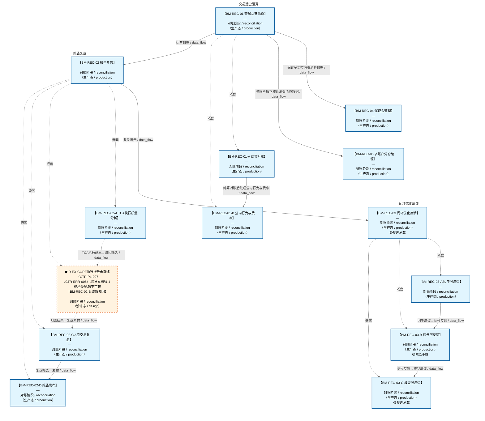

# 作战地图·对账阶段

> **[可缩放 HTML 版 / Zoomable HTML](http://localhost:8765/docs/02_enterprise_architecture/07_trading_decision_architecture/battle_map/_zoomable_html/battle_map_11_reconciliation.html)** — Ctrl+滚轮缩放 ｜ 双击重置 ｜ Ctrl+Shift+D 切换拖动/选择模式

> battle_map §reconciliation 阶段，14 环节。
> 本文档由 `generate_battle_map_diagram.py` 自动生成，禁止手编。

## 文档基本信息 / Document Overview

| 字段 | 值 | Field | Value |
|------|------|-------|-------|
| 阶段 | 对账（reconciliation） | Stage | 对账 |
| 环节数 | 14 | Steps | 14 |
| 流转边 | 15 | Edges | 15 |
| 状态分布 | 🟦 运营态（已建）=13 ｜ 🟧 设计态（待施工）=1 | State Distribution | 🟦 运营态（已建）=13 ｜ 🟧 设计态（待施工）=1 |

> **图例说明 / Legend**：
> - 🟦 **蓝色实线 = 运营态环节**（production，锚点模块已建）
> - 🟧 **橙色虚线 = 设计态环节**（design，锚点模块待施工）
> - 🟥 **红色 = 弃用态**（deprecated）
> - ⬜ **灰色 = 缺失态**（missing，环节无锚点，BM-INV-001 违例）
> - 🟨 **黄色虚线 = 候选态**（candidate，承载模块在候选池）
> - **实线箭头 ``-->`` = 运营态流转**（两端均 production）
> - **虚线箭头 ``-.->`` = 非运营态流转**（含设计/候选/混合）

## 阶段图 / Stage Diagram

> 展示 对账 阶段全部 14 个环节及流转边，颜色区分五态。

## 环节详情

### BM-REC-01 交易运营清算

**6 件套（结构化，DB indicators JSONB）**：

| 要素 | 内容 |
|---|---|
| ① 触发条件 | 成交回报就绪 + 每日15:30自动触发(A股T+1) 阈值: settles_at=15:30 |
| ② 消费数据/因子 | BM-EXE-02 成交回报 券商结算单 |
| ③ 参数 | settle_cycle=T+1（范围 T+0/T+1，代码当前: T+1，状态: production） settles_at=15:30（范围 盘后时段，代码当前: None，状态: proposed） fee_types=佣金/印花税/过户费（范围 —，代码当前: None，状态: proposed） corporate_action_types=分红/配股/拆股（范围 —，代码当前: None，状态: proposed） |
| ④ 数据流 | 输入: 成交回报 + 券商结算单 → 处理: C-017 ①保证金/②结算对账/③除权除息/④费率/⑤公司行为 → 输出: 运营数据 + E-TR-01/02/03/04/05事件 → 下游: BM-REC-02 报告复盘, C-010 PnL(费率数据) |
| ⑤ 代码映射 | D-TRADING-02/03/04 / C-017 §1.8 闭环 |
| ⑥ 降级/中止 | C-017不可用 或 融资融券API不可用 → C-017不可用→手动清算兜底；融资融券API不可用→保证金管理休眠+E-TR-05 |

**锚点（环节↔模块双向关联）**：

| 目标图 | 目标ID | 角色 | 状态快照 | 真实build_status |
|---|---|---|---|---|
| depgraph | MOD-TRADING-003 | primary | planned | generated |
| depgraph | MOD-RPT-027 | supplement | planned | generated |

**有效状态**：🟦 运营态（已建） ｜ **环节自报**：design ｜ **层**：L5 ｜ **阶段**：reconciliation

### BM-REC-02 报告复盘

**6 件套（结构化，DB indicators JSONB）**：

| 要素 | 内容 |
|---|---|
| ① 触发条件 | 运营数据就绪 阈值: 复盘报告 |
| ② 消费数据/因子 | 运营数据（来自 BM-REC-01） |
| ③ 参数 | report_freq=日/周（范围 -，代码当前: 待实现，状态: proposed） |
| ④ 数据流 | 输入: 运营数据 → 处理: C-010 报告复盘 → 输出: 复盘报告 → 下游: BM-REC-03 闭环优化 |
| ⑤ 代码映射 | C-010 / 草图§1.8 闭环反馈 |
| ⑥ 降级/中止 | C-010 不可用 → 降级基础 PnL 报表 |

**锚点（环节↔模块双向关联）**：

| 目标图 | 目标ID | 角色 | 状态快照 | 真实build_status |
|---|---|---|---|---|
| depgraph | MOD-RPT-026 | primary | planned | generated |
| depgraph | MOD-RPT-015 | supplement | planned | planned |

**有效状态**：🟦 运营态（已建） ｜ **环节自报**：design ｜ **层**：L5 ｜ **阶段**：reconciliation

### BM-REC-03 闭环优化反馈

**6 件套（结构化，DB indicators JSONB）**：

| 要素 | 内容 |
|---|---|
| ① 触发条件 | 复盘报告就绪 阈值: 反馈到 L1~L4+L3.5 每层 |
| ② 消费数据/因子 | 复盘报告（来自 BM-REC-02） |
| ③ 参数 | feedback_layers=L1~L4+L3.5（范围 -，代码当前: IC衰减1~20期(max_lag=20)+半衰期(compute_half_life)——单层因子质量反馈; L1~L4+L3.5多层架构未完整实现，状态: implemented） |
| ④ 数据流 | 输入: 复盘报告 → 处理: C-007 闭环优化（IC衰减/准确率/漂移检测→重训练） → 输出: 因子/信号/策略/风控迭代信号 → 下游: BM-SEL-02 因子计算（反向闭环） |
| ⑤ 代码映射 | C-007 / 草图§1.8 闭环反馈 |
| ⑥ 降级/中止 | C-007 不可用 → 降级人工复盘 |

**锚点（环节↔模块双向关联）**：

| 目标图 | 目标ID | 角色 | 状态快照 | 真实build_status |
|---|---|---|---|---|
| depgraph | MOD-L02-004 | primary | production | stable |
| candidate | CAND-WFO-001 | supplement | deferred | — |
| candidate | CAND-SIM-002 | supplement | deferred | — |
| candidate | CAND-BT-001 | supplement | deferred | — |

**有效状态**：🟦 运营态（已建） ｜ **环节自报**：design ｜ **层**：L5 ｜ **阶段**：reconciliation

### BM-REC-04 保证金管理

**6 件套（结构化，DB indicators JSONB）**：

| 要素 | 内容 |
|---|---|
| ① 触发条件 | 融资融券持仓+保证金比例实时监控 阈值: margin_warning_line/margin_maintain_line |
| ② 消费数据/因子 | BM-REC-01 清算数据 券商融资融券API |
| ③ 参数 | margin_warning_line=预警线（范围 —，代码当前: None，状态: proposed） margin_maintain_line=维持担保比例线（范围 —，代码当前: None，状态: proposed） |
| ④ 数据流 | 输入: 清算数据+融资融券API → 处理: D-TRADING-04 保证金监控 → 输出: E-TR-04预警/E-TR-05不可用 → 下游: C-004风控+用户通知 |
| ⑤ 代码映射 | D-TRADING-04 / C-017① 保证金管理 |
| ⑥ 降级/中止 | 融资融券API不可用 → 保证金管理休眠+E-TR-05，其他运营功能不受影响 |

**锚点（环节↔模块双向关联）**：

| 目标图 | 目标ID | 角色 | 状态快照 | 真实build_status |
|---|---|---|---|---|
| depgraph | MOD-TRADING-003 | supplement | planned | generated |

**有效状态**：🟦 运营态（已建） ｜ **环节自报**：design ｜ **层**：L5 ｜ **阶段**：reconciliation

### BM-REC-05 多账户分仓管理

**6 件套（结构化，DB indicators JSONB）**：

| 要素 | 内容 |
|---|---|
| ① 触发条件 | 交易指令需多账户分仓时 + 对账时多账户独立核算 阈值: 多账户场景 |
| ② 消费数据/因子 | BM-BUY-03 决策编排产出 各账户AUM BM-REC-01 清算数据 |
| ③ 参数 | alloc_method=按AUM（范围 按AUM/等额，代码当前: None，状态: proposed） independent_risk=独立风控（范围 —，代码当前: None，状态: proposed） independent_pnl=独立PnL（范围 —，代码当前: None，状态: proposed） independent_report=独立报告（范围 —，代码当前: None，状态: proposed） |
| ④ 数据流 | 输入: 决策编排产出+各账户AUM → 处理: D-TRADING-05 按AUM分仓 → 输出: E-TR-06分配结果 → 下游: D-REPORTING独立报告 |
| ⑤ 代码映射 | D-TRADING-05 / C-018 多账户多策略 |
| ⑥ 降级/中止 | 多账户模式不可用 → 单账户模式→不分仓直接执行 |

**锚点（环节↔模块双向关联）**：

| 目标图 | 目标ID | 角色 | 状态快照 | 真实build_status |
|---|---|---|---|---|
| depgraph | MOD-TRADING-003 | supplement | planned | generated |

**有效状态**：🟦 运营态（已建） ｜ **环节自报**：design ｜ **层**：L5 ｜ **阶段**：reconciliation

### BM-REC-01-A 结算对账

**6 件套（结构化，DB indicators JSONB）**：

| 要素 | 内容 |
|---|---|
| ① 触发条件 | — |
| ② 消费数据/因子 | — |
| ③ 参数 | — |
| ④ 数据流 | 输入: — → 处理: — → 输出: — → 下游: — |
| ⑤ 代码映射 | — / — |
| ⑥ 降级/中止 | — |

**锚点（环节↔模块双向关联）**：

| 目标图 | 目标ID | 角色 | 状态快照 | 真实build_status |
|---|---|---|---|---|
| depgraph | MOD-TRADING-003 | primary | production | generated |

**有效状态**：🟦 运营态（已建） ｜ **环节自报**：production ｜ **层**：L5 ｜ **阶段**：reconciliation

### BM-REC-01-B 公司行为与费率

**6 件套（结构化，DB indicators JSONB）**：

| 要素 | 内容 |
|---|---|
| ① 触发条件 | — |
| ② 消费数据/因子 | — |
| ③ 参数 | — |
| ④ 数据流 | 输入: — → 处理: — → 输出: — → 下游: — |
| ⑤ 代码映射 | — / — |
| ⑥ 降级/中止 | — |

**锚点（环节↔模块双向关联）**：

| 目标图 | 目标ID | 角色 | 状态快照 | 真实build_status |
|---|---|---|---|---|
| depgraph | MOD-TRADING-004 | primary | production | generated |

**有效状态**：🟦 运营态（已建） ｜ **环节自报**：production ｜ **层**：L5 ｜ **阶段**：reconciliation

### BM-REC-02-A TCA执行质量分析

**6 件套（结构化，DB indicators JSONB）**：

| 要素 | 内容 |
|---|---|
| ① 触发条件 | — |
| ② 消费数据/因子 | — |
| ③ 参数 | — |
| ④ 数据流 | 输入: — → 处理: — → 输出: — → 下游: — |
| ⑤ 代码映射 | — / — |
| ⑥ 降级/中止 | — |

**锚点（环节↔模块双向关联）**：

| 目标图 | 目标ID | 角色 | 状态快照 | 真实build_status |
|---|---|---|---|---|
| depgraph | MOD-L07-001 | supplement | production | generated |

**有效状态**：🟦 运营态（已建） ｜ **环节自报**：production ｜ **层**：L5 ｜ **阶段**：reconciliation

### BM-REC-02-B 绩效归因

**6 件套（结构化，DB indicators JSONB）**：

| 要素 | 内容 |
|---|---|
| ① 触发条件 | — |
| ② 消费数据/因子 | — |
| ③ 参数 | — |
| ④ 数据流 | 输入: — → 处理: — → 输出: — → 下游: — |
| ⑤ 代码映射 | — / — |
| ⑥ 降级/中止 | — |

**锚点（环节↔模块双向关联）**：

| 目标图 | 目标ID | 角色 | 状态快照 | 真实build_status |
|---|---|---|---|---|
| depgraph | MOD-RPT-015 | primary | planned | planned |
| depgraph | MOD-L07-001 | supplement | production | generated |

**有效状态**：🟧 设计态（待施工） ｜ **环节自报**：design ｜ **层**：L5 ｜ **阶段**：reconciliation

### BM-REC-02-C A股交易复盘

**6 件套（结构化，DB indicators JSONB）**：

| 要素 | 内容 |
|---|---|
| ① 触发条件 | — |
| ② 消费数据/因子 | — |
| ③ 参数 | — |
| ④ 数据流 | 输入: — → 处理: — → 输出: — → 下游: — |
| ⑤ 代码映射 | — / — |
| ⑥ 降级/中止 | — |

**锚点（环节↔模块双向关联）**：

| 目标图 | 目标ID | 角色 | 状态快照 | 真实build_status |
|---|---|---|---|---|
| depgraph | MOD-RPT-026 | primary | production | generated |
| depgraph | MOD-RPT-027 | supplement | production | generated |

**有效状态**：🟦 运营态（已建） ｜ **环节自报**：production ｜ **层**：L5 ｜ **阶段**：reconciliation

### BM-REC-02-D 报告发布

**6 件套（结构化，DB indicators JSONB）**：

| 要素 | 内容 |
|---|---|
| ① 触发条件 | — |
| ② 消费数据/因子 | — |
| ③ 参数 | — |
| ④ 数据流 | 输入: — → 处理: — → 输出: — → 下游: — |
| ⑤ 代码映射 | — / — |
| ⑥ 降级/中止 | — |

**锚点（环节↔模块双向关联）**：

| 目标图 | 目标ID | 角色 | 状态快照 | 真实build_status |
|---|---|---|---|---|
| depgraph | MOD-RPT-003 | primary | production | generated |

**有效状态**：🟦 运营态（已建） ｜ **环节自报**：production ｜ **层**：L5 ｜ **阶段**：reconciliation

### BM-REC-03-A 因子层反馈

**6 件套（结构化，DB indicators JSONB）**：

| 要素 | 内容 |
|---|---|
| ① 触发条件 | — |
| ② 消费数据/因子 | — |
| ③ 参数 | — |
| ④ 数据流 | 输入: — → 处理: — → 输出: — → 下游: — |
| ⑤ 代码映射 | — / — |
| ⑥ 降级/中止 | — |

**锚点（环节↔模块双向关联）**：

| 目标图 | 目标ID | 角色 | 状态快照 | 真实build_status |
|---|---|---|---|---|
| depgraph | MOD-L02-004 | primary | production | stable |

**有效状态**：🟦 运营态（已建） ｜ **环节自报**：production ｜ **层**：L5 ｜ **阶段**：reconciliation

### BM-REC-03-B 信号层反馈

**6 件套（结构化，DB indicators JSONB）**：

| 要素 | 内容 |
|---|---|
| ① 触发条件 | — |
| ② 消费数据/因子 | — |
| ③ 参数 | — |
| ④ 数据流 | 输入: — → 处理: — → 输出: — → 下游: — |
| ⑤ 代码映射 | — / — |
| ⑥ 降级/中止 | — |

**锚点**：⚠ 无（BM-INV-001 君子协定违例——环节无锚点=悬空决策）

**有效状态**：🟦 运营态（已建） ｜ **环节自报**：design ｜ **层**：L5 ｜ **阶段**：reconciliation

### BM-REC-03-C 模型层反馈

**6 件套（结构化，DB indicators JSONB）**：

| 要素 | 内容 |
|---|---|
| ① 触发条件 | — |
| ② 消费数据/因子 | — |
| ③ 参数 | — |
| ④ 数据流 | 输入: — → 处理: — → 输出: — → 下游: — |
| ⑤ 代码映射 | — / — |
| ⑥ 降级/中止 | — |

**锚点**：⚠ 无（BM-INV-001 君子协定违例——环节无锚点=悬空决策）

**有效状态**：🟦 运营态（已建） ｜ **环节自报**：design ｜ **层**：L5 ｜ **阶段**：reconciliation

[← 返回总指挥图](battle_map_panorama.md)