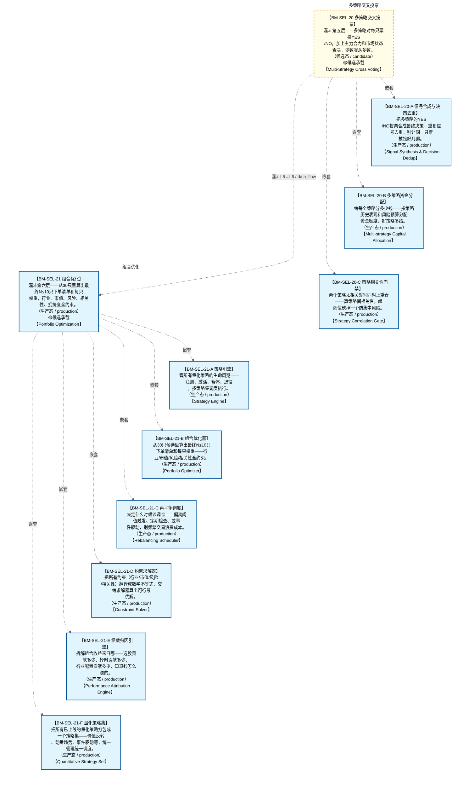
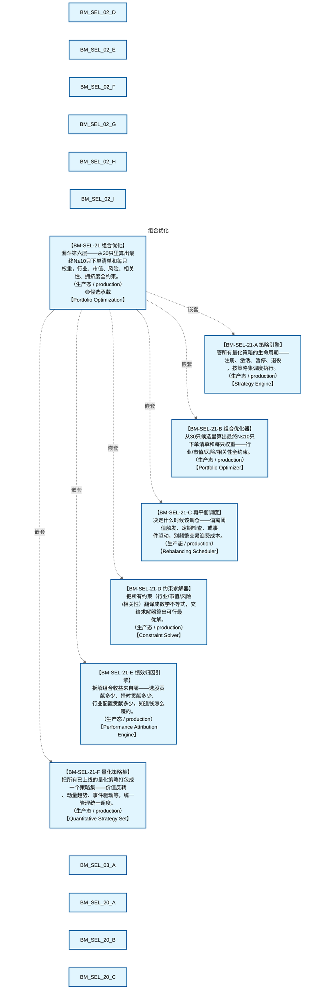

# 交易决策作战地图（总指挥图）

> **[可缩放 HTML 版 / Zoomable HTML](http://localhost:8765/docs/02_enterprise_architecture/07_trading_decision_architecture/battle_map/_zoomable_html/battle_map_panorama.html)** — Ctrl+滚轮缩放 ｜ 双击重置 ｜ Ctrl+Shift+D 切换拖动/选择模式

> 第四全景图 battle_map 真源：`battle_map_steps` / `battle_map_anchors` / `battle_map_edges` 三表 + 翻译真源 `module_translation_registry.yaml` §battle_map_steps 段。
> 本文档由 `generate_battle_map_diagram.py` 自动生成，禁止手编（改环节→改 DB/YAML 真源→重跑生成器）。

## 文档基本信息 / Document Overview

| 字段 | 值 | Field | Value |
|------|------|-------|-------|
| 环节总数 | 185 | Steps | 185 |
| 流转边 | 117 | Edges | 117 |
| 无锚点环节（BM-INV-001） | 5 | No-Anchor Steps | 5 |
| 运营态环节 | 134 | Production Steps | 134 |
| 设计态环节 | 13 | Design Steps | 13 |
| 状态分布 | 🟦 运营态（已建）=134 ｜ 🟨 候选态（候选池）=30 ｜ 🟧 设计态（待施工）=13 ｜ ⬜ 缺失态（无锚点）=5 ｜ 🟥 弃用态=3 | State Distribution | 🟦 运营态（已建）=134 ｜ 🟨 候选态（候选池）=30 ｜ 🟧 设计态（待施工）=13 ｜ ⬜ 缺失态（无锚点）=5 ｜ 🟥 弃用态=3 |

> **图例说明 / Legend**：
> - 🟦 **蓝色实线 = 运营态环节**（production，锚点模块已建）
> - 🟧 **橙色虚线 = 设计态环节**（design，锚点模块待施工）
> - 🟥 **红色 = 弃用态**（deprecated）
> - ⬜ **灰色 = 缺失态**（missing，环节无锚点，BM-INV-001 违例）
> - 🟨 **黄色虚线 = 候选态**（candidate，承载模块在候选池）
> - **实线箭头 ``-->`` = 运营态流转**（两端均 production）
> - **虚线箭头 ``-.->`` = 非运营态流转**（含设计/候选/混合）

## 域内依赖图 / Internal Dependency Diagram

> 依赖图内嵌在本文档中，IDE 可直接渲染；网页版可 Ctrl+滚轮缩放 + 拖动平移查看细节。

### 全景图（全部环节，颜色区分五态）

> 展示全部 185 个环节（运营态 134 + 设计态 13 + 弃用/缺失/候选 38），含跨阶段流转边。

```mermaid
%%{init: {'theme': 'base', 'themeVariables': {'primaryColor': '#eaeaea', 'primaryTextColor': '#333333', 'primaryBorderColor': '#666666', 'lineColor': '#666666', 'secondaryColor': '#eaeaea', 'tertiaryColor': '#eaeaea', 'clusterBkg': 'transparent', 'clusterBorder': 'transparent', 'fontSize': '14px'}}}%%
%% 作战地图总指挥图·全景图（第 1/4 页）
flowchart TD
    BM_BT_01["【BM-BT-01 回测引擎与撮合】<br/>把策略放到历史数据上跑一遍看表现——向量化回测快但<br/>粗，事件驱动慢但细，两种模式都支持。<br/>（生产态 / production）<br/>【Backtest Engine &amp; Matching】"]
    BM_BUY_01["【BM-BUY-01 多情景对策生成】<br/>根据明天的8种走法，从策略库里挑出对应的买入对策<br/>预案。<br/>（生产态 / production）<br/>🟡候选承载<br/>【Multi-Scenario Countermeasure】"]
    BM_EXE_01["【BM-EXE-01 自适应风控审批】<br/>下单前的最后一道闸——风控审批，审不过的订单直接拦<br/>下，是订单拦截器不是事后检查。<br/>（生产态 / production）<br/>🟡候选承载<br/>【Adaptive Risk Approval】"]
    BM_MT_01["⛔ ML训练域，设计已就绪，等待开发排期<br/>【BM-MT-01 训练流水线】<br/>把研究出的因子和特征喂给模型训练，PyTorch<br/>训完导出 ONNX，全程管 seed 和 config<br/>保证可复现。<br/>（设计态 / design）<br/>🟡候选承载<br/>【Training Pipeline】"]
    BM_POS_01["【BM-POS-01 仓位管理裁决】<br/>所有买卖决策都到这里统一算最终仓位——这是仓位决策<br/>的唯一裁决中心，谁都别想绕过。<br/>（生产态 / production）<br/>🟡候选承载<br/>【Position Adjudication】"]
    subgraph sg_BM_REC_01 ["交易运营清算"]
        BM_REC_01["【BM-REC-01 交易运营清算】<br/>把成交回报拿去结算对账、算费率、处理除权除息和公<br/>司行为、监控保证金，变成运营数据。<br/>（生产态 / production）<br/>【Trade Ops &amp; Settlement】"]
        BM_REC_01_A["【BM-REC-01-A 结算对账】<br/>每日盘后把系统记录和券商结算单逐笔核对，发现差异<br/>立刻告警，是T+1对账的核心。<br/>（生产态 / production）<br/>【Settlement &amp; Reconciliation】"]
        BM_REC_01_B["【BM-REC-01-B 公司行为与费率】<br/>处理除权除息自动调持仓成本、算佣金印花税过户费、<br/>监控分红配股拆股，是运营数据准确性的保障。<br/>（生产态 / production）<br/>【Corporate Action &amp; Fee】"]
        BM_REC_01_C["【BM-REC-01-C PnL计算】<br/>基于结算对账和费率数据算出每笔交易和持仓的盈亏——<br/>已实现PnL和未实现PnL，是后续归因分析和风险报告的<br/>基础。<br/>（生产态 / production）<br/>【PnL Calculation】"]
        BM_REC_01 -.->|嵌套| BM_REC_01_A
        BM_REC_01 -.->|嵌套| BM_REC_01_B
        BM_REC_01 -.->|嵌套| BM_REC_01_C
    end
    BM_RES_01["【BM-RES-01 研究数据与特征存储】<br/>研究员的数据底盘——把数据集版本化管起来、追踪血缘<br/>、打质量分；特征分在线离线两套存，保证 PIT<br/>正确不偷看未来。<br/>（候选态 / candidate）<br/>🟡候选承载<br/>【Research Data &amp; Feature Store】"]
    BM_RC_01["【BM-RC-01 风控策略与限额管理】<br/>风控的'宪法'——策略<br/>CRUD+版本管理+9种限额类型+消耗追踪+预警分级+审批<br/>流。<br/>（生产态 / production）<br/>【Risk Policy &amp; Limit Management】"]
    BM_SELL_01["【BM-SELL-01 突破成败信号】<br/>判断股价冲压力位是冲上去了还是冲不动——冲上去留着<br/>，冲不动止损，连冲3次不行强制清仓。<br/>（生产态 / production）<br/>【Breakout Success/Failure Signal】"]
    BM_SIM_01["【BM-SIM-01 市场仿真器】<br/>造一个假市场跑策略——订单簿仿真+价格生成+微观结构<br/>模拟，看策略在'如果怎样'下会怎样。<br/>（候选态 / candidate）<br/>🟡候选承载<br/>【Market Simulator】"]
    subgraph sg_BM_SEL_01 ["数据接入与预处理"]
        BM_SEL_01["【BM-SEL-01 数据接入与预处理】<br/>把外面来的行情、新闻、另类数据收进来洗干净，按热<br/>度分层存好，供后面所有环节使用。<br/>（生产态 / production）<br/>🟡候选承载<br/>【Data Ingestion &amp; Preprocessing】"]
        BM_SEL_01_A["【BM-SEL-01-A 供应商注册与适配器】<br/>把所有数据源（miniQMT/iFind<br/>/tushare）登记成统一供应商清单，每个源配一个适配<br/>器把方言翻译成标准格式。<br/>（生产态 / production）<br/>【Provider Registry &amp; Adapter】"]
        BM_SEL_01_B["【BM-SEL-01-B 行情连接器管理】<br/>管所有行情连接的生命周期——建连、保活、断线重连、<br/>优雅关闭，别让连接漏血。<br/>（生产态 / production）<br/>【Market Data Connector Manager】"]
        BM_SEL_01_C["【BM-SEL-01-C 故障切换与Failover】<br/>主数据源挂了自动切到备用源，切换过程对下游透明，<br/>不让行情断流。<br/>（生产态 / production）<br/>【Failover &amp; Fault Tolerance】"]
        BM_SEL_01_D["【BM-SEL-01-D 自动加载与热切换】<br/>新数据源上线不用重启服务——热插拔注册即生效，老源<br/>下线平滑迁移。<br/>（生产态 / production）<br/>【Auto-loading &amp; Hot-swap】"]
        BM_SEL_01_E["【BM-SEL-01-E 原始数据缓存】<br/>收进来的原始行情先存一份缓存，后面要回放或补数时<br/>不用重新拉。<br/>（生产态 / production）<br/>【Raw Data Cache】"]
        BM_SEL_01_F["【BM-SEL-01-F 标准化行情产出】<br/>把各源方言翻译成统一标准格式（OHLCV/快照<br/>/Tick），下游不用关心数据从哪来。<br/>（生产态 / production）<br/>【Standardized Market Data Output】"]
        BM_SEL_01 -.->|嵌套| BM_SEL_01_A
        BM_SEL_01 -.->|嵌套| BM_SEL_01_B
        BM_SEL_01 -.->|嵌套| BM_SEL_01_C
        BM_SEL_01 -.->|嵌套| BM_SEL_01_D
        BM_SEL_01 -.->|嵌套| BM_SEL_01_E
        BM_SEL_01 -.->|嵌套| BM_SEL_01_F
    end
    BM_POS_06["【BM-POS-06 现金管理约束】<br/>仓位的'现金刹车'——留够保命钱（最低储备金）+机会钱<br/>（X%），T+1结算约束下算可用资金，节假日多留5-15%现<br/>金，闲置钱做逆回购生息，反馈给仓位裁决作为现金硬<br/>约束。<br/>（生产态 / production）<br/>【Cash Management Constraint】"]
    BM_POS_08["【BM-POS-08 日历仓位约束】<br/>A股'风险日历'自动收紧仓位——期权交割日只许减仓不<br/>许开新，4月下旬ST股强制清零，财报发布前3天降仓位<br/>+禁新建，微盘股空窗期收紧50%，交割日前后临时下调<br/>5-10%。<br/>（生产态 / production）<br/>【Calendar Position Constraint】"]
    BM_BT_02["【BM-BT-02 持仓组合与数据接入】<br/>回测里的'钱包和数据库'——管持仓现金净值曲线，把<br/>miniQMT Tick 和 ClickHouse 日线都接进来。<br/>（生产态 / production）<br/>【Portfolio &amp; Data Handler】"]
    subgraph sg_BM_BUY_02 ["四轨融合"]
        BM_BUY_02["【BM-BUY-02 四轨融合】<br/>把逻辑驱动、数据驱动、人工指令、应急保命四路信号<br/>按优先级融成一条决策流——应急永远最优先。<br/>（生产态 / production）<br/>🟡候选承载<br/>【Four-Track Fusion （MTF）】"]
        subgraph sg_BM_BUY_02_A ["逻辑驱动轨"]
            BM_BUY_02_A["【BM-BUY-02-A 逻辑驱动轨】<br/>四轨融合的第一轨——基于8态预测和策略库算出的自动<br/>买入预案，是默认决策来源。<br/>（生产态 / production）<br/>🟡候选承载<br/>【Logic-Driven Track】"]
            subgraph sg_BM_BUY_02_A_1 ["市场状态预测"]
                BM_BUY_02_A_1["【BM-BUY-02-A-1 市场状态预测】<br/>预测大盘接下来走哪种状态——用3×3矩阵分9态+2叠加态<br/>+8态走势预测+体制转换检测，给买入决策提供市场环<br/>境判断。<br/>（缺失态 / missing）<br/>⚠无锚点<br/>【Market State Prediction】"]
                BM_BUY_02_A_1_a["【BM-BUY-02-A-1-a 3×3矩阵分类】<br/>把大盘分成9种状态——大盘趋势（上涨/震荡<br/>/下跌）×波动率（高/中<br/>/低）=3×3矩阵，每种状态对应不同的买入策略。<br/>（缺失态 / missing）<br/>⚠无锚点<br/>【3x3 Matrix Classification】"]
                BM_BUY_02_A_1_b["【BM-BUY-02-A-1-b 2叠加态检测】<br/>检测2种极端市场状态——极端牛和极端熊，这俩不走3×3<br/>矩阵，单独标出来触发特殊买入/不买策略。<br/>（缺失态 / missing）<br/>⚠无锚点<br/>【2 Superposition States Detection】"]
                BM_BUY_02_A_1_c["【BM-BUY-02-A-1-c T+1次日8态走势预测】<br/>预测明天大盘走8种走势的哪一种——基于3×3矩阵和叠加<br/>态推算T+1次日的8种走势概率分布，指导次日买入。<br/>（缺失态 / missing）<br/>⚠无锚点<br/>【T+1 Next-Day 8-State Prediction】"]
                BM_BUY_02_A_1_d["【BM-BUY-02-A-1-d 体制转换检测】<br/>检测大盘是不是在变盘——用HMM隐马尔可夫和变点检测<br/>识别市场体制转换（牛转熊<br/>/熊转牛），变盘时调整买入策略。<br/>（缺失态 / missing）<br/>⚠无锚点<br/>【Regime Shift Detection】"]
                BM_BUY_02_A_1 -.->|嵌套| BM_BUY_02_A_1_a
                BM_BUY_02_A_1 -.->|嵌套| BM_BUY_02_A_1_b
                BM_BUY_02_A_1 -.->|嵌套| BM_BUY_02_A_1_c
                BM_BUY_02_A_1 -.->|嵌套| BM_BUY_02_A_1_d
            end
            BM_BUY_02_A -.->|嵌套| BM_BUY_02_A_1
        end
        BM_BUY_02_B["【BM-BUY-02-B 数据驱动轨】<br/>四轨融合的第二轨——AI Discovery<br/>实时从数据中发现机会，补充逻辑轨覆盖不到的信号。<br/>（生产态 / production）<br/>🟡候选承载<br/>【Data-Driven Track （AI Discovery）】"]
        BM_BUY_02_C["【BM-BUY-02-C 人工指令轨】<br/>四轨融合的第三轨——人工下达的买入指令，优先级高于<br/>自动轨（逻辑/数据），低于应急轨。<br/>（生产态 / production）<br/>🟡候选承载<br/>【Manual Override Track】"]
        BM_BUY_02_D["【BM-BUY-02-D 应急保命轨】<br/>四轨融合的第四轨——应急保命信号，优先级最高，一旦<br/>触发立即覆盖所有其他轨的决策。<br/>（生产态 / production）<br/>🟡候选承载<br/>【Emergency Protection Track】"]
        BM_BUY_02 -.->|嵌套| BM_BUY_02_A
        BM_BUY_02 -.->|嵌套| BM_BUY_02_B
        BM_BUY_02 -.->|嵌套| BM_BUY_02_C
        BM_BUY_02 -.->|嵌套| BM_BUY_02_D
    end
    BM_EXE_04["⛔ 门禁:D-RISK风控参数就绪+市场状态实时数据源<br/>（D-EX-CORE-24）<br/>【BM-EXE-04 Pre-Trade合规检查】<br/>下单前的交易所合规硬闸——涨跌停/参与率/撤单率<br/>/报单停留时间锁/Wash Trade/Spoofing<br/>全检查，Fail-Closed，不过就拦。<br/>（设计态 / design）<br/>【Pre-Trade Compliance Gate】"]
    BM_MT_02["【BM-MT-02 实验追踪与自动晋升】<br/>A/B 实验对比新模型和老模型，统计上显著更好才自动<br/>晋升为 Champion，否则留在 Challenger 继续观察。<br/>（候选态 / candidate）<br/>🟡候选承载<br/>【Experiment Tracking &amp; Auto-Promotion】"]
    BM_POS_02["【BM-POS-02 标级仓位Kelly】<br/>每只票该买多少——用Kelly公式算理论仓位，半Kelly硬<br/>上限截断（禁止全Kelly），在风险配额内决策，再用密<br/>度PDF的偏度/峰度/前瞻VaR做分布感知调整<br/>（防御性只减不增）。<br/>（生产态 / production）<br/>【Per-Symbol Kelly Sizing】"]
    subgraph sg_BM_REC_02 ["报告复盘"]
        BM_REC_02["【BM-REC-02 报告复盘】<br/>把运营数据做成复盘报告，看今天打得怎么样。<br/>（生产态 / production）<br/>【Reporting &amp; Review】"]
        BM_REC_02_E["【BM-REC-02-E 风险报告】<br/>生成日度/周度/事件/月度四类风险报告——VaR/CVaR<br/>/因子暴露/否决统计<br/>/漂移状态，看今天风险敞口怎么样。<br/>（生产态 / production）<br/>【Risk Report】"]
        BM_REC_02_F["【BM-REC-02-F 监管报告】<br/>生成程序化交易报告、异常交易自报、持仓报告、绩效<br/>报告——满足证监会和交易所监管报送要求。<br/>（生产态 / production）<br/>【Regulatory Report】"]
        BM_REC_02_A["【BM-REC-02-A TCA执行质量分析】<br/>算每笔交易的真实成本——滑点、冲击成本、市场影响，<br/>看执行得好不好。<br/>（生产态 / production）<br/>【TCA Execution Quality Analysis】"]
        BM_REC_02_B["⛔ D-EX-CORE执行报告未就绪（CTR-P1-007<br/>/CTR-ERR-005）,设计文档§1.4标注受限,暂不可建<br/>【BM-REC-02-B 绩效归因】<br/>把盈亏拆开看——赚的钱是选股选对的、还是配比配对的<br/>、还是行业轮动轮对的，找出Alpha来源。<br/>（设计态 / design）<br/>【Performance Attribution】"]
        BM_REC_02_C["【BM-REC-02-C A股交易复盘】<br/>针对A股特色做盘前信号验证、盘中异常检测、盘后归<br/>因、大额交易异动检测，生成复盘报告。<br/>（生产态 / production）<br/>【A-Share Trading Review】"]
        BM_REC_02_D["【BM-REC-02-D 报告发布】<br/>把复盘报告归档、发到微信和邮件，留好审计凭证。<br/>（生产态 / production）<br/>【Report Publishing】"]
        BM_REC_02 -.->|嵌套| BM_REC_02_E
        BM_REC_02 -.->|嵌套| BM_REC_02_F
        BM_REC_02 -.->|嵌套| BM_REC_02_A
        BM_REC_02 -.->|嵌套| BM_REC_02_B
        BM_REC_02 -.->|嵌套| BM_REC_02_C
        BM_REC_02 -.->|嵌套| BM_REC_02_D
    end
    BM_RES_02["【BM-RES-02 实验追踪与可复现性】<br/>每次实验都把超参、数据版本、代码版本、结果全部记<br/>下来，事后能一键复现，不让'我跑出来过但复现不了'<br/>发生。<br/>（候选态 / candidate）<br/>🟡候选承载<br/>【Experiment Tracking &amp; Reproducibility】"]
    BM_RC_02["【BM-RC-02 盘前风控检查】<br/>下单前过五关——仓位限额→行业集中度→杠杆率→合规规<br/>则→Kill Switch 状态，任一不过就拒单。<br/>（生产态 / production）<br/>【Pre-Trade Risk Check】"]
    BM_SELL_03["【BM-SELL-03 卖出信号收集评分】<br/>卖出端的'信号层'——先把持仓分级（Watch/Monitor<br/>/Hold），再收集7类卖出信号，多时间框架共振加权，<br/>产出卖出信号评分和紧迫度。<br/>（生产态 / production）<br/>【Sell Signal Collection &amp; Scoring】"]
    BM_SIM_02["【BM-SIM-02 策略仿真器】<br/>把策略放进沙箱里跑——模拟信号、模拟组合，看策略在<br/>各种假设市场下的表现。<br/>（生产态 / production）<br/>🟡候选承载<br/>【Strategy Simulator】"]
    subgraph sg_BM_SEL_02 ["因子计算与信号生成"]
        BM_SEL_02["【BM-SEL-02 因子计算与信号生成】<br/>把洗干净的行情算成各种因子，再用因子工厂管起来，<br/>盘前算全量、盘中补增量。<br/>（弃用态 / deprecated）<br/>🟡候选承载<br/>【Factor Compute &amp; Signal Gen】"]
        BM_SEL_02_A["【BM-SEL-02-A 因子计算引擎】<br/>真正算因子的发动机——盘前批量算全量、盘中增量补，<br/>把行情变成可用的因子值。<br/>（弃用态 / deprecated）<br/>【Factor Compute Engine】"]
        BM_SEL_02_B["【BM-SEL-02-B 因子注册表与池管理】<br/>所有因子登记造册——名字、公式、依赖、版本都在注册<br/>表里，池子满64个自动淘汰最差的。<br/>（生产态 / production）<br/>【Factor Registry &amp; Pool Management】"]
        BM_SEL_02_C["【BM-SEL-02-C 因子管线双模调度】<br/>安排因子什么时候算——盘前一次性全算、盘中只补变化<br/>的部分，省算力又不丢新鲜度。<br/>（弃用态 / deprecated）<br/>【Factor Pipeline Dual-mode Scheduling】"]
        BM_SEL_02_D["【BM-SEL-02-D 因子评估-IC/IR体系】<br/>给每个因子打分——IC（信息系数）看预测能力，IR<br/>（信息比率）看稳定性，分高留分低砍。<br/>（生产态 / production）<br/>【Factor Evaluation - IC/IR System】"]
        BM_SEL_02_E["【BM-SEL-02-E 因子评估-相关性与语义去重】<br/>两个因子长得太像就留一个——算相关性砍冗余，再看语<br/>义描述防重复造轮子。<br/>（生产态 / production）<br/>【Factor Evaluation - Correlation &amp; Semantic<br/>Dedup】"]
        BM_SEL_02_F["【BM-SEL-02-F 因子评估-分层回测与三级判断】<br/>把股票按因子值分5层看各层收益差——分层单调才说明<br/>因子有效，三级判断定去留。<br/>（生产态 / production）<br/>【Factor Evaluation - Stratified Backtest &amp;<br/>3-tier Judgment】"]
        BM_SEL_02_G["【BM-SEL-02-G 因子衰减监控与归因】<br/>盯着因子别失效——IC<br/>持续下滑就报警，找出是市场变了还是因子本身坏了。<br/>（生产态 / production）<br/>【Factor Decay Monitoring &amp; Attribution】"]
        BM_SEL_02_H["【BM-SEL-02-H 多因子合成与优化】<br/>把好因子揉成一个综合得分——不是简单加权，是用优化<br/>方法找最优组合权重。<br/>（生产态 / production）<br/>【Multi-factor Synthesis &amp; Optimization】"]
        BM_SEL_02_I["【BM-SEL-02-I 因子治理-生命周期与门禁】<br/>管因子一辈子——从注册、评估、上线、观察到下线，每<br/>个阶段有门禁卡着，不让坏因子混进去。<br/>（生产态 / production）<br/>【Factor Governance - Lifecycle &amp; Gates】"]
        BM_SEL_02 -.->|嵌套| BM_SEL_02_A
        BM_SEL_02 -.->|嵌套| BM_SEL_02_B
        BM_SEL_02 -.->|嵌套| BM_SEL_02_C
        BM_SEL_02 -.->|嵌套| BM_SEL_02_D
        BM_SEL_02 -.->|嵌套| BM_SEL_02_E
        BM_SEL_02 -.->|嵌套| BM_SEL_02_F
        BM_SEL_02 -.->|嵌套| BM_SEL_02_G
        BM_SEL_02 -.->|嵌套| BM_SEL_02_H
        BM_SEL_02 -.->|嵌套| BM_SEL_02_I
    end
    BM_BUY_01 ~~~ BM_MT_01 ~~~ BM_REC_01 ~~~ BM_REC_01_A ~~~ BM_RES_01 ~~~ BM_RC_01 ~~~ BM_SIM_01 ~~~ BM_SEL_01 ~~~ BM_SEL_01_A ~~~ BM_SEL_01_B ~~~ BM_SEL_01_C ~~~ BM_SEL_01_D ~~~ BM_SEL_01_E ~~~ BM_SEL_01_F ~~~ BM_POS_08 ~~~ BM_BUY_02_A ~~~ BM_BUY_02_A_1 ~~~ BM_BUY_02_A_1_a ~~~ BM_BUY_02_A_1_b ~~~ BM_BUY_02_A_1_c ~~~ BM_BUY_02_A_1_d ~~~ BM_BUY_02_B ~~~ BM_BUY_02_C ~~~ BM_BUY_02_D ~~~ BM_REC_02_A ~~~ BM_SEL_02_A ~~~ BM_SEL_02_B ~~~ BM_SEL_02_C ~~~ BM_SEL_02_D ~~~ BM_SEL_02_E ~~~ BM_SEL_02_F ~~~ BM_SEL_02_G ~~~ BM_SEL_02_H ~~~ BM_SEL_02_I
    BM_POS_01 ~~~ BM_REC_01_B ~~~ BM_BUY_02 ~~~ BM_MT_02 ~~~ BM_REC_02 ~~~ BM_REC_02_B ~~~ BM_RES_02 ~~~ BM_RC_02 ~~~ BM_SIM_02 ~~~ BM_SEL_02
    BM_BT_01 ~~~ BM_EXE_01 ~~~ BM_REC_01_C ~~~ BM_SELL_01 ~~~ BM_POS_06 ~~~ BM_REC_02_C
    BM_BT_02 ~~~ BM_EXE_04 ~~~ BM_POS_02 ~~~ BM_REC_02_E ~~~ BM_REC_02_D ~~~ BM_SELL_03
    BM_SEL_01 -.->|标准化行情 / data_flow| BM_SEL_02
    BM_SEL_02 -.->|压力位因子 / data_flow| BM_SELL_01
    BM_BUY_01 -->|买入预案 / data_flow| BM_BUY_02
    BM_POS_01 -->|仓位指令 / data_flow| BM_EXE_01
    BM_REC_01 -->|运营数据 / data_flow| BM_REC_02
    BM_SELL_01 -->|突破成败信号→收集评分 / data_flow| BM_SELL_03
    BM_POS_01 -->|风险配额→标级Kelly / data_flow| BM_POS_02
    BM_POS_01 -->|风险配额→现金约束 / data_flow| BM_POS_06
    BM_POS_06 -->|现金约束→标级Kelly / data_flow| BM_POS_02
    BM_POS_08 -->|日历约束→仓位裁决上限 / trigger| BM_POS_01
    BM_REC_01_A -->|结算对账后处理公司行为与费率 / data_flow| BM_REC_01_B
    BM_REC_02_A -.->|TCA执行成本→归因输入 / data_flow| BM_REC_02_B
    BM_REC_02_B -.->|归因结果→复盘素材 / data_flow| BM_REC_02_C
    BM_REC_02_C -->|复盘报告→发布 / data_flow| BM_REC_02_D
    BM_EXE_01 -.->|审批后订单→合规检查 / data_flow| BM_EXE_04
    BM_RES_01 -.->|研究数据→实验追踪 / data_flow| BM_RES_02
    BM_MT_01 -.->|训练→实验晋升 / data_flow| BM_MT_02
    BM_BT_01 -->|引擎→持仓数据 / data_flow| BM_BT_02
    BM_SIM_01 -.->|市场仿真→策略仿真 / data_flow| BM_SIM_02
    BM_RC_01 -->|策略→盘前检查 / data_flow| BM_RC_02
    BM_MT_02 -.->|模型晋升→回测 / data_flow| BM_BT_01
    BM_RC_02 -->|风控通过→执行 / trigger| BM_EXE_01
    BM_REC_01_B -->|费率后算PnL / data_flow| BM_REC_01_C
    BM_REC_02_C -->|复盘→风险报告 / data_flow| BM_REC_02_E
    BM_REC_02_E -->|风险报告→监管报告 / data_flow| BM_REC_02_F
classDef production fill:#e1f5fe,stroke:#01579b,stroke-width:2px,color:#000
classDef design fill:#fff3e0,stroke:#e65100,stroke-width:2px,color:#000,stroke-dasharray: 5 5
classDef deprecated fill:#ffebee,stroke:#c62828,stroke-width:2px,color:#000
classDef missing fill:#eeeeee,stroke:#9e9e9e,stroke-width:2px,color:#000
classDef candidate fill:#fffde7,stroke:#f9a825,stroke-width:2px,color:#000,stroke-dasharray: 5 5
    class BM_BT_01,BM_BUY_01,BM_EXE_01,BM_POS_01,BM_REC_01,BM_REC_01_A,BM_REC_01_B,BM_REC_01_C,BM_RC_01,BM_SELL_01,BM_SEL_01,BM_SEL_01_A,BM_SEL_01_B,BM_SEL_01_C,BM_SEL_01_D,BM_SEL_01_E,BM_SEL_01_F,BM_POS_06,BM_POS_08,BM_BT_02,BM_BUY_02,BM_BUY_02_A,BM_BUY_02_B,BM_BUY_02_C,BM_BUY_02_D,BM_POS_02,BM_REC_02,BM_REC_02_E,BM_REC_02_F,BM_REC_02_A,BM_REC_02_C,BM_REC_02_D,BM_RC_02,BM_SELL_03,BM_SIM_02,BM_SEL_02_B,BM_SEL_02_D,BM_SEL_02_E,BM_SEL_02_F,BM_SEL_02_G,BM_SEL_02_H,BM_SEL_02_I production
    class BM_MT_01,BM_EXE_04,BM_REC_02_B design
    class BM_SEL_02,BM_SEL_02_A,BM_SEL_02_C deprecated
    class BM_BUY_02_A_1,BM_BUY_02_A_1_a,BM_BUY_02_A_1_b,BM_BUY_02_A_1_c,BM_BUY_02_A_1_d missing
    class BM_RES_01,BM_SIM_01,BM_MT_02,BM_RES_02 candidate
```

```mermaid
%%{init: {'theme': 'base', 'themeVariables': {'primaryColor': '#eaeaea', 'primaryTextColor': '#333333', 'primaryBorderColor': '#666666', 'lineColor': '#666666', 'secondaryColor': '#eaeaea', 'tertiaryColor': '#eaeaea', 'clusterBkg': 'transparent', 'clusterBorder': 'transparent', 'fontSize': '14px'}}}%%
%% 作战地图总指挥图·全景图（第 2/4 页）
flowchart TD
    subgraph sg_BM_SEL_22 ["短线选股评分卡"]
        BM_SEL_22["【BM-SEL-22 短线选股评分卡】<br/>给短线标的打分——7个维度100分制评分（连板高度<br/>/封单强度/板块效应/分歧程度/市值流动性/封板时间<br/>/催化强度），再识别强庄股，专门服务短线和打板选<br/>股。<br/>（生产态 / production）<br/>【Short-Term Stock Selection Scorecard】"]
        BM_SEL_22_A["【BM-SEL-22-A 机构选股评分器】<br/>从机构视角给股票打分——目标价空间40%+基本面30%+技<br/>术趋势20%+流动性10%，机构看好的票加分。<br/>（生产态 / production）<br/>【Institutional Stock Scorer】"]
        BM_SEL_22_B["【BM-SEL-22-B 强庄股识别器】<br/>识别有没有强庄——看走势独立性、换手率异常、盘口神<br/>秘大单，三个特征同时出现大概率有庄。<br/>（生产态 / production）<br/>【Strong Dealer Detector】"]
        subgraph sg_BM_SEL_22_C ["连板潜力评分卡"]
            BM_SEL_22_C["【BM-SEL-22-C 连板潜力评分卡】<br/>给打板标的打分——7个维度100分制（连板高度<br/>/封单强度/板块效应/分歧程度/市值流动性/封板时间<br/>/催化强度），分高大概率连板。<br/>（生产态 / production）<br/>【Limit-up Potential Scorecard】"]
            BM_SEL_22_C_1["【BM-SEL-22-C-1 连板高度维度】<br/>看标的现在第几个连板——连板越高越强，首板5分、2板<br/>12分、3板20分、4板以上满分25分。<br/>（生产态 / production）<br/>【Limit-up Height Dimension】"]
            BM_SEL_22_C_2["【BM-SEL-22-C-2 封单强度维度】<br/>看封单有多大、撤不撤——封单占流通市值越大越稳，超<br/>过3%满分20分，频繁撤单要扣分。<br/>（生产态 / production）<br/>【Seal Order Strength Dimension】"]
            BM_SEL_22_C_3["【BM-SEL-22-C-3 板块效应维度】<br/>看标的所属板块涨停多少——板块涨停家越多、涨幅越靠<br/>前，板块效应越强，满分15分。<br/>（生产态 / production）<br/>【Sector Effect Dimension】"]
            BM_SEL_22_C_4["【BM-SEL-22-C-4 分歧程度维度】<br/>看封板时大家有没有分歧——缩量一致涨停满分15分，放<br/>量+多次炸板说明分歧大只给3分。<br/>（生产态 / production）<br/>【Divergence Degree Dimension】"]
            BM_SEL_22_C_5["【BM-SEL-22-C-5 市值流动性维度】<br/>看市值大小和成交活不活——中小盘<br/>（30-150亿）流动性好满分10分，大盘折价，微盘有风险<br/>扣分。<br/>（生产态 / production）<br/>【Market Cap Liquidity Dimension】"]
            BM_SEL_22_C_6["【BM-SEL-22-C-6 封板时间维度】<br/>看几点封的板——早盘10点前封板满分10分，午盘6分，<br/>尾盘才封只有3分。<br/>（生产态 / production）<br/>【Seal Time Dimension】"]
            BM_SEL_22_C_7["【BM-SEL-22-C-7 催化强度维度】<br/>看有没有题材或消息刺激——强题材龙头+政策催化满分5<br/>分，没明确催化只给1分。<br/>（生产态 / production）<br/>【Catalyst Strength Dimension】"]
            BM_SEL_22_C -.->|嵌套| BM_SEL_22_C_1
            BM_SEL_22_C -.->|嵌套| BM_SEL_22_C_2
            BM_SEL_22_C -.->|嵌套| BM_SEL_22_C_3
            BM_SEL_22_C -.->|嵌套| BM_SEL_22_C_4
            BM_SEL_22_C -.->|嵌套| BM_SEL_22_C_5
            BM_SEL_22_C -.->|嵌套| BM_SEL_22_C_6
            BM_SEL_22_C -.->|嵌套| BM_SEL_22_C_7
        end
        BM_SEL_22_D["【BM-SEL-22-D 连板分歧程度评估器】<br/>判断连板能不能继续——分歧越大越危险，一致性越高越<br/>可能继续涨。<br/>（生产态 / production）<br/>【Limit-up Divergence Assessor】"]
        BM_SEL_22 -.->|嵌套| BM_SEL_22_A
        BM_SEL_22 -.->|嵌套| BM_SEL_22_B
        BM_SEL_22 -.->|嵌套| BM_SEL_22_C
        BM_SEL_22 -.->|嵌套| BM_SEL_22_D
    end
    subgraph sg_BM_SEL_23 ["游资接力情绪周期"]
        BM_SEL_23["【BM-SEL-23 游资接力情绪周期】<br/>测游资接力情绪——6个因子打0-100分（连板高度<br/>/封单质量/涨停时间/开板次数/竞价强度<br/>/助攻梯队），再定位情绪周期4+1阶段（冰点/反核<br/>/主升/疯狂/退潮），不同阶段用不同策略。<br/>（生产态 / production）<br/>【Youzi Relay Emotion Cycle】"]
        subgraph sg_BM_SEL_23_A ["6因子游资接力评分"]
            BM_SEL_23_A["【BM-SEL-23-A 6因子游资接力评分】<br/>用6个因子给游资接力打0-100分——连板高度25分+封单<br/>质量20分+涨停时间15分+开板次数15分+竞价强度10分+<br/>助攻梯队15分。<br/>（生产态 / production）<br/>【6-factor Hot Money Relay Score】"]
            BM_SEL_23_A_1["【BM-SEL-23-A-1 连板高度因子】<br/>看接力候选现在第几板——板数越高接力价值越大，3板<br/>以上满分25分，叠加晋级率修正。<br/>（生产态 / production）<br/>【Limit-up Height Factor】"]
            BM_SEL_23_A_2["【BM-SEL-23-A-2 封单质量因子】<br/>看封单大不大、稳不稳——大封单且不撤单满分20分，小<br/>封单或频繁撤单低分。<br/>（生产态 / production）<br/>【Seal Order Quality Factor】"]
            BM_SEL_23_A_3["【BM-SEL-23-A-3 涨停时间因子】<br/>看几点涨停——开盘秒板满分15分，早盘12分，午盘8分<br/>，尾盘才涨只有4分。<br/>（生产态 / production）<br/>【Limit-up Time Factor】"]
            BM_SEL_23_A_4["【BM-SEL-23-A-4 开板次数因子】<br/>看封板期间开了几次板——0次开板满分15分，1次快速回<br/>封10分，多次开板只给3分。<br/>（生产态 / production）<br/>【Reopen Count Factor】"]
            BM_SEL_23_A_5["【BM-SEL-23-A-5 竞价强度因子】<br/>看集合竞价表现——高开+放量竞价满分10分，平开低量<br/>只给2分。<br/>（生产态 / production）<br/>【Auction Strength Factor】"]
            BM_SEL_23_A_6["【BM-SEL-23-A-6 助攻梯队因子】<br/>看同题材同梯队有没有一起涨停——梯队多涨停+领涨位<br/>次满分15分，孤板无梯队只给3分。<br/>（生产态 / production）<br/>【Support Echelon Factor】"]
            BM_SEL_23_A -.->|嵌套| BM_SEL_23_A_1
            BM_SEL_23_A -.->|嵌套| BM_SEL_23_A_2
            BM_SEL_23_A -.->|嵌套| BM_SEL_23_A_3
            BM_SEL_23_A -.->|嵌套| BM_SEL_23_A_4
            BM_SEL_23_A -.->|嵌套| BM_SEL_23_A_5
            BM_SEL_23_A -.->|嵌套| BM_SEL_23_A_6
        end
        BM_SEL_23_B["【BM-SEL-23-B 情绪周期4+1阶段定位】<br/>判断当前情绪在哪个阶段——冰点/反核/主升/疯狂<br/>/退潮，不同阶段策略完全不同。<br/>（生产态 / production）<br/>【Sentiment Cycle 4+1 Phase Locator】"]
        BM_SEL_23_C["【BM-SEL-23-C 情绪周期策略映射】<br/>不同情绪阶段用不同策略——冰点保守低吸、主升追龙头<br/>、退潮止损，把阶段映射到具体操作。<br/>（生产态 / production）<br/>【Sentiment Cycle Strategy Mapping】"]
        BM_SEL_23 -.->|嵌套| BM_SEL_23_A
        BM_SEL_23 -.->|嵌套| BM_SEL_23_B
        BM_SEL_23 -.->|嵌套| BM_SEL_23_C
    end
    subgraph sg_BM_SEL_24 ["量化短线强度评级"]
        BM_SEL_24["【BM-SEL-24 量化短线强度评级】<br/>量化角度评短线强度——6个维度打0-100分（价格动量<br/>/行业强度/相对强度/资金/技术<br/>/风险），评出A到E五级，作为双引擎融合的量化引擎<br/>输入。<br/>（生产态 / production）<br/>【Quant Short-Term Strength Rating】"]
        subgraph sg_BM_SEL_24_A ["6维度量化强度评分"]
            BM_SEL_24_A["【BM-SEL-24-A 6维度量化强度评分】<br/>用6个维度给短线强度打0-100分——价格动量/行业强度<br/>/相对强度/资金/技术/风险，全面量化评估。<br/>（生产态 / production）<br/>【6-dimension Quant Strength Score】"]
            BM_SEL_24_A_1["【BM-SEL-24-A-1 价格动量Z-score维度】<br/>把标的近期涨幅跟全市场比——算Z-score看它涨得比平<br/>均强多少，越强分越高。<br/>（生产态 / production）<br/>【Price Momentum Z-score Dimension】"]
            BM_SEL_24_A_2["【BM-SEL-24-A-2 行业强度维度】<br/>看标的所属行业强不强——行业涨幅排名前10%满分，弱<br/>势行业扣分。<br/>（生产态 / production）<br/>【Industry Strength Dimension】"]
            BM_SEL_24_A_3["【BM-SEL-24-A-3 相对强度维度】<br/>看标的比大盘强多少——跑赢大盘越多分越高，跑输大盘<br/>扣分。<br/>（生产态 / production）<br/>【Relative Strength Dimension】"]
            BM_SEL_24_A_4["【BM-SEL-24-A-4 资金维度】<br/>看资金是流入还是流出——主力净流入+大单买入占比高<br/>满分，净流出扣分。<br/>（生产态 / production）<br/>【Capital Flow Dimension】"]
            BM_SEL_24_A_5["【BM-SEL-24-A-5 技术维度】<br/>看技术指标好不好——MACD金叉+均线多头排列+强势K线<br/>满分，死叉空头排列低分。<br/>（生产态 / production）<br/>【Technical Dimension】"]
            BM_SEL_24_A_6["【BM-SEL-24-A-6 风险维度】<br/>看风险大不大——低波动+小回撤+适中Beta满分<br/>（风险可控），高波动大回撤低分。<br/>（生产态 / production）<br/>【Risk Dimension】"]
            BM_SEL_24_A -.->|嵌套| BM_SEL_24_A_1
            BM_SEL_24_A -.->|嵌套| BM_SEL_24_A_2
            BM_SEL_24_A -.->|嵌套| BM_SEL_24_A_3
            BM_SEL_24_A -.->|嵌套| BM_SEL_24_A_4
            BM_SEL_24_A -.->|嵌套| BM_SEL_24_A_5
            BM_SEL_24_A -.->|嵌套| BM_SEL_24_A_6
        end
        BM_SEL_24_B["【BM-SEL-24-B A~E五级评级】<br/>把0-100分转成A到E五个等级——A级最强直接追，E级最<br/>弱直接弃，简单直观。<br/>（生产态 / production）<br/>【A~E Five-tier Rating】"]
        BM_SEL_24_C["【BM-SEL-24-C 双引擎基准权重配置】<br/>设定游资和量化的基准权重——默认游资60%+量化40%，<br/>这是融合的起点，后面情绪周期还会动态调。<br/>（生产态 / production）<br/>【Dual-engine Baseline Weight Config】"]
        BM_SEL_24 -.->|嵌套| BM_SEL_24_A
        BM_SEL_24 -.->|嵌套| BM_SEL_24_B
        BM_SEL_24 -.->|嵌套| BM_SEL_24_C
    end
    BM_SELL_07["⛔ 卖出决策域，设计已就绪，等待开发排期<br/>【BM-SELL-07 卖出情景预案】<br/>盘前预计算卖出预案——暴跌分级退出/板块联动<br/>/黑天鹅应急/涨跌停排队/异常开盘<br/>/Gap开盘决策，盘中触发时直接执行预案而非实时计算<br/>，对标Citadel PM式预案卖出。<br/>（设计态 / design）<br/>【Exit Scenario Planner】"]
    subgraph sg_BM_SEL_25 ["双引擎融合决策"]
        BM_SEL_25["【BM-SEL-25 双引擎融合决策】<br/>把游资情绪引擎和量化强度引擎的信号融合起来——基准<br/>是游资60%+量化40%，但情绪周期会自动调权重<br/>（冰点时量化占70%，主升时游资占70%），输出6类决<br/>策（主升龙头/二进三/跟风/复苏/伪强/地天反包）。<br/>（生产态 / production）<br/>【Dual-Engine Fusion Decision】"]
        BM_SEL_25_A["【BM-SEL-25-A 双引擎信号融合】<br/>把游资引擎和量化引擎的信号按权重揉在一起——不是简<br/>单平均，是加权融合产出综合决策信号。<br/>（生产态 / production）<br/>【Dual-engine Signal Fusion】"]
        BM_SEL_25_B["【BM-SEL-25-B 情绪周期自适应权重】<br/>根据情绪周期自动调权重——冰点时量化占70%<br/>（保守），主升时游资占70%<br/>（激进），退潮时量化占60%（防守）。<br/>（生产态 / production）<br/>【Sentiment Cycle Adaptive Weight】"]
        subgraph sg_BM_SEL_25_C ["6类决策输出"]
            BM_SEL_25_C["【BM-SEL-25-C 6类决策输出】<br/>把融合信号分成6类决策——主升龙头/二进三/跟风<br/>/复苏/伪强/地天反包，每类对应不同操作。<br/>（生产态 / production）<br/>【6-type Decision Output】"]
            BM_SEL_25_C_1["【BM-SEL-25-C-1 主升龙头决策类】<br/>三引擎共振的最强标的——连板高度高+游资接力强+量化<br/>强度高，标记最高优先级P0。<br/>（生产态 / production）<br/>【Main-uptrend Leader Decision】"]
            BM_SEL_25_C_2["【BM-SEL-25-C-2 二进三决策类】<br/>2板标的准备进3板——接力情绪中上+量化强度中上，标<br/>记次高优先级P1。<br/>（生产态 / production）<br/>【2-to-3 Board Decision】"]
            BM_SEL_25_C_3["【BM-SEL-25-C-3 跟风决策类】<br/>板块龙头封板后的跟风标的——板块联动跟风，标记中优<br/>先级P2。<br/>（生产态 / production）<br/>【Following Decision】"]
            BM_SEL_25_C_4["【BM-SEL-25-C-4 复苏决策类】<br/>超跌后放量反弹+技术反转——标记中低优先级P3，搏反<br/>转机会。<br/>（生产态 / production）<br/>【Recovery Decision】"]
            BM_SEL_25_C_5["【BM-SEL-25-C-5 伪强决策类】<br/>表面涨停但资金流出+分歧大——伪强识别，标记风险预<br/>警剔除候选池。<br/>（生产态 / production）<br/>【Fake-strength Decision】"]
            BM_SEL_25_C_6["【BM-SEL-25-C-6 地天反包决策类】<br/>日内深跌后大幅反包收涨——地天板特殊机会，标记特殊<br/>优先级P2-特殊通道。<br/>（生产态 / production）<br/>【Ground-to-sky Reversal Decision】"]
            BM_SEL_25_C -.->|嵌套| BM_SEL_25_C_1
            BM_SEL_25_C -.->|嵌套| BM_SEL_25_C_2
            BM_SEL_25_C -.->|嵌套| BM_SEL_25_C_3
            BM_SEL_25_C -.->|嵌套| BM_SEL_25_C_4
            BM_SEL_25_C -.->|嵌套| BM_SEL_25_C_5
            BM_SEL_25_C -.->|嵌套| BM_SEL_25_C_6
        end
        BM_SEL_25_D["【BM-SEL-25-D PDF分布信号提取】<br/>从决策信号中提取概率分布——方向、置信度、尾部风险<br/>、相对价值，不只给结论还给不确定性。<br/>（生产态 / production）<br/>【PDF Distribution Signal Extraction】"]
        BM_SEL_25 -.->|嵌套| BM_SEL_25_A
        BM_SEL_25 -.->|嵌套| BM_SEL_25_B
        BM_SEL_25 -.->|嵌套| BM_SEL_25_C
        BM_SEL_25 -.->|嵌套| BM_SEL_25_D
    end
    BM_BT_03["【BM-BT-03 绩效指标与Tick回放】<br/>算 Sharpe/Sortino/最大回撤/IC/IR<br/>/胜率这些硬指标；还能把历史 Tick<br/>逐笔回放做秒级策略验证。<br/>（生产态 / production）<br/>【Metrics &amp; Tick Replay】"]
    BM_BUY_03["【BM-BUY-03 决策编排】<br/>把融合后的决策按5条路径（买/卖/做T/人工<br/>/应急）统一出口编排，处理冲突、去重、排时序。<br/>（生产态 / production）<br/>【Decision Orchestration （DO）】"]
    BM_EXE_05["⛔ 门禁:TCA<br/>（D-EX-CORE-12）就绪+订单簿深度数据可获取<br/>（D-EX-CORE-14）<br/>【BM-EXE-05 智能订单路由与拆单】<br/>大单拆小单+选最优算法+控参与率——Almgren-Chriss<br/>算最优执行轨迹，TWAP/VWAP/POV/IS<br/>拆单，参与率&lt;15%分钟成交量，挑开盘<br/>/尾盘窗口，流动性不足就暂停。<br/>（设计态 / design）<br/>【Smart Order Routing &amp; Splitting】"]
    BM_MT_03["【BM-MT-03 AutoML与超参优化】<br/>不靠人手调参——贝叶斯优化自动找最佳超参，早停省时<br/>间，还能自动挖因子。<br/>（候选态 / candidate）<br/>🟡候选承载<br/>【AutoML &amp; Hyperparameter Optimization】"]
    BM_POS_03["【BM-POS-03 持仓状态机漂移】<br/>每只票有自己的状态<br/>（NONE→BUILDING→ACTIVE→OBSERVING→REDUCING→EXITING<br/>→CLOSED），权重漂移超±2%（组合）/±3%<br/>（单标的）就触发再平衡评估，观察期内禁止新买入。<br/>（生产态 / production）<br/>【Position State Machine &amp; Drift】"]
    subgraph sg_BM_REC_03 ["闭环优化反馈"]
        BM_REC_03["【BM-REC-03 闭环优化反馈】<br/>复盘完把教训反馈回每一层——因子衰减就换、信号不准<br/>就退、模型漂移就重训，形成正向闭环。<br/>（生产态 / production）<br/>🟡候选承载<br/>【Closed-Loop Optimization Feedback】"]
        BM_REC_03_A["【BM-REC-03-A 因子层反馈】<br/>看因子还灵不灵——IC衰减了就换因子，算半衰期，保证<br/>因子池新鲜。<br/>（生产态 / production）<br/>【Factor-Layer Feedback】"]
        BM_REC_03_B["【BM-REC-03-B 信号层反馈】<br/>看信号准不准——准确率持续下降就退役信号，避免用失<br/>效信号下单。<br/>（生产态 / production）<br/>🟡候选承载<br/>【Signal-Layer Feedback】"]
        BM_REC_03_C["【BM-REC-03-C 模型层反馈】<br/>看模型飘没飘——检测到漂移就重训练，防止模型用旧数<br/>据预测新市场。<br/>（生产态 / production）<br/>🟡候选承载<br/>【Model-Layer Feedback】"]
        BM_REC_03 -.->|嵌套| BM_REC_03_A
        BM_REC_03 -.->|嵌套| BM_REC_03_B
        BM_REC_03 -.->|嵌套| BM_REC_03_C
    end
    BM_RES_03["【BM-RES-03 假设管理与研究发现沉淀】<br/>研究不是瞎试——每个想法写成假设挂证据，验证后接受<br/>/拒绝都留痕；好的发现沉淀成知识库，不让经验流失<br/>。<br/>（候选态 / candidate）<br/>🟡候选承载<br/>【Hypothesis Management &amp; Finding Distillation】"]
    BM_RC_03["【BM-RC-03 Kill Switch熔断】<br/>系统的'急停按钮'——回撤超 Emergency<br/>/VaR超限且无法减仓<br/>/Owner手动，任一触发即熔断，冷却 30 分钟。<br/>（候选态 / candidate）<br/>🟡候选承载<br/>【Kill Switch Circuit Breaker】"]
    BM_SELL_04["⛔ 卖出决策域，设计已就绪，等待开发排期<br/>【BM-SELL-04 止盈止损族】<br/>卖出端的'策略工厂'——根据策略类型用不同的止盈止损<br/>范式（趋势宽止损/均值回归中止损/套利无止损<br/>/高频紧止损/Carry宽止损），叠加猎杀防护和期权定价<br/>评估。<br/>（设计态 / design）<br/>【Take-Profit &amp; Stop-Loss Strategy Family】"]
    BM_SIM_03["【BM-SIM-03 场景生成与蒙特卡洛】<br/>蒙特卡洛跑百万条路径找策略边界——还能自定义极端场<br/>景，看策略在最坏情况下能不能活。<br/>（生产态 / production）<br/>🟡候选承载<br/>【Scenario Generation &amp; Monte Carlo】"]
    subgraph sg_BM_SEL_03 ["市场状态感知"]
        BM_SEL_03["【BM-SEL-03 市场状态感知】<br/>判断现在市场是什么脾气——趋势/波动<br/>/量能三维打分，再叠加体制转换检测。<br/>（设计态 / design）<br/>🟡候选承载<br/>【Market State Sensing】"]
        BM_SEL_03_A["【BM-SEL-03-A 市场情绪分析】<br/>量化市场的恐惧贪婪程度——用涨跌家数、换手率、连板<br/>高度等指标合成情绪温度计。<br/>（生产态 / production）<br/>【Market Sentiment Analysis】"]
        BM_SEL_03_B["【BM-SEL-03-B 市场状态传感器】<br/>综合趋势/波动/量能<br/>/情绪给出市场当前状态的最终判定——是什么市、什么<br/>阶段。<br/>（设计态 / design）<br/>【Market State Sensor】"]
        BM_SEL_03 -.->|嵌套| BM_SEL_03_A
        BM_SEL_03 -.->|嵌套| BM_SEL_03_B
    end
    BM_SEL_22 ~~~ BM_SEL_22_A ~~~ BM_SEL_22_B ~~~ BM_SEL_22_C ~~~ BM_SEL_22_C_1 ~~~ BM_SEL_22_C_2 ~~~ BM_SEL_22_C_3 ~~~ BM_SEL_22_C_4 ~~~ BM_SEL_22_C_5 ~~~ BM_SEL_22_C_6 ~~~ BM_SEL_22_C_7 ~~~ BM_SEL_22_D ~~~ BM_SEL_23 ~~~ BM_SEL_23_A ~~~ BM_SEL_23_A_1 ~~~ BM_SEL_23_A_2 ~~~ BM_SEL_23_A_3 ~~~ BM_SEL_23_A_4 ~~~ BM_SEL_23_A_5 ~~~ BM_SEL_23_A_6 ~~~ BM_SEL_23_B ~~~ BM_SEL_23_C ~~~ BM_SEL_24 ~~~ BM_SEL_24_A ~~~ BM_SEL_24_A_1 ~~~ BM_SEL_24_A_2 ~~~ BM_SEL_24_A_3 ~~~ BM_SEL_24_A_4 ~~~ BM_SEL_24_A_5 ~~~ BM_SEL_24_A_6 ~~~ BM_SEL_24_B ~~~ BM_SEL_24_C ~~~ BM_SELL_07 ~~~ BM_SEL_25_A ~~~ BM_SEL_25_B ~~~ BM_SEL_25_C ~~~ BM_SEL_25_C_1 ~~~ BM_SEL_25_C_2 ~~~ BM_SEL_25_C_3 ~~~ BM_SEL_25_C_4 ~~~ BM_SEL_25_C_5 ~~~ BM_SEL_25_C_6 ~~~ BM_SEL_25_D ~~~ BM_BT_03 ~~~ BM_BUY_03 ~~~ BM_EXE_05 ~~~ BM_MT_03 ~~~ BM_POS_03 ~~~ BM_REC_03 ~~~ BM_REC_03_A ~~~ BM_RES_03 ~~~ BM_RC_03 ~~~ BM_SELL_04 ~~~ BM_SIM_03 ~~~ BM_SEL_03 ~~~ BM_SEL_03_A ~~~ BM_SEL_03_B
    BM_SEL_25 ~~~ BM_REC_03_B
    BM_SEL_22 -->|短线选股评分→双引擎融合 / data_flow| BM_SEL_25
    BM_SEL_23 -->|游资情绪→双引擎融合 / data_flow| BM_SEL_25
    BM_SEL_24 -->|量化强度→双引擎融合 / data_flow| BM_SEL_25
    BM_REC_03_A -->|因子反馈→信号反馈 / data_flow| BM_REC_03_B
    BM_REC_03_B -->|信号反馈→模型反馈 / data_flow| BM_REC_03_C
classDef production fill:#e1f5fe,stroke:#01579b,stroke-width:2px,color:#000
classDef design fill:#fff3e0,stroke:#e65100,stroke-width:2px,color:#000,stroke-dasharray: 5 5
classDef deprecated fill:#ffebee,stroke:#c62828,stroke-width:2px,color:#000
classDef missing fill:#eeeeee,stroke:#9e9e9e,stroke-width:2px,color:#000
classDef candidate fill:#fffde7,stroke:#f9a825,stroke-width:2px,color:#000,stroke-dasharray: 5 5
    class BM_SEL_22,BM_SEL_22_A,BM_SEL_22_B,BM_SEL_22_C,BM_SEL_22_C_1,BM_SEL_22_C_2,BM_SEL_22_C_3,BM_SEL_22_C_4,BM_SEL_22_C_5,BM_SEL_22_C_6,BM_SEL_22_C_7,BM_SEL_22_D,BM_SEL_23,BM_SEL_23_A,BM_SEL_23_A_1,BM_SEL_23_A_2,BM_SEL_23_A_3,BM_SEL_23_A_4,BM_SEL_23_A_5,BM_SEL_23_A_6,BM_SEL_23_B,BM_SEL_23_C,BM_SEL_24,BM_SEL_24_A,BM_SEL_24_A_1,BM_SEL_24_A_2,BM_SEL_24_A_3,BM_SEL_24_A_4,BM_SEL_24_A_5,BM_SEL_24_A_6,BM_SEL_24_B,BM_SEL_24_C,BM_SEL_25,BM_SEL_25_A,BM_SEL_25_B,BM_SEL_25_C,BM_SEL_25_C_1,BM_SEL_25_C_2,BM_SEL_25_C_3,BM_SEL_25_C_4,BM_SEL_25_C_5,BM_SEL_25_C_6,BM_SEL_25_D,BM_BT_03,BM_BUY_03,BM_POS_03,BM_REC_03,BM_REC_03_A,BM_REC_03_B,BM_REC_03_C,BM_SIM_03,BM_SEL_03_A production
    class BM_SELL_07,BM_EXE_05,BM_SELL_04,BM_SEL_03,BM_SEL_03_B design
    class BM_MT_03,BM_RES_03,BM_RC_03 candidate
```

### 运营态的图（仅 production 环节和流转）

> 仅展示已上线运行的环节（共 134 个），不含跨阶段外部节点。

```mermaid
%%{init: {'theme': 'base', 'themeVariables': {'primaryColor': '#eaeaea', 'primaryTextColor': '#333333', 'primaryBorderColor': '#666666', 'lineColor': '#666666', 'secondaryColor': '#eaeaea', 'tertiaryColor': '#eaeaea', 'clusterBkg': 'transparent', 'clusterBorder': 'transparent', 'fontSize': '14px'}}}%%
%% 作战地图·运营态（第 1/3 页）
flowchart TD
    BM_BT_01["【BM-BT-01 回测引擎与撮合】<br/>把策略放到历史数据上跑一遍看表现——向量化回测快但<br/>粗，事件驱动慢但细，两种模式都支持。<br/>（生产态 / production）<br/>【Backtest Engine &amp; Matching】"]
    BM_BUY_01["【BM-BUY-01 多情景对策生成】<br/>根据明天的8种走法，从策略库里挑出对应的买入对策<br/>预案。<br/>（生产态 / production）<br/>🟡候选承载<br/>【Multi-Scenario Countermeasure】"]
    BM_EXE_01["【BM-EXE-01 自适应风控审批】<br/>下单前的最后一道闸——风控审批，审不过的订单直接拦<br/>下，是订单拦截器不是事后检查。<br/>（生产态 / production）<br/>🟡候选承载<br/>【Adaptive Risk Approval】"]
    BM_POS_01["【BM-POS-01 仓位管理裁决】<br/>所有买卖决策都到这里统一算最终仓位——这是仓位决策<br/>的唯一裁决中心，谁都别想绕过。<br/>（生产态 / production）<br/>🟡候选承载<br/>【Position Adjudication】"]
    subgraph sg_BM_REC_01 ["交易运营清算"]
        BM_REC_01["【BM-REC-01 交易运营清算】<br/>把成交回报拿去结算对账、算费率、处理除权除息和公<br/>司行为、监控保证金，变成运营数据。<br/>（生产态 / production）<br/>【Trade Ops &amp; Settlement】"]
        BM_REC_01_A["【BM-REC-01-A 结算对账】<br/>每日盘后把系统记录和券商结算单逐笔核对，发现差异<br/>立刻告警，是T+1对账的核心。<br/>（生产态 / production）<br/>【Settlement &amp; Reconciliation】"]
        BM_REC_01_B["【BM-REC-01-B 公司行为与费率】<br/>处理除权除息自动调持仓成本、算佣金印花税过户费、<br/>监控分红配股拆股，是运营数据准确性的保障。<br/>（生产态 / production）<br/>【Corporate Action &amp; Fee】"]
        BM_REC_01_C["【BM-REC-01-C PnL计算】<br/>基于结算对账和费率数据算出每笔交易和持仓的盈亏——<br/>已实现PnL和未实现PnL，是后续归因分析和风险报告的<br/>基础。<br/>（生产态 / production）<br/>【PnL Calculation】"]
        BM_REC_01 -.->|嵌套| BM_REC_01_A
        BM_REC_01 -.->|嵌套| BM_REC_01_B
        BM_REC_01 -.->|嵌套| BM_REC_01_C
    end
    BM_RC_01["【BM-RC-01 风控策略与限额管理】<br/>风控的'宪法'——策略<br/>CRUD+版本管理+9种限额类型+消耗追踪+预警分级+审批<br/>流。<br/>（生产态 / production）<br/>【Risk Policy &amp; Limit Management】"]
    BM_SELL_01["【BM-SELL-01 突破成败信号】<br/>判断股价冲压力位是冲上去了还是冲不动——冲上去留着<br/>，冲不动止损，连冲3次不行强制清仓。<br/>（生产态 / production）<br/>【Breakout Success/Failure Signal】"]
    subgraph sg_BM_SEL_01 ["数据接入与预处理"]
        BM_SEL_01["【BM-SEL-01 数据接入与预处理】<br/>把外面来的行情、新闻、另类数据收进来洗干净，按热<br/>度分层存好，供后面所有环节使用。<br/>（生产态 / production）<br/>🟡候选承载<br/>【Data Ingestion &amp; Preprocessing】"]
        BM_SEL_01_A["【BM-SEL-01-A 供应商注册与适配器】<br/>把所有数据源（miniQMT/iFind<br/>/tushare）登记成统一供应商清单，每个源配一个适配<br/>器把方言翻译成标准格式。<br/>（生产态 / production）<br/>【Provider Registry &amp; Adapter】"]
        BM_SEL_01_B["【BM-SEL-01-B 行情连接器管理】<br/>管所有行情连接的生命周期——建连、保活、断线重连、<br/>优雅关闭，别让连接漏血。<br/>（生产态 / production）<br/>【Market Data Connector Manager】"]
        BM_SEL_01_C["【BM-SEL-01-C 故障切换与Failover】<br/>主数据源挂了自动切到备用源，切换过程对下游透明，<br/>不让行情断流。<br/>（生产态 / production）<br/>【Failover &amp; Fault Tolerance】"]
        BM_SEL_01_D["【BM-SEL-01-D 自动加载与热切换】<br/>新数据源上线不用重启服务——热插拔注册即生效，老源<br/>下线平滑迁移。<br/>（生产态 / production）<br/>【Auto-loading &amp; Hot-swap】"]
        BM_SEL_01_E["【BM-SEL-01-E 原始数据缓存】<br/>收进来的原始行情先存一份缓存，后面要回放或补数时<br/>不用重新拉。<br/>（生产态 / production）<br/>【Raw Data Cache】"]
        BM_SEL_01_F["【BM-SEL-01-F 标准化行情产出】<br/>把各源方言翻译成统一标准格式（OHLCV/快照<br/>/Tick），下游不用关心数据从哪来。<br/>（生产态 / production）<br/>【Standardized Market Data Output】"]
        BM_SEL_01 -.->|嵌套| BM_SEL_01_A
        BM_SEL_01 -.->|嵌套| BM_SEL_01_B
        BM_SEL_01 -.->|嵌套| BM_SEL_01_C
        BM_SEL_01 -.->|嵌套| BM_SEL_01_D
        BM_SEL_01 -.->|嵌套| BM_SEL_01_E
        BM_SEL_01 -.->|嵌套| BM_SEL_01_F
    end
    BM_POS_06["【BM-POS-06 现金管理约束】<br/>仓位的'现金刹车'——留够保命钱（最低储备金）+机会钱<br/>（X%），T+1结算约束下算可用资金，节假日多留5-15%现<br/>金，闲置钱做逆回购生息，反馈给仓位裁决作为现金硬<br/>约束。<br/>（生产态 / production）<br/>【Cash Management Constraint】"]
    BM_POS_08["【BM-POS-08 日历仓位约束】<br/>A股'风险日历'自动收紧仓位——期权交割日只许减仓不<br/>许开新，4月下旬ST股强制清零，财报发布前3天降仓位<br/>+禁新建，微盘股空窗期收紧50%，交割日前后临时下调<br/>5-10%。<br/>（生产态 / production）<br/>【Calendar Position Constraint】"]
    BM_BT_02["【BM-BT-02 持仓组合与数据接入】<br/>回测里的'钱包和数据库'——管持仓现金净值曲线，把<br/>miniQMT Tick 和 ClickHouse 日线都接进来。<br/>（生产态 / production）<br/>【Portfolio &amp; Data Handler】"]
    subgraph sg_BM_BUY_02 ["四轨融合"]
        BM_BUY_02["【BM-BUY-02 四轨融合】<br/>把逻辑驱动、数据驱动、人工指令、应急保命四路信号<br/>按优先级融成一条决策流——应急永远最优先。<br/>（生产态 / production）<br/>🟡候选承载<br/>【Four-Track Fusion （MTF）】"]
        BM_BUY_02_A["【BM-BUY-02-A 逻辑驱动轨】<br/>四轨融合的第一轨——基于8态预测和策略库算出的自动<br/>买入预案，是默认决策来源。<br/>（生产态 / production）<br/>🟡候选承载<br/>【Logic-Driven Track】"]
        BM_BUY_02_B["【BM-BUY-02-B 数据驱动轨】<br/>四轨融合的第二轨——AI Discovery<br/>实时从数据中发现机会，补充逻辑轨覆盖不到的信号。<br/>（生产态 / production）<br/>🟡候选承载<br/>【Data-Driven Track （AI Discovery）】"]
        BM_BUY_02_C["【BM-BUY-02-C 人工指令轨】<br/>四轨融合的第三轨——人工下达的买入指令，优先级高于<br/>自动轨（逻辑/数据），低于应急轨。<br/>（生产态 / production）<br/>🟡候选承载<br/>【Manual Override Track】"]
        BM_BUY_02_D["【BM-BUY-02-D 应急保命轨】<br/>四轨融合的第四轨——应急保命信号，优先级最高，一旦<br/>触发立即覆盖所有其他轨的决策。<br/>（生产态 / production）<br/>🟡候选承载<br/>【Emergency Protection Track】"]
        BM_BUY_02 -.->|嵌套| BM_BUY_02_A
        BM_BUY_02 -.->|嵌套| BM_BUY_02_B
        BM_BUY_02 -.->|嵌套| BM_BUY_02_C
        BM_BUY_02 -.->|嵌套| BM_BUY_02_D
    end
    BM_POS_02["【BM-POS-02 标级仓位Kelly】<br/>每只票该买多少——用Kelly公式算理论仓位，半Kelly硬<br/>上限截断（禁止全Kelly），在风险配额内决策，再用密<br/>度PDF的偏度/峰度/前瞻VaR做分布感知调整<br/>（防御性只减不增）。<br/>（生产态 / production）<br/>【Per-Symbol Kelly Sizing】"]
    subgraph sg_BM_REC_02 ["报告复盘"]
        BM_REC_02["【BM-REC-02 报告复盘】<br/>把运营数据做成复盘报告，看今天打得怎么样。<br/>（生产态 / production）<br/>【Reporting &amp; Review】"]
        BM_REC_02_E["【BM-REC-02-E 风险报告】<br/>生成日度/周度/事件/月度四类风险报告——VaR/CVaR<br/>/因子暴露/否决统计<br/>/漂移状态，看今天风险敞口怎么样。<br/>（生产态 / production）<br/>【Risk Report】"]
        BM_REC_02_F["【BM-REC-02-F 监管报告】<br/>生成程序化交易报告、异常交易自报、持仓报告、绩效<br/>报告——满足证监会和交易所监管报送要求。<br/>（生产态 / production）<br/>【Regulatory Report】"]
        BM_REC_02_A["【BM-REC-02-A TCA执行质量分析】<br/>算每笔交易的真实成本——滑点、冲击成本、市场影响，<br/>看执行得好不好。<br/>（生产态 / production）<br/>【TCA Execution Quality Analysis】"]
        BM_REC_02_C["【BM-REC-02-C A股交易复盘】<br/>针对A股特色做盘前信号验证、盘中异常检测、盘后归<br/>因、大额交易异动检测，生成复盘报告。<br/>（生产态 / production）<br/>【A-Share Trading Review】"]
        BM_REC_02_D["【BM-REC-02-D 报告发布】<br/>把复盘报告归档、发到微信和邮件，留好审计凭证。<br/>（生产态 / production）<br/>【Report Publishing】"]
        BM_REC_02 -.->|嵌套| BM_REC_02_E
        BM_REC_02 -.->|嵌套| BM_REC_02_F
        BM_REC_02 -.->|嵌套| BM_REC_02_A
        BM_REC_02 -.->|嵌套| BM_REC_02_C
        BM_REC_02 -.->|嵌套| BM_REC_02_D
    end
    BM_RC_02["【BM-RC-02 盘前风控检查】<br/>下单前过五关——仓位限额→行业集中度→杠杆率→合规规<br/>则→Kill Switch 状态，任一不过就拒单。<br/>（生产态 / production）<br/>【Pre-Trade Risk Check】"]
    BM_SELL_03["【BM-SELL-03 卖出信号收集评分】<br/>卖出端的'信号层'——先把持仓分级（Watch/Monitor<br/>/Hold），再收集7类卖出信号，多时间框架共振加权，<br/>产出卖出信号评分和紧迫度。<br/>（生产态 / production）<br/>【Sell Signal Collection &amp; Scoring】"]
    BM_SIM_02["【BM-SIM-02 策略仿真器】<br/>把策略放进沙箱里跑——模拟信号、模拟组合，看策略在<br/>各种假设市场下的表现。<br/>（生产态 / production）<br/>🟡候选承载<br/>【Strategy Simulator】"]
    subgraph sg_BM_SEL_22 ["短线选股评分卡"]
        BM_SEL_22["【BM-SEL-22 短线选股评分卡】<br/>给短线标的打分——7个维度100分制评分（连板高度<br/>/封单强度/板块效应/分歧程度/市值流动性/封板时间<br/>/催化强度），再识别强庄股，专门服务短线和打板选<br/>股。<br/>（生产态 / production）<br/>【Short-Term Stock Selection Scorecard】"]
        BM_SEL_22_A["【BM-SEL-22-A 机构选股评分器】<br/>从机构视角给股票打分——目标价空间40%+基本面30%+技<br/>术趋势20%+流动性10%，机构看好的票加分。<br/>（生产态 / production）<br/>【Institutional Stock Scorer】"]
        BM_SEL_22_B["【BM-SEL-22-B 强庄股识别器】<br/>识别有没有强庄——看走势独立性、换手率异常、盘口神<br/>秘大单，三个特征同时出现大概率有庄。<br/>（生产态 / production）<br/>【Strong Dealer Detector】"]
        subgraph sg_BM_SEL_22_C ["连板潜力评分卡"]
            BM_SEL_22_C["【BM-SEL-22-C 连板潜力评分卡】<br/>给打板标的打分——7个维度100分制（连板高度<br/>/封单强度/板块效应/分歧程度/市值流动性/封板时间<br/>/催化强度），分高大概率连板。<br/>（生产态 / production）<br/>【Limit-up Potential Scorecard】"]
            BM_SEL_22_C_1["【BM-SEL-22-C-1 连板高度维度】<br/>看标的现在第几个连板——连板越高越强，首板5分、2板<br/>12分、3板20分、4板以上满分25分。<br/>（生产态 / production）<br/>【Limit-up Height Dimension】"]
            BM_SEL_22_C_2["【BM-SEL-22-C-2 封单强度维度】<br/>看封单有多大、撤不撤——封单占流通市值越大越稳，超<br/>过3%满分20分，频繁撤单要扣分。<br/>（生产态 / production）<br/>【Seal Order Strength Dimension】"]
            BM_SEL_22_C_3["【BM-SEL-22-C-3 板块效应维度】<br/>看标的所属板块涨停多少——板块涨停家越多、涨幅越靠<br/>前，板块效应越强，满分15分。<br/>（生产态 / production）<br/>【Sector Effect Dimension】"]
            BM_SEL_22_C_4["【BM-SEL-22-C-4 分歧程度维度】<br/>看封板时大家有没有分歧——缩量一致涨停满分15分，放<br/>量+多次炸板说明分歧大只给3分。<br/>（生产态 / production）<br/>【Divergence Degree Dimension】"]
            BM_SEL_22_C_5["【BM-SEL-22-C-5 市值流动性维度】<br/>看市值大小和成交活不活——中小盘<br/>（30-150亿）流动性好满分10分，大盘折价，微盘有风险<br/>扣分。<br/>（生产态 / production）<br/>【Market Cap Liquidity Dimension】"]
            BM_SEL_22_C_6["【BM-SEL-22-C-6 封板时间维度】<br/>看几点封的板——早盘10点前封板满分10分，午盘6分，<br/>尾盘才封只有3分。<br/>（生产态 / production）<br/>【Seal Time Dimension】"]
            BM_SEL_22_C_7["【BM-SEL-22-C-7 催化强度维度】<br/>看有没有题材或消息刺激——强题材龙头+政策催化满分5<br/>分，没明确催化只给1分。<br/>（生产态 / production）<br/>【Catalyst Strength Dimension】"]
            BM_SEL_22_C -.->|嵌套| BM_SEL_22_C_1
            BM_SEL_22_C -.->|嵌套| BM_SEL_22_C_2
            BM_SEL_22_C -.->|嵌套| BM_SEL_22_C_3
            BM_SEL_22_C -.->|嵌套| BM_SEL_22_C_4
            BM_SEL_22_C -.->|嵌套| BM_SEL_22_C_5
            BM_SEL_22_C -.->|嵌套| BM_SEL_22_C_6
            BM_SEL_22_C -.->|嵌套| BM_SEL_22_C_7
        end
        BM_SEL_22_D["【BM-SEL-22-D 连板分歧程度评估器】<br/>判断连板能不能继续——分歧越大越危险，一致性越高越<br/>可能继续涨。<br/>（生产态 / production）<br/>【Limit-up Divergence Assessor】"]
        BM_SEL_22 -.->|嵌套| BM_SEL_22_A
        BM_SEL_22 -.->|嵌套| BM_SEL_22_B
        BM_SEL_22 -.->|嵌套| BM_SEL_22_C
        BM_SEL_22 -.->|嵌套| BM_SEL_22_D
    end
    subgraph sg_BM_SEL_23 ["游资接力情绪周期"]
        BM_SEL_23["【BM-SEL-23 游资接力情绪周期】<br/>测游资接力情绪——6个因子打0-100分（连板高度<br/>/封单质量/涨停时间/开板次数/竞价强度<br/>/助攻梯队），再定位情绪周期4+1阶段（冰点/反核<br/>/主升/疯狂/退潮），不同阶段用不同策略。<br/>（生产态 / production）<br/>【Youzi Relay Emotion Cycle】"]
        subgraph sg_BM_SEL_23_A ["6因子游资接力评分"]
            BM_SEL_23_A["【BM-SEL-23-A 6因子游资接力评分】<br/>用6个因子给游资接力打0-100分——连板高度25分+封单<br/>质量20分+涨停时间15分+开板次数15分+竞价强度10分+<br/>助攻梯队15分。<br/>（生产态 / production）<br/>【6-factor Hot Money Relay Score】"]
            BM_SEL_23_A_1["【BM-SEL-23-A-1 连板高度因子】<br/>看接力候选现在第几板——板数越高接力价值越大，3板<br/>以上满分25分，叠加晋级率修正。<br/>（生产态 / production）<br/>【Limit-up Height Factor】"]
            BM_SEL_23_A_2["【BM-SEL-23-A-2 封单质量因子】<br/>看封单大不大、稳不稳——大封单且不撤单满分20分，小<br/>封单或频繁撤单低分。<br/>（生产态 / production）<br/>【Seal Order Quality Factor】"]
            BM_SEL_23_A_3["【BM-SEL-23-A-3 涨停时间因子】<br/>看几点涨停——开盘秒板满分15分，早盘12分，午盘8分<br/>，尾盘才涨只有4分。<br/>（生产态 / production）<br/>【Limit-up Time Factor】"]
            BM_SEL_23_A_4["【BM-SEL-23-A-4 开板次数因子】<br/>看封板期间开了几次板——0次开板满分15分，1次快速回<br/>封10分，多次开板只给3分。<br/>（生产态 / production）<br/>【Reopen Count Factor】"]
            BM_SEL_23_A_5["【BM-SEL-23-A-5 竞价强度因子】<br/>看集合竞价表现——高开+放量竞价满分10分，平开低量<br/>只给2分。<br/>（生产态 / production）<br/>【Auction Strength Factor】"]
            BM_SEL_23_A_6["【BM-SEL-23-A-6 助攻梯队因子】<br/>看同题材同梯队有没有一起涨停——梯队多涨停+领涨位<br/>次满分15分，孤板无梯队只给3分。<br/>（生产态 / production）<br/>【Support Echelon Factor】"]
            BM_SEL_23_A -.->|嵌套| BM_SEL_23_A_1
            BM_SEL_23_A -.->|嵌套| BM_SEL_23_A_2
            BM_SEL_23_A -.->|嵌套| BM_SEL_23_A_3
            BM_SEL_23_A -.->|嵌套| BM_SEL_23_A_4
            BM_SEL_23_A -.->|嵌套| BM_SEL_23_A_5
            BM_SEL_23_A -.->|嵌套| BM_SEL_23_A_6
        end
        BM_SEL_23_B["【BM-SEL-23-B 情绪周期4+1阶段定位】<br/>判断当前情绪在哪个阶段——冰点/反核/主升/疯狂<br/>/退潮，不同阶段策略完全不同。<br/>（生产态 / production）<br/>【Sentiment Cycle 4+1 Phase Locator】"]
        BM_SEL_23_C["【BM-SEL-23-C 情绪周期策略映射】<br/>不同情绪阶段用不同策略——冰点保守低吸、主升追龙头<br/>、退潮止损，把阶段映射到具体操作。<br/>（生产态 / production）<br/>【Sentiment Cycle Strategy Mapping】"]
        BM_SEL_23 -.->|嵌套| BM_SEL_23_A
        BM_SEL_23 -.->|嵌套| BM_SEL_23_B
        BM_SEL_23 -.->|嵌套| BM_SEL_23_C
    end
    BM_BT_01 ~~~ BM_BUY_01 ~~~ BM_REC_01 ~~~ BM_REC_01_A ~~~ BM_RC_01 ~~~ BM_SELL_01 ~~~ BM_SEL_01 ~~~ BM_SEL_01_A ~~~ BM_SEL_01_B ~~~ BM_SEL_01_C ~~~ BM_SEL_01_D ~~~ BM_SEL_01_E ~~~ BM_SEL_01_F ~~~ BM_POS_08 ~~~ BM_BUY_02_A ~~~ BM_BUY_02_B ~~~ BM_BUY_02_C ~~~ BM_BUY_02_D ~~~ BM_REC_02_A ~~~ BM_REC_02_C ~~~ BM_SIM_02 ~~~ BM_SEL_22 ~~~ BM_SEL_22_A ~~~ BM_SEL_22_B ~~~ BM_SEL_22_C ~~~ BM_SEL_22_C_1 ~~~ BM_SEL_22_C_2 ~~~ BM_SEL_22_C_3 ~~~ BM_SEL_22_C_4 ~~~ BM_SEL_22_C_5 ~~~ BM_SEL_22_C_6 ~~~ BM_SEL_22_C_7 ~~~ BM_SEL_22_D ~~~ BM_SEL_23 ~~~ BM_SEL_23_A ~~~ BM_SEL_23_A_1 ~~~ BM_SEL_23_A_2 ~~~ BM_SEL_23_A_3 ~~~ BM_SEL_23_A_4 ~~~ BM_SEL_23_A_5 ~~~ BM_SEL_23_A_6 ~~~ BM_SEL_23_B ~~~ BM_SEL_23_C
    BM_POS_01 ~~~ BM_REC_01_B ~~~ BM_BT_02 ~~~ BM_BUY_02 ~~~ BM_REC_02 ~~~ BM_REC_02_E ~~~ BM_REC_02_D ~~~ BM_RC_02 ~~~ BM_SELL_03
    BM_EXE_01 ~~~ BM_REC_01_C ~~~ BM_POS_06 ~~~ BM_REC_02_F
    BM_BUY_01 -->|买入预案 / data_flow| BM_BUY_02
    BM_POS_01 -->|仓位指令 / data_flow| BM_EXE_01
    BM_REC_01 -->|运营数据 / data_flow| BM_REC_02
    BM_SELL_01 -->|突破成败信号→收集评分 / data_flow| BM_SELL_03
    BM_POS_01 -->|风险配额→标级Kelly / data_flow| BM_POS_02
    BM_POS_01 -->|风险配额→现金约束 / data_flow| BM_POS_06
    BM_POS_06 -->|现金约束→标级Kelly / data_flow| BM_POS_02
    BM_POS_08 -->|日历约束→仓位裁决上限 / trigger| BM_POS_01
    BM_REC_01_A -->|结算对账后处理公司行为与费率 / data_flow| BM_REC_01_B
    BM_REC_02_C -->|复盘报告→发布 / data_flow| BM_REC_02_D
    BM_BT_01 -->|引擎→持仓数据 / data_flow| BM_BT_02
    BM_RC_01 -->|策略→盘前检查 / data_flow| BM_RC_02
    BM_RC_02 -->|风控通过→执行 / trigger| BM_EXE_01
    BM_REC_01_B -->|费率后算PnL / data_flow| BM_REC_01_C
    BM_REC_02_C -->|复盘→风险报告 / data_flow| BM_REC_02_E
    BM_REC_02_E -->|风险报告→监管报告 / data_flow| BM_REC_02_F
classDef production fill:#e1f5fe,stroke:#01579b,stroke-width:2px,color:#000
classDef design fill:#fff3e0,stroke:#e65100,stroke-width:2px,color:#000,stroke-dasharray: 5 5
classDef deprecated fill:#ffebee,stroke:#c62828,stroke-width:2px,color:#000
classDef missing fill:#eeeeee,stroke:#9e9e9e,stroke-width:2px,color:#000
classDef candidate fill:#fffde7,stroke:#f9a825,stroke-width:2px,color:#000,stroke-dasharray: 5 5
    class BM_BT_01,BM_BUY_01,BM_EXE_01,BM_POS_01,BM_REC_01,BM_REC_01_A,BM_REC_01_B,BM_REC_01_C,BM_RC_01,BM_SELL_01,BM_SEL_01,BM_SEL_01_A,BM_SEL_01_B,BM_SEL_01_C,BM_SEL_01_D,BM_SEL_01_E,BM_SEL_01_F,BM_POS_06,BM_POS_08,BM_BT_02,BM_BUY_02,BM_BUY_02_A,BM_BUY_02_B,BM_BUY_02_C,BM_BUY_02_D,BM_POS_02,BM_REC_02,BM_REC_02_E,BM_REC_02_F,BM_REC_02_A,BM_REC_02_C,BM_REC_02_D,BM_RC_02,BM_SELL_03,BM_SIM_02,BM_SEL_22,BM_SEL_22_A,BM_SEL_22_B,BM_SEL_22_C,BM_SEL_22_C_1,BM_SEL_22_C_2,BM_SEL_22_C_3,BM_SEL_22_C_4,BM_SEL_22_C_5,BM_SEL_22_C_6,BM_SEL_22_C_7,BM_SEL_22_D,BM_SEL_23,BM_SEL_23_A,BM_SEL_23_A_1,BM_SEL_23_A_2,BM_SEL_23_A_3,BM_SEL_23_A_4,BM_SEL_23_A_5,BM_SEL_23_A_6,BM_SEL_23_B,BM_SEL_23_C production
```

```mermaid
%%{init: {'theme': 'base', 'themeVariables': {'primaryColor': '#eaeaea', 'primaryTextColor': '#333333', 'primaryBorderColor': '#666666', 'lineColor': '#666666', 'secondaryColor': '#eaeaea', 'tertiaryColor': '#eaeaea', 'clusterBkg': 'transparent', 'clusterBorder': 'transparent', 'fontSize': '14px'}}}%%
%% 作战地图·运营态（第 2/3 页）
flowchart TD
    subgraph sg_BM_SEL_24 ["量化短线强度评级"]
        BM_SEL_24["【BM-SEL-24 量化短线强度评级】<br/>量化角度评短线强度——6个维度打0-100分（价格动量<br/>/行业强度/相对强度/资金/技术<br/>/风险），评出A到E五级，作为双引擎融合的量化引擎<br/>输入。<br/>（生产态 / production）<br/>【Quant Short-Term Strength Rating】"]
        subgraph sg_BM_SEL_24_A ["6维度量化强度评分"]
            BM_SEL_24_A["【BM-SEL-24-A 6维度量化强度评分】<br/>用6个维度给短线强度打0-100分——价格动量/行业强度<br/>/相对强度/资金/技术/风险，全面量化评估。<br/>（生产态 / production）<br/>【6-dimension Quant Strength Score】"]
            BM_SEL_24_A_1["【BM-SEL-24-A-1 价格动量Z-score维度】<br/>把标的近期涨幅跟全市场比——算Z-score看它涨得比平<br/>均强多少，越强分越高。<br/>（生产态 / production）<br/>【Price Momentum Z-score Dimension】"]
            BM_SEL_24_A_2["【BM-SEL-24-A-2 行业强度维度】<br/>看标的所属行业强不强——行业涨幅排名前10%满分，弱<br/>势行业扣分。<br/>（生产态 / production）<br/>【Industry Strength Dimension】"]
            BM_SEL_24_A_3["【BM-SEL-24-A-3 相对强度维度】<br/>看标的比大盘强多少——跑赢大盘越多分越高，跑输大盘<br/>扣分。<br/>（生产态 / production）<br/>【Relative Strength Dimension】"]
            BM_SEL_24_A_4["【BM-SEL-24-A-4 资金维度】<br/>看资金是流入还是流出——主力净流入+大单买入占比高<br/>满分，净流出扣分。<br/>（生产态 / production）<br/>【Capital Flow Dimension】"]
            BM_SEL_24_A_5["【BM-SEL-24-A-5 技术维度】<br/>看技术指标好不好——MACD金叉+均线多头排列+强势K线<br/>满分，死叉空头排列低分。<br/>（生产态 / production）<br/>【Technical Dimension】"]
            BM_SEL_24_A_6["【BM-SEL-24-A-6 风险维度】<br/>看风险大不大——低波动+小回撤+适中Beta满分<br/>（风险可控），高波动大回撤低分。<br/>（生产态 / production）<br/>【Risk Dimension】"]
            BM_SEL_24_A -.->|嵌套| BM_SEL_24_A_1
            BM_SEL_24_A -.->|嵌套| BM_SEL_24_A_2
            BM_SEL_24_A -.->|嵌套| BM_SEL_24_A_3
            BM_SEL_24_A -.->|嵌套| BM_SEL_24_A_4
            BM_SEL_24_A -.->|嵌套| BM_SEL_24_A_5
            BM_SEL_24_A -.->|嵌套| BM_SEL_24_A_6
        end
        BM_SEL_24_B["【BM-SEL-24-B A~E五级评级】<br/>把0-100分转成A到E五个等级——A级最强直接追，E级最<br/>弱直接弃，简单直观。<br/>（生产态 / production）<br/>【A~E Five-tier Rating】"]
        BM_SEL_24_C["【BM-SEL-24-C 双引擎基准权重配置】<br/>设定游资和量化的基准权重——默认游资60%+量化40%，<br/>这是融合的起点，后面情绪周期还会动态调。<br/>（生产态 / production）<br/>【Dual-engine Baseline Weight Config】"]
        BM_SEL_24 -.->|嵌套| BM_SEL_24_A
        BM_SEL_24 -.->|嵌套| BM_SEL_24_B
        BM_SEL_24 -.->|嵌套| BM_SEL_24_C
    end
    subgraph sg_BM_SEL_25 ["双引擎融合决策"]
        BM_SEL_25["【BM-SEL-25 双引擎融合决策】<br/>把游资情绪引擎和量化强度引擎的信号融合起来——基准<br/>是游资60%+量化40%，但情绪周期会自动调权重<br/>（冰点时量化占70%，主升时游资占70%），输出6类决<br/>策（主升龙头/二进三/跟风/复苏/伪强/地天反包）。<br/>（生产态 / production）<br/>【Dual-Engine Fusion Decision】"]
        BM_SEL_25_A["【BM-SEL-25-A 双引擎信号融合】<br/>把游资引擎和量化引擎的信号按权重揉在一起——不是简<br/>单平均，是加权融合产出综合决策信号。<br/>（生产态 / production）<br/>【Dual-engine Signal Fusion】"]
        BM_SEL_25_B["【BM-SEL-25-B 情绪周期自适应权重】<br/>根据情绪周期自动调权重——冰点时量化占70%<br/>（保守），主升时游资占70%<br/>（激进），退潮时量化占60%（防守）。<br/>（生产态 / production）<br/>【Sentiment Cycle Adaptive Weight】"]
        subgraph sg_BM_SEL_25_C ["6类决策输出"]
            BM_SEL_25_C["【BM-SEL-25-C 6类决策输出】<br/>把融合信号分成6类决策——主升龙头/二进三/跟风<br/>/复苏/伪强/地天反包，每类对应不同操作。<br/>（生产态 / production）<br/>【6-type Decision Output】"]
            BM_SEL_25_C_1["【BM-SEL-25-C-1 主升龙头决策类】<br/>三引擎共振的最强标的——连板高度高+游资接力强+量化<br/>强度高，标记最高优先级P0。<br/>（生产态 / production）<br/>【Main-uptrend Leader Decision】"]
            BM_SEL_25_C_2["【BM-SEL-25-C-2 二进三决策类】<br/>2板标的准备进3板——接力情绪中上+量化强度中上，标<br/>记次高优先级P1。<br/>（生产态 / production）<br/>【2-to-3 Board Decision】"]
            BM_SEL_25_C_3["【BM-SEL-25-C-3 跟风决策类】<br/>板块龙头封板后的跟风标的——板块联动跟风，标记中优<br/>先级P2。<br/>（生产态 / production）<br/>【Following Decision】"]
            BM_SEL_25_C_4["【BM-SEL-25-C-4 复苏决策类】<br/>超跌后放量反弹+技术反转——标记中低优先级P3，搏反<br/>转机会。<br/>（生产态 / production）<br/>【Recovery Decision】"]
            BM_SEL_25_C_5["【BM-SEL-25-C-5 伪强决策类】<br/>表面涨停但资金流出+分歧大——伪强识别，标记风险预<br/>警剔除候选池。<br/>（生产态 / production）<br/>【Fake-strength Decision】"]
            BM_SEL_25_C_6["【BM-SEL-25-C-6 地天反包决策类】<br/>日内深跌后大幅反包收涨——地天板特殊机会，标记特殊<br/>优先级P2-特殊通道。<br/>（生产态 / production）<br/>【Ground-to-sky Reversal Decision】"]
            BM_SEL_25_C -.->|嵌套| BM_SEL_25_C_1
            BM_SEL_25_C -.->|嵌套| BM_SEL_25_C_2
            BM_SEL_25_C -.->|嵌套| BM_SEL_25_C_3
            BM_SEL_25_C -.->|嵌套| BM_SEL_25_C_4
            BM_SEL_25_C -.->|嵌套| BM_SEL_25_C_5
            BM_SEL_25_C -.->|嵌套| BM_SEL_25_C_6
        end
        BM_SEL_25_D["【BM-SEL-25-D PDF分布信号提取】<br/>从决策信号中提取概率分布——方向、置信度、尾部风险<br/>、相对价值，不只给结论还给不确定性。<br/>（生产态 / production）<br/>【PDF Distribution Signal Extraction】"]
        BM_SEL_25 -.->|嵌套| BM_SEL_25_A
        BM_SEL_25 -.->|嵌套| BM_SEL_25_B
        BM_SEL_25 -.->|嵌套| BM_SEL_25_C
        BM_SEL_25 -.->|嵌套| BM_SEL_25_D
    end
    BM_BT_03["【BM-BT-03 绩效指标与Tick回放】<br/>算 Sharpe/Sortino/最大回撤/IC/IR<br/>/胜率这些硬指标；还能把历史 Tick<br/>逐笔回放做秒级策略验证。<br/>（生产态 / production）<br/>【Metrics &amp; Tick Replay】"]
    BM_BUY_03["【BM-BUY-03 决策编排】<br/>把融合后的决策按5条路径（买/卖/做T/人工<br/>/应急）统一出口编排，处理冲突、去重、排时序。<br/>（生产态 / production）<br/>【Decision Orchestration （DO）】"]
    BM_POS_03["【BM-POS-03 持仓状态机漂移】<br/>每只票有自己的状态<br/>（NONE→BUILDING→ACTIVE→OBSERVING→REDUCING→EXITING<br/>→CLOSED），权重漂移超±2%（组合）/±3%<br/>（单标的）就触发再平衡评估，观察期内禁止新买入。<br/>（生产态 / production）<br/>【Position State Machine &amp; Drift】"]
    subgraph sg_BM_REC_03 ["闭环优化反馈"]
        BM_REC_03["【BM-REC-03 闭环优化反馈】<br/>复盘完把教训反馈回每一层——因子衰减就换、信号不准<br/>就退、模型漂移就重训，形成正向闭环。<br/>（生产态 / production）<br/>🟡候选承载<br/>【Closed-Loop Optimization Feedback】"]
        BM_REC_03_A["【BM-REC-03-A 因子层反馈】<br/>看因子还灵不灵——IC衰减了就换因子，算半衰期，保证<br/>因子池新鲜。<br/>（生产态 / production）<br/>【Factor-Layer Feedback】"]
        BM_REC_03_B["【BM-REC-03-B 信号层反馈】<br/>看信号准不准——准确率持续下降就退役信号，避免用失<br/>效信号下单。<br/>（生产态 / production）<br/>🟡候选承载<br/>【Signal-Layer Feedback】"]
        BM_REC_03_C["【BM-REC-03-C 模型层反馈】<br/>看模型飘没飘——检测到漂移就重训练，防止模型用旧数<br/>据预测新市场。<br/>（生产态 / production）<br/>🟡候选承载<br/>【Model-Layer Feedback】"]
        BM_REC_03 -.->|嵌套| BM_REC_03_A
        BM_REC_03 -.->|嵌套| BM_REC_03_B
        BM_REC_03 -.->|嵌套| BM_REC_03_C
    end
    BM_SIM_03["【BM-SIM-03 场景生成与蒙特卡洛】<br/>蒙特卡洛跑百万条路径找策略边界——还能自定义极端场<br/>景，看策略在最坏情况下能不能活。<br/>（生产态 / production）<br/>🟡候选承载<br/>【Scenario Generation &amp; Monte Carlo】"]
    BM_POS_07["【BM-POS-07 再平衡执行】<br/>漂移超阈值后算'划不划得来'——预期收益改善&gt;2×交易<br/>成本才动手，阴跌/加速下跌<br/>/恐慌崩盘时成本×1.5更谨慎，再平衡后组合仓位偏差&lt;<br/>1%才算到位，周频强制+偏离+事件三类触发。<br/>（生产态 / production）<br/>【Rebalance Execution】"]
    BM_POS_09["【BM-POS-09 卖出仓位反馈链路】<br/>仓位和卖出'双向通话'——盈利时放宽卖出阈值、亏损时<br/>收紧；买入后即时验证（5min跌破1%放量→观察<br/>/15min破分时均线→减半<br/>/30min反向2ATR→止损），把仓位状态反馈给卖出决策。<br/>（生产态 / production）<br/>【Sell-Position Bidirectional Link】"]
    BM_BT_04["【BM-BT-04 PIT铁律管理】<br/>回测绝不能偷看未来——PIT 铁律管 AS OF JOIN 和<br/>Embargo 期，保证当时只能用当时已知的数据。<br/>（生产态 / production）<br/>【Point-in-Time Integrity】"]
    BM_EXE_02["【BM-EXE-02 交易执行】<br/>审过的订单真正发出去下单，拿回成交回报和盈亏数据<br/>。<br/>（生产态 / production）<br/>🟡候选承载<br/>【Trade Execution】"]
    BM_POS_04["【BM-POS-04 跨策略仓位硬限制】<br/>多策略同标的仓位合并取sum不超上限，新策略上线仓<br/>位砍到正常的30%，行业偏离<br/>/风格暴露有硬约束，C-047是仓位裁决唯一中心<br/>（只有C-004风控veto能绕过）。<br/>（生产态 / production）<br/>【Cross-Strategy Position Hard Limit】"]
    BM_REC_04["【BM-REC-04 保证金管理】<br/>监控融资融券保证金比例——低于预警线告警、需要追加<br/>时提醒用户；融资融券API不可用时自动休眠，不影响<br/>其他运营功能。<br/>（生产态 / production）<br/>【Margin Manager】"]
    BM_RC_04["【BM-RC-04 盘中持仓风控监控】<br/>盘中盯着持仓——实时算<br/>VaR、回撤、因子暴露、相关性矩阵，超阈值就告警。<br/>（生产态 / production）<br/>【Real-Time Portfolio Risk Monitoring】"]
    BM_SELL_05["【BM-SELL-05 置换再平衡卖出】<br/>机会成本驱动+权重偏离驱动的被动卖出——候选池有更<br/>优标的就卖A买B，权重偏离超阈值或周五强制再平衡就<br/>调整，用倒金字塔分批退出。<br/>（生产态 / production）<br/>【Replacement &amp; Rebalance Sell】"]
    BM_SIM_04["【BM-SIM-04 压力测试引擎】<br/>把 2008/2015/2020<br/>这些极端行情重放一遍，再加假设情景和反向压力测试<br/>，看策略会不会爆。<br/>（生产态 / production）<br/>🟡候选承载<br/>【Stress Test Engine】"]
    BM_BT_05["【BM-BT-05 过拟合检测】<br/>回测好不等于真能赚——三维度三层检测过拟合，防止'<br/>历史完美未来崩盘'。<br/>（生产态 / production）<br/>【Overfitting Detection】"]
    BM_POS_05["【BM-POS-05 资金曲线回撤缩放】<br/>系统的'自动驾驶油门刹车'——赚钱了净值创新高就慢慢<br/>加仓（每次+5%），亏钱回撤超5%就砍仓位10%、超10%就<br/>砍20%，回到回撤前高点才能恢复原仓位。<br/>（生产态 / production）<br/>【Capital Curve Drawdown Scaling】"]
    BM_REC_05["【BM-REC-05 多账户分仓管理】<br/>一个策略同时管多个账户，按各账户AUM分仓，每个账<br/>户独立风控、独立PnL、独立报告。多账户≠多租户SaaS<br/>，所有账户属于同一信任域。<br/>（生产态 / production）<br/>【Multi-Account Manager】"]
    BM_RC_05["【BM-RC-05 A股特色止损】<br/>A股专用的 6 种止损——固定比例-7%/关键支撑破位<br/>/逻辑失效/竞价不及预期/分时破位<br/>/板块退潮，加日2%周5%月10%亏损限额强制停盘。<br/>（生产态 / production）<br/>🟡候选承载<br/>【A-Share Stop-Loss】"]
    BM_SELL_02["【BM-SELL-02 卖出信号融合仲裁】<br/>把所有卖出信号（含突破成败）汇总加权融合，算出综<br/>合卖出意愿0~1，再按紧迫度匹配执行策略——紧急清仓<br/>市价单、从容退出限价单耐心等。<br/>（生产态 / production）<br/>【Sell Signal Fusion Arbitration】"]
    subgraph sg_BM_SEL_05 ["主力行为感知"]
        BM_SEL_05["【BM-SEL-05 主力行为感知】<br/>识别庄家和主力资金在干什么——吸筹、洗盘、拉升还是<br/>出货弃庄，给选股和做T提供主力视角。<br/>（生产态 / production）<br/>🟡候选承载<br/>【Main-Force Behavior Sensing】"]
        BM_SEL_05_A["【BM-SEL-05-A 机构行为分析】<br/>从龙虎榜和大单数据看机构在买什么卖什么——机构扎堆<br/>的票跟着走概率大。<br/>（生产态 / production）<br/>【Institutional Behavior Analysis】"]
        BM_SEL_05_B["【BM-SEL-05-B 资金流模式分析】<br/>追踪钱往哪流——主力净流入持续为正说明在吸筹，持续<br/>为负说明在出货。<br/>（生产态 / production）<br/>【Capital Flow Pattern Analysis】"]
        BM_SEL_05_C["【BM-SEL-05-C 盘中买卖点分析】<br/>结合主力阶段和资金流，判断当下是该买、该卖还是该<br/>等——给出盘中买卖点信号。<br/>（生产态 / production）<br/>【Intraday Buy/Sell Point Analysis】"]
        BM_SEL_05 -.->|嵌套| BM_SEL_05_A
        BM_SEL_05 -.->|嵌套| BM_SEL_05_B
        BM_SEL_05 -.->|嵌套| BM_SEL_05_C
    end
    BM_BT_06["【BM-BT-06 Walk-Forward优化】<br/>滚动窗口跑样本外验证——不是一次回测定终身，而是多<br/>段验证看策略稳不稳。<br/>（生产态 / production）<br/>🟡候选承载<br/>【Walk-Forward Optimization】"]
    BM_EXE_03["【BM-EXE-03 执行质量TCA】<br/>每笔成交后做'成本尸检'——把决策时刻到最终成交的总<br/>成本拆成时机成本+市场冲击+滑点+佣金，对比VWAP<br/>/TWAP/开盘价<br/>/收盘价基准，反馈给执行算法优化下次。<br/>（生产态 / production）<br/>【Execution Quality TCA】"]
    BM_RC_06["【BM-RC-06 系统性风险检测】<br/>盯着融资盘平仓潮/量化踩踏/流动性危机/政策转向<br/>/外围冲击 5 大信号，≥3 个就清仓。<br/>（生产态 / production）<br/>🟡候选承载<br/>【Systemic Risk Detection】"]
    BM_SELL_06["【BM-SELL-06 买卖冲突仲裁】<br/>同一只票同时有买入和卖出信号时怎么办——卖出优先<br/>（保守原则）；做T信号遇到风控减仓<br/>/庄家出货怎么办——直接丢弃；外部指令遇到风控拦截<br/>怎么办——风控优先。<br/>（生产态 / production）<br/>【Buy-Sell Conflict Arbitration】"]
    BM_SIM_06["【BM-SIM-06 仿真结果分析】<br/>跑完仿真不算完——统计检验看结果显著不显著，可视化<br/>看分布，出报告给风控和组合参考。<br/>（生产态 / production）<br/>🟡候选承载<br/>【Simulation Result Analysis】"]
    BM_BT_07["【BM-BT-07 决策门控与上线】<br/>策略上线三道门——IS→WFA→OOS<br/>不可跳级，参数稳定性区域达标才放行，结果持久化供<br/>审计。<br/>（生产态 / production）<br/>【Decision Gate &amp; Go-Live】"]
    BM_BUY_07["【BM-BUY-07 微信互动中心】<br/>微信机器人双向交互——接收用户买卖指令、自然语言解<br/>析、指令路由、多人通知。微信是外部指令的主要输入<br/>通道，与BM-BUY-06外部指令盯盘联动。<br/>（生产态 / production）<br/>【WeChat Interaction Hub】"]
    BM_RC_07["【BM-RC-07 风险预算与VaR】<br/>把风险当预算分给各资产——VaR<br/>三阶段演进：参数法→蒙特卡洛→Basel III<br/>三角验证，风险预算优化求解器分配。<br/>（生产态 / production）<br/>【Risk Budget &amp; VaR】"]
    BM_RC_08["【BM-RC-08 盘后审计与压力测试】<br/>收盘后做两件事——日终 PnL<br/>对账+归因偏差检测+合规报告；再加压力测试<br/>（历史情景/假设情景/反向压力测试）看策略韧性。<br/>（生产态 / production）<br/>【Post-Trade Audit &amp; Stress Test】"]
    subgraph sg_BM_SEL_08 ["板块轮动序列追踪"]
        BM_SEL_08["【BM-SEL-08 板块轮动序列追踪】<br/>追踪板块强弱的轮动顺序，给回踩质量打A/B<br/>/C级，决定买入优先级。<br/>（生产态 / production）<br/>🟡候选承载<br/>【Sector Rotation Sequence Tracking】"]
        BM_SEL_08_A["【BM-SEL-08-A 板块分析器】<br/>给每个板块算强度分并排名，追踪谁在领涨谁在补涨，<br/>输出板块轮动序列。<br/>（生产态 / production）<br/>【Sector Analyzer】"]
        BM_SEL_08 -.->|嵌套| BM_SEL_08_A
    end
    BM_POS_10["【BM-POS-10 仓位审计追溯】<br/>仓位变动的'黑匣子'——每次仓位变更全记录+审批链+哈<br/>希链防篡改，可追溯到报告域和治理域，是仓位决策合<br/>规追溯的唯一真源。<br/>（生产态 / production）<br/>【Position Audit Trail】"]
    BM_SEL_24 ~~~ BM_SEL_24_A ~~~ BM_SEL_24_A_1 ~~~ BM_SEL_24_A_2 ~~~ BM_SEL_24_A_3 ~~~ BM_SEL_24_A_4 ~~~ BM_SEL_24_A_5 ~~~ BM_SEL_24_A_6 ~~~ BM_SEL_24_B ~~~ BM_SEL_24_C ~~~ BM_SEL_25_A ~~~ BM_SEL_25_B ~~~ BM_SEL_25_C ~~~ BM_SEL_25_C_1 ~~~ BM_SEL_25_C_2 ~~~ BM_SEL_25_C_3 ~~~ BM_SEL_25_C_4 ~~~ BM_SEL_25_C_5 ~~~ BM_SEL_25_C_6 ~~~ BM_SEL_25_D ~~~ BM_BT_03 ~~~ BM_BUY_03 ~~~ BM_REC_03 ~~~ BM_REC_03_A ~~~ BM_SIM_03 ~~~ BM_REC_04 ~~~ BM_RC_04 ~~~ BM_SELL_05 ~~~ BM_POS_05 ~~~ BM_REC_05 ~~~ BM_SEL_05 ~~~ BM_SEL_05_A ~~~ BM_SEL_05_B ~~~ BM_SEL_05_C ~~~ BM_EXE_03 ~~~ BM_SIM_06 ~~~ BM_BUY_07 ~~~ BM_SEL_08 ~~~ BM_SEL_08_A ~~~ BM_SEL_02_B
    BM_SEL_25 ~~~ BM_REC_03_B ~~~ BM_BT_04 ~~~ BM_POS_04 ~~~ BM_SIM_04 ~~~ BM_RC_05 ~~~ BM_SELL_02
    BM_REC_03_C ~~~ BM_POS_09 ~~~ BM_EXE_02 ~~~ BM_BT_05 ~~~ BM_RC_06 ~~~ BM_SELL_06
    BM_POS_03 ~~~ BM_BT_06 ~~~ BM_RC_07
    BM_POS_07 ~~~ BM_BT_07 ~~~ BM_RC_08
    BM_SELL_05 -->|置换再平衡→融合仲裁 / data_flow| BM_SELL_02
    BM_SELL_02 -->|融合仲裁→买卖冲突仲裁 / data_flow| BM_SELL_06
    BM_SELL_05 -->|再平衡触发→状态机漂移检测 / trigger| BM_POS_03
    BM_POS_05 -->|回撤缩放→跨策略硬限制 / trigger| BM_POS_04
    BM_POS_04 -->|实际仓位→交易执行 / data_flow| BM_EXE_02
    BM_POS_03 -->|漂移触发→再平衡执行 / trigger| BM_POS_07
    BM_POS_07 -->|再平衡→仓位审计 / data_flow| BM_POS_10
    BM_SELL_02 -->|卖出决策→仓位反馈 / data_flow| BM_POS_09
    BM_POS_09 -->|仓位反馈→状态机 / trigger| BM_POS_03
    BM_POS_04 -->|实际仓位→审计 / data_flow| BM_POS_10
    BM_SEL_24 -->|量化强度→双引擎融合 / data_flow| BM_SEL_25
    BM_REC_03_A -->|因子反馈→信号反馈 / data_flow| BM_REC_03_B
    BM_REC_03_B -->|信号反馈→模型反馈 / data_flow| BM_REC_03_C
    BM_BT_03 -->|指标→PIT校验 / trigger| BM_BT_04
    BM_BT_04 -->|PIT→过拟合检测 / data_flow| BM_BT_05
    BM_BT_05 -->|过拟合→WFO / data_flow| BM_BT_06
    BM_BT_06 -->|WFO→决策门控 / data_flow| BM_BT_07
    BM_SIM_03 -->|场景→压力测试 / trigger| BM_SIM_04
    BM_RC_04 -->|监控→止损 / trigger| BM_RC_05
    BM_RC_05 -->|止损→系统性风险 / trigger| BM_RC_06
    BM_RC_06 -->|系统性→风险预算 / data_flow| BM_RC_07
    BM_RC_07 -->|预算→盘后审计 / trigger| BM_RC_08
classDef production fill:#e1f5fe,stroke:#01579b,stroke-width:2px,color:#000
classDef design fill:#fff3e0,stroke:#e65100,stroke-width:2px,color:#000,stroke-dasharray: 5 5
classDef deprecated fill:#ffebee,stroke:#c62828,stroke-width:2px,color:#000
classDef missing fill:#eeeeee,stroke:#9e9e9e,stroke-width:2px,color:#000
classDef candidate fill:#fffde7,stroke:#f9a825,stroke-width:2px,color:#000,stroke-dasharray: 5 5
    class BM_SEL_24,BM_SEL_24_A,BM_SEL_24_A_1,BM_SEL_24_A_2,BM_SEL_24_A_3,BM_SEL_24_A_4,BM_SEL_24_A_5,BM_SEL_24_A_6,BM_SEL_24_B,BM_SEL_24_C,BM_SEL_25,BM_SEL_25_A,BM_SEL_25_B,BM_SEL_25_C,BM_SEL_25_C_1,BM_SEL_25_C_2,BM_SEL_25_C_3,BM_SEL_25_C_4,BM_SEL_25_C_5,BM_SEL_25_C_6,BM_SEL_25_D,BM_BT_03,BM_BUY_03,BM_POS_03,BM_REC_03,BM_REC_03_A,BM_REC_03_B,BM_REC_03_C,BM_SIM_03,BM_POS_07,BM_POS_09,BM_BT_04,BM_EXE_02,BM_POS_04,BM_REC_04,BM_RC_04,BM_SELL_05,BM_SIM_04,BM_BT_05,BM_POS_05,BM_REC_05,BM_RC_05,BM_SELL_02,BM_SEL_05,BM_SEL_05_A,BM_SEL_05_B,BM_SEL_05_C,BM_BT_06,BM_EXE_03,BM_RC_06,BM_SELL_06,BM_SIM_06,BM_BT_07,BM_BUY_07,BM_RC_07,BM_RC_08,BM_SEL_08,BM_SEL_08_A,BM_POS_10,BM_SEL_02_B production
```

### 设计态的图（仅 design 环节和流转）

> 仅展示设计态、锚点模块待施工的环节（共 13 个）。

## 分阶段导航

- [研究孵化阶段（7 环节）](battle_map_01_research_incubation.md)
- [模型训练阶段（5 环节）](battle_map_02_model_training.md)
- [回测验证阶段（7 环节）](battle_map_03_backtest_validation.md)
- [仿真验证阶段（6 环节）](battle_map_04_simulation_validation.md)
- [选股阶段（83 环节）](battle_map_05_stock_selection.md)
- [买入阶段（16 环节）](battle_map_06_buy_flow.md)
- [卖出阶段（9 环节）](battle_map_07_sell_flow.md)
- [仓位阶段（21 环节）](battle_map_08_position_management.md)
- [风控管控阶段（8 环节）](battle_map_09_risk_control.md)
- [执行阶段（6 环节）](battle_map_10_execution.md)
- [对账阶段（17 环节）](battle_map_11_reconciliation.md)
- [横切视图（§13漏斗 / §14盘中事件 / §16冲突矩阵）](battle_map_12_cross_cutting.md)

> **环节详情**：各环节的 6 件套（触发/消费/参数/数据流/代码映射/降级）+ 锚点 + 有效状态，见上方对应分阶段文档。总图聚焦大局全貌，不重复详情。
