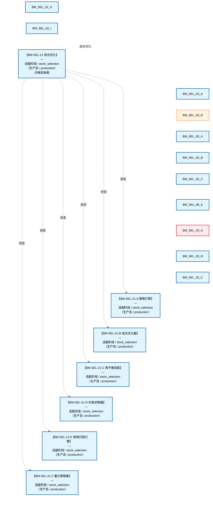
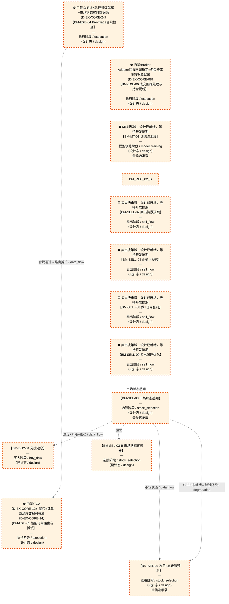

# 交易决策作战地图（总指挥图）

> **[可缩放 HTML 版 / Zoomable HTML](http://localhost:8765/docs/02_enterprise_architecture/07_trading_decision_architecture/battle_map/_zoomable_html/battle_map_panorama.html)** — Ctrl+滚轮缩放 ｜ 双击重置 ｜ Ctrl+Shift+D 切换拖动/选择模式

> 第四全景图 battle_map 真源：`battle_map_steps` / `battle_map_anchors` / `battle_map_edges` 三表 + 翻译真源 `module_translation_registry.yaml` §battle_map_steps 段。
> 本文档由 `generate_battle_map_diagram.py` 自动生成，禁止手编（改环节→改 DB/YAML 真源→重跑生成器）。

## 文档基本信息 / Document Overview

| 字段 | 值 | Field | Value |
|------|------|-------|-------|
| 环节总数 | 138 | Steps | 138 |
| 流转边 | 114 | Edges | 114 |
| 无锚点环节（BM-INV-001） | 0 | No-Anchor Steps | 0 |
| 运营态环节 | 92 | Production Steps | 92 |
| 设计态环节 | 13 | Design Steps | 13 |
| 状态分布 | 🟦 运营态（已建）=92 ｜ 🟨 候选态（候选池）=29 ｜ 🟧 设计态（待施工）=13 ｜ 🟥 弃用态=4 | State Distribution | 🟦 运营态（已建）=92 ｜ 🟨 候选态（候选池）=29 ｜ 🟧 设计态（待施工）=13 ｜ 🟥 弃用态=4 |

> **图例说明 / Legend**：
> - 🟦 **蓝色实线 = 运营态环节**（production，锚点模块已建）
> - 🟧 **橙色虚线 = 设计态环节**（design，锚点模块待施工）
> - 🟥 **红色 = 弃用态**（deprecated）
> - ⬜ **灰色 = 缺失态**（missing，环节无锚点，BM-INV-001 违例）
> - 🟨 **黄色虚线 = 候选态**（candidate，承载模块在候选池）
> - **实线箭头 ``-->`` = 运营态流转**（两端均 production）
> - **虚线箭头 ``-.->`` = 非运营态流转**（含设计/候选/混合）

## 域内依赖图 / Internal Dependency Diagram

> 依赖图内嵌在本文档中，IDE 可直接渲染；网页版可 Ctrl+滚轮缩放 + 拖动平移查看细节。

### 全景图（全部环节，颜色区分五态）

> 展示全部 138 个环节（运营态 92 + 设计态 13 + 弃用/缺失/候选 33），含跨阶段流转边。

```mermaid
%%{init: {'theme': 'base', 'themeVariables': {'primaryColor': '#eaeaea', 'primaryTextColor': '#333333', 'primaryBorderColor': '#666666', 'lineColor': '#666666', 'secondaryColor': '#eaeaea', 'tertiaryColor': '#eaeaea', 'clusterBkg': 'transparent', 'clusterBorder': 'transparent', 'fontSize': '14px'}}}%%
%% 作战地图总指挥图·全景图（第 1/3 页）
flowchart TD
    BM_BT_01["【BM-BT-01 回测引擎与撮合】<br/>—<br/>回测验证阶段 / backtest_validation<br/>（生产态 / production）"]
    BM_BUY_01["【BM-BUY-01 多情景对策生成】<br/>—<br/>买入阶段 / buy_flow<br/>（生产态 / production）<br/>🟡候选承载"]
    BM_EXE_01["【BM-EXE-01 自适应风控审批】<br/>—<br/>执行阶段 / execution<br/>（生产态 / production）<br/>🟡候选承载"]
    BM_MT_01["⛔ ML训练域，设计已就绪，等待开发排期<br/>【BM-MT-01 训练流水线】<br/>—<br/>模型训练阶段 / model_training<br/>（设计态 / design）<br/>🟡候选承载"]
    BM_POS_01["【BM-POS-01 仓位管理裁决】<br/>—<br/>仓位阶段 / position_management<br/>（生产态 / production）<br/>🟡候选承载"]
    subgraph sg_BM_REC_01 ["交易运营清算"]
        BM_REC_01["【BM-REC-01 交易运营清算】<br/>—<br/>对账阶段 / reconciliation<br/>（生产态 / production）"]
        BM_REC_01_A["【BM-REC-01-A 结算对账】<br/>—<br/>对账阶段 / reconciliation<br/>（生产态 / production）"]
        BM_REC_01_B["【BM-REC-01-B 公司行为与费率】<br/>—<br/>对账阶段 / reconciliation<br/>（生产态 / production）"]
        BM_REC_01 -.->|嵌套| BM_REC_01_A
        BM_REC_01 -.->|嵌套| BM_REC_01_B
    end
    BM_RES_01["【BM-RES-01 研究数据与特征存储】<br/>—<br/>研究孵化阶段 / research_incubation<br/>（候选态 / candidate）<br/>🟡候选承载"]
    BM_POS_06["【BM-POS-06 现金管理约束】<br/>—<br/>仓位阶段 / position_management<br/>（生产态 / production）"]
    BM_POS_08["【BM-POS-08 日历仓位约束】<br/>—<br/>仓位阶段 / position_management<br/>（生产态 / production）"]
    BM_BT_02["【BM-BT-02 持仓组合与数据接入】<br/>—<br/>回测验证阶段 / backtest_validation<br/>（生产态 / production）"]
    subgraph sg_BM_BUY_02 ["四轨融合"]
        BM_BUY_02["【BM-BUY-02 四轨融合】<br/>—<br/>买入阶段 / buy_flow<br/>（生产态 / production）<br/>🟡候选承载"]
        BM_BUY_02_A["【BM-BUY-02-A 逻辑驱动轨】<br/>—<br/>买入阶段 / buy_flow<br/>（生产态 / production）<br/>🟡候选承载"]
        BM_BUY_02_B["【BM-BUY-02-B 数据驱动轨】<br/>—<br/>买入阶段 / buy_flow<br/>（生产态 / production）<br/>🟡候选承载"]
        BM_BUY_02_C["【BM-BUY-02-C 人工指令轨】<br/>—<br/>买入阶段 / buy_flow<br/>（生产态 / production）<br/>🟡候选承载"]
        BM_BUY_02_D["【BM-BUY-02-D 应急保命轨】<br/>—<br/>买入阶段 / buy_flow<br/>（生产态 / production）<br/>🟡候选承载"]
        BM_BUY_02 -.->|嵌套| BM_BUY_02_A
        BM_BUY_02 -.->|嵌套| BM_BUY_02_B
        BM_BUY_02 -.->|嵌套| BM_BUY_02_C
        BM_BUY_02 -.->|嵌套| BM_BUY_02_D
    end
    BM_EXE_04["⛔ 门禁:D-RISK风控参数就绪+市场状态实时数据源<br/>（D-EX-CORE-24）<br/>【BM-EXE-04 Pre-Trade合规检查】<br/>—<br/>执行阶段 / execution<br/>（设计态 / design）"]
    BM_MT_02["【BM-MT-02 实验追踪与自动晋升】<br/>—<br/>模型训练阶段 / model_training<br/>（候选态 / candidate）<br/>🟡候选承载"]
    BM_POS_02["【BM-POS-02 标级仓位Kelly】<br/>—<br/>仓位阶段 / position_management<br/>（生产态 / production）"]
    subgraph sg_BM_REC_02 ["报告复盘"]
        BM_REC_02["【BM-REC-02 报告复盘】<br/>—<br/>对账阶段 / reconciliation<br/>（生产态 / production）"]
        BM_REC_02_A["【BM-REC-02-A TCA执行质量分析】<br/>—<br/>对账阶段 / reconciliation<br/>（生产态 / production）"]
        BM_REC_02_B["⛔ D-EX-CORE执行报告未就绪（CTR-P1-007<br/>/CTR-ERR-005）,设计文档§1.4标注受限,暂不可建<br/>【BM-REC-02-B 绩效归因】<br/>—<br/>对账阶段 / reconciliation<br/>（设计态 / design）"]
        BM_REC_02_C["【BM-REC-02-C A股交易复盘】<br/>—<br/>对账阶段 / reconciliation<br/>（生产态 / production）"]
        BM_REC_02_D["【BM-REC-02-D 报告发布】<br/>—<br/>对账阶段 / reconciliation<br/>（生产态 / production）"]
        BM_REC_02 -.->|嵌套| BM_REC_02_A
        BM_REC_02 -.->|嵌套| BM_REC_02_B
        BM_REC_02 -.->|嵌套| BM_REC_02_C
        BM_REC_02 -.->|嵌套| BM_REC_02_D
    end
    BM_RES_02["【BM-RES-02 实验追踪与可复现性】<br/>—<br/>研究孵化阶段 / research_incubation<br/>（候选态 / candidate）<br/>🟡候选承载"]
    BM_BT_03["【BM-BT-03 绩效指标与Tick回放】<br/>—<br/>回测验证阶段 / backtest_validation<br/>（生产态 / production）"]
    BM_BUY_03["【BM-BUY-03 决策编排】<br/>—<br/>买入阶段 / buy_flow<br/>（生产态 / production）"]
    BM_EXE_05["⛔ 门禁:TCA<br/>（D-EX-CORE-12）就绪+订单簿深度数据可获取<br/>（D-EX-CORE-14）<br/>【BM-EXE-05 智能订单路由与拆单】<br/>—<br/>执行阶段 / execution<br/>（设计态 / design）"]
    BM_MT_03["【BM-MT-03 AutoML与超参优化】<br/>—<br/>模型训练阶段 / model_training<br/>（候选态 / candidate）<br/>🟡候选承载"]
    BM_POS_03["【BM-POS-03 持仓状态机漂移】<br/>—<br/>仓位阶段 / position_management<br/>（生产态 / production）"]
    subgraph sg_BM_REC_03 ["闭环优化反馈"]
        BM_REC_03["【BM-REC-03 闭环优化反馈】<br/>—<br/>对账阶段 / reconciliation<br/>（生产态 / production）<br/>🟡候选承载"]
        BM_REC_03_A["【BM-REC-03-A 因子层反馈】<br/>—<br/>对账阶段 / reconciliation<br/>（生产态 / production）"]
        BM_REC_03_B["【BM-REC-03-B 信号层反馈】<br/>—<br/>对账阶段 / reconciliation<br/>（生产态 / production）<br/>🟡候选承载"]
        BM_REC_03_C["【BM-REC-03-C 模型层反馈】<br/>—<br/>对账阶段 / reconciliation<br/>（生产态 / production）<br/>🟡候选承载"]
        BM_REC_03 -.->|嵌套| BM_REC_03_A
        BM_REC_03 -.->|嵌套| BM_REC_03_B
        BM_REC_03 -.->|嵌套| BM_REC_03_C
    end
    BM_RES_03["【BM-RES-03 假设管理与研究发现沉淀】<br/>—<br/>研究孵化阶段 / research_incubation<br/>（候选态 / candidate）<br/>🟡候选承载"]
    BM_POS_07["【BM-POS-07 再平衡执行】<br/>—<br/>仓位阶段 / position_management<br/>（生产态 / production）"]
    BM_POS_09["【BM-POS-09 卖出仓位反馈链路】<br/>—<br/>仓位阶段 / position_management<br/>（生产态 / production）"]
    BM_BT_04["【BM-BT-04 PIT铁律管理】<br/>—<br/>回测验证阶段 / backtest_validation<br/>（生产态 / production）"]
    BM_BUY_04["【BM-BUY-04 分批建仓】<br/>—<br/>买入阶段 / buy_flow<br/>（设计态 / design）"]
    BM_EXE_02["【BM-EXE-02 交易执行】<br/>—<br/>执行阶段 / execution<br/>（生产态 / production）<br/>🟡候选承载"]
    BM_MT_04["【BM-MT-04 因子发现与因果发现】<br/>—<br/>模型训练阶段 / model_training<br/>（候选态 / candidate）<br/>🟡候选承载"]
    BM_POS_04["【BM-POS-04 跨策略仓位硬限制】<br/>—<br/>仓位阶段 / position_management<br/>（生产态 / production）"]
    BM_REC_04["【BM-REC-04 保证金管理】<br/>—<br/>对账阶段 / reconciliation<br/>（生产态 / production）"]
    BM_RES_04["【BM-RES-04 研究工作流编排】<br/>—<br/>研究孵化阶段 / research_incubation<br/>（候选态 / candidate）<br/>🟡候选承载"]
    BM_BT_05["【BM-BT-05 过拟合检测】<br/>—<br/>回测验证阶段 / backtest_validation<br/>（生产态 / production）"]
    BM_EXE_06["⛔ 门禁:Broker<br/>Adapter回报回调稳定+佣金费率表数据源就绪<br/>（D-EX-CORE-08）<br/>【BM-EXE-06 成交回报处理与持仓更新】<br/>—<br/>执行阶段 / execution<br/>（设计态 / design）"]
    BM_MT_05["【BM-MT-05 漂移检测与自适应重训练】<br/>—<br/>模型训练阶段 / model_training<br/>（候选态 / candidate）<br/>🟡候选承载"]
    BM_POS_05["【BM-POS-05 资金曲线回撤缩放】<br/>—<br/>仓位阶段 / position_management<br/>（生产态 / production）"]
    BM_REC_05["【BM-REC-05 多账户分仓管理】<br/>—<br/>对账阶段 / reconciliation<br/>（生产态 / production）"]
    BM_RES_05["【BM-RES-05 Notebook与协作】<br/>—<br/>研究孵化阶段 / research_incubation<br/>（候选态 / candidate）<br/>🟡候选承载"]
    BM_BT_06["【BM-BT-06 Walk-Forward优化】<br/>—<br/>回测验证阶段 / backtest_validation<br/>（生产态 / production）<br/>🟡候选承载"]
    BM_BUY_06["【BM-BUY-06 外部指令盯盘】<br/>—<br/>买入阶段 / buy_flow<br/>（生产态 / production）"]
    BM_EXE_03["【BM-EXE-03 执行质量TCA】<br/>—<br/>执行阶段 / execution<br/>（生产态 / production）"]
    BM_RES_06["【BM-RES-06 LLM研究Agent与论文追踪】<br/>—<br/>研究孵化阶段 / research_incubation<br/>（候选态 / candidate）<br/>🟡候选承载"]
    BM_BT_07["【BM-BT-07 决策门控与上线】<br/>—<br/>回测验证阶段 / backtest_validation<br/>（生产态 / production）"]
    BM_BUY_07["【BM-BUY-07 微信互动中心】<br/>—<br/>买入阶段 / buy_flow<br/>（生产态 / production）"]
    BM_RES_07["【BM-RES-07 策略迭代升级】<br/>—<br/>研究孵化阶段 / research_incubation<br/>（候选态 / candidate）<br/>🟡候选承载"]
    BM_BUY_08["【BM-BUY-08 交易纪律合规闸】<br/>—<br/>买入阶段 / buy_flow<br/>（候选态 / candidate）<br/>🟡候选承载"]
    BM_POS_10["【BM-POS-10 仓位审计追溯】<br/>—<br/>仓位阶段 / position_management<br/>（生产态 / production）"]
    BM_BUY_01 ~~~ BM_BUY_04 ~~~ BM_BUY_07 ~~~ BM_BUY_02_A ~~~ BM_BUY_02_B ~~~ BM_BUY_02_C ~~~ BM_BUY_02_D ~~~ BM_POS_08 ~~~ BM_POS_09 ~~~ BM_POS_05 ~~~ BM_REC_01_A ~~~ BM_REC_02_A ~~~ BM_REC_03_A ~~~ BM_RES_01
    BM_BUY_02 ~~~ BM_BUY_06 ~~~ BM_POS_03 ~~~ BM_REC_01_B ~~~ BM_REC_02_B ~~~ BM_REC_03_B ~~~ BM_RES_02
    BM_BUY_03 ~~~ BM_POS_07 ~~~ BM_REC_02_C ~~~ BM_REC_03_C ~~~ BM_RES_03
    BM_BUY_08 ~~~ BM_POS_01 ~~~ BM_REC_02_D ~~~ BM_RES_04
    BM_POS_06 ~~~ BM_RES_05
    BM_POS_02 ~~~ BM_RES_06
    BM_EXE_01 ~~~ BM_POS_10
    BM_BT_01 ~~~ BM_BT_02 ~~~ BM_BT_03 ~~~ BM_BT_04 ~~~ BM_BT_05 ~~~ BM_BT_06 ~~~ BM_BT_07 ~~~ BM_EXE_05 ~~~ BM_EXE_02 ~~~ BM_EXE_06 ~~~ BM_EXE_03 ~~~ BM_MT_01 ~~~ BM_MT_02 ~~~ BM_MT_03 ~~~ BM_MT_04 ~~~ BM_MT_05 ~~~ BM_REC_01 ~~~ BM_REC_02 ~~~ BM_REC_03 ~~~ BM_REC_04 ~~~ BM_REC_05 ~~~ BM_RES_07
    BM_BUY_01 -->|买入预案 / data_flow| BM_BUY_02
    BM_BUY_02 -->|统一决策流 / data_flow| BM_BUY_03
    BM_BUY_04 -.->|分批仓位方案 / data_flow| BM_POS_01
    BM_BUY_03 -->|编排后决策 / data_flow| BM_POS_01
    BM_POS_01 -->|仓位指令 / data_flow| BM_EXE_01
    BM_EXE_02 -->|成交回报 / data_flow| BM_REC_01
    BM_REC_01 -->|运营数据 / data_flow| BM_REC_02
    BM_REC_02 -->|复盘报告 / data_flow| BM_REC_03
    BM_BUY_06 -->|外部指令→风控检查 / data_flow| BM_EXE_01
    BM_POS_01 -->|风险配额→标级Kelly / data_flow| BM_POS_02
    BM_POS_02 -->|标级仓位→跨策略硬限制 / data_flow| BM_POS_04
    BM_POS_03 -->|漂移触发→标级仓位调整 / trigger| BM_POS_02
    BM_POS_05 -->|回撤缩放→标级仓位约束 / trigger| BM_POS_02
    BM_POS_05 -->|回撤缩放→跨策略硬限制 / trigger| BM_POS_04
    BM_POS_04 -->|实际仓位→风控审批 / data_flow| BM_EXE_01
    BM_EXE_03 -->|执行质量→报告复盘 / data_flow| BM_REC_02
    BM_POS_04 -->|实际仓位→交易执行 / data_flow| BM_EXE_02
    BM_REC_01 -->|保证金监控消费清算数据 / data_flow| BM_REC_04
    BM_REC_01 -->|多账户独立核算消费清算数据 / data_flow| BM_REC_05
    BM_BUY_07 -->|微信指令→外部指令盯盘 / data_flow| BM_BUY_06
    BM_BUY_03 -.->|编排后决策→纪律合规闸 / trigger| BM_BUY_08
    BM_BUY_08 -.->|纪律合规通过→风控执行 / data_flow| BM_EXE_01
    BM_POS_01 -->|风险配额→现金约束 / data_flow| BM_POS_06
    BM_POS_06 -->|现金约束→标级Kelly / data_flow| BM_POS_02
    BM_POS_03 -->|漂移触发→再平衡执行 / trigger| BM_POS_07
    BM_POS_07 -->|再平衡→标级仓位调整 / data_flow| BM_POS_02
    BM_POS_07 -->|再平衡→仓位审计 / data_flow| BM_POS_10
    BM_POS_08 -->|日历约束→仓位裁决上限 / trigger| BM_POS_01
    BM_POS_08 -->|日历约束→跨策略硬限制 / trigger| BM_POS_04
    BM_POS_09 -->|仓位反馈→状态机 / trigger| BM_POS_03
    BM_POS_02 -->|标级仓位→审计 / data_flow| BM_POS_10
    BM_POS_04 -->|实际仓位→审计 / data_flow| BM_POS_10
    BM_REC_01_A -->|结算对账后处理公司行为与费率 / data_flow| BM_REC_01_B
    BM_REC_02_A -.->|TCA执行成本→归因输入 / data_flow| BM_REC_02_B
    BM_REC_02_B -.->|归因结果→复盘素材 / data_flow| BM_REC_02_C
    BM_REC_02_C -->|复盘报告→发布 / data_flow| BM_REC_02_D
    BM_REC_03_A -->|因子反馈→信号反馈 / data_flow| BM_REC_03_B
    BM_REC_03_B -->|信号反馈→模型反馈 / data_flow| BM_REC_03_C
    BM_EXE_01 -.->|审批后订单→合规检查 / data_flow| BM_EXE_04
    BM_EXE_04 -.->|合规通过→路由拆单 / data_flow| BM_EXE_05
    BM_EXE_05 -.->|拆单方案/子订单→下单执行 / data_flow| BM_EXE_02
    BM_EXE_02 -.->|成交回报→Fill处理与持仓更新 / data_flow| BM_EXE_06
    BM_EXE_06 -.->|成交数据→TCA分析 / data_flow| BM_EXE_03
    BM_EXE_03 -.->|TCA反馈→拆单算法优化 / degradation| BM_EXE_05
    BM_RES_01 -.->|研究数据→实验追踪 / data_flow| BM_RES_02
    BM_RES_02 -.->|实验结果→假设验证 / data_flow| BM_RES_03
    BM_RES_03 -.->|假设→工作流编排 / trigger| BM_RES_04
    BM_RES_04 -.->|工作流→Notebook协作 / data_flow| BM_RES_05
    BM_RES_05 -.->|协作→LLM/论文追踪 / trigger| BM_RES_06
    BM_RES_06 -.->|研究发现→策略迭代 / data_flow| BM_RES_07
    BM_MT_01 -.->|训练→实验晋升 / data_flow| BM_MT_02
    BM_MT_02 -.->|晋升→AutoML优化 / trigger| BM_MT_03
    BM_MT_03 -.->|AutoML→因子发现 / data_flow| BM_MT_04
    BM_MT_04 -.->|因子→漂移检测 / trigger| BM_MT_05
    BM_BT_01 -->|引擎→持仓数据 / data_flow| BM_BT_02
    BM_BT_02 -->|持仓→绩效指标 / data_flow| BM_BT_03
    BM_BT_03 -->|指标→PIT校验 / trigger| BM_BT_04
    BM_BT_04 -->|PIT→过拟合检测 / data_flow| BM_BT_05
    BM_BT_05 -->|过拟合→WFO / data_flow| BM_BT_06
    BM_BT_06 -->|WFO→决策门控 / data_flow| BM_BT_07
    BM_RES_07 -.->|策略迭代→训练 / data_flow| BM_MT_01
    BM_MT_02 -.->|模型晋升→回测 / data_flow| BM_BT_01
    BM_REC_05 -.->|归因反馈→策略迭代 / data_flow| BM_RES_07
classDef production fill:#e1f5fe,stroke:#01579b,stroke-width:2px,color:#000
classDef design fill:#fff3e0,stroke:#e65100,stroke-width:2px,color:#000,stroke-dasharray: 5 5
classDef deprecated fill:#ffebee,stroke:#c62828,stroke-width:2px,color:#000
classDef missing fill:#eeeeee,stroke:#9e9e9e,stroke-width:2px,color:#000
classDef candidate fill:#fffde7,stroke:#f9a825,stroke-width:2px,color:#000,stroke-dasharray: 5 5
    class BM_BT_01,BM_BT_02,BM_BT_03,BM_BT_04,BM_BT_05,BM_BT_06,BM_BT_07,BM_BUY_01,BM_BUY_02,BM_BUY_03,BM_BUY_06,BM_BUY_07,BM_BUY_02_A,BM_BUY_02_B,BM_BUY_02_C,BM_BUY_02_D,BM_EXE_01,BM_EXE_02,BM_EXE_03,BM_POS_01,BM_POS_06,BM_POS_08,BM_POS_02,BM_POS_03,BM_POS_07,BM_POS_09,BM_POS_04,BM_POS_05,BM_POS_10,BM_REC_01,BM_REC_02,BM_REC_03,BM_REC_04,BM_REC_05,BM_REC_01_A,BM_REC_01_B,BM_REC_02_A,BM_REC_02_C,BM_REC_02_D,BM_REC_03_A,BM_REC_03_B,BM_REC_03_C production
    class BM_BUY_04,BM_EXE_04,BM_EXE_05,BM_EXE_06,BM_MT_01,BM_REC_02_B design
    class BM_BUY_08,BM_MT_02,BM_MT_03,BM_MT_04,BM_MT_05,BM_RES_01,BM_RES_02,BM_RES_03,BM_RES_04,BM_RES_05,BM_RES_06,BM_RES_07 candidate
```

```mermaid
%%{init: {'theme': 'base', 'themeVariables': {'primaryColor': '#eaeaea', 'primaryTextColor': '#333333', 'primaryBorderColor': '#666666', 'lineColor': '#666666', 'secondaryColor': '#eaeaea', 'tertiaryColor': '#eaeaea', 'clusterBkg': 'transparent', 'clusterBorder': 'transparent', 'fontSize': '14px'}}}%%
%% 作战地图总指挥图·全景图（第 2/3 页）
flowchart TD
    BM_RC_01["【BM-RC-01 风控策略与限额管理】<br/>—<br/>风控管控阶段 / risk_control<br/>（生产态 / production）"]
    BM_SELL_01["【BM-SELL-01 突破成败信号】<br/>—<br/>卖出阶段 / sell_flow<br/>（生产态 / production）"]
    BM_SIM_01["【BM-SIM-01 市场仿真器】<br/>—<br/>仿真验证阶段 / simulation_validation<br/>（候选态 / candidate）<br/>🟡候选承载"]
    subgraph sg_BM_SEL_01 ["数据接入与预处理"]
        BM_SEL_01["【BM-SEL-01 数据接入与预处理】<br/>—<br/>选股阶段 / stock_selection<br/>（生产态 / production）<br/>🟡候选承载"]
        BM_SEL_01_A["【BM-SEL-01-A 供应商注册与适配器】<br/>—<br/>选股阶段 / stock_selection<br/>（生产态 / production）"]
        BM_SEL_01_B["【BM-SEL-01-B 行情连接器管理】<br/>—<br/>选股阶段 / stock_selection<br/>（生产态 / production）"]
        BM_SEL_01_C["【BM-SEL-01-C 故障切换与Failover】<br/>—<br/>选股阶段 / stock_selection<br/>（生产态 / production）"]
        BM_SEL_01_D["【BM-SEL-01-D 自动加载与热切换】<br/>—<br/>选股阶段 / stock_selection<br/>（生产态 / production）"]
        BM_SEL_01_E["【BM-SEL-01-E 原始数据缓存】<br/>—<br/>选股阶段 / stock_selection<br/>（生产态 / production）"]
        BM_SEL_01_F["【BM-SEL-01-F 标准化行情产出】<br/>—<br/>选股阶段 / stock_selection<br/>（生产态 / production）"]
        BM_SEL_01 -.->|嵌套| BM_SEL_01_A
        BM_SEL_01 -.->|嵌套| BM_SEL_01_B
        BM_SEL_01 -.->|嵌套| BM_SEL_01_C
        BM_SEL_01 -.->|嵌套| BM_SEL_01_D
        BM_SEL_01 -.->|嵌套| BM_SEL_01_E
        BM_SEL_01 -.->|嵌套| BM_SEL_01_F
    end
    BM_RC_02["【BM-RC-02 盘前风控检查】<br/>—<br/>风控管控阶段 / risk_control<br/>（生产态 / production）"]
    BM_SELL_03["【BM-SELL-03 卖出信号收集评分】<br/>—<br/>卖出阶段 / sell_flow<br/>（生产态 / production）"]
    BM_SIM_02["【BM-SIM-02 策略仿真器】<br/>—<br/>仿真验证阶段 / simulation_validation<br/>（生产态 / production）<br/>🟡候选承载"]
    subgraph sg_BM_SEL_02 ["因子计算与信号生成"]
        BM_SEL_02["【BM-SEL-02 因子计算与信号生成】<br/>—<br/>选股阶段 / stock_selection<br/>（弃用态 / deprecated）<br/>🟡候选承载"]
        BM_SEL_02_A["【BM-SEL-02-A 因子计算引擎】<br/>—<br/>选股阶段 / stock_selection<br/>（弃用态 / deprecated）"]
        BM_SEL_02_B["【BM-SEL-02-B 因子注册表与池管理】<br/>—<br/>选股阶段 / stock_selection<br/>（生产态 / production）"]
        BM_SEL_02_C["【BM-SEL-02-C 因子管线双模调度】<br/>—<br/>选股阶段 / stock_selection<br/>（弃用态 / deprecated）"]
        BM_SEL_02_D["【BM-SEL-02-D 因子评估-IC/IR体系】<br/>—<br/>选股阶段 / stock_selection<br/>（生产态 / production）"]
        BM_SEL_02_E["【BM-SEL-02-E 因子评估-相关性与语义去重】<br/>—<br/>选股阶段 / stock_selection<br/>（生产态 / production）"]
        BM_SEL_02_F["【BM-SEL-02-F 因子评估-分层回测与三级判断】<br/>—<br/>选股阶段 / stock_selection<br/>（生产态 / production）"]
        BM_SEL_02_G["【BM-SEL-02-G 因子衰减监控与归因】<br/>—<br/>选股阶段 / stock_selection<br/>（生产态 / production）"]
        BM_SEL_02 -.->|嵌套| BM_SEL_02_A
        BM_SEL_02 -.->|嵌套| BM_SEL_02_B
        BM_SEL_02 -.->|嵌套| BM_SEL_02_C
        BM_SEL_02 -.->|嵌套| BM_SEL_02_D
        BM_SEL_02 -.->|嵌套| BM_SEL_02_E
        BM_SEL_02 -.->|嵌套| BM_SEL_02_F
        BM_SEL_02 -.->|嵌套| BM_SEL_02_G
    end
    BM_SEL_22["【BM-SEL-22 短线选股评分卡】<br/>—<br/>选股阶段 / stock_selection<br/>（生产态 / production）"]
    BM_SEL_23["【BM-SEL-23 游资接力情绪周期】<br/>—<br/>选股阶段 / stock_selection<br/>（生产态 / production）"]
    BM_SEL_24["【BM-SEL-24 量化短线强度评级】<br/>—<br/>选股阶段 / stock_selection<br/>（生产态 / production）"]
    BM_SELL_07["⛔ 卖出决策域，设计已就绪，等待开发排期<br/>【BM-SELL-07 卖出情景预案】<br/>—<br/>卖出阶段 / sell_flow<br/>（设计态 / design）"]
    BM_SEL_25["【BM-SEL-25 双引擎融合决策】<br/>—<br/>选股阶段 / stock_selection<br/>（生产态 / production）"]
    BM_RC_03["【BM-RC-03 Kill Switch熔断】<br/>—<br/>风控管控阶段 / risk_control<br/>（候选态 / candidate）<br/>🟡候选承载"]
    BM_SELL_04["⛔ 卖出决策域，设计已就绪，等待开发排期<br/>【BM-SELL-04 止盈止损族】<br/>—<br/>卖出阶段 / sell_flow<br/>（设计态 / design）"]
    BM_SIM_03["【BM-SIM-03 场景生成与蒙特卡洛】<br/>—<br/>仿真验证阶段 / simulation_validation<br/>（生产态 / production）<br/>🟡候选承载"]
    BM_SEL_03["【BM-SEL-03 市场状态感知】<br/>—<br/>选股阶段 / stock_selection<br/>（设计态 / design）<br/>🟡候选承载"]
    BM_RC_04["【BM-RC-04 盘中持仓风控监控】<br/>—<br/>风控管控阶段 / risk_control<br/>（生产态 / production）"]
    BM_SELL_05["【BM-SELL-05 置换再平衡卖出】<br/>—<br/>卖出阶段 / sell_flow<br/>（生产态 / production）"]
    BM_SIM_04["【BM-SIM-04 压力测试引擎】<br/>—<br/>仿真验证阶段 / simulation_validation<br/>（生产态 / production）<br/>🟡候选承载"]
    BM_SEL_04["【BM-SEL-04 次日8态走势预测】<br/>—<br/>选股阶段 / stock_selection<br/>（设计态 / design）<br/>🟡候选承载"]
    BM_SELL_08["⛔ 卖出决策域，设计已就绪，等待开发排期<br/>【BM-SELL-08 做T日内套利】<br/>—<br/>卖出阶段 / sell_flow<br/>（设计态 / design）"]
    BM_RC_05["【BM-RC-05 A股特色止损】<br/>—<br/>风控管控阶段 / risk_control<br/>（生产态 / production）<br/>🟡候选承载"]
    BM_SELL_02["【BM-SELL-02 卖出信号融合仲裁】<br/>—<br/>卖出阶段 / sell_flow<br/>（生产态 / production）"]
    BM_SIM_05["【BM-SIM-05 依赖图数字孪生】<br/>—<br/>仿真验证阶段 / simulation_validation<br/>（候选态 / candidate）<br/>🟡候选承载"]
    BM_SEL_05["【BM-SEL-05 主力行为感知】<br/>—<br/>选股阶段 / stock_selection<br/>（生产态 / production）<br/>🟡候选承载"]
    BM_RC_06["【BM-RC-06 系统性风险检测】<br/>—<br/>风控管控阶段 / risk_control<br/>（生产态 / production）<br/>🟡候选承载"]
    BM_SELL_06["【BM-SELL-06 买卖冲突仲裁】<br/>—<br/>卖出阶段 / sell_flow<br/>（生产态 / production）"]
    BM_SIM_06["【BM-SIM-06 仿真结果分析】<br/>—<br/>仿真验证阶段 / simulation_validation<br/>（生产态 / production）<br/>🟡候选承载"]
    BM_SEL_06["【BM-SEL-06 跨市场传导感知】<br/>—<br/>选股阶段 / stock_selection<br/>（候选态 / candidate）<br/>🟡候选承载"]
    BM_RC_07["【BM-RC-07 风险预算与VaR】<br/>—<br/>风控管控阶段 / risk_control<br/>（生产态 / production）"]
    BM_SELL_09["⛔ 卖出决策域，设计已就绪，等待开发排期<br/>【BM-SELL-09 卖出闭环优化】<br/>—<br/>卖出阶段 / sell_flow<br/>（设计态 / design）"]
    BM_SEL_07["【BM-SEL-07 体制转换检测】<br/>—<br/>选股阶段 / stock_selection<br/>（候选态 / candidate）<br/>🟡候选承载"]
    BM_RC_08["【BM-RC-08 盘后审计与压力测试】<br/>—<br/>风控管控阶段 / risk_control<br/>（生产态 / production）"]
    BM_SEL_08["【BM-SEL-08 板块轮动序列追踪】<br/>—<br/>选股阶段 / stock_selection<br/>（生产态 / production）<br/>🟡候选承载"]
    BM_SEL_09["【BM-SEL-09 调整周期追踪】<br/>—<br/>选股阶段 / stock_selection<br/>（候选态 / candidate）<br/>🟡候选承载"]
    BM_SEL_10["【BM-SEL-10 行情生命周期阶段】<br/>—<br/>选股阶段 / stock_selection<br/>（候选态 / candidate）<br/>🟡候选承载"]
    BM_SEL_11["【BM-SEL-11 知识图谱与因果推演】<br/>—<br/>选股阶段 / stock_selection<br/>（候选态 / candidate）<br/>🟡候选承载"]
    BM_SEL_12["【BM-SEL-12 分布特征工程】<br/>—<br/>选股阶段 / stock_selection<br/>（候选态 / candidate）<br/>🟡候选承载"]
    BM_SEL_13["【BM-SEL-13 收益率条件密度预测】<br/>—<br/>选股阶段 / stock_selection<br/>（候选态 / candidate）<br/>🟡候选承载"]
    BM_SEL_14["【BM-SEL-14 共形预测】<br/>—<br/>选股阶段 / stock_selection<br/>（候选态 / candidate）<br/>🟡候选承载"]
    BM_SEL_15["【BM-SEL-15 Survival止盈止损时间预测】<br/>—<br/>选股阶段 / stock_selection<br/>（候选态 / candidate）<br/>🟡候选承载"]
    BM_SEL_16["【BM-SEL-16 分级指标过滤】<br/>—<br/>选股阶段 / stock_selection<br/>（候选态 / candidate）<br/>🟡候选承载"]
    BM_SEL_17["【BM-SEL-17 初筛漏斗】<br/>—<br/>选股阶段 / stock_selection<br/>（候选态 / candidate）<br/>🟡候选承载"]
    BM_SEL_18["【BM-SEL-18 精筛评分】<br/>—<br/>选股阶段 / stock_selection<br/>（候选态 / candidate）<br/>🟡候选承载"]
    BM_SEL_19["【BM-SEL-19 事件驱动分布筛选】<br/>—<br/>选股阶段 / stock_selection<br/>（候选态 / candidate）<br/>🟡候选承载"]
    BM_SEL_20["【BM-SEL-20 多策略交叉投票】<br/>—<br/>选股阶段 / stock_selection<br/>（候选态 / candidate）<br/>🟡候选承载"]
    BM_RC_01 ~~~ BM_SELL_07 ~~~ BM_SELL_08 ~~~ BM_SIM_01 ~~~ BM_SEL_22 ~~~ BM_SEL_23 ~~~ BM_SEL_24 ~~~ BM_SEL_05 ~~~ BM_SEL_06 ~~~ BM_SEL_07 ~~~ BM_SEL_08 ~~~ BM_SEL_09 ~~~ BM_SEL_10 ~~~ BM_SEL_01_A ~~~ BM_SEL_01_B ~~~ BM_SEL_01_C ~~~ BM_SEL_01_D ~~~ BM_SEL_01_E ~~~ BM_SEL_01_F ~~~ BM_SEL_11 ~~~ BM_SEL_12 ~~~ BM_SEL_13 ~~~ BM_SEL_14 ~~~ BM_SEL_15 ~~~ BM_SEL_16 ~~~ BM_SEL_02_A ~~~ BM_SEL_02_B ~~~ BM_SEL_02_C ~~~ BM_SEL_02_D ~~~ BM_SEL_02_E ~~~ BM_SEL_02_F ~~~ BM_SEL_02_G
    BM_RC_02 ~~~ BM_SIM_02 ~~~ BM_SEL_25 ~~~ BM_SEL_17
    BM_RC_03 ~~~ BM_SIM_03 ~~~ BM_SEL_18
    BM_RC_04 ~~~ BM_SIM_04 ~~~ BM_SEL_19
    BM_RC_05 ~~~ BM_SIM_05 ~~~ BM_SEL_20
    BM_RC_06 ~~~ BM_SIM_06
    BM_RC_07 ~~~ BM_SEL_01
    BM_RC_08 ~~~ BM_SEL_02
    BM_SELL_01 ~~~ BM_SEL_03
    BM_SELL_03 ~~~ BM_SEL_04
    BM_SELL_04 ~~~ BM_SELL_05
    BM_SEL_01 -.->|标准化行情 / data_flow| BM_SEL_02
    BM_SEL_02 -.->|因子池 / data_flow| BM_SEL_03
    BM_SEL_03 -.->|市场状态 / data_flow| BM_SEL_04
    BM_SEL_02 -.->|压力位因子 / data_flow| BM_SELL_01
    BM_SELL_01 -->|突破成败信号 / data_flow| BM_SELL_02
    BM_SEL_03 -.->|C-021未就绪→跳过降级 / degradation| BM_SEL_04
    BM_SEL_16 -.->|漏斗L1→L2（~1200只） / data_flow| BM_SEL_17
    BM_SEL_17 -.->|漏斗L2→L3（~300只） / data_flow| BM_SEL_18
    BM_SEL_18 -.->|漏斗L3→L4（~50只） / data_flow| BM_SEL_19
    BM_SEL_19 -.->|漏斗L4→L5（~30只） / data_flow| BM_SEL_20
    BM_SELL_01 -->|突破成败信号→收集评分 / data_flow| BM_SELL_03
    BM_SELL_03 -.->|评分输出→止盈止损族 / data_flow| BM_SELL_04
    BM_SELL_03 -->|评分输出→置换再平衡 / data_flow| BM_SELL_05
    BM_SELL_04 -.->|止盈止损决策→融合仲裁 / data_flow| BM_SELL_02
    BM_SELL_05 -->|置换再平衡→融合仲裁 / data_flow| BM_SELL_02
    BM_SELL_02 -->|融合仲裁→买卖冲突仲裁 / data_flow| BM_SELL_06
    BM_SEL_22 -->|短线选股评分→双引擎融合 / data_flow| BM_SEL_25
    BM_SEL_23 -->|游资情绪→双引擎融合 / data_flow| BM_SEL_25
    BM_SEL_24 -->|量化强度→双引擎融合 / data_flow| BM_SEL_25
    BM_SELL_07 -.->|情景预案→融合仲裁 / data_flow| BM_SELL_02
    BM_SELL_08 -.->|做T信号→买卖冲突仲裁 / trigger| BM_SELL_06
    BM_SELL_06 -.->|仲裁输出→闭环优化反馈 / data_flow| BM_SELL_09
    BM_SIM_01 -.->|市场仿真→策略仿真 / data_flow| BM_SIM_02
    BM_SIM_02 -->|策略仿真→场景生成 / data_flow| BM_SIM_03
    BM_SIM_03 -->|场景→压力测试 / trigger| BM_SIM_04
    BM_SIM_04 -.->|压力→数字孪生 / trigger| BM_SIM_05
    BM_SIM_05 -.->|孪生→结果分析 / data_flow| BM_SIM_06
    BM_RC_01 -->|策略→盘前检查 / data_flow| BM_RC_02
    BM_RC_02 -.->|检查→Kill Switch / trigger| BM_RC_03
    BM_RC_03 -.->|熔断→盘中监控 / data_flow| BM_RC_04
    BM_RC_04 -->|监控→止损 / trigger| BM_RC_05
    BM_RC_05 -->|止损→系统性风险 / trigger| BM_RC_06
    BM_RC_06 -->|系统性→风险预算 / data_flow| BM_RC_07
    BM_RC_07 -->|预算→盘后审计 / trigger| BM_RC_08
    BM_SIM_06 -->|仿真通过→选股 / data_flow| BM_SEL_01
classDef production fill:#e1f5fe,stroke:#01579b,stroke-width:2px,color:#000
classDef design fill:#fff3e0,stroke:#e65100,stroke-width:2px,color:#000,stroke-dasharray: 5 5
classDef deprecated fill:#ffebee,stroke:#c62828,stroke-width:2px,color:#000
classDef missing fill:#eeeeee,stroke:#9e9e9e,stroke-width:2px,color:#000
classDef candidate fill:#fffde7,stroke:#f9a825,stroke-width:2px,color:#000,stroke-dasharray: 5 5
    class BM_RC_01,BM_RC_02,BM_RC_04,BM_RC_05,BM_RC_06,BM_RC_07,BM_RC_08,BM_SELL_01,BM_SELL_03,BM_SELL_05,BM_SELL_02,BM_SELL_06,BM_SIM_02,BM_SIM_03,BM_SIM_04,BM_SIM_06,BM_SEL_01,BM_SEL_22,BM_SEL_23,BM_SEL_24,BM_SEL_25,BM_SEL_05,BM_SEL_08,BM_SEL_01_A,BM_SEL_01_B,BM_SEL_01_C,BM_SEL_01_D,BM_SEL_01_E,BM_SEL_01_F,BM_SEL_02_B,BM_SEL_02_D,BM_SEL_02_E,BM_SEL_02_F,BM_SEL_02_G production
    class BM_SELL_07,BM_SELL_04,BM_SELL_08,BM_SELL_09,BM_SEL_03,BM_SEL_04 design
    class BM_SEL_02,BM_SEL_02_A,BM_SEL_02_C deprecated
    class BM_RC_03,BM_SIM_01,BM_SIM_05,BM_SEL_06,BM_SEL_07,BM_SEL_09,BM_SEL_10,BM_SEL_11,BM_SEL_12,BM_SEL_13,BM_SEL_14,BM_SEL_15,BM_SEL_16,BM_SEL_17,BM_SEL_18,BM_SEL_19,BM_SEL_20 candidate
```

### 运营态的图（仅 production 环节和流转）

> 仅展示已上线运行的环节（共 92 个），不含跨阶段外部节点。

```mermaid
%%{init: {'theme': 'base', 'themeVariables': {'primaryColor': '#eaeaea', 'primaryTextColor': '#333333', 'primaryBorderColor': '#666666', 'lineColor': '#666666', 'secondaryColor': '#eaeaea', 'tertiaryColor': '#eaeaea', 'clusterBkg': 'transparent', 'clusterBorder': 'transparent', 'fontSize': '14px'}}}%%
%% 作战地图·运营态（第 1/2 页）
flowchart TD
    BM_BT_01["【BM-BT-01 回测引擎与撮合】<br/>—<br/>回测验证阶段 / backtest_validation<br/>（生产态 / production）"]
    BM_BUY_01["【BM-BUY-01 多情景对策生成】<br/>—<br/>买入阶段 / buy_flow<br/>（生产态 / production）<br/>🟡候选承载"]
    BM_EXE_01["【BM-EXE-01 自适应风控审批】<br/>—<br/>执行阶段 / execution<br/>（生产态 / production）<br/>🟡候选承载"]
    BM_POS_01["【BM-POS-01 仓位管理裁决】<br/>—<br/>仓位阶段 / position_management<br/>（生产态 / production）<br/>🟡候选承载"]
    subgraph sg_BM_REC_01 ["交易运营清算"]
        BM_REC_01["【BM-REC-01 交易运营清算】<br/>—<br/>对账阶段 / reconciliation<br/>（生产态 / production）"]
        BM_REC_01_A["【BM-REC-01-A 结算对账】<br/>—<br/>对账阶段 / reconciliation<br/>（生产态 / production）"]
        BM_REC_01_B["【BM-REC-01-B 公司行为与费率】<br/>—<br/>对账阶段 / reconciliation<br/>（生产态 / production）"]
        BM_REC_01 -.->|嵌套| BM_REC_01_A
        BM_REC_01 -.->|嵌套| BM_REC_01_B
    end
    BM_RC_01["【BM-RC-01 风控策略与限额管理】<br/>—<br/>风控管控阶段 / risk_control<br/>（生产态 / production）"]
    BM_SELL_01["【BM-SELL-01 突破成败信号】<br/>—<br/>卖出阶段 / sell_flow<br/>（生产态 / production）"]
    BM_SEL_01["【BM-SEL-01 数据接入与预处理】<br/>—<br/>选股阶段 / stock_selection<br/>（生产态 / production）<br/>🟡候选承载"]
    BM_POS_06["【BM-POS-06 现金管理约束】<br/>—<br/>仓位阶段 / position_management<br/>（生产态 / production）"]
    BM_POS_08["【BM-POS-08 日历仓位约束】<br/>—<br/>仓位阶段 / position_management<br/>（生产态 / production）"]
    BM_BT_02["【BM-BT-02 持仓组合与数据接入】<br/>—<br/>回测验证阶段 / backtest_validation<br/>（生产态 / production）"]
    subgraph sg_BM_BUY_02 ["四轨融合"]
        BM_BUY_02["【BM-BUY-02 四轨融合】<br/>—<br/>买入阶段 / buy_flow<br/>（生产态 / production）<br/>🟡候选承载"]
        BM_BUY_02_A["【BM-BUY-02-A 逻辑驱动轨】<br/>—<br/>买入阶段 / buy_flow<br/>（生产态 / production）<br/>🟡候选承载"]
        BM_BUY_02_B["【BM-BUY-02-B 数据驱动轨】<br/>—<br/>买入阶段 / buy_flow<br/>（生产态 / production）<br/>🟡候选承载"]
        BM_BUY_02_C["【BM-BUY-02-C 人工指令轨】<br/>—<br/>买入阶段 / buy_flow<br/>（生产态 / production）<br/>🟡候选承载"]
        BM_BUY_02_D["【BM-BUY-02-D 应急保命轨】<br/>—<br/>买入阶段 / buy_flow<br/>（生产态 / production）<br/>🟡候选承载"]
        BM_BUY_02 -.->|嵌套| BM_BUY_02_A
        BM_BUY_02 -.->|嵌套| BM_BUY_02_B
        BM_BUY_02 -.->|嵌套| BM_BUY_02_C
        BM_BUY_02 -.->|嵌套| BM_BUY_02_D
    end
    BM_POS_02["【BM-POS-02 标级仓位Kelly】<br/>—<br/>仓位阶段 / position_management<br/>（生产态 / production）"]
    subgraph sg_BM_REC_02 ["报告复盘"]
        BM_REC_02["【BM-REC-02 报告复盘】<br/>—<br/>对账阶段 / reconciliation<br/>（生产态 / production）"]
        BM_REC_02_A["【BM-REC-02-A TCA执行质量分析】<br/>—<br/>对账阶段 / reconciliation<br/>（生产态 / production）"]
        BM_REC_02_C["【BM-REC-02-C A股交易复盘】<br/>—<br/>对账阶段 / reconciliation<br/>（生产态 / production）"]
        BM_REC_02_D["【BM-REC-02-D 报告发布】<br/>—<br/>对账阶段 / reconciliation<br/>（生产态 / production）"]
        BM_REC_02 -.->|嵌套| BM_REC_02_A
        BM_REC_02 -.->|嵌套| BM_REC_02_C
        BM_REC_02 -.->|嵌套| BM_REC_02_D
    end
    BM_RC_02["【BM-RC-02 盘前风控检查】<br/>—<br/>风控管控阶段 / risk_control<br/>（生产态 / production）"]
    BM_SELL_03["【BM-SELL-03 卖出信号收集评分】<br/>—<br/>卖出阶段 / sell_flow<br/>（生产态 / production）"]
    BM_SIM_02["【BM-SIM-02 策略仿真器】<br/>—<br/>仿真验证阶段 / simulation_validation<br/>（生产态 / production）<br/>🟡候选承载"]
    BM_SEL_22["【BM-SEL-22 短线选股评分卡】<br/>—<br/>选股阶段 / stock_selection<br/>（生产态 / production）"]
    BM_BT_03["【BM-BT-03 绩效指标与Tick回放】<br/>—<br/>回测验证阶段 / backtest_validation<br/>（生产态 / production）"]
    BM_BUY_03["【BM-BUY-03 决策编排】<br/>—<br/>买入阶段 / buy_flow<br/>（生产态 / production）"]
    BM_POS_03["【BM-POS-03 持仓状态机漂移】<br/>—<br/>仓位阶段 / position_management<br/>（生产态 / production）"]
    subgraph sg_BM_REC_03 ["闭环优化反馈"]
        BM_REC_03["【BM-REC-03 闭环优化反馈】<br/>—<br/>对账阶段 / reconciliation<br/>（生产态 / production）<br/>🟡候选承载"]
        BM_REC_03_A["【BM-REC-03-A 因子层反馈】<br/>—<br/>对账阶段 / reconciliation<br/>（生产态 / production）"]
        BM_REC_03_B["【BM-REC-03-B 信号层反馈】<br/>—<br/>对账阶段 / reconciliation<br/>（生产态 / production）<br/>🟡候选承载"]
        BM_REC_03_C["【BM-REC-03-C 模型层反馈】<br/>—<br/>对账阶段 / reconciliation<br/>（生产态 / production）<br/>🟡候选承载"]
        BM_REC_03 -.->|嵌套| BM_REC_03_A
        BM_REC_03 -.->|嵌套| BM_REC_03_B
        BM_REC_03 -.->|嵌套| BM_REC_03_C
    end
    BM_SIM_03["【BM-SIM-03 场景生成与蒙特卡洛】<br/>—<br/>仿真验证阶段 / simulation_validation<br/>（生产态 / production）<br/>🟡候选承载"]
    BM_POS_07["【BM-POS-07 再平衡执行】<br/>—<br/>仓位阶段 / position_management<br/>（生产态 / production）"]
    BM_POS_09["【BM-POS-09 卖出仓位反馈链路】<br/>—<br/>仓位阶段 / position_management<br/>（生产态 / production）"]
    BM_BT_04["【BM-BT-04 PIT铁律管理】<br/>—<br/>回测验证阶段 / backtest_validation<br/>（生产态 / production）"]
    BM_EXE_02["【BM-EXE-02 交易执行】<br/>—<br/>执行阶段 / execution<br/>（生产态 / production）<br/>🟡候选承载"]
    BM_POS_04["【BM-POS-04 跨策略仓位硬限制】<br/>—<br/>仓位阶段 / position_management<br/>（生产态 / production）"]
    BM_REC_04["【BM-REC-04 保证金管理】<br/>—<br/>对账阶段 / reconciliation<br/>（生产态 / production）"]
    BM_RC_04["【BM-RC-04 盘中持仓风控监控】<br/>—<br/>风控管控阶段 / risk_control<br/>（生产态 / production）"]
    BM_SELL_05["【BM-SELL-05 置换再平衡卖出】<br/>—<br/>卖出阶段 / sell_flow<br/>（生产态 / production）"]
    BM_SIM_04["【BM-SIM-04 压力测试引擎】<br/>—<br/>仿真验证阶段 / simulation_validation<br/>（生产态 / production）<br/>🟡候选承载"]
    BM_BT_05["【BM-BT-05 过拟合检测】<br/>—<br/>回测验证阶段 / backtest_validation<br/>（生产态 / production）"]
    BM_POS_05["【BM-POS-05 资金曲线回撤缩放】<br/>—<br/>仓位阶段 / position_management<br/>（生产态 / production）"]
    BM_REC_05["【BM-REC-05 多账户分仓管理】<br/>—<br/>对账阶段 / reconciliation<br/>（生产态 / production）"]
    BM_RC_05["【BM-RC-05 A股特色止损】<br/>—<br/>风控管控阶段 / risk_control<br/>（生产态 / production）<br/>🟡候选承载"]
    BM_SELL_02["【BM-SELL-02 卖出信号融合仲裁】<br/>—<br/>卖出阶段 / sell_flow<br/>（生产态 / production）"]
    BM_BT_06["【BM-BT-06 Walk-Forward优化】<br/>—<br/>回测验证阶段 / backtest_validation<br/>（生产态 / production）<br/>🟡候选承载"]
    BM_BUY_06["【BM-BUY-06 外部指令盯盘】<br/>—<br/>买入阶段 / buy_flow<br/>（生产态 / production）"]
    BM_EXE_03["【BM-EXE-03 执行质量TCA】<br/>—<br/>执行阶段 / execution<br/>（生产态 / production）"]
    BM_RC_06["【BM-RC-06 系统性风险检测】<br/>—<br/>风控管控阶段 / risk_control<br/>（生产态 / production）<br/>🟡候选承载"]
    BM_SELL_06["【BM-SELL-06 买卖冲突仲裁】<br/>—<br/>卖出阶段 / sell_flow<br/>（生产态 / production）"]
    BM_SIM_06["【BM-SIM-06 仿真结果分析】<br/>—<br/>仿真验证阶段 / simulation_validation<br/>（生产态 / production）<br/>🟡候选承载"]
    BM_BT_07["【BM-BT-07 决策门控与上线】<br/>—<br/>回测验证阶段 / backtest_validation<br/>（生产态 / production）"]
    BM_BUY_07["【BM-BUY-07 微信互动中心】<br/>—<br/>买入阶段 / buy_flow<br/>（生产态 / production）"]
    BM_RC_07["【BM-RC-07 风险预算与VaR】<br/>—<br/>风控管控阶段 / risk_control<br/>（生产态 / production）"]
    BM_RC_08["【BM-RC-08 盘后审计与压力测试】<br/>—<br/>风控管控阶段 / risk_control<br/>（生产态 / production）"]
    BM_POS_10["【BM-POS-10 仓位审计追溯】<br/>—<br/>仓位阶段 / position_management<br/>（生产态 / production）"]
    BM_BT_01 ~~~ BM_BUY_01 ~~~ BM_BUY_07 ~~~ BM_BUY_02_A ~~~ BM_BUY_02_B ~~~ BM_BUY_02_C ~~~ BM_BUY_02_D ~~~ BM_EXE_03 ~~~ BM_POS_08 ~~~ BM_POS_05 ~~~ BM_REC_01_A ~~~ BM_REC_02_A ~~~ BM_REC_02_C ~~~ BM_REC_03_A ~~~ BM_RC_04 ~~~ BM_SELL_01 ~~~ BM_SIM_02 ~~~ BM_SIM_06 ~~~ BM_SEL_22
    BM_BT_02 ~~~ BM_BUY_02 ~~~ BM_BUY_06 ~~~ BM_REC_01_B ~~~ BM_REC_02_D ~~~ BM_REC_03_B ~~~ BM_RC_05 ~~~ BM_SELL_03 ~~~ BM_SIM_03 ~~~ BM_SEL_01
    BM_BT_03 ~~~ BM_BUY_03 ~~~ BM_REC_03_C ~~~ BM_RC_06 ~~~ BM_SELL_05 ~~~ BM_SIM_04
    BM_BT_04 ~~~ BM_RC_07 ~~~ BM_SELL_02
    BM_BT_05 ~~~ BM_POS_09 ~~~ BM_RC_08 ~~~ BM_SELL_06
    BM_BT_06 ~~~ BM_POS_01 ~~~ BM_POS_03
    BM_BT_07 ~~~ BM_POS_06 ~~~ BM_POS_07 ~~~ BM_RC_01
    BM_POS_02 ~~~ BM_RC_02
    BM_EXE_01 ~~~ BM_EXE_02 ~~~ BM_POS_10
    BM_REC_02 ~~~ BM_REC_04 ~~~ BM_REC_05
    BM_BUY_01 -->|买入预案 / data_flow| BM_BUY_02
    BM_BUY_02 -->|统一决策流 / data_flow| BM_BUY_03
    BM_SELL_01 -->|突破成败信号 / data_flow| BM_SELL_02
    BM_SELL_02 -->|卖出决策 / data_flow| BM_POS_01
    BM_BUY_03 -->|编排后决策 / data_flow| BM_POS_01
    BM_POS_01 -->|仓位指令 / data_flow| BM_EXE_01
    BM_EXE_02 -->|成交回报 / data_flow| BM_REC_01
    BM_REC_01 -->|运营数据 / data_flow| BM_REC_02
    BM_REC_02 -->|复盘报告 / data_flow| BM_REC_03
    BM_BUY_06 -->|外部指令→风控检查 / data_flow| BM_EXE_01
    BM_BUY_06 -->|外部指令→买卖冲突仲裁 / trigger| BM_SELL_06
    BM_SELL_01 -->|突破成败信号→收集评分 / data_flow| BM_SELL_03
    BM_SELL_03 -->|评分输出→置换再平衡 / data_flow| BM_SELL_05
    BM_SELL_05 -->|置换再平衡→融合仲裁 / data_flow| BM_SELL_02
    BM_SELL_02 -->|融合仲裁→买卖冲突仲裁 / data_flow| BM_SELL_06
    BM_SELL_06 -->|统一决策→仓位裁决 / data_flow| BM_POS_01
    BM_SELL_05 -->|再平衡触发→状态机漂移检测 / trigger| BM_POS_03
    BM_POS_01 -->|风险配额→标级Kelly / data_flow| BM_POS_02
    BM_POS_02 -->|标级仓位→跨策略硬限制 / data_flow| BM_POS_04
    BM_POS_03 -->|漂移触发→标级仓位调整 / trigger| BM_POS_02
    BM_POS_05 -->|回撤缩放→标级仓位约束 / trigger| BM_POS_02
    BM_POS_05 -->|回撤缩放→跨策略硬限制 / trigger| BM_POS_04
    BM_POS_04 -->|实际仓位→风控审批 / data_flow| BM_EXE_01
    BM_EXE_03 -->|执行质量→报告复盘 / data_flow| BM_REC_02
    BM_POS_04 -->|实际仓位→交易执行 / data_flow| BM_EXE_02
    BM_REC_01 -->|保证金监控消费清算数据 / data_flow| BM_REC_04
    BM_REC_01 -->|多账户独立核算消费清算数据 / data_flow| BM_REC_05
    BM_BUY_07 -->|微信指令→外部指令盯盘 / data_flow| BM_BUY_06
    BM_POS_01 -->|风险配额→现金约束 / data_flow| BM_POS_06
    BM_POS_06 -->|现金约束→标级Kelly / data_flow| BM_POS_02
    BM_POS_03 -->|漂移触发→再平衡执行 / trigger| BM_POS_07
    BM_POS_07 -->|再平衡→标级仓位调整 / data_flow| BM_POS_02
    BM_POS_07 -->|再平衡→仓位审计 / data_flow| BM_POS_10
    BM_POS_08 -->|日历约束→仓位裁决上限 / trigger| BM_POS_01
    BM_POS_08 -->|日历约束→跨策略硬限制 / trigger| BM_POS_04
    BM_SELL_02 -->|卖出决策→仓位反馈 / data_flow| BM_POS_09
    BM_POS_09 -->|仓位反馈→状态机 / trigger| BM_POS_03
    BM_POS_02 -->|标级仓位→审计 / data_flow| BM_POS_10
    BM_POS_04 -->|实际仓位→审计 / data_flow| BM_POS_10
    BM_REC_01_A -->|结算对账后处理公司行为与费率 / data_flow| BM_REC_01_B
    BM_REC_02_C -->|复盘报告→发布 / data_flow| BM_REC_02_D
    BM_REC_03_A -->|因子反馈→信号反馈 / data_flow| BM_REC_03_B
    BM_REC_03_B -->|信号反馈→模型反馈 / data_flow| BM_REC_03_C
    BM_BT_01 -->|引擎→持仓数据 / data_flow| BM_BT_02
    BM_BT_02 -->|持仓→绩效指标 / data_flow| BM_BT_03
    BM_BT_03 -->|指标→PIT校验 / trigger| BM_BT_04
    BM_BT_04 -->|PIT→过拟合检测 / data_flow| BM_BT_05
    BM_BT_05 -->|过拟合→WFO / data_flow| BM_BT_06
    BM_BT_06 -->|WFO→决策门控 / data_flow| BM_BT_07
    BM_SIM_02 -->|策略仿真→场景生成 / data_flow| BM_SIM_03
    BM_SIM_03 -->|场景→压力测试 / trigger| BM_SIM_04
    BM_RC_01 -->|策略→盘前检查 / data_flow| BM_RC_02
    BM_RC_04 -->|监控→止损 / trigger| BM_RC_05
    BM_RC_05 -->|止损→系统性风险 / trigger| BM_RC_06
    BM_RC_06 -->|系统性→风险预算 / data_flow| BM_RC_07
    BM_RC_07 -->|预算→盘后审计 / trigger| BM_RC_08
    BM_SIM_06 -->|仿真通过→选股 / data_flow| BM_SEL_01
    BM_POS_03 -->|仓位→风控策略 / trigger| BM_RC_01
    BM_RC_02 -->|风控通过→执行 / trigger| BM_EXE_01
    BM_RC_08 -->|盘后审计→对账 / data_flow| BM_REC_01
classDef production fill:#e1f5fe,stroke:#01579b,stroke-width:2px,color:#000
classDef design fill:#fff3e0,stroke:#e65100,stroke-width:2px,color:#000,stroke-dasharray: 5 5
classDef deprecated fill:#ffebee,stroke:#c62828,stroke-width:2px,color:#000
classDef missing fill:#eeeeee,stroke:#9e9e9e,stroke-width:2px,color:#000
classDef candidate fill:#fffde7,stroke:#f9a825,stroke-width:2px,color:#000,stroke-dasharray: 5 5
    class BM_BT_01,BM_BT_02,BM_BT_03,BM_BT_04,BM_BT_05,BM_BT_06,BM_BT_07,BM_BUY_01,BM_BUY_02,BM_BUY_03,BM_BUY_06,BM_BUY_07,BM_BUY_02_A,BM_BUY_02_B,BM_BUY_02_C,BM_BUY_02_D,BM_EXE_01,BM_EXE_02,BM_EXE_03,BM_POS_01,BM_POS_06,BM_POS_08,BM_POS_02,BM_POS_03,BM_POS_07,BM_POS_09,BM_POS_04,BM_POS_05,BM_POS_10,BM_REC_01,BM_REC_02,BM_REC_03,BM_REC_04,BM_REC_05,BM_REC_01_A,BM_REC_01_B,BM_REC_02_A,BM_REC_02_C,BM_REC_02_D,BM_REC_03_A,BM_REC_03_B,BM_REC_03_C,BM_RC_01,BM_RC_02,BM_RC_04,BM_RC_05,BM_RC_06,BM_RC_07,BM_RC_08,BM_SELL_01,BM_SELL_03,BM_SELL_05,BM_SELL_02,BM_SELL_06,BM_SIM_02,BM_SIM_03,BM_SIM_04,BM_SIM_06,BM_SEL_01,BM_SEL_22 production
```

```mermaid
%%{init: {'theme': 'base', 'themeVariables': {'primaryColor': '#eaeaea', 'primaryTextColor': '#333333', 'primaryBorderColor': '#666666', 'lineColor': '#666666', 'secondaryColor': '#eaeaea', 'tertiaryColor': '#eaeaea', 'clusterBkg': 'transparent', 'clusterBorder': 'transparent', 'fontSize': '14px'}}}%%
%% 作战地图·运营态（第 2/2 页）
flowchart TD
    BM_SEL_23["【BM-SEL-23 游资接力情绪周期】<br/>—<br/>选股阶段 / stock_selection<br/>（生产态 / production）"]
    BM_SEL_24["【BM-SEL-24 量化短线强度评级】<br/>—<br/>选股阶段 / stock_selection<br/>（生产态 / production）"]
    BM_SEL_25["【BM-SEL-25 双引擎融合决策】<br/>—<br/>选股阶段 / stock_selection<br/>（生产态 / production）"]
    subgraph sg_BM_SEL_05 ["主力行为感知"]
        BM_SEL_05["【BM-SEL-05 主力行为感知】<br/>—<br/>选股阶段 / stock_selection<br/>（生产态 / production）<br/>🟡候选承载"]
        BM_SEL_05_A["【BM-SEL-05-A 机构行为分析】<br/>—<br/>选股阶段 / stock_selection<br/>（生产态 / production）"]
        BM_SEL_05_B["【BM-SEL-05-B 资金流模式分析】<br/>—<br/>选股阶段 / stock_selection<br/>（生产态 / production）"]
        BM_SEL_05_C["【BM-SEL-05-C 盘中买卖点分析】<br/>—<br/>选股阶段 / stock_selection<br/>（生产态 / production）"]
        BM_SEL_05 -.->|嵌套| BM_SEL_05_A
        BM_SEL_05 -.->|嵌套| BM_SEL_05_B
        BM_SEL_05 -.->|嵌套| BM_SEL_05_C
    end
    subgraph sg_BM_SEL_08 ["板块轮动序列追踪"]
        BM_SEL_08["【BM-SEL-08 板块轮动序列追踪】<br/>—<br/>选股阶段 / stock_selection<br/>（生产态 / production）<br/>🟡候选承载"]
        BM_SEL_08_A["【BM-SEL-08-A 板块分析器】<br/>—<br/>选股阶段 / stock_selection<br/>（生产态 / production）"]
        BM_SEL_08 -.->|嵌套| BM_SEL_08_A
    end
    subgraph sg_BM_SEL_21 ["组合优化"]
        BM_SEL_21["【BM-SEL-21 组合优化】<br/>—<br/>选股阶段 / stock_selection<br/>（生产态 / production）<br/>🟡候选承载"]
        BM_SEL_21_A["【BM-SEL-21-A 策略引擎】<br/>—<br/>选股阶段 / stock_selection<br/>（生产态 / production）"]
        BM_SEL_21_B["【BM-SEL-21-B 组合优化器】<br/>—<br/>选股阶段 / stock_selection<br/>（生产态 / production）"]
        BM_SEL_21_C["【BM-SEL-21-C 再平衡调度】<br/>—<br/>选股阶段 / stock_selection<br/>（生产态 / production）"]
        BM_SEL_21_D["【BM-SEL-21-D 约束求解器】<br/>—<br/>选股阶段 / stock_selection<br/>（生产态 / production）"]
        BM_SEL_21_E["【BM-SEL-21-E 绩效归因引擎】<br/>—<br/>选股阶段 / stock_selection<br/>（生产态 / production）"]
        BM_SEL_21_F["【BM-SEL-21-F 量化策略集】<br/>—<br/>选股阶段 / stock_selection<br/>（生产态 / production）"]
        BM_SEL_21 -.->|嵌套| BM_SEL_21_A
        BM_SEL_21 -.->|嵌套| BM_SEL_21_B
        BM_SEL_21 -.->|嵌套| BM_SEL_21_C
        BM_SEL_21 -.->|嵌套| BM_SEL_21_D
        BM_SEL_21 -.->|嵌套| BM_SEL_21_E
        BM_SEL_21 -.->|嵌套| BM_SEL_21_F
    end
    BM_SEL_23 ~~~ BM_SEL_24 ~~~ BM_SEL_05 ~~~ BM_SEL_08 ~~~ BM_SEL_01_A ~~~ BM_SEL_01_B ~~~ BM_SEL_01_C ~~~ BM_SEL_01_D ~~~ BM_SEL_01_E ~~~ BM_SEL_01_F ~~~ BM_SEL_02_B ~~~ BM_SEL_02_D ~~~ BM_SEL_02_E ~~~ BM_SEL_02_F ~~~ BM_SEL_02_G ~~~ BM_SEL_02_H ~~~ BM_SEL_02_I ~~~ BM_SEL_03_A ~~~ BM_SEL_05_A ~~~ BM_SEL_05_B ~~~ BM_SEL_05_C ~~~ BM_SEL_08_A ~~~ BM_SEL_20_B ~~~ BM_SEL_20_C ~~~ BM_SEL_21_A ~~~ BM_SEL_21_B ~~~ BM_SEL_21_C ~~~ BM_SEL_21_D ~~~ BM_SEL_21_E ~~~ BM_SEL_21_F
    BM_SEL_23 -->|游资情绪→双引擎融合 / data_flow| BM_SEL_25
    BM_SEL_24 -->|量化强度→双引擎融合 / data_flow| BM_SEL_25
    BM_SEL_25 -->|双引擎决策→组合优化 / data_flow| BM_SEL_21
classDef production fill:#e1f5fe,stroke:#01579b,stroke-width:2px,color:#000
classDef design fill:#fff3e0,stroke:#e65100,stroke-width:2px,color:#000,stroke-dasharray: 5 5
classDef deprecated fill:#ffebee,stroke:#c62828,stroke-width:2px,color:#000
classDef missing fill:#eeeeee,stroke:#9e9e9e,stroke-width:2px,color:#000
classDef candidate fill:#fffde7,stroke:#f9a825,stroke-width:2px,color:#000,stroke-dasharray: 5 5
    class BM_SEL_23,BM_SEL_24,BM_SEL_25,BM_SEL_05,BM_SEL_08,BM_SEL_01_A,BM_SEL_01_B,BM_SEL_01_C,BM_SEL_01_D,BM_SEL_01_E,BM_SEL_01_F,BM_SEL_02_B,BM_SEL_02_D,BM_SEL_02_E,BM_SEL_02_F,BM_SEL_02_G,BM_SEL_02_H,BM_SEL_02_I,BM_SEL_21,BM_SEL_03_A,BM_SEL_05_A,BM_SEL_05_B,BM_SEL_05_C,BM_SEL_08_A,BM_SEL_20_B,BM_SEL_20_C,BM_SEL_21_A,BM_SEL_21_B,BM_SEL_21_C,BM_SEL_21_D,BM_SEL_21_E,BM_SEL_21_F production
```

### 设计态的图（仅 design 环节和流转）

> 仅展示设计态、锚点模块待施工的环节（共 13 个）。

## 分阶段导航

- [研究孵化阶段（7 环节）](battle_map_01_research_incubation.md)
- [模型训练阶段（5 环节）](battle_map_02_model_training.md)
- [回测验证阶段（7 环节）](battle_map_03_backtest_validation.md)
- [仿真验证阶段（6 环节）](battle_map_04_simulation_validation.md)
- [选股阶段（55 环节）](battle_map_05_stock_selection.md)
- [买入阶段（11 环节）](battle_map_06_buy_flow.md)
- [卖出阶段（9 环节）](battle_map_07_sell_flow.md)
- [仓位阶段（10 环节）](battle_map_08_position_management.md)
- [风控管控阶段（8 环节）](battle_map_09_risk_control.md)
- [执行阶段（6 环节）](battle_map_10_execution.md)
- [对账阶段（14 环节）](battle_map_11_reconciliation.md)
- [横切视图（§13漏斗 / §14盘中事件 / §16冲突矩阵）](battle_map_12_cross_cutting.md)

## 全环节详情（6 件套）

### BM-BT-01 回测引擎与撮合

**6 件套（结构化，DB indicators JSONB）**：

| 要素 | 内容 |
|---|---|
| ① 触发条件 | — |
| ② 消费数据/因子 | — |
| ③ 参数 | — |
| ④ 数据流 | 输入: — → 处理: — → 输出: — → 下游: — |
| ⑤ 代码映射 | — / — |
| ⑥ 降级/中止 | — |

**锚点（环节↔模块双向关联）**：

| 目标图 | 目标ID | 角色 | 状态快照 | 真实build_status |
|---|---|---|---|---|
| depgraph | MOD-BT-001 | primary | stable | stable |

**有效状态**：🟦 运营态（已建） ｜ **环节自报**：production ｜ **层**：L5 ｜ **阶段**：backtest_validation

### BM-BT-02 持仓组合与数据接入

**6 件套（结构化，DB indicators JSONB）**：

| 要素 | 内容 |
|---|---|
| ① 触发条件 | — |
| ② 消费数据/因子 | — |
| ③ 参数 | — |
| ④ 数据流 | 输入: — → 处理: — → 输出: — → 下游: — |
| ⑤ 代码映射 | — / — |
| ⑥ 降级/中止 | — |

**锚点（环节↔模块双向关联）**：

| 目标图 | 目标ID | 角色 | 状态快照 | 真实build_status |
|---|---|---|---|---|
| depgraph | MOD-BT-001 | primary | stable | stable |

**有效状态**：🟦 运营态（已建） ｜ **环节自报**：production ｜ **层**：L5 ｜ **阶段**：backtest_validation

### BM-BT-03 绩效指标与Tick回放

**6 件套（结构化，DB indicators JSONB）**：

| 要素 | 内容 |
|---|---|
| ① 触发条件 | — |
| ② 消费数据/因子 | — |
| ③ 参数 | — |
| ④ 数据流 | 输入: — → 处理: — → 输出: — → 下游: — |
| ⑤ 代码映射 | — / — |
| ⑥ 降级/中止 | — |

**锚点（环节↔模块双向关联）**：

| 目标图 | 目标ID | 角色 | 状态快照 | 真实build_status |
|---|---|---|---|---|
| depgraph | MOD-BT-001 | primary | stable | stable |

**有效状态**：🟦 运营态（已建） ｜ **环节自报**：production ｜ **层**：L5 ｜ **阶段**：backtest_validation

### BM-BT-04 PIT铁律管理

**6 件套（结构化，DB indicators JSONB）**：

| 要素 | 内容 |
|---|---|
| ① 触发条件 | — |
| ② 消费数据/因子 | — |
| ③ 参数 | — |
| ④ 数据流 | 输入: — → 处理: — → 输出: — → 下游: — |
| ⑤ 代码映射 | — / — |
| ⑥ 降级/中止 | — |

**锚点（环节↔模块双向关联）**：

| 目标图 | 目标ID | 角色 | 状态快照 | 真实build_status |
|---|---|---|---|---|
| depgraph | MOD-BT-001 | primary | generated | stable |

**有效状态**：🟦 运营态（已建） ｜ **环节自报**：production ｜ **层**：L5 ｜ **阶段**：backtest_validation

### BM-BT-05 过拟合检测

**6 件套（结构化，DB indicators JSONB）**：

| 要素 | 内容 |
|---|---|
| ① 触发条件 | — |
| ② 消费数据/因子 | — |
| ③ 参数 | — |
| ④ 数据流 | 输入: — → 处理: — → 输出: — → 下游: — |
| ⑤ 代码映射 | — / — |
| ⑥ 降级/中止 | — |

**锚点（环节↔模块双向关联）**：

| 目标图 | 目标ID | 角色 | 状态快照 | 真实build_status |
|---|---|---|---|---|
| depgraph | MOD-BT-001 | primary | generated | stable |

**有效状态**：🟦 运营态（已建） ｜ **环节自报**：production ｜ **层**：L5 ｜ **阶段**：backtest_validation

### BM-BT-06 Walk-Forward优化

**6 件套（结构化，DB indicators JSONB）**：

| 要素 | 内容 |
|---|---|
| ① 触发条件 | — |
| ② 消费数据/因子 | — |
| ③ 参数 | — |
| ④ 数据流 | 输入: — → 处理: — → 输出: — → 下游: — |
| ⑤ 代码映射 | — / — |
| ⑥ 降级/中止 | — |

**锚点（环节↔模块双向关联）**：

| 目标图 | 目标ID | 角色 | 状态快照 | 真实build_status |
|---|---|---|---|---|
| depgraph | MOD-BT-001 | primary | generated | stable |
| candidate | CAND-WFO-001 | supplement | deferred | — |

**有效状态**：🟦 运营态（已建） ｜ **环节自报**：production ｜ **层**：L5 ｜ **阶段**：backtest_validation

### BM-BT-07 决策门控与上线

**6 件套（结构化，DB indicators JSONB）**：

| 要素 | 内容 |
|---|---|
| ① 触发条件 | — |
| ② 消费数据/因子 | — |
| ③ 参数 | — |
| ④ 数据流 | 输入: — → 处理: — → 输出: — → 下游: — |
| ⑤ 代码映射 | — / — |
| ⑥ 降级/中止 | — |

**锚点（环节↔模块双向关联）**：

| 目标图 | 目标ID | 角色 | 状态快照 | 真实build_status |
|---|---|---|---|---|
| depgraph | MOD-BT-001 | primary | generated | stable |

**有效状态**：🟦 运营态（已建） ｜ **环节自报**：production ｜ **层**：L5 ｜ **阶段**：backtest_validation

### BM-BUY-01 多情景对策生成

**6 件套（结构化，DB indicators JSONB）**：

| 要素 | 内容 |
|---|---|
| ① 触发条件 | 次日8态预测就绪 阈值: 7种价格运动情景 |
| ② 消费数据/因子 | 8态预测（来自 BM-SEL-04） 策略工厂策略库（来自 C-006 策略工厂） |
| ③ 参数 | scenario_count=7（范围 5-10，代码当前: 待实现，状态: proposed） |
| ④ 数据流 | 输入: 8态+策略库 → 处理: 多情景对策匹配 → 输出: 买入预案 → 下游: BM-BUY-02 四轨融合 |
| ⑤ 代码映射 | C-005 / 草图§8 L3 层 |
| ⑥ 降级/中止 | C-005 失效 → 降级固定策略查表 |

**锚点（环节↔模块双向关联）**：

| 目标图 | 目标ID | 角色 | 状态快照 | 真实build_status |
|---|---|---|---|---|
| depgraph | MOD-PF-002 | primary | planned | generated |
| depgraph | MOD-L05-001 | supplement | stable | generated |
| candidate | CAND-HARVEST-0015 | supplement | candidate | — |

**有效状态**：🟦 运营态（已建） ｜ **环节自报**：design ｜ **层**：L3 ｜ **阶段**：buy_flow

### BM-BUY-02 四轨融合

**6 件套（结构化，DB indicators JSONB）**：

| 要素 | 内容 |
|---|---|
| ① 触发条件 | 四路信号就绪（逻辑/数据/人工/应急） 阈值: 优先级 应急>人工>自动 |
| ② 消费数据/因子 | 逻辑驱动轨（买入预案）（来自 BM-BUY-01） 数据驱动轨（AI Discovery）（来自 轨道2） 人工指令轨（来自 轨道3） 应急保命轨（来自 轨道4） |
| ③ 参数 | priority_order=应急>人工>自动（范围 -，代码当前: 待实现，状态: proposed） |
| ④ 数据流 | 输入: 四路信号 → 处理: 四轨融合器(MTF)优先级仲裁 → 输出: 统一决策流 → 下游: BM-BUY-03 决策编排 |
| ⑤ 代码映射 | MTF(v8.0) / 草图§1.8 主动脉 |
| ⑥ 降级/中止 | MTF 不可用 → 降级逻辑轨单线决策 |

**锚点（环节↔模块双向关联）**：

| 目标图 | 目标ID | 角色 | 状态快照 | 真实build_status |
|---|---|---|---|---|
| depgraph | MOD-PF-006 | primary | planned | generated |
| candidate | CAND-HARVEST-0926 | supplement | candidate | — |

**有效状态**：🟦 运营态（已建） ｜ **环节自报**：design ｜ **层**：L3 ｜ **阶段**：buy_flow

### BM-BUY-03 决策编排

**6 件套（结构化，DB indicators JSONB）**：

| 要素 | 内容 |
|---|---|
| ① 触发条件 | 统一决策流就绪 阈值: 5条决策路径（买/卖/做T/人工/应急） |
| ② 消费数据/因子 | 统一决策流（来自 BM-BUY-02） |
| ③ 参数 | path_count=5（范围 -，代码当前: 待实现，状态: proposed） |
| ④ 数据流 | 输入: 统一决策流 → 处理: 决策编排器(DO)优先级仲裁+冲突消解+去重+时序编排 → 输出: 编排后决策 → 下游: BM-POS-01 仓位裁决 |
| ⑤ 代码映射 | DO(v8.0) / 草图§1.8 主动脉 |
| ⑥ 降级/中止 | DO 不可用 → 降级直通仓位裁决 |

**锚点（环节↔模块双向关联）**：

| 目标图 | 目标ID | 角色 | 状态快照 | 真实build_status |
|---|---|---|---|---|
| depgraph | MOD-PF-007 | primary | planned | stable |

**有效状态**：🟦 运营态（已建） ｜ **环节自报**：design ｜ **层**：L3 ｜ **阶段**：buy_flow

### BM-BUY-04 分批建仓

**6 件套（结构化，DB indicators JSONB）**：

| 要素 | 内容 |
|---|---|
| ① 触发条件 | 满足2/3（调整周期到位/二次回落/缩量） 阈值: 2/3 |
| ② 消费数据/因子 | §6.6 调整周期进度（来自 BM-SEL-03） §6.7 生命周期阶段（来自 BM-SEL-03） §6.1.3 轮动序列（来自 BM-SEL-03） 量比（来自 BM-SEL-02） C-031 置信度分层(高置信度→激进建仓/低置信度→分批建仓)（来自 C-031(横切)） |
| ③ 参数 | batch_count=2（范围 2-4，代码当前: 待实现，状态: proposed） batch_interval=1交易日（范围 1-3，代码当前: 待实现，状态: proposed） satisfy_threshold=2/3（范围 1/3-3/3，代码当前: 待实现，状态: proposed） confidence_tier_mode=高置信度→激进建仓/低置信度→分批建仓（范围 激进/分批，代码当前: 待实现，状态: proposed） |
| ④ 数据流 | 输入: 进度+阶段+轮动+置信度 → 处理: 分批条件判定+置信度分层调节建仓节奏 → 输出: L3.5 分批仓位方案 → 下游: BM-POS-01 仓位裁决 |
| ⑤ 代码映射 | MOD-待定 / 草图§1.3 v4.1 |
| ⑥ 降级/中止 | 跌破前低 → 暂停后续批次→触发止损评估 |

**锚点（环节↔模块双向关联）**：

| 目标图 | 目标ID | 角色 | 状态快照 | 真实build_status |
|---|---|---|---|---|
| depgraph | MOD-PA-006 | primary | planned | planned |

**有效状态**：🟧 设计态（待施工） ｜ **环节自报**：design ｜ **层**：L3 ｜ **阶段**：buy_flow

### BM-BUY-06 外部指令盯盘

**6 件套（结构化，DB indicators JSONB）**：

| 要素 | 内容 |
|---|---|
| ① 触发条件 | 用户指令到达(微信/前端)，交易时段实时+盘前集合竞价 阈值: 集合竞价09:15-09:25, 连续竞价09:30-15:00 |
| ② 消费数据/因子 | 用户指令(标的+方向+数量+紧急度) 风控减仓名单(BM-EXE-01) C-031置信度(横切) C-047仓位裁决 C-018多账户AUM |
| ③ 参数 | 大额确认阈值=B-013.6（范围 —，代码当前: None，状态: proposed） 集合竞价时段=09:15-09:25（范围 —，代码当前: None，状态: proposed） 连续竞价时段=09:30-15:00（范围 —，代码当前: None，状态: proposed） priority_order=风控>仓位裁决>置信度>执行（范围 —，代码当前: None，状态: proposed） |
| ④ 数据流 | 输入: 用户指令(微信/前端) → 处理: C-013解析→C-004风控→C-047仓位裁决→C-031置信度→C-002执行→C-018多账户分仓 → 输出: 执行结果→微信推送确认 / 拦截结果→微信推送拦截原因 → 下游: 微信推送, C-018多账户分仓 |
| ⑤ 代码映射 | MOD-L08-001 trade_panel / D-TRADING-01/05/06 / §8.4 C-013 外部指令盯盘 |
| ⑥ 降级/中止 | 风控拦截建仓 或 C-047未就绪 → 风控拦截→通知用户拦截原因(C-004优先级>用户指令)；C-047未就绪→跳过仓位裁决按原始目标执行 |

**锚点（环节↔模块双向关联）**：

| 目标图 | 目标ID | 角色 | 状态快照 | 真实build_status |
|---|---|---|---|---|
| depgraph | MOD-L08-001 | primary | stable | generated |

**有效状态**：🟦 运营态（已建） ｜ **环节自报**：design ｜ **层**：横切 ｜ **阶段**：buy_flow

### BM-BUY-07 微信互动中心

**6 件套（结构化，DB indicators JSONB）**：

| 要素 | 内容 |
|---|---|
| ① 触发条件 | 用户微信消息（实时） 阈值: 实时 |
| ② 消费数据/因子 | 用户指令（自然语言） |
| ③ 参数 | parse_mode=自然语言解析（范围 自然语言/结构化，代码当前: None，状态: proposed） notify_list=多人通知列表（范围 —，代码当前: None，状态: proposed） |
| ④ 数据流 | 输入: 用户微信消息 → 处理: D-TRADING-06 解析/路由 → 输出: 标准指令 → 下游: BM-BUY-06外部指令盯盘→执行结果→微信推送 |
| ⑤ 代码映射 | D-TRADING-06 / C-019 微信多人互动 |
| ⑥ 降级/中止 | 微信API不可用 → 前端/其他通道接收指令 |

**锚点（环节↔模块双向关联）**：

| 目标图 | 目标ID | 角色 | 状态快照 | 真实build_status |
|---|---|---|---|---|
| depgraph | MOD-INF-039 | supplement | planned | generated |

**有效状态**：🟦 运营态（已建） ｜ **环节自报**：design ｜ **层**：横切 ｜ **阶段**：buy_flow

### BM-BUY-08 交易纪律合规闸

**6 件套（结构化，DB indicators JSONB）**：

| 要素 | 内容 |
|---|---|
| ① 触发条件 | 买入决策形成后/分批建仓每批下单前 阈值: 四项严禁任一触发即拦截 |
| ② 消费数据/因子 | 编排后决策（来自 BM-BUY-03） C-004 风控信号(价格偏离度/持仓亏损/风险敞口/交易频率)（来自 BM-EXE-01/C-004） 持仓状态（来自 BM-POS-01） C-031 置信度分层（来自 C-031(横切)） |
| ③ 参数 | chase_high_threshold=价格追涨幅度阈值(踏空追高)（范围 —，代码当前: 待实现，状态: proposed） avg_down_loss_threshold=-5%(持仓亏损后继续加仓同标的=被套补仓)（范围 -3%~-8%，代码当前: 待实现，状态: proposed） revenge_loss_threshold=-2%(当日亏损后交易频率/单笔规模异常增加=亏损报复)（范围 -1%~-3%，代码当前: 待实现，状态: proposed） pride_consecutive_wins=连续盈利N笔后单笔风险敞口超常规(盈利骄傲)（范围 N=3~5，代码当前: 待实现，状态: proposed） |
| ④ 数据流 | 输入: 编排后决策+风控信号+持仓状态+置信度 → 处理: 四项严禁检测(①踏空追高拒绝 ②被套补仓拒绝 ③盈利骄傲告警 ④亏损报复停盘) → 输出: 合规通过→放行 / 违规→Hard Block拦截或Warning推送 → 下游: BM-EXE-01 风控执行 |
| ⑤ 代码映射 | D-COMPLIANCE-23(CAND-HARVEST-0169,未开发) / 18-D-TRADING §7.1.2 / A6§12.2.2 |
| ⑥ 降级/中止 | D-COMPLIANCE-23未开发 → 降级由C-004(BM-EXE-01)代管四项严禁检测 |

**锚点（环节↔模块双向关联）**：

| 目标图 | 目标ID | 角色 | 状态快照 | 真实build_status |
|---|---|---|---|---|
| candidate | CAND-HARVEST-0169 | primary | candidate | — |

**有效状态**：🟨 候选态（候选池） ｜ **环节自报**：design ｜ **层**：L3 ｜ **阶段**：buy_flow

### BM-BUY-02-A 逻辑驱动轨

**6 件套（结构化，DB indicators JSONB）**：

| 要素 | 内容 |
|---|---|
| ① 触发条件 | — |
| ② 消费数据/因子 | — |
| ③ 参数 | — |
| ④ 数据流 | 输入: — → 处理: — → 输出: — → 下游: — |
| ⑤ 代码映射 | — / — |
| ⑥ 降级/中止 | — |

**锚点**：⚠ 无（BM-INV-001 君子协定违例——环节无锚点=悬空决策）

**有效状态**：🟦 运营态（已建） ｜ **环节自报**：production ｜ **层**：L3 ｜ **阶段**：buy_flow

### BM-BUY-02-B 数据驱动轨

**6 件套（结构化，DB indicators JSONB）**：

| 要素 | 内容 |
|---|---|
| ① 触发条件 | — |
| ② 消费数据/因子 | — |
| ③ 参数 | — |
| ④ 数据流 | 输入: — → 处理: — → 输出: — → 下游: — |
| ⑤ 代码映射 | — / — |
| ⑥ 降级/中止 | — |

**锚点**：⚠ 无（BM-INV-001 君子协定违例——环节无锚点=悬空决策）

**有效状态**：🟦 运营态（已建） ｜ **环节自报**：design ｜ **层**：L3 ｜ **阶段**：buy_flow

### BM-BUY-02-C 人工指令轨

**6 件套（结构化，DB indicators JSONB）**：

| 要素 | 内容 |
|---|---|
| ① 触发条件 | — |
| ② 消费数据/因子 | — |
| ③ 参数 | — |
| ④ 数据流 | 输入: — → 处理: — → 输出: — → 下游: — |
| ⑤ 代码映射 | — / — |
| ⑥ 降级/中止 | — |

**锚点**：⚠ 无（BM-INV-001 君子协定违例——环节无锚点=悬空决策）

**有效状态**：🟦 运营态（已建） ｜ **环节自报**：production ｜ **层**：L3 ｜ **阶段**：buy_flow

### BM-BUY-02-D 应急保命轨

**6 件套（结构化，DB indicators JSONB）**：

| 要素 | 内容 |
|---|---|
| ① 触发条件 | — |
| ② 消费数据/因子 | — |
| ③ 参数 | — |
| ④ 数据流 | 输入: — → 处理: — → 输出: — → 下游: — |
| ⑤ 代码映射 | — / — |
| ⑥ 降级/中止 | — |

**锚点**：⚠ 无（BM-INV-001 君子协定违例——环节无锚点=悬空决策）

**有效状态**：🟦 运营态（已建） ｜ **环节自报**：production ｜ **层**：L3 ｜ **阶段**：buy_flow

### BM-EXE-01 自适应风控审批

**6 件套（结构化，DB indicators JSONB）**：

| 要素 | 内容 |
|---|---|
| ① 触发条件 | 仓位指令就绪 阈值: 订单拦截器（审批后才执行） |
| ② 消费数据/因子 | 仓位指令（来自 BM-POS-01） C-001/C-002/C-009/C-021/C-047 状态（来自 多环节） |
| ③ 参数 | risk_threshold=自适应（范围 -，代码当前: max_single_position=0.10 (单标的权重上限) + HALT级违例阻断下单，状态: implemented） |
| ④ 数据流 | 输入: 仓位指令 → 处理: C-004 风控审批（订单拦截） → 输出: 审批后订单 → 下游: BM-EXE-04 Pre-Trade合规检查 |
| ⑤ 代码映射 | C-004 / 草图§9 L4 层 |
| ⑥ 降级/中止 | C-004 不可用 → 降级硬编码仓位上限10%（应急保命轨） |

**锚点（环节↔模块双向关联）**：

| 目标图 | 目标ID | 角色 | 状态快照 | 真实build_status |
|---|---|---|---|---|
| depgraph | MOD-L06-001 | primary | production | generated |
| candidate | CAND-RSK-014 | supplement | deferred | — |

**有效状态**：🟦 运营态（已建） ｜ **环节自报**：design ｜ **层**：L4 ｜ **阶段**：execution

### BM-EXE-04 Pre-Trade合规检查

**6 件套（结构化，DB indicators JSONB）**：

| 要素 | 内容 |
|---|---|
| ① 触发条件 | 风控审批通过(BM-EXE-01) 阈值: Pre-Trade合规主链6项顺序检查 |
| ② 消费数据/因子 | 审批后订单（来自 BM-EXE-01） 市场状态(涨跌停)（来自 L0） 持仓/撤单率/参与率实时累计（来自 多环节） |
| ③ 参数 | 报单停留时间锁=≥50μs（范围 -，代码当前: 待实现，状态: proposed） 参与率=≤5%（范围 -，代码当前: 待实现，状态: proposed） 撤单率=≤15%（范围 -，代码当前: 待实现，状态: proposed） Wash Trade检测=自交易检测（范围 -，代码当前: 待实现，状态: proposed） report_confirmed前置=先报后交易（范围 -，代码当前: 待实现，状态: proposed） |
| ④ 数据流 | 输入: 审批后订单 → 处理: Pre-Trade合规主链6项顺序检查+操纵防护(Wash Trade/Spoofing/Layering) → 输出: 合规通过订单 → 下游: BM-EXE-05 智能订单路由与拆单 |
| ⑤ 代码映射 | MOD-EX-024+MOD-EX-007 / 草图§9 L4层+A6§Pre-Trade |
| ⑥ 降级/中止 | 合规引擎不可用 → Fail-Closed拒所有新订单(C-004默认拒绝) |

**锚点（环节↔模块双向关联）**：

| 目标图 | 目标ID | 角色 | 状态快照 | 真实build_status |
|---|---|---|---|---|
| depgraph | MOD-EX-024 | primary | planned | planned |
| depgraph | MOD-EX-007 | supplement | planned | planned |

**有效状态**：🟧 设计态（待施工） ｜ **环节自报**：design ｜ **层**：L4 ｜ **阶段**：execution

### BM-EXE-05 智能订单路由与拆单

**6 件套（结构化，DB indicators JSONB）**：

| 要素 | 内容 |
|---|---|
| ① 触发条件 | Pre-Trade合规通过(BM-EXE-04) 阈值: 拆单+路由 |
| ② 消费数据/因子 | 合规通过订单（来自 BM-EXE-04） 盘口流动性（来自 L0） C-046历史TCA数据（来自 BM-EXE-03） C-042策略容量（来自 L3） |
| ③ 参数 | 算法=自适应选择（范围 TWAP/VWAP/ICEBERG/POV/IS/ALT，代码当前: algo_trading_engine(stable)，状态: implemented） 参与率=<15%分钟成交量(时变)（范围 -，代码当前: participation_rate=0.10，状态: implemented） 执行时间窗口=开盘前5min/收盘前10min/均匀分布（范围 -，代码当前: 待实现，状态: proposed） Almgren-Chriss最优轨迹=E[cost]+λ×Var[cost]（范围 -，代码当前: order_splitter待实现，状态: proposed） 执行进度偏差阈值=—（范围 -，代码当前: 待实现，状态: proposed） |
| ④ 数据流 | 输入: 合规通过订单 → 处理: Almgren-Chriss最优轨迹+算法选择+大单拆分+参与率控制+流动性前置检查 → 输出: 子订单序列 → 下游: BM-EXE-02 交易执行 |
| ⑤ 代码映射 | MOD-EX-014+MOD-XS-001/004/005/011 / 草图§9.2 Almgren-Chriss+§15执行算法 |
| ⑥ 降级/中止 | Order Splitter未就绪 → 整单直发(无拆单，冲击成本升高) |

**锚点（环节↔模块双向关联）**：

| 目标图 | 目标ID | 角色 | 状态快照 | 真实build_status |
|---|---|---|---|---|
| depgraph | MOD-EX-014 | primary | planned | planned |
| depgraph | MOD-XS-001 | supplement | stable | generated |
| depgraph | MOD-XS-004 | supplement | stable | generated |
| depgraph | MOD-XS-005 | supplement | stable | generated |

**有效状态**：🟧 设计态（待施工） ｜ **环节自报**：design ｜ **层**：L4 ｜ **阶段**：execution

### BM-EXE-02 交易执行

**6 件套（结构化，DB indicators JSONB）**：

| 要素 | 内容 |
|---|---|
| ① 触发条件 | 拆单方案就绪(BM-EXE-05) 阈值: 下单+成交回报 |
| ② 消费数据/因子 | 子订单序列（来自 BM-EXE-05） |
| ③ 参数 | order_algo=自适应（范围 -，代码当前: 待实现，状态: proposed） miniqmt_rate=10笔/秒（范围 -，代码当前: 下单速率10笔/秒+同标的间隔≥500ms，状态: implemented） |
| ④ 数据流 | 输入: 子订单序列 → 处理: C-002 下单(miniQMT通道)+成交回报 → 输出: 交易指令+成交回报+PnL → 下游: BM-EXE-06 成交回报处理与持仓更新 + BM-REC-01 运营清算 |
| ⑤ 代码映射 | C-002 / 草图§9 L4 层 / MOD-XS-002 broker_adapter |
| ⑥ 降级/中止 | C-002 失败 → 下单零重试(幂等Key HB-07)+告警 |

**锚点（环节↔模块双向关联）**：

| 目标图 | 目标ID | 角色 | 状态快照 | 真实build_status |
|---|---|---|---|---|
| depgraph | MOD-XS-002 | primary | planned | generated |
| depgraph | MOD-EX-030 | supplement | planned | planned |
| candidate | CAND-HARVEST-0021 | supplement | candidate | — |
| candidate | CAND-EX-001 | supplement | deferred | — |
| candidate | CAND-EX-002 | supplement | deferred | — |

**有效状态**：🟦 运营态（已建） ｜ **环节自报**：design ｜ **层**：L4 ｜ **阶段**：execution

### BM-EXE-06 成交回报处理与持仓更新

**6 件套（结构化，DB indicators JSONB）**：

| 要素 | 内容 |
|---|---|
| ① 触发条件 | 成交回报到达(BM-EXE-02) 阈值: — |
| ② 消费数据/因子 | 成交回报（来自 BM-EXE-02） 订单状态（来自 BM-EXE-02） |
| ③ 参数 | 订单7状态机=7状态（范围 PENDING→SUBMITTED→PARTIAL/FILLED/CANCELLED/REJECTED/EXPIRED，代码当前: order_manager(stable)，状态: implemented） 部分成交聚合=聚合器（范围 -，代码当前: fill_processor待实现，状态: proposed） 费用计算=佣金/印花税/过户费（范围 -，代码当前: 待实现，状态: proposed） T+1结算=T+1（范围 -，代码当前: A股T+1，状态: implemented） 持仓对账周期=5min（范围 -，代码当前: position_reconciler(stable)，状态: implemented） Saga超时=≤5s（范围 -，代码当前: order_execution_saga(stable)，状态: implemented） |
| ④ 数据流 | 输入: 成交回报+订单状态 → 处理: Fill解析+部分成交聚合+费用计算+持仓更新+订单状态机流转+持仓对账 → 输出: 持仓快照+PnL → 下游: BM-EXE-03(TCA) + BM-POS-03(持仓状态机) + BM-REC-01(清算) |
| ⑤ 代码映射 | MOD-EX-008+MOD-EX-002+MOD-EX-057+MOD-EX-056 / 草图§9 L4层+§13 Saga |
| ⑥ 降级/中止 | Fill Processor未就绪 → 仅原始成交记录(持仓更新延迟，依赖盘后对账) |

**锚点（环节↔模块双向关联）**：

| 目标图 | 目标ID | 角色 | 状态快照 | 真实build_status |
|---|---|---|---|---|
| depgraph | MOD-EX-008 | primary | planned | planned |
| depgraph | MOD-EX-002 | supplement | stable | stable |
| depgraph | MOD-EX-057 | supplement | stable | stable |
| depgraph | MOD-EX-056 | supplement | stable | generated |

**有效状态**：🟧 设计态（待施工） ｜ **环节自报**：design ｜ **层**：L4 ｜ **阶段**：execution

### BM-EXE-03 执行质量TCA

**6 件套（结构化，DB indicators JSONB）**：

| 要素 | 内容 |
|---|---|
| ① 触发条件 | 成交回报到达 阈值: — |
| ② 消费数据/因子 | 成交回报（来自 BM-EXE-06） 决策时刻价格（来自 BM-BUY-04/BM-SELL-02） VWAP/TWAP/开盘价/收盘价（来自 L0） C-042策略容量（来自 L3） C-046历史TCA数据（来自 本环节） |
| ③ 参数 | IS成本分解=时机成本+市场冲击+滑点+佣金（范围 -，代码当前: 滑点slippage_bps + 佣金commission + IS shortfall(_calc_shortfall)，状态: implemented） TCA阶段=Pre-trade/At-trade/Post-trade（范围 -，代码当前: Post-trade(analyze/analyze_batch方法); Pre-trade/At-trade未实现，状态: implemented） 执行基准=VWAP/TWAP/开盘价/收盘价（范围 -，代码当前: arrival(到达价)——benchmark_price_source默认值，状态: implemented） 参与率控制=<15%分钟成交量（范围 -，代码当前: participation_rate=0.10 (10%分钟成交量)，状态: implemented） 执行进度偏差阈值=—（范围 -，代码当前: 待实现，状态: proposed） |
| ④ 数据流 | 输入: 成交回报+决策时刻价格 → 处理: IS成本分解+三阶段TCA+基准对比 → 输出: 执行质量评分+成本归因 → 下游: 反馈到BM-EXE-05拆单算法(Almgren-Chriss) + BM-REC-02复盘 |
| ⑤ 代码映射 | MOD-L07-001 / 草图§9.2 C-046（MOD-L07-001 default_tca_engine） |
| ⑥ 降级/中止 | TCA引擎未就绪 → 仅记录成交不分析(复盘缺执行质量维度) |

**锚点（环节↔模块双向关联）**：

| 目标图 | 目标ID | 角色 | 状态快照 | 真实build_status |
|---|---|---|---|---|
| depgraph | MOD-L07-001 | primary | stable | generated |

**有效状态**：🟦 运营态（已建） ｜ **环节自报**：design ｜ **层**：L4 ｜ **阶段**：execution

### BM-MT-01 训练流水线

**6 件套（结构化，DB indicators JSONB）**：

| 要素 | 内容 |
|---|---|
| ① 触发条件 | — |
| ② 消费数据/因子 | — |
| ③ 参数 | — |
| ④ 数据流 | 输入: — → 处理: — → 输出: — → 下游: — |
| ⑤ 代码映射 | — / — |
| ⑥ 降级/中止 | — |

**锚点（环节↔模块双向关联）**：

| 目标图 | 目标ID | 角色 | 状态快照 | 真实build_status |
|---|---|---|---|---|
| depgraph | MOD-ML-001 | primary | planned | planned |
| candidate | CAND-HARVEST-0728 | supplement | planned | — |

**有效状态**：🟧 设计态（待施工） ｜ **环节自报**：production ｜ **层**：L11 ｜ **阶段**：model_training

### BM-MT-02 实验追踪与自动晋升

**6 件套（结构化，DB indicators JSONB）**：

| 要素 | 内容 |
|---|---|
| ① 触发条件 | — |
| ② 消费数据/因子 | — |
| ③ 参数 | — |
| ④ 数据流 | 输入: — → 处理: — → 输出: — → 下游: — |
| ⑤ 代码映射 | — / — |
| ⑥ 降级/中止 | — |

**锚点（环节↔模块双向关联）**：

| 目标图 | 目标ID | 角色 | 状态快照 | 真实build_status |
|---|---|---|---|---|
| candidate | CAND-HARVEST-0729 | primary | planned | — |

**有效状态**：🟨 候选态（候选池） ｜ **环节自报**：production ｜ **层**：L11 ｜ **阶段**：model_training

### BM-MT-03 AutoML与超参优化

**6 件套（结构化，DB indicators JSONB）**：

| 要素 | 内容 |
|---|---|
| ① 触发条件 | — |
| ② 消费数据/因子 | — |
| ③ 参数 | — |
| ④ 数据流 | 输入: — → 处理: — → 输出: — → 下游: — |
| ⑤ 代码映射 | — / — |
| ⑥ 降级/中止 | — |

**锚点（环节↔模块双向关联）**：

| 目标图 | 目标ID | 角色 | 状态快照 | 真实build_status |
|---|---|---|---|---|
| candidate | CAND-HARVEST-0730 | primary | planned | — |

**有效状态**：🟨 候选态（候选池） ｜ **环节自报**：production ｜ **层**：L11 ｜ **阶段**：model_training

### BM-MT-04 因子发现与因果发现

**6 件套（结构化，DB indicators JSONB）**：

| 要素 | 内容 |
|---|---|
| ① 触发条件 | — |
| ② 消费数据/因子 | — |
| ③ 参数 | — |
| ④ 数据流 | 输入: — → 处理: — → 输出: — → 下游: — |
| ⑤ 代码映射 | — / — |
| ⑥ 降级/中止 | — |

**锚点（环节↔模块双向关联）**：

| 目标图 | 目标ID | 角色 | 状态快照 | 真实build_status |
|---|---|---|---|---|
| candidate | CAND-HARVEST-0731 | primary | planned | — |

**有效状态**：🟨 候选态（候选池） ｜ **环节自报**：production ｜ **层**：L11 ｜ **阶段**：model_training

### BM-MT-05 漂移检测与自适应重训练

**6 件套（结构化，DB indicators JSONB）**：

| 要素 | 内容 |
|---|---|
| ① 触发条件 | — |
| ② 消费数据/因子 | — |
| ③ 参数 | — |
| ④ 数据流 | 输入: — → 处理: — → 输出: — → 下游: — |
| ⑤ 代码映射 | — / — |
| ⑥ 降级/中止 | — |

**锚点（环节↔模块双向关联）**：

| 目标图 | 目标ID | 角色 | 状态快照 | 真实build_status |
|---|---|---|---|---|
| candidate | CAND-HARVEST-0732 | primary | planned | — |

**有效状态**：🟨 候选态（候选池） ｜ **环节自报**：production ｜ **层**：L11 ｜ **阶段**：model_training

### BM-POS-01 仓位管理裁决

**6 件套（结构化，DB indicators JSONB）**：

| 要素 | 内容 |
|---|---|
| ① 触发条件 | 编排后决策（买/卖）就绪 阈值: 仓位决策唯一裁决中心 |
| ② 消费数据/因子 | 编排后决策（来自 BM-BUY-03） 卖出决策（来自 BM-SELL-02） 分批仓位方案（来自 BM-BUY-04） |
| ③ 参数 | position_cap=目标仓位（范围 -，代码当前: 待实现，状态: proposed） |
| ④ 数据流 | 输入: 买/卖决策+分批方案 → 处理: C-047 仓位唯一裁决 → 输出: 最终仓位指令 → 下游: BM-EXE-01 风控审批 |
| ⑤ 代码映射 | C-047 / 草图§1.8 主动脉（v4.0新增 P0） |
| ⑥ 降级/中止 | C-047 不可用 → 降级固定比例仓位查表 |

**锚点（环节↔模块双向关联）**：

| 目标图 | 目标ID | 角色 | 状态快照 | 真实build_status |
|---|---|---|---|---|
| depgraph | MOD-POS-001 | primary | planned | generated |
| candidate | CAND-HARVEST-0019 | supplement | candidate | — |

**有效状态**：🟦 运营态（已建） ｜ **环节自报**：design ｜ **层**：L3.5 ｜ **阶段**：position_management

### BM-POS-06 现金管理约束

**6 件套（结构化，DB indicators JSONB）**：

| 要素 | 内容 |
|---|---|
| ① 触发条件 | 资金流水变更 / 结算状态更新 / 节假日临近 阈值: — |
| ② 消费数据/因子 | 资金流水+结算状态（来自 D-EX-CORE CTR-006） 最低储备金配置（来自 D-PF-CORE） 节假日日历（来自 D-DATA） |
| ③ 参数 | 最低储备金=账户最低现金底线（范围 -，代码当前: 最低储备金约束，状态: implemented） 机会储备X%=预留突发机会现金比例（范围 -，代码当前: 机会储备比例，状态: implemented） T+1结算约束=当日卖出资金T+1才可用（范围 -，代码当前: T+1结算约束，状态: implemented） 节假日现金比例=节前2天+节后1天提高5-15%（范围 5-15%，代码当前: 节假日持币规划，状态: implemented） 闲置资金逆回购=闲置现金逆回购生息（范围 -，代码当前: 逆回购，状态: implemented） |
| ④ 数据流 | 输入: 资金流水+结算状态 → 处理: 可用资金计算+现金约束判定 → 输出: 现金头寸+现金约束 → 下游: BM-POS-01 仓位裁决(现金可用额度内决策) |
| ⑤ 代码映射 | MOD-POS-006 / D-POSITION §1.1 POS-06 + §7.1 第一层组合层现金约束 |
| ⑥ 降级/中止 | 现金管理器未就绪 → 按T+1可用资金粗略估算(可能高估可用资金，需风控层兜底) |

**锚点（环节↔模块双向关联）**：

| 目标图 | 目标ID | 角色 | 状态快照 | 真实build_status |
|---|---|---|---|---|
| depgraph | MOD-POS-006 | primary | stable | stable |

**有效状态**：🟦 运营态（已建） ｜ **环节自报**：design ｜ **层**：L3.5 ｜ **阶段**：position_management

### BM-POS-08 日历仓位约束

**6 件套（结构化，DB indicators JSONB）**：

| 要素 | 内容 |
|---|---|
| ① 触发条件 | 当前日期命中风险日历事件 阈值: — |
| ② 消费数据/因子 | A股风险日历（来自 D-DATA） 当前持仓（来自 D-EX-CORE） ST标记（来自 D-FACTOR） 市值分类（来自 D-FACTOR） |
| ③ 参数 | 期权交割日=否决新开仓位(仅允许减仓)（范围 -，代码当前: 期权交割日否决新开仓，状态: implemented） 4月下旬ST清零=ST股仓位强制清零（范围 -，代码当前: 年报截止日ST清零，状态: implemented） 预告截止日前5日=否决未出预告个股新买入（范围 -，代码当前: 预告截止日前5日否决新买入，状态: implemented） 微盘股空窗期=<50亿市值仓位上限收紧50%（范围 -，代码当前: 股东信息空窗期微盘股收紧50%，状态: implemented） 交割日前后=仓位上限临时下调5-10%（范围 5-10%，代码当前: 交割日前后下调5-10%，状态: implemented） 财报前3天=标的仓位上限下调+禁止新建（范围 -，代码当前: 财报前3天降仓位+禁新建，状态: implemented） |
| ④ 数据流 | 输入: 风险日历+当前日期 → 处理: 日历事件匹配+临时仓位上限调整 → 输出: CalendarPositionAlert+临时仓位上限 → 下游: BM-POS-01 仓位裁决上限 / BM-POS-04 跨策略硬限制 |
| ⑤ 代码映射 | MOD-POS-017 / D-POSITION §1.5 POS-17 + §7.4 A股风险日历 |
| ⑥ 降级/中止 | 日历数据缺失 → 跳过日历约束(仅依赖市场状态仓位上限，可能漏防周期性风险) |

**锚点（环节↔模块双向关联）**：

| 目标图 | 目标ID | 角色 | 状态快照 | 真实build_status |
|---|---|---|---|---|
| depgraph | MOD-POS-017 | primary | stable | generated |

**有效状态**：🟦 运营态（已建） ｜ **环节自报**：design ｜ **层**：L3.5 ｜ **阶段**：position_management

### BM-POS-02 标级仓位Kelly

**6 件套（结构化，DB indicators JSONB）**：

| 要素 | 内容 |
|---|---|
| ① 触发条件 | 买入信号到达 / 再平衡触发 阈值: — |
| ② 消费数据/因子 | 买入信号+得分（来自 BM-BUY-04） 风险配额(每标的MRC)（来自 BM-POS-01风险预算层） 密度PDF(偏度/峰度/VaR/CVaR)（来自 BM-SEL-13） 流动性评分(退出时间<1天)（来自 BM-EXE-01） |
| ③ 参数 | Kelly公式=0.5×f*(半Kelly)（范围 -，代码当前: 待实现，状态: proposed） 半Kelly硬上限=禁止全Kelly（范围 -，代码当前: 待实现，状态: proposed） 偏度调整系数=正偏×(1+α)/负偏×(1-|α|)（范围 -，代码当前: 待实现，状态: proposed） 峰度惩罚系数=超额峰度>0→×(1-β)（范围 -，代码当前: 待实现，状态: proposed） 前瞻VaR阈值=95%VaR>阈值→仓位上限下调（范围 -，代码当前: 待实现，状态: proposed） 正偏加仓幅度=≤原优化仓位10%（范围 -，代码当前: 待实现，状态: proposed） |
| ④ 数据流 | 输入: 信号+风险配额+密度PDF → 处理: Kelly求解→半Kelly截断→风险配额约束→分布感知调整(防御性只减不增) → 输出: 标级仓位建议 → 下游: BM-POS-04 跨策略硬限制 → BM-EXE-01 风控 |
| ⑤ 代码映射 | MOD-POS-001 / 草图§1.5 第四层 + §20.13约束13.2 |
| ⑥ 降级/中止 | Kelly引擎未就绪 → 降级为固定比例仓位(按市场状态查表§20.3) |

**锚点（环节↔模块双向关联）**：

| 目标图 | 目标ID | 角色 | 状态快照 | 真实build_status |
|---|---|---|---|---|
| depgraph | MOD-POS-001 | primary | planned | generated |

**有效状态**：🟦 运营态（已建） ｜ **环节自报**：design ｜ **层**：L3.5 ｜ **阶段**：position_management

### BM-POS-03 持仓状态机漂移

**6 件套（结构化，DB indicators JSONB）**：

| 要素 | 内容 |
|---|---|
| ① 触发条件 | 状态转换事件 / 仓位漂移>阈值 阈值: — |
| ② 消费数据/因子 | 持仓状态(NONE/BUILDING/ACTIVE/OBSERVING/REDUCING/EXITING/CLOSED)（来自 BM-POS-01） 当前权重（来自 BM-POS-01） 目标权重（来自 BM-POS-02） 漂移幅度（来自 BM-POS-01） |
| ③ 参数 | 组合漂移触发评估=±2%（范围 -，代码当前: 待实现，状态: proposed） 单标的漂移触发评估=±3%（范围 -，代码当前: 待实现，状态: proposed） OBSERVING超时=收盘前15min（范围 -，代码当前: 15分钟 (observing_confirm_minutes=15)，状态: implemented） 观察期禁止新买入=是（范围 -，代码当前: OBSERVING状态逻辑规则（enter_observing后禁止新开仓），状态: implemented） 再平衡收益改善门槛=>2×交易成本（范围 -，代码当前: 待实现，状态: proposed） |
| ④ 数据流 | 输入: 持仓状态+权重 → 处理: 状态机迁移+漂移检测+再平衡成本-收益决策 → 输出: 再平衡评估结果(执行/解除) → 下游: BM-POS-02 标级仓位调整 / BM-SELL-05 置换再平衡 |
| ⑤ 代码映射 | MOD-POS-002 / 草图§1.4 v6.0（MOD-POS-002状态机+MOD-POS-003漂移监控） |
| ⑥ 降级/中止 | 状态机未就绪 → 全部按ACTIVE处理，漂移监控退化为日终对账 |

**锚点（环节↔模块双向关联）**：

| 目标图 | 目标ID | 角色 | 状态快照 | 真实build_status |
|---|---|---|---|---|
| depgraph | MOD-POS-002 | primary | stable | stable |
| depgraph | MOD-POS-003 | supplement | stable | stable |

**有效状态**：🟦 运营态（已建） ｜ **环节自报**：design ｜ **层**：L3.5 ｜ **阶段**：position_management

### BM-POS-07 再平衡执行

**6 件套（结构化，DB indicators JSONB）**：

| 要素 | 内容 |
|---|---|
| ① 触发条件 | DriftDetected漂移检测 / 周频日历 / 重大事件 阈值: 组合±2%/单标的±3% |
| ② 消费数据/因子 | 漂移检测结果（来自 BM-POS-03） 交易成本（来自 BM-EXE-03） 市场状态（来自 BM-SEL-03/C-021） 当前持仓（来自 D-EX-CORE CTR-006） |
| ③ 参数 | 收益改善门槛=>2×交易成本（范围 -，代码当前: 再平衡收益改善>2×成本，状态: implemented） 恶化市场成本系数=⑦⑧⑨成本×1.5（范围 -，代码当前: 恶化市场成本系数×1.5，状态: implemented） 周频强制触发=周频强制再平衡评估（范围 -，代码当前: 周频日历触发，状态: implemented） 再平衡后偏差=<1%（范围 -，代码当前: 组合仓位偏差<1%，状态: implemented） |
| ④ 数据流 | 输入: 漂移检测+再平衡调度 → 处理: 成本-收益决策 → 输出: RebalanceTriggered+调仓指令 → 下游: BM-POS-02 标级仓位调整 / BM-POS-10 仓位审计 |
| ⑤ 代码映射 | MOD-POS-004 / D-POSITION §1.1 POS-04 + §7.1 第四层 + §20.13约束13.4 |
| ⑥ 降级/中止 | 再平衡引擎未就绪 → 仅机会成本驱动置换，跳过权重偏离再平衡(保守原则) |

**锚点（环节↔模块双向关联）**：

| 目标图 | 目标ID | 角色 | 状态快照 | 真实build_status |
|---|---|---|---|---|
| depgraph | MOD-POS-004 | primary | stable | stable |

**有效状态**：🟦 运营态（已建） ｜ **环节自报**：design ｜ **层**：L3.5 ｜ **阶段**：position_management

### BM-POS-09 卖出仓位反馈链路

**6 件套（结构化，DB indicators JSONB）**：

| 要素 | 内容 |
|---|---|
| ① 触发条件 | 卖出决策到达 / 买入后即时验证窗口 / 仓位状态变更 阈值: — |
| ② 消费数据/因子 | 卖出决策（来自 BM-SELL-02 CTR-SELL-001） 仓位状态（来自 BM-POS-01/03） 买入价+分时均线+ATR（来自 D-MKT_DATA） |
| ③ 参数 | 盈利放宽阈值=盈利状态→卖出阈值放宽（范围 -，代码当前: 盈利状态卖出阈值放宽，状态: implemented） 亏损收紧阈值=亏损状态→卖出阈值收紧（范围 -，代码当前: 亏损状态卖出阈值收紧，状态: implemented） 5min跌破1%放量=→观察期(OBSERVING)（范围 -，代码当前: 5min跌破买入价>1%且放量→观察，状态: implemented） 15min破分时均线=→减仓50%（范围 -，代码当前: 15min跌破分时均线→减仓50%，状态: implemented） 30min反向2ATR=→全部止损（范围 -，代码当前: 30min反向运动>2ATR→全部止损，状态: implemented） |
| ④ 数据流 | 输入: 卖出决策+仓位状态 → 处理: 盈亏状态判定+即时验证 → 输出: PositionStateFeedback → 下游: D-SELL-DECISION 卖出阈值动态调整 / BM-POS-03 状态机 |
| ⑤ 代码映射 | MOD-POS-016 / D-POSITION §1.4 POS-16 Sell-Position Bidirectional Link(v6.0) |
| ⑥ 降级/中止 | 双向链路未就绪 → 卖出阈值固定不随盈亏调整(可能过早止盈或过晚止损) |

**锚点（环节↔模块双向关联）**：

| 目标图 | 目标ID | 角色 | 状态快照 | 真实build_status |
|---|---|---|---|---|
| depgraph | MOD-POS-016 | primary | stable | stable |

**有效状态**：🟦 运营态（已建） ｜ **环节自报**：design ｜ **层**：L3.5 ｜ **阶段**：position_management

### BM-POS-04 跨策略仓位硬限制

**6 件套（结构化，DB indicators JSONB）**：

| 要素 | 内容 |
|---|---|
| ① 触发条件 | 多策略同标的仓位合并 / 新策略上线 / 仓位上限框架触发 阈值: — |
| ② 消费数据/因子 | 各策略仓位建议（来自 BM-POS-02） 策略冷启动状态（来自 L3策略工厂） 仓位上限框架(9态+2叠加态)（来自 BM-SEL-03/C-021） 行业偏离/风格暴露（来自 BM-SEL-21） C-047仓位裁决（来自 BM-POS-01） |
| ③ 参数 | 同标的多策略合并=取sum不超上限（范围 -，代码当前: 待实现，状态: proposed） 新策略仓位上限=正常×30%（范围 -，代码当前: 待实现，状态: proposed） 行业偏离=±10%/叠加态±15%/绝对30%（范围 -，代码当前: 绝对≤30% (sector_absolute_cap=0.30) / 基准±10% (sector_baseline_deviation=0.10)，状态: implemented） 风格暴露=±0.3标准差（范围 -，代码当前: 待实现，状态: proposed） 仓位裁决不可绕过=C-047唯一裁决(例外:C-004风控veto)（范围 -，代码当前: 待实现，状态: proposed） |
| ④ 数据流 | 输入: 多策略仓位+冷启动+上限框架 → 处理: 合并+冷启动折扣+行业/风格硬约束截断+C-047裁决 → 输出: 实际仓位(≤硬上限) → 下游: BM-EXE-01 风控审批 → BM-EXE-02 执行 |
| ⑤ 代码映射 | MOD-POS-010 / 草图§1.5 第三层 + §20.13约束13.1 |
| ⑥ 降级/中止 | 限制器未就绪 → 单策略独立决策(超限风险，需风控层兜底) |

**锚点（环节↔模块双向关联）**：

| 目标图 | 目标ID | 角色 | 状态快照 | 真实build_status |
|---|---|---|---|---|
| depgraph | MOD-POS-010 | primary | stable | stable |

**有效状态**：🟦 运营态（已建） ｜ **环节自报**：design ｜ **层**：L3.5 ｜ **阶段**：position_management

### BM-POS-05 资金曲线回撤缩放

**6 件套（结构化，DB indicators JSONB）**：

| 要素 | 内容 |
|---|---|
| ① 触发条件 | 组合净值更新 / 回撤超阈值 / 连续亏损 阈值: — |
| ② 消费数据/因子 | 组合净值历史（来自 BM-REC-01） 回撤幅度（来自 BM-POS-01） 连续亏损天数（来自 BM-EXE-01/C-032） 资金曲线异常模式（来自 C-032） |
| ③ 参数 | 回撤>5%=仓位上限缩减10%（范围 -，代码当前: warning_threshold=0.05, 缩减10%(loss_contraction_5pct=0.10), 仓位上限0.80，状态: implemented） 回撤>10%=仓位上限缩减20%（范围 -，代码当前: critical_threshold=0.10, 缩减20%(loss_contraction_10pct=0.20), 仓位上限0.50，状态: implemented） 盈利扩张=每次+5%(不超§20.3硬上限)（范围 -，代码当前: profit_expansion_step=0.05(每次新高+5%), 硬上限2.00x，状态: implemented） 恢复条件=净值回到回撤前高点（范围 -，代码当前: 净值回到回撤前高点 → 解除收缩，状态: implemented） 连续N日亏损触发=C-032检测→C-015告警→C-031降级（范围 -，代码当前: 待实现，状态: proposed） |
| ④ 数据流 | 输入: 净值+回撤+连续亏损 → 处理: 资金曲线自诊断+回撤检测+仓位上限缩放/扩张 → 输出: 仓位上限缩放系数 → 下游: BM-POS-02 标级仓位约束 / BM-POS-04 跨策略硬限制 |
| ⑤ 代码映射 | MOD-POS-007 / 草图§9.1 C-032（MOD-POS-007资金曲线+MOD-POS-008回撤控制） |
| ⑥ 降级/中止 | 回撤控制器未就绪 → 仅资金曲线告警不自动缩放(需人工干预) |

**锚点（环节↔模块双向关联）**：

| 目标图 | 目标ID | 角色 | 状态快照 | 真实build_status |
|---|---|---|---|---|
| depgraph | MOD-POS-007 | primary | stable | stable |
| depgraph | MOD-POS-008 | supplement | planned | stable |

**有效状态**：🟦 运营态（已建） ｜ **环节自报**：design ｜ **层**：L3.5 ｜ **阶段**：position_management

### BM-POS-10 仓位审计追溯

**6 件套（结构化，DB indicators JSONB）**：

| 要素 | 内容 |
|---|---|
| ① 触发条件 | 任意仓位变更事件(裁决/Kelly/漂移/再平衡/缩放/日历/合并) 阈值: — |
| ② 消费数据/因子 | 仓位变更事件（来自 BM-POS-01~09全部环节） 审批链（来自 D-RISK C-004） 执行结果（来自 D-EX-CORE） |
| ③ 参数 | 全记录=每次仓位变更全记录（范围 -，代码当前: 全记录，状态: implemented） 审批链=决策→裁决→风控→执行全链路（范围 -，代码当前: 审批链，状态: implemented） 哈希链防篡改=前一条哈希链接（范围 -，代码当前: 哈希链防篡改，状态: implemented） |
| ④ 数据流 | 输入: 仓位变更事件 → 处理: 全记录+审批链+哈希链 → 输出: PositionAuditReport → 下游: D-REPORTING 归档 / D-GOVERNANCE 合规审计 |
| ⑤ 代码映射 | MOD-POS-009 / D-POSITION §1.3 POS-09 Position Audit Logger |
| ⑥ 降级/中止 | 审计日志器未就绪 → 仓位决策阻断(审计是合规底线，无审计不允许执行，保守原则) |

**锚点（环节↔模块双向关联）**：

| 目标图 | 目标ID | 角色 | 状态快照 | 真实build_status |
|---|---|---|---|---|
| depgraph | MOD-POS-009 | primary | stable | stable |

**有效状态**：🟦 运营态（已建） ｜ **环节自报**：design ｜ **层**：L3.5 ｜ **阶段**：position_management

### BM-REC-01 交易运营清算

**6 件套（结构化，DB indicators JSONB）**：

| 要素 | 内容 |
|---|---|
| ① 触发条件 | 成交回报就绪 + 每日15:30自动触发(A股T+1) 阈值: settles_at=15:30 |
| ② 消费数据/因子 | BM-EXE-02 成交回报 券商结算单 |
| ③ 参数 | settle_cycle=T+1（范围 T+0/T+1，代码当前: T+1，状态: production） settles_at=15:30（范围 盘后时段，代码当前: None，状态: proposed） fee_types=佣金/印花税/过户费（范围 —，代码当前: None，状态: proposed） corporate_action_types=分红/配股/拆股（范围 —，代码当前: None，状态: proposed） |
| ④ 数据流 | 输入: 成交回报 + 券商结算单 → 处理: C-017 ①保证金/②结算对账/③除权除息/④费率/⑤公司行为 → 输出: 运营数据 + E-TR-01/02/03/04/05事件 → 下游: BM-REC-02 报告复盘, C-010 PnL(费率数据) |
| ⑤ 代码映射 | D-TRADING-02/03/04 / C-017 §1.8 闭环 |
| ⑥ 降级/中止 | C-017不可用 或 融资融券API不可用 → C-017不可用→手动清算兜底；融资融券API不可用→保证金管理休眠+E-TR-05 |

**锚点（环节↔模块双向关联）**：

| 目标图 | 目标ID | 角色 | 状态快照 | 真实build_status |
|---|---|---|---|---|
| depgraph | MOD-TRADING-003 | primary | planned | generated |
| depgraph | MOD-RPT-027 | supplement | planned | generated |

**有效状态**：🟦 运营态（已建） ｜ **环节自报**：design ｜ **层**：L5 ｜ **阶段**：reconciliation

### BM-REC-02 报告复盘

**6 件套（结构化，DB indicators JSONB）**：

| 要素 | 内容 |
|---|---|
| ① 触发条件 | 运营数据就绪 阈值: 复盘报告 |
| ② 消费数据/因子 | 运营数据（来自 BM-REC-01） |
| ③ 参数 | report_freq=日/周（范围 -，代码当前: 待实现，状态: proposed） |
| ④ 数据流 | 输入: 运营数据 → 处理: C-010 报告复盘 → 输出: 复盘报告 → 下游: BM-REC-03 闭环优化 |
| ⑤ 代码映射 | C-010 / 草图§1.8 闭环反馈 |
| ⑥ 降级/中止 | C-010 不可用 → 降级基础 PnL 报表 |

**锚点（环节↔模块双向关联）**：

| 目标图 | 目标ID | 角色 | 状态快照 | 真实build_status |
|---|---|---|---|---|
| depgraph | MOD-RPT-026 | primary | planned | generated |
| depgraph | MOD-RPT-015 | supplement | planned | planned |

**有效状态**：🟦 运营态（已建） ｜ **环节自报**：design ｜ **层**：L5 ｜ **阶段**：reconciliation

### BM-REC-03 闭环优化反馈

**6 件套（结构化，DB indicators JSONB）**：

| 要素 | 内容 |
|---|---|
| ① 触发条件 | 复盘报告就绪 阈值: 反馈到 L1~L4+L3.5 每层 |
| ② 消费数据/因子 | 复盘报告（来自 BM-REC-02） |
| ③ 参数 | feedback_layers=L1~L4+L3.5（范围 -，代码当前: IC衰减1~20期(max_lag=20)+半衰期(compute_half_life)——单层因子质量反馈; L1~L4+L3.5多层架构未完整实现，状态: implemented） |
| ④ 数据流 | 输入: 复盘报告 → 处理: C-007 闭环优化（IC衰减/准确率/漂移检测→重训练） → 输出: 因子/信号/策略/风控迭代信号 → 下游: BM-SEL-02 因子计算（反向闭环） |
| ⑤ 代码映射 | C-007 / 草图§1.8 闭环反馈 |
| ⑥ 降级/中止 | C-007 不可用 → 降级人工复盘 |

**锚点（环节↔模块双向关联）**：

| 目标图 | 目标ID | 角色 | 状态快照 | 真实build_status |
|---|---|---|---|---|
| depgraph | MOD-L02-004 | primary | production | stable |
| candidate | CAND-WFO-001 | supplement | deferred | — |
| candidate | CAND-SIM-002 | supplement | deferred | — |
| candidate | CAND-BT-001 | supplement | deferred | — |

**有效状态**：🟦 运营态（已建） ｜ **环节自报**：design ｜ **层**：L5 ｜ **阶段**：reconciliation

### BM-REC-04 保证金管理

**6 件套（结构化，DB indicators JSONB）**：

| 要素 | 内容 |
|---|---|
| ① 触发条件 | 融资融券持仓+保证金比例实时监控 阈值: margin_warning_line/margin_maintain_line |
| ② 消费数据/因子 | BM-REC-01 清算数据 券商融资融券API |
| ③ 参数 | margin_warning_line=预警线（范围 —，代码当前: None，状态: proposed） margin_maintain_line=维持担保比例线（范围 —，代码当前: None，状态: proposed） |
| ④ 数据流 | 输入: 清算数据+融资融券API → 处理: D-TRADING-04 保证金监控 → 输出: E-TR-04预警/E-TR-05不可用 → 下游: C-004风控+用户通知 |
| ⑤ 代码映射 | D-TRADING-04 / C-017① 保证金管理 |
| ⑥ 降级/中止 | 融资融券API不可用 → 保证金管理休眠+E-TR-05，其他运营功能不受影响 |

**锚点（环节↔模块双向关联）**：

| 目标图 | 目标ID | 角色 | 状态快照 | 真实build_status |
|---|---|---|---|---|
| depgraph | MOD-TRADING-003 | supplement | planned | generated |

**有效状态**：🟦 运营态（已建） ｜ **环节自报**：design ｜ **层**：L5 ｜ **阶段**：reconciliation

### BM-REC-05 多账户分仓管理

**6 件套（结构化，DB indicators JSONB）**：

| 要素 | 内容 |
|---|---|
| ① 触发条件 | 交易指令需多账户分仓时 + 对账时多账户独立核算 阈值: 多账户场景 |
| ② 消费数据/因子 | BM-BUY-03 决策编排产出 各账户AUM BM-REC-01 清算数据 |
| ③ 参数 | alloc_method=按AUM（范围 按AUM/等额，代码当前: None，状态: proposed） independent_risk=独立风控（范围 —，代码当前: None，状态: proposed） independent_pnl=独立PnL（范围 —，代码当前: None，状态: proposed） independent_report=独立报告（范围 —，代码当前: None，状态: proposed） |
| ④ 数据流 | 输入: 决策编排产出+各账户AUM → 处理: D-TRADING-05 按AUM分仓 → 输出: E-TR-06分配结果 → 下游: D-REPORTING独立报告 |
| ⑤ 代码映射 | D-TRADING-05 / C-018 多账户多策略 |
| ⑥ 降级/中止 | 多账户模式不可用 → 单账户模式→不分仓直接执行 |

**锚点（环节↔模块双向关联）**：

| 目标图 | 目标ID | 角色 | 状态快照 | 真实build_status |
|---|---|---|---|---|
| depgraph | MOD-TRADING-003 | supplement | planned | generated |

**有效状态**：🟦 运营态（已建） ｜ **环节自报**：design ｜ **层**：L5 ｜ **阶段**：reconciliation

### BM-REC-01-A 结算对账

**6 件套（结构化，DB indicators JSONB）**：

| 要素 | 内容 |
|---|---|
| ① 触发条件 | — |
| ② 消费数据/因子 | — |
| ③ 参数 | — |
| ④ 数据流 | 输入: — → 处理: — → 输出: — → 下游: — |
| ⑤ 代码映射 | — / — |
| ⑥ 降级/中止 | — |

**锚点（环节↔模块双向关联）**：

| 目标图 | 目标ID | 角色 | 状态快照 | 真实build_status |
|---|---|---|---|---|
| depgraph | MOD-TRADING-003 | primary | production | generated |

**有效状态**：🟦 运营态（已建） ｜ **环节自报**：production ｜ **层**：L5 ｜ **阶段**：reconciliation

### BM-REC-01-B 公司行为与费率

**6 件套（结构化，DB indicators JSONB）**：

| 要素 | 内容 |
|---|---|
| ① 触发条件 | — |
| ② 消费数据/因子 | — |
| ③ 参数 | — |
| ④ 数据流 | 输入: — → 处理: — → 输出: — → 下游: — |
| ⑤ 代码映射 | — / — |
| ⑥ 降级/中止 | — |

**锚点（环节↔模块双向关联）**：

| 目标图 | 目标ID | 角色 | 状态快照 | 真实build_status |
|---|---|---|---|---|
| depgraph | MOD-TRADING-004 | primary | production | generated |

**有效状态**：🟦 运营态（已建） ｜ **环节自报**：production ｜ **层**：L5 ｜ **阶段**：reconciliation

### BM-REC-02-A TCA执行质量分析

**6 件套（结构化，DB indicators JSONB）**：

| 要素 | 内容 |
|---|---|
| ① 触发条件 | — |
| ② 消费数据/因子 | — |
| ③ 参数 | — |
| ④ 数据流 | 输入: — → 处理: — → 输出: — → 下游: — |
| ⑤ 代码映射 | — / — |
| ⑥ 降级/中止 | — |

**锚点（环节↔模块双向关联）**：

| 目标图 | 目标ID | 角色 | 状态快照 | 真实build_status |
|---|---|---|---|---|
| depgraph | MOD-L07-001 | supplement | production | generated |

**有效状态**：🟦 运营态（已建） ｜ **环节自报**：production ｜ **层**：L5 ｜ **阶段**：reconciliation

### BM-REC-02-B 绩效归因

**6 件套（结构化，DB indicators JSONB）**：

| 要素 | 内容 |
|---|---|
| ① 触发条件 | — |
| ② 消费数据/因子 | — |
| ③ 参数 | — |
| ④ 数据流 | 输入: — → 处理: — → 输出: — → 下游: — |
| ⑤ 代码映射 | — / — |
| ⑥ 降级/中止 | — |

**锚点（环节↔模块双向关联）**：

| 目标图 | 目标ID | 角色 | 状态快照 | 真实build_status |
|---|---|---|---|---|
| depgraph | MOD-RPT-015 | primary | planned | planned |
| depgraph | MOD-L07-001 | supplement | production | generated |

**有效状态**：🟧 设计态（待施工） ｜ **环节自报**：design ｜ **层**：L5 ｜ **阶段**：reconciliation

### BM-REC-02-C A股交易复盘

**6 件套（结构化，DB indicators JSONB）**：

| 要素 | 内容 |
|---|---|
| ① 触发条件 | — |
| ② 消费数据/因子 | — |
| ③ 参数 | — |
| ④ 数据流 | 输入: — → 处理: — → 输出: — → 下游: — |
| ⑤ 代码映射 | — / — |
| ⑥ 降级/中止 | — |

**锚点（环节↔模块双向关联）**：

| 目标图 | 目标ID | 角色 | 状态快照 | 真实build_status |
|---|---|---|---|---|
| depgraph | MOD-RPT-026 | primary | production | generated |
| depgraph | MOD-RPT-027 | supplement | production | generated |

**有效状态**：🟦 运营态（已建） ｜ **环节自报**：production ｜ **层**：L5 ｜ **阶段**：reconciliation

### BM-REC-02-D 报告发布

**6 件套（结构化，DB indicators JSONB）**：

| 要素 | 内容 |
|---|---|
| ① 触发条件 | — |
| ② 消费数据/因子 | — |
| ③ 参数 | — |
| ④ 数据流 | 输入: — → 处理: — → 输出: — → 下游: — |
| ⑤ 代码映射 | — / — |
| ⑥ 降级/中止 | — |

**锚点（环节↔模块双向关联）**：

| 目标图 | 目标ID | 角色 | 状态快照 | 真实build_status |
|---|---|---|---|---|
| depgraph | MOD-RPT-003 | primary | production | generated |

**有效状态**：🟦 运营态（已建） ｜ **环节自报**：production ｜ **层**：L5 ｜ **阶段**：reconciliation

### BM-REC-03-A 因子层反馈

**6 件套（结构化，DB indicators JSONB）**：

| 要素 | 内容 |
|---|---|
| ① 触发条件 | — |
| ② 消费数据/因子 | — |
| ③ 参数 | — |
| ④ 数据流 | 输入: — → 处理: — → 输出: — → 下游: — |
| ⑤ 代码映射 | — / — |
| ⑥ 降级/中止 | — |

**锚点（环节↔模块双向关联）**：

| 目标图 | 目标ID | 角色 | 状态快照 | 真实build_status |
|---|---|---|---|---|
| depgraph | MOD-L02-004 | primary | production | stable |

**有效状态**：🟦 运营态（已建） ｜ **环节自报**：production ｜ **层**：L5 ｜ **阶段**：reconciliation

### BM-REC-03-B 信号层反馈

**6 件套（结构化，DB indicators JSONB）**：

| 要素 | 内容 |
|---|---|
| ① 触发条件 | — |
| ② 消费数据/因子 | — |
| ③ 参数 | — |
| ④ 数据流 | 输入: — → 处理: — → 输出: — → 下游: — |
| ⑤ 代码映射 | — / — |
| ⑥ 降级/中止 | — |

**锚点**：⚠ 无（BM-INV-001 君子协定违例——环节无锚点=悬空决策）

**有效状态**：🟦 运营态（已建） ｜ **环节自报**：design ｜ **层**：L5 ｜ **阶段**：reconciliation

### BM-REC-03-C 模型层反馈

**6 件套（结构化，DB indicators JSONB）**：

| 要素 | 内容 |
|---|---|
| ① 触发条件 | — |
| ② 消费数据/因子 | — |
| ③ 参数 | — |
| ④ 数据流 | 输入: — → 处理: — → 输出: — → 下游: — |
| ⑤ 代码映射 | — / — |
| ⑥ 降级/中止 | — |

**锚点**：⚠ 无（BM-INV-001 君子协定违例——环节无锚点=悬空决策）

**有效状态**：🟦 运营态（已建） ｜ **环节自报**：design ｜ **层**：L5 ｜ **阶段**：reconciliation

### BM-RES-01 研究数据与特征存储

**6 件套（结构化，DB indicators JSONB）**：

| 要素 | 内容 |
|---|---|
| ① 触发条件 | — |
| ② 消费数据/因子 | — |
| ③ 参数 | — |
| ④ 数据流 | 输入: — → 处理: — → 输出: — → 下游: — |
| ⑤ 代码映射 | — / — |
| ⑥ 降级/中止 | — |

**锚点（环节↔模块双向关联）**：

| 目标图 | 目标ID | 角色 | 状态快照 | 真实build_status |
|---|---|---|---|---|
| candidate | CAND-HARVEST-0643 | primary | planned | — |
| candidate | CAND-HARVEST-0193 | supplement | planned | — |

**有效状态**：🟨 候选态（候选池） ｜ **环节自报**：production ｜ **层**：L0 ｜ **阶段**：research_incubation

### BM-RES-02 实验追踪与可复现性

**6 件套（结构化，DB indicators JSONB）**：

| 要素 | 内容 |
|---|---|
| ① 触发条件 | — |
| ② 消费数据/因子 | — |
| ③ 参数 | — |
| ④ 数据流 | 输入: — → 处理: — → 输出: — → 下游: — |
| ⑤ 代码映射 | — / — |
| ⑥ 降级/中止 | — |

**锚点（环节↔模块双向关联）**：

| 目标图 | 目标ID | 角色 | 状态快照 | 真实build_status |
|---|---|---|---|---|
| candidate | CAND-HARVEST-0194 | primary | planned | — |
| candidate | CAND-HARVEST-0196 | supplement | planned | — |

**有效状态**：🟨 候选态（候选池） ｜ **环节自报**：production ｜ **层**：L0 ｜ **阶段**：research_incubation

### BM-RES-03 假设管理与研究发现沉淀

**6 件套（结构化，DB indicators JSONB）**：

| 要素 | 内容 |
|---|---|
| ① 触发条件 | — |
| ② 消费数据/因子 | — |
| ③ 参数 | — |
| ④ 数据流 | 输入: — → 处理: — → 输出: — → 下游: — |
| ⑤ 代码映射 | — / — |
| ⑥ 降级/中止 | — |

**锚点（环节↔模块双向关联）**：

| 目标图 | 目标ID | 角色 | 状态快照 | 真实build_status |
|---|---|---|---|---|
| candidate | CAND-HARVEST-0197 | primary | planned | — |
| candidate | CAND-HARVEST-0852 | supplement | planned | — |

**有效状态**：🟨 候选态（候选池） ｜ **环节自报**：production ｜ **层**：L0 ｜ **阶段**：research_incubation

### BM-RES-04 研究工作流编排

**6 件套（结构化，DB indicators JSONB）**：

| 要素 | 内容 |
|---|---|
| ① 触发条件 | — |
| ② 消费数据/因子 | — |
| ③ 参数 | — |
| ④ 数据流 | 输入: — → 处理: — → 输出: — → 下游: — |
| ⑤ 代码映射 | — / — |
| ⑥ 降级/中止 | — |

**锚点（环节↔模块双向关联）**：

| 目标图 | 目标ID | 角色 | 状态快照 | 真实build_status |
|---|---|---|---|---|
| candidate | CAND-HARVEST-0849 | primary | planned | — |
| candidate | CAND-HARVEST-0853 | supplement | planned | — |

**有效状态**：🟨 候选态（候选池） ｜ **环节自报**：production ｜ **层**：L0 ｜ **阶段**：research_incubation

### BM-RES-05 Notebook与协作

**6 件套（结构化，DB indicators JSONB）**：

| 要素 | 内容 |
|---|---|
| ① 触发条件 | — |
| ② 消费数据/因子 | — |
| ③ 参数 | — |
| ④ 数据流 | 输入: — → 处理: — → 输出: — → 下游: — |
| ⑤ 代码映射 | — / — |
| ⑥ 降级/中止 | — |

**锚点（环节↔模块双向关联）**：

| 目标图 | 目标ID | 角色 | 状态快照 | 真实build_status |
|---|---|---|---|---|
| candidate | CAND-HARVEST-0195 | primary | planned | — |
| candidate | CAND-HARVEST-0850 | supplement | planned | — |

**有效状态**：🟨 候选态（候选池） ｜ **环节自报**：production ｜ **层**：L0 ｜ **阶段**：research_incubation

### BM-RES-06 LLM研究Agent与论文追踪

**6 件套（结构化，DB indicators JSONB）**：

| 要素 | 内容 |
|---|---|
| ① 触发条件 | — |
| ② 消费数据/因子 | — |
| ③ 参数 | — |
| ④ 数据流 | 输入: — → 处理: — → 输出: — → 下游: — |
| ⑤ 代码映射 | — / — |
| ⑥ 降级/中止 | — |

**锚点（环节↔模块双向关联）**：

| 目标图 | 目标ID | 角色 | 状态快照 | 真实build_status |
|---|---|---|---|---|
| candidate | CAND-HARVEST-0198 | primary | planned | — |
| candidate | CAND-HARVEST-0848 | supplement | planned | — |

**有效状态**：🟨 候选态（候选池） ｜ **环节自报**：production ｜ **层**：L0 ｜ **阶段**：research_incubation

### BM-RES-07 策略迭代升级

**6 件套（结构化，DB indicators JSONB）**：

| 要素 | 内容 |
|---|---|
| ① 触发条件 | — |
| ② 消费数据/因子 | — |
| ③ 参数 | — |
| ④ 数据流 | 输入: — → 处理: — → 输出: — → 下游: — |
| ⑤ 代码映射 | — / — |
| ⑥ 降级/中止 | — |

**锚点（环节↔模块双向关联）**：

| 目标图 | 目标ID | 角色 | 状态快照 | 真实build_status |
|---|---|---|---|---|
| candidate | CAND-HARVEST-0199 | primary | planned | — |
| candidate | CAND-HARVEST-0646 | supplement | planned | — |

**有效状态**：🟨 候选态（候选池） ｜ **环节自报**：production ｜ **层**：L0 ｜ **阶段**：research_incubation

### BM-RC-01 风控策略与限额管理

**6 件套（结构化，DB indicators JSONB）**：

| 要素 | 内容 |
|---|---|
| ① 触发条件 | — |
| ② 消费数据/因子 | — |
| ③ 参数 | — |
| ④ 数据流 | 输入: — → 处理: — → 输出: — → 下游: — |
| ⑤ 代码映射 | — / — |
| ⑥ 降级/中止 | — |

**锚点（环节↔模块双向关联）**：

| 目标图 | 目标ID | 角色 | 状态快照 | 真实build_status |
|---|---|---|---|---|
| depgraph | MOD-L04-001 | primary | stable | generated |

**有效状态**：🟦 运营态（已建） ｜ **环节自报**：production ｜ **层**：L4 ｜ **阶段**：risk_control

### BM-RC-02 盘前风控检查

**6 件套（结构化，DB indicators JSONB）**：

| 要素 | 内容 |
|---|---|
| ① 触发条件 | — |
| ② 消费数据/因子 | — |
| ③ 参数 | — |
| ④ 数据流 | 输入: — → 处理: — → 输出: — → 下游: — |
| ⑤ 代码映射 | — / — |
| ⑥ 降级/中止 | — |

**锚点（环节↔模块双向关联）**：

| 目标图 | 目标ID | 角色 | 状态快照 | 真实build_status |
|---|---|---|---|---|
| depgraph | MOD-L04-001 | primary | stable | generated |

**有效状态**：🟦 运营态（已建） ｜ **环节自报**：production ｜ **层**：L4 ｜ **阶段**：risk_control

### BM-RC-03 Kill Switch熔断

**6 件套（结构化，DB indicators JSONB）**：

| 要素 | 内容 |
|---|---|
| ① 触发条件 | — |
| ② 消费数据/因子 | — |
| ③ 参数 | — |
| ④ 数据流 | 输入: — → 处理: — → 输出: — → 下游: — |
| ⑤ 代码映射 | — / — |
| ⑥ 降级/中止 | — |

**锚点（环节↔模块双向关联）**：

| 目标图 | 目标ID | 角色 | 状态快照 | 真实build_status |
|---|---|---|---|---|
| candidate | CAND-HARVEST-4324 | primary | planned | — |

**有效状态**：🟨 候选态（候选池） ｜ **环节自报**：production ｜ **层**：L4 ｜ **阶段**：risk_control

### BM-RC-04 盘中持仓风控监控

**6 件套（结构化，DB indicators JSONB）**：

| 要素 | 内容 |
|---|---|
| ① 触发条件 | — |
| ② 消费数据/因子 | — |
| ③ 参数 | — |
| ④ 数据流 | 输入: — → 处理: — → 输出: — → 下游: — |
| ⑤ 代码映射 | — / — |
| ⑥ 降级/中止 | — |

**锚点（环节↔模块双向关联）**：

| 目标图 | 目标ID | 角色 | 状态快照 | 真实build_status |
|---|---|---|---|---|
| depgraph | MOD-L04-001 | primary | stable | generated |
| depgraph | MOD-RK-011 | supplement | stable | generated |

**有效状态**：🟦 运营态（已建） ｜ **环节自报**：production ｜ **层**：L4 ｜ **阶段**：risk_control

### BM-RC-05 A股特色止损

**6 件套（结构化，DB indicators JSONB）**：

| 要素 | 内容 |
|---|---|
| ① 触发条件 | — |
| ② 消费数据/因子 | — |
| ③ 参数 | — |
| ④ 数据流 | 输入: — → 处理: — → 输出: — → 下游: — |
| ⑤ 代码映射 | — / — |
| ⑥ 降级/中止 | — |

**锚点（环节↔模块双向关联）**：

| 目标图 | 目标ID | 角色 | 状态快照 | 真实build_status |
|---|---|---|---|---|
| depgraph | MOD-L04-001 | primary | stable | generated |
| candidate | CAND-HARVEST-0135 | supplement | planned | — |

**有效状态**：🟦 运营态（已建） ｜ **环节自报**：production ｜ **层**：L4 ｜ **阶段**：risk_control

### BM-RC-06 系统性风险检测

**6 件套（结构化，DB indicators JSONB）**：

| 要素 | 内容 |
|---|---|
| ① 触发条件 | — |
| ② 消费数据/因子 | — |
| ③ 参数 | — |
| ④ 数据流 | 输入: — → 处理: — → 输出: — → 下游: — |
| ⑤ 代码映射 | — / — |
| ⑥ 降级/中止 | — |

**锚点（环节↔模块双向关联）**：

| 目标图 | 目标ID | 角色 | 状态快照 | 真实build_status |
|---|---|---|---|---|
| depgraph | MOD-RK-10 | primary | stable | generated |
| candidate | CAND-HARVEST-0722 | supplement | deferred | — |

**有效状态**：🟦 运营态（已建） ｜ **环节自报**：production ｜ **层**：L4 ｜ **阶段**：risk_control

### BM-RC-07 风险预算与VaR

**6 件套（结构化，DB indicators JSONB）**：

| 要素 | 内容 |
|---|---|
| ① 触发条件 | — |
| ② 消费数据/因子 | — |
| ③ 参数 | — |
| ④ 数据流 | 输入: — → 处理: — → 输出: — → 下游: — |
| ⑤ 代码映射 | — / — |
| ⑥ 降级/中止 | — |

**锚点（环节↔模块双向关联）**：

| 目标图 | 目标ID | 角色 | 状态快照 | 真实build_status |
|---|---|---|---|---|
| depgraph | MOD-RK-05 | primary | stable | generated |
| depgraph | MOD-RK-08 | supplement | stable | generated |

**有效状态**：🟦 运营态（已建） ｜ **环节自报**：production ｜ **层**：L4 ｜ **阶段**：risk_control

### BM-RC-08 盘后审计与压力测试

**6 件套（结构化，DB indicators JSONB）**：

| 要素 | 内容 |
|---|---|
| ① 触发条件 | — |
| ② 消费数据/因子 | — |
| ③ 参数 | — |
| ④ 数据流 | 输入: — → 处理: — → 输出: — → 下游: — |
| ⑤ 代码映射 | — / — |
| ⑥ 降级/中止 | — |

**锚点（环节↔模块双向关联）**：

| 目标图 | 目标ID | 角色 | 状态快照 | 真实build_status |
|---|---|---|---|---|
| depgraph | MOD-RK-20 | primary | stable | stable |
| depgraph | MOD-RK-16 | supplement | stable | generated |

**有效状态**：🟦 运营态（已建） ｜ **环节自报**：production ｜ **层**：L4 ｜ **阶段**：risk_control

### BM-SELL-01 突破成败信号

**6 件套（结构化，DB indicators JSONB）**：

| 要素 | 内容 |
|---|---|
| ① 触发条件 | 触及压力位后判定 阈值: N日站稳=成功；回落>阈值=失败；K≥3次失败=强制离场 |
| ② 消费数据/因子 | 压力位（前高/均线/斐波那契）（来自 BM-SEL-02 L1因子层） 挑战次数（来自 L2-A） |
| ③ 参数 | stand_days=N日（范围 3-10，代码当前: 待实现，状态: proposed） fail_pullback_threshold=阈值（范围 -，代码当前: 待实现，状态: proposed） force_exit_attempts=3（范围 2-5，代码当前: 3，状态: implemented） |
| ④ 数据流 | 输入: 压力位+挑战次数 → 处理: 突破成败判定 → 输出: 持有/止损/强制清仓信号 → 下游: BM-SELL-02 卖出融合仲裁 |
| ⑤ 代码映射 | MOD-待定 / 草图§1.4 v4.1 |
| ⑥ 降级/中止 | 突破成败判定未就绪 → 降级§8.2 支撑位破位→立即清仓 |

**锚点（环节↔模块双向关联）**：

| 目标图 | 目标ID | 角色 | 状态快照 | 真实build_status |
|---|---|---|---|---|
| depgraph | MOD-SELL-003 | primary | planned | stable |

**有效状态**：🟦 运营态（已建） ｜ **环节自报**：design ｜ **层**：L2A ｜ **阶段**：sell_flow

### BM-SELL-03 卖出信号收集评分

**6 件套（结构化，DB indicators JSONB）**：

| 要素 | 内容 |
|---|---|
| ① 触发条件 | 持仓分级触发(Watch秒级/Monitor 5分钟级/Hold事件驱动) 阈值: Watch List扫描=秒级 |
| ② 消费数据/因子 | 持仓列表(成本/盈亏/天数/状态)（来自 BM-POS-01） 7类卖出信号源（来自 L2-A/L2-B/L2-C/L2-D） L2-B主力阶段（来自 BM-SEL-05） L2-C市场状态+日历约束（来自 BM-SEL-03） L2-D黑天鹅事件（来自 BM-SEL-11） |
| ③ 参数 | Watch List扫描频率=秒级（范围 -，代码当前: 待实现，状态: proposed） Monitor List扫描频率=5分钟（范围 -，代码当前: 待实现，状态: proposed） 共振权重倍数=×1.5（范围 -，代码当前: 待实现，状态: proposed） 时间框架层级=日线→60min→15min（范围 -，代码当前: 日线/60min/15min/5min/UNKNOWN（SignalTimeFrame枚举），状态: implemented） 熊市卖出阈值降低=—（范围 -，代码当前: 待实现，状态: proposed） |
| ④ 数据流 | 输入: 持仓+7类信号源 → 处理: 分级+收集+多时间框架共振+市场状态条件化权重 → 输出: 卖出信号评分+紧迫度 → 下游: BM-SELL-02 融合仲裁 / BM-SELL-04 止盈止损族 |
| ⑤ 代码映射 | MOD-SELL-000+MOD-SELL-001+MOD-SELL-002 / 草图§1.4第零层+第一层（MOD-SELL-000分级+MOD-SELL-001收集+MOD-SELL-002评分） |
| ⑥ 降级/中止 | 评分器未就绪 → 各卖出信号独立触发不经过融合（保守原则） |

**锚点（环节↔模块双向关联）**：

| 目标图 | 目标ID | 角色 | 状态快照 | 真实build_status |
|---|---|---|---|---|
| depgraph | MOD-SELL-001 | primary | stable | stable |
| depgraph | MOD-SELL-002 | supplement | planned | planned |
| depgraph | MOD-SELL-000 | supplement | planned | planned |

**有效状态**：🟦 运营态（已建） ｜ **环节自报**：design ｜ **层**：L2A ｜ **阶段**：sell_flow

### BM-SELL-07 卖出情景预案

**6 件套（结构化，DB indicators JSONB）**：

| 要素 | 内容 |
|---|---|
| ① 触发条件 | 盘前预计算/盘中情景触发(暴跌>3%/黑天鹅/涨跌停/异常开盘/Gap) 阈值: 暴跌阈值3% |
| ② 消费数据/因子 | 大盘指数（来自 BM-SEL-01） 板块持仓（来自 BM-POS-01） 个股利空事件（来自 BM-SEL-11） 开盘数据（来自 D-MKT-DATA） 流动性（来自 BM-EXE-01） |
| ③ 参数 | 暴跌阈值=3%（范围 -，代码当前: 待实现，状态: proposed） Gap放量阈值=140%均量（范围 -，代码当前: 待实现，状态: proposed） Gap跌幅阈值=5%（范围 -，代码当前: 待实现，状态: proposed） Gap回补比例=50%（范围 -，代码当前: 待实现，状态: proposed） |
| ④ 数据流 | 输入: 盘前大盘/板块/事件 → 处理: 盘前预案生成→盘中情景匹配→预案执行(分批/市价/排队/集合竞价) → 输出: 6类卖出预案 → 下游: BM-SELL-02 融合仲裁 |
| ⑤ 代码映射 | MOD-SELL-013 / 草图§1.3 SELL-13 + C-005多情景对策 |
| ⑥ 降级/中止 | 预案器未就绪 → 退化为实时逐只卖出决策（跳过预案直接走BM-SELL-03收集评分） |

**锚点（环节↔模块双向关联）**：

| 目标图 | 目标ID | 角色 | 状态快照 | 真实build_status |
|---|---|---|---|---|
| depgraph | MOD-SELL-013 | primary | planned | planned |

**有效状态**：🟧 设计态（待施工） ｜ **环节自报**：design ｜ **层**：L3 ｜ **阶段**：sell_flow

### BM-SELL-04 止盈止损族

**6 件套（结构化，DB indicators JSONB）**：

| 要素 | 内容 |
|---|---|
| ① 触发条件 | 评分输出>阈值 / 突破成败信号触发 阈值: — |
| ② 消费数据/因子 | 卖出信号评分（来自 BM-SELL-03） 策略类型（来自 L3策略工厂） ATR波动率（来自 BM-SEL-02） 密度PDF分位数（来自 BM-SEL-13） 压力位/支撑位（来自 BM-SEL-02） 突破成败信号（来自 BM-SELL-01） |
| ③ 参数 | 止盈位=PDF 75%分位数（范围 -，代码当前: 待实现，状态: proposed） 止损位=PDF 5%分位数（范围 -，代码当前: 待实现，状态: proposed） 止损偏移=1-2%防猎杀（范围 -，代码当前: 待实现，状态: proposed） 趋势策略止损=宽止损+移动（范围 -，代码当前: 待实现，状态: proposed） 均值回归止损=中等+固定（范围 -，代码当前: 待实现，状态: proposed） 高频止损=极紧（范围 -，代码当前: 待实现，状态: proposed） Carry止损=极宽或无（范围 -，代码当前: 待实现，状态: proposed） |
| ④ 数据流 | 输入: 评分+策略类型+波动率 → 处理: 止盈策略族+止损策略族+逻辑止损族+猎杀防护+期权定价评估 → 输出: 止盈/止损决策(部分/全部清仓) → 下游: BM-SELL-02 融合仲裁 / BM-SELL-05 置换再平衡 |
| ⑤ 代码映射 | MOD-SELL-004+MOD-SELL-005/014/015/017 / 草图§1.4第二层（MOD-SELL-004止盈+MOD-SELL-005止损+MOD-SELL-014范式+MOD-SELL-015猎杀+MOD-SELL-017分批） |
| ⑥ 降级/中止 | 策略类型→止损范式映射未就绪 → 退化为固定止损范式 |

**锚点（环节↔模块双向关联）**：

| 目标图 | 目标ID | 角色 | 状态快照 | 真实build_status |
|---|---|---|---|---|
| depgraph | MOD-SELL-004 | primary | planned | planned |
| depgraph | MOD-SELL-005 | supplement | planned | planned |
| depgraph | MOD-SELL-014 | supplement | planned | generated |
| depgraph | MOD-SELL-015 | supplement | stable | stable |
| depgraph | MOD-SELL-017 | supplement | planned | planned |

**有效状态**：🟧 设计态（待施工） ｜ **环节自报**：design ｜ **层**：L3 ｜ **阶段**：sell_flow

### BM-SELL-05 置换再平衡卖出

**6 件套（结构化，DB indicators JSONB）**：

| 要素 | 内容 |
|---|---|
| ① 触发条件 | 候选池有更优标的 / 权重偏离>阈值 / 周五强制再平衡 阈值: — |
| ② 消费数据/因子 | 候选池(更优标的)（来自 BM-SEL-21） 当前持仓权重（来自 BM-POS-01） 目标权重（来自 BM-POS-02） 交易成本（来自 BM-EXE-03/C-046） |
| ③ 参数 | 组合漂移阈值=±2%（范围 -，代码当前: 0.05，状态: implemented） 单标的漂移阈值=±3%（范围 -，代码当前: 0.05，状态: implemented） 再平衡收益改善=>2×交易成本（范围 -，代码当前: 待实现，状态: proposed） 倒金字塔减仓=20%-30%-50%（范围 -，代码当前: 待实现，状态: proposed） 批次间隔=1交易日（范围 -，代码当前: 待实现，状态: proposed） 阴跌/加速下跌/恐慌崩盘成本系数=×1.5（范围 -，代码当前: 待实现，状态: proposed） |
| ④ 数据流 | 输入: 候选池+持仓权重 → 处理: 机会成本驱动置换+权重偏离再平衡+倒金字塔分批退出 → 输出: 置换/再平衡卖出清单 → 下游: BM-SELL-02 融合仲裁 → BM-POS-01 仓位调整 |
| ⑤ 代码映射 | MOD-SELL-006 / 草图§1.4 第二层（MOD-SELL-006置换+MOD-POS-004再平衡引擎） |
| ⑥ 降级/中止 | 再平衡引擎未就绪 → 仅机会成本驱动置换，跳过权重偏离再平衡 |

**锚点（环节↔模块双向关联）**：

| 目标图 | 目标ID | 角色 | 状态快照 | 真实build_status |
|---|---|---|---|---|
| depgraph | MOD-SELL-006 | primary | planned | stable |
| depgraph | MOD-POS-004 | supplement | planned | stable |

**有效状态**：🟦 运营态（已建） ｜ **环节自报**：design ｜ **层**：L3 ｜ **阶段**：sell_flow

### BM-SELL-08 做T日内套利

**6 件套（结构化，DB indicators JSONB）**：

| 要素 | 内容 |
|---|---|
| ① 触发条件 | 今日波动率预期>做T空间阈值 + 风险可控 + 底仓净数量不变 阈值: 做T胜率>70% |
| ② 消费数据/因子 | 全部持仓列表（来自 BM-POS-01） 分时因子(量比/CVD/VPIN)（来自 BM-SEL-02/C-009管线） C-011/C-035主力阶段（来自 BM-SEL-05） 流动性评分（来自 BM-EXE-01/C-004） 风控减仓名单（来自 BM-EXE-01） |
| ③ 参数 | 单次做T上限=≤底仓30%（范围 -，代码当前: 待实现，状态: proposed） 净收益门槛=≥1.5%（范围 -，代码当前: 待实现，状态: proposed） 失误止损=1.5%（范围 -，代码当前: 待实现，状态: proposed） 做T空间阈值=今日波动率预期（范围 -，代码当前: 待实现，状态: proposed） 单次最大亏损硬上限=—（范围 -，代码当前: 待实现，状态: proposed） |
| ④ 数据流 | 输入: 持仓+分时因子 → 处理: 做T机会识别+方向约束(强涨只正T/强跌只反T) → 输出: T-Trade指令(先买后卖/先卖后买) → 下游: BM-SELL-06 买卖冲突仲裁 + BM-POS-01 仓位裁决(底仓不变)→BM-EXE-01 风控→BM-EXE-02 执行 |
| ⑤ 代码映射 | MOD-SELL-018 / 草图§8.3 C-012 + §1.4第五层 T-Trade Coordinator |
| ⑥ 降级/中止 | 底仓不足/流动性不足/标的在风控减仓名单/C-035判定出货弃庄 → 做T信号直接丢弃（见§5.6注入规则表） |

**锚点（环节↔模块双向关联）**：

| 目标图 | 目标ID | 角色 | 状态快照 | 真实build_status |
|---|---|---|---|---|
| depgraph | MOD-SELL-018 | primary | planned | planned |

**有效状态**：🟧 设计态（待施工） ｜ **环节自报**：design ｜ **层**：L3 ｜ **阶段**：sell_flow

### BM-SELL-02 卖出信号融合仲裁

**6 件套（结构化，DB indicators JSONB）**：

| 要素 | 内容 |
|---|---|
| ① 触发条件 | 7类卖出信号+突破成败汇总 阈值: 最高优先级=强制清仓 |
| ② 消费数据/因子 | 突破成败信号（来自 BM-SELL-01） 7类卖出信号（来自 卖出策略工厂） |
| ③ 参数 | signal_count=7+1（范围 -，代码当前: 无最小信号数限制（加权平均融合，0信号返回0.0），状态: implemented） |
| ④ 数据流 | 输入: 多源卖出信号 → 处理: 融合仲裁（最高优先级取胜） → 输出: 卖出决策 → 下游: BM-POS-01 仓位裁决 |
| ⑤ 代码映射 | MOD-SELL-007+MOD-SELL-001/002/009 / 草图§1.4第三层（MOD-SELL-007融合+MOD-SELL-009紧迫度） |
| ⑥ 降级/中止 | 融合仲裁未就绪 → 降级各卖出信号独立触发（不经融合） |

**锚点（环节↔模块双向关联）**：

| 目标图 | 目标ID | 角色 | 状态快照 | 真实build_status |
|---|---|---|---|---|
| depgraph | MOD-SELL-007 | primary | planned | stable |
| depgraph | MOD-SELL-001 | supplement | planned | stable |
| depgraph | MOD-SELL-002 | supplement | planned | planned |
| depgraph | MOD-SELL-009 | supplement | stable | stable |

**有效状态**：🟦 运营态（已建） ｜ **环节自报**：design ｜ **层**：L3 ｜ **阶段**：sell_flow

### BM-SELL-06 买卖冲突仲裁

**6 件套（结构化，DB indicators JSONB）**：

| 要素 | 内容 |
|---|---|
| ① 触发条件 | 同标的同时有买入+卖出信号 / C-012做T vs 风控/庄家 / C-013 vs 风控 阈值: — |
| ② 消费数据/因子 | 买入信号（来自 BM-BUY-04） 卖出信号（来自 BM-SELL-03/04/05） C-012做T信号（来自 BM-BUY-05） C-004风控状态（来自 BM-EXE-01） C-035庄家阶段（来自 BM-SEL-05） C-013外部指令（来自 BM-BUY-06） |
| ③ 参数 | 买卖冲突=卖出优先(保守原则)（范围 -，代码当前: 待实现，状态: proposed） C-012 vs C-004=风控优先（范围 -，代码当前: 待实现，状态: proposed） C-012 vs C-035出货弃庄=做T信号丢弃（范围 -，代码当前: 待实现，状态: proposed） C-013 vs C-004=风控优先（范围 -，代码当前: 待实现，状态: proposed） 流动性不足 vs C-012=做T信号丢弃（范围 -，代码当前: 待实现，状态: proposed） |
| ④ 数据流 | 输入: 买卖信号+做T+外部指令+风控+庄家 → 处理: 冲突检测+优先级仲裁(§16冲突矩阵权威定义) → 输出: 统一决策指令 → 下游: BM-POS-01 仓位裁决 → BM-EXE-01 风控 → BM-EXE-02 执行 |
| ⑤ 代码映射 | MOD-SELL-008 / 草图§1.4 第四层 + §16冲突矩阵 |
| ⑥ 降级/中止 | 仲裁器未就绪 → 按硬规则(卖出优先/风控优先)兜底 |

**锚点（环节↔模块双向关联）**：

| 目标图 | 目标ID | 角色 | 状态快照 | 真实build_status |
|---|---|---|---|---|
| depgraph | MOD-SELL-008 | primary | stable | stable |

**有效状态**：🟦 运营态（已建） ｜ **环节自报**：design ｜ **层**：L3.5 ｜ **阶段**：sell_flow

### BM-SELL-09 卖出闭环优化

**6 件套（结构化，DB indicators JSONB）**：

| 要素 | 内容 |
|---|---|
| ① 触发条件 | 卖出执行完成后N天复盘 阈值: 复盘窗口N天 |
| ② 消费数据/因子 | 卖出执行回报（来自 BM-EXE-02） 卖出决策记录（来自 BM-SELL-02） 卖出后N天价格（来自 BM-SEL-01） |
| ③ 参数 | 复盘窗口=N天（范围 -，代码当前: 待实现，状态: proposed） 准确率分组维度=信号类型/策略类型（范围 -，代码当前: 待实现，状态: proposed） A/B显著性阈值=p<0.05（范围 -，代码当前: 待实现，状态: proposed） |
| ④ 数据流 | 输入: 卖出执行+决策记录+卖出后价格 → 处理: 准确率统计+A/B检验+执行质量评分 → 输出: 信号权重/策略参数调整建议 + E-SELL-04 SellLoopFeedback → 下游: D-REPORTING → 学习系统 → BM-SELL-03信号权重/BM-SELL-04策略参数/BM-EXE执行策略 |
| ⑤ 代码映射 | MOD-SELL-010+MOD-SELL-011+MOD-SELL-012 / 草图§1.4 SELL-10/11/12 + §7第四层 |
| ⑥ 降级/中止 | 闭环优化未就绪 → 跳过复盘，卖出策略参数保持静态不动态调整 |

**锚点（环节↔模块双向关联）**：

| 目标图 | 目标ID | 角色 | 状态快照 | 真实build_status |
|---|---|---|---|---|
| depgraph | MOD-SELL-010 | primary | planned | planned |
| depgraph | MOD-SELL-011 | supplement | planned | planned |
| depgraph | MOD-SELL-012 | supplement | planned | planned |

**有效状态**：🟧 设计态（待施工） ｜ **环节自报**：design ｜ **层**：L4 ｜ **阶段**：sell_flow

### BM-SIM-01 市场仿真器

**6 件套（结构化，DB indicators JSONB）**：

| 要素 | 内容 |
|---|---|
| ① 触发条件 | — |
| ② 消费数据/因子 | — |
| ③ 参数 | — |
| ④ 数据流 | 输入: — → 处理: — → 输出: — → 下游: — |
| ⑤ 代码映射 | — / — |
| ⑥ 降级/中止 | — |

**锚点（环节↔模块双向关联）**：

| 目标图 | 目标ID | 角色 | 状态快照 | 真实build_status |
|---|---|---|---|---|
| candidate | CAND-HARVEST-0143 | primary | planned | — |
| candidate | CAND-HARVEST-0148 | supplement | planned | — |

**有效状态**：🟨 候选态（候选池） ｜ **环节自报**：production ｜ **层**：L13 ｜ **阶段**：simulation_validation

### BM-SIM-02 策略仿真器

**6 件套（结构化，DB indicators JSONB）**：

| 要素 | 内容 |
|---|---|
| ① 触发条件 | — |
| ② 消费数据/因子 | — |
| ③ 参数 | — |
| ④ 数据流 | 输入: — → 处理: — → 输出: — → 下游: — |
| ⑤ 代码映射 | — / — |
| ⑥ 降级/中止 | — |

**锚点（环节↔模块双向关联）**：

| 目标图 | 目标ID | 角色 | 状态快照 | 真实build_status |
|---|---|---|---|---|
| depgraph | MOD-SIM-002 | primary | stable | stable |
| candidate | CAND-HARVEST-0144 | supplement | planned | — |

**有效状态**：🟦 运营态（已建） ｜ **环节自报**：production ｜ **层**：L13 ｜ **阶段**：simulation_validation

### BM-SIM-03 场景生成与蒙特卡洛

**6 件套（结构化，DB indicators JSONB）**：

| 要素 | 内容 |
|---|---|
| ① 触发条件 | — |
| ② 消费数据/因子 | — |
| ③ 参数 | — |
| ④ 数据流 | 输入: — → 处理: — → 输出: — → 下游: — |
| ⑤ 代码映射 | — / — |
| ⑥ 降级/中止 | — |

**锚点（环节↔模块双向关联）**：

| 目标图 | 目标ID | 角色 | 状态快照 | 真实build_status |
|---|---|---|---|---|
| depgraph | MOD-SIM-005 | primary | stable | stable |
| candidate | CAND-HARVEST-0147 | supplement | planned | — |

**有效状态**：🟦 运营态（已建） ｜ **环节自报**：production ｜ **层**：L13 ｜ **阶段**：simulation_validation

### BM-SIM-04 压力测试引擎

**6 件套（结构化，DB indicators JSONB）**：

| 要素 | 内容 |
|---|---|
| ① 触发条件 | — |
| ② 消费数据/因子 | — |
| ③ 参数 | — |
| ④ 数据流 | 输入: — → 处理: — → 输出: — → 下游: — |
| ⑤ 代码映射 | — / — |
| ⑥ 降级/中止 | — |

**锚点（环节↔模块双向关联）**：

| 目标图 | 目标ID | 角色 | 状态快照 | 真实build_status |
|---|---|---|---|---|
| depgraph | MOD-RK-12 | primary | stable | stable |
| candidate | CAND-HARVEST-0792 | supplement | planned | — |

**有效状态**：🟦 运营态（已建） ｜ **环节自报**：production ｜ **层**：L13 ｜ **阶段**：simulation_validation

### BM-SIM-05 依赖图数字孪生

**6 件套（结构化，DB indicators JSONB）**：

| 要素 | 内容 |
|---|---|
| ① 触发条件 | — |
| ② 消费数据/因子 | — |
| ③ 参数 | — |
| ④ 数据流 | 输入: — → 处理: — → 输出: — → 下游: — |
| ⑤ 代码映射 | — / — |
| ⑥ 降级/中止 | — |

**锚点（环节↔模块双向关联）**：

| 目标图 | 目标ID | 角色 | 状态快照 | 真实build_status |
|---|---|---|---|---|
| candidate | CAND-HARVEST-0795 | primary | planned | — |
| candidate | CAND-HARVEST-0796 | supplement | planned | — |

**有效状态**：🟨 候选态（候选池） ｜ **环节自报**：production ｜ **层**：L13 ｜ **阶段**：simulation_validation

### BM-SIM-06 仿真结果分析

**6 件套（结构化，DB indicators JSONB）**：

| 要素 | 内容 |
|---|---|
| ① 触发条件 | — |
| ② 消费数据/因子 | — |
| ③ 参数 | — |
| ④ 数据流 | 输入: — → 处理: — → 输出: — → 下游: — |
| ⑤ 代码映射 | — / — |
| ⑥ 降级/中止 | — |

**锚点（环节↔模块双向关联）**：

| 目标图 | 目标ID | 角色 | 状态快照 | 真实build_status |
|---|---|---|---|---|
| depgraph | MOD-SIM-012 | primary | stable | stable |
| candidate | CAND-HARVEST-0794 | supplement | planned | — |

**有效状态**：🟦 运营态（已建） ｜ **环节自报**：production ｜ **层**：L13 ｜ **阶段**：simulation_validation

### BM-SEL-01 数据接入与预处理

**6 件套（结构化，DB indicators JSONB）**：

| 要素 | 内容 |
|---|---|
| ① 触发条件 | 每个 miniQMT Tick（3秒）+ 盘前定时 阈值: Tick 频率 3s |
| ② 消费数据/因子 | miniQMT/iFind/tushare 行情+新闻（来自 外部数据源） 另类数据（社交情绪/供应链）（来自 外部另类数据源） |
| ③ 参数 | tick_frequency=3s（范围 1-10s，代码当前: 3s，状态: implemented） storage_tiering=Redis热+ClickHouse温+Parquet冷（范围 -，代码当前: 待实现，状态: proposed） |
| ④ 数据流 | 输入: 外部数据源 → 处理: 事件总线+分层时序存储 → 输出: 标准化行情/因子原料 → 下游: BM-SEL-02 因子计算 |
| ⑤ 代码映射 | C-001 / 草图§2 L0 层 |
| ⑥ 降级/中止 | 数据源断流 → 仅执行卖出指令（应急保命轨） |

**锚点（环节↔模块双向关联）**：

| 目标图 | 目标ID | 角色 | 状态快照 | 真实build_status |
|---|---|---|---|---|
| depgraph | MOD-MKT-003 | primary | planned | generated |
| depgraph | MOD-INF-002 | supplement | production | generated |
| candidate | CAND-AISA-001 | supplement | candidate | — |
| candidate | CAND-DAT-001 | supplement | deferred | — |

**有效状态**：🟦 运营态（已建） ｜ **环节自报**：design ｜ **层**：L0 ｜ **阶段**：stock_selection

### BM-SEL-02 因子计算与信号生成

**6 件套（结构化，DB indicators JSONB）**：

| 要素 | 内容 |
|---|---|
| ① 触发条件 | 盘前全量 + 盘中增量（双模） 阈值: 因子池 ≤64（≤60活跃+≤4休眠） |
| ② 消费数据/因子 | 标准化行情（来自 BM-SEL-01） 因子工厂全生命周期管理（来自 C-027 因子工厂） |
| ③ 参数 | factor_pool_max=64（范围 32-128，代码当前: 待实现，状态: proposed） compute_mode=盘前全量+盘中增量（范围 -，代码当前: 待实现，状态: proposed） |
| ④ 数据流 | 输入: 标准化行情 → 处理: 因子计算+分布特征工程 → 输出: 因子池+信号原料 → 下游: BM-SEL-03 市场状态 / BM-SELL-01 突破成败 |
| ⑤ 代码映射 | C-009/C-027 / 草图§3 L1 层 |
| ⑥ 降级/中止 | 因子层全部失效 → 降级硬编码均线规则（应急保命轨） |

**锚点（环节↔模块双向关联）**：

| 目标图 | 目标ID | 角色 | 状态快照 | 真实build_status |
|---|---|---|---|---|
| depgraph | MOD-L02-001 | primary | production | deprecated |
| candidate | CAND-SIG-002 | supplement | deferred | — |
| candidate | CAND-FAC-001 | supplement | deferred | — |
| candidate | CAND-FAC-002 | supplement | deferred | — |
| candidate | CAND-INT-001 | supplement | deferred | — |

**有效状态**：🟥 弃用态 ｜ **环节自报**：design ｜ **层**：L1 ｜ **阶段**：stock_selection

### BM-SEL-22 短线选股评分卡

**6 件套（结构化，DB indicators JSONB）**：

| 要素 | 内容 |
|---|---|
| ① 触发条件 | 盘前全量+盘中增量 阈值: 7维100分评分卡 |
| ② 消费数据/因子 | 机构选股评分(目标价空间40%+基本面30%+技术趋势20%+流动性10%)（来自 L1/L2） 强庄股识别(走势独立/换手率异常/盘口神秘大单)（来自 L0/L2-B） 连板评分卡7维(连板高度/封单强度/板块效应/分歧程度/市值流动性/封板时间/催化强度)（来自 L0/L2-B） |
| ③ 参数 | 评分维度数=7维（范围 -，代码当前: 7维100分，状态: implemented） 连板潜力评分=100分制（范围 0-100，代码当前: 已实现，状态: implemented） 强庄股识别阈值=走势独立+换手异常+盘口大单（范围 -，代码当前: 已实现，状态: implemented） |
| ④ 数据流 | 输入: 因子池+资金流+盘口数据 → 处理: 7维评分+强庄股识别+连板潜力评分 → 输出: 短线选股清单+评分 → 下游: BM-SEL-25 双引擎融合决策 |
| ⑤ 代码映射 | MOD-SIG-023 / src/zephyr/signal_ashare/short_term_stock_selector.py (stable) |
| ⑥ 降级/中止 | 评分卡未就绪 → 仅技术面筛选，跳过连板/强庄维度 |

**锚点（环节↔模块双向关联）**：

| 目标图 | 目标ID | 角色 | 状态快照 | 真实build_status |
|---|---|---|---|---|
| depgraph | MOD-SIG-023 | primary | production | stable |

**有效状态**：🟦 运营态（已建） ｜ **环节自报**：design ｜ **层**：L2B ｜ **阶段**：stock_selection

### BM-SEL-23 游资接力情绪周期

**6 件套（结构化，DB indicators JSONB）**：

| 要素 | 内容 |
|---|---|
| ① 触发条件 | 盘中实时（涨停数据到达） 阈值: 6因子0-100分 |
| ② 消费数据/因子 | 连板高度(25分)+封单质量(20分)+涨停时间(15分)+开板次数(15分)+竞价强度(10分)+助攻梯队(10分)（来自 L0涨停数据） 情绪周期4+1阶段(冰点/反核/主升/疯狂/退潮)（来自 L2-C情绪） |
| ③ 参数 | 6因子权重=25/20/15/15/10/10（范围 -，代码当前: 已实现，状态: implemented） 情绪周期阶段数=4+1(冰点/反核/主升/疯狂/退潮)（范围 -，代码当前: 已实现，状态: implemented） |
| ④ 数据流 | 输入: 涨停数据+竞价+梯队 → 处理: 6因子评分→情绪周期定位→策略映射 → 输出: 游资接力情绪评分+周期阶段 → 下游: BM-SEL-25 双引擎融合决策 |
| ⑤ 代码映射 | MOD-SIG-033 / src/zephyr/signal_ashare/youzi_relay_emotion_engine.py (stable) |
| ⑥ 降级/中止 | 情绪引擎未就绪 → 仅量化强度单引擎决策 |

**锚点（环节↔模块双向关联）**：

| 目标图 | 目标ID | 角色 | 状态快照 | 真实build_status |
|---|---|---|---|---|
| depgraph | MOD-SIG-033 | primary | production | stable |

**有效状态**：🟦 运营态（已建） ｜ **环节自报**：design ｜ **层**：L2C ｜ **阶段**：stock_selection

### BM-SEL-24 量化短线强度评级

**6 件套（结构化，DB indicators JSONB）**：

| 要素 | 内容 |
|---|---|
| ① 触发条件 | 盘前+盘中增量 阈值: 6维度0-100分→A~E五级 |
| ② 消费数据/因子 | 价格动量Z-score+行业强度+相对强度+资金+技术+风险(6维度)（来自 L1/L2） 与游资引擎双引擎融合基准权重(60%游资+40%量化)（来自 BM-SEL-23） |
| ③ 参数 | 评分维度数=6维度（范围 -，代码当前: 已实现，状态: implemented） 评级等级=5级（范围 A~E，代码当前: 已实现，状态: implemented） 双引擎基准权重=60%游资+40%量化（范围 -，代码当前: 已实现，状态: implemented） |
| ④ 数据流 | 输入: 因子池+动量+资金 → 处理: 6维度评分→A~E评级→双引擎融合输入 → 输出: 量化强度评分+评级 → 下游: BM-SEL-25 双引擎融合决策 |
| ⑤ 代码映射 | MOD-SIG-034 / src/zephyr/signal_ashare/quant_short_term_strength_engine.py (stable) |
| ⑥ 降级/中止 | 强度引擎未就绪 → 仅游资情绪单引擎决策 |

**锚点（环节↔模块双向关联）**：

| 目标图 | 目标ID | 角色 | 状态快照 | 真实build_status |
|---|---|---|---|---|
| depgraph | MOD-SIG-034 | primary | production | stable |

**有效状态**：🟦 运营态（已建） ｜ **环节自报**：design ｜ **层**：L2A ｜ **阶段**：stock_selection

### BM-SEL-25 双引擎融合决策

**6 件套（结构化，DB indicators JSONB）**：

| 要素 | 内容 |
|---|---|
| ① 触发条件 | 游资+量化双引擎就绪 阈值: 6类决策输出 |
| ② 消费数据/因子 | 游资引擎信号(60%基准)（来自 BM-SEL-23） 量化引擎信号(40%基准)（来自 BM-SEL-24） 情绪周期自适应权重(冰点→量化70%/主升→游资70%/退潮→量化60%)（来自 BM-SEL-23） |
| ③ 参数 | 基准权重=60%游资+40%量化（范围 -，代码当前: 已实现，状态: implemented） 自适应权重切换=情绪周期驱动（范围 -，代码当前: 已实现，状态: implemented） 决策输出类型数=6类(主升龙头/二进三/跟风/复苏/伪强/地天反包)（范围 -，代码当前: 已实现，状态: implemented） |
| ④ 数据流 | 输入: 双引擎信号+情绪周期 → 处理: 融合+自适应权重+PDF分布信号提取 → 输出: 6类决策输出+PDF分布信号(方向/置信度/尾部风险/相对价值) → 下游: BM-SEL-21 组合优化 |
| ⑤ 代码映射 | MOD-SIG-035 / src/zephyr/signal_ashare/dual_engine_fusion_decision_engine.py (stable) |
| ⑥ 降级/中止 | 融合引擎未就绪 → 两引擎独立输出，不做融合 |

**锚点（环节↔模块双向关联）**：

| 目标图 | 目标ID | 角色 | 状态快照 | 真实build_status |
|---|---|---|---|---|
| depgraph | MOD-SIG-035 | primary | production | stable |

**有效状态**：🟦 运营态（已建） ｜ **环节自报**：design ｜ **层**：L3 ｜ **阶段**：stock_selection

### BM-SEL-03 市场状态感知

**6 件套（结构化，DB indicators JSONB）**：

| 要素 | 内容 |
|---|---|
| ① 触发条件 | 盘前 + 盘中周期触发 阈值: 3×3×3 立方体（量能=第3维度） |
| ② 消费数据/因子 | 因子池（来自 BM-SEL-02） 量能/日历修饰（来自 L2-C） |
| ③ 参数 | matrix_dims=3×3×3（范围 3×3→3×3×3，代码当前: Phase1-2: 3×3，状态: testing） regime_detection=HMM/变点（范围 -，代码当前: 待实现，状态: proposed） |
| ④ 数据流 | 输入: 因子池 → 处理: 3×3矩阵+体制转换检测 → 输出: 市场状态标签+Survival时间预测 → 下游: BM-SEL-04 次日预测 / BM-BUY-02 四轨融合 |
| ⑤ 代码映射 | C-021 / 草图§6 L2-C 层 |
| ⑥ 降级/中止 | C-021 未就绪 → 主动脉跳过本环节（8节点7跳降级模式） |

**锚点（环节↔模块双向关联）**：

| 目标图 | 目标ID | 角色 | 状态快照 | 真实build_status |
|---|---|---|---|---|
| depgraph | MOD-SIG-036 | primary | planned | planned |
| candidate | CAND-HARVEST-0007 | supplement | candidate | — |
| depgraph | MOD-SIG-025 | supplement | production | stable |

**有效状态**：🟧 设计态（待施工） ｜ **环节自报**：design ｜ **层**：L2C ｜ **阶段**：stock_selection

### BM-SEL-04 次日8态走势预测

**6 件套（结构化，DB indicators JSONB）**：

| 要素 | 内容 |
|---|---|
| ① 触发条件 | 盘前 T+1 预测（A股T+1制度） 阈值: 8态概率 P1~P8 |
| ② 消费数据/因子 | 市场状态（来自 BM-SEL-03） 条件PDF（密度预测）（来自 L2-A 密度预测） |
| ③ 参数 | state_count=8（范围 3→5→8（分阶段），代码当前: Phase1-2: 3态，状态: testing） pdf_integration=Phase4 从PDF积分派生（范围 -，代码当前: 待实现，状态: proposed） |
| ④ 数据流 | 输入: 市场状态+条件PDF → 处理: 8态预测（大盘+个股双预测） → 输出: T+1 8态概率分布 → 下游: BM-BUY-01 多情景对策 |
| ⑤ 代码映射 | C-014 / 草图§6.2 |
| ⑥ 降级/中止 | C-014 未就绪 → 降级二值涨/跌预测 |

**锚点（环节↔模块双向关联）**：

| 目标图 | 目标ID | 角色 | 状态快照 | 真实build_status |
|---|---|---|---|---|
| depgraph | MOD-SIG-037 | primary | planned | planned |
| candidate | CAND-HARVEST-0008 | supplement | candidate | — |

**有效状态**：🟧 设计态（待施工） ｜ **环节自报**：design ｜ **层**：L2C ｜ **阶段**：stock_selection

### BM-SEL-05 主力行为感知

**6 件套（结构化，DB indicators JSONB）**：

| 要素 | 内容 |
|---|---|
| ① 触发条件 | 盘前全量+盘中增量 阈值: 六阶段识别 |
| ② 消费数据/因子 | 龙虎榜/资金流/大宗交易（来自 L0） 因子池（来自 BM-SEL-02） |
| ③ 参数 | 识别阶段数=6（范围 -，代码当前: 待实现，状态: proposed） 弃庄概率门槛=95%（范围 -，代码当前: 待实现，状态: proposed） |
| ④ 数据流 | 输入: L0资金流 → 处理: C-011六阶段+C-034推演+C-035庄家+C-036合力 → 输出: 主力阶段标签+弃庄概率 → 下游: BM-SEL-17/18 漏斗加分 |
| ⑤ 代码映射 | 缺失态-未实现 / 草图§5 L2-B |
| ⑥ 降级/中止 | 主力层未就绪 → 漏斗第二/三层不加分（仅技术+基本面） |

**锚点（环节↔模块双向关联）**：

| 目标图 | 目标ID | 角色 | 状态快照 | 真实build_status |
|---|---|---|---|---|
| candidate | CAND-HARVEST-0005 | primary | candidate | — |
| depgraph | MOD-SIG-021 | primary | production | stable |
| depgraph | MOD-SIG-022 | supplement | production | stable |

**有效状态**：🟦 运营态（已建） ｜ **环节自报**：design ｜ **层**：L2B ｜ **阶段**：stock_selection

### BM-SEL-06 跨市场传导感知

**6 件套（结构化，DB indicators JSONB）**：

| 要素 | 内容 |
|---|---|
| ① 触发条件 | 美股/港股/汇率/商品异动到达 |
| ② 消费数据/因子 | 全球市场数据（来自 L0） 传导路径图（来自 L2-D知识图谱） |
| ③ 参数 | 传导系数模型=—（范围 -，代码当前: 待实现，状态: proposed） |
| ④ 数据流 | 输入: 全球异动 → 处理: C-039传导系数计算 → 输出: A股影响幅度预测 → 下游: 全量/板块重算 |
| ⑤ 代码映射 | 缺失态-未实现 / 草图§6.3 C-039 |
| ⑥ 降级/中止 | C-039未就绪 → 异动仅告警不量化传导 |

**锚点（环节↔模块双向关联）**：

| 目标图 | 目标ID | 角色 | 状态快照 | 真实build_status |
|---|---|---|---|---|
| candidate | CAND-HARVEST-0009 | primary | candidate | — |

**有效状态**：🟨 候选态（候选池） ｜ **环节自报**：design ｜ **层**：L2C ｜ **阶段**：stock_selection

### BM-SEL-07 体制转换检测

**6 件套（结构化，DB indicators JSONB）**：

| 要素 | 内容 |
|---|---|
| ① 触发条件 | 状态评分偏离+HMM/变点检测 |
| ② 消费数据/因子 | 市场状态评分（来自 BM-SEL-03） |
| ③ 参数 | 检测方法=HMM+变点（范围 -，代码当前: 待实现，状态: proposed） |
| ④ 数据流 | 输入: 状态评分 → 处理: 体制检测 → 输出: regime切换信号 → 下游: 前瞻性预警 |
| ⑤ 代码映射 | 缺失态-未实现 / 草图§6.4 |
| ⑥ 降级/中止 | 体制检测未就绪 → 仅用当前状态不预警切换 |

**锚点（环节↔模块双向关联）**：

| 目标图 | 目标ID | 角色 | 状态快照 | 真实build_status |
|---|---|---|---|---|
| candidate | CAND-HARVEST-0368 | primary | candidate | — |

**有效状态**：🟨 候选态（候选池） ｜ **环节自报**：design ｜ **层**：L2C ｜ **阶段**：stock_selection

### BM-SEL-08 板块轮动序列追踪

**6 件套（结构化，DB indicators JSONB）**：

| 要素 | 内容 |
|---|---|
| ① 触发条件 | 盘后板块强度更新 |
| ② 消费数据/因子 | 板块排名/资金流（来自 L0/L1） |
| ③ 参数 | 回踩质量等级=A/B/C（范围 -，代码当前: 待实现，状态: proposed） |
| ④ 数据流 | 输入: 板块强度 → 处理: 轮动序列追踪 → 输出: 回踩质量等级A/B/C → 下游: BM-BUY-04 买入优先级/突破失败降级 |
| ⑤ 代码映射 | 缺失态-未实现 / 草图§6.1.3 v4.1 |
| ⑥ 降级/中止 | 轮动序列未就绪 → 不按回踩质量排序标的 |

**锚点（环节↔模块双向关联）**：

| 目标图 | 目标ID | 角色 | 状态快照 | 真实build_status |
|---|---|---|---|---|
| candidate | CAND-HARVEST-1649 | primary | candidate | — |
| depgraph | MOD-SIG-026 | supplement | production | stable |

**有效状态**：🟦 运营态（已建） ｜ **环节自报**：design ｜ **层**：L2C ｜ **阶段**：stock_selection

### BM-SEL-09 调整周期追踪

**6 件套（结构化，DB indicators JSONB）**：

| 要素 | 内容 |
|---|---|
| ① 触发条件 | 盘中周期更新 阈值: 进度≥80%激活分批 |
| ② 消费数据/因子 | 板块新高占比（来自 L0） |
| ③ 参数 | 进度阈值=80%（范围 -，代码当前: 待实现，状态: proposed） 初期拦截线=40%（范围 -，代码当前: 待实现，状态: proposed） |
| ④ 数据流 | 输入: 新高占比 → 处理: 调整周期进度计算 → 输出: 进度百分比 → 下游: BM-BUY-04 分批条件①/初期拦截 |
| ⑤ 代码映射 | 缺失态-未实现 / 草图§6.6 v4.1 |
| ⑥ 降级/中止 | 调整周期未就绪 → 分批条件①缺位（2/3→1/2） |

**锚点（环节↔模块双向关联）**：

| 目标图 | 目标ID | 角色 | 状态快照 | 真实build_status |
|---|---|---|---|---|
| candidate | CAND-HARVEST-1651 | primary | candidate | — |

**有效状态**：🟨 候选态（候选池） ｜ **环节自报**：design ｜ **层**：L2C ｜ **阶段**：stock_selection

### BM-SEL-10 行情生命周期阶段

**6 件套（结构化，DB indicators JSONB）**：

| 要素 | 内容 |
|---|---|
| ① 触发条件 | 盘后阶段判定 |
| ② 消费数据/因子 | 板块新高占比趋势（来自 L0） |
| ③ 参数 | 阶段数=4（范围 -，代码当前: 待实现，状态: proposed） |
| ④ 数据流 | 输入: 新高占比趋势 → 处理: 生命周期阶段判定 → 输出: 春夏秋冬标签 → 下游: 冬季禁抄底/秋季强制离场 |
| ⑤ 代码映射 | 缺失态-未实现 / 草图§6.7 v4.1 |
| ⑥ 降级/中止 | 生命周期未就绪 → 不加季节性约束 |

**锚点（环节↔模块双向关联）**：

| 目标图 | 目标ID | 角色 | 状态快照 | 真实build_status |
|---|---|---|---|---|
| candidate | CAND-HARVEST-1642 | primary | candidate | — |

**有效状态**：🟨 候选态（候选池） ｜ **环节自报**：design ｜ **层**：L2C ｜ **阶段**：stock_selection

### BM-SEL-01-A 供应商注册与适配器

**6 件套（结构化，DB indicators JSONB）**：

| 要素 | 内容 |
|---|---|
| ① 触发条件 | 数据源供应商注册+适配器基类+星级评分+认证 阈值: iFind QPS分时段限流(盘前15/盘中8/盘后15) |
| ② 消费数据/因子 | 外部数据源配置（来自 配置管理） |
| ③ 参数 | — |
| ④ 数据流 | 输入: 数据源API配置 → 处理: 供应商注册→适配器选择→连接调度→格式校验 → 输出: RawMarketData → 下游: BM-SEL-01-B 连接器管理 |
| ⑤ 代码映射 | MOD-MKT-001/002 / D_MKT_DATA vendor |
| ⑥ 降级/中止 | 供应商不可用 → 降级到备用数据源 |

**锚点（环节↔模块双向关联）**：

| 目标图 | 目标ID | 角色 | 状态快照 | 真实build_status |
|---|---|---|---|---|
| depgraph | MOD-MKT-001 | primary | production | generated |
| depgraph | MOD-MKT-002 | supplement | production | generated |

**有效状态**：🟦 运营态（已建） ｜ **环节自报**：production ｜ **层**：L0 ｜ **阶段**：stock_selection

### BM-SEL-01-B 行情连接器管理

**6 件套（结构化，DB indicators JSONB）**：

| 要素 | 内容 |
|---|---|
| ① 触发条件 | 连接器基类+管理器+智能调度(时间窗口/优先级队列) 阈值: 分时段任务调度+重试机制 |
| ② 消费数据/因子 | 供应商适配器（来自 BM-SEL-01-A） |
| ③ 参数 | — |
| ④ 数据流 | 输入: 供应商适配器 → 处理: 连接管理→请求调度→数据拉取→PIT一致性检查 → 输出: RawMarketData → 下游: BM-SEL-01-E 原始数据缓存 |
| ⑤ 代码映射 | MOD-MKT-003 / D_MKT_DATA connectors |
| ⑥ 降级/中止 | 连接器全部失效 → 启用缓存数据+告警 |

**锚点（环节↔模块双向关联）**：

| 目标图 | 目标ID | 角色 | 状态快照 | 真实build_status |
|---|---|---|---|---|
| depgraph | MOD-MKT-003 | primary | production | generated |

**有效状态**：🟦 运营态（已建） ｜ **环节自报**：production ｜ **层**：L0 ｜ **阶段**：stock_selection

### BM-SEL-01-C 故障切换与Failover

**6 件套（结构化，DB indicators JSONB）**：

| 要素 | 内容 |
|---|---|
| ① 触发条件 | 主数据源故障→自动切换备用源 阈值: 故障检测<3秒+切换<5秒 |
| ② 消费数据/因子 | 连接器状态（来自 BM-SEL-01-B） |
| ③ 参数 | — |
| ④ 数据流 | 输入: 连接器健康状态 → 处理: 健康检测→故障判定→备用源切换→恢复回切 → 输出: Failover决策+切换日志 → 下游: BM-SEL-01-B 连接器管理 |
| ⑤ 代码映射 | MOD-MKT-004 / D_MKT_DATA failover |
| ⑥ 降级/中止 | 所有备用源均不可用 → 进入只读模式+人工介入 |

**锚点（环节↔模块双向关联）**：

| 目标图 | 目标ID | 角色 | 状态快照 | 真实build_status |
|---|---|---|---|---|
| depgraph | MOD-MKT-004 | primary | production | generated |

**有效状态**：🟦 运营态（已建） ｜ **环节自报**：production ｜ **层**：L0 ｜ **阶段**：stock_selection

### BM-SEL-01-D 自动加载与热切换

**6 件套（结构化，DB indicators JSONB）**：

| 要素 | 内容 |
|---|---|
| ① 触发条件 | 系统启动→自动加载行情模块+热切换配置 阈值: 启动<10秒完成全部模块加载 |
| ② 消费数据/因子 | 模块配置（来自 配置管理） |
| ③ 参数 | — |
| ④ 数据流 | 输入: 模块配置文件 → 处理: 配置读取→模块发现→依赖注入→实例化 → 输出: 已加载的行情模块实例 → 下游: BM-SEL-01-B 连接器管理 |
| ⑤ 代码映射 | MOD-MKT-005 / D_MKT_DATA autoload |
| ⑥ 降级/中止 | 自动加载失败 → 降级手动加载+告警 |

**锚点（环节↔模块双向关联）**：

| 目标图 | 目标ID | 角色 | 状态快照 | 真实build_status |
|---|---|---|---|---|
| depgraph | MOD-MKT-005 | primary | production | generated |

**有效状态**：🟦 运营态（已建） ｜ **环节自报**：production ｜ **层**：L0 ｜ **阶段**：stock_selection

### BM-SEL-01-E 原始数据缓存

**6 件套（结构化，DB indicators JSONB）**：

| 要素 | 内容 |
|---|---|
| ① 触发条件 | RawMarketData→列存缓存(LRU/TTL)+分区存储 阈值: 热数据Redis<10ms/温数据DuckDB<1s |
| ② 消费数据/因子 | RawMarketData（来自 BM-SEL-01-B） |
| ③ 参数 | — |
| ④ 数据流 | 输入: RawMarketData → 处理: 写入缓存→分区存储→LRU淘汰→SLA监控 → 输出: 缓存查询接口 → 下游: BM-SEL-01-F 标准化产出 |
| ⑤ 代码映射 | MOD-MKT-006 / D_MKT_DATA raw_data_cache |
| ⑥ 降级/中止 | 缓存层不可用 → 直连数据源+降级告警 |

**锚点（环节↔模块双向关联）**：

| 目标图 | 目标ID | 角色 | 状态快照 | 真实build_status |
|---|---|---|---|---|
| depgraph | MOD-MKT-006 | primary | production | generated |

**有效状态**：🟦 运营态（已建） ｜ **环节自报**：production ｜ **层**：L0 ｜ **阶段**：stock_selection

### BM-SEL-01-F 标准化行情产出

**6 件套（结构化，DB indicators JSONB）**：

| 要素 | 内容 |
|---|---|
| ① 触发条件 | RawMarketData→字段映射+清洗+去重→CTR-001 NormalizedMarketData 阈值: 标准化延迟<500ms |
| ② 消费数据/因子 | 缓存RawMarketData（来自 BM-SEL-01-E） |
| ③ 参数 | — |
| ④ 数据流 | 输入: RawMarketData → 处理: 字段映射→数值解析→清洗→去噪→去重→标准化 → 输出: CTR-001 NormalizedMarketData → 下游: BM-SEL-02 因子计算 |
| ⑤ 代码映射 | MOD-MKT_DATA / D_MKT_DATA producer |
| ⑥ 降级/中止 | 标准化失败 → 使用上一快照+标记降级 |

**锚点（环节↔模块双向关联）**：

| 目标图 | 目标ID | 角色 | 状态快照 | 真实build_status |
|---|---|---|---|---|
| depgraph | MOD-MKT_DATA | primary | production | generated |

**有效状态**：🟦 运营态（已建） ｜ **环节自报**：production ｜ **层**：L0 ｜ **阶段**：stock_selection

### BM-SEL-11 知识图谱与因果推演

**6 件套（结构化，DB indicators JSONB）**：

| 要素 | 内容 |
|---|---|
| ① 触发条件 | 事件到达→匹配受影响节点+传导路径 |
| ② 消费数据/因子 | 事件流（来自 L0） 因子池（来自 BM-SEL-02） |
| ③ 参数 | 图谱类型数=6（范围 -，代码当前: 待实现，状态: proposed） 因果方法=DML/CausalForest/DoWhy（范围 -，代码当前: 待实现，状态: proposed） |
| ④ 数据流 | 输入: 事件 → 处理: C-016图谱匹配+Causal ML筛选 → 输出: 传导链+因果因子集 → 下游: BM-SEL-19 漏斗第四层 |
| ⑤ 代码映射 | 缺失态-未实现 / 草图§7 L2-D |
| ⑥ 降级/中止 | L2-D未就绪 → 漏斗第四层跳过 |

**锚点（环节↔模块双向关联）**：

| 目标图 | 目标ID | 角色 | 状态快照 | 真实build_status |
|---|---|---|---|---|
| candidate | CAND-HARVEST-0462 | primary | candidate | — |

**有效状态**：🟨 候选态（候选池） ｜ **环节自报**：design ｜ **层**：L2D ｜ **阶段**：stock_selection

### BM-SEL-12 分布特征工程

**6 件套（结构化，DB indicators JSONB）**：

| 要素 | 内容 |
|---|---|
| ① 触发条件 | 盘前因子计算同步产出 |
| ② 消费数据/因子 | 基础因子（来自 BM-SEL-02） |
| ③ 参数 | 特征族=滞后/交互/滚动统计/签名（范围 -，代码当前: 待实现，状态: proposed） |
| ④ 数据流 | 输入: 基础因子 → 处理: 分布特征工程 → 输出: 滞后/交互/滚动/签名特征 → 下游: BM-SEL-13 密度预测输入 |
| ⑤ 代码映射 | 缺失态-未实现 / 草图§3.5 |
| ⑥ 降级/中止 | 分布特征未就绪 → 密度预测退化为点估计 |

**锚点（环节↔模块双向关联）**：

| 目标图 | 目标ID | 角色 | 状态快照 | 真实build_status |
|---|---|---|---|---|
| candidate | CAND-HARVEST-1371 | primary | candidate | — |

**有效状态**：🟨 候选态（候选池） ｜ **环节自报**：design ｜ **层**：L1 ｜ **阶段**：stock_selection

### BM-SEL-13 收益率条件密度预测

**6 件套（结构化，DB indicators JSONB）**：

| 要素 | 内容 |
|---|---|
| ① 触发条件 | 信号层产出条件PDF |
| ② 消费数据/因子 | 分布特征（来自 BM-SEL-12） 因子池（来自 BM-SEL-02） |
| ③ 参数 | Phase路径=参数化→混合→非参数化（范围 -，代码当前: 待实现，状态: proposed） 派生量=偏度/峰度/前瞻VaR/CVaR/P1~P8（范围 -，代码当前: 待实现，状态: proposed） |
| ④ 数据流 | 输入: 分布特征+因子 → 处理: 密度预测模型 → 输出: 条件PDF+派生统计量 → 下游: BM-SEL-04 8态积分/BM-SEL-21 组合优化/BM-EXE-01 共形VaR |
| ⑤ 代码映射 | 缺失态-未实现 / 草图§4.5 |
| ⑥ 降级/中止 | 密度预测未就绪 → 8态用离散估计无分布增强 |

**锚点（环节↔模块双向关联）**：

| 目标图 | 目标ID | 角色 | 状态快照 | 真实build_status |
|---|---|---|---|---|
| candidate | CAND-HARVEST-4924 | primary | candidate | — |

**有效状态**：🟨 候选态（候选池） ｜ **环节自报**：design ｜ **层**：L2A ｜ **阶段**：stock_selection

### BM-SEL-14 共形预测

**6 件套（结构化，DB indicators JSONB）**：

| 要素 | 内容 |
|---|---|
| ① 触发条件 | 密度预测输出后叠加共形区间 |
| ② 消费数据/因子 | 密度预测PDF（来自 BM-SEL-13） |
| ③ 参数 | 覆盖率=95%（范围 -，代码当前: 待实现，状态: proposed） |
| ④ 数据流 | 输入: 密度PDF → 处理: 共形预测 → 输出: 覆盖率保证区间 → 下游: BM-EXE-01 共形VaR/信号置信区间 |
| ⑤ 代码映射 | 缺失态-未实现 / 草图§1.7 |
| ⑥ 降级/中止 | 共形预测未就绪 → 区间无数学覆盖率保证 |

**锚点（环节↔模块双向关联）**：

| 目标图 | 目标ID | 角色 | 状态快照 | 真实build_status |
|---|---|---|---|---|
| candidate | CAND-HARVEST-1428 | primary | candidate | — |

**有效状态**：🟨 候选态（候选池） ｜ **环节自报**：design ｜ **层**：L2A ｜ **阶段**：stock_selection

### BM-SEL-15 Survival止盈止损时间预测

**6 件套（结构化，DB indicators JSONB）**：

| 要素 | 内容 |
|---|---|
| ① 触发条件 | 市场状态层产出时间分布 |
| ② 消费数据/因子 | 市场状态（来自 BM-SEL-03） |
| ③ 参数 | 预测目标=止盈/止损发生时间（范围 -，代码当前: 待实现，状态: proposed） |
| ④ 数据流 | 输入: 市场状态 → 处理: Survival分析 → 输出: 止盈止损时间分布 → 下游: BM-POS-01 仓位时间预算/止盈止损时点 |
| ⑤ 代码映射 | 缺失态-未实现 / 草图§1.7 |
| ⑥ 降级/中止 | Survival未就绪 → 止盈止损用固定规则 |

**锚点（环节↔模块双向关联）**：

| 目标图 | 目标ID | 角色 | 状态快照 | 真实build_status |
|---|---|---|---|---|
| candidate | CAND-HARVEST-1429 | primary | candidate | — |

**有效状态**：🟨 候选态（候选池） ｜ **环节自报**：design ｜ **层**：L2C ｜ **阶段**：stock_selection

### BM-SEL-16 分级指标过滤

**6 件套（结构化，DB indicators JSONB）**：

| 要素 | 内容 |
|---|---|
| ① 触发条件 | 3秒级Tick 阈值: 7000→1200只(>80%淘汰) |
| ② 消费数据/因子 | 涨跌停/停牌/ST标记（来自 L0） AUM分级（来自 配置） 上市天数（来自 L0） 庄家弃庄概率（来自 BM-SEL-05） |
| ③ 参数 | 成交额门槛(AUM≤100万)=≥500万（范围 -，代码当前: 待实现，状态: proposed） 次新上市<30天=绝对排除（范围 -，代码当前: 待实现，状态: proposed） 弃庄概率>95%=排除（范围 -，代码当前: 待实现，状态: proposed） |
| ④ 数据流 | 输入: 全市场~7000只 → 处理: 物理/门禁/分级/概率排除 → 输出: ~1200只 → 下游: BM-SEL-17 初筛漏斗 |
| ⑤ 代码映射 | 缺失态-未实现 / 草图§13 漏斗L1 |
| ⑥ 降级/中止 | 过滤模块未就绪 → 仅排除涨跌停/停牌，其余放行 |

**锚点（环节↔模块双向关联）**：

| 目标图 | 目标ID | 角色 | 状态快照 | 真实build_status |
|---|---|---|---|---|
| candidate | CAND-HARVEST-4377 | primary | candidate | — |

**有效状态**：🟨 候选态（候选池） ｜ **环节自报**：design ｜ **层**：L0 ｜ **阶段**：stock_selection

### BM-SEL-17 初筛漏斗

**6 件套（结构化，DB indicators JSONB）**：

| 要素 | 内容 |
|---|---|
| ① 触发条件 | 60秒级 阈值: 1200→300只 |
| ② 消费数据/因子 | 技术形态(均线/KDJ/MACD)（来自 BM-SEL-02） 量价(量比/换手)（来自 L0） 板块强度（来自 L0） C-011主力阶段（来自 BM-SEL-05） C-021市场状态（来自 BM-SEL-03） |
| ③ 参数 | 量比阈值=>1.5（范围 -，代码当前: 待实现，状态: proposed） 板块排名=前30%（范围 -，代码当前: 待实现，状态: proposed） |
| ④ 数据流 | 输入: 分级过滤输出~1200只 → 处理: 技术+量价+板块+主力+状态 → 输出: ~300只 → 下游: BM-SEL-18 精筛评分 |
| ⑤ 代码映射 | 缺失态-未实现 / 草图§13 漏斗L2 |
| ⑥ 降级/中止 | 初筛未就绪 → 直接全量进精筛（算力风险） |

**锚点（环节↔模块双向关联）**：

| 目标图 | 目标ID | 角色 | 状态快照 | 真实build_status |
|---|---|---|---|---|
| candidate | CAND-HARVEST-1648 | primary | candidate | — |

**有效状态**：🟨 候选态（候选池） ｜ **环节自报**：design ｜ **层**：L2A ｜ **阶段**：stock_selection

### BM-SEL-18 精筛评分

**6 件套（结构化，DB indicators JSONB）**：

| 要素 | 内容 |
|---|---|
| ① 触发条件 | 60秒级 阈值: 300→50只 |
| ② 消费数据/因子 | 多维因子（来自 BM-SEL-02） C-021状态偏移（来自 BM-SEL-03） C-034/C-035主力评分（来自 BM-SEL-05） C-014 8态修正（来自 BM-SEL-04） C-045拥挤度（来自 L4） 密度偏度/峰度/VaR（来自 BM-SEL-13） |
| ③ 参数 | 基础权重=价值40%/动量30%/质量20%/情绪10%（范围 -，代码当前: 待实现，状态: proposed） 状态偏移=±10%（范围 -，代码当前: 待实现，状态: proposed） 前瞻VaR扣分=15%（范围 -，代码当前: 待实现，状态: proposed） |
| ④ 数据流 | 输入: 初筛输出~300只 → 处理: 综合评分(基础+偏移+主力+8态+拥挤+密度) → 输出: Z-score排名~50只 → 下游: BM-SEL-19 事件驱动筛选 |
| ⑤ 代码映射 | 缺失态-未实现 / 草图§13 漏斗L3 |
| ⑥ 降级/中止 | 精筛未就绪 → 等权综合评分 |

**锚点（环节↔模块双向关联）**：

| 目标图 | 目标ID | 角色 | 状态快照 | 真实build_status |
|---|---|---|---|---|
| candidate | CAND-HARVEST-0375 | primary | candidate | — |

**有效状态**：🟨 候选态（候选池） ｜ **环节自报**：design ｜ **层**：L2A ｜ **阶段**：stock_selection

### BM-SEL-19 事件驱动分布筛选

**6 件套（结构化，DB indicators JSONB）**：

| 要素 | 内容 |
|---|---|
| ① 触发条件 | 60秒级 阈值: 50→30只(需事件数据源+知识图谱+NLP) |
| ② 消费数据/因子 | L2-D事件影响链（来自 BM-SEL-11） 事件驱动密度修正（来自 BM-SEL-13） 传导链路径（来自 BM-SEL-11） |
| ③ 参数 | 上涨概率下降门槛=>15%淘汰（范围 -，代码当前: 待实现，状态: proposed） 开通条件=事件数据源+知识图谱+NLP（范围 -，代码当前: 待实现，状态: proposed） |
| ④ 数据流 | 输入: 精筛输出~50只 → 处理: 事件影响+条件PDF修正+传导链 → 输出: ~30只 → 下游: BM-SEL-20 多策略投票 |
| ⑤ 代码映射 | 缺失态-未实现 / 草图§13 漏斗L4 v3.4 |
| ⑥ 降级/中止 | 未开通 → 跳过本层，第三层直接进第五层 |

**锚点（环节↔模块双向关联）**：

| 目标图 | 目标ID | 角色 | 状态快照 | 真实build_status |
|---|---|---|---|---|
| candidate | CAND-HARVEST-4937 | primary | candidate | — |

**有效状态**：🟨 候选态（候选池） ｜ **环节自报**：design ｜ **层**：L2D ｜ **阶段**：stock_selection

### BM-SEL-20 多策略交叉投票

**6 件套（结构化，DB indicators JSONB）**：

| 要素 | 内容 |
|---|---|
| ① 触发条件 | 60秒级 阈值: 30→30只 |
| ② 消费数据/因子 | 策略A价值反转（来自 L3） 策略B动量趋势（来自 L3） 策略C事件驱动（来自 L3） C-034/C-036主力合力（来自 BM-SEL-05） C-021状态否决（来自 BM-SEL-03） |
| ③ 参数 | 策略权重=A30%/B25%/C20%（范围 -，代码当前: 待实现，状态: proposed） |
| ④ 数据流 | 输入: 事件筛选输出~30只 → 处理: 多策略YES/NO+主力+合力+状态否决 → 输出: ~30只 → 下游: BM-SEL-21 组合优化 |
| ⑤ 代码映射 | 缺失态-未实现 / 草图§13 漏斗L5 |
| ⑥ 降级/中止 | 投票未就绪 → 单策略决定 |

**锚点（环节↔模块双向关联）**：

| 目标图 | 目标ID | 角色 | 状态快照 | 真实build_status |
|---|---|---|---|---|
| candidate | CAND-HARVEST-3225 | primary | candidate | — |

**有效状态**：🟨 候选态（候选池） ｜ **环节自报**：design ｜ **层**：L3 ｜ **阶段**：stock_selection

### BM-SEL-02-A 因子计算引擎

**6 件套（结构化，DB indicators JSONB）**：

| 要素 | 内容 |
|---|---|
| ① 触发条件 | 表达式AST解析+算子库(6类预定义)+增量计算调度 阈值: DSL算子空间内组合（数学/时序/截面/逻辑/比较/聚合） |
| ② 消费数据/因子 | 标准化行情 CTR-001（来自 BM-SEL-01） 因子定义 YAML DSL（来自 D-FACTOR-01） |
| ③ 参数 | factor_pool_max=64（范围 32-128，代码当前: 待实现，状态: proposed） |
| ④ 数据流 | 输入: NormalizedMarketData CTR-001 → 处理: AST解析→算子执行→标准化/去极值/中性化 → 输出: FactorSignal CTR-002/003 → 下游: BM-SEL-02-B 注册表 / BM-SEL-03 市场状态 |
| ⑤ 代码映射 | MOD-L02-001 / 03-D-FACTOR §1.1 D-FACTOR-01 |
| ⑥ 降级/中止 | 引擎AST解析失败 → 降级硬编码均线规则（应急保命轨） |

**锚点（环节↔模块双向关联）**：

| 目标图 | 目标ID | 角色 | 状态快照 | 真实build_status |
|---|---|---|---|---|
| depgraph | MOD-L02-001 | primary | production | deprecated |

**有效状态**：🟥 弃用态 ｜ **环节自报**：production ｜ **层**：L1 ｜ **阶段**：stock_selection

### BM-SEL-02-B 因子注册表与池管理

**6 件套（结构化，DB indicators JSONB）**：

| 要素 | 内容 |
|---|---|
| ① 触发条件 | 因子元数据Schema+版本树+依赖图+四维索引 阈值: 活跃池≤60 + 休眠≤4（N_max≈64） |
| ② 消费数据/因子 | 因子定义与血缘（来自 BM-SEL-02-A） |
| ③ 参数 | active_pool_max=60（范围 ≤N_max-4，代码当前: 待实现，状态: proposed） dormant_pool_max=4（范围 ≤4，代码当前: 待实现，状态: proposed） |
| ④ 数据流 | 输入: 因子定义+血缘字段 → 处理: 注册→版本管理→依赖图维护→末位淘汰 → 输出: 因子池（活跃+休眠）+ 废弃流程状态机 → 下游: BM-SEL-02-C 管线调度 |
| ⑤ 代码映射 | MOD-L02-018 / 03-D-FACTOR §1.1 D-FACTOR-02 |
| ⑥ 降级/中止 | 注册表不可用 → 使用上一交易日因子池快照 |

**锚点（环节↔模块双向关联）**：

| 目标图 | 目标ID | 角色 | 状态快照 | 真实build_status |
|---|---|---|---|---|
| depgraph | MOD-L02-018 | primary | production | generated |

**有效状态**：🟦 运营态（已建） ｜ **环节自报**：production ｜ **层**：L1 ｜ **阶段**：stock_selection

### BM-SEL-02-C 因子管线双模调度

**6 件套（结构化，DB indicators JSONB）**：

| 要素 | 内容 |
|---|---|
| ① 触发条件 | 盘前全量(03:00-09:15) + 盘中增量(09:30-15:00 事件驱动) 阈值: 盘中增量重算 <5秒/受影响标的 |
| ② 消费数据/因子 | 因子池（来自 BM-SEL-02-B） 因子依赖图DAG（来自 D-FACTOR-04） |
| ③ 参数 | compute_mode=盘前全量+盘中增量（范围 batch|incremental，代码当前: 待实现，状态: proposed） backpressure_ctr=启用（范围 CTR-BP-001~003，代码当前: 待实现，状态: proposed） |
| ④ 数据流 | 输入: 因子池+DAG+标准化行情 → 处理: DAG拓扑排序→全量回算/增量重算→断点续跑→背压 → 输出: 全量/增量因子值 → 下游: BM-SEL-02-D 评估 / BM-SEL-12 分布特征 |
| ⑤ 代码映射 | MOD-L02-001(intraday_factor_loop) / 03-D-FACTOR §1.1 D-FACTOR-04 |
| ⑥ 降级/中止 | 增量调度超时>5秒 → 降级为全量重算或沿用上一增量结果 |

**锚点（环节↔模块双向关联）**：

| 目标图 | 目标ID | 角色 | 状态快照 | 真实build_status |
|---|---|---|---|---|
| depgraph | MOD-L02-001 | primary | production | deprecated |

**有效状态**：🟥 弃用态 ｜ **环节自报**：production ｜ **层**：L1 ｜ **阶段**：stock_selection

### BM-SEL-02-D 因子评估-IC/IR体系

**6 件套（结构化，DB indicators JSONB）**：

| 要素 | 内容 |
|---|---|
| ① 触发条件 | Rank IC + ICIR计算 + IC衰减分析 + 多重回归校验 阈值: CUSUM k=0.5×IC_std，预警>2σ，行动>4σ |
| ② 消费数据/因子 | 因子值+收益率（来自 BM-SEL-02-C） |
| ③ 参数 | ic_threshold=0.03（范围 >0.03，代码当前: 待实现，状态: proposed） vif_threshold=5（范围 <5，代码当前: 待实现，状态: proposed） |
| ④ 数据流 | 输入: 因子值序列+收益率序列 → 处理: IC计算→ICIR评估→CUSUM控制图→多重回归t检验 → 输出: IC/IR指标+衰减曲线+VIF/Durbin-Watson → 下游: BM-SEL-02-E 相关性去重 |
| ⑤ 代码映射 | MOD-L02-002/003/004 / 03-D-FACTOR §1.2 FAC-ANALYSIS |
| ⑥ 降级/中止 | IC数据样本不足<60日 → 标记因子为观察态，暂不参与淘汰 |

**锚点（环节↔模块双向关联）**：

| 目标图 | 目标ID | 角色 | 状态快照 | 真实build_status |
|---|---|---|---|---|
| depgraph | MOD-L02-002 | primary | production | stable |
| depgraph | MOD-L02-003 | supplement | production | stable |
| depgraph | MOD-L02-004 | supplement | production | stable |

**有效状态**：🟦 运营态（已建） ｜ **环节自报**：production ｜ **层**：L1 ｜ **阶段**：stock_selection

### BM-SEL-02-E 因子评估-相关性与语义去重

**6 件套（结构化，DB indicators JSONB）**：

| 要素 | 内容 |
|---|---|
| ① 触发条件 | 滚动相关矩阵+条件相关性+聚类+LLM语义去重 阈值: 数值相关性>0.85 丢弃；逻辑等价→保留IC高者 |
| ② 消费数据/因子 | 因子IC排名（来自 BM-SEL-02-D） |
| ③ 参数 | corr_threshold=0.85（范围 >0.85，代码当前: 待实现，状态: proposed） |
| ④ 数据流 | 输入: 因子值矩阵+IC排名 → 处理: 相关矩阵→聚类→LLM语义等价判断→保留IC高者 → 输出: 去重后因子集+语义冗余标记 → 下游: BM-SEL-02-F 分层回测 |
| ⑤ 代码映射 | MOD-L02-005/006 / 03-D-FACTOR §1.1 D-FACTOR-09 |
| ⑥ 降级/中止 | LLM语义判断不可用 → 仅数值去重，标记待人工复核 |

**锚点（环节↔模块双向关联）**：

| 目标图 | 目标ID | 角色 | 状态快照 | 真实build_status |
|---|---|---|---|---|
| depgraph | MOD-L02-005 | primary | production | stable |
| depgraph | MOD-L02-006 | supplement | production | stable |

**有效状态**：🟦 运营态（已建） ｜ **环节自报**：production ｜ **层**：L1 ｜ **阶段**：stock_selection

### BM-SEL-02-F 因子评估-分层回测与三级判断

**6 件套（结构化，DB indicators JSONB）**：

| 要素 | 内容 |
|---|---|
| ① 触发条件 | 分层回测+过拟合检测3维度+三级判断 阈值: Walk-Forward/参数敏感性/泛化能力 三维过拟合检测 |
| ② 消费数据/因子 | 去重后因子集（来自 BM-SEL-02-E） |
| ③ 参数 | walkforward_windows=5（范围 ≥5，代码当前: 待实现，状态: proposed） |
| ④ 数据流 | 输入: 因子集+历史行情 → 处理: 分层回测→Walk-Forward→参数敏感性→泛化→三级判断 → 输出: 分层收益曲线+过拟合评分+三级判定 → 下游: BM-SEL-02-G 衰减监控 |
| ⑤ 代码映射 | MOD-L02-007/008 / 03-D-FACTOR §1.2 FAC-ANALYSIS |
| ⑥ 降级/中止 | 回测数据不足1年 → 降级为单层回测，标记低置信度 |

**锚点（环节↔模块双向关联）**：

| 目标图 | 目标ID | 角色 | 状态快照 | 真实build_status |
|---|---|---|---|---|
| depgraph | MOD-L02-007 | primary | production | generated |
| depgraph | MOD-L02-008 | supplement | production | generated |

**有效状态**：🟦 运营态（已建） ｜ **环节自报**：production ｜ **层**：L1 ｜ **阶段**：stock_selection

### BM-SEL-02-G 因子衰减监控与归因

**6 件套（结构化，DB indicators JSONB）**：

| 要素 | 内容 |
|---|---|
| ① 触发条件 | IC时序追踪+半衰期估计+制度转换检测+因子归因 阈值: CUSUM预警>2σ触发复核，行动>4σ触发淘汰 |
| ② 消费数据/因子 | 因子IC时序（来自 BM-SEL-02-D） 组合收益（来自 BM-SEL-21） |
| ③ 参数 | half_life_min=20（范围 >20交易日，代码当前: 待实现，状态: proposed） |
| ④ 数据流 | 输入: IC时序+组合收益/风险 → 处理: CUSUM→半衰期估计→制度转换→收益归因分解 → 输出: 衰减预警+半衰期+归因贡献度 → 下游: BM-SEL-02-I 治理淘汰 |
| ⑤ 代码映射 | MOD-L02-009/010 / 03-D-FACTOR §1.1 D-FACTOR-08 |
| ⑥ 降级/中止 | 衰减监控数据中断 → 沿用上一日衰减评估，标记监控降级 |

**锚点（环节↔模块双向关联）**：

| 目标图 | 目标ID | 角色 | 状态快照 | 真实build_status |
|---|---|---|---|---|
| depgraph | MOD-L02-009 | primary | production | generated |
| depgraph | MOD-L02-010 | supplement | production | generated |

**有效状态**：🟦 运营态（已建） ｜ **环节自报**：production ｜ **层**：L1 ｜ **阶段**：stock_selection

### BM-SEL-02-H 多因子合成与优化

**6 件套（结构化，DB indicators JSONB）**：

| 要素 | 内容 |
|---|---|
| ① 触发条件 | 多因子合成验证+因子组合优化（IC加权/风险预算） 阈值: 合成因子IR优于单因子最优 |
| ② 消费数据/因子 | 通过评估的因子集（来自 BM-SEL-02-F） 因子衰减状态（来自 BM-SEL-02-G） |
| ③ 参数 | synthesis_method=ic_weighted（范围 ic_weighted|risk_budget，代码当前: 待实现，状态: proposed） |
| ④ 数据流 | 输入: 因子集+IC/IR+风险预算 → 处理: IC加权→风险预算约束→组合优化→合成验证 → 输出: 合成因子信号+优化权重 → 下游: BM-SEL-12 分布特征 / BM-SEL-13 密度预测 |
| ⑤ 代码映射 | MOD-L02-011/012 / 03-D-FACTOR §1.2 FAC-ANALYSIS |
| ⑥ 降级/中止 | 合成优化求解失败 → 降级为等权合成，标记优化降级 |

**锚点（环节↔模块双向关联）**：

| 目标图 | 目标ID | 角色 | 状态快照 | 真实build_status |
|---|---|---|---|---|
| depgraph | MOD-L02-011 | primary | production | generated |
| depgraph | MOD-L02-012 | supplement | production | generated |

**有效状态**：🟦 运营态（已建） ｜ **环节自报**：production ｜ **层**：L1 ｜ **阶段**：stock_selection

### BM-SEL-02-I 因子治理-生命周期与门禁

**6 件套（结构化，DB indicators JSONB）**：

| 要素 | 内容 |
|---|---|
| ① 触发条件 | 准入门禁+运行时监控+废弃审批+灰度发布+六步流程 阈值: ABS-001门禁+漂移检测器(39类)+灰度比例 |
| ② 消费数据/因子 | 因子衰减与归因（来自 BM-SEL-02-G） 新因子候选（来自 D-FACTOR-05 Mining） |
| ③ 参数 | grayscale_ratio=10%→50%→100%（范围 0%-100%，代码当前: 待实现，状态: proposed） drift_detectors=全启（范围 39类，代码当前: 待实现，状态: proposed） |
| ④ 数据流 | 输入: 因子表现+漂移信号+新候选 → 处理: 门禁校验→灰度发布→六步流程→漂移检测→废弃审批 → 输出: 因子生命周期状态(准入/活跃/观察/休眠/废弃) → 下游: BM-SEL-02-B 池状态更新 |
| ⑤ 代码映射 | MOD-L02-013~017 / 03-D-FACTOR §1.1 D-FACTOR-07 |
| ⑥ 降级/中止 | 治理引擎不可用 → 冻结因子池变更（只读模式），告警人工介入 |

**锚点（环节↔模块双向关联）**：

| 目标图 | 目标ID | 角色 | 状态快照 | 真实build_status |
|---|---|---|---|---|
| depgraph | MOD-L02-013 | primary | production | stable |
| depgraph | MOD-L02-014 | supplement | production | stable |
| depgraph | MOD-L02-015 | supplement | production | stable |
| depgraph | MOD-L02-016 | supplement | production | stable |
| depgraph | MOD-L02-017 | supplement | production | stable |

**有效状态**：🟦 运营态（已建） ｜ **环节自报**：production ｜ **层**：L1 ｜ **阶段**：stock_selection

### BM-SEL-21 组合优化

**6 件套（结构化，DB indicators JSONB）**：

| 要素 | 内容 |
|---|---|
| ① 触发条件 | 60秒级 阈值: 30→N≤10只 |
| ② 消费数据/因子 | 候选标的+得分（来自 BM-SEL-18） 仓位上限（来自 BM-SEL-03） C-042策略容量（来自 L3） C-045拥挤度（来自 L4） 密度PDF参数（来自 BM-SEL-13） |
| ③ 参数 | 行业偏离=±10%/叠加态±15%/绝对30%（范围 -，代码当前: 待实现，状态: proposed） 相关性上限=corr<0.7（范围 -，代码当前: 待实现，状态: proposed） Kelly=半Kelly硬上限（范围 -，代码当前: 待实现，状态: proposed） |
| ④ 数据流 | 输入: 投票输出~30只 → 处理: maxΣ(w×score) s.t.仓位/容量/行业/风格/相关性/拥挤 → 输出: N只下单清单+权重 → 下游: BM-BUY-01 多情景对策 |
| ⑤ 代码映射 | MOD-PF-002 / 草图§8.5 组合优化引擎（部分建设） |
| ⑥ 降级/中止 | 组合优化未就绪 → 等权配置 |

**锚点（环节↔模块双向关联）**：

| 目标图 | 目标ID | 角色 | 状态快照 | 真实build_status |
|---|---|---|---|---|
| depgraph | MOD-PF-002 | primary | planned | generated |
| candidate | CAND-PFALLOC-001 | supplement | deferred | — |

**有效状态**：🟦 运营态（已建） ｜ **环节自报**：design ｜ **层**：L3 ｜ **阶段**：stock_selection

### BM-SEL-03-A 市场情绪分析

**6 件套（结构化，DB indicators JSONB）**：

| 要素 | 内容 |
|---|---|
| ① 触发条件 | 市场情绪指标计算(涨跌家数比/涨停家数/市场宽度/NHNL) 阈值: 3秒级miniQMT数据驱动 |
| ② 消费数据/因子 | 标准化行情（来自 BM-SEL-01-F） |
| ③ 参数 | — |
| ④ 数据流 | 输入: NormalizedMarketData → 处理: 涨跌统计→宽度计算→情绪评分 → 输出: 市场情绪指标 → 下游: BM-SEL-03 市场状态感知 |
| ⑤ 代码映射 | MOD-SIG-025 / 04-D-SIGNAL |
| ⑥ 降级/中止 | 情绪数据中断 → 沿用上一情绪评估 |

**锚点（环节↔模块双向关联）**：

| 目标图 | 目标ID | 角色 | 状态快照 | 真实build_status |
|---|---|---|---|---|
| depgraph | MOD-SIG-025 | primary | production | stable |

**有效状态**：🟦 运营态（已建） ｜ **环节自报**：production ｜ **层**：L2C ｜ **阶段**：stock_selection

### BM-SEL-03-B 市场状态传感器

**6 件套（结构化，DB indicators JSONB）**：

| 要素 | 内容 |
|---|---|
| ① 触发条件 | 趋势/波动/量能三维打分→市场状态判定 阈值: 三维评分矩阵3×3×3 |
| ② 消费数据/因子 | 市场情绪指标（来自 BM-SEL-03-A） 因子池（来自 BM-SEL-02） |
| ③ 参数 | — |
| ④ 数据流 | 输入: 情绪+因子+行情 → 处理: 三维评分→体制检测→状态判定 → 输出: MarketStateSnapshot → 下游: BM-SEL-04 8态预测 / BM-BUY-02 |
| ⑤ 代码映射 | MOD-SIG-036 / 04-D-SIGNAL |
| ⑥ 降级/中止 | 状态传感器未就绪 → 主动脉跳过8节点7跳降级 |

**锚点（环节↔模块双向关联）**：

| 目标图 | 目标ID | 角色 | 状态快照 | 真实build_status |
|---|---|---|---|---|
| depgraph | MOD-SIG-036 | primary | design | planned |

**有效状态**：🟧 设计态（待施工） ｜ **环节自报**：design ｜ **层**：L2C ｜ **阶段**：stock_selection

### BM-SEL-05-A 机构行为分析

**6 件套（结构化，DB indicators JSONB）**：

| 要素 | 内容 |
|---|---|
| ① 触发条件 | 龙虎榜机构占比+北向持仓变化+大宗交易+筹码集中度 阈值: iFind龙虎榜+北向+大宗数据 |
| ② 消费数据/因子 | 龙虎榜/大宗数据（来自 BM-SEL-01） 北向数据（来自 BM-SEL-01） |
| ③ 参数 | — |
| ④ 数据流 | 输入: 龙虎榜+北向+大宗 → 处理: 机构净流入计算→筹码集中度→龙虎榜机构占比 → 输出: 机构行为信号 → 下游: BM-SEL-05 主力行为感知 |
| ⑤ 代码映射 | MOD-SIG-021 / 04-D-SIGNAL |
| ⑥ 降级/中止 | iFind数据不可用 → 降级到miniQMT资金流 |

**锚点（环节↔模块双向关联）**：

| 目标图 | 目标ID | 角色 | 状态快照 | 真实build_status |
|---|---|---|---|---|
| depgraph | MOD-SIG-021 | primary | production | stable |

**有效状态**：🟦 运营态（已建） ｜ **环节自报**：production ｜ **层**：L2B ｜ **阶段**：stock_selection

### BM-SEL-05-B 资金流模式分析

**6 件套（结构化，DB indicators JSONB）**：

| 要素 | 内容 |
|---|---|
| ① 触发条件 | Level-2大单追踪+订单簿行为+资金流向分层 阈值: 按订单量分布分层替代主观主力/散户分类 |
| ② 消费数据/因子 | Level-2行情（来自 BM-SEL-01） |
| ③ 参数 | — |
| ④ 数据流 | 输入: Level-2行情+大单数据 → 处理: 大单追踪→撤单率分析→冰山订单检测→资金分层 → 输出: 资金流信号 → 下游: BM-SEL-05 主力行为感知 |
| ⑤ 代码映射 | MOD-SIG-022 / 04-D-SIGNAL |
| ⑥ 降级/中止 | Level-2数据缺失 → 降级到日级资金流数据 |

**锚点（环节↔模块双向关联）**：

| 目标图 | 目标ID | 角色 | 状态快照 | 真实build_status |
|---|---|---|---|---|
| depgraph | MOD-SIG-022 | primary | production | stable |

**有效状态**：🟦 运营态（已建） ｜ **环节自报**：production ｜ **层**：L2B ｜ **阶段**：stock_selection

### BM-SEL-05-C 盘中买卖点分析

**6 件套（结构化，DB indicators JSONB）**：

| 要素 | 内容 |
|---|---|
| ① 触发条件 | 盘中买卖点识别+分时量价分析 阈值: 3秒Tick管线驱动 |
| ② 消费数据/因子 | 分时行情（来自 BM-SEL-01） 资金流信号（来自 BM-SEL-05-B） |
| ③ 参数 | — |
| ④ 数据流 | 输入: 分时行情+资金流 → 处理: 量价分析→买卖点识别→信号强度评估 → 输出: 盘中买卖点信号 → 下游: BM-SEL-05 主力行为感知 |
| ⑤ 代码映射 | MOD-SIG-024 / 04-D-SIGNAL |
| ⑥ 降级/中止 | Tick管线未稳定 → 降级到分钟级分析 |

**锚点（环节↔模块双向关联）**：

| 目标图 | 目标ID | 角色 | 状态快照 | 真实build_status |
|---|---|---|---|---|
| depgraph | MOD-SIG-024 | primary | production | stable |

**有效状态**：🟦 运营态（已建） ｜ **环节自报**：production ｜ **层**：L2B ｜ **阶段**：stock_selection

### BM-SEL-08-A 板块分析器

**6 件套（结构化，DB indicators JSONB）**：

| 要素 | 内容 |
|---|---|
| ① 触发条件 | 板块强度/板块RS/风格因子暴露/资金流入分析 阈值: miniQMT+iFind分钟频数据 |
| ② 消费数据/因子 | 板块行情（来自 BM-SEL-01） 板块资金流（来自 BM-SEL-05-B） |
| ③ 参数 | — |
| ④ 数据流 | 输入: 板块分钟线+资金流 → 处理: 板块强度计算→RS排名→轮动序列追踪 → 输出: 板块轮动信号+强弱排序 → 下游: BM-SEL-08 板块轮动序列追踪 |
| ⑤ 代码映射 | MOD-SIG-026 / 04-D-SIGNAL |
| ⑥ 降级/中止 | 板块数据缺失 → 降级到日级板块数据 |

**锚点（环节↔模块双向关联）**：

| 目标图 | 目标ID | 角色 | 状态快照 | 真实build_status |
|---|---|---|---|---|
| depgraph | MOD-SIG-026 | primary | production | stable |

**有效状态**：🟦 运营态（已建） ｜ **环节自报**：production ｜ **层**：L2C ｜ **阶段**：stock_selection

### BM-SEL-20-A 信号合成与决策去重

**6 件套（结构化，DB indicators JSONB）**：

| 要素 | 内容 |
|---|---|
| ① 触发条件 | 多策略信号→重合加权重→合成信号+信号冲突检测+决策去重 阈值: 同标的同方向多策略重复信号→合并为一条指令 |
| ② 消费数据/因子 | 多策略信号（来自 BM-SEL-18 精筛评分） 因子信号（来自 BM-SEL-02-H 合成优化） |
| ③ 参数 | — |
| ④ 数据流 | 输入: 多策略信号集 → 处理: 信号叠加→冲突检测→权重重分配→决策去重 → 输出: 合成信号(CTR-007前驱) → 下游: BM-SEL-20-B 资金分配 |
| ⑤ 代码映射 | MOD-PA-002 / 06-D-PF-ALLOC PA-02 |
| ⑥ 降级/中止 | 信号合成器异常 → 降级等权合成 |

**锚点（环节↔模块双向关联）**：

| 目标图 | 目标ID | 角色 | 状态快照 | 真实build_status |
|---|---|---|---|---|
| depgraph | MOD-PA-002 | primary | production | deprecated |

**有效状态**：🟥 弃用态 ｜ **环节自报**：production ｜ **层**：L3 ｜ **阶段**：stock_selection

### BM-SEL-20-B 多策略资金分配

**6 件套（结构化，DB indicators JSONB）**：

| 要素 | 内容 |
|---|---|
| ① 触发条件 | 多策略资金分配+风险预算分配+MaxDDLimit+策略容量约束 阈值: 策略权重之和=1.0 + MaxDD≤15% |
| ② 消费数据/因子 | 合成信号（来自 BM-SEL-20-A） 风险预算（来自 D-RISK） |
| ③ 参数 | — |
| ④ 数据流 | 输入: 合成信号+风险预算 → 处理: 风险预算分解→Kelly约束→容量约束→权重分配 → 输出: 策略资金分配方案 → 下游: BM-SEL-20-C 相关性门禁 |
| ⑤ 代码映射 | MOD-PA-003 / 06-D-PF-ALLOC PA-03 |
| ⑥ 降级/中止 | 资金分配求解失败 → 降级等权分配 |

**锚点（环节↔模块双向关联）**：

| 目标图 | 目标ID | 角色 | 状态快照 | 真实build_status |
|---|---|---|---|---|
| depgraph | MOD-PA-003 | primary | production | stable |

**有效状态**：🟦 运营态（已建） ｜ **环节自报**：production ｜ **层**：L3 ｜ **阶段**：stock_selection

### BM-SEL-20-C 策略相关性门禁

**6 件套（结构化，DB indicators JSONB）**：

| 要素 | 内容 |
|---|---|
| ① 触发条件 | G12策略相关性门禁: ρ>0.85拒绝/因子重叠>60%警告/股票池重叠>70%警告 阈值: 6个月滚动窗口+尾部相关EVT |
| ② 消费数据/因子 | 资金分配方案（来自 BM-SEL-20-B） |
| ③ 参数 | — |
| ④ 数据流 | 输入: 策略组合+历史收益 → 处理: 相关性计算→因子重叠检测→股票池重叠检测→门禁裁决 → 输出: 门禁通过/拒绝/警告决策 → 下游: BM-SEL-21 组合优化 |
| ⑤ 代码映射 | MOD-PA-004 / 06-D-PF-ALLOC PA-04 |
| ⑥ 降级/中止 | 相关性数据不足 → 降级警告模式 |

**锚点（环节↔模块双向关联）**：

| 目标图 | 目标ID | 角色 | 状态快照 | 真实build_status |
|---|---|---|---|---|
| depgraph | MOD-PA-004 | primary | production | stable |

**有效状态**：🟦 运营态（已建） ｜ **环节自报**：production ｜ **层**：L3 ｜ **阶段**：stock_selection

### BM-SEL-21-A 策略引擎

**6 件套（结构化，DB indicators JSONB）**：

| 要素 | 内容 |
|---|---|
| ① 触发条件 | 策略注册+选择+信号生成+生命周期+版本控制(OCP-002) 阈值: 新策略冷启动仓位上限=正常×30% |
| ② 消费数据/因子 | 门禁通过信号（来自 BM-SEL-20-C） |
| ③ 参数 | — |
| ④ 数据流 | 输入: 门禁通过策略信号 → 处理: 策略注册→选择→信号生成→四维决策(选股/买入/卖出/仓位) → 输出: target_weights → 下游: BM-SEL-21-B 组合优化器 |
| ⑤ 代码映射 | MOD-PF-001 / 05-D-PF-CORE PC-01 |
| ⑥ 降级/中止 | 策略引擎异常 → 降级到上一交易日权重 |

**锚点（环节↔模块双向关联）**：

| 目标图 | 目标ID | 角色 | 状态快照 | 真实build_status |
|---|---|---|---|---|
| depgraph | MOD-PF-001 | primary | production | generated |

**有效状态**：🟦 运营态（已建） ｜ **环节自报**：production ｜ **层**：L3 ｜ **阶段**：stock_selection

### BM-SEL-21-B 组合优化器

**6 件套（结构化，DB indicators JSONB）**：

| 要素 | 内容 |
|---|---|
| ① 触发条件 | 均值方差+风险平价+约束求解→TargetPortfolio(CTR-007) 阈值: Kelly仓位与优化仓位取min(Kelly只减不增) |
| ② 消费数据/因子 | target_weights（来自 BM-SEL-21-A） |
| ③ 参数 | — |
| ④ 数据流 | 输入: target_weights+风险预算 → 处理: 均值方差优化→风险预算→Kelly约束→约束求解 → 输出: TargetPortfolio CTR-007 → 下游: BM-SEL-21-C 再平衡调度 |
| ⑤ 代码映射 | MOD-PF-002 / 05-D-PF-CORE PC-02 |
| ⑥ 降级/中止 | 优化求解失败 → 降级等权+风险预算 |

**锚点（环节↔模块双向关联）**：

| 目标图 | 目标ID | 角色 | 状态快照 | 真实build_status |
|---|---|---|---|---|
| depgraph | MOD-PF-002 | primary | production | generated |

**有效状态**：🟦 运营态（已建） ｜ **环节自报**：production ｜ **层**：L3 ｜ **阶段**：stock_selection

### BM-SEL-21-C 再平衡调度

**6 件套（结构化，DB indicators JSONB）**：

| 要素 | 内容 |
|---|---|
| ① 触发条件 | 阈值触发(±2%/±3%)+日历触发(每周五)+事件触发+风控触发 阈值: 收益改善>2×成本才执行；市场状态⑦⑧⑨成本系数×1.5 |
| ② 消费数据/因子 | TargetPortfolio（来自 BM-SEL-21-B） |
| ③ 参数 | — |
| ④ 数据流 | 输入: TargetPortfolio+当前持仓 → 处理: 漂移检测→触发判定→成本感知→再平衡决策 → 输出: 再平衡指令 → 下游: BM-SEL-21-D 约束求解 |
| ⑤ 代码映射 | MOD-PF-003 / 05-D-PF-CORE PC-03 |
| ⑥ 降级/中止 | 再平衡调度异常 → 延后到下一交易日 |

**锚点（环节↔模块双向关联）**：

| 目标图 | 目标ID | 角色 | 状态快照 | 真实build_status |
|---|---|---|---|---|
| depgraph | MOD-PF-003 | primary | production | generated |

**有效状态**：🟦 运营态（已建） ｜ **环节自报**：production ｜ **层**：L3 ｜ **阶段**：stock_selection

### BM-SEL-21-D 约束求解器

**6 件套（结构化，DB indicators JSONB）**：

| 要素 | 内容 |
|---|---|
| ① 触发条件 | 行业集中度≤30%+偏离基准±10%+MDD≤5%+相关性对冲≤0.7+风格暴露≤±0.3σ 阈值: 拥挤度约束(策略相关性ρ>0.8降权) |
| ② 消费数据/因子 | 再平衡指令（来自 BM-SEL-21-C） |
| ③ 参数 | — |
| ④ 数据流 | 输入: 再平衡指令+约束集 → 处理: 约束建模→求解器优化→可行性检验→权重调整 → 输出: 约束满足的最终权重 → 下游: 执行域 BM-EXE |
| ⑤ 代码映射 | MOD-PF-006 / 05-D-PF-CORE PC-04 |
| ⑥ 降级/中止 | 约束求解不可行 → 放宽软约束+告警 |

**锚点（环节↔模块双向关联）**：

| 目标图 | 目标ID | 角色 | 状态快照 | 真实build_status |
|---|---|---|---|---|
| depgraph | MOD-PF-006 | primary | production | generated |

**有效状态**：🟦 运营态（已建） ｜ **环节自报**：production ｜ **层**：L3 ｜ **阶段**：stock_selection

### BM-SEL-21-E 绩效归因引擎

**6 件套（结构化，DB indicators JSONB）**：

| 要素 | 内容 |
|---|---|
| ① 触发条件 | Brinson归因+因子归因+风险归因+策略退化检测(IC衰减>50%降权至0) 阈值: 拥挤度检测(策略相关性ρ>0.8/0.9) |
| ② 消费数据/因子 | 组合收益（来自 BM-SEL-21-B） 因子衰减（来自 BM-SEL-02-G） |
| ③ 参数 | — |
| ④ 数据流 | 输入: 组合收益+因子表现 → 处理: Brinson分解→因子归因→风险归因→退化检测 → 输出: 归因报告+退化告警 → 下游: 反馈循环 / BM-SEL-02-I 因子治理 |
| ⑤ 代码映射 | MOD-PF-007 / 05-D-PF-CORE PC-10 |
| ⑥ 降级/中止 | 归因数据不足 → 降级粗粒度归因 |

**锚点（环节↔模块双向关联）**：

| 目标图 | 目标ID | 角色 | 状态快照 | 真实build_status |
|---|---|---|---|---|
| depgraph | MOD-PF-007 | primary | production | stable |

**有效状态**：🟦 运营态（已建） ｜ **环节自报**：production ｜ **层**：L3 ｜ **阶段**：stock_selection

### BM-SEL-21-F 量化策略集

**6 件套（结构化，DB indicators JSONB）**：

| 要素 | 内容 |
|---|---|
| ① 触发条件 | TopN动量+盘口失衡+VWAP回归+盘中冲高回落策略 阈值: 多策略并行+策略引擎统一管理 |
| ② 消费数据/因子 | 因子信号（来自 BM-SEL-02-H） 行情数据（来自 BM-SEL-01） |
| ③ 参数 | — |
| ④ 数据流 | 输入: 因子+行情 → 处理: 策略信号生成→权重计算→风险调整 → 输出: 各策略target_weights → 下游: BM-SEL-21-A 策略引擎 |
| ⑤ 代码映射 | MOD-L05-001 / 05-D-PF-CORE strategies |
| ⑥ 降级/中止 | 策略集体异常 → 降级到TopN动量单策略 |

**锚点（环节↔模块双向关联）**：

| 目标图 | 目标ID | 角色 | 状态快照 | 真实build_status |
|---|---|---|---|---|
| depgraph | MOD-L05-001 | primary | production | generated |
| depgraph | MOD-PF-004 | supplement | deprecated | deprecated |
| depgraph | MOD-PF-005 | supplement | deprecated | deprecated |

**有效状态**：🟦 运营态（已建） ｜ **环节自报**：production ｜ **层**：L3 ｜ **阶段**：stock_selection
