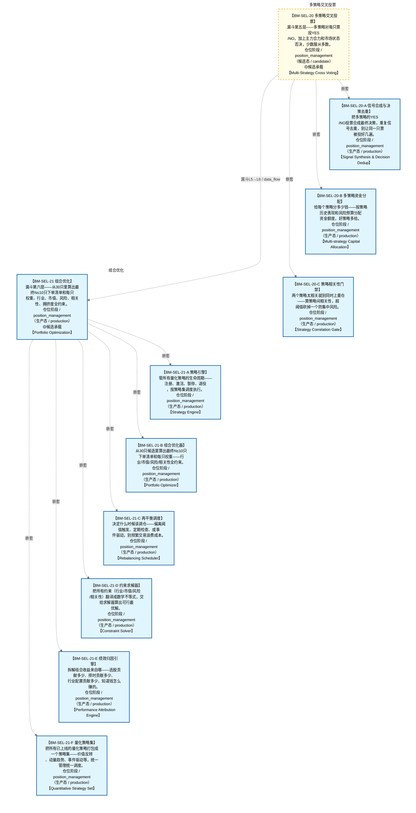
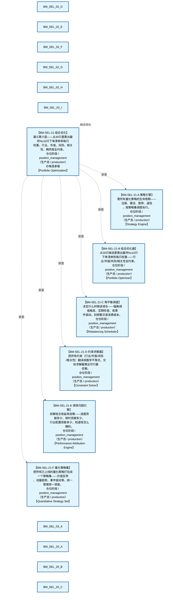

# 交易决策作战地图（总指挥图）

> **[可缩放 HTML 版 / Zoomable HTML](http://localhost:8765/docs/02_enterprise_architecture/07_trading_decision_architecture/battle_map/_zoomable_html/battle_map_panorama.html)** — Ctrl+滚轮缩放 ｜ 双击重置 ｜ Ctrl+Shift+D 切换拖动/选择模式

> 第四全景图 battle_map 真源：`battle_map_steps` / `battle_map_anchors` / `battle_map_edges` 三表 + 翻译真源 `module_translation_registry.yaml` §battle_map_steps 段。
> 本文档由 `generate_battle_map_diagram.py` 自动生成，禁止手编（改环节→改 DB/YAML 真源→重跑生成器）。

## 文档基本信息 / Document Overview

| 字段 | 值 | Field | Value |
|------|------|-------|-------|
| 环节总数 | 177 | Steps | 177 |
| 流转边 | 114 | Edges | 114 |
| 无锚点环节（BM-INV-001） | 0 | No-Anchor Steps | 0 |
| 运营态环节 | 131 | Production Steps | 131 |
| 设计态环节 | 13 | Design Steps | 13 |
| 状态分布 | 🟦 运营态（已建）=131 ｜ 🟨 候选态（候选池）=30 ｜ 🟧 设计态（待施工）=13 ｜ 🟥 弃用态=3 | State Distribution | 🟦 运营态（已建）=131 ｜ 🟨 候选态（候选池）=30 ｜ 🟧 设计态（待施工）=13 ｜ 🟥 弃用态=3 |

> **图例说明 / Legend**：
> - 🟦 **蓝色实线 = 运营态环节**（production，锚点模块已建）
> - 🟧 **橙色虚线 = 设计态环节**（design，锚点模块待施工）
> - 🟥 **红色 = 弃用态**（deprecated）
> - ⬜ **灰色 = 缺失态**（missing，环节无锚点，BM-INV-001 违例）
> - 🟨 **黄色虚线 = 候选态**（candidate，承载模块在候选池）
> - **实线箭头 ``-->`` = 运营态流转**（两端均 production）
> - **虚线箭头 ``-.->`` = 非运营态流转**（含设计/候选/混合）

## 域内依赖图 / Internal Dependency Diagram

> 依赖图内嵌在本文档中，IDE 可直接渲染；网页版可 Ctrl+滚轮缩放 + 拖动平移查看细节。

### 全景图（全部环节，颜色区分五态）

> 展示全部 177 个环节（运营态 131 + 设计态 13 + 弃用/缺失/候选 33），含跨阶段流转边。

```mermaid
%%{init: {'theme': 'base', 'themeVariables': {'primaryColor': '#eaeaea', 'primaryTextColor': '#333333', 'primaryBorderColor': '#666666', 'lineColor': '#666666', 'secondaryColor': '#eaeaea', 'tertiaryColor': '#eaeaea', 'clusterBkg': 'transparent', 'clusterBorder': 'transparent', 'fontSize': '14px'}}}%%
%% 作战地图总指挥图·全景图（第 1/4 页）
flowchart TD
    BM_BT_01["【BM-BT-01 回测引擎与撮合】<br/>把策略放到历史数据上跑一遍看表现——向量化回测快但<br/>粗，事件驱动慢但细，两种模式都支持。<br/>回测验证阶段 / backtest_validation<br/>（生产态 / production）<br/>【Backtest Engine &amp; Matching】"]
    BM_BUY_01["【BM-BUY-01 多情景对策生成】<br/>根据明天的8种走法，从策略库里挑出对应的买入对策<br/>预案。<br/>买入阶段 / buy_flow<br/>（生产态 / production）<br/>🟡候选承载<br/>【Multi-Scenario Countermeasure】"]
    BM_EXE_01["【BM-EXE-01 自适应风控审批】<br/>下单前的最后一道闸——风控审批，审不过的订单直接拦<br/>下，是订单拦截器不是事后检查。<br/>执行阶段 / execution<br/>（生产态 / production）<br/>🟡候选承载<br/>【Adaptive Risk Approval】"]
    BM_MT_01["⛔ ML训练域，设计已就绪，等待开发排期<br/>【BM-MT-01 训练流水线】<br/>把研究出的因子和特征喂给模型训练，PyTorch<br/>训完导出 ONNX，全程管 seed 和 config<br/>保证可复现。<br/>模型训练阶段 / model_training<br/>（设计态 / design）<br/>🟡候选承载<br/>【Training Pipeline】"]
    BM_POS_01["【BM-POS-01 仓位管理裁决】<br/>所有买卖决策都到这里统一算最终仓位——这是仓位决策<br/>的唯一裁决中心，谁都别想绕过。<br/>仓位阶段 / position_management<br/>（生产态 / production）<br/>🟡候选承载<br/>【Position Adjudication】"]
    subgraph sg_BM_REC_01 ["交易运营清算"]
        BM_REC_01["【BM-REC-01 交易运营清算】<br/>把成交回报拿去结算对账、算费率、处理除权除息和公<br/>司行为、监控保证金，变成运营数据。<br/>对账阶段 / reconciliation<br/>（生产态 / production）<br/>【Trade Ops &amp; Settlement】"]
        BM_REC_01_A["【BM-REC-01-A 结算对账】<br/>每日盘后把系统记录和券商结算单逐笔核对，发现差异<br/>立刻告警，是T+1对账的核心。<br/>对账阶段 / reconciliation<br/>（生产态 / production）<br/>【Settlement &amp; Reconciliation】"]
        BM_REC_01_B["【BM-REC-01-B 公司行为与费率】<br/>处理除权除息自动调持仓成本、算佣金印花税过户费、<br/>监控分红配股拆股，是运营数据准确性的保障。<br/>对账阶段 / reconciliation<br/>（生产态 / production）<br/>【Corporate Action &amp; Fee】"]
        BM_REC_01 -.->|嵌套| BM_REC_01_A
        BM_REC_01 -.->|嵌套| BM_REC_01_B
    end
    BM_RES_01["【BM-RES-01 研究数据与特征存储】<br/>研究员的数据底盘——把数据集版本化管起来、追踪血缘<br/>、打质量分；特征分在线离线两套存，保证 PIT<br/>正确不偷看未来。<br/>研究孵化阶段 / research_incubation<br/>（候选态 / candidate）<br/>🟡候选承载<br/>【Research Data &amp; Feature Store】"]
    BM_RC_01["【BM-RC-01 风控策略与限额管理】<br/>风控的'宪法'——策略<br/>CRUD+版本管理+9种限额类型+消耗追踪+预警分级+审批<br/>流。<br/>风控管控阶段 / risk_control<br/>（生产态 / production）<br/>【Risk Policy &amp; Limit Management】"]
    BM_SELL_01["【BM-SELL-01 突破成败信号】<br/>判断股价冲压力位是冲上去了还是冲不动——冲上去留着<br/>，冲不动止损，连冲3次不行强制清仓。<br/>卖出阶段 / sell_flow<br/>（生产态 / production）<br/>【Breakout Success/Failure Signal】"]
    BM_SIM_01["【BM-SIM-01 市场仿真器】<br/>造一个假市场跑策略——订单簿仿真+价格生成+微观结构<br/>模拟，看策略在'如果怎样'下会怎样。<br/>仿真验证阶段 / simulation_validation<br/>（候选态 / candidate）<br/>🟡候选承载<br/>【Market Simulator】"]
    subgraph sg_BM_SEL_01 ["数据接入与预处理"]
        BM_SEL_01["【BM-SEL-01 数据接入与预处理】<br/>把外面来的行情、新闻、另类数据收进来洗干净，按热<br/>度分层存好，供后面所有环节使用。<br/>选股阶段 / stock_selection<br/>（生产态 / production）<br/>🟡候选承载<br/>【Data Ingestion &amp; Preprocessing】"]
        BM_SEL_01_A["【BM-SEL-01-A 供应商注册与适配器】<br/>把所有数据源（miniQMT/iFind<br/>/tushare）登记成统一供应商清单，每个源配一个适配<br/>器把方言翻译成标准格式。<br/>选股阶段 / stock_selection<br/>（生产态 / production）<br/>【Provider Registry &amp; Adapter】"]
        BM_SEL_01_B["【BM-SEL-01-B 行情连接器管理】<br/>管所有行情连接的生命周期——建连、保活、断线重连、<br/>优雅关闭，别让连接漏血。<br/>选股阶段 / stock_selection<br/>（生产态 / production）<br/>【Market Data Connector Manager】"]
        BM_SEL_01_C["【BM-SEL-01-C 故障切换与Failover】<br/>主数据源挂了自动切到备用源，切换过程对下游透明，<br/>不让行情断流。<br/>选股阶段 / stock_selection<br/>（生产态 / production）<br/>【Failover &amp; Fault Tolerance】"]
        BM_SEL_01_D["【BM-SEL-01-D 自动加载与热切换】<br/>新数据源上线不用重启服务——热插拔注册即生效，老源<br/>下线平滑迁移。<br/>选股阶段 / stock_selection<br/>（生产态 / production）<br/>【Auto-loading &amp; Hot-swap】"]
        BM_SEL_01_E["【BM-SEL-01-E 原始数据缓存】<br/>收进来的原始行情先存一份缓存，后面要回放或补数时<br/>不用重新拉。<br/>选股阶段 / stock_selection<br/>（生产态 / production）<br/>【Raw Data Cache】"]
        BM_SEL_01_F["【BM-SEL-01-F 标准化行情产出】<br/>把各源方言翻译成统一标准格式（OHLCV/快照<br/>/Tick），下游不用关心数据从哪来。<br/>选股阶段 / stock_selection<br/>（生产态 / production）<br/>【Standardized Market Data Output】"]
        BM_SEL_01 -.->|嵌套| BM_SEL_01_A
        BM_SEL_01 -.->|嵌套| BM_SEL_01_B
        BM_SEL_01 -.->|嵌套| BM_SEL_01_C
        BM_SEL_01 -.->|嵌套| BM_SEL_01_D
        BM_SEL_01 -.->|嵌套| BM_SEL_01_E
        BM_SEL_01 -.->|嵌套| BM_SEL_01_F
    end
    BM_POS_06["【BM-POS-06 现金管理约束】<br/>仓位的'现金刹车'——留够保命钱（最低储备金）+机会钱<br/>（X%），T+1结算约束下算可用资金，节假日多留5-15%现<br/>金，闲置钱做逆回购生息，反馈给仓位裁决作为现金硬<br/>约束。<br/>仓位阶段 / position_management<br/>（生产态 / production）<br/>【Cash Management Constraint】"]
    BM_POS_08["【BM-POS-08 日历仓位约束】<br/>A股'风险日历'自动收紧仓位——期权交割日只许减仓不<br/>许开新，4月下旬ST股强制清零，财报发布前3天降仓位<br/>+禁新建，微盘股空窗期收紧50%，交割日前后临时下调<br/>5-10%。<br/>仓位阶段 / position_management<br/>（生产态 / production）<br/>【Calendar Position Constraint】"]
    BM_BT_02["【BM-BT-02 持仓组合与数据接入】<br/>回测里的'钱包和数据库'——管持仓现金净值曲线，把<br/>miniQMT Tick 和 ClickHouse 日线都接进来。<br/>回测验证阶段 / backtest_validation<br/>（生产态 / production）<br/>【Portfolio &amp; Data Handler】"]
    subgraph sg_BM_BUY_02 ["四轨融合"]
        BM_BUY_02["【BM-BUY-02 四轨融合】<br/>把逻辑驱动、数据驱动、人工指令、应急保命四路信号<br/>按优先级融成一条决策流——应急永远最优先。<br/>买入阶段 / buy_flow<br/>（生产态 / production）<br/>🟡候选承载<br/>【Four-Track Fusion （MTF）】"]
        BM_BUY_02_A["【BM-BUY-02-A 逻辑驱动轨】<br/>四轨融合的第一轨——基于8态预测和策略库算出的自动<br/>买入预案，是默认决策来源。<br/>买入阶段 / buy_flow<br/>（生产态 / production）<br/>🟡候选承载<br/>【Logic-Driven Track】"]
        BM_BUY_02_B["【BM-BUY-02-B 数据驱动轨】<br/>四轨融合的第二轨——AI Discovery<br/>实时从数据中发现机会，补充逻辑轨覆盖不到的信号。<br/>买入阶段 / buy_flow<br/>（生产态 / production）<br/>🟡候选承载<br/>【Data-Driven Track （AI Discovery）】"]
        BM_BUY_02_C["【BM-BUY-02-C 人工指令轨】<br/>四轨融合的第三轨——人工下达的买入指令，优先级高于<br/>自动轨（逻辑/数据），低于应急轨。<br/>买入阶段 / buy_flow<br/>（生产态 / production）<br/>🟡候选承载<br/>【Manual Override Track】"]
        BM_BUY_02_D["【BM-BUY-02-D 应急保命轨】<br/>四轨融合的第四轨——应急保命信号，优先级最高，一旦<br/>触发立即覆盖所有其他轨的决策。<br/>买入阶段 / buy_flow<br/>（生产态 / production）<br/>🟡候选承载<br/>【Emergency Protection Track】"]
        BM_BUY_02 -.->|嵌套| BM_BUY_02_A
        BM_BUY_02 -.->|嵌套| BM_BUY_02_B
        BM_BUY_02 -.->|嵌套| BM_BUY_02_C
        BM_BUY_02 -.->|嵌套| BM_BUY_02_D
    end
    BM_EXE_04["⛔ 门禁:D-RISK风控参数就绪+市场状态实时数据源<br/>（D-EX-CORE-24）<br/>【BM-EXE-04 Pre-Trade合规检查】<br/>下单前的交易所合规硬闸——涨跌停/参与率/撤单率<br/>/报单停留时间锁/Wash Trade/Spoofing<br/>全检查，Fail-Closed，不过就拦。<br/>执行阶段 / execution<br/>（设计态 / design）<br/>【Pre-Trade Compliance Gate】"]
    BM_MT_02["【BM-MT-02 实验追踪与自动晋升】<br/>A/B 实验对比新模型和老模型，统计上显著更好才自动<br/>晋升为 Champion，否则留在 Challenger 继续观察。<br/>模型训练阶段 / model_training<br/>（候选态 / candidate）<br/>🟡候选承载<br/>【Experiment Tracking &amp; Auto-Promotion】"]
    BM_POS_02["【BM-POS-02 标级仓位Kelly】<br/>每只票该买多少——用Kelly公式算理论仓位，半Kelly硬<br/>上限截断（禁止全Kelly），在风险配额内决策，再用密<br/>度PDF的偏度/峰度/前瞻VaR做分布感知调整<br/>（防御性只减不增）。<br/>仓位阶段 / position_management<br/>（生产态 / production）<br/>【Per-Symbol Kelly Sizing】"]
    subgraph sg_BM_REC_02 ["报告复盘"]
        BM_REC_02["【BM-REC-02 报告复盘】<br/>把运营数据做成复盘报告，看今天打得怎么样。<br/>对账阶段 / reconciliation<br/>（生产态 / production）<br/>【Reporting &amp; Review】"]
        BM_REC_02_A["【BM-REC-02-A TCA执行质量分析】<br/>算每笔交易的真实成本——滑点、冲击成本、市场影响，<br/>看执行得好不好。<br/>对账阶段 / reconciliation<br/>（生产态 / production）<br/>【TCA Execution Quality Analysis】"]
        BM_REC_02_B["⛔ D-EX-CORE执行报告未就绪（CTR-P1-007<br/>/CTR-ERR-005）,设计文档§1.4标注受限,暂不可建<br/>【BM-REC-02-B 绩效归因】<br/>把盈亏拆开看——赚的钱是选股选对的、还是配比配对的<br/>、还是行业轮动轮对的，找出Alpha来源。<br/>对账阶段 / reconciliation<br/>（设计态 / design）<br/>【Performance Attribution】"]
        BM_REC_02_C["【BM-REC-02-C A股交易复盘】<br/>针对A股特色做盘前信号验证、盘中异常检测、盘后归<br/>因、大额交易异动检测，生成复盘报告。<br/>对账阶段 / reconciliation<br/>（生产态 / production）<br/>【A-Share Trading Review】"]
        BM_REC_02_D["【BM-REC-02-D 报告发布】<br/>把复盘报告归档、发到微信和邮件，留好审计凭证。<br/>对账阶段 / reconciliation<br/>（生产态 / production）<br/>【Report Publishing】"]
        BM_REC_02 -.->|嵌套| BM_REC_02_A
        BM_REC_02 -.->|嵌套| BM_REC_02_B
        BM_REC_02 -.->|嵌套| BM_REC_02_C
        BM_REC_02 -.->|嵌套| BM_REC_02_D
    end
    BM_RES_02["【BM-RES-02 实验追踪与可复现性】<br/>每次实验都把超参、数据版本、代码版本、结果全部记<br/>下来，事后能一键复现，不让'我跑出来过但复现不了'<br/>发生。<br/>研究孵化阶段 / research_incubation<br/>（候选态 / candidate）<br/>🟡候选承载<br/>【Experiment Tracking &amp; Reproducibility】"]
    BM_RC_02["【BM-RC-02 盘前风控检查】<br/>下单前过五关——仓位限额→行业集中度→杠杆率→合规规<br/>则→Kill Switch 状态，任一不过就拒单。<br/>风控管控阶段 / risk_control<br/>（生产态 / production）<br/>【Pre-Trade Risk Check】"]
    BM_SELL_03["【BM-SELL-03 卖出信号收集评分】<br/>卖出端的'信号层'——先把持仓分级（Watch/Monitor<br/>/Hold），再收集7类卖出信号，多时间框架共振加权，<br/>产出卖出信号评分和紧迫度。<br/>卖出阶段 / sell_flow<br/>（生产态 / production）<br/>【Sell Signal Collection &amp; Scoring】"]
    BM_SIM_02["【BM-SIM-02 策略仿真器】<br/>把策略放进沙箱里跑——模拟信号、模拟组合，看策略在<br/>各种假设市场下的表现。<br/>仿真验证阶段 / simulation_validation<br/>（生产态 / production）<br/>🟡候选承载<br/>【Strategy Simulator】"]
    subgraph sg_BM_SEL_02 ["因子计算与信号生成"]
        BM_SEL_02["【BM-SEL-02 因子计算与信号生成】<br/>把洗干净的行情算成各种因子，再用因子工厂管起来，<br/>盘前算全量、盘中补增量。<br/>选股阶段 / stock_selection<br/>（弃用态 / deprecated）<br/>🟡候选承载<br/>【Factor Compute &amp; Signal Gen】"]
        BM_SEL_02_A["【BM-SEL-02-A 因子计算引擎】<br/>真正算因子的发动机——盘前批量算全量、盘中增量补，<br/>把行情变成可用的因子值。<br/>选股阶段 / stock_selection<br/>（弃用态 / deprecated）<br/>【Factor Compute Engine】"]
        BM_SEL_02_B["【BM-SEL-02-B 因子注册表与池管理】<br/>所有因子登记造册——名字、公式、依赖、版本都在注册<br/>表里，池子满64个自动淘汰最差的。<br/>选股阶段 / stock_selection<br/>（生产态 / production）<br/>【Factor Registry &amp; Pool Management】"]
        BM_SEL_02_C["【BM-SEL-02-C 因子管线双模调度】<br/>安排因子什么时候算——盘前一次性全算、盘中只补变化<br/>的部分，省算力又不丢新鲜度。<br/>选股阶段 / stock_selection<br/>（弃用态 / deprecated）<br/>【Factor Pipeline Dual-mode Scheduling】"]
        BM_SEL_02_D["【BM-SEL-02-D 因子评估-IC/IR体系】<br/>给每个因子打分——IC（信息系数）看预测能力，IR<br/>（信息比率）看稳定性，分高留分低砍。<br/>选股阶段 / stock_selection<br/>（生产态 / production）<br/>【Factor Evaluation - IC/IR System】"]
        BM_SEL_02_E["【BM-SEL-02-E 因子评估-相关性与语义去重】<br/>两个因子长得太像就留一个——算相关性砍冗余，再看语<br/>义描述防重复造轮子。<br/>选股阶段 / stock_selection<br/>（生产态 / production）<br/>【Factor Evaluation - Correlation &amp; Semantic<br/>Dedup】"]
        BM_SEL_02_F["【BM-SEL-02-F 因子评估-分层回测与三级判断】<br/>把股票按因子值分5层看各层收益差——分层单调才说明<br/>因子有效，三级判断定去留。<br/>选股阶段 / stock_selection<br/>（生产态 / production）<br/>【Factor Evaluation - Stratified Backtest &amp;<br/>3-tier Judgment】"]
        BM_SEL_02_G["【BM-SEL-02-G 因子衰减监控与归因】<br/>盯着因子别失效——IC<br/>持续下滑就报警，找出是市场变了还是因子本身坏了。<br/>选股阶段 / stock_selection<br/>（生产态 / production）<br/>【Factor Decay Monitoring &amp; Attribution】"]
        BM_SEL_02_H["【BM-SEL-02-H 多因子合成与优化】<br/>把好因子揉成一个综合得分——不是简单加权，是用优化<br/>方法找最优组合权重。<br/>选股阶段 / stock_selection<br/>（生产态 / production）<br/>【Multi-factor Synthesis &amp; Optimization】"]
        BM_SEL_02_I["【BM-SEL-02-I 因子治理-生命周期与门禁】<br/>管因子一辈子——从注册、评估、上线、观察到下线，每<br/>个阶段有门禁卡着，不让坏因子混进去。<br/>选股阶段 / stock_selection<br/>（生产态 / production）<br/>【Factor Governance - Lifecycle &amp; Gates】"]
        BM_SEL_02 -.->|嵌套| BM_SEL_02_A
        BM_SEL_02 -.->|嵌套| BM_SEL_02_B
        BM_SEL_02 -.->|嵌套| BM_SEL_02_C
        BM_SEL_02 -.->|嵌套| BM_SEL_02_D
        BM_SEL_02 -.->|嵌套| BM_SEL_02_E
        BM_SEL_02 -.->|嵌套| BM_SEL_02_F
        BM_SEL_02 -.->|嵌套| BM_SEL_02_G
        BM_SEL_02 -.->|嵌套| BM_SEL_02_H
        BM_SEL_02 -.->|嵌套| BM_SEL_02_I
    end
    BM_BUY_01 ~~~ BM_MT_01 ~~~ BM_REC_01 ~~~ BM_REC_01_A ~~~ BM_RES_01 ~~~ BM_RC_01 ~~~ BM_SIM_01 ~~~ BM_SEL_01 ~~~ BM_SEL_01_A ~~~ BM_SEL_01_B ~~~ BM_SEL_01_C ~~~ BM_SEL_01_D ~~~ BM_SEL_01_E ~~~ BM_SEL_01_F ~~~ BM_POS_08 ~~~ BM_BUY_02_A ~~~ BM_BUY_02_B ~~~ BM_BUY_02_C ~~~ BM_BUY_02_D ~~~ BM_REC_02_A ~~~ BM_SEL_02_A ~~~ BM_SEL_02_B ~~~ BM_SEL_02_C ~~~ BM_SEL_02_D ~~~ BM_SEL_02_E ~~~ BM_SEL_02_F ~~~ BM_SEL_02_G ~~~ BM_SEL_02_H ~~~ BM_SEL_02_I
    BM_POS_01 ~~~ BM_REC_01_B ~~~ BM_BUY_02 ~~~ BM_MT_02 ~~~ BM_REC_02 ~~~ BM_REC_02_B ~~~ BM_RES_02 ~~~ BM_RC_02 ~~~ BM_SIM_02 ~~~ BM_SEL_02
    BM_BT_01 ~~~ BM_EXE_01 ~~~ BM_SELL_01 ~~~ BM_POS_06 ~~~ BM_REC_02_C
    BM_BT_02 ~~~ BM_EXE_04 ~~~ BM_POS_02 ~~~ BM_REC_02_D ~~~ BM_SELL_03
    BM_SEL_01 -.->|标准化行情 / data_flow| BM_SEL_02
    BM_SEL_02 -.->|压力位因子 / data_flow| BM_SELL_01
    BM_BUY_01 -->|买入预案 / data_flow| BM_BUY_02
    BM_POS_01 -->|仓位指令 / data_flow| BM_EXE_01
    BM_REC_01 -->|运营数据 / data_flow| BM_REC_02
    BM_SELL_01 -->|突破成败信号→收集评分 / data_flow| BM_SELL_03
    BM_POS_01 -->|风险配额→标级Kelly / data_flow| BM_POS_02
    BM_POS_01 -->|风险配额→现金约束 / data_flow| BM_POS_06
    BM_POS_06 -->|现金约束→标级Kelly / data_flow| BM_POS_02
    BM_POS_08 -->|日历约束→仓位裁决上限 / trigger| BM_POS_01
    BM_REC_01_A -->|结算对账后处理公司行为与费率 / data_flow| BM_REC_01_B
    BM_REC_02_A -.->|TCA执行成本→归因输入 / data_flow| BM_REC_02_B
    BM_REC_02_B -.->|归因结果→复盘素材 / data_flow| BM_REC_02_C
    BM_REC_02_C -->|复盘报告→发布 / data_flow| BM_REC_02_D
    BM_EXE_01 -.->|审批后订单→合规检查 / data_flow| BM_EXE_04
    BM_RES_01 -.->|研究数据→实验追踪 / data_flow| BM_RES_02
    BM_MT_01 -.->|训练→实验晋升 / data_flow| BM_MT_02
    BM_BT_01 -->|引擎→持仓数据 / data_flow| BM_BT_02
    BM_SIM_01 -.->|市场仿真→策略仿真 / data_flow| BM_SIM_02
    BM_RC_01 -->|策略→盘前检查 / data_flow| BM_RC_02
    BM_MT_02 -.->|模型晋升→回测 / data_flow| BM_BT_01
    BM_RC_02 -->|风控通过→执行 / trigger| BM_EXE_01
classDef production fill:#e1f5fe,stroke:#01579b,stroke-width:2px,color:#000
classDef design fill:#fff3e0,stroke:#e65100,stroke-width:2px,color:#000,stroke-dasharray: 5 5
classDef deprecated fill:#ffebee,stroke:#c62828,stroke-width:2px,color:#000
classDef missing fill:#eeeeee,stroke:#9e9e9e,stroke-width:2px,color:#000
classDef candidate fill:#fffde7,stroke:#f9a825,stroke-width:2px,color:#000,stroke-dasharray: 5 5
    class BM_BT_01,BM_BUY_01,BM_EXE_01,BM_POS_01,BM_REC_01,BM_REC_01_A,BM_REC_01_B,BM_RC_01,BM_SELL_01,BM_SEL_01,BM_SEL_01_A,BM_SEL_01_B,BM_SEL_01_C,BM_SEL_01_D,BM_SEL_01_E,BM_SEL_01_F,BM_POS_06,BM_POS_08,BM_BT_02,BM_BUY_02,BM_BUY_02_A,BM_BUY_02_B,BM_BUY_02_C,BM_BUY_02_D,BM_POS_02,BM_REC_02,BM_REC_02_A,BM_REC_02_C,BM_REC_02_D,BM_RC_02,BM_SELL_03,BM_SIM_02,BM_SEL_02_B,BM_SEL_02_D,BM_SEL_02_E,BM_SEL_02_F,BM_SEL_02_G,BM_SEL_02_H,BM_SEL_02_I production
    class BM_MT_01,BM_EXE_04,BM_REC_02_B design
    class BM_SEL_02,BM_SEL_02_A,BM_SEL_02_C deprecated
    class BM_RES_01,BM_SIM_01,BM_MT_02,BM_RES_02 candidate
```

```mermaid
%%{init: {'theme': 'base', 'themeVariables': {'primaryColor': '#eaeaea', 'primaryTextColor': '#333333', 'primaryBorderColor': '#666666', 'lineColor': '#666666', 'secondaryColor': '#eaeaea', 'tertiaryColor': '#eaeaea', 'clusterBkg': 'transparent', 'clusterBorder': 'transparent', 'fontSize': '14px'}}}%%
%% 作战地图总指挥图·全景图（第 2/4 页）
flowchart TD
    subgraph sg_BM_SEL_22 ["短线选股评分卡"]
        BM_SEL_22["【BM-SEL-22 短线选股评分卡】<br/>给短线标的打分——7个维度100分制评分（连板高度<br/>/封单强度/板块效应/分歧程度/市值流动性/封板时间<br/>/催化强度），再识别强庄股，专门服务短线和打板选<br/>股。<br/>选股阶段 / stock_selection<br/>（生产态 / production）<br/>【Short-Term Stock Selection Scorecard】"]
        BM_SEL_22_A["【BM-SEL-22-A 机构选股评分器】<br/>从机构视角给股票打分——目标价空间40%+基本面30%+技<br/>术趋势20%+流动性10%，机构看好的票加分。<br/>选股阶段 / stock_selection<br/>（生产态 / production）<br/>【Institutional Stock Scorer】"]
        BM_SEL_22_B["【BM-SEL-22-B 强庄股识别器】<br/>识别有没有强庄——看走势独立性、换手率异常、盘口神<br/>秘大单，三个特征同时出现大概率有庄。<br/>选股阶段 / stock_selection<br/>（生产态 / production）<br/>【Strong Dealer Detector】"]
        subgraph sg_BM_SEL_22_C ["连板潜力评分卡"]
            BM_SEL_22_C["【BM-SEL-22-C 连板潜力评分卡】<br/>给打板标的打分——7个维度100分制（连板高度<br/>/封单强度/板块效应/分歧程度/市值流动性/封板时间<br/>/催化强度），分高大概率连板。<br/>选股阶段 / stock_selection<br/>（生产态 / production）<br/>【Limit-up Potential Scorecard】"]
            BM_SEL_22_C_1["【BM-SEL-22-C-1 连板高度维度】<br/>—<br/>选股阶段 / stock_selection<br/>（生产态 / production）"]
            BM_SEL_22_C_2["【BM-SEL-22-C-2 封单强度维度】<br/>—<br/>选股阶段 / stock_selection<br/>（生产态 / production）"]
            BM_SEL_22_C_3["【BM-SEL-22-C-3 板块效应维度】<br/>—<br/>选股阶段 / stock_selection<br/>（生产态 / production）"]
            BM_SEL_22_C_4["【BM-SEL-22-C-4 分歧程度维度】<br/>—<br/>选股阶段 / stock_selection<br/>（生产态 / production）"]
            BM_SEL_22_C_5["【BM-SEL-22-C-5 市值流动性维度】<br/>—<br/>选股阶段 / stock_selection<br/>（生产态 / production）"]
            BM_SEL_22_C_6["【BM-SEL-22-C-6 封板时间维度】<br/>—<br/>选股阶段 / stock_selection<br/>（生产态 / production）"]
            BM_SEL_22_C_7["【BM-SEL-22-C-7 催化强度维度】<br/>—<br/>选股阶段 / stock_selection<br/>（生产态 / production）"]
            BM_SEL_22_C -.->|嵌套| BM_SEL_22_C_1
            BM_SEL_22_C -.->|嵌套| BM_SEL_22_C_2
            BM_SEL_22_C -.->|嵌套| BM_SEL_22_C_3
            BM_SEL_22_C -.->|嵌套| BM_SEL_22_C_4
            BM_SEL_22_C -.->|嵌套| BM_SEL_22_C_5
            BM_SEL_22_C -.->|嵌套| BM_SEL_22_C_6
            BM_SEL_22_C -.->|嵌套| BM_SEL_22_C_7
        end
        BM_SEL_22_D["【BM-SEL-22-D 连板分歧程度评估器】<br/>判断连板能不能继续——分歧越大越危险，一致性越高越<br/>可能继续涨。<br/>选股阶段 / stock_selection<br/>（生产态 / production）<br/>【Limit-up Divergence Assessor】"]
        BM_SEL_22 -.->|嵌套| BM_SEL_22_A
        BM_SEL_22 -.->|嵌套| BM_SEL_22_B
        BM_SEL_22 -.->|嵌套| BM_SEL_22_C
        BM_SEL_22 -.->|嵌套| BM_SEL_22_D
    end
    subgraph sg_BM_SEL_23 ["游资接力情绪周期"]
        BM_SEL_23["【BM-SEL-23 游资接力情绪周期】<br/>测游资接力情绪——6个因子打0-100分（连板高度<br/>/封单质量/涨停时间/开板次数/竞价强度<br/>/助攻梯队），再定位情绪周期4+1阶段（冰点/反核<br/>/主升/疯狂/退潮），不同阶段用不同策略。<br/>选股阶段 / stock_selection<br/>（生产态 / production）<br/>【Youzi Relay Emotion Cycle】"]
        subgraph sg_BM_SEL_23_A ["6因子游资接力评分"]
            BM_SEL_23_A["【BM-SEL-23-A 6因子游资接力评分】<br/>用6个因子给游资接力打0-100分——连板高度25分+封单<br/>质量20分+涨停时间15分+开板次数15分+竞价强度10分+<br/>助攻梯队10分。<br/>选股阶段 / stock_selection<br/>（生产态 / production）<br/>【6-factor Hot Money Relay Score】"]
            BM_SEL_23_A_1["【BM-SEL-23-A-1 连板高度因子】<br/>—<br/>选股阶段 / stock_selection<br/>（生产态 / production）"]
            BM_SEL_23_A_2["【BM-SEL-23-A-2 封单质量因子】<br/>—<br/>选股阶段 / stock_selection<br/>（生产态 / production）"]
            BM_SEL_23_A_3["【BM-SEL-23-A-3 涨停时间因子】<br/>—<br/>选股阶段 / stock_selection<br/>（生产态 / production）"]
            BM_SEL_23_A_4["【BM-SEL-23-A-4 开板次数因子】<br/>—<br/>选股阶段 / stock_selection<br/>（生产态 / production）"]
            BM_SEL_23_A_5["【BM-SEL-23-A-5 竞价强度因子】<br/>—<br/>选股阶段 / stock_selection<br/>（生产态 / production）"]
            BM_SEL_23_A_6["【BM-SEL-23-A-6 助攻梯队因子】<br/>—<br/>选股阶段 / stock_selection<br/>（生产态 / production）"]
            BM_SEL_23_A -.->|嵌套| BM_SEL_23_A_1
            BM_SEL_23_A -.->|嵌套| BM_SEL_23_A_2
            BM_SEL_23_A -.->|嵌套| BM_SEL_23_A_3
            BM_SEL_23_A -.->|嵌套| BM_SEL_23_A_4
            BM_SEL_23_A -.->|嵌套| BM_SEL_23_A_5
            BM_SEL_23_A -.->|嵌套| BM_SEL_23_A_6
        end
        BM_SEL_23_B["【BM-SEL-23-B 情绪周期4+1阶段定位】<br/>判断当前情绪在哪个阶段——冰点/反核/主升/疯狂<br/>/退潮，不同阶段策略完全不同。<br/>选股阶段 / stock_selection<br/>（生产态 / production）<br/>【Sentiment Cycle 4+1 Phase Locator】"]
        BM_SEL_23_C["【BM-SEL-23-C 情绪周期策略映射】<br/>不同情绪阶段用不同策略——冰点保守低吸、主升追龙头<br/>、退潮止损，把阶段映射到具体操作。<br/>选股阶段 / stock_selection<br/>（生产态 / production）<br/>【Sentiment Cycle Strategy Mapping】"]
        BM_SEL_23 -.->|嵌套| BM_SEL_23_A
        BM_SEL_23 -.->|嵌套| BM_SEL_23_B
        BM_SEL_23 -.->|嵌套| BM_SEL_23_C
    end
    subgraph sg_BM_SEL_24 ["量化短线强度评级"]
        BM_SEL_24["【BM-SEL-24 量化短线强度评级】<br/>量化角度评短线强度——6个维度打0-100分（价格动量<br/>/行业强度/相对强度/资金/技术<br/>/风险），评出A到E五级，作为双引擎融合的量化引擎<br/>输入。<br/>选股阶段 / stock_selection<br/>（生产态 / production）<br/>【Quant Short-Term Strength Rating】"]
        subgraph sg_BM_SEL_24_A ["6维度量化强度评分"]
            BM_SEL_24_A["【BM-SEL-24-A 6维度量化强度评分】<br/>用6个维度给短线强度打0-100分——价格动量/行业强度<br/>/相对强度/资金/技术/风险，全面量化评估。<br/>选股阶段 / stock_selection<br/>（生产态 / production）<br/>【6-dimension Quant Strength Score】"]
            BM_SEL_24_A_1["【BM-SEL-24-A-1 价格动量Z-score维度】<br/>—<br/>选股阶段 / stock_selection<br/>（生产态 / production）"]
            BM_SEL_24_A_2["【BM-SEL-24-A-2 行业强度维度】<br/>—<br/>选股阶段 / stock_selection<br/>（生产态 / production）"]
            BM_SEL_24_A_3["【BM-SEL-24-A-3 相对强度维度】<br/>—<br/>选股阶段 / stock_selection<br/>（生产态 / production）"]
            BM_SEL_24_A_4["【BM-SEL-24-A-4 资金维度】<br/>—<br/>选股阶段 / stock_selection<br/>（生产态 / production）"]
            BM_SEL_24_A_5["【BM-SEL-24-A-5 技术维度】<br/>—<br/>选股阶段 / stock_selection<br/>（生产态 / production）"]
            BM_SEL_24_A_6["【BM-SEL-24-A-6 风险维度】<br/>—<br/>选股阶段 / stock_selection<br/>（生产态 / production）"]
            BM_SEL_24_A -.->|嵌套| BM_SEL_24_A_1
            BM_SEL_24_A -.->|嵌套| BM_SEL_24_A_2
            BM_SEL_24_A -.->|嵌套| BM_SEL_24_A_3
            BM_SEL_24_A -.->|嵌套| BM_SEL_24_A_4
            BM_SEL_24_A -.->|嵌套| BM_SEL_24_A_5
            BM_SEL_24_A -.->|嵌套| BM_SEL_24_A_6
        end
        BM_SEL_24_B["【BM-SEL-24-B A~E五级评级】<br/>把0-100分转成A到E五个等级——A级最强直接追，E级最<br/>弱直接弃，简单直观。<br/>选股阶段 / stock_selection<br/>（生产态 / production）<br/>【A~E Five-tier Rating】"]
        BM_SEL_24_C["【BM-SEL-24-C 双引擎基准权重配置】<br/>设定游资和量化的基准权重——默认游资60%+量化40%，<br/>这是融合的起点，后面情绪周期还会动态调。<br/>选股阶段 / stock_selection<br/>（生产态 / production）<br/>【Dual-engine Baseline Weight Config】"]
        BM_SEL_24 -.->|嵌套| BM_SEL_24_A
        BM_SEL_24 -.->|嵌套| BM_SEL_24_B
        BM_SEL_24 -.->|嵌套| BM_SEL_24_C
    end
    BM_SELL_07["⛔ 卖出决策域，设计已就绪，等待开发排期<br/>【BM-SELL-07 卖出情景预案】<br/>盘前预计算卖出预案——暴跌分级退出/板块联动<br/>/黑天鹅应急/涨跌停排队/异常开盘<br/>/Gap开盘决策，盘中触发时直接执行预案而非实时计算<br/>，对标Citadel PM式预案卖出。<br/>卖出阶段 / sell_flow<br/>（设计态 / design）<br/>【Exit Scenario Planner】"]
    subgraph sg_BM_SEL_25 ["双引擎融合决策"]
        BM_SEL_25["【BM-SEL-25 双引擎融合决策】<br/>把游资情绪引擎和量化强度引擎的信号融合起来——基准<br/>是游资60%+量化40%，但情绪周期会自动调权重<br/>（冰点时量化占70%，主升时游资占70%），输出6类决<br/>策（主升龙头/二进三/跟风/复苏/伪强/地天反包）。<br/>选股阶段 / stock_selection<br/>（生产态 / production）<br/>【Dual-Engine Fusion Decision】"]
        BM_SEL_25_A["【BM-SEL-25-A 双引擎信号融合】<br/>把游资引擎和量化引擎的信号按权重揉在一起——不是简<br/>单平均，是加权融合产出综合决策信号。<br/>选股阶段 / stock_selection<br/>（生产态 / production）<br/>【Dual-engine Signal Fusion】"]
        BM_SEL_25_B["【BM-SEL-25-B 情绪周期自适应权重】<br/>根据情绪周期自动调权重——冰点时量化占70%<br/>（保守），主升时游资占70%<br/>（激进），退潮时量化占60%（防守）。<br/>选股阶段 / stock_selection<br/>（生产态 / production）<br/>【Sentiment Cycle Adaptive Weight】"]
        subgraph sg_BM_SEL_25_C ["6类决策输出"]
            BM_SEL_25_C["【BM-SEL-25-C 6类决策输出】<br/>把融合信号分成6类决策——主升龙头/二进三/跟风<br/>/复苏/伪强/地天反包，每类对应不同操作。<br/>选股阶段 / stock_selection<br/>（生产态 / production）<br/>【6-type Decision Output】"]
            BM_SEL_25_C_1["【BM-SEL-25-C-1 主升龙头决策类】<br/>—<br/>选股阶段 / stock_selection<br/>（生产态 / production）"]
            BM_SEL_25_C_2["【BM-SEL-25-C-2 二进三决策类】<br/>—<br/>选股阶段 / stock_selection<br/>（生产态 / production）"]
            BM_SEL_25_C_3["【BM-SEL-25-C-3 跟风决策类】<br/>—<br/>选股阶段 / stock_selection<br/>（生产态 / production）"]
            BM_SEL_25_C_4["【BM-SEL-25-C-4 复苏决策类】<br/>—<br/>选股阶段 / stock_selection<br/>（生产态 / production）"]
            BM_SEL_25_C_5["【BM-SEL-25-C-5 伪强决策类】<br/>—<br/>选股阶段 / stock_selection<br/>（生产态 / production）"]
            BM_SEL_25_C_6["【BM-SEL-25-C-6 地天反包决策类】<br/>—<br/>选股阶段 / stock_selection<br/>（生产态 / production）"]
            BM_SEL_25_C -.->|嵌套| BM_SEL_25_C_1
            BM_SEL_25_C -.->|嵌套| BM_SEL_25_C_2
            BM_SEL_25_C -.->|嵌套| BM_SEL_25_C_3
            BM_SEL_25_C -.->|嵌套| BM_SEL_25_C_4
            BM_SEL_25_C -.->|嵌套| BM_SEL_25_C_5
            BM_SEL_25_C -.->|嵌套| BM_SEL_25_C_6
        end
        BM_SEL_25_D["【BM-SEL-25-D PDF分布信号提取】<br/>从决策信号中提取概率分布——方向、置信度、尾部风险<br/>、相对价值，不只给结论还给不确定性。<br/>选股阶段 / stock_selection<br/>（生产态 / production）<br/>【PDF Distribution Signal Extraction】"]
        BM_SEL_25 -.->|嵌套| BM_SEL_25_A
        BM_SEL_25 -.->|嵌套| BM_SEL_25_B
        BM_SEL_25 -.->|嵌套| BM_SEL_25_C
        BM_SEL_25 -.->|嵌套| BM_SEL_25_D
    end
    BM_BT_03["【BM-BT-03 绩效指标与Tick回放】<br/>算 Sharpe/Sortino/最大回撤/IC/IR<br/>/胜率这些硬指标；还能把历史 Tick<br/>逐笔回放做秒级策略验证。<br/>回测验证阶段 / backtest_validation<br/>（生产态 / production）<br/>【Metrics &amp; Tick Replay】"]
    BM_BUY_03["【BM-BUY-03 决策编排】<br/>把融合后的决策按5条路径（买/卖/做T/人工<br/>/应急）统一出口编排，处理冲突、去重、排时序。<br/>买入阶段 / buy_flow<br/>（生产态 / production）<br/>【Decision Orchestration （DO）】"]
    BM_EXE_05["⛔ 门禁:TCA<br/>（D-EX-CORE-12）就绪+订单簿深度数据可获取<br/>（D-EX-CORE-14）<br/>【BM-EXE-05 智能订单路由与拆单】<br/>大单拆小单+选最优算法+控参与率——Almgren-Chriss<br/>算最优执行轨迹，TWAP/VWAP/POV/IS<br/>拆单，参与率&lt;15%分钟成交量，挑开盘<br/>/尾盘窗口，流动性不足就暂停。<br/>执行阶段 / execution<br/>（设计态 / design）<br/>【Smart Order Routing &amp; Splitting】"]
    BM_MT_03["【BM-MT-03 AutoML与超参优化】<br/>不靠人手调参——贝叶斯优化自动找最佳超参，早停省时<br/>间，还能自动挖因子。<br/>模型训练阶段 / model_training<br/>（候选态 / candidate）<br/>🟡候选承载<br/>【AutoML &amp; Hyperparameter Optimization】"]
    BM_POS_03["【BM-POS-03 持仓状态机漂移】<br/>每只票有自己的状态<br/>（NONE→BUILDING→ACTIVE→OBSERVING→REDUCING→EXITING<br/>→CLOSED），权重漂移超±2%（组合）/±3%<br/>（单标的）就触发再平衡评估，观察期内禁止新买入。<br/>仓位阶段 / position_management<br/>（生产态 / production）<br/>【Position State Machine &amp; Drift】"]
    subgraph sg_BM_REC_03 ["闭环优化反馈"]
        BM_REC_03["【BM-REC-03 闭环优化反馈】<br/>复盘完把教训反馈回每一层——因子衰减就换、信号不准<br/>就退、模型漂移就重训，形成正向闭环。<br/>对账阶段 / reconciliation<br/>（生产态 / production）<br/>🟡候选承载<br/>【Closed-Loop Optimization Feedback】"]
        BM_REC_03_A["【BM-REC-03-A 因子层反馈】<br/>看因子还灵不灵——IC衰减了就换因子，算半衰期，保证<br/>因子池新鲜。<br/>对账阶段 / reconciliation<br/>（生产态 / production）<br/>【Factor-Layer Feedback】"]
        BM_REC_03_B["【BM-REC-03-B 信号层反馈】<br/>看信号准不准——准确率持续下降就退役信号，避免用失<br/>效信号下单。<br/>对账阶段 / reconciliation<br/>（生产态 / production）<br/>🟡候选承载<br/>【Signal-Layer Feedback】"]
        BM_REC_03_C["【BM-REC-03-C 模型层反馈】<br/>看模型飘没飘——检测到漂移就重训练，防止模型用旧数<br/>据预测新市场。<br/>对账阶段 / reconciliation<br/>（生产态 / production）<br/>🟡候选承载<br/>【Model-Layer Feedback】"]
        BM_REC_03 -.->|嵌套| BM_REC_03_A
        BM_REC_03 -.->|嵌套| BM_REC_03_B
        BM_REC_03 -.->|嵌套| BM_REC_03_C
    end
    BM_RES_03["【BM-RES-03 假设管理与研究发现沉淀】<br/>研究不是瞎试——每个想法写成假设挂证据，验证后接受<br/>/拒绝都留痕；好的发现沉淀成知识库，不让经验流失<br/>。<br/>研究孵化阶段 / research_incubation<br/>（候选态 / candidate）<br/>🟡候选承载<br/>【Hypothesis Management &amp; Finding Distillation】"]
    BM_RC_03["【BM-RC-03 Kill Switch熔断】<br/>系统的'急停按钮'——回撤超 Emergency<br/>/VaR超限且无法减仓<br/>/Owner手动，任一触发即熔断，冷却 30 分钟。<br/>风控管控阶段 / risk_control<br/>（候选态 / candidate）<br/>🟡候选承载<br/>【Kill Switch Circuit Breaker】"]
    BM_SELL_04["⛔ 卖出决策域，设计已就绪，等待开发排期<br/>【BM-SELL-04 止盈止损族】<br/>卖出端的'策略工厂'——根据策略类型用不同的止盈止损<br/>范式（趋势宽止损/均值回归中止损/套利无止损<br/>/高频紧止损/Carry宽止损），叠加猎杀防护和期权定价<br/>评估。<br/>卖出阶段 / sell_flow<br/>（设计态 / design）<br/>【Take-Profit &amp; Stop-Loss Strategy Family】"]
    BM_SIM_03["【BM-SIM-03 场景生成与蒙特卡洛】<br/>蒙特卡洛跑百万条路径找策略边界——还能自定义极端场<br/>景，看策略在最坏情况下能不能活。<br/>仿真验证阶段 / simulation_validation<br/>（生产态 / production）<br/>🟡候选承载<br/>【Scenario Generation &amp; Monte Carlo】"]
    subgraph sg_BM_SEL_03 ["市场状态感知"]
        BM_SEL_03["【BM-SEL-03 市场状态感知】<br/>判断现在市场是什么脾气——趋势/波动<br/>/量能三维打分，再叠加体制转换检测。<br/>选股阶段 / stock_selection<br/>（设计态 / design）<br/>🟡候选承载<br/>【Market State Sensing】"]
        BM_SEL_03_A["【BM-SEL-03-A 市场情绪分析】<br/>量化市场的恐惧贪婪程度——用涨跌家数、换手率、连板<br/>高度等指标合成情绪温度计。<br/>选股阶段 / stock_selection<br/>（生产态 / production）<br/>【Market Sentiment Analysis】"]
        BM_SEL_03_B["【BM-SEL-03-B 市场状态传感器】<br/>综合趋势/波动/量能<br/>/情绪给出市场当前状态的最终判定——是什么市、什么<br/>阶段。<br/>选股阶段 / stock_selection<br/>（设计态 / design）<br/>【Market State Sensor】"]
        BM_SEL_03 -.->|嵌套| BM_SEL_03_A
        BM_SEL_03 -.->|嵌套| BM_SEL_03_B
    end
    BM_SEL_22 ~~~ BM_SEL_22_A ~~~ BM_SEL_22_B ~~~ BM_SEL_22_C ~~~ BM_SEL_22_C_1 ~~~ BM_SEL_22_C_2 ~~~ BM_SEL_22_C_3 ~~~ BM_SEL_22_C_4 ~~~ BM_SEL_22_C_5 ~~~ BM_SEL_22_C_6 ~~~ BM_SEL_22_C_7 ~~~ BM_SEL_22_D ~~~ BM_SEL_23 ~~~ BM_SEL_23_A ~~~ BM_SEL_23_A_1 ~~~ BM_SEL_23_A_2 ~~~ BM_SEL_23_A_3 ~~~ BM_SEL_23_A_4 ~~~ BM_SEL_23_A_5 ~~~ BM_SEL_23_A_6 ~~~ BM_SEL_23_B ~~~ BM_SEL_23_C ~~~ BM_SEL_24 ~~~ BM_SEL_24_A ~~~ BM_SEL_24_A_1 ~~~ BM_SEL_24_A_2 ~~~ BM_SEL_24_A_3 ~~~ BM_SEL_24_A_4 ~~~ BM_SEL_24_A_5 ~~~ BM_SEL_24_A_6 ~~~ BM_SEL_24_B ~~~ BM_SEL_24_C ~~~ BM_SELL_07 ~~~ BM_SEL_25_A ~~~ BM_SEL_25_B ~~~ BM_SEL_25_C ~~~ BM_SEL_25_C_1 ~~~ BM_SEL_25_C_2 ~~~ BM_SEL_25_C_3 ~~~ BM_SEL_25_C_4 ~~~ BM_SEL_25_C_5 ~~~ BM_SEL_25_C_6 ~~~ BM_SEL_25_D ~~~ BM_BT_03 ~~~ BM_BUY_03 ~~~ BM_EXE_05 ~~~ BM_MT_03 ~~~ BM_POS_03 ~~~ BM_REC_03 ~~~ BM_REC_03_A ~~~ BM_RES_03 ~~~ BM_RC_03 ~~~ BM_SELL_04 ~~~ BM_SIM_03 ~~~ BM_SEL_03 ~~~ BM_SEL_03_A ~~~ BM_SEL_03_B
    BM_SEL_25 ~~~ BM_REC_03_B
    BM_SEL_22 -->|短线选股评分→双引擎融合 / data_flow| BM_SEL_25
    BM_SEL_23 -->|游资情绪→双引擎融合 / data_flow| BM_SEL_25
    BM_SEL_24 -->|量化强度→双引擎融合 / data_flow| BM_SEL_25
    BM_REC_03_A -->|因子反馈→信号反馈 / data_flow| BM_REC_03_B
    BM_REC_03_B -->|信号反馈→模型反馈 / data_flow| BM_REC_03_C
classDef production fill:#e1f5fe,stroke:#01579b,stroke-width:2px,color:#000
classDef design fill:#fff3e0,stroke:#e65100,stroke-width:2px,color:#000,stroke-dasharray: 5 5
classDef deprecated fill:#ffebee,stroke:#c62828,stroke-width:2px,color:#000
classDef missing fill:#eeeeee,stroke:#9e9e9e,stroke-width:2px,color:#000
classDef candidate fill:#fffde7,stroke:#f9a825,stroke-width:2px,color:#000,stroke-dasharray: 5 5
    class BM_SEL_22,BM_SEL_22_A,BM_SEL_22_B,BM_SEL_22_C,BM_SEL_22_C_1,BM_SEL_22_C_2,BM_SEL_22_C_3,BM_SEL_22_C_4,BM_SEL_22_C_5,BM_SEL_22_C_6,BM_SEL_22_C_7,BM_SEL_22_D,BM_SEL_23,BM_SEL_23_A,BM_SEL_23_A_1,BM_SEL_23_A_2,BM_SEL_23_A_3,BM_SEL_23_A_4,BM_SEL_23_A_5,BM_SEL_23_A_6,BM_SEL_23_B,BM_SEL_23_C,BM_SEL_24,BM_SEL_24_A,BM_SEL_24_A_1,BM_SEL_24_A_2,BM_SEL_24_A_3,BM_SEL_24_A_4,BM_SEL_24_A_5,BM_SEL_24_A_6,BM_SEL_24_B,BM_SEL_24_C,BM_SEL_25,BM_SEL_25_A,BM_SEL_25_B,BM_SEL_25_C,BM_SEL_25_C_1,BM_SEL_25_C_2,BM_SEL_25_C_3,BM_SEL_25_C_4,BM_SEL_25_C_5,BM_SEL_25_C_6,BM_SEL_25_D,BM_BT_03,BM_BUY_03,BM_POS_03,BM_REC_03,BM_REC_03_A,BM_REC_03_B,BM_REC_03_C,BM_SIM_03,BM_SEL_03_A production
    class BM_SELL_07,BM_EXE_05,BM_SELL_04,BM_SEL_03,BM_SEL_03_B design
    class BM_MT_03,BM_RES_03,BM_RC_03 candidate
```

```mermaid
%%{init: {'theme': 'base', 'themeVariables': {'primaryColor': '#eaeaea', 'primaryTextColor': '#333333', 'primaryBorderColor': '#666666', 'lineColor': '#666666', 'secondaryColor': '#eaeaea', 'tertiaryColor': '#eaeaea', 'clusterBkg': 'transparent', 'clusterBorder': 'transparent', 'fontSize': '14px'}}}%%
%% 作战地图总指挥图·全景图（第 3/4 页）
flowchart TD
    BM_POS_07["【BM-POS-07 再平衡执行】<br/>漂移超阈值后算'划不划得来'——预期收益改善&gt;2×交易<br/>成本才动手，阴跌/加速下跌<br/>/恐慌崩盘时成本×1.5更谨慎，再平衡后组合仓位偏差&lt;<br/>1%才算到位，周频强制+偏离+事件三类触发。<br/>仓位阶段 / position_management<br/>（生产态 / production）<br/>【Rebalance Execution】"]
    BM_POS_09["【BM-POS-09 卖出仓位反馈链路】<br/>仓位和卖出'双向通话'——盈利时放宽卖出阈值、亏损时<br/>收紧；买入后即时验证（5min跌破1%放量→观察<br/>/15min破分时均线→减半<br/>/30min反向2ATR→止损），把仓位状态反馈给卖出决策。<br/>仓位阶段 / position_management<br/>（生产态 / production）<br/>【Sell-Position Bidirectional Link】"]
    BM_BT_04["【BM-BT-04 PIT铁律管理】<br/>回测绝不能偷看未来——PIT 铁律管 AS OF JOIN 和<br/>Embargo 期，保证当时只能用当时已知的数据。<br/>回测验证阶段 / backtest_validation<br/>（生产态 / production）<br/>【Point-in-Time Integrity】"]
    BM_BUY_04["【BM-BUY-04 分批建仓】<br/>不是一次买够，而是分几批买，每批都要重新确认条件<br/>还成立，跌破关键位置就停手。<br/>买入阶段 / buy_flow<br/>（设计态 / design）<br/>【Batched Position Building】"]
    BM_EXE_02["【BM-EXE-02 交易执行】<br/>审过的订单真正发出去下单，拿回成交回报和盈亏数据<br/>。<br/>执行阶段 / execution<br/>（生产态 / production）<br/>🟡候选承载<br/>【Trade Execution】"]
    BM_MT_04["【BM-MT-04 因子发现与因果发现】<br/>不只找相关性强的因子，还要找因果关系——用 PC/GES<br/>/LiNGAM 算因果图，避免'假相关'误导。<br/>模型训练阶段 / model_training<br/>（候选态 / candidate）<br/>🟡候选承载<br/>【Factor Discovery &amp; Causal Discovery】"]
    BM_POS_04["【BM-POS-04 跨策略仓位硬限制】<br/>多策略同标的仓位合并取sum不超上限，新策略上线仓<br/>位砍到正常的30%，行业偏离<br/>/风格暴露有硬约束，C-047是仓位裁决唯一中心<br/>（只有C-004风控veto能绕过）。<br/>仓位阶段 / position_management<br/>（生产态 / production）<br/>【Cross-Strategy Position Hard Limit】"]
    BM_REC_04["【BM-REC-04 保证金管理】<br/>监控融资融券保证金比例——低于预警线告警、需要追加<br/>时提醒用户；融资融券API不可用时自动休眠，不影响<br/>其他运营功能。<br/>对账阶段 / reconciliation<br/>（生产态 / production）<br/>【Margin Manager】"]
    BM_RES_04["【BM-RES-04 研究工作流编排】<br/>把研究步骤串成 DAG<br/>自动跑——数据准备→特征计算→训练→评估，依赖管好、<br/>失败重试、并行加速。<br/>研究孵化阶段 / research_incubation<br/>（候选态 / candidate）<br/>🟡候选承载<br/>【Research Workflow Orchestration】"]
    BM_RC_04["【BM-RC-04 盘中持仓风控监控】<br/>盘中盯着持仓——实时算<br/>VaR、回撤、因子暴露、相关性矩阵，超阈值就告警。<br/>风控管控阶段 / risk_control<br/>（生产态 / production）<br/>【Real-Time Portfolio Risk Monitoring】"]
    BM_SELL_05["【BM-SELL-05 置换再平衡卖出】<br/>机会成本驱动+权重偏离驱动的被动卖出——候选池有更<br/>优标的就卖A买B，权重偏离超阈值或周五强制再平衡就<br/>调整，用倒金字塔分批退出。<br/>卖出阶段 / sell_flow<br/>（生产态 / production）<br/>【Replacement &amp; Rebalance Sell】"]
    BM_SIM_04["【BM-SIM-04 压力测试引擎】<br/>把 2008/2015/2020<br/>这些极端行情重放一遍，再加假设情景和反向压力测试<br/>，看策略会不会爆。<br/>仿真验证阶段 / simulation_validation<br/>（生产态 / production）<br/>🟡候选承载<br/>【Stress Test Engine】"]
    BM_SEL_04["【BM-SEL-04 次日8态走势预测】<br/>预测明天大盘和个股会走成哪种样子，8<br/>种走势各占多少概率——A股T+1制度下这是核心决策依据<br/>。<br/>选股阶段 / stock_selection<br/>（设计态 / design）<br/>🟡候选承载<br/>【Next-Day 8-State Forecast】"]
    BM_SELL_08["⛔ 卖出决策域，设计已就绪，等待开发排期<br/>【BM-SELL-08 做T日内套利】<br/>A股T+1约束下的日内套利——每天扫全部持仓，找有日内<br/>T+0空间的票，先买后卖或先卖后买赚差价，底仓净数<br/>量不变。<br/>卖出阶段 / sell_flow<br/>（设计态 / design）<br/>【Intraday T+0 Arbitrage】"]
    BM_BT_05["【BM-BT-05 过拟合检测】<br/>回测好不等于真能赚——三维度三层检测过拟合，防止'<br/>历史完美未来崩盘'。<br/>回测验证阶段 / backtest_validation<br/>（生产态 / production）<br/>【Overfitting Detection】"]
    BM_EXE_06["⛔ 门禁:Broker<br/>Adapter回报回调稳定+佣金费率表数据源就绪<br/>（D-EX-CORE-08）<br/>【BM-EXE-06 成交回报处理与持仓更新】<br/>成交回来后拆解回报、算费用、更新持仓、推订单状态<br/>机——部分成交聚合、T+1<br/>结算、持仓对账，把成交变成可用的持仓和账面数据。<br/>执行阶段 / execution<br/>（设计态 / design）<br/>【Fill Processing &amp; Position Update】"]
    BM_MT_05["【BM-MT-05 漂移检测与自适应重训练】<br/>市场变了模型就老了——实时检测概念漂移，触发重训练<br/>，元学习让新模型快速适应不忘旧。<br/>模型训练阶段 / model_training<br/>（候选态 / candidate）<br/>🟡候选承载<br/>【Drift Detection &amp; Adaptive Retraining】"]
    BM_POS_05["【BM-POS-05 资金曲线回撤缩放】<br/>系统的'自动驾驶油门刹车'——赚钱了净值创新高就慢慢<br/>加仓（每次+5%），亏钱回撤超5%就砍仓位10%、超10%就<br/>砍20%，回到回撤前高点才能恢复原仓位。<br/>仓位阶段 / position_management<br/>（生产态 / production）<br/>【Capital Curve Drawdown Scaling】"]
    BM_REC_05["【BM-REC-05 多账户分仓管理】<br/>一个策略同时管多个账户，按各账户AUM分仓，每个账<br/>户独立风控、独立PnL、独立报告。多账户≠多租户SaaS<br/>，所有账户属于同一信任域。<br/>对账阶段 / reconciliation<br/>（生产态 / production）<br/>【Multi-Account Manager】"]
    BM_RES_05["【BM-RES-05 Notebook与协作】<br/>研究员在 Jupyter<br/>里探索因子，一键转生产管线；团队讨论、评审、知识<br/>库都在一个地方。<br/>研究孵化阶段 / research_incubation<br/>（候选态 / candidate）<br/>🟡候选承载<br/>【Notebook &amp; Collaboration】"]
    BM_RC_05["【BM-RC-05 A股特色止损】<br/>A股专用的 6 种止损——固定比例-7%/关键支撑破位<br/>/逻辑失效/竞价不及预期/分时破位<br/>/板块退潮，加日2%周5%月10%亏损限额强制停盘。<br/>风控管控阶段 / risk_control<br/>（生产态 / production）<br/>🟡候选承载<br/>【A-Share Stop-Loss】"]
    BM_SELL_02["【BM-SELL-02 卖出信号融合仲裁】<br/>把所有卖出信号（含突破成败）汇总加权融合，算出综<br/>合卖出意愿0~1，再按紧迫度匹配执行策略——紧急清仓<br/>市价单、从容退出限价单耐心等。<br/>卖出阶段 / sell_flow<br/>（生产态 / production）<br/>【Sell Signal Fusion Arbitration】"]
    BM_SIM_05["【BM-SIM-05 依赖图数字孪生】<br/>把整个系统的依赖图复制一份做数字孪生——改任何模块<br/>前先在孪生上 what-if 一遍，预测变更影响。<br/>仿真验证阶段 / simulation_validation<br/>（候选态 / candidate）<br/>🟡候选承载<br/>【Dependency Graph Digital Twin】"]
    subgraph sg_BM_SEL_05 ["主力行为感知"]
        BM_SEL_05["【BM-SEL-05 主力行为感知】<br/>识别庄家和主力资金在干什么——吸筹、洗盘、拉升还是<br/>出货弃庄，给选股和做T提供主力视角。<br/>选股阶段 / stock_selection<br/>（生产态 / production）<br/>🟡候选承载<br/>【Main-Force Behavior Sensing】"]
        BM_SEL_05_A["【BM-SEL-05-A 机构行为分析】<br/>从龙虎榜和大单数据看机构在买什么卖什么——机构扎堆<br/>的票跟着走概率大。<br/>选股阶段 / stock_selection<br/>（生产态 / production）<br/>【Institutional Behavior Analysis】"]
        BM_SEL_05_B["【BM-SEL-05-B 资金流模式分析】<br/>追踪钱往哪流——主力净流入持续为正说明在吸筹，持续<br/>为负说明在出货。<br/>选股阶段 / stock_selection<br/>（生产态 / production）<br/>【Capital Flow Pattern Analysis】"]
        BM_SEL_05_C["【BM-SEL-05-C 盘中买卖点分析】<br/>结合主力阶段和资金流，判断当下是该买、该卖还是该<br/>等——给出盘中买卖点信号。<br/>选股阶段 / stock_selection<br/>（生产态 / production）<br/>【Intraday Buy/Sell Point Analysis】"]
        BM_SEL_05 -.->|嵌套| BM_SEL_05_A
        BM_SEL_05 -.->|嵌套| BM_SEL_05_B
        BM_SEL_05 -.->|嵌套| BM_SEL_05_C
    end
    BM_BT_06["【BM-BT-06 Walk-Forward优化】<br/>滚动窗口跑样本外验证——不是一次回测定终身，而是多<br/>段验证看策略稳不稳。<br/>回测验证阶段 / backtest_validation<br/>（生产态 / production）<br/>🟡候选承载<br/>【Walk-Forward Optimization】"]
    BM_BUY_06["【BM-BUY-06 外部指令盯盘】<br/>接收用户从微信/前端发来的买卖调仓指令，解析后走<br/>风控→仓位裁决→置信度分层→执行四级优先级，是人工<br/>干预系统的入口。<br/>买入阶段 / buy_flow<br/>（候选态 / candidate）<br/>🟡候选承载<br/>【External Order Monitoring】"]
    BM_EXE_03["【BM-EXE-03 执行质量TCA】<br/>每笔成交后做'成本尸检'——把决策时刻到最终成交的总<br/>成本拆成时机成本+市场冲击+滑点+佣金，对比VWAP<br/>/TWAP/开盘价<br/>/收盘价基准，反馈给执行算法优化下次。<br/>执行阶段 / execution<br/>（生产态 / production）<br/>【Execution Quality TCA】"]
    BM_RES_06["【BM-RES-06 LLM研究Agent与论文追踪】<br/>让 LLM 当研究助手——自动读论文、跑工具、反思纠错<br/>；同时追踪最新论文别漏掉行业前沿。<br/>研究孵化阶段 / research_incubation<br/>（候选态 / candidate）<br/>🟡候选承载<br/>【LLM Research Agent &amp; Paper Tracking】"]
    BM_RC_06["【BM-RC-06 系统性风险检测】<br/>盯着融资盘平仓潮/量化踩踏/流动性危机/政策转向<br/>/外围冲击 5 大信号，≥3 个就清仓。<br/>风控管控阶段 / risk_control<br/>（生产态 / production）<br/>🟡候选承载<br/>【Systemic Risk Detection】"]
    BM_SELL_06["【BM-SELL-06 买卖冲突仲裁】<br/>同一只票同时有买入和卖出信号时怎么办——卖出优先<br/>（保守原则）；做T信号遇到风控减仓<br/>/庄家出货怎么办——直接丢弃；外部指令遇到风控拦截<br/>怎么办——风控优先。<br/>卖出阶段 / sell_flow<br/>（生产态 / production）<br/>【Buy-Sell Conflict Arbitration】"]
    BM_SIM_06["【BM-SIM-06 仿真结果分析】<br/>跑完仿真不算完——统计检验看结果显著不显著，可视化<br/>看分布，出报告给风控和组合参考。<br/>仿真验证阶段 / simulation_validation<br/>（生产态 / production）<br/>🟡候选承载<br/>【Simulation Result Analysis】"]
    BM_SEL_06["【BM-SEL-06 跨市场传导感知】<br/>美股、港股、汇率、商品一异动，立刻算出对A股的传<br/>导系数和影响幅度。<br/>选股阶段 / stock_selection<br/>（候选态 / candidate）<br/>🟡候选承载<br/>【Cross-Market Conduction Sensing】"]
    BM_BT_07["【BM-BT-07 决策门控与上线】<br/>策略上线三道门——IS→WFA→OOS<br/>不可跳级，参数稳定性区域达标才放行，结果持久化供<br/>审计。<br/>回测验证阶段 / backtest_validation<br/>（生产态 / production）<br/>【Decision Gate &amp; Go-Live】"]
    BM_BUY_07["【BM-BUY-07 微信互动中心】<br/>微信机器人双向交互——接收用户买卖指令、自然语言解<br/>析、指令路由、多人通知。微信是外部指令的主要输入<br/>通道，与BM-BUY-06外部指令盯盘联动。<br/>买入阶段 / buy_flow<br/>（生产态 / production）<br/>【WeChat Interaction Hub】"]
    BM_RES_07["【BM-RES-07 策略迭代升级】<br/>基于归因结果调整权重、挖新因子、学错误模式，让策<br/>略自己进化——不是一锤子买卖。<br/>研究孵化阶段 / research_incubation<br/>（候选态 / candidate）<br/>🟡候选承载<br/>【Strategy Iteration &amp; Upgrade】"]
    BM_RC_07["【BM-RC-07 风险预算与VaR】<br/>把风险当预算分给各资产——VaR<br/>三阶段演进：参数法→蒙特卡洛→Basel III<br/>三角验证，风险预算优化求解器分配。<br/>风控管控阶段 / risk_control<br/>（生产态 / production）<br/>【Risk Budget &amp; VaR】"]
    BM_SELL_09["⛔ 卖出决策域，设计已就绪，等待开发排期<br/>【BM-SELL-09 卖出闭环优化】<br/>卖出后复盘——统计信号准确率（假阳性<br/>/假阴性）、做策略A/B测试、追踪执行质量（滑点<br/>/冲击成本/延迟），反馈调整信号权重与策略参数，让<br/>卖出越做越准。<br/>卖出阶段 / sell_flow<br/>（设计态 / design）<br/>【Sell Closed-loop Optimization】"]
    BM_SEL_07["【BM-SEL-07 体制转换检测】<br/>盯着市场脾气会不会变——趋势转震荡、牛转熊的切换点<br/>提前预警。<br/>选股阶段 / stock_selection<br/>（候选态 / candidate）<br/>🟡候选承载<br/>【Regime Change Detection】"]
    BM_BUY_08["【BM-BUY-08 交易纪律合规闸】<br/>买入下单前的A股交易纪律合规闸——自动检测四项严禁<br/>（踏空追高/被套补仓/盈利骄傲<br/>/亏损报复），违规即拦截或告警，守住'不追高、不补<br/>仓、不骄傲、不报复'的纪律底线。<br/>买入阶段 / buy_flow<br/>（候选态 / candidate）<br/>🟡候选承载<br/>【Trading Discipline Compliance Gate】"]
    BM_RC_08["【BM-RC-08 盘后审计与压力测试】<br/>收盘后做两件事——日终 PnL<br/>对账+归因偏差检测+合规报告；再加压力测试<br/>（历史情景/假设情景/反向压力测试）看策略韧性。<br/>风控管控阶段 / risk_control<br/>（生产态 / production）<br/>【Post-Trade Audit &amp; Stress Test】"]
    subgraph sg_BM_SEL_08 ["板块轮动序列追踪"]
        BM_SEL_08["【BM-SEL-08 板块轮动序列追踪】<br/>追踪板块强弱的轮动顺序，给回踩质量打A/B<br/>/C级，决定买入优先级。<br/>选股阶段 / stock_selection<br/>（生产态 / production）<br/>🟡候选承载<br/>【Sector Rotation Sequence Tracking】"]
        BM_SEL_08_A["【BM-SEL-08-A 板块分析器】<br/>给每个板块算强度分并排名，追踪谁在领涨谁在补涨，<br/>输出板块轮动序列。<br/>选股阶段 / stock_selection<br/>（生产态 / production）<br/>【Sector Analyzer】"]
        BM_SEL_08 -.->|嵌套| BM_SEL_08_A
    end
    BM_POS_10["【BM-POS-10 仓位审计追溯】<br/>仓位变动的'黑匣子'——每次仓位变更全记录+审批链+哈<br/>希链防篡改，可追溯到报告域和治理域，是仓位决策合<br/>规追溯的唯一真源。<br/>仓位阶段 / position_management<br/>（生产态 / production）<br/>【Position Audit Trail】"]
    BM_SEL_09["【BM-SEL-09 调整周期追踪】<br/>追踪板块调整走到哪了——进度≥80%才允许分批低吸，初<br/>期&lt;40%直接拦截。<br/>选股阶段 / stock_selection<br/>（候选态 / candidate）<br/>🟡候选承载<br/>【Adjustment Cycle Tracking】"]
    BM_SEL_10["【BM-SEL-10 行情生命周期阶段】<br/>判断行情在春夏秋冬哪一季——冬季禁止抄底，秋季突破<br/>失败更倾向强制离场。<br/>选股阶段 / stock_selection<br/>（候选态 / candidate）<br/>🟡候选承载<br/>【Market Lifecycle Phase】"]
    BM_SEL_11["【BM-SEL-11 知识图谱与因果推演】<br/>把事件、公司、行业的关联织成图谱，事件一来就推演<br/>传导路径，并区分关联因子和因果因子。<br/>选股阶段 / stock_selection<br/>（候选态 / candidate）<br/>🟡候选承载<br/>【Knowledge Graph &amp; Causal Inference】"]
    BM_SEL_12["【BM-SEL-12 分布特征工程】<br/>给因子加料——滞后项、交互项、滚动统计量、签名方法<br/>，专门喂给密度预测模型。<br/>选股阶段 / stock_selection<br/>（候选态 / candidate）<br/>🟡候选承载<br/>【Distribution Feature Engineering】"]
    BM_SEL_13["【BM-SEL-13 收益率条件密度预测】<br/>不只预测明天涨多少，而是预测明天收益率的完整概率<br/>分布——偏多少、尾巴多厚、极端情况多罕见。<br/>选股阶段 / stock_selection<br/>（候选态 / candidate）<br/>🟡候选承载<br/>【Conditional Density Prediction】"]
    BM_SEL_14["【BM-SEL-14 共形预测】<br/>给预测区间加数学保证——不管分布长什么样，区间覆盖<br/>率有数学证明。<br/>选股阶段 / stock_selection<br/>（候选态 / candidate）<br/>🟡候选承载<br/>【Conformal Prediction】"]
    BM_SEL_15["【BM-SEL-15 Survival止盈止损时间预测】<br/>预测止盈止损还有多久发生——不是固定N天，而是时间<br/>概率分布。<br/>选股阶段 / stock_selection<br/>（候选态 / candidate）<br/>🟡候选承载<br/>【Survival Stop-Time Prediction】"]
    BM_SEL_16["【BM-SEL-16 分级指标过滤】<br/>选股漏斗第一层——3秒级把全市场7000只砍到1200只，<br/>涨停跌停停牌ST次新弃庄统统按规则排除。<br/>选股阶段 / stock_selection<br/>（候选态 / candidate）<br/>🟡候选承载<br/>【Tiered Screening Filter】"]
    BM_SEL_17["【BM-SEL-17 初筛漏斗】<br/>漏斗第二层——60秒级从1200只筛到300只，看技术形态<br/>、量价配合、板块强度、主力阶段、市场状态适配。<br/>选股阶段 / stock_selection<br/>（候选态 / candidate）<br/>🟡候选承载<br/>【Coarse Screening Funnel】"]
    BM_SEL_18["【BM-SEL-18 精筛评分】<br/>漏斗第三层——60秒级从300只评到50只，多维因子打分+<br/>市场状态动态偏移+主力+8态+拥挤度+密度分布全用上<br/>。<br/>选股阶段 / stock_selection<br/>（候选态 / candidate）<br/>🟡候选承载<br/>【Fine Scoring】"]
    BM_SEL_19["【BM-SEL-19 事件驱动分布筛选】<br/>漏斗第四层——从50只筛到30只，看事件影响、事件修正<br/>后的概率分布、传导链风险，没事件数据源就跳过。<br/>选股阶段 / stock_selection<br/>（候选态 / candidate）<br/>🟡候选承载<br/>【Event-Driven Distribution Screening】"]
    BM_POS_07 ~~~ BM_BT_04 ~~~ BM_BUY_04 ~~~ BM_MT_04 ~~~ BM_REC_04 ~~~ BM_RES_04 ~~~ BM_RC_04 ~~~ BM_SELL_05 ~~~ BM_SIM_04 ~~~ BM_SEL_04 ~~~ BM_SELL_08 ~~~ BM_POS_05 ~~~ BM_REC_05 ~~~ BM_SEL_05 ~~~ BM_SEL_05_A ~~~ BM_SEL_05_B ~~~ BM_SEL_05_C ~~~ BM_SEL_06 ~~~ BM_BUY_07 ~~~ BM_SEL_07 ~~~ BM_BUY_08 ~~~ BM_SEL_08 ~~~ BM_SEL_08_A ~~~ BM_SEL_09 ~~~ BM_SEL_10 ~~~ BM_SEL_11 ~~~ BM_SEL_12 ~~~ BM_SEL_13 ~~~ BM_SEL_14 ~~~ BM_SEL_15 ~~~ BM_SEL_16
    BM_POS_04 ~~~ BM_BT_05 ~~~ BM_MT_05 ~~~ BM_RES_05 ~~~ BM_RC_05 ~~~ BM_SELL_02 ~~~ BM_SIM_05 ~~~ BM_BUY_06 ~~~ BM_SEL_17
    BM_POS_09 ~~~ BM_EXE_02 ~~~ BM_BT_06 ~~~ BM_RES_06 ~~~ BM_RC_06 ~~~ BM_SELL_06 ~~~ BM_SIM_06 ~~~ BM_POS_10 ~~~ BM_SEL_18
    BM_EXE_06 ~~~ BM_BT_07 ~~~ BM_RES_07 ~~~ BM_RC_07 ~~~ BM_SELL_09 ~~~ BM_SEL_19
    BM_EXE_03 ~~~ BM_RC_08
    BM_SEL_16 -.->|漏斗L1→L2（~1200只） / data_flow| BM_SEL_17
    BM_SEL_17 -.->|漏斗L2→L3（~300只） / data_flow| BM_SEL_18
    BM_SEL_18 -.->|漏斗L3→L4（~50只） / data_flow| BM_SEL_19
    BM_BUY_06 -.->|外部指令→买卖冲突仲裁 / trigger| BM_SELL_06
    BM_SELL_05 -->|置换再平衡→融合仲裁 / data_flow| BM_SELL_02
    BM_SELL_02 -->|融合仲裁→买卖冲突仲裁 / data_flow| BM_SELL_06
    BM_POS_05 -->|回撤缩放→跨策略硬限制 / trigger| BM_POS_04
    BM_POS_04 -->|实际仓位→交易执行 / data_flow| BM_EXE_02
    BM_BUY_07 -.->|微信指令→外部指令盯盘 / data_flow| BM_BUY_06
    BM_POS_07 -->|再平衡→仓位审计 / data_flow| BM_POS_10
    BM_SELL_02 -->|卖出决策→仓位反馈 / data_flow| BM_POS_09
    BM_POS_04 -->|实际仓位→审计 / data_flow| BM_POS_10
    BM_EXE_02 -.->|成交回报→Fill处理与持仓更新 / data_flow| BM_EXE_06
    BM_EXE_06 -.->|成交数据→TCA分析 / data_flow| BM_EXE_03
    BM_SELL_08 -.->|做T信号→买卖冲突仲裁 / trigger| BM_SELL_06
    BM_SELL_06 -.->|仲裁输出→闭环优化反馈 / data_flow| BM_SELL_09
    BM_RES_04 -.->|工作流→Notebook协作 / data_flow| BM_RES_05
    BM_RES_05 -.->|协作→LLM/论文追踪 / trigger| BM_RES_06
    BM_RES_06 -.->|研究发现→策略迭代 / data_flow| BM_RES_07
    BM_MT_04 -.->|因子→漂移检测 / trigger| BM_MT_05
    BM_BT_04 -->|PIT→过拟合检测 / data_flow| BM_BT_05
    BM_BT_05 -->|过拟合→WFO / data_flow| BM_BT_06
    BM_BT_06 -->|WFO→决策门控 / data_flow| BM_BT_07
    BM_SIM_04 -.->|压力→数字孪生 / trigger| BM_SIM_05
    BM_SIM_05 -.->|孪生→结果分析 / data_flow| BM_SIM_06
    BM_RC_04 -->|监控→止损 / trigger| BM_RC_05
    BM_RC_05 -->|止损→系统性风险 / trigger| BM_RC_06
    BM_RC_06 -->|系统性→风险预算 / data_flow| BM_RC_07
    BM_RC_07 -->|预算→盘后审计 / trigger| BM_RC_08
    BM_REC_05 -.->|归因反馈→策略迭代 / data_flow| BM_RES_07
classDef production fill:#e1f5fe,stroke:#01579b,stroke-width:2px,color:#000
classDef design fill:#fff3e0,stroke:#e65100,stroke-width:2px,color:#000,stroke-dasharray: 5 5
classDef deprecated fill:#ffebee,stroke:#c62828,stroke-width:2px,color:#000
classDef missing fill:#eeeeee,stroke:#9e9e9e,stroke-width:2px,color:#000
classDef candidate fill:#fffde7,stroke:#f9a825,stroke-width:2px,color:#000,stroke-dasharray: 5 5
    class BM_POS_07,BM_POS_09,BM_BT_04,BM_EXE_02,BM_POS_04,BM_REC_04,BM_RC_04,BM_SELL_05,BM_SIM_04,BM_BT_05,BM_POS_05,BM_REC_05,BM_RC_05,BM_SELL_02,BM_SEL_05,BM_SEL_05_A,BM_SEL_05_B,BM_SEL_05_C,BM_BT_06,BM_EXE_03,BM_RC_06,BM_SELL_06,BM_SIM_06,BM_BT_07,BM_BUY_07,BM_RC_07,BM_RC_08,BM_SEL_08,BM_SEL_08_A,BM_POS_10 production
    class BM_BUY_04,BM_SEL_04,BM_SELL_08,BM_EXE_06,BM_SELL_09 design
    class BM_MT_04,BM_RES_04,BM_MT_05,BM_RES_05,BM_SIM_05,BM_BUY_06,BM_RES_06,BM_SEL_06,BM_RES_07,BM_SEL_07,BM_BUY_08,BM_SEL_09,BM_SEL_10,BM_SEL_11,BM_SEL_12,BM_SEL_13,BM_SEL_14,BM_SEL_15,BM_SEL_16,BM_SEL_17,BM_SEL_18,BM_SEL_19 candidate
```

### 运营态的图（仅 production 环节和流转）

> 仅展示已上线运行的环节（共 131 个），不含跨阶段外部节点。

```mermaid
%%{init: {'theme': 'base', 'themeVariables': {'primaryColor': '#eaeaea', 'primaryTextColor': '#333333', 'primaryBorderColor': '#666666', 'lineColor': '#666666', 'secondaryColor': '#eaeaea', 'tertiaryColor': '#eaeaea', 'clusterBkg': 'transparent', 'clusterBorder': 'transparent', 'fontSize': '14px'}}}%%
%% 作战地图·运营态（第 1/3 页）
flowchart TD
    BM_BT_01["【BM-BT-01 回测引擎与撮合】<br/>把策略放到历史数据上跑一遍看表现——向量化回测快但<br/>粗，事件驱动慢但细，两种模式都支持。<br/>回测验证阶段 / backtest_validation<br/>（生产态 / production）<br/>【Backtest Engine &amp; Matching】"]
    BM_BUY_01["【BM-BUY-01 多情景对策生成】<br/>根据明天的8种走法，从策略库里挑出对应的买入对策<br/>预案。<br/>买入阶段 / buy_flow<br/>（生产态 / production）<br/>🟡候选承载<br/>【Multi-Scenario Countermeasure】"]
    BM_EXE_01["【BM-EXE-01 自适应风控审批】<br/>下单前的最后一道闸——风控审批，审不过的订单直接拦<br/>下，是订单拦截器不是事后检查。<br/>执行阶段 / execution<br/>（生产态 / production）<br/>🟡候选承载<br/>【Adaptive Risk Approval】"]
    BM_POS_01["【BM-POS-01 仓位管理裁决】<br/>所有买卖决策都到这里统一算最终仓位——这是仓位决策<br/>的唯一裁决中心，谁都别想绕过。<br/>仓位阶段 / position_management<br/>（生产态 / production）<br/>🟡候选承载<br/>【Position Adjudication】"]
    subgraph sg_BM_REC_01 ["交易运营清算"]
        BM_REC_01["【BM-REC-01 交易运营清算】<br/>把成交回报拿去结算对账、算费率、处理除权除息和公<br/>司行为、监控保证金，变成运营数据。<br/>对账阶段 / reconciliation<br/>（生产态 / production）<br/>【Trade Ops &amp; Settlement】"]
        BM_REC_01_A["【BM-REC-01-A 结算对账】<br/>每日盘后把系统记录和券商结算单逐笔核对，发现差异<br/>立刻告警，是T+1对账的核心。<br/>对账阶段 / reconciliation<br/>（生产态 / production）<br/>【Settlement &amp; Reconciliation】"]
        BM_REC_01_B["【BM-REC-01-B 公司行为与费率】<br/>处理除权除息自动调持仓成本、算佣金印花税过户费、<br/>监控分红配股拆股，是运营数据准确性的保障。<br/>对账阶段 / reconciliation<br/>（生产态 / production）<br/>【Corporate Action &amp; Fee】"]
        BM_REC_01 -.->|嵌套| BM_REC_01_A
        BM_REC_01 -.->|嵌套| BM_REC_01_B
    end
    BM_RC_01["【BM-RC-01 风控策略与限额管理】<br/>风控的'宪法'——策略<br/>CRUD+版本管理+9种限额类型+消耗追踪+预警分级+审批<br/>流。<br/>风控管控阶段 / risk_control<br/>（生产态 / production）<br/>【Risk Policy &amp; Limit Management】"]
    BM_SELL_01["【BM-SELL-01 突破成败信号】<br/>判断股价冲压力位是冲上去了还是冲不动——冲上去留着<br/>，冲不动止损，连冲3次不行强制清仓。<br/>卖出阶段 / sell_flow<br/>（生产态 / production）<br/>【Breakout Success/Failure Signal】"]
    subgraph sg_BM_SEL_01 ["数据接入与预处理"]
        BM_SEL_01["【BM-SEL-01 数据接入与预处理】<br/>把外面来的行情、新闻、另类数据收进来洗干净，按热<br/>度分层存好，供后面所有环节使用。<br/>选股阶段 / stock_selection<br/>（生产态 / production）<br/>🟡候选承载<br/>【Data Ingestion &amp; Preprocessing】"]
        BM_SEL_01_A["【BM-SEL-01-A 供应商注册与适配器】<br/>把所有数据源（miniQMT/iFind<br/>/tushare）登记成统一供应商清单，每个源配一个适配<br/>器把方言翻译成标准格式。<br/>选股阶段 / stock_selection<br/>（生产态 / production）<br/>【Provider Registry &amp; Adapter】"]
        BM_SEL_01_B["【BM-SEL-01-B 行情连接器管理】<br/>管所有行情连接的生命周期——建连、保活、断线重连、<br/>优雅关闭，别让连接漏血。<br/>选股阶段 / stock_selection<br/>（生产态 / production）<br/>【Market Data Connector Manager】"]
        BM_SEL_01_C["【BM-SEL-01-C 故障切换与Failover】<br/>主数据源挂了自动切到备用源，切换过程对下游透明，<br/>不让行情断流。<br/>选股阶段 / stock_selection<br/>（生产态 / production）<br/>【Failover &amp; Fault Tolerance】"]
        BM_SEL_01_D["【BM-SEL-01-D 自动加载与热切换】<br/>新数据源上线不用重启服务——热插拔注册即生效，老源<br/>下线平滑迁移。<br/>选股阶段 / stock_selection<br/>（生产态 / production）<br/>【Auto-loading &amp; Hot-swap】"]
        BM_SEL_01_E["【BM-SEL-01-E 原始数据缓存】<br/>收进来的原始行情先存一份缓存，后面要回放或补数时<br/>不用重新拉。<br/>选股阶段 / stock_selection<br/>（生产态 / production）<br/>【Raw Data Cache】"]
        BM_SEL_01_F["【BM-SEL-01-F 标准化行情产出】<br/>把各源方言翻译成统一标准格式（OHLCV/快照<br/>/Tick），下游不用关心数据从哪来。<br/>选股阶段 / stock_selection<br/>（生产态 / production）<br/>【Standardized Market Data Output】"]
        BM_SEL_01 -.->|嵌套| BM_SEL_01_A
        BM_SEL_01 -.->|嵌套| BM_SEL_01_B
        BM_SEL_01 -.->|嵌套| BM_SEL_01_C
        BM_SEL_01 -.->|嵌套| BM_SEL_01_D
        BM_SEL_01 -.->|嵌套| BM_SEL_01_E
        BM_SEL_01 -.->|嵌套| BM_SEL_01_F
    end
    BM_POS_06["【BM-POS-06 现金管理约束】<br/>仓位的'现金刹车'——留够保命钱（最低储备金）+机会钱<br/>（X%），T+1结算约束下算可用资金，节假日多留5-15%现<br/>金，闲置钱做逆回购生息，反馈给仓位裁决作为现金硬<br/>约束。<br/>仓位阶段 / position_management<br/>（生产态 / production）<br/>【Cash Management Constraint】"]
    BM_POS_08["【BM-POS-08 日历仓位约束】<br/>A股'风险日历'自动收紧仓位——期权交割日只许减仓不<br/>许开新，4月下旬ST股强制清零，财报发布前3天降仓位<br/>+禁新建，微盘股空窗期收紧50%，交割日前后临时下调<br/>5-10%。<br/>仓位阶段 / position_management<br/>（生产态 / production）<br/>【Calendar Position Constraint】"]
    BM_BT_02["【BM-BT-02 持仓组合与数据接入】<br/>回测里的'钱包和数据库'——管持仓现金净值曲线，把<br/>miniQMT Tick 和 ClickHouse 日线都接进来。<br/>回测验证阶段 / backtest_validation<br/>（生产态 / production）<br/>【Portfolio &amp; Data Handler】"]
    subgraph sg_BM_BUY_02 ["四轨融合"]
        BM_BUY_02["【BM-BUY-02 四轨融合】<br/>把逻辑驱动、数据驱动、人工指令、应急保命四路信号<br/>按优先级融成一条决策流——应急永远最优先。<br/>买入阶段 / buy_flow<br/>（生产态 / production）<br/>🟡候选承载<br/>【Four-Track Fusion （MTF）】"]
        BM_BUY_02_A["【BM-BUY-02-A 逻辑驱动轨】<br/>四轨融合的第一轨——基于8态预测和策略库算出的自动<br/>买入预案，是默认决策来源。<br/>买入阶段 / buy_flow<br/>（生产态 / production）<br/>🟡候选承载<br/>【Logic-Driven Track】"]
        BM_BUY_02_B["【BM-BUY-02-B 数据驱动轨】<br/>四轨融合的第二轨——AI Discovery<br/>实时从数据中发现机会，补充逻辑轨覆盖不到的信号。<br/>买入阶段 / buy_flow<br/>（生产态 / production）<br/>🟡候选承载<br/>【Data-Driven Track （AI Discovery）】"]
        BM_BUY_02_C["【BM-BUY-02-C 人工指令轨】<br/>四轨融合的第三轨——人工下达的买入指令，优先级高于<br/>自动轨（逻辑/数据），低于应急轨。<br/>买入阶段 / buy_flow<br/>（生产态 / production）<br/>🟡候选承载<br/>【Manual Override Track】"]
        BM_BUY_02_D["【BM-BUY-02-D 应急保命轨】<br/>四轨融合的第四轨——应急保命信号，优先级最高，一旦<br/>触发立即覆盖所有其他轨的决策。<br/>买入阶段 / buy_flow<br/>（生产态 / production）<br/>🟡候选承载<br/>【Emergency Protection Track】"]
        BM_BUY_02 -.->|嵌套| BM_BUY_02_A
        BM_BUY_02 -.->|嵌套| BM_BUY_02_B
        BM_BUY_02 -.->|嵌套| BM_BUY_02_C
        BM_BUY_02 -.->|嵌套| BM_BUY_02_D
    end
    BM_POS_02["【BM-POS-02 标级仓位Kelly】<br/>每只票该买多少——用Kelly公式算理论仓位，半Kelly硬<br/>上限截断（禁止全Kelly），在风险配额内决策，再用密<br/>度PDF的偏度/峰度/前瞻VaR做分布感知调整<br/>（防御性只减不增）。<br/>仓位阶段 / position_management<br/>（生产态 / production）<br/>【Per-Symbol Kelly Sizing】"]
    subgraph sg_BM_REC_02 ["报告复盘"]
        BM_REC_02["【BM-REC-02 报告复盘】<br/>把运营数据做成复盘报告，看今天打得怎么样。<br/>对账阶段 / reconciliation<br/>（生产态 / production）<br/>【Reporting &amp; Review】"]
        BM_REC_02_A["【BM-REC-02-A TCA执行质量分析】<br/>算每笔交易的真实成本——滑点、冲击成本、市场影响，<br/>看执行得好不好。<br/>对账阶段 / reconciliation<br/>（生产态 / production）<br/>【TCA Execution Quality Analysis】"]
        BM_REC_02_C["【BM-REC-02-C A股交易复盘】<br/>针对A股特色做盘前信号验证、盘中异常检测、盘后归<br/>因、大额交易异动检测，生成复盘报告。<br/>对账阶段 / reconciliation<br/>（生产态 / production）<br/>【A-Share Trading Review】"]
        BM_REC_02_D["【BM-REC-02-D 报告发布】<br/>把复盘报告归档、发到微信和邮件，留好审计凭证。<br/>对账阶段 / reconciliation<br/>（生产态 / production）<br/>【Report Publishing】"]
        BM_REC_02 -.->|嵌套| BM_REC_02_A
        BM_REC_02 -.->|嵌套| BM_REC_02_C
        BM_REC_02 -.->|嵌套| BM_REC_02_D
    end
    BM_RC_02["【BM-RC-02 盘前风控检查】<br/>下单前过五关——仓位限额→行业集中度→杠杆率→合规规<br/>则→Kill Switch 状态，任一不过就拒单。<br/>风控管控阶段 / risk_control<br/>（生产态 / production）<br/>【Pre-Trade Risk Check】"]
    BM_SELL_03["【BM-SELL-03 卖出信号收集评分】<br/>卖出端的'信号层'——先把持仓分级（Watch/Monitor<br/>/Hold），再收集7类卖出信号，多时间框架共振加权，<br/>产出卖出信号评分和紧迫度。<br/>卖出阶段 / sell_flow<br/>（生产态 / production）<br/>【Sell Signal Collection &amp; Scoring】"]
    BM_SIM_02["【BM-SIM-02 策略仿真器】<br/>把策略放进沙箱里跑——模拟信号、模拟组合，看策略在<br/>各种假设市场下的表现。<br/>仿真验证阶段 / simulation_validation<br/>（生产态 / production）<br/>🟡候选承载<br/>【Strategy Simulator】"]
    subgraph sg_BM_SEL_22 ["短线选股评分卡"]
        BM_SEL_22["【BM-SEL-22 短线选股评分卡】<br/>给短线标的打分——7个维度100分制评分（连板高度<br/>/封单强度/板块效应/分歧程度/市值流动性/封板时间<br/>/催化强度），再识别强庄股，专门服务短线和打板选<br/>股。<br/>选股阶段 / stock_selection<br/>（生产态 / production）<br/>【Short-Term Stock Selection Scorecard】"]
        BM_SEL_22_A["【BM-SEL-22-A 机构选股评分器】<br/>从机构视角给股票打分——目标价空间40%+基本面30%+技<br/>术趋势20%+流动性10%，机构看好的票加分。<br/>选股阶段 / stock_selection<br/>（生产态 / production）<br/>【Institutional Stock Scorer】"]
        BM_SEL_22_B["【BM-SEL-22-B 强庄股识别器】<br/>识别有没有强庄——看走势独立性、换手率异常、盘口神<br/>秘大单，三个特征同时出现大概率有庄。<br/>选股阶段 / stock_selection<br/>（生产态 / production）<br/>【Strong Dealer Detector】"]
        subgraph sg_BM_SEL_22_C ["连板潜力评分卡"]
            BM_SEL_22_C["【BM-SEL-22-C 连板潜力评分卡】<br/>给打板标的打分——7个维度100分制（连板高度<br/>/封单强度/板块效应/分歧程度/市值流动性/封板时间<br/>/催化强度），分高大概率连板。<br/>选股阶段 / stock_selection<br/>（生产态 / production）<br/>【Limit-up Potential Scorecard】"]
            BM_SEL_22_C_1["【BM-SEL-22-C-1 连板高度维度】<br/>—<br/>选股阶段 / stock_selection<br/>（生产态 / production）"]
            BM_SEL_22_C_2["【BM-SEL-22-C-2 封单强度维度】<br/>—<br/>选股阶段 / stock_selection<br/>（生产态 / production）"]
            BM_SEL_22_C_3["【BM-SEL-22-C-3 板块效应维度】<br/>—<br/>选股阶段 / stock_selection<br/>（生产态 / production）"]
            BM_SEL_22_C_4["【BM-SEL-22-C-4 分歧程度维度】<br/>—<br/>选股阶段 / stock_selection<br/>（生产态 / production）"]
            BM_SEL_22_C_5["【BM-SEL-22-C-5 市值流动性维度】<br/>—<br/>选股阶段 / stock_selection<br/>（生产态 / production）"]
            BM_SEL_22_C_6["【BM-SEL-22-C-6 封板时间维度】<br/>—<br/>选股阶段 / stock_selection<br/>（生产态 / production）"]
            BM_SEL_22_C_7["【BM-SEL-22-C-7 催化强度维度】<br/>—<br/>选股阶段 / stock_selection<br/>（生产态 / production）"]
            BM_SEL_22_C -.->|嵌套| BM_SEL_22_C_1
            BM_SEL_22_C -.->|嵌套| BM_SEL_22_C_2
            BM_SEL_22_C -.->|嵌套| BM_SEL_22_C_3
            BM_SEL_22_C -.->|嵌套| BM_SEL_22_C_4
            BM_SEL_22_C -.->|嵌套| BM_SEL_22_C_5
            BM_SEL_22_C -.->|嵌套| BM_SEL_22_C_6
            BM_SEL_22_C -.->|嵌套| BM_SEL_22_C_7
        end
        BM_SEL_22_D["【BM-SEL-22-D 连板分歧程度评估器】<br/>判断连板能不能继续——分歧越大越危险，一致性越高越<br/>可能继续涨。<br/>选股阶段 / stock_selection<br/>（生产态 / production）<br/>【Limit-up Divergence Assessor】"]
        BM_SEL_22 -.->|嵌套| BM_SEL_22_A
        BM_SEL_22 -.->|嵌套| BM_SEL_22_B
        BM_SEL_22 -.->|嵌套| BM_SEL_22_C
        BM_SEL_22 -.->|嵌套| BM_SEL_22_D
    end
    subgraph sg_BM_SEL_23 ["游资接力情绪周期"]
        BM_SEL_23["【BM-SEL-23 游资接力情绪周期】<br/>测游资接力情绪——6个因子打0-100分（连板高度<br/>/封单质量/涨停时间/开板次数/竞价强度<br/>/助攻梯队），再定位情绪周期4+1阶段（冰点/反核<br/>/主升/疯狂/退潮），不同阶段用不同策略。<br/>选股阶段 / stock_selection<br/>（生产态 / production）<br/>【Youzi Relay Emotion Cycle】"]
        subgraph sg_BM_SEL_23_A ["6因子游资接力评分"]
            BM_SEL_23_A["【BM-SEL-23-A 6因子游资接力评分】<br/>用6个因子给游资接力打0-100分——连板高度25分+封单<br/>质量20分+涨停时间15分+开板次数15分+竞价强度10分+<br/>助攻梯队10分。<br/>选股阶段 / stock_selection<br/>（生产态 / production）<br/>【6-factor Hot Money Relay Score】"]
            BM_SEL_23_A_1["【BM-SEL-23-A-1 连板高度因子】<br/>—<br/>选股阶段 / stock_selection<br/>（生产态 / production）"]
            BM_SEL_23_A_2["【BM-SEL-23-A-2 封单质量因子】<br/>—<br/>选股阶段 / stock_selection<br/>（生产态 / production）"]
            BM_SEL_23_A_3["【BM-SEL-23-A-3 涨停时间因子】<br/>—<br/>选股阶段 / stock_selection<br/>（生产态 / production）"]
            BM_SEL_23_A_4["【BM-SEL-23-A-4 开板次数因子】<br/>—<br/>选股阶段 / stock_selection<br/>（生产态 / production）"]
            BM_SEL_23_A_5["【BM-SEL-23-A-5 竞价强度因子】<br/>—<br/>选股阶段 / stock_selection<br/>（生产态 / production）"]
            BM_SEL_23_A_6["【BM-SEL-23-A-6 助攻梯队因子】<br/>—<br/>选股阶段 / stock_selection<br/>（生产态 / production）"]
            BM_SEL_23_A -.->|嵌套| BM_SEL_23_A_1
            BM_SEL_23_A -.->|嵌套| BM_SEL_23_A_2
            BM_SEL_23_A -.->|嵌套| BM_SEL_23_A_3
            BM_SEL_23_A -.->|嵌套| BM_SEL_23_A_4
            BM_SEL_23_A -.->|嵌套| BM_SEL_23_A_5
            BM_SEL_23_A -.->|嵌套| BM_SEL_23_A_6
        end
        BM_SEL_23_B["【BM-SEL-23-B 情绪周期4+1阶段定位】<br/>判断当前情绪在哪个阶段——冰点/反核/主升/疯狂<br/>/退潮，不同阶段策略完全不同。<br/>选股阶段 / stock_selection<br/>（生产态 / production）<br/>【Sentiment Cycle 4+1 Phase Locator】"]
        BM_SEL_23_C["【BM-SEL-23-C 情绪周期策略映射】<br/>不同情绪阶段用不同策略——冰点保守低吸、主升追龙头<br/>、退潮止损，把阶段映射到具体操作。<br/>选股阶段 / stock_selection<br/>（生产态 / production）<br/>【Sentiment Cycle Strategy Mapping】"]
        BM_SEL_23 -.->|嵌套| BM_SEL_23_A
        BM_SEL_23 -.->|嵌套| BM_SEL_23_B
        BM_SEL_23 -.->|嵌套| BM_SEL_23_C
    end
    BM_BT_01 ~~~ BM_BUY_01 ~~~ BM_REC_01 ~~~ BM_REC_01_A ~~~ BM_RC_01 ~~~ BM_SELL_01 ~~~ BM_SEL_01 ~~~ BM_SEL_01_A ~~~ BM_SEL_01_B ~~~ BM_SEL_01_C ~~~ BM_SEL_01_D ~~~ BM_SEL_01_E ~~~ BM_SEL_01_F ~~~ BM_POS_08 ~~~ BM_BUY_02_A ~~~ BM_BUY_02_B ~~~ BM_BUY_02_C ~~~ BM_BUY_02_D ~~~ BM_REC_02_A ~~~ BM_REC_02_C ~~~ BM_SIM_02 ~~~ BM_SEL_22 ~~~ BM_SEL_22_A ~~~ BM_SEL_22_B ~~~ BM_SEL_22_C ~~~ BM_SEL_22_C_1 ~~~ BM_SEL_22_C_2 ~~~ BM_SEL_22_C_3 ~~~ BM_SEL_22_C_4 ~~~ BM_SEL_22_C_5 ~~~ BM_SEL_22_C_6 ~~~ BM_SEL_22_C_7 ~~~ BM_SEL_22_D ~~~ BM_SEL_23 ~~~ BM_SEL_23_A ~~~ BM_SEL_23_A_1 ~~~ BM_SEL_23_A_2 ~~~ BM_SEL_23_A_3 ~~~ BM_SEL_23_A_4 ~~~ BM_SEL_23_A_5 ~~~ BM_SEL_23_A_6 ~~~ BM_SEL_23_B ~~~ BM_SEL_23_C
    BM_POS_01 ~~~ BM_REC_01_B ~~~ BM_BT_02 ~~~ BM_BUY_02 ~~~ BM_REC_02 ~~~ BM_REC_02_D ~~~ BM_RC_02 ~~~ BM_SELL_03
    BM_EXE_01 ~~~ BM_POS_06
    BM_BUY_01 -->|买入预案 / data_flow| BM_BUY_02
    BM_POS_01 -->|仓位指令 / data_flow| BM_EXE_01
    BM_REC_01 -->|运营数据 / data_flow| BM_REC_02
    BM_SELL_01 -->|突破成败信号→收集评分 / data_flow| BM_SELL_03
    BM_POS_01 -->|风险配额→标级Kelly / data_flow| BM_POS_02
    BM_POS_01 -->|风险配额→现金约束 / data_flow| BM_POS_06
    BM_POS_06 -->|现金约束→标级Kelly / data_flow| BM_POS_02
    BM_POS_08 -->|日历约束→仓位裁决上限 / trigger| BM_POS_01
    BM_REC_01_A -->|结算对账后处理公司行为与费率 / data_flow| BM_REC_01_B
    BM_REC_02_C -->|复盘报告→发布 / data_flow| BM_REC_02_D
    BM_BT_01 -->|引擎→持仓数据 / data_flow| BM_BT_02
    BM_RC_01 -->|策略→盘前检查 / data_flow| BM_RC_02
    BM_RC_02 -->|风控通过→执行 / trigger| BM_EXE_01
classDef production fill:#e1f5fe,stroke:#01579b,stroke-width:2px,color:#000
classDef design fill:#fff3e0,stroke:#e65100,stroke-width:2px,color:#000,stroke-dasharray: 5 5
classDef deprecated fill:#ffebee,stroke:#c62828,stroke-width:2px,color:#000
classDef missing fill:#eeeeee,stroke:#9e9e9e,stroke-width:2px,color:#000
classDef candidate fill:#fffde7,stroke:#f9a825,stroke-width:2px,color:#000,stroke-dasharray: 5 5
    class BM_BT_01,BM_BUY_01,BM_EXE_01,BM_POS_01,BM_REC_01,BM_REC_01_A,BM_REC_01_B,BM_RC_01,BM_SELL_01,BM_SEL_01,BM_SEL_01_A,BM_SEL_01_B,BM_SEL_01_C,BM_SEL_01_D,BM_SEL_01_E,BM_SEL_01_F,BM_POS_06,BM_POS_08,BM_BT_02,BM_BUY_02,BM_BUY_02_A,BM_BUY_02_B,BM_BUY_02_C,BM_BUY_02_D,BM_POS_02,BM_REC_02,BM_REC_02_A,BM_REC_02_C,BM_REC_02_D,BM_RC_02,BM_SELL_03,BM_SIM_02,BM_SEL_22,BM_SEL_22_A,BM_SEL_22_B,BM_SEL_22_C,BM_SEL_22_C_1,BM_SEL_22_C_2,BM_SEL_22_C_3,BM_SEL_22_C_4,BM_SEL_22_C_5,BM_SEL_22_C_6,BM_SEL_22_C_7,BM_SEL_22_D,BM_SEL_23,BM_SEL_23_A,BM_SEL_23_A_1,BM_SEL_23_A_2,BM_SEL_23_A_3,BM_SEL_23_A_4,BM_SEL_23_A_5,BM_SEL_23_A_6,BM_SEL_23_B,BM_SEL_23_C production
```

```mermaid
%%{init: {'theme': 'base', 'themeVariables': {'primaryColor': '#eaeaea', 'primaryTextColor': '#333333', 'primaryBorderColor': '#666666', 'lineColor': '#666666', 'secondaryColor': '#eaeaea', 'tertiaryColor': '#eaeaea', 'clusterBkg': 'transparent', 'clusterBorder': 'transparent', 'fontSize': '14px'}}}%%
%% 作战地图·运营态（第 2/3 页）
flowchart TD
    subgraph sg_BM_SEL_24 ["量化短线强度评级"]
        BM_SEL_24["【BM-SEL-24 量化短线强度评级】<br/>量化角度评短线强度——6个维度打0-100分（价格动量<br/>/行业强度/相对强度/资金/技术<br/>/风险），评出A到E五级，作为双引擎融合的量化引擎<br/>输入。<br/>选股阶段 / stock_selection<br/>（生产态 / production）<br/>【Quant Short-Term Strength Rating】"]
        subgraph sg_BM_SEL_24_A ["6维度量化强度评分"]
            BM_SEL_24_A["【BM-SEL-24-A 6维度量化强度评分】<br/>用6个维度给短线强度打0-100分——价格动量/行业强度<br/>/相对强度/资金/技术/风险，全面量化评估。<br/>选股阶段 / stock_selection<br/>（生产态 / production）<br/>【6-dimension Quant Strength Score】"]
            BM_SEL_24_A_1["【BM-SEL-24-A-1 价格动量Z-score维度】<br/>—<br/>选股阶段 / stock_selection<br/>（生产态 / production）"]
            BM_SEL_24_A_2["【BM-SEL-24-A-2 行业强度维度】<br/>—<br/>选股阶段 / stock_selection<br/>（生产态 / production）"]
            BM_SEL_24_A_3["【BM-SEL-24-A-3 相对强度维度】<br/>—<br/>选股阶段 / stock_selection<br/>（生产态 / production）"]
            BM_SEL_24_A_4["【BM-SEL-24-A-4 资金维度】<br/>—<br/>选股阶段 / stock_selection<br/>（生产态 / production）"]
            BM_SEL_24_A_5["【BM-SEL-24-A-5 技术维度】<br/>—<br/>选股阶段 / stock_selection<br/>（生产态 / production）"]
            BM_SEL_24_A_6["【BM-SEL-24-A-6 风险维度】<br/>—<br/>选股阶段 / stock_selection<br/>（生产态 / production）"]
            BM_SEL_24_A -.->|嵌套| BM_SEL_24_A_1
            BM_SEL_24_A -.->|嵌套| BM_SEL_24_A_2
            BM_SEL_24_A -.->|嵌套| BM_SEL_24_A_3
            BM_SEL_24_A -.->|嵌套| BM_SEL_24_A_4
            BM_SEL_24_A -.->|嵌套| BM_SEL_24_A_5
            BM_SEL_24_A -.->|嵌套| BM_SEL_24_A_6
        end
        BM_SEL_24_B["【BM-SEL-24-B A~E五级评级】<br/>把0-100分转成A到E五个等级——A级最强直接追，E级最<br/>弱直接弃，简单直观。<br/>选股阶段 / stock_selection<br/>（生产态 / production）<br/>【A~E Five-tier Rating】"]
        BM_SEL_24_C["【BM-SEL-24-C 双引擎基准权重配置】<br/>设定游资和量化的基准权重——默认游资60%+量化40%，<br/>这是融合的起点，后面情绪周期还会动态调。<br/>选股阶段 / stock_selection<br/>（生产态 / production）<br/>【Dual-engine Baseline Weight Config】"]
        BM_SEL_24 -.->|嵌套| BM_SEL_24_A
        BM_SEL_24 -.->|嵌套| BM_SEL_24_B
        BM_SEL_24 -.->|嵌套| BM_SEL_24_C
    end
    subgraph sg_BM_SEL_25 ["双引擎融合决策"]
        BM_SEL_25["【BM-SEL-25 双引擎融合决策】<br/>把游资情绪引擎和量化强度引擎的信号融合起来——基准<br/>是游资60%+量化40%，但情绪周期会自动调权重<br/>（冰点时量化占70%，主升时游资占70%），输出6类决<br/>策（主升龙头/二进三/跟风/复苏/伪强/地天反包）。<br/>选股阶段 / stock_selection<br/>（生产态 / production）<br/>【Dual-Engine Fusion Decision】"]
        BM_SEL_25_A["【BM-SEL-25-A 双引擎信号融合】<br/>把游资引擎和量化引擎的信号按权重揉在一起——不是简<br/>单平均，是加权融合产出综合决策信号。<br/>选股阶段 / stock_selection<br/>（生产态 / production）<br/>【Dual-engine Signal Fusion】"]
        BM_SEL_25_B["【BM-SEL-25-B 情绪周期自适应权重】<br/>根据情绪周期自动调权重——冰点时量化占70%<br/>（保守），主升时游资占70%<br/>（激进），退潮时量化占60%（防守）。<br/>选股阶段 / stock_selection<br/>（生产态 / production）<br/>【Sentiment Cycle Adaptive Weight】"]
        subgraph sg_BM_SEL_25_C ["6类决策输出"]
            BM_SEL_25_C["【BM-SEL-25-C 6类决策输出】<br/>把融合信号分成6类决策——主升龙头/二进三/跟风<br/>/复苏/伪强/地天反包，每类对应不同操作。<br/>选股阶段 / stock_selection<br/>（生产态 / production）<br/>【6-type Decision Output】"]
            BM_SEL_25_C_1["【BM-SEL-25-C-1 主升龙头决策类】<br/>—<br/>选股阶段 / stock_selection<br/>（生产态 / production）"]
            BM_SEL_25_C_2["【BM-SEL-25-C-2 二进三决策类】<br/>—<br/>选股阶段 / stock_selection<br/>（生产态 / production）"]
            BM_SEL_25_C_3["【BM-SEL-25-C-3 跟风决策类】<br/>—<br/>选股阶段 / stock_selection<br/>（生产态 / production）"]
            BM_SEL_25_C_4["【BM-SEL-25-C-4 复苏决策类】<br/>—<br/>选股阶段 / stock_selection<br/>（生产态 / production）"]
            BM_SEL_25_C_5["【BM-SEL-25-C-5 伪强决策类】<br/>—<br/>选股阶段 / stock_selection<br/>（生产态 / production）"]
            BM_SEL_25_C_6["【BM-SEL-25-C-6 地天反包决策类】<br/>—<br/>选股阶段 / stock_selection<br/>（生产态 / production）"]
            BM_SEL_25_C -.->|嵌套| BM_SEL_25_C_1
            BM_SEL_25_C -.->|嵌套| BM_SEL_25_C_2
            BM_SEL_25_C -.->|嵌套| BM_SEL_25_C_3
            BM_SEL_25_C -.->|嵌套| BM_SEL_25_C_4
            BM_SEL_25_C -.->|嵌套| BM_SEL_25_C_5
            BM_SEL_25_C -.->|嵌套| BM_SEL_25_C_6
        end
        BM_SEL_25_D["【BM-SEL-25-D PDF分布信号提取】<br/>从决策信号中提取概率分布——方向、置信度、尾部风险<br/>、相对价值，不只给结论还给不确定性。<br/>选股阶段 / stock_selection<br/>（生产态 / production）<br/>【PDF Distribution Signal Extraction】"]
        BM_SEL_25 -.->|嵌套| BM_SEL_25_A
        BM_SEL_25 -.->|嵌套| BM_SEL_25_B
        BM_SEL_25 -.->|嵌套| BM_SEL_25_C
        BM_SEL_25 -.->|嵌套| BM_SEL_25_D
    end
    BM_BT_03["【BM-BT-03 绩效指标与Tick回放】<br/>算 Sharpe/Sortino/最大回撤/IC/IR<br/>/胜率这些硬指标；还能把历史 Tick<br/>逐笔回放做秒级策略验证。<br/>回测验证阶段 / backtest_validation<br/>（生产态 / production）<br/>【Metrics &amp; Tick Replay】"]
    BM_BUY_03["【BM-BUY-03 决策编排】<br/>把融合后的决策按5条路径（买/卖/做T/人工<br/>/应急）统一出口编排，处理冲突、去重、排时序。<br/>买入阶段 / buy_flow<br/>（生产态 / production）<br/>【Decision Orchestration （DO）】"]
    BM_POS_03["【BM-POS-03 持仓状态机漂移】<br/>每只票有自己的状态<br/>（NONE→BUILDING→ACTIVE→OBSERVING→REDUCING→EXITING<br/>→CLOSED），权重漂移超±2%（组合）/±3%<br/>（单标的）就触发再平衡评估，观察期内禁止新买入。<br/>仓位阶段 / position_management<br/>（生产态 / production）<br/>【Position State Machine &amp; Drift】"]
    subgraph sg_BM_REC_03 ["闭环优化反馈"]
        BM_REC_03["【BM-REC-03 闭环优化反馈】<br/>复盘完把教训反馈回每一层——因子衰减就换、信号不准<br/>就退、模型漂移就重训，形成正向闭环。<br/>对账阶段 / reconciliation<br/>（生产态 / production）<br/>🟡候选承载<br/>【Closed-Loop Optimization Feedback】"]
        BM_REC_03_A["【BM-REC-03-A 因子层反馈】<br/>看因子还灵不灵——IC衰减了就换因子，算半衰期，保证<br/>因子池新鲜。<br/>对账阶段 / reconciliation<br/>（生产态 / production）<br/>【Factor-Layer Feedback】"]
        BM_REC_03_B["【BM-REC-03-B 信号层反馈】<br/>看信号准不准——准确率持续下降就退役信号，避免用失<br/>效信号下单。<br/>对账阶段 / reconciliation<br/>（生产态 / production）<br/>🟡候选承载<br/>【Signal-Layer Feedback】"]
        BM_REC_03_C["【BM-REC-03-C 模型层反馈】<br/>看模型飘没飘——检测到漂移就重训练，防止模型用旧数<br/>据预测新市场。<br/>对账阶段 / reconciliation<br/>（生产态 / production）<br/>🟡候选承载<br/>【Model-Layer Feedback】"]
        BM_REC_03 -.->|嵌套| BM_REC_03_A
        BM_REC_03 -.->|嵌套| BM_REC_03_B
        BM_REC_03 -.->|嵌套| BM_REC_03_C
    end
    BM_SIM_03["【BM-SIM-03 场景生成与蒙特卡洛】<br/>蒙特卡洛跑百万条路径找策略边界——还能自定义极端场<br/>景，看策略在最坏情况下能不能活。<br/>仿真验证阶段 / simulation_validation<br/>（生产态 / production）<br/>🟡候选承载<br/>【Scenario Generation &amp; Monte Carlo】"]
    BM_POS_07["【BM-POS-07 再平衡执行】<br/>漂移超阈值后算'划不划得来'——预期收益改善&gt;2×交易<br/>成本才动手，阴跌/加速下跌<br/>/恐慌崩盘时成本×1.5更谨慎，再平衡后组合仓位偏差&lt;<br/>1%才算到位，周频强制+偏离+事件三类触发。<br/>仓位阶段 / position_management<br/>（生产态 / production）<br/>【Rebalance Execution】"]
    BM_POS_09["【BM-POS-09 卖出仓位反馈链路】<br/>仓位和卖出'双向通话'——盈利时放宽卖出阈值、亏损时<br/>收紧；买入后即时验证（5min跌破1%放量→观察<br/>/15min破分时均线→减半<br/>/30min反向2ATR→止损），把仓位状态反馈给卖出决策。<br/>仓位阶段 / position_management<br/>（生产态 / production）<br/>【Sell-Position Bidirectional Link】"]
    BM_BT_04["【BM-BT-04 PIT铁律管理】<br/>回测绝不能偷看未来——PIT 铁律管 AS OF JOIN 和<br/>Embargo 期，保证当时只能用当时已知的数据。<br/>回测验证阶段 / backtest_validation<br/>（生产态 / production）<br/>【Point-in-Time Integrity】"]
    BM_EXE_02["【BM-EXE-02 交易执行】<br/>审过的订单真正发出去下单，拿回成交回报和盈亏数据<br/>。<br/>执行阶段 / execution<br/>（生产态 / production）<br/>🟡候选承载<br/>【Trade Execution】"]
    BM_POS_04["【BM-POS-04 跨策略仓位硬限制】<br/>多策略同标的仓位合并取sum不超上限，新策略上线仓<br/>位砍到正常的30%，行业偏离<br/>/风格暴露有硬约束，C-047是仓位裁决唯一中心<br/>（只有C-004风控veto能绕过）。<br/>仓位阶段 / position_management<br/>（生产态 / production）<br/>【Cross-Strategy Position Hard Limit】"]
    BM_REC_04["【BM-REC-04 保证金管理】<br/>监控融资融券保证金比例——低于预警线告警、需要追加<br/>时提醒用户；融资融券API不可用时自动休眠，不影响<br/>其他运营功能。<br/>对账阶段 / reconciliation<br/>（生产态 / production）<br/>【Margin Manager】"]
    BM_RC_04["【BM-RC-04 盘中持仓风控监控】<br/>盘中盯着持仓——实时算<br/>VaR、回撤、因子暴露、相关性矩阵，超阈值就告警。<br/>风控管控阶段 / risk_control<br/>（生产态 / production）<br/>【Real-Time Portfolio Risk Monitoring】"]
    BM_SELL_05["【BM-SELL-05 置换再平衡卖出】<br/>机会成本驱动+权重偏离驱动的被动卖出——候选池有更<br/>优标的就卖A买B，权重偏离超阈值或周五强制再平衡就<br/>调整，用倒金字塔分批退出。<br/>卖出阶段 / sell_flow<br/>（生产态 / production）<br/>【Replacement &amp; Rebalance Sell】"]
    BM_SIM_04["【BM-SIM-04 压力测试引擎】<br/>把 2008/2015/2020<br/>这些极端行情重放一遍，再加假设情景和反向压力测试<br/>，看策略会不会爆。<br/>仿真验证阶段 / simulation_validation<br/>（生产态 / production）<br/>🟡候选承载<br/>【Stress Test Engine】"]
    BM_BT_05["【BM-BT-05 过拟合检测】<br/>回测好不等于真能赚——三维度三层检测过拟合，防止'<br/>历史完美未来崩盘'。<br/>回测验证阶段 / backtest_validation<br/>（生产态 / production）<br/>【Overfitting Detection】"]
    BM_POS_05["【BM-POS-05 资金曲线回撤缩放】<br/>系统的'自动驾驶油门刹车'——赚钱了净值创新高就慢慢<br/>加仓（每次+5%），亏钱回撤超5%就砍仓位10%、超10%就<br/>砍20%，回到回撤前高点才能恢复原仓位。<br/>仓位阶段 / position_management<br/>（生产态 / production）<br/>【Capital Curve Drawdown Scaling】"]
    BM_REC_05["【BM-REC-05 多账户分仓管理】<br/>一个策略同时管多个账户，按各账户AUM分仓，每个账<br/>户独立风控、独立PnL、独立报告。多账户≠多租户SaaS<br/>，所有账户属于同一信任域。<br/>对账阶段 / reconciliation<br/>（生产态 / production）<br/>【Multi-Account Manager】"]
    BM_RC_05["【BM-RC-05 A股特色止损】<br/>A股专用的 6 种止损——固定比例-7%/关键支撑破位<br/>/逻辑失效/竞价不及预期/分时破位<br/>/板块退潮，加日2%周5%月10%亏损限额强制停盘。<br/>风控管控阶段 / risk_control<br/>（生产态 / production）<br/>🟡候选承载<br/>【A-Share Stop-Loss】"]
    BM_SELL_02["【BM-SELL-02 卖出信号融合仲裁】<br/>把所有卖出信号（含突破成败）汇总加权融合，算出综<br/>合卖出意愿0~1，再按紧迫度匹配执行策略——紧急清仓<br/>市价单、从容退出限价单耐心等。<br/>卖出阶段 / sell_flow<br/>（生产态 / production）<br/>【Sell Signal Fusion Arbitration】"]
    subgraph sg_BM_SEL_05 ["主力行为感知"]
        BM_SEL_05["【BM-SEL-05 主力行为感知】<br/>识别庄家和主力资金在干什么——吸筹、洗盘、拉升还是<br/>出货弃庄，给选股和做T提供主力视角。<br/>选股阶段 / stock_selection<br/>（生产态 / production）<br/>🟡候选承载<br/>【Main-Force Behavior Sensing】"]
        BM_SEL_05_A["【BM-SEL-05-A 机构行为分析】<br/>从龙虎榜和大单数据看机构在买什么卖什么——机构扎堆<br/>的票跟着走概率大。<br/>选股阶段 / stock_selection<br/>（生产态 / production）<br/>【Institutional Behavior Analysis】"]
        BM_SEL_05_B["【BM-SEL-05-B 资金流模式分析】<br/>追踪钱往哪流——主力净流入持续为正说明在吸筹，持续<br/>为负说明在出货。<br/>选股阶段 / stock_selection<br/>（生产态 / production）<br/>【Capital Flow Pattern Analysis】"]
        BM_SEL_05_C["【BM-SEL-05-C 盘中买卖点分析】<br/>结合主力阶段和资金流，判断当下是该买、该卖还是该<br/>等——给出盘中买卖点信号。<br/>选股阶段 / stock_selection<br/>（生产态 / production）<br/>【Intraday Buy/Sell Point Analysis】"]
        BM_SEL_05 -.->|嵌套| BM_SEL_05_A
        BM_SEL_05 -.->|嵌套| BM_SEL_05_B
        BM_SEL_05 -.->|嵌套| BM_SEL_05_C
    end
    BM_BT_06["【BM-BT-06 Walk-Forward优化】<br/>滚动窗口跑样本外验证——不是一次回测定终身，而是多<br/>段验证看策略稳不稳。<br/>回测验证阶段 / backtest_validation<br/>（生产态 / production）<br/>🟡候选承载<br/>【Walk-Forward Optimization】"]
    BM_EXE_03["【BM-EXE-03 执行质量TCA】<br/>每笔成交后做'成本尸检'——把决策时刻到最终成交的总<br/>成本拆成时机成本+市场冲击+滑点+佣金，对比VWAP<br/>/TWAP/开盘价<br/>/收盘价基准，反馈给执行算法优化下次。<br/>执行阶段 / execution<br/>（生产态 / production）<br/>【Execution Quality TCA】"]
    BM_RC_06["【BM-RC-06 系统性风险检测】<br/>盯着融资盘平仓潮/量化踩踏/流动性危机/政策转向<br/>/外围冲击 5 大信号，≥3 个就清仓。<br/>风控管控阶段 / risk_control<br/>（生产态 / production）<br/>🟡候选承载<br/>【Systemic Risk Detection】"]
    BM_SELL_06["【BM-SELL-06 买卖冲突仲裁】<br/>同一只票同时有买入和卖出信号时怎么办——卖出优先<br/>（保守原则）；做T信号遇到风控减仓<br/>/庄家出货怎么办——直接丢弃；外部指令遇到风控拦截<br/>怎么办——风控优先。<br/>卖出阶段 / sell_flow<br/>（生产态 / production）<br/>【Buy-Sell Conflict Arbitration】"]
    BM_SIM_06["【BM-SIM-06 仿真结果分析】<br/>跑完仿真不算完——统计检验看结果显著不显著，可视化<br/>看分布，出报告给风控和组合参考。<br/>仿真验证阶段 / simulation_validation<br/>（生产态 / production）<br/>🟡候选承载<br/>【Simulation Result Analysis】"]
    BM_BT_07["【BM-BT-07 决策门控与上线】<br/>策略上线三道门——IS→WFA→OOS<br/>不可跳级，参数稳定性区域达标才放行，结果持久化供<br/>审计。<br/>回测验证阶段 / backtest_validation<br/>（生产态 / production）<br/>【Decision Gate &amp; Go-Live】"]
    BM_BUY_07["【BM-BUY-07 微信互动中心】<br/>微信机器人双向交互——接收用户买卖指令、自然语言解<br/>析、指令路由、多人通知。微信是外部指令的主要输入<br/>通道，与BM-BUY-06外部指令盯盘联动。<br/>买入阶段 / buy_flow<br/>（生产态 / production）<br/>【WeChat Interaction Hub】"]
    BM_RC_07["【BM-RC-07 风险预算与VaR】<br/>把风险当预算分给各资产——VaR<br/>三阶段演进：参数法→蒙特卡洛→Basel III<br/>三角验证，风险预算优化求解器分配。<br/>风控管控阶段 / risk_control<br/>（生产态 / production）<br/>【Risk Budget &amp; VaR】"]
    BM_RC_08["【BM-RC-08 盘后审计与压力测试】<br/>收盘后做两件事——日终 PnL<br/>对账+归因偏差检测+合规报告；再加压力测试<br/>（历史情景/假设情景/反向压力测试）看策略韧性。<br/>风控管控阶段 / risk_control<br/>（生产态 / production）<br/>【Post-Trade Audit &amp; Stress Test】"]
    subgraph sg_BM_SEL_08 ["板块轮动序列追踪"]
        BM_SEL_08["【BM-SEL-08 板块轮动序列追踪】<br/>追踪板块强弱的轮动顺序，给回踩质量打A/B<br/>/C级，决定买入优先级。<br/>选股阶段 / stock_selection<br/>（生产态 / production）<br/>🟡候选承载<br/>【Sector Rotation Sequence Tracking】"]
        BM_SEL_08_A["【BM-SEL-08-A 板块分析器】<br/>给每个板块算强度分并排名，追踪谁在领涨谁在补涨，<br/>输出板块轮动序列。<br/>选股阶段 / stock_selection<br/>（生产态 / production）<br/>【Sector Analyzer】"]
        BM_SEL_08 -.->|嵌套| BM_SEL_08_A
    end
    BM_POS_10["【BM-POS-10 仓位审计追溯】<br/>仓位变动的'黑匣子'——每次仓位变更全记录+审批链+哈<br/>希链防篡改，可追溯到报告域和治理域，是仓位决策合<br/>规追溯的唯一真源。<br/>仓位阶段 / position_management<br/>（生产态 / production）<br/>【Position Audit Trail】"]
    BM_SEL_24 ~~~ BM_SEL_24_A ~~~ BM_SEL_24_A_1 ~~~ BM_SEL_24_A_2 ~~~ BM_SEL_24_A_3 ~~~ BM_SEL_24_A_4 ~~~ BM_SEL_24_A_5 ~~~ BM_SEL_24_A_6 ~~~ BM_SEL_24_B ~~~ BM_SEL_24_C ~~~ BM_SEL_25_A ~~~ BM_SEL_25_B ~~~ BM_SEL_25_C ~~~ BM_SEL_25_C_1 ~~~ BM_SEL_25_C_2 ~~~ BM_SEL_25_C_3 ~~~ BM_SEL_25_C_4 ~~~ BM_SEL_25_C_5 ~~~ BM_SEL_25_C_6 ~~~ BM_SEL_25_D ~~~ BM_BT_03 ~~~ BM_BUY_03 ~~~ BM_REC_03 ~~~ BM_REC_03_A ~~~ BM_SIM_03 ~~~ BM_REC_04 ~~~ BM_RC_04 ~~~ BM_SELL_05 ~~~ BM_POS_05 ~~~ BM_REC_05 ~~~ BM_SEL_05 ~~~ BM_SEL_05_A ~~~ BM_SEL_05_B ~~~ BM_SEL_05_C ~~~ BM_EXE_03 ~~~ BM_SIM_06 ~~~ BM_BUY_07 ~~~ BM_SEL_08 ~~~ BM_SEL_08_A ~~~ BM_SEL_02_B
    BM_SEL_25 ~~~ BM_REC_03_B ~~~ BM_BT_04 ~~~ BM_POS_04 ~~~ BM_SIM_04 ~~~ BM_RC_05 ~~~ BM_SELL_02
    BM_REC_03_C ~~~ BM_POS_09 ~~~ BM_EXE_02 ~~~ BM_BT_05 ~~~ BM_RC_06 ~~~ BM_SELL_06
    BM_POS_03 ~~~ BM_BT_06 ~~~ BM_RC_07
    BM_POS_07 ~~~ BM_BT_07 ~~~ BM_RC_08
    BM_SELL_05 -->|置换再平衡→融合仲裁 / data_flow| BM_SELL_02
    BM_SELL_02 -->|融合仲裁→买卖冲突仲裁 / data_flow| BM_SELL_06
    BM_SELL_05 -->|再平衡触发→状态机漂移检测 / trigger| BM_POS_03
    BM_POS_05 -->|回撤缩放→跨策略硬限制 / trigger| BM_POS_04
    BM_POS_04 -->|实际仓位→交易执行 / data_flow| BM_EXE_02
    BM_POS_03 -->|漂移触发→再平衡执行 / trigger| BM_POS_07
    BM_POS_07 -->|再平衡→仓位审计 / data_flow| BM_POS_10
    BM_SELL_02 -->|卖出决策→仓位反馈 / data_flow| BM_POS_09
    BM_POS_09 -->|仓位反馈→状态机 / trigger| BM_POS_03
    BM_POS_04 -->|实际仓位→审计 / data_flow| BM_POS_10
    BM_SEL_24 -->|量化强度→双引擎融合 / data_flow| BM_SEL_25
    BM_REC_03_A -->|因子反馈→信号反馈 / data_flow| BM_REC_03_B
    BM_REC_03_B -->|信号反馈→模型反馈 / data_flow| BM_REC_03_C
    BM_BT_03 -->|指标→PIT校验 / trigger| BM_BT_04
    BM_BT_04 -->|PIT→过拟合检测 / data_flow| BM_BT_05
    BM_BT_05 -->|过拟合→WFO / data_flow| BM_BT_06
    BM_BT_06 -->|WFO→决策门控 / data_flow| BM_BT_07
    BM_SIM_03 -->|场景→压力测试 / trigger| BM_SIM_04
    BM_RC_04 -->|监控→止损 / trigger| BM_RC_05
    BM_RC_05 -->|止损→系统性风险 / trigger| BM_RC_06
    BM_RC_06 -->|系统性→风险预算 / data_flow| BM_RC_07
    BM_RC_07 -->|预算→盘后审计 / trigger| BM_RC_08
classDef production fill:#e1f5fe,stroke:#01579b,stroke-width:2px,color:#000
classDef design fill:#fff3e0,stroke:#e65100,stroke-width:2px,color:#000,stroke-dasharray: 5 5
classDef deprecated fill:#ffebee,stroke:#c62828,stroke-width:2px,color:#000
classDef missing fill:#eeeeee,stroke:#9e9e9e,stroke-width:2px,color:#000
classDef candidate fill:#fffde7,stroke:#f9a825,stroke-width:2px,color:#000,stroke-dasharray: 5 5
    class BM_SEL_24,BM_SEL_24_A,BM_SEL_24_A_1,BM_SEL_24_A_2,BM_SEL_24_A_3,BM_SEL_24_A_4,BM_SEL_24_A_5,BM_SEL_24_A_6,BM_SEL_24_B,BM_SEL_24_C,BM_SEL_25,BM_SEL_25_A,BM_SEL_25_B,BM_SEL_25_C,BM_SEL_25_C_1,BM_SEL_25_C_2,BM_SEL_25_C_3,BM_SEL_25_C_4,BM_SEL_25_C_5,BM_SEL_25_C_6,BM_SEL_25_D,BM_BT_03,BM_BUY_03,BM_POS_03,BM_REC_03,BM_REC_03_A,BM_REC_03_B,BM_REC_03_C,BM_SIM_03,BM_POS_07,BM_POS_09,BM_BT_04,BM_EXE_02,BM_POS_04,BM_REC_04,BM_RC_04,BM_SELL_05,BM_SIM_04,BM_BT_05,BM_POS_05,BM_REC_05,BM_RC_05,BM_SELL_02,BM_SEL_05,BM_SEL_05_A,BM_SEL_05_B,BM_SEL_05_C,BM_BT_06,BM_EXE_03,BM_RC_06,BM_SELL_06,BM_SIM_06,BM_BT_07,BM_BUY_07,BM_RC_07,BM_RC_08,BM_SEL_08,BM_SEL_08_A,BM_POS_10,BM_SEL_02_B production
```

### 设计态的图（仅 design 环节和流转）

> 仅展示设计态、锚点模块待施工的环节（共 13 个）。

```mermaid
%%{init: {'theme': 'base', 'themeVariables': {'primaryColor': '#eaeaea', 'primaryTextColor': '#333333', 'primaryBorderColor': '#666666', 'lineColor': '#666666', 'secondaryColor': '#eaeaea', 'tertiaryColor': '#eaeaea', 'clusterBkg': 'transparent', 'clusterBorder': 'transparent', 'fontSize': '14px'}}}%%
%% 作战地图·设计态
flowchart TD
    BM_MT_01["⛔ ML训练域，设计已就绪，等待开发排期<br/>【BM-MT-01 训练流水线】<br/>把研究出的因子和特征喂给模型训练，PyTorch<br/>训完导出 ONNX，全程管 seed 和 config<br/>保证可复现。<br/>模型训练阶段 / model_training<br/>（设计态 / design）<br/>🟡候选承载<br/>【Training Pipeline】"]
    BM_EXE_04["⛔ 门禁:D-RISK风控参数就绪+市场状态实时数据源<br/>（D-EX-CORE-24）<br/>【BM-EXE-04 Pre-Trade合规检查】<br/>下单前的交易所合规硬闸——涨跌停/参与率/撤单率<br/>/报单停留时间锁/Wash Trade/Spoofing<br/>全检查，Fail-Closed，不过就拦。<br/>执行阶段 / execution<br/>（设计态 / design）<br/>【Pre-Trade Compliance Gate】"]
    BM_SELL_07["⛔ 卖出决策域，设计已就绪，等待开发排期<br/>【BM-SELL-07 卖出情景预案】<br/>盘前预计算卖出预案——暴跌分级退出/板块联动<br/>/黑天鹅应急/涨跌停排队/异常开盘<br/>/Gap开盘决策，盘中触发时直接执行预案而非实时计算<br/>，对标Citadel PM式预案卖出。<br/>卖出阶段 / sell_flow<br/>（设计态 / design）<br/>【Exit Scenario Planner】"]
    BM_EXE_05["⛔ 门禁:TCA<br/>（D-EX-CORE-12）就绪+订单簿深度数据可获取<br/>（D-EX-CORE-14）<br/>【BM-EXE-05 智能订单路由与拆单】<br/>大单拆小单+选最优算法+控参与率——Almgren-Chriss<br/>算最优执行轨迹，TWAP/VWAP/POV/IS<br/>拆单，参与率&lt;15%分钟成交量，挑开盘<br/>/尾盘窗口，流动性不足就暂停。<br/>执行阶段 / execution<br/>（设计态 / design）<br/>【Smart Order Routing &amp; Splitting】"]
    BM_SELL_04["⛔ 卖出决策域，设计已就绪，等待开发排期<br/>【BM-SELL-04 止盈止损族】<br/>卖出端的'策略工厂'——根据策略类型用不同的止盈止损<br/>范式（趋势宽止损/均值回归中止损/套利无止损<br/>/高频紧止损/Carry宽止损），叠加猎杀防护和期权定价<br/>评估。<br/>卖出阶段 / sell_flow<br/>（设计态 / design）<br/>【Take-Profit &amp; Stop-Loss Strategy Family】"]
    subgraph sg_BM_SEL_03 ["市场状态感知"]
        BM_SEL_03["【BM-SEL-03 市场状态感知】<br/>判断现在市场是什么脾气——趋势/波动<br/>/量能三维打分，再叠加体制转换检测。<br/>选股阶段 / stock_selection<br/>（设计态 / design）<br/>🟡候选承载<br/>【Market State Sensing】"]
        BM_SEL_03_B["【BM-SEL-03-B 市场状态传感器】<br/>综合趋势/波动/量能<br/>/情绪给出市场当前状态的最终判定——是什么市、什么<br/>阶段。<br/>选股阶段 / stock_selection<br/>（设计态 / design）<br/>【Market State Sensor】"]
        BM_SEL_03 -.->|嵌套| BM_SEL_03_B
    end
    BM_BUY_04["【BM-BUY-04 分批建仓】<br/>不是一次买够，而是分几批买，每批都要重新确认条件<br/>还成立，跌破关键位置就停手。<br/>买入阶段 / buy_flow<br/>（设计态 / design）<br/>【Batched Position Building】"]
    BM_SEL_04["【BM-SEL-04 次日8态走势预测】<br/>预测明天大盘和个股会走成哪种样子，8<br/>种走势各占多少概率——A股T+1制度下这是核心决策依据<br/>。<br/>选股阶段 / stock_selection<br/>（设计态 / design）<br/>🟡候选承载<br/>【Next-Day 8-State Forecast】"]
    BM_SELL_08["⛔ 卖出决策域，设计已就绪，等待开发排期<br/>【BM-SELL-08 做T日内套利】<br/>A股T+1约束下的日内套利——每天扫全部持仓，找有日内<br/>T+0空间的票，先买后卖或先卖后买赚差价，底仓净数<br/>量不变。<br/>卖出阶段 / sell_flow<br/>（设计态 / design）<br/>【Intraday T+0 Arbitrage】"]
    BM_EXE_06["⛔ 门禁:Broker<br/>Adapter回报回调稳定+佣金费率表数据源就绪<br/>（D-EX-CORE-08）<br/>【BM-EXE-06 成交回报处理与持仓更新】<br/>成交回来后拆解回报、算费用、更新持仓、推订单状态<br/>机——部分成交聚合、T+1<br/>结算、持仓对账，把成交变成可用的持仓和账面数据。<br/>执行阶段 / execution<br/>（设计态 / design）<br/>【Fill Processing &amp; Position Update】"]
    BM_SELL_09["⛔ 卖出决策域，设计已就绪，等待开发排期<br/>【BM-SELL-09 卖出闭环优化】<br/>卖出后复盘——统计信号准确率（假阳性<br/>/假阴性）、做策略A/B测试、追踪执行质量（滑点<br/>/冲击成本/延迟），反馈调整信号权重与策略参数，让<br/>卖出越做越准。<br/>卖出阶段 / sell_flow<br/>（设计态 / design）<br/>【Sell Closed-loop Optimization】"]
    BM_EXE_04 ~~~ BM_EXE_06 ~~~ BM_MT_01 ~~~ BM_REC_02_B ~~~ BM_SELL_07 ~~~ BM_SELL_04 ~~~ BM_SELL_08 ~~~ BM_SELL_09 ~~~ BM_SEL_03 ~~~ BM_SEL_03_B
    BM_BUY_04 ~~~ BM_EXE_05 ~~~ BM_SEL_04
    BM_SEL_03 -.->|市场状态 / data_flow| BM_SEL_04
    BM_SEL_03 -.->|进度+阶段+轮动 / data_flow| BM_BUY_04
    BM_SEL_03 -.->|C-021未就绪→跳过降级 / degradation| BM_SEL_04
    BM_EXE_04 -.->|合规通过→路由拆单 / data_flow| BM_EXE_05
classDef production fill:#e1f5fe,stroke:#01579b,stroke-width:2px,color:#000
classDef design fill:#fff3e0,stroke:#e65100,stroke-width:2px,color:#000,stroke-dasharray: 5 5
classDef deprecated fill:#ffebee,stroke:#c62828,stroke-width:2px,color:#000
classDef missing fill:#eeeeee,stroke:#9e9e9e,stroke-width:2px,color:#000
classDef candidate fill:#fffde7,stroke:#f9a825,stroke-width:2px,color:#000,stroke-dasharray: 5 5
    class BM_BUY_04,BM_EXE_04,BM_EXE_05,BM_EXE_06,BM_MT_01,BM_REC_02_B,BM_SELL_07,BM_SELL_04,BM_SELL_08,BM_SELL_09,BM_SEL_03,BM_SEL_04,BM_SEL_03_B design
```

## 分阶段导航

- [研究孵化阶段（7 环节）](battle_map_01_research_incubation.md)
- [模型训练阶段（5 环节）](battle_map_02_model_training.md)
- [回测验证阶段（7 环节）](battle_map_03_backtest_validation.md)
- [仿真验证阶段（6 环节）](battle_map_04_simulation_validation.md)
- [选股阶段（83 环节）](battle_map_05_stock_selection.md)
- [买入阶段（11 环节）](battle_map_06_buy_flow.md)
- [卖出阶段（9 环节）](battle_map_07_sell_flow.md)
- [仓位阶段（21 环节）](battle_map_08_position_management.md)
- [风控管控阶段（8 环节）](battle_map_09_risk_control.md)
- [执行阶段（6 环节）](battle_map_10_execution.md)
- [对账阶段（14 环节）](battle_map_11_reconciliation.md)
- [横切视图（§13漏斗 / §14盘中事件 / §16冲突矩阵）](battle_map_12_cross_cutting.md)

## 全环节详情（6 件套）

### BM-BT-01 回测引擎与撮合 / Backtest Engine & Matching

> **大白话**：把策略放到历史数据上跑一遍看表现——向量化回测快但粗，事件驱动慢但细，两种模式都支持。

**机制说明**：

BT-01 core/engine_base.py 定义 BacktestEngineBase ABC + BacktestResult契约(CTR-P1-016) + FactorDiscovery；
BT-02 implementations/vectorized_engine.py 是 DefaultBacktestEngine 向量化回测（快速IC/IR筛选）；
BT-03 core/matching_engine.py 是撮合引擎（市价/限价/滑点/Tick级5档撮合）；
BT-04 core/matching_logic.py 是 A股约束（T+1/万三/5元/1bp滑点）。
是回测验证的核心引擎，决定回测结果可信度。

**6 件套（结构化，DB indicators JSONB）**：

| 要素 | 内容 |
|---|---|
| ① 触发条件 | — |
| ② 消费数据/因子 | — |
| ③ 参数 | — |
| ④ 数据流 | 输入: — → 处理: — → 输出: — → 下游: — |
| ⑤ 代码映射 | — / — |
| ⑥ 降级/中止 | — |

**指标文案（翻译真源 indicators_zh）**：

①触发：研究员提交策略/自动调度(BM-BT-07)；②消费：BM-RES-01 特征(PIT)+策略代码；③参数：向量化vs事件驱动、市价/限价/滑点/Tick级5档撮合、A股T+1/万三/5元/1bp滑点；④数据流：策略+历史数据→撮合引擎→成交记录→BacktestResult→BM-BT-02；⑤代码：BT-01~BT-04（stable, production）；⑥降级：事件驱动引擎未就绪→仅向量化回测(精度低)。

**锚点（环节↔模块双向关联）**：

| 目标图 | 目标ID | 角色 | 状态快照 | 真实build_status |
|---|---|---|---|---|
| depgraph | MOD-BT-001 | primary | stable | generated |

**有效状态**：🟦 运营态（已建） ｜ **环节自报**：production ｜ **层**：L5 ｜ **阶段**：backtest_validation

### BM-BT-02 持仓组合与数据接入 / Portfolio & Data Handler

> **大白话**：回测里的"钱包和数据库"——管持仓现金净值曲线，把 miniQMT Tick 和 ClickHouse 日线都接进来。

**机制说明**：

BT-05 core/portfolio.py 管持仓/现金/PnL/净值曲线；
BT-06 core/data_handler.py 接多源数据（D_DATA MiniQMT Provider Tick+5档 + ClickHouse 日线批量）。
是回测引擎的"数据底盘"，决定回测能跑多真实。

**6 件套（结构化，DB indicators JSONB）**：

| 要素 | 内容 |
|---|---|
| ① 触发条件 | — |
| ② 消费数据/因子 | — |
| ③ 参数 | — |
| ④ 数据流 | 输入: — → 处理: — → 输出: — → 下游: — |
| ⑤ 代码映射 | — / — |
| ⑥ 降级/中止 | — |

**指标文案（翻译真源 indicators_zh）**：

①触发：BM-BT-01 引擎启动；②消费：D-DATA MiniQMT Provider + ClickHouse c1_market；③参数：持仓/现金/PnL/净值曲线计算、多源数据切换；④数据流：多源数据→data_handler→portfolio→BacktestResult；⑤代码：BT-05/06（stable, production）；⑥降级：Tick数据缺失→降级日线回测(精度低)。

**锚点（环节↔模块双向关联）**：

| 目标图 | 目标ID | 角色 | 状态快照 | 真实build_status |
|---|---|---|---|---|
| depgraph | MOD-BT-001 | primary | stable | generated |

**有效状态**：🟦 运营态（已建） ｜ **环节自报**：production ｜ **层**：L5 ｜ **阶段**：backtest_validation

### BM-BT-03 绩效指标与Tick回放 / Metrics & Tick Replay

> **大白话**：算 Sharpe/Sortino/最大回撤/IC/IR/胜率这些硬指标；还能把历史 Tick 逐笔回放做秒级策略验证。

**机制说明**：

BT-07 core/metrics.py 算 Sharpe/Sortino/MaxDD/IC/IR/胜率；
BT-08 core/tick_replay.py 是 Tick回放引擎（秒级做T，30秒/5秒级）；
BT-09 implementations/event_driven_engine.py 是事件驱动回测（Tick级，与 tick_replay 协同）。
是回测"出分"环节，决定策略评估的全面性。

**6 件套（结构化，DB indicators JSONB）**：

| 要素 | 内容 |
|---|---|
| ① 触发条件 | — |
| ② 消费数据/因子 | — |
| ③ 参数 | — |
| ④ 数据流 | 输入: — → 处理: — → 输出: — → 下游: — |
| ⑤ 代码映射 | — / — |
| ⑥ 降级/中止 | — |

**指标文案（翻译真源 indicators_zh）**：

①触发：BM-BT-01 回测完成；②消费：BacktestResult 净值曲线+成交记录；③参数：Sharpe/Sortino/MaxDD/IC/IR/胜率、Tick回放秒级/30秒/5秒；④数据流：BacktestResult→metrics计算+Tick回放→绩效报告→BM-BT-05过拟合检测；⑤代码：BT-07/08/09（stable, production）；⑥降级：Tick回放未就绪→仅日线指标(无秒级验证)。

**锚点（环节↔模块双向关联）**：

| 目标图 | 目标ID | 角色 | 状态快照 | 真实build_status |
|---|---|---|---|---|
| depgraph | MOD-BT-001 | primary | stable | generated |

**有效状态**：🟦 运营态（已建） ｜ **环节自报**：production ｜ **层**：L5 ｜ **阶段**：backtest_validation

### BM-BT-04 PIT铁律管理 / Point-in-Time Integrity

> **大白话**：回测绝不能偷看未来——PIT 铁律管 AS OF JOIN 和 Embargo 期，保证当时只能用当时已知的数据。

**机制说明**：

BT-10 core/pit_manager.py 是 PIT铁律管理器（三公理+AS OF JOIN+Embargo期）。
是回测可信性的"守门员"，与 BM-RES-01 Feature Store 的 PIT 正确性形成双保险。
违反 PIT = 回测结果无效，是硬约束。

**6 件套（结构化，DB indicators JSONB）**：

| 要素 | 内容 |
|---|---|
| ① 触发条件 | — |
| ② 消费数据/因子 | — |
| ③ 参数 | — |
| ④ 数据流 | 输入: — → 处理: — → 输出: — → 下游: — |
| ⑤ 代码映射 | — / — |
| ⑥ 降级/中止 | — |

**指标文案（翻译真源 indicators_zh）**：

①触发：BM-BT-01 数据接入时；②消费：BM-RES-01 特征存储(PIT)；③参数：PIT三公理、AS OF JOIN、Embargo期；④数据流：特征请求→PIT校验→AS OF JOIN→当时已知值→回测引擎；⑤代码：BT-10 pit_manager（stable, production）；⑥降级：PIT管理器未就绪→回测不可信(硬阻断,禁止上线)。

**锚点（环节↔模块双向关联）**：

| 目标图 | 目标ID | 角色 | 状态快照 | 真实build_status |
|---|---|---|---|---|
| depgraph | MOD-BT-001 | primary | generated | generated |

**有效状态**：🟦 运营态（已建） ｜ **环节自报**：production ｜ **层**：L5 ｜ **阶段**：backtest_validation

### BM-BT-05 过拟合检测 / Overfitting Detection

> **大白话**：回测好不等于真能赚——三维度三层检测过拟合，防止"历史完美未来崩盘"。

**机制说明**：

BT-11 core/overfitting_detector.py 提供过拟合检测（三维度+三层：SIM-18/38/56）。
三维度=样本内vs样本外/参数敏感性/多重比较；三层=统计层/经济层/稳健层。
是策略上线的"防伪门"，过拟合检测不过=禁止晋升。

**6 件套（结构化，DB indicators JSONB）**：

| 要素 | 内容 |
|---|---|
| ① 触发条件 | — |
| ② 消费数据/因子 | — |
| ③ 参数 | — |
| ④ 数据流 | 输入: — → 处理: — → 输出: — → 下游: — |
| ⑤ 代码映射 | — / — |
| ⑥ 降级/中止 | — |

**指标文案（翻译真源 indicators_zh）**：

①触发：BM-BT-03 绩效产出后；②消费：BacktestResult+样本内外对比；③参数：三维度(样本内外/参数敏感性/多重比较)+三层(统计/经济/稳健)；④数据流：BacktestResult→过拟合检测→OverfittingDetected事件→BM-BT-07决策门控；⑤代码：BT-11 overfitting_detector（stable, production）；⑥降级：过拟合检测未就绪→人工review(无自动门禁,风险高)。

**锚点（环节↔模块双向关联）**：

| 目标图 | 目标ID | 角色 | 状态快照 | 真实build_status |
|---|---|---|---|---|
| depgraph | MOD-BT-001 | primary | generated | generated |

**有效状态**：🟦 运营态（已建） ｜ **环节自报**：production ｜ **层**：L5 ｜ **阶段**：backtest_validation

### BM-BT-06 Walk-Forward优化 / Walk-Forward Optimization

> **大白话**：滚动窗口跑样本外验证——不是一次回测定终身，而是多段验证看策略稳不稳。

**机制说明**：

BT-12 core/walk_forward.py 提供 Walk-Forward优化（滚动窗口+样本外验证）。
与 D-SIMULATION SIM-19 Walk-Forward Analyzer 联动（回测侧执行 vs 仿真侧分析）。
产出参数稳定性区域，喂 BM-BT-07 决策门控。

**6 件套（结构化，DB indicators JSONB）**：

| 要素 | 内容 |
|---|---|
| ① 触发条件 | — |
| ② 消费数据/因子 | — |
| ③ 参数 | — |
| ④ 数据流 | 输入: — → 处理: — → 输出: — → 下游: — |
| ⑤ 代码映射 | — / — |
| ⑥ 降级/中止 | — |

**指标文案（翻译真源 indicators_zh）**：

①触发：BM-BT-05 过拟合检测后；②消费：BacktestResult+参数空间；③参数：滚动窗口大小、样本外验证、参数稳定性区域；④数据流：参数空间→滚动窗口回测→样本外验证→参数稳定性区域→BM-BT-07；⑤代码：BT-12 walk_forward（stable, production）；⑥降级：WFO未就绪→单次回测(无稳健性验证)。

**锚点（环节↔模块双向关联）**：

| 目标图 | 目标ID | 角色 | 状态快照 | 真实build_status |
|---|---|---|---|---|
| depgraph | MOD-BT-001 | primary | generated | generated |
| candidate | CAND-WFO-001 | supplement | deferred | — |

**有效状态**：🟦 运营态（已建） ｜ **环节自报**：production ｜ **层**：L5 ｜ **阶段**：backtest_validation

### BM-BT-07 决策门控与上线 / Decision Gate & Go-Live

> **大白话**：策略上线三道门——IS→WFA→OOS 不可跳级，参数稳定性区域达标才放行，结果持久化供审计。

**机制说明**：

BT-16 core/decision_gate.py 提供3阶段决策门控（IS→WFA→OOS不可跳级+参数稳定性区域）；
BT-13 io/backtest_result_sink.py 把 BacktestResult→可视化数据(BacktestSinkData)；
BT-14 io/result_repository.py 持久化 BacktestRunArtifact(CTR-P1-017)；
BT-15 io/decisiongraph_adapter.py 把 BacktestResult→decisiongraph L5决策节点适配。
是回测验证的"出口门禁"，决定策略能否进入仿真/实盘。

**6 件套（结构化，DB indicators JSONB）**：

| 要素 | 内容 |
|---|---|
| ① 触发条件 | — |
| ② 消费数据/因子 | — |
| ③ 参数 | — |
| ④ 数据流 | 输入: — → 处理: — → 输出: — → 下游: — |
| ⑤ 代码映射 | — / — |
| ⑥ 降级/中止 | — |

**指标文案（翻译真源 indicators_zh）**：

①触发：BM-BT-05/06 检测通过；②消费：过拟合检测+WFO结果+参数稳定性；③参数：IS→WFA→OOS三阶段不可跳级、参数稳定性区域、BacktestRunArtifact持久化；④数据流：检测结果→决策门控→BacktestPassed事件→BM-SIM-01仿真/D-ML-SERVE影子验证；⑤代码：BT-13/14/15/16（stable, production）；⑥降级：决策门控未就绪→人工审批(无自动门禁,风险高)。

**锚点（环节↔模块双向关联）**：

| 目标图 | 目标ID | 角色 | 状态快照 | 真实build_status |
|---|---|---|---|---|
| depgraph | MOD-BT-001 | primary | generated | generated |

**有效状态**：🟦 运营态（已建） ｜ **环节自报**：production ｜ **层**：L5 ｜ **阶段**：backtest_validation

### BM-BUY-01 多情景对策生成 / Multi-Scenario Countermeasure

> **大白话**：根据明天的8种走法，从策略库里挑出对应的买入对策预案。

**机制说明**：

L3 层。C-005 多情景对策，基于次日 8 态预测匹配 7 种价格运动情景，结合 C-006 策略工厂策略库生成买入预案。是四轨融合器逻辑驱动轨的输入。

**6 件套（结构化，DB indicators JSONB）**：

| 要素 | 内容 |
|---|---|
| ① 触发条件 | 次日8态预测就绪 阈值: 7种价格运动情景 |
| ② 消费数据/因子 | 8态预测（来自 BM-SEL-04） 策略工厂策略库（来自 C-006 策略工厂） |
| ③ 参数 | scenario_count=7（范围 5-10，代码当前: 待实现，状态: proposed） |
| ④ 数据流 | 输入: 8态+策略库 → 处理: 多情景对策匹配 → 输出: 买入预案 → 下游: BM-BUY-02 四轨融合 |
| ⑤ 代码映射 | C-005 / 草图§8 L3 层 |
| ⑥ 降级/中止 | C-005 失效 → 降级固定策略查表 |

**指标文案（翻译真源 indicators_zh）**：

①触发：8态预测就绪；②消费：BM-SEL-04 8态 + C-006 策略库；③参数：scenario_count=7；④数据流：8态+策略库→多情景对策→买入预案→BM-BUY-02；⑤代码：C-005 L3 层；⑥降级：C-005 失效→固定策略查表。

**锚点（环节↔模块双向关联）**：

| 目标图 | 目标ID | 角色 | 状态快照 | 真实build_status |
|---|---|---|---|---|
| depgraph | MOD-PF-002 | primary | planned | generated |
| depgraph | MOD-L05-001 | supplement | stable | stable |
| candidate | CAND-HARVEST-0015 | supplement | candidate | — |

**有效状态**：🟦 运营态（已建） ｜ **环节自报**：design ｜ **层**：L3 ｜ **阶段**：buy_flow

### BM-BUY-02 四轨融合 / Four-Track Fusion (MTF)

> **大白话**：把逻辑驱动、数据驱动、人工指令、应急保命四路信号按优先级融成一条决策流——应急永远最优先。

**机制说明**：

L3 层 v8.0。四轨融合器(MTF)嵌入 C-005 和决策编排器之间，将逻辑驱动轨+数据驱动轨(AI Discovery)+人工指令轨+应急保命轨四路信号融合为统一决策流，优先级 应急>人工>自动。

**6 件套（结构化，DB indicators JSONB）**：

| 要素 | 内容 |
|---|---|
| ① 触发条件 | 四路信号就绪（逻辑/数据/人工/应急） 阈值: 优先级 应急>人工>自动 |
| ② 消费数据/因子 | 逻辑驱动轨（买入预案）（来自 BM-BUY-01） 数据驱动轨（AI Discovery）（来自 轨道2） 人工指令轨（来自 轨道3） 应急保命轨（来自 轨道4） |
| ③ 参数 | priority_order=应急>人工>自动（范围 -，代码当前: 待实现，状态: proposed） |
| ④ 数据流 | 输入: 四路信号 → 处理: 四轨融合器(MTF)优先级仲裁 → 输出: 统一决策流 → 下游: BM-BUY-03 决策编排 |
| ⑤ 代码映射 | MTF(v8.0) / 草图§1.8 主动脉 |
| ⑥ 降级/中止 | MTF 不可用 → 降级逻辑轨单线决策 |

**指标文案（翻译真源 indicators_zh）**：

①触发：四路信号就绪；②消费：BM-BUY-01 逻辑轨 + 轨道2/3/4；③参数：priority_order=应急>人工>自动；④数据流：四路信号→MTF优先级仲裁→统一决策流→BM-BUY-03；⑤代码：MTF(v8.0) §1.8；⑥降级：MTF 不可用→逻辑轨单线决策。

**锚点（环节↔模块双向关联）**：

| 目标图 | 目标ID | 角色 | 状态快照 | 真实build_status |
|---|---|---|---|---|
| depgraph | MOD-PF-006 | primary | planned | generated |
| candidate | CAND-HARVEST-0926 | supplement | candidate | — |

**有效状态**：🟦 运营态（已建） ｜ **环节自报**：design ｜ **层**：L3 ｜ **阶段**：buy_flow

### BM-BUY-03 决策编排 / Decision Orchestration (DO)

> **大白话**：把融合后的决策按5条路径（买/卖/做T/人工/应急）统一出口编排，处理冲突、去重、排时序。

**机制说明**：

L3 层 v8.0。决策编排器(DO)嵌入四轨融合器和 C-047 之间，作为 5 条决策路径的统一出口，执行优先级仲裁+冲突消解+去重+时序编排。

**6 件套（结构化，DB indicators JSONB）**：

| 要素 | 内容 |
|---|---|
| ① 触发条件 | 统一决策流就绪 阈值: 5条决策路径（买/卖/做T/人工/应急） |
| ② 消费数据/因子 | 统一决策流（来自 BM-BUY-02） |
| ③ 参数 | path_count=5（范围 -，代码当前: 待实现，状态: proposed） |
| ④ 数据流 | 输入: 统一决策流 → 处理: 决策编排器(DO)优先级仲裁+冲突消解+去重+时序编排 → 输出: 编排后决策 → 下游: BM-POS-01 仓位裁决 |
| ⑤ 代码映射 | DO(v8.0) / 草图§1.8 主动脉 |
| ⑥ 降级/中止 | DO 不可用 → 降级直通仓位裁决 |

**指标文案（翻译真源 indicators_zh）**：

①触发：统一决策流就绪；②消费：BM-BUY-02 统一决策流；③参数：path_count=5；④数据流：统一决策流→DO 仲裁/消解/去重/时序→编排后决策→BM-POS-01；⑤代码：DO(v8.0) §1.8；⑥降级：DO 不可用→直通仓位裁决。

**锚点（环节↔模块双向关联）**：

| 目标图 | 目标ID | 角色 | 状态快照 | 真实build_status |
|---|---|---|---|---|
| depgraph | MOD-PF-007 | primary | planned | stable |

**有效状态**：🟦 运营态（已建） ｜ **环节自报**：design ｜ **层**：L3 ｜ **阶段**：buy_flow

### BM-BUY-04 分批建仓 / Batched Position Building

> **大白话**：不是一次买够，而是分几批买，每批都要重新确认条件还成立，跌破关键位置就停手。

**机制说明**：

分批建仓环节把单次买入拆成 N 批，每批买入前重新校验触发条件（满足 M/N 阈值）。
目的是降低择时风险——避免一次性在错误时点满仓。每批之间留间隔（默认 1 交易日），
让市场给出二次确认。任一批次触发降级条件（如跌破前低）则暂停后续批次并进入止损评估。

**6 件套（结构化，DB indicators JSONB）**：

| 要素 | 内容 |
|---|---|
| ① 触发条件 | 满足2/3（调整周期到位/二次回落/缩量） 阈值: 2/3 |
| ② 消费数据/因子 | §6.6 调整周期进度（来自 BM-SEL-03） §6.7 生命周期阶段（来自 BM-SEL-03） §6.1.3 轮动序列（来自 BM-SEL-03） 量比（来自 BM-SEL-02） C-031 置信度分层(高置信度→激进建仓/低置信度→分批建仓)（来自 C-031(横切)） |
| ③ 参数 | batch_count=2（范围 2-4，代码当前: 待实现，状态: proposed） batch_interval=1交易日（范围 1-3，代码当前: 待实现，状态: proposed） satisfy_threshold=2/3（范围 1/3-3/3，代码当前: 待实现，状态: proposed） confidence_tier_mode=高置信度→激进建仓/低置信度→分批建仓（范围 激进/分批，代码当前: 待实现，状态: proposed） |
| ④ 数据流 | 输入: 进度+阶段+轮动+置信度 → 处理: 分批条件判定+置信度分层调节建仓节奏 → 输出: L3.5 分批仓位方案 → 下游: BM-POS-01 仓位裁决 |
| ⑤ 代码映射 | MOD-待定 / 草图§1.3 v4.1 |
| ⑥ 降级/中止 | 跌破前低 → 暂停后续批次→触发止损评估 |

**指标文案（翻译真源 indicators_zh）**：

①触发：满足 2/3（调整周期到位 / 二次回落 / 缩量）才放行下一批；
②消费：§6.6 建仓进度、§6.7 阶段判定、§6.1.3 轮动序列、量比、C-031 置信度分层；
③参数：分批数=2（可配 2-4）、间隔=1 交易日、满足阈值=2/3、置信度分层模式=高置信度→激进建仓/低置信度→分批建仓；
④数据流：进度+阶段+轮动+置信度→条件判定+置信度调节建仓节奏→L3.5 仓位决策→L4 执行；
⑤代码映射：MOD-xxx / src/zephyr/.../xxx.py；
⑥降级：跌破前低→暂停后续批次→止损评估。

**锚点（环节↔模块双向关联）**：

| 目标图 | 目标ID | 角色 | 状态快照 | 真实build_status |
|---|---|---|---|---|
| depgraph | MOD-PA-006 | primary | planned | planned |

**有效状态**：🟧 设计态（待施工） ｜ **环节自报**：design ｜ **层**：L3 ｜ **阶段**：buy_flow

### BM-BUY-06 外部指令盯盘 / External Order Monitoring

> **大白话**：接收用户从微信/前端发来的买卖调仓指令，解析后走风控→仓位裁决→置信度分层→执行四级优先级，是人工干预系统的入口。

**机制说明**：

§8.4 C-013 外部指令盯盘。数据流：用户指令(微信/前端)→C-013指令解析→C-004风控检查→C-047仓位裁决→C-031置信度分层→C-002执行。
输入：用户买入/卖出/调仓指令(标的代码+方向+数量+紧急程度)。
处理规则：C-013解析用户意图→转化为标准交易指令；C-004风控检查(标的在风控减仓名单→拦截建仓→通知用户)；C-031置信度分层(大额下单需人工确认B-013.6)；通过检查→C-002执行。
与C-004/C-047/C-031四级优先级：1风控(C-004硬阻断)>2仓位裁决(C-047裁决实际下单量)>3置信度分层(C-031影响建仓节奏)>4执行(C-013)。
C-047未就绪降级：跳过仓位裁决，按原始目标参数执行，日志标记"仓位裁决跳过"。
多账户分仓(C-018/D-TRADING-05)：外部指令按AUM分仓到多账户，独立风控/独立PnL/独立报告(同信任域非多租户)。
微信双向互动(C-019/D-TRADING-06)：微信是外部指令主要输入通道，支持指令路由/自然语言解析/多人通知，与C-013联动。
输出：执行结果→微信推送确认 / 拦截结果→微信推送拦截原因。
运行时间：交易时段(09:30-15:00)实时接收；盘前(09:15-09:25)仅接受集合竞价指令。
与§16冲突矩阵关系：C-004风控拦截 vs C-013外部指令→风控>用户指令(C-004优先)。

**6 件套（结构化，DB indicators JSONB）**：

| 要素 | 内容 |
|---|---|
| ① 触发条件 | 用户指令到达(微信/前端)，交易时段实时+盘前集合竞价 阈值: 集合竞价09:15-09:25, 连续竞价09:30-15:00 |
| ② 消费数据/因子 | 用户指令(标的+方向+数量+紧急度) 风控减仓名单(BM-EXE-01) C-031置信度(横切) C-047仓位裁决 C-018多账户AUM |
| ③ 参数 | 大额确认阈值=B-013.6（范围 —，代码当前: None，状态: proposed） 集合竞价时段=09:15-09:25（范围 —，代码当前: None，状态: proposed） 连续竞价时段=09:30-15:00（范围 —，代码当前: None，状态: proposed） priority_order=风控>仓位裁决>置信度>执行（范围 —，代码当前: None，状态: proposed） |
| ④ 数据流 | 输入: 用户指令(微信/前端) → 处理: C-013解析→C-004风控→C-047仓位裁决→C-031置信度→C-002执行→C-018多账户分仓 → 输出: 执行结果→微信推送确认 / 拦截结果→微信推送拦截原因 → 下游: 微信推送, C-018多账户分仓 |
| ⑤ 代码映射 | MOD-L08-001 trade_panel / D-TRADING-01/05/06 / §8.4 C-013 外部指令盯盘 |
| ⑥ 降级/中止 | 风控拦截建仓 或 C-047未就绪 → 风控拦截→通知用户拦截原因(C-004优先级>用户指令)；C-047未就绪→跳过仓位裁决按原始目标执行 |

**指标文案（翻译真源 indicators_zh）**：

①触发：用户指令到达(微信/前端)，交易时段实时+盘前集合竞价；②消费：用户指令(标的+方向+数量+紧急度)+风控减仓名单(BM-EXE-01)+C-031置信度(横切)+C-047仓位裁决+C-018多账户AUM；③参数：大额确认阈值B-013.6、集合竞价09:15-09:25、连续竞价09:30-15:00、priority_order=风控>仓位裁决>置信度>执行(proposed)；④数据流：用户指令→C-013解析→C-004风控→C-047仓位裁决→C-031置信度→C-002执行→C-018多账户分仓→微信推送；⑤代码：MOD-L08-001 trade_panel(stable，前端入口)、D-TRADING-01/05/06(未开发)；⑥降级：风控拦截建仓→通知用户拦截原因(C-004优先级>用户指令)，C-047未就绪→跳过仓位裁决按原始目标执行。

**锚点（环节↔模块双向关联）**：

| 目标图 | 目标ID | 角色 | 状态快照 | 真实build_status |
|---|---|---|---|---|
| candidate | CAND-HARVEST-0017 | primary | candidate | — |

**有效状态**：🟨 候选态（候选池） ｜ **环节自报**：design ｜ **层**：横切 ｜ **阶段**：buy_flow

### BM-BUY-07 微信互动中心 / WeChat Interaction Hub

> **大白话**：微信机器人双向交互——接收用户买卖指令、自然语言解析、指令路由、多人通知。微信是外部指令的主要输入通道，与BM-BUY-06外部指令盯盘联动。

**机制说明**：

L3/决策层。C-019●核心微信多人互动(D-TRADING-06)。微信机器人双向交互/指令路由/自然语言解析/多人通知。
与C-013联动：微信是外部指令的主要输入通道，用户微信消息→自然语言解析→标准指令→BM-BUY-06外部指令盯盘。
输出：执行结果→微信推送确认 / 拦截结果→微信推送拦截原因 / 多人通知（多人订阅同一策略）。

**6 件套（结构化，DB indicators JSONB）**：

| 要素 | 内容 |
|---|---|
| ① 触发条件 | 用户微信消息（实时） 阈值: 实时 |
| ② 消费数据/因子 | 用户指令（自然语言） |
| ③ 参数 | parse_mode=自然语言解析（范围 自然语言/结构化，代码当前: None，状态: proposed） notify_list=多人通知列表（范围 —，代码当前: None，状态: proposed） |
| ④ 数据流 | 输入: 用户微信消息 → 处理: D-TRADING-06 解析/路由 → 输出: 标准指令 → 下游: BM-BUY-06外部指令盯盘→执行结果→微信推送 |
| ⑤ 代码映射 | D-TRADING-06 / C-019 微信多人互动 |
| ⑥ 降级/中止 | 微信API不可用 → 前端/其他通道接收指令 |

**指标文案（翻译真源 indicators_zh）**：

①触发：用户微信消息（实时）；②消费：用户指令（自然语言）；③参数：parse_mode=自然语言解析、notify_list=多人通知列表；④数据流：用户微信消息→D-TRADING-06 解析/路由→标准指令→BM-BUY-06外部指令盯盘→执行结果→微信推送；⑤代码：D-TRADING-06(未开发)、C-019；⑥降级：微信API不可用→前端/其他通道接收指令。

**锚点（环节↔模块双向关联）**：

| 目标图 | 目标ID | 角色 | 状态快照 | 真实build_status |
|---|---|---|---|---|
| depgraph | MOD-INF-039 | supplement | planned | generated |

**有效状态**：🟦 运营态（已建） ｜ **环节自报**：design ｜ **层**：横切 ｜ **阶段**：buy_flow

### BM-BUY-08 交易纪律合规闸 / Trading Discipline Compliance Gate

> **大白话**：买入下单前的A股交易纪律合规闸——自动检测四项严禁（踏空追高/被套补仓/盈利骄傲/亏损报复），违规即拦截或告警，守住"不追高、不补仓、不骄傲、不报复"的纪律底线。

**机制说明**：

§7.1.2 A股交易纪律四项严禁自动化检测（源自A6§12.2.2，由 D-COMPLIANCE-23 A-Share Trading Discipline Checker 执行，未开发时由 C-004 代管）。
四项严禁：①踏空追高——价格追涨幅度超阈值+买入在急剧拉升后→C-004 价格偏离度检测→Hard Block 拒绝追高买入；②被套补仓——持仓亏损>X%(建议-5%)后继续加仓同标的→C-004 持仓亏损+同标的加仓检测→Hard Block 拒绝补仓；③盈利骄傲——连续盈利N笔后单笔风险敞口超常规→C-004 风险敞口变化率检测→Warning 推送；④亏损报复——当日亏损>Y%(建议-2%)后交易频率/单笔规模异常增加→C-004 交易行为异常检测→Hard Block 触发强制停盘(Kill Switch 轻量版)。
定位：买入决策形成后/分批建仓每批下单前的合规闸，位于 BM-BUY-03 决策编排之后、BM-EXE-01 风控执行之前。纪律检查是辅助工具，最终纪律责任归人类交易者。

**6 件套（结构化，DB indicators JSONB）**：

| 要素 | 内容 |
|---|---|
| ① 触发条件 | 买入决策形成后/分批建仓每批下单前 阈值: 四项严禁任一触发即拦截 |
| ② 消费数据/因子 | 编排后决策（来自 BM-BUY-03） C-004 风控信号(价格偏离度/持仓亏损/风险敞口/交易频率)（来自 BM-EXE-01/C-004） 持仓状态（来自 BM-POS-01） C-031 置信度分层（来自 C-031(横切)） |
| ③ 参数 | chase_high_threshold=价格追涨幅度阈值(踏空追高)（范围 —，代码当前: 待实现，状态: proposed） avg_down_loss_threshold=-5%(持仓亏损后继续加仓同标的=被套补仓)（范围 -3%~-8%，代码当前: 待实现，状态: proposed） revenge_loss_threshold=-2%(当日亏损后交易频率/单笔规模异常增加=亏损报复)（范围 -1%~-3%，代码当前: 待实现，状态: proposed） pride_consecutive_wins=连续盈利N笔后单笔风险敞口超常规(盈利骄傲)（范围 N=3~5，代码当前: 待实现，状态: proposed） |
| ④ 数据流 | 输入: 编排后决策+风控信号+持仓状态+置信度 → 处理: 四项严禁检测(①踏空追高拒绝 ②被套补仓拒绝 ③盈利骄傲告警 ④亏损报复停盘) → 输出: 合规通过→放行 / 违规→Hard Block拦截或Warning推送 → 下游: BM-EXE-01 风控执行 |
| ⑤ 代码映射 | D-COMPLIANCE-23(CAND-HARVEST-0169,未开发) / 18-D-TRADING §7.1.2 / A6§12.2.2 |
| ⑥ 降级/中止 | D-COMPLIANCE-23未开发 → 降级由C-004(BM-EXE-01)代管四项严禁检测 |

**指标文案（翻译真源 indicators_zh）**：

①触发：买入决策形成后/分批建仓每批下单前；②消费：编排后决策(BM-BUY-03)+C-004风控信号(价格偏离度/持仓亏损/风险敞口/交易频率)+持仓状态(BM-POS-01)+C-031置信度分层；③参数：追涨幅度阈值、被套补仓亏损阈值-5%(-3%~-8%)、亏损报复阈值-2%(-1%~-3%)、连续盈利N笔N=3~5(proposed)；④数据流：编排后决策+风控信号+持仓+置信度→四项严禁检测→合规通过放行/违规Hard Block拦截或Warning→BM-EXE-01风控执行；⑤代码：D-COMPLIANCE-23 A-Share Trading Discipline Checker(CAND-HARVEST-0169,未开发)、C-004代管；⑥降级：D-COMPLIANCE-23未开发→由C-004(BM-EXE-01)代管四项严禁检测。

**锚点（环节↔模块双向关联）**：

| 目标图 | 目标ID | 角色 | 状态快照 | 真实build_status |
|---|---|---|---|---|
| candidate | CAND-HARVEST-0169 | primary | candidate | — |

**有效状态**：🟨 候选态（候选池） ｜ **环节自报**：design ｜ **层**：L3 ｜ **阶段**：buy_flow

### BM-BUY-02-A 逻辑驱动轨 / Logic-Driven Track

> **大白话**：四轨融合的第一轨——基于8态预测和策略库算出的自动买入预案，是默认决策来源。

**机制说明**：

BM-BUY-02 四轨融合的子环节（depth=1）。逻辑驱动轨接收 BM-BUY-01 多情景对策生成的买入预案，
基于次日 8 态预测匹配价格运动情景，结合 C-006 策略工厂策略库生成结构化买入信号。
在四轨中优先级最低（自动档），当无人工指令和应急信号时由本轨主导决策。

**6 件套（结构化，DB indicators JSONB）**：

| 要素 | 内容 |
|---|---|
| ① 触发条件 | — |
| ② 消费数据/因子 | — |
| ③ 参数 | — |
| ④ 数据流 | 输入: — → 处理: — → 输出: — → 下游: — |
| ⑤ 代码映射 | — / — |
| ⑥ 降级/中止 | — |

**指标文案（翻译真源 indicators_zh）**：

①触发：BM-BUY-01 买入预案就绪；②消费：BM-BUY-01 多情景对策 + C-006 策略库；
③参数：scenario_count=7、priority=auto（最低）；④数据流：8态+策略库→买入预案→逻辑轨信号→MTF 仲裁；
⑤代码：C-005 L3 层；⑥降级：C-005 失效→固定策略查表。

**锚点**：⚠ 无（BM-INV-001 君子协定违例——环节无锚点=悬空决策）

**有效状态**：🟦 运营态（已建） ｜ **环节自报**：production ｜ **层**：L3 ｜ **阶段**：buy_flow

### BM-BUY-02-B 数据驱动轨 / Data-Driven Track (AI Discovery)

> **大白话**：四轨融合的第二轨——AI Discovery 实时从数据中发现机会，补充逻辑轨覆盖不到的信号。

**机制说明**：

BM-BUY-02 四轨融合的子环节（depth=1）。数据驱动轨由 AI Discovery 模块驱动，
基于实时量能、因子突变、分布特征工程等数据信号发现交易机会，与逻辑驱动轨并行运行。
优先级与逻辑轨同级（自动档），两轨信号在 MTF 中合并去重后输出。

**6 件套（结构化，DB indicators JSONB）**：

| 要素 | 内容 |
|---|---|
| ① 触发条件 | — |
| ② 消费数据/因子 | — |
| ③ 参数 | — |
| ④ 数据流 | 输入: — → 处理: — → 输出: — → 下游: — |
| ⑤ 代码映射 | — / — |
| ⑥ 降级/中止 | — |

**指标文案（翻译真源 indicators_zh）**：

①触发：实时数据信号（量能/因子突变）；②消费：BM-SEL-02 因子池 + 量能/分布特征；
③参数：discovery_mode=AI、priority=auto；④数据流：因子+量能→AI Discovery→数据轨信号→MTF 仲裁；
⑤代码：轨道2 AI Discovery；⑥降级：AI Discovery 不可用→仅逻辑轨单线决策。

**锚点**：⚠ 无（BM-INV-001 君子协定违例——环节无锚点=悬空决策）

**有效状态**：🟦 运营态（已建） ｜ **环节自报**：design ｜ **层**：L3 ｜ **阶段**：buy_flow

### BM-BUY-02-C 人工指令轨 / Manual Override Track

> **大白话**：四轨融合的第三轨——人工下达的买入指令，优先级高于自动轨（逻辑/数据），低于应急轨。

**机制说明**：

BM-BUY-02 四轨融合的子环节（depth=1）。人工指令轨接收交易员通过前端下达的买入指令，
在 MTF 仲裁中优先级高于逻辑轨和数据轨（自动档），低于应急保命轨。
人工指令一旦下达即覆盖自动轨决策，但会被应急信号覆盖。用于人工干预和策略微调。

**6 件套（结构化，DB indicators JSONB）**：

| 要素 | 内容 |
|---|---|
| ① 触发条件 | — |
| ② 消费数据/因子 | — |
| ③ 参数 | — |
| ④ 数据流 | 输入: — → 处理: — → 输出: — → 下游: — |
| ⑤ 代码映射 | — / — |
| ⑥ 降级/中止 | — |

**指标文案（翻译真源 indicators_zh）**：

①触发：人工下达买入指令；②消费：前端指令输入 + 用户策略配置；
③参数：priority=manual（高于 auto，低于 emergency）；④数据流：前端指令→人工轨信号→MTF 仲裁（覆盖自动轨）；
⑤代码：轨道3 人工指令接口；⑥降级：无降级（人工指令为终态决策，仅被应急覆盖）。

**锚点**：⚠ 无（BM-INV-001 君子协定违例——环节无锚点=悬空决策）

**有效状态**：🟦 运营态（已建） ｜ **环节自报**：production ｜ **层**：L3 ｜ **阶段**：buy_flow

### BM-BUY-02-D 应急保命轨 / Emergency Protection Track

> **大白话**：四轨融合的第四轨——应急保命信号，优先级最高，一旦触发立即覆盖所有其他轨的决策。

**机制说明**：

BM-BUY-02 四轨融合的子环节（depth=1）。应急保命轨监听风控止损、极端行情、系统故障等应急信号，
在 MTF 仲裁中优先级最高（应急>人工>自动）。一旦触发，立即覆盖逻辑轨/数据轨/人工轨的决策，
执行保命操作（如紧急卖出、暂停买入、清仓等）。是资金安全的最后一道防线。

**6 件套（结构化，DB indicators JSONB）**：

| 要素 | 内容 |
|---|---|
| ① 触发条件 | — |
| ② 消费数据/因子 | — |
| ③ 参数 | — |
| ④ 数据流 | 输入: — → 处理: — → 输出: — → 下游: — |
| ⑤ 代码映射 | — / — |
| ⑥ 降级/中止 | — |

**指标文案（翻译真源 indicators_zh）**：

①触发：风控止损 / 极端行情 / 系统故障；②消费：风控模块信号 + 极端行情检测；
③参数：priority=emergency（最高）；④数据流：应急信号→应急轨→MTF 仲裁（覆盖所有其他轨）→紧急操作；
⑤代码：轨道4 应急保命模块；⑥降级：无降级（应急为最高优先级终态决策）。

**锚点**：⚠ 无（BM-INV-001 君子协定违例——环节无锚点=悬空决策）

**有效状态**：🟦 运营态（已建） ｜ **环节自报**：production ｜ **层**：L3 ｜ **阶段**：buy_flow

### BM-EXE-01 自适应风控审批 / Adaptive Risk Approval

> **大白话**：下单前的最后一道闸——风控审批，审不过的订单直接拦下，是订单拦截器不是事后检查。

**机制说明**：

L4 层。C-004 自适应风控，作为订单拦截器：C-005 生成预案→MTF→DO→C-047 裁决仓位→C-004 风控审批后才→C-002 执行。C-004 仅依赖 C-001/C-002/C-009/C-021/C-047，不依赖 C-005。

**6 件套（结构化，DB indicators JSONB）**：

| 要素 | 内容 |
|---|---|
| ① 触发条件 | 仓位指令就绪 阈值: 订单拦截器（审批后才执行） |
| ② 消费数据/因子 | 仓位指令（来自 BM-POS-01） C-001/C-002/C-009/C-021/C-047 状态（来自 多环节） |
| ③ 参数 | risk_threshold=自适应（范围 -，代码当前: max_single_position=0.10 (单标的权重上限) + HALT级违例阻断下单，状态: implemented） |
| ④ 数据流 | 输入: 仓位指令 → 处理: C-004 风控审批（订单拦截） → 输出: 审批后订单 → 下游: BM-EXE-04 Pre-Trade合规检查 |
| ⑤ 代码映射 | C-004 / 草图§9 L4 层 |
| ⑥ 降级/中止 | C-004 不可用 → 降级硬编码仓位上限10%（应急保命轨） |

**指标文案（翻译真源 indicators_zh）**：

①触发：仓位指令就绪；②消费：BM-POS-01 仓位指令 + 多环节状态；③参数：risk_threshold=自适应；④数据流：仓位指令→C-004 审批拦截→审批后订单→BM-EXE-04；⑤代码：C-004 L4 层；⑥降级：C-004 不可用→硬编码仓位上限10%。

**锚点（环节↔模块双向关联）**：

| 目标图 | 目标ID | 角色 | 状态快照 | 真实build_status |
|---|---|---|---|---|
| depgraph | MOD-L06-001 | primary | production | generated |
| candidate | CAND-RSK-014 | supplement | deferred | — |

**有效状态**：🟦 运营态（已建） ｜ **环节自报**：design ｜ **层**：L4 ｜ **阶段**：execution

### BM-EXE-04 Pre-Trade合规检查 / Pre-Trade Compliance Gate

> **大白话**：下单前的交易所合规硬闸——涨跌停/参与率/撤单率/报单停留时间锁/Wash Trade/Spoofing 全检查，Fail-Closed，不过就拦。

**机制说明**：

L4 层。C-002 执行域 Pre-Trade 合规主链（D-EX-CORE-24 Pre-Execution Checker + D-EX-CORE-07 Execution Risk Gate）。
与 BM-EXE-01 的 C-004 仓位风控互补：C-004 管仓位/单笔上限（自适应风控），本环节管交易所合规硬阻断（2026.4.7新规）。
Pre-Trade 合规检查主链6项顺序（均 Hard Block）：涨跌停→参与率(≤5%)→持仓限额→行业集中度→撤单率(≤15%)→报单停留时间锁(≥50μs)。
并行阻塞管道：Wash Trade 自交易检测(C-002执行域) + Spoofing/Layering/尾盘操纵检测(C-004)。
程序化交易报告先报后交易铁律：report_confirmed=False→拒绝所有订单。
Fail-Closed：合规规则引擎不可用→C-004默认拒绝所有订单→C-002亦不可用→Kill Switch自动触发。

**6 件套（结构化，DB indicators JSONB）**：

| 要素 | 内容 |
|---|---|
| ① 触发条件 | 风控审批通过(BM-EXE-01) 阈值: Pre-Trade合规主链6项顺序检查 |
| ② 消费数据/因子 | 审批后订单（来自 BM-EXE-01） 市场状态(涨跌停)（来自 L0） 持仓/撤单率/参与率实时累计（来自 多环节） |
| ③ 参数 | 报单停留时间锁=≥50μs（范围 -，代码当前: 待实现，状态: proposed） 参与率=≤5%（范围 -，代码当前: 待实现，状态: proposed） 撤单率=≤15%（范围 -，代码当前: 待实现，状态: proposed） Wash Trade检测=自交易检测（范围 -，代码当前: 待实现，状态: proposed） report_confirmed前置=先报后交易（范围 -，代码当前: 待实现，状态: proposed） |
| ④ 数据流 | 输入: 审批后订单 → 处理: Pre-Trade合规主链6项顺序检查+操纵防护(Wash Trade/Spoofing/Layering) → 输出: 合规通过订单 → 下游: BM-EXE-05 智能订单路由与拆单 |
| ⑤ 代码映射 | MOD-EX-024+MOD-EX-007 / 草图§9 L4层+A6§Pre-Trade |
| ⑥ 降级/中止 | 合规引擎不可用 → Fail-Closed拒所有新订单(C-004默认拒绝) |

**指标文案（翻译真源 indicators_zh）**：

①触发：风控审批通过(BM-EXE-01)；②消费：BM-EXE-01 审批后订单 + 市场状态(涨跌停)+持仓/撤单率/参与率实时累计；③参数：报单停留时间锁≥50μs、参与率≤5%、撤单率≤15%、Wash Trade检测、Spoofing/Layering检测、report_confirmed前置；④数据流：审批后订单→Pre-Trade合规主链6项顺序检查+操纵防护→合规通过订单→BM-EXE-05；⑤代码：MOD-EX-024 pre_execution_checker(planned)+MOD-EX-007 execution_risk_gate(planned) / 草图§9 L4层+A6§Pre-Trade；⑥降级：合规引擎不可用→Fail-Closed拒所有新订单(C-004默认拒绝)。

**锚点（环节↔模块双向关联）**：

| 目标图 | 目标ID | 角色 | 状态快照 | 真实build_status |
|---|---|---|---|---|
| depgraph | MOD-EX-024 | primary | planned | planned |
| depgraph | MOD-EX-007 | supplement | planned | planned |

**有效状态**：🟧 设计态（待施工） ｜ **环节自报**：design ｜ **层**：L4 ｜ **阶段**：execution

### BM-EXE-05 智能订单路由与拆单 / Smart Order Routing & Splitting

> **大白话**：大单拆小单+选最优算法+控参与率——Almgren-Chriss 算最优执行轨迹，TWAP/VWAP/POV/IS 拆单，参与率<15%分钟成交量，挑开盘/尾盘窗口，流动性不足就暂停。

**机制说明**：

L4 层。D-EX-CORE-14 Order Splitter（Almgren-Chriss 最优执行轨迹）+ D-EX-SOR 智能路由域。
Almgren-Chriss 最优执行框架：执行计划生成(基于TCA历史+策略容量)→大单拆分策略(最优轨迹)→参与率控制(<15%分钟成交量)→执行时间窗口选择→执行进度监控(实际vs计划偏差>阈值→暂停+告警)→流动性前置检查(不足→暂停+告警)。
算法清单(XS-05 Algo Trading Engine)：TWAP/VWAP/ICEBERG/POV/Implementation Shortfall/ALT(激进流动性摄取)。
时变参与率(降本15-25%)：开盘(9:30-10:00)15% / 上午(10:00-11:30)10% / 午盘(13:00-14:00)5% / 尾盘(14:00-15:00)15%。
XS-01 Optimal Order Router：延迟/成交率/费用三维加权选最优券商。XS-04 Execution Scheduler：TWAP/VWAP时间切片调度。XS-11 Algo Execution Selector：按订单特征(大小/紧急度/流动性)自动选算法。
miniQMT个人账户不支持券商端VWAP/TWAP算法接口，本系统自行实现拆单逻辑。SOR不做风控判断(风控由BM-EXE-01/04做)。

**6 件套（结构化，DB indicators JSONB）**：

| 要素 | 内容 |
|---|---|
| ① 触发条件 | Pre-Trade合规通过(BM-EXE-04) 阈值: 拆单+路由 |
| ② 消费数据/因子 | 合规通过订单（来自 BM-EXE-04） 盘口流动性（来自 L0） C-046历史TCA数据（来自 BM-EXE-03） C-042策略容量（来自 L3） |
| ③ 参数 | 算法=自适应选择（范围 TWAP/VWAP/ICEBERG/POV/IS/ALT，代码当前: algo_trading_engine(stable)，状态: implemented） 参与率=<15%分钟成交量(时变)（范围 -，代码当前: participation_rate=0.10，状态: implemented） 执行时间窗口=开盘前5min/收盘前10min/均匀分布（范围 -，代码当前: 待实现，状态: proposed） Almgren-Chriss最优轨迹=E[cost]+λ×Var[cost]（范围 -，代码当前: order_splitter待实现，状态: proposed） 执行进度偏差阈值=—（范围 -，代码当前: 待实现，状态: proposed） |
| ④ 数据流 | 输入: 合规通过订单 → 处理: Almgren-Chriss最优轨迹+算法选择+大单拆分+参与率控制+流动性前置检查 → 输出: 子订单序列 → 下游: BM-EXE-02 交易执行 |
| ⑤ 代码映射 | MOD-EX-014+MOD-XS-001/004/005/011 / 草图§9.2 Almgren-Chriss+§15执行算法 |
| ⑥ 降级/中止 | Order Splitter未就绪 → 整单直发(无拆单，冲击成本升高) |

**指标文案（翻译真源 indicators_zh）**：

①触发：Pre-Trade合规通过(BM-EXE-04)；②消费：BM-EXE-04 合规通过订单 + 盘口流动性(L0)+C-046历史TCA(BM-EXE-03)+C-042策略容量(L3)；③参数：算法=TWAP/VWAP/ICEBERG/POV/IS/ALT、参与率<15%分钟成交量(时变:开盘15%/上午10%/午盘5%/尾盘15%)、执行时间窗口=开盘前5min/收盘前10min/均匀分布、流动性前置检查、执行进度偏差阈值(proposed)；④数据流：合规订单→Almgren-Chriss最优轨迹+算法选择+大单拆分+参与率控制→子订单序列→BM-EXE-02；⑤代码：MOD-EX-014 order_splitter(planned)+MOD-XS-001/004/005/011(stable) / 草图§9.2 Almgren-Chriss+§15执行算法；⑥降级：Order Splitter未就绪→整单直发(无拆单，冲击成本升高)。

**锚点（环节↔模块双向关联）**：

| 目标图 | 目标ID | 角色 | 状态快照 | 真实build_status |
|---|---|---|---|---|
| depgraph | MOD-EX-014 | primary | planned | planned |
| depgraph | MOD-XS-001 | supplement | stable | generated |
| depgraph | MOD-XS-004 | supplement | stable | generated |
| depgraph | MOD-XS-005 | supplement | stable | generated |

**有效状态**：🟧 设计态（待施工） ｜ **环节自报**：design ｜ **层**：L4 ｜ **阶段**：execution

### BM-EXE-02 交易执行 / Trade Execution

> **大白话**：审过的订单真正发出去下单，拿回成交回报和盈亏数据。

**机制说明**：

L4 层。C-002 交易执行：下单+成交回报，产出交易指令+成交回报+PnL 数据。是数据流主动脉的末端执行节点。

**6 件套（结构化，DB indicators JSONB）**：

| 要素 | 内容 |
|---|---|
| ① 触发条件 | 拆单方案就绪(BM-EXE-05) 阈值: 下单+成交回报 |
| ② 消费数据/因子 | 子订单序列（来自 BM-EXE-05） |
| ③ 参数 | order_algo=自适应（范围 -，代码当前: 待实现，状态: proposed） miniqmt_rate=10笔/秒（范围 -，代码当前: 下单速率10笔/秒+同标的间隔≥500ms，状态: implemented） |
| ④ 数据流 | 输入: 子订单序列 → 处理: C-002 下单(miniQMT通道)+成交回报 → 输出: 交易指令+成交回报+PnL → 下游: BM-EXE-06 成交回报处理与持仓更新 + BM-REC-01 运营清算 |
| ⑤ 代码映射 | C-002 / 草图§9 L4 层 / MOD-XS-002 broker_adapter |
| ⑥ 降级/中止 | C-002 失败 → 下单零重试(幂等Key HB-07)+告警 |

**指标文案（翻译真源 indicators_zh）**：

①触发：拆单方案就绪(BM-EXE-05)；②消费：BM-EXE-05 子订单序列；③参数：order_algo=自适应、miniQMT下单速率10笔/秒、同标的间隔≥500ms；④数据流：子订单→C-002 下单(miniQMT通道)→交易指令+成交回报+PnL→BM-EXE-06；⑤代码：C-002 L4 层 / MOD-XS-002 broker_adapter；⑥降级：C-002 失败→下单零重试(幂等Key HB-07)+告警。

**锚点（环节↔模块双向关联）**：

| 目标图 | 目标ID | 角色 | 状态快照 | 真实build_status |
|---|---|---|---|---|
| depgraph | MOD-XS-002 | primary | planned | generated |
| depgraph | MOD-EX-030 | supplement | planned | planned |
| candidate | CAND-HARVEST-0021 | supplement | candidate | — |
| candidate | CAND-EX-001 | supplement | deferred | — |
| candidate | CAND-EX-002 | supplement | deferred | — |

**有效状态**：🟦 运营态（已建） ｜ **环节自报**：design ｜ **层**：L4 ｜ **阶段**：execution

### BM-EXE-06 成交回报处理与持仓更新 / Fill Processing & Position Update

> **大白话**：成交回来后拆解回报、算费用、更新持仓、推订单状态机——部分成交聚合、T+1 结算、持仓对账，把成交变成可用的持仓和账面数据。

**机制说明**：

L4 层。D-EX-CORE-08 Fill Processor + D-EX-CORE-04 Position Tracker + D-EX-CORE-11 Order State Machine + D-EX-CORE-57 下单执行Saga编排器 + D-EX-CORE-56 持仓对账器。
Fill Processor(D-EX-CORE-08)：成交解析器+部分成交聚合器+成交归因器+费用计算器(佣金/印花税/过户费)，T+1结算合规。
Position Tracker(D-EX-CORE-04)：AGG-002 Position聚合根(symbol/quantity/avg_cost/market_value/unrealized_pnl)，方案C(风控发指令+Fill回调写入)，每笔成交后更新Redis，持仓数据3秒内一致。
Order State Machine(D-EX-CORE-11)：7状态机 PENDING→{SUBMITTED,CANCELLED}/SUBMITTED→{PARTIAL,FILLED,CANCELLED,REJECTED,EXPIRED}/PARTIAL→{FILLED,CANCELLED,REJECTED,EXPIRED}，持久化+事件发射。
下单执行Saga(D-EX-CORE-57)：编排式六步(风控检查→信号确认→下单提交→成交确认→持仓更新→报告生成)，≤5s超时硬约束，补偿幂等，Redis Stream状态持久化。
持仓对账(D-EX-CORE-56)：每5分钟与miniQMT持仓查询自动对账，差异>0→立即告警+冻结该标的交易，恢复后先对账不一致→D-L1降级。
最终一致性：订单成交→持仓更新<100ms。

**6 件套（结构化，DB indicators JSONB）**：

| 要素 | 内容 |
|---|---|
| ① 触发条件 | 成交回报到达(BM-EXE-02) 阈值: — |
| ② 消费数据/因子 | 成交回报（来自 BM-EXE-02） 订单状态（来自 BM-EXE-02） |
| ③ 参数 | 订单7状态机=7状态（范围 PENDING→SUBMITTED→PARTIAL/FILLED/CANCELLED/REJECTED/EXPIRED，代码当前: order_manager(stable)，状态: implemented） 部分成交聚合=聚合器（范围 -，代码当前: fill_processor待实现，状态: proposed） 费用计算=佣金/印花税/过户费（范围 -，代码当前: 待实现，状态: proposed） T+1结算=T+1（范围 -，代码当前: A股T+1，状态: implemented） 持仓对账周期=5min（范围 -，代码当前: position_reconciler(stable)，状态: implemented） Saga超时=≤5s（范围 -，代码当前: order_execution_saga(stable)，状态: implemented） |
| ④ 数据流 | 输入: 成交回报+订单状态 → 处理: Fill解析+部分成交聚合+费用计算+持仓更新+订单状态机流转+持仓对账 → 输出: 持仓快照+PnL → 下游: BM-EXE-03(TCA) + BM-POS-03(持仓状态机) + BM-REC-01(清算) |
| ⑤ 代码映射 | MOD-EX-008+MOD-EX-002+MOD-EX-057+MOD-EX-056 / 草图§9 L4层+§13 Saga |
| ⑥ 降级/中止 | Fill Processor未就绪 → 仅原始成交记录(持仓更新延迟，依赖盘后对账) |

**指标文案（翻译真源 indicators_zh）**：

①触发：成交回报到达(BM-EXE-02)；②消费：BM-EXE-02 成交回报 + 订单状态；③参数：订单7状态机(PENDING→SUBMITTED→PARTIAL/FILLED/CANCELLED/REJECTED/EXPIRED)、部分成交聚合、费用计算=佣金/印花税/过户费、T+1结算、持仓对账周期=5min、Saga超时≤5s；④数据流：成交回报→Fill解析+部分成交聚合+费用计算+持仓更新+订单状态机流转→持仓快照+PnL→BM-EXE-03(TCA)+BM-POS-03(持仓状态机)+BM-REC-01(清算)；⑤代码：MOD-EX-008 fill_processor(planned)+MOD-EX-002 tracker(stable)+MOD-EX-057 saga(stable)+MOD-EX-056 reconciler(stable) / 草图§9 L4层+§13 Saga；⑥降级：Fill Processor未就绪→仅原始成交记录(持仓更新延迟，依赖盘后对账)。

**锚点（环节↔模块双向关联）**：

| 目标图 | 目标ID | 角色 | 状态快照 | 真实build_status |
|---|---|---|---|---|
| depgraph | MOD-EX-008 | primary | planned | planned |
| depgraph | MOD-EX-002 | supplement | stable | stable |
| depgraph | MOD-EX-057 | supplement | stable | stable |
| depgraph | MOD-EX-056 | supplement | stable | generated |

**有效状态**：🟧 设计态（待施工） ｜ **环节自报**：design ｜ **层**：L4 ｜ **阶段**：execution

### BM-EXE-03 执行质量TCA / Execution Quality TCA

> **大白话**：每笔成交后做"成本尸检"——把决策时刻到最终成交的总成本拆成时机成本+市场冲击+滑点+佣金，对比VWAP/TWAP/开盘价/收盘价基准，反馈给执行算法优化下次。

**机制说明**：

§9.2 C-046执行质量分析TCA(Trade Cost Analysis) + Implementation Shortfall。
Implementation Shortfall(IS)：决策时刻→最终成交的总成本分解(时机成本+市场冲击+滑点+佣金)。IS是执行质量的核心指标——衡量"决策意图"与"实际成交"之间的总损耗。
Pre-trade/At-trade/Post-trade三阶段TCA：
  Pre-trade：下单前预估执行成本(基于历史TCA+C-042策略容量约束)，用于执行计划生成。
  At-trade：下单时实时监控执行进度(实际执行vs计划轨迹偏差>阈值→暂停+告警)。
  Post-trade：成交后做成本归因(滑点来源/冲击成本/执行延迟)，反馈到执行算法。
执行基准对比：每笔订单vs VWAP/TWAP/开盘价/收盘价，评估执行质量优劣。
与Almgren-Chriss最优执行框架的协同：C-046历史TCA数据→执行计划生成→大单拆分策略→参与率控制(<15%分钟成交量)→执行时间窗口选择(开盘前5min/收盘前10min/均匀分布)→执行进度监控。
密度感知的执行时机优化(§9.2 v3.4新增)：基于条件PDF选择最优执行窗口——条件PDF右偏(正偏)→买入信号→优先在开盘执行(预期上涨概率高)；条件PDF左偏(负偏)→卖出信号→优先在开盘执行；条件PDF对称但宽(高不确定性)→延迟到收盘前执行。Almgren-Chriss的最优轨迹可基于条件PDF而非历史波动率计算。

**6 件套（结构化，DB indicators JSONB）**：

| 要素 | 内容 |
|---|---|
| ① 触发条件 | 成交回报到达 阈值: — |
| ② 消费数据/因子 | 成交回报（来自 BM-EXE-06） 决策时刻价格（来自 BM-BUY-04/BM-SELL-02） VWAP/TWAP/开盘价/收盘价（来自 L0） C-042策略容量（来自 L3） C-046历史TCA数据（来自 本环节） |
| ③ 参数 | IS成本分解=时机成本+市场冲击+滑点+佣金（范围 -，代码当前: 滑点slippage_bps + 佣金commission + IS shortfall(_calc_shortfall)，状态: implemented） TCA阶段=Pre-trade/At-trade/Post-trade（范围 -，代码当前: Post-trade(analyze/analyze_batch方法); Pre-trade/At-trade未实现，状态: implemented） 执行基准=VWAP/TWAP/开盘价/收盘价（范围 -，代码当前: arrival(到达价)——benchmark_price_source默认值，状态: implemented） 参与率控制=<15%分钟成交量（范围 -，代码当前: participation_rate=0.10 (10%分钟成交量)，状态: implemented） 执行进度偏差阈值=—（范围 -，代码当前: 待实现，状态: proposed） |
| ④ 数据流 | 输入: 成交回报+决策时刻价格 → 处理: IS成本分解+三阶段TCA+基准对比 → 输出: 执行质量评分+成本归因 → 下游: 反馈到BM-EXE-05拆单算法(Almgren-Chriss) + BM-REC-02复盘 |
| ⑤ 代码映射 | MOD-L07-001 / 草图§9.2 C-046（MOD-L07-001 default_tca_engine） |
| ⑥ 降级/中止 | TCA引擎未就绪 → 仅记录成交不分析(复盘缺执行质量维度) |

**指标文案（翻译真源 indicators_zh）**：

①触发：成交回报到达；②消费：成交回报(BM-EXE-06)+决策时刻价格(BM-BUY-04/BM-SELL-02)+VWAP/TWAP/开盘价/收盘价(L0)+C-042策略容量(L3)+C-046历史TCA数据(本环节)；③参数：IS成本分解(时机+冲击+滑点+佣金)、Pre/At/Post三阶段、执行基准VWAP/TWAP/开盘/收盘、参与率<15%、执行进度偏差阈值(proposed)；④数据流：成交回报+决策时刻价格→IS成本分解+三阶段TCA+基准对比→执行质量评分+成本归因→反馈到BM-EXE-05拆单算法+BM-REC-02复盘；⑤代码：MOD-L07-001 default_tca_engine(stable)；⑥降级：TCA引擎未就绪→仅记录成交不分析(复盘缺执行质量维度)。

**锚点（环节↔模块双向关联）**：

| 目标图 | 目标ID | 角色 | 状态快照 | 真实build_status |
|---|---|---|---|---|
| depgraph | MOD-L07-001 | primary | stable | generated |

**有效状态**：🟦 运营态（已建） ｜ **环节自报**：design ｜ **层**：L4 ｜ **阶段**：execution

### BM-MT-01 训练流水线 / Training Pipeline

> **大白话**：把研究出的因子和特征喂给模型训练，PyTorch 训完导出 ONNX，全程管 seed 和 config 保证可复现。

**机制说明**：

MT-01 TrainingPipeline 负责模型训练+验证+可复现性（PyTorch→ONNX导出、seed管理、config快照、
进化式代码生成 S4 DSL+AST沙箱、分析师Agent反馈循环）。是 D-ML-TRAIN 域的核心入口，
盘后 20:00-23:59 模型重训练的核心承载。产出 ModelTrained 事件喂 D-ML-SERVE 推理域。

**6 件套（结构化，DB indicators JSONB）**：

| 要素 | 内容 |
|---|---|
| ① 触发条件 | — |
| ② 消费数据/因子 | — |
| ③ 参数 | — |
| ④ 数据流 | 输入: — → 处理: — → 输出: — → 下游: — |
| ⑤ 代码映射 | — / — |
| ⑥ 降级/中止 | — |

**指标文案（翻译真源 indicators_zh）**：

①触发：盘后定时/研究员手动/漂移触发(BM-MT-05)；②消费：BM-RES-01 特征存储(PIT)+BM-RES-02 实验追踪；③参数：PyTorch→ONNX、seed管理、config快照、S4 DSL代码生成、AST沙箱；④数据流：特征(PIT)→训练→验证→ONNX模型→BM-MT-02晋升→D-ML-SERVE；⑤代码：MT-01 TrainingPipeline（stable, 已有ABC）；⑥降级：训练失败→回退上一版模型+告警(不阻塞推理)。

**锚点（环节↔模块双向关联）**：

| 目标图 | 目标ID | 角色 | 状态快照 | 真实build_status |
|---|---|---|---|---|
| depgraph | MOD-ML-001 | primary | planned | planned |
| candidate | CAND-HARVEST-0728 | supplement | planned | — |

**有效状态**：🟧 设计态（待施工） ｜ **环节自报**：production ｜ **层**：L11 ｜ **阶段**：model_training

### BM-MT-02 实验追踪与自动晋升 / Experiment Tracking & Auto-Promotion

> **大白话**：A/B 实验对比新模型和老模型，统计上显著更好才自动晋升为 Champion，否则留在 Challenger 继续观察。

**机制说明**：

MT-02 ExperimentTracker 提供 A/B实验+Champion-Challenger+统计验证+自动晋升（wandb集成、实验血缘追踪、
DSR/CPCV v2/White's Reality/Probabilistic BT）。是模型上线的"裁判"，防止过拟合模型混入生产。
与 D-ML-SERVE INV-011 影子验证联动——晋升前必须影子验证通过。

**6 件套（结构化，DB indicators JSONB）**：

| 要素 | 内容 |
|---|---|
| ① 触发条件 | — |
| ② 消费数据/因子 | — |
| ③ 参数 | — |
| ④ 数据流 | 输入: — → 处理: — → 输出: — → 下游: — |
| ⑤ 代码映射 | — / — |
| ⑥ 降级/中止 | — |

**指标文案（翻译真源 indicators_zh）**：

①触发：BM-MT-01 训练完成；②消费：新模型+现役Champion模型+回测指标；③参数：A/B实验、Champion-Challenger、DSR/CPCV v2/White's Reality/Probabilistic BT、统计显著性阈值；④数据流：新模型→A/B对比→统计验证→晋升/留观→D-ML-SERVE影子验证；⑤代码：MT-02 ExperimentTracker（stable, 已有）；⑥降级：统计验证未就绪→人工review决定晋升(无自动门禁)。

**锚点（环节↔模块双向关联）**：

| 目标图 | 目标ID | 角色 | 状态快照 | 真实build_status |
|---|---|---|---|---|
| candidate | CAND-HARVEST-0729 | primary | planned | — |

**有效状态**：🟨 候选态（候选池） ｜ **环节自报**：production ｜ **层**：L11 ｜ **阶段**：model_training

### BM-MT-03 AutoML与超参优化 / AutoML & Hyperparameter Optimization

> **大白话**：不靠人手调参——贝叶斯优化自动找最佳超参，早停省时间，还能自动挖因子。

**机制说明**：

MT-03 AutoMLEngine 提供自动模型选择+超参优化+因子挖掘（Optuna贝叶斯优化、早停、Qlib因子挖掘、
辩论式因子精炼 FactorMAD、质量-多样性优化 QuantEvolve）。是研究孵化的"加速器"，
把人力调参的瓶颈用算力填上。

**6 件套（结构化，DB indicators JSONB）**：

| 要素 | 内容 |
|---|---|
| ① 触发条件 | — |
| ② 消费数据/因子 | — |
| ③ 参数 | — |
| ④ 数据流 | 输入: — → 处理: — → 输出: — → 下游: — |
| ⑤ 代码映射 | — / — |
| ⑥ 降级/中止 | — |

**指标文案（翻译真源 indicators_zh）**：

①触发：BM-MT-01 训练前/研究员配置；②消费：BM-RES-01 特征+搜索空间定义；③参数：Optuna贝叶斯优化、早停、Qlib因子挖掘、FactorMAD辩论精炼、QuantEvolve质量-多样性；④数据流：搜索空间→贝叶斯优化→试验→早停→最佳超参→BM-MT-01训练；⑤代码：MT-03 AutoMLEngine（planned）；⑥降级：AutoML未就绪→人工网格搜索(效率低)。

**锚点（环节↔模块双向关联）**：

| 目标图 | 目标ID | 角色 | 状态快照 | 真实build_status |
|---|---|---|---|---|
| candidate | CAND-HARVEST-0730 | primary | planned | — |

**有效状态**：🟨 候选态（候选池） ｜ **环节自报**：production ｜ **层**：L11 ｜ **阶段**：model_training

### BM-MT-04 因子发现与因果发现 / Factor Discovery & Causal Discovery

> **大白话**：不只找相关性强的因子，还要找因果关系——用 PC/GES/LiNGAM 算因果图，避免"假相关"误导。

**机制说明**：

MT-04 FeatureDiscovery 提供因子发现+因果发现+特征工程（PC/GES/LiNGAM因果发现、AutoML因子挖掘、
特征交叉、辩论式因子精炼、三重语义一致性）。产出 NewFactorDiscovered 事件喂 D-FACTOR 因子域入池。
是"因子工厂"的智能上游，区别于纯统计因子挖掘。

**6 件套（结构化，DB indicators JSONB）**：

| 要素 | 内容 |
|---|---|
| ① 触发条件 | — |
| ② 消费数据/因子 | — |
| ③ 参数 | — |
| ④ 数据流 | 输入: — → 处理: — → 输出: — → 下游: — |
| ⑤ 代码映射 | — / — |
| ⑥ 降级/中止 | — |

**指标文案（翻译真源 indicators_zh）**：

①触发：BM-MT-01 训练中/研究员触发；②消费：BM-RES-01 特征+BM-RES-03 假设；③参数：PC/GES/LiNGAM因果发现、特征交叉、FactorMAD辩论精炼、三重语义一致性；④数据流：特征→因果发现→新因子→语义一致性校验→D-FACTOR入池；⑤代码：MT-04 FeatureDiscovery（planned）；⑥降级：因果发现未就绪→纯统计因子挖掘(无因果保证)。

**锚点（环节↔模块双向关联）**：

| 目标图 | 目标ID | 角色 | 状态快照 | 真实build_status |
|---|---|---|---|---|
| candidate | CAND-HARVEST-0731 | primary | planned | — |

**有效状态**：🟨 候选态（候选池） ｜ **环节自报**：production ｜ **层**：L11 ｜ **阶段**：model_training

### BM-MT-05 漂移检测与自适应重训练 / Drift Detection & Adaptive Retraining

> **大白话**：市场变了模型就老了——实时检测概念漂移，触发重训练，元学习让新模型快速适应不忘旧。

**机制说明**：

MT-05 DriftAdapter 提供概念漂移检测+自适应重训练+元学习（DDM/EDDM/ADWIN检测、MAML快速适应、
在线EWC防遗忘、技能库 Voyager、元反思、AutoSkill）。是模型"保鲜"的关键，
防止"上线时好用，三个月后失效"。

**6 件套（结构化，DB indicators JSONB）**：

| 要素 | 内容 |
|---|---|
| ① 触发条件 | — |
| ② 消费数据/因子 | — |
| ③ 参数 | — |
| ④ 数据流 | 输入: — → 处理: — → 输出: — → 下游: — |
| ⑤ 代码映射 | — / — |
| ⑥ 降级/中止 | — |

**指标文案（翻译真源 indicators_zh）**：

①触发：盘中漂移检测信号/定时；②消费：实时预测误差+特征分布；③参数：DDM/EDDM/ADWIN检测阈值、MAML快速适应、在线EWC防遗忘、Voyager技能库；④数据流：预测误差→漂移检测→重训练触发→MAML适应→EWC防遗忘→BM-MT-01训练；⑤代码：MT-05 DriftAdapter（planned）；⑥降级：漂移检测未就绪→定时重训练(无自适应)。

**锚点（环节↔模块双向关联）**：

| 目标图 | 目标ID | 角色 | 状态快照 | 真实build_status |
|---|---|---|---|---|
| candidate | CAND-HARVEST-0732 | primary | planned | — |

**有效状态**：🟨 候选态（候选池） ｜ **环节自报**：production ｜ **层**：L11 ｜ **阶段**：model_training

### BM-POS-01 仓位管理裁决 / Position Adjudication

> **大白话**：所有买卖决策都到这里统一算最终仓位——这是仓位决策的唯一裁决中心，谁都别想绕过。

**机制说明**：

L3.5 层。C-047（P0，v4.0 新增）仓位管理唯一裁决中心，嵌入决策编排器和 C-004 之间。所有仓位决策（含分批仓位方案）经 C-047 裁决后才进入风控审批和执行。

**6 件套（结构化，DB indicators JSONB）**：

| 要素 | 内容 |
|---|---|
| ① 触发条件 | 编排后决策（买/卖）就绪 阈值: 仓位决策唯一裁决中心 |
| ② 消费数据/因子 | 编排后决策（来自 BM-BUY-03） 卖出决策（来自 BM-SELL-02） 分批仓位方案（来自 BM-BUY-04） |
| ③ 参数 | position_cap=目标仓位（范围 -，代码当前: 待实现，状态: proposed） |
| ④ 数据流 | 输入: 买/卖决策+分批方案 → 处理: C-047 仓位唯一裁决 → 输出: 最终仓位指令 → 下游: BM-EXE-01 风控审批 |
| ⑤ 代码映射 | C-047 / 草图§1.8 主动脉（v4.0新增 P0） |
| ⑥ 降级/中止 | C-047 不可用 → 降级固定比例仓位查表 |

**指标文案（翻译真源 indicators_zh）**：

①触发：编排后决策（买/卖）就绪；②消费：BM-BUY-03 编排决策 + BM-SELL-02 卖出决策 + BM-BUY-04 分批方案；③参数：position_cap=目标仓位；④数据流：买/卖决策+分批方案→C-047唯一裁决→最终仓位指令→BM-EXE-01；⑤代码：C-047 §1.8（v4.0 P0）；⑥降级：C-047 不可用→固定比例仓位查表。

**锚点（环节↔模块双向关联）**：

| 目标图 | 目标ID | 角色 | 状态快照 | 真实build_status |
|---|---|---|---|---|
| candidate | CAND-HARVEST-0019 | supplement | candidate | — |
| depgraph | MOD-POS-001 | primary | stable | generated |

**有效状态**：🟦 运营态（已建） ｜ **环节自报**：design ｜ **层**：L3.5 ｜ **阶段**：position_management

### BM-POS-06 现金管理约束 / Cash Management Constraint

> **大白话**：仓位的"现金刹车"——留够保命钱(最低储备金)+机会钱(X%)，T+1结算约束下算可用资金，节假日多留5-15%现金，闲置钱做逆回购生息，反馈给仓位裁决作为现金硬约束。

**机制说明**：

D-POSITION §1.1 POS-06 Cash Manager + §7.1 第一层组合层现金约束。
现金管理独立子模块(T+1结算约束下现金规划刚需)：资金流水+结算状态 → 可用资金头寸+现金约束 → 反馈 POS-01 仓位裁决。
约束体系：
  最低储备金：账户最低现金底线，任何仓位决策不可突破。
  机会储备X%：预留用于突发机会的现金比例。
  T+1结算约束：当日卖出资金T+1才可用，仓位决策须按T+1可用资金计算。
  现金储备≥最低阈值：低于阈值自动收紧仓位上限。
  节假日持币规划：节前2天+节后1天提高现金比例5-15%(规避节假日不确定性)。
  闲置资金逆回购：闲置现金做逆回购生息，提升资金利用率。
与POS-01的反馈：现金约束作为组合层第一道约束，仓位裁决必须在现金可用额度内决策。

**6 件套（结构化，DB indicators JSONB）**：

| 要素 | 内容 |
|---|---|
| ① 触发条件 | 资金流水变更 / 结算状态更新 / 节假日临近 阈值: — |
| ② 消费数据/因子 | 资金流水+结算状态（来自 D-EX-CORE CTR-006） 最低储备金配置（来自 D-PF-CORE） 节假日日历（来自 D-DATA） |
| ③ 参数 | 最低储备金=账户最低现金底线（范围 -，代码当前: 最低储备金约束，状态: implemented） 机会储备X%=预留突发机会现金比例（范围 -，代码当前: 机会储备比例，状态: implemented） T+1结算约束=当日卖出资金T+1才可用（范围 -，代码当前: T+1结算约束，状态: implemented） 节假日现金比例=节前2天+节后1天提高5-15%（范围 5-15%，代码当前: 节假日持币规划，状态: implemented） 闲置资金逆回购=闲置现金逆回购生息（范围 -，代码当前: 逆回购，状态: implemented） |
| ④ 数据流 | 输入: 资金流水+结算状态 → 处理: 可用资金计算+现金约束判定 → 输出: 现金头寸+现金约束 → 下游: BM-POS-01 仓位裁决(现金可用额度内决策) |
| ⑤ 代码映射 | MOD-POS-006 / D-POSITION §1.1 POS-06 + §7.1 第一层组合层现金约束 |
| ⑥ 降级/中止 | 现金管理器未就绪 → 按T+1可用资金粗略估算(可能高估可用资金，需风控层兜底) |

**指标文案（翻译真源 indicators_zh）**：

①触发：资金流水变更/结算状态更新/节假日临近；②消费：资金流水+结算状态(D-EX-CORE CTR-006)+最低储备金配置+节假日日历(D-DATA)；③参数：最低储备金、机会储备X%、T+1结算、节假日现金比例5-15%、闲置资金逆回购(implemented)；④数据流：资金流水+结算→可用资金计算+现金约束判定→现金头寸+现金约束→反馈POS-01仓位裁决(现金可用额度内决策)；⑤代码：MOD-POS-006 cash_manager(stable)；⑥降级：现金管理器未就绪→按T+1可用资金粗略估算(可能高估可用资金，需风控层兜底)。

**锚点（环节↔模块双向关联）**：

| 目标图 | 目标ID | 角色 | 状态快照 | 真实build_status |
|---|---|---|---|---|
| depgraph | MOD-POS-006 | primary | stable | stable |

**有效状态**：🟦 运营态（已建） ｜ **环节自报**：design ｜ **层**：L3.5 ｜ **阶段**：position_management

### BM-POS-08 日历仓位约束 / Calendar Position Constraint

> **大白话**：A股"风险日历"自动收紧仓位——期权交割日只许减仓不许开新，4月下旬ST股强制清零，财报发布前3天降仓位+禁新建，微盘股空窗期收紧50%，交割日前后临时下调5-10%。

**机制说明**：

D-POSITION §1.5 POS-17 Calendar Position Constraint + §7.4 A股风险日历→仓位约束(v8.0)。
日历仓位约束：A股风险日历 + 当前日期 → CalendarPositionAlert + 临时仓位上限调整。
可预测周期性风险事件驱动的自动仓位收紧(仓位框架自优化的日历维度)：
  股指期货交割日(每月第三个周五)：交割日前1日VaR置信度95%→99%。
  股指期权交割日(每月第四个周三)：否决新开仓位(仅允许减仓)。
  年报预告截止日(1月31日)：截止日前5日否决未出预告个股新买入。
  年报+一季报截止日(4月30日)：4月下旬ST股仓位强制清零。
  半年报预告截止日(7月15日)：截止日前5日否决未出预告个股新买入。
  股东信息空窗期(11月-次年4月30日)：微盘股(<50亿市值)仓位上限收紧50%。
  交割日前2天+后1天：仓位上限临时下调5-10%。
  财报发布前3天：该标的仓位上限临时下调+禁止新建。
产出：CalendarPositionAlert事件(E-POS-06) → D-RISK/D-REPORTING，并临时调整仓位上限反馈POS-01/POS-10。

**6 件套（结构化，DB indicators JSONB）**：

| 要素 | 内容 |
|---|---|
| ① 触发条件 | 当前日期命中风险日历事件 阈值: — |
| ② 消费数据/因子 | A股风险日历（来自 D-DATA） 当前持仓（来自 D-EX-CORE） ST标记（来自 D-FACTOR） 市值分类（来自 D-FACTOR） |
| ③ 参数 | 期权交割日=否决新开仓位(仅允许减仓)（范围 -，代码当前: 期权交割日否决新开仓，状态: implemented） 4月下旬ST清零=ST股仓位强制清零（范围 -，代码当前: 年报截止日ST清零，状态: implemented） 预告截止日前5日=否决未出预告个股新买入（范围 -，代码当前: 预告截止日前5日否决新买入，状态: implemented） 微盘股空窗期=<50亿市值仓位上限收紧50%（范围 -，代码当前: 股东信息空窗期微盘股收紧50%，状态: implemented） 交割日前后=仓位上限临时下调5-10%（范围 5-10%，代码当前: 交割日前后下调5-10%，状态: implemented） 财报前3天=标的仓位上限下调+禁止新建（范围 -，代码当前: 财报前3天降仓位+禁新建，状态: implemented） |
| ④ 数据流 | 输入: 风险日历+当前日期 → 处理: 日历事件匹配+临时仓位上限调整 → 输出: CalendarPositionAlert+临时仓位上限 → 下游: BM-POS-01 仓位裁决上限 / BM-POS-04 跨策略硬限制 |
| ⑤ 代码映射 | MOD-POS-017 / D-POSITION §1.5 POS-17 + §7.4 A股风险日历 |
| ⑥ 降级/中止 | 日历数据缺失 → 跳过日历约束(仅依赖市场状态仓位上限，可能漏防周期性风险) |

**指标文案（翻译真源 indicators_zh）**：

①触发：当前日期命中风险日历事件；②消费：A股风险日历(D-DATA)+当前持仓(D-EX-CORE)+ST标记+市值分类(D-FACTOR)；③参数：期权交割日仅减仓、4月下旬ST清零、预告截止日前5日否决新买入、微盘股空窗期收紧50%、交割日前后下调5-10%、财报前3天降仓位+禁新建(implemented)；④数据流：风险日历+当前日期→日历事件匹配+临时仓位上限调整→CalendarPositionAlert→仓位裁决上限(BM-POS-01)+跨策略硬限制(BM-POS-04)；⑤代码：MOD-POS-017 calendar_position_constraint(stable)；⑥降级：日历数据缺失→跳过日历约束(仅依赖市场状态仓位上限，可能漏防周期性风险)。

**锚点（环节↔模块双向关联）**：

| 目标图 | 目标ID | 角色 | 状态快照 | 真实build_status |
|---|---|---|---|---|
| depgraph | MOD-POS-017 | primary | stable | generated |

**有效状态**：🟦 运营态（已建） ｜ **环节自报**：design ｜ **层**：L3.5 ｜ **阶段**：position_management

### BM-POS-02 标级仓位Kelly / Per-Symbol Kelly Sizing

> **大白话**：每只票该买多少——用Kelly公式算理论仓位，半Kelly硬上限截断(禁止全Kelly)，在风险配额内决策，再用密度PDF的偏度/峰度/前瞻VaR做分布感知调整(防御性只减不增)。

**机制说明**：

§1.5 第四层标层 + §20.13约束13.2半Kelly硬上限 + §4.5.1-A3 Kelly公式升级。
Kelly仓位决策：从条件PDF直接积分计算胜率p和赔率b→Kelly分数→半Kelly仓位(0.5×f*)。
半Kelly约束为硬上限(约束13.2)：禁止使用全Kelly(定义与完整论证见约束12.13)。
v5.0风险配额约束：Kelly在风险配额内决策(每标的边际风险贡献MRC)——架构范式从"独立Kelly+硬约束截断"升级为"风险预算+约束优化"。
分布感知调整(防御性原则，默认只减不增)：
  偏度调整：偏度>0(正偏=上涨惊喜概率高)→仓位×(1+偏度调整系数)；偏度<0(负偏=下跌风险大)→仓位×(1-|偏度|调整系数)。
  峰度调整：超额峰度>0(厚尾=极端事件概率高)→仓位×(1-峰度惩罚系数)；超额峰度≤0→不调整。
  前瞻性VaR约束：前瞻性95%VaR>阈值→仓位上限自动下调；前瞻性95%CVaR>阈值→仓位上限进一步下调(CVaR比VaR更严格)。
  调整后约束：调整后仓位≤原优化仓位(防御性原则，默认只减不增)。⚠️正偏分布允许有限加仓但幅度不超过原优化仓位的10%(约束12.6)。
Kelly仓位与原优化仓位取较小值(防御性原则: Kelly只减不增)。

**6 件套（结构化，DB indicators JSONB）**：

| 要素 | 内容 |
|---|---|
| ① 触发条件 | 买入信号到达 / 再平衡触发 阈值: — |
| ② 消费数据/因子 | 买入信号+得分（来自 BM-BUY-04） 风险配额(每标的MRC)（来自 BM-POS-01风险预算层） 密度PDF(偏度/峰度/VaR/CVaR)（来自 BM-SEL-13） 流动性评分(退出时间<1天)（来自 BM-EXE-01） |
| ③ 参数 | Kelly公式=0.5×f*(半Kelly)（范围 -，代码当前: 待实现，状态: proposed） 半Kelly硬上限=禁止全Kelly（范围 -，代码当前: 待实现，状态: proposed） 偏度调整系数=正偏×(1+α)/负偏×(1-|α|)（范围 -，代码当前: 待实现，状态: proposed） 峰度惩罚系数=超额峰度>0→×(1-β)（范围 -，代码当前: 待实现，状态: proposed） 前瞻VaR阈值=95%VaR>阈值→仓位上限下调（范围 -，代码当前: 待实现，状态: proposed） 正偏加仓幅度=≤原优化仓位10%（范围 -，代码当前: 待实现，状态: proposed） |
| ④ 数据流 | 输入: 信号+风险配额+密度PDF → 处理: Kelly求解→半Kelly截断→风险配额约束→分布感知调整(防御性只减不增) → 输出: 标级仓位建议 → 下游: BM-POS-04 跨策略硬限制 → BM-EXE-01 风控 |
| ⑤ 代码映射 | MOD-POS-001 / 草图§1.5 第四层 + §20.13约束13.2 |
| ⑥ 降级/中止 | Kelly引擎未就绪 → 降级为固定比例仓位(按市场状态查表§20.3) |

**指标文案（翻译真源 indicators_zh）**：

①触发：买入信号到达/再平衡触发；②消费：买入信号+得分(BM-BUY-04)+风险配额MRC(BM-POS-01风险预算层)+密度PDF偏度/峰度/VaR/CVaR(BM-SEL-13)+流动性评分(BM-EXE-01)；③参数：Kelly=0.5×f*(半Kelly)、半Kelly硬上限、偏度调整系数、峰度惩罚系数、前瞻VaR阈值、正偏加仓≤10%(proposed)；④数据流：信号+风险配额+密度PDF→Kelly求解→半Kelly截断→风险配额约束→分布调整(只减不增)→标级仓位→跨策略硬限制→风控；⑤代码：MOD-POS-001 position_sizing_engine(planned)；⑥降级：Kelly引擎未就绪→降级为固定比例仓位(按市场状态查表§20.3)。

**锚点（环节↔模块双向关联）**：

| 目标图 | 目标ID | 角色 | 状态快照 | 真实build_status |
|---|---|---|---|---|
| depgraph | MOD-POS-001 | primary | stable | generated |

**有效状态**：🟦 运营态（已建） ｜ **环节自报**：design ｜ **层**：L3.5 ｜ **阶段**：position_management

### BM-POS-03 持仓状态机漂移 / Position State Machine & Drift

> **大白话**：每只票有自己的状态(NONE→BUILDING→ACTIVE→OBSERVING→REDUCING→EXITING→CLOSED)，权重漂移超±2%(组合)/±3%(单标的)就触发再平衡评估，观察期内禁止新买入。

**机制说明**：

§1.4 v6.0持仓状态机扩展 + §20.13约束13.3-13.4仓位漂移再平衡。
持仓状态机(每标的独立)：NONE→BUILDING→ACTIVE→OBSERVING→REDUCING→EXITING→CLOSED(冷却期)。
OBSERVING(观察期)：软止损触发/异常开盘/暴跌不直接卖→进入观察期。观察期超时(收盘前15min)→确认执行 / 观察期收回(价格回到止损位上方)→解除。观察期内禁止新买入(防止在不确定状态下加仓)。
仓位漂移再平衡阈值(约束13.3)：组合总仓位漂移超过±2%时触发再平衡评估；单标的仓位漂移超过±3%时触发标的级再平衡评估。再平衡评估不等于立即执行——须综合考虑交易成本(见13.4)。
再平衡成本-收益决策规则(约束13.4)：再平衡执行前必须计算预期收益改善vs交易成本(佣金+滑点+冲击成本)。只有预期收益改善>2×交易成本时才执行再平衡。市场状态为⑦阴跌/⑧加速下跌/⑨恐慌崩盘时成本系数×1.5。
v6.0持仓时间预算(Position Time Budget)：每标的最大持仓时间→超时自动触发退出评估。时间预算由策略类型+市场状态决定：趋势策略>30天/均值回归<10天。持仓时间超预算→信号评分器自动提升卖出信号权重。

**6 件套（结构化，DB indicators JSONB）**：

| 要素 | 内容 |
|---|---|
| ① 触发条件 | 状态转换事件 / 仓位漂移>阈值 阈值: — |
| ② 消费数据/因子 | 持仓状态(NONE/BUILDING/ACTIVE/OBSERVING/REDUCING/EXITING/CLOSED)（来自 BM-POS-01） 当前权重（来自 BM-POS-01） 目标权重（来自 BM-POS-02） 漂移幅度（来自 BM-POS-01） |
| ③ 参数 | 组合漂移触发评估=±2%（范围 -，代码当前: 待实现，状态: proposed） 单标的漂移触发评估=±3%（范围 -，代码当前: 待实现，状态: proposed） OBSERVING超时=收盘前15min（范围 -，代码当前: 15分钟 (observing_confirm_minutes=15)，状态: implemented） 观察期禁止新买入=是（范围 -，代码当前: OBSERVING状态逻辑规则（enter_observing后禁止新开仓），状态: implemented） 再平衡收益改善门槛=>2×交易成本（范围 -，代码当前: 待实现，状态: proposed） |
| ④ 数据流 | 输入: 持仓状态+权重 → 处理: 状态机迁移+漂移检测+再平衡成本-收益决策 → 输出: 再平衡评估结果(执行/解除) → 下游: BM-POS-02 标级仓位调整 / BM-SELL-05 置换再平衡 |
| ⑤ 代码映射 | MOD-POS-002 / 草图§1.4 v6.0（MOD-POS-002状态机+MOD-POS-003漂移监控） |
| ⑥ 降级/中止 | 状态机未就绪 → 全部按ACTIVE处理，漂移监控退化为日终对账 |

**指标文案（翻译真源 indicators_zh）**：

①触发：状态转换事件/仓位漂移>阈值；②消费：持仓状态(NONE/BUILDING/ACTIVE/OBSERVING/REDUCING/EXITING/CLOSED)(BM-POS-01)+当前权重(BM-POS-01)+目标权重(BM-POS-02)+漂移幅度(BM-POS-01)；③参数：组合漂移±2%、单标的±3%、OBSERVING超时收盘前15min、观察期禁止新买入、再平衡收益改善>2×成本(proposed)；④数据流：持仓状态+权重→状态机迁移+漂移检测+再平衡成本-收益决策→再平衡评估结果→标级仓位调整/置换再平衡；⑤代码：MOD-POS-002 状态机(stable)+MOD-POS-003 漂移监控(stable)；⑥降级：状态机未就绪→全部按ACTIVE处理，漂移监控退化为日终对账。

**锚点（环节↔模块双向关联）**：

| 目标图 | 目标ID | 角色 | 状态快照 | 真实build_status |
|---|---|---|---|---|
| depgraph | MOD-POS-002 | primary | stable | stable |
| depgraph | MOD-POS-003 | supplement | stable | stable |

**有效状态**：🟦 运营态（已建） ｜ **环节自报**：design ｜ **层**：L3.5 ｜ **阶段**：position_management

### BM-POS-07 再平衡执行 / Rebalance Execution

> **大白话**：漂移超阈值后算"划不划得来"——预期收益改善>2×交易成本才动手，阴跌/加速下跌/恐慌崩盘时成本×1.5更谨慎，再平衡后组合仓位偏差<1%才算到位，周频强制+偏离+事件三类触发。

**机制说明**：

D-POSITION §1.1 POS-04 Rebalance Engine + §7.1 第四层动态层 + §20.13约束13.4再平衡成本-收益决策。
再平衡引擎：DriftDetected(漂移检测) + 再平衡调度 → RebalanceTriggered事件 + 调仓指令列表。
再平衡成本-收益决策规则(约束13.4)：再平衡执行前必须计算预期收益改善vs交易成本(佣金+滑点+冲击成本)。
  只有预期收益改善>2×交易成本时才执行再平衡。
  市场状态为⑦阴跌/⑧加速下跌/⑨恐慌崩盘时成本系数×1.5(恶化市场更谨慎)。
三类触发源：
  日历触发：周频强制再平衡评估(防止长期不调导致偏离累积)。
  偏离触发：组合±2%/单标的±3%漂移(来自POS-03)。
  事件触发：重大事件(黑天鹅/政策变化)驱动的紧急再平衡。
再平衡执行后约束：组合仓位偏差<1%(执行质量SLA)。
与POS-03的关系：POS-03漂移监控触发评估→POS-04再平衡决策(成本-收益)→执行→反馈POS-01/POS-02仓位调整。

**6 件套（结构化，DB indicators JSONB）**：

| 要素 | 内容 |
|---|---|
| ① 触发条件 | DriftDetected漂移检测 / 周频日历 / 重大事件 阈值: 组合±2%/单标的±3% |
| ② 消费数据/因子 | 漂移检测结果（来自 BM-POS-03） 交易成本（来自 BM-EXE-03） 市场状态（来自 BM-SEL-03/C-021） 当前持仓（来自 D-EX-CORE CTR-006） |
| ③ 参数 | 收益改善门槛=>2×交易成本（范围 -，代码当前: 再平衡收益改善>2×成本，状态: implemented） 恶化市场成本系数=⑦⑧⑨成本×1.5（范围 -，代码当前: 恶化市场成本系数×1.5，状态: implemented） 周频强制触发=周频强制再平衡评估（范围 -，代码当前: 周频日历触发，状态: implemented） 再平衡后偏差=<1%（范围 -，代码当前: 组合仓位偏差<1%，状态: implemented） |
| ④ 数据流 | 输入: 漂移检测+再平衡调度 → 处理: 成本-收益决策 → 输出: RebalanceTriggered+调仓指令 → 下游: BM-POS-02 标级仓位调整 / BM-POS-10 仓位审计 |
| ⑤ 代码映射 | MOD-POS-004 / D-POSITION §1.1 POS-04 + §7.1 第四层 + §20.13约束13.4 |
| ⑥ 降级/中止 | 再平衡引擎未就绪 → 仅机会成本驱动置换，跳过权重偏离再平衡(保守原则) |

**指标文案（翻译真源 indicators_zh）**：

①触发：DriftDetected漂移检测/周频日历/重大事件；②消费：漂移检测结果(BM-POS-03)+交易成本(BM-EXE-03)+市场状态(BM-SEL-03/C-021)+当前持仓(D-EX-CORE CTR-006)；③参数：收益改善门槛>2×交易成本、⑦⑧⑨成本系数×1.5、周频强制触发、再平衡后偏差<1%(implemented)；④数据流：漂移检测+调度→成本-收益决策→RebalanceTriggered+调仓指令→标级仓位调整(BM-POS-02)+仓位审计(BM-POS-10)；⑤代码：MOD-POS-004 rebalance_engine(stable)；⑥降级：再平衡引擎未就绪→仅机会成本驱动置换，跳过权重偏离再平衡(保守原则)。

**锚点（环节↔模块双向关联）**：

| 目标图 | 目标ID | 角色 | 状态快照 | 真实build_status |
|---|---|---|---|---|
| depgraph | MOD-POS-004 | primary | stable | stable |

**有效状态**：🟦 运营态（已建） ｜ **环节自报**：design ｜ **层**：L3.5 ｜ **阶段**：position_management

### BM-POS-09 卖出仓位反馈链路 / Sell-Position Bidirectional Link

> **大白话**：仓位和卖出"双向通话"——盈利时放宽卖出阈值、亏损时收紧；买入后即时验证(5min跌破1%放量→观察/15min破分时均线→减半/30min反向2ATR→止损)，把仓位状态反馈给卖出决策。

**机制说明**：

D-POSITION §1.4 POS-16 Sell-Position Bidirectional Link(v6.0)。
卖出-仓位双向链路：SellDecision + 仓位状态 → PositionStateFeedback → D-SELL-DECISION。
双向反馈机制：
  盈利状态→卖出阈值放宽(让利润奔跑，减少过早止盈)。
  亏损状态→卖出阈值收紧(加速止损，控制亏损)。
买入后即时验证(防止买入即套)：
  5min跌破买入价>1%且放量→进入观察期(OBSERVING)。
  15min跌破分时均线且反弹无力→减仓50%。
  30min反向运动>2ATR→全部止损。
与POS-02状态机联动：即时验证结果驱动状态机迁移(BUILDING→OBSERVING→REDUCING→EXITING)。
PositionStateFeedback作为D-SELL-DECISION的输入，实现仓位状态→卖出决策的闭环。

**6 件套（结构化，DB indicators JSONB）**：

| 要素 | 内容 |
|---|---|
| ① 触发条件 | 卖出决策到达 / 买入后即时验证窗口 / 仓位状态变更 阈值: — |
| ② 消费数据/因子 | 卖出决策（来自 BM-SELL-02 CTR-SELL-001） 仓位状态（来自 BM-POS-01/03） 买入价+分时均线+ATR（来自 D-MKT_DATA） |
| ③ 参数 | 盈利放宽阈值=盈利状态→卖出阈值放宽（范围 -，代码当前: 盈利状态卖出阈值放宽，状态: implemented） 亏损收紧阈值=亏损状态→卖出阈值收紧（范围 -，代码当前: 亏损状态卖出阈值收紧，状态: implemented） 5min跌破1%放量=→观察期(OBSERVING)（范围 -，代码当前: 5min跌破买入价>1%且放量→观察，状态: implemented） 15min破分时均线=→减仓50%（范围 -，代码当前: 15min跌破分时均线→减仓50%，状态: implemented） 30min反向2ATR=→全部止损（范围 -，代码当前: 30min反向运动>2ATR→全部止损，状态: implemented） |
| ④ 数据流 | 输入: 卖出决策+仓位状态 → 处理: 盈亏状态判定+即时验证 → 输出: PositionStateFeedback → 下游: D-SELL-DECISION 卖出阈值动态调整 / BM-POS-03 状态机 |
| ⑤ 代码映射 | MOD-POS-016 / D-POSITION §1.4 POS-16 Sell-Position Bidirectional Link(v6.0) |
| ⑥ 降级/中止 | 双向链路未就绪 → 卖出阈值固定不随盈亏调整(可能过早止盈或过晚止损) |

**指标文案（翻译真源 indicators_zh）**：

①触发：卖出决策到达/买入后即时验证窗口/仓位状态变更；②消费：卖出决策(BM-SELL-02 CTR-SELL-001)+仓位状态(BM-POS-01/03)+买入价+分时均线+ATR(D-MKT_DATA)；③参数：盈利放宽阈值、亏损收紧阈值、5min跌破1%放量→观察、15min破分时均线→减半、30min反向2ATR→止损(implemented)；④数据流：卖出决策+仓位状态→盈亏状态判定+即时验证→PositionStateFeedback→D-SELL-DECISION(卖出阈值动态调整)+状态机(BM-POS-03)；⑤代码：MOD-POS-016 sell_position_link(stable)；⑥降级：双向链路未就绪→卖出阈值固定不随盈亏调整(可能过早止盈或过晚止损)。

**锚点（环节↔模块双向关联）**：

| 目标图 | 目标ID | 角色 | 状态快照 | 真实build_status |
|---|---|---|---|---|
| depgraph | MOD-POS-016 | primary | stable | stable |

**有效状态**：🟦 运营态（已建） ｜ **环节自报**：design ｜ **层**：L3.5 ｜ **阶段**：position_management

### BM-POS-04 跨策略仓位硬限制 / Cross-Strategy Position Hard Limit

> **大白话**：多策略同标的仓位合并取sum不超上限，新策略上线仓位砍到正常的30%，行业偏离/风格暴露有硬约束，C-047是仓位裁决唯一中心(只有C-004风控veto能绕过)。

**机制说明**：

§1.5 第三层策略层 + §20.3仓位上限框架 + §20.13约束13.1仓位裁决不可绕过。
跨策略仓位合并：同标的多策略合并→取sum不超上限。
策略冷启动约束：新策略仓位上限=正常×30%(防止新策略未验证即满仓)。
仓位上限框架(§20.3，市场状态驱动动态调整)：C-021市场状态判定→9态(①平稳牛市80%/②动量牛市80%/③恐慌反弹60%/④窄幅盘整40%/⑤宽幅震荡50%/⑥压缩突破60%/⑦阴跌30%/⑧加速下跌20%/⑨恐慌崩盘10%)+2叠加态(⑩事件驱动=基础×70%/⑪板块轮动=基础，行业集中度放宽至±15%)。
集中度控制(§20.3)：单一行业偏离不超过基准±10%(板块轮动叠加态⑪激活时放宽至±15%，绝对上限30%)；大小盘/价值成长风格暴露不超过±0.3标准差。
仓位裁决不可绕过(约束13.1)：所有常规仓位决策必须经过C-047裁决，任何能力不可绕过C-047直接设置仓位。⚠️例外：①C-004风控veto(风控优先级最高，可否决C-047的仓位裁决)；②§29.10即时反应引擎紧急子通道(仅限减仓操作、绕过四层裁决流程但仍受C-047仓位上限约束、须事后补录)。
仲裁规则——风险预算仓位 vs 市场状态仓位上限：当风险预算计算出的仓位超过市场状态驱动的仓位上限时，市场状态仓位上限为硬上限，风险预算分配的仓位不可超过该上限(取min)。

**6 件套（结构化，DB indicators JSONB）**：

| 要素 | 内容 |
|---|---|
| ① 触发条件 | 多策略同标的仓位合并 / 新策略上线 / 仓位上限框架触发 阈值: — |
| ② 消费数据/因子 | 各策略仓位建议（来自 BM-POS-02） 策略冷启动状态（来自 L3策略工厂） 仓位上限框架(9态+2叠加态)（来自 BM-SEL-03/C-021） 行业偏离/风格暴露（来自 BM-SEL-21） C-047仓位裁决（来自 BM-POS-01） |
| ③ 参数 | 同标的多策略合并=取sum不超上限（范围 -，代码当前: 待实现，状态: proposed） 新策略仓位上限=正常×30%（范围 -，代码当前: 待实现，状态: proposed） 行业偏离=±10%/叠加态±15%/绝对30%（范围 -，代码当前: 绝对≤30% (sector_absolute_cap=0.30) / 基准±10% (sector_baseline_deviation=0.10)，状态: implemented） 风格暴露=±0.3标准差（范围 -，代码当前: 待实现，状态: proposed） 仓位裁决不可绕过=C-047唯一裁决(例外:C-004风控veto)（范围 -，代码当前: 待实现，状态: proposed） |
| ④ 数据流 | 输入: 多策略仓位+冷启动+上限框架 → 处理: 合并+冷启动折扣+行业/风格硬约束截断+C-047裁决 → 输出: 实际仓位(≤硬上限) → 下游: BM-EXE-01 风控审批 → BM-EXE-02 执行 |
| ⑤ 代码映射 | MOD-POS-010 / 草图§1.5 第三层 + §20.13约束13.1 |
| ⑥ 降级/中止 | 限制器未就绪 → 单策略独立决策(超限风险，需风控层兜底) |

**指标文案（翻译真源 indicators_zh）**：

①触发：多策略同标的仓位合并/新策略上线/仓位上限框架触发；②消费：各策略仓位建议(BM-POS-02)+策略冷启动状态(L3策略工厂)+仓位上限框架9态+2叠加态(BM-SEL-03/C-021)+行业偏离/风格暴露(BM-SEL-21)+C-047仓位裁决(BM-POS-01)；③参数：同标的多策略取sum不超上限、新策略仓位=正常×30%、行业偏离±10%/叠加态±15%/绝对30%、风格暴露±0.3标准差、C-047唯一裁决(例外C-004风控veto)(proposed)；④数据流：多策略仓位+冷启动+上限框架→合并+冷启动折扣+行业/风格硬约束截断+C-047裁决→实际仓位(≤硬上限)→风控→执行；⑤代码：MOD-POS-010 position_limit_enforcer(stable)；⑥降级：限制器未就绪→单策略独立决策(超限风险，需风控层兜底)。

**锚点（环节↔模块双向关联）**：

| 目标图 | 目标ID | 角色 | 状态快照 | 真实build_status |
|---|---|---|---|---|
| depgraph | MOD-POS-010 | primary | stable | stable |

**有效状态**：🟦 运营态（已建） ｜ **环节自报**：design ｜ **层**：L3.5 ｜ **阶段**：position_management

### BM-POS-05 资金曲线回撤缩放 / Capital Curve Drawdown Scaling

> **大白话**：系统的"自动驾驶油门刹车"——赚钱了净值创新高就慢慢加仓(每次+5%)，亏钱回撤超5%就砍仓位10%、超10%就砍20%，回到回撤前高点才能恢复原仓位。

**机制说明**：

§9.1 C-032资金曲线自诊断 + §20.13约束13.5资金曲线驱动的仓位缩放。
C-032资金曲线自诊断(跨层)：预判层预警(结构性恶化早期预警)+监控层异常检测(资金曲线异常模式检测)。
资金曲线驱动的仓位缩放(约束13.5)：
  盈利扩张：组合净值创新高后，可逐步扩大总仓位上限(每次+5%，最大不超过§20.3框架的硬上限)。
  亏损收缩：组合回撤超过5%时，总仓位上限自动缩减10%；回撤超过10%时，总仓位上限自动缩减20%。
  恢复条件：净值回到回撤前高点方可恢复原仓位上限。
连续亏损触发链(§9.1熔断层)：连续N个交易日亏损→C-032资金曲线检测→C-015推送告警+触发C-031降级+AI输出诊断报告。
C-032异常模式检测：识别资金曲线的结构性恶化(非随机下行趋势)vs随机波动，区分"正常回撤"和"策略失效"。

**6 件套（结构化，DB indicators JSONB）**：

| 要素 | 内容 |
|---|---|
| ① 触发条件 | 组合净值更新 / 回撤超阈值 / 连续亏损 阈值: — |
| ② 消费数据/因子 | 组合净值历史（来自 BM-REC-01） 回撤幅度（来自 BM-POS-01） 连续亏损天数（来自 BM-EXE-01/C-032） 资金曲线异常模式（来自 C-032） |
| ③ 参数 | 回撤>5%=仓位上限缩减10%（范围 -，代码当前: warning_threshold=0.05, 缩减10%(loss_contraction_5pct=0.10), 仓位上限0.80，状态: implemented） 回撤>10%=仓位上限缩减20%（范围 -，代码当前: critical_threshold=0.10, 缩减20%(loss_contraction_10pct=0.20), 仓位上限0.50，状态: implemented） 盈利扩张=每次+5%(不超§20.3硬上限)（范围 -，代码当前: profit_expansion_step=0.05(每次新高+5%), 硬上限2.00x，状态: implemented） 恢复条件=净值回到回撤前高点（范围 -，代码当前: 净值回到回撤前高点 → 解除收缩，状态: implemented） 连续N日亏损触发=C-032检测→C-015告警→C-031降级（范围 -，代码当前: 待实现，状态: proposed） |
| ④ 数据流 | 输入: 净值+回撤+连续亏损 → 处理: 资金曲线自诊断+回撤检测+仓位上限缩放/扩张 → 输出: 仓位上限缩放系数 → 下游: BM-POS-02 标级仓位约束 / BM-POS-04 跨策略硬限制 |
| ⑤ 代码映射 | MOD-POS-007 / 草图§9.1 C-032（MOD-POS-007资金曲线+MOD-POS-008回撤控制） |
| ⑥ 降级/中止 | 回撤控制器未就绪 → 仅资金曲线告警不自动缩放(需人工干预) |

**指标文案（翻译真源 indicators_zh）**：

①触发：组合净值更新/回撤超阈值/连续亏损；②消费：组合净值历史(BM-REC-01)+回撤幅度(BM-POS-01)+连续亏损天数(BM-EXE-01/C-032)+资金曲线异常模式(C-032)；③参数：回撤>5%→仓位上限缩减10%、回撤>10%→缩减20%、盈利扩张每次+5%(不超§20.3硬上限)、恢复条件=净值回到回撤前高点、连续N日亏损→C-032检测→C-015告警→C-031降级(proposed)；④数据流：净值+回撤+连续亏损→资金曲线自诊断+回撤检测+仓位上限缩放/扩张→仓位上限缩放系数→标级仓位约束/跨策略硬限制；⑤代码：MOD-POS-007 资金曲线(stable)+MOD-POS-008 回撤控制(planned)；⑥降级：回撤控制器未就绪→仅资金曲线告警不自动缩放(需人工干预)。

**锚点（环节↔模块双向关联）**：

| 目标图 | 目标ID | 角色 | 状态快照 | 真实build_status |
|---|---|---|---|---|
| depgraph | MOD-POS-007 | primary | stable | stable |
| depgraph | MOD-POS-008 | supplement | stable | stable |

**有效状态**：🟦 运营态（已建） ｜ **环节自报**：design ｜ **层**：L3.5 ｜ **阶段**：position_management

### BM-POS-10 仓位审计追溯 / Position Audit Trail

> **大白话**：仓位变动的"黑匣子"——每次仓位变更全记录+审批链+哈希链防篡改，可追溯到报告域和治理域，是仓位决策合规追溯的唯一真源。

**机制说明**：

D-POSITION §1.3 POS-09 Position Audit Logger。
仓位审计日志：仓位变更事件 → 仓位审计报告 → D-REPORTING + D-GOVERNANCE。
审计要素：全记录(每次仓位变更)+审批链(决策→裁决→风控→执行全链路)+可追溯(哈希链防篡改)。
审计范围：仓位裁决(C-047)决策+标级Kelly仓位+漂移再平衡+资金曲线缩放+日历约束调整+跨策略合并等全部仓位变更事件。
审计报告产出：PositionAuditReport → D-REPORTING(报告域归档) + D-GOVERNANCE(治理域合规审计)。
与不变量INV-POS-001(仓位裁决不可绕过)的关系：审计日志是"不可绕过"的事后验证手段——所有仓位决策必须留痕，无留痕=绕过裁决。
哈希链机制：每条审计记录含前一条哈希，篡改任意记录会导致后续哈希全部失效，确保审计完整性。

**6 件套（结构化，DB indicators JSONB）**：

| 要素 | 内容 |
|---|---|
| ① 触发条件 | 任意仓位变更事件(裁决/Kelly/漂移/再平衡/缩放/日历/合并) 阈值: — |
| ② 消费数据/因子 | 仓位变更事件（来自 BM-POS-01~09全部环节） 审批链（来自 D-RISK C-004） 执行结果（来自 D-EX-CORE） |
| ③ 参数 | 全记录=每次仓位变更全记录（范围 -，代码当前: 全记录，状态: implemented） 审批链=决策→裁决→风控→执行全链路（范围 -，代码当前: 审批链，状态: implemented） 哈希链防篡改=前一条哈希链接（范围 -，代码当前: 哈希链防篡改，状态: implemented） |
| ④ 数据流 | 输入: 仓位变更事件 → 处理: 全记录+审批链+哈希链 → 输出: PositionAuditReport → 下游: D-REPORTING 归档 / D-GOVERNANCE 合规审计 |
| ⑤ 代码映射 | MOD-POS-009 / D-POSITION §1.3 POS-09 Position Audit Logger |
| ⑥ 降级/中止 | 审计日志器未就绪 → 仓位决策阻断(审计是合规底线，无审计不允许执行，保守原则) |

**指标文案（翻译真源 indicators_zh）**：

①触发：任意仓位变更事件(裁决/Kelly/漂移/再平衡/缩放/日历/合并)；②消费：仓位变更事件(BM-POS-01~09全部环节)+审批链(D-RISK C-004)+执行结果(D-EX-CORE)；③参数：全记录、审批链、哈希链防篡改(implemented)；④数据流：仓位变更事件→全记录+审批链+哈希链→PositionAuditReport→D-REPORTING归档+D-GOVERNANCE合规审计；⑤代码：MOD-POS-009 position_audit_logger(stable)；⑥降级：审计日志器未就绪→仓位决策阻断(审计是合规底线，无审计不允许执行，保守原则)。

**锚点（环节↔模块双向关联）**：

| 目标图 | 目标ID | 角色 | 状态快照 | 真实build_status |
|---|---|---|---|---|
| depgraph | MOD-POS-009 | primary | stable | stable |

**有效状态**：🟦 运营态（已建） ｜ **环节自报**：design ｜ **层**：L3.5 ｜ **阶段**：position_management

### BM-SEL-20 多策略交叉投票 / Multi-Strategy Cross Voting

> **大白话**：漏斗第五层——多策略对每只票投YES/NO，加上主力合力和市场状态否决，少数服从多数。

**机制说明**：

§13 漏斗第五层。60秒级，策略A价值反转(30%)+策略B动量趋势(25%)+策略C事件驱动(20%)投票 + C-034/C-036主力合力投票 + C-021状态否决（状态不允许→否决买入）。

**6 件套（结构化，DB indicators JSONB）**：

| 要素 | 内容 |
|---|---|
| ① 触发条件 | 60秒级 阈值: 30→30只 |
| ② 消费数据/因子 | 策略A价值反转（来自 L3） 策略B动量趋势（来自 L3） 策略C事件驱动（来自 L3） C-034/C-036主力合力（来自 BM-SEL-05） C-021状态否决（来自 BM-SEL-03） |
| ③ 参数 | 策略权重=A30%/B25%/C20%（范围 -，代码当前: 待实现，状态: proposed） |
| ④ 数据流 | 输入: 事件筛选输出~30只 → 处理: 多策略YES/NO+主力+合力+状态否决 → 输出: ~30只 → 下游: BM-SEL-21 组合优化 |
| ⑤ 代码映射 | 缺失态-未实现 / 草图§13 漏斗L5 |
| ⑥ 降级/中止 | 投票未就绪 → 单策略决定 |

**指标文案（翻译真源 indicators_zh）**：

①触发：60秒级，30→30只；②消费：策略A/B/C(L3)+C-034/036主力合力(L2B)+C-021状态否决(L2C)；③参数：策略权重A30%/B25%/C20%(proposed)；④数据流：事件筛选→多策略YES/NO+主力+合力+状态否决→30只；⑤代码：缺失态-未实现（草图§13 L5）；⑥降级：未就绪→单策略决定。

**锚点（环节↔模块双向关联）**：

| 目标图 | 目标ID | 角色 | 状态快照 | 真实build_status |
|---|---|---|---|---|
| candidate | CAND-HARVEST-3225 | primary | candidate | — |

**有效状态**：🟨 候选态（候选池） ｜ **环节自报**：design ｜ **层**：L3 ｜ **阶段**：position_management

### BM-SEL-21 组合优化 / Portfolio Optimization

> **大白话**：漏斗第六层——从30只里算出最终N≤10只下单清单和每只权重，行业、市值、风险、相关性、拥挤度全约束。

**机制说明**：

§13 漏斗第六层 + §8.5 组合优化引擎。max Σ(w×score) s.t. 仓位上限(C-021)/容量(C-042)/行业偏离(±10%)/风格暴露/相关性(corr<0.7)/拥挤度(C-045)。叠加分布感知仓位调整（偏度/峰度/前瞻VaR）+ Kelly半仓位。

**6 件套（结构化，DB indicators JSONB）**：

| 要素 | 内容 |
|---|---|
| ① 触发条件 | 60秒级 阈值: 30→N≤10只 |
| ② 消费数据/因子 | 候选标的+得分（来自 BM-SEL-18） 仓位上限（来自 BM-SEL-03） C-042策略容量（来自 L3） C-045拥挤度（来自 L4） 密度PDF参数（来自 BM-SEL-13） |
| ③ 参数 | 行业偏离=±10%/叠加态±15%/绝对30%（范围 -，代码当前: 待实现，状态: proposed） 相关性上限=corr<0.7（范围 -，代码当前: 待实现，状态: proposed） Kelly=半Kelly硬上限（范围 -，代码当前: 待实现，状态: proposed） |
| ④ 数据流 | 输入: 投票输出~30只 → 处理: maxΣ(w×score) s.t.仓位/容量/行业/风格/相关性/拥挤 → 输出: N只下单清单+权重 → 下游: BM-BUY-01 多情景对策 |
| ⑤ 代码映射 | MOD-PF-002 / 草图§8.5 组合优化引擎（部分建设） |
| ⑥ 降级/中止 | 组合优化未就绪 → 等权配置 |

**指标文案（翻译真源 indicators_zh）**：

①触发：60秒级，30→N≤10只；②消费：候选标的+得分(L2A)+仓位上限(L2C)+C-042容量(L3)+C-045拥挤(L4)+密度PDF(L2A)；③参数：行业偏离±10%/叠加态±15%/绝对30%、corr<0.7、半Kelly硬上限(proposed)；④数据流：投票输出→优化求解→N只下单清单→买入流；⑤代码：MOD-PF-002 组合优化器（部分建设）；⑥降级：未就绪→等权配置。

**锚点（环节↔模块双向关联）**：

| 目标图 | 目标ID | 角色 | 状态快照 | 真实build_status |
|---|---|---|---|---|
| depgraph | MOD-PF-002 | primary | planned | generated |
| candidate | CAND-PFALLOC-001 | supplement | deferred | — |

**有效状态**：🟦 运营态（已建） ｜ **环节自报**：design ｜ **层**：L3 ｜ **阶段**：position_management

### BM-SEL-20-A 信号合成与决策去重 / Signal Synthesis & Decision Dedup

> **大白话**：把多策略的YES/NO投票合成最终决策，重复信号去重，别让同一只票被投好几遍。

**机制说明**：

BM-SEL-20 多策略交叉投票的子环节。MOD-PA-002 信号合成器把策略A/B/C的YES/NO投票按权重合成综合决策，同时执行决策去重（同一标的多策略信号合并为单一决策）。是漏斗第五层投票结果的标准化出口。

**6 件套（结构化，DB indicators JSONB）**：

| 要素 | 内容 |
|---|---|
| ① 触发条件 | 多策略信号→重合加权重→合成信号+信号冲突检测+决策去重 阈值: 同标的同方向多策略重复信号→合并为一条指令 |
| ② 消费数据/因子 | 多策略信号（来自 BM-SEL-18 精筛评分） 因子信号（来自 BM-SEL-02-H 合成优化） |
| ③ 参数 | — |
| ④ 数据流 | 输入: 多策略信号集 → 处理: 信号叠加→冲突检测→权重重分配→决策去重 → 输出: 合成信号(CTR-007前驱) → 下游: BM-SEL-20-B 资金分配 |
| ⑤ 代码映射 | MOD-PA-002 / 06-D-PF-ALLOC PA-02 |
| ⑥ 降级/中止 | 信号合成器异常 → 降级等权合成 |

**指标文案（翻译真源 indicators_zh）**：

①触发：60秒级投票周期；②消费：策略A/B/C(L3)投票+主力合力(L2B)；③参数：策略权重A30%/B25%/C20%、去重规则；④数据流：多策略投票→加权合成→去重→综合决策→BM-SEL-20-B资金分配；⑤代码：MOD-PA-002（D_PF_ALLOC）；⑥降级：合成器故障→单策略决定（无交叉验证）。

**锚点（环节↔模块双向关联）**：

| 目标图 | 目标ID | 角色 | 状态快照 | 真实build_status |
|---|---|---|---|---|
| depgraph | MOD-PA-002 | primary | production | stable |

**有效状态**：🟦 运营态（已建） ｜ **环节自报**：production ｜ **层**：L3 ｜ **阶段**：position_management

### BM-SEL-20-B 多策略资金分配 / Multi-strategy Capital Allocation

> **大白话**：给每个策略分多少钱——按策略历史表现和风险预算分配资金额度，好策略多给。

**机制说明**：

BM-SEL-20 多策略交叉投票的子环节。MOD-PA-003 资金分配器按策略历史Sharpe/胜率/最大回撤分配资金额度，叠加风险预算约束（单策略不超过总资金X%）。输出各策略可用资金上限供组合优化使用。

**6 件套（结构化，DB indicators JSONB）**：

| 要素 | 内容 |
|---|---|
| ① 触发条件 | 多策略资金分配+风险预算分配+MaxDDLimit+策略容量约束 阈值: 策略权重之和=1.0 + MaxDD≤15% |
| ② 消费数据/因子 | 合成信号（来自 BM-SEL-20-A） 风险预算（来自 D-RISK） |
| ③ 参数 | — |
| ④ 数据流 | 输入: 合成信号+风险预算 → 处理: 风险预算分解→Kelly约束→容量约束→权重分配 → 输出: 策略资金分配方案 → 下游: BM-SEL-20-C 相关性门禁 |
| ⑤ 代码映射 | MOD-PA-003 / 06-D-PF-ALLOC PA-03 |
| ⑥ 降级/中止 | 资金分配求解失败 → 降级等权分配 |

**指标文案（翻译真源 indicators_zh）**：

①触发：投票合成后/资金重分配周期；②消费：BM-SEL-20-A 综合决策+策略历史绩效；③参数：分配方法(绩效加权/风险预算)、单策略资金上限；④数据流：策略绩效→资金分配→额度上限→BM-SEL-21组合优化；⑤代码：MOD-PA-003（D_PF_ALLOC）；⑥降级：分配器故障→等额分配（无绩效加权）。

**锚点（环节↔模块双向关联）**：

| 目标图 | 目标ID | 角色 | 状态快照 | 真实build_status |
|---|---|---|---|---|
| depgraph | MOD-PA-003 | primary | production | stable |

**有效状态**：🟦 运营态（已建） ｜ **环节自报**：production ｜ **层**：L3 ｜ **阶段**：position_management

### BM-SEL-20-C 策略相关性门禁 / Strategy Correlation Gate

> **大白话**：两个策略太相关就别同时上重仓——算策略间相关性，超阈值砍掉一个防集中风险。

**机制说明**：

BM-SEL-20 多策略交叉投票的子环节。MOD-PA-004 相关性门禁计算策略间收益相关系数，corr>0.7 的策略对仅保留绩效更优者重仓。防止「多策略」实为「单策略换皮」导致虚假分散。

**6 件套（结构化，DB indicators JSONB）**：

| 要素 | 内容 |
|---|---|
| ① 触发条件 | G12策略相关性门禁: ρ>0.85拒绝/因子重叠>60%警告/股票池重叠>70%警告 阈值: 6个月滚动窗口+尾部相关EVT |
| ② 消费数据/因子 | 资金分配方案（来自 BM-SEL-20-B） |
| ③ 参数 | — |
| ④ 数据流 | 输入: 策略组合+历史收益 → 处理: 相关性计算→因子重叠检测→股票池重叠检测→门禁裁决 → 输出: 门禁通过/拒绝/警告决策 → 下游: BM-SEL-21 组合优化 |
| ⑤ 代码映射 | MOD-PA-004 / 06-D-PF-ALLOC PA-04 |
| ⑥ 降级/中止 | 相关性数据不足 → 降级警告模式 |

**指标文案（翻译真源 indicators_zh）**：

①触发：策略上线前/定期相关性检查；②消费：各策略历史收益序列；③参数：corr阈值0.7、保留规则、检查窗口；④数据流：策略收益→相关性矩阵→超阈值告警→砍冗余→精简策略集；⑤代码：MOD-PA-004（D_PF_ALLOC）；⑥降级：相关性数据不足→跳过门禁（标记待复查）。

**锚点（环节↔模块双向关联）**：

| 目标图 | 目标ID | 角色 | 状态快照 | 真实build_status |
|---|---|---|---|---|
| depgraph | MOD-PA-004 | primary | production | stable |

**有效状态**：🟦 运营态（已建） ｜ **环节自报**：production ｜ **层**：L3 ｜ **阶段**：position_management

### BM-SEL-21-A 策略引擎 / Strategy Engine

> **大白话**：管所有量化策略的生命周期——注册、激活、暂停、退役，按策略集调度执行。

**机制说明**：

BM-SEL-21 组合优化的子环节。MOD-PF-001 策略引擎管策略全生命周期（注册/激活/暂停/退役），按策略集调度执行并产出策略信号。是组合优化的策略信号入口，对接 BM-SEL-20 投票输出。

**6 件套（结构化，DB indicators JSONB）**：

| 要素 | 内容 |
|---|---|
| ① 触发条件 | 策略注册+选择+信号生成+生命周期+版本控制(OCP-002) 阈值: 新策略冷启动仓位上限=正常×30% |
| ② 消费数据/因子 | 门禁通过信号（来自 BM-SEL-20-C） |
| ③ 参数 | — |
| ④ 数据流 | 输入: 门禁通过策略信号 → 处理: 策略注册→选择→信号生成→四维决策(选股/买入/卖出/仓位) → 输出: target_weights → 下游: BM-SEL-21-B 组合优化器 |
| ⑤ 代码映射 | MOD-PF-001 / 05-D-PF-CORE PC-01 |
| ⑥ 降级/中止 | 策略引擎异常 → 降级到上一交易日权重 |

**指标文案（翻译真源 indicators_zh）**：

①触发：策略调度周期/状态变更；②消费：BM-SEL-20-A 综合决策；③参数：策略集定义、调度规则、状态机；④数据流：综合决策→策略引擎调度→策略信号→BM-SEL-21-B优化器；⑤代码：MOD-PF-001（D_PF_CORE）；⑥降级：引擎故障→退化为单策略模式（无策略集调度）。

**锚点（环节↔模块双向关联）**：

| 目标图 | 目标ID | 角色 | 状态快照 | 真实build_status |
|---|---|---|---|---|
| depgraph | MOD-PF-001 | primary | production | generated |

**有效状态**：🟦 运营态（已建） ｜ **环节自报**：production ｜ **层**：L3 ｜ **阶段**：position_management

### BM-SEL-21-B 组合优化器 / Portfolio Optimizer

> **大白话**：从30只候选里算出最终N≤10只下单清单和每只权重——行业/市值/风险/相关性全约束。

**机制说明**：

BM-SEL-21 组合优化的核心子环节。MOD-PF-002 组合优化器求解 max Σ(w×score) s.t. 仓位上限/容量/行业偏离(±10%)/风格暴露/相关性(corr<0.7)/拥挤度约束，叠加分布感知仓位调整（偏度/峰度/前瞻VaR）+ Kelly半仓位。产出最终下单清单和权重。

**6 件套（结构化，DB indicators JSONB）**：

| 要素 | 内容 |
|---|---|
| ① 触发条件 | 均值方差+风险平价+约束求解→TargetPortfolio(CTR-007) 阈值: Kelly仓位与优化仓位取min(Kelly只减不增) |
| ② 消费数据/因子 | target_weights（来自 BM-SEL-21-A） |
| ③ 参数 | — |
| ④ 数据流 | 输入: target_weights+风险预算 → 处理: 均值方差优化→风险预算→Kelly约束→约束求解 → 输出: TargetPortfolio CTR-007 → 下游: BM-SEL-21-C 再平衡调度 |
| ⑤ 代码映射 | MOD-PF-002 / 05-D-PF-CORE PC-02 |
| ⑥ 降级/中止 | 优化求解失败 → 降级等权+风险预算 |

**指标文案（翻译真源 indicators_zh）**：

①触发：60秒级，30→N≤10只；②消费：候选标的+得分(L2A)+仓位上限(L2C)+C-042容量(L3)+C-045拥挤(L4)+密度PDF(L2A)；③参数：行业偏离±10%/叠加态±15%/绝对30%、corr<0.7、半Kelly硬上限；④数据流：投票输出→优化求解→N只下单清单+权重→买入流；⑤代码：MOD-PF-002（D_PF_CORE，部分建设）；⑥降级：优化器故障→等权配置（无优化）。

**锚点（环节↔模块双向关联）**：

| 目标图 | 目标ID | 角色 | 状态快照 | 真实build_status |
|---|---|---|---|---|
| depgraph | MOD-PF-002 | primary | production | generated |

**有效状态**：🟦 运营态（已建） ｜ **环节自报**：production ｜ **层**：L3 ｜ **阶段**：position_management

### BM-SEL-21-C 再平衡调度 / Rebalancing Scheduler

> **大白话**：决定什么时候该调仓——偏离阈值触发、定期检查、或事件驱动，别频繁交易浪费成本。

**机制说明**：

BM-SEL-21 组合优化的子环节。MOD-PF-003 再平衡调度器管理调仓触发条件（偏离阈值触发/定期检查/事件驱动），在交易成本和组合偏离间取平衡。输出再平衡决策（调仓/不调仓/部分调仓）供组合优化器执行。

**6 件套（结构化，DB indicators JSONB）**：

| 要素 | 内容 |
|---|---|
| ① 触发条件 | 阈值触发(±2%/±3%)+日历触发(每周五)+事件触发+风控触发 阈值: 收益改善>2×成本才执行；市场状态⑦⑧⑨成本系数×1.5 |
| ② 消费数据/因子 | TargetPortfolio（来自 BM-SEL-21-B） |
| ③ 参数 | — |
| ④ 数据流 | 输入: TargetPortfolio+当前持仓 → 处理: 漂移检测→触发判定→成本感知→再平衡决策 → 输出: 再平衡指令 → 下游: BM-SEL-21-D 约束求解 |
| ⑤ 代码映射 | MOD-PF-003 / 05-D-PF-CORE PC-03 |
| ⑥ 降级/中止 | 再平衡调度异常 → 延后到下一交易日 |

**指标文案（翻译真源 indicators_zh）**：

①触发：偏离阈值/定期周期/事件；②消费：当前持仓+目标权重(BM-SEL-21-B)；③参数：偏离触发阈值、再平衡频率、成本约束；④数据流：持仓偏离→触发判定→再平衡决策→组合优化器执行；⑤代码：MOD-PF-003（D_PF_CORE）；⑥降级：调度器故障→仅定期再平衡（无阈值触发）。

**锚点（环节↔模块双向关联）**：

| 目标图 | 目标ID | 角色 | 状态快照 | 真实build_status |
|---|---|---|---|---|
| depgraph | MOD-PF-003 | primary | production | generated |

**有效状态**：🟦 运营态（已建） ｜ **环节自报**：production ｜ **层**：L3 ｜ **阶段**：position_management

### BM-SEL-21-D 约束求解器 / Constraint Solver

> **大白话**：把所有约束（行业/市值/风险/相关性）翻译成数学不等式，交给求解器算出可行最优解。

**机制说明**：

BM-SEL-21 组合优化的子环节。MOD-PF-006 约束求解器把组合优化约束（行业偏离/风格暴露/相关性/容量/拥挤度）形式化为线性/二次约束不等式组，调用凸优化求解器求解。是组合优化器的数学引擎。

**6 件套（结构化，DB indicators JSONB）**：

| 要素 | 内容 |
|---|---|
| ① 触发条件 | 行业集中度≤30%+偏离基准±10%+MDD≤5%+相关性对冲≤0.7+风格暴露≤±0.3σ 阈值: 拥挤度约束(策略相关性ρ>0.8降权) |
| ② 消费数据/因子 | 再平衡指令（来自 BM-SEL-21-C） |
| ③ 参数 | — |
| ④ 数据流 | 输入: 再平衡指令+约束集 → 处理: 约束建模→求解器优化→可行性检验→权重调整 → 输出: 约束满足的最终权重 → 下游: 执行域 BM-EXE |
| ⑤ 代码映射 | MOD-PF-006 / 05-D-PF-CORE PC-04 |
| ⑥ 降级/中止 | 约束求解不可行 → 放宽软约束+告警 |

**指标文案（翻译真源 indicators_zh）**：

①触发：组合优化求解请求；②消费：BM-SEL-21-B 约束配置+候选标的；③参数：约束类型(线性/二次)、求解器算法、容差；④数据流：约束配置→形式化→求解器→最优权重→BM-SEL-21-B；⑤代码：MOD-PF-006（D_PF_CORE）；⑥降级：求解器超时→放宽约束（如放宽行业偏离到±15%）。

**锚点（环节↔模块双向关联）**：

| 目标图 | 目标ID | 角色 | 状态快照 | 真实build_status |
|---|---|---|---|---|
| depgraph | MOD-PF-006 | primary | production | generated |

**有效状态**：🟦 运营态（已建） ｜ **环节自报**：production ｜ **层**：L3 ｜ **阶段**：position_management

### BM-SEL-21-E 绩效归因引擎 / Performance Attribution Engine

> **大白话**：拆解组合收益来自哪——选股贡献多少、择时贡献多少、行业配置贡献多少，知道钱怎么赚的。

**机制说明**：

BM-SEL-21 组合优化的子环节。MOD-PF-007 绩效归因引擎把组合收益分解为选股效应/择时效应/行业配置效应/交互效应，Brinson多期归因。输出归因报告供策略迭代和风险预算调整使用。

**6 件套（结构化，DB indicators JSONB）**：

| 要素 | 内容 |
|---|---|
| ① 触发条件 | Brinson归因+因子归因+风险归因+策略退化检测(IC衰减>50%降权至0) 阈值: 拥挤度检测(策略相关性ρ>0.8/0.9) |
| ② 消费数据/因子 | 组合收益（来自 BM-SEL-21-B） 因子衰减（来自 BM-SEL-02-G） |
| ③ 参数 | — |
| ④ 数据流 | 输入: 组合收益+因子表现 → 处理: Brinson分解→因子归因→风险归因→退化检测 → 输出: 归因报告+退化告警 → 下游: 反馈循环 / BM-SEL-02-I 因子治理 |
| ⑤ 代码映射 | MOD-PF-007 / 05-D-PF-CORE PC-10 |
| ⑥ 降级/中止 | 归因数据不足 → 降级粗粒度归因 |

**指标文案（翻译真源 indicators_zh）**：

①触发：盘后归因周期；②消费：组合持仓+收益+基准；③参数：归因方法(Brinson)、分解维度、基准定义；④数据流：组合收益→Brinson分解→归因报告→策略迭代(BM-RES-07)；⑤代码：MOD-PF-007（D_PF_CORE）；⑥降级：归因引擎故障→仅输出总收益（无分解）。

**锚点（环节↔模块双向关联）**：

| 目标图 | 目标ID | 角色 | 状态快照 | 真实build_status |
|---|---|---|---|---|
| depgraph | MOD-PF-007 | primary | production | stable |

**有效状态**：🟦 运营态（已建） ｜ **环节自报**：production ｜ **层**：L3 ｜ **阶段**：position_management

### BM-SEL-21-F 量化策略集 / Quantitative Strategy Set

> **大白话**：把所有已上线的量化策略打包成一个策略集——价值反转、动量趋势、事件驱动等，统一管理统一调度。

**机制说明**：

BM-SEL-21 组合优化的子环节。量化策略集是所有已上线量化策略的集合容器，包含价值反转策略(A,30%权重)+动量趋势策略(B,25%权重)+事件驱动策略(C,20%权重)等。由 BM-SEL-21-A 策略引擎统一调度，是组合优化的策略信号来源。

**6 件套（结构化，DB indicators JSONB）**：

| 要素 | 内容 |
|---|---|
| ① 触发条件 | TopN动量+盘口失衡+VWAP回归+盘中冲高回落策略 阈值: 多策略并行+策略引擎统一管理 |
| ② 消费数据/因子 | 因子信号（来自 BM-SEL-02-H） 行情数据（来自 BM-SEL-01） |
| ③ 参数 | — |
| ④ 数据流 | 输入: 因子+行情 → 处理: 策略信号生成→权重计算→风险调整 → 输出: 各策略target_weights → 下游: BM-SEL-21-A 策略引擎 |
| ⑤ 代码映射 | MOD-L05-001 / 05-D-PF-CORE strategies |
| ⑥ 降级/中止 | 策略集体异常 → 降级到TopN动量单策略 |

**指标文案（翻译真源 indicators_zh）**：

①触发：策略上线/下线；②消费：各策略信号产出；③参数：策略集成员、权重分配(A30%/B25%/C20%)、准入门禁；④数据流：策略集→引擎调度→策略信号→BM-SEL-20投票→BM-SEL-21-B优化；⑤代码：策略集定义在BM-SEL-21-A策略引擎(MOD-PF-001)中管理；⑥降级：策略集为空→仅执行卖出指令（保护性降级）。

**锚点（环节↔模块双向关联）**：

| 目标图 | 目标ID | 角色 | 状态快照 | 真实build_status |
|---|---|---|---|---|
| depgraph | MOD-L05-001 | primary | production | stable |

**有效状态**：🟦 运营态（已建） ｜ **环节自报**：production ｜ **层**：L3 ｜ **阶段**：position_management

### BM-REC-01 交易运营清算 / Trade Ops & Settlement

> **大白话**：把成交回报拿去结算对账、算费率、处理除权除息和公司行为、监控保证金，变成运营数据。

**机制说明**：

L5/运营层。C-017 交易运营五子能力：①保证金管理(D-TRADING-04 融资融券保证金比例监控/预警/追加)②结算对账(D-TRADING-02 每日15:30后自动对账，系统记录vs券商结算单，差异告警，A股T+1)③除权除息(D-TRADING-03 除权日自动调整持仓成本+目标价)④费率(D-TRADING-03 佣金/印花税/过户费计算→向C-010供PnL数据)⑤公司行为(D-TRADING-03 分红/配股/拆股监控→通知用户)。
是闭环反馈路径的起点，承接 C-002 交易执行产出。事件：E-TR-01 SettlementCompleted / E-TR-02 ReconciliationCompleted / E-TR-03 CorporateActionAdjusted / E-TR-04 MarginWarning / E-TR-05 MarginUnavailable。
降级：融资融券API不可用时保证金管理自动休眠，休眠期间向C-004发送E-TR-05"保证金数据不可用"事件。

**6 件套（结构化，DB indicators JSONB）**：

| 要素 | 内容 |
|---|---|
| ① 触发条件 | 成交回报就绪 + 每日15:30自动触发(A股T+1) 阈值: settles_at=15:30 |
| ② 消费数据/因子 | BM-EXE-02 成交回报 券商结算单 |
| ③ 参数 | settle_cycle=T+1（范围 T+0/T+1，代码当前: T+1，状态: production） settles_at=15:30（范围 盘后时段，代码当前: None，状态: proposed） fee_types=佣金/印花税/过户费（范围 —，代码当前: None，状态: proposed） corporate_action_types=分红/配股/拆股（范围 —，代码当前: None，状态: proposed） |
| ④ 数据流 | 输入: 成交回报 + 券商结算单 → 处理: C-017 ①保证金/②结算对账/③除权除息/④费率/⑤公司行为 → 输出: 运营数据 + E-TR-01/02/03/04/05事件 → 下游: BM-REC-02 报告复盘, C-010 PnL(费率数据) |
| ⑤ 代码映射 | D-TRADING-02/03/04 / C-017 §1.8 闭环 |
| ⑥ 降级/中止 | C-017不可用 或 融资融券API不可用 → C-017不可用→手动清算兜底；融资融券API不可用→保证金管理休眠+E-TR-05 |

**指标文案（翻译真源 indicators_zh）**：

①触发：成交回报就绪 + 结算对账每日15:30自动触发(A股T+1)；②消费：BM-EXE-02 成交回报 + 券商结算单；③参数：settle_cycle=T+1、settles_at=15:30、fee_types=佣金/印花税/过户费、corporate_action_types=分红/配股/拆股；④数据流：成交回报→C-017①保证金/②结算对账/③除权除息/④费率/⑤公司行为→运营数据→BM-REC-02，费率→C-010 PnL；⑤代码：D-TRADING-02/03/04(未开发)、C-017 §1.8 闭环；⑥降级：C-017不可用→手动清算兜底，融资融券API不可用→保证金管理休眠+E-TR-05。

**锚点（环节↔模块双向关联）**：

| 目标图 | 目标ID | 角色 | 状态快照 | 真实build_status |
|---|---|---|---|---|
| depgraph | MOD-TRADING-003 | primary | planned | generated |
| depgraph | MOD-RPT-027 | supplement | planned | generated |

**有效状态**：🟦 运营态（已建） ｜ **环节自报**：design ｜ **层**：L5 ｜ **阶段**：reconciliation

### BM-REC-02 报告复盘 / Reporting & Review

> **大白话**：把运营数据做成复盘报告，看今天打得怎么样。

**机制说明**：

L5 层。C-010 报告复盘：把运营数据加工成复盘报告，作为闭环优化的输入素材。MOD-RPT-027 是自我复盘的输入素材。

**6 件套（结构化，DB indicators JSONB）**：

| 要素 | 内容 |
|---|---|
| ① 触发条件 | 运营数据就绪 阈值: 复盘报告 |
| ② 消费数据/因子 | 运营数据（来自 BM-REC-01） |
| ③ 参数 | report_freq=日/周（范围 -，代码当前: 待实现，状态: proposed） |
| ④ 数据流 | 输入: 运营数据 → 处理: C-010 报告复盘 → 输出: 复盘报告 → 下游: BM-REC-03 闭环优化 |
| ⑤ 代码映射 | C-010 / 草图§1.8 闭环反馈 |
| ⑥ 降级/中止 | C-010 不可用 → 降级基础 PnL 报表 |

**指标文案（翻译真源 indicators_zh）**：

①触发：运营数据就绪；②消费：BM-REC-01 运营数据；③参数：report_freq=日/周；④数据流：运营数据→C-010 报告复盘→复盘报告→BM-REC-03；⑤代码：C-010 §1.8 闭环；⑥降级：C-010 不可用→基础 PnL 报表。

**锚点（环节↔模块双向关联）**：

| 目标图 | 目标ID | 角色 | 状态快照 | 真实build_status |
|---|---|---|---|---|
| depgraph | MOD-RPT-026 | primary | planned | generated |
| depgraph | MOD-RPT-015 | supplement | planned | planned |

**有效状态**：🟦 运营态（已建） ｜ **环节自报**：design ｜ **层**：L5 ｜ **阶段**：reconciliation

### BM-REC-03 闭环优化反馈 / Closed-Loop Optimization Feedback

> **大白话**：复盘完把教训反馈回每一层——因子衰减就换、信号不准就退、模型漂移就重训，形成正向闭环。

**机制说明**：

L5 层。C-007 闭环优化：反馈到 L1~L4+L3.5 每层（IC衰减→因子替代、准确率监控→信号退役、漂移检测→模型重训练、A/B 淘汰、阈值校准）。每轮迭代改动必须经过 C-003 回测门禁。

**6 件套（结构化，DB indicators JSONB）**：

| 要素 | 内容 |
|---|---|
| ① 触发条件 | 复盘报告就绪 阈值: 反馈到 L1~L4+L3.5 每层 |
| ② 消费数据/因子 | 复盘报告（来自 BM-REC-02） |
| ③ 参数 | feedback_layers=L1~L4+L3.5（范围 -，代码当前: IC衰减1~20期(max_lag=20)+半衰期(compute_half_life)——单层因子质量反馈; L1~L4+L3.5多层架构未完整实现，状态: implemented） |
| ④ 数据流 | 输入: 复盘报告 → 处理: C-007 闭环优化（IC衰减/准确率/漂移检测→重训练） → 输出: 因子/信号/策略/风控迭代信号 → 下游: BM-SEL-02 因子计算（反向闭环） |
| ⑤ 代码映射 | C-007 / 草图§1.8 闭环反馈 |
| ⑥ 降级/中止 | C-007 不可用 → 降级人工复盘 |

**指标文案（翻译真源 indicators_zh）**：

①触发：复盘报告就绪；②消费：BM-REC-02 复盘报告；③参数：feedback_layers=L1~L4+L3.5；④数据流：复盘报告→C-007 闭环优化→迭代信号→BM-SEL-02（反向闭环）；⑤代码：C-007 §1.8 闭环；⑥降级：C-007 不可用→人工复盘。

**锚点（环节↔模块双向关联）**：

| 目标图 | 目标ID | 角色 | 状态快照 | 真实build_status |
|---|---|---|---|---|
| depgraph | MOD-L02-004 | primary | production | stable |
| candidate | CAND-WFO-001 | supplement | deferred | — |
| candidate | CAND-SIM-002 | supplement | deferred | — |
| candidate | CAND-BT-001 | supplement | deferred | — |

**有效状态**：🟦 运营态（已建） ｜ **环节自报**：design ｜ **层**：L5 ｜ **阶段**：reconciliation

### BM-REC-04 保证金管理 / Margin Manager

> **大白话**：监控融资融券保证金比例——低于预警线告警、需要追加时提醒用户；融资融券API不可用时自动休眠，不影响其他运营功能。

**机制说明**：

L5/运营层。C-017●核心子能力①保证金管理(D-TRADING-04)。融资融券保证金比例监控/预警/追加提醒。
降级可休眠：融资融券API不可用时自动休眠，休眠期间向C-004发送E-TR-05"保证金数据不可用"事件，不阻塞结算对账/除权费率等其他运营功能。
事件：E-TR-04 MarginWarning（保证金比例低于预警线）/ E-TR-05 MarginUnavailable（保证金API不可用，休眠）。

**6 件套（结构化，DB indicators JSONB）**：

| 要素 | 内容 |
|---|---|
| ① 触发条件 | 融资融券持仓+保证金比例实时监控 阈值: margin_warning_line/margin_maintain_line |
| ② 消费数据/因子 | BM-REC-01 清算数据 券商融资融券API |
| ③ 参数 | margin_warning_line=预警线（范围 —，代码当前: None，状态: proposed） margin_maintain_line=维持担保比例线（范围 —，代码当前: None，状态: proposed） |
| ④ 数据流 | 输入: 清算数据+融资融券API → 处理: D-TRADING-04 保证金监控 → 输出: E-TR-04预警/E-TR-05不可用 → 下游: C-004风控+用户通知 |
| ⑤ 代码映射 | D-TRADING-04 / C-017① 保证金管理 |
| ⑥ 降级/中止 | 融资融券API不可用 → 保证金管理休眠+E-TR-05，其他运营功能不受影响 |

**指标文案（翻译真源 indicators_zh）**：

①触发：融资融券持仓+保证金比例实时监控；②消费：BM-REC-01 清算数据 + 券商融资融券API；③参数：margin_warning_line=预警线、margin_maintain_line=维持担保比例线；④数据流：清算数据→D-TRADING-04 保证金监控→E-TR-04预警/E-TR-05不可用→C-004风控+用户通知；⑤代码：D-TRADING-04(未开发)、C-017①；⑥降级：融资融券API不可用→保证金管理休眠+E-TR-05，其他运营功能不受影响。

**锚点（环节↔模块双向关联）**：

| 目标图 | 目标ID | 角色 | 状态快照 | 真实build_status |
|---|---|---|---|---|
| depgraph | MOD-TRADING-003 | supplement | planned | generated |

**有效状态**：🟦 运营态（已建） ｜ **环节自报**：design ｜ **层**：L5 ｜ **阶段**：reconciliation

### BM-REC-05 多账户分仓管理 / Multi-Account Manager

> **大白话**：一个策略同时管多个账户，按各账户AUM分仓，每个账户独立风控、独立PnL、独立报告。多账户≠多租户SaaS，所有账户属于同一信任域。

**机制说明**：

L5/运营层。C-018●核心多账户多策略(D-TRADING-05)。按AUM分仓/独立风控/独立PnL/独立报告。
多账户≠多租户SaaS：所有账户属于同一信任域，无需租户隔离。
事件：E-TR-06 MultiAccountAllocated（多账户分仓完成）。
与BM-BUY-06联动：外部指令按AUM分仓到多账户；与BM-REC-01联动：多账户独立结算对账。

**6 件套（结构化，DB indicators JSONB）**：

| 要素 | 内容 |
|---|---|
| ① 触发条件 | 交易指令需多账户分仓时 + 对账时多账户独立核算 阈值: 多账户场景 |
| ② 消费数据/因子 | BM-BUY-03 决策编排产出 各账户AUM BM-REC-01 清算数据 |
| ③ 参数 | alloc_method=按AUM（范围 按AUM/等额，代码当前: None，状态: proposed） independent_risk=独立风控（范围 —，代码当前: None，状态: proposed） independent_pnl=独立PnL（范围 —，代码当前: None，状态: proposed） independent_report=独立报告（范围 —，代码当前: None，状态: proposed） |
| ④ 数据流 | 输入: 决策编排产出+各账户AUM → 处理: D-TRADING-05 按AUM分仓 → 输出: E-TR-06分配结果 → 下游: D-REPORTING独立报告 |
| ⑤ 代码映射 | D-TRADING-05 / C-018 多账户多策略 |
| ⑥ 降级/中止 | 多账户模式不可用 → 单账户模式→不分仓直接执行 |

**指标文案（翻译真源 indicators_zh）**：

①触发：交易指令需多账户分仓时 + 对账时多账户独立核算；②消费：BM-BUY-03 决策编排产出 + 各账户AUM + BM-REC-01 清算数据；③参数：alloc_method=按AUM、独立风控/独立PnL/独立报告；④数据流：决策→D-TRADING-05 按AUM分仓→E-TR-06分配结果→D-REPORTING独立报告；⑤代码：D-TRADING-05(未开发)、C-018；⑥降级：单账户模式→不分仓直接执行。

**锚点（环节↔模块双向关联）**：

| 目标图 | 目标ID | 角色 | 状态快照 | 真实build_status |
|---|---|---|---|---|
| depgraph | MOD-TRADING-003 | supplement | planned | generated |

**有效状态**：🟦 运营态（已建） ｜ **环节自报**：design ｜ **层**：L5 ｜ **阶段**：reconciliation

### BM-REC-01-A 结算对账 / Settlement & Reconciliation

> **大白话**：每日盘后把系统记录和券商结算单逐笔核对，发现差异立刻告警，是T+1对账的核心。

**机制说明**：

BM-REC-01 交易运营清算的子环节（depth=1）。C-017●核心子能力②结算对账(D-TRADING-02)。
每日15:30后自动对账：系统成交记录vs券商结算单逐笔比对，差异告警，A股T+1结算。
事件E-TR-01 SettlementCompleted / E-TR-02 ReconciliationCompleted。

**6 件套（结构化，DB indicators JSONB）**：

| 要素 | 内容 |
|---|---|
| ① 触发条件 | — |
| ② 消费数据/因子 | — |
| ③ 参数 | — |
| ④ 数据流 | 输入: — → 处理: — → 输出: — → 下游: — |
| ⑤ 代码映射 | — / — |
| ⑥ 降级/中止 | — |

**指标文案（翻译真源 indicators_zh）**：

①触发：成交回报就绪+每日15:30自动触发(A股T+1)；②消费：BM-EXE-02成交回报+券商结算单；③参数：settle_cycle=T+1、settles_at=15:30；④数据流：成交回报→D-TRADING-02结算对账→运营数据→BM-REC-02；⑤代码：MOD-TRADING-003 settlement_reconciliation.py(stable)、C-017②；⑥降级：D-TRADING-02不可用→手动清算兜底。

**锚点（环节↔模块双向关联）**：

| 目标图 | 目标ID | 角色 | 状态快照 | 真实build_status |
|---|---|---|---|---|
| depgraph | MOD-TRADING-003 | primary | production | generated |

**有效状态**：🟦 运营态（已建） ｜ **环节自报**：production ｜ **层**：L5 ｜ **阶段**：reconciliation

### BM-REC-01-B 公司行为与费率 / Corporate Action & Fee

> **大白话**：处理除权除息自动调持仓成本、算佣金印花税过户费、监控分红配股拆股，是运营数据准确性的保障。

**机制说明**：

BM-REC-01 交易运营清算的子环节（depth=1）。C-017●核心子能力③④⑤：
③除权除息(D-TRADING-03 除权日自动调整持仓成本+目标价)④费率(佣金/印花税/过户费→向C-010供PnL数据)⑤公司行为(分红/配股/拆股监控→通知用户)。
事件E-TR-03 CorporateActionAdjusted。

**6 件套（结构化，DB indicators JSONB）**：

| 要素 | 内容 |
|---|---|
| ① 触发条件 | — |
| ② 消费数据/因子 | — |
| ③ 参数 | — |
| ④ 数据流 | 输入: — → 处理: — → 输出: — → 下游: — |
| ⑤ 代码映射 | — / — |
| ⑥ 降级/中止 | — |

**指标文案（翻译真源 indicators_zh）**：

①触发：除权除息日+公司行为公告；②消费：BM-REC-01-A清算数据+公告；③参数：fee_types=佣金/印花税/过户费、corporate_action_types=分红/配股/拆股；④数据流：清算数据→D-TRADING-03除权除息/费率/公司行为→调整后持仓+费率→C-010 PnL；⑤代码：MOD-TRADING-004 corporate_action_processor.py(stable)、C-017③④⑤；⑥降级：D-TRADING-03不可用→手动调整持仓成本。

**锚点（环节↔模块双向关联）**：

| 目标图 | 目标ID | 角色 | 状态快照 | 真实build_status |
|---|---|---|---|---|
| depgraph | MOD-TRADING-004 | primary | production | stable |

**有效状态**：🟦 运营态（已建） ｜ **环节自报**：production ｜ **层**：L5 ｜ **阶段**：reconciliation

### BM-REC-02-A TCA执行质量分析 / TCA Execution Quality Analysis

> **大白话**：算每笔交易的真实成本——滑点、冲击成本、市场影响，看执行得好不好。

**机制说明**：

BM-REC-02 报告复盘的子环节（depth=1）。D-REPORTING-01 TCA Engine：交易成本分析(滑点/冲击成本/市场影响量化)。
输入CTR-005 Fill+CTR-006 PositionSnapshot。承接BM-EXE-03执行质量数据，输出TCA报告供绩效归因消费。

**6 件套（结构化，DB indicators JSONB）**：

| 要素 | 内容 |
|---|---|
| ① 触发条件 | — |
| ② 消费数据/因子 | — |
| ③ 参数 | — |
| ④ 数据流 | 输入: — → 处理: — → 输出: — → 下游: — |
| ⑤ 代码映射 | — / — |
| ⑥ 降级/中止 | — |

**指标文案（翻译真源 indicators_zh）**：

①触发：成交回报就绪；②消费：BM-EXE-03执行质量+CTR-005成交+CTR-006持仓；③参数：tca_metrics=滑点/冲击成本/市场影响；④数据流：成交→D-REPORTING-01 TCA→TCA报告→BM-REC-02-B绩效归因；⑤代码：MOD-L07-001 default_tca_engine.py(generated)、D-REPORTING-01；⑥降级：TCA不可用→仅名义成本统计。

**锚点（环节↔模块双向关联）**：

| 目标图 | 目标ID | 角色 | 状态快照 | 真实build_status |
|---|---|---|---|---|
| depgraph | MOD-L07-001 | supplement | production | generated |

**有效状态**：🟦 运营态（已建） ｜ **环节自报**：production ｜ **层**：L5 ｜ **阶段**：reconciliation

### BM-REC-02-B 绩效归因 / Performance Attribution

> **大白话**：把盈亏拆开看——赚的钱是选股选对的、还是配比配对的、还是行业轮动轮对的，找出Alpha来源。

**机制说明**：

BM-REC-02 报告复盘的子环节（depth=1）。D-REPORTING-02 Attribution Engine：
Brinson归因(配置效应+选择效应+交互效应)+因子归因+风险归因+策略退化检测(IC衰减>50%=退化+拥挤度检测+自动降权)。
输入CTR-005+CTR-006+CTR-P1-001。MOD-RPT-015 planned未实现，MOD-L07-001 default_attribution_engine.py generated。

**6 件套（结构化，DB indicators JSONB）**：

| 要素 | 内容 |
|---|---|
| ① 触发条件 | — |
| ② 消费数据/因子 | — |
| ③ 参数 | — |
| ④ 数据流 | 输入: — → 处理: — → 输出: — → 下游: — |
| ⑤ 代码映射 | — / — |
| ⑥ 降级/中止 | — |

**指标文案（翻译真源 indicators_zh）**：

①触发：TCA报告就绪；②消费：BM-REC-02-A TCA报告+CTR-005/006/P1-001；③参数：attribution_method=Brinson+多因子、decay_threshold=IC衰减50%；④数据流：TCA→D-REPORTING-02归因→归因报告→BM-REC-02-C复盘；⑤代码：MOD-RPT-015 performance_attribution_report.py(planned)、MOD-L07-001 default_attribution_engine.py(generated)、D-REPORTING-02；⑥降级：归因不可用→基础PnL报表。

**锚点（环节↔模块双向关联）**：

| 目标图 | 目标ID | 角色 | 状态快照 | 真实build_status |
|---|---|---|---|---|
| depgraph | MOD-RPT-015 | primary | planned | planned |
| depgraph | MOD-L07-001 | supplement | production | generated |

**有效状态**：🟧 设计态（待施工） ｜ **环节自报**：design ｜ **层**：L5 ｜ **阶段**：reconciliation

### BM-REC-02-C A股交易复盘 / A-Share Trading Review

> **大白话**：针对A股特色做盘前信号验证、盘中异常检测、盘后归因、大额交易异动检测，生成复盘报告。

**机制说明**：

BM-REC-02 报告复盘的子环节（depth=1）。D-REPORTING-15 A-Share Trading Review Engine：
盘前信号验证(因子IC>阈值∧信号一致性>阈值)/盘中异常检测(价格偏离>2σ∨成交量>3倍均值)/盘后归因分析(Brinson+因子归因)/绩效统计/大额交易异动检测。
MOD-RPT-026 ashare_performance_audit.py(stable)+MOD-RPT-027 ashare_trade_record_template.py(stable)。

**6 件套（结构化，DB indicators JSONB）**：

| 要素 | 内容 |
|---|---|
| ① 触发条件 | — |
| ② 消费数据/因子 | — |
| ③ 参数 | — |
| ④ 数据流 | 输入: — → 处理: — → 输出: — → 下游: — |
| ⑤ 代码映射 | — / — |
| ⑥ 降级/中止 | — |

**指标文案（翻译真源 indicators_zh）**：

①触发：归因报告就绪；②消费：BM-REC-02-B归因报告+CTR-005/006/P1-001；③参数：ic_threshold=因子IC阈值、volume_anomaly=3倍均值；④数据流：归因→D-REPORTING-15 A股复盘→复盘报告→BM-REC-02-D发布；⑤代码：MOD-RPT-026 ashare_performance_audit.py(stable)、MOD-RPT-027 ashare_trade_record_template.py(stable)、D-REPORTING-15、C-010；⑥降级：复盘不可用→基础PnL报表。

**锚点（环节↔模块双向关联）**：

| 目标图 | 目标ID | 角色 | 状态快照 | 真实build_status |
|---|---|---|---|---|
| depgraph | MOD-RPT-026 | primary | production | generated |
| depgraph | MOD-RPT-027 | supplement | production | generated |

**有效状态**：🟦 运营态（已建） ｜ **环节自报**：production ｜ **层**：L5 ｜ **阶段**：reconciliation

### BM-REC-02-D 报告发布 / Report Publishing

> **大白话**：把复盘报告归档、发到微信和邮件，留好审计凭证。

**机制说明**：

BM-REC-02 报告复盘的子环节（depth=1）。D-REPORTING-03 Report Publisher：
报告生成/分发/归档+SQLite report_archive+Parquet数据文件+LLM摘要+ACL防腐层数据汇聚。
分发渠道:微信Webhook+邮件SMTP。MOD-RPT-003 report_publisher.py(stable)。

**6 件套（结构化，DB indicators JSONB）**：

| 要素 | 内容 |
|---|---|
| ① 触发条件 | — |
| ② 消费数据/因子 | — |
| ③ 参数 | — |
| ④ 数据流 | 输入: — → 处理: — → 输出: — → 下游: — |
| ⑤ 代码映射 | — / — |
| ⑥ 降级/中止 | — |

**指标文案（翻译真源 indicators_zh）**：

①触发：复盘报告就绪；②消费：BM-REC-02-C复盘报告；③参数：channels=微信/邮件、archive=SQLite+Parquet；④数据流：复盘报告→D-REPORTING-03发布→微信/邮件推送+归档→BM-REC-03闭环优化；⑤代码：MOD-RPT-003 report_publisher.py(stable)、D-REPORTING-03；⑥降级：发布不可用→本地归档不推送。

**锚点（环节↔模块双向关联）**：

| 目标图 | 目标ID | 角色 | 状态快照 | 真实build_status |
|---|---|---|---|---|
| depgraph | MOD-RPT-003 | primary | production | generated |

**有效状态**：🟦 运营态（已建） ｜ **环节自报**：production ｜ **层**：L5 ｜ **阶段**：reconciliation

### BM-REC-03-A 因子层反馈 / Factor-Layer Feedback

> **大白话**：看因子还灵不灵——IC衰减了就换因子，算半衰期，保证因子池新鲜。

**机制说明**：

BM-REC-03 闭环优化反馈的子环节（depth=1）。C-007闭环优化反馈到L2因子层：
IC衰减→因子替代、半衰期compute_half_life计算、单层因子质量反馈。
MOD-L02-004 ic_decay.py(stable)已production。反馈信号反向回到BM-SEL-02因子计算。

**6 件套（结构化，DB indicators JSONB）**：

| 要素 | 内容 |
|---|---|
| ① 触发条件 | — |
| ② 消费数据/因子 | — |
| ③ 参数 | — |
| ④ 数据流 | 输入: — → 处理: — → 输出: — → 下游: — |
| ⑤ 代码映射 | — / — |
| ⑥ 降级/中止 | — |

**指标文案（翻译真源 indicators_zh）**：

①触发：复盘报告就绪；②消费：BM-REC-02-D复盘报告；③参数：ic_decay_lag=1~20期(max_lag=20)、half_life=compute_half_life；④数据流：复盘报告→MOD-L02-004 IC衰减分析→因子替代信号→BM-SEL-02(反向闭环)；⑤代码：MOD-L02-004 ic_decay.py(stable)、C-007因子层反馈；⑥降级：IC衰减不可用→人工评估因子质量。

**锚点（环节↔模块双向关联）**：

| 目标图 | 目标ID | 角色 | 状态快照 | 真实build_status |
|---|---|---|---|---|
| depgraph | MOD-L02-004 | primary | production | stable |

**有效状态**：🟦 运营态（已建） ｜ **环节自报**：production ｜ **层**：L5 ｜ **阶段**：reconciliation

### BM-REC-03-B 信号层反馈 / Signal-Layer Feedback

> **大白话**：看信号准不准——准确率持续下降就退役信号，避免用失效信号下单。

**机制说明**：

BM-REC-03 闭环优化反馈的子环节（depth=1）。C-007闭环优化反馈到L3信号层：准确率监控→信号退役。
L1~L4+L3.5多层架构未完整实现(当前仅单层因子质量反馈)。
无独立锚点，通过父环节BM-REC-03的MOD-L02-004间接覆盖(BM-INV-001君子协定)。

**6 件套（结构化，DB indicators JSONB）**：

| 要素 | 内容 |
|---|---|
| ① 触发条件 | — |
| ② 消费数据/因子 | — |
| ③ 参数 | — |
| ④ 数据流 | 输入: — → 处理: — → 输出: — → 下游: — |
| ⑤ 代码映射 | — / — |
| ⑥ 降级/中止 | — |

**指标文案（翻译真源 indicators_zh）**：

①触发：复盘报告就绪；②消费：BM-REC-03-A因子反馈+BM-REC-02-D复盘报告；③参数：accuracy_threshold=信号准确率阈值、retire_window=退役观察窗口；④数据流：复盘报告→准确率监控→信号退役信号→BM-SEL-02(反向闭环)；⑤代码：C-007信号层反馈(未完整实现)；⑥降级：准确率监控不可用→人工评估信号质量。

**锚点**：⚠ 无（BM-INV-001 君子协定违例——环节无锚点=悬空决策）

**有效状态**：🟦 运营态（已建） ｜ **环节自报**：design ｜ **层**：L5 ｜ **阶段**：reconciliation

### BM-REC-03-C 模型层反馈 / Model-Layer Feedback

> **大白话**：看模型飘没飘——检测到漂移就重训练，防止模型用旧数据预测新市场。

**机制说明**：

BM-REC-03 闭环优化反馈的子环节（depth=1）。C-007闭环优化反馈到L3.5模型层：漂移检测→模型重训练。
每轮迭代改动必须经过C-003回测门禁。D_ML_TRAIN不在对账阶段域白名单(battle_map_domain_policy.yaml)，
故无独立锚点，通过父环节BM-REC-03间接覆盖(BM-INV-001君子协定)。

**6 件套（结构化，DB indicators JSONB）**：

| 要素 | 内容 |
|---|---|
| ① 触发条件 | — |
| ② 消费数据/因子 | — |
| ③ 参数 | — |
| ④ 数据流 | 输入: — → 处理: — → 输出: — → 下游: — |
| ⑤ 代码映射 | — / — |
| ⑥ 降级/中止 | — |

**指标文案（翻译真源 indicators_zh）**：

①触发：复盘报告就绪；②消费：BM-REC-03-B信号反馈+BM-REC-02-D复盘报告；③参数：drift_threshold=PSI>0.2、retrain_gate=C-003回测门禁；④数据流：复盘报告→漂移检测→模型重训练信号→C-003回测门禁→BM-SEL-02(反向闭环)；⑤代码：C-007模型层反馈(未完整实现)、C-003回测门禁；⑥降级：漂移检测不可用→人工评估模型质量。

**锚点**：⚠ 无（BM-INV-001 君子协定违例——环节无锚点=悬空决策）

**有效状态**：🟦 运营态（已建） ｜ **环节自报**：design ｜ **层**：L5 ｜ **阶段**：reconciliation

### BM-RES-01 研究数据与特征存储 / Research Data & Feature Store

> **大白话**：研究员的数据底盘——把数据集版本化管起来、追踪血缘、打质量分；特征分在线离线两套存，保证 PIT 正确不偷看未来。

**机制说明**：

研究孵化阶段的数据入口。D-RESEARCH-01 Research Data Manager 负责 Git-like 数据集版本管理+血缘追踪+质量评分+生命周期管理+元数据采集；
D-RESEARCH-02 Feature Store 提供离线训练+在线推理双套特征存储，强制 PIT（Point-in-Time）正确性避免 look-ahead bias，
含特征注册表+特征血缘。对标 Uber Michelangelo/Tecton/Feast。
是整个研究→训练→回测→仿真链路的数据基石，PIT 正确性是回测可信性的硬约束。

**6 件套（结构化，DB indicators JSONB）**：

| 要素 | 内容 |
|---|---|
| ① 触发条件 | — |
| ② 消费数据/因子 | — |
| ③ 参数 | — |
| ④ 数据流 | 输入: — → 处理: — → 输出: — → 下游: — |
| ⑤ 代码映射 | — / — |
| ⑥ 降级/中止 | — |

**指标文案（翻译真源 indicators_zh）**：

①触发：研究员提交实验/训练拉特征；②消费：D-DATA-03 Storage 标准化数据；③参数：PIT铁律(只返回当时已知值)、离线批量+在线实时双模、特征注册表、血缘追踪；④数据流：标准化数据→版本化+血缘+特征存储(PIT)→训练/推理；⑤代码：D-RESEARCH-01/02（depgraph 0模块，候选池承载）；⑥降级：特征存储不可用→回退原始数据直算(无PIT保证，仅探索用)。

**锚点（环节↔模块双向关联）**：

| 目标图 | 目标ID | 角色 | 状态快照 | 真实build_status |
|---|---|---|---|---|
| candidate | CAND-HARVEST-0643 | primary | planned | — |
| candidate | CAND-HARVEST-0193 | supplement | planned | — |

**有效状态**：🟨 候选态（候选池） ｜ **环节自报**：production ｜ **层**：L0 ｜ **阶段**：research_incubation

### BM-RES-02 实验追踪与可复现性 / Experiment Tracking & Reproducibility

> **大白话**：每次实验都把超参、数据版本、代码版本、结果全部记下来，事后能一键复现，不让"我跑出来过但复现不了"发生。

**机制说明**：

D-RESEARCH-03 Experiment Tracker 记录超参→数据版本→代码版本→结果→全链路复现；
D-RESEARCH-05 Reproducibility Manager 管环境快照+依赖锁定+种子管理+结果校验+复现报告。
与 D-ML-TRAIN MT-02 ExperimentTracker 联动（研究侧追踪 vs 训练侧晋升），共同保证"可复现"是策略上线的硬门禁。

**6 件套（结构化，DB indicators JSONB）**：

| 要素 | 内容 |
|---|---|
| ① 触发条件 | — |
| ② 消费数据/因子 | — |
| ③ 参数 | — |
| ④ 数据流 | 输入: — → 处理: — → 输出: — → 下游: — |
| ⑤ 代码映射 | — / — |
| ⑥ 降级/中止 | — |

**指标文案（翻译真源 indicators_zh）**：

①触发：实验提交/完成；②消费：BM-RES-01 数据版本+特征版本；③参数：环境快照、依赖锁定、种子管理、结果校验；④数据流：实验提交→超参+数据+代码+结果记录→复现包→BM-RES-04工作流；⑤代码：D-RESEARCH-03/05（planned）；⑥降级：复现管理器未就绪→仅记录基础元数据(无环境锁定，复现性降级)。

**锚点（环节↔模块双向关联）**：

| 目标图 | 目标ID | 角色 | 状态快照 | 真实build_status |
|---|---|---|---|---|
| candidate | CAND-HARVEST-0194 | primary | planned | — |
| candidate | CAND-HARVEST-0196 | supplement | planned | — |

**有效状态**：🟨 候选态（候选池） ｜ **环节自报**：production ｜ **层**：L0 ｜ **阶段**：research_incubation

### BM-RES-03 假设管理与研究发现沉淀 / Hypothesis Management & Finding Distillation

> **大白话**：研究不是瞎试——每个想法写成假设挂证据，验证后接受/拒绝都留痕；好的发现沉淀成知识库，不让经验流失。

**机制说明**：

D-RESEARCH-08 Hypothesis Manager 管假设CRUD/证据关联/状态机(提出→验证→接受/拒绝)/优先级；
D-RESEARCH-14 Research Discovery Knowledge Base 沉淀研究发现+知识抽取+知识关联+知识检索+知识报告，
与 D-KNOWLEDGE 知识图谱联动。防止"研究员离职带走经验"和"重复造轮子"。

**6 件套（结构化，DB indicators JSONB）**：

| 要素 | 内容 |
|---|---|
| ① 触发条件 | — |
| ② 消费数据/因子 | — |
| ③ 参数 | — |
| ④ 数据流 | 输入: — → 处理: — → 输出: — → 下游: — |
| ⑤ 代码映射 | — / — |
| ⑥ 降级/中止 | — |

**指标文案（翻译真源 indicators_zh）**：

①触发：研究员提出假设/实验产出证据；②消费：BM-RES-02 实验结果+证据；③参数：假设状态机、证据关联、优先级排序；④数据流：假设→实验证据→状态判定→接受/拒绝→知识库沉淀→D-KNOWLEDGE；⑤代码：D-RESEARCH-08/14（planned）；⑥降级：知识库未就绪→假设仅本地记录(无跨项目复用)。

**锚点（环节↔模块双向关联）**：

| 目标图 | 目标ID | 角色 | 状态快照 | 真实build_status |
|---|---|---|---|---|
| candidate | CAND-HARVEST-0197 | primary | planned | — |
| candidate | CAND-HARVEST-0852 | supplement | planned | — |

**有效状态**：🟨 候选态（候选池） ｜ **环节自报**：production ｜ **层**：L0 ｜ **阶段**：research_incubation

### BM-RES-04 研究工作流编排 / Research Workflow Orchestration

> **大白话**：把研究步骤串成 DAG 自动跑——数据准备→特征计算→训练→评估，依赖管好、失败重试、并行加速。

**机制说明**：

D-RESEARCH-09 Research Workflow Engine 提供 DAG编排器+任务调度+依赖管理+重试+并行+通知；
D-RESEARCH-15 Reproducibility Pack Generator 一键生成复现包(环境锁定+依赖锁定+代码快照+数据快照+复现验证)。
是研究孵化的"流水线"，把零散的 Notebook 探索转化为可重复执行的生产级管线。

**6 件套（结构化，DB indicators JSONB）**：

| 要素 | 内容 |
|---|---|
| ① 触发条件 | — |
| ② 消费数据/因子 | — |
| ③ 参数 | — |
| ④ 数据流 | 输入: — → 处理: — → 输出: — → 下游: — |
| ⑤ 代码映射 | — / — |
| ⑥ 降级/中止 | — |

**指标文案（翻译真源 indicators_zh）**：

①触发：研究员提交工作流/定时调度；②消费：BM-RES-01/02/03 数据+实验+假设；③参数：DAG编排、依赖管理、重试策略、并行度；④数据流：工作流DAG→任务调度→依赖解析→并行执行→结果聚合→复现包；⑤代码：D-RESEARCH-09/15（planned）；⑥降级：工作流引擎未就绪→手动串行执行(无并行无重试)。

**锚点（环节↔模块双向关联）**：

| 目标图 | 目标ID | 角色 | 状态快照 | 真实build_status |
|---|---|---|---|---|
| candidate | CAND-HARVEST-0849 | primary | planned | — |
| candidate | CAND-HARVEST-0853 | supplement | planned | — |

**有效状态**：🟨 候选态（候选池） ｜ **环节自报**：production ｜ **层**：L0 ｜ **阶段**：research_incubation

### BM-RES-05 Notebook与协作 / Notebook & Collaboration

> **大白话**：研究员在 Jupyter 里探索因子，一键转生产管线；团队讨论、评审、知识库都在一个地方。

**机制说明**：

D-RESEARCH-04 Notebook Integration 提供 Jupyter→因子探索→可视化→一键转生产管线；
D-RESEARCH-10 Research Collaboration Hub 提供讨论区+评审系统+知识库+权限管理+活动流。
是研究员的日常入口，降低"探索→生产"的转化摩擦。

**6 件套（结构化，DB indicators JSONB）**：

| 要素 | 内容 |
|---|---|
| ① 触发条件 | — |
| ② 消费数据/因子 | — |
| ③ 参数 | — |
| ④ 数据流 | 输入: — → 处理: — → 输出: — → 下游: — |
| ⑤ 代码映射 | — / — |
| ⑥ 降级/中止 | — |

**指标文案（翻译真源 indicators_zh）**：

①触发：研究员打开Notebook/提交评审；②消费：BM-RES-01 数据+特征；③参数：Notebook→管线转换、评审流程、权限管理；④数据流：Notebook探索→因子原型→评审→一键转管线→BM-RES-04工作流；⑤代码：D-RESEARCH-04/10（planned）；⑥降级：Notebook集成未就绪→纯脚本开发(无一键转管线)。

**锚点（环节↔模块双向关联）**：

| 目标图 | 目标ID | 角色 | 状态快照 | 真实build_status |
|---|---|---|---|---|
| candidate | CAND-HARVEST-0195 | primary | planned | — |
| candidate | CAND-HARVEST-0850 | supplement | planned | — |

**有效状态**：🟨 候选态（候选池） ｜ **环节自报**：production ｜ **层**：L0 ｜ **阶段**：research_incubation

### BM-RES-06 LLM研究Agent与论文追踪 / LLM Research Agent & Paper Tracking

> **大白话**：让 LLM 当研究助手——自动读论文、跑工具、反思纠错；同时追踪最新论文别漏掉行业前沿。

**机制说明**：

D-RESEARCH-11 LLM Research Agent 提供规划器/工具调用/反思循环/记忆管理/多Agent协作；
D-RESEARCH-07 Paper Tracker 提供论文爬取器+去重+摘要生成+引用分析+趋势检测。
是研究孵化的"AI 加速器"，对标 GitHub Copilot for quant research。

**6 件套（结构化，DB indicators JSONB）**：

| 要素 | 内容 |
|---|---|
| ① 触发条件 | — |
| ② 消费数据/因子 | — |
| ③ 参数 | — |
| ④ 数据流 | 输入: — → 处理: — → 输出: — → 下游: — |
| ⑤ 代码映射 | — / — |
| ⑥ 降级/中止 | — |

**指标文案（翻译真源 indicators_zh）**：

①触发：研究员提问/定时论文爬取；②消费：BM-RES-03 知识库+外部论文源；③参数：LLM规划器、工具调用、反思循环、论文去重/摘要；④数据流：提问/论文→LLM规划→工具调用→反思→结论→知识库；⑤代码：D-RESEARCH-07/11（planned）；⑥降级：LLM Agent未就绪→纯人工读论文+探索(效率低)。

**锚点（环节↔模块双向关联）**：

| 目标图 | 目标ID | 角色 | 状态快照 | 真实build_status |
|---|---|---|---|---|
| candidate | CAND-HARVEST-0198 | primary | planned | — |
| candidate | CAND-HARVEST-0848 | supplement | planned | — |

**有效状态**：🟨 候选态（候选池） ｜ **环节自报**：production ｜ **层**：L0 ｜ **阶段**：research_incubation

### BM-RES-07 策略迭代升级 / Strategy Iteration & Upgrade

> **大白话**：基于归因结果调整权重、挖新因子、学错误模式，让策略自己进化——不是一锤子买卖。

**机制说明**：

D-RESEARCH-17 Strategy Iteration Upgrader 基于归因结果的权重调整+新因子挖掘+策略迭代升级+错误模式学习+系统进化方向建议；
D-RESEARCH-18 研究资产版本化与复用管理器 管研究资产(因子/模型/策略)的版本化管理与跨项目复用。
是研究孵化的"闭环出口"，把盘后归因反馈回研究侧形成进化循环。与 BM-REC 反馈循环环节联动。

**6 件套（结构化，DB indicators JSONB）**：

| 要素 | 内容 |
|---|---|
| ① 触发条件 | — |
| ② 消费数据/因子 | — |
| ③ 参数 | — |
| ④ 数据流 | 输入: — → 处理: — → 输出: — → 下游: — |
| ⑤ 代码映射 | — / — |
| ⑥ 降级/中止 | — |

**指标文案（翻译真源 indicators_zh）**：

①触发：盘后归因产出(BM-REC-05)/策略衰减告警；②消费：归因报告+错误模式+衰减信号；③参数：权重调整规则、新因子挖掘、错误模式学习、资产版本化；④数据流：归因→权重调整+新因子+错误学习→迭代策略→BM-MT-01训练；⑤代码：D-RESEARCH-17/18（planned）；⑥降级：迭代器未就绪→人工定期review调整(无自动进化)。

**锚点（环节↔模块双向关联）**：

| 目标图 | 目标ID | 角色 | 状态快照 | 真实build_status |
|---|---|---|---|---|
| candidate | CAND-HARVEST-0199 | primary | planned | — |
| candidate | CAND-HARVEST-0646 | supplement | planned | — |

**有效状态**：🟨 候选态（候选池） ｜ **环节自报**：production ｜ **层**：L0 ｜ **阶段**：research_incubation

### BM-RC-01 风控策略与限额管理 / Risk Policy & Limit Management

> **大白话**：风控的"宪法"——策略 CRUD+版本管理+9种限额类型+消耗追踪+预警分级+审批流。

**机制说明**：

RK-01 Risk Policy Manager 提供风控策略CRUD+版本管理+AGG-007聚合根+CTR-003生产+策略状态机(DRAFT→ACTIVE→DEPRECATED)+冲突检测；
RK-06 Risk Limit Manager 提供9种限额类型(SINGLE_INSTRUMENT_NOTIONAL/SECTOR_EXPOSURE/GROSS_NOTIONAL/NET_NOTIONAL/VAR_95/VAR_99/MAX_DRAWDOWN/LEVERAGE/FACTOR_EXPOSURE)+消耗追踪+预警分级+审批流。
是风控管控的"规则真源"，所有风控检查都基于此。

**6 件套（结构化，DB indicators JSONB）**：

| 要素 | 内容 |
|---|---|
| ① 触发条件 | — |
| ② 消费数据/因子 | — |
| ③ 参数 | — |
| ④ 数据流 | 输入: — → 处理: — → 输出: — → 下游: — |
| ⑤ 代码映射 | — / — |
| ⑥ 降级/中止 | — |

**指标文案（翻译真源 indicators_zh）**：

①触发：风控官配置策略/定时review；②消费：D-EX-CORE 持仓快照+D-FACTOR 因子暴露；③参数：策略状态机、9种限额类型、消耗追踪、预警分级、审批流；④数据流：策略配置→限额管理→CTR-003 RiskLimits→BM-RC-02盘前检查+BM-RC-04盘中监控；⑤代码：RK-01 risk_manager（stable, production）+RK-06 default_position_limit_checker（stable, production）；⑥降级：限额管理器未就绪→硬编码保守限额(无动态调整)。

**锚点（环节↔模块双向关联）**：

| 目标图 | 目标ID | 角色 | 状态快照 | 真实build_status |
|---|---|---|---|---|
| depgraph | MOD-L04-001 | primary | stable | generated |

**有效状态**：🟦 运营态（已建） ｜ **环节自报**：production ｜ **层**：L4 ｜ **阶段**：risk_control

### BM-RC-02 盘前风控检查 / Pre-Trade Risk Check

> **大白话**：下单前过五关——仓位限额→行业集中度→杠杆率→合规规则→Kill Switch 状态，任一不过就拒单。

**机制说明**：

RK-02 Pre-Trade Checker 提供5步检查链(仓位限额→行业集中度→杠杆率→合规规则→Kill Switch状态)+幂等+Fail-Closed(50ms SLA)+E-RK-04。
是风控的"门卫"，硬阻断不合格订单。Fail-Closed=检查超时即拒单(保守)。

**6 件套（结构化，DB indicators JSONB）**：

| 要素 | 内容 |
|---|---|
| ① 触发条件 | — |
| ② 消费数据/因子 | — |
| ③ 参数 | — |
| ④ 数据流 | 输入: — → 处理: — → 输出: — → 下游: — |
| ⑤ 代码映射 | — / — |
| ⑥ 降级/中止 | — |

**指标文案（翻译真源 indicators_zh）**：

①触发：BM-BUY/BM-SELL 下单请求；②消费：BM-RC-01 RiskLimits+持仓+Kill Switch状态；③参数：5步检查链、幂等、Fail-Closed、50ms SLA；④数据流：下单请求→5步检查→通过/拒绝(E-RK-04 PreTradeRejected)→BM-EXE执行/拦截；⑤代码：RK-02 risk_validator（stable, production）；⑥降级：检查超时→Fail-Closed拒单(保守,不放过)。

**锚点（环节↔模块双向关联）**：

| 目标图 | 目标ID | 角色 | 状态快照 | 真实build_status |
|---|---|---|---|---|
| depgraph | MOD-L04-001 | primary | stable | generated |

**有效状态**：🟦 运营态（已建） ｜ **环节自报**：production ｜ **层**：L4 ｜ **阶段**：risk_control

### BM-RC-03 Kill Switch熔断 / Kill Switch Circuit Breaker

> **大白话**：系统的"急停按钮"——回撤超 Emergency/VaR超限且无法减仓/Owner手动，任一触发即熔断，冷却 30 分钟。

**机制说明**：

RK-17 Kill Switch Integration 提供状态机(OPEN/CLOSED)+触发条件3种(回撤>EMERGENCY/VaR超限+无法减仓/Owner手动)+冷却期30min+多域通知+Owner确认重置。
是风控的"最后一道防线"，触发即停止一切新开仓。

**6 件套（结构化，DB indicators JSONB）**：

| 要素 | 内容 |
|---|---|
| ① 触发条件 | — |
| ② 消费数据/因子 | — |
| ③ 参数 | — |
| ④ 数据流 | 输入: — → 处理: — → 输出: — → 下游: — |
| ⑤ 代码映射 | — / — |
| ⑥ 降级/中止 | — |

**指标文案（翻译真源 indicators_zh）**：

①触发：回撤>EMERGENCY/VaR超限+无法减仓/Owner手动；②消费：BM-RC-04 盘中监控信号+Owner指令；③参数：状态机(OPEN/CLOSED)、3种触发条件、冷却期30min、Owner确认重置；④数据流：触发条件→Kill Switch CLOSED→停止新开仓+多域通知→冷却30min→Owner确认→重置；⑤代码：RK-17 kill_switch（stable, production）；⑥降级：Kill Switch未就绪→人工紧急停盘(响应慢)。

**锚点（环节↔模块双向关联）**：

| 目标图 | 目标ID | 角色 | 状态快照 | 真实build_status |
|---|---|---|---|---|
| candidate | CAND-HARVEST-4324 | primary | planned | — |

**有效状态**：🟨 候选态（候选池） ｜ **环节自报**：production ｜ **层**：L4 ｜ **阶段**：risk_control

### BM-RC-04 盘中持仓风控监控 / Real-Time Portfolio Risk Monitoring

> **大白话**：盘中盯着持仓——实时算 VaR、回撤、因子暴露、相关性矩阵，超阈值就告警。

**机制说明**：

RK-03 Portfolio Risk Monitor 提供持仓实时监控+VaR+回撤+告警+因子暴露计算+相关性矩阵+CTR-P1-008 RiskDashboardSnapshot；
RK-11 Drawdown Real-Time Tracker 提供最大回撤实时跟踪+峰值谷值+三级阈值(-5%WARNING/-10%CRITICAL/-15%EMERGENCY)+回撤恢复检测+资金曲线诊断。
是盘中风控的"眼睛"，产出 RiskLimitBreached/DrawdownAlerted 事件。

**6 件套（结构化，DB indicators JSONB）**：

| 要素 | 内容 |
|---|---|
| ① 触发条件 | — |
| ② 消费数据/因子 | — |
| ③ 参数 | — |
| ④ 数据流 | 输入: — → 处理: — → 输出: — → 下游: — |
| ⑤ 代码映射 | — / — |
| ⑥ 降级/中止 | — |

**指标文案（翻译真源 indicators_zh）**：

①触发：盘中实时(每Tick/定时)；②消费：D-EX-CORE 持仓快照+D-MKT-DATA 行情；③参数：VaR计算、回撤三级阈值(-5%/-10%/-15%)、因子暴露、相关性矩阵、CTR-P1-008；④数据流：持仓+行情→VaR+回撤+因子暴露→告警(E-RK-01/E-RK-03)→BM-RC-03 Kill Switch判定；⑤代码：RK-03 risk_limits（stable, production）+RK-11（planned）；⑥降级：回撤追踪器未就绪→仅VaR监控(无回撤分级)。

**锚点（环节↔模块双向关联）**：

| 目标图 | 目标ID | 角色 | 状态快照 | 真实build_status |
|---|---|---|---|---|
| depgraph | MOD-L04-001 | primary | stable | generated |
| depgraph | MOD-RK-011 | supplement | stable | generated |

**有效状态**：🟦 运营态（已建） ｜ **环节自报**：production ｜ **层**：L4 ｜ **阶段**：risk_control

### BM-RC-05 A股特色止损 / A-Share Stop-Loss

> **大白话**：A股专用的 6 种止损——固定比例-7%/关键支撑破位/逻辑失效/竞价不及预期/分时破位/板块退潮，加日2%周5%月10%亏损限额强制停盘。

**机制说明**：

RK-04 Stop Loss Engine 提供4种止损(固定/追踪/ATR/时间)+Kill Switch触发/重置+A股特色止损(6种模式)；
RK-09 A-Share Stop-Loss Rule Engine 提供6种A股止损(固定比例-7%/关键支撑破位/逻辑失效/竞价不及预期/分时破位/板块退潮)+亏损限额(日2%/周5%/月10%)+强制停盘+强制复盘。
是 A股策略的"逃生舱"，与卖出决策联动（止损触发走 BM-SELL 流程）。

**6 件套（结构化，DB indicators JSONB）**：

| 要素 | 内容 |
|---|---|
| ① 触发条件 | — |
| ② 消费数据/因子 | — |
| ③ 参数 | — |
| ④ 数据流 | 输入: — → 处理: — → 输出: — → 下游: — |
| ⑤ 代码映射 | — / — |
| ⑥ 降级/中止 | — |

**指标文案（翻译真源 indicators_zh）**：

①触发：持仓跌破止损条件/亏损限额触达；②消费：BM-RC-04 盘中监控+个股行情；③参数：6种A股止损模式、亏损限额(日2%/周5%/月10%)、强制停盘/复盘；④数据流：止损条件→止损引擎→止损单→BM-SELL卖出流程+Kill Switch联动；⑤代码：RK-04 stop_loss（stable, production）+RK-09（planned）；⑥降级：A股止损引擎未就绪→仅通用止损(无A股特色)。

**锚点（环节↔模块双向关联）**：

| 目标图 | 目标ID | 角色 | 状态快照 | 真实build_status |
|---|---|---|---|---|
| depgraph | MOD-L04-001 | primary | stable | generated |
| candidate | CAND-HARVEST-0135 | supplement | planned | — |

**有效状态**：🟦 运营态（已建） ｜ **环节自报**：production ｜ **层**：L4 ｜ **阶段**：risk_control

### BM-RC-06 系统性风险检测 / Systemic Risk Detection

> **大白话**：盯着融资盘平仓潮/量化踩踏/流动性危机/政策转向/外围冲击 5 大信号，≥3 个就清仓。

**机制说明**：

RK-10 A-Share Systemic Risk Detector 提供5大信号(融资盘平仓潮/量化踩踏/流动性危机/政策转向/外围冲击)+5信号扫描+三级警报(1因子停开仓/2因子降30%/≥3因子清仓)+情绪断路器+逃生执行器；
RK-15 Tail Risk Monitor 提供EVT/POT模型+尾部依赖矩阵(Copula)+跳跃检测+极值预警+FRTB尾部风险加价。
是"黑天鹅预警"的核心，防止系统性踩踏。

**6 件套（结构化，DB indicators JSONB）**：

| 要素 | 内容 |
|---|---|
| ① 触发条件 | — |
| ② 消费数据/因子 | — |
| ③ 参数 | — |
| ④ 数据流 | 输入: — → 处理: — → 输出: — → 下游: — |
| ⑤ 代码映射 | — / — |
| ⑥ 降级/中止 | — |

**指标文案（翻译真源 indicators_zh）**：

①触发：盘中5信号扫描/尾部异常；②消费：融资余额+流动性+政策新闻+外围指数+尾部数据；③参数：5大信号、三级警报(1停/2降30%/≥3清仓)、EVT/POT模型、Copula尾部依赖、FRTB加价；④数据流：5信号+尾部数据→系统性风险检测→三级警报→BM-RC-03 Kill Switch+清仓执行；⑤代码：RK-10/RK-15（planned）；⑥降级：系统性风险检测未就绪→仅个股止损(无系统性预警)。

**锚点（环节↔模块双向关联）**：

| 目标图 | 目标ID | 角色 | 状态快照 | 真实build_status |
|---|---|---|---|---|
| depgraph | MOD-RK-10 | primary | stable | generated |
| candidate | CAND-HARVEST-0722 | supplement | deferred | — |

**有效状态**：🟦 运营态（已建） ｜ **环节自报**：production ｜ **层**：L4 ｜ **阶段**：risk_control

### BM-RC-07 风险预算与VaR / Risk Budget & VaR

> **大白话**：把风险当预算分给各资产——VaR 三阶段演进：参数法→蒙特卡洛→Basel III 三角验证，风险预算优化求解器分配。

**机制说明**：

RK-05 VaR Calculator 提供三阶段演进——Phase1参数法+历史模拟并发(取max)→Phase2加蒙特卡洛(GPU CuPy/RTX3090)→Phase3 Basel III三角验证+乘数因子+压力VaR；
RK-08 Risk Budget Allocator 提供风险预算分配+优化求解器+风险贡献计算器+再平衡触发+约束处理器。
是风控的"量化核心"，把"风险"从定性变定量。

**6 件套（结构化，DB indicators JSONB）**：

| 要素 | 内容 |
|---|---|
| ① 触发条件 | — |
| ② 消费数据/因子 | — |
| ③ 参数 | — |
| ④ 数据流 | 输入: — → 处理: — → 输出: — → 下游: — |
| ⑤ 代码映射 | — / — |
| ⑥ 降级/中止 | — |

**指标文案（翻译真源 indicators_zh）**：

①触发：盘前预算分配/盘中VaR重算；②消费：BM-RC-04 持仓+BM-RC-01 限额；③参数：VaR三阶段(参数法/蒙特卡洛/Basel III三角)、GPU CuPy/RTX3090、风险预算优化求解器、风险贡献计算；④数据流：持仓+限额→VaR计算+风险预算分配→再平衡触发→BM-POS仓位调整；⑤代码：RK-05/RK-08（planned）；⑥降级：VaR计算器未就绪→仅限额检查(无概率性风控)。

**锚点（环节↔模块双向关联）**：

| 目标图 | 目标ID | 角色 | 状态快照 | 真实build_status |
|---|---|---|---|---|
| depgraph | MOD-RK-05 | primary | stable | generated |
| depgraph | MOD-RK-08 | supplement | stable | generated |

**有效状态**：🟦 运营态（已建） ｜ **环节自报**：production ｜ **层**：L4 ｜ **阶段**：risk_control

### BM-RC-08 盘后审计与压力测试 / Post-Trade Audit & Stress Test

> **大白话**：收盘后做两件事——日终 PnL 对账+归因偏差检测+合规报告；再加压力测试(历史情景/假设情景/反向压力测试)看策略韧性。

**机制说明**：

RK-16 Risk Decomposition Engine 提供因子贡献分析器+残差分析器+边际风险计算器+成分风险器+Brinson风险归因；
RK-20 Post-Trade Daily Auditor 提供日终PnL对账+归因偏差检测+合规报告生成+日终检查清单+问题追溯修正+CTR-P1-011 RiskMetricsReport；
RK-12 Stress Test Engine 提供历史情景(2008/2015/2020)+假设情景+反向压力测试+敏感性分析+传染效应+压力报告。
是风控的"事后复盘+前瞻压力"，与 BM-REC 对账环节联动（归因反馈）。

**6 件套（结构化，DB indicators JSONB）**：

| 要素 | 内容 |
|---|---|
| ① 触发条件 | — |
| ② 消费数据/因子 | — |
| ③ 参数 | — |
| ④ 数据流 | 输入: — → 处理: — → 输出: — → 下游: — |
| ⑤ 代码映射 | — / — |
| ⑥ 降级/中止 | — |

**指标文案（翻译真源 indicators_zh）**：

①触发：盘后定时/合规要求；②消费：D-EX-CORE 成交记录+BM-RC-04 盘中监控+持仓快照；③参数：Brinson归因、日终PnL对账、合规报告、历史情景(2008/2015/2020)、反向压力测试、敏感性分析、传染效应；④数据流：成交+持仓→PnL对账+归因+合规报告(CTR-P1-011)→BM-RES-07策略迭代+BM-REC对账；⑤代码：RK-16/RK-20（planned）+RK-12（planned）；⑥降级：盘后审计器未就绪→人工Excel对账(效率低,易错)。

**锚点（环节↔模块双向关联）**：

| 目标图 | 目标ID | 角色 | 状态快照 | 真实build_status |
|---|---|---|---|---|
| depgraph | MOD-RK-20 | primary | stable | stable |
| depgraph | MOD-RK-16 | supplement | stable | generated |

**有效状态**：🟦 运营态（已建） ｜ **环节自报**：production ｜ **层**：L4 ｜ **阶段**：risk_control

### BM-SELL-01 突破成败信号 / Breakout Success/Failure Signal

> **大白话**：判断股价冲压力位是冲上去了还是冲不动——冲上去留着，冲不动止损，连冲3次不行强制清仓。

**机制说明**：

L2-A 层 v4.1。突破成败信号模型：压力位来自 L1 因子层，突破成功（N日站稳+放量）→持有/加仓，突破失败（回落>阈值）→止损，第 K≥3 次挑战失败→强制清仓。

**6 件套（结构化，DB indicators JSONB）**：

| 要素 | 内容 |
|---|---|
| ① 触发条件 | 触及压力位后判定 阈值: N日站稳=成功；回落>阈值=失败；K≥3次失败=强制离场 |
| ② 消费数据/因子 | 压力位（前高/均线/斐波那契）（来自 BM-SEL-02 L1因子层） 挑战次数（来自 L2-A） |
| ③ 参数 | stand_days=N日（范围 3-10，代码当前: 待实现，状态: proposed） fail_pullback_threshold=阈值（范围 -，代码当前: 待实现，状态: proposed） force_exit_attempts=3（范围 2-5，代码当前: 3，状态: implemented） |
| ④ 数据流 | 输入: 压力位+挑战次数 → 处理: 突破成败判定 → 输出: 持有/止损/强制清仓信号 → 下游: BM-SELL-02 卖出融合仲裁 |
| ⑤ 代码映射 | MOD-待定 / 草图§1.4 v4.1 |
| ⑥ 降级/中止 | 突破成败判定未就绪 → 降级§8.2 支撑位破位→立即清仓 |

**指标文案（翻译真源 indicators_zh）**：

①触发：触及压力位后判定；②消费：BM-SEL-02 压力位因子 + 挑战次数；③参数：stand_days=N日、fail_pullback_threshold、force_exit_attempts=3；④数据流：压力位+挑战次数→突破成败判定→持有/止损/清仓信号→BM-SELL-02；⑤代码：§1.4 v4.1；⑥降级：判定未就绪→§8.2 支撑位破位立即清仓。

**锚点（环节↔模块双向关联）**：

| 目标图 | 目标ID | 角色 | 状态快照 | 真实build_status |
|---|---|---|---|---|
| depgraph | MOD-SELL-003 | primary | planned | stable |

**有效状态**：🟦 运营态（已建） ｜ **环节自报**：design ｜ **层**：L2A ｜ **阶段**：sell_flow

### BM-SELL-03 卖出信号收集评分 / Sell Signal Collection & Scoring

> **大白话**：卖出端的"信号层"——先把持仓分级(Watch/Monitor/Hold)，再收集7类卖出信号，多时间框架共振加权，产出卖出信号评分和紧迫度。

**机制说明**：

§1.4 第零层持仓分级 + 第一层卖出信号层 + v6.0多时间框架共振。
第零层持仓分级(Position Triage)：不是所有持仓都需同等监控。🔴Watch List(亏损接近止损/主力异常/突破关键位/量价背离)→实时卖出信号生成+融合仲裁(秒级)；🟡Monitor List(正常持仓)→定期扫描(5分钟级)；🟢Hold List(深度盈利+远离止损+长期持有)→仅重大事件触发。分级维度：风险敞口/盈亏状态/信号活跃度/流动性/持仓状态机阶段。动态升降：Monitor→Watch(亏损扩大5%)/Watch→Monitor(风险解除)。
第一层7类卖出信号：基本面恶化/技术面顶部形态/量价背离/主力出货/相对强弱/机会成本置换/时间止损。v4.1突破成败信号(已在BM-SELL-01)。v8.2拥挤度卖出信号。
v6.0多时间框架共振：每个卖出信号标注时间框架(日线/60min/15min/5min)，三级嵌套(日线定方向→60min定日内趋势→15min定交易级信号)，共振检测(多时间框架同方向→权重×1.5)，冲突消解(小周期与大周期冲突→大周期为准)。
L2-B/C/D显式注入：L2-B吸筹期降权/出货期加权；L2-C熊市阈值降低/牛市提高；L2-C v8.0日历约束(交割日/财报前/节前)；L2-D黑天鹅→绕过融合仲裁直接强制卖出。

**6 件套（结构化，DB indicators JSONB）**：

| 要素 | 内容 |
|---|---|
| ① 触发条件 | 持仓分级触发(Watch秒级/Monitor 5分钟级/Hold事件驱动) 阈值: Watch List扫描=秒级 |
| ② 消费数据/因子 | 持仓列表(成本/盈亏/天数/状态)（来自 BM-POS-01） 7类卖出信号源（来自 L2-A/L2-B/L2-C/L2-D） L2-B主力阶段（来自 BM-SEL-05） L2-C市场状态+日历约束（来自 BM-SEL-03） L2-D黑天鹅事件（来自 BM-SEL-11） |
| ③ 参数 | Watch List扫描频率=秒级（范围 -，代码当前: 待实现，状态: proposed） Monitor List扫描频率=5分钟（范围 -，代码当前: 待实现，状态: proposed） 共振权重倍数=×1.5（范围 -，代码当前: 待实现，状态: proposed） 时间框架层级=日线→60min→15min（范围 -，代码当前: 日线/60min/15min/5min/UNKNOWN（SignalTimeFrame枚举），状态: implemented） 熊市卖出阈值降低=—（范围 -，代码当前: 待实现，状态: proposed） |
| ④ 数据流 | 输入: 持仓+7类信号源 → 处理: 分级+收集+多时间框架共振+市场状态条件化权重 → 输出: 卖出信号评分+紧迫度 → 下游: BM-SELL-02 融合仲裁 / BM-SELL-04 止盈止损族 |
| ⑤ 代码映射 | MOD-SELL-000+MOD-SELL-001+MOD-SELL-002 / 草图§1.4第零层+第一层（MOD-SELL-000分级+MOD-SELL-001收集+MOD-SELL-002评分） |
| ⑥ 降级/中止 | 评分器未就绪 → 各卖出信号独立触发不经过融合（保守原则） |

**指标文案（翻译真源 indicators_zh）**：

①触发：持仓分级触发(Watch秒级/Monitor 5分钟级/Hold事件驱动)；②消费：持仓列表(BM-POS-01)+7类卖出信号源(L2A/B/C/D)+主力阶段(BM-SEL-05)+市场状态+日历(BM-SEL-03)+黑天鹅事件(BM-SEL-11)；③参数：Watch秒级/Monitor 5分钟、共振权重×1.5、日线→60min→15min三级(proposed)；④数据流：持仓+信号源→分级+收集+共振+状态条件化权重→评分+紧迫度→融合仲裁/止盈止损族；⑤代码：MOD-SELL-000 持仓分级器(planned)+MOD-SELL-001 收集器(stable)+MOD-SELL-002 评分器(planned)；⑥降级：评分器未就绪→各卖出信号独立触发不经过融合(保守原则)。

**锚点（环节↔模块双向关联）**：

| 目标图 | 目标ID | 角色 | 状态快照 | 真实build_status |
|---|---|---|---|---|
| depgraph | MOD-SELL-001 | primary | stable | stable |
| depgraph | MOD-SELL-002 | supplement | planned | planned |
| depgraph | MOD-SELL-000 | supplement | planned | planned |

**有效状态**：🟦 运营态（已建） ｜ **环节自报**：design ｜ **层**：L2A ｜ **阶段**：sell_flow

### BM-SELL-07 卖出情景预案 / Exit Scenario Planner

> **大白话**：盘前预计算卖出预案——暴跌分级退出/板块联动/黑天鹅应急/涨跌停排队/异常开盘/Gap开盘决策，盘中触发时直接执行预案而非实时计算，对标Citadel PM式预案卖出。

**机制说明**：

§1.3 卖出情景预案层（SELL-13）+ C-005多情景对策。盘前预计算6类卖出预案，盘中触发直接执行预案（而非实时计算）。
①暴跌分级退出预案：大盘暴跌>3%→预定义退出优先级+退出方式+分批退出比例。
②板块联动卖出预案：同板块持仓集体评估→联动卖出（非逐只独立处理）。
③黑天鹅应急退出预案：个股突发利空→市价单+排队策略+次日集合竞价预案。
④涨跌停排队预案：封死涨跌停→次日集合竞价卖出方案+排队优先级。
⑤异常开盘预案：高开/低开异常→量价背离判定+分批退出vs持有观察决策树。
⑥v6.0 Gap开盘决策框架：Gap Up+放量(>140%均量)+创新高→趋势延续→持有；Gap Up+缩量+量价背离→诱多→反T卖出；Gap Down+恐慌放量+跌幅>5%→不卖最低点→等拉回再卖(OBSERVING)；Gap Down+缩量→主力洗盘→正T买入；Gap部分回补(50%)+量能不够→确认反转→卖出。
预案执行：盘前加载→盘中触发时直接执行预案。与BM-SELL-03收集评分联动（预案触发→信号源加权）。

**6 件套（结构化，DB indicators JSONB）**：

| 要素 | 内容 |
|---|---|
| ① 触发条件 | 盘前预计算/盘中情景触发(暴跌>3%/黑天鹅/涨跌停/异常开盘/Gap) 阈值: 暴跌阈值3% |
| ② 消费数据/因子 | 大盘指数（来自 BM-SEL-01） 板块持仓（来自 BM-POS-01） 个股利空事件（来自 BM-SEL-11） 开盘数据（来自 D-MKT-DATA） 流动性（来自 BM-EXE-01） |
| ③ 参数 | 暴跌阈值=3%（范围 -，代码当前: 待实现，状态: proposed） Gap放量阈值=140%均量（范围 -，代码当前: 待实现，状态: proposed） Gap跌幅阈值=5%（范围 -，代码当前: 待实现，状态: proposed） Gap回补比例=50%（范围 -，代码当前: 待实现，状态: proposed） |
| ④ 数据流 | 输入: 盘前大盘/板块/事件 → 处理: 盘前预案生成→盘中情景匹配→预案执行(分批/市价/排队/集合竞价) → 输出: 6类卖出预案 → 下游: BM-SELL-02 融合仲裁 |
| ⑤ 代码映射 | MOD-SELL-013 / 草图§1.3 SELL-13 + C-005多情景对策 |
| ⑥ 降级/中止 | 预案器未就绪 → 退化为实时逐只卖出决策（跳过预案直接走BM-SELL-03收集评分） |

**指标文案（翻译真源 indicators_zh）**：

①触发：盘前预计算/盘中情景触发(暴跌>3%/黑天鹅/涨跌停/异常开盘/Gap)；②消费：大盘指数+板块持仓+个股利空事件(BM-SEL-11)+开盘数据+流动性(BM-EXE-01)；③参数：暴跌阈值3%、Gap放量阈值140%均量、Gap跌幅阈值5%、回补比例50%(proposed)；④数据流：盘前大盘/板块/事件→6类预案生成→盘中情景匹配→预案执行(分批/市价/排队/集合竞价)→BM-SELL-02融合仲裁；⑤代码：MOD-SELL-013 exit_scenario_planner(planned)；⑥降级：预案器未就绪→退化为实时逐只卖出决策（跳过预案直接走BM-SELL-03收集评分）。

**锚点（环节↔模块双向关联）**：

| 目标图 | 目标ID | 角色 | 状态快照 | 真实build_status |
|---|---|---|---|---|
| depgraph | MOD-SELL-013 | primary | planned | planned |

**有效状态**：🟧 设计态（待施工） ｜ **环节自报**：design ｜ **层**：L3 ｜ **阶段**：sell_flow

### BM-SELL-04 止盈止损族 / Take-Profit & Stop-Loss Strategy Family

> **大白话**：卖出端的"策略工厂"——根据策略类型用不同的止盈止损范式(趋势宽止损/均值回归中止损/套利无止损/高频紧止损/Carry宽止损)，叠加猎杀防护和期权定价评估。

**机制说明**：

§1.4 第二层卖出策略工厂(C-006卖出子集) + v6.0策略类型→止损范式映射 + 止损猎杀防护 + 止损期权定价评估。
止盈策略族：固定止盈/移动止盈/分批止盈/时间加权止盈。
v6.0策略类型→止损范式映射层(Strategy-Specific Stop Framework)：趋势跟踪→宽止损(否则必被震出)+移动止损为主；均值回归→中等止损(不盈利=论点错误)+固定止损为主；统计套利→无传统止损(用组合对冲+仓位管理替代)；高频→极紧止损(论点失效立即退出)；Carry→极宽止损或无止损(接受小亏大赚)。
止损策略族：固定止损/波动率止损(ATR)/密度感知止损/移动止损。逻辑止损族：基本面/技术面/事件/主力出货止损。
v6.0止损猎杀防护(Stop-Hunting Protection)：止损位偏移1-2%防猎杀；软止损模式(到达止损位→不立即执行→进入OBSERVING观察期→收盘价<止损位→执行/收回→解除)。
v6.0止损期权定价评估(Stop-Loss as Embedded Option)：设止损=卖出隐含看跌期权→止损越紧隐含期权费越高→成本过高则换退出方式(时间止损/手动观察退出)。
v4.1突破成败策略族：压力位突破失败→止损卖出；第K次挑战失败(K≥3)→强制离场。
v6.0分批退出模式(Scaling Out)：等分退出(1/3-1/3-1/3)/倒金字塔(50%-30%-20%)/混合退出/风险驱动退出/逆向中止(第一批卖出后反弹超X%→暂停剩余批次)。
密度感知动态止盈止损：止盈位=条件PDF的75%分位数(正偏时更高/负偏时更保守)；止损位=条件PDF的5%分位数(厚尾时止损更宽/薄尾时更紧)。

**6 件套（结构化，DB indicators JSONB）**：

| 要素 | 内容 |
|---|---|
| ① 触发条件 | 评分输出>阈值 / 突破成败信号触发 阈值: — |
| ② 消费数据/因子 | 卖出信号评分（来自 BM-SELL-03） 策略类型（来自 L3策略工厂） ATR波动率（来自 BM-SEL-02） 密度PDF分位数（来自 BM-SEL-13） 压力位/支撑位（来自 BM-SEL-02） 突破成败信号（来自 BM-SELL-01） |
| ③ 参数 | 止盈位=PDF 75%分位数（范围 -，代码当前: 待实现，状态: proposed） 止损位=PDF 5%分位数（范围 -，代码当前: 待实现，状态: proposed） 止损偏移=1-2%防猎杀（范围 -，代码当前: 待实现，状态: proposed） 趋势策略止损=宽止损+移动（范围 -，代码当前: 待实现，状态: proposed） 均值回归止损=中等+固定（范围 -，代码当前: 待实现，状态: proposed） 高频止损=极紧（范围 -，代码当前: 待实现，状态: proposed） Carry止损=极宽或无（范围 -，代码当前: 待实现，状态: proposed） |
| ④ 数据流 | 输入: 评分+策略类型+波动率 → 处理: 止盈策略族+止损策略族+逻辑止损族+猎杀防护+期权定价评估 → 输出: 止盈/止损决策(部分/全部清仓) → 下游: BM-SELL-02 融合仲裁 / BM-SELL-05 置换再平衡 |
| ⑤ 代码映射 | MOD-SELL-004+MOD-SELL-005/014/015/017 / 草图§1.4第二层（MOD-SELL-004止盈+MOD-SELL-005止损+MOD-SELL-014范式+MOD-SELL-015猎杀+MOD-SELL-017分批） |
| ⑥ 降级/中止 | 策略类型→止损范式映射未就绪 → 退化为固定止损范式 |

**指标文案（翻译真源 indicators_zh）**：

①触发：评分输出>阈值/突破成败信号触发；②消费：卖出评分(BM-SELL-03)+策略类型(L3)+ATR波动率(BM-SEL-02)+密度PDF分位数(BM-SEL-13)+压力位/支撑位(BM-SEL-02)+突破成败信号(BM-SELL-01)；③参数：止盈位PDF 75%分位数、止损位PDF 5%分位数、止损偏移1-2%、趋势宽/均值回归中/高频紧/Carry宽(proposed)；④数据流：评分+策略类型+波动率→止盈族+止损族+逻辑止损+猎杀防护+期权定价→止盈/止损决策→融合仲裁/置换再平衡；⑤代码：MOD-SELL-004 止盈(planned)+MOD-SELL-005 止损(planned)+MOD-SELL-014 策略止损范式(planned)+MOD-SELL-015 猎杀防护(stable)+MOD-SELL-017 分批退出(planned)；⑥降级：策略类型→止损范式映射未就绪→退化为固定止损范式。

**锚点（环节↔模块双向关联）**：

| 目标图 | 目标ID | 角色 | 状态快照 | 真实build_status |
|---|---|---|---|---|
| depgraph | MOD-SELL-004 | primary | planned | planned |
| depgraph | MOD-SELL-005 | supplement | planned | planned |
| depgraph | MOD-SELL-014 | supplement | planned | generated |
| depgraph | MOD-SELL-015 | supplement | stable | stable |
| depgraph | MOD-SELL-017 | supplement | planned | planned |

**有效状态**：🟧 设计态（待施工） ｜ **环节自报**：design ｜ **层**：L3 ｜ **阶段**：sell_flow

### BM-SELL-05 置换再平衡卖出 / Replacement & Rebalance Sell

> **大白话**：机会成本驱动+权重偏离驱动的被动卖出——候选池有更优标的就卖A买B，权重偏离超阈值或周五强制再平衡就调整，用倒金字塔分批退出。

**机制说明**：

§1.4 第二层置换策略族 + 组合再平衡驱动卖出 + v6.0分批退出模式。
置换策略族：机会成本驱动的卖出(卖A买B)——候选池有更优标的→置换卖出当前持仓中相对弱势的标的。
组合再平衡驱动卖出：权重偏离>阈值→被动卖出。§20.13约束13.3-13.4：组合总仓位漂移>±2%触发再平衡评估；单标的漂移>±3%触发标的级再平衡评估。再平衡执行前必须计算预期收益改善vs交易成本(佣金+滑点+冲击成本)，只有预期收益改善>2×交易成本时才执行。市场状态为⑦阴跌/⑧加速下跌/⑨恐慌崩盘时成本系数×1.5。
v6.0分批退出模式(Scaling Out Architecture)：等分退出(1/3-1/3-1/3)/倒金字塔退出(50%-30%-20%)/混合退出(止盈第一批+移动止损第二批)/风险驱动退出(按MRC减仓)/逆向中止条件(第一批卖出后价格反弹超X%→暂停剩余批次→重新评估)。批次间隔：至少1个交易日/紧迫度>0.8时可缩短至盘中。
再平衡频率(§20.3)：日频信号驱动+周频强制再平衡(每周五收盘后)。

**6 件套（结构化，DB indicators JSONB）**：

| 要素 | 内容 |
|---|---|
| ① 触发条件 | 候选池有更优标的 / 权重偏离>阈值 / 周五强制再平衡 阈值: — |
| ② 消费数据/因子 | 候选池(更优标的)（来自 BM-SEL-21） 当前持仓权重（来自 BM-POS-01） 目标权重（来自 BM-POS-02） 交易成本（来自 BM-EXE-03/C-046） |
| ③ 参数 | 组合漂移阈值=±2%（范围 -，代码当前: 0.05，状态: implemented） 单标的漂移阈值=±3%（范围 -，代码当前: 0.05，状态: implemented） 再平衡收益改善=>2×交易成本（范围 -，代码当前: 待实现，状态: proposed） 倒金字塔减仓=20%-30%-50%（范围 -，代码当前: 待实现，状态: proposed） 批次间隔=1交易日（范围 -，代码当前: 待实现，状态: proposed） 阴跌/加速下跌/恐慌崩盘成本系数=×1.5（范围 -，代码当前: 待实现，状态: proposed） |
| ④ 数据流 | 输入: 候选池+持仓权重 → 处理: 机会成本驱动置换+权重偏离再平衡+倒金字塔分批退出 → 输出: 置换/再平衡卖出清单 → 下游: BM-SELL-02 融合仲裁 → BM-POS-01 仓位调整 |
| ⑤ 代码映射 | MOD-SELL-006 / 草图§1.4 第二层（MOD-SELL-006置换+MOD-POS-004再平衡引擎） |
| ⑥ 降级/中止 | 再平衡引擎未就绪 → 仅机会成本驱动置换，跳过权重偏离再平衡 |

**指标文案（翻译真源 indicators_zh）**：

①触发：候选池有更优标的/权重偏离>阈值/周五强制再平衡；②消费：候选池(BM-SEL-21)+当前持仓权重(BM-POS-01)+目标权重(BM-POS-02)+交易成本(BM-EXE-03)；③参数：组合漂移±2%、单标的±3%、再平衡收益改善>2×成本、倒金字塔20-30-50%、批次间隔1交易日、阴跌/加速下跌/恐慌崩盘成本×1.5(proposed)；④数据流：候选池+持仓权重→机会成本置换+权重偏离再平衡+倒金字塔分批→卖出清单→融合仲裁→仓位调整；⑤代码：MOD-SELL-006 置换(planned)+MOD-POS-004 再平衡引擎(planned)；⑥降级：再平衡引擎未就绪→仅机会成本驱动置换，跳过权重偏离再平衡。

**锚点（环节↔模块双向关联）**：

| 目标图 | 目标ID | 角色 | 状态快照 | 真实build_status |
|---|---|---|---|---|
| depgraph | MOD-SELL-006 | primary | planned | stable |
| depgraph | MOD-POS-004 | supplement | planned | stable |

**有效状态**：🟦 运营态（已建） ｜ **环节自报**：design ｜ **层**：L3 ｜ **阶段**：sell_flow

### BM-SELL-08 做T日内套利 / Intraday T+0 Arbitrage

> **大白话**：A股T+1约束下的日内套利——每天扫全部持仓，找有日内T+0空间的票，先买后卖或先卖后买赚差价，底仓净数量不变。

**机制说明**：

§8.3 C-012 独立做T信号管线 + §1.4第五层 T-Trade Coordinator。每日扫描全部持仓→分析每只当天是否有日内套利空间。
触发条件三选三全满足：今日波动率预期>做T空间阈值 + 风险可控(单次最大亏损<硬上限) + 底仓净数量不变。
两种模式：先买后卖(低位买入→高位卖出底仓部分) / 先卖后买(高位卖出底仓→低位买回)。
方向约束：黄线持续向上(强涨)→只做正T / 黄线持续向下(强跌)→只做反T。
做T仓位铁律：单次做T≤底仓30% / 净收益<1.5%不做 / 失误止损1.5% / 做T胜率目标>70%。
与其他信号交互(§5.6注入规则表权威定义)：C-004风控减仓→做T信号直接丢弃；C-035判定出货/弃庄→做T信号自动丢弃；流动性不足→做T信号丢弃；C-011洗盘阶段→做T允许。

**6 件套（结构化，DB indicators JSONB）**：

| 要素 | 内容 |
|---|---|
| ① 触发条件 | 今日波动率预期>做T空间阈值 + 风险可控 + 底仓净数量不变 阈值: 做T胜率>70% |
| ② 消费数据/因子 | 全部持仓列表（来自 BM-POS-01） 分时因子(量比/CVD/VPIN)（来自 BM-SEL-02/C-009管线） C-011/C-035主力阶段（来自 BM-SEL-05） 流动性评分（来自 BM-EXE-01/C-004） 风控减仓名单（来自 BM-EXE-01） |
| ③ 参数 | 单次做T上限=≤底仓30%（范围 -，代码当前: 待实现，状态: proposed） 净收益门槛=≥1.5%（范围 -，代码当前: 待实现，状态: proposed） 失误止损=1.5%（范围 -，代码当前: 待实现，状态: proposed） 做T空间阈值=今日波动率预期（范围 -，代码当前: 待实现，状态: proposed） 单次最大亏损硬上限=—（范围 -，代码当前: 待实现，状态: proposed） |
| ④ 数据流 | 输入: 持仓+分时因子 → 处理: 做T机会识别+方向约束(强涨只正T/强跌只反T) → 输出: T-Trade指令(先买后卖/先卖后买) → 下游: BM-SELL-06 买卖冲突仲裁 + BM-POS-01 仓位裁决(底仓不变)→BM-EXE-01 风控→BM-EXE-02 执行 |
| ⑤ 代码映射 | MOD-SELL-018 / 草图§8.3 C-012 + §1.4第五层 T-Trade Coordinator |
| ⑥ 降级/中止 | 底仓不足/流动性不足/标的在风控减仓名单/C-035判定出货弃庄 → 做T信号直接丢弃（见§5.6注入规则表） |

**指标文案（翻译真源 indicators_zh）**：

①触发：今日波动率预期>做T空间阈值+风险可控+底仓不变(做T胜率>70%)；②消费：全部持仓(BM-POS-01)+分时因子(BM-SEL-02)+主力阶段(BM-SEL-05)+流动性评分(BM-EXE-01)+风控减仓名单(BM-EXE-01)；③参数：单次做T≤底仓30%、净收益≥1.5%、失误止损1.5%(proposed)；④数据流：持仓+分时→机会识别+方向约束→T指令→仓位裁决(底仓不变)→风控→执行；⑤代码：MOD-SELL-018 t_trade_coordinator(planned)；⑥降级：底仓不足/流动性不足/风控减仓/庄家出货弃庄→做T信号直接丢弃。

**锚点（环节↔模块双向关联）**：

| 目标图 | 目标ID | 角色 | 状态快照 | 真实build_status |
|---|---|---|---|---|
| depgraph | MOD-SELL-018 | primary | planned | planned |

**有效状态**：🟧 设计态（待施工） ｜ **环节自报**：design ｜ **层**：L3 ｜ **阶段**：sell_flow

### BM-SELL-02 卖出信号融合仲裁 / Sell Signal Fusion Arbitration

> **大白话**：把所有卖出信号（含突破成败）汇总加权融合，算出综合卖出意愿0~1，再按紧迫度匹配执行策略——紧急清仓市价单、从容退出限价单耐心等。

**机制说明**：

§1.4 第三层融合仲裁层（SELL-07/09）+ §7第三层。
多信号加权融合（SELL-07）：多卖出信号加权融合（如止盈70%+主力出货85%→综合卖出意愿评分0~1）+融合算法三选——加权平均（基线）/贝叶斯融合（含先验更新）/Dempster-Shafer证据理论（处理信号冲突不确定性）+信号一致性检查（同标的多信号方向一致性）。
紧迫度评分→执行策略映射（SELL-09）：紧急清仓（风控触发/主力弃庄/第K次挑战失败K≥3）→紧迫度1.0→市价单快速执行；中等（技术面卖出/相对强弱卖出）→紧迫度0.6→限价单+时间限制；从容退出（止盈/再平衡）→紧迫度0.3→限价单+耐心等待。
最高优先级规则：强制清仓（风控/黑天鹅）永远取胜，绕过融合意愿评分直接执行。卖出决策引擎是复合能力（§20.16），不单独分配 C 编号。

**6 件套（结构化，DB indicators JSONB）**：

| 要素 | 内容 |
|---|---|
| ① 触发条件 | 7类卖出信号+突破成败汇总 阈值: 最高优先级=强制清仓 |
| ② 消费数据/因子 | 突破成败信号（来自 BM-SELL-01） 7类卖出信号（来自 卖出策略工厂） |
| ③ 参数 | signal_count=7+1（范围 -，代码当前: 无最小信号数限制（加权平均融合，0信号返回0.0），状态: implemented） |
| ④ 数据流 | 输入: 多源卖出信号 → 处理: 融合仲裁（最高优先级取胜） → 输出: 卖出决策 → 下游: BM-POS-01 仓位裁决 |
| ⑤ 代码映射 | MOD-SELL-007+MOD-SELL-001/002/009 / 草图§1.4第三层（MOD-SELL-007融合+MOD-SELL-009紧迫度） |
| ⑥ 降级/中止 | 融合仲裁未就绪 → 降级各卖出信号独立触发（不经融合） |

**指标文案（翻译真源 indicators_zh）**：

①触发：7类卖出信号+突破成败汇总+风控强制清仓；②消费：BM-SELL-01 突破成败 + 卖出策略工厂7类信号(BM-SELL-04/05) + 收集评分(BM-SELL-03)；③参数：融合算法=加权平均/贝叶斯/D-S证据、紧迫度阈值1.0/0.6/0.3、共振权重×1.5(proposed)；④数据流：多源卖出信号→加权融合(综合意愿0~1)+紧迫度评分→执行策略映射→卖出决策→BM-SELL-06买卖冲突仲裁→BM-POS-01；⑤代码：MOD-SELL-007 融合引擎(stable)+MOD-SELL-009 紧迫度评分器(stable)；⑥降级：融合未就绪→各信号独立触发(止盈/止损/风控卖出各自直接执行，跳过融合仲裁)。

**锚点（环节↔模块双向关联）**：

| 目标图 | 目标ID | 角色 | 状态快照 | 真实build_status |
|---|---|---|---|---|
| depgraph | MOD-SELL-007 | primary | planned | stable |
| depgraph | MOD-SELL-001 | supplement | planned | stable |
| depgraph | MOD-SELL-002 | supplement | planned | planned |
| depgraph | MOD-SELL-009 | supplement | stable | stable |

**有效状态**：🟦 运营态（已建） ｜ **环节自报**：design ｜ **层**：L3 ｜ **阶段**：sell_flow

### BM-SELL-06 买卖冲突仲裁 / Buy-Sell Conflict Arbitration

> **大白话**：同一只票同时有买入和卖出信号时怎么办——卖出优先(保守原则)；做T信号遇到风控减仓/庄家出货怎么办——直接丢弃；外部指令遇到风控拦截怎么办——风控优先。

**机制说明**：

§1.4 第四层卖出信号融合与仲裁 + §16能力冲突矩阵(权威定义)。
卖出vs买入冲突仲裁：同标的有买入+卖出信号→卖出优先(保守原则)。
部分卖出vs全部清仓决策树：根据卖出紧迫度评分(紧急清仓vs从容退出)+信号强度决定。
卖出紧迫度评分：紧急清仓(黑天鹅/风控熔断)vs从容退出(机会成本/再平衡)。
§16冲突矩阵权威定义的交互规则(与§9.3重叠条目以§16为准)：
  C-004风控拦截 vs C-013外部指令→风控>用户指令，建仓被拦截→通知用户(C-004优先)；
  C-004风控拦截 vs C-031置信度→风控不可被AI否决，人类也不可撤销已执行风控动作(C-004优先)；
  C-012做T vs C-004风控→标的在风控减仓名单→做T信号直接丢弃(C-004优先)；
  C-012做T vs C-035庄家→庄家出货/弃庄阶段→做T信号自动丢弃(C-035优先)；
  流动性不足 vs C-012做T→标的流动性评分低于阈值→做T信号丢弃(流动性优先)；
  C-032资金曲线异常 vs C-004熔断→连续亏损→C-015告警→触发C-031降级(C-032→C-031)；
  相关性体制切换 vs C-004 VaR→相关性趋同→VaR置信度上调+仓位上限降低；
  体制转换预警 vs C-005多情景对策→HMM/CUSUM检测到体制转换→预案自动切换为保守型；
  密度预测尾部风险 vs C-004风控→前瞻性95%CVaR>阈值→触发风控减仓(即使历史模拟VaR未超限)；
  密度预测校准失败 vs C-004风控→尾部校准不通过→前瞻性VaR/CVaR降级为历史模拟+流动性溢价；
  密度预测偏度 vs C-031置信度→PDF偏度与信号方向相反→置信度下调15%→可能降级执行模式。
跨域 Hard Block 与卖出约束（D-RISK §7.2/§7.x，SURV-005）：跌停板不卖出——当前价=跌停价时不提交卖出订单（无法成交，RK-02 Pre-Trade Checker Hard Block），卖出决策标记"跌停待执行"排队次日集合竞价；尾盘操纵检测——收盘前N分钟异常交易（C-004/RK-03）影响卖出信号可信度；假拉升真出货——拉升段主动卖单占比>60%判定为假拉升（对倒/卖单主导），触发主力出货卖出信号加权（SELL-01④主力出货）+仓位上限下调拒绝追高买入。

**6 件套（结构化，DB indicators JSONB）**：

| 要素 | 内容 |
|---|---|
| ① 触发条件 | 同标的同时有买入+卖出信号 / C-012做T vs 风控/庄家 / C-013 vs 风控 阈值: — |
| ② 消费数据/因子 | 买入信号（来自 BM-BUY-04） 卖出信号（来自 BM-SELL-03/04/05） C-012做T信号（来自 BM-SELL-08） C-004风控状态（来自 BM-EXE-01） C-035庄家阶段（来自 BM-SEL-05） C-013外部指令（来自 BM-BUY-06） |
| ③ 参数 | 买卖冲突=卖出优先(保守原则)（范围 -，代码当前: 待实现，状态: proposed） C-012 vs C-004=风控优先（范围 -，代码当前: 待实现，状态: proposed） C-012 vs C-035出货弃庄=做T信号丢弃（范围 -，代码当前: 待实现，状态: proposed） C-013 vs C-004=风控优先（范围 -，代码当前: 待实现，状态: proposed） 流动性不足 vs C-012=做T信号丢弃（范围 -，代码当前: 待实现，状态: proposed） |
| ④ 数据流 | 输入: 买卖信号+做T+外部指令+风控+庄家 → 处理: 冲突检测+优先级仲裁(§16冲突矩阵权威定义) → 输出: 统一决策指令 → 下游: BM-POS-01 仓位裁决 → BM-EXE-01 风控 → BM-EXE-02 执行 |
| ⑤ 代码映射 | MOD-SELL-008 / 草图§1.4 第四层 + §16冲突矩阵 |
| ⑥ 降级/中止 | 仲裁器未就绪 → 按硬规则(卖出优先/风控优先)兜底 |

**指标文案（翻译真源 indicators_zh）**：

①触发：同标的同时有买入+卖出信号/C-012做T vs 风控庄家/C-013 vs 风控/跌停板卖出约束；②消费：买入信号(BM-BUY-04)+卖出信号(BM-SELL-03/04/05)+做T信号(BM-SELL-08)+风控状态(BM-EXE-01)+庄家阶段(BM-SEL-05)+外部指令(BM-BUY-06)+跌停板价格状态(D-RISK SURV-005)；③参数：买卖冲突→卖出优先、C-012 vs C-004→风控优先、C-012 vs C-035出货弃庄→做T丢弃、C-013 vs C-004→风控优先、流动性不足 vs C-012→做T丢弃、跌停板→不提交卖单排队次日(proposed)；④数据流：买卖信号+做T+外部指令+风控+庄家+跌停约束→冲突检测+优先级仲裁(§16权威)→统一决策→仓位裁决→风控→执行；⑤代码：MOD-SELL-008 buy_sell_conflict_arbitrator(stable)；⑥降级：仲裁器未就绪→按硬规则(卖出优先/风控优先)兜底。

**锚点（环节↔模块双向关联）**：

| 目标图 | 目标ID | 角色 | 状态快照 | 真实build_status |
|---|---|---|---|---|
| depgraph | MOD-SELL-008 | primary | stable | stable |

**有效状态**：🟦 运营态（已建） ｜ **环节自报**：design ｜ **层**：L3.5 ｜ **阶段**：sell_flow

### BM-SELL-09 卖出闭环优化 / Sell Closed-loop Optimization

> **大白话**：卖出后复盘——统计信号准确率(假阳性/假阴性)、做策略A/B测试、追踪执行质量(滑点/冲击成本/延迟)，反馈调整信号权重与策略参数，让卖出越做越准。

**机制说明**：

§1.4 卖出闭环优化层（SELL-10/11/12）+ §7第四层。卖出后N天复盘三维度。
SELL-10 卖出信号准确率监控：卖出后N天内是否继续下跌？→准确率统计(按信号类型/策略类型分组)+假阳性分析(卖了又涨→止损过紧?)+假阴性分析(没卖继续跌→信号漏判?)+准确率趋势→动态调整信号权重。
SELL-11 卖出策略A/B测试：止盈线8% vs 10%/移动止损vs固定止损/分批止盈vs一次性止盈→统计显著性检验→参数调整建议。
SELL-12 卖出执行质量追踪：滑点/冲击成本/执行延迟/分批执行效果→执行质量评分→反馈至卖出执行策略优化。
产出 E-SELL-04 SellLoopFeedback → D-REPORTING → C-010/C-007/C-033 → 学习系统，闭环反馈给 BM-SELL-03 信号权重 + BM-SELL-04 策略参数 + BM-EXE 执行策略。

**6 件套（结构化，DB indicators JSONB）**：

| 要素 | 内容 |
|---|---|
| ① 触发条件 | 卖出执行完成后N天复盘 阈值: 复盘窗口N天 |
| ② 消费数据/因子 | 卖出执行回报（来自 BM-EXE-02） 卖出决策记录（来自 BM-SELL-02） 卖出后N天价格（来自 BM-SEL-01） |
| ③ 参数 | 复盘窗口=N天（范围 -，代码当前: 待实现，状态: proposed） 准确率分组维度=信号类型/策略类型（范围 -，代码当前: 待实现，状态: proposed） A/B显著性阈值=p<0.05（范围 -，代码当前: 待实现，状态: proposed） |
| ④ 数据流 | 输入: 卖出执行+决策记录+卖出后价格 → 处理: 准确率统计+A/B检验+执行质量评分 → 输出: 信号权重/策略参数调整建议 + E-SELL-04 SellLoopFeedback → 下游: D-REPORTING → 学习系统 → BM-SELL-03信号权重/BM-SELL-04策略参数/BM-EXE执行策略 |
| ⑤ 代码映射 | MOD-SELL-010+MOD-SELL-011+MOD-SELL-012 / 草图§1.4 SELL-10/11/12 + §7第四层 |
| ⑥ 降级/中止 | 闭环优化未就绪 → 跳过复盘，卖出策略参数保持静态不动态调整 |

**指标文案（翻译真源 indicators_zh）**：

①触发：卖出执行完成后N天复盘；②消费：卖出执行回报(BM-EXE-02)+卖出决策记录(BM-SELL-02)+卖出后N天价格(BM-SEL-01)；③参数：复盘窗口N天、准确率分组维度(信号类型/策略类型)、A/B显著性阈值(proposed)；④数据流：卖出执行+决策记录+卖出后价格→准确率统计+A/B检验+执行质量评分→信号权重/策略参数调整建议→E-SELL-04 SellLoopFeedback→D-REPORTING→学习系统；⑤代码：MOD-SELL-010 准确率监控(planned)+MOD-SELL-011 A/B测试(planned)+MOD-SELL-012 执行质量追踪(planned)；⑥降级：闭环优化未就绪→跳过复盘，卖出策略参数保持静态不动态调整。

**锚点（环节↔模块双向关联）**：

| 目标图 | 目标ID | 角色 | 状态快照 | 真实build_status |
|---|---|---|---|---|
| depgraph | MOD-SELL-010 | primary | planned | planned |
| depgraph | MOD-SELL-011 | supplement | planned | planned |
| depgraph | MOD-SELL-012 | supplement | planned | planned |

**有效状态**：🟧 设计态（待施工） ｜ **环节自报**：design ｜ **层**：L4 ｜ **阶段**：sell_flow

### BM-SIM-01 市场仿真器 / Market Simulator

> **大白话**：造一个假市场跑策略——订单簿仿真+价格生成+微观结构模拟，看策略在"如果怎样"下会怎样。

**机制说明**：

D-SIMULATION-01 Market Simulator 提供市场仿真器+订单簿仿真+价格生成+微观结构模拟（P0）；
D-SIMULATION-07 History Replay Engine 提供历史重放引擎+逐Tick回放+时间压缩。
与 D-BACKTEST 的区别：回测=过去怎样(真实历史)，仿真=如果怎样(假设场景)。
是仿真验证的核心入口，P0 模块。

**6 件套（结构化，DB indicators JSONB）**：

| 要素 | 内容 |
|---|---|
| ① 触发条件 | — |
| ② 消费数据/因子 | — |
| ③ 参数 | — |
| ④ 数据流 | 输入: — → 处理: — → 输出: — → 下游: — |
| ⑤ 代码映射 | — / — |
| ⑥ 降级/中止 | — |

**指标文案（翻译真源 indicators_zh）**：

①触发：BM-BT-07 回测通过/研究员配置；②消费：BM-BT-01 回测引擎+策略代码；③参数：订单簿仿真、价格生成、微观结构模拟、逐Tick回放、时间压缩；④数据流：策略+仿真市场→撮合仿真→仿真成交→仿真结果→BM-SIM-06分析；⑤代码：D-SIMULATION-01/07（planned）；⑥降级：市场仿真器未就绪→仅历史回测(无what-if能力)。

**锚点（环节↔模块双向关联）**：

| 目标图 | 目标ID | 角色 | 状态快照 | 真实build_status |
|---|---|---|---|---|
| candidate | CAND-HARVEST-0143 | primary | planned | — |
| candidate | CAND-HARVEST-0148 | supplement | planned | — |

**有效状态**：🟨 候选态（候选池） ｜ **环节自报**：production ｜ **层**：L13 ｜ **阶段**：simulation_validation

### BM-SIM-02 策略仿真器 / Strategy Simulator

> **大白话**：把策略放进沙箱里跑——模拟信号、模拟组合，看策略在各种假设市场下的表现。

**机制说明**：

D-SIMULATION-02 Strategy Simulator 提供策略仿真器+策略沙箱+信号模拟+组合模拟（P0）。
与 BM-SIM-01 市场仿真器配合——市场仿真器造环境，策略仿真器跑策略。
是"策略压力测试"的核心承载。

**6 件套（结构化，DB indicators JSONB）**：

| 要素 | 内容 |
|---|---|
| ① 触发条件 | — |
| ② 消费数据/因子 | — |
| ③ 参数 | — |
| ④ 数据流 | 输入: — → 处理: — → 输出: — → 下游: — |
| ⑤ 代码映射 | — / — |
| ⑥ 降级/中止 | — |

**指标文案（翻译真源 indicators_zh）**：

①触发：BM-SIM-01 市场仿真就绪；②消费：策略代码+BM-SIM-01 仿真市场；③参数：策略沙箱、信号模拟、组合模拟；④数据流：策略+仿真市场→策略沙箱→信号模拟+组合模拟→仿真PnL→BM-SIM-06；⑤代码：D-SIMULATION-02（planned）；⑥降级：策略仿真器未就绪→仅回测(无沙箱隔离)。

**锚点（环节↔模块双向关联）**：

| 目标图 | 目标ID | 角色 | 状态快照 | 真实build_status |
|---|---|---|---|---|
| depgraph | MOD-SIM-002 | primary | stable | stable |
| candidate | CAND-HARVEST-0144 | supplement | planned | — |

**有效状态**：🟦 运营态（已建） ｜ **环节自报**：production ｜ **层**：L13 ｜ **阶段**：simulation_validation

### BM-SIM-03 场景生成与蒙特卡洛 / Scenario Generation & Monte Carlo

> **大白话**：蒙特卡洛跑百万条路径找策略边界——还能自定义极端场景，看策略在最坏情况下能不能活。

**机制说明**：

D-SIMULATION-05 Scenario Generator 提供场景生成器+蒙特卡洛+历史场景+自定义场景；
D-SIMULATION-06 Monte Carlo Engine 提供蒙特卡洛模拟+GPU加速+百万路径。
是"如果怎样"的批量版本，产出策略在各种场景下的表现分布。

**6 件套（结构化，DB indicators JSONB）**：

| 要素 | 内容 |
|---|---|
| ① 触发条件 | — |
| ② 消费数据/因子 | — |
| ③ 参数 | — |
| ④ 数据流 | 输入: — → 处理: — → 输出: — → 下游: — |
| ⑤ 代码映射 | — / — |
| ⑥ 降级/中止 | — |

**指标文案（翻译真源 indicators_zh）**：

①触发：BM-SIM-02 策略仿真后/研究员配置；②消费：BM-SIM-02 仿真结果+场景定义；③参数：蒙特卡洛路径数、GPU加速、历史场景库、自定义场景；④数据流：场景定义→蒙特卡洛百万路径→仿真结果分布→BM-SIM-06分析；⑤代码：D-SIMULATION-05/06（planned）；⑥降级：蒙特卡洛未就绪→少量场景手动跑(无统计意义)。

**锚点（环节↔模块双向关联）**：

| 目标图 | 目标ID | 角色 | 状态快照 | 真实build_status |
|---|---|---|---|---|
| depgraph | MOD-SIM-005 | primary | stable | stable |
| candidate | CAND-HARVEST-0147 | supplement | planned | — |

**有效状态**：🟦 运营态（已建） ｜ **环节自报**：production ｜ **层**：L13 ｜ **阶段**：simulation_validation

### BM-SIM-04 压力测试引擎 / Stress Test Engine

> **大白话**：把 2008/2015/2020 这些极端行情重放一遍，再加假设情景和反向压力测试，看策略会不会爆。

**机制说明**：

D-SIMULATION-04 Stress Test Engine 提供压力测试引擎+极端场景+历史重放（testing, 部分在D-RISK-05）；
D-SIMULATION-10 Extreme Event Simulator 提供极端事件仿真+黑天鹅+闪崩+熔断（P2）。
与 D-RISK RK-12 Stress Test Engine 联动——仿真侧造场景，风控侧评估影响。

**6 件套（结构化，DB indicators JSONB）**：

| 要素 | 内容 |
|---|---|
| ① 触发条件 | — |
| ② 消费数据/因子 | — |
| ③ 参数 | — |
| ④ 数据流 | 输入: — → 处理: — → 输出: — → 下游: — |
| ⑤ 代码映射 | — / — |
| ⑥ 降级/中止 | — |

**指标文案（翻译真源 indicators_zh）**：

①触发：BM-SIM-03 场景生成后/定时压力测试；②消费：BM-SIM-03 极端场景+历史极端事件库；③参数：历史情景(2008/2015/2020)、假设情景、反向压力测试、敏感性分析、传染效应；④数据流：极端场景→压力测试→策略表现→BM-SIM-06分析+D-RISK风控参数调整；⑤代码：D-SIMULATION-04（testing）+D-SIMULATION-10（planned）；⑥降级：极端事件仿真器未就绪→仅历史重放(无黑天鹅模拟)。

**锚点（环节↔模块双向关联）**：

| 目标图 | 目标ID | 角色 | 状态快照 | 真实build_status |
|---|---|---|---|---|
| depgraph | MOD-RK-12 | primary | stable | stable |
| candidate | CAND-HARVEST-0792 | supplement | planned | — |

**有效状态**：🟦 运营态（已建） ｜ **环节自报**：production ｜ **层**：L13 ｜ **阶段**：simulation_validation

### BM-SIM-05 依赖图数字孪生 / Dependency Graph Digital Twin

> **大白话**：把整个系统的依赖图复制一份做数字孪生——改任何模块前先在孪生上 what-if 一遍，预测变更影响。

**机制说明**：

D-SIMULATION-13 Dependency Graph Digital Twin 提供依赖图数字孪生+what-if仿真+批量/流式/实时三种模式+依赖拓扑实时映射（P2）；
D-SIMULATION-14 Real-time DT Synchronizer 提供实时数字孪生同步器+依赖图实时同步+预测仿真+变更预演（P2）。
是"架构变更"的仿真验证，防止"改一个模块炸一片"。

**6 件套（结构化，DB indicators JSONB）**：

| 要素 | 内容 |
|---|---|
| ① 触发条件 | — |
| ② 消费数据/因子 | — |
| ③ 参数 | — |
| ④ 数据流 | 输入: — → 处理: — → 输出: — → 下游: — |
| ⑤ 代码映射 | — / — |
| ⑥ 降级/中止 | — |

**指标文案（翻译真源 indicators_zh）**：

①触发：架构变更前/混沌实验；②消费：depgraph 依赖图+模块状态；③参数：what-if仿真、批量/流式/实时三模式、依赖拓扑实时映射、变更预演；④数据流：depgraph→数字孪生→what-if仿真→变更影响预测→ADR决策；⑤代码：D-SIMULATION-13/14（planned）；⑥降级：数字孪生未就绪→人工评估变更影响(精度低)。

**锚点（环节↔模块双向关联）**：

| 目标图 | 目标ID | 角色 | 状态快照 | 真实build_status |
|---|---|---|---|---|
| candidate | CAND-HARVEST-0795 | primary | planned | — |
| candidate | CAND-HARVEST-0796 | supplement | planned | — |

**有效状态**：🟨 候选态（候选池） ｜ **环节自报**：production ｜ **层**：L13 ｜ **阶段**：simulation_validation

### BM-SIM-06 仿真结果分析 / Simulation Result Analysis

> **大白话**：跑完仿真不算完——统计检验看结果显著不显著，可视化看分布，出报告给风控和组合参考。

**机制说明**：

D-SIMULATION-12 Simulation Result Analyzer 提供仿真结果分析+统计检验+可视化。
汇总 BM-SIM-01~05 的仿真产出，产出 SimulationResult 事件喂 D-RISK 和 D-PF-CORE。
是仿真验证的"出口"，决定仿真结论能否影响实盘决策。

**6 件套（结构化，DB indicators JSONB）**：

| 要素 | 内容 |
|---|---|
| ① 触发条件 | — |
| ② 消费数据/因子 | — |
| ③ 参数 | — |
| ④ 数据流 | 输入: — → 处理: — → 输出: — → 下游: — |
| ⑤ 代码映射 | — / — |
| ⑥ 降级/中止 | — |

**指标文案（翻译真源 indicators_zh）**：

①触发：BM-SIM-01~05 仿真完成；②消费：仿真成交+PnL+场景结果；③参数：统计检验、可视化、报告生成；④数据流：仿真结果→统计检验+可视化→SimulationResult事件→D-RISK风控参数+D-PF-CORE组合参考；⑤代码：D-SIMULATION-12（planned）；⑥降级：结果分析器未就绪→原始仿真数据(无统计检验,人工分析)。

**锚点（环节↔模块双向关联）**：

| 目标图 | 目标ID | 角色 | 状态快照 | 真实build_status |
|---|---|---|---|---|
| depgraph | MOD-SIM-012 | primary | stable | stable |
| candidate | CAND-HARVEST-0794 | supplement | planned | — |

**有效状态**：🟦 运营态（已建） ｜ **环节自报**：production ｜ **层**：L13 ｜ **阶段**：simulation_validation

### BM-SEL-01 数据接入与预处理 / Data Ingestion & Preprocessing

> **大白话**：把外面来的行情、新闻、另类数据收进来洗干净，按热度分层存好，供后面所有环节使用。

**机制说明**：

L0 层入口。每个 miniQMT Tick（3秒）触发，把 miniQMT/iFind/tushare 行情+新闻+另类数据经事件总线写入分层时序存储（Redis 热+ClickHouse 温+Parquet 冷）。是整个数据流主动脉的起点。

**6 件套（结构化，DB indicators JSONB）**：

| 要素 | 内容 |
|---|---|
| ① 触发条件 | 每个 miniQMT Tick（3秒）+ 盘前定时 阈值: Tick 频率 3s |
| ② 消费数据/因子 | miniQMT/iFind/tushare 行情+新闻（来自 外部数据源） 另类数据（社交情绪/供应链）（来自 外部另类数据源） |
| ③ 参数 | tick_frequency=3s（范围 1-10s，代码当前: 3s，状态: implemented） storage_tiering=Redis热+ClickHouse温+Parquet冷（范围 -，代码当前: 待实现，状态: proposed） |
| ④ 数据流 | 输入: 外部数据源 → 处理: 事件总线+分层时序存储 → 输出: 标准化行情/因子原料 → 下游: BM-SEL-02 因子计算 |
| ⑤ 代码映射 | C-001 / 草图§2 L0 层 |
| ⑥ 降级/中止 | 数据源断流 → 仅执行卖出指令（应急保命轨） |

**指标文案（翻译真源 indicators_zh）**：

①触发：每 3 秒 Tick + 盘前定时；②消费：外部行情/新闻/另类数据；③参数：tick_frequency=3s、分层存储策略；④数据流：外部源→事件总线→分层存储→BM-SEL-02；⑤代码：C-001 L0 层；⑥降级：数据源断流→仅执行卖出指令。

**锚点（环节↔模块双向关联）**：

| 目标图 | 目标ID | 角色 | 状态快照 | 真实build_status |
|---|---|---|---|---|
| depgraph | MOD-MKT-003 | primary | planned | generated |
| depgraph | MOD-INF-002 | supplement | production | stable |
| candidate | CAND-AISA-001 | supplement | candidate | — |
| candidate | CAND-DAT-001 | supplement | deferred | — |

**有效状态**：🟦 运营态（已建） ｜ **环节自报**：design ｜ **层**：L0 ｜ **阶段**：stock_selection

### BM-SEL-02 因子计算与信号生成 / Factor Compute & Signal Gen

> **大白话**：把洗干净的行情算成各种因子，再用因子工厂管起来，盘前算全量、盘中补增量。

**机制说明**：

L1 层。因子工厂全生命周期管理，盘前全量+盘中增量双模计算，产出因子池（设计容量≥150，运行≤64）。叠加分布特征工程（滞后项/交互项/签名方法）喂密度预测模型。

**6 件套（结构化，DB indicators JSONB）**：

| 要素 | 内容 |
|---|---|
| ① 触发条件 | 盘前全量 + 盘中增量（双模） 阈值: 因子池 ≤64（≤60活跃+≤4休眠） |
| ② 消费数据/因子 | 标准化行情（来自 BM-SEL-01） 因子工厂全生命周期管理（来自 C-027 因子工厂） |
| ③ 参数 | factor_pool_max=64（范围 32-128，代码当前: 待实现，状态: proposed） compute_mode=盘前全量+盘中增量（范围 -，代码当前: 待实现，状态: proposed） |
| ④ 数据流 | 输入: 标准化行情 → 处理: 因子计算+分布特征工程 → 输出: 因子池+信号原料 → 下游: BM-SEL-03 市场状态 / BM-SELL-01 突破成败 |
| ⑤ 代码映射 | C-009/C-027 / 草图§3 L1 层 |
| ⑥ 降级/中止 | 因子层全部失效 → 降级硬编码均线规则（应急保命轨） |

**指标文案（翻译真源 indicators_zh）**：

①触发：盘前全量+盘中增量；②消费：BM-SEL-01 标准化行情 + C-027 因子工厂；③参数：factor_pool_max=64、双模计算；④数据流：行情→因子计算→因子池→BM-SEL-03/BM-SELL-01；⑤代码：C-009/C-027 L1 层；⑥降级：因子层全失效→硬编码均线规则。

**锚点（环节↔模块双向关联）**：

| 目标图 | 目标ID | 角色 | 状态快照 | 真实build_status |
|---|---|---|---|---|
| depgraph | MOD-L02-001 | primary | production | deprecated |
| candidate | CAND-SIG-002 | supplement | deferred | — |
| candidate | CAND-FAC-001 | supplement | deferred | — |
| candidate | CAND-FAC-002 | supplement | deferred | — |
| candidate | CAND-INT-001 | supplement | deferred | — |
| depgraph | MOD-L03-001 | supplement | production | generated |

**有效状态**：🟥 弃用态 ｜ **环节自报**：design ｜ **层**：L1 ｜ **阶段**：stock_selection

### BM-SEL-22 短线选股评分卡 / Short-Term Stock Selection Scorecard

> **大白话**：给短线标的打分——7个维度100分制评分（连板高度/封单强度/板块效应/分歧程度/市值流动性/封板时间/催化强度），再识别强庄股，专门服务短线和打板选股。

**机制说明**：

L2-B 层 A股特色信号。MOD-SIG-023 short_term_stock_selector.py（stable）。
机构选股评分器（目标价空间40%+基本面30%+技术趋势20%+流动性10%）+ 强庄股识别器（走势独立/换手率异常/盘口神秘大单）+
连板潜力评分卡（7维100分：连板高度/封单强度/板块效应/分歧程度/市值流动性/封板时间/催化强度）+
连板分歧程度评估器。产出短线选股清单注入双引擎融合决策。

**6 件套（结构化，DB indicators JSONB）**：

| 要素 | 内容 |
|---|---|
| ① 触发条件 | 盘前全量+盘中增量 阈值: 7维100分评分卡 |
| ② 消费数据/因子 | 机构选股评分(目标价空间40%+基本面30%+技术趋势20%+流动性10%)（来自 L1/L2） 强庄股识别(走势独立/换手率异常/盘口神秘大单)（来自 L0/L2-B） 连板评分卡7维(连板高度/封单强度/板块效应/分歧程度/市值流动性/封板时间/催化强度)（来自 L0/L2-B） |
| ③ 参数 | 评分维度数=7维（范围 -，代码当前: 7维100分，状态: implemented） 连板潜力评分=100分制（范围 0-100，代码当前: 已实现，状态: implemented） 强庄股识别阈值=走势独立+换手异常+盘口大单（范围 -，代码当前: 已实现，状态: implemented） |
| ④ 数据流 | 输入: 因子池+资金流+盘口数据 → 处理: 7维评分+强庄股识别+连板潜力评分 → 输出: 短线选股清单+评分 → 下游: BM-SEL-25 双引擎融合决策 |
| ⑤ 代码映射 | MOD-SIG-023 / src/zephyr/signal_ashare/short_term_stock_selector.py (stable) |
| ⑥ 降级/中止 | 评分卡未就绪 → 仅技术面筛选，跳过连板/强庄维度 |

**指标文案（翻译真源 indicators_zh）**：

①触发：盘前全量+盘中增量，7维100分评分卡；②消费：机构选股评分(L1/L2)+强庄股识别(L0/L2-B)+连板评分卡7维(L0/L2-B)；③参数：评分维度数=7维100分(implemented)、连板潜力评分0-100(implemented)、强庄股识别阈值(implemented)；④数据流：因子池+资金流+盘口→7维评分+强庄股识别+连板潜力→短线选股清单→BM-SEL-25 双引擎融合；⑤代码：MOD-SIG-023 short_term_stock_selector.py(stable)；⑥降级：评分卡未就绪→仅技术面筛选跳过连板/强庄维度。

**锚点（环节↔模块双向关联）**：

| 目标图 | 目标ID | 角色 | 状态快照 | 真实build_status |
|---|---|---|---|---|
| depgraph | MOD-SIG-023 | primary | production | stable |

**有效状态**：🟦 运营态（已建） ｜ **环节自报**：design ｜ **层**：L2B ｜ **阶段**：stock_selection

### BM-SEL-23 游资接力情绪周期 / Youzi Relay Emotion Cycle

> **大白话**：测游资接力情绪——6个因子打0-100分（连板高度/封单质量/涨停时间/开板次数/竞价强度/助攻梯队），再定位情绪周期4+1阶段（冰点/反核/主升/疯狂/退潮），不同阶段用不同策略。

**机制说明**：

L2-C 层 A股特色信号。MOD-SIG-033 youzi_relay_emotion_engine.py（stable）。
6因子0-100分评分（连板高度25分+封单质量20分+涨停时间15分+开板次数15分+竞价强度10分+助攻梯队10分）+
情绪周期4+1阶段定位（冰点/反核/主升/疯狂/退潮）+ 各阶段策略映射。
产出游资接力情绪评分和周期阶段，作为双引擎融合的游资引擎输入。

**6 件套（结构化，DB indicators JSONB）**：

| 要素 | 内容 |
|---|---|
| ① 触发条件 | 盘中实时（涨停数据到达） 阈值: 6因子0-100分 |
| ② 消费数据/因子 | 连板高度(25分)+封单质量(20分)+涨停时间(15分)+开板次数(15分)+竞价强度(10分)+助攻梯队(10分)（来自 L0涨停数据） 情绪周期4+1阶段(冰点/反核/主升/疯狂/退潮)（来自 L2-C情绪） |
| ③ 参数 | 6因子权重=25/20/15/15/10/10（范围 -，代码当前: 已实现，状态: implemented） 情绪周期阶段数=4+1(冰点/反核/主升/疯狂/退潮)（范围 -，代码当前: 已实现，状态: implemented） |
| ④ 数据流 | 输入: 涨停数据+竞价+梯队 → 处理: 6因子评分→情绪周期定位→策略映射 → 输出: 游资接力情绪评分+周期阶段 → 下游: BM-SEL-25 双引擎融合决策 |
| ⑤ 代码映射 | MOD-SIG-033 / src/zephyr/signal_ashare/youzi_relay_emotion_engine.py (stable) |
| ⑥ 降级/中止 | 情绪引擎未就绪 → 仅量化强度单引擎决策 |

**指标文案（翻译真源 indicators_zh）**：

①触发：盘中实时（涨停数据到达），6因子0-100分；②消费：连板高度+封单质量+涨停时间+开板次数+竞价强度+助攻梯队(L0涨停数据)+情绪周期4+1阶段(L2-C)；③参数：6因子权重25/20/15/15/10/10(implemented)、情绪周期阶段数=4+1(冰点/反核/主升/疯狂/退潮)(implemented)；④数据流：涨停数据+竞价+梯队→6因子评分→情绪周期定位→策略映射→BM-SEL-25 双引擎融合；⑤代码：MOD-SIG-033 youzi_relay_emotion_engine.py(stable)；⑥降级：情绪引擎未就绪→仅量化强度单引擎决策。

**锚点（环节↔模块双向关联）**：

| 目标图 | 目标ID | 角色 | 状态快照 | 真实build_status |
|---|---|---|---|---|
| depgraph | MOD-SIG-033 | primary | production | stable |

**有效状态**：🟦 运营态（已建） ｜ **环节自报**：design ｜ **层**：L2C ｜ **阶段**：stock_selection

### BM-SEL-24 量化短线强度评级 / Quant Short-Term Strength Rating

> **大白话**：量化角度评短线强度——6个维度打0-100分（价格动量/行业强度/相对强度/资金/技术/风险），评出A到E五级，作为双引擎融合的量化引擎输入。

**机制说明**：

L2-A 层 A股特色信号。MOD-SIG-034 quant_short_term_strength_engine.py（stable）。
6维度0-100分评分（价格动量Z-score+行业强度+相对强度+资金+技术+风险）+ A~E五级评级 +
与游资引擎双引擎融合（60%游资+40%量化基准权重）+ 6类输出（主升龙头/二进三/跟风/复苏/伪强/地天反包）。
产出量化强度评分和评级，作为双引擎融合的量化引擎输入。

**6 件套（结构化，DB indicators JSONB）**：

| 要素 | 内容 |
|---|---|
| ① 触发条件 | 盘前+盘中增量 阈值: 6维度0-100分→A~E五级 |
| ② 消费数据/因子 | 价格动量Z-score+行业强度+相对强度+资金+技术+风险(6维度)（来自 L1/L2） 与游资引擎双引擎融合基准权重(60%游资+40%量化)（来自 BM-SEL-23） |
| ③ 参数 | 评分维度数=6维度（范围 -，代码当前: 已实现，状态: implemented） 评级等级=5级（范围 A~E，代码当前: 已实现，状态: implemented） 双引擎基准权重=60%游资+40%量化（范围 -，代码当前: 已实现，状态: implemented） |
| ④ 数据流 | 输入: 因子池+动量+资金 → 处理: 6维度评分→A~E评级→双引擎融合输入 → 输出: 量化强度评分+评级 → 下游: BM-SEL-25 双引擎融合决策 |
| ⑤ 代码映射 | MOD-SIG-034 / src/zephyr/signal_ashare/quant_short_term_strength_engine.py (stable) |
| ⑥ 降级/中止 | 强度引擎未就绪 → 仅游资情绪单引擎决策 |

**指标文案（翻译真源 indicators_zh）**：

①触发：盘前+盘中增量，6维度0-100分→A~E五级；②消费：价格动量Z-score+行业强度+相对强度+资金+技术+风险(6维度)(L1/L2)+双引擎基准权重60%游资+40%量化(BM-SEL-23)；③参数：评分维度数=6维度(implemented)、评级等级=A~E五级(implemented)、双引擎基准权重60%游资+40%量化(implemented)；④数据流：因子池+动量+资金→6维度评分→A~E评级→双引擎融合输入→BM-SEL-25；⑤代码：MOD-SIG-034 quant_short_term_strength_engine.py(stable)；⑥降级：强度引擎未就绪→仅游资情绪单引擎决策。

**锚点（环节↔模块双向关联）**：

| 目标图 | 目标ID | 角色 | 状态快照 | 真实build_status |
|---|---|---|---|---|
| depgraph | MOD-SIG-034 | primary | production | stable |

**有效状态**：🟦 运营态（已建） ｜ **环节自报**：design ｜ **层**：L2A ｜ **阶段**：stock_selection

### BM-SEL-25 双引擎融合决策 / Dual-Engine Fusion Decision

> **大白话**：把游资情绪引擎和量化强度引擎的信号融合起来——基准是游资60%+量化40%，但情绪周期会自动调权重（冰点时量化占70%，主升时游资占70%），输出6类决策（主升龙头/二进三/跟风/复苏/伪强/地天反包）。

**机制说明**：

L3 层 A股特色信号。MOD-SIG-035 dual_engine_fusion_decision_engine.py（stable）。
游资引擎+量化引擎信号融合（60%游资+40%量化基准权重）+ 情绪周期自适应权重调整
（冰点→量化70%/主升→游资70%/退潮→量化60%）+ 6类决策输出
（主升龙头/二进三/跟风/复苏/伪强/地天反包）+ PDF分布信号提取
（方向/置信度/尾部风险/相对价值）。融合结果注入组合优化层。

**6 件套（结构化，DB indicators JSONB）**：

| 要素 | 内容 |
|---|---|
| ① 触发条件 | 游资+量化双引擎就绪 阈值: 6类决策输出 |
| ② 消费数据/因子 | 游资引擎信号(60%基准)（来自 BM-SEL-23） 量化引擎信号(40%基准)（来自 BM-SEL-24） 情绪周期自适应权重(冰点→量化70%/主升→游资70%/退潮→量化60%)（来自 BM-SEL-23） |
| ③ 参数 | 基准权重=60%游资+40%量化（范围 -，代码当前: 已实现，状态: implemented） 自适应权重切换=情绪周期驱动（范围 -，代码当前: 已实现，状态: implemented） 决策输出类型数=6类(主升龙头/二进三/跟风/复苏/伪强/地天反包)（范围 -，代码当前: 已实现，状态: implemented） |
| ④ 数据流 | 输入: 双引擎信号+情绪周期 → 处理: 融合+自适应权重+PDF分布信号提取 → 输出: 6类决策输出+PDF分布信号(方向/置信度/尾部风险/相对价值) → 下游: BM-SEL-21 组合优化 |
| ⑤ 代码映射 | MOD-SIG-035 / src/zephyr/signal_ashare/dual_engine_fusion_decision_engine.py (stable) |
| ⑥ 降级/中止 | 融合引擎未就绪 → 两引擎独立输出，不做融合 |

**指标文案（翻译真源 indicators_zh）**：

①触发：游资+量化双引擎就绪，6类决策输出；②消费：游资引擎信号60%基准(BM-SEL-23)+量化引擎信号40%基准(BM-SEL-24)+情绪周期自适应权重(冰点→量化70%/主升→游资70%/退潮→量化60%)(BM-SEL-23)；③参数：基准权重60%游资+40%量化(implemented)、自适应权重切换=情绪周期驱动(implemented)、决策输出类型数=6类(implemented)；④数据流：双引擎信号+情绪周期→融合+自适应权重+PDF分布信号提取→6类决策输出+PDF分布信号→BM-SEL-21 组合优化；⑤代码：MOD-SIG-035 dual_engine_fusion_decision_engine.py(stable)；⑥降级：融合引擎未就绪→两引擎独立输出不做融合。

**锚点（环节↔模块双向关联）**：

| 目标图 | 目标ID | 角色 | 状态快照 | 真实build_status |
|---|---|---|---|---|
| depgraph | MOD-SIG-035 | primary | production | stable |

**有效状态**：🟦 运营态（已建） ｜ **环节自报**：design ｜ **层**：L3 ｜ **阶段**：stock_selection

### BM-SEL-03 市场状态感知 / Market State Sensing

> **大白话**：判断现在市场是什么脾气——趋势/波动/量能三维打分，再叠加体制转换检测。

**机制说明**：

L2-C 层。3×3×3 立方体（量能=第3维度）+ 日历修饰器（交割日/财报季）+ 体制转换检测（HMM/变点）+ Survival 止盈止损时间预测。是 P1 增强环节，激活时嵌入 C-009 和 C-005 之间。

**6 件套（结构化，DB indicators JSONB）**：

| 要素 | 内容 |
|---|---|
| ① 触发条件 | 盘前 + 盘中周期触发 阈值: 3×3×3 立方体（量能=第3维度） |
| ② 消费数据/因子 | 因子池（来自 BM-SEL-02） 量能/日历修饰（来自 L2-C） |
| ③ 参数 | matrix_dims=3×3×3（范围 3×3→3×3×3，代码当前: Phase1-2: 3×3，状态: testing） regime_detection=HMM/变点（范围 -，代码当前: 待实现，状态: proposed） |
| ④ 数据流 | 输入: 因子池 → 处理: 3×3矩阵+体制转换检测 → 输出: 市场状态标签+Survival时间预测 → 下游: BM-SEL-04 次日预测 / BM-BUY-02 四轨融合 |
| ⑤ 代码映射 | C-021 / 草图§6 L2-C 层 |
| ⑥ 降级/中止 | C-021 未就绪 → 主动脉跳过本环节（8节点7跳降级模式） |

**指标文案（翻译真源 indicators_zh）**：

①触发：盘前+盘中周期；②消费：BM-SEL-02 因子池 + 量能/日历；③参数：matrix_dims=3×3×3（Phase1-2 跑 3×3）、regime=HMM；④数据流：因子池→3×3矩阵+体制检测→市场状态+Survival→BM-SEL-04/BM-BUY-02；⑤代码：C-021 L2-C；⑥降级：C-021 未就绪→主动脉跳过（8节点7跳降级）。

**锚点（环节↔模块双向关联）**：

| 目标图 | 目标ID | 角色 | 状态快照 | 真实build_status |
|---|---|---|---|---|
| depgraph | MOD-SIG-036 | primary | planned | planned |
| candidate | CAND-HARVEST-0007 | supplement | candidate | — |
| depgraph | MOD-SIG-025 | supplement | production | stable |

**有效状态**：🟧 设计态（待施工） ｜ **环节自报**：design ｜ **层**：L2C ｜ **阶段**：stock_selection

### BM-SEL-04 次日8态走势预测 / Next-Day 8-State Forecast

> **大白话**：预测明天大盘和个股会走成哪种样子，8 种走势各占多少概率——A股T+1制度下这是核心决策依据。

**机制说明**：

L2-C 层。T+1 次日 8 态走势预测（大盘+个股双预测体系）。Phase 1-2 先跑稳 3 态→5 态，Phase 4 后从密度预测 PDF 积分派生 8 态概率，统计一致性更强。

**6 件套（结构化，DB indicators JSONB）**：

| 要素 | 内容 |
|---|---|
| ① 触发条件 | 盘前 T+1 预测（A股T+1制度） 阈值: 8态概率 P1~P8 |
| ② 消费数据/因子 | 市场状态（来自 BM-SEL-03） 条件PDF（密度预测）（来自 L2-A 密度预测） |
| ③ 参数 | state_count=8（范围 3→5→8（分阶段），代码当前: Phase1-2: 3态，状态: testing） pdf_integration=Phase4 从PDF积分派生（范围 -，代码当前: 待实现，状态: proposed） |
| ④ 数据流 | 输入: 市场状态+条件PDF → 处理: 8态预测（大盘+个股双预测） → 输出: T+1 8态概率分布 → 下游: BM-BUY-01 多情景对策 |
| ⑤ 代码映射 | C-014 / 草图§6.2 |
| ⑥ 降级/中止 | C-014 未就绪 → 降级二值涨/跌预测 |

**指标文案（翻译真源 indicators_zh）**：

①触发：盘前 T+1 预测；②消费：BM-SEL-03 市场状态 + 密度预测条件PDF；③参数：state_count=8（分阶段 3→5→8）、PDF 积分派生；④数据流：市场状态+PDF→8态预测→T+1概率分布→BM-BUY-01；⑤代码：C-014 §6.2；⑥降级：C-014 未就绪→二值涨/跌预测。

**锚点（环节↔模块双向关联）**：

| 目标图 | 目标ID | 角色 | 状态快照 | 真实build_status |
|---|---|---|---|---|
| depgraph | MOD-SIG-037 | primary | planned | planned |
| candidate | CAND-HARVEST-0008 | supplement | candidate | — |

**有效状态**：🟧 设计态（待施工） ｜ **环节自报**：design ｜ **层**：L2C ｜ **阶段**：stock_selection

### BM-SEL-05 主力行为感知 / Main-Force Behavior Sensing

> **大白话**：识别庄家和主力资金在干什么——吸筹、洗盘、拉升还是出货弃庄，给选股和做T提供主力视角。

**机制说明**：

L2-B 层。C-011 六阶段识别（吸筹/洗盘/拉升/出货）+ C-034 主力推演 + C-035 庄家画像 + C-036 群体博弈合力。
产出主力阶段标签和弃庄概率，注入漏斗第二/三层加分/扣分，并约束做T（出货/弃庄阶段丢弃做T信号）。

**6 件套（结构化，DB indicators JSONB）**：

| 要素 | 内容 |
|---|---|
| ① 触发条件 | 盘前全量+盘中增量 阈值: 六阶段识别 |
| ② 消费数据/因子 | 龙虎榜/资金流/大宗交易（来自 L0） 因子池（来自 BM-SEL-02） |
| ③ 参数 | 识别阶段数=6（范围 -，代码当前: 待实现，状态: proposed） 弃庄概率门槛=95%（范围 -，代码当前: 待实现，状态: proposed） |
| ④ 数据流 | 输入: L0资金流 → 处理: C-011六阶段+C-034推演+C-035庄家+C-036合力 → 输出: 主力阶段标签+弃庄概率 → 下游: BM-SEL-17/18 漏斗加分 |
| ⑤ 代码映射 | 缺失态-未实现 / 草图§5 L2-B |
| ⑥ 降级/中止 | 主力层未就绪 → 漏斗第二/三层不加分（仅技术+基本面） |

**指标文案（翻译真源 indicators_zh）**：

①触发：盘前全量+盘中增量；②消费：龙虎榜/资金流/大宗交易+因子池；③参数：识别阶段数=6、弃庄概率门槛95%；④数据流：L0资金流→C-011/034/035/036→注入信号层/漏斗；⑤代码：缺失态-未实现（草图§5）；⑥降级：主力层未就绪→漏斗不加分（仅技术+基本面）。

**锚点（环节↔模块双向关联）**：

| 目标图 | 目标ID | 角色 | 状态快照 | 真实build_status |
|---|---|---|---|---|
| candidate | CAND-HARVEST-0005 | primary | candidate | — |
| depgraph | MOD-SIG-021 | primary | production | stable |
| depgraph | MOD-SIG-022 | supplement | production | stable |

**有效状态**：🟦 运营态（已建） ｜ **环节自报**：design ｜ **层**：L2B ｜ **阶段**：stock_selection

### BM-SEL-06 跨市场传导感知 / Cross-Market Conduction Sensing

> **大白话**：美股、港股、汇率、商品一异动，立刻算出对A股的传导系数和影响幅度。

**机制说明**：

L2-C 层。C-039 跨市场传导量化模型，消费全球市场异动事件，计算传导系数→预测A股影响幅度→触发全量/板块重算。

**6 件套（结构化，DB indicators JSONB）**：

| 要素 | 内容 |
|---|---|
| ① 触发条件 | 美股/港股/汇率/商品异动到达 |
| ② 消费数据/因子 | 全球市场数据（来自 L0） 传导路径图（来自 L2-D知识图谱） |
| ③ 参数 | 传导系数模型=—（范围 -，代码当前: 待实现，状态: proposed） |
| ④ 数据流 | 输入: 全球异动 → 处理: C-039传导系数计算 → 输出: A股影响幅度预测 → 下游: 全量/板块重算 |
| ⑤ 代码映射 | 缺失态-未实现 / 草图§6.3 C-039 |
| ⑥ 降级/中止 | C-039未就绪 → 异动仅告警不量化传导 |

**指标文案（翻译真源 indicators_zh）**：

①触发：美股/港股/汇率/商品异动到达；②消费：全球市场数据+传导路径图(L2-D)；③参数：传导系数模型(proposed)；④数据流：全球异动→C-039传导系数→A股影响幅度→重算；⑤代码：缺失态-未实现（草图§6.3）；⑥降级：C-039未就绪→异动仅告警不量化传导。

**锚点（环节↔模块双向关联）**：

| 目标图 | 目标ID | 角色 | 状态快照 | 真实build_status |
|---|---|---|---|---|
| candidate | CAND-HARVEST-0009 | primary | candidate | — |

**有效状态**：🟨 候选态（候选池） ｜ **环节自报**：design ｜ **层**：L2C ｜ **阶段**：stock_selection

### BM-SEL-07 体制转换检测 / Regime Change Detection

> **大白话**：盯着市场脾气会不会变——趋势转震荡、牛转熊的切换点提前预警。

**机制说明**：

L2-C 层。市场状态连续评分偏离 + HMM/变点检测，识别体制切换，输出前瞻性预警。

**6 件套（结构化，DB indicators JSONB）**：

| 要素 | 内容 |
|---|---|
| ① 触发条件 | 状态评分偏离+HMM/变点检测 |
| ② 消费数据/因子 | 市场状态评分（来自 BM-SEL-03） |
| ③ 参数 | 检测方法=HMM+变点（范围 -，代码当前: 待实现，状态: proposed） |
| ④ 数据流 | 输入: 状态评分 → 处理: 体制检测 → 输出: regime切换信号 → 下游: 前瞻性预警 |
| ⑤ 代码映射 | 缺失态-未实现 / 草图§6.4 |
| ⑥ 降级/中止 | 体制检测未就绪 → 仅用当前状态不预警切换 |

**指标文案（翻译真源 indicators_zh）**：

①触发：状态评分偏离+HMM/变点；②消费：市场状态评分(L2C)；③参数：检测方法=HMM+变点(proposed)；④数据流：评分→体制检测→切换预警；⑤代码：缺失态-未实现（草图§6.4）；⑥降级：未就绪→仅用当前状态不预警切换。

**锚点（环节↔模块双向关联）**：

| 目标图 | 目标ID | 角色 | 状态快照 | 真实build_status |
|---|---|---|---|---|
| candidate | CAND-HARVEST-0368 | primary | candidate | — |

**有效状态**：🟨 候选态（候选池） ｜ **环节自报**：design ｜ **层**：L2C ｜ **阶段**：stock_selection

### BM-SEL-08 板块轮动序列追踪 / Sector Rotation Sequence Tracking

> **大白话**：追踪板块强弱的轮动顺序，给回踩质量打A/B/C级，决定买入优先级。

**机制说明**：

L2-C 层 v4.1。板块轮动序列追踪，输出回踩质量等级（A/B/C），用于分批建仓标的优先级排序和突破失败降级。

**6 件套（结构化，DB indicators JSONB）**：

| 要素 | 内容 |
|---|---|
| ① 触发条件 | 盘后板块强度更新 |
| ② 消费数据/因子 | 板块排名/资金流（来自 L0/L1） |
| ③ 参数 | 回踩质量等级=A/B/C（范围 -，代码当前: 待实现，状态: proposed） |
| ④ 数据流 | 输入: 板块强度 → 处理: 轮动序列追踪 → 输出: 回踩质量等级A/B/C → 下游: BM-BUY-04 买入优先级/突破失败降级 |
| ⑤ 代码映射 | 缺失态-未实现 / 草图§6.1.3 v4.1 |
| ⑥ 降级/中止 | 轮动序列未就绪 → 不按回踩质量排序标的 |

**指标文案（翻译真源 indicators_zh）**：

①触发：盘后板块强度更新；②消费：板块排名/资金流(L0/L1)；③参数：回踩质量等级=A/B/C(proposed)；④数据流：板块强度→轮动序列→回踩质量→买入优先级；⑤代码：缺失态-未实现（草图§6.1.3）；⑥降级：未就绪→不按回踩质量排序。

**锚点（环节↔模块双向关联）**：

| 目标图 | 目标ID | 角色 | 状态快照 | 真实build_status |
|---|---|---|---|---|
| candidate | CAND-HARVEST-1649 | primary | candidate | — |
| depgraph | MOD-SIG-026 | supplement | production | stable |

**有效状态**：🟦 运营态（已建） ｜ **环节自报**：design ｜ **层**：L2C ｜ **阶段**：stock_selection

### BM-SEL-09 调整周期追踪 / Adjustment Cycle Tracking

> **大白话**：追踪板块调整走到哪了——进度≥80%才允许分批低吸，初期<40%直接拦截。

**机制说明**：

L2-C 层 v4.1。调整周期进度追踪，进度≥80%激活分批建仓条件①，进度<40%初期拦截低吸信号。

**6 件套（结构化，DB indicators JSONB）**：

| 要素 | 内容 |
|---|---|
| ① 触发条件 | 盘中周期更新 阈值: 进度≥80%激活分批 |
| ② 消费数据/因子 | 板块新高占比（来自 L0） |
| ③ 参数 | 进度阈值=80%（范围 -，代码当前: 待实现，状态: proposed） 初期拦截线=40%（范围 -，代码当前: 待实现，状态: proposed） |
| ④ 数据流 | 输入: 新高占比 → 处理: 调整周期进度计算 → 输出: 进度百分比 → 下游: BM-BUY-04 分批条件①/初期拦截 |
| ⑤ 代码映射 | 缺失态-未实现 / 草图§6.6 v4.1 |
| ⑥ 降级/中止 | 调整周期未就绪 → 分批条件①缺位（2/3→1/2） |

**指标文案（翻译真源 indicators_zh）**：

①触发：盘中周期更新，进度≥80%激活分批；②消费：板块新高占比(L0)；③参数：进度阈值80%、初期拦截线40%(proposed)；④数据流：新高占比→调整进度→分批条件①/初期拦截；⑤代码：缺失态-未实现（草图§6.6）；⑥降级：未就绪→分批条件①缺位（2/3→1/2）。

**锚点（环节↔模块双向关联）**：

| 目标图 | 目标ID | 角色 | 状态快照 | 真实build_status |
|---|---|---|---|---|
| candidate | CAND-HARVEST-1651 | primary | candidate | — |

**有效状态**：🟨 候选态（候选池） ｜ **环节自报**：design ｜ **层**：L2C ｜ **阶段**：stock_selection

### BM-SEL-10 行情生命周期阶段 / Market Lifecycle Phase

> **大白话**：判断行情在春夏秋冬哪一季——冬季禁止抄底，秋季突破失败更倾向强制离场。

**机制说明**：

L2-C 层 v4.1。行情生命周期阶段（春夏秋冬），驱动季节性硬规则：冬季禁抄底、秋季第三次挑战失败强制离场概率更高。

**6 件套（结构化，DB indicators JSONB）**：

| 要素 | 内容 |
|---|---|
| ① 触发条件 | 盘后阶段判定 |
| ② 消费数据/因子 | 板块新高占比趋势（来自 L0） |
| ③ 参数 | 阶段数=4（范围 -，代码当前: 待实现，状态: proposed） |
| ④ 数据流 | 输入: 新高占比趋势 → 处理: 生命周期阶段判定 → 输出: 春夏秋冬标签 → 下游: 冬季禁抄底/秋季强制离场 |
| ⑤ 代码映射 | 缺失态-未实现 / 草图§6.7 v4.1 |
| ⑥ 降级/中止 | 生命周期未就绪 → 不加季节性约束 |

**指标文案（翻译真源 indicators_zh）**：

①触发：盘后阶段判定；②消费：板块新高占比趋势(L0)；③参数：阶段数=4(proposed)；④数据流：新高占比趋势→生命周期阶段→冬季禁抄底/秋季强制离场；⑤代码：缺失态-未实现（草图§6.7）；⑥降级：未就绪→不加季节性约束。

**锚点（环节↔模块双向关联）**：

| 目标图 | 目标ID | 角色 | 状态快照 | 真实build_status |
|---|---|---|---|---|
| candidate | CAND-HARVEST-1642 | primary | candidate | — |

**有效状态**：🟨 候选态（候选池） ｜ **环节自报**：design ｜ **层**：L2C ｜ **阶段**：stock_selection

### BM-SEL-01-A 供应商注册与适配器 / Provider Registry & Adapter

> **大白话**：把所有数据源（miniQMT/iFind/tushare）登记成统一供应商清单，每个源配一个适配器把方言翻译成标准格式。

**机制说明**：

BM-SEL-01 数据接入的子环节。MOD-MKT-001 管供应商注册表（源名/类型/优先级/限频配置），MOD-MKT-002 适配器把各源原生协议翻译成统一事件格式。是数据流主动脉的第一道门——源没注册就不许接入，适配器没就绪就不许拉数。

**6 件套（结构化，DB indicators JSONB）**：

| 要素 | 内容 |
|---|---|
| ① 触发条件 | 数据源供应商注册+适配器基类+星级评分+认证 阈值: iFind QPS分时段限流(盘前15/盘中8/盘后15) |
| ② 消费数据/因子 | 外部数据源配置（来自 配置管理） |
| ③ 参数 | — |
| ④ 数据流 | 输入: 数据源API配置 → 处理: 供应商注册→适配器选择→连接调度→格式校验 → 输出: RawMarketData → 下游: BM-SEL-01-B 连接器管理 |
| ⑤ 代码映射 | MOD-MKT-001/002 / D_MKT_DATA vendor |
| ⑥ 降级/中止 | 供应商不可用 → 降级到备用数据源 |

**指标文案（翻译真源 indicators_zh）**：

①触发：新数据源上线/供应商配置变更；②消费：外部数据源配置；③参数：源优先级、限频策略、适配器协议映射；④数据流：源注册→适配器加载→标准化事件→BM-SEL-01-B连接器；⑤代码：MOD-MKT-001/002（D_MKT_DATA）；⑥降级：适配器未就绪→该源跳过（不影响其他源）。

**锚点（环节↔模块双向关联）**：

| 目标图 | 目标ID | 角色 | 状态快照 | 真实build_status |
|---|---|---|---|---|
| depgraph | MOD-MKT-001 | primary | production | generated |
| depgraph | MOD-MKT-002 | supplement | production | generated |

**有效状态**：🟦 运营态（已建） ｜ **环节自报**：production ｜ **层**：L0 ｜ **阶段**：stock_selection

### BM-SEL-01-B 行情连接器管理 / Market Data Connector Manager

> **大白话**：管所有行情连接的生命周期——建连、保活、断线重连、优雅关闭，别让连接漏血。

**机制说明**：

BM-SEL-01 数据接入的子环节。MOD-MKT-003 连接器管理器维护连接池（建连/心跳保活/断线重连/优雅关闭），对每个供应商适配器分配独立连接实例。保证 3 秒 Tick 不因连接抖动中断。

**6 件套（结构化，DB indicators JSONB）**：

| 要素 | 内容 |
|---|---|
| ① 触发条件 | 连接器基类+管理器+智能调度(时间窗口/优先级队列) 阈值: 分时段任务调度+重试机制 |
| ② 消费数据/因子 | 供应商适配器（来自 BM-SEL-01-A） |
| ③ 参数 | — |
| ④ 数据流 | 输入: 供应商适配器 → 处理: 连接管理→请求调度→数据拉取→PIT一致性检查 → 输出: RawMarketData → 下游: BM-SEL-01-E 原始数据缓存 |
| ⑤ 代码映射 | MOD-MKT-003 / D_MKT_DATA connectors |
| ⑥ 降级/中止 | 连接器全部失效 → 启用缓存数据+告警 |

**指标文案（翻译真源 indicators_zh）**：

①触发：连接器启动/心跳超时/断线；②消费：BM-SEL-01-A 适配器实例；③参数：心跳间隔、重连退避策略、连接池大小；④数据流：适配器→连接池建连→心跳保活→断线重连→数据流不中断；⑤代码：MOD-MKT-003（D_MKT_DATA）；⑥降级：连接器故障→切换备用连接（无备用则该源暂停）。

**锚点（环节↔模块双向关联）**：

| 目标图 | 目标ID | 角色 | 状态快照 | 真实build_status |
|---|---|---|---|---|
| depgraph | MOD-MKT-003 | primary | production | generated |

**有效状态**：🟦 运营态（已建） ｜ **环节自报**：production ｜ **层**：L0 ｜ **阶段**：stock_selection

### BM-SEL-01-C 故障切换与Failover / Failover & Fault Tolerance

> **大白话**：主数据源挂了自动切到备用源，切换过程对下游透明，不让行情断流。

**机制说明**：

BM-SEL-01 数据接入的子环节。MOD-MKT-004 Failover 引擎监控主源健康（心跳/延迟/数据完整性），主源异常时按供应商优先级自动切换到备用源，切换期间缓冲数据保证下游不丢 Tick。是数据高可用的核心保障。

**6 件套（结构化，DB indicators JSONB）**：

| 要素 | 内容 |
|---|---|
| ① 触发条件 | 主数据源故障→自动切换备用源 阈值: 故障检测<3秒+切换<5秒 |
| ② 消费数据/因子 | 连接器状态（来自 BM-SEL-01-B） |
| ③ 参数 | — |
| ④ 数据流 | 输入: 连接器健康状态 → 处理: 健康检测→故障判定→备用源切换→恢复回切 → 输出: Failover决策+切换日志 → 下游: BM-SEL-01-B 连接器管理 |
| ⑤ 代码映射 | MOD-MKT-004 / D_MKT_DATA failover |
| ⑥ 降级/中止 | 所有备用源均不可用 → 进入只读模式+人工介入 |

**指标文案（翻译真源 indicators_zh）**：

①触发：主源心跳超时/数据异常/延迟超限；②消费：BM-SEL-01-B 连接器状态；③参数：健康检查阈值、切换优先级链、缓冲窗口；④数据流：主源异常→健康检测→优先级切换→备用源接管→下游无感；⑤代码：MOD-MKT-004（D_MKT_DATA）；⑥降级：所有备用源都挂→仅执行卖出指令（保护性降级）。

**锚点（环节↔模块双向关联）**：

| 目标图 | 目标ID | 角色 | 状态快照 | 真实build_status |
|---|---|---|---|---|
| depgraph | MOD-MKT-004 | primary | production | generated |

**有效状态**：🟦 运营态（已建） ｜ **环节自报**：production ｜ **层**：L0 ｜ **阶段**：stock_selection

### BM-SEL-01-D 自动加载与热切换 / Auto-loading & Hot-swap

> **大白话**：新数据源上线不用重启服务——热插拔注册即生效，老源下线平滑迁移。

**机制说明**：

BM-SEL-01 数据接入的子环节。MOD-MKT-005 自动加载器支持供应商热插拔（注册即生效/下线即停用），无需重启服务。配合配置中心实现动态路由，新增数据源时自动发现并接入适配器。

**6 件套（结构化，DB indicators JSONB）**：

| 要素 | 内容 |
|---|---|
| ① 触发条件 | 系统启动→自动加载行情模块+热切换配置 阈值: 启动<10秒完成全部模块加载 |
| ② 消费数据/因子 | 模块配置（来自 配置管理） |
| ③ 参数 | — |
| ④ 数据流 | 输入: 模块配置文件 → 处理: 配置读取→模块发现→依赖注入→实例化 → 输出: 已加载的行情模块实例 → 下游: BM-SEL-01-B 连接器管理 |
| ⑤ 代码映射 | MOD-MKT-005 / D_MKT_DATA autoload |
| ⑥ 降级/中止 | 自动加载失败 → 降级手动加载+告警 |

**指标文案（翻译真源 indicators_zh）**：

①触发：配置中心变更/新源注册；②消费：BM-SEL-01-A 供应商注册表；③参数：热加载策略、配置刷新间隔、路由规则；④数据流：配置变更→自动发现→热加载适配器→路由生效→无重启；⑤代码：MOD-MKT-005（D_MKT_DATA）；⑥降级：热加载失败→回滚上一版配置（需重启才生效）。

**锚点（环节↔模块双向关联）**：

| 目标图 | 目标ID | 角色 | 状态快照 | 真实build_status |
|---|---|---|---|---|
| depgraph | MOD-MKT-005 | primary | production | generated |

**有效状态**：🟦 运营态（已建） ｜ **环节自报**：production ｜ **层**：L0 ｜ **阶段**：stock_selection

### BM-SEL-01-E 原始数据缓存 / Raw Data Cache

> **大白话**：收进来的原始行情先存一份缓存，后面要回放或补数时不用重新拉。

**机制说明**：

BM-SEL-01 数据接入的子环节。MOD-MKT-006 原始数据缓存把适配器产出的原始事件先落 Redis 热缓存（毫秒级回放）+ Parquet 冷存储（历史补数），保证数据可追溯可回放。是回测和故障恢复的数据底座。

**6 件套（结构化，DB indicators JSONB）**：

| 要素 | 内容 |
|---|---|
| ① 触发条件 | RawMarketData→列存缓存(LRU/TTL)+分区存储 阈值: 热数据Redis<10ms/温数据DuckDB<1s |
| ② 消费数据/因子 | RawMarketData（来自 BM-SEL-01-B） |
| ③ 参数 | — |
| ④ 数据流 | 输入: RawMarketData → 处理: 写入缓存→分区存储→LRU淘汰→SLA监控 → 输出: 缓存查询接口 → 下游: BM-SEL-01-F 标准化产出 |
| ⑤ 代码映射 | MOD-MKT-006 / D_MKT_DATA raw_data_cache |
| ⑥ 降级/中止 | 缓存层不可用 → 直连数据源+降级告警 |

**指标文案（翻译真源 indicators_zh）**：

①触发：每个原始事件到达；②消费：BM-SEL-01-A 适配器产出事件；③参数：热缓存TTL、冷存储分区策略、回放速率；④数据流：原始事件→Redis热缓存→Parquet冷存储→回放/补数；⑤代码：MOD-MKT-006（D_MKT_DATA）；⑥降级：缓存满→淘汰最旧热数据（冷存储不受影响）。

**锚点（环节↔模块双向关联）**：

| 目标图 | 目标ID | 角色 | 状态快照 | 真实build_status |
|---|---|---|---|---|
| depgraph | MOD-MKT-006 | primary | production | generated |

**有效状态**：🟦 运营态（已建） ｜ **环节自报**：production ｜ **层**：L0 ｜ **阶段**：stock_selection

### BM-SEL-01-F 标准化行情产出 / Standardized Market Data Output

> **大白话**：把各源方言翻译成统一标准格式（OHLCV/快照/Tick），下游不用关心数据从哪来。

**机制说明**：

BM-SEL-01 数据接入的出口子环节。MOD-MKT_DATA 标准化引擎把缓存中的原始事件转换为统一标准格式（字段对齐/时区统一/复权处理/异常剔除），通过事件总线发布给下游所有环节。是数据流主动脉的标准化出口。

**6 件套（结构化，DB indicators JSONB）**：

| 要素 | 内容 |
|---|---|
| ① 触发条件 | RawMarketData→字段映射+清洗+去重→CTR-001 NormalizedMarketData 阈值: 标准化延迟<500ms |
| ② 消费数据/因子 | 缓存RawMarketData（来自 BM-SEL-01-E） |
| ③ 参数 | — |
| ④ 数据流 | 输入: RawMarketData → 处理: 字段映射→数值解析→清洗→去噪→去重→标准化 → 输出: CTR-001 NormalizedMarketData → 下游: BM-SEL-02 因子计算 |
| ⑤ 代码映射 | MOD-MKT_DATA / D_MKT_DATA producer |
| ⑥ 降级/中止 | 标准化失败 → 使用上一快照+标记降级 |

**指标文案（翻译真源 indicators_zh）**：

①触发：原始缓存写入完成；②消费：BM-SEL-01-E 原始缓存；③参数：标准化字段映射、复权方式、异常过滤规则；④数据流：原始缓存→标准化→事件总线发布→BM-SEL-02因子计算；⑤代码：MOD-MKT_DATA（D_MKT_DATA）；⑥降级：标准化引擎故障→降级输出原始格式（下游需自行适配）。

**锚点（环节↔模块双向关联）**：

| 目标图 | 目标ID | 角色 | 状态快照 | 真实build_status |
|---|---|---|---|---|
| depgraph | MOD-MKT_DATA | primary | production | generated |

**有效状态**：🟦 运营态（已建） ｜ **环节自报**：production ｜ **层**：L0 ｜ **阶段**：stock_selection

### BM-SEL-11 知识图谱与因果推演 / Knowledge Graph & Causal Inference

> **大白话**：把事件、公司、行业的关联织成图谱，事件一来就推演传导路径，并区分关联因子和因果因子。

**机制说明**：

L2-D 层。C-016 六类知识图谱 + 事件驱动因果推演 + Causal ML（DML/CausalForest/DoWhy），区分关联因子vs因果因子，输出事件传导链供漏斗第四层消费。

**6 件套（结构化，DB indicators JSONB）**：

| 要素 | 内容 |
|---|---|
| ① 触发条件 | 事件到达→匹配受影响节点+传导路径 |
| ② 消费数据/因子 | 事件流（来自 L0） 因子池（来自 BM-SEL-02） |
| ③ 参数 | 图谱类型数=6（范围 -，代码当前: 待实现，状态: proposed） 因果方法=DML/CausalForest/DoWhy（范围 -，代码当前: 待实现，状态: proposed） |
| ④ 数据流 | 输入: 事件 → 处理: C-016图谱匹配+Causal ML筛选 → 输出: 传导链+因果因子集 → 下游: BM-SEL-19 漏斗第四层 |
| ⑤ 代码映射 | 缺失态-未实现 / 草图§7 L2-D |
| ⑥ 降级/中止 | L2-D未就绪 → 漏斗第四层跳过 |

**指标文案（翻译真源 indicators_zh）**：

①触发：事件到达→匹配受影响节点+传导路径；②消费：事件流+因子池；③参数：图谱类型数=6、因果方法=DML/CausalForest/DoWhy(proposed)；④数据流：事件→图谱匹配→传导链+Causal ML筛选→漏斗第四层；⑤代码：缺失态-未实现（草图§7）；⑥降级：未就绪→漏斗第四层跳过。

**锚点（环节↔模块双向关联）**：

| 目标图 | 目标ID | 角色 | 状态快照 | 真实build_status |
|---|---|---|---|---|
| candidate | CAND-HARVEST-0462 | primary | candidate | — |

**有效状态**：🟨 候选态（候选池） ｜ **环节自报**：design ｜ **层**：L2D ｜ **阶段**：stock_selection

### BM-SEL-12 分布特征工程 / Distribution Feature Engineering

> **大白话**：给因子加料——滞后项、交互项、滚动统计量、签名方法，专门喂给密度预测模型。

**机制说明**：

L1 层。分布特征工程（§3.5），产出滞后项/交互项/滚动统计量/签名方法Signature，作为密度预测模型的特征输入。

**6 件套（结构化，DB indicators JSONB）**：

| 要素 | 内容 |
|---|---|
| ① 触发条件 | 盘前因子计算同步产出 |
| ② 消费数据/因子 | 基础因子（来自 BM-SEL-02） |
| ③ 参数 | 特征族=滞后/交互/滚动统计/签名（范围 -，代码当前: 待实现，状态: proposed） |
| ④ 数据流 | 输入: 基础因子 → 处理: 分布特征工程 → 输出: 滞后/交互/滚动/签名特征 → 下游: BM-SEL-13 密度预测输入 |
| ⑤ 代码映射 | 缺失态-未实现 / 草图§3.5 |
| ⑥ 降级/中止 | 分布特征未就绪 → 密度预测退化为点估计 |

**指标文案（翻译真源 indicators_zh）**：

①触发：盘前因子计算同步产出；②消费：基础因子(L1)；③参数：特征族=滞后/交互/滚动统计/签名(proposed)；④数据流：基础因子→分布特征→密度预测输入；⑤代码：缺失态-未实现（草图§3.5）；⑥降级：未就绪→密度预测退化为点估计。

**锚点（环节↔模块双向关联）**：

| 目标图 | 目标ID | 角色 | 状态快照 | 真实build_status |
|---|---|---|---|---|
| candidate | CAND-HARVEST-1371 | primary | candidate | — |

**有效状态**：🟨 候选态（候选池） ｜ **环节自报**：design ｜ **层**：L1 ｜ **阶段**：stock_selection

### BM-SEL-13 收益率条件密度预测 / Conditional Density Prediction

> **大白话**：不只预测明天涨多少，而是预测明天收益率的完整概率分布——偏多少、尾巴多厚、极端情况多罕见。

**机制说明**：

L2-A 层。f(r|X_t) 条件PDF，分阶段实现（参数化→混合→非参数化归一化流/扩散），派生偏度/峰度/前瞻VaR/CVaR/8态概率P1~P8。被8态预测、组合优化、风控共形VaR三层消费。

**6 件套（结构化，DB indicators JSONB）**：

| 要素 | 内容 |
|---|---|
| ① 触发条件 | 信号层产出条件PDF |
| ② 消费数据/因子 | 分布特征（来自 BM-SEL-12） 因子池（来自 BM-SEL-02） |
| ③ 参数 | Phase路径=参数化→混合→非参数化（范围 -，代码当前: 待实现，状态: proposed） 派生量=偏度/峰度/前瞻VaR/CVaR/P1~P8（范围 -，代码当前: 待实现，状态: proposed） |
| ④ 数据流 | 输入: 分布特征+因子 → 处理: 密度预测模型 → 输出: 条件PDF+派生统计量 → 下游: BM-SEL-04 8态积分/BM-SEL-21 组合优化/BM-EXE-01 共形VaR |
| ⑤ 代码映射 | 缺失态-未实现 / 草图§4.5 |
| ⑥ 降级/中止 | 密度预测未就绪 → 8态用离散估计无分布增强 |

**指标文案（翻译真源 indicators_zh）**：

①触发：信号层产出条件PDF；②消费：分布特征+因子池(L1)；③参数：Phase=参数化→混合→非参数化，派生偏度/峰度/前瞻VaR/CVaR/P1~P8(proposed)；④数据流：分布特征→PDF→派生量→8态/组合优化/风控；⑤代码：缺失态-未实现（草图§4.5）；⑥降级：未就绪→8态用离散估计无分布增强。

**锚点（环节↔模块双向关联）**：

| 目标图 | 目标ID | 角色 | 状态快照 | 真实build_status |
|---|---|---|---|---|
| candidate | CAND-HARVEST-4924 | primary | candidate | — |

**有效状态**：🟨 候选态（候选池） ｜ **环节自报**：design ｜ **层**：L2A ｜ **阶段**：stock_selection

### BM-SEL-14 共形预测 / Conformal Prediction

> **大白话**：给预测区间加数学保证——不管分布长什么样，区间覆盖率有数学证明。

**机制说明**：

L2-A 层。共形预测（分布无关），在密度预测PDF上叠加覆盖率保证区间，输出给风控共形VaR和信号置信区间。

**6 件套（结构化，DB indicators JSONB）**：

| 要素 | 内容 |
|---|---|
| ① 触发条件 | 密度预测输出后叠加共形区间 |
| ② 消费数据/因子 | 密度预测PDF（来自 BM-SEL-13） |
| ③ 参数 | 覆盖率=95%（范围 -，代码当前: 待实现，状态: proposed） |
| ④ 数据流 | 输入: 密度PDF → 处理: 共形预测 → 输出: 覆盖率保证区间 → 下游: BM-EXE-01 共形VaR/信号置信区间 |
| ⑤ 代码映射 | 缺失态-未实现 / 草图§1.7 |
| ⑥ 降级/中止 | 共形预测未就绪 → 区间无数学覆盖率保证 |

**指标文案（翻译真源 indicators_zh）**：

①触发：密度预测输出后叠加共形区间；②消费：密度预测PDF(L2A)；③参数：覆盖率=95%(proposed)；④数据流：PDF→共形→覆盖率保证区间→风控共形VaR/信号置信区间；⑤代码：缺失态-未实现（草图§1.7）；⑥降级：未就绪→区间无数学覆盖率保证。

**锚点（环节↔模块双向关联）**：

| 目标图 | 目标ID | 角色 | 状态快照 | 真实build_status |
|---|---|---|---|---|
| candidate | CAND-HARVEST-1428 | primary | candidate | — |

**有效状态**：🟨 候选态（候选池） ｜ **环节自报**：design ｜ **层**：L2A ｜ **阶段**：stock_selection

### BM-SEL-15 Survival止盈止损时间预测 / Survival Stop-Time Prediction

> **大白话**：预测止盈止损还有多久发生——不是固定N天，而是时间概率分布。

**机制说明**：

L2-C 层。Survival 分析，预测止盈/止损发生时间和状态持续，输出给仓位时间预算和止盈止损时点。

**6 件套（结构化，DB indicators JSONB）**：

| 要素 | 内容 |
|---|---|
| ① 触发条件 | 市场状态层产出时间分布 |
| ② 消费数据/因子 | 市场状态（来自 BM-SEL-03） |
| ③ 参数 | 预测目标=止盈/止损发生时间（范围 -，代码当前: 待实现，状态: proposed） |
| ④ 数据流 | 输入: 市场状态 → 处理: Survival分析 → 输出: 止盈止损时间分布 → 下游: BM-POS-01 仓位时间预算/止盈止损时点 |
| ⑤ 代码映射 | 缺失态-未实现 / 草图§1.7 |
| ⑥ 降级/中止 | Survival未就绪 → 止盈止损用固定规则 |

**指标文案（翻译真源 indicators_zh）**：

①触发：市场状态层产出时间分布；②消费：市场状态(L2C)；③参数：预测目标=止盈/止损发生时间(proposed)；④数据流：市场状态→Survival时间分布→止盈止损时点+状态持续；⑤代码：缺失态-未实现（草图§1.7）；⑥降级：未就绪→止盈止损用固定规则。

**锚点（环节↔模块双向关联）**：

| 目标图 | 目标ID | 角色 | 状态快照 | 真实build_status |
|---|---|---|---|---|
| candidate | CAND-HARVEST-1429 | primary | candidate | — |

**有效状态**：🟨 候选态（候选池） ｜ **环节自报**：design ｜ **层**：L2C ｜ **阶段**：stock_selection

### BM-SEL-16 分级指标过滤 / Tiered Screening Filter

> **大白话**：选股漏斗第一层——3秒级把全市场7000只砍到1200只，涨停跌停停牌ST次新弃庄统统按规则排除。

**机制说明**：

§13 漏斗第一层。3秒级，绝对排除（涨停封板/跌停/停牌）+ 门禁排除（ST/*ST）+ AUM分级成交额门槛 + 次新股份级 + 庄家弃庄概率排除，>80%淘汰。

**6 件套（结构化，DB indicators JSONB）**：

| 要素 | 内容 |
|---|---|
| ① 触发条件 | 3秒级Tick 阈值: 7000→1200只(>80%淘汰) |
| ② 消费数据/因子 | 涨跌停/停牌/ST标记（来自 L0） AUM分级（来自 配置） 上市天数（来自 L0） 庄家弃庄概率（来自 BM-SEL-05） |
| ③ 参数 | 成交额门槛(AUM≤100万)=≥500万（范围 -，代码当前: 待实现，状态: proposed） 次新上市<30天=绝对排除（范围 -，代码当前: 待实现，状态: proposed） 弃庄概率>95%=排除（范围 -，代码当前: 待实现，状态: proposed） |
| ④ 数据流 | 输入: 全市场~7000只 → 处理: 物理/门禁/分级/概率排除 → 输出: ~1200只 → 下游: BM-SEL-17 初筛漏斗 |
| ⑤ 代码映射 | 缺失态-未实现 / 草图§13 漏斗L1 |
| ⑥ 降级/中止 | 过滤模块未就绪 → 仅排除涨跌停/停牌，其余放行 |

**指标文案（翻译真源 indicators_zh）**：

①触发：3秒级Tick，7000→1200只；②消费：涨跌停/停牌/ST标记+AUM分级+上市天数+弃庄概率(L2B)；③参数：成交额门槛(AUM≤100万)≥500万、次新<30天排除、弃庄>95%排除(proposed)；④数据流：全市场→物理/门禁/分级/概率排除→1200只→初筛；⑤代码：缺失态-未实现（草图§13 L1）；⑥降级：未就绪→仅排除涨跌停/停牌。

**锚点（环节↔模块双向关联）**：

| 目标图 | 目标ID | 角色 | 状态快照 | 真实build_status |
|---|---|---|---|---|
| candidate | CAND-HARVEST-4377 | primary | candidate | — |

**有效状态**：🟨 候选态（候选池） ｜ **环节自报**：design ｜ **层**：L0 ｜ **阶段**：stock_selection

### BM-SEL-17 初筛漏斗 / Coarse Screening Funnel

> **大白话**：漏斗第二层——60秒级从1200只筛到300只，看技术形态、量价配合、板块强度、主力阶段、市场状态适配。

**机制说明**：

§13 漏斗第二层。60秒级，技术形态（均线多头/KDJ金叉/MACD底背离）+ 量价（量比>1.5/换手>1%）+ 板块强度（前30%）+ C-011主力阶段加分 + C-021状态适配（恐慌崩盘仅留防御型）。

**6 件套（结构化，DB indicators JSONB）**：

| 要素 | 内容 |
|---|---|
| ① 触发条件 | 60秒级 阈值: 1200→300只 |
| ② 消费数据/因子 | 技术形态(均线/KDJ/MACD)（来自 BM-SEL-02） 量价(量比/换手)（来自 L0） 板块强度（来自 L0） C-011主力阶段（来自 BM-SEL-05） C-021市场状态（来自 BM-SEL-03） |
| ③ 参数 | 量比阈值=>1.5（范围 -，代码当前: 待实现，状态: proposed） 板块排名=前30%（范围 -，代码当前: 待实现，状态: proposed） |
| ④ 数据流 | 输入: 分级过滤输出~1200只 → 处理: 技术+量价+板块+主力+状态 → 输出: ~300只 → 下游: BM-SEL-18 精筛评分 |
| ⑤ 代码映射 | 缺失态-未实现 / 草图§13 漏斗L2 |
| ⑥ 降级/中止 | 初筛未就绪 → 直接全量进精筛（算力风险） |

**指标文案（翻译真源 indicators_zh）**：

①触发：60秒级，1200→300只；②消费：技术形态(L1)+量价(L0)+板块强度(L0)+C-011主力(L2B)+C-021状态(L2C)；③参数：量比>1.5、板块排名前30%(proposed)；④数据流：分级过滤→技术+量价+板块+主力+状态→300只→精筛；⑤代码：缺失态-未实现（草图§13 L2）；⑥降级：未就绪→全量进精筛（算力风险）。

**锚点（环节↔模块双向关联）**：

| 目标图 | 目标ID | 角色 | 状态快照 | 真实build_status |
|---|---|---|---|---|
| candidate | CAND-HARVEST-1648 | primary | candidate | — |

**有效状态**：🟨 候选态（候选池） ｜ **环节自报**：design ｜ **层**：L2A ｜ **阶段**：stock_selection

### BM-SEL-18 精筛评分 / Fine Scoring

> **大白话**：漏斗第三层——60秒级从300只评到50只，多维因子打分+市场状态动态偏移+主力+8态+拥挤度+密度分布全用上。

**机制说明**：

§13 漏斗第三层。60秒级，多维因子综合评分（价值40%/动量30%/质量20%/情绪10%）+ C-021状态动态偏移（±10%）+ 跨截面Z-score + C-034/C-035主力评分 + C-014 8态修正 + C-045拥挤度扣分 + 密度预测偏度/峰度/VaR增强。

**6 件套（结构化，DB indicators JSONB）**：

| 要素 | 内容 |
|---|---|
| ① 触发条件 | 60秒级 阈值: 300→50只 |
| ② 消费数据/因子 | 多维因子（来自 BM-SEL-02） C-021状态偏移（来自 BM-SEL-03） C-034/C-035主力评分（来自 BM-SEL-05） C-014 8态修正（来自 BM-SEL-04） C-045拥挤度（来自 L4） 密度偏度/峰度/VaR（来自 BM-SEL-13） |
| ③ 参数 | 基础权重=价值40%/动量30%/质量20%/情绪10%（范围 -，代码当前: 待实现，状态: proposed） 状态偏移=±10%（范围 -，代码当前: 待实现，状态: proposed） 前瞻VaR扣分=15%（范围 -，代码当前: 待实现，状态: proposed） |
| ④ 数据流 | 输入: 初筛输出~300只 → 处理: 综合评分(基础+偏移+主力+8态+拥挤+密度) → 输出: Z-score排名~50只 → 下游: BM-SEL-19 事件驱动筛选 |
| ⑤ 代码映射 | 缺失态-未实现 / 草图§13 漏斗L3 |
| ⑥ 降级/中止 | 精筛未就绪 → 等权综合评分 |

**指标文案（翻译真源 indicators_zh）**：

①触发：60秒级，300→50只；②消费：多维因子(L1)+C-021偏移(L2C)+C-034/035主力(L2B)+C-014 8态(L2C)+C-045拥挤(L4)+密度偏度/峰度/VaR(L2A)；③参数：基础权重价值40%/动量30%/质量20%/情绪10%、状态偏移±10%、前瞻VaR扣分15%(proposed)；④数据流：初筛→综合评分(基础+偏移+主力+8态+拥挤+密度)→Z-score→50只；⑤代码：缺失态-未实现（草图§13 L3）；⑥降级：未就绪→等权综合评分。

**锚点（环节↔模块双向关联）**：

| 目标图 | 目标ID | 角色 | 状态快照 | 真实build_status |
|---|---|---|---|---|
| candidate | CAND-HARVEST-0375 | primary | candidate | — |

**有效状态**：🟨 候选态（候选池） ｜ **环节自报**：design ｜ **层**：L2A ｜ **阶段**：stock_selection

### BM-SEL-19 事件驱动分布筛选 / Event-Driven Distribution Screening

> **大白话**：漏斗第四层——从50只筛到30只，看事件影响、事件修正后的概率分布、传导链风险，没事件数据源就跳过。

**机制说明**：

§13 漏斗第四层 v3.4。60秒级，事件影响评分（L2-D图谱）+ 事件驱动条件PDF修正（上涨概率下降>15%淘汰）+ 事件传导链风险。开通条件：事件数据源+知识图谱+NLP就绪。

**6 件套（结构化，DB indicators JSONB）**：

| 要素 | 内容 |
|---|---|
| ① 触发条件 | 60秒级 阈值: 50→30只(需事件数据源+知识图谱+NLP) |
| ② 消费数据/因子 | L2-D事件影响链（来自 BM-SEL-11） 事件驱动密度修正（来自 BM-SEL-13） 传导链路径（来自 BM-SEL-11） |
| ③ 参数 | 上涨概率下降门槛=>15%淘汰（范围 -，代码当前: 待实现，状态: proposed） 开通条件=事件数据源+知识图谱+NLP（范围 -，代码当前: 待实现，状态: proposed） |
| ④ 数据流 | 输入: 精筛输出~50只 → 处理: 事件影响+条件PDF修正+传导链 → 输出: ~30只 → 下游: BM-SEL-20 多策略投票 |
| ⑤ 代码映射 | 缺失态-未实现 / 草图§13 漏斗L4 v3.4 |
| ⑥ 降级/中止 | 未开通 → 跳过本层，第三层直接进第五层 |

**指标文案（翻译真源 indicators_zh）**：

①触发：60秒级，50→30只，需事件数据源+知识图谱+NLP；②消费：L2-D事件影响链+事件驱动密度修正(L2A)+传导链(L2D)；③参数：上涨概率下降>15%淘汰、开通条件=事件数据源+知识图谱+NLP(proposed)；④数据流：精筛→事件影响+条件PDF修正+传导链→30只；⑤代码：缺失态-未实现（草图§13 L4 v3.4）；⑥降级：未开通→跳过本层，第三层直接进第五层。

**锚点（环节↔模块双向关联）**：

| 目标图 | 目标ID | 角色 | 状态快照 | 真实build_status |
|---|---|---|---|---|
| candidate | CAND-HARVEST-4937 | primary | candidate | — |

**有效状态**：🟨 候选态（候选池） ｜ **环节自报**：design ｜ **层**：L2D ｜ **阶段**：stock_selection

### BM-SEL-02-A 因子计算引擎 / Factor Compute Engine

> **大白话**：真正算因子的发动机——盘前批量算全量、盘中增量补，把行情变成可用的因子值。

**机制说明**：

BM-SEL-02 因子计算的子环节。MOD-L02-001 因子计算引擎执行盘前全量计算+盘中增量更新的双模调度，支持并行计算加速。输出标准化因子值序列，喂入因子池供下游信号生成使用。是 L1 因子层的计算核心。

**6 件套（结构化，DB indicators JSONB）**：

| 要素 | 内容 |
|---|---|
| ① 触发条件 | 表达式AST解析+算子库(6类预定义)+增量计算调度 阈值: DSL算子空间内组合（数学/时序/截面/逻辑/比较/聚合） |
| ② 消费数据/因子 | 标准化行情 CTR-001（来自 BM-SEL-01） 因子定义 YAML DSL（来自 D-FACTOR-01） |
| ③ 参数 | factor_pool_max=64（范围 32-128，代码当前: 待实现，状态: proposed） |
| ④ 数据流 | 输入: NormalizedMarketData CTR-001 → 处理: AST解析→算子执行→标准化/去极值/中性化 → 输出: FactorSignal CTR-002/003 → 下游: BM-SEL-02-B 注册表 / BM-SEL-03 市场状态 |
| ⑤ 代码映射 | MOD-L02-001 / 03-D-FACTOR §1.1 D-FACTOR-01 |
| ⑥ 降级/中止 | 引擎AST解析失败 → 降级硬编码均线规则（应急保命轨） |

**指标文案（翻译真源 indicators_zh）**：

①触发：盘前全量+盘中增量(3秒Tick)；②消费：BM-SEL-01-F 标准化行情；③参数：并行度、计算窗口、增量触发阈值；④数据流：标准化行情→因子计算→因子值序列→BM-SEL-02-B池管理；⑤代码：MOD-L02-001（D_FACTOR）；⑥降级：引擎故障→硬编码均线规则（保护性降级）。

**锚点（环节↔模块双向关联）**：

| 目标图 | 目标ID | 角色 | 状态快照 | 真实build_status |
|---|---|---|---|---|
| depgraph | MOD-L02-001 | primary | production | deprecated |

**有效状态**：🟥 弃用态 ｜ **环节自报**：production ｜ **层**：L1 ｜ **阶段**：stock_selection

### BM-SEL-02-B 因子注册表与池管理 / Factor Registry & Pool Management

> **大白话**：所有因子登记造册——名字、公式、依赖、版本都在注册表里，池子满64个自动淘汰最差的。

**机制说明**：

BM-SEL-02 因子计算的子环节。MOD-L02-018 因子注册表管因子元数据（名称/公式/依赖/版本/状态），因子池执行容量管控（设计≥150运行≤64），按评估分数动态淘汰劣质因子。是因子全生命周期治理的数据底座。

**6 件套（结构化，DB indicators JSONB）**：

| 要素 | 内容 |
|---|---|
| ① 触发条件 | 因子元数据Schema+版本树+依赖图+四维索引 阈值: 活跃池≤60 + 休眠≤4（N_max≈64） |
| ② 消费数据/因子 | 因子定义与血缘（来自 BM-SEL-02-A） |
| ③ 参数 | active_pool_max=60（范围 ≤N_max-4，代码当前: 待实现，状态: proposed） dormant_pool_max=4（范围 ≤4，代码当前: 待实现，状态: proposed） |
| ④ 数据流 | 输入: 因子定义+血缘字段 → 处理: 注册→版本管理→依赖图维护→末位淘汰 → 输出: 因子池（活跃+休眠）+ 废弃流程状态机 → 下游: BM-SEL-02-C 管线调度 |
| ⑤ 代码映射 | MOD-L02-018 / 03-D-FACTOR §1.1 D-FACTOR-02 |
| ⑥ 降级/中止 | 注册表不可用 → 使用上一交易日因子池快照 |

**指标文案（翻译真源 indicators_zh）**：

①触发：新因子注册/池容量超限/评估周期；②消费：BM-SEL-02-A 因子计算产出；③参数：pool_max=64、淘汰阈值、注册表字段规范；④数据流：计算产出→注册登记→入池/淘汰→因子池→下游信号；⑤代码：MOD-L02-018（D_FACTOR）；⑥降级：注册表故障→冻结当前池（不增不减）。

**锚点（环节↔模块双向关联）**：

| 目标图 | 目标ID | 角色 | 状态快照 | 真实build_status |
|---|---|---|---|---|
| depgraph | MOD-L02-018 | primary | production | generated |

**有效状态**：🟦 运营态（已建） ｜ **环节自报**：production ｜ **层**：L1 ｜ **阶段**：stock_selection

### BM-SEL-02-C 因子管线双模调度 / Factor Pipeline Dual-mode Scheduling

> **大白话**：安排因子什么时候算——盘前一次性全算、盘中只补变化的部分，省算力又不丢新鲜度。

**机制说明**：

BM-SEL-02 因子计算的子环节。MOD-L02-001 复用引擎执行双模调度：盘前批量模式全量计算所有因子，盘中增量模式仅重算受最新 Tick 影响的因子。通过依赖图识别增量计算范围，避免全量重算浪费算力。

**6 件套（结构化，DB indicators JSONB）**：

| 要素 | 内容 |
|---|---|
| ① 触发条件 | 盘前全量(03:00-09:15) + 盘中增量(09:30-15:00 事件驱动) 阈值: 盘中增量重算 <5秒/受影响标的 |
| ② 消费数据/因子 | 因子池（来自 BM-SEL-02-B） 因子依赖图DAG（来自 D-FACTOR-04） |
| ③ 参数 | compute_mode=盘前全量+盘中增量（范围 batch|incremental，代码当前: 待实现，状态: proposed） backpressure_ctr=启用（范围 CTR-BP-001~003，代码当前: 待实现，状态: proposed） |
| ④ 数据流 | 输入: 因子池+DAG+标准化行情 → 处理: DAG拓扑排序→全量回算/增量重算→断点续跑→背压 → 输出: 全量/增量因子值 → 下游: BM-SEL-02-D 评估 / BM-SEL-12 分布特征 |
| ⑤ 代码映射 | MOD-L02-001(intraday_factor_loop) / 03-D-FACTOR §1.1 D-FACTOR-04 |
| ⑥ 降级/中止 | 增量调度超时>5秒 → 降级为全量重算或沿用上一增量结果 |

**指标文案（翻译真源 indicators_zh）**：

①触发：盘前批量+盘中增量；②消费：BM-SEL-02-A 计算引擎+BM-SEL-02-B 注册表；③参数：批量启动时间、增量触发频率、依赖图拓扑；④数据流：调度信号→批量/增量分派→计算引擎执行→结果入池；⑤代码：MOD-L02-001（D_FACTOR）；⑥降级：调度器故障→退化为纯批量模式（盘中不更新）。

**锚点（环节↔模块双向关联）**：

| 目标图 | 目标ID | 角色 | 状态快照 | 真实build_status |
|---|---|---|---|---|
| depgraph | MOD-L02-001 | primary | production | deprecated |

**有效状态**：🟥 弃用态 ｜ **环节自报**：production ｜ **层**：L1 ｜ **阶段**：stock_selection

### BM-SEL-02-D 因子评估-IC/IR体系 / Factor Evaluation - IC/IR System

> **大白话**：给每个因子打分——IC（信息系数）看预测能力，IR（信息比率）看稳定性，分高留分低砍。

**机制说明**：

BM-SEL-02 因子评估的子环节。MOD-L02-002 计算 IC（信息系数）评估因子预测能力，MOD-L02-003/004 计算 IR（信息比率）评估稳定性。三级判断：IC>0.03 且 IR>0.5 通过；边界值观察；不达标淘汰。是因子池准入退出的量化依据。

**6 件套（结构化，DB indicators JSONB）**：

| 要素 | 内容 |
|---|---|
| ① 触发条件 | Rank IC + ICIR计算 + IC衰减分析 + 多重回归校验 阈值: CUSUM k=0.5×IC_std，预警>2σ，行动>4σ |
| ② 消费数据/因子 | 因子值+收益率（来自 BM-SEL-02-C） |
| ③ 参数 | ic_threshold=0.03（范围 >0.03，代码当前: 待实现，状态: proposed） vif_threshold=5（范围 <5，代码当前: 待实现，状态: proposed） |
| ④ 数据流 | 输入: 因子值序列+收益率序列 → 处理: IC计算→ICIR评估→CUSUM控制图→多重回归t检验 → 输出: IC/IR指标+衰减曲线+VIF/Durbin-Watson → 下游: BM-SEL-02-E 相关性去重 |
| ⑤ 代码映射 | MOD-L02-002/003/004 / 03-D-FACTOR §1.2 FAC-ANALYSIS |
| ⑥ 降级/中止 | IC数据样本不足<60日 → 标记因子为观察态，暂不参与淘汰 |

**指标文案（翻译真源 indicators_zh）**：

①触发：评估周期(日/周)；②消费：BM-SEL-02-B 因子池历史值；③参数：IC阈值0.03、IR阈值0.5、评估窗口；④数据流：因子历史值→IC/IR计算→三级判断→准入/观察/淘汰；⑤代码：MOD-L02-002/003/004（D_FACTOR）；⑥降级：评估数据不足→延长观察期（不轻易淘汰）。

**锚点（环节↔模块双向关联）**：

| 目标图 | 目标ID | 角色 | 状态快照 | 真实build_status |
|---|---|---|---|---|
| depgraph | MOD-L02-002 | primary | production | stable |
| depgraph | MOD-L02-003 | supplement | production | stable |
| depgraph | MOD-L02-004 | supplement | production | stable |
| depgraph | MOD-L02-ANA | supplement | production | stable |

**有效状态**：🟦 运营态（已建） ｜ **环节自报**：production ｜ **层**：L1 ｜ **阶段**：stock_selection

### BM-SEL-02-E 因子评估-相关性与语义去重 / Factor Evaluation - Correlation & Semantic Dedup

> **大白话**：两个因子长得太像就留一个——算相关性砍冗余，再看语义描述防重复造轮子。

**机制说明**：

BM-SEL-02 因子评估的子环节。MOD-L02-005 计算因子间相关系数矩阵，corr>0.7 的因子对保留评估分数更高者；MOD-L02-006 语义去重基于因子公式/描述的语义相似度识别实质重复。防止因子池里塞一堆「换皮因子」导致虚假分散。

**6 件套（结构化，DB indicators JSONB）**：

| 要素 | 内容 |
|---|---|
| ① 触发条件 | 滚动相关矩阵+条件相关性+聚类+LLM语义去重 阈值: 数值相关性>0.85 丢弃；逻辑等价→保留IC高者 |
| ② 消费数据/因子 | 因子IC排名（来自 BM-SEL-02-D） |
| ③ 参数 | corr_threshold=0.85（范围 >0.85，代码当前: 待实现，状态: proposed） |
| ④ 数据流 | 输入: 因子值矩阵+IC排名 → 处理: 相关矩阵→聚类→LLM语义等价判断→保留IC高者 → 输出: 去重后因子集+语义冗余标记 → 下游: BM-SEL-02-F 分层回测 |
| ⑤ 代码映射 | MOD-L02-005/006 / 03-D-FACTOR §1.1 D-FACTOR-09 |
| ⑥ 降级/中止 | LLM语义判断不可用 → 仅数值去重，标记待人工复核 |

**指标文案（翻译真源 indicators_zh）**：

①触发：新因子入池前/定期去重；②消费：BM-SEL-02-B 因子池；③参数：corr阈值0.7、语义相似度阈值；④数据流：因子对→相关性矩阵→语义比对→去重保留→精简因子池；⑤代码：MOD-L02-005/006（D_FACTOR）；⑥降级：语义引擎未就绪→仅用相关性去重（可能漏掉语义重复）。

**锚点（环节↔模块双向关联）**：

| 目标图 | 目标ID | 角色 | 状态快照 | 真实build_status |
|---|---|---|---|---|
| depgraph | MOD-L02-005 | primary | production | stable |
| depgraph | MOD-L02-006 | supplement | production | stable |

**有效状态**：🟦 运营态（已建） ｜ **环节自报**：production ｜ **层**：L1 ｜ **阶段**：stock_selection

### BM-SEL-02-F 因子评估-分层回测与三级判断 / Factor Evaluation - Stratified Backtest & 3-tier Judgment

> **大白话**：把股票按因子值分5层看各层收益差——分层单调才说明因子有效，三级判断定去留。

**机制说明**：

BM-SEL-02 因子评估的子环节。MOD-L02-007 分层回测按因子值分5层计算各层超额收益，验证单调性；MOD-L02-008 三级判断综合 IC/IR/分层结果给出最终评级（通过/观察/淘汰）。是因子有效性验证的金标准方法。

**6 件套（结构化，DB indicators JSONB）**：

| 要素 | 内容 |
|---|---|
| ① 触发条件 | 分层回测+过拟合检测3维度+三级判断 阈值: Walk-Forward/参数敏感性/泛化能力 三维过拟合检测 |
| ② 消费数据/因子 | 去重后因子集（来自 BM-SEL-02-E） |
| ③ 参数 | walkforward_windows=5（范围 ≥5，代码当前: 待实现，状态: proposed） |
| ④ 数据流 | 输入: 因子集+历史行情 → 处理: 分层回测→Walk-Forward→参数敏感性→泛化→三级判断 → 输出: 分层收益曲线+过拟合评分+三级判定 → 下游: BM-SEL-02-G 衰减监控 |
| ⑤ 代码映射 | MOD-L02-007/008 / 03-D-FACTOR §1.2 FAC-ANALYSIS |
| ⑥ 降级/中止 | 回测数据不足1年 → 降级为单层回测，标记低置信度 |

**指标文案（翻译真源 indicators_zh）**：

①触发：评估周期；②消费：BM-SEL-02-B 因子池+历史行情；③参数：分层层数=5、单调性检验、三级判断阈值；④数据流：因子值→分层→各层收益→单调性→三级判断→去留；⑤代码：MOD-L02-007/008（D_FACTOR）；⑥降级：历史数据不足→降低分层层数（最少3层）。

**锚点（环节↔模块双向关联）**：

| 目标图 | 目标ID | 角色 | 状态快照 | 真实build_status |
|---|---|---|---|---|
| depgraph | MOD-L02-007 | primary | production | generated |
| depgraph | MOD-L02-008 | supplement | production | generated |

**有效状态**：🟦 运营态（已建） ｜ **环节自报**：production ｜ **层**：L1 ｜ **阶段**：stock_selection

### BM-SEL-02-G 因子衰减监控与归因 / Factor Decay Monitoring & Attribution

> **大白话**：盯着因子别失效——IC 持续下滑就报警，找出是市场变了还是因子本身坏了。

**机制说明**：

BM-SEL-02 因子治理的子环节。MOD-L02-009 衰减监控持续跟踪因子 IC 趋势，IC 连续 N 天下滑触发衰减告警；MOD-L02-010 归因分析定位衰减原因（市场环境变化/因子逻辑过时/数据质量问题）。是因子池动态维护的预警系统。

**6 件套（结构化，DB indicators JSONB）**：

| 要素 | 内容 |
|---|---|
| ① 触发条件 | IC时序追踪+半衰期估计+制度转换检测+因子归因 阈值: CUSUM预警>2σ触发复核，行动>4σ触发淘汰 |
| ② 消费数据/因子 | 因子IC时序（来自 BM-SEL-02-D） 组合收益（来自 BM-SEL-21） |
| ③ 参数 | half_life_min=20（范围 >20交易日，代码当前: 待实现，状态: proposed） |
| ④ 数据流 | 输入: IC时序+组合收益/风险 → 处理: CUSUM→半衰期估计→制度转换→收益归因分解 → 输出: 衰减预警+半衰期+归因贡献度 → 下游: BM-SEL-02-I 治理淘汰 |
| ⑤ 代码映射 | MOD-L02-009/010 / 03-D-FACTOR §1.1 D-FACTOR-08 |
| ⑥ 降级/中止 | 衰减监控数据中断 → 沿用上一日衰减评估，标记监控降级 |

**指标文案（翻译真源 indicators_zh）**：

①触发：每日盘后IC更新；②消费：BM-SEL-02-D IC历史序列；③参数：衰减判定天数N、IC下滑阈值、归因维度；④数据流：IC序列→趋势检测→衰减告警→归因分析→调整/淘汰；⑤代码：MOD-L02-009/010（D_FACTOR）；⑥降级：归因引擎未就绪→仅告警不归因（人工排查）。

**锚点（环节↔模块双向关联）**：

| 目标图 | 目标ID | 角色 | 状态快照 | 真实build_status |
|---|---|---|---|---|
| depgraph | MOD-L02-009 | primary | production | generated |
| depgraph | MOD-L02-010 | supplement | production | generated |

**有效状态**：🟦 运营态（已建） ｜ **环节自报**：production ｜ **层**：L1 ｜ **阶段**：stock_selection

### BM-SEL-02-H 多因子合成与优化 / Multi-factor Synthesis & Optimization

> **大白话**：把好因子揉成一个综合得分——不是简单加权，是用优化方法找最优组合权重。

**机制说明**：

BM-SEL-02 因子合成的子环节。MOD-L02-011 多因子合成把通过评估的因子按优化权重合成综合得分；MOD-L02-012 权重优化器用 IC加权/最优化方法求解最优权重组合。产出综合得分排名供信号生成和漏斗筛选使用。

**6 件套（结构化，DB indicators JSONB）**：

| 要素 | 内容 |
|---|---|
| ① 触发条件 | 多因子合成验证+因子组合优化（IC加权/风险预算） 阈值: 合成因子IR优于单因子最优 |
| ② 消费数据/因子 | 通过评估的因子集（来自 BM-SEL-02-F） 因子衰减状态（来自 BM-SEL-02-G） |
| ③ 参数 | synthesis_method=ic_weighted（范围 ic_weighted|risk_budget，代码当前: 待实现，状态: proposed） |
| ④ 数据流 | 输入: 因子集+IC/IR+风险预算 → 处理: IC加权→风险预算约束→组合优化→合成验证 → 输出: 合成因子信号+优化权重 → 下游: BM-SEL-12 分布特征 / BM-SEL-13 密度预测 |
| ⑤ 代码映射 | MOD-L02-011/012 / 03-D-FACTOR §1.2 FAC-ANALYSIS |
| ⑥ 降级/中止 | 合成优化求解失败 → 降级为等权合成，标记优化降级 |

**指标文案（翻译真源 indicators_zh）**：

①触发：因子池更新/合成周期；②消费：BM-SEL-02-B 通过评估的因子；③参数：合成方法(IC加权/优化)、权重约束、归一化方式；④数据流：因子值→权重优化→综合得分→排名→BM-SEL-03信号；⑤代码：MOD-L02-011/012（D_FACTOR）；⑥降级：优化器故障→等权合成（无优化）。

**锚点（环节↔模块双向关联）**：

| 目标图 | 目标ID | 角色 | 状态快照 | 真实build_status |
|---|---|---|---|---|
| depgraph | MOD-L02-011 | primary | production | generated |
| depgraph | MOD-L02-012 | supplement | production | generated |

**有效状态**：🟦 运营态（已建） ｜ **环节自报**：production ｜ **层**：L1 ｜ **阶段**：stock_selection

### BM-SEL-02-I 因子治理-生命周期与门禁 / Factor Governance - Lifecycle & Gates

> **大白话**：管因子一辈子——从注册、评估、上线、观察到下线，每个阶段有门禁卡着，不让坏因子混进去。

**机制说明**：

BM-SEL-02 因子治理的子环节。MOD-L02-013 生命周期管理定义因子状态机（注册→评估→上线→观察→下线）；MOD-L02-014/015/016/017 门禁规则在每个状态转换点执行校验（准入门禁/降级门禁/淘汰门禁/复活门禁）。是因子池质量保障的治理框架。

**6 件套（结构化，DB indicators JSONB）**：

| 要素 | 内容 |
|---|---|
| ① 触发条件 | 准入门禁+运行时监控+废弃审批+灰度发布+六步流程 阈值: ABS-001门禁+漂移检测器(39类)+灰度比例 |
| ② 消费数据/因子 | 因子衰减与归因（来自 BM-SEL-02-G） 新因子候选（来自 D-FACTOR-05 Mining） |
| ③ 参数 | grayscale_ratio=10%→50%→100%（范围 0%-100%，代码当前: 待实现，状态: proposed） drift_detectors=全启（范围 39类，代码当前: 待实现，状态: proposed） |
| ④ 数据流 | 输入: 因子表现+漂移信号+新候选 → 处理: 门禁校验→灰度发布→六步流程→漂移检测→废弃审批 → 输出: 因子生命周期状态(准入/活跃/观察/休眠/废弃) → 下游: BM-SEL-02-B 池状态更新 |
| ⑤ 代码映射 | MOD-L02-013~017 / 03-D-FACTOR §1.1 D-FACTOR-07 |
| ⑥ 降级/中止 | 治理引擎不可用 → 冻结因子池变更（只读模式），告警人工介入 |

**指标文案（翻译真源 indicators_zh）**：

①触发：因子状态转换请求；②消费：BM-SEL-02-D/E/F/G 评估结果；③参数：状态机定义、门禁规则集、转换条件；④数据流：状态转换请求→门禁校验→通过/拒绝→状态更新→注册表；⑤代码：MOD-L02-013/014/015/016/017（D_FACTOR）；⑥降级：门禁引擎故障→冻结所有状态转换（保守策略）。

**锚点（环节↔模块双向关联）**：

| 目标图 | 目标ID | 角色 | 状态快照 | 真实build_status |
|---|---|---|---|---|
| depgraph | MOD-L02-013 | primary | production | stable |
| depgraph | MOD-L02-014 | supplement | production | stable |
| depgraph | MOD-L02-015 | supplement | production | stable |
| depgraph | MOD-L02-016 | supplement | production | stable |
| depgraph | MOD-L02-017 | supplement | production | stable |
| depgraph | MOD-SIG-006 | supplement | production | generated |

**有效状态**：🟦 运营态（已建） ｜ **环节自报**：production ｜ **层**：L1 ｜ **阶段**：stock_selection

### BM-SEL-03-A 市场情绪分析 / Market Sentiment Analysis

> **大白话**：量化市场的恐惧贪婪程度——用涨跌家数、换手率、连板高度等指标合成情绪温度计。

**机制说明**：

BM-SEL-03 市场状态感知的子环节。MOD-SIG-025 情绪分析器采集涨跌家数比/涨停连板高度/换手率分位/北向资金流向等情绪指标，合成市场情绪温度计（0-100）。输出情绪标签（恐慌/中性/贪婪）供体制判断和信号调节使用。

**6 件套（结构化，DB indicators JSONB）**：

| 要素 | 内容 |
|---|---|
| ① 触发条件 | 市场情绪指标计算(涨跌家数比/涨停家数/市场宽度/NHNL) 阈值: 3秒级miniQMT数据驱动 |
| ② 消费数据/因子 | 标准化行情（来自 BM-SEL-01-F） |
| ③ 参数 | — |
| ④ 数据流 | 输入: NormalizedMarketData → 处理: 涨跌统计→宽度计算→情绪评分 → 输出: 市场情绪指标 → 下游: BM-SEL-03 市场状态感知 |
| ⑤ 代码映射 | MOD-SIG-025 / 04-D-SIGNAL |
| ⑥ 降级/中止 | 情绪数据中断 → 沿用上一情绪评估 |

**指标文案（翻译真源 indicators_zh）**：

①触发：盘中周期性更新；②消费：BM-SEL-01-F 行情+涨跌停数据；③参数：情绪指标权重、温度计量程、标签阈值；④数据流：情绪指标→加权合成→温度计→情绪标签→BM-SEL-03-B状态传感器；⑤代码：MOD-SIG-025（D_ASHARE_SIGNAL）；⑥降级：情绪数据缺失→跳过情绪维度（仅量价状态）。

**锚点（环节↔模块双向关联）**：

| 目标图 | 目标ID | 角色 | 状态快照 | 真实build_status |
|---|---|---|---|---|
| depgraph | MOD-SIG-025 | primary | production | stable |

**有效状态**：🟦 运营态（已建） ｜ **环节自报**：production ｜ **层**：L2C ｜ **阶段**：stock_selection

### BM-SEL-03-B 市场状态传感器 / Market State Sensor

> **大白话**：综合趋势/波动/量能/情绪给出市场当前状态的最终判定——是什么市、什么阶段。

**机制说明**：

BM-SEL-03 市场状态感知的子环节。MOD-SIG-036 状态传感器融合趋势(3×3)+波动+量能+BM-SEL-03-A情绪维度，输出市场状态立方体坐标和体制标签（牛市/熊市/震荡/转折）。叠加 HMM 体制转换检测，是 L2-C 层状态判断的最终出口。

**6 件套（结构化，DB indicators JSONB）**：

| 要素 | 内容 |
|---|---|
| ① 触发条件 | 趋势/波动/量能三维打分→市场状态判定 阈值: 三维评分矩阵3×3×3 |
| ② 消费数据/因子 | 市场情绪指标（来自 BM-SEL-03-A） 因子池（来自 BM-SEL-02） |
| ③ 参数 | — |
| ④ 数据流 | 输入: 情绪+因子+行情 → 处理: 三维评分→体制检测→状态判定 → 输出: MarketStateSnapshot → 下游: BM-SEL-04 8态预测 / BM-BUY-02 |
| ⑤ 代码映射 | MOD-SIG-036 / 04-D-SIGNAL |
| ⑥ 降级/中止 | 状态传感器未就绪 → 主动脉跳过8节点7跳降级 |

**指标文案（翻译真源 indicators_zh）**：

①触发：盘前+盘中周期；②消费：BM-SEL-02 因子+BM-SEL-03-A 情绪+量能/日历；③参数：matrix_dims=3×3×3、regime=HMM、融合权重；④数据流：多维输入→立方体融合→体制检测→状态标签→BM-SEL-04/BM-BUY-02；⑤代码：MOD-SIG-036（D_ASHARE_SIGNAL）；⑥降级：传感器故障→跳过状态维度（仅技术面信号）。

**锚点（环节↔模块双向关联）**：

| 目标图 | 目标ID | 角色 | 状态快照 | 真实build_status |
|---|---|---|---|---|
| depgraph | MOD-SIG-036 | primary | design | planned |

**有效状态**：🟧 设计态（待施工） ｜ **环节自报**：design ｜ **层**：L2C ｜ **阶段**：stock_selection

### BM-SEL-05-A 机构行为分析 / Institutional Behavior Analysis

> **大白话**：从龙虎榜和大单数据看机构在买什么卖什么——机构扎堆的票跟着走概率大。

**机制说明**：

BM-SEL-05 主力行为感知的子环节。MOD-SIG-021 机构行为分析器解析龙虎榜机构席位/大单净流入/大宗交易数据，识别机构建仓/减仓行为模式。输出机构行为标签供漏斗加分和主力阶段判断使用。

**6 件套（结构化，DB indicators JSONB）**：

| 要素 | 内容 |
|---|---|
| ① 触发条件 | 龙虎榜机构占比+北向持仓变化+大宗交易+筹码集中度 阈值: iFind龙虎榜+北向+大宗数据 |
| ② 消费数据/因子 | 龙虎榜/大宗数据（来自 BM-SEL-01） 北向数据（来自 BM-SEL-01） |
| ③ 参数 | — |
| ④ 数据流 | 输入: 龙虎榜+北向+大宗 → 处理: 机构净流入计算→筹码集中度→龙虎榜机构占比 → 输出: 机构行为信号 → 下游: BM-SEL-05 主力行为感知 |
| ⑤ 代码映射 | MOD-SIG-021 / 04-D-SIGNAL |
| ⑥ 降级/中止 | iFind数据不可用 → 降级到miniQMT资金流 |

**指标文案（翻译真源 indicators_zh）**：

①触发：盘后龙虎榜更新+盘中大单监控；②消费：龙虎榜/大单/大宗交易数据；③参数：机构识别规则、大单阈值、行为模式分类；④数据流：龙虎榜/大单→机构识别→行为分类→标签→BM-SEL-05-B资金流；⑤代码：MOD-SIG-021（D_ASHARE_SIGNAL）；⑥降级：龙虎榜数据延迟→仅用大单数据（精度降低）。

**锚点（环节↔模块双向关联）**：

| 目标图 | 目标ID | 角色 | 状态快照 | 真实build_status |
|---|---|---|---|---|
| depgraph | MOD-SIG-021 | primary | production | stable |

**有效状态**：🟦 运营态（已建） ｜ **环节自报**：production ｜ **层**：L2B ｜ **阶段**：stock_selection

### BM-SEL-05-B 资金流模式分析 / Capital Flow Pattern Analysis

> **大白话**：追踪钱往哪流——主力净流入持续为正说明在吸筹，持续为负说明在出货。

**机制说明**：

BM-SEL-05 主力行为感知的子环节。MOD-SIG-022 资金流分析器计算大单/中单/小单净流入序列，识别资金流模式（持续流入=吸筹/持续流出=出货/震荡=洗盘）。输出资金流标签和强度评分供主力阶段判断。

**6 件套（结构化，DB indicators JSONB）**：

| 要素 | 内容 |
|---|---|
| ① 触发条件 | Level-2大单追踪+订单簿行为+资金流向分层 阈值: 按订单量分布分层替代主观主力/散户分类 |
| ② 消费数据/因子 | Level-2行情（来自 BM-SEL-01） |
| ③ 参数 | — |
| ④ 数据流 | 输入: Level-2行情+大单数据 → 处理: 大单追踪→撤单率分析→冰山订单检测→资金分层 → 输出: 资金流信号 → 下游: BM-SEL-05 主力行为感知 |
| ⑤ 代码映射 | MOD-SIG-022 / 04-D-SIGNAL |
| ⑥ 降级/中止 | Level-2数据缺失 → 降级到日级资金流数据 |

**指标文案（翻译真源 indicators_zh）**：

①触发：盘中增量更新；②消费：BM-SEL-01-F 逐笔行情+大单数据；③参数：大单阈值、模式识别窗口、强度评分规则；④数据流：逐笔数据→大单识别→净流入序列→模式识别→资金流标签；⑤代码：MOD-SIG-022（D_ASHARE_SIGNAL）；⑥降级：逐笔数据缺失→用分钟级数据估算（精度降低）。

**锚点（环节↔模块双向关联）**：

| 目标图 | 目标ID | 角色 | 状态快照 | 真实build_status |
|---|---|---|---|---|
| depgraph | MOD-SIG-022 | primary | production | stable |

**有效状态**：🟦 运营态（已建） ｜ **环节自报**：production ｜ **层**：L2B ｜ **阶段**：stock_selection

### BM-SEL-05-C 盘中买卖点分析 / Intraday Buy/Sell Point Analysis

> **大白话**：结合主力阶段和资金流，判断当下是该买、该卖还是该等——给出盘中买卖点信号。

**机制说明**：

BM-SEL-05 主力行为感知的子环节。MOD-SIG-024 买卖点分析器融合 BM-SEL-05-A 机构行为+BM-SEL-05-B 资金流模式+主力阶段标签，输出盘中买卖点信号（买入/卖出/持有/观望）。约束做T（出货/弃庄阶段丢弃做T信号）。

**6 件套（结构化，DB indicators JSONB）**：

| 要素 | 内容 |
|---|---|
| ① 触发条件 | 盘中买卖点识别+分时量价分析 阈值: 3秒Tick管线驱动 |
| ② 消费数据/因子 | 分时行情（来自 BM-SEL-01） 资金流信号（来自 BM-SEL-05-B） |
| ③ 参数 | — |
| ④ 数据流 | 输入: 分时行情+资金流 → 处理: 量价分析→买卖点识别→信号强度评估 → 输出: 盘中买卖点信号 → 下游: BM-SEL-05 主力行为感知 |
| ⑤ 代码映射 | MOD-SIG-024 / 04-D-SIGNAL |
| ⑥ 降级/中止 | Tick管线未稳定 → 降级到分钟级分析 |

**指标文案（翻译真源 indicators_zh）**：

①触发：盘中主力阶段更新；②消费：BM-SEL-05-A 机构行为+BM-SEL-05-B 资金流；③参数：买卖点判定规则、做T约束、信号强度阈值；④数据流：机构行为+资金流→融合判定→买卖点信号→漏斗/做T模块；⑤代码：MOD-SIG-024（D_ASHARE_SIGNAL）；⑥降级：主力数据不足→仅输出观望信号（保守策略）。

**锚点（环节↔模块双向关联）**：

| 目标图 | 目标ID | 角色 | 状态快照 | 真实build_status |
|---|---|---|---|---|
| depgraph | MOD-SIG-024 | primary | production | stable |

**有效状态**：🟦 运营态（已建） ｜ **环节自报**：production ｜ **层**：L2B ｜ **阶段**：stock_selection

### BM-SEL-08-A 板块分析器 / Sector Analyzer

> **大白话**：给每个板块算强度分并排名，追踪谁在领涨谁在补涨，输出板块轮动序列。

**机制说明**：

BM-SEL-08 板块轮动追踪的子环节。MOD-SIG-026 板块分析器计算各板块强度分（涨跌幅/资金净流入/领涨股表现），按强度排名生成板块轮动序列。输出回踩质量等级（A/B/C）供买入优先级排序使用。

**6 件套（结构化，DB indicators JSONB）**：

| 要素 | 内容 |
|---|---|
| ① 触发条件 | 板块强度/板块RS/风格因子暴露/资金流入分析 阈值: miniQMT+iFind分钟频数据 |
| ② 消费数据/因子 | 板块行情（来自 BM-SEL-01） 板块资金流（来自 BM-SEL-05-B） |
| ③ 参数 | — |
| ④ 数据流 | 输入: 板块分钟线+资金流 → 处理: 板块强度计算→RS排名→轮动序列追踪 → 输出: 板块轮动信号+强弱排序 → 下游: BM-SEL-08 板块轮动序列追踪 |
| ⑤ 代码映射 | MOD-SIG-026 / 04-D-SIGNAL |
| ⑥ 降级/中止 | 板块数据缺失 → 降级到日级板块数据 |

**指标文案（翻译真源 indicators_zh）**：

①触发：盘后板块强度更新；②消费：BM-SEL-01-F 行情+板块资金流；③参数：强度计算权重、排名规则、回踩质量分级(A/B/C)；④数据流：板块行情→强度计算→排名→轮动序列→回踩质量→买入优先级；⑤代码：MOD-SIG-026（D_ASHARE_SIGNAL）；⑥降级：板块数据缺失→不按回踩质量排序（等权处理）。

**锚点（环节↔模块双向关联）**：

| 目标图 | 目标ID | 角色 | 状态快照 | 真实build_status |
|---|---|---|---|---|
| depgraph | MOD-SIG-026 | primary | production | stable |

**有效状态**：🟦 运营态（已建） ｜ **环节自报**：production ｜ **层**：L2C ｜ **阶段**：stock_selection

### BM-SEL-22-A 机构选股评分器 / Institutional Stock Scorer

> **大白话**：从机构视角给股票打分——目标价空间40%+基本面30%+技术趋势20%+流动性10%，机构看好的票加分。

**机制说明**：

BM-SEL-22 短线选股评分卡的子环节。MOD-SIG-023 short_term_stock_selector.py 中的机构选股评分模块，按目标价空间(40%)+基本面(30%)+技术趋势(20%)+流动性(10%)四维度加权评分。输出机构选股评分供短线选股评分卡综合使用。

**6 件套（结构化，DB indicators JSONB）**：

| 要素 | 内容 |
|---|---|
| ① 触发条件 | 盘前全量+盘中增量 阈值: 4维加权100分 |
| ② 消费数据/因子 | 目标价空间(40%权重)（来自 L1/L2 基本面） 基本面评分(30%权重)（来自 L1/L2 财务） 技术趋势(20%权重)（来自 L2-A 因子） 流动性(10%权重)（来自 L0 行情） |
| ③ 参数 | — |
| ④ 数据流 | 输入: 因子池+基本面+行情 → 处理: 4维加权打分(目标价空间40%+基本面30%+技术趋势20%+流动性10%) → 输出: 机构选股评分(0-100) → 下游: BM-SEL-22 短线选股评分卡汇总 |
| ⑤ 代码映射 | MOD-SIG-023 / 04-D-SIGNAL §D-SIGNAL-23 机构选股评分器 |
| ⑥ 降级/中止 | 基本面数据缺失 → 跳过机构评分维度，仅技术面 |

**指标文案（翻译真源 indicators_zh）**：

①触发：盘前全量+盘中增量；②消费：机构研报目标价+基本面数据+技术趋势+流动性指标；③参数：权重分配40%/30%/20%/10%；④数据流：机构数据→四维评分→加权合成→机构选股评分→BM-SEL-22综合；⑤代码：MOD-SIG-023 short_term_stock_selector.py(stable)；⑥降级：机构数据缺失→跳过机构维度(仅技术面)。

**锚点（环节↔模块双向关联）**：

| 目标图 | 目标ID | 角色 | 状态快照 | 真实build_status |
|---|---|---|---|---|
| depgraph | MOD-SIG-023 | primary | production | stable |

**有效状态**：🟦 运营态（已建） ｜ **环节自报**：production ｜ **层**：L2B ｜ **阶段**：stock_selection

### BM-SEL-22-B 强庄股识别器 / Strong Dealer Detector

> **大白话**：识别有没有强庄——看走势独立性、换手率异常、盘口神秘大单，三个特征同时出现大概率有庄。

**机制说明**：

BM-SEL-22 短线选股评分卡的子环节。MOD-SIG-023 short_term_stock_selector.py 中的强庄股识别模块，通过走势独立性(与大盘相关性低)+换手率异常(偏离历史均值)+盘口神秘大单(隐蔽买单)三特征识别强庄股。输出强庄股标签供短线选股加分。

**6 件套（结构化，DB indicators JSONB）**：

| 要素 | 内容 |
|---|---|
| ① 触发条件 | 盘前全量+盘中增量 阈值: 三特征同时命中 |
| ② 消费数据/因子 | 走势独立性(与大盘相关性)（来自 L0/L2-B） 换手率异常（来自 L0 行情） 盘口神秘大单（来自 L0 盘口） |
| ③ 参数 | — |
| ④ 数据流 | 输入: 行情+盘口+换手率 → 处理: 三特征识别(走势独立/换手率异常/盘口神秘大单) → 输出: 强庄股标签+置信度 → 下游: BM-SEL-22 短线选股评分卡加分 |
| ⑤ 代码映射 | MOD-SIG-023 / 04-D-SIGNAL §D-SIGNAL-23 强庄股识别器 |
| ⑥ 降级/中止 | 盘口数据缺失 → 跳过强庄维度 |

**指标文案（翻译真源 indicators_zh）**：

①触发：盘前全量+盘中增量；②消费：走势数据+换手率+盘口大单；③参数：独立性阈值、换手率偏离倍数、大单识别规则；④数据流：走势+换手+盘口→三特征检测→强庄股标签→BM-SEL-22加分；⑤代码：MOD-SIG-023 short_term_stock_selector.py(stable)；⑥降级：盘口数据缺失→仅用走势+换手两维(精度降低)。

**锚点（环节↔模块双向关联）**：

| 目标图 | 目标ID | 角色 | 状态快照 | 真实build_status |
|---|---|---|---|---|
| depgraph | MOD-SIG-023 | primary | production | stable |

**有效状态**：🟦 运营态（已建） ｜ **环节自报**：production ｜ **层**：L2B ｜ **阶段**：stock_selection

### BM-SEL-22-C 连板潜力评分卡 / Limit-up Potential Scorecard

> **大白话**：给打板标的打分——7个维度100分制（连板高度/封单强度/板块效应/分歧程度/市值流动性/封板时间/催化强度），分高大概率连板。

**机制说明**：

BM-SEL-22 短线选股评分卡的子环节。MOD-SIG-023 short_term_stock_selector.py 中的连板潜力评分模块，7维度100分制评分：连板高度+封单强度+板块效应+分歧程度+市值流动性+封板时间+催化强度。产出连板潜力评分(0-100)供打板选股使用。

**6 件套（结构化，DB indicators JSONB）**：

| 要素 | 内容 |
|---|---|
| ① 触发条件 | 盘前全量+盘中增量 阈值: 7维100分评分卡 |
| ② 消费数据/因子 | 连板高度（来自 L0 涨停数据） 封单强度（来自 L0 盘口） 板块效应（来自 L2-B 板块） 分歧程度（来自 L0/L2-B） 市值流动性（来自 L0） 封板时间（来自 L0 涨停） 催化强度（来自 L2-B 事件） |
| ③ 参数 | — |
| ④ 数据流 | 输入: 涨停+盘口+板块+事件数据 → 处理: 7维100分评分(连板高度/封单强度/板块效应/分歧程度/市值流动性/封板时间/催化强度) → 输出: 连板潜力评分(0-100) → 下游: BM-SEL-22 短线选股评分卡汇总→BM-SEL-25 双引擎融合 |
| ⑤ 代码映射 | MOD-SIG-023 / 04-D-SIGNAL §D-SIGNAL-23 连板潜力评分卡 |
| ⑥ 降级/中止 | 评分卡未就绪 → 仅技术面筛选跳过连板维度 |

**指标文案（翻译真源 indicators_zh）**：

①触发：盘前全量+盘中增量，7维100分评分；②消费：连板数据+封单+板块+分歧+市值+封板时间+催化事件；③参数：7维度权重分配、评分量程0-100；④数据流：7维数据→独立评分→加权合成→连板潜力分→BM-SEL-22综合；⑤代码：MOD-SIG-023 short_term_stock_selector.py(stable)；⑥降级：封单/盘口数据缺失→跳过封单维度(6维评分)。

**锚点（环节↔模块双向关联）**：

| 目标图 | 目标ID | 角色 | 状态快照 | 真实build_status |
|---|---|---|---|---|
| depgraph | MOD-SIG-023 | primary | production | stable |

**有效状态**：🟦 运营态（已建） ｜ **环节自报**：production ｜ **层**：L2B ｜ **阶段**：stock_selection

### BM-SEL-22-D 连板分歧程度评估器 / Limit-up Divergence Assessor

> **大白话**：判断连板能不能继续——分歧越大越危险，一致性越高越可能继续涨。

**机制说明**：

BM-SEL-22 短线选股评分卡的子环节。MOD-SIG-023 short_term_stock_selector.py 中的连板分歧评估模块，通过封单变化/竞价表现/板块跟风/资金分歧等指标评估连板分歧程度。输出分歧度标签（一致/温和分歧/严重分歧）供连板潜力评分卡使用。

**6 件套（结构化，DB indicators JSONB）**：

| 要素 | 内容 |
|---|---|
| ① 触发条件 | 盘中实时(连板数据到达) 阈值: 分歧度量化 |
| ② 消费数据/因子 | 连板开板次数（来自 L0 涨停） 封单稳定性（来自 L0 盘口） 换手率分歧度（来自 L0） |
| ③ 参数 | — |
| ④ 数据流 | 输入: 连板+封单+换手数据 → 处理: 分歧程度量化(开板次数+封单波动+换手分歧) → 输出: 连板分歧度评分 → 下游: BM-SEL-22-C 连板评分卡(分歧维度) |
| ⑤ 代码映射 | MOD-SIG-023 / 04-D-SIGNAL §D-SIGNAL-23 连板分歧评估器 |
| ⑥ 降级/中止 | 盘口数据缺失 → 分歧维度置中位值 |

**指标文案（翻译真源 indicators_zh）**：

①触发：盘中实时（封单/竞价变化）；②消费：封单变化+竞价表现+板块跟风+资金流向；③参数：分歧度分级阈值、评估窗口；④数据流：封单+竞价+跟风→分歧度计算→分级标签→BM-SEL-22-C评分卡；⑤代码：MOD-SIG-023 short_term_stock_selector.py(stable)；⑥降级：竞价数据缺失→仅用封单+板块两维(精度降低)。

**锚点（环节↔模块双向关联）**：

| 目标图 | 目标ID | 角色 | 状态快照 | 真实build_status |
|---|---|---|---|---|
| depgraph | MOD-SIG-023 | primary | production | stable |

**有效状态**：🟦 运营态（已建） ｜ **环节自报**：production ｜ **层**：L2B ｜ **阶段**：stock_selection

### BM-SEL-23-A 6因子游资接力评分 / 6-factor Hot Money Relay Score

> **大白话**：用6个因子给游资接力打0-100分——连板高度25分+封单质量20分+涨停时间15分+开板次数15分+竞价强度10分+助攻梯队10分。

**机制说明**：

BM-SEL-23 游资接力情绪周期的子环节。MOD-SIG-033 youzi_relay_emotion_engine.py 中的6因子评分模块，按连板高度(25分)+封单质量(20分)+涨停时间(15分)+开板次数(15分)+竞价强度(10分)+助攻梯队(10分)加权计算游资接力评分(0-100)。是游资情绪引擎的核心评分出口。

**6 件套（结构化，DB indicators JSONB）**：

| 要素 | 内容 |
|---|---|
| ① 触发条件 | 盘中实时(涨停数据到达) 阈值: 6因子0-100分 |
| ② 消费数据/因子 | 连板高度(25分)（来自 L0 涨停） 封单质量(20分)（来自 L0 盘口） 涨停时间(15分)（来自 L0 涨停） 开板次数(15分)（来自 L0 涨停） 竞价强度(10分)（来自 L0 竞价） 助攻梯队(10分)（来自 L0/L2-B） |
| ③ 参数 | — |
| ④ 数据流 | 输入: 涨停+竞价+梯队数据 → 处理: 6因子加权评分(25+20+15+15+10+10=100) → 输出: 游资接力情绪评分(0-100) → 下游: BM-SEL-23-B 情绪周期定位→BM-SEL-25 双引擎融合 |
| ⑤ 代码映射 | MOD-SIG-033 / 04-D-SIGNAL §D-SIGNAL-33 6因子评分 |
| ⑥ 降级/中止 | 情绪引擎未就绪 → 仅量化强度单引擎决策 |

**指标文案（翻译真源 indicators_zh）**：

①触发：盘中实时（涨停数据到达）；②消费：连板高度+封单+涨停时间+开板次数+竞价+助攻梯队(L0涨停数据)；③参数：6因子权重25/20/15/15/10/10(implemented)；④数据流：涨停数据→6因子独立评分→加权合成→游资接力分(0-100)→BM-SEL-23-B周期定位；⑤代码：MOD-SIG-033 youzi_relay_emotion_engine.py(stable)；⑥降级：竞价/梯队数据缺失→仅用4因子(连板+封单+时间+开板)评分。

**锚点（环节↔模块双向关联）**：

| 目标图 | 目标ID | 角色 | 状态快照 | 真实build_status |
|---|---|---|---|---|
| depgraph | MOD-SIG-033 | primary | production | stable |

**有效状态**：🟦 运营态（已建） ｜ **环节自报**：production ｜ **层**：L2C ｜ **阶段**：stock_selection

### BM-SEL-23-B 情绪周期4+1阶段定位 / Sentiment Cycle 4+1 Phase Locator

> **大白话**：判断当前情绪在哪个阶段——冰点/反核/主升/疯狂/退潮，不同阶段策略完全不同。

**机制说明**：

BM-SEL-23 游资接力情绪周期的子环节。MOD-SIG-033 youzi_relay_emotion_engine.py 中的情绪周期定位模块，基于游资接力评分趋势和涨停/跌停比例定位情绪周期4+1阶段（冰点/反核/主升/疯狂/退潮）。输出周期阶段标签供策略映射和双引擎权重调整使用。

**6 件套（结构化，DB indicators JSONB）**：

| 要素 | 内容 |
|---|---|
| ① 触发条件 | 6因子评分就绪 阈值: 4+1阶段分类 |
| ② 消费数据/因子 | 游资接力情绪评分（来自 BM-SEL-23-A） 连板断层/密集度（来自 L0 涨停） 首板/断板统计（来自 L0） |
| ③ 参数 | — |
| ④ 数据流 | 输入: 情绪评分+连板结构 → 处理: 4+1阶段定位(冰点/反核/主升/疯狂/退潮) → 输出: 情绪周期阶段标签 → 下游: BM-SEL-23-C 策略映射 + BM-SEL-25-B 自适应权重 |
| ⑤ 代码映射 | MOD-SIG-033 / 04-D-SIGNAL §D-SIGNAL-33 情绪周期4+1阶段 |
| ⑥ 降级/中止 | 情绪评分缺失 → 默认中性阶段 |

**指标文案（翻译真源 indicators_zh）**：

①触发：盘中实时（接力评分更新）；②消费：BM-SEL-23-A 游资接力评分+涨停/跌停比例；③参数：阶段数=4+1(冰点/反核/主升/疯狂/退潮)(implemented)、阶段转换阈值；④数据流：接力评分趋势→阶段判定→周期标签→BM-SEL-23-C策略映射+BM-SEL-25-B自适应权重；⑤代码：MOD-SIG-033 youzi_relay_emotion_engine.py(stable)；⑥降级：涨停数据不足→默认中性阶段(不调权重)。

**锚点（环节↔模块双向关联）**：

| 目标图 | 目标ID | 角色 | 状态快照 | 真实build_status |
|---|---|---|---|---|
| depgraph | MOD-SIG-033 | primary | production | stable |

**有效状态**：🟦 运营态（已建） ｜ **环节自报**：production ｜ **层**：L2C ｜ **阶段**：stock_selection

### BM-SEL-23-C 情绪周期策略映射 / Sentiment Cycle Strategy Mapping

> **大白话**：不同情绪阶段用不同策略——冰点保守低吸、主升追龙头、退潮止损，把阶段映射到具体操作。

**机制说明**：

BM-SEL-23 游资接力情绪周期的子环节。MOD-SIG-033 youzi_relay_emotion_engine.py 中的策略映射模块，将情绪周期阶段（冰点/反核/主升/疯狂/退潮）映射到对应操作策略（低吸/反核埋伏/追龙头/减仓/止损）。输出策略建议供双引擎融合决策使用。

**6 件套（结构化，DB indicators JSONB）**：

| 要素 | 内容 |
|---|---|
| ① 触发条件 | 情绪周期阶段定位完成 阈值: 阶段→策略映射表 |
| ② 消费数据/因子 | 情绪周期阶段标签（来自 BM-SEL-23-B） |
| ③ 参数 | — |
| ④ 数据流 | 输入: 情绪周期阶段 → 处理: 阶段→策略映射(冰点→空仓埋伏/反核→小仓试错/主升→核心仓做龙头/疯狂→只做龙头/退潮→空仓等冰点) → 输出: 阶段策略建议 → 下游: BM-SEL-25 双引擎融合决策 |
| ⑤ 代码映射 | MOD-SIG-033 / 04-D-SIGNAL §D-SIGNAL-33/D-SIGNAL-58 各阶段策略映射 |
| ⑥ 降级/中止 | 阶段定位失败 → 默认中性策略 |

**指标文案（翻译真源 indicators_zh）**：

①触发：情绪周期阶段变更；②消费：BM-SEL-23-B 周期阶段标签；③参数：阶段→策略映射表、各阶段操作规则；④数据流：周期阶段→策略映射→操作建议→BM-SEL-25双引擎融合；⑤代码：MOD-SIG-033 youzi_relay_emotion_engine.py(stable)；⑥降级：映射表未配置→默认主升阶段策略(追龙头)。

**锚点（环节↔模块双向关联）**：

| 目标图 | 目标ID | 角色 | 状态快照 | 真实build_status |
|---|---|---|---|---|
| depgraph | MOD-SIG-033 | primary | production | stable |

**有效状态**：🟦 运营态（已建） ｜ **环节自报**：production ｜ **层**：L2C ｜ **阶段**：stock_selection

### BM-SEL-24-A 6维度量化强度评分 / 6-dimension Quant Strength Score

> **大白话**：用6个维度给短线强度打0-100分——价格动量/行业强度/相对强度/资金/技术/风险，全面量化评估。

**机制说明**：

BM-SEL-24 量化短线强度评级的子环节。MOD-SIG-034 quant_short_term_strength_engine.py 中的6维度评分模块，按价格动量Z-score+行业强度+相对强度+资金+技术+风险六维度加权计算量化强度评分(0-100)。是量化强度引擎的核心评分出口。

**6 件套（结构化，DB indicators JSONB）**：

| 要素 | 内容 |
|---|---|
| ① 触发条件 | 盘前+盘中增量 阈值: 6维度0-100分 |
| ② 消费数据/因子 | 价格动量Z-score（来自 L1/L2 因子） 行业强度（来自 L2-B 板块） 相对强度（来自 L1/L2） 资金维度（来自 L0 资金流） 技术维度（来自 L2-A 因子） 风险维度（来自 L1/L2） |
| ③ 参数 | — |
| ④ 数据流 | 输入: 因子池+动量+资金 → 处理: 6维度0-100分评分(价格动量Z-score+行业强度+相对强度+资金+技术+风险) → 输出: 量化强度评分(0-100) → 下游: BM-SEL-24-B A~E评级→BM-SEL-25 双引擎融合 |
| ⑤ 代码映射 | MOD-SIG-034 / 04-D-SIGNAL §D-SIGNAL-34 6维度评分 |
| ⑥ 降级/中止 | 强度引擎未就绪 → 仅游资情绪单引擎决策 |

**指标文案（翻译真源 indicators_zh）**：

①触发：盘前+盘中增量；②消费：价格动量Z-score+行业强度+相对强度+资金流向+技术指标+风险指标(L1/L2)；③参数：6维度权重分配、评分量程0-100；④数据流：6维数据→独立评分→加权合成→量化强度分(0-100)→BM-SEL-24-B评级；⑤代码：MOD-SIG-034 quant_short_term_strength_engine.py(stable)；⑥降级：部分维度数据缺失→用可用维度归一化评分(标注降级)。

**锚点（环节↔模块双向关联）**：

| 目标图 | 目标ID | 角色 | 状态快照 | 真实build_status |
|---|---|---|---|---|
| depgraph | MOD-SIG-034 | primary | production | stable |

**有效状态**：🟦 运营态（已建） ｜ **环节自报**：production ｜ **层**：L2A ｜ **阶段**：stock_selection

### BM-SEL-24-B A~E五级评级 / A~E Five-tier Rating

> **大白话**：把0-100分转成A到E五个等级——A级最强直接追，E级最弱直接弃，简单直观。

**机制说明**：

BM-SEL-24 量化短线强度评级的子环节。MOD-SIG-034 quant_short_term_strength_engine.py 中的评级模块，将6维度量化强度评分(0-100)映射到A~E五级评级（A≥80/B≥65/C≥50/D≥35/E<35）。输出评级标签供双引擎融合决策使用。

**6 件套（结构化，DB indicators JSONB）**：

| 要素 | 内容 |
|---|---|
| ① 触发条件 | 6维度评分就绪 阈值: 5级阈值映射 |
| ② 消费数据/因子 | 量化强度评分（来自 BM-SEL-24-A） |
| ③ 参数 | — |
| ④ 数据流 | 输入: 量化强度评分(0-100) → 处理: 阈值映射→A/B/C/D/E五级 → 输出: 量化强度评级(A~E) → 下游: BM-SEL-25 双引擎融合决策 |
| ⑤ 代码映射 | MOD-SIG-034 / 04-D-SIGNAL §D-SIGNAL-34 A~E五级评级 |
| ⑥ 降级/中止 | 评分缺失 → 默认C级 |

**指标文案（翻译真源 indicators_zh）**：

①触发：BM-SEL-24-A 评分更新；②消费：6维度量化强度评分；③参数：评级阈值A≥80/B≥65/C≥50/D≥35/E<35(implemented)；④数据流：强度评分→阈值映射→A~E评级→BM-SEL-25双引擎融合；⑤代码：MOD-SIG-034 quant_short_term_strength_engine.py(stable)；⑥降级：评分缺失→默认C级(中性)。

**锚点（环节↔模块双向关联）**：

| 目标图 | 目标ID | 角色 | 状态快照 | 真实build_status |
|---|---|---|---|---|
| depgraph | MOD-SIG-034 | primary | production | stable |

**有效状态**：🟦 运营态（已建） ｜ **环节自报**：production ｜ **层**：L2A ｜ **阶段**：stock_selection

### BM-SEL-24-C 双引擎基准权重配置 / Dual-engine Baseline Weight Config

> **大白话**：设定游资和量化的基准权重——默认游资60%+量化40%，这是融合的起点，后面情绪周期还会动态调。

**机制说明**：

BM-SEL-24 量化短线强度评级的子环节。MOD-SIG-034 quant_short_term_strength_engine.py 中的权重配置模块，设定双引擎基准权重（游资60%+量化40%）。该基准权重作为 BM-SEL-25-B 情绪周期自适应权重调整的起点。

**6 件套（结构化，DB indicators JSONB）**：

| 要素 | 内容 |
|---|---|
| ① 触发条件 | 量化引擎启动 阈值: 基准权重60%游资+40%量化 |
| ② 消费数据/因子 | 游资引擎基准权重（来自 BM-SEL-23） |
| ③ 参数 | — |
| ④ 数据流 | 输入: 游资/量化引擎配置 → 处理: 基准权重配置(60%游资+40%量化) → 输出: 双引擎基准权重 → 下游: BM-SEL-25-A 双引擎信号融合 |
| ⑤ 代码映射 | MOD-SIG-034 / 04-D-SIGNAL §D-SIGNAL-34 双引擎基准权重 |
| ⑥ 降级/中止 | 配置缺失 → 使用默认60/40权重 |

**指标文案（翻译真源 indicators_zh）**：

①触发：系统初始化/权重调优；②消费：策略绩效历史(游资 vs 量化)；③参数：基准权重60%游资+40%量化(implemented)；④数据流：绩效评估→基准权重设定→BM-SEL-25-B自适应调整起点；⑤代码：MOD-SIG-034 quant_short_term_strength_engine.py(stable)；⑥降级：绩效数据不足→使用默认60/40基准。

**锚点（环节↔模块双向关联）**：

| 目标图 | 目标ID | 角色 | 状态快照 | 真实build_status |
|---|---|---|---|---|
| depgraph | MOD-SIG-034 | primary | production | stable |

**有效状态**：🟦 运营态（已建） ｜ **环节自报**：production ｜ **层**：L2A ｜ **阶段**：stock_selection

### BM-SEL-25-A 双引擎信号融合 / Dual-engine Signal Fusion

> **大白话**：把游资引擎和量化引擎的信号按权重揉在一起——不是简单平均，是加权融合产出综合决策信号。

**机制说明**：

BM-SEL-25 双引擎融合决策的子环节。MOD-SIG-035 dual_engine_fusion_decision_engine.py 中的信号融合模块，将游资引擎信号(BM-SEL-23)和量化引擎信号(BM-SEL-24)按权重（基准60%/40%，经BM-SEL-25-B自适应调整）加权融合。产出综合决策信号供6类决策输出使用。

**6 件套（结构化，DB indicators JSONB）**：

| 要素 | 内容 |
|---|---|
| ① 触发条件 | 游资+量化双引擎就绪 阈值: 基准权重60%游资+40%量化 |
| ② 消费数据/因子 | 游资引擎信号(60%基准)（来自 BM-SEL-23） 量化引擎信号(40%基准)（来自 BM-SEL-24） |
| ③ 参数 | — |
| ④ 数据流 | 输入: 双引擎信号 → 处理: 基准权重融合(60%游资+40%量化) → 输出: 融合决策分数 → 下游: BM-SEL-25-C 6类决策输出 |
| ⑤ 代码映射 | MOD-SIG-035 / 04-D-SIGNAL §D-SIGNAL-35 双引擎信号融合 |
| ⑥ 降级/中止 | 融合引擎未就绪 → 两引擎独立输出不做融合 |

**指标文案（翻译真源 indicators_zh）**：

①触发：双引擎信号就绪；②消费：游资引擎信号(BM-SEL-23)+量化引擎信号(BM-SEL-24)+融合权重(BM-SEL-25-B)；③参数：融合方法(加权)、权重来源(基准+自适应)；④数据流：双引擎信号→加权融合→综合决策信号→BM-SEL-25-C分类；⑤代码：MOD-SIG-035 dual_engine_fusion_decision_engine.py(stable)；⑥降级：一引擎缺失→单引擎信号直通(标注降级)。

**锚点（环节↔模块双向关联）**：

| 目标图 | 目标ID | 角色 | 状态快照 | 真实build_status |
|---|---|---|---|---|
| depgraph | MOD-SIG-035 | primary | production | stable |

**有效状态**：🟦 运营态（已建） ｜ **环节自报**：production ｜ **层**：L3 ｜ **阶段**：stock_selection

### BM-SEL-25-B 情绪周期自适应权重 / Sentiment Cycle Adaptive Weight

> **大白话**：根据情绪周期自动调权重——冰点时量化占70%（保守），主升时游资占70%（激进），退潮时量化占60%（防守）。

**机制说明**：

BM-SEL-25 双引擎融合决策的子环节。MOD-SIG-035 dual_engine_fusion_decision_engine.py 中的自适应权重模块，基于 BM-SEL-23-B 情绪周期阶段动态调整双引擎权重：冰点→量化70%/主升→游资70%/退潮→量化60%。在基准权重(60%/40%)基础上叠加周期自适应调整。

**6 件套（结构化，DB indicators JSONB）**：

| 要素 | 内容 |
|---|---|
| ① 触发条件 | 情绪周期阶段就绪 阈值: 自适应权重切换 |
| ② 消费数据/因子 | 情绪周期阶段标签（来自 BM-SEL-23-B） 基准权重（来自 BM-SEL-25-A） |
| ③ 参数 | — |
| ④ 数据流 | 输入: 情绪周期+基准权重 → 处理: 自适应调整(冰点→量化70%/主升→游资70%/退潮→量化60%) → 输出: 自适应融合权重 → 下游: BM-SEL-25-A 重新融合 |
| ⑤ 代码映射 | MOD-SIG-035 / 04-D-SIGNAL §D-SIGNAL-35 情绪周期自适应权重 |
| ⑥ 降级/中止 | 情绪周期缺失 → 使用基准权重不做自适应 |

**指标文案（翻译真源 indicators_zh）**：

①触发：情绪周期阶段变更；②消费：BM-SEL-23-B 周期阶段+BM-SEL-24-C 基准权重；③参数：自适应规则(冰点→量化70%/主升→游资70%/退潮→量化60%)(implemented)；④数据流：周期阶段→权重调整规则→自适应权重→BM-SEL-25-A融合；⑤代码：MOD-SIG-035 dual_engine_fusion_decision_engine.py(stable)；⑥降级：周期阶段缺失→使用基准权重60/40(不自适应)。

**锚点（环节↔模块双向关联）**：

| 目标图 | 目标ID | 角色 | 状态快照 | 真实build_status |
|---|---|---|---|---|
| depgraph | MOD-SIG-035 | primary | production | stable |

**有效状态**：🟦 运营态（已建） ｜ **环节自报**：production ｜ **层**：L3 ｜ **阶段**：stock_selection

### BM-SEL-25-C 6类决策输出 / 6-type Decision Output

> **大白话**：把融合信号分成6类决策——主升龙头/二进三/跟风/复苏/伪强/地天反包，每类对应不同操作。

**机制说明**：

BM-SEL-25 双引擎融合决策的子环节。MOD-SIG-035 dual_engine_fusion_decision_engine.py 中的决策分类模块，将融合后的综合信号分类为6类决策输出（主升龙头/二进三/跟风/复苏/伪强/地天反包）。每类决策对应不同的操作策略和风险特征。

**6 件套（结构化，DB indicators JSONB）**：

| 要素 | 内容 |
|---|---|
| ① 触发条件 | 融合决策分数就绪 阈值: 6类决策分类 |
| ② 消费数据/因子 | 融合决策分数（来自 BM-SEL-25-A） 自适应权重结果（来自 BM-SEL-25-B） |
| ③ 参数 | — |
| ④ 数据流 | 输入: 融合分数+权重 → 处理: 6类决策分类(主升龙头/二进三/跟风/复苏/伪强/地天反包) → 输出: 决策类型标签 → 下游: BM-SEL-21 组合优化 |
| ⑤ 代码映射 | MOD-SIG-035 / 04-D-SIGNAL §D-SIGNAL-35/D-SIGNAL-57 6类决策输出 |
| ⑥ 降级/中止 | 融合分数缺失 → 输出中性决策 |

**指标文案（翻译真源 indicators_zh）**：

①触发：融合信号产出；②消费：BM-SEL-25-A 融合信号；③参数：6类分类规则、各类决策阈值(implemented)；④数据流：融合信号→分类判定→6类决策标签→BM-SEL-21组合优化；⑤代码：MOD-SIG-035 dual_engine_fusion_decision_engine.py(stable)；⑥降级：分类规则未配置→输出原始融合分(不分类)。

**锚点（环节↔模块双向关联）**：

| 目标图 | 目标ID | 角色 | 状态快照 | 真实build_status |
|---|---|---|---|---|
| depgraph | MOD-SIG-035 | primary | production | stable |

**有效状态**：🟦 运营态（已建） ｜ **环节自报**：production ｜ **层**：L3 ｜ **阶段**：stock_selection

### BM-SEL-25-D PDF分布信号提取 / PDF Distribution Signal Extraction

> **大白话**：从决策信号中提取概率分布——方向、置信度、尾部风险、相对价值，不只给结论还给不确定性。

**机制说明**：

BM-SEL-25 双引擎融合决策的子环节。MOD-SIG-035 dual_engine_fusion_decision_engine.py 中的PDF分布模块，从融合信号中提取概率分布特征：方向（多/空/中性）、置信度（0-100%）、尾部风险（极端情况概率）、相对价值（标的相对吸引力）。为组合优化提供不确定性度量。

**6 件套（结构化，DB indicators JSONB）**：

| 要素 | 内容 |
|---|---|
| ① 触发条件 | 融合决策就绪 阈值: 4维PDF信号 |
| ② 消费数据/因子 | 条件PDF(密度预测)（来自 L2-A 密度预测） 融合决策分数（来自 BM-SEL-25-A） |
| ③ 参数 | — |
| ④ 数据流 | 输入: 条件PDF+融合分数 → 处理: PDF分布信号提取(方向/置信度/尾部风险/相对价值) → 输出: PDF分布信号(4维) → 下游: BM-SEL-21 组合优化 |
| ⑤ 代码映射 | MOD-SIG-035 / 04-D-SIGNAL §D-SIGNAL-35 PDF分布信号提取 |
| ⑥ 降级/中止 | 密度预测未就绪 → 跳过PDF信号 |

**指标文案（翻译真源 indicators_zh）**：

①触发：融合信号产出；②消费：BM-SEL-25-A 融合信号+历史分布；③参数：分布模型、置信度计算方法、尾部风险阈值；④数据流：融合信号→分布拟合→PDF特征提取(方向/置信度/尾部/相对价值)→BM-SEL-21组合优化；⑤代码：MOD-SIG-035 dual_engine_fusion_decision_engine.py(stable)；⑥降级：分布数据不足→仅输出方向和置信度(无尾部风险)。

**锚点（环节↔模块双向关联）**：

| 目标图 | 目标ID | 角色 | 状态快照 | 真实build_status |
|---|---|---|---|---|
| depgraph | MOD-SIG-035 | primary | production | stable |

**有效状态**：🟦 运营态（已建） ｜ **环节自报**：production ｜ **层**：L3 ｜ **阶段**：stock_selection

### BM-SEL-22-C-1 连板高度维度

**6 件套（结构化，DB indicators JSONB）**：

| 要素 | 内容 |
|---|---|
| ① 触发条件 | 标的已封板，统计当前连板数 阈值: 权重25分 |
| ② 消费数据/因子 | 当前连板数（来自 L0 行情(日K封板统计)） 历史连板能力（来自 L0 历史K线） 连板梯队位次（来自 全市场连板排序） |
| ③ 参数 | — |
| ④ 数据流 | 输入: 日K封板序列+历史连板分布 → 处理: 连板数分级评分(首板5分/2板12分/3板20分/4板+25分)，叠加连板高度市场排名加权 → 输出: 连板高度维度分(0-25) → 下游: BM-SEL-22-C 连板潜力评分卡汇总 |
| ⑤ 代码映射 | MOD-SIG-023 / D-SIGNAL §1 D-SIGNAL-23 连板潜力评分卡 / MOD-SIG-023 short_term_stock_selector.py |
| ⑥ 降级/中止 | 历史K线不足5日无法统计连板 → 该维度记0分，仅靠其余6维评分 |

**锚点（环节↔模块双向关联）**：

| 目标图 | 目标ID | 角色 | 状态快照 | 真实build_status |
|---|---|---|---|---|
| depgraph | MOD-SIG-023 | primary | production | stable |

**有效状态**：🟦 运营态（已建） ｜ **环节自报**：production ｜ **层**：L2B ｜ **阶段**：stock_selection

### BM-SEL-22-C-2 封单强度维度

**6 件套（结构化，DB indicators JSONB）**：

| 要素 | 内容 |
|---|---|
| ① 触发条件 | 封板时段实时计算 阈值: 权重20分 |
| ② 消费数据/因子 | 封单量（来自 L0 盘口封单） 流通市值（来自 L1 基本面） 封单持续性（来自 L0 封单变化序列） |
| ③ 参数 | — |
| ④ 数据流 | 输入: 盘口封单量+流通市值 → 处理: 封单量/流通市值比评分(>3%满分，逐档递减)，叠加封单撤单率惩罚 → 输出: 封单强度维度分(0-20) → 下游: BM-SEL-22-C 连板潜力评分卡汇总 |
| ⑤ 代码映射 | MOD-SIG-023 / D-SIGNAL §1 D-SIGNAL-23 连板潜力评分卡 / MOD-SIG-023 short_term_stock_selector.py |
| ⑥ 降级/中止 | 盘中盘口数据缺失 → 用收盘涨停判定近似(封死=15分/尾盘封=8分) |

**锚点（环节↔模块双向关联）**：

| 目标图 | 目标ID | 角色 | 状态快照 | 真实build_status |
|---|---|---|---|---|
| depgraph | MOD-SIG-023 | primary | production | stable |

**有效状态**：🟦 运营态（已建） ｜ **环节自报**：production ｜ **层**：L2B ｜ **阶段**：stock_selection

### BM-SEL-22-C-3 板块效应维度

**6 件套（结构化，DB indicators JSONB）**：

| 要素 | 内容 |
|---|---|
| ① 触发条件 | 标的封板后查所属板块 阈值: 权重15分 |
| ② 消费数据/因子 | 所属板块涨停数（来自 L0 全市场涨停板块统计） 板块涨幅排名（来自 L0 板块行情） 板块内领涨位次（来自 L0 板块成分股排序） |
| ③ 参数 | — |
| ④ 数据流 | 输入: 板块涨停统计+板块涨幅 → 处理: 板块涨停家数分级(≥5家满分/3-4家10分/1-2家5分)，板块涨幅排名加权 → 输出: 板块效应维度分(0-15) → 下游: BM-SEL-22-C 连板潜力评分卡汇总 |
| ⑤ 代码映射 | MOD-SIG-023 / D-SIGNAL §1 D-SIGNAL-23 连板潜力评分卡 / MOD-SIG-023 short_term_stock_selector.py |
| ⑥ 降级/中止 | 板块归属数据缺失 → 记中性分8分 |

**锚点（环节↔模块双向关联）**：

| 目标图 | 目标ID | 角色 | 状态快照 | 真实build_status |
|---|---|---|---|---|
| depgraph | MOD-SIG-023 | primary | production | stable |

**有效状态**：🟦 运营态（已建） ｜ **环节自报**：production ｜ **层**：L2B ｜ **阶段**：stock_selection

### BM-SEL-22-C-4 分歧程度维度

**6 件套（结构化，DB indicators JSONB）**：

| 要素 | 内容 |
|---|---|
| ① 触发条件 | 封板后量能分析 阈值: 权重15分 |
| ② 消费数据/因子 | 换手率（来自 L0 日内成交） 量能分歧（来自 L0 分时量能） 炸板回封次数（来自 L0 盘口事件） |
| ③ 参数 | — |
| ④ 数据流 | 输入: 换手率+分时量能+炸板事件 → 处理: 低换手+无炸板=满分(缩量一致15分)；高换手+多次炸板=低分(放量分歧3分) → 输出: 分歧程度维度分(0-15) → 下游: BM-SEL-22-C 连板潜力评分卡汇总 |
| ⑤ 代码映射 | MOD-SIG-023 / D-SIGNAL §1 D-SIGNAL-23 连板潜力评分卡 / MOD-SIG-023 short_term_stock_selector.py |
| ⑥ 降级/中止 | 分时量能数据缺失 → 记中性分8分 |

**锚点（环节↔模块双向关联）**：

| 目标图 | 目标ID | 角色 | 状态快照 | 真实build_status |
|---|---|---|---|---|
| depgraph | MOD-SIG-023 | primary | production | stable |

**有效状态**：🟦 运营态（已建） ｜ **环节自报**：production ｜ **层**：L2B ｜ **阶段**：stock_selection

### BM-SEL-22-C-5 市值流动性维度

**6 件套（结构化，DB indicators JSONB）**：

| 要素 | 内容 |
|---|---|
| ① 触发条件 | 盘前基本面快照 阈值: 权重10分 |
| ② 消费数据/因子 | 流通市值（来自 L1 基本面） 日均成交额（来自 L0 行情） |
| ③ 参数 | — |
| ④ 数据流 | 输入: 流通市值+日均成交额 → 处理: 中小市值(30-150亿)+充足流动性=满分；过大市值流动性折价；微盘股流动性风险扣分 → 输出: 市值流动性维度分(0-10) → 下游: BM-SEL-22-C 连板潜力评分卡汇总 |
| ⑤ 代码映射 | MOD-SIG-023 / D-SIGNAL §1 D-SIGNAL-23 连板潜力评分卡 / MOD-SIG-023 short_term_stock_selector.py |
| ⑥ 降级/中止 | 基本面快照缺失 → 记中性分5分 |

**锚点（环节↔模块双向关联）**：

| 目标图 | 目标ID | 角色 | 状态快照 | 真实build_status |
|---|---|---|---|---|
| depgraph | MOD-SIG-023 | primary | production | stable |

**有效状态**：🟦 运营态（已建） ｜ **环节自报**：production ｜ **层**：L2B ｜ **阶段**：stock_selection

### BM-SEL-22-C-6 封板时间维度

**6 件套（结构化，DB indicators JSONB）**：

| 要素 | 内容 |
|---|---|
| ① 触发条件 | 封板事件触发记录 阈值: 权重10分 |
| ② 消费数据/因子 | 首次封板时间（来自 L0 盘口事件） 封板持续时间（来自 L0 盘口封单序列） |
| ③ 参数 | — |
| ④ 数据流 | 输入: 首次封板时间戳+封板持续时长 → 处理: 早盘封板(10:00前)=满分10分；午盘封板=6分；尾盘封板(14:30后)=3分 → 输出: 封板时间维度分(0-10) → 下游: BM-SEL-22-C 连板潜力评分卡汇总 |
| ⑤ 代码映射 | MOD-SIG-023 / D-SIGNAL §1 D-SIGNAL-23 连板潜力评分卡 / MOD-SIG-023 short_term_stock_selector.py |
| ⑥ 降级/中止 | 盘中封板事件缺失 → 用日K是否涨停近似(涨停=6分) |

**锚点（环节↔模块双向关联）**：

| 目标图 | 目标ID | 角色 | 状态快照 | 真实build_status |
|---|---|---|---|---|
| depgraph | MOD-SIG-023 | primary | production | stable |

**有效状态**：🟦 运营态（已建） ｜ **环节自报**：production ｜ **层**：L2B ｜ **阶段**：stock_selection

### BM-SEL-22-C-7 催化强度维度

**6 件套（结构化，DB indicators JSONB）**：

| 要素 | 内容 |
|---|---|
| ① 触发条件 | 盘前题材/消息扫描 阈值: 权重5分 |
| ② 消费数据/因子 | 题材热度（来自 L0 题材板块涨幅） 消息面催化（来自 外部资讯） |
| ③ 参数 | — |
| ④ 数据流 | 输入: 题材涨幅+消息面事件 → 处理: 强题材龙头+政策消息催化=满分5分；无明确催化=1分 → 输出: 催化强度维度分(0-5) → 下游: BM-SEL-22-C 连板潜力评分卡汇总 |
| ⑤ 代码映射 | MOD-SIG-023 / D-SIGNAL §1 D-SIGNAL-23 连板潜力评分卡 / MOD-SIG-023 short_term_stock_selector.py |
| ⑥ 降级/中止 | 资讯/题材数据缺失 → 记中性分2分 |

**锚点（环节↔模块双向关联）**：

| 目标图 | 目标ID | 角色 | 状态快照 | 真实build_status |
|---|---|---|---|---|
| depgraph | MOD-SIG-023 | primary | production | stable |

**有效状态**：🟦 运营态（已建） ｜ **环节自报**：production ｜ **层**：L2B ｜ **阶段**：stock_selection

### BM-SEL-23-A-1 连板高度因子

**6 件套（结构化，DB indicators JSONB）**：

| 要素 | 内容 |
|---|---|
| ① 触发条件 | 标的进入接力候选池 阈值: 权重25分 |
| ② 消费数据/因子 | 当前连板数（来自 L0 行情） 连板晋级率（来自 L0 历史连板统计） |
| ③ 参数 | — |
| ④ 数据流 | 输入: 连板数+晋级率 → 处理: 连板数越高得分越高(3板+25分/2板15分/1板8分)，叠加晋级率修正 → 输出: 连板高度因子分(0-25) → 下游: BM-SEL-23-A 6因子游资接力评分汇总 |
| ⑤ 代码映射 | MOD-SIG-033 / D-SIGNAL §1 D-SIGNAL-33 游资接力情绪引擎 / MOD-SIG-033 youzi_relay_emotion_engine.py |
| ⑥ 降级/中止 | 连板数据缺失 → 记0分剔除接力候选 |

**锚点（环节↔模块双向关联）**：

| 目标图 | 目标ID | 角色 | 状态快照 | 真实build_status |
|---|---|---|---|---|
| depgraph | MOD-SIG-033 | primary | production | stable |

**有效状态**：🟦 运营态（已建） ｜ **环节自报**：production ｜ **层**：L2C ｜ **阶段**：stock_selection

### BM-SEL-23-A-2 封单质量因子

**6 件套（结构化，DB indicators JSONB）**：

| 要素 | 内容 |
|---|---|
| ① 触发条件 | 封板后盘口分析 阈值: 权重20分 |
| ② 消费数据/因子 | 封单金额（来自 L0 盘口） 封单稳定性（来自 L0 封单变化） |
| ③ 参数 | — |
| ④ 数据流 | 输入: 封单金额+封单稳定性 → 处理: 大封单+稳定不撤=满分20分；小封单或频繁撤单=低分 → 输出: 封单质量因子分(0-20) → 下游: BM-SEL-23-A 6因子游资接力评分汇总 |
| ⑤ 代码映射 | MOD-SIG-033 / D-SIGNAL §1 D-SIGNAL-33 游资接力情绪引擎 / MOD-SIG-033 youzi_relay_emotion_engine.py |
| ⑥ 降级/中止 | 盘口封单数据缺失 → 用涨停封死判定近似(封死=15分) |

**锚点（环节↔模块双向关联）**：

| 目标图 | 目标ID | 角色 | 状态快照 | 真实build_status |
|---|---|---|---|---|
| depgraph | MOD-SIG-033 | primary | production | stable |

**有效状态**：🟦 运营态（已建） ｜ **环节自报**：production ｜ **层**：L2C ｜ **阶段**：stock_selection

### BM-SEL-23-A-3 涨停时间因子

**6 件套（结构化，DB indicators JSONB）**：

| 要素 | 内容 |
|---|---|
| ① 触发条件 | 涨停事件触发 阈值: 权重15分 |
| ② 消费数据/因子 | 首次涨停时间（来自 L0 盘口事件） |
| ③ 参数 | — |
| ④ 数据流 | 输入: 首次涨停时间戳 → 处理: 开盘秒板=15分；早盘涨停=12分；午盘=8分；尾盘=4分 → 输出: 涨停时间因子分(0-15) → 下游: BM-SEL-23-A 6因子游资接力评分汇总 |
| ⑤ 代码映射 | MOD-SIG-033 / D-SIGNAL §1 D-SIGNAL-33 游资接力情绪引擎 / MOD-SIG-033 youzi_relay_emotion_engine.py |
| ⑥ 降级/中止 | 涨停时间事件缺失 → 记中性分8分 |

**锚点（环节↔模块双向关联）**：

| 目标图 | 目标ID | 角色 | 状态快照 | 真实build_status |
|---|---|---|---|---|
| depgraph | MOD-SIG-033 | primary | production | stable |

**有效状态**：🟦 运营态（已建） ｜ **环节自报**：production ｜ **层**：L2C ｜ **阶段**：stock_selection

### BM-SEL-23-A-4 开板次数因子

**6 件套（结构化，DB indicators JSONB）**：

| 要素 | 内容 |
|---|---|
| ① 触发条件 | 封板期间盘口监控 阈值: 权重15分 |
| ② 消费数据/因子 | 开板次数（来自 L0 盘口事件） 回封速度（来自 L0 盘口） |
| ③ 参数 | — |
| ④ 数据流 | 输入: 开板次数+回封耗时 → 处理: 0次开板=15分；1次快速回封=10分；多次开板=3分 → 输出: 开板次数因子分(0-15) → 下游: BM-SEL-23-A 6因子游资接力评分汇总 |
| ⑤ 代码映射 | MOD-SIG-033 / D-SIGNAL §1 D-SIGNAL-33 游资接力情绪引擎 / MOD-SIG-033 youzi_relay_emotion_engine.py |
| ⑥ 降级/中止 | 盘口开板事件缺失 → 记中性分8分 |

**锚点（环节↔模块双向关联）**：

| 目标图 | 目标ID | 角色 | 状态快照 | 真实build_status |
|---|---|---|---|---|
| depgraph | MOD-SIG-033 | primary | production | stable |

**有效状态**：🟦 运营态（已建） ｜ **环节自报**：production ｜ **层**：L2C ｜ **阶段**：stock_selection

### BM-SEL-23-A-5 竞价强度因子

**6 件套（结构化，DB indicators JSONB）**：

| 要素 | 内容 |
|---|---|
| ① 触发条件 | 集合竞价数据 阈值: 权重10分 |
| ② 消费数据/因子 | 竞价涨幅（来自 L0 集合竞价） 竞价量比（来自 L0 集合竞价） |
| ③ 参数 | — |
| ④ 数据流 | 输入: 竞价涨幅+竞价量比 → 处理: 高开+放量竞价=10分；平开低量=2分 → 输出: 竞价强度因子分(0-10) → 下游: BM-SEL-23-A 6因子游资接力评分汇总 |
| ⑤ 代码映射 | MOD-SIG-033 / D-SIGNAL §1 D-SIGNAL-33 游资接力情绪引擎 / MOD-SIG-033 youzi_relay_emotion_engine.py |
| ⑥ 降级/中止 | 集合竞价数据缺失 → 记中性分5分 |

**锚点（环节↔模块双向关联）**：

| 目标图 | 目标ID | 角色 | 状态快照 | 真实build_status |
|---|---|---|---|---|
| depgraph | MOD-SIG-033 | primary | production | stable |

**有效状态**：🟦 运营态（已建） ｜ **环节自报**：production ｜ **层**：L2C ｜ **阶段**：stock_selection

### BM-SEL-23-A-6 助攻梯队因子

**6 件套（结构化，DB indicators JSONB）**：

| 要素 | 内容 |
|---|---|
| ① 触发条件 | 同题材/同梯队联动分析 阈值: 权重10分 |
| ② 消费数据/因子 | 同梯队涨停数（来自 L0 全市场涨停） 梯队位次（来自 L0 涨停排序） |
| ③ 参数 | — |
| ④ 数据流 | 输入: 同梯队涨停数+梯队位次 → 处理: 梯队多涨停+领涨位次=10分；孤板无梯队=2分 → 输出: 助攻梯队因子分(0-10) → 下游: BM-SEL-23-A 6因子游资接力评分汇总 |
| ⑤ 代码映射 | MOD-SIG-033 / D-SIGNAL §1 D-SIGNAL-33 游资接力情绪引擎 / MOD-SIG-033 youzi_relay_emotion_engine.py |
| ⑥ 降级/中止 | 梯队联动数据缺失 → 记中性分5分 |

**锚点（环节↔模块双向关联）**：

| 目标图 | 目标ID | 角色 | 状态快照 | 真实build_status |
|---|---|---|---|---|
| depgraph | MOD-SIG-033 | primary | production | stable |

**有效状态**：🟦 运营态（已建） ｜ **环节自报**：production ｜ **层**：L2C ｜ **阶段**：stock_selection

### BM-SEL-24-A-1 价格动量Z-score维度

**6 件套（结构化，DB indicators JSONB）**：

| 要素 | 内容 |
|---|---|
| ① 触发条件 | 盘前全量标的计算 阈值: Z-score标准化 |
| ② 消费数据/因子 | 近期收益率序列（来自 L0 行情） 全市场收益率分布（来自 L0 全市场行情） |
| ③ 参数 | — |
| ④ 数据流 | 输入: 标的收益率+全市场分布 → 处理: 计算标的近期收益率相对全市场的Z-score，标准化为0-100分 → 输出: 价格动量Z-score分(0-100) → 下游: BM-SEL-24-A 6维度量化强度评分汇总 |
| ⑤ 代码映射 | MOD-SIG-034 / D-SIGNAL §1 D-SIGNAL-34 量化短线强度引擎 / MOD-SIG-034 quant_short_term_strength_engine.py |
| ⑥ 降级/中止 | 全市场分布数据不足 → 记中性分50 |

**锚点（环节↔模块双向关联）**：

| 目标图 | 目标ID | 角色 | 状态快照 | 真实build_status |
|---|---|---|---|---|
| depgraph | MOD-SIG-034 | primary | production | stable |

**有效状态**：🟦 运营态（已建） ｜ **环节自报**：production ｜ **层**：L2A ｜ **阶段**：stock_selection

### BM-SEL-24-A-2 行业强度维度

**6 件套（结构化，DB indicators JSONB）**：

| 要素 | 内容 |
|---|---|
| ① 触发条件 | 盘前行业行情计算 阈值: 行业涨幅排名 |
| ② 消费数据/因子 | 所属行业指数涨幅（来自 L0 行业行情） 行业涨幅排名（来自 L0 全行业排序） |
| ③ 参数 | — |
| ④ 数据流 | 输入: 行业涨幅+行业排名 → 处理: 所属行业涨幅排名前10%=满分；逐档递减；弱势行业扣分 → 输出: 行业强度维度分(0-100) → 下游: BM-SEL-24-A 6维度量化强度评分汇总 |
| ⑤ 代码映射 | MOD-SIG-034 / D-SIGNAL §1 D-SIGNAL-34 量化短线强度引擎 / MOD-SIG-034 quant_short_term_strength_engine.py |
| ⑥ 降级/中止 | 行业归属数据缺失 → 记中性分50 |

**锚点（环节↔模块双向关联）**：

| 目标图 | 目标ID | 角色 | 状态快照 | 真实build_status |
|---|---|---|---|---|
| depgraph | MOD-SIG-034 | primary | production | stable |

**有效状态**：🟦 运营态（已建） ｜ **环节自报**：production ｜ **层**：L2A ｜ **阶段**：stock_selection

### BM-SEL-24-A-3 相对强度维度

**6 件套（结构化，DB indicators JSONB）**：

| 要素 | 内容 |
|---|---|
| ① 触发条件 | 盘前相对大盘强度计算 阈值: 相对收益 |
| ② 消费数据/因子 | 标的收益率（来自 L0 行情） 大盘指数收益率（来自 L0 指数行情） |
| ③ 参数 | — |
| ④ 数据流 | 输入: 标的收益+大盘收益 → 处理: 计算标的相对大盘的超额收益，超额越多得分越高 → 输出: 相对强度维度分(0-100) → 下游: BM-SEL-24-A 6维度量化强度评分汇总 |
| ⑤ 代码映射 | MOD-SIG-034 / D-SIGNAL §1 D-SIGNAL-34 量化短线强度引擎 / MOD-SIG-034 quant_short_term_strength_engine.py |
| ⑥ 降级/中止 | 大盘指数数据缺失 → 记中性分50 |

**锚点（环节↔模块双向关联）**：

| 目标图 | 目标ID | 角色 | 状态快照 | 真实build_status |
|---|---|---|---|---|
| depgraph | MOD-SIG-034 | primary | production | stable |

**有效状态**：🟦 运营态（已建） ｜ **环节自报**：production ｜ **层**：L2A ｜ **阶段**：stock_selection

### BM-SEL-24-A-4 资金维度

**6 件套（结构化，DB indicators JSONB）**：

| 要素 | 内容 |
|---|---|
| ① 触发条件 | 盘前资金流向计算 阈值: 主力净流入 |
| ② 消费数据/因子 | 主力净流入（来自 L0 资金流向） 大单买入占比（来自 L0 成交明细） |
| ③ 参数 | — |
| ④ 数据流 | 输入: 主力净流入+大单占比 → 处理: 主力净流入为正且大单买入占比高=满分；净流出扣分 → 输出: 资金维度分(0-100) → 下游: BM-SEL-24-A 6维度量化强度评分汇总 |
| ⑤ 代码映射 | MOD-SIG-034 / D-SIGNAL §1 D-SIGNAL-34 量化短线强度引擎 / MOD-SIG-034 quant_short_term_strength_engine.py |
| ⑥ 降级/中止 | 资金流向数据缺失 → 记中性分50 |

**锚点（环节↔模块双向关联）**：

| 目标图 | 目标ID | 角色 | 状态快照 | 真实build_status |
|---|---|---|---|---|
| depgraph | MOD-SIG-034 | primary | production | stable |

**有效状态**：🟦 运营态（已建） ｜ **环节自报**：production ｜ **层**：L2A ｜ **阶段**：stock_selection

### BM-SEL-24-A-5 技术维度

**6 件套（结构化，DB indicators JSONB）**：

| 要素 | 内容 |
|---|---|
| ① 触发条件 | 盘前技术指标计算 阈值: MACD/均线多头 |
| ② 消费数据/因子 | MACD（来自 L0 技术指标） 均线排列（来自 L0 均线） K线形态（来自 L0 日K） |
| ③ 参数 | — |
| ④ 数据流 | 输入: MACD+均线+K线形态 → 处理: MACD金叉+均线多头排列+强势K线=满分；死叉空头排列=低分 → 输出: 技术维度分(0-100) → 下游: BM-SEL-24-A 6维度量化强度评分汇总 |
| ⑤ 代码映射 | MOD-SIG-034 / D-SIGNAL §1 D-SIGNAL-34 量化短线强度引擎 / MOD-SIG-034 quant_short_term_strength_engine.py |
| ⑥ 降级/中止 | 技术指标计算数据不足 → 记中性分50 |

**锚点（环节↔模块双向关联）**：

| 目标图 | 目标ID | 角色 | 状态快照 | 真实build_status |
|---|---|---|---|---|
| depgraph | MOD-SIG-034 | primary | production | stable |

**有效状态**：🟦 运营态（已建） ｜ **环节自报**：production ｜ **层**：L2A ｜ **阶段**：stock_selection

### BM-SEL-24-A-6 风险维度

**6 件套（结构化，DB indicators JSONB）**：

| 要素 | 内容 |
|---|---|
| ① 触发条件 | 盘前风险指标计算 阈值: 波动率/最大回撤 |
| ② 消费数据/因子 | 波动率（来自 L0 行情） 最大回撤（来自 L0 历史K线） Beta（来自 L0 行情） |
| ③ 参数 | — |
| ④ 数据流 | 输入: 波动率+最大回撤+Beta → 处理: 低波动+小回撤+适中Beta=满分(风险可控)；高波动大回撤=低分 → 输出: 风险维度分(0-100) → 下游: BM-SEL-24-A 6维度量化强度评分汇总 |
| ⑤ 代码映射 | MOD-SIG-034 / D-SIGNAL §1 D-SIGNAL-34 量化短线强度引擎 / MOD-SIG-034 quant_short_term_strength_engine.py |
| ⑥ 降级/中止 | 历史K线不足以计算风险指标 → 记中性分50 |

**锚点（环节↔模块双向关联）**：

| 目标图 | 目标ID | 角色 | 状态快照 | 真实build_status |
|---|---|---|---|---|
| depgraph | MOD-SIG-034 | primary | production | stable |

**有效状态**：🟦 运营态（已建） ｜ **环节自报**：production ｜ **层**：L2A ｜ **阶段**：stock_selection

### BM-SEL-25-C-1 主升龙头决策类

**6 件套（结构化，DB indicators JSONB）**：

| 要素 | 内容 |
|---|---|
| ① 触发条件 | 连板高度高+游资接力强+量化强度高 阈值: 三引擎共振 |
| ② 消费数据/因子 | 连板潜力评分（来自 BM-SEL-22-C） 游资接力评分（来自 BM-SEL-23-A） 量化强度评分（来自 BM-SEL-24-A） |
| ③ 参数 | — |
| ④ 数据流 | 输入: 三引擎评分+连板位次 → 处理: 连板高度≥3板+游资接力≥80+量化强度≥80 → 判定主升龙头，标记最高优先级 → 输出: 主升龙头决策标签(优先级P0) → 下游: BM-SEL-25-C 6类决策输出汇总→买入流程 |
| ⑤ 代码映射 | MOD-SIG-035 / D-SIGNAL §1 D-SIGNAL-35 双引擎融合决策引擎 / MOD-SIG-035 dual_engine_fusion_decision_engine.py |
| ⑥ 降级/中止 | 三引擎评分不全无法共振判定 → 降级为跟风决策类 |

**锚点（环节↔模块双向关联）**：

| 目标图 | 目标ID | 角色 | 状态快照 | 真实build_status |
|---|---|---|---|---|
| depgraph | MOD-SIG-035 | primary | production | stable |

**有效状态**：🟦 运营态（已建） ｜ **环节自报**：production ｜ **层**：L3 ｜ **阶段**：stock_selection

### BM-SEL-25-C-2 二进三决策类

**6 件套（结构化，DB indicators JSONB）**：

| 要素 | 内容 |
|---|---|
| ① 触发条件 | 2板标的+接力情绪+量化强度中上 阈值: 2板晋级3板判定 |
| ② 消费数据/因子 | 当前连板数=2（来自 L0 行情） 游资接力评分（来自 BM-SEL-23-A） 量化强度评分（来自 BM-SEL-24-A） |
| ③ 参数 | — |
| ④ 数据流 | 输入: 2板状态+接力+量化评分 → 处理: 2板+游资接力≥70+量化强度≥70 → 判定二进三候选，标记次高优先级 → 输出: 二进三决策标签(优先级P1) → 下游: BM-SEL-25-C 6类决策输出汇总→买入流程 |
| ⑤ 代码映射 | MOD-SIG-035 / D-SIGNAL §1 D-SIGNAL-35 双引擎融合决策引擎 / MOD-SIG-035 dual_engine_fusion_decision_engine.py |
| ⑥ 降级/中止 | 接力/量化评分缺失 → 降级为跟风决策类 |

**锚点（环节↔模块双向关联）**：

| 目标图 | 目标ID | 角色 | 状态快照 | 真实build_status |
|---|---|---|---|---|
| depgraph | MOD-SIG-035 | primary | production | stable |

**有效状态**：🟦 运营态（已建） ｜ **环节自报**：production ｜ **层**：L3 ｜ **阶段**：stock_selection

### BM-SEL-25-C-3 跟风决策类

**6 件套（结构化，DB indicators JSONB）**：

| 要素 | 内容 |
|---|---|
| ① 触发条件 | 板块龙头已封板+标的为板块内跟风 阈值: 板块联动跟风 |
| ② 消费数据/因子 | 板块龙头状态（来自 L0 全市场涨停） 标的板块位次（来自 L0 板块成分排序） 量化强度评分（来自 BM-SEL-24-A） |
| ③ 参数 | — |
| ④ 数据流 | 输入: 板块龙头+标的位次+量化评分 → 处理: 板块龙头封板+标的为2-3位跟风+量化强度≥60 → 判定跟风，标记中优先级 → 输出: 跟风决策标签(优先级P2) → 下游: BM-SEL-25-C 6类决策输出汇总→买入流程 |
| ⑤ 代码映射 | MOD-SIG-035 / D-SIGNAL §1 D-SIGNAL-35 双引擎融合决策引擎 / MOD-SIG-035 dual_engine_fusion_decision_engine.py |
| ⑥ 降级/中止 | 板块龙头数据缺失 → 剔除候选 |

**锚点（环节↔模块双向关联）**：

| 目标图 | 目标ID | 角色 | 状态快照 | 真实build_status |
|---|---|---|---|---|
| depgraph | MOD-SIG-035 | primary | production | stable |

**有效状态**：🟦 运营态（已建） ｜ **环节自报**：production ｜ **层**：L3 ｜ **阶段**：stock_selection

### BM-SEL-25-C-4 复苏决策类

**6 件套（结构化，DB indicators JSONB）**：

| 要素 | 内容 |
|---|---|
| ① 触发条件 | 超跌反弹+量能放大+技术反转 阈值: 超跌复苏 |
| ② 消费数据/因子 | 近期跌幅（来自 L0 行情） 量能放大（来自 L0 成交量） 技术反转信号（来自 BM-SEL-24-A 技术维度） |
| ③ 参数 | — |
| ④ 数据流 | 输入: 跌幅+量能+技术反转 → 处理: 近期超跌+放量+技术反转信号 → 判定复苏，标记中低优先级 → 输出: 复苏决策标签(优先级P3) → 下游: BM-SEL-25-C 6类决策输出汇总→买入流程 |
| ⑤ 代码映射 | MOD-SIG-035 / D-SIGNAL §1 D-SIGNAL-35 双引擎融合决策引擎 / MOD-SIG-035 dual_engine_fusion_decision_engine.py |
| ⑥ 降级/中止 | 量能/技术数据缺失 → 剔除候选 |

**锚点（环节↔模块双向关联）**：

| 目标图 | 目标ID | 角色 | 状态快照 | 真实build_status |
|---|---|---|---|---|
| depgraph | MOD-SIG-035 | primary | production | stable |

**有效状态**：🟦 运营态（已建） ｜ **环节自报**：production ｜ **层**：L3 ｜ **阶段**：stock_selection

### BM-SEL-25-C-5 伪强决策类

**6 件套（结构化，DB indicators JSONB）**：

| 要素 | 内容 |
|---|---|
| ① 触发条件 | 表面强势但资金/分歧异常 阈值: 伪强识别 |
| ② 消费数据/因子 | 涨停状态（来自 L0 行情） 资金维度评分（来自 BM-SEL-24-A 资金维度） 分歧程度评分（来自 BM-SEL-22-C 分歧维度） |
| ③ 参数 | — |
| ④ 数据流 | 输入: 涨停+资金+分歧评分 → 处理: 涨停但资金净流出+分歧高 → 判定伪强，标记风险预警剔除 → 输出: 伪强决策标签(剔除标记) → 下游: BM-SEL-25-C 6类决策输出汇总→剔除候选池 |
| ⑤ 代码映射 | MOD-SIG-035 / D-SIGNAL §1 D-SIGNAL-35 双引擎融合决策引擎 / MOD-SIG-035 dual_engine_fusion_decision_engine.py |
| ⑥ 降级/中止 | 资金/分歧数据缺失 → 无法识别则保守不放行 |

**锚点（环节↔模块双向关联）**：

| 目标图 | 目标ID | 角色 | 状态快照 | 真实build_status |
|---|---|---|---|---|
| depgraph | MOD-SIG-035 | primary | production | stable |

**有效状态**：🟦 运营态（已建） ｜ **环节自报**：production ｜ **层**：L3 ｜ **阶段**：stock_selection

### BM-SEL-25-C-6 地天反包决策类

**6 件套（结构化，DB indicators JSONB）**：

| 要素 | 内容 |
|---|---|
| ① 触发条件 | 深跌后大幅反转收涨 阈值: 地天板反包 |
| ② 消费数据/因子 | 日内最低价跌幅（来自 L0 盘口） 收盘涨幅（来自 L0 日K） 反包量能（来自 L0 成交量） |
| ③ 参数 | — |
| ④ 数据流 | 输入: 日内深跌+收盘大涨+反包量能 → 处理: 日内跌≥5%后收涨≥5%+放量反包 → 判定地天反包，标记特殊机会 → 输出: 地天反包决策标签(优先级P2-特殊) → 下游: BM-SEL-25-C 6类决策输出汇总→买入流程(特殊通道) |
| ⑤ 代码映射 | MOD-SIG-035 / D-SIGNAL §1 D-SIGNAL-35 双引擎融合决策引擎 / MOD-SIG-035 dual_engine_fusion_decision_engine.py |
| ⑥ 降级/中止 | 盘中分时数据缺失无法判定反包 → 剔除候选 |

**锚点（环节↔模块双向关联）**：

| 目标图 | 目标ID | 角色 | 状态快照 | 真实build_status |
|---|---|---|---|---|
| depgraph | MOD-SIG-035 | primary | production | stable |

**有效状态**：🟦 运营态（已建） ｜ **环节自报**：production ｜ **层**：L3 ｜ **阶段**：stock_selection
