# 交易决策作战地图（总指挥图）

> **[可缩放 HTML 版 / Zoomable HTML](http://localhost:8765/docs/02_enterprise_architecture/07_trading_decision_architecture/battle_map/_zoomable_html/battle_map_panorama.html)** — Ctrl+滚轮缩放 ｜ 双击重置 ｜ Ctrl+Shift+D 切换拖动/选择模式

> 第四全景图 battle_map 真源：`battle_map_steps` / `battle_map_anchors` / `battle_map_edges` 三表 + 翻译真源 `module_translation_registry.yaml` §battle_map_steps 段。
> 🔑 **双向对齐枢纽**：`battle_map_anchors` 表是作战环节 ↔ 全景图模块/候选池的**唯一双向查找真源**（方向A: step→modules / 方向B: module→step 均从此表查），是连接作战地图与 depgraph/dataflowgraph/decisiongraph 三大全景图的桥梁。禁止在其他全景图表反向加 battle_map 字段（BM-INV-005）。
> 本文档由 `generate_battle_map_diagram.py` 自动生成，禁止手编（改环节→改 DB/YAML 真源→重跑生成器）。

## 文档基本信息 / Document Overview

| 字段 | 值 | Field | Value |
|------|------|-------|-------|
| 环节总数 | 324 | Steps | 324 |
| 流转边 | 119 | Edges | 119 |
| 锚点总数（双向对齐枢纽） | 392 | Anchors (Bidirectional Hub) | 392 |
| 无锚点环节（BM-INV-001） | 18 | No-Anchor Steps | 18 |
| 运营态环节 | 203 | Production Steps | 203 |
| 设计态环节 | 64 | Design Steps | 64 |
| 状态分布 | 🟦 运营态（已建）=203 ｜ 🟧 设计态（待施工）=64 ｜ 🟨 候选态（候选池）=36 ｜ ⬜ 缺失态（无锚点）=18 ｜ 🟥 弃用态=3 | State Distribution | 🟦 运营态（已建）=203 ｜ 🟧 设计态（待施工）=64 ｜ 🟨 候选态（候选池）=36 ｜ ⬜ 缺失态（无锚点）=18 ｜ 🟥 弃用态=3 |

> **图例说明 / Legend**：
> - 🟦 **蓝色实线 = 运营态环节**（production，锚点模块已建）
> - 🟧 **橙色虚线 = 设计态环节**（design，锚点模块待施工）
> - 🟧**设计态子环节** = 父环节已建但此子环节待施工（特殊标记，易被忽略）
> - 🟥 **红色 = 弃用态**（deprecated）
> - ⬜ **灰色 = 缺失态**（missing，环节无锚点，BM-INV-001 违例）
> - 🟨 **黄色虚线 = 候选态**（candidate，承载模块在候选池）
> - **实线箭头 ``-->`` = 运营态流转**（两端均 production）
> - **虚线箭头 ``-.->`` = 非运营态流转**（含设计/候选/混合）

## 域内依赖图 / Internal Dependency Diagram

> 依赖图内嵌在本文档中，IDE 可直接渲染；网页版可 Ctrl+滚轮缩放 + 拖动平移查看细节。

### 全景图（全部环节，颜色区分五态）

> 展示全部 324 个环节（运营态 203 + 设计态 64 + 弃用/缺失/候选 57），含跨阶段流转边。

```mermaid
%%{init: {'theme': 'base', 'themeVariables': {'primaryColor': '#eaeaea', 'primaryTextColor': '#333333', 'primaryBorderColor': '#666666', 'lineColor': '#666666', 'secondaryColor': '#eaeaea', 'tertiaryColor': '#eaeaea', 'clusterBkg': 'transparent', 'clusterBorder': 'transparent', 'fontSize': '14px'}}}%%
%% 作战地图总指挥图·全景图（第 1/6 页）
flowchart TD
    subgraph sg_BM_RES_08 ["知识清洗与结构化"]
        BM_RES_08["【BM-RES-08 知识清洗与结构化】<br/>—<br/>（缺失态 / missing）<br/>⚠无锚点"]
        BM_RES_08_A["【BM-RES-08-A 知识清洗流水线】<br/>—<br/>（设计态 / design）<br/>🟧设计态子环节"]
        BM_RES_08 -.->|嵌套| BM_RES_08_A
    end
    BM_BUY_09["【BM-BUY-09 信息合规】<br/>—<br/>（缺失态 / missing）<br/>⚠无锚点"]
    subgraph sg_BM_RES_09 ["知识分类与策略提取"]
        BM_RES_09["【BM-RES-09 知识分类与策略提取】<br/>—<br/>（缺失态 / missing）<br/>⚠无锚点"]
        BM_RES_09_A["【BM-RES-09-A 知识类型分类体系】<br/>—<br/>（设计态 / design）<br/>🟧设计态子环节"]
        BM_RES_09 -.->|嵌套| BM_RES_09_A
    end
    BM_RC_09["【BM-RC-09 AI/Agent风险治理】<br/>—<br/>（缺失态 / missing）<br/>⚠无锚点"]
    subgraph sg_BM_BT_01 ["回测引擎与撮合"]
        BM_BT_01["【BM-BT-01 回测引擎与撮合】<br/>把策略放到历史数据上跑一遍看表现——向量化回测快但<br/>粗，事件驱动慢但细，两种模式都支持。<br/>（生产态 / production）<br/>【Backtest Engine &amp; Matching】"]
        BM_BT_01_A["【BM-BT-01-A 引擎基座与契约】<br/>回测引擎的'地基'——定义抽象基类和结果契约，所有回<br/>测模式都得遵守这套规矩。<br/>（生产态 / production）<br/>【Engine Base &amp; Contract】"]
        BM_BT_01_B["【BM-BT-01-B 向量化回测引擎】<br/>快速回测模式——用矩阵运算批量算，适合大批量因子IC<br/>/IR筛选，速度快但忽略细节。<br/>（生产态 / production）<br/>【Vectorized Backtest Engine】"]
        BM_BT_01_C["【BM-BT-01-C 撮合引擎】<br/>模拟交易所撮合——市价单/限价单/滑点<br/>/Tick级5档深度撮合，让回测更接近真实成交。<br/>（生产态 / production）<br/>【Matching Engine】"]
        BM_BT_01_D["【BM-BT-01-D A股交易约束】<br/>A股回测的'规矩'——T+1交易、万三佣金、5元最低、1bp<br/>滑点，让回测符合A股实际。<br/>（生产态 / production）<br/>【A-Share Trading Constraints】"]
        BM_BT_01_E["【BM-BT-01-E 自动回测调度器】<br/>回测的'自动排队机'——批量参数网格回测+队列管理+结<br/>果聚合，不用手动一个个跑。<br/>（生产态 / production）<br/>【Auto Backtest Scheduler】"]
        BM_BT_01_F["【BM-BT-01-F 回测加速架构】<br/>回测的'加速器'——用并行计算+向量化+缓存复用让大批<br/>量参数网格回测跑得更快。<br/>（生产态 / production）<br/>【Backtest Acceleration Architecture】"]
        BM_BT_01 -.->|嵌套| BM_BT_01_A
        BM_BT_01 -.->|嵌套| BM_BT_01_B
        BM_BT_01 -.->|嵌套| BM_BT_01_C
        BM_BT_01 -.->|嵌套| BM_BT_01_D
        BM_BT_01 -.->|嵌套| BM_BT_01_E
        BM_BT_01 -.->|嵌套| BM_BT_01_F
    end
    BM_BUY_10["【BM-BUY-10 合规技术深度】<br/>—<br/>（缺失态 / missing）<br/>⚠无锚点"]
    BM_BUY_01["【BM-BUY-01 多情景对策生成】<br/>根据明天的8种走法，从策略库里挑出对应的买入对策<br/>预案。<br/>（生产态 / production）<br/>🟡候选承载<br/>【Multi-Scenario Countermeasure】"]
    BM_EXE_01["【BM-EXE-01 自适应风控审批】<br/>下单前的最后一道闸——风控审批，审不过的订单直接拦<br/>下，是订单拦截器不是事后检查。<br/>（生产态 / production）<br/>🟡候选承载<br/>【Adaptive Risk Approval】"]
    subgraph sg_BM_MT_01 ["训练流水线"]
        BM_MT_01["⛔ ML训练域，设计已就绪，等待开发排期<br/>【BM-MT-01 训练流水线】<br/>把研究出的因子和特征喂给模型训练，PyTorch<br/>训完导出 ONNX，全程管 seed 和 config<br/>保证可复现。<br/>（设计态 / design）<br/>🟡候选承载<br/>【Training Pipeline】"]
        BM_MT_01_A["【BM-MT-01-A 训练基座<br/>（训练器ABC+模型注册表+元数据）】<br/>训练域的基座抽象——ModelTrainerBase<br/>训练器接口、ModelRegistry<br/>模型版本注册表、ModelMetadata 元数据，是 MT-01<br/>训练流水线的地基。<br/>（生产态 / production）<br/>【Training Base （Trainer ABC + Model Registry +<br/>Metadata）】"]
        BM_MT_01_B["⛔ ML训练域，设计已就绪，等待开发排期<br/>【BM-MT-01-B AI辅助代码生成与分析师Agent反馈】<br/>LLM 生成模块代码，Critic Agent<br/>审漏洞，多轮反馈收敛后过 AST<br/>沙箱——把人力调参瓶颈用 AI 填上。<br/>（设计态 / design）<br/>🟧设计态子环节<br/>【AI-Assisted Code Generation &amp; Analyst Agent<br/>Feedback】"]
        BM_MT_01 -.->|嵌套| BM_MT_01_A
        BM_MT_01 -.->|嵌套| BM_MT_01_B
    end
    BM_POS_01["【BM-POS-01 仓位管理裁决】<br/>所有买卖决策都到这里统一算最终仓位——这是仓位决策<br/>的唯一裁决中心，谁都别想绕过。<br/>（生产态 / production）<br/>🟡候选承载<br/>【Position Adjudication】"]
    subgraph sg_BM_REC_01 ["交易运营清算"]
        BM_REC_01["【BM-REC-01 交易运营清算】<br/>把成交回报拿去结算对账、算费率、处理除权除息和公<br/>司行为、监控保证金，变成运营数据。<br/>（生产态 / production）<br/>【Trade Ops &amp; Settlement】"]
        BM_REC_01_A["【BM-REC-01-A 结算对账】<br/>每日盘后把系统记录和券商结算单逐笔核对，发现差异<br/>立刻告警，是T+1对账的核心。<br/>（生产态 / production）<br/>【Settlement &amp; Reconciliation】"]
        BM_REC_01_B["【BM-REC-01-B 公司行为与费率】<br/>处理除权除息自动调持仓成本、算佣金印花税过户费、<br/>监控分红配股拆股，是运营数据准确性的保障。<br/>（生产态 / production）<br/>【Corporate Action &amp; Fee】"]
        BM_REC_01_C["【BM-REC-01-C PnL计算】<br/>基于结算对账和费率数据算出每笔交易和持仓的盈亏——<br/>已实现PnL和未实现PnL，是后续归因分析和风险报告的<br/>基础。<br/>（生产态 / production）<br/>【PnL Calculation】"]
        BM_REC_01 -.->|嵌套| BM_REC_01_A
        BM_REC_01 -.->|嵌套| BM_REC_01_B
        BM_REC_01 -.->|嵌套| BM_REC_01_C
    end
    subgraph sg_BM_RES_01 ["研究数据与特征存储"]
        BM_RES_01["【BM-RES-01 研究数据与特征存储】<br/>研究员的数据底盘——把数据集版本化管起来、追踪血缘<br/>、打质量分；特征分在线离线两套存，保证 PIT<br/>正确不偷看未来。<br/>（候选态 / candidate）<br/>🟡候选承载<br/>【Research Data &amp; Feature Store】"]
        BM_RES_01_A["【BM-RES-01-A 数据集版本化与血缘追踪】<br/>把数据集像 Git<br/>一样管版本——每次改动留快照、记血缘，知道数据从哪<br/>来、经过什么变换、去了哪。<br/>（候选态 / candidate）<br/>🟡候选承载<br/>【Dataset Versioning &amp; Lineage】"]
        BM_RES_01_B["【BM-RES-01-B 特征存储与PIT正确性】<br/>特征分在线离线两套存，拉特征时只返回当时已知的值<br/>（PIT），绝不偷看未来——回测可信的硬底线。<br/>（候选态 / candidate）<br/>🟡候选承载<br/>【Feature Store &amp; PIT Correctness】"]
        BM_RES_01_C["【BM-RES-01-C 研究数据沙箱】<br/>给研究员一个隔离的沙箱环境，随便折腾不影响生产数<br/>据，实验完了一键清理。<br/>（候选态 / candidate）<br/>🟡候选承载<br/>【Research Data Sandbox】"]
        BM_RES_01_D["【BM-RES-01-D 研究资产版本化】<br/>因子、模型、策略这些研究资产统一打版本号，跨项目<br/>复用时知道用的是哪一版。<br/>（候选态 / candidate）<br/>🟡候选承载<br/>【Research Asset Versioning】"]
        BM_RES_01 -.->|嵌套| BM_RES_01_A
        BM_RES_01 -.->|嵌套| BM_RES_01_B
        BM_RES_01 -.->|嵌套| BM_RES_01_C
        BM_RES_01 -.->|嵌套| BM_RES_01_D
    end
    subgraph sg_BM_RES_10 ["模块映射与工厂匹配"]
        BM_RES_10["【BM-RES-10 模块映射与工厂匹配】<br/>—<br/>（缺失态 / missing）<br/>⚠无锚点"]
        BM_RES_10_A["【BM-RES-10-A 模块工厂架构】<br/>—<br/>（设计态 / design）<br/>🟧设计态子环节"]
        BM_RES_10 -.->|嵌套| BM_RES_10_A
    end
    subgraph sg_BM_RC_10 ["风险否决权"]
        BM_RC_10["【BM-RC-10 风险否决权】<br/>—<br/>（缺失态 / missing）<br/>⚠无锚点"]
        BM_RC_10_A["【BM-RC-10-A 否决执行引擎】<br/>—<br/>（设计态 / design）<br/>🟧设计态子环节"]
        BM_RC_10 -.->|嵌套| BM_RC_10_A
    end
    subgraph sg_BM_RC_01 ["风控策略与限额管理"]
        BM_RC_01["【BM-RC-01 风控策略与限额管理】<br/>风控的'宪法'——策略<br/>CRUD+版本管理+9种限额类型+消耗追踪+预警分级+审批<br/>流。<br/>（生产态 / production）<br/>【Risk Policy &amp; Limit Management】"]
        BM_RC_01_A["【BM-RC-01-A 风控策略CRUD与版本管理】<br/>风控规则的增删改查带版本管理——改了规则能追溯历史<br/>版本，出问题能回滚。<br/>（生产态 / production）<br/>【Risk Strategy CRUD &amp; Versioning】"]
        BM_RC_01_B["【BM-RC-01-B 九种限额类型与消耗追踪】<br/>九种限额（仓位/行业/杠杆/亏损<br/>/集中度等）各管各的，实时追踪每个限额还剩多少额<br/>度。<br/>（生产态 / production）<br/>【Nine Limit Types &amp; Usage Tracking】"]
        BM_RC_01_C["【BM-RC-01-C 预警分级与审批流】<br/>风控告警分级别——黄色提醒、橙色警告、红色紧急，各<br/>级别走不同的审批和处置流程。<br/>（生产态 / production）<br/>【Alert Tiering &amp; Approval Flow】"]
        BM_RC_01 -.->|嵌套| BM_RC_01_A
        BM_RC_01 -.->|嵌套| BM_RC_01_B
        BM_RC_01 -.->|嵌套| BM_RC_01_C
    end
    BM_SELL_01["【BM-SELL-01 突破成败信号】<br/>判断股价冲压力位是冲上去了还是冲不动——冲上去留着<br/>，冲不动止损，连冲3次不行强制清仓。<br/>（生产态 / production）<br/>【Breakout Success/Failure Signal】"]
    BM_SIM_01["【BM-SIM-01 市场仿真器】<br/>造一个假市场跑策略——订单簿仿真+价格生成+微观结构<br/>模拟，看策略在'如果怎样'下会怎样。<br/>（候选态 / candidate）<br/>🟡候选承载<br/>【Market Simulator】"]
    subgraph sg_BM_SEL_01 ["数据接入与预处理"]
        BM_SEL_01["【BM-SEL-01 数据接入与预处理】<br/>把外面来的行情、新闻、另类数据收进来洗干净，按热<br/>度分层存好，供后面所有环节使用。<br/>（生产态 / production）<br/>🟡候选承载<br/>【Data Ingestion &amp; Preprocessing】"]
        BM_SEL_01_A["【BM-SEL-01-A 供应商注册与适配器】<br/>把所有数据源（miniQMT/iFind<br/>/tushare）登记成统一供应商清单，每个源配一个适配<br/>器把方言翻译成标准格式。<br/>（生产态 / production）<br/>【Provider Registry &amp; Adapter】"]
        BM_SEL_01_B["【BM-SEL-01-B 行情连接器管理】<br/>管所有行情连接的生命周期——建连、保活、断线重连、<br/>优雅关闭，别让连接漏血。<br/>（生产态 / production）<br/>【Market Data Connector Manager】"]
        BM_SEL_01_C["【BM-SEL-01-C 故障切换与Failover】<br/>主数据源挂了自动切到备用源，切换过程对下游透明，<br/>不让行情断流。<br/>（生产态 / production）<br/>【Failover &amp; Fault Tolerance】"]
        BM_SEL_01_D["【BM-SEL-01-D 自动加载与热切换】<br/>新数据源上线不用重启服务——热插拔注册即生效，老源<br/>下线平滑迁移。<br/>（生产态 / production）<br/>【Auto-loading &amp; Hot-swap】"]
        BM_SEL_01_E["【BM-SEL-01-E 原始数据缓存】<br/>收进来的原始行情先存一份缓存，后面要回放或补数时<br/>不用重新拉。<br/>（生产态 / production）<br/>【Raw Data Cache】"]
        BM_SEL_01_F["【BM-SEL-01-F 标准化行情产出】<br/>把各源方言翻译成统一标准格式（OHLCV/快照<br/>/Tick），下游不用关心数据从哪来。<br/>（生产态 / production）<br/>【Standardized Market Data Output】"]
        BM_SEL_01 -.->|嵌套| BM_SEL_01_A
        BM_SEL_01 -.->|嵌套| BM_SEL_01_B
        BM_SEL_01 -.->|嵌套| BM_SEL_01_C
        BM_SEL_01 -.->|嵌套| BM_SEL_01_D
        BM_SEL_01 -.->|嵌套| BM_SEL_01_E
        BM_SEL_01 -.->|嵌套| BM_SEL_01_F
    end
    BM_BUY_11["【BM-BUY-11 合规持续运营】<br/>—<br/>（缺失态 / missing）<br/>⚠无锚点"]
    subgraph sg_BM_RES_11 ["多模态知识采集"]
        BM_RES_11["【BM-RES-11 多模态知识采集】<br/>—<br/>（缺失态 / missing）<br/>⚠无锚点"]
        BM_RES_11_A["【BM-RES-11-A 采集源分类与调度】<br/>—<br/>（设计态 / design）<br/>🟧设计态子环节"]
        BM_RES_11 -.->|嵌套| BM_RES_11_A
    end
    subgraph sg_BM_RC_11 ["独立风险数据管道"]
        BM_RC_11["【BM-RC-11 独立风险数据管道】<br/>—<br/>（缺失态 / missing）<br/>⚠无锚点"]
        BM_RC_11_A["【BM-RC-11-A 独立风险指标计算】<br/>—<br/>（设计态 / design）<br/>🟧设计态子环节"]
        BM_RC_11_B["【BM-RC-11-B 风险报告生成】<br/>—<br/>（设计态 / design）<br/>🟧设计态子环节"]
        BM_RC_11 -.->|嵌套| BM_RC_11_A
        BM_RC_11 -.->|嵌套| BM_RC_11_B
    end
    BM_BUY_12["【BM-BUY-12 硬边界裁定】<br/>—<br/>（缺失态 / missing）<br/>⚠无锚点"]
    subgraph sg_BM_RC_12 ["极端事件与黑天鹅"]
        BM_RC_12["【BM-RC-12 极端事件与黑天鹅】<br/>—<br/>（缺失态 / missing）<br/>⚠无锚点"]
        BM_RC_12_A["【BM-RC-12-A 黑天鹅模式库】<br/>—<br/>（设计态 / design）<br/>🟧设计态子环节"]
        BM_RC_12_B["【BM-RC-12-B 跨市场传导与传染模型】<br/>—<br/>（设计态 / design）<br/>🟧设计态子环节"]
        BM_RC_12_C["【BM-RC-12-C 流动性危机模拟】<br/>—<br/>（设计态 / design）<br/>🟧设计态子环节"]
        BM_RC_12 -.->|嵌套| BM_RC_12_A
        BM_RC_12 -.->|嵌套| BM_RC_12_B
        BM_RC_12 -.->|嵌套| BM_RC_12_C
    end
    BM_BUY_13["【BM-BUY-13 合规裁定扩展-EU AI Act】<br/>—<br/>（缺失态 / missing）<br/>⚠无锚点"]
    BM_BUY_15["【BM-BUY-15 交易合规检测】<br/>—<br/>（缺失态 / missing）<br/>⚠无锚点"]
    BM_POS_06["【BM-POS-06 现金管理约束】<br/>仓位的'现金刹车'——留够保命钱（最低储备金）+机会钱<br/>（X%），T+1结算约束下算可用资金，节假日多留5-15%现<br/>金，闲置钱做逆回购生息，反馈给仓位裁决作为现金硬<br/>约束。<br/>（生产态 / production）<br/>【Cash Management Constraint】"]
    BM_RES_08 ~~~ BM_RES_08_A ~~~ BM_BUY_09 ~~~ BM_RES_09 ~~~ BM_RES_09_A ~~~ BM_RC_09 ~~~ BM_BT_01 ~~~ BM_BT_01_A ~~~ BM_BT_01_B ~~~ BM_BT_01_C ~~~ BM_BT_01_D ~~~ BM_BT_01_E ~~~ BM_BT_01_F ~~~ BM_BUY_10 ~~~ BM_BUY_01 ~~~ BM_MT_01 ~~~ BM_MT_01_A ~~~ BM_MT_01_B ~~~ BM_POS_01 ~~~ BM_REC_01 ~~~ BM_REC_01_A ~~~ BM_RES_01 ~~~ BM_RES_01_A ~~~ BM_RES_01_B ~~~ BM_RES_01_C ~~~ BM_RES_01_D ~~~ BM_RES_10 ~~~ BM_RES_10_A ~~~ BM_RC_10 ~~~ BM_RC_10_A ~~~ BM_RC_01 ~~~ BM_RC_01_A ~~~ BM_RC_01_B ~~~ BM_RC_01_C ~~~ BM_SELL_01 ~~~ BM_SIM_01 ~~~ BM_SEL_01 ~~~ BM_SEL_01_A ~~~ BM_SEL_01_B ~~~ BM_SEL_01_C ~~~ BM_SEL_01_D ~~~ BM_SEL_01_E ~~~ BM_SEL_01_F ~~~ BM_BUY_11 ~~~ BM_RES_11 ~~~ BM_RES_11_A ~~~ BM_RC_11 ~~~ BM_RC_11_A ~~~ BM_RC_11_B ~~~ BM_BUY_12 ~~~ BM_RC_12 ~~~ BM_RC_12_A ~~~ BM_RC_12_B ~~~ BM_RC_12_C ~~~ BM_BUY_13 ~~~ BM_BUY_15
    BM_EXE_01 ~~~ BM_REC_01_B ~~~ BM_POS_06
    BM_POS_01 -->|仓位指令 / data_flow| BM_EXE_01
    BM_POS_01 -->|风险配额→现金约束 / data_flow| BM_POS_06
    BM_REC_01_A -->|结算对账后处理公司行为与费率 / data_flow| BM_REC_01_B
    BM_REC_01_B -->|费率后算PnL / data_flow| BM_REC_01_C
classDef production fill:#e1f5fe,stroke:#01579b,stroke-width:2px,color:#000
classDef design fill:#fff3e0,stroke:#e65100,stroke-width:2px,color:#000,stroke-dasharray: 5 5
classDef deprecated fill:#ffebee,stroke:#c62828,stroke-width:2px,color:#000
classDef missing fill:#eeeeee,stroke:#9e9e9e,stroke-width:2px,color:#000
classDef candidate fill:#fffde7,stroke:#f9a825,stroke-width:2px,color:#000,stroke-dasharray: 5 5
    class BM_BT_01,BM_BT_01_A,BM_BT_01_B,BM_BT_01_C,BM_BT_01_D,BM_BT_01_E,BM_BT_01_F,BM_BUY_01,BM_EXE_01,BM_MT_01_A,BM_POS_01,BM_REC_01,BM_REC_01_A,BM_REC_01_B,BM_REC_01_C,BM_RC_01,BM_RC_01_A,BM_RC_01_B,BM_RC_01_C,BM_SELL_01,BM_SEL_01,BM_SEL_01_A,BM_SEL_01_B,BM_SEL_01_C,BM_SEL_01_D,BM_SEL_01_E,BM_SEL_01_F,BM_POS_06 production
    class BM_RES_08_A,BM_RES_09_A,BM_MT_01,BM_MT_01_B,BM_RES_10_A,BM_RC_10_A,BM_RES_11_A,BM_RC_11_A,BM_RC_11_B,BM_RC_12_A,BM_RC_12_B,BM_RC_12_C design
    class BM_RES_08,BM_BUY_09,BM_RES_09,BM_RC_09,BM_BUY_10,BM_RES_10,BM_RC_10,BM_BUY_11,BM_RES_11,BM_RC_11,BM_BUY_12,BM_RC_12,BM_BUY_13,BM_BUY_15 missing
    class BM_RES_01,BM_RES_01_A,BM_RES_01_B,BM_RES_01_C,BM_RES_01_D,BM_SIM_01 candidate
```

```mermaid
%%{init: {'theme': 'base', 'themeVariables': {'primaryColor': '#eaeaea', 'primaryTextColor': '#333333', 'primaryBorderColor': '#666666', 'lineColor': '#666666', 'secondaryColor': '#eaeaea', 'tertiaryColor': '#eaeaea', 'clusterBkg': 'transparent', 'clusterBorder': 'transparent', 'fontSize': '14px'}}}%%
%% 作战地图总指挥图·全景图（第 2/6 页）
flowchart TD
    BM_POS_08["【BM-POS-08 日历仓位约束】<br/>A股'风险日历'自动收紧仓位——期权交割日只许减仓不<br/>许开新，4月下旬ST股强制清零，财报发布前3天降仓位<br/>+禁新建，微盘股空窗期收紧50%，交割日前后临时下调<br/>5-10%。<br/>（生产态 / production）<br/>【Calendar Position Constraint】"]
    subgraph sg_BM_BT_02 ["持仓组合与数据接入"]
        BM_BT_02["【BM-BT-02 持仓组合与数据接入】<br/>回测里的'钱包和数据库'——管持仓现金净值曲线，把<br/>miniQMT Tick 和 ClickHouse 日线都接进来。<br/>（生产态 / production）<br/>【Portfolio &amp; Data Handler】"]
        BM_BT_02_A["【BM-BT-02-A 持仓组合管理】<br/>回测里的'钱包'——管持仓、现金、净值曲线，记录每笔<br/>交易对组合的影响。<br/>（生产态 / production）<br/>【Portfolio Management】"]
        BM_BT_02_B["【BM-BT-02-B 多源数据接入】<br/>回测的'数据库接口'——把 miniQMT Tick 数据和<br/>ClickHouse 日线数据都接进来，统一供给回测引擎。<br/>（生产态 / production）<br/>【Multi-Source Data Handler】"]
        BM_BT_02_C["【BM-BT-02-C 回测缓存管理器】<br/>回测结果的'复用器'——缓存回测结果避免重复计算，相<br/>同参数直接取缓存。<br/>（生产态 / production）<br/>【Backtest Cache Manager】"]
        BM_BT_02_D["【BM-BT-02-D 回测数据质量检查器】<br/>回测前的'数据体检'——检测数据缺失和异常，脏数据先<br/>洗再跑回测。<br/>（生产态 / production）<br/>【Backtest Data Quality Checker】"]
        BM_BT_02_E["【BM-BT-02-E 幸存者偏差防护】<br/>回测的'防作弊器'——把退市股票也纳入回测，避免只看<br/>活下来的股票导致收益虚高。<br/>（生产态 / production）<br/>【Survivorship Bias Protection】"]
        BM_BT_02 -.->|嵌套| BM_BT_02_A
        BM_BT_02 -.->|嵌套| BM_BT_02_B
        BM_BT_02 -.->|嵌套| BM_BT_02_C
        BM_BT_02 -.->|嵌套| BM_BT_02_D
        BM_BT_02 -.->|嵌套| BM_BT_02_E
    end
    subgraph sg_BM_BUY_02 ["四轨融合"]
        BM_BUY_02["【BM-BUY-02 四轨融合】<br/>把逻辑驱动、数据驱动、人工指令、应急保命四路信号<br/>按优先级融成一条决策流——应急永远最优先。<br/>（生产态 / production）<br/>🟡候选承载<br/>【Four-Track Fusion （MTF）】"]
        subgraph sg_BM_BUY_02_A ["逻辑驱动轨"]
            BM_BUY_02_A["【BM-BUY-02-A 逻辑驱动轨】<br/>四轨融合的第一轨——基于8态预测和策略库算出的自动<br/>买入预案，是默认决策来源。<br/>（生产态 / production）<br/>🟡候选承载<br/>【Logic-Driven Track】"]
            subgraph sg_BM_BUY_02_A_1 ["市场状态预测"]
                BM_BUY_02_A_1["【BM-BUY-02-A-1 市场状态预测】<br/>预测大盘接下来走哪种状态——用3×3矩阵分9态+2叠加态<br/>+8态走势预测+体制转换检测，给买入决策提供市场环<br/>境判断。<br/>（设计态 / design）<br/>🟧设计态子环节<br/>【Market State Prediction】"]
                BM_BUY_02_A_1_a["【BM-BUY-02-A-1-a 3×3矩阵分类】<br/>把大盘分成9种状态——大盘趋势（上涨/震荡<br/>/下跌）×波动率（高/中<br/>/低）=3×3矩阵，每种状态对应不同的买入策略。<br/>（设计态 / design）<br/>🟧设计态子环节<br/>【3x3 Matrix Classification】"]
                BM_BUY_02_A_1_b["【BM-BUY-02-A-1-b 2叠加态检测】<br/>检测2种极端市场状态——极端牛和极端熊，这俩不走3×3<br/>矩阵，单独标出来触发特殊买入/不买策略。<br/>（设计态 / design）<br/>🟧设计态子环节<br/>【2 Superposition States Detection】"]
                BM_BUY_02_A_1_c["【BM-BUY-02-A-1-c T+1次日8态走势预测】<br/>预测明天大盘走8种走势的哪一种——基于3×3矩阵和叠加<br/>态推算T+1次日的8种走势概率分布，指导次日买入。<br/>（设计态 / design）<br/>🟧设计态子环节<br/>【T+1 Next-Day 8-State Prediction】"]
                BM_BUY_02_A_1_d["【BM-BUY-02-A-1-d 体制转换检测】<br/>检测大盘是不是在变盘——用HMM隐马尔可夫和变点检测<br/>识别市场体制转换（牛转熊<br/>/熊转牛），变盘时调整买入策略。<br/>（设计态 / design）<br/>🟧设计态子环节<br/>【Regime Shift Detection】"]
                BM_BUY_02_A_1 -.->|嵌套| BM_BUY_02_A_1_a
                BM_BUY_02_A_1 -.->|嵌套| BM_BUY_02_A_1_b
                BM_BUY_02_A_1 -.->|嵌套| BM_BUY_02_A_1_c
                BM_BUY_02_A_1 -.->|嵌套| BM_BUY_02_A_1_d
            end
            BM_BUY_02_A -.->|嵌套| BM_BUY_02_A_1
        end
        BM_BUY_02_B["【BM-BUY-02-B 数据驱动轨】<br/>四轨融合的第二轨——AI Discovery<br/>实时从数据中发现机会，补充逻辑轨覆盖不到的信号。<br/>（设计态 / design）<br/>🟧设计态子环节<br/>【Data-Driven Track （AI Discovery）】"]
        BM_BUY_02_C["【BM-BUY-02-C 人工指令轨】<br/>四轨融合的第三轨——人工下达的买入指令，优先级高于<br/>自动轨（逻辑/数据），低于应急轨。<br/>（生产态 / production）<br/>🟡候选承载<br/>【Manual Override Track】"]
        BM_BUY_02_D["【BM-BUY-02-D 应急保命轨】<br/>四轨融合的第四轨——应急保命信号，优先级最高，一旦<br/>触发立即覆盖所有其他轨的决策。<br/>（生产态 / production）<br/>🟡候选承载<br/>【Emergency Protection Track】"]
        BM_BUY_02 -.->|嵌套| BM_BUY_02_A
        BM_BUY_02 -.->|嵌套| BM_BUY_02_B
        BM_BUY_02 -.->|嵌套| BM_BUY_02_C
        BM_BUY_02 -.->|嵌套| BM_BUY_02_D
    end
    BM_EXE_04["⛔ 门禁:D-RISK风控参数就绪+市场状态实时数据源<br/>（D-EX-CORE-24）<br/>【BM-EXE-04 Pre-Trade合规检查】<br/>下单前的交易所合规硬闸——涨跌停/参与率/撤单率<br/>/报单停留时间锁/Wash Trade/Spoofing<br/>全检查，Fail-Closed，不过就拦。<br/>（设计态 / design）<br/>【Pre-Trade Compliance Gate】"]
    BM_MT_02["【BM-MT-02 实验追踪与自动晋升】<br/>A/B 实验对比新模型和老模型，统计上显著更好才自动<br/>晋升为 Champion，否则留在 Challenger 继续观察。<br/>（候选态 / candidate）<br/>🟡候选承载<br/>【Experiment Tracking &amp; Auto-Promotion】"]
    BM_POS_02["【BM-POS-02 标级仓位Kelly】<br/>每只票该买多少——用Kelly公式算理论仓位，半Kelly硬<br/>上限截断（禁止全Kelly），在风险配额内决策，再用密<br/>度PDF的偏度/峰度/前瞻VaR做分布感知调整<br/>（防御性只减不增）。<br/>（生产态 / production）<br/>【Per-Symbol Kelly Sizing】"]
    subgraph sg_BM_REC_02 ["报告复盘"]
        BM_REC_02["【BM-REC-02 报告复盘】<br/>把运营数据做成复盘报告，看今天打得怎么样。<br/>（生产态 / production）<br/>【Reporting &amp; Review】"]
        BM_REC_02_E["【BM-REC-02-E 风险报告】<br/>生成日度/周度/事件/月度四类风险报告——VaR/CVaR<br/>/因子暴露/否决统计<br/>/漂移状态，看今天风险敞口怎么样。<br/>（生产态 / production）<br/>【Risk Report】"]
        BM_REC_02_F["【BM-REC-02-F 监管报告】<br/>生成程序化交易报告、异常交易自报、持仓报告、绩效<br/>报告——满足证监会和交易所监管报送要求。<br/>（生产态 / production）<br/>【Regulatory Report】"]
        BM_REC_02_A["【BM-REC-02-A TCA执行质量分析】<br/>算每笔交易的真实成本——滑点、冲击成本、市场影响，<br/>看执行得好不好。<br/>（生产态 / production）<br/>【TCA Execution Quality Analysis】"]
        BM_REC_02_B["⛔ D-EX-CORE执行报告未就绪（CTR-P1-007<br/>/CTR-ERR-005）,设计文档§1.4标注受限,暂不可建<br/>【BM-REC-02-B 绩效归因】<br/>把盈亏拆开看——赚的钱是选股选对的、还是配比配对的<br/>、还是行业轮动轮对的，找出Alpha来源。<br/>（设计态 / design）<br/>🟧设计态子环节<br/>【Performance Attribution】"]
        BM_REC_02_C["【BM-REC-02-C A股交易复盘】<br/>针对A股特色做盘前信号验证、盘中异常检测、盘后归<br/>因、大额交易异动检测，生成复盘报告。<br/>（生产态 / production）<br/>【A-Share Trading Review】"]
        BM_REC_02_D["【BM-REC-02-D 报告发布】<br/>把复盘报告归档、发到微信和邮件，留好审计凭证。<br/>（生产态 / production）<br/>【Report Publishing】"]
        BM_REC_02 -.->|嵌套| BM_REC_02_E
        BM_REC_02 -.->|嵌套| BM_REC_02_F
        BM_REC_02 -.->|嵌套| BM_REC_02_A
        BM_REC_02 -.->|嵌套| BM_REC_02_B
        BM_REC_02 -.->|嵌套| BM_REC_02_C
        BM_REC_02 -.->|嵌套| BM_REC_02_D
    end
    subgraph sg_BM_RES_02 ["实验追踪与可复现性"]
        BM_RES_02["【BM-RES-02 实验追踪与可复现性】<br/>每次实验都把超参、数据版本、代码版本、结果全部记<br/>下来，事后能一键复现，不让'我跑出来过但复现不了'<br/>发生。<br/>（候选态 / candidate）<br/>🟡候选承载<br/>【Experiment Tracking &amp; Reproducibility】"]
        BM_RES_02_A["【BM-RES-02-A 实验记录与对比】<br/>每次实验的超参、数据版本、代码版本、结果全部记下<br/>来，多组实验横向对比看哪个好。<br/>（候选态 / candidate）<br/>🟡候选承载<br/>【Experiment Logging &amp; Comparison】"]
        BM_RES_02_B["【BM-RES-02-B 可复现性管理】<br/>锁环境、锁依赖、锁随机种子——保证别人拿你的实验配<br/>置能跑出一模一样的结果。<br/>（候选态 / candidate）<br/>🟡候选承载<br/>【Reproducibility Management】"]
        BM_RES_02_C["【BM-RES-02-C 实验异常检测】<br/>自动盯实验——loss<br/>爆了、指标异常偏移、跑得比预期慢太多，主动报警别<br/>浪费算力。<br/>（候选态 / candidate）<br/>🟡候选承载<br/>【Experiment Anomaly Detection】"]
        BM_RES_02_D["【BM-RES-02-D 复现包生成】<br/>一键打包实验的全部依赖<br/>（环境+代码+数据+配置），别人拿到包就能复现，不<br/>用再问'你环境是什么'。<br/>（候选态 / candidate）<br/>🟡候选承载<br/>【Reproducibility Pack Generation】"]
        BM_RES_02 -.->|嵌套| BM_RES_02_A
        BM_RES_02 -.->|嵌套| BM_RES_02_B
        BM_RES_02 -.->|嵌套| BM_RES_02_C
        BM_RES_02 -.->|嵌套| BM_RES_02_D
    end
    subgraph sg_BM_RC_02 ["盘前风控检查"]
        BM_RC_02["【BM-RC-02 盘前风控检查】<br/>下单前过五关——仓位限额→行业集中度→杠杆率→合规规<br/>则→Kill Switch 状态，任一不过就拒单。<br/>（生产态 / production）<br/>【Pre-Trade Risk Check】"]
        BM_RC_02_A["【BM-RC-02-A 仓位限额检查】<br/>盘前查仓位有没有超限额——单票超了、总仓位超了，在<br/>下单前就拦住。<br/>（生产态 / production）<br/>【Position Limit Check】"]
        BM_RC_02_B["【BM-RC-02-B 行业集中度检查】<br/>查行业集中度——单个行业持仓占比不能太高，防止行业<br/>暴雷时全军覆没。<br/>（生产态 / production）<br/>【Industry Concentration Check】"]
        BM_RC_02_C["【BM-RC-02-C 杠杆率检查】<br/>查杠杆率——融资融券的杠杆不能超监管和自营设定的红<br/>线。<br/>（生产态 / production）<br/>【Leverage Ratio Check】"]
        BM_RC_02_D["【BM-RC-02-D 合规规则检查】<br/>查合规规则——T+1<br/>约束、涨跌停板限制、禁买池等A股特色合规要求，盘<br/>前全过一遍。<br/>（生产态 / production）<br/>【Compliance Rule Check】"]
        BM_RC_02_E["【BM-RC-02-E Kill Switch状态检查】<br/>查 Kill Switch<br/>开关状态——如果熔断开关被拉下了，任何新下单都得拦<br/>住。<br/>（生产态 / production）<br/>【Kill Switch Status Check】"]
        BM_RC_02 -.->|嵌套| BM_RC_02_A
        BM_RC_02 -.->|嵌套| BM_RC_02_B
        BM_RC_02 -.->|嵌套| BM_RC_02_C
        BM_RC_02 -.->|嵌套| BM_RC_02_D
        BM_RC_02 -.->|嵌套| BM_RC_02_E
    end
    BM_SELL_03["【BM-SELL-03 卖出信号收集评分】<br/>卖出端的'信号层'——先把持仓分级（Watch/Monitor<br/>/Hold），再收集7类卖出信号，多时间框架共振加权，<br/>产出卖出信号评分和紧迫度。<br/>（生产态 / production）<br/>【Sell Signal Collection &amp; Scoring】"]
    BM_SIM_02["【BM-SIM-02 策略仿真器】<br/>把策略放进沙箱里跑——模拟信号、模拟组合，看策略在<br/>各种假设市场下的表现。<br/>（生产态 / production）<br/>🟡候选承载<br/>【Strategy Simulator】"]
    subgraph sg_BM_SEL_02 ["因子计算与信号生成"]
        BM_SEL_02["【BM-SEL-02 因子计算与信号生成】<br/>把洗干净的行情算成各种因子，再用因子工厂管起来，<br/>盘前算全量、盘中补增量。<br/>（弃用态 / deprecated）<br/>🟡候选承载<br/>【Factor Compute &amp; Signal Gen】"]
        BM_SEL_02_A["【BM-SEL-02-A 因子计算引擎】<br/>真正算因子的发动机——盘前批量算全量、盘中增量补，<br/>把行情变成可用的因子值。<br/>（弃用态 / deprecated）<br/>【Factor Compute Engine】"]
        BM_SEL_02_B["【BM-SEL-02-B 因子注册表与池管理】<br/>所有因子登记造册——名字、公式、依赖、版本都在注册<br/>表里，池子满64个自动淘汰最差的。<br/>（生产态 / production）<br/>【Factor Registry &amp; Pool Management】"]
        BM_SEL_02_C["【BM-SEL-02-C 因子管线双模调度】<br/>安排因子什么时候算——盘前一次性全算、盘中只补变化<br/>的部分，省算力又不丢新鲜度。<br/>（弃用态 / deprecated）<br/>【Factor Pipeline Dual-mode Scheduling】"]
        BM_SEL_02_D["【BM-SEL-02-D 因子评估-IC/IR体系】<br/>给每个因子打分——IC（信息系数）看预测能力，IR<br/>（信息比率）看稳定性，分高留分低砍。<br/>（生产态 / production）<br/>【Factor Evaluation - IC/IR System】"]
        BM_SEL_02_E["【BM-SEL-02-E 因子评估-相关性与语义去重】<br/>两个因子长得太像就留一个——算相关性砍冗余，再看语<br/>义描述防重复造轮子。<br/>（生产态 / production）<br/>【Factor Evaluation - Correlation &amp; Semantic<br/>Dedup】"]
        BM_SEL_02_F["【BM-SEL-02-F 因子评估-分层回测与三级判断】<br/>把股票按因子值分5层看各层收益差——分层单调才说明<br/>因子有效，三级判断定去留。<br/>（生产态 / production）<br/>【Factor Evaluation - Stratified Backtest &amp;<br/>3-tier Judgment】"]
        BM_SEL_02_G["【BM-SEL-02-G 因子衰减监控与归因】<br/>盯着因子别失效——IC<br/>持续下滑就报警，找出是市场变了还是因子本身坏了。<br/>（生产态 / production）<br/>【Factor Decay Monitoring &amp; Attribution】"]
        BM_SEL_02_H["【BM-SEL-02-H 多因子合成与优化】<br/>把好因子揉成一个综合得分——不是简单加权，是用优化<br/>方法找最优组合权重。<br/>（生产态 / production）<br/>【Multi-factor Synthesis &amp; Optimization】"]
        BM_SEL_02_I["【BM-SEL-02-I 因子治理-生命周期与门禁】<br/>管因子一辈子——从注册、评估、上线、观察到下线，每<br/>个阶段有门禁卡着，不让坏因子混进去。<br/>（生产态 / production）<br/>【Factor Governance - Lifecycle &amp; Gates】"]
        BM_SEL_02_J["【BM-SEL-02-J 信号工厂子阶段流水线】<br/>—<br/>（设计态 / design）<br/>🟧设计态子环节"]
        BM_SEL_02_K["【BM-SEL-02-K 多策略投票与加权】<br/>—<br/>（设计态 / design）<br/>🟧设计态子环节"]
        BM_SEL_02_L["【BM-SEL-02-L 信号聚合器架构】<br/>—<br/>（设计态 / design）<br/>🟧设计态子环节"]
        BM_SEL_02 -.->|嵌套| BM_SEL_02_A
        BM_SEL_02 -.->|嵌套| BM_SEL_02_B
        BM_SEL_02 -.->|嵌套| BM_SEL_02_C
        BM_SEL_02 -.->|嵌套| BM_SEL_02_D
        BM_SEL_02 -.->|嵌套| BM_SEL_02_E
        BM_SEL_02 -.->|嵌套| BM_SEL_02_F
        BM_SEL_02 -.->|嵌套| BM_SEL_02_G
        BM_SEL_02 -.->|嵌套| BM_SEL_02_H
        BM_SEL_02 -.->|嵌套| BM_SEL_02_I
        BM_SEL_02 -.->|嵌套| BM_SEL_02_J
        BM_SEL_02 -.->|嵌套| BM_SEL_02_K
        BM_SEL_02 -.->|嵌套| BM_SEL_02_L
    end
    BM_POS_08 ~~~ BM_BT_02 ~~~ BM_BT_02_A ~~~ BM_BT_02_B ~~~ BM_BT_02_C ~~~ BM_BT_02_D ~~~ BM_BT_02_E ~~~ BM_BUY_02 ~~~ BM_BUY_02_A ~~~ BM_BUY_02_A_1 ~~~ BM_BUY_02_A_1_a ~~~ BM_BUY_02_A_1_b ~~~ BM_BUY_02_A_1_c ~~~ BM_BUY_02_A_1_d ~~~ BM_BUY_02_B ~~~ BM_BUY_02_C ~~~ BM_BUY_02_D ~~~ BM_EXE_04 ~~~ BM_MT_02 ~~~ BM_POS_02 ~~~ BM_REC_02 ~~~ BM_REC_02_A ~~~ BM_RES_02 ~~~ BM_RES_02_A ~~~ BM_RES_02_B ~~~ BM_RES_02_C ~~~ BM_RES_02_D ~~~ BM_RC_02 ~~~ BM_RC_02_A ~~~ BM_RC_02_B ~~~ BM_RC_02_C ~~~ BM_RC_02_D ~~~ BM_RC_02_E ~~~ BM_SELL_03 ~~~ BM_SIM_02 ~~~ BM_SEL_02 ~~~ BM_SEL_02_A ~~~ BM_SEL_02_B ~~~ BM_SEL_02_C ~~~ BM_SEL_02_D ~~~ BM_SEL_02_E ~~~ BM_SEL_02_F ~~~ BM_SEL_02_G ~~~ BM_SEL_02_H ~~~ BM_SEL_02_I ~~~ BM_SEL_02_J ~~~ BM_SEL_02_K ~~~ BM_SEL_02_L
    BM_REC_02_E ~~~ BM_REC_02_D
    BM_REC_02_A -.->|TCA执行成本→归因输入 / data_flow| BM_REC_02_B
    BM_REC_02_B -.->|归因结果→复盘素材 / data_flow| BM_REC_02_C
    BM_REC_02_C -->|复盘报告→发布 / data_flow| BM_REC_02_D
    BM_REC_02_C -->|复盘→风险报告 / data_flow| BM_REC_02_E
    BM_REC_02_E -->|风险报告→监管报告 / data_flow| BM_REC_02_F
classDef production fill:#e1f5fe,stroke:#01579b,stroke-width:2px,color:#000
classDef design fill:#fff3e0,stroke:#e65100,stroke-width:2px,color:#000,stroke-dasharray: 5 5
classDef deprecated fill:#ffebee,stroke:#c62828,stroke-width:2px,color:#000
classDef missing fill:#eeeeee,stroke:#9e9e9e,stroke-width:2px,color:#000
classDef candidate fill:#fffde7,stroke:#f9a825,stroke-width:2px,color:#000,stroke-dasharray: 5 5
    class BM_POS_08,BM_BT_02,BM_BT_02_A,BM_BT_02_B,BM_BT_02_C,BM_BT_02_D,BM_BT_02_E,BM_BUY_02,BM_BUY_02_A,BM_BUY_02_C,BM_BUY_02_D,BM_POS_02,BM_REC_02,BM_REC_02_E,BM_REC_02_F,BM_REC_02_A,BM_REC_02_C,BM_REC_02_D,BM_RC_02,BM_RC_02_A,BM_RC_02_B,BM_RC_02_C,BM_RC_02_D,BM_RC_02_E,BM_SELL_03,BM_SIM_02,BM_SEL_02_B,BM_SEL_02_D,BM_SEL_02_E,BM_SEL_02_F,BM_SEL_02_G,BM_SEL_02_H,BM_SEL_02_I production
    class BM_BUY_02_A_1,BM_BUY_02_A_1_a,BM_BUY_02_A_1_b,BM_BUY_02_A_1_c,BM_BUY_02_A_1_d,BM_BUY_02_B,BM_EXE_04,BM_REC_02_B,BM_SEL_02_J,BM_SEL_02_K,BM_SEL_02_L design
    class BM_SEL_02,BM_SEL_02_A,BM_SEL_02_C deprecated
    class BM_MT_02,BM_RES_02,BM_RES_02_A,BM_RES_02_B,BM_RES_02_C,BM_RES_02_D candidate
```

```mermaid
%%{init: {'theme': 'base', 'themeVariables': {'primaryColor': '#eaeaea', 'primaryTextColor': '#333333', 'primaryBorderColor': '#666666', 'lineColor': '#666666', 'secondaryColor': '#eaeaea', 'tertiaryColor': '#eaeaea', 'clusterBkg': 'transparent', 'clusterBorder': 'transparent', 'fontSize': '14px'}}}%%
%% 作战地图总指挥图·全景图（第 3/6 页）
flowchart TD
    subgraph sg_BM_SEL_22 ["短线选股评分卡"]
        BM_SEL_22["【BM-SEL-22 短线选股评分卡】<br/>给短线标的打分——7个维度100分制评分（连板高度<br/>/封单强度/板块效应/分歧程度/市值流动性/封板时间<br/>/催化强度），再识别强庄股，专门服务短线和打板选<br/>股。<br/>（生产态 / production）<br/>【Short-Term Stock Selection Scorecard】"]
        BM_SEL_22_A["【BM-SEL-22-A 机构选股评分器】<br/>从机构视角给股票打分——目标价空间40%+基本面30%+技<br/>术趋势20%+流动性10%，机构看好的票加分。<br/>（生产态 / production）<br/>【Institutional Stock Scorer】"]
        BM_SEL_22_B["【BM-SEL-22-B 强庄股识别器】<br/>识别有没有强庄——看走势独立性、换手率异常、盘口神<br/>秘大单，三个特征同时出现大概率有庄。<br/>（生产态 / production）<br/>【Strong Dealer Detector】"]
        subgraph sg_BM_SEL_22_C ["连板潜力评分卡"]
            BM_SEL_22_C["【BM-SEL-22-C 连板潜力评分卡】<br/>给打板标的打分——7个维度100分制（连板高度<br/>/封单强度/板块效应/分歧程度/市值流动性/封板时间<br/>/催化强度），分高大概率连板。<br/>（生产态 / production）<br/>【Limit-up Potential Scorecard】"]
            BM_SEL_22_C_1["【BM-SEL-22-C-1 连板高度维度】<br/>看标的现在第几个连板——连板越高越强，首板5分、2板<br/>12分、3板20分、4板以上满分25分。<br/>（生产态 / production）<br/>【Limit-up Height Dimension】"]
            BM_SEL_22_C_2["【BM-SEL-22-C-2 封单强度维度】<br/>看封单有多大、撤不撤——封单占流通市值越大越稳，超<br/>过3%满分20分，频繁撤单要扣分。<br/>（生产态 / production）<br/>【Seal Order Strength Dimension】"]
            BM_SEL_22_C_3["【BM-SEL-22-C-3 板块效应维度】<br/>看标的所属板块涨停多少——板块涨停家越多、涨幅越靠<br/>前，板块效应越强，满分15分。<br/>（生产态 / production）<br/>【Sector Effect Dimension】"]
            BM_SEL_22_C_4["【BM-SEL-22-C-4 分歧程度维度】<br/>看封板时大家有没有分歧——缩量一致涨停满分15分，放<br/>量+多次炸板说明分歧大只给3分。<br/>（生产态 / production）<br/>【Divergence Degree Dimension】"]
            BM_SEL_22_C_5["【BM-SEL-22-C-5 市值流动性维度】<br/>看市值大小和成交活不活——中小盘<br/>（30-150亿）流动性好满分10分，大盘折价，微盘有风险<br/>扣分。<br/>（生产态 / production）<br/>【Market Cap Liquidity Dimension】"]
            BM_SEL_22_C_6["【BM-SEL-22-C-6 封板时间维度】<br/>看几点封的板——早盘10点前封板满分10分，午盘6分，<br/>尾盘才封只有3分。<br/>（生产态 / production）<br/>【Seal Time Dimension】"]
            BM_SEL_22_C_7["【BM-SEL-22-C-7 催化强度维度】<br/>看有没有题材或消息刺激——强题材龙头+政策催化满分5<br/>分，没明确催化只给1分。<br/>（生产态 / production）<br/>【Catalyst Strength Dimension】"]
            BM_SEL_22_C -.->|嵌套| BM_SEL_22_C_1
            BM_SEL_22_C -.->|嵌套| BM_SEL_22_C_2
            BM_SEL_22_C -.->|嵌套| BM_SEL_22_C_3
            BM_SEL_22_C -.->|嵌套| BM_SEL_22_C_4
            BM_SEL_22_C -.->|嵌套| BM_SEL_22_C_5
            BM_SEL_22_C -.->|嵌套| BM_SEL_22_C_6
            BM_SEL_22_C -.->|嵌套| BM_SEL_22_C_7
        end
        BM_SEL_22_D["【BM-SEL-22-D 连板分歧程度评估器】<br/>判断连板能不能继续——分歧越大越危险，一致性越高越<br/>可能继续涨。<br/>（生产态 / production）<br/>【Limit-up Divergence Assessor】"]
        BM_SEL_22 -.->|嵌套| BM_SEL_22_A
        BM_SEL_22 -.->|嵌套| BM_SEL_22_B
        BM_SEL_22 -.->|嵌套| BM_SEL_22_C
        BM_SEL_22 -.->|嵌套| BM_SEL_22_D
    end
    subgraph sg_BM_SEL_23 ["游资接力情绪周期"]
        BM_SEL_23["【BM-SEL-23 游资接力情绪周期】<br/>测游资接力情绪——6个因子打0-100分（连板高度<br/>/封单质量/涨停时间/开板次数/竞价强度<br/>/助攻梯队），再定位情绪周期4+1阶段（冰点/反核<br/>/主升/疯狂/退潮），不同阶段用不同策略。<br/>（生产态 / production）<br/>【Youzi Relay Emotion Cycle】"]
        subgraph sg_BM_SEL_23_A ["6因子游资接力评分"]
            BM_SEL_23_A["【BM-SEL-23-A 6因子游资接力评分】<br/>用6个因子给游资接力打0-100分——连板高度25分+封单<br/>质量20分+涨停时间15分+开板次数15分+竞价强度10分+<br/>助攻梯队15分。<br/>（生产态 / production）<br/>【6-factor Hot Money Relay Score】"]
            BM_SEL_23_A_1["【BM-SEL-23-A-1 连板高度因子】<br/>看接力候选现在第几板——板数越高接力价值越大，3板<br/>以上满分25分，叠加晋级率修正。<br/>（生产态 / production）<br/>【Limit-up Height Factor】"]
            BM_SEL_23_A_2["【BM-SEL-23-A-2 封单质量因子】<br/>看封单大不大、稳不稳——大封单且不撤单满分20分，小<br/>封单或频繁撤单低分。<br/>（生产态 / production）<br/>【Seal Order Quality Factor】"]
            BM_SEL_23_A_3["【BM-SEL-23-A-3 涨停时间因子】<br/>看几点涨停——开盘秒板满分15分，早盘12分，午盘8分<br/>，尾盘才涨只有4分。<br/>（生产态 / production）<br/>【Limit-up Time Factor】"]
            BM_SEL_23_A_4["【BM-SEL-23-A-4 开板次数因子】<br/>看封板期间开了几次板——0次开板满分15分，1次快速回<br/>封10分，多次开板只给3分。<br/>（生产态 / production）<br/>【Reopen Count Factor】"]
            BM_SEL_23_A_5["【BM-SEL-23-A-5 竞价强度因子】<br/>看集合竞价表现——高开+放量竞价满分10分，平开低量<br/>只给2分。<br/>（生产态 / production）<br/>【Auction Strength Factor】"]
            BM_SEL_23_A_6["【BM-SEL-23-A-6 助攻梯队因子】<br/>看同题材同梯队有没有一起涨停——梯队多涨停+领涨位<br/>次满分15分，孤板无梯队只给3分。<br/>（生产态 / production）<br/>【Support Echelon Factor】"]
            BM_SEL_23_A -.->|嵌套| BM_SEL_23_A_1
            BM_SEL_23_A -.->|嵌套| BM_SEL_23_A_2
            BM_SEL_23_A -.->|嵌套| BM_SEL_23_A_3
            BM_SEL_23_A -.->|嵌套| BM_SEL_23_A_4
            BM_SEL_23_A -.->|嵌套| BM_SEL_23_A_5
            BM_SEL_23_A -.->|嵌套| BM_SEL_23_A_6
        end
        BM_SEL_23_B["【BM-SEL-23-B 情绪周期4+1阶段定位】<br/>判断当前情绪在哪个阶段——冰点/反核/主升/疯狂<br/>/退潮，不同阶段策略完全不同。<br/>（生产态 / production）<br/>【Sentiment Cycle 4+1 Phase Locator】"]
        BM_SEL_23_C["【BM-SEL-23-C 情绪周期策略映射】<br/>不同情绪阶段用不同策略——冰点保守低吸、主升追龙头<br/>、退潮止损，把阶段映射到具体操作。<br/>（生产态 / production）<br/>【Sentiment Cycle Strategy Mapping】"]
        BM_SEL_23 -.->|嵌套| BM_SEL_23_A
        BM_SEL_23 -.->|嵌套| BM_SEL_23_B
        BM_SEL_23 -.->|嵌套| BM_SEL_23_C
    end
    subgraph sg_BM_SEL_24 ["量化短线强度评级"]
        BM_SEL_24["【BM-SEL-24 量化短线强度评级】<br/>量化角度评短线强度——6个维度打0-100分（价格动量<br/>/行业强度/相对强度/资金/技术<br/>/风险），评出A到E五级，作为双引擎融合的量化引擎<br/>输入。<br/>（生产态 / production）<br/>【Quant Short-Term Strength Rating】"]
        subgraph sg_BM_SEL_24_A ["6维度量化强度评分"]
            BM_SEL_24_A["【BM-SEL-24-A 6维度量化强度评分】<br/>用6个维度给短线强度打0-100分——价格动量/行业强度<br/>/相对强度/资金/技术/风险，全面量化评估。<br/>（生产态 / production）<br/>【6-dimension Quant Strength Score】"]
            BM_SEL_24_A_1["【BM-SEL-24-A-1 价格动量Z-score维度】<br/>把标的近期涨幅跟全市场比——算Z-score看它涨得比平<br/>均强多少，越强分越高。<br/>（生产态 / production）<br/>【Price Momentum Z-score Dimension】"]
            BM_SEL_24_A_2["【BM-SEL-24-A-2 行业强度维度】<br/>看标的所属行业强不强——行业涨幅排名前10%满分，弱<br/>势行业扣分。<br/>（生产态 / production）<br/>【Industry Strength Dimension】"]
            BM_SEL_24_A_3["【BM-SEL-24-A-3 相对强度维度】<br/>看标的比大盘强多少——跑赢大盘越多分越高，跑输大盘<br/>扣分。<br/>（生产态 / production）<br/>【Relative Strength Dimension】"]
            BM_SEL_24_A_4["【BM-SEL-24-A-4 资金维度】<br/>看资金是流入还是流出——主力净流入+大单买入占比高<br/>满分，净流出扣分。<br/>（生产态 / production）<br/>【Capital Flow Dimension】"]
            BM_SEL_24_A_5["【BM-SEL-24-A-5 技术维度】<br/>看技术指标好不好——MACD金叉+均线多头排列+强势K线<br/>满分，死叉空头排列低分。<br/>（生产态 / production）<br/>【Technical Dimension】"]
            BM_SEL_24_A_6["【BM-SEL-24-A-6 风险维度】<br/>看风险大不大——低波动+小回撤+适中Beta满分<br/>（风险可控），高波动大回撤低分。<br/>（生产态 / production）<br/>【Risk Dimension】"]
            BM_SEL_24_A -.->|嵌套| BM_SEL_24_A_1
            BM_SEL_24_A -.->|嵌套| BM_SEL_24_A_2
            BM_SEL_24_A -.->|嵌套| BM_SEL_24_A_3
            BM_SEL_24_A -.->|嵌套| BM_SEL_24_A_4
            BM_SEL_24_A -.->|嵌套| BM_SEL_24_A_5
            BM_SEL_24_A -.->|嵌套| BM_SEL_24_A_6
        end
        BM_SEL_24_B["【BM-SEL-24-B A~E五级评级】<br/>把0-100分转成A到E五个等级——A级最强直接追，E级最<br/>弱直接弃，简单直观。<br/>（生产态 / production）<br/>【A~E Five-tier Rating】"]
        BM_SEL_24_C["【BM-SEL-24-C 双引擎基准权重配置】<br/>设定游资和量化的基准权重——默认游资60%+量化40%，<br/>这是融合的起点，后面情绪周期还会动态调。<br/>（生产态 / production）<br/>【Dual-engine Baseline Weight Config】"]
        BM_SEL_24 -.->|嵌套| BM_SEL_24_A
        BM_SEL_24 -.->|嵌套| BM_SEL_24_B
        BM_SEL_24 -.->|嵌套| BM_SEL_24_C
    end
    BM_SELL_07["⛔ 卖出决策域，设计已就绪，等待开发排期<br/>【BM-SELL-07 卖出情景预案】<br/>盘前预计算卖出预案——暴跌分级退出/板块联动<br/>/黑天鹅应急/涨跌停排队/异常开盘<br/>/Gap开盘决策，盘中触发时直接执行预案而非实时计算<br/>，对标Citadel PM式预案卖出。<br/>（设计态 / design）<br/>【Exit Scenario Planner】"]
    subgraph sg_BM_SEL_25 ["双引擎融合决策"]
        BM_SEL_25["【BM-SEL-25 双引擎融合决策】<br/>把游资情绪引擎和量化强度引擎的信号融合起来——基准<br/>是游资60%+量化40%，但情绪周期会自动调权重<br/>（冰点时量化占70%，主升时游资占70%），输出6类决<br/>策（主升龙头/二进三/跟风/复苏/伪强/地天反包）。<br/>（生产态 / production）<br/>【Dual-Engine Fusion Decision】"]
        BM_SEL_25_A["【BM-SEL-25-A 双引擎信号融合】<br/>把游资引擎和量化引擎的信号按权重揉在一起——不是简<br/>单平均，是加权融合产出综合决策信号。<br/>（生产态 / production）<br/>【Dual-engine Signal Fusion】"]
        BM_SEL_25_B["【BM-SEL-25-B 情绪周期自适应权重】<br/>根据情绪周期自动调权重——冰点时量化占70%<br/>（保守），主升时游资占70%<br/>（激进），退潮时量化占60%（防守）。<br/>（生产态 / production）<br/>【Sentiment Cycle Adaptive Weight】"]
        subgraph sg_BM_SEL_25_C ["6类决策输出"]
            BM_SEL_25_C["【BM-SEL-25-C 6类决策输出】<br/>把融合信号分成6类决策——主升龙头/二进三/跟风<br/>/复苏/伪强/地天反包，每类对应不同操作。<br/>（生产态 / production）<br/>【6-type Decision Output】"]
            BM_SEL_25_C_1["【BM-SEL-25-C-1 主升龙头决策类】<br/>三引擎共振的最强标的——连板高度高+游资接力强+量化<br/>强度高，标记最高优先级P0。<br/>（生产态 / production）<br/>【Main-uptrend Leader Decision】"]
            BM_SEL_25_C_2["【BM-SEL-25-C-2 二进三决策类】<br/>2板标的准备进3板——接力情绪中上+量化强度中上，标<br/>记次高优先级P1。<br/>（生产态 / production）<br/>【2-to-3 Board Decision】"]
            BM_SEL_25_C_3["【BM-SEL-25-C-3 跟风决策类】<br/>板块龙头封板后的跟风标的——板块联动跟风，标记中优<br/>先级P2。<br/>（生产态 / production）<br/>【Following Decision】"]
            BM_SEL_25_C_4["【BM-SEL-25-C-4 复苏决策类】<br/>超跌后放量反弹+技术反转——标记中低优先级P3，搏反<br/>转机会。<br/>（生产态 / production）<br/>【Recovery Decision】"]
            BM_SEL_25_C_5["【BM-SEL-25-C-5 伪强决策类】<br/>表面涨停但资金流出+分歧大——伪强识别，标记风险预<br/>警剔除候选池。<br/>（生产态 / production）<br/>【Fake-strength Decision】"]
            BM_SEL_25_C_6["【BM-SEL-25-C-6 地天反包决策类】<br/>日内深跌后大幅反包收涨——地天板特殊机会，标记特殊<br/>优先级P2-特殊通道。<br/>（生产态 / production）<br/>【Ground-to-sky Reversal Decision】"]
            BM_SEL_25_C -.->|嵌套| BM_SEL_25_C_1
            BM_SEL_25_C -.->|嵌套| BM_SEL_25_C_2
            BM_SEL_25_C -.->|嵌套| BM_SEL_25_C_3
            BM_SEL_25_C -.->|嵌套| BM_SEL_25_C_4
            BM_SEL_25_C -.->|嵌套| BM_SEL_25_C_5
            BM_SEL_25_C -.->|嵌套| BM_SEL_25_C_6
        end
        BM_SEL_25_D["【BM-SEL-25-D PDF分布信号提取】<br/>从决策信号中提取概率分布——方向、置信度、尾部风险<br/>、相对价值，不只给结论还给不确定性。<br/>（生产态 / production）<br/>【PDF Distribution Signal Extraction】"]
        BM_SEL_25 -.->|嵌套| BM_SEL_25_A
        BM_SEL_25 -.->|嵌套| BM_SEL_25_B
        BM_SEL_25 -.->|嵌套| BM_SEL_25_C
        BM_SEL_25 -.->|嵌套| BM_SEL_25_D
    end
    BM_SEL_26["【BM-SEL-26 决策可解释性与人机协作】<br/>—<br/>（缺失态 / missing）<br/>⚠无锚点"]
    BM_SEL_27["【BM-SEL-27 盘中实时事件处理】<br/>—<br/>（缺失态 / missing）<br/>⚠无锚点"]
    subgraph sg_BM_BT_03 ["绩效指标与Tick回放"]
        BM_BT_03["【BM-BT-03 绩效指标与Tick回放】<br/>算 Sharpe/Sortino/最大回撤/IC/IR<br/>/胜率这些硬指标；还能把历史 Tick<br/>逐笔回放做秒级策略验证。<br/>（生产态 / production）<br/>【Metrics &amp; Tick Replay】"]
        BM_BT_03_A["【BM-BT-03-A 绩效指标计算】<br/>算回测表现——年化收益、夏普、最大回撤、胜率等指标<br/>，看策略赚不赚钱、稳不稳。<br/>（生产态 / production）<br/>【Performance Metrics】"]
        BM_BT_03_B["【BM-BT-03-B Tick回放引擎】<br/>把历史 Tick<br/>数据逐笔回放——模拟真实的逐笔行情，让事件驱动回测<br/>更逼真。<br/>（生产态 / production）<br/>【Tick Replay Engine】"]
        BM_BT_03_C["【BM-BT-03-C 事件驱动回测】<br/>逐笔事件回测——每个 Tick/订单<br/>/成交都按时间顺序处理，精度高但速度慢，适合精细<br/>验证。<br/>（生产态 / production）<br/>【Event-Driven Backtest】"]
        BM_BT_03_D["【BM-BT-03-D 指标NaN处理器】<br/>算指标时的'清洁工'——智能填充和清洗NaN值，防止指<br/>标计算崩溃。<br/>（生产态 / production）<br/>【Metrics NaN Processor】"]
        BM_BT_03_E["【BM-BT-03-E 密度预测模型回测验证】<br/>把密度预测模型放到回测里验——看概率预测准不准，不<br/>是只看点预测。<br/>（生产态 / production）<br/>【Density Prediction Model Backtest Validation】"]
        BM_BT_03 -.->|嵌套| BM_BT_03_A
        BM_BT_03 -.->|嵌套| BM_BT_03_B
        BM_BT_03 -.->|嵌套| BM_BT_03_C
        BM_BT_03 -.->|嵌套| BM_BT_03_D
        BM_BT_03 -.->|嵌套| BM_BT_03_E
    end
    BM_BUY_03["【BM-BUY-03 决策编排】<br/>把融合后的决策按5条路径（买/卖/做T/人工<br/>/应急）统一出口编排，处理冲突、去重、排时序。<br/>（生产态 / production）<br/>【Decision Orchestration （DO）】"]
    BM_EXE_05["⛔ 门禁:TCA<br/>（D-EX-CORE-12）就绪+订单簿深度数据可获取<br/>（D-EX-CORE-14）<br/>【BM-EXE-05 智能订单路由与拆单】<br/>大单拆小单+选最优算法+控参与率——Almgren-Chriss<br/>算最优执行轨迹，TWAP/VWAP/POV/IS<br/>拆单，参与率&lt;15%分钟成交量，挑开盘<br/>/尾盘窗口，流动性不足就暂停。<br/>（设计态 / design）<br/>【Smart Order Routing &amp; Splitting】"]
    BM_MT_03["【BM-MT-03 AutoML与超参优化】<br/>不靠人手调参——贝叶斯优化自动找最佳超参，早停省时<br/>间，还能自动挖因子。<br/>（候选态 / candidate）<br/>🟡候选承载<br/>【AutoML &amp; Hyperparameter Optimization】"]
    BM_POS_03["【BM-POS-03 持仓状态机漂移】<br/>每只票有自己的状态<br/>（NONE→BUILDING→ACTIVE→OBSERVING→REDUCING→EXITING<br/>→CLOSED），权重漂移超±2%（组合）/±3%<br/>（单标的）就触发再平衡评估，观察期内禁止新买入。<br/>（生产态 / production）<br/>【Position State Machine &amp; Drift】"]
    BM_SEL_22 ~~~ BM_SEL_22_A ~~~ BM_SEL_22_B ~~~ BM_SEL_22_C ~~~ BM_SEL_22_C_1 ~~~ BM_SEL_22_C_2 ~~~ BM_SEL_22_C_3 ~~~ BM_SEL_22_C_4 ~~~ BM_SEL_22_C_5 ~~~ BM_SEL_22_C_6 ~~~ BM_SEL_22_C_7 ~~~ BM_SEL_22_D ~~~ BM_SEL_23 ~~~ BM_SEL_23_A ~~~ BM_SEL_23_A_1 ~~~ BM_SEL_23_A_2 ~~~ BM_SEL_23_A_3 ~~~ BM_SEL_23_A_4 ~~~ BM_SEL_23_A_5 ~~~ BM_SEL_23_A_6 ~~~ BM_SEL_23_B ~~~ BM_SEL_23_C ~~~ BM_SEL_24 ~~~ BM_SEL_24_A ~~~ BM_SEL_24_A_1 ~~~ BM_SEL_24_A_2 ~~~ BM_SEL_24_A_3 ~~~ BM_SEL_24_A_4 ~~~ BM_SEL_24_A_5 ~~~ BM_SEL_24_A_6 ~~~ BM_SEL_24_B ~~~ BM_SEL_24_C ~~~ BM_SELL_07 ~~~ BM_SEL_25_A ~~~ BM_SEL_25_B ~~~ BM_SEL_25_C ~~~ BM_SEL_25_C_1 ~~~ BM_SEL_25_C_2 ~~~ BM_SEL_25_C_3 ~~~ BM_SEL_25_C_4 ~~~ BM_SEL_25_C_5 ~~~ BM_SEL_25_C_6 ~~~ BM_SEL_25_D ~~~ BM_SEL_26 ~~~ BM_SEL_27 ~~~ BM_BT_03 ~~~ BM_BT_03_A ~~~ BM_BT_03_B ~~~ BM_BT_03_C ~~~ BM_BT_03_D ~~~ BM_BT_03_E ~~~ BM_BUY_03 ~~~ BM_EXE_05 ~~~ BM_MT_03 ~~~ BM_POS_03
    BM_SEL_22 -->|短线选股评分→双引擎融合 / data_flow| BM_SEL_25
    BM_SEL_23 -->|游资情绪→双引擎融合 / data_flow| BM_SEL_25
    BM_SEL_24 -->|量化强度→双引擎融合 / data_flow| BM_SEL_25
classDef production fill:#e1f5fe,stroke:#01579b,stroke-width:2px,color:#000
classDef design fill:#fff3e0,stroke:#e65100,stroke-width:2px,color:#000,stroke-dasharray: 5 5
classDef deprecated fill:#ffebee,stroke:#c62828,stroke-width:2px,color:#000
classDef missing fill:#eeeeee,stroke:#9e9e9e,stroke-width:2px,color:#000
classDef candidate fill:#fffde7,stroke:#f9a825,stroke-width:2px,color:#000,stroke-dasharray: 5 5
    class BM_SEL_22,BM_SEL_22_A,BM_SEL_22_B,BM_SEL_22_C,BM_SEL_22_C_1,BM_SEL_22_C_2,BM_SEL_22_C_3,BM_SEL_22_C_4,BM_SEL_22_C_5,BM_SEL_22_C_6,BM_SEL_22_C_7,BM_SEL_22_D,BM_SEL_23,BM_SEL_23_A,BM_SEL_23_A_1,BM_SEL_23_A_2,BM_SEL_23_A_3,BM_SEL_23_A_4,BM_SEL_23_A_5,BM_SEL_23_A_6,BM_SEL_23_B,BM_SEL_23_C,BM_SEL_24,BM_SEL_24_A,BM_SEL_24_A_1,BM_SEL_24_A_2,BM_SEL_24_A_3,BM_SEL_24_A_4,BM_SEL_24_A_5,BM_SEL_24_A_6,BM_SEL_24_B,BM_SEL_24_C,BM_SEL_25,BM_SEL_25_A,BM_SEL_25_B,BM_SEL_25_C,BM_SEL_25_C_1,BM_SEL_25_C_2,BM_SEL_25_C_3,BM_SEL_25_C_4,BM_SEL_25_C_5,BM_SEL_25_C_6,BM_SEL_25_D,BM_BT_03,BM_BT_03_A,BM_BT_03_B,BM_BT_03_C,BM_BT_03_D,BM_BT_03_E,BM_BUY_03,BM_POS_03 production
    class BM_SELL_07,BM_EXE_05 design
    class BM_SEL_26,BM_SEL_27 missing
    class BM_MT_03 candidate
```

```mermaid
%%{init: {'theme': 'base', 'themeVariables': {'primaryColor': '#eaeaea', 'primaryTextColor': '#333333', 'primaryBorderColor': '#666666', 'lineColor': '#666666', 'secondaryColor': '#eaeaea', 'tertiaryColor': '#eaeaea', 'clusterBkg': 'transparent', 'clusterBorder': 'transparent', 'fontSize': '14px'}}}%%
%% 作战地图总指挥图·全景图（第 4/6 页）
flowchart TD
    subgraph sg_BM_REC_03 ["闭环优化反馈"]
        BM_REC_03["【BM-REC-03 闭环优化反馈】<br/>复盘完把教训反馈回每一层——因子衰减就换、信号不准<br/>就退、模型漂移就重训，形成正向闭环。<br/>（生产态 / production）<br/>🟡候选承载<br/>【Closed-Loop Optimization Feedback】"]
        BM_REC_03_A["【BM-REC-03-A 因子层反馈】<br/>看因子还灵不灵——IC衰减了就换因子，算半衰期，保证<br/>因子池新鲜。<br/>（生产态 / production）<br/>【Factor-Layer Feedback】"]
        BM_REC_03_B["【BM-REC-03-B 信号层反馈】<br/>看信号准不准——准确率持续下降就退役信号，避免用失<br/>效信号下单。<br/>（设计态 / design）<br/>🟧设计态子环节<br/>【Signal-Layer Feedback】"]
        BM_REC_03_C["【BM-REC-03-C 模型层反馈】<br/>看模型飘没飘——检测到漂移就重训练，防止模型用旧数<br/>据预测新市场。<br/>（设计态 / design）<br/>🟧设计态子环节<br/>【Model-Layer Feedback】"]
        BM_REC_03_D["【BM-REC-03-D 元级迭代与二阶优化】<br/>—<br/>（设计态 / design）<br/>🟧设计态子环节"]
        BM_REC_03 -.->|嵌套| BM_REC_03_A
        BM_REC_03 -.->|嵌套| BM_REC_03_B
        BM_REC_03 -.->|嵌套| BM_REC_03_C
        BM_REC_03 -.->|嵌套| BM_REC_03_D
    end
    subgraph sg_BM_RES_03 ["假设管理与研究发现沉淀"]
        BM_RES_03["【BM-RES-03 假设管理与研究发现沉淀】<br/>研究不是瞎试——每个想法写成假设挂证据，验证后接受<br/>/拒绝都留痕；好的发现沉淀成知识库，不让经验流失<br/>。<br/>（候选态 / candidate）<br/>🟡候选承载<br/>【Hypothesis Management &amp; Finding Distillation】"]
        BM_RES_03_A["【BM-RES-03-A 假设生命周期管理】<br/>每个研究想法写成假设挂证据，状态从提出→验证→接受<br/>/拒绝全程留痕，不让灵感流失。<br/>（候选态 / candidate）<br/>🟡候选承载<br/>【Hypothesis Lifecycle Management】"]
        BM_RES_03_B["【BM-RES-03-B 研究发现知识库】<br/>把验证过的发现沉淀成知识库，带检索和关联，团队所<br/>有人都能查——防止重复造轮子。<br/>（候选态 / candidate）<br/>🟡候选承载<br/>【Research Finding Knowledge Base】"]
        BM_RES_03_C["【BM-RES-03-C 研究目录与搜索引擎】<br/>给所有研究资产建目录和搜索引擎，输入关键词就能找<br/>到相关的因子/模型/实验/论文。<br/>（候选态 / candidate）<br/>🟡候选承载<br/>【Research Catalog &amp; Search Engine】"]
        BM_RES_03 -.->|嵌套| BM_RES_03_A
        BM_RES_03 -.->|嵌套| BM_RES_03_B
        BM_RES_03 -.->|嵌套| BM_RES_03_C
    end
    subgraph sg_BM_RC_03 ["Kill Switch熔断"]
        BM_RC_03["【BM-RC-03 Kill Switch熔断】<br/>系统的'急停按钮'——回撤超 Emergency<br/>/VaR超限且无法减仓<br/>/Owner手动，任一触发即熔断，冷却 30 分钟。<br/>（生产态 / production）<br/>🟡候选承载<br/>【Kill Switch Circuit Breaker】"]
        BM_RC_03_A["【BM-RC-03-A 触发条件判定】<br/>Kill Switch<br/>的触发条件判定——哪些指标破了红线就该拉闸，逻辑集<br/>中管理不散落各处。<br/>（生产态 / production）<br/>【Trigger Condition Evaluation】"]
        BM_RC_03_B["【BM-RC-03-B 状态机与冷却期】<br/>Kill Switch<br/>触发后进入冷却期——状态机管'触发→冷却→恢复'全过程<br/>，冷却期内禁止重开。<br/>（生产态 / production）<br/>【State Machine &amp; Cooldown Period】"]
        BM_RC_03_C["【BM-RC-03-C Owner确认重置与多域通知】<br/>Kill Switch 恢复需要 Owner 确认，同时通知交易<br/>/风控/合规多个域，不能偷偷重开。<br/>（生产态 / production）<br/>【Owner Confirm &amp; Multi-Domain Notify】"]
        BM_RC_03 -.->|嵌套| BM_RC_03_A
        BM_RC_03 -.->|嵌套| BM_RC_03_B
        BM_RC_03 -.->|嵌套| BM_RC_03_C
    end
    subgraph sg_BM_SELL_04 ["止盈止损族"]
        BM_SELL_04["⛔ 卖出决策域，设计已就绪，等待开发排期<br/>【BM-SELL-04 止盈止损族】<br/>卖出端的'策略工厂'——根据策略类型用不同的止盈止损<br/>范式（趋势宽止损/均值回归中止损/套利无止损<br/>/高频紧止损/Carry宽止损），叠加猎杀防护和期权定价<br/>评估。<br/>（设计态 / design）<br/>【Take-Profit &amp; Stop-Loss Strategy Family】"]
        BM_SELL_04_A["⛔ 卖出决策域，设计已就绪，等待开发排期<br/>【BM-SELL-04-A 止盈族】<br/>卖出时怎么止盈——固定止盈/移动止盈/分批止盈<br/>/时间加权止盈四种方式，根据策略类型选合适的止盈<br/>方法锁定利润。<br/>（设计态 / design）<br/>🟧设计态子环节<br/>【Take-Profit Strategy Family】"]
        BM_SELL_04_B["⛔ 卖出决策域，设计已就绪，等待开发排期<br/>【BM-SELL-04-B 止损族】<br/>卖出时怎么止损——固定止损/波动率止损（ATR）<br/>/密度感知止损/移动止损，叠加基本面/技术面/事件<br/>/主力出货的逻辑止损，控制亏损。<br/>（设计态 / design）<br/>🟧设计态子环节<br/>【Stop-Loss Strategy Family】"]
        BM_SELL_04_C["【BM-SELL-04-C 策略止损范式】<br/>不同策略用不同止损风格——趋势跟踪用宽止损<br/>（防被震出）、均值回归用中止损<br/>（不盈利即论点错误）、套利无传统止损、高频极紧止损<br/>、Carry极宽或无止损。<br/>（生产态 / production）<br/>【Strategy-Specific Stop Framework】"]
        BM_SELL_04_D["【BM-SELL-04-D 猎杀防护】<br/>防止损位被庄家猎杀——止损位偏移1-2%防猎杀，到止损<br/>位不立即卖而是进入观察期，收盘价确认才执行，把止<br/>损当隐含看跌期权定价评估成本。<br/>（生产态 / production）<br/>【Stop-Hunting Protection】"]
        BM_SELL_04_E["⛔ 卖出决策域，设计已就绪，等待开发排期<br/>【BM-SELL-04-E 分批退出】<br/>卖出时不一次卖完——等分退出（1/3-1/3-1/3）<br/>/倒金字塔（50-30-20）/混合退出<br/>/风险驱动退出，分批卖降低择时风险，反弹超阈值还<br/>能逆向中止。<br/>（设计态 / design）<br/>🟧设计态子环节<br/>【Scaling Out】"]
        BM_SELL_04 -.->|嵌套| BM_SELL_04_A
        BM_SELL_04 -.->|嵌套| BM_SELL_04_B
        BM_SELL_04 -.->|嵌套| BM_SELL_04_C
        BM_SELL_04 -.->|嵌套| BM_SELL_04_D
        BM_SELL_04 -.->|嵌套| BM_SELL_04_E
    end
    BM_SIM_03["【BM-SIM-03 场景生成与蒙特卡洛】<br/>蒙特卡洛跑百万条路径找策略边界——还能自定义极端场<br/>景，看策略在最坏情况下能不能活。<br/>（生产态 / production）<br/>🟡候选承载<br/>【Scenario Generation &amp; Monte Carlo】"]
    subgraph sg_BM_SEL_03 ["市场状态感知"]
        BM_SEL_03["【BM-SEL-03 市场状态感知】<br/>判断现在市场是什么脾气——趋势/波动<br/>/量能三维打分，再叠加体制转换检测。<br/>（设计态 / design）<br/>🟡候选承载<br/>【Market State Sensing】"]
        BM_SEL_03_A["【BM-SEL-03-A 市场情绪分析】<br/>量化市场的恐惧贪婪程度——用涨跌家数、换手率、连板<br/>高度等指标合成情绪温度计。<br/>（生产态 / production）<br/>【Market Sentiment Analysis】"]
        BM_SEL_03_B["【BM-SEL-03-B 市场状态传感器】<br/>综合趋势/波动/量能<br/>/情绪给出市场当前状态的最终判定——是什么市、什么<br/>阶段。<br/>（设计态 / design）<br/>🟧设计态子环节<br/>【Market State Sensor】"]
        BM_SEL_03 -.->|嵌套| BM_SEL_03_A
        BM_SEL_03 -.->|嵌套| BM_SEL_03_B
    end
    BM_POS_07["【BM-POS-07 再平衡执行】<br/>漂移超阈值后算'划不划得来'——预期收益改善&gt;2×交易<br/>成本才动手，阴跌/加速下跌<br/>/恐慌崩盘时成本×1.5更谨慎，再平衡后组合仓位偏差&lt;<br/>1%才算到位，周频强制+偏离+事件三类触发。<br/>（生产态 / production）<br/>【Rebalance Execution】"]
    BM_POS_09["【BM-POS-09 卖出仓位反馈链路】<br/>仓位和卖出'双向通话'——盈利时放宽卖出阈值、亏损时<br/>收紧；买入后即时验证（5min跌破1%放量→观察<br/>/15min破分时均线→减半<br/>/30min反向2ATR→止损），把仓位状态反馈给卖出决策。<br/>（生产态 / production）<br/>【Sell-Position Bidirectional Link】"]
    BM_SIM_07["【BM-SIM-07 风控仿真器】<br/>把风控放进仿真里跑——VaR模拟+回撤模拟+熔断模拟，<br/>看策略在假设市场下的风控边界。<br/>（生产态 / production）<br/>【Risk Simulator】"]
    subgraph sg_BM_BT_04 ["PIT铁律管理"]
        BM_BT_04["【BM-BT-04 PIT铁律管理】<br/>回测绝不能偷看未来——PIT 铁律管 AS OF JOIN 和<br/>Embargo 期，保证当时只能用当时已知的数据。<br/>（生产态 / production）<br/>【Point-in-Time Integrity】"]
        BM_BT_04_A["【BM-BT-04-A PIT三公理与AS OF JOIN】<br/>回测的'时间铁律'——只用当时能知道的数据，不能用未<br/>来数据，AS OF JOIN 保证数据对齐到正确时间点。<br/>（生产态 / production）<br/>【PIT Axioms &amp; AS OF JOIN】"]
        BM_BT_04_B["【BM-BT-04-B Embargo期管理】<br/>训练-测试之间的'隔离期'——防止训练集末尾数据泄漏<br/>到测试集开头，保证样本外验证干净。<br/>（生产态 / production）<br/>【Embargo Period Management】"]
        BM_BT_04_C["【BM-BT-04-C Purged K-Fold交叉验证】<br/>交叉验证的'隔离版'——训练测试之间砍掉重叠期，防止<br/>数据泄漏导致虚高。<br/>（生产态 / production）<br/>【Purged K-Fold Cross Validation】"]
        BM_BT_04 -.->|嵌套| BM_BT_04_A
        BM_BT_04 -.->|嵌套| BM_BT_04_B
        BM_BT_04 -.->|嵌套| BM_BT_04_C
    end
    BM_BUY_04["【BM-BUY-04 分批建仓】<br/>不是一次买够，而是分几批买，每批都要重新确认条件<br/>还成立，跌破关键位置就停手。<br/>（设计态 / design）<br/>【Batched Position Building】"]
    BM_EXE_02["【BM-EXE-02 交易执行】<br/>审过的订单真正发出去下单，拿回成交回报和盈亏数据<br/>。<br/>（生产态 / production）<br/>🟡候选承载<br/>【Trade Execution】"]
    BM_MT_04["【BM-MT-04 因子发现与因果发现】<br/>不只找相关性强的因子，还要找因果关系——用 PC/GES<br/>/LiNGAM 算因果图，避免'假相关'误导。<br/>（候选态 / candidate）<br/>🟡候选承载<br/>【Factor Discovery &amp; Causal Discovery】"]
    BM_POS_04["【BM-POS-04 跨策略仓位硬限制】<br/>多策略同标的仓位合并取sum不超上限，新策略上线仓<br/>位砍到正常的30%，行业偏离<br/>/风格暴露有硬约束，C-047是仓位裁决唯一中心<br/>（只有C-004风控veto能绕过）。<br/>（生产态 / production）<br/>【Cross-Strategy Position Hard Limit】"]
    BM_REC_04["【BM-REC-04 保证金管理】<br/>监控融资融券保证金比例——低于预警线告警、需要追加<br/>时提醒用户；融资融券API不可用时自动休眠，不影响<br/>其他运营功能。<br/>（生产态 / production）<br/>【Margin Manager】"]
    subgraph sg_BM_RES_04 ["研究工作流编排"]
        BM_RES_04["【BM-RES-04 研究工作流编排】<br/>把研究步骤串成 DAG<br/>自动跑——数据准备→特征计算→训练→评估，依赖管好、<br/>失败重试、并行加速。<br/>（候选态 / candidate）<br/>🟡候选承载<br/>【Research Workflow Orchestration】"]
        BM_RES_04_A["【BM-RES-04-A DAG编排与任务调度】<br/>把研究步骤串成 DAG<br/>自动跑——数据准备→特征计算→训练→评估，依赖管好、<br/>失败重试、并行加速。<br/>（候选态 / candidate）<br/>🟡候选承载<br/>【DAG Orchestration &amp; Task Scheduling】"]
        BM_RES_04 -.->|嵌套| BM_RES_04_A
    end
    subgraph sg_BM_RC_04 ["盘中持仓风控监控"]
        BM_RC_04["【BM-RC-04 盘中持仓风控监控】<br/>盘中盯着持仓——实时算<br/>VaR、回撤、因子暴露、相关性矩阵，超阈值就告警。<br/>（生产态 / production）<br/>【Real-Time Portfolio Risk Monitoring】"]
        BM_RC_04_A["【BM-RC-04-A VaR实时计算】<br/>盘中实时算 VaR<br/>（风险价值）——当前持仓在给定置信度下最大可能亏多<br/>少，秒级更新。<br/>（生产态 / production）<br/>【Real-Time VaR Calculation】"]
        BM_RC_04_B["【BM-RC-04-B 回撤实时追踪】<br/>盘中实时追踪回撤——从净值高点回撤了多少，逼近预警<br/>线就报警。<br/>（生产态 / production）<br/>【Real-Time Drawdown Tracking】"]
        BM_RC_04_C["【BM-RC-04-C 因子暴露与相关性矩阵】<br/>实时算因子暴露和持仓相关性矩阵——防止看似分散的持<br/>仓其实押注了同一个因子。<br/>（生产态 / production）<br/>【Factor Exposure &amp; Correlation Matrix】"]
        BM_RC_04_D["【BM-RC-04-D 告警生成】<br/>把风控监控的异常信号转成结构化告警——分级、去重、<br/>路由到对应的处置人。<br/>（生产态 / production）<br/>【Alert Generation】"]
        BM_RC_04_E["【BM-RC-04-E 流动性风险监控】<br/>监控持仓流动性——单票成交量能不能承载当前仓位，跌<br/>停时卖不出去怎么办。<br/>（设计态 / design）<br/>🟧设计态子环节<br/>【Liquidity Risk Monitoring】"]
        BM_RC_04_F["【BM-RC-04-F AI/Agent风险监控】<br/>盯 AI/Agent 自己的行为——防止 LLM<br/>幻觉导致异常下单、Agent 死循环狂交易等新型风险。<br/>（设计态 / design）<br/>🟧设计态子环节<br/>【AI/Agent Risk Monitoring】"]
        BM_RC_04 -.->|嵌套| BM_RC_04_A
        BM_RC_04 -.->|嵌套| BM_RC_04_B
        BM_RC_04 -.->|嵌套| BM_RC_04_C
        BM_RC_04 -.->|嵌套| BM_RC_04_D
        BM_RC_04 -.->|嵌套| BM_RC_04_E
        BM_RC_04 -.->|嵌套| BM_RC_04_F
    end
    BM_SELL_05["【BM-SELL-05 置换再平衡卖出】<br/>机会成本驱动+权重偏离驱动的被动卖出——候选池有更<br/>优标的就卖A买B，权重偏离超阈值或周五强制再平衡就<br/>调整，用倒金字塔分批退出。<br/>（生产态 / production）<br/>【Replacement &amp; Rebalance Sell】"]
    BM_SIM_04["【BM-SIM-04 压力测试引擎】<br/>把 2008/2015/2020<br/>这些极端行情重放一遍，再加假设情景和反向压力测试<br/>，看策略会不会爆。<br/>（生产态 / production）<br/>🟡候选承载<br/>【Stress Test Engine】"]
    BM_SEL_04["【BM-SEL-04 次日8态走势预测】<br/>预测明天大盘和个股会走成哪种样子，8<br/>种走势各占多少概率——A股T+1制度下这是核心决策依据<br/>。<br/>（设计态 / design）<br/>🟡候选承载<br/>【Next-Day 8-State Forecast】"]
    BM_SELL_08["⛔ 卖出决策域，设计已就绪，等待开发排期<br/>【BM-SELL-08 做T日内套利】<br/>A股T+1约束下的日内套利——每天扫全部持仓，找有日内<br/>T+0空间的票，先买后卖或先卖后买赚差价，底仓净数<br/>量不变。<br/>（设计态 / design）<br/>【Intraday T+0 Arbitrage】"]
    subgraph sg_BM_BT_05 ["过拟合检测"]
        BM_BT_05["【BM-BT-05 过拟合检测】<br/>回测好不等于真能赚——三维度三层检测过拟合，防止'<br/>历史完美未来崩盘'。<br/>（生产态 / production）<br/>【Overfitting Detection】"]
        BM_BT_05_A["【BM-BT-05-A 样本内外对比检测】<br/>看策略是不是'背题'——样本内表现好但样本外差就是过<br/>拟合，对比两者差异自动报警。<br/>（生产态 / production）<br/>【In-Sample/Out-Sample Detection】"]
        BM_BT_05_B["【BM-BT-05-B 参数敏感性检测】<br/>稍微改改参数就天差地别→过拟合信号——检测策略对参<br/>数的敏感度，太敏感就是不稳健。<br/>（生产态 / production）<br/>【Parameter Sensitivity Detection】"]
        BM_BT_05_C["【BM-BT-05-C 多重比较校正】<br/>试了100个策略总有几个好看→假阳性——用Bonferroni等<br/>校正方法抵消多重测试带来的运气成分。<br/>（生产态 / production）<br/>【Multiple Comparison Correction】"]
        BM_BT_05_D["【BM-BT-05-D 策略衰减监控】<br/>策略的'健康手环'——持续监控策略表现衰减，发现策略<br/>失效及时告警。<br/>（生产态 / production）<br/>【Strategy Decay Monitor】"]
        BM_BT_05_E["【BM-BT-05-E 参数优化分析器】<br/>参数调优的'分析师'——分析参数优化结果的显著性和过<br/>拟合风险，找出真正好的参数。<br/>（生产态 / production）<br/>【Parameter Optimization Analyzer】"]
        BM_BT_05_F["【BM-BT-05-F Permutation Test置换检验】<br/>策略的'打假器'——把收益序列打乱重排，看策略收益是<br/>不是真有信号还是纯运气。<br/>（生产态 / production）<br/>【Permutation Test】"]
        BM_BT_05_G["【BM-BT-05-G Deflated Sharpe Ratio】<br/>夏普比率的'去水器'——考虑试验次数后调整夏普比率，<br/>试得越多越要打折。<br/>（生产态 / production）<br/>【Deflated Sharpe Ratio】"]
        BM_BT_05_H["【BM-BT-05-H 回测-实盘偏差监控】<br/>回测和实盘的'对账员'——持续监控回测预期和实盘实际<br/>的偏差，偏差大就报警。<br/>（生产态 / production）<br/>【Backtest-Live Bias Monitor】"]
        BM_BT_05_I["【BM-BT-05-I 组合级过拟合检测】<br/>不光看单个策略——从组合层面检测整体过拟合，防止单<br/>策略过拟合被分散掩盖。<br/>（生产态 / production）<br/>【Portfolio-Level Overfitting Detection】"]
        BM_BT_05_J["【BM-BT-05-J p-hacking追踪】<br/>数据挖掘的'审计员'——追踪试验次数和参数调整，防止<br/>反复试到好看的结果（p-hacking）。<br/>（生产态 / production）<br/>【P-hacking Tracker】"]
        BM_BT_05 -.->|嵌套| BM_BT_05_A
        BM_BT_05 -.->|嵌套| BM_BT_05_B
        BM_BT_05 -.->|嵌套| BM_BT_05_C
        BM_BT_05 -.->|嵌套| BM_BT_05_D
        BM_BT_05 -.->|嵌套| BM_BT_05_E
        BM_BT_05 -.->|嵌套| BM_BT_05_F
        BM_BT_05 -.->|嵌套| BM_BT_05_G
        BM_BT_05 -.->|嵌套| BM_BT_05_H
        BM_BT_05 -.->|嵌套| BM_BT_05_I
        BM_BT_05 -.->|嵌套| BM_BT_05_J
    end
    BM_EXE_06["⛔ 门禁:Broker<br/>Adapter回报回调稳定+佣金费率表数据源就绪<br/>（D-EX-CORE-08）<br/>【BM-EXE-06 成交回报处理与持仓更新】<br/>成交回来后拆解回报、算费用、更新持仓、推订单状态<br/>机——部分成交聚合、T+1<br/>结算、持仓对账，把成交变成可用的持仓和账面数据。<br/>（设计态 / design）<br/>【Fill Processing &amp; Position Update】"]
    BM_REC_03 ~~~ BM_REC_03_A ~~~ BM_REC_03_D ~~~ BM_RES_03 ~~~ BM_RES_03_A ~~~ BM_RES_03_B ~~~ BM_RES_03_C ~~~ BM_RC_03 ~~~ BM_RC_03_A ~~~ BM_RC_03_B ~~~ BM_RC_03_C ~~~ BM_SELL_04 ~~~ BM_SELL_04_A ~~~ BM_SELL_04_B ~~~ BM_SELL_04_C ~~~ BM_SELL_04_D ~~~ BM_SELL_04_E ~~~ BM_SIM_03 ~~~ BM_SEL_03 ~~~ BM_SEL_03_A ~~~ BM_SEL_03_B ~~~ BM_POS_07 ~~~ BM_POS_09 ~~~ BM_BT_04 ~~~ BM_BT_04_A ~~~ BM_BT_04_B ~~~ BM_BT_04_C ~~~ BM_MT_04 ~~~ BM_POS_04 ~~~ BM_REC_04 ~~~ BM_RES_04_A ~~~ BM_RC_04_A ~~~ BM_RC_04_B ~~~ BM_RC_04_C ~~~ BM_RC_04_D ~~~ BM_RC_04_E ~~~ BM_RC_04_F ~~~ BM_SELL_05 ~~~ BM_SELL_08 ~~~ BM_BT_05_A ~~~ BM_BT_05_B ~~~ BM_BT_05_C ~~~ BM_BT_05_D ~~~ BM_BT_05_E ~~~ BM_BT_05_F ~~~ BM_BT_05_G ~~~ BM_BT_05_H ~~~ BM_BT_05_I ~~~ BM_BT_05_J
    BM_REC_03_B ~~~ BM_SIM_07 ~~~ BM_BUY_04 ~~~ BM_EXE_02 ~~~ BM_RES_04 ~~~ BM_RC_04 ~~~ BM_SIM_04 ~~~ BM_SEL_04 ~~~ BM_BT_05
    BM_REC_03_C ~~~ BM_EXE_06
    BM_SEL_03 -.->|市场状态 / data_flow| BM_SEL_04
    BM_SEL_03 -.->|进度+阶段+轮动 / data_flow| BM_BUY_04
    BM_SEL_03 -.->|C-021未就绪→跳过降级 / degradation| BM_SEL_04
    BM_POS_04 -->|实际仓位→交易执行 / data_flow| BM_EXE_02
    BM_REC_03_A -.->|因子反馈→信号反馈 / data_flow| BM_REC_03_B
    BM_REC_03_B -.->|信号反馈→模型反馈 / data_flow| BM_REC_03_C
    BM_EXE_02 -.->|成交回报→Fill处理与持仓更新 / data_flow| BM_EXE_06
    BM_RES_03 -.->|假设→工作流编排 / trigger| BM_RES_04
    BM_BT_04 -->|PIT→过拟合检测 / data_flow| BM_BT_05
    BM_SIM_03 -->|场景→压力测试 / trigger| BM_SIM_04
    BM_RC_03 -->|熔断→盘中监控 / data_flow| BM_RC_04
    BM_SIM_03 -->|蒙特卡洛→风控仿真 / data_flow| BM_SIM_07
classDef production fill:#e1f5fe,stroke:#01579b,stroke-width:2px,color:#000
classDef design fill:#fff3e0,stroke:#e65100,stroke-width:2px,color:#000,stroke-dasharray: 5 5
classDef deprecated fill:#ffebee,stroke:#c62828,stroke-width:2px,color:#000
classDef missing fill:#eeeeee,stroke:#9e9e9e,stroke-width:2px,color:#000
classDef candidate fill:#fffde7,stroke:#f9a825,stroke-width:2px,color:#000,stroke-dasharray: 5 5
    class BM_REC_03,BM_REC_03_A,BM_RC_03,BM_RC_03_A,BM_RC_03_B,BM_RC_03_C,BM_SELL_04_C,BM_SELL_04_D,BM_SIM_03,BM_SEL_03_A,BM_POS_07,BM_POS_09,BM_SIM_07,BM_BT_04,BM_BT_04_A,BM_BT_04_B,BM_BT_04_C,BM_EXE_02,BM_POS_04,BM_REC_04,BM_RC_04,BM_RC_04_A,BM_RC_04_B,BM_RC_04_C,BM_RC_04_D,BM_SELL_05,BM_SIM_04,BM_BT_05,BM_BT_05_A,BM_BT_05_B,BM_BT_05_C,BM_BT_05_D,BM_BT_05_E,BM_BT_05_F,BM_BT_05_G,BM_BT_05_H,BM_BT_05_I,BM_BT_05_J production
    class BM_REC_03_B,BM_REC_03_C,BM_REC_03_D,BM_SELL_04,BM_SELL_04_A,BM_SELL_04_B,BM_SELL_04_E,BM_SEL_03,BM_SEL_03_B,BM_BUY_04,BM_RC_04_E,BM_RC_04_F,BM_SEL_04,BM_SELL_08,BM_EXE_06 design
    class BM_RES_03,BM_RES_03_A,BM_RES_03_B,BM_RES_03_C,BM_MT_04,BM_RES_04,BM_RES_04_A candidate
```

```mermaid
%%{init: {'theme': 'base', 'themeVariables': {'primaryColor': '#eaeaea', 'primaryTextColor': '#333333', 'primaryBorderColor': '#666666', 'lineColor': '#666666', 'secondaryColor': '#eaeaea', 'tertiaryColor': '#eaeaea', 'clusterBkg': 'transparent', 'clusterBorder': 'transparent', 'fontSize': '14px'}}}%%
%% 作战地图总指挥图·全景图（第 5/6 页）
flowchart TD
    subgraph sg_BM_MT_05 ["漂移检测与自适应重训练"]
        BM_MT_05["【BM-MT-05 漂移检测与自适应重训练】<br/>市场变了模型就老了——实时检测概念漂移，触发重训练<br/>，元学习让新模型快速适应不忘旧。<br/>（候选态 / candidate）<br/>🟡候选承载<br/>【Drift Detection &amp; Adaptive Retraining】"]
        BM_MT_05_A["【BM-MT-05-A 持续学习防遗忘（EWC+伪回放）】<br/>模型学新市场时不忘旧——Fisher信息矩阵正则化关键参<br/>数，让新模型快速适应新分布又不丢历史知识。<br/>（候选态 / candidate）<br/>🟡候选承载<br/>【Continual Learning Anti-Forgetting （EWC +<br/>Pseudo-Replay）】"]
        BM_MT_05 -.->|嵌套| BM_MT_05_A
    end
    BM_POS_05["【BM-POS-05 资金曲线回撤缩放】<br/>系统的'自动驾驶油门刹车'——赚钱了净值创新高就慢慢<br/>加仓（每次+5%），亏钱回撤超5%就砍仓位10%、超10%就<br/>砍20%，回到回撤前高点才能恢复原仓位。<br/>（生产态 / production）<br/>【Capital Curve Drawdown Scaling】"]
    BM_REC_05["【BM-REC-05 多账户分仓管理】<br/>一个策略同时管多个账户，按各账户AUM分仓，每个账<br/>户独立风控、独立PnL、独立报告。多账户≠多租户SaaS<br/>，所有账户属于同一信任域。<br/>（生产态 / production）<br/>【Multi-Account Manager】"]
    subgraph sg_BM_RES_05 ["Notebook与协作"]
        BM_RES_05["【BM-RES-05 Notebook与协作】<br/>研究员在 Jupyter<br/>里探索因子，一键转生产管线；团队讨论、评审、知识<br/>库都在一个地方。<br/>（候选态 / candidate）<br/>🟡候选承载<br/>【Notebook &amp; Collaboration】"]
        BM_RES_05_A["【BM-RES-05-A Notebook集成与一键转生产】<br/>研究员在 Jupyter<br/>里探索因子，探索完了一键转成生产管线，不用手动搬<br/>代码。<br/>（候选态 / candidate）<br/>🟡候选承载<br/>【Notebook Integration &amp; One-Click to<br/>Production】"]
        BM_RES_05_B["【BM-RES-05-B 研究协作中心】<br/>团队讨论、代码评审、知识库都在一个地方，谁改了什<br/>么、谁提了什么意见全留痕。<br/>（候选态 / candidate）<br/>🟡候选承载<br/>【Research Collaboration Hub】"]
        BM_RES_05_C["【BM-RES-05-C 研究信息隔离墙】<br/>在研究员和生产交易之间立一道隔离墙——敏感信息<br/>（MNPI）不能从研究侧泄漏到交易侧，合规要求。<br/>（候选态 / candidate）<br/>🟡候选承载<br/>【Research Information Barrier】"]
        BM_RES_05 -.->|嵌套| BM_RES_05_A
        BM_RES_05 -.->|嵌套| BM_RES_05_B
        BM_RES_05 -.->|嵌套| BM_RES_05_C
    end
    subgraph sg_BM_RC_05 ["A股特色止损"]
        BM_RC_05["【BM-RC-05 A股特色止损】<br/>A股专用的 6 种止损——固定比例-7%/关键支撑破位<br/>/逻辑失效/竞价不及预期/分时破位<br/>/板块退潮，加日2%周5%月10%亏损限额强制停盘。<br/>（生产态 / production）<br/>🟡候选承载<br/>【A-Share Stop-Loss】"]
        BM_RC_05_A["【BM-RC-05-A 六种A股止损模式】<br/>六种A股特色止损模式——涨停板打开止损、连板断板止<br/>损、龙头退位止损等，按场景匹配。<br/>（生产态 / production）<br/>【Six A-Share Stop-Loss Patterns】"]
        BM_RC_05_B["【BM-RC-05-B 通用止损引擎】<br/>通用止损引擎——固定百分比止损、移动止损、ATR<br/>止损等标准模式，所有策略共用。<br/>（生产态 / production）<br/>【Universal Stop-Loss Engine】"]
        BM_RC_05_C["【BM-RC-05-C 亏损限额强制停盘】<br/>亏损到限额强制停盘——日内亏 X% 或周内亏 Y%<br/>直接关交易权限，防止上头硬扛。<br/>（候选态 / candidate）<br/>🟡候选承载<br/>【Loss Limit Forced Halt】"]
        BM_RC_05 -.->|嵌套| BM_RC_05_A
        BM_RC_05 -.->|嵌套| BM_RC_05_B
        BM_RC_05 -.->|嵌套| BM_RC_05_C
    end
    BM_SELL_02["【BM-SELL-02 卖出信号融合仲裁】<br/>把所有卖出信号（含突破成败）汇总加权融合，算出综<br/>合卖出意愿0~1，再按紧迫度匹配执行策略——紧急清仓<br/>市价单、从容退出限价单耐心等。<br/>（生产态 / production）<br/>【Sell Signal Fusion Arbitration】"]
    BM_SIM_05["【BM-SIM-05 依赖图数字孪生】<br/>把整个系统的依赖图复制一份做数字孪生——改任何模块<br/>前先在孪生上 what-if 一遍，预测变更影响。<br/>（候选态 / candidate）<br/>🟡候选承载<br/>【Dependency Graph Digital Twin】"]
    subgraph sg_BM_SEL_05 ["主力行为感知"]
        BM_SEL_05["【BM-SEL-05 主力行为感知】<br/>识别庄家和主力资金在干什么——吸筹、洗盘、拉升还是<br/>出货弃庄，给选股和做T提供主力视角。<br/>（生产态 / production）<br/>🟡候选承载<br/>【Main-Force Behavior Sensing】"]
        BM_SEL_05_A["【BM-SEL-05-A 机构行为分析】<br/>从龙虎榜和大单数据看机构在买什么卖什么——机构扎堆<br/>的票跟着走概率大。<br/>（生产态 / production）<br/>【Institutional Behavior Analysis】"]
        BM_SEL_05_B["【BM-SEL-05-B 资金流模式分析】<br/>追踪钱往哪流——主力净流入持续为正说明在吸筹，持续<br/>为负说明在出货。<br/>（生产态 / production）<br/>【Capital Flow Pattern Analysis】"]
        BM_SEL_05_C["【BM-SEL-05-C 盘中买卖点分析】<br/>结合主力阶段和资金流，判断当下是该买、该卖还是该<br/>等——给出盘中买卖点信号。<br/>（生产态 / production）<br/>【Intraday Buy/Sell Point Analysis】"]
        BM_SEL_05_D["【BM-SEL-05-D 主力行为自迭代推演】<br/>—<br/>（设计态 / design）<br/>🟧设计态子环节"]
        BM_SEL_05_E["【BM-SEL-05-E 庄家行为识别与模拟】<br/>—<br/>（设计态 / design）<br/>🟧设计态子环节"]
        BM_SEL_05_F["【BM-SEL-05-F 多方博弈模拟】<br/>—<br/>（设计态 / design）<br/>🟧设计态子环节"]
        BM_SEL_05 -.->|嵌套| BM_SEL_05_A
        BM_SEL_05 -.->|嵌套| BM_SEL_05_B
        BM_SEL_05 -.->|嵌套| BM_SEL_05_C
        BM_SEL_05 -.->|嵌套| BM_SEL_05_D
        BM_SEL_05 -.->|嵌套| BM_SEL_05_E
        BM_SEL_05 -.->|嵌套| BM_SEL_05_F
    end
    subgraph sg_BM_BT_06 ["Walk-Forward优化"]
        BM_BT_06["【BM-BT-06 Walk-Forward优化】<br/>滚动窗口跑样本外验证——不是一次回测定终身，而是多<br/>段验证看策略稳不稳。<br/>（生产态 / production）<br/>🟡候选承载<br/>【Walk-Forward Optimization】"]
        BM_BT_06_A["【BM-BT-06-A 滚动窗口回测】<br/>用滚动窗口一段段测——训练一段预测一段，再往前滚，<br/>模拟策略在不同市场环境下的持续表现。<br/>（生产态 / production）<br/>【Rolling Window Backtest】"]
        BM_BT_06_B["【BM-BT-06-B 样本外验证与参数稳定性】<br/>看参数在不同窗口稳不稳——参数稳定性区域达标才放行<br/>，否则说明策略不可靠。<br/>（生产态 / production）<br/>【OOS Validation &amp; Parameter Stability】"]
        BM_BT_06_C["【BM-BT-06-C 自适应Walk-Forward】<br/>Walk-Forward的'智能版'——窗口大小和参数自动适应市<br/>场状态，不是死固定。<br/>（生产态 / production）<br/>【Adaptive Walk-Forward】"]
        BM_BT_06 -.->|嵌套| BM_BT_06_A
        BM_BT_06 -.->|嵌套| BM_BT_06_B
        BM_BT_06 -.->|嵌套| BM_BT_06_C
    end
    BM_BUY_06["【BM-BUY-06 外部指令盯盘】<br/>接收用户从微信/前端发来的买卖调仓指令，解析后走<br/>风控→仓位裁决→置信度分层→执行四级优先级，是人工<br/>干预系统的入口。<br/>（候选态 / candidate）<br/>🟡候选承载<br/>【External Order Monitoring】"]
    BM_EXE_03["【BM-EXE-03 执行质量TCA】<br/>每笔成交后做'成本尸检'——把决策时刻到最终成交的总<br/>成本拆成时机成本+市场冲击+滑点+佣金，对比VWAP<br/>/TWAP/开盘价<br/>/收盘价基准，反馈给执行算法优化下次。<br/>（生产态 / production）<br/>【Execution Quality TCA】"]
    subgraph sg_BM_MT_06 ["元学习与自我进化"]
        BM_MT_06["【BM-MT-06 元学习与自我进化】<br/>—<br/>（缺失态 / missing）<br/>⚠无锚点"]
        BM_MT_06_A["【BM-MT-06-A 元学习RSI四维度】<br/>—<br/>（设计态 / design）<br/>🟧设计态子环节"]
        BM_MT_06_B["【BM-MT-06-B 学习效果反馈闭环】<br/>—<br/>（设计态 / design）<br/>🟧设计态子环节"]
        BM_MT_06 -.->|嵌套| BM_MT_06_A
        BM_MT_06 -.->|嵌套| BM_MT_06_B
    end
    subgraph sg_BM_RES_06 ["LLM研究Agent与论文追踪"]
        BM_RES_06["【BM-RES-06 LLM研究Agent与论文追踪】<br/>让 LLM 当研究助手——自动读论文、跑工具、反思纠错<br/>；同时追踪最新论文别漏掉行业前沿。<br/>（候选态 / candidate）<br/>🟡候选承载<br/>【LLM Research Agent &amp; Paper Tracking】"]
        BM_RES_06_A["【BM-RES-06-A LLM研究助手】<br/>让 LLM 当研究助手——自动读论文、跑工具、反思纠错<br/>，研究员提问它就去查资料给结论。<br/>（候选态 / candidate）<br/>🟡候选承载<br/>【LLM Research Assistant】"]
        BM_RES_06_B["【BM-RES-06-B 论文追踪】<br/>自动爬取最新论文、去重、生成摘要、做引用分析——别<br/>漏掉行业前沿。<br/>（候选态 / candidate）<br/>🟡候选承载<br/>【Paper Tracking】"]
        BM_RES_06 -.->|嵌套| BM_RES_06_A
        BM_RES_06 -.->|嵌套| BM_RES_06_B
    end
    subgraph sg_BM_RC_06 ["系统性风险检测"]
        BM_RC_06["【BM-RC-06 系统性风险检测】<br/>盯着融资盘平仓潮/量化踩踏/流动性危机/政策转向<br/>/外围冲击 5 大信号，≥3 个就清仓。<br/>（生产态 / production）<br/>🟡候选承载<br/>【Systemic Risk Detection】"]
        BM_RC_06_A["【BM-RC-06-A 五大信号扫描】<br/>扫描五大系统性风险信号——大盘破位、流动性枯竭、波<br/>动率飙升、跨市场传导异常、政策黑天鹅。<br/>（生产态 / production）<br/>【Five Signal Scanning】"]
        BM_RC_06_B["【BM-RC-06-B 尾部风险监控】<br/>监控尾部风险——小概率大亏损的事件，用 EVT<br/>（极值理论）估算极端情况下的损失。<br/>（生产态 / production）<br/>【Tail Risk Monitoring】"]
        BM_RC_06_C["【BM-RC-06-C 三级警报与清仓执行】<br/>系统性风险三级警报——黄/橙<br/>/红，红色级别直接清仓保命，不等确认先跑。<br/>（生产态 / production）<br/>🟡候选承载<br/>【Three-Tier Alert &amp; Liquidation】"]
        BM_RC_06_D["【BM-RC-06-D 拥挤度检测】<br/>检测交易拥挤度——同一个策略太多人用会导致踩踏，拥<br/>挤度高时提前减仓。<br/>（设计态 / design）<br/>🟧设计态子环节<br/>【Crowding Detection】"]
        BM_RC_06 -.->|嵌套| BM_RC_06_A
        BM_RC_06 -.->|嵌套| BM_RC_06_B
        BM_RC_06 -.->|嵌套| BM_RC_06_C
        BM_RC_06 -.->|嵌套| BM_RC_06_D
    end
    BM_SELL_06["【BM-SELL-06 买卖冲突仲裁】<br/>同一只票同时有买入和卖出信号时怎么办——卖出优先<br/>（保守原则）；做T信号遇到风控减仓<br/>/庄家出货怎么办——直接丢弃；外部指令遇到风控拦截<br/>怎么办——风控优先。<br/>（生产态 / production）<br/>【Buy-Sell Conflict Arbitration】"]
    BM_SIM_06["【BM-SIM-06 仿真结果分析】<br/>跑完仿真不算完——统计检验看结果显著不显著，可视化<br/>看分布，出报告给风控和组合参考。<br/>（生产态 / production）<br/>🟡候选承载<br/>【Simulation Result Analysis】"]
    BM_SEL_06["【BM-SEL-06 跨市场传导感知】<br/>美股、港股、汇率、商品一异动，立刻算出对A股的传<br/>导系数和影响幅度。<br/>（设计态 / design）<br/>🟡候选承载<br/>【Cross-Market Conduction Sensing】"]
    subgraph sg_BM_BT_07 ["决策门控与上线"]
        BM_BT_07["【BM-BT-07 决策门控与上线】<br/>策略上线三道门——IS→WFA→OOS<br/>不可跳级，参数稳定性区域达标才放行，结果持久化供<br/>审计。<br/>（生产态 / production）<br/>【Decision Gate &amp; Go-Live】"]
        BM_BT_07_A["【BM-BT-07-A 三阶段决策门控】<br/>策略上线三道门——IS→WFA→OOS<br/>不可跳级，每阶段都过了才放行，防止半成品上线。<br/>（生产态 / production）<br/>【Three-Stage Decision Gate】"]
        BM_BT_07_B["【BM-BT-07-B 回测结果Sink】<br/>把回测结果导成可视化数据——净值曲线、持仓变化、绩<br/>效图表，方便人看。<br/>（生产态 / production）<br/>【Backtest Result Sink】"]
        BM_BT_07_C["【BM-BT-07-C 结果持久化】<br/>把回测结果存到数据库——BacktestRunArtifact<br/>持久化，留好审计凭证，可追溯每次回测。<br/>（生产态 / production）<br/>【Result Persistence】"]
        BM_BT_07_D["【BM-BT-07-D decisiongraph适配】<br/>把回测结果适配到决策图——BacktestResult→decisiong<br/>raph L5决策节点，让回测结论进入决策流。<br/>（生产态 / production）<br/>【Decisiongraph Adapter】"]
        BM_BT_07_E["【BM-BT-07-E 回测报告生成】<br/>回测的'自动报告员'——把回测结果自动生成PDF<br/>/HTML报告，不用手动截图。<br/>（生产态 / production）<br/>【Backtest Report Generator】"]
        BM_BT_07_F["【BM-BT-07-F 回测异常诊断】<br/>回测出错的'医生'——回测失败时自动诊断错误原因，给<br/>出修复建议。<br/>（生产态 / production）<br/>【Backtest Anomaly Diagnoser】"]
        BM_BT_07_G["【BM-BT-07-G 回测结果对比】<br/>多次回测的'裁判'——对比多次回测结果差异，看参数调<br/>整或策略改动的影响。<br/>（生产态 / production）<br/>【Backtest Result Comparator】"]
        BM_BT_07_H["【BM-BT-07-H 回测结果部署】<br/>策略上线的'最后一公里'——把通过验证的回测策略一键<br/>部署到实盘。<br/>（生产态 / production）<br/>【Backtest Result Deployer】"]
        BM_BT_07_I["【BM-BT-07-I 分层验证门控V1-V6】<br/>策略上线的'六道关'——V1到V6逐层验证，每层过了才进<br/>下一层，层层递进不能跳。<br/>（生产态 / production）<br/>【Layered Validation Gate V1-V6】"]
        BM_BT_07 -.->|嵌套| BM_BT_07_A
        BM_BT_07 -.->|嵌套| BM_BT_07_B
        BM_BT_07 -.->|嵌套| BM_BT_07_C
        BM_BT_07 -.->|嵌套| BM_BT_07_D
        BM_BT_07 -.->|嵌套| BM_BT_07_E
        BM_BT_07 -.->|嵌套| BM_BT_07_F
        BM_BT_07 -.->|嵌套| BM_BT_07_G
        BM_BT_07 -.->|嵌套| BM_BT_07_H
        BM_BT_07 -.->|嵌套| BM_BT_07_I
    end
    BM_BUY_07["【BM-BUY-07 微信互动中心】<br/>微信机器人双向交互——接收用户买卖指令、自然语言解<br/>析、指令路由、多人通知。微信是外部指令的主要输入<br/>通道，与BM-BUY-06外部指令盯盘联动。<br/>（生产态 / production）<br/>【WeChat Interaction Hub】"]
    subgraph sg_BM_RES_07 ["策略迭代升级"]
        BM_RES_07["【BM-RES-07 策略迭代升级】<br/>基于归因结果调整权重、挖新因子、学错误模式，让策<br/>略自己进化——不是一锤子买卖。<br/>（候选态 / candidate）<br/>🟡候选承载<br/>【Strategy Iteration &amp; Upgrade】"]
        BM_RES_07_A["【BM-RES-07-A 策略进化与因子挖掘】<br/>基于归因结果调整权重、挖新因子、学错误模式，让策<br/>略自己进化——不是一锤子买卖。<br/>（候选态 / candidate）<br/>🟡候选承载<br/>【Strategy Evolution &amp; Factor Mining】"]
        BM_RES_07 -.->|嵌套| BM_RES_07_A
    end
    subgraph sg_BM_RC_07 ["风险预算与VaR"]
        BM_RC_07["【BM-RC-07 风险预算与VaR】<br/>把风险当预算分给各资产——VaR<br/>三阶段演进：参数法→蒙特卡洛→Basel III<br/>三角验证，风险预算优化求解器分配。<br/>（生产态 / production）<br/>【Risk Budget &amp; VaR】"]
        BM_RC_07_A["【BM-RC-07-A VaR三阶段演进】<br/>VaR 计算三阶段演进——历史模拟→参数法→蒙特卡洛，精<br/>度逐步提升。<br/>（生产态 / production）<br/>【VaR Three-Stage Evolution】"]
        BM_RC_07_B["【BM-RC-07-B 风险预算优化求解】<br/>风险预算优化求解——给定总风险预算，怎么分配到各资<br/>产/策略使收益最大化。<br/>（生产态 / production）<br/>【Risk Budget Optimization】"]
        BM_RC_07_C["【BM-RC-07-C 风险贡献与再平衡】<br/>算每个持仓的风险贡献占比，超预算的减仓、低于预算<br/>的加仓，定期再平衡。<br/>（生产态 / production）<br/>【Risk Contribution &amp; Rebalancing】"]
        BM_RC_07 -.->|嵌套| BM_RC_07_A
        BM_RC_07 -.->|嵌套| BM_RC_07_B
        BM_RC_07 -.->|嵌套| BM_RC_07_C
    end
    BM_SELL_09["⛔ 卖出决策域，设计已就绪，等待开发排期<br/>【BM-SELL-09 卖出闭环优化】<br/>卖出后复盘——统计信号准确率（假阳性<br/>/假阴性）、做策略A/B测试、追踪执行质量（滑点<br/>/冲击成本/延迟），反馈调整信号权重与策略参数，让<br/>卖出越做越准。<br/>（设计态 / design）<br/>【Sell Closed-loop Optimization】"]
    BM_SEL_07["【BM-SEL-07 体制转换检测】<br/>盯着市场脾气会不会变——趋势转震荡、牛转熊的切换点<br/>提前预警。<br/>（设计态 / design）<br/>🟡候选承载<br/>【Regime Change Detection】"]
    BM_MT_05 ~~~ BM_MT_05_A ~~~ BM_POS_05 ~~~ BM_REC_05 ~~~ BM_RES_05 ~~~ BM_RES_05_A ~~~ BM_RES_05_B ~~~ BM_RES_05_C ~~~ BM_RC_05 ~~~ BM_RC_05_A ~~~ BM_RC_05_B ~~~ BM_RC_05_C ~~~ BM_SELL_02 ~~~ BM_SIM_05 ~~~ BM_SEL_05 ~~~ BM_SEL_05_A ~~~ BM_SEL_05_B ~~~ BM_SEL_05_C ~~~ BM_SEL_05_D ~~~ BM_SEL_05_E ~~~ BM_SEL_05_F ~~~ BM_BT_06 ~~~ BM_BT_06_A ~~~ BM_BT_06_B ~~~ BM_BT_06_C ~~~ BM_EXE_03 ~~~ BM_MT_06 ~~~ BM_MT_06_A ~~~ BM_MT_06_B ~~~ BM_RES_06_A ~~~ BM_RES_06_B ~~~ BM_RC_06_A ~~~ BM_RC_06_B ~~~ BM_RC_06_C ~~~ BM_RC_06_D ~~~ BM_SEL_06 ~~~ BM_BT_07_A ~~~ BM_BT_07_B ~~~ BM_BT_07_C ~~~ BM_BT_07_D ~~~ BM_BT_07_E ~~~ BM_BT_07_F ~~~ BM_BT_07_G ~~~ BM_BT_07_H ~~~ BM_BT_07_I ~~~ BM_BUY_07 ~~~ BM_RES_07_A ~~~ BM_RC_07_A ~~~ BM_RC_07_B ~~~ BM_RC_07_C ~~~ BM_SEL_07
    BM_BUY_06 ~~~ BM_RES_06 ~~~ BM_RC_06 ~~~ BM_SIM_06 ~~~ BM_BT_07
    BM_SELL_06 ~~~ BM_RES_07 ~~~ BM_RC_07
    BM_BUY_06 -.->|外部指令→买卖冲突仲裁 / trigger| BM_SELL_06
    BM_SELL_02 -->|融合仲裁→买卖冲突仲裁 / data_flow| BM_SELL_06
    BM_BUY_07 -.->|微信指令→外部指令盯盘 / data_flow| BM_BUY_06
    BM_SELL_06 -.->|仲裁输出→闭环优化反馈 / data_flow| BM_SELL_09
    BM_RES_05 -.->|协作→LLM/论文追踪 / trigger| BM_RES_06
    BM_RES_06 -.->|研究发现→策略迭代 / data_flow| BM_RES_07
    BM_BT_06 -->|WFO→决策门控 / data_flow| BM_BT_07
    BM_SIM_05 -.->|孪生→结果分析 / data_flow| BM_SIM_06
    BM_RC_05 -->|止损→系统性风险 / trigger| BM_RC_06
    BM_RC_06 -->|系统性→风险预算 / data_flow| BM_RC_07
    BM_REC_05 -.->|归因反馈→策略迭代 / data_flow| BM_RES_07
classDef production fill:#e1f5fe,stroke:#01579b,stroke-width:2px,color:#000
classDef design fill:#fff3e0,stroke:#e65100,stroke-width:2px,color:#000,stroke-dasharray: 5 5
classDef deprecated fill:#ffebee,stroke:#c62828,stroke-width:2px,color:#000
classDef missing fill:#eeeeee,stroke:#9e9e9e,stroke-width:2px,color:#000
classDef candidate fill:#fffde7,stroke:#f9a825,stroke-width:2px,color:#000,stroke-dasharray: 5 5
    class BM_POS_05,BM_REC_05,BM_RC_05,BM_RC_05_A,BM_RC_05_B,BM_SELL_02,BM_SEL_05,BM_SEL_05_A,BM_SEL_05_B,BM_SEL_05_C,BM_BT_06,BM_BT_06_A,BM_BT_06_B,BM_BT_06_C,BM_EXE_03,BM_RC_06,BM_RC_06_A,BM_RC_06_B,BM_RC_06_C,BM_SELL_06,BM_SIM_06,BM_BT_07,BM_BT_07_A,BM_BT_07_B,BM_BT_07_C,BM_BT_07_D,BM_BT_07_E,BM_BT_07_F,BM_BT_07_G,BM_BT_07_H,BM_BT_07_I,BM_BUY_07,BM_RC_07,BM_RC_07_A,BM_RC_07_B,BM_RC_07_C production
    class BM_SEL_05_D,BM_SEL_05_E,BM_SEL_05_F,BM_MT_06_A,BM_MT_06_B,BM_RC_06_D,BM_SEL_06,BM_SELL_09,BM_SEL_07 design
    class BM_MT_06 missing
    class BM_MT_05,BM_MT_05_A,BM_RES_05,BM_RES_05_A,BM_RES_05_B,BM_RES_05_C,BM_RC_05_C,BM_SIM_05,BM_BUY_06,BM_RES_06,BM_RES_06_A,BM_RES_06_B,BM_RES_07,BM_RES_07_A candidate
```

```mermaid
%%{init: {'theme': 'base', 'themeVariables': {'primaryColor': '#eaeaea', 'primaryTextColor': '#333333', 'primaryBorderColor': '#666666', 'lineColor': '#666666', 'secondaryColor': '#eaeaea', 'tertiaryColor': '#eaeaea', 'clusterBkg': 'transparent', 'clusterBorder': 'transparent', 'fontSize': '14px'}}}%%
%% 作战地图总指挥图·全景图（第 6/6 页）
flowchart TD
    subgraph sg_BM_BUY_08 ["交易纪律合规闸"]
        BM_BUY_08["【BM-BUY-08 交易纪律合规闸】<br/>买入下单前的A股交易纪律合规闸——自动检测四项严禁<br/>（踏空追高/被套补仓/盈利骄傲<br/>/亏损报复），违规即拦截或告警，守住'不追高、不补<br/>仓、不骄傲、不报复'的纪律底线。<br/>（候选态 / candidate）<br/>🟡候选承载<br/>【Trading Discipline Compliance Gate】"]
        BM_BUY_08_A["【BM-BUY-08-A 四项必做清单自动化检测】<br/>—<br/>（设计态 / design）<br/>🟧设计态子环节"]
        BM_BUY_08_B["【BM-BUY-08-B 四项严禁自动化检测】<br/>—<br/>（设计态 / design）<br/>🟧设计态子环节"]
        BM_BUY_08 -.->|嵌套| BM_BUY_08_A
        BM_BUY_08 -.->|嵌套| BM_BUY_08_B
    end
    subgraph sg_BM_RC_08 ["盘后审计与压力测试"]
        BM_RC_08["【BM-RC-08 盘后审计与压力测试】<br/>收盘后做两件事——日终 PnL<br/>对账+归因偏差检测+合规报告；再加压力测试<br/>（历史情景/假设情景/反向压力测试）看策略韧性。<br/>（生产态 / production）<br/>【Post-Trade Audit &amp; Stress Test】"]
        BM_RC_08_A["【BM-RC-08-A 日终PnL对账与合规报告】<br/>日终对账——实际盈亏和系统记录对不上就查原因，同时<br/>生成合规报告留档。<br/>（生产态 / production）<br/>【Daily PnL Reconciliation &amp; Compliance Report】"]
        BM_RC_08_B["【BM-RC-08-B 风险归因分解】<br/>把盈亏拆解到风险因子——今天赚的钱是哪个因子贡献的<br/>、哪个因子拖后腿，归因清楚。<br/>（生产态 / production）<br/>【Risk Attribution Decomposition】"]
        BM_RC_08_C["【BM-RC-08-C 压力测试】<br/>压力测试——模拟极端场景（2015股灾<br/>/2020疫情）下持仓会亏多少，确保扛得住。<br/>（生产态 / production）<br/>【Stress Testing】"]
        BM_RC_08_D["【BM-RC-08-D 模型风险审计】<br/>审计模型风险——模型有没有过拟合、有没有数据泄漏、<br/>上线后有没有衰减，定期检查。<br/>（设计态 / design）<br/>🟧设计态子环节<br/>【Model Risk Audit】"]
        BM_RC_08_E["【BM-RC-08-E 操作风险审计】<br/>审计操作风险——下单有没有写错代码、权限有没有滥用<br/>、系统有没有故障导致异常交易。<br/>（设计态 / design）<br/>🟧设计态子环节<br/>【Operational Risk Audit】"]
        BM_RC_08 -.->|嵌套| BM_RC_08_A
        BM_RC_08 -.->|嵌套| BM_RC_08_B
        BM_RC_08 -.->|嵌套| BM_RC_08_C
        BM_RC_08 -.->|嵌套| BM_RC_08_D
        BM_RC_08 -.->|嵌套| BM_RC_08_E
    end
    subgraph sg_BM_SEL_08 ["板块轮动序列追踪"]
        BM_SEL_08["【BM-SEL-08 板块轮动序列追踪】<br/>追踪板块强弱的轮动顺序，给回踩质量打A/B<br/>/C级，决定买入优先级。<br/>（生产态 / production）<br/>🟡候选承载<br/>【Sector Rotation Sequence Tracking】"]
        BM_SEL_08_A["【BM-SEL-08-A 板块分析器】<br/>给每个板块算强度分并排名，追踪谁在领涨谁在补涨，<br/>输出板块轮动序列。<br/>（生产态 / production）<br/>【Sector Analyzer】"]
        BM_SEL_08 -.->|嵌套| BM_SEL_08_A
    end
    BM_POS_10["【BM-POS-10 仓位审计追溯】<br/>仓位变动的'黑匣子'——每次仓位变更全记录+审批链+哈<br/>希链防篡改，可追溯到报告域和治理域，是仓位决策合<br/>规追溯的唯一真源。<br/>（生产态 / production）<br/>【Position Audit Trail】"]
    BM_SEL_09["【BM-SEL-09 调整周期追踪】<br/>追踪板块调整走到哪了——进度≥80%才允许分批低吸，初<br/>期&lt;40%直接拦截。<br/>（设计态 / design）<br/>🟡候选承载<br/>【Adjustment Cycle Tracking】"]
    BM_SEL_10["【BM-SEL-10 行情生命周期阶段】<br/>判断行情在春夏秋冬哪一季——冬季禁止抄底，秋季突破<br/>失败更倾向强制离场。<br/>（设计态 / design）<br/>🟡候选承载<br/>【Market Lifecycle Phase】"]
    BM_SEL_11["【BM-SEL-11 知识图谱与因果推演】<br/>把事件、公司、行业的关联织成图谱，事件一来就推演<br/>传导路径，并区分关联因子和因果因子。<br/>（设计态 / design）<br/>🟡候选承载<br/>【Knowledge Graph &amp; Causal Inference】"]
    BM_SEL_12["【BM-SEL-12 分布特征工程】<br/>给因子加料——滞后项、交互项、滚动统计量、签名方法<br/>，专门喂给密度预测模型。<br/>（设计态 / design）<br/>🟡候选承载<br/>【Distribution Feature Engineering】"]
    BM_SEL_13["【BM-SEL-13 收益率条件密度预测】<br/>不只预测明天涨多少，而是预测明天收益率的完整概率<br/>分布——偏多少、尾巴多厚、极端情况多罕见。<br/>（设计态 / design）<br/>🟡候选承载<br/>【Conditional Density Prediction】"]
    BM_SEL_14["【BM-SEL-14 共形预测】<br/>给预测区间加数学保证——不管分布长什么样，区间覆盖<br/>率有数学证明。<br/>（设计态 / design）<br/>🟡候选承载<br/>【Conformal Prediction】"]
    BM_SEL_15["【BM-SEL-15 Survival止盈止损时间预测】<br/>预测止盈止损还有多久发生——不是固定N天，而是时间<br/>概率分布。<br/>（设计态 / design）<br/>🟡候选承载<br/>【Survival Stop-Time Prediction】"]
    BM_SEL_16["【BM-SEL-16 分级指标过滤】<br/>选股漏斗第一层——3秒级把全市场7000只砍到1200只，<br/>涨停跌停停牌ST次新弃庄统统按规则排除。<br/>（设计态 / design）<br/>🟡候选承载<br/>【Tiered Screening Filter】"]
    BM_SEL_17["【BM-SEL-17 初筛漏斗】<br/>漏斗第二层——60秒级从1200只筛到300只，看技术形态<br/>、量价配合、板块强度、主力阶段、市场状态适配。<br/>（设计态 / design）<br/>🟡候选承载<br/>【Coarse Screening Funnel】"]
    BM_SEL_18["【BM-SEL-18 精筛评分】<br/>漏斗第三层——60秒级从300只评到50只，多维因子打分+<br/>市场状态动态偏移+主力+8态+拥挤度+密度分布全用上<br/>。<br/>（设计态 / design）<br/>🟡候选承载<br/>【Fine Scoring】"]
    BM_SEL_19["【BM-SEL-19 事件驱动分布筛选】<br/>漏斗第四层——从50只筛到30只，看事件影响、事件修正<br/>后的概率分布、传导链风险，没事件数据源就跳过。<br/>（设计态 / design）<br/>🟡候选承载<br/>【Event-Driven Distribution Screening】"]
    subgraph sg_BM_SEL_20 ["多策略交叉投票"]
        BM_SEL_20["【BM-SEL-20 多策略交叉投票】<br/>漏斗第五层——多策略对每只票投YES<br/>/NO，加上主力合力和市场状态否决，少数服从多数。<br/>（候选态 / candidate）<br/>🟡候选承载<br/>【Multi-Strategy Cross Voting】"]
        BM_SEL_20_A["【BM-SEL-20-A 信号合成与决策去重】<br/>把多策略的YES<br/>/NO投票合成最终决策，重复信号去重，别让同一只票<br/>被投好几遍。<br/>（生产态 / production）<br/>【Signal Synthesis &amp; Decision Dedup】"]
        BM_SEL_20_B["【BM-SEL-20-B 多策略资金分配】<br/>给每个策略分多少钱——按策略历史表现和风险预算分配<br/>资金额度，好策略多给。<br/>（生产态 / production）<br/>【Multi-strategy Capital Allocation】"]
        BM_SEL_20_C["【BM-SEL-20-C 策略相关性门禁】<br/>两个策略太相关就别同时上重仓——算策略间相关性，超<br/>阈值砍掉一个防集中风险。<br/>（生产态 / production）<br/>【Strategy Correlation Gate】"]
        BM_SEL_20 -.->|嵌套| BM_SEL_20_A
        BM_SEL_20 -.->|嵌套| BM_SEL_20_B
        BM_SEL_20 -.->|嵌套| BM_SEL_20_C
    end
    subgraph sg_BM_SEL_21 ["组合优化"]
        BM_SEL_21["【BM-SEL-21 组合优化】<br/>漏斗第六层——从30只里算出最终N≤10只下单清单和每只<br/>权重，行业、市值、风险、相关性、拥挤度全约束。<br/>（生产态 / production）<br/>🟡候选承载<br/>【Portfolio Optimization】"]
        BM_SEL_21_A["【BM-SEL-21-A 策略引擎】<br/>管所有量化策略的生命周期——注册、激活、暂停、退役<br/>，按策略集调度执行。<br/>（生产态 / production）<br/>【Strategy Engine】"]
        BM_SEL_21_B["【BM-SEL-21-B 组合优化器】<br/>从30只候选里算出最终N≤10只下单清单和每只权重——行<br/>业/市值/风险/相关性全约束。<br/>（生产态 / production）<br/>【Portfolio Optimizer】"]
        BM_SEL_21_C["【BM-SEL-21-C 再平衡调度】<br/>决定什么时候该调仓——偏离阈值触发、定期检查、或事<br/>件驱动，别频繁交易浪费成本。<br/>（生产态 / production）<br/>【Rebalancing Scheduler】"]
        BM_SEL_21_D["【BM-SEL-21-D 约束求解器】<br/>把所有约束（行业/市值/风险<br/>/相关性）翻译成数学不等式，交给求解器算出可行最<br/>优解。<br/>（生产态 / production）<br/>【Constraint Solver】"]
        BM_SEL_21_E["【BM-SEL-21-E 绩效归因引擎】<br/>拆解组合收益来自哪——选股贡献多少、择时贡献多少、<br/>行业配置贡献多少，知道钱怎么赚的。<br/>（生产态 / production）<br/>【Performance Attribution Engine】"]
        BM_SEL_21_F["【BM-SEL-21-F 量化策略集】<br/>把所有已上线的量化策略打包成一个策略集——价值反转<br/>、动量趋势、事件驱动等，统一管理统一调度。<br/>（生产态 / production）<br/>【Quantitative Strategy Set】"]
        BM_SEL_21 -.->|嵌套| BM_SEL_21_A
        BM_SEL_21 -.->|嵌套| BM_SEL_21_B
        BM_SEL_21 -.->|嵌套| BM_SEL_21_C
        BM_SEL_21 -.->|嵌套| BM_SEL_21_D
        BM_SEL_21 -.->|嵌套| BM_SEL_21_E
        BM_SEL_21 -.->|嵌套| BM_SEL_21_F
    end
    BM_BT_08["【BM-BT-08 试运行与验证】<br/>—<br/>（缺失态 / missing）<br/>⚠无锚点"]
    BM_BUY_08 ~~~ BM_BUY_08_A ~~~ BM_BUY_08_B ~~~ BM_RC_08 ~~~ BM_RC_08_A ~~~ BM_RC_08_B ~~~ BM_RC_08_C ~~~ BM_RC_08_D ~~~ BM_RC_08_E ~~~ BM_SEL_08 ~~~ BM_SEL_08_A ~~~ BM_POS_10 ~~~ BM_SEL_09 ~~~ BM_SEL_10 ~~~ BM_SEL_11 ~~~ BM_SEL_12 ~~~ BM_SEL_13 ~~~ BM_SEL_14 ~~~ BM_SEL_15 ~~~ BM_SEL_16 ~~~ BM_SEL_20_A ~~~ BM_SEL_20_B ~~~ BM_SEL_20_C ~~~ BM_SEL_21_A ~~~ BM_SEL_21_B ~~~ BM_SEL_21_C ~~~ BM_SEL_21_D ~~~ BM_SEL_21_E ~~~ BM_SEL_21_F ~~~ BM_BT_08
    BM_SEL_16 -.->|漏斗L1→L2（~1200只） / data_flow| BM_SEL_17
    BM_SEL_17 -.->|漏斗L2→L3（~300只） / data_flow| BM_SEL_18
    BM_SEL_18 -.->|漏斗L3→L4（~50只） / data_flow| BM_SEL_19
    BM_SEL_19 -.->|漏斗L4→L5（~30只） / data_flow| BM_SEL_20
    BM_SEL_20 -.->|漏斗L5→L6 / data_flow| BM_SEL_21
classDef production fill:#e1f5fe,stroke:#01579b,stroke-width:2px,color:#000
classDef design fill:#fff3e0,stroke:#e65100,stroke-width:2px,color:#000,stroke-dasharray: 5 5
classDef deprecated fill:#ffebee,stroke:#c62828,stroke-width:2px,color:#000
classDef missing fill:#eeeeee,stroke:#9e9e9e,stroke-width:2px,color:#000
classDef candidate fill:#fffde7,stroke:#f9a825,stroke-width:2px,color:#000,stroke-dasharray: 5 5
    class BM_RC_08,BM_RC_08_A,BM_RC_08_B,BM_RC_08_C,BM_SEL_08,BM_SEL_08_A,BM_POS_10,BM_SEL_20_A,BM_SEL_20_B,BM_SEL_20_C,BM_SEL_21,BM_SEL_21_A,BM_SEL_21_B,BM_SEL_21_C,BM_SEL_21_D,BM_SEL_21_E,BM_SEL_21_F production
    class BM_BUY_08_A,BM_BUY_08_B,BM_RC_08_D,BM_RC_08_E,BM_SEL_09,BM_SEL_10,BM_SEL_11,BM_SEL_12,BM_SEL_13,BM_SEL_14,BM_SEL_15,BM_SEL_16,BM_SEL_17,BM_SEL_18,BM_SEL_19 design
    class BM_BT_08 missing
    class BM_BUY_08,BM_SEL_20 candidate
```

### 运营态的图（仅 production 环节和流转）

> 仅展示已上线运行的环节（共 203 个），不含跨阶段外部节点。

```mermaid
%%{init: {'theme': 'base', 'themeVariables': {'primaryColor': '#eaeaea', 'primaryTextColor': '#333333', 'primaryBorderColor': '#666666', 'lineColor': '#666666', 'secondaryColor': '#eaeaea', 'tertiaryColor': '#eaeaea', 'clusterBkg': 'transparent', 'clusterBorder': 'transparent', 'fontSize': '14px'}}}%%
%% 作战地图·运营态（第 1/4 页）
flowchart TD
    subgraph sg_BM_BT_01 ["回测引擎与撮合"]
        BM_BT_01["【BM-BT-01 回测引擎与撮合】<br/>把策略放到历史数据上跑一遍看表现——向量化回测快但<br/>粗，事件驱动慢但细，两种模式都支持。<br/>（生产态 / production）<br/>【Backtest Engine &amp; Matching】"]
        BM_BT_01_A["【BM-BT-01-A 引擎基座与契约】<br/>回测引擎的'地基'——定义抽象基类和结果契约，所有回<br/>测模式都得遵守这套规矩。<br/>（生产态 / production）<br/>【Engine Base &amp; Contract】"]
        BM_BT_01_B["【BM-BT-01-B 向量化回测引擎】<br/>快速回测模式——用矩阵运算批量算，适合大批量因子IC<br/>/IR筛选，速度快但忽略细节。<br/>（生产态 / production）<br/>【Vectorized Backtest Engine】"]
        BM_BT_01_C["【BM-BT-01-C 撮合引擎】<br/>模拟交易所撮合——市价单/限价单/滑点<br/>/Tick级5档深度撮合，让回测更接近真实成交。<br/>（生产态 / production）<br/>【Matching Engine】"]
        BM_BT_01_D["【BM-BT-01-D A股交易约束】<br/>A股回测的'规矩'——T+1交易、万三佣金、5元最低、1bp<br/>滑点，让回测符合A股实际。<br/>（生产态 / production）<br/>【A-Share Trading Constraints】"]
        BM_BT_01_E["【BM-BT-01-E 自动回测调度器】<br/>回测的'自动排队机'——批量参数网格回测+队列管理+结<br/>果聚合，不用手动一个个跑。<br/>（生产态 / production）<br/>【Auto Backtest Scheduler】"]
        BM_BT_01_F["【BM-BT-01-F 回测加速架构】<br/>回测的'加速器'——用并行计算+向量化+缓存复用让大批<br/>量参数网格回测跑得更快。<br/>（生产态 / production）<br/>【Backtest Acceleration Architecture】"]
        BM_BT_01 -.->|嵌套| BM_BT_01_A
        BM_BT_01 -.->|嵌套| BM_BT_01_B
        BM_BT_01 -.->|嵌套| BM_BT_01_C
        BM_BT_01 -.->|嵌套| BM_BT_01_D
        BM_BT_01 -.->|嵌套| BM_BT_01_E
        BM_BT_01 -.->|嵌套| BM_BT_01_F
    end
    BM_BUY_01["【BM-BUY-01 多情景对策生成】<br/>根据明天的8种走法，从策略库里挑出对应的买入对策<br/>预案。<br/>（生产态 / production）<br/>🟡候选承载<br/>【Multi-Scenario Countermeasure】"]
    BM_EXE_01["【BM-EXE-01 自适应风控审批】<br/>下单前的最后一道闸——风控审批，审不过的订单直接拦<br/>下，是订单拦截器不是事后检查。<br/>（生产态 / production）<br/>🟡候选承载<br/>【Adaptive Risk Approval】"]
    BM_POS_01["【BM-POS-01 仓位管理裁决】<br/>所有买卖决策都到这里统一算最终仓位——这是仓位决策<br/>的唯一裁决中心，谁都别想绕过。<br/>（生产态 / production）<br/>🟡候选承载<br/>【Position Adjudication】"]
    subgraph sg_BM_REC_01 ["交易运营清算"]
        BM_REC_01["【BM-REC-01 交易运营清算】<br/>把成交回报拿去结算对账、算费率、处理除权除息和公<br/>司行为、监控保证金，变成运营数据。<br/>（生产态 / production）<br/>【Trade Ops &amp; Settlement】"]
        BM_REC_01_A["【BM-REC-01-A 结算对账】<br/>每日盘后把系统记录和券商结算单逐笔核对，发现差异<br/>立刻告警，是T+1对账的核心。<br/>（生产态 / production）<br/>【Settlement &amp; Reconciliation】"]
        BM_REC_01_B["【BM-REC-01-B 公司行为与费率】<br/>处理除权除息自动调持仓成本、算佣金印花税过户费、<br/>监控分红配股拆股，是运营数据准确性的保障。<br/>（生产态 / production）<br/>【Corporate Action &amp; Fee】"]
        BM_REC_01_C["【BM-REC-01-C PnL计算】<br/>基于结算对账和费率数据算出每笔交易和持仓的盈亏——<br/>已实现PnL和未实现PnL，是后续归因分析和风险报告的<br/>基础。<br/>（生产态 / production）<br/>【PnL Calculation】"]
        BM_REC_01 -.->|嵌套| BM_REC_01_A
        BM_REC_01 -.->|嵌套| BM_REC_01_B
        BM_REC_01 -.->|嵌套| BM_REC_01_C
    end
    subgraph sg_BM_RC_01 ["风控策略与限额管理"]
        BM_RC_01["【BM-RC-01 风控策略与限额管理】<br/>风控的'宪法'——策略<br/>CRUD+版本管理+9种限额类型+消耗追踪+预警分级+审批<br/>流。<br/>（生产态 / production）<br/>【Risk Policy &amp; Limit Management】"]
        BM_RC_01_A["【BM-RC-01-A 风控策略CRUD与版本管理】<br/>风控规则的增删改查带版本管理——改了规则能追溯历史<br/>版本，出问题能回滚。<br/>（生产态 / production）<br/>【Risk Strategy CRUD &amp; Versioning】"]
        BM_RC_01_B["【BM-RC-01-B 九种限额类型与消耗追踪】<br/>九种限额（仓位/行业/杠杆/亏损<br/>/集中度等）各管各的，实时追踪每个限额还剩多少额<br/>度。<br/>（生产态 / production）<br/>【Nine Limit Types &amp; Usage Tracking】"]
        BM_RC_01_C["【BM-RC-01-C 预警分级与审批流】<br/>风控告警分级别——黄色提醒、橙色警告、红色紧急，各<br/>级别走不同的审批和处置流程。<br/>（生产态 / production）<br/>【Alert Tiering &amp; Approval Flow】"]
        BM_RC_01 -.->|嵌套| BM_RC_01_A
        BM_RC_01 -.->|嵌套| BM_RC_01_B
        BM_RC_01 -.->|嵌套| BM_RC_01_C
    end
    BM_SELL_01["【BM-SELL-01 突破成败信号】<br/>判断股价冲压力位是冲上去了还是冲不动——冲上去留着<br/>，冲不动止损，连冲3次不行强制清仓。<br/>（生产态 / production）<br/>【Breakout Success/Failure Signal】"]
    subgraph sg_BM_SEL_01 ["数据接入与预处理"]
        BM_SEL_01["【BM-SEL-01 数据接入与预处理】<br/>把外面来的行情、新闻、另类数据收进来洗干净，按热<br/>度分层存好，供后面所有环节使用。<br/>（生产态 / production）<br/>🟡候选承载<br/>【Data Ingestion &amp; Preprocessing】"]
        BM_SEL_01_A["【BM-SEL-01-A 供应商注册与适配器】<br/>把所有数据源（miniQMT/iFind<br/>/tushare）登记成统一供应商清单，每个源配一个适配<br/>器把方言翻译成标准格式。<br/>（生产态 / production）<br/>【Provider Registry &amp; Adapter】"]
        BM_SEL_01_B["【BM-SEL-01-B 行情连接器管理】<br/>管所有行情连接的生命周期——建连、保活、断线重连、<br/>优雅关闭，别让连接漏血。<br/>（生产态 / production）<br/>【Market Data Connector Manager】"]
        BM_SEL_01_C["【BM-SEL-01-C 故障切换与Failover】<br/>主数据源挂了自动切到备用源，切换过程对下游透明，<br/>不让行情断流。<br/>（生产态 / production）<br/>【Failover &amp; Fault Tolerance】"]
        BM_SEL_01_D["【BM-SEL-01-D 自动加载与热切换】<br/>新数据源上线不用重启服务——热插拔注册即生效，老源<br/>下线平滑迁移。<br/>（生产态 / production）<br/>【Auto-loading &amp; Hot-swap】"]
        BM_SEL_01_E["【BM-SEL-01-E 原始数据缓存】<br/>收进来的原始行情先存一份缓存，后面要回放或补数时<br/>不用重新拉。<br/>（生产态 / production）<br/>【Raw Data Cache】"]
        BM_SEL_01_F["【BM-SEL-01-F 标准化行情产出】<br/>把各源方言翻译成统一标准格式（OHLCV/快照<br/>/Tick），下游不用关心数据从哪来。<br/>（生产态 / production）<br/>【Standardized Market Data Output】"]
        BM_SEL_01 -.->|嵌套| BM_SEL_01_A
        BM_SEL_01 -.->|嵌套| BM_SEL_01_B
        BM_SEL_01 -.->|嵌套| BM_SEL_01_C
        BM_SEL_01 -.->|嵌套| BM_SEL_01_D
        BM_SEL_01 -.->|嵌套| BM_SEL_01_E
        BM_SEL_01 -.->|嵌套| BM_SEL_01_F
    end
    BM_POS_06["【BM-POS-06 现金管理约束】<br/>仓位的'现金刹车'——留够保命钱（最低储备金）+机会钱<br/>（X%），T+1结算约束下算可用资金，节假日多留5-15%现<br/>金，闲置钱做逆回购生息，反馈给仓位裁决作为现金硬<br/>约束。<br/>（生产态 / production）<br/>【Cash Management Constraint】"]
    BM_POS_08["【BM-POS-08 日历仓位约束】<br/>A股'风险日历'自动收紧仓位——期权交割日只许减仓不<br/>许开新，4月下旬ST股强制清零，财报发布前3天降仓位<br/>+禁新建，微盘股空窗期收紧50%，交割日前后临时下调<br/>5-10%。<br/>（生产态 / production）<br/>【Calendar Position Constraint】"]
    subgraph sg_BM_BT_02 ["持仓组合与数据接入"]
        BM_BT_02["【BM-BT-02 持仓组合与数据接入】<br/>回测里的'钱包和数据库'——管持仓现金净值曲线，把<br/>miniQMT Tick 和 ClickHouse 日线都接进来。<br/>（生产态 / production）<br/>【Portfolio &amp; Data Handler】"]
        BM_BT_02_A["【BM-BT-02-A 持仓组合管理】<br/>回测里的'钱包'——管持仓、现金、净值曲线，记录每笔<br/>交易对组合的影响。<br/>（生产态 / production）<br/>【Portfolio Management】"]
        BM_BT_02_B["【BM-BT-02-B 多源数据接入】<br/>回测的'数据库接口'——把 miniQMT Tick 数据和<br/>ClickHouse 日线数据都接进来，统一供给回测引擎。<br/>（生产态 / production）<br/>【Multi-Source Data Handler】"]
        BM_BT_02_C["【BM-BT-02-C 回测缓存管理器】<br/>回测结果的'复用器'——缓存回测结果避免重复计算，相<br/>同参数直接取缓存。<br/>（生产态 / production）<br/>【Backtest Cache Manager】"]
        BM_BT_02_D["【BM-BT-02-D 回测数据质量检查器】<br/>回测前的'数据体检'——检测数据缺失和异常，脏数据先<br/>洗再跑回测。<br/>（生产态 / production）<br/>【Backtest Data Quality Checker】"]
        BM_BT_02_E["【BM-BT-02-E 幸存者偏差防护】<br/>回测的'防作弊器'——把退市股票也纳入回测，避免只看<br/>活下来的股票导致收益虚高。<br/>（生产态 / production）<br/>【Survivorship Bias Protection】"]
        BM_BT_02 -.->|嵌套| BM_BT_02_A
        BM_BT_02 -.->|嵌套| BM_BT_02_B
        BM_BT_02 -.->|嵌套| BM_BT_02_C
        BM_BT_02 -.->|嵌套| BM_BT_02_D
        BM_BT_02 -.->|嵌套| BM_BT_02_E
    end
    subgraph sg_BM_BUY_02 ["四轨融合"]
        BM_BUY_02["【BM-BUY-02 四轨融合】<br/>把逻辑驱动、数据驱动、人工指令、应急保命四路信号<br/>按优先级融成一条决策流——应急永远最优先。<br/>（生产态 / production）<br/>🟡候选承载<br/>【Four-Track Fusion （MTF）】"]
        BM_BUY_02_A["【BM-BUY-02-A 逻辑驱动轨】<br/>四轨融合的第一轨——基于8态预测和策略库算出的自动<br/>买入预案，是默认决策来源。<br/>（生产态 / production）<br/>🟡候选承载<br/>【Logic-Driven Track】"]
        BM_BUY_02_C["【BM-BUY-02-C 人工指令轨】<br/>四轨融合的第三轨——人工下达的买入指令，优先级高于<br/>自动轨（逻辑/数据），低于应急轨。<br/>（生产态 / production）<br/>🟡候选承载<br/>【Manual Override Track】"]
        BM_BUY_02_D["【BM-BUY-02-D 应急保命轨】<br/>四轨融合的第四轨——应急保命信号，优先级最高，一旦<br/>触发立即覆盖所有其他轨的决策。<br/>（生产态 / production）<br/>🟡候选承载<br/>【Emergency Protection Track】"]
        BM_BUY_02 -.->|嵌套| BM_BUY_02_A
        BM_BUY_02 -.->|嵌套| BM_BUY_02_C
        BM_BUY_02 -.->|嵌套| BM_BUY_02_D
    end
    BM_POS_02["【BM-POS-02 标级仓位Kelly】<br/>每只票该买多少——用Kelly公式算理论仓位，半Kelly硬<br/>上限截断（禁止全Kelly），在风险配额内决策，再用密<br/>度PDF的偏度/峰度/前瞻VaR做分布感知调整<br/>（防御性只减不增）。<br/>（生产态 / production）<br/>【Per-Symbol Kelly Sizing】"]
    subgraph sg_BM_REC_02 ["报告复盘"]
        BM_REC_02["【BM-REC-02 报告复盘】<br/>把运营数据做成复盘报告，看今天打得怎么样。<br/>（生产态 / production）<br/>【Reporting &amp; Review】"]
        BM_REC_02_E["【BM-REC-02-E 风险报告】<br/>生成日度/周度/事件/月度四类风险报告——VaR/CVaR<br/>/因子暴露/否决统计<br/>/漂移状态，看今天风险敞口怎么样。<br/>（生产态 / production）<br/>【Risk Report】"]
        BM_REC_02_F["【BM-REC-02-F 监管报告】<br/>生成程序化交易报告、异常交易自报、持仓报告、绩效<br/>报告——满足证监会和交易所监管报送要求。<br/>（生产态 / production）<br/>【Regulatory Report】"]
        BM_REC_02_A["【BM-REC-02-A TCA执行质量分析】<br/>算每笔交易的真实成本——滑点、冲击成本、市场影响，<br/>看执行得好不好。<br/>（生产态 / production）<br/>【TCA Execution Quality Analysis】"]
        BM_REC_02_C["【BM-REC-02-C A股交易复盘】<br/>针对A股特色做盘前信号验证、盘中异常检测、盘后归<br/>因、大额交易异动检测，生成复盘报告。<br/>（生产态 / production）<br/>【A-Share Trading Review】"]
        BM_REC_02_D["【BM-REC-02-D 报告发布】<br/>把复盘报告归档、发到微信和邮件，留好审计凭证。<br/>（生产态 / production）<br/>【Report Publishing】"]
        BM_REC_02 -.->|嵌套| BM_REC_02_E
        BM_REC_02 -.->|嵌套| BM_REC_02_F
        BM_REC_02 -.->|嵌套| BM_REC_02_A
        BM_REC_02 -.->|嵌套| BM_REC_02_C
        BM_REC_02 -.->|嵌套| BM_REC_02_D
    end
    subgraph sg_BM_RC_02 ["盘前风控检查"]
        BM_RC_02["【BM-RC-02 盘前风控检查】<br/>下单前过五关——仓位限额→行业集中度→杠杆率→合规规<br/>则→Kill Switch 状态，任一不过就拒单。<br/>（生产态 / production）<br/>【Pre-Trade Risk Check】"]
        BM_RC_02_A["【BM-RC-02-A 仓位限额检查】<br/>盘前查仓位有没有超限额——单票超了、总仓位超了，在<br/>下单前就拦住。<br/>（生产态 / production）<br/>【Position Limit Check】"]
        BM_RC_02_B["【BM-RC-02-B 行业集中度检查】<br/>查行业集中度——单个行业持仓占比不能太高，防止行业<br/>暴雷时全军覆没。<br/>（生产态 / production）<br/>【Industry Concentration Check】"]
        BM_RC_02_C["【BM-RC-02-C 杠杆率检查】<br/>查杠杆率——融资融券的杠杆不能超监管和自营设定的红<br/>线。<br/>（生产态 / production）<br/>【Leverage Ratio Check】"]
        BM_RC_02_D["【BM-RC-02-D 合规规则检查】<br/>查合规规则——T+1<br/>约束、涨跌停板限制、禁买池等A股特色合规要求，盘<br/>前全过一遍。<br/>（生产态 / production）<br/>【Compliance Rule Check】"]
        BM_RC_02_E["【BM-RC-02-E Kill Switch状态检查】<br/>查 Kill Switch<br/>开关状态——如果熔断开关被拉下了，任何新下单都得拦<br/>住。<br/>（生产态 / production）<br/>【Kill Switch Status Check】"]
        BM_RC_02 -.->|嵌套| BM_RC_02_A
        BM_RC_02 -.->|嵌套| BM_RC_02_B
        BM_RC_02 -.->|嵌套| BM_RC_02_C
        BM_RC_02 -.->|嵌套| BM_RC_02_D
        BM_RC_02 -.->|嵌套| BM_RC_02_E
    end
    BM_SELL_03["【BM-SELL-03 卖出信号收集评分】<br/>卖出端的'信号层'——先把持仓分级（Watch/Monitor<br/>/Hold），再收集7类卖出信号，多时间框架共振加权，<br/>产出卖出信号评分和紧迫度。<br/>（生产态 / production）<br/>【Sell Signal Collection &amp; Scoring】"]
    BM_SIM_02["【BM-SIM-02 策略仿真器】<br/>把策略放进沙箱里跑——模拟信号、模拟组合，看策略在<br/>各种假设市场下的表现。<br/>（生产态 / production）<br/>🟡候选承载<br/>【Strategy Simulator】"]
    BM_BT_01 ~~~ BM_BT_01_A ~~~ BM_BT_01_B ~~~ BM_BT_01_C ~~~ BM_BT_01_D ~~~ BM_BT_01_E ~~~ BM_BT_01_F ~~~ BM_BUY_01 ~~~ BM_REC_01 ~~~ BM_REC_01_A ~~~ BM_RC_01 ~~~ BM_RC_01_A ~~~ BM_RC_01_B ~~~ BM_RC_01_C ~~~ BM_SELL_01 ~~~ BM_SEL_01 ~~~ BM_SEL_01_A ~~~ BM_SEL_01_B ~~~ BM_SEL_01_C ~~~ BM_SEL_01_D ~~~ BM_SEL_01_E ~~~ BM_SEL_01_F ~~~ BM_MT_01_A ~~~ BM_POS_08 ~~~ BM_BT_02_A ~~~ BM_BT_02_B ~~~ BM_BT_02_C ~~~ BM_BT_02_D ~~~ BM_BT_02_E ~~~ BM_BUY_02_A ~~~ BM_BUY_02_C ~~~ BM_BUY_02_D ~~~ BM_REC_02_A ~~~ BM_REC_02_C ~~~ BM_RC_02_A ~~~ BM_RC_02_B ~~~ BM_RC_02_C ~~~ BM_RC_02_D ~~~ BM_RC_02_E ~~~ BM_SIM_02
    BM_POS_01 ~~~ BM_REC_01_B ~~~ BM_BT_02 ~~~ BM_BUY_02 ~~~ BM_REC_02 ~~~ BM_REC_02_E ~~~ BM_REC_02_D ~~~ BM_RC_02 ~~~ BM_SELL_03
    BM_EXE_01 ~~~ BM_REC_01_C ~~~ BM_POS_06 ~~~ BM_REC_02_F
    BM_BUY_01 -->|买入预案 / data_flow| BM_BUY_02
    BM_POS_01 -->|仓位指令 / data_flow| BM_EXE_01
    BM_REC_01 -->|运营数据 / data_flow| BM_REC_02
    BM_SELL_01 -->|突破成败信号→收集评分 / data_flow| BM_SELL_03
    BM_POS_01 -->|风险配额→标级Kelly / data_flow| BM_POS_02
    BM_POS_01 -->|风险配额→现金约束 / data_flow| BM_POS_06
    BM_POS_06 -->|现金约束→标级Kelly / data_flow| BM_POS_02
    BM_POS_08 -->|日历约束→仓位裁决上限 / trigger| BM_POS_01
    BM_REC_01_A -->|结算对账后处理公司行为与费率 / data_flow| BM_REC_01_B
    BM_REC_02_C -->|复盘报告→发布 / data_flow| BM_REC_02_D
    BM_BT_01 -->|引擎→持仓数据 / data_flow| BM_BT_02
    BM_RC_01 -->|策略→盘前检查 / data_flow| BM_RC_02
    BM_RC_02 -->|风控通过→执行 / trigger| BM_EXE_01
    BM_REC_01_B -->|费率后算PnL / data_flow| BM_REC_01_C
    BM_REC_02_C -->|复盘→风险报告 / data_flow| BM_REC_02_E
    BM_REC_02_E -->|风险报告→监管报告 / data_flow| BM_REC_02_F
classDef production fill:#e1f5fe,stroke:#01579b,stroke-width:2px,color:#000
classDef design fill:#fff3e0,stroke:#e65100,stroke-width:2px,color:#000,stroke-dasharray: 5 5
classDef deprecated fill:#ffebee,stroke:#c62828,stroke-width:2px,color:#000
classDef missing fill:#eeeeee,stroke:#9e9e9e,stroke-width:2px,color:#000
classDef candidate fill:#fffde7,stroke:#f9a825,stroke-width:2px,color:#000,stroke-dasharray: 5 5
    class BM_BT_01,BM_BT_01_A,BM_BT_01_B,BM_BT_01_C,BM_BT_01_D,BM_BT_01_E,BM_BT_01_F,BM_BUY_01,BM_EXE_01,BM_POS_01,BM_REC_01,BM_REC_01_A,BM_REC_01_B,BM_REC_01_C,BM_RC_01,BM_RC_01_A,BM_RC_01_B,BM_RC_01_C,BM_SELL_01,BM_SEL_01,BM_SEL_01_A,BM_SEL_01_B,BM_SEL_01_C,BM_SEL_01_D,BM_SEL_01_E,BM_SEL_01_F,BM_MT_01_A,BM_POS_06,BM_POS_08,BM_BT_02,BM_BT_02_A,BM_BT_02_B,BM_BT_02_C,BM_BT_02_D,BM_BT_02_E,BM_BUY_02,BM_BUY_02_A,BM_BUY_02_C,BM_BUY_02_D,BM_POS_02,BM_REC_02,BM_REC_02_E,BM_REC_02_F,BM_REC_02_A,BM_REC_02_C,BM_REC_02_D,BM_RC_02,BM_RC_02_A,BM_RC_02_B,BM_RC_02_C,BM_RC_02_D,BM_RC_02_E,BM_SELL_03,BM_SIM_02 production
```

```mermaid
%%{init: {'theme': 'base', 'themeVariables': {'primaryColor': '#eaeaea', 'primaryTextColor': '#333333', 'primaryBorderColor': '#666666', 'lineColor': '#666666', 'secondaryColor': '#eaeaea', 'tertiaryColor': '#eaeaea', 'clusterBkg': 'transparent', 'clusterBorder': 'transparent', 'fontSize': '14px'}}}%%
%% 作战地图·运营态（第 2/4 页）
flowchart TD
    subgraph sg_BM_SEL_22 ["短线选股评分卡"]
        BM_SEL_22["【BM-SEL-22 短线选股评分卡】<br/>给短线标的打分——7个维度100分制评分（连板高度<br/>/封单强度/板块效应/分歧程度/市值流动性/封板时间<br/>/催化强度），再识别强庄股，专门服务短线和打板选<br/>股。<br/>（生产态 / production）<br/>【Short-Term Stock Selection Scorecard】"]
        BM_SEL_22_A["【BM-SEL-22-A 机构选股评分器】<br/>从机构视角给股票打分——目标价空间40%+基本面30%+技<br/>术趋势20%+流动性10%，机构看好的票加分。<br/>（生产态 / production）<br/>【Institutional Stock Scorer】"]
        BM_SEL_22_B["【BM-SEL-22-B 强庄股识别器】<br/>识别有没有强庄——看走势独立性、换手率异常、盘口神<br/>秘大单，三个特征同时出现大概率有庄。<br/>（生产态 / production）<br/>【Strong Dealer Detector】"]
        subgraph sg_BM_SEL_22_C ["连板潜力评分卡"]
            BM_SEL_22_C["【BM-SEL-22-C 连板潜力评分卡】<br/>给打板标的打分——7个维度100分制（连板高度<br/>/封单强度/板块效应/分歧程度/市值流动性/封板时间<br/>/催化强度），分高大概率连板。<br/>（生产态 / production）<br/>【Limit-up Potential Scorecard】"]
            BM_SEL_22_C_1["【BM-SEL-22-C-1 连板高度维度】<br/>看标的现在第几个连板——连板越高越强，首板5分、2板<br/>12分、3板20分、4板以上满分25分。<br/>（生产态 / production）<br/>【Limit-up Height Dimension】"]
            BM_SEL_22_C_2["【BM-SEL-22-C-2 封单强度维度】<br/>看封单有多大、撤不撤——封单占流通市值越大越稳，超<br/>过3%满分20分，频繁撤单要扣分。<br/>（生产态 / production）<br/>【Seal Order Strength Dimension】"]
            BM_SEL_22_C_3["【BM-SEL-22-C-3 板块效应维度】<br/>看标的所属板块涨停多少——板块涨停家越多、涨幅越靠<br/>前，板块效应越强，满分15分。<br/>（生产态 / production）<br/>【Sector Effect Dimension】"]
            BM_SEL_22_C_4["【BM-SEL-22-C-4 分歧程度维度】<br/>看封板时大家有没有分歧——缩量一致涨停满分15分，放<br/>量+多次炸板说明分歧大只给3分。<br/>（生产态 / production）<br/>【Divergence Degree Dimension】"]
            BM_SEL_22_C_5["【BM-SEL-22-C-5 市值流动性维度】<br/>看市值大小和成交活不活——中小盘<br/>（30-150亿）流动性好满分10分，大盘折价，微盘有风险<br/>扣分。<br/>（生产态 / production）<br/>【Market Cap Liquidity Dimension】"]
            BM_SEL_22_C_6["【BM-SEL-22-C-6 封板时间维度】<br/>看几点封的板——早盘10点前封板满分10分，午盘6分，<br/>尾盘才封只有3分。<br/>（生产态 / production）<br/>【Seal Time Dimension】"]
            BM_SEL_22_C_7["【BM-SEL-22-C-7 催化强度维度】<br/>看有没有题材或消息刺激——强题材龙头+政策催化满分5<br/>分，没明确催化只给1分。<br/>（生产态 / production）<br/>【Catalyst Strength Dimension】"]
            BM_SEL_22_C -.->|嵌套| BM_SEL_22_C_1
            BM_SEL_22_C -.->|嵌套| BM_SEL_22_C_2
            BM_SEL_22_C -.->|嵌套| BM_SEL_22_C_3
            BM_SEL_22_C -.->|嵌套| BM_SEL_22_C_4
            BM_SEL_22_C -.->|嵌套| BM_SEL_22_C_5
            BM_SEL_22_C -.->|嵌套| BM_SEL_22_C_6
            BM_SEL_22_C -.->|嵌套| BM_SEL_22_C_7
        end
        BM_SEL_22_D["【BM-SEL-22-D 连板分歧程度评估器】<br/>判断连板能不能继续——分歧越大越危险，一致性越高越<br/>可能继续涨。<br/>（生产态 / production）<br/>【Limit-up Divergence Assessor】"]
        BM_SEL_22 -.->|嵌套| BM_SEL_22_A
        BM_SEL_22 -.->|嵌套| BM_SEL_22_B
        BM_SEL_22 -.->|嵌套| BM_SEL_22_C
        BM_SEL_22 -.->|嵌套| BM_SEL_22_D
    end
    subgraph sg_BM_SEL_23 ["游资接力情绪周期"]
        BM_SEL_23["【BM-SEL-23 游资接力情绪周期】<br/>测游资接力情绪——6个因子打0-100分（连板高度<br/>/封单质量/涨停时间/开板次数/竞价强度<br/>/助攻梯队），再定位情绪周期4+1阶段（冰点/反核<br/>/主升/疯狂/退潮），不同阶段用不同策略。<br/>（生产态 / production）<br/>【Youzi Relay Emotion Cycle】"]
        subgraph sg_BM_SEL_23_A ["6因子游资接力评分"]
            BM_SEL_23_A["【BM-SEL-23-A 6因子游资接力评分】<br/>用6个因子给游资接力打0-100分——连板高度25分+封单<br/>质量20分+涨停时间15分+开板次数15分+竞价强度10分+<br/>助攻梯队15分。<br/>（生产态 / production）<br/>【6-factor Hot Money Relay Score】"]
            BM_SEL_23_A_1["【BM-SEL-23-A-1 连板高度因子】<br/>看接力候选现在第几板——板数越高接力价值越大，3板<br/>以上满分25分，叠加晋级率修正。<br/>（生产态 / production）<br/>【Limit-up Height Factor】"]
            BM_SEL_23_A_2["【BM-SEL-23-A-2 封单质量因子】<br/>看封单大不大、稳不稳——大封单且不撤单满分20分，小<br/>封单或频繁撤单低分。<br/>（生产态 / production）<br/>【Seal Order Quality Factor】"]
            BM_SEL_23_A_3["【BM-SEL-23-A-3 涨停时间因子】<br/>看几点涨停——开盘秒板满分15分，早盘12分，午盘8分<br/>，尾盘才涨只有4分。<br/>（生产态 / production）<br/>【Limit-up Time Factor】"]
            BM_SEL_23_A_4["【BM-SEL-23-A-4 开板次数因子】<br/>看封板期间开了几次板——0次开板满分15分，1次快速回<br/>封10分，多次开板只给3分。<br/>（生产态 / production）<br/>【Reopen Count Factor】"]
            BM_SEL_23_A_5["【BM-SEL-23-A-5 竞价强度因子】<br/>看集合竞价表现——高开+放量竞价满分10分，平开低量<br/>只给2分。<br/>（生产态 / production）<br/>【Auction Strength Factor】"]
            BM_SEL_23_A_6["【BM-SEL-23-A-6 助攻梯队因子】<br/>看同题材同梯队有没有一起涨停——梯队多涨停+领涨位<br/>次满分15分，孤板无梯队只给3分。<br/>（生产态 / production）<br/>【Support Echelon Factor】"]
            BM_SEL_23_A -.->|嵌套| BM_SEL_23_A_1
            BM_SEL_23_A -.->|嵌套| BM_SEL_23_A_2
            BM_SEL_23_A -.->|嵌套| BM_SEL_23_A_3
            BM_SEL_23_A -.->|嵌套| BM_SEL_23_A_4
            BM_SEL_23_A -.->|嵌套| BM_SEL_23_A_5
            BM_SEL_23_A -.->|嵌套| BM_SEL_23_A_6
        end
        BM_SEL_23_B["【BM-SEL-23-B 情绪周期4+1阶段定位】<br/>判断当前情绪在哪个阶段——冰点/反核/主升/疯狂<br/>/退潮，不同阶段策略完全不同。<br/>（生产态 / production）<br/>【Sentiment Cycle 4+1 Phase Locator】"]
        BM_SEL_23_C["【BM-SEL-23-C 情绪周期策略映射】<br/>不同情绪阶段用不同策略——冰点保守低吸、主升追龙头<br/>、退潮止损，把阶段映射到具体操作。<br/>（生产态 / production）<br/>【Sentiment Cycle Strategy Mapping】"]
        BM_SEL_23 -.->|嵌套| BM_SEL_23_A
        BM_SEL_23 -.->|嵌套| BM_SEL_23_B
        BM_SEL_23 -.->|嵌套| BM_SEL_23_C
    end
    subgraph sg_BM_SEL_24 ["量化短线强度评级"]
        BM_SEL_24["【BM-SEL-24 量化短线强度评级】<br/>量化角度评短线强度——6个维度打0-100分（价格动量<br/>/行业强度/相对强度/资金/技术<br/>/风险），评出A到E五级，作为双引擎融合的量化引擎<br/>输入。<br/>（生产态 / production）<br/>【Quant Short-Term Strength Rating】"]
        subgraph sg_BM_SEL_24_A ["6维度量化强度评分"]
            BM_SEL_24_A["【BM-SEL-24-A 6维度量化强度评分】<br/>用6个维度给短线强度打0-100分——价格动量/行业强度<br/>/相对强度/资金/技术/风险，全面量化评估。<br/>（生产态 / production）<br/>【6-dimension Quant Strength Score】"]
            BM_SEL_24_A_1["【BM-SEL-24-A-1 价格动量Z-score维度】<br/>把标的近期涨幅跟全市场比——算Z-score看它涨得比平<br/>均强多少，越强分越高。<br/>（生产态 / production）<br/>【Price Momentum Z-score Dimension】"]
            BM_SEL_24_A_2["【BM-SEL-24-A-2 行业强度维度】<br/>看标的所属行业强不强——行业涨幅排名前10%满分，弱<br/>势行业扣分。<br/>（生产态 / production）<br/>【Industry Strength Dimension】"]
            BM_SEL_24_A_3["【BM-SEL-24-A-3 相对强度维度】<br/>看标的比大盘强多少——跑赢大盘越多分越高，跑输大盘<br/>扣分。<br/>（生产态 / production）<br/>【Relative Strength Dimension】"]
            BM_SEL_24_A_4["【BM-SEL-24-A-4 资金维度】<br/>看资金是流入还是流出——主力净流入+大单买入占比高<br/>满分，净流出扣分。<br/>（生产态 / production）<br/>【Capital Flow Dimension】"]
            BM_SEL_24_A_5["【BM-SEL-24-A-5 技术维度】<br/>看技术指标好不好——MACD金叉+均线多头排列+强势K线<br/>满分，死叉空头排列低分。<br/>（生产态 / production）<br/>【Technical Dimension】"]
            BM_SEL_24_A_6["【BM-SEL-24-A-6 风险维度】<br/>看风险大不大——低波动+小回撤+适中Beta满分<br/>（风险可控），高波动大回撤低分。<br/>（生产态 / production）<br/>【Risk Dimension】"]
            BM_SEL_24_A -.->|嵌套| BM_SEL_24_A_1
            BM_SEL_24_A -.->|嵌套| BM_SEL_24_A_2
            BM_SEL_24_A -.->|嵌套| BM_SEL_24_A_3
            BM_SEL_24_A -.->|嵌套| BM_SEL_24_A_4
            BM_SEL_24_A -.->|嵌套| BM_SEL_24_A_5
            BM_SEL_24_A -.->|嵌套| BM_SEL_24_A_6
        end
        BM_SEL_24_B["【BM-SEL-24-B A~E五级评级】<br/>把0-100分转成A到E五个等级——A级最强直接追，E级最<br/>弱直接弃，简单直观。<br/>（生产态 / production）<br/>【A~E Five-tier Rating】"]
        BM_SEL_24_C["【BM-SEL-24-C 双引擎基准权重配置】<br/>设定游资和量化的基准权重——默认游资60%+量化40%，<br/>这是融合的起点，后面情绪周期还会动态调。<br/>（生产态 / production）<br/>【Dual-engine Baseline Weight Config】"]
        BM_SEL_24 -.->|嵌套| BM_SEL_24_A
        BM_SEL_24 -.->|嵌套| BM_SEL_24_B
        BM_SEL_24 -.->|嵌套| BM_SEL_24_C
    end
    subgraph sg_BM_SEL_25 ["双引擎融合决策"]
        BM_SEL_25["【BM-SEL-25 双引擎融合决策】<br/>把游资情绪引擎和量化强度引擎的信号融合起来——基准<br/>是游资60%+量化40%，但情绪周期会自动调权重<br/>（冰点时量化占70%，主升时游资占70%），输出6类决<br/>策（主升龙头/二进三/跟风/复苏/伪强/地天反包）。<br/>（生产态 / production）<br/>【Dual-Engine Fusion Decision】"]
        BM_SEL_25_A["【BM-SEL-25-A 双引擎信号融合】<br/>把游资引擎和量化引擎的信号按权重揉在一起——不是简<br/>单平均，是加权融合产出综合决策信号。<br/>（生产态 / production）<br/>【Dual-engine Signal Fusion】"]
        BM_SEL_25_B["【BM-SEL-25-B 情绪周期自适应权重】<br/>根据情绪周期自动调权重——冰点时量化占70%<br/>（保守），主升时游资占70%<br/>（激进），退潮时量化占60%（防守）。<br/>（生产态 / production）<br/>【Sentiment Cycle Adaptive Weight】"]
        subgraph sg_BM_SEL_25_C ["6类决策输出"]
            BM_SEL_25_C["【BM-SEL-25-C 6类决策输出】<br/>把融合信号分成6类决策——主升龙头/二进三/跟风<br/>/复苏/伪强/地天反包，每类对应不同操作。<br/>（生产态 / production）<br/>【6-type Decision Output】"]
            BM_SEL_25_C_1["【BM-SEL-25-C-1 主升龙头决策类】<br/>三引擎共振的最强标的——连板高度高+游资接力强+量化<br/>强度高，标记最高优先级P0。<br/>（生产态 / production）<br/>【Main-uptrend Leader Decision】"]
            BM_SEL_25_C_2["【BM-SEL-25-C-2 二进三决策类】<br/>2板标的准备进3板——接力情绪中上+量化强度中上，标<br/>记次高优先级P1。<br/>（生产态 / production）<br/>【2-to-3 Board Decision】"]
            BM_SEL_25_C_3["【BM-SEL-25-C-3 跟风决策类】<br/>板块龙头封板后的跟风标的——板块联动跟风，标记中优<br/>先级P2。<br/>（生产态 / production）<br/>【Following Decision】"]
            BM_SEL_25_C_4["【BM-SEL-25-C-4 复苏决策类】<br/>超跌后放量反弹+技术反转——标记中低优先级P3，搏反<br/>转机会。<br/>（生产态 / production）<br/>【Recovery Decision】"]
            BM_SEL_25_C_5["【BM-SEL-25-C-5 伪强决策类】<br/>表面涨停但资金流出+分歧大——伪强识别，标记风险预<br/>警剔除候选池。<br/>（生产态 / production）<br/>【Fake-strength Decision】"]
            BM_SEL_25_C_6["【BM-SEL-25-C-6 地天反包决策类】<br/>日内深跌后大幅反包收涨——地天板特殊机会，标记特殊<br/>优先级P2-特殊通道。<br/>（生产态 / production）<br/>【Ground-to-sky Reversal Decision】"]
            BM_SEL_25_C -.->|嵌套| BM_SEL_25_C_1
            BM_SEL_25_C -.->|嵌套| BM_SEL_25_C_2
            BM_SEL_25_C -.->|嵌套| BM_SEL_25_C_3
            BM_SEL_25_C -.->|嵌套| BM_SEL_25_C_4
            BM_SEL_25_C -.->|嵌套| BM_SEL_25_C_5
            BM_SEL_25_C -.->|嵌套| BM_SEL_25_C_6
        end
        BM_SEL_25_D["【BM-SEL-25-D PDF分布信号提取】<br/>从决策信号中提取概率分布——方向、置信度、尾部风险<br/>、相对价值，不只给结论还给不确定性。<br/>（生产态 / production）<br/>【PDF Distribution Signal Extraction】"]
        BM_SEL_25 -.->|嵌套| BM_SEL_25_A
        BM_SEL_25 -.->|嵌套| BM_SEL_25_B
        BM_SEL_25 -.->|嵌套| BM_SEL_25_C
        BM_SEL_25 -.->|嵌套| BM_SEL_25_D
    end
    subgraph sg_BM_BT_03 ["绩效指标与Tick回放"]
        BM_BT_03["【BM-BT-03 绩效指标与Tick回放】<br/>算 Sharpe/Sortino/最大回撤/IC/IR<br/>/胜率这些硬指标；还能把历史 Tick<br/>逐笔回放做秒级策略验证。<br/>（生产态 / production）<br/>【Metrics &amp; Tick Replay】"]
        BM_BT_03_A["【BM-BT-03-A 绩效指标计算】<br/>算回测表现——年化收益、夏普、最大回撤、胜率等指标<br/>，看策略赚不赚钱、稳不稳。<br/>（生产态 / production）<br/>【Performance Metrics】"]
        BM_BT_03_B["【BM-BT-03-B Tick回放引擎】<br/>把历史 Tick<br/>数据逐笔回放——模拟真实的逐笔行情，让事件驱动回测<br/>更逼真。<br/>（生产态 / production）<br/>【Tick Replay Engine】"]
        BM_BT_03_C["【BM-BT-03-C 事件驱动回测】<br/>逐笔事件回测——每个 Tick/订单<br/>/成交都按时间顺序处理，精度高但速度慢，适合精细<br/>验证。<br/>（生产态 / production）<br/>【Event-Driven Backtest】"]
        BM_BT_03_D["【BM-BT-03-D 指标NaN处理器】<br/>算指标时的'清洁工'——智能填充和清洗NaN值，防止指<br/>标计算崩溃。<br/>（生产态 / production）<br/>【Metrics NaN Processor】"]
        BM_BT_03_E["【BM-BT-03-E 密度预测模型回测验证】<br/>把密度预测模型放到回测里验——看概率预测准不准，不<br/>是只看点预测。<br/>（生产态 / production）<br/>【Density Prediction Model Backtest Validation】"]
        BM_BT_03 -.->|嵌套| BM_BT_03_A
        BM_BT_03 -.->|嵌套| BM_BT_03_B
        BM_BT_03 -.->|嵌套| BM_BT_03_C
        BM_BT_03 -.->|嵌套| BM_BT_03_D
        BM_BT_03 -.->|嵌套| BM_BT_03_E
    end
    BM_BUY_03["【BM-BUY-03 决策编排】<br/>把融合后的决策按5条路径（买/卖/做T/人工<br/>/应急）统一出口编排，处理冲突、去重、排时序。<br/>（生产态 / production）<br/>【Decision Orchestration （DO）】"]
    BM_POS_03["【BM-POS-03 持仓状态机漂移】<br/>每只票有自己的状态<br/>（NONE→BUILDING→ACTIVE→OBSERVING→REDUCING→EXITING<br/>→CLOSED），权重漂移超±2%（组合）/±3%<br/>（单标的）就触发再平衡评估，观察期内禁止新买入。<br/>（生产态 / production）<br/>【Position State Machine &amp; Drift】"]
    subgraph sg_BM_REC_03 ["闭环优化反馈"]
        BM_REC_03["【BM-REC-03 闭环优化反馈】<br/>复盘完把教训反馈回每一层——因子衰减就换、信号不准<br/>就退、模型漂移就重训，形成正向闭环。<br/>（生产态 / production）<br/>🟡候选承载<br/>【Closed-Loop Optimization Feedback】"]
        BM_REC_03_A["【BM-REC-03-A 因子层反馈】<br/>看因子还灵不灵——IC衰减了就换因子，算半衰期，保证<br/>因子池新鲜。<br/>（生产态 / production）<br/>【Factor-Layer Feedback】"]
        BM_REC_03 -.->|嵌套| BM_REC_03_A
    end
    subgraph sg_BM_RC_03 ["Kill Switch熔断"]
        BM_RC_03["【BM-RC-03 Kill Switch熔断】<br/>系统的'急停按钮'——回撤超 Emergency<br/>/VaR超限且无法减仓<br/>/Owner手动，任一触发即熔断，冷却 30 分钟。<br/>（生产态 / production）<br/>🟡候选承载<br/>【Kill Switch Circuit Breaker】"]
        BM_RC_03_A["【BM-RC-03-A 触发条件判定】<br/>Kill Switch<br/>的触发条件判定——哪些指标破了红线就该拉闸，逻辑集<br/>中管理不散落各处。<br/>（生产态 / production）<br/>【Trigger Condition Evaluation】"]
        BM_RC_03_B["【BM-RC-03-B 状态机与冷却期】<br/>Kill Switch<br/>触发后进入冷却期——状态机管'触发→冷却→恢复'全过程<br/>，冷却期内禁止重开。<br/>（生产态 / production）<br/>【State Machine &amp; Cooldown Period】"]
        BM_RC_03_C["【BM-RC-03-C Owner确认重置与多域通知】<br/>Kill Switch 恢复需要 Owner 确认，同时通知交易<br/>/风控/合规多个域，不能偷偷重开。<br/>（生产态 / production）<br/>【Owner Confirm &amp; Multi-Domain Notify】"]
        BM_RC_03 -.->|嵌套| BM_RC_03_A
        BM_RC_03 -.->|嵌套| BM_RC_03_B
        BM_RC_03 -.->|嵌套| BM_RC_03_C
    end
    BM_SIM_03["【BM-SIM-03 场景生成与蒙特卡洛】<br/>蒙特卡洛跑百万条路径找策略边界——还能自定义极端场<br/>景，看策略在最坏情况下能不能活。<br/>（生产态 / production）<br/>🟡候选承载<br/>【Scenario Generation &amp; Monte Carlo】"]
    BM_POS_07["【BM-POS-07 再平衡执行】<br/>漂移超阈值后算'划不划得来'——预期收益改善&gt;2×交易<br/>成本才动手，阴跌/加速下跌<br/>/恐慌崩盘时成本×1.5更谨慎，再平衡后组合仓位偏差&lt;<br/>1%才算到位，周频强制+偏离+事件三类触发。<br/>（生产态 / production）<br/>【Rebalance Execution】"]
    BM_SEL_22 ~~~ BM_SEL_22_A ~~~ BM_SEL_22_B ~~~ BM_SEL_22_C ~~~ BM_SEL_22_C_1 ~~~ BM_SEL_22_C_2 ~~~ BM_SEL_22_C_3 ~~~ BM_SEL_22_C_4 ~~~ BM_SEL_22_C_5 ~~~ BM_SEL_22_C_6 ~~~ BM_SEL_22_C_7 ~~~ BM_SEL_22_D ~~~ BM_SEL_23 ~~~ BM_SEL_23_A ~~~ BM_SEL_23_A_1 ~~~ BM_SEL_23_A_2 ~~~ BM_SEL_23_A_3 ~~~ BM_SEL_23_A_4 ~~~ BM_SEL_23_A_5 ~~~ BM_SEL_23_A_6 ~~~ BM_SEL_23_B ~~~ BM_SEL_23_C ~~~ BM_SEL_24 ~~~ BM_SEL_24_A ~~~ BM_SEL_24_A_1 ~~~ BM_SEL_24_A_2 ~~~ BM_SEL_24_A_3 ~~~ BM_SEL_24_A_4 ~~~ BM_SEL_24_A_5 ~~~ BM_SEL_24_A_6 ~~~ BM_SEL_24_B ~~~ BM_SEL_24_C ~~~ BM_SEL_25_A ~~~ BM_SEL_25_B ~~~ BM_SEL_25_C ~~~ BM_SEL_25_C_1 ~~~ BM_SEL_25_C_2 ~~~ BM_SEL_25_C_3 ~~~ BM_SEL_25_C_4 ~~~ BM_SEL_25_C_5 ~~~ BM_SEL_25_C_6 ~~~ BM_SEL_25_D ~~~ BM_BT_03 ~~~ BM_BT_03_A ~~~ BM_BT_03_B ~~~ BM_BT_03_C ~~~ BM_BT_03_D ~~~ BM_BT_03_E ~~~ BM_BUY_03 ~~~ BM_POS_03 ~~~ BM_REC_03 ~~~ BM_REC_03_A ~~~ BM_RC_03 ~~~ BM_RC_03_A ~~~ BM_RC_03_B ~~~ BM_RC_03_C ~~~ BM_SIM_03 ~~~ BM_SELL_04_C
    BM_SEL_25 ~~~ BM_POS_07
    BM_POS_03 -->|漂移触发→再平衡执行 / trigger| BM_POS_07
    BM_SEL_22 -->|短线选股评分→双引擎融合 / data_flow| BM_SEL_25
    BM_SEL_23 -->|游资情绪→双引擎融合 / data_flow| BM_SEL_25
    BM_SEL_24 -->|量化强度→双引擎融合 / data_flow| BM_SEL_25
classDef production fill:#e1f5fe,stroke:#01579b,stroke-width:2px,color:#000
classDef design fill:#fff3e0,stroke:#e65100,stroke-width:2px,color:#000,stroke-dasharray: 5 5
classDef deprecated fill:#ffebee,stroke:#c62828,stroke-width:2px,color:#000
classDef missing fill:#eeeeee,stroke:#9e9e9e,stroke-width:2px,color:#000
classDef candidate fill:#fffde7,stroke:#f9a825,stroke-width:2px,color:#000,stroke-dasharray: 5 5
    class BM_SEL_22,BM_SEL_22_A,BM_SEL_22_B,BM_SEL_22_C,BM_SEL_22_C_1,BM_SEL_22_C_2,BM_SEL_22_C_3,BM_SEL_22_C_4,BM_SEL_22_C_5,BM_SEL_22_C_6,BM_SEL_22_C_7,BM_SEL_22_D,BM_SEL_23,BM_SEL_23_A,BM_SEL_23_A_1,BM_SEL_23_A_2,BM_SEL_23_A_3,BM_SEL_23_A_4,BM_SEL_23_A_5,BM_SEL_23_A_6,BM_SEL_23_B,BM_SEL_23_C,BM_SEL_24,BM_SEL_24_A,BM_SEL_24_A_1,BM_SEL_24_A_2,BM_SEL_24_A_3,BM_SEL_24_A_4,BM_SEL_24_A_5,BM_SEL_24_A_6,BM_SEL_24_B,BM_SEL_24_C,BM_SEL_25,BM_SEL_25_A,BM_SEL_25_B,BM_SEL_25_C,BM_SEL_25_C_1,BM_SEL_25_C_2,BM_SEL_25_C_3,BM_SEL_25_C_4,BM_SEL_25_C_5,BM_SEL_25_C_6,BM_SEL_25_D,BM_BT_03,BM_BT_03_A,BM_BT_03_B,BM_BT_03_C,BM_BT_03_D,BM_BT_03_E,BM_BUY_03,BM_POS_03,BM_REC_03,BM_REC_03_A,BM_RC_03,BM_RC_03_A,BM_RC_03_B,BM_RC_03_C,BM_SIM_03,BM_POS_07,BM_SELL_04_C production
```

```mermaid
%%{init: {'theme': 'base', 'themeVariables': {'primaryColor': '#eaeaea', 'primaryTextColor': '#333333', 'primaryBorderColor': '#666666', 'lineColor': '#666666', 'secondaryColor': '#eaeaea', 'tertiaryColor': '#eaeaea', 'clusterBkg': 'transparent', 'clusterBorder': 'transparent', 'fontSize': '14px'}}}%%
%% 作战地图·运营态（第 3/4 页）
flowchart TD
    BM_POS_09["【BM-POS-09 卖出仓位反馈链路】<br/>仓位和卖出'双向通话'——盈利时放宽卖出阈值、亏损时<br/>收紧；买入后即时验证（5min跌破1%放量→观察<br/>/15min破分时均线→减半<br/>/30min反向2ATR→止损），把仓位状态反馈给卖出决策。<br/>（生产态 / production）<br/>【Sell-Position Bidirectional Link】"]
    BM_SIM_07["【BM-SIM-07 风控仿真器】<br/>把风控放进仿真里跑——VaR模拟+回撤模拟+熔断模拟，<br/>看策略在假设市场下的风控边界。<br/>（生产态 / production）<br/>【Risk Simulator】"]
    subgraph sg_BM_BT_04 ["PIT铁律管理"]
        BM_BT_04["【BM-BT-04 PIT铁律管理】<br/>回测绝不能偷看未来——PIT 铁律管 AS OF JOIN 和<br/>Embargo 期，保证当时只能用当时已知的数据。<br/>（生产态 / production）<br/>【Point-in-Time Integrity】"]
        BM_BT_04_A["【BM-BT-04-A PIT三公理与AS OF JOIN】<br/>回测的'时间铁律'——只用当时能知道的数据，不能用未<br/>来数据，AS OF JOIN 保证数据对齐到正确时间点。<br/>（生产态 / production）<br/>【PIT Axioms &amp; AS OF JOIN】"]
        BM_BT_04_B["【BM-BT-04-B Embargo期管理】<br/>训练-测试之间的'隔离期'——防止训练集末尾数据泄漏<br/>到测试集开头，保证样本外验证干净。<br/>（生产态 / production）<br/>【Embargo Period Management】"]
        BM_BT_04_C["【BM-BT-04-C Purged K-Fold交叉验证】<br/>交叉验证的'隔离版'——训练测试之间砍掉重叠期，防止<br/>数据泄漏导致虚高。<br/>（生产态 / production）<br/>【Purged K-Fold Cross Validation】"]
        BM_BT_04 -.->|嵌套| BM_BT_04_A
        BM_BT_04 -.->|嵌套| BM_BT_04_B
        BM_BT_04 -.->|嵌套| BM_BT_04_C
    end
    BM_EXE_02["【BM-EXE-02 交易执行】<br/>审过的订单真正发出去下单，拿回成交回报和盈亏数据<br/>。<br/>（生产态 / production）<br/>🟡候选承载<br/>【Trade Execution】"]
    BM_POS_04["【BM-POS-04 跨策略仓位硬限制】<br/>多策略同标的仓位合并取sum不超上限，新策略上线仓<br/>位砍到正常的30%，行业偏离<br/>/风格暴露有硬约束，C-047是仓位裁决唯一中心<br/>（只有C-004风控veto能绕过）。<br/>（生产态 / production）<br/>【Cross-Strategy Position Hard Limit】"]
    BM_REC_04["【BM-REC-04 保证金管理】<br/>监控融资融券保证金比例——低于预警线告警、需要追加<br/>时提醒用户；融资融券API不可用时自动休眠，不影响<br/>其他运营功能。<br/>（生产态 / production）<br/>【Margin Manager】"]
    subgraph sg_BM_RC_04 ["盘中持仓风控监控"]
        BM_RC_04["【BM-RC-04 盘中持仓风控监控】<br/>盘中盯着持仓——实时算<br/>VaR、回撤、因子暴露、相关性矩阵，超阈值就告警。<br/>（生产态 / production）<br/>【Real-Time Portfolio Risk Monitoring】"]
        BM_RC_04_A["【BM-RC-04-A VaR实时计算】<br/>盘中实时算 VaR<br/>（风险价值）——当前持仓在给定置信度下最大可能亏多<br/>少，秒级更新。<br/>（生产态 / production）<br/>【Real-Time VaR Calculation】"]
        BM_RC_04_B["【BM-RC-04-B 回撤实时追踪】<br/>盘中实时追踪回撤——从净值高点回撤了多少，逼近预警<br/>线就报警。<br/>（生产态 / production）<br/>【Real-Time Drawdown Tracking】"]
        BM_RC_04_C["【BM-RC-04-C 因子暴露与相关性矩阵】<br/>实时算因子暴露和持仓相关性矩阵——防止看似分散的持<br/>仓其实押注了同一个因子。<br/>（生产态 / production）<br/>【Factor Exposure &amp; Correlation Matrix】"]
        BM_RC_04_D["【BM-RC-04-D 告警生成】<br/>把风控监控的异常信号转成结构化告警——分级、去重、<br/>路由到对应的处置人。<br/>（生产态 / production）<br/>【Alert Generation】"]
        BM_RC_04 -.->|嵌套| BM_RC_04_A
        BM_RC_04 -.->|嵌套| BM_RC_04_B
        BM_RC_04 -.->|嵌套| BM_RC_04_C
        BM_RC_04 -.->|嵌套| BM_RC_04_D
    end
    BM_SELL_05["【BM-SELL-05 置换再平衡卖出】<br/>机会成本驱动+权重偏离驱动的被动卖出——候选池有更<br/>优标的就卖A买B，权重偏离超阈值或周五强制再平衡就<br/>调整，用倒金字塔分批退出。<br/>（生产态 / production）<br/>【Replacement &amp; Rebalance Sell】"]
    BM_SIM_04["【BM-SIM-04 压力测试引擎】<br/>把 2008/2015/2020<br/>这些极端行情重放一遍，再加假设情景和反向压力测试<br/>，看策略会不会爆。<br/>（生产态 / production）<br/>🟡候选承载<br/>【Stress Test Engine】"]
    subgraph sg_BM_BT_05 ["过拟合检测"]
        BM_BT_05["【BM-BT-05 过拟合检测】<br/>回测好不等于真能赚——三维度三层检测过拟合，防止'<br/>历史完美未来崩盘'。<br/>（生产态 / production）<br/>【Overfitting Detection】"]
        BM_BT_05_A["【BM-BT-05-A 样本内外对比检测】<br/>看策略是不是'背题'——样本内表现好但样本外差就是过<br/>拟合，对比两者差异自动报警。<br/>（生产态 / production）<br/>【In-Sample/Out-Sample Detection】"]
        BM_BT_05_B["【BM-BT-05-B 参数敏感性检测】<br/>稍微改改参数就天差地别→过拟合信号——检测策略对参<br/>数的敏感度，太敏感就是不稳健。<br/>（生产态 / production）<br/>【Parameter Sensitivity Detection】"]
        BM_BT_05_C["【BM-BT-05-C 多重比较校正】<br/>试了100个策略总有几个好看→假阳性——用Bonferroni等<br/>校正方法抵消多重测试带来的运气成分。<br/>（生产态 / production）<br/>【Multiple Comparison Correction】"]
        BM_BT_05_D["【BM-BT-05-D 策略衰减监控】<br/>策略的'健康手环'——持续监控策略表现衰减，发现策略<br/>失效及时告警。<br/>（生产态 / production）<br/>【Strategy Decay Monitor】"]
        BM_BT_05_E["【BM-BT-05-E 参数优化分析器】<br/>参数调优的'分析师'——分析参数优化结果的显著性和过<br/>拟合风险，找出真正好的参数。<br/>（生产态 / production）<br/>【Parameter Optimization Analyzer】"]
        BM_BT_05_F["【BM-BT-05-F Permutation Test置换检验】<br/>策略的'打假器'——把收益序列打乱重排，看策略收益是<br/>不是真有信号还是纯运气。<br/>（生产态 / production）<br/>【Permutation Test】"]
        BM_BT_05_G["【BM-BT-05-G Deflated Sharpe Ratio】<br/>夏普比率的'去水器'——考虑试验次数后调整夏普比率，<br/>试得越多越要打折。<br/>（生产态 / production）<br/>【Deflated Sharpe Ratio】"]
        BM_BT_05_H["【BM-BT-05-H 回测-实盘偏差监控】<br/>回测和实盘的'对账员'——持续监控回测预期和实盘实际<br/>的偏差，偏差大就报警。<br/>（生产态 / production）<br/>【Backtest-Live Bias Monitor】"]
        BM_BT_05_I["【BM-BT-05-I 组合级过拟合检测】<br/>不光看单个策略——从组合层面检测整体过拟合，防止单<br/>策略过拟合被分散掩盖。<br/>（生产态 / production）<br/>【Portfolio-Level Overfitting Detection】"]
        BM_BT_05_J["【BM-BT-05-J p-hacking追踪】<br/>数据挖掘的'审计员'——追踪试验次数和参数调整，防止<br/>反复试到好看的结果（p-hacking）。<br/>（生产态 / production）<br/>【P-hacking Tracker】"]
        BM_BT_05 -.->|嵌套| BM_BT_05_A
        BM_BT_05 -.->|嵌套| BM_BT_05_B
        BM_BT_05 -.->|嵌套| BM_BT_05_C
        BM_BT_05 -.->|嵌套| BM_BT_05_D
        BM_BT_05 -.->|嵌套| BM_BT_05_E
        BM_BT_05 -.->|嵌套| BM_BT_05_F
        BM_BT_05 -.->|嵌套| BM_BT_05_G
        BM_BT_05 -.->|嵌套| BM_BT_05_H
        BM_BT_05 -.->|嵌套| BM_BT_05_I
        BM_BT_05 -.->|嵌套| BM_BT_05_J
    end
    BM_POS_05["【BM-POS-05 资金曲线回撤缩放】<br/>系统的'自动驾驶油门刹车'——赚钱了净值创新高就慢慢<br/>加仓（每次+5%），亏钱回撤超5%就砍仓位10%、超10%就<br/>砍20%，回到回撤前高点才能恢复原仓位。<br/>（生产态 / production）<br/>【Capital Curve Drawdown Scaling】"]
    BM_REC_05["【BM-REC-05 多账户分仓管理】<br/>一个策略同时管多个账户，按各账户AUM分仓，每个账<br/>户独立风控、独立PnL、独立报告。多账户≠多租户SaaS<br/>，所有账户属于同一信任域。<br/>（生产态 / production）<br/>【Multi-Account Manager】"]
    subgraph sg_BM_RC_05 ["A股特色止损"]
        BM_RC_05["【BM-RC-05 A股特色止损】<br/>A股专用的 6 种止损——固定比例-7%/关键支撑破位<br/>/逻辑失效/竞价不及预期/分时破位<br/>/板块退潮，加日2%周5%月10%亏损限额强制停盘。<br/>（生产态 / production）<br/>🟡候选承载<br/>【A-Share Stop-Loss】"]
        BM_RC_05_A["【BM-RC-05-A 六种A股止损模式】<br/>六种A股特色止损模式——涨停板打开止损、连板断板止<br/>损、龙头退位止损等，按场景匹配。<br/>（生产态 / production）<br/>【Six A-Share Stop-Loss Patterns】"]
        BM_RC_05_B["【BM-RC-05-B 通用止损引擎】<br/>通用止损引擎——固定百分比止损、移动止损、ATR<br/>止损等标准模式，所有策略共用。<br/>（生产态 / production）<br/>【Universal Stop-Loss Engine】"]
        BM_RC_05 -.->|嵌套| BM_RC_05_A
        BM_RC_05 -.->|嵌套| BM_RC_05_B
    end
    BM_SELL_02["【BM-SELL-02 卖出信号融合仲裁】<br/>把所有卖出信号（含突破成败）汇总加权融合，算出综<br/>合卖出意愿0~1，再按紧迫度匹配执行策略——紧急清仓<br/>市价单、从容退出限价单耐心等。<br/>（生产态 / production）<br/>【Sell Signal Fusion Arbitration】"]
    subgraph sg_BM_SEL_05 ["主力行为感知"]
        BM_SEL_05["【BM-SEL-05 主力行为感知】<br/>识别庄家和主力资金在干什么——吸筹、洗盘、拉升还是<br/>出货弃庄，给选股和做T提供主力视角。<br/>（生产态 / production）<br/>🟡候选承载<br/>【Main-Force Behavior Sensing】"]
        BM_SEL_05_A["【BM-SEL-05-A 机构行为分析】<br/>从龙虎榜和大单数据看机构在买什么卖什么——机构扎堆<br/>的票跟着走概率大。<br/>（生产态 / production）<br/>【Institutional Behavior Analysis】"]
        BM_SEL_05_B["【BM-SEL-05-B 资金流模式分析】<br/>追踪钱往哪流——主力净流入持续为正说明在吸筹，持续<br/>为负说明在出货。<br/>（生产态 / production）<br/>【Capital Flow Pattern Analysis】"]
        BM_SEL_05_C["【BM-SEL-05-C 盘中买卖点分析】<br/>结合主力阶段和资金流，判断当下是该买、该卖还是该<br/>等——给出盘中买卖点信号。<br/>（生产态 / production）<br/>【Intraday Buy/Sell Point Analysis】"]
        BM_SEL_05 -.->|嵌套| BM_SEL_05_A
        BM_SEL_05 -.->|嵌套| BM_SEL_05_B
        BM_SEL_05 -.->|嵌套| BM_SEL_05_C
    end
    subgraph sg_BM_BT_06 ["Walk-Forward优化"]
        BM_BT_06["【BM-BT-06 Walk-Forward优化】<br/>滚动窗口跑样本外验证——不是一次回测定终身，而是多<br/>段验证看策略稳不稳。<br/>（生产态 / production）<br/>🟡候选承载<br/>【Walk-Forward Optimization】"]
        BM_BT_06_A["【BM-BT-06-A 滚动窗口回测】<br/>用滚动窗口一段段测——训练一段预测一段，再往前滚，<br/>模拟策略在不同市场环境下的持续表现。<br/>（生产态 / production）<br/>【Rolling Window Backtest】"]
        BM_BT_06_B["【BM-BT-06-B 样本外验证与参数稳定性】<br/>看参数在不同窗口稳不稳——参数稳定性区域达标才放行<br/>，否则说明策略不可靠。<br/>（生产态 / production）<br/>【OOS Validation &amp; Parameter Stability】"]
        BM_BT_06_C["【BM-BT-06-C 自适应Walk-Forward】<br/>Walk-Forward的'智能版'——窗口大小和参数自动适应市<br/>场状态，不是死固定。<br/>（生产态 / production）<br/>【Adaptive Walk-Forward】"]
        BM_BT_06 -.->|嵌套| BM_BT_06_A
        BM_BT_06 -.->|嵌套| BM_BT_06_B
        BM_BT_06 -.->|嵌套| BM_BT_06_C
    end
    BM_EXE_03["【BM-EXE-03 执行质量TCA】<br/>每笔成交后做'成本尸检'——把决策时刻到最终成交的总<br/>成本拆成时机成本+市场冲击+滑点+佣金，对比VWAP<br/>/TWAP/开盘价<br/>/收盘价基准，反馈给执行算法优化下次。<br/>（生产态 / production）<br/>【Execution Quality TCA】"]
    subgraph sg_BM_RC_06 ["系统性风险检测"]
        BM_RC_06["【BM-RC-06 系统性风险检测】<br/>盯着融资盘平仓潮/量化踩踏/流动性危机/政策转向<br/>/外围冲击 5 大信号，≥3 个就清仓。<br/>（生产态 / production）<br/>🟡候选承载<br/>【Systemic Risk Detection】"]
        BM_RC_06_A["【BM-RC-06-A 五大信号扫描】<br/>扫描五大系统性风险信号——大盘破位、流动性枯竭、波<br/>动率飙升、跨市场传导异常、政策黑天鹅。<br/>（生产态 / production）<br/>【Five Signal Scanning】"]
        BM_RC_06_B["【BM-RC-06-B 尾部风险监控】<br/>监控尾部风险——小概率大亏损的事件，用 EVT<br/>（极值理论）估算极端情况下的损失。<br/>（生产态 / production）<br/>【Tail Risk Monitoring】"]
        BM_RC_06_C["【BM-RC-06-C 三级警报与清仓执行】<br/>系统性风险三级警报——黄/橙<br/>/红，红色级别直接清仓保命，不等确认先跑。<br/>（生产态 / production）<br/>🟡候选承载<br/>【Three-Tier Alert &amp; Liquidation】"]
        BM_RC_06 -.->|嵌套| BM_RC_06_A
        BM_RC_06 -.->|嵌套| BM_RC_06_B
        BM_RC_06 -.->|嵌套| BM_RC_06_C
    end
    BM_SELL_06["【BM-SELL-06 买卖冲突仲裁】<br/>同一只票同时有买入和卖出信号时怎么办——卖出优先<br/>（保守原则）；做T信号遇到风控减仓<br/>/庄家出货怎么办——直接丢弃；外部指令遇到风控拦截<br/>怎么办——风控优先。<br/>（生产态 / production）<br/>【Buy-Sell Conflict Arbitration】"]
    BM_SIM_06["【BM-SIM-06 仿真结果分析】<br/>跑完仿真不算完——统计检验看结果显著不显著，可视化<br/>看分布，出报告给风控和组合参考。<br/>（生产态 / production）<br/>🟡候选承载<br/>【Simulation Result Analysis】"]
    subgraph sg_BM_BT_07 ["决策门控与上线"]
        BM_BT_07["【BM-BT-07 决策门控与上线】<br/>策略上线三道门——IS→WFA→OOS<br/>不可跳级，参数稳定性区域达标才放行，结果持久化供<br/>审计。<br/>（生产态 / production）<br/>【Decision Gate &amp; Go-Live】"]
        BM_BT_07_A["【BM-BT-07-A 三阶段决策门控】<br/>策略上线三道门——IS→WFA→OOS<br/>不可跳级，每阶段都过了才放行，防止半成品上线。<br/>（生产态 / production）<br/>【Three-Stage Decision Gate】"]
        BM_BT_07_B["【BM-BT-07-B 回测结果Sink】<br/>把回测结果导成可视化数据——净值曲线、持仓变化、绩<br/>效图表，方便人看。<br/>（生产态 / production）<br/>【Backtest Result Sink】"]
        BM_BT_07_C["【BM-BT-07-C 结果持久化】<br/>把回测结果存到数据库——BacktestRunArtifact<br/>持久化，留好审计凭证，可追溯每次回测。<br/>（生产态 / production）<br/>【Result Persistence】"]
        BM_BT_07_D["【BM-BT-07-D decisiongraph适配】<br/>把回测结果适配到决策图——BacktestResult→decisiong<br/>raph L5决策节点，让回测结论进入决策流。<br/>（生产态 / production）<br/>【Decisiongraph Adapter】"]
        BM_BT_07_E["【BM-BT-07-E 回测报告生成】<br/>回测的'自动报告员'——把回测结果自动生成PDF<br/>/HTML报告，不用手动截图。<br/>（生产态 / production）<br/>【Backtest Report Generator】"]
        BM_BT_07_F["【BM-BT-07-F 回测异常诊断】<br/>回测出错的'医生'——回测失败时自动诊断错误原因，给<br/>出修复建议。<br/>（生产态 / production）<br/>【Backtest Anomaly Diagnoser】"]
        BM_BT_07_G["【BM-BT-07-G 回测结果对比】<br/>多次回测的'裁判'——对比多次回测结果差异，看参数调<br/>整或策略改动的影响。<br/>（生产态 / production）<br/>【Backtest Result Comparator】"]
        BM_BT_07_H["【BM-BT-07-H 回测结果部署】<br/>策略上线的'最后一公里'——把通过验证的回测策略一键<br/>部署到实盘。<br/>（生产态 / production）<br/>【Backtest Result Deployer】"]
        BM_BT_07_I["【BM-BT-07-I 分层验证门控V1-V6】<br/>策略上线的'六道关'——V1到V6逐层验证，每层过了才进<br/>下一层，层层递进不能跳。<br/>（生产态 / production）<br/>【Layered Validation Gate V1-V6】"]
        BM_BT_07 -.->|嵌套| BM_BT_07_A
        BM_BT_07 -.->|嵌套| BM_BT_07_B
        BM_BT_07 -.->|嵌套| BM_BT_07_C
        BM_BT_07 -.->|嵌套| BM_BT_07_D
        BM_BT_07 -.->|嵌套| BM_BT_07_E
        BM_BT_07 -.->|嵌套| BM_BT_07_F
        BM_BT_07 -.->|嵌套| BM_BT_07_G
        BM_BT_07 -.->|嵌套| BM_BT_07_H
        BM_BT_07 -.->|嵌套| BM_BT_07_I
    end
    BM_BUY_07["【BM-BUY-07 微信互动中心】<br/>微信机器人双向交互——接收用户买卖指令、自然语言解<br/>析、指令路由、多人通知。微信是外部指令的主要输入<br/>通道，与BM-BUY-06外部指令盯盘联动。<br/>（生产态 / production）<br/>【WeChat Interaction Hub】"]
    BM_SELL_04_D ~~~ BM_SIM_07 ~~~ BM_BT_04 ~~~ BM_BT_04_A ~~~ BM_BT_04_B ~~~ BM_BT_04_C ~~~ BM_REC_04 ~~~ BM_RC_04 ~~~ BM_RC_04_A ~~~ BM_RC_04_B ~~~ BM_RC_04_C ~~~ BM_RC_04_D ~~~ BM_SELL_05 ~~~ BM_SIM_04 ~~~ BM_BT_05_A ~~~ BM_BT_05_B ~~~ BM_BT_05_C ~~~ BM_BT_05_D ~~~ BM_BT_05_E ~~~ BM_BT_05_F ~~~ BM_BT_05_G ~~~ BM_BT_05_H ~~~ BM_BT_05_I ~~~ BM_BT_05_J ~~~ BM_POS_05 ~~~ BM_REC_05 ~~~ BM_RC_05_A ~~~ BM_RC_05_B ~~~ BM_SEL_05 ~~~ BM_SEL_05_A ~~~ BM_SEL_05_B ~~~ BM_SEL_05_C ~~~ BM_BT_06_A ~~~ BM_BT_06_B ~~~ BM_BT_06_C ~~~ BM_EXE_03 ~~~ BM_RC_06_A ~~~ BM_RC_06_B ~~~ BM_RC_06_C ~~~ BM_BT_07_A ~~~ BM_BT_07_B ~~~ BM_BT_07_C ~~~ BM_BT_07_D ~~~ BM_BT_07_E ~~~ BM_BT_07_F ~~~ BM_BT_07_G ~~~ BM_BT_07_H ~~~ BM_BT_07_I ~~~ BM_BUY_07
    BM_POS_04 ~~~ BM_BT_05 ~~~ BM_RC_05 ~~~ BM_SELL_02 ~~~ BM_SIM_06
    BM_POS_09 ~~~ BM_EXE_02 ~~~ BM_BT_06 ~~~ BM_RC_06 ~~~ BM_SELL_06
    BM_SELL_05 -->|置换再平衡→融合仲裁 / data_flow| BM_SELL_02
    BM_SELL_02 -->|融合仲裁→买卖冲突仲裁 / data_flow| BM_SELL_06
    BM_POS_05 -->|回撤缩放→跨策略硬限制 / trigger| BM_POS_04
    BM_POS_04 -->|实际仓位→交易执行 / data_flow| BM_EXE_02
    BM_SELL_02 -->|卖出决策→仓位反馈 / data_flow| BM_POS_09
    BM_BT_04 -->|PIT→过拟合检测 / data_flow| BM_BT_05
    BM_BT_05 -->|过拟合→WFO / data_flow| BM_BT_06
    BM_BT_06 -->|WFO→决策门控 / data_flow| BM_BT_07
    BM_RC_04 -->|监控→止损 / trigger| BM_RC_05
    BM_RC_05 -->|止损→系统性风险 / trigger| BM_RC_06
    BM_SIM_07 -->|风控仿真→结果分析 / data_flow| BM_SIM_06
classDef production fill:#e1f5fe,stroke:#01579b,stroke-width:2px,color:#000
classDef design fill:#fff3e0,stroke:#e65100,stroke-width:2px,color:#000,stroke-dasharray: 5 5
classDef deprecated fill:#ffebee,stroke:#c62828,stroke-width:2px,color:#000
classDef missing fill:#eeeeee,stroke:#9e9e9e,stroke-width:2px,color:#000
classDef candidate fill:#fffde7,stroke:#f9a825,stroke-width:2px,color:#000,stroke-dasharray: 5 5
    class BM_SELL_04_D,BM_POS_09,BM_SIM_07,BM_BT_04,BM_BT_04_A,BM_BT_04_B,BM_BT_04_C,BM_EXE_02,BM_POS_04,BM_REC_04,BM_RC_04,BM_RC_04_A,BM_RC_04_B,BM_RC_04_C,BM_RC_04_D,BM_SELL_05,BM_SIM_04,BM_BT_05,BM_BT_05_A,BM_BT_05_B,BM_BT_05_C,BM_BT_05_D,BM_BT_05_E,BM_BT_05_F,BM_BT_05_G,BM_BT_05_H,BM_BT_05_I,BM_BT_05_J,BM_POS_05,BM_REC_05,BM_RC_05,BM_RC_05_A,BM_RC_05_B,BM_SELL_02,BM_SEL_05,BM_SEL_05_A,BM_SEL_05_B,BM_SEL_05_C,BM_BT_06,BM_BT_06_A,BM_BT_06_B,BM_BT_06_C,BM_EXE_03,BM_RC_06,BM_RC_06_A,BM_RC_06_B,BM_RC_06_C,BM_SELL_06,BM_SIM_06,BM_BT_07,BM_BT_07_A,BM_BT_07_B,BM_BT_07_C,BM_BT_07_D,BM_BT_07_E,BM_BT_07_F,BM_BT_07_G,BM_BT_07_H,BM_BT_07_I,BM_BUY_07 production
```

```mermaid
%%{init: {'theme': 'base', 'themeVariables': {'primaryColor': '#eaeaea', 'primaryTextColor': '#333333', 'primaryBorderColor': '#666666', 'lineColor': '#666666', 'secondaryColor': '#eaeaea', 'tertiaryColor': '#eaeaea', 'clusterBkg': 'transparent', 'clusterBorder': 'transparent', 'fontSize': '14px'}}}%%
%% 作战地图·运营态（第 4/4 页）
flowchart TD
    subgraph sg_BM_RC_07 ["风险预算与VaR"]
        BM_RC_07["【BM-RC-07 风险预算与VaR】<br/>把风险当预算分给各资产——VaR<br/>三阶段演进：参数法→蒙特卡洛→Basel III<br/>三角验证，风险预算优化求解器分配。<br/>（生产态 / production）<br/>【Risk Budget &amp; VaR】"]
        BM_RC_07_A["【BM-RC-07-A VaR三阶段演进】<br/>VaR 计算三阶段演进——历史模拟→参数法→蒙特卡洛，精<br/>度逐步提升。<br/>（生产态 / production）<br/>【VaR Three-Stage Evolution】"]
        BM_RC_07_B["【BM-RC-07-B 风险预算优化求解】<br/>风险预算优化求解——给定总风险预算，怎么分配到各资<br/>产/策略使收益最大化。<br/>（生产态 / production）<br/>【Risk Budget Optimization】"]
        BM_RC_07_C["【BM-RC-07-C 风险贡献与再平衡】<br/>算每个持仓的风险贡献占比，超预算的减仓、低于预算<br/>的加仓，定期再平衡。<br/>（生产态 / production）<br/>【Risk Contribution &amp; Rebalancing】"]
        BM_RC_07 -.->|嵌套| BM_RC_07_A
        BM_RC_07 -.->|嵌套| BM_RC_07_B
        BM_RC_07 -.->|嵌套| BM_RC_07_C
    end
    subgraph sg_BM_RC_08 ["盘后审计与压力测试"]
        BM_RC_08["【BM-RC-08 盘后审计与压力测试】<br/>收盘后做两件事——日终 PnL<br/>对账+归因偏差检测+合规报告；再加压力测试<br/>（历史情景/假设情景/反向压力测试）看策略韧性。<br/>（生产态 / production）<br/>【Post-Trade Audit &amp; Stress Test】"]
        BM_RC_08_A["【BM-RC-08-A 日终PnL对账与合规报告】<br/>日终对账——实际盈亏和系统记录对不上就查原因，同时<br/>生成合规报告留档。<br/>（生产态 / production）<br/>【Daily PnL Reconciliation &amp; Compliance Report】"]
        BM_RC_08_B["【BM-RC-08-B 风险归因分解】<br/>把盈亏拆解到风险因子——今天赚的钱是哪个因子贡献的<br/>、哪个因子拖后腿，归因清楚。<br/>（生产态 / production）<br/>【Risk Attribution Decomposition】"]
        BM_RC_08_C["【BM-RC-08-C 压力测试】<br/>压力测试——模拟极端场景（2015股灾<br/>/2020疫情）下持仓会亏多少，确保扛得住。<br/>（生产态 / production）<br/>【Stress Testing】"]
        BM_RC_08 -.->|嵌套| BM_RC_08_A
        BM_RC_08 -.->|嵌套| BM_RC_08_B
        BM_RC_08 -.->|嵌套| BM_RC_08_C
    end
    subgraph sg_BM_SEL_08 ["板块轮动序列追踪"]
        BM_SEL_08["【BM-SEL-08 板块轮动序列追踪】<br/>追踪板块强弱的轮动顺序，给回踩质量打A/B<br/>/C级，决定买入优先级。<br/>（生产态 / production）<br/>🟡候选承载<br/>【Sector Rotation Sequence Tracking】"]
        BM_SEL_08_A["【BM-SEL-08-A 板块分析器】<br/>给每个板块算强度分并排名，追踪谁在领涨谁在补涨，<br/>输出板块轮动序列。<br/>（生产态 / production）<br/>【Sector Analyzer】"]
        BM_SEL_08 -.->|嵌套| BM_SEL_08_A
    end
    BM_POS_10["【BM-POS-10 仓位审计追溯】<br/>仓位变动的'黑匣子'——每次仓位变更全记录+审批链+哈<br/>希链防篡改，可追溯到报告域和治理域，是仓位决策合<br/>规追溯的唯一真源。<br/>（生产态 / production）<br/>【Position Audit Trail】"]
    subgraph sg_BM_SEL_21 ["组合优化"]
        BM_SEL_21["【BM-SEL-21 组合优化】<br/>漏斗第六层——从30只里算出最终N≤10只下单清单和每只<br/>权重，行业、市值、风险、相关性、拥挤度全约束。<br/>（生产态 / production）<br/>🟡候选承载<br/>【Portfolio Optimization】"]
        BM_SEL_21_A["【BM-SEL-21-A 策略引擎】<br/>管所有量化策略的生命周期——注册、激活、暂停、退役<br/>，按策略集调度执行。<br/>（生产态 / production）<br/>【Strategy Engine】"]
        BM_SEL_21_B["【BM-SEL-21-B 组合优化器】<br/>从30只候选里算出最终N≤10只下单清单和每只权重——行<br/>业/市值/风险/相关性全约束。<br/>（生产态 / production）<br/>【Portfolio Optimizer】"]
        BM_SEL_21_C["【BM-SEL-21-C 再平衡调度】<br/>决定什么时候该调仓——偏离阈值触发、定期检查、或事<br/>件驱动，别频繁交易浪费成本。<br/>（生产态 / production）<br/>【Rebalancing Scheduler】"]
        BM_SEL_21_D["【BM-SEL-21-D 约束求解器】<br/>把所有约束（行业/市值/风险<br/>/相关性）翻译成数学不等式，交给求解器算出可行最<br/>优解。<br/>（生产态 / production）<br/>【Constraint Solver】"]
        BM_SEL_21_E["【BM-SEL-21-E 绩效归因引擎】<br/>拆解组合收益来自哪——选股贡献多少、择时贡献多少、<br/>行业配置贡献多少，知道钱怎么赚的。<br/>（生产态 / production）<br/>【Performance Attribution Engine】"]
        BM_SEL_21_F["【BM-SEL-21-F 量化策略集】<br/>把所有已上线的量化策略打包成一个策略集——价值反转<br/>、动量趋势、事件驱动等，统一管理统一调度。<br/>（生产态 / production）<br/>【Quantitative Strategy Set】"]
        BM_SEL_21 -.->|嵌套| BM_SEL_21_A
        BM_SEL_21 -.->|嵌套| BM_SEL_21_B
        BM_SEL_21 -.->|嵌套| BM_SEL_21_C
        BM_SEL_21 -.->|嵌套| BM_SEL_21_D
        BM_SEL_21 -.->|嵌套| BM_SEL_21_E
        BM_SEL_21 -.->|嵌套| BM_SEL_21_F
    end
    BM_RC_07 ~~~ BM_RC_07_A ~~~ BM_RC_07_B ~~~ BM_RC_07_C ~~~ BM_RC_08_A ~~~ BM_RC_08_B ~~~ BM_RC_08_C ~~~ BM_SEL_08 ~~~ BM_SEL_08_A ~~~ BM_POS_10 ~~~ BM_SEL_02_B ~~~ BM_SEL_02_D ~~~ BM_SEL_02_E ~~~ BM_SEL_02_F ~~~ BM_SEL_02_G ~~~ BM_SEL_02_H ~~~ BM_SEL_02_I ~~~ BM_SEL_21 ~~~ BM_SEL_21_A ~~~ BM_SEL_21_B ~~~ BM_SEL_21_C ~~~ BM_SEL_21_D ~~~ BM_SEL_21_E ~~~ BM_SEL_21_F ~~~ BM_SEL_03_A ~~~ BM_SEL_20_A ~~~ BM_SEL_20_B ~~~ BM_SEL_20_C
    BM_RC_07 -->|预算→盘后审计 / trigger| BM_RC_08
classDef production fill:#e1f5fe,stroke:#01579b,stroke-width:2px,color:#000
classDef design fill:#fff3e0,stroke:#e65100,stroke-width:2px,color:#000,stroke-dasharray: 5 5
classDef deprecated fill:#ffebee,stroke:#c62828,stroke-width:2px,color:#000
classDef missing fill:#eeeeee,stroke:#9e9e9e,stroke-width:2px,color:#000
classDef candidate fill:#fffde7,stroke:#f9a825,stroke-width:2px,color:#000,stroke-dasharray: 5 5
    class BM_RC_07,BM_RC_07_A,BM_RC_07_B,BM_RC_07_C,BM_RC_08,BM_RC_08_A,BM_RC_08_B,BM_RC_08_C,BM_SEL_08,BM_SEL_08_A,BM_POS_10,BM_SEL_02_B,BM_SEL_02_D,BM_SEL_02_E,BM_SEL_02_F,BM_SEL_02_G,BM_SEL_02_H,BM_SEL_02_I,BM_SEL_21,BM_SEL_21_A,BM_SEL_21_B,BM_SEL_21_C,BM_SEL_21_D,BM_SEL_21_E,BM_SEL_21_F,BM_SEL_03_A,BM_SEL_20_A,BM_SEL_20_B,BM_SEL_20_C production
```

### 设计态的图（仅 design 环节和流转）

> 仅展示设计态、锚点模块待施工的环节（共 64 个）。

```mermaid
%%{init: {'theme': 'base', 'themeVariables': {'primaryColor': '#eaeaea', 'primaryTextColor': '#333333', 'primaryBorderColor': '#666666', 'lineColor': '#666666', 'secondaryColor': '#eaeaea', 'tertiaryColor': '#eaeaea', 'clusterBkg': 'transparent', 'clusterBorder': 'transparent', 'fontSize': '14px'}}}%%
%% 作战地图·设计态（第 1/2 页）
flowchart TD
    subgraph sg_BM_MT_01 ["训练流水线"]
        BM_MT_01["⛔ ML训练域，设计已就绪，等待开发排期<br/>【BM-MT-01 训练流水线】<br/>把研究出的因子和特征喂给模型训练，PyTorch<br/>训完导出 ONNX，全程管 seed 和 config<br/>保证可复现。<br/>（设计态 / design）<br/>🟡候选承载<br/>【Training Pipeline】"]
        BM_MT_01_B["⛔ ML训练域，设计已就绪，等待开发排期<br/>【BM-MT-01-B AI辅助代码生成与分析师Agent反馈】<br/>LLM 生成模块代码，Critic Agent<br/>审漏洞，多轮反馈收敛后过 AST<br/>沙箱——把人力调参瓶颈用 AI 填上。<br/>（设计态 / design）<br/>🟧设计态子环节<br/>【AI-Assisted Code Generation &amp; Analyst Agent<br/>Feedback】"]
        BM_MT_01 -.->|嵌套| BM_MT_01_B
    end
    BM_EXE_04["⛔ 门禁:D-RISK风控参数就绪+市场状态实时数据源<br/>（D-EX-CORE-24）<br/>【BM-EXE-04 Pre-Trade合规检查】<br/>下单前的交易所合规硬闸——涨跌停/参与率/撤单率<br/>/报单停留时间锁/Wash Trade/Spoofing<br/>全检查，Fail-Closed，不过就拦。<br/>（设计态 / design）<br/>【Pre-Trade Compliance Gate】"]
    BM_SELL_07["⛔ 卖出决策域，设计已就绪，等待开发排期<br/>【BM-SELL-07 卖出情景预案】<br/>盘前预计算卖出预案——暴跌分级退出/板块联动<br/>/黑天鹅应急/涨跌停排队/异常开盘<br/>/Gap开盘决策，盘中触发时直接执行预案而非实时计算<br/>，对标Citadel PM式预案卖出。<br/>（设计态 / design）<br/>【Exit Scenario Planner】"]
    BM_EXE_05["⛔ 门禁:TCA<br/>（D-EX-CORE-12）就绪+订单簿深度数据可获取<br/>（D-EX-CORE-14）<br/>【BM-EXE-05 智能订单路由与拆单】<br/>大单拆小单+选最优算法+控参与率——Almgren-Chriss<br/>算最优执行轨迹，TWAP/VWAP/POV/IS<br/>拆单，参与率&lt;15%分钟成交量，挑开盘<br/>/尾盘窗口，流动性不足就暂停。<br/>（设计态 / design）<br/>【Smart Order Routing &amp; Splitting】"]
    subgraph sg_BM_SELL_04 ["止盈止损族"]
        BM_SELL_04["⛔ 卖出决策域，设计已就绪，等待开发排期<br/>【BM-SELL-04 止盈止损族】<br/>卖出端的'策略工厂'——根据策略类型用不同的止盈止损<br/>范式（趋势宽止损/均值回归中止损/套利无止损<br/>/高频紧止损/Carry宽止损），叠加猎杀防护和期权定价<br/>评估。<br/>（设计态 / design）<br/>【Take-Profit &amp; Stop-Loss Strategy Family】"]
        BM_SELL_04_A["⛔ 卖出决策域，设计已就绪，等待开发排期<br/>【BM-SELL-04-A 止盈族】<br/>卖出时怎么止盈——固定止盈/移动止盈/分批止盈<br/>/时间加权止盈四种方式，根据策略类型选合适的止盈<br/>方法锁定利润。<br/>（设计态 / design）<br/>🟧设计态子环节<br/>【Take-Profit Strategy Family】"]
        BM_SELL_04_B["⛔ 卖出决策域，设计已就绪，等待开发排期<br/>【BM-SELL-04-B 止损族】<br/>卖出时怎么止损——固定止损/波动率止损（ATR）<br/>/密度感知止损/移动止损，叠加基本面/技术面/事件<br/>/主力出货的逻辑止损，控制亏损。<br/>（设计态 / design）<br/>🟧设计态子环节<br/>【Stop-Loss Strategy Family】"]
        BM_SELL_04_E["⛔ 卖出决策域，设计已就绪，等待开发排期<br/>【BM-SELL-04-E 分批退出】<br/>卖出时不一次卖完——等分退出（1/3-1/3-1/3）<br/>/倒金字塔（50-30-20）/混合退出<br/>/风险驱动退出，分批卖降低择时风险，反弹超阈值还<br/>能逆向中止。<br/>（设计态 / design）<br/>🟧设计态子环节<br/>【Scaling Out】"]
        BM_SELL_04 -.->|嵌套| BM_SELL_04_A
        BM_SELL_04 -.->|嵌套| BM_SELL_04_B
        BM_SELL_04 -.->|嵌套| BM_SELL_04_E
    end
    subgraph sg_BM_SEL_03 ["市场状态感知"]
        BM_SEL_03["【BM-SEL-03 市场状态感知】<br/>判断现在市场是什么脾气——趋势/波动<br/>/量能三维打分，再叠加体制转换检测。<br/>（设计态 / design）<br/>🟡候选承载<br/>【Market State Sensing】"]
        BM_SEL_03_B["【BM-SEL-03-B 市场状态传感器】<br/>综合趋势/波动/量能<br/>/情绪给出市场当前状态的最终判定——是什么市、什么<br/>阶段。<br/>（设计态 / design）<br/>🟧设计态子环节<br/>【Market State Sensor】"]
        BM_SEL_03 -.->|嵌套| BM_SEL_03_B
    end
    BM_BUY_04["【BM-BUY-04 分批建仓】<br/>不是一次买够，而是分几批买，每批都要重新确认条件<br/>还成立，跌破关键位置就停手。<br/>（设计态 / design）<br/>【Batched Position Building】"]
    BM_SEL_04["【BM-SEL-04 次日8态走势预测】<br/>预测明天大盘和个股会走成哪种样子，8<br/>种走势各占多少概率——A股T+1制度下这是核心决策依据<br/>。<br/>（设计态 / design）<br/>🟡候选承载<br/>【Next-Day 8-State Forecast】"]
    BM_SELL_08["⛔ 卖出决策域，设计已就绪，等待开发排期<br/>【BM-SELL-08 做T日内套利】<br/>A股T+1约束下的日内套利——每天扫全部持仓，找有日内<br/>T+0空间的票，先买后卖或先卖后买赚差价，底仓净数<br/>量不变。<br/>（设计态 / design）<br/>【Intraday T+0 Arbitrage】"]
    BM_EXE_06["⛔ 门禁:Broker<br/>Adapter回报回调稳定+佣金费率表数据源就绪<br/>（D-EX-CORE-08）<br/>【BM-EXE-06 成交回报处理与持仓更新】<br/>成交回来后拆解回报、算费用、更新持仓、推订单状态<br/>机——部分成交聚合、T+1<br/>结算、持仓对账，把成交变成可用的持仓和账面数据。<br/>（设计态 / design）<br/>【Fill Processing &amp; Position Update】"]
    BM_SEL_06["【BM-SEL-06 跨市场传导感知】<br/>美股、港股、汇率、商品一异动，立刻算出对A股的传<br/>导系数和影响幅度。<br/>（设计态 / design）<br/>🟡候选承载<br/>【Cross-Market Conduction Sensing】"]
    BM_SELL_09["⛔ 卖出决策域，设计已就绪，等待开发排期<br/>【BM-SELL-09 卖出闭环优化】<br/>卖出后复盘——统计信号准确率（假阳性<br/>/假阴性）、做策略A/B测试、追踪执行质量（滑点<br/>/冲击成本/延迟），反馈调整信号权重与策略参数，让<br/>卖出越做越准。<br/>（设计态 / design）<br/>【Sell Closed-loop Optimization】"]
    BM_SEL_07["【BM-SEL-07 体制转换检测】<br/>盯着市场脾气会不会变——趋势转震荡、牛转熊的切换点<br/>提前预警。<br/>（设计态 / design）<br/>🟡候选承载<br/>【Regime Change Detection】"]
    BM_SEL_09["【BM-SEL-09 调整周期追踪】<br/>追踪板块调整走到哪了——进度≥80%才允许分批低吸，初<br/>期&lt;40%直接拦截。<br/>（设计态 / design）<br/>🟡候选承载<br/>【Adjustment Cycle Tracking】"]
    BM_SEL_10["【BM-SEL-10 行情生命周期阶段】<br/>判断行情在春夏秋冬哪一季——冬季禁止抄底，秋季突破<br/>失败更倾向强制离场。<br/>（设计态 / design）<br/>🟡候选承载<br/>【Market Lifecycle Phase】"]
    BM_SEL_11["【BM-SEL-11 知识图谱与因果推演】<br/>把事件、公司、行业的关联织成图谱，事件一来就推演<br/>传导路径，并区分关联因子和因果因子。<br/>（设计态 / design）<br/>🟡候选承载<br/>【Knowledge Graph &amp; Causal Inference】"]
    BM_SEL_12["【BM-SEL-12 分布特征工程】<br/>给因子加料——滞后项、交互项、滚动统计量、签名方法<br/>，专门喂给密度预测模型。<br/>（设计态 / design）<br/>🟡候选承载<br/>【Distribution Feature Engineering】"]
    BM_SEL_13["【BM-SEL-13 收益率条件密度预测】<br/>不只预测明天涨多少，而是预测明天收益率的完整概率<br/>分布——偏多少、尾巴多厚、极端情况多罕见。<br/>（设计态 / design）<br/>🟡候选承载<br/>【Conditional Density Prediction】"]
    BM_SEL_14["【BM-SEL-14 共形预测】<br/>给预测区间加数学保证——不管分布长什么样，区间覆盖<br/>率有数学证明。<br/>（设计态 / design）<br/>🟡候选承载<br/>【Conformal Prediction】"]
    BM_SEL_15["【BM-SEL-15 Survival止盈止损时间预测】<br/>预测止盈止损还有多久发生——不是固定N天，而是时间<br/>概率分布。<br/>（设计态 / design）<br/>🟡候选承载<br/>【Survival Stop-Time Prediction】"]
    BM_SEL_16["【BM-SEL-16 分级指标过滤】<br/>选股漏斗第一层——3秒级把全市场7000只砍到1200只，<br/>涨停跌停停牌ST次新弃庄统统按规则排除。<br/>（设计态 / design）<br/>🟡候选承载<br/>【Tiered Screening Filter】"]
    BM_SEL_17["【BM-SEL-17 初筛漏斗】<br/>漏斗第二层——60秒级从1200只筛到300只，看技术形态<br/>、量价配合、板块强度、主力阶段、市场状态适配。<br/>（设计态 / design）<br/>🟡候选承载<br/>【Coarse Screening Funnel】"]
    BM_SEL_18["【BM-SEL-18 精筛评分】<br/>漏斗第三层——60秒级从300只评到50只，多维因子打分+<br/>市场状态动态偏移+主力+8态+拥挤度+密度分布全用上<br/>。<br/>（设计态 / design）<br/>🟡候选承载<br/>【Fine Scoring】"]
    BM_SEL_19["【BM-SEL-19 事件驱动分布筛选】<br/>漏斗第四层——从50只筛到30只，看事件影响、事件修正<br/>后的概率分布、传导链风险，没事件数据源就跳过。<br/>（设计态 / design）<br/>🟡候选承载<br/>【Event-Driven Distribution Screening】"]
    BM_MT_01 ~~~ BM_MT_01_B ~~~ BM_EXE_04 ~~~ BM_SELL_07 ~~~ BM_SELL_04 ~~~ BM_SELL_04_A ~~~ BM_SELL_04_B ~~~ BM_SELL_04_E ~~~ BM_SEL_03 ~~~ BM_SEL_03_B ~~~ BM_RC_04_E ~~~ BM_SELL_08 ~~~ BM_RC_04_F ~~~ BM_BUY_02_A_1 ~~~ BM_BUY_02_A_1_a ~~~ BM_BUY_02_A_1_b ~~~ BM_BUY_02_A_1_c ~~~ BM_BUY_02_A_1_d ~~~ BM_EXE_06 ~~~ BM_SEL_06 ~~~ BM_RC_06_D ~~~ BM_SELL_09 ~~~ BM_SEL_07 ~~~ BM_RES_08_A ~~~ BM_RC_08_D ~~~ BM_RC_08_E ~~~ BM_SEL_09 ~~~ BM_RES_09_A ~~~ BM_SEL_10 ~~~ BM_RES_10_A ~~~ BM_RC_10_A ~~~ BM_SEL_11 ~~~ BM_RES_11_A ~~~ BM_RC_11_A ~~~ BM_RC_11_B ~~~ BM_SEL_12 ~~~ BM_RC_12_A ~~~ BM_RC_12_B ~~~ BM_RC_12_C ~~~ BM_SEL_13 ~~~ BM_SEL_14 ~~~ BM_SEL_15 ~~~ BM_SEL_16 ~~~ BM_BUY_02_B ~~~ BM_REC_02_B ~~~ BM_SEL_02_J ~~~ BM_SEL_02_K ~~~ BM_SEL_02_L ~~~ BM_REC_03_B ~~~ BM_REC_03_D ~~~ BM_SEL_05_D ~~~ BM_SEL_05_E ~~~ BM_SEL_05_F
    BM_EXE_05 ~~~ BM_BUY_04 ~~~ BM_SEL_04 ~~~ BM_SEL_17 ~~~ BM_REC_03_C
    BM_SEL_03 -.->|市场状态 / data_flow| BM_SEL_04
    BM_SEL_03 -.->|进度+阶段+轮动 / data_flow| BM_BUY_04
    BM_SEL_03 -.->|C-021未就绪→跳过降级 / degradation| BM_SEL_04
    BM_SEL_16 -.->|漏斗L1→L2（~1200只） / data_flow| BM_SEL_17
    BM_SEL_17 -.->|漏斗L2→L3（~300只） / data_flow| BM_SEL_18
    BM_SEL_18 -.->|漏斗L3→L4（~50只） / data_flow| BM_SEL_19
    BM_REC_03_B -.->|信号反馈→模型反馈 / data_flow| BM_REC_03_C
    BM_EXE_04 -.->|合规通过→路由拆单 / data_flow| BM_EXE_05
classDef production fill:#e1f5fe,stroke:#01579b,stroke-width:2px,color:#000
classDef design fill:#fff3e0,stroke:#e65100,stroke-width:2px,color:#000,stroke-dasharray: 5 5
classDef deprecated fill:#ffebee,stroke:#c62828,stroke-width:2px,color:#000
classDef missing fill:#eeeeee,stroke:#9e9e9e,stroke-width:2px,color:#000
classDef candidate fill:#fffde7,stroke:#f9a825,stroke-width:2px,color:#000,stroke-dasharray: 5 5
    class BM_MT_01,BM_MT_01_B,BM_EXE_04,BM_SELL_07,BM_EXE_05,BM_SELL_04,BM_SELL_04_A,BM_SELL_04_B,BM_SELL_04_E,BM_SEL_03,BM_SEL_03_B,BM_BUY_04,BM_SEL_04,BM_RC_04_E,BM_SELL_08,BM_RC_04_F,BM_BUY_02_A_1,BM_BUY_02_A_1_a,BM_BUY_02_A_1_b,BM_BUY_02_A_1_c,BM_BUY_02_A_1_d,BM_EXE_06,BM_SEL_06,BM_RC_06_D,BM_SELL_09,BM_SEL_07,BM_RES_08_A,BM_RC_08_D,BM_RC_08_E,BM_SEL_09,BM_RES_09_A,BM_SEL_10,BM_RES_10_A,BM_RC_10_A,BM_SEL_11,BM_RES_11_A,BM_RC_11_A,BM_RC_11_B,BM_SEL_12,BM_RC_12_A,BM_RC_12_B,BM_RC_12_C,BM_SEL_13,BM_SEL_14,BM_SEL_15,BM_SEL_16,BM_SEL_17,BM_SEL_18,BM_SEL_19,BM_BUY_02_B,BM_REC_02_B,BM_SEL_02_J,BM_SEL_02_K,BM_SEL_02_L,BM_REC_03_B,BM_REC_03_C,BM_REC_03_D,BM_SEL_05_D,BM_SEL_05_E,BM_SEL_05_F design
```

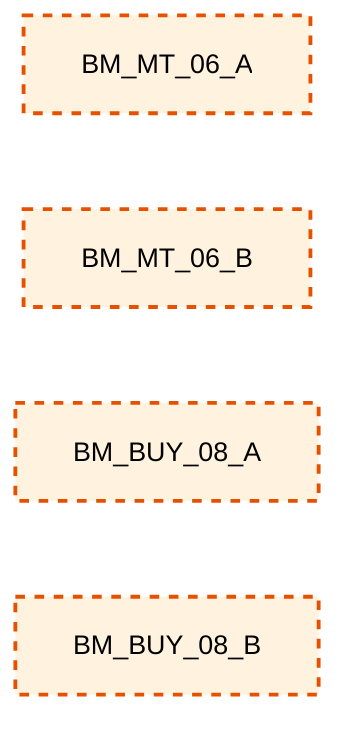

## 分阶段导航

- [研究孵化阶段（33 环节）](battle_map_01_research_incubation.md)
- [模型训练阶段（11 环节）](battle_map_02_model_training.md)
- [回测验证阶段（49 环节）](battle_map_03_backtest_validation.md)
- [仿真验证阶段（7 环节）](battle_map_04_simulation_validation.md)
- [选股阶段（91 环节）](battle_map_05_stock_selection.md)
- [买入阶段（24 环节）](battle_map_06_buy_flow.md)
- [卖出阶段（14 环节）](battle_map_07_sell_flow.md)
- [仓位阶段（21 环节）](battle_map_08_position_management.md)
- [风控管控阶段（50 环节）](battle_map_09_risk_control.md)
- [执行阶段（6 环节）](battle_map_10_execution.md)
- [对账阶段（18 环节）](battle_map_11_reconciliation.md)
- [横切视图（§13漏斗 / §14盘中事件 / §16冲突矩阵）](battle_map_12_cross_cutting.md)

> **环节详情**：各环节的 6 件套（触发/消费/参数/数据流/代码映射/降级）+ 锚点 + 有效状态，见上方对应分阶段文档。总图聚焦大局全貌，不重复详情。
