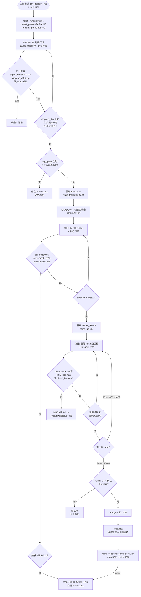

> ## 结案报告（2026-08-16 补记）
>
> **实际开发**：2026-08-15 第 5 批（会话 AI-SIM-001）完成引用现状同步（v1.7.7）+ #ARCH-QUANT-002/003 两项裁定落地（晋级与降级两状态机唯一耦合点，Owner 裁定）；#ARCH-QUANT-002 状态外部化随后由 P0 风控接线批施工闭环（state_store.py，KillSwitch 状态/fill_id 去重集首批迁入）。模拟盘链路已实际上线运行（tick 订阅通道接模拟盘，业务心跳正常）。
>
> **最终成果**：回测→模拟→实盘灰度的验证路径定稿并与现状对齐；Crash-only 状态外部化落地。
>
> **未做事项及原因**（2026-08-16 独立复核修正）：
> - 晋级迁移 FSM 不做——Owner 裁定方案 C：阶段维度真源=paper_live_transition 三阶段门禁，原迁移 5 态废弃（重复建模）。
>
> **2026-08-17 补记（v1.7.8）**：§3.8 五态降级机代码已落地（AI-DGR-001，#ARCH-QUANT-003 resolved）——`src/zephyr/governance/lifecycle_governance/rollback_state_machine.py`（MOD-GOV-045，与 infrastructure/rollback/ 同名编排机零关系），§3.8 伪代码逐行落地（单向更保守/fail-closed/Hysteresis/≥30 笔地板）+ paper_live_transition.py 晋级前置 NORMAL 校验耦合点，57 项测试两轮全绿。

# 模拟与实盘验证路径

> 本备忘定义策略从回测通过到全资金实盘的模拟验证与灰度上线路径，是 [20_first_batch_strategies](20_first_batch_strategies.md) §4.4 灰度指引的"具体 schedule 与执行"展开。
> 性质：**已定稿（v1.0.0，2026-08-10）**，作为策略模拟实盘迁移的对接指南。
> 管理规范见 [01_design_memo_management_spec](01_design_memo_management_spec.md)；路线图定位见 [00_index_trading_decision](00_index_trading_decision.md) G24。
> 关联：[52_backtest_framework_docking](52_backtest_framework_docking.md)（G23 上游，active v1.0.4——其 §3.4 承载 IS→WFA→OOS 门控放行 why 层，代码真源 `src/zephyr/backtest/core/decision_gate.py` + [battle_map_03](../battle_map/battle_map_03_backtest_validation.md)，回测通过是模拟实盘前置）｜ [20_first_batch_strategies](20_first_batch_strategies.md) §4.4（灰度上游指引，active v1.3.2）

## 1. 主题组信息

| 项 | 内容 |
|---|---|
| 主题组 | G24 模拟与实盘验证路径 |
| 所属 | 作战地图 04 |
| 依赖 | G23（回测通过；[52_backtest_framework_docking](52_backtest_framework_docking.md) active v1.0.4，其 §3.4 承载 IS→WFA→OOS 门控 why 层，代码真源 `src/zephyr/backtest/core/decision_gate.py`） |
| 对标 | 机构 paper trading → 小资金 → 全量 / nexusfi 2026 门控部署管线 / `paper_live_transition.py` 已实现三阶段 |
| 正交性 | ✅ 与 regime 正交（迁移路径不依赖 regime，regime 只影响 budget 缩放） |
| 优先级 | P4 |
| 状态 | 已定稿·模拟实盘迁移路径确立 |

## 2. 背景

### 2.1 项目处境

- 个人 + 100% AI 开发的 A 股量化系统（miniQMT 通道，T+1 结算，不能做空，涨跌停限制）。
- **⚠️ 2026-07-06 miniQMT 通道变更**（[miniqmt.com](https://www.miniqmt.com/) 2026-07-07 声明）：miniQMT 已全面停止新申请，存量用户暂可用但后期逐步停止服务。新项目应直接基于完整版 QMT（20 日日均资产 50 万门槛）。本备忘以 miniQMT 为例描述，迁移路径同样适用于 QMT——策略代码（.py/.json）可迁移，但权限/配置/程序化报备不继承，换券商须重新装包+订阅行情+跑 3-5 个交易日验证数据对齐（[licai.cofool](https://licai.cofool.com/ask/qa_7397791_1_2.html) 2026-07-30 QMT 迁移 SOP）。
- **⚠️ 2026-07-07 A 股程序化交易新规全面执行**（[CSDN syp1110](https://blog.csdn.net/syp1110/article/details/163276625) 2026-08-08）：高频认定每秒申报从 300 笔骤降至 **15 笔**、单日总撤单率 ≤**15%**、每笔报单停留 ≥**50 微秒**、暂停新增独立交易单元。**影响**：GRAY_RAMP 的加仓节奏必须适配 TWAP/VWAP 拆单（[40_execution_broker](40_execution_broker.md) G22 已建 6 种算法），纯速度套利失效（超额收益从 14% 回落至 3%），转向中低频多因子——**反而利好个人 AI 开发者**（研究与算法成为核心竞争力）。
- 回测框架代码已建成（`src/zephyr/backtest/` 域 + `src/zephyr/backtest/core/decision_gate.py` IS→WFA→OOS 门控 + 参数悬崖检测 + `monitor_backtest_live_deviation`；环节视图见 [battle_map_03](../battle_map/battle_map_03_backtest_validation.md) BM-BT-01~07；[52_backtest_framework_docking](52_backtest_framework_docking.md) active v1.0.4，其 §3.4 已承载 G23 why 层），策略回测通过后须进入模拟实盘验证。
- 灰度上游指引已定（[20_first_batch_strategies](20_first_batch_strategies.md) §4.4，active v1.3.2）：回测验证 → 模拟盘（≥6 月）→ 小资金实盘（≥6 月）→ 全资金实盘，但"具体 schedule 与执行在 G24"——即本备忘。
- 迁移门禁代码已实现：`src/zephyr/governance/lifecycle_governance/paper_live_transition.py`（MOD-GOVERNANCE，production）定义三阶段 PARALLEL → SHADOW → GRAY_RAMP，阶段不可跳级，各阶段有明确 key_gates。
- 市场仿真域已建（[71_d_simulation](../../02_domain_architecture_docs/71_d_simulation.md) 15 模块 + [battle_map_04_simulation_validation](../battle_map/battle_map_04_simulation_validation.md) 7 环节），但**市场仿真（what-if 假设场景）≠ 模拟盘（paper trading，真实行情模拟执行）**——两者易混，本备忘须澄清。

### 2.2 核心问题

回测通过 ≠ 实盘能赚。回测假设完美执行/无市场冲击/数据即时可得，实盘全部不成立（referentiallabs 2026：paper 比 backtest 差 10-30% 正常，>30% 须调查）。本备忘回答：模拟盘环境如何搭？模拟多久？小资金实盘如何逐级放大？实盘-模拟差异如何监控？上线决策门控如何定？灰度顺序如何排？

### 2.3 约束条件

- A 股 T+1 / 不能做空 / 涨跌停 → 实盘执行有硬约束，模拟盘须复现。
- 小资金 → 灰度须逐级放大，单次全量风险不可承受。
- 个人 + AI 开发 → 迁移路径须自动化门禁（`paper_live_transition.py` 已实现 valid_transition 强制顺序），减少人工判断负担。
- 首批 3 策略差异化（打板小容量/多因子主资金/事件驱动中）→ 各 sleeve 独立灰度，不强制同步（[20_first_batch_strategies](20_first_batch_strategies.md) §4.4）。

### 2.4 已施工设施盘点

> 通用规则 #11：先清楚有什么 → 才能知道怎么改 → 才能知道该删除/退役什么。本节盘点与本备忘主题（模拟→实盘迁移）相关的全部已建设施与配套（代码验证 2026-08-12）。

| 设施 | 路径 / 位置 | 施工状态 | 与本备忘关系 |
|---|---|---|---|
| 三阶段迁移门禁 | `src/zephyr/governance/lifecycle_governance/paper_live_transition.py`（MOD-GOVERNANCE） | ✅ production（⚠️回退逻辑未实现，§3.8 设计伪代码待施工） | 本备忘核心承载：PARALLEL/SHADOW/GRAY_RAMP + key_gates + valid_transition 不可跳级 + TransitionState 持久化 |
| 回测门控 + 偏差监控 | `src/zephyr/backtest/core/decision_gate.py` | ✅ production | IS→WFA→OOS 门控 + 参数悬崖检测 + `monitor_backtest_live_deviation`（warn>30%/retire>50%，§3.5 触发条件代码真源） |
| rolling DSR | `src/zephyr/simulation/deflated_sharpe_calculator.py`（MOD-SIM-024） | ✅ production | §3.4 half-sized 晋级门禁（rolling DSR 确认信号稳定） |
| 滑点分析（square-root） | `src/zephyr/ex_sor/services/slippage_analyzer.py`（`SquareRootImpactPredictor` coeff=0.142） | ✅ production | §3.2 撮合 Step③ 滑点建模 + §3.5 滑点偏差归因（BM-BT-05-H-A） |
| 执行质量打分 | `src/zephyr/ex_sor/services/execution_quality_scorer.py` | ✅ production | §3.5 延迟差异归因（BM-BT-05-H-D） |
| 前瞻偏差检测 | `src/zephyr/simulation/look_ahead_bias_detector.py`（MOD-SIM-022） | ✅ production | §3.5 信号一致性归因（BM-BT-05-H-C 数据层金标准） |
| 盘后结算对账 | `src/zephyr/trading/settlement_reconciliation.py`（MOD-TRADING-003） | ✅ production | §3.5 `settlement_match 100%` 门禁承载（54 号 G25 对账执行算法） |
| 盘中持仓对账 | `src/zephyr/ex_core/position_reconciler.py`（MOD-EX-056） | ✅ production | §3.5 执行对账复用（每 5min 盘中持仓对账） |
| 回测费率配置 | `src/zephyr/backtest/implementations/vectorized_engine.py`（`commission_rate` 万三默认）+ `event_driven_engine.py` | ✅ production | §3.2 撮合 Step④ 佣金/印花税/过户费复用（paper 撮合同一费率常量） |
| 执行层硬约束 | `ex_core/`（order_manager / price_cage 价格笼子 / cancel_rate_guard 撤单率 / board_lot 整手） | ✅ production（40 号 G22 已建） | §3.2 撮合 Step①②⑤ 复用（信号→订单/涨跌停排队规则/拆单） |
| 市场仿真域 | `simulation/`（risk_simulator / result_analyzer / scenario_generator 等 15 模块，[71_d_simulation](../../02_domain_architecture_docs/71_d_simulation.md)） | ✅ 15 模块全 production | §3.2 市场仿真（what-if）≠ paper trading——并行非必经（BM-SIM-01~07；⚠️BM-SIM-05 数字孪生已降级 #ARCH-OE-010，BM-SIM-01 市场仿真器缺失态） |
| 四模式开关 | [battle_map_12](../battle_map/battle_map_12_cross_cutting.md) §四模式开关（回测/Paper/Shadow/实盘） | 设计态（横切条目） | §3.5 sim↔live divergence 监控的模式基础（四模式决策逻辑同构） |
| Ghost Position 兜底 | [35_drawdown_protocol_impl](35_drawdown_protocol_impl.md) §3.5.1（active v1.39.2） | ✅ `detect_ghost_positions` 已施工（其 v1.39.0，双类型检测；盘前启动序列接入待其 §6.12） | §3.5 Ghost Position 运营风险——SHADOW `settlement_match 100%` 隐含检测要求 |
| 降级/回退 5 态状态机 | 本备忘 §3.8（NORMAL→THROTTLED→SOFT_HALT→HARD_HALT→UNWINDING） | ⚠️设计规范伪代码，代码待施工 | §3.8 回退程序执行算法（单向更保守 + fail-closed + Hysteresis） |
| 涨跌停排队撮合 | 待新建（`slippage_analyzer` 仅滑点归因无排队） | ❌ 待施工 | §3.2 撮合 Step②（paper matching 引擎排队逻辑） |
| MLflow 实验追踪 | [50_backtest_observability_workplan](50_backtest_observability_workplan.md)（active v1.1.1）+ `src/zephyr/experiment_tracking/` | 代码已有（config/models/query），体系工作计划已定稿 | §4.4/§5.2 远期演进项的多 regime 数据积累依赖 |

## 3. 决策

### 3.1 核心决策：三阶段迁移 PARALLEL → SHADOW → GRAY_RAMP，对齐 20 号 §4.4 四阶段

`paper_live_transition.py` 已实现三阶段迁移门禁，本备忘确认其为策略模拟实盘路径的 MVP 上限，并与 [20_first_batch_strategies](20_first_batch_strategies.md) §4.4 四阶段对齐 reconcile：

| 20 号 §4.4 四阶段 | 代码三阶段 | 阶段机制 | 关键门禁（key_gates） |
|---|---|---|---|
| ① 回测验证（G23） | —（前置，非迁移阶段） | IS→WFA→OOS 门控放行 | 见 [battle_map_03](../battle_map/battle_map_03_backtest_validation.md) BM-BT-07 + 代码 `src/zephyr/backtest/core/decision_gate.py`（[52_backtest_framework_docking](52_backtest_framework_docking.md) active v1.0.4） |
| ② 模拟盘（paper，≥6 月） | **PARALLEL** 并行运行（30 天机制下限） | Paper 与 Live 并行，比较所有信号与执行质量 | signal_match ≥ 99.9% / slippage_diff < 1bp / fill_rate ≥ 99% |
| ③ 小资金实盘（≥6 月） | **SHADOW** 影子账户（14 天）+ **GRAY_RAMP** 前期（1%→5%→20%） | 小额真实资金运行影子账户，验证执行链路与结算；随后逐级放大 | shadow_pnl_corr ≥ 0.95 / settlement 100% / latency < 100ms；ramp 步 drawdown < 1% |
| ④ 全资金实盘 | **GRAY_RAMP** 后期（50%→100%） | 逐级放大至全量 | daily_loss < 3% / 无 circuit_breaker 触发 |

> **reconcile 说明**：20 号 §4.4 的"≥6 月"是保守观察期上限（捕获多 regime 周期），代码的 30/14/30 天是机制最小天数下限。两者不冲突——机制最小天数满足后，须再观察至保守期达标才晋级（见 §3.3 模拟时长）。`valid_transition()` 强制阶段不可跳级，只允许顺序 next。

### 3.2 讨论要点①：模拟验证（paper trading）环境

**paper trading ≠ 市场仿真**（须澄清，两者易混）：

| 维度 | paper trading（本备忘） | 市场仿真（[battle_map_04](../battle_map/battle_map_04_simulation_validation.md)） |
|---|---|---|
| 性质 | 真实行情模拟执行（不下单） | 假设场景 what-if（造假市场） |
| 数据 | 实时 live 数据 | 生成/重放/蒙特卡洛路径 |
| 用途 | 验证系统端到端 + 执行链路 + 运营 | 探策略边界 + 压力测试 + 极端场景 |
| 阶段 | 回测后、实盘前（PARALLEL 阶段） | 回测后、可并行于 paper（BM-SIM-01~07） |
| 代码 | paper_live_transition PARALLEL + 策略沙箱 | D_SIMULATION 域 15 模块（scenario_generator / risk_simulator 等） |

**paper trading 环境定义**（对齐 referentiallabs 2026 / x3algo）：
- **实时数据模拟撮合**：策略对实时行情生成信号，模拟撮合（不送真实订单），记录模拟成交。
- **验证目标**：系统端到端可达（信号生成/订单逻辑/风控/重启容错）、执行时延、运营行为。
- **已知局限**：模拟成交偏乐观（无市场冲击、即时成交、不捕捉心理因素）——这正是 SHADOW 阶段用小额真实资金弥补的。

**模拟撮合算法子决策**（v1.5.0 补，填补施工环节流程算法缺失）：paper trading 的撮合引擎必须显式复现 A 股硬约束，否则 SHADOW 阶段首次接触真实撮合会出现"模拟通过但实盘被拒"的伪通过。撮合算法分 5 步：

| 步骤 | 算法 | A 股适配 | 复用代码 |
|---|---|---|---|
| ① 信号→订单 | 策略 target_portfolio → 订单列表（含 direction/qty/price/type） | T+1 卖出校验：检查持仓买入日期，T 日买入 T+1 才能卖 | [40_execution_broker](40_execution_broker.md) §2.4 + OrderManager |
| ② 涨跌停撮合 | 涨停板仅撮合 bid 队列（限价单按时间优先排队）、跌停板仅撮合 ask 队列；触及涨跌停的市价单转为限价单排队 | A 股 10%/20%/30%（创业板/科创板/ST）三档涨跌停 | paper matching 引擎须新建排队逻辑（`slippage_analyzer` 仅做滑点归因无排队）；排队规则对齐 [40_execution_broker](40_execution_broker.md) §2.4 OrderManager |
| ③ 滑点建模 | 决策价 → 成交价加滑点：linear/square-root/Almgren-Chriss 模型；参与率 > 5% 触发冲击成本非线性放大 | A 股小盘股 5% 滑点（[BigQuant 2026-03](https://bigquant.com/wiki/doc/muD2XDiJRG) 实证）须建模 | `ex_sor/slippage_analyzer`（BM-BT-05-H-A） |
| ④ 佣金/印花税/过户费 | 佣金 ≤ 0.03%（双边）/ 印花税 0.05%（卖单）/ 过户费 0.001%（双边） | A 股费率硬编码，过户费仅沪深交易所 | backtest 引擎费率配置（`src/zephyr/backtest/implementations/vectorized_engine.py` `commission_rate` 万三默认 + `event_driven_engine.py`），paper 撮合复用同一费率常量 |
| ⑤ 部分成交 | 大单按 TWAP/VWAP 拆单，逐笔模拟部分成交；未成交订单按 5/10/30 分钟超时转限价或撤销 | 适配 2026-07 新规 15 笔/秒 + 15% 撤单率 | [40_execution_broker](40_execution_broker.md) §2.4 拆单算法 |

**作战地图锚定**：Step② 涨跌停撮合 + 下方公式② 涨跌停成交概率估算 = **BM-SIM-08 Paper Matching 涨跌停排队引擎**（作战地图 04，design 态待施工——§2.4 盘点"涨跌停排队撮合 待新建 ❌ 待施工"行；排队规则对齐 [40_execution_broker](40_execution_broker.md) §2.4 OrderManager）。

> **撮合算法公式补全**（v1.6.1 补，代码验证 `slippage_analyzer.py` `SquareRootImpactPredictor` + 2026-08 研究）：上表 5 步仅列 what，以下补 how（伪代码/公式/参数）——
>
> **① T+1 卖出校验**（按手 lot 遍历，当日买入的 lot 不可卖）：
> ```python
> available = sum(lot.qty for lot in holdings[sym].lots if lot.buy_date < today)
> if side == SELL and order_qty > available:
>     order_qty = available  # 仅卖可卖部分，余量拒绝并记录
> ```
>
> **② 涨跌停成交概率估算**（封板状态下限价单排队，成交概率取决于队列位置与对手盘流量）：
> ```python
> P(fill) ≈ min(1, counter_volume / (queue_ahead + order_size))
> # queue_ahead ≈ 封单量 × (下单时刻距开盘比例)  # 粗估排队前方累计委托
> # 经验阈值：queue > 1000 手 → P(fill) < 10%（licai.cofool 2026-07 实证：一字板散户几乎无成交）
> # 开板场景：counter_volume 涌入 → P(fill) 上升，但价格回落风险同步上升
> ```
>
> **③ 滑点建模公式**（代码 `SquareRootImpactPredictor` 已实现 square-root 模型，**非 linear**）：
> ```python
> participation = order_size / ADV
> impact_bps = coeff × sqrt(participation) × vol_bps + half_spread
> # coeff = 0.142（默认，≈ 1/(2√(2π))，Almgren-Chriss 简化）
> # vol_bps = daily_volatility × 10000
> # half_spread = 10 bps（A 股默认 ~0.1%）
> ```
> 模型选型裁定：**square-root（次线性增长）优于 linear（高参与率超线性爆炸）**——[trading-spacial #340 2026-05](https://github.com/sssimon/trading-spacial/issues/340) 实证：linear `slippage = base + k×(size/liquidity)` 在高参与率爆炸（DOGE 单笔亏 $30K 案例），sqrt `slippage = base + k×√(size/liquidity)` 约束尾部；[quant67 2026-05](https://quant67.com/post/quant/19-backtest-engine/19-backtest-engine.html) 确认 `impact_bp = c×√(qty/ADV)×σ` 为工程标准。参与率 > 5% 时冲击成本非线性放大，须用 square-root（linear 仅适用于参与率 < 1% 的小单）。
>
> **square-root law 理论背书**（v1.6.5 补，工程裁定升级为理论证明最优）：① [arXiv:2608.00988](https://arxiv.org/abs/2608.00988) Sato/Fujiwara/Kanazawa 2026-08（京都大学，PRL 2025 同作者）——square-root law 嵌入 Lillo-Mike-Farmer (LMF) 模型，证明即使订单流可预测（长程相关），square-root law 下价格动力学长时尺度仍为扩散（布朗）——square-root law 是 EMH 微观结构基础的**必要条件**（linear 模型违反扩散性→产生可预测性→被套利消除，故高参与率"爆炸"；square-root 天然满足扩散约束）。② [arXiv:2606.07059](https://arxiv.org/abs/2606.07059) Bonart 2026-06——从价格扩散性结构约束推导冲击标度：信息中性 regime（交易与价格运动不相关）→ square-root；强信息耦合 regime → linear 交叉。本项目策略多为信息中性，适用 square-root。**裁定**：`SquareRootImpactPredictor`（coeff=0.142）选型获理论证明背书——不仅是工程实证标准，更是 EMH 扩散约束的理论必然；linear 仅强信息耦合 regime（知情交易）成立，本项目不适用。
>
> **⑤ TWAP/VWAP 拆单参数**（适配 2026-07 新规 15 笔/秒 + 15% 撤单率）：
> ```python
> # TWAP: 等时间间隔拆单
> N = ceil(order_size / max_child_size)
> child_interval = max(67ms, execution_window / N)  # 15 笔/秒 → ≥67ms 间隔
> # VWAP: 按历史分时成交量加权拆单
> child_size_i = order_size × (hist_vol_i / sum(hist_vol))  # i = 时段索引
> # 超时处置：未成交 child 按 5/10/30 分钟（小/中/大盘）转限价或撤销
> # 撤单率监控：cum_cancel / cum_submit ≤ 12%（留 3% buffer 适配 15% 红线）
> ```

> **撮合乐观偏差校准**（[marketmaker.cc 2026-03](https://marketmaker.cc/en/blog/post/backtest-live-parity) + [BigQuant 2026-03](https://bigquant.com/wiki/doc/muD2XDiJRG)）：paper 撮合须主动注入悲观偏差，否则 SHADOW 阶段会暴露"模拟赚、实盘亏"的伪通过。具体校准：①涨停板排队按队列长度估算成交概率（队列 > 1000 手 → 成交概率 < 10%）；②滑点取回测假设的 1.5-2×（A 股小盘股滑点偏差 -1.2% 实证）；③部分成交按真实市场深度模拟（非假设全量成交）。校准后 paper-backtest PnL gap 应收敛至 10-20%（referentiallabs 2026 行业基准），> 30% 须调查撮合算法是否仍乐观。
>
> **SHADOW 阶段数据驱动 slippage 校准**（v1.6.3 补，[marketmaker.cc 2026-03 "calibrate_slippage()"](https://marketmaker.cc/en/blog/post/backtest-live-parity)）：上述①②③是 paper 阶段的**定性悲观偏差注入**（保守估计）；SHADOW 阶段首次有真实 fills 数据后，须用**数据驱动定量校准**反向拟合回测 slippage model 参数——paper 阶段的 1.5-2× 是保守上界，SHADOW 有真实数据后须精算为实测分位数：
> ```python
> # SHADOW 阶段：用实盘 fills 反向校准回测 slippage model（marketmaker.cc 2026-03）
> import numpy as np  # v1.6.6 修：移至模块顶层（原函数内 import 不规范）
>
> def calibrate_slippage(live_fills: list[dict], backtest_assumption: dict) -> dict:
>     """用 SHADOW 阶段真实 fills 数据校准回测 slippage 假设。
>     Why: paper 阶段注入 1.5-2x 悲观偏差是保守估计，SHADOW 有真实数据后须精算。
>     v1.6.6 修：① 空数组 guard（live_fills 为空时 np.percentile 崩溃）；
>               ② 除零 guard（backtest_assumed_bps=0 时 calibration_ratio 除零）。
>     """
>     # live_fills: [{symbol, side, order_price, fill_price, qty, timestamp, adv}, ...]
>     # 空数组 guard：未达统计地板（<30 笔）时返回 INSUFFICIENT，不计算分位数
>     if not live_fills or len(live_fills) < 1:
>         return {'verdict': 'INSUFFICIENT', 'sample_size': 0,
>                 'reason': 'live_fills 为空，须满 14 天 + ≥30 笔后首次校准（§3.3 统计地板）'}
>     actual_slippage_bps = []
>     for fill in live_fills:
>         mid = fill['order_price']  # 简化：以订单价为参考价（A 股限价单为主）
>         if mid <= 0:
>             continue  # 跳过异常 fill（订单价 ≤0 不应出现，防除零）
>         slip_bps = abs(fill['fill_price'] - mid) / mid * 10000
>         actual_slippage_bps.append(slip_bps)
>     # 二次 guard：过滤异常 fill 后可能为空
>     if not actual_slippage_bps:
>         return {'verdict': 'INSUFFICIENT', 'sample_size': len(live_fills),
>                 'reason': '全部 fill 的 order_price≤0 异常，须排查数据源'}
>     calibrated = {
>         'p50_bps': float(np.percentile(actual_slippage_bps, 50)),
>         'p90_bps': float(np.percentile(actual_slippage_bps, 90)),
>         'p99_bps': float(np.percentile(actual_slippage_bps, 99)),
>         'mean_bps': float(np.mean(actual_slippage_bps)),
>         'sample_size': len(actual_slippage_bps),
>     }
>     backtest_assumed_bps = backtest_assumption.get('slippage_bps', 1.0)
>     # 除零 guard：backtest_assumed_bps=0 时无法计算 ratio，返回 FAIL 待人工排查
>     if backtest_assumed_bps <= 0:
>         calibrated['calibration_ratio'] = float('inf')
>         calibrated['verdict'] = 'FAIL'
>         calibrated['reason'] = f'backtest_assumed_bps={backtest_assumed_bps}≤0，回测 slippage 假设无效'
>         return calibrated
>     calibration_ratio = calibrated['p90_bps'] / backtest_assumed_bps
>     calibrated['calibration_ratio'] = calibration_ratio
>     calibrated['verdict'] = (
>         'PASS' if calibration_ratio <= 1.5 else    # 实盘 p90 滑点 ≤ 回测假设 1.5x
>         'WARN' if calibration_ratio <= 3.0 else     # 1.5-3x 需调查
>         'FAIL'                                      # >3x 回测假设不成立
>     )
>     return calibrated
> # 校准周期：SHADOW 满 14 天 + ≥30 笔 fills 后首次校准（对齐 §3.3 统计地板）
> # 后续每月重校准（marketmaker.cc 建议 2-4 周一次）
> ```
> **校准结果处置**：PASS→回测 slippage 假设有效，GRAY_RAMP 可继续放大；WARN→回测 slippage 假设偏乐观，须上调至 p90 实测值后重跑回测验证；FAIL→回测 slippage 假设严重失真，须暂停 GRAY_RAMP 并调查执行链路（[40_execution_broker](40_execution_broker.md) TCA 归因）；INSUFFICIENT→fill 样本不足（v1.6.6 补），继续 SHADOW 观察至满 14 天+≥30 笔后重试，不影响 GRAY_RAMP 推进（尚未到校准时点）。**与 [54_reconciliation_attribution](54_reconciliation_attribution.md) 协同**：校准结果同步写入 54 号 `transaction_cost_drag` 的 slippage 分项，使归因报告的滑点成本反映真实而非假设。
>
> **citrusquant volume-aware sqrt impact 工程参考**（v1.6.3 补，[GitHub citrusquant #19](https://github.com/citrusquant/citrusquant/issues/19) 2026-07-10 PR 合并）：上述 square-root 模型 `impact_bps = coeff × √(participation) × vol_bps + half_spread` 的另一工程实现形式——直接在 NAV loop 的 rebalance_cost 中用 participation-scaled sqrt impact 替换 flat slippage：
> ```python
> # citrusquant 形式：按权重变化而非订单大小建模
> impact[c] = impact_coef * sqrt(abs(delta_weight[c]) * notional / dollar_volume[c])
> # acceptance criteria（citrusquant PR 严格验收标准）：
> #   ① 单调性：|Δw| 增大 → impact 增大
> #   ② NaN/zero volume fallback：dollar_volume=0 时 impact=0（不崩）
> #   ③ sign symmetry：买卖对称（abs 处理）
> #   ④ impact_coef=0 时 bit-for-bit 复现 legacy flat slippage 行为（向后兼容）
> ```
> **与 §3.2 square-root 模型的关系**：两者同源（sqrt market impact）——§3.2 用 `order_size/ADV` 参与率（order-driven 单笔订单场景），citrusquant 用 `|Δw|×notional/dollar_volume` 权重变化率（rebalance-driven 组合再平衡场景）。**裁定**：MVP 用 §3.2 `SquareRootImpactPredictor`（已实现，参与率形式），citrusquant 形式记为 v2.0 候选（升级到 portfolio-rebalance-level 撮合时评估采纳）；acceptance criteria 四条（单调性/fallback/sign symmetry/向后兼容）是通用工程验收标准，适用于 slippage_analyzer 任何 sqrt 模型变更。
>
> **撮合引擎复用原则**：不重造撮合引擎——复用 `ex_sor/slippage_analyzer` + [40_execution_broker](40_execution_broker.md) OrderManager + backtest 引擎费率配置（`vectorized_engine.py` / `event_driven_engine.py` 的 commission_rate 常量）的现成逻辑，paper trading 只是在"不送真实订单"前提下复用同一撮合代码路径。这是 paper-live parity 的工程保证（同一代码路径 = 同一撮合行为 = 模拟与实盘可对账）。
>
> **EvoMarket T+1 native 模拟器参考**（v1.6.4 补，[arXiv:2604.18046](https://arxiv.org/abs/2604.18046) Zhong/Yang/Liu/Tang/Yang 2026-04 哈工大/南科大）：首个将 A 股 **T+1 结算、涨跌停、集合竞价、市场日历**作一等公民建模的开源离散事件多智能体模拟器（高吞吐执行核心 + Oracle 引导纠正性订单合成自校准）。**验证价值**：① §3.2 五步撮合算法可对照其 A 股 native 机制核验——T+1/涨跌停排队/集合竞价任一环节行为差异即排查是否遗漏硬约束；② "异步 per-asset 撮合"可参考——多标的并行撮合各 LOB 独立推进避免交叉影响；③ **裁定**：MVP 不引入（复用原则不重造撮合引擎），登记为 **T+1 native 撮合行为验证基准**——SHADOW 阶段发现 paper-live 撮合差异时作交叉验证环境排查根因（远期候选 Phase 2+，SHADOW 首次校准后评估）。

### 3.3 讨论要点②：模拟时长

**reconcile 三方标准**：

| 来源 | 模拟盘时长 | 立场 |
|---|---|---|
| [20_first_batch_strategies](20_first_batch_strategies.md) §4.4 | ≥6 月 | 保守上限（捕获多 regime 周期） |
| `paper_live_transition.py` PARALLEL | 30 天（机制下限） | 自动化门禁最小天数 |
| 2026 行业（x3algo / devrim） | 2-4 周 / 30-60 天 | 偏短（美股 swing trading 语境） |

**裁定**：取**机制最小 30 天 + 保守观察期 ≥6 月 + 交易笔数地板 ≥30 笔**三层标准——
- **机制层（天数下限）**：PARALLEL 满 30 天且 key_gates 全通过，方可申请晋级 SHADOW（`elapsed_days` 达标）。
- **统计层（交易笔数地板）**：PARALLEL 期间累计 ≥30 笔交易（[AlphaFactory G2.2](https://github.com/ShellPayant/AlphaFactory/blob/main/docs/graduation_criteria.md) 2026-05 ratified 统计地板——低于此任何指标都是噪声）。打板 sleeve 高换手易达；多因子低换手须延长观察至达标。
- **观察层（保守期上限）**：A 股 + 小资金 + AI 开发取保守，须再观察至累计 ≥6 月（覆盖牛/熊/震荡多 regime，对齐 [11_regime_backtest_validation_plan](11_regime_backtest_validation_plan.md) 验证区间 2015-2026 的多周期思路），且 PnL 偏离回测预期 ≤30%（[20_first_batch_strategies](20_first_batch_strategies.md) §4.4 阈值；>30% 须调查后再推进）。
- **MinTRL 统计依据**（[purgedcv](https://pypi.org/project/purgedcv/) `min_track_record_length`；DSR/MinTRL 代码真源 `src/zephyr/simulation/deflated_sharpe_calculator.py` MOD-SIM-024 production）：建立 SR 所需最小观测数——天数之外补"足够交易笔数"的统计地板，避免"30 天但只 3 笔交易"的假达标。
- **理由**：行业 2-4 周偏短（美股 swing 语境，A 股 T+1 + 涨跌停 + 小资金需更长捕获极端事件）；20 号 ≥6 月保守合理但须有机制下限 + 交易笔数地板避免"天数到了但样本不足"的假达标。

### 3.4 讨论要点③：实盘小资金验证路径

**SHADOW（影子账户）→ GRAY_RAMP（灰度放大）两步走**：

- **SHADOW 影子账户**（14 天机制下限）：以**小额真实资金**运行影子账户，验证执行链路与结算。此阶段首次引入真实市场冲击、真实滑点、真实结算时延——弥补 paper trading 的乐观偏差。门禁：`shadow_pnl_correlation ≥ 0.95`（影子与回测/模拟 PnL 相关）、`settlement_match 100%`（结算一致）、`latency < 100ms`。
  - **资金定义**（代码验证 `paper_live_transition.py` L49-55 未明确，本备忘裁定）：SHADOW 阶段资金 = **GRAY_RAMP 第一级（1%）** 或 **固定小额学费额度**（[fxroboteasy 2026-05](https://edu.fxroboteasy.com/forex-basics/lesson-12-demo-to-live) 建议 $100-$500，A 股语境调整为 1000-5000 元），取两者较大值。理由：SHADOW 是 GRAY_RAMP 的前置验证，资金应与 GRAY_RAMP 第一级一致以平滑过渡；"学费额度"概念确保即使全部亏损也在可承受范围。
  - **SHADOW 三不原则**（[NeuraTrade #260](https://github.com/) 2026 + [Reversal 3.5](https://github.com/randomwalkhan/Short-Term-Reversal-Strategy) 2026-08-07 实证）：shadow NEVER places real orders（不下真实单）/ NEVER blocks live（不阻断实盘）/ NEVER self-promotes（不自动晋级）。当 live underperformance 时回退到 shadow-only（Reversal 3.5 实战：live-paper 表现不佳→早期入场执行改为 shadow-only）。
- **GRAY_RAMP 灰度放大**（30 天机制下限，5 级 ramp）：逐级放大仓位 1% → 5% → 20% → 50% → 100%。每级 ramp 步门禁：`drawdown < 1%`、`daily_loss < 3%`、无 `circuit_breaker` 触发。`ramp_up(step_percent)` 逐级累加，任一级触发熔断即停止放大（对齐 nexusfi 2026 kill switch 机制）。
  - **每级观察期**（代码验证 `paper_live_transition.py` L56-62 可配置但未明确默认值，本备忘裁定）：**每级最小观察期 7-14 天 + 累计机制下限 30 天**。前两级（1%→5%）每级 7 天（小仓位风险低，快速验证）；后三级（20%→50%→100%）每级 14 天（大仓位须充分观察）。[Pomegra 2026](https://pomegra.io/learn/library/track-e-trading-risk/technical-analysis/chapter-15-building-a-simple-ta-based-system/forward-testing-and-paper-trading) 三档微阶梯替代方案：每档 10 笔交易（0.5%→1%→2% 风险），适合更精细控制——记为 v2.0 备选。
  - **half-sized live 晋级**（[20_first_batch_strategies](20_first_batch_strategies.md) §4.4 + [QuantHedgeAI 2026-07](https://www.quanthedgeai.com/blog/implementing-a-multi-strategy-portfolio-end-to-end/)）：GRAY_RAMP 的 20%→50% 区间即 half-sized live，须跑 **rolling DSR**（DSR calculator 代码真源 `src/zephyr/simulation/deflated_sharpe_calculator.py` MOD-SIM-024 production 已就绪；[52_backtest_framework_docking](52_backtest_framework_docking.md) active v1.0.4）确认信号稳定 + **≥6 月 half-sized track record** 后才放大至 100%。QuantHedgeAI 明确"half-sized live: 50% 设计权重，≥6 月且 rolling DSR 确认后晋升"。

**Capacity 监控**（[nexusfi 2026-06](https://nexusfi.com/a/automation/algo-trading-live-deployment) + [QuantConnect LEAN 2026](https://www.quantconnect.com/docs/v2/lean-engine/statistics/capacity) + [Linitics 2026-04](https://linitics.com/quant-liquidity/)）：GRAY_RAMP 逐级放大须感知**策略容量**——最大可持续仓位（不退化执行质量）。

| 容量量化方法 | 公式/阈值 | 来源 |
|---|---|---|
| **参与率** | Participation Rate = Order Size / Market Volume ≤ **5%-10%** 日均成交量 | Linitics 2026 |
| **LEAN 可用比例** | Daily **2%** / Hour 5% / Minute **20%** / Second 50% / Tick 50% | QuantConnect 2026 |
| **容量平滑** | S_i = 0.66 × S_{i-1} + 0.34 × 当前快照（指数加权） | QuantConnect 2026 |
| **A股容量定义** | 策略有效容量 = 在目标价和可接受滑点范围内，能稳定买到足额筹码的最大资金量 | [衍复投资 2026-02](https://bigquant.com/wiki/doc/XoYEXwf6Ak) |

> **A股调整**：A 股交易时长 240 分钟（非美股 390），LEAN 的 Fast Trading Volume Discount 分母须调整。打板 sleeve 容量极小（单票几万~几十万，[20_first_batch_strategies](20_first_batch_strategies.md) §2.2），GRAY_RAMP 放大至 20% 时可能已触容量顶——须监测滑点 deviation（§3.5 `slippage_diff < 1bp` 门禁）是否随仓位放大而恶化，恶化即停止放大（**capacity-bound 早于 risk-bound**）。多因子 sleeve 容量大，GRAY_RAMP 可走完全程。**小资金优势**（Linitics 2026）："Smaller capital = higher efficiency"——参与率天然低，市场冲击小，可访问机构无法触及的微小 inefficiencies。

> **Capacity-bound 早停施工算法**（v1.6.1 补，填补"滑点恶化即停"仅有定性描述缺判断算法的施工缺口；[Linitics 2026-04](https://linitics.com/quant-liquidity/) + [sssimon/trading-spacial PR #341 2026-05](https://github.com/sssimon/trading-spacial/pull/341)）：GRAY_RAMP 逐级放大须在每级监测滑点随仓位的边际恶化斜率，斜率超阈值或参与率超限即 capacity-bound 早停（早于 risk-bound 的 drawdown/daily_loss）——
>
> ```python
> # Capacity-bound 早停（GRAY_RAMP 每级评估，打板 sleeve 重点）
> def capacity_bound_stop(ramp_levels, slippage_observed, order_size, adv, slope_thresh=0.3):
>     # ramp_levels: [0.01, 0.05, 0.20, ...] 已放大级别；slippage_observed: 对应实测滑点率
>     participation = order_size / adv                             # 参与率 Q/V（Linitics ≤5-10%）
>     if len(ramp_levels) < 2:
>         return False, {"participation": participation}
>     d_slip = slippage_observed[-1] - slippage_observed[-2]
>     d_ramp = ramp_levels[-1] - ramp_levels[-2]
>     slope = d_slip / d_ramp if d_ramp != 0 else 0.0            # 边际滑点恶化斜率
>     stop = (slope > slope_thresh) or (participation > 0.10)    # 斜率超限或参与率 > 10%
>     if participation > 0.20:                                    # 极端参与率硬熔断（5% 滑点 cap）
>         stop = True
>     return stop, {"slope": slope, "participation": participation}
> ```
>
> 触发即停止放大并回退上一级 ramp（§3.8 降级程序）。打板 sleeve 容量极小，预期在 20% 级触发；多因子 sleeve 容量大可走完全程。

### 3.5 讨论要点④：实盘→模拟差异监控

**Strategy Drift 监控**（对齐 nexusfi 2026）：不只看 PnL，须监控行为偏差——交易频率、成交质量、持仓时间、滑点分布。`paper_live_transition.py` 各阶段 key_gates 即差异监控的门禁化：

| 监控维度 | 门禁（代码已定义） | 偏差归因（待 v2.0，[battle_map_03](../battle_map/battle_map_03_backtest_validation.md) BM-BT-05-H） |
|---|---|---|
| 信号一致性 | `paper_live_signal_match ≥ 99.9%` | 前瞻偏差残留（BM-BT-05-H-C） |
| 滑点偏差 | `slippage_diff < 1bp` | 滑点偏差归因（BM-BT-05-H-A，复用 `ex_sor/slippage_analyzer`） |
| 成交率 | `fill_rate ≥ 99%` | 流动性误判 / 限价等待 |
| PnL 相关 | `shadow_pnl_correlation ≥ 0.95` | 总偏差（BM-BT-05-H 汇总） |
| 结算一致 | `settlement_match 100%` | —（硬约束，不一致=系统 bug） |
| 执行时延 | `latency < 100ms` | 延迟差异归因（BM-BT-05-H-D，复用 `ex_sor/execution_quality_scorer`） |
| 回撤 | `drawdown < 1% / ramp 步` | —（触发即停止放大） |
| 日损 | `daily_loss < 3%` | —（触发 circuit_breaker） |

**作战地图环节映射**

| BM 环节 | 环节名 | 本篇承载小节 | 状态 |
|---|---|---|---|
| BM-BT-05-D | 策略衰减监控 | §3.5 漂移检测施工公式（PSI/CUSUM/Page-Hinkley 三函数+μ₀ 取 WFA OOS 期均值）+ 退役决策矩阵（三档 DD/PF/胜率）；上线后监控联动 [55_monitoring_review](55_monitoring_review.md) §3.4 偏离度量 | production已建（漂移检测公式层） |
| BM-BT-05-H-B | 数据滞后偏差归因 | §3.5 偏差分类表（数据偏差类）+ 上表四因子偏差归因体系（本环节为四因子之一：滞后测量插桩 arrived_at−timestamp 待 v2.0）；暂缓裁定与重评条件见 §6 待裁定"BM-BT-05-H 四因子归因"行 | 暂缓裁定（总值门禁已建，归因分解待实盘数据） |
| BM-SIM-08 | Paper Matching 涨跌停排队引擎 | §3.2 撮合 Step②（涨停板仅撮合 bid 队列按时间优先排队/跌停板仅撮合 ask 队列/市价触板转限价排队）+ §3.2 撮合公式②（成交概率估算 `P(fill)≈min(1, counter_volume/(queue_ahead+order_size))`）；§2.4 盘点"涨跌停排队撮合 待新建"行 | 设计态待施工 |

> **执行对账**（nexusfi 2026 Execution Reconciliation）：策略内部成交记录 vs 券商回报成交逐一比对，检测记账错误/漏单/状态机 bug——A 股 miniQMT 通道须落地。对账落地复用 [54_reconciliation_attribution](54_reconciliation_attribution.md)（G25）的 SettlementReconciliation（MOD-TRADING-003，已 production 盘后结算对账）+ PositionReconciler（MOD-EX-056，每 5min 盘中持仓对账），不重造对账引擎——53 号定义门禁阈值（settlement_match 100% / signal_match ≥ 99.9%），54 号定义对账执行算法（三层匹配 exact/fuzzy/partial + 例外工单）。

**Kill Switch 4 级响应梯子**（[hftradingbook 2026-06](https://hftradingbook.com/risk/kill-switches) + [oh-my-opentrade 2026-04](https://github.com/ridopark/oh-my-opentrade/blob/main/docs/plans/SPRINT_4_PLAN.md) + [nexusfi 2026](https://nexusfi.com/a/automation/algo-trading-live-deployment) + [algovantis 2026-03](https://algovantis.com/automated-trading-system-backtesting-to-live-execution-checklist/)）：Kill switch 不是单一按钮，而是 4 级递进响应——从轻到重逐步升级：

| 级别 | 动作 | 可逆性 | A 股 T+1 适配 |
|---|---|---|---|
| **1. Throttle（节流）** | 降低订单速率（TWAP/VWAP 拆单加宽） | ✅ 可逆 | 适配 2026-07 新规 15 笔/秒限制 |
| **2. Cancel-all（撤全部）** | 撤所有 working orders | ✅ 可逆（可重新下单） | **最重要动作**，trigger→ack < 10ms |
| **3. Block new orders（阻止新单）** | 系统静默，不生成新信号 | ⚠️ 需人工解除 | 对应 oh-my-opentrade HALTED 态 |
| **4. Flatten（平仓）** | 平掉现有持仓 | ❌ 不可逆 | **T+1 受限**：当日买入无法卖出，仅对 T-1 及之前持仓生效 |

> **A 股 T+1 关键调整 + 3 态 Kill Switch**（oh-my-opentrade 2026-04）：3 态 = ACTIVE（正常运行）/ HALTED（平仓+阻止新入场）/ **REDUCING**（优雅降级，仅减仓不新建，只卖不买——比二元 HALT 更精细，对应 GRAY_RAMP 的"降档"逻辑）。Flatten 在 T+1 下受限——当日买入无法当日卖出，kill switch 应以 **Cancel-all + Block** 为主，Flatten 仅对 T-1 及之前持仓生效；**REDUCING 态特别适合 A 股 T+1**（符合交收规则）。
>
> **触发条件**：`daily_loss ≥ 3%` / `circuit_breaker` / 回测-实盘 Sharpe 偏差 `retire`（代码真源 `src/zephyr/backtest/core/decision_gate.py` `monitor_backtest_live_deviation` 偏差 >50%，warn >30%）/ `session DD ≤ −1.25%` / `日 DD ≤ −2.0%`（[fxmacrodata 2026-05](https://fxmacrodata.com/zh/articles/kill-switch-framework-for-ai-fx-bots) AI 特有阈值）。
>
> **独立性要求**：Kill switch 是"最后安全网"，须独立于策略进程（策略 crash 时仍能触发），miniQMT/QMT 通道须落地**独立心跳看门狗**。代码验证 `paper_live_transition.py` L31-37：**回退逻辑未在代码中实现**，须外部代码落地——本备忘 §3.8 降级/回退程序为设计指导，标注"待施工"。
>
> **监管依据**（[eastmoney 2026-07-17](https://caifuhao.eastmoney.com/news/20260717132858115538530) A 股监管分析 + [hftradingbook 2026-06](https://hftradingbook.com/risk/kill-switches)）：Kill switch 是**法定要求**非可选项——SEC Rule 15c3-5（Market Access Rule，2010）强制券商维持自动化风控+紧急停机，MiFID II 同等要求；A 股 2026-07 程序化新规（15 笔/秒+15% 撤单率+50μs 停留）+ CAT 全生命周期审计（微秒级订单可追溯）使其成为合规底线而非最佳实践。Knight Capital 2012 事件（45 分钟亏 4.4 亿美元）是 kill switch 缺失的教科书案例——"pre-trade limits 拦不住你没想到的失败模式，kill switch 拦住 pre-trade limits 拦不住的"。
>
> **A 股开源参考实现**（[mx-risk-guard v0.1.0](https://github.com/27dream/mx-risk-guard) 27dream 2026-06-15）：券商无关 A 股交易机器人风控引擎，纯 Python 规则护栏（不依赖 LLM）——内置 `SinglePositionRule`（单股市值>total×max_pct→减仓）/`DailyLossCircuitBreaker`（当日盈亏≤-max_loss_pct→全部清仓）/`DrawdownStopLoss`（持仓浮亏≤-max_drawdown_pct→强平）/`BlacklistRule`（黑名单→立即清仓）。本项目 kill switch 在此基础上扩展 4 级梯子 + REDUCING 态；"纯规则、券商无关、独立于策略层"设计哲学可直接借鉴。
>
> **Ghost Position 运营风险**（[nexusfi Emergency Protocols 2026-06-01](https://nexusfi.com/a/automation/automated-trading-emergency-protocols)）：Ghost position = 平台显示持仓但券商无此持仓（或反之）——最危险的自动化交易失败模式之一，因平台持仓跟踪驱动后续下单逻辑（策略以为"多 2 手"但券商实际 flat，下一笔买入信号触发→加倍不存在的仓位而系统毫不知情）。nexusfi 实证：FOMC 日 kill switch 触发后 CME 拒绝市价单，14 手 ES 无自动退出逻辑运行。**对本项目**：[35_drawdown_protocol_impl](35_drawdown_protocol_impl.md) §3.5.1（active v1.39.2）已设计 Ghost Position 4 层兜底架构（`detect_ghost_positions` 已施工，其 v1.39.0 双类型检测；盘前启动序列接入待其 §6.12），SHADOW 阶段须验证 ghost position 检测在 miniQMT 通道端到端可达——这是 SHADOW `settlement_match 100%` 门禁的隐含要求（结算不一致可能是 ghost position 的表现）。

**每指标可接受差异带**（[x3algo 2026](https://www.x3algo.com/docs/tutorials/paper-to-live-transition) industry benchmark + [Bharath 2026-04](https://bharathshiksha.com/articles-html/08-paper-trading-to-live-capital) 2 标准误标准）：key_gates 是硬门禁（过/不过），差异带是软告警（调查/放行）——

| 指标 | 可接受差异 | 超出处置 | 来源 |
|---|---|---|---|
| 胜率 | ±5-10% | >10% 调查信号生成逻辑 | x3algo |
| 盈亏比（Profit Factor） | ±10-15% | >15% 调查滑点/佣金建模 | x3algo |
| 平均盈/亏 | ±10-15% | >15% 调查执行质量 | x3algo |
| 最大回撤 | +20%（paper 可更差） | >20% 调查风控参数 | x3algo |
| **PnL 偏离** | **≤ 2 标准误**（模拟交易分布） | >2 标准误→停止晋级 | Bharath 2026-04 |
| **live Sharpe / backtest Sharpe** | **≥ 70-80%**（Good）/ 50-70%（Acceptable）/ <50%（Concerning）/ live 负而 backtest 正（Action required） | <50%→调查；负值→退役 | [Live Trading Monitoring 2026-08](https://lobehub.com/it/skills/brainbytes-dev-everything-claude-trading-live-trading-monitoring) |

> **差异带基准澄清**：差异带是 **live vs backtest** 的比较（非 paper vs backtest）。三层判定：差异带内=正常摩擦（live 比 backtest 差 10-20% 正常，实时滑点/执行延迟/市场冲击/价差）；超差异带但未触 key_gates=调查；触 key_gates=阻断晋级。>30% 须调查（[20_first_batch_strategies](20_first_batch_strategies.md) §4.4 阈值）。**A 股调整**（[BigQuant 2026-03](https://bigquant.com/wiki/doc/muD2XDiJRG)）：A 股回测虚高 3-8pp，建议 SHADOW 阶段偏差带设为 ±20% 而非 ±30%。

**回测-实盘偏差归因**（[marketmaker.cc 2026-03](https://marketmaker.cc/pt/blog/post/backtest-live-parity/) 四类分类法 + [BigQuant 2026-03](https://bigquant.com/wiki/doc/muD2XDiJRG) A 股五大隐性偏差）：

| 偏差类型 | 严重度 | PnL 贡献 | A 股特有表现 |
|---|---|---|---|
| **数据偏差** | 3/5 | 年化 2-5% | timestamp 规则、OHLCV 聚合差异、缺口 |
| **执行偏差** | 5/5 | 年化 10-30% | 滑点、延迟、部分成交、**队列优先（涨停板排队）** |
| 逻辑偏差 | — | — | 代码重写差异 |
| 参数/状态偏差 | — | — | — |
| **流动性建模缺失** | — | 小盘股 5% 滑点 | 未接逐笔委托队列 |
| **T+1 交收漏洞** | — | — | 框架允许 T 日卖后即买（T+0 逻辑） |
| **前视偏差嵌套** | — | — | t 日收盘后财报数据在 t 日盘中选股（滞后≥12 小时） |

> **BigQuant 实证**：加入 T+1/涨跌停/最小交易单位后，动量策略年化从 28%→19%（降 9pp）。偏差分解示例：滑点 -1.2% / 冲击 -2.3% / 涨跌停跳空 -1.8% / T+1 损失 -0.9% / 前视 -3.1% = 实盘首月 -7.3%。**SHADOW 阶段须重点监控执行偏差**（贡献 10-30% PnL 偏差）。

**漂移检测算法**（[stockalpha.ai 2026-02](https://stockalpha.ai/alpha-learning/concept-drift-alarms-for-quant-signals-detecting-alpha-decays) + [PineForge 2026-05](https://getpineforge.com/blog/detect-strategy-decay-trading-bot) + [CSDN 2026-08-04](https://blog.csdn.net/sinat_28461591/article/details/147553484)）：从 key_gates 阈值告警升级为漂移趋势监控——

| 检测器 | 机制 | 阈值 | 来源 |
|---|---|---|---|
| **PSI（Population Stability Index）** | 信号分布变化 | >0.2 中度关注，>0.4 高度关注 | stockalpha 2026 |
| **CUSUM / Page-Hinkley** | 残差持续漂移 | 累积和超阈值 | stockalpha 2026 |
| **Change-point detection** | Bayesian / PELT 结构性断点 | — | stockalpha 2026 |
| **Rolling PF 跌至 backtest 70%** | 滚动盈亏比退化 | 持续 30+笔 → 行动 | PineForge 2026-05 |
| **Live DD > 1.2× backtest MaxDD** | 回撤超越 | → 行动 | PineForge 2026-05 |
| **Z-score** | (live_return − backtest_mean) / backtest_std | rolling 平均超 2σ | PineForge 2026-05 |
| **rolling Sharpe** | S < S_expected − 2×SE(S)，SE(S)=√((1+S²/2)/T) | — | Live Trading Monitoring 2026-08 |

> **漂移检测施工公式**（v1.6.1 补，填补检测器表 PSI/CUSUM/Page-Hinkley 仅列机制名缺公式的施工缺口；[mathandmarkets — CUSUM 2026-02-22](https://mathandmarkets.com/p/detecting-decay-in-real-time-when) + [darwintiq — PSI 2026](https://www.darwintiq.com/articles/what-is-population-stability-index) + [stockalpha 2026-02-17](https://stockalpha.ai/alpha-learning/concept-drift-alarms-for-quant-signals-detecting-when-alpha-decays)）：上述检测器须落地为可调用的滚动计算，μ₀ 取 WFA OOS 期均值（非全回测均值，避免含待检测 regime）——
>
> ```python
> # 漂移检测施工公式（每日滚动，μ₀ 取 WFA OOS 期均值）
> import numpy as np
> def psi(reference, current, bins=10):
>     # PSI = Σ (cur% − ref%) × ln(cur% / ref%)；>0.2 关注，>0.4 高度关注
>     edges = np.histogram(reference, bins=bins)[1]
>     ref_p = np.histogram(reference, edges)[0] / len(reference) + 1e-8
>     cur_p = np.histogram(current,   edges)[0] / len(current)   + 1e-8
>     return float(np.sum((cur_p - ref_p) * np.log(cur_p / ref_p)))
>
> def cusum_negative(returns, mu0, sigma, k=None, h=None):
>     # 检测 alpha 负向漂移：S⁺ₜ = max(0, S⁺ₜ₋₁ + (μ₀ − xₜ) − k)，超 h 告警
>     k = k if k is not None else 0.5 * sigma      # slack 推荐 0.5σ
>     h = h if h is not None else 4.0 * sigma      # 阈值推荐 4σ（~0.5 误报/年）
>     S, alarms = 0.0, []
>     for t, x in enumerate(returns):
>         S = max(0.0, S + (mu0 - x) - k)
>         if S > h: alarms.append(t)               # 连续负偏累积超阈值
>     return alarms
>
> def page_hinkley(returns, delta=0.005, threshold=50.0):
>     # PH：mₜ=滚动均值；Uₜ=Σ(xᵢ−mₜ−δ)；PHₜ=m − min(U) 超阈值告警
>     m = np.cumsum(returns) / np.arange(1, len(returns) + 1)
>     U = np.cumsum(returns - m - delta)
>     PH = m - np.minimum.accumulate(U)
>     return list(np.where(PH > threshold)[0])
> ```
>
> **检测器组合裁定**：PSI 监控信号分布漂移（特征层）+ CUSUM 监控残差持续负漂（标签层）+ Page-Hinkley 监控结构性断点——三者互补，单一检测器有盲区（[stockalpha 2026-02](https://stockalpha.ai/alpha-learning/concept-drift-alarms-for-quant-signals-detecting-when-alpha-decays)：feature 可能边际分布不变但预测关系失效，须残差检测）。多重检验校正用 Benjamini-Hochberg FDR（§3.5 已记）。**BOCPD 双用途**：§5.2 已登记的 Bayesian online changepoint detection（[quantbeckman](https://www.quantbeckman.com/p/with-code-switch-off-bayesian-online) v2.0 概率型 kill switch）同一技术亦适用于此处的漂移检测——用 run-length 后验分布 P(run_length=0|data) 量化结构性断点概率，比 CUSUM 二元判定更鲁棒，重评条件满足后统一落地。

> **5 级响应**（stockalpha 2026）：alert → reduce size → stop new entries → quarantine → trigger re-training。多重检验校正用 Benjamini-Hochberg FDR 控制。

**Alpha Decay 系统设计哲学**（[CSDN 2026-07-14 更新 2026-08-07](https://blog.csdn.net/2601_95872481/article/details/162839541) "策略失灵是宿命"框架）：策略失效不是 bug 而是市场效率定理的必然推论——被广泛使用的策略必然失效（资金涌入→吃掉机会→反向交易者做对手盘→alpha 被套利掉）。系统健康不在于"任何时候都赚"，而在于"失灵了能识别、能切换、能恢复"。**StrategyLifecycle 设计模式**（与本项目 [61_lifecycle_multi_ai](61_lifecycle_multi_ai.md) G28 协同）：

| 设计原则 | 本项目落地 | 施工状态 |
|---|---|---|
| **rolling_monitor**（滚动表现监控→连续差自动降权/下线） | 本备忘 §3.5 漂移检测 + [55_monitoring_review](55_monitoring_review.md)（G26，active v1.0.2，其 §3.4 偏离度量承接监控告警联动） | ✅ 本备忘承载 |
| **multi_strategy**（多策略并行，无"皇冠策略"） | [30_multi_strategy_concurrency](30_multi_strategy_concurrency.md) Model A 独立账本 | ✅ active |
| **candidate_pipeline**（持续新策略候选池） | [20_first_batch_strategies](20_first_batch_strategies.md) G11 第二批次（暂缓） | draft |
| **regime_switch**（内置风格切换识别） | [10_regime_detector_spec](10_regime_detector_spec.md) G02 + [34_regime_meta_allocator](34_regime_meta_allocator.md) G15 | ✅ active |
| **pause_if_underperform**（连续 N 月跑输→暂停） | §3.5 退役决策矩阵 LuxAlgo 三档 | ✅ 本备忘承载 |
| **pause_if_drawdown_breach**（回撤超历史最大→暂停） | §3.5 DD 1.5-2× 触发审查 | ✅ 本备忘承载 |
| **alert_if_ic_drops**（信号 IC 大幅下降→警报） | [25_multifactor_strategy_detail](25_multifactor_strategy_detail.md) G09 衰减监控三层 | ✅ active |

> **AI 不是策略失灵的解药**（CSDN 2026-08-07）：AI 学的是历史模式，依然受限于"过去不代表未来"；AI 训练数据若有过拟合，结果只会**更隐蔽地**过拟合；AI 学到的"规律"若被大家用，一样被市场套利掉。**对本项目的警示**：100% AI 开发模式下，AI 既是策略生成者也是策略失效源——G28 [61_lifecycle_multi_ai](61_lifecycle_multi_ai.md) 的 Champion-Challenger + 自动退役机制是必须项而非可选项。

**策略退役决策矩阵**（[LuxAlgo 2026-08-03](https://www.luxalgo.com/blog/edge-decay-reoptimize-or-throw-out-strategy/) 三档 + [ArrowAlgo 2026-05](https://arrowalgo.com/when-to-stop-a-trading-algorithm/) + [DeepTradeX 2026-07](https://deeptradex.zendesk.com/hc/en-us/articles/16820285969295)）：

| 退役信号 | 阈值 | 响应 | 来源 |
|---|---|---|---|
| **回撤漂移** | 达历史最大回撤的 **1.5-2×** | 触发审查 | LuxAlgo 2026-08 |
| **胜率下降** | 连续窗口下降 **10-15 个百分点** | 触发审查 | LuxAlgo 2026-08 |
| **Profit Factor** | 从 1.5-2.0 滑向 **1.0** | 触发审查 | LuxAlgo 2026-08 |
| **OOS expectancy 转负** | — | **Retire**（退役） | LuxAlgo 2026-08 |
| **WFA 持续失败** | — | **Retire** | LuxAlgo 2026-08 |
| **真实成本吞噬 edge** | — | **Retire** | LuxAlgo 2026-08 |
| **市场前提不再成立** | — | **Retire** | LuxAlgo 2026-08 |
| **策略生命周期** | **68% 策略在 18-24 月内需重大修改或退役** | 定期审查 | DeepTradeX 2026-07 |

> **三档退役响应**（LuxAlgo 2026-08-03）：①**Reoptimize**（参数平原稳定、逻辑契合当前 regime、扣成本后 edge 存活）→ 回 G23 回测迭代（[battle_map_03](../battle_map/battle_map_03_backtest_validation.md) BM-BT-07；[52_backtest_framework_docking](52_backtest_framework_docking.md) active v1.0.4）重新调参；②**Pause+Cut Size**（证据混合、expectancy 近 $0、DD 超常但可辩护）→ 降级回 GRAY_RAMP 上一级或 SHADOW；③**Retire**（OOS expectancy 转负、WFA 反复失败、成本抹平 edge、原始前提失效）→ 直接退役回 G23。**先减半仓而非直接停**（ArrowAlgo 2026-05）。滚动窗口：30-50 笔交易早期预警，100+ 笔确认。

### 3.6 讨论要点⑤：上线决策门控

**三阶段门禁不可跳级**（`valid_transition()` 强制 to_idx == from_idx + 1）：

```
PARALLEL (0) → SHADOW (1) → GRAY_RAMP (2) → 全量上线(ramping_percentage=100%)
   ↑ signal_match≥99.9%     ↑ pnl_corr≥0.95     ↑ 5级ramp全过
   ↑ slippage_diff<1bp      ↑ settlement 100%    ↑ drawdown<1%/步
   ↑ fill_rate≥99%          ↑ latency<100ms      ↑ daily_loss<3%
```

- **晋级条件**：当前阶段 `elapsed_days` 达机制下限 **且** key_gates 全通过 **且**（观察期层）累计达标——三者同时满足方可 `get_next_phase()` 晋级。**且当前降级姿态须为 NORMAL**（§3.8 状态机；#ARCH-QUANT-003 裁定两机唯一耦合点，2026-08-15 Owner 裁定）——降级中（THROTTLED/SOFT_HALT/HARD_HALT/UNWINDING）禁止晋级。
- **降级/回退**：任一 ramp 步触发 circuit_breaker / daily_loss 超限 → 停止放大，回退至上一级 ramp 或回退 SHADOW；持续异常 → 回退 G23 回测迭代（[battle_map_03](../battle_map/battle_map_03_backtest_validation.md)；[52_backtest_framework_docking](52_backtest_framework_docking.md) active v1.0.4）继续迭代（对齐 battle_map_03 BM-BT-08 试运行与验证：试运行失败→回退 BM-BT-07）。
- **审计**：`TransitionState` 持久化 current_phase / started_at / ramping_percentage，留好审计凭证（对齐 BM-BT-07-C BacktestRunArtifact 持久化纪律）。

> **Promotion Gate 工程参考**（[quant-live-readiness-kit v0.1.0](https://github.com/cyangIIT/quant-live-readiness-kit) cyangIIT 2026-04-23）：开源 Python 工具包，YAML 驱动 promotion gate 评分器——checklist 含 booleans + thresholds + manual sign-off 三类条目，输入 metrics 输出 PASS/WARN/HALT，`qlrk gate` 子命令可作 §3.6 三条件（机制+门禁+观察）的工程参考实现。配套 freeze manifest（config/git/flag 快照+hash）+ contamination detection（配置漂移 diff）+ paper-vs-model reconciliation（fill 级对账分类器）+ crash-safe kill switch flag——与 §3.2 撮合引擎复用 + §3.5 执行对账 + §3.8 状态机互补。**MVP 借鉴**：不引入完整工具包，checklist YAML schema 作 `paper_live_transition.py` key_gates 配置化参考格式。

### 3.7 讨论要点⑥：灰度上线（单策略先上）

**各 sleeve 独立灰度，不强制同步**（对齐 [20_first_batch_strategies](20_first_batch_strategies.md) §4.4）：

| sleeve | 灰度顺序建议 | 理由 |
|---|---|---|
| 打板 | 最先 | 容量小（单票几万~几十万）、风控参数独立、BM-SEL-22~25 已 production、小账本试错成本低 |
| 多因子 | 第二 | 承载主资金、需充分模拟盘验证因子衰减（5-20 天持仓周期长） |
| 事件驱动 | 视数据 | 依赖 news_data 多源接入进度（[20_first_batch_strategies](20_first_batch_strategies.md) §2.4 G10） |

- **单策略先上**：首批仅放 1 个 sleeve 走完 PARALLEL→SHADOW→GRAY_RAMP 全程至 100%，有 track record 后再放第 2 个（对齐 [20_first_batch_strategies](20_first_batch_strategies.md) §4.2 演进路径第一阶段）。
  - **打板 capacity-bound 早停例外**：打板虽最先上，但 §3.4 Capacity 监控表明其容量极小（单票几万~几十万），GRAY_RAMP 放大至 20% 时可能已触容量顶。**打板可能不走完 GRAY_RAMP 全程**——capacity-bound 早停（滑点恶化即停）早于 risk-bound（drawdown/daily_loss 触发）。这不是矛盾：打板最先上是因其"试错成本低"（小账本），但其"全量上线"的定义受 capacity 约束——打板的 100% = capacity 上限（可能只是总资金的 5-10%），非总资金 100%。
- **再平衡纪律**（[20_first_batch_strategies](20_first_batch_strategies.md) §4.4，参考 quanthedgeai 2026）：25% no-trade band（权重偏离目标 >25% 才再平衡），每周最多一次，sleeve 增减后强制再平衡。

### 3.8 施工算法：迁移执行流程

> 本节是 §3.1-§3.7 决策的**施工落地**——把"做什么"转为"每天怎么跑"。对应 `paper_live_transition` 三阶段 + key_gates + `valid_transition` 不可跳级。



**每日检查清单**（各阶段通用 + 阶段专属）：

| 阶段 | 每日通用检查 | 阶段专属检查 | 异常处置 |
|---|---|---|---|
| **PARALLEL** | 系统存活 / 数据延迟 / 错误日志 | signal_match / slippage_diff / fill_rate | 超差异带→调查；触 key_gates→留级 |
| **SHADOW** | 同上 + 券商连接稳定 | pnl_corr / settlement_match / latency | settlement 不一致=系统 bug 立即停；pnl_corr<0.95→调查 |
| **GRAY_RAMP** | 同上 + Capacity 监控（滑点随仓位恶化?） | drawdown / daily_loss / circuit_breaker | 触 circuit_breaker→Kill Switch→回退上一级 |

**阶段转换仪式**（晋级三条件全满足）：
1. **机制条件**：`elapsed_days` 达阶段机制下限（PARALLEL 30 / SHADOW 14 / GRAY_RAMP 每级观察期）
2. **门禁条件**：当前阶段 key_gates 全通过
3. **观察条件**：保守观察期达标（PARALLEL 累计≥6月 + 交易≥30笔 / GRAY_RAMP half-sized rolling DSR 稳定）
4. `valid_transition(from, to)` 校验不可跳级 → `get_next_phase()` 晋级 → `TransitionState` 持久化（审计凭证）

**降级/回退程序**（v1.7.8 更新：五态状态机算法已落码 `rollback_state_machine.py`（MOD-GOV-045）；执行侧动作——撤单/阻断/减仓/平仓接线交易运行时——待首批策略进 SHADOW 阶段施工）：

| 回退类型 | 触发条件 | 回退目标 | Kill Switch 级别 | 施工状态 |
|---|---|---|---|---|
| **GRAY_RAMP 内回退** | drawdown/daily_loss 触发但未到 circuit_breaker | 上一级 ramp（如 50%→20%） | 1-2 级（Throttle/Cancel-all） | 状态机已落地（算法见下）；执行侧接线待施工 |
| **跨阶段回退** | 持续异常 / Kill Switch 3 级（Block） | SHADOW 或 PARALLEL | 3 级（Block） | 状态机已落地（算法见下）；执行侧接线待施工 |
| **回 G23 回测迭代** | 严重异常 / Kill Switch 4 级（Flatten）/ 回测-实盘偏差 `retire`（>50%） | G23（[battle_map_03](../battle_map/battle_map_03_backtest_validation.md)；[52_backtest_framework_docking](52_backtest_framework_docking.md) active v1.0.4） | 4 级（Flatten，T+1 受限） | 状态机已落地（算法见下）；执行侧接线待施工 |
| **退役** | OOS expectancy 转负 / WFA 反复失败 / 市场前提失效 | 直接退役（§3.5 退役矩阵） | 4 级（Flatten） | 状态机已落地（算法见下）；执行侧接线待施工 |

**降级/回退状态机算法**（v1.6.0 补，填补上表"做什么→怎么做"的算法缺失；对齐 [quant67 2026-05-01](https://quant67.com/post/quant/28-ops-compliance/28-ops-compliance.html) 熔断状态机 + 本备忘 §3.5 Kill Switch 4 级梯子 + oh-my-opentrade REDUCING 态）：

回退不是单一动作而是 **5 态有限状态机**——状态只能单向"更保守"迁移（核心原则：自动化的方向只能是「更保守」，绝不能是「自动恢复并继续下单」，[quant67 2026-05-01](https://quant67.com/post/quant/28-ops-compliance/28-ops-compliance.html)），恢复须人工 + 双人复核 + RCA 已写：

| 状态 | 对应 Kill Switch 级别 | 动作 | A 股 T+1 适配 | 迁移来源 |
|---|---|---|---|---|
| **NORMAL** | —（正常运行） | 正常生成信号 + 下单 | — | 初始态 / 人工恢复 |
| **THROTTLED** | 1 级（Throttle 节流） | TWAP/VWAP 拆单加宽 + 降低订单速率 | 适配 2026-07 新规 15 笔/秒 | NORMAL 自动降级 |
| **SOFT_HALT** | 2-3 级（Cancel-all + Block）= **REDUCING 态** | 撤所有 working orders + 阻止新信号，仅减仓不新建（只卖不买） | **T+1 核心**：符合交收规则 | THROTTLED 自动降级 |
| **HARD_HALT** | 3 级（Block） | 系统完全静默，不生成新信号，持仓保留等待人工评估 | 等待人工评估 | SOFT_HALT 自动 + P0 |
| **UNWINDING** | 4 级（Flatten） | 平掉 T-1 及之前持仓 | **T+1 受限**：当日买入无法卖出，仅对 T-1 持仓生效 | HARD_HALT 人工 + 双人复核 |

**状态迁移触发条件**（单向"更保守"，[quant67 2026-05-01](https://quant67.com/post/quant/28-ops-compliance/28-ops-compliance.html) + 本备忘 §3.5 触发条件 + [ssystechsoftwares 2026-05](https://ssystechsoftwares.com/circuit-breaker-pattern-trading-bots-python.html) Hysteresis 防抖动）：

| 迁移 | 触发条件 | trip 阈值 / recover 阈值（Hysteresis） | 自动/人工 |
|---|---|---|---|
| NORMAL → THROTTLED | `reject_rate` 或 `intraday_dd` 超 soft 阈值 | trip: reject>1% / DD>1% ；recover: reject<0.5% / DD<0.3% | 自动 |
| THROTTLED → SOFT_HALT | `reject_rate` 持续超限 / `intraday_dd` 超 hard 阈值 / `daily_loss` 接近 3% | trip: reject>5% 或持续60s / DD>2% / DL>2.5%（"接近 3%"数值化=3%×5/6，v1.7.9 勘正） ；recover: 须人工 | 自动 |
| SOFT_HALT → HARD_HALT | `daily_loss ≥ 3%` / `circuit_breaker` 触发 / 任意 P0 事件 | trip: 硬限额 ；recover: 须人工 + RCA | 自动 + P0 |
| HARD_HALT → UNWINDING | 严重异常 / 回测-实盘偏差 `retire`（>50%）/ 人工决策退役 | — | 人工 + 双人复核 |
| UNWINDING → NORMAL | `仓位 = 0` 且 RCA 已写 | — | 人工 + 双人复核 + RCA |
| 任意态 → 更保守态 | 任意 P0 事件（账户级/合规级风险） | — | 自动 |

> **fail-closed 而非 fail-open**（[fxmacrodata 2026-05](https://fxmacrodata.com/zh/articles/kill-switch-framework-for-ai-fx-bots) + [quant67 2026-05-01](https://quant67.com/post/quant/28-ops-compliance/28-ops-compliance.html)）：kill switch 状态机本身若无法读取状态/无法计算 PnL，默认进入 **SOFT_HALT** 而非 NORMAL——"系统关闭时应失败而非继续"。与 [ssystechsoftwares 2026-05](https://ssystechsoftwares.com/circuit-breaker-pattern-trading-bots-python.html) 的 fail-open（circuit breaker 自身 bug 时允许交易）相反——**kill switch 须 fail-closed（默认停，停错代价 < 不停代价），circuit breaker 须 fail-open（默认允许，停错代价 > 不停代价，因会误杀正常策略）**，两者职责不同。
>
> **Hysteresis（滞后回环）防抖动**（[ssystechsoftwares 2026-05](https://ssystechsoftwares.com/circuit-breaker-pattern-trading-bots-python.html)）：trip 阈值与 recover 阈值须不同——如 THROTTLED trip 于 `intraday_dd > 1%`，恢复 NORMAL 须 `intraday_dd < 0.3%`（而非 1%）。无滞后会致状态在阈值附近反复抖动（flapping），产生无效告警 + 撤单重单循环。**最小样本要求**：触发回退须累计 ≥30 笔交易（对齐 §3.3 AlphaFactory G2.2 统计地板），避免小样本噪声误触发——8 笔交易 -7% ROI 不是 broken 是噪声。

```python
# 降级/回退状态机伪代码（设计规范；✅ 2026-08-17 已落码 v1.7.8：src/zephyr/governance/lifecycle_governance/rollback_state_machine.py，MOD-GOV-045）
# 对齐 quant67 2026-05-01 熔断状态机 + §3.5 Kill Switch 4 级梯子 + oh-my-opentrade REDUCING 态
# 核心约束：① 状态只能单向"更保守"迁移（无自动恢复）
#           ② 恢复须人工 + 双人复核 + RCA 已写
#           ③ fail-closed：状态读取失败默认 SOFT_HALT
#           ④ Hysteresis：trip 与 recover 阈值不同

from enum import Enum
from typing import Optional

class RollbackState(str, Enum):
    NORMAL    = "NORMAL"      # 正常运行
    THROTTLED = "THROTTLED"   # 1 级：节流（TWAP/VWAP 加宽）
    SOFT_HALT = "SOFT_HALT"   # 2-3 级：撤单+阻断 = REDUCING 态（仅减仓不新建）
    HARD_HALT = "HARD_HALT"   # 3 级：完全静默，持仓保留
    UNWINDING = "UNWINDING"   # 4 级：Flatten（T+1 仅对 T-1 持仓生效）

# 单向迁移矩阵：只能 to_idx > from_idx（更保守）；恢复走专用 recover() 须人工
_AUTO_TRANSITIONS = {
    # (from, to): 触发判定函数名
    (RollbackState.NORMAL,    RollbackState.THROTTLED): "soft_breach",
    (RollbackState.THROTTLED, RollbackState.SOFT_HALT): "hard_breach",
    (RollbackState.SOFT_HALT, RollbackState.HARD_HALT): "p0_or_circuit_breaker",
    # HARD_HALT → UNWINDING 须人工 + 双人复核，不在自动迁移中
}

# Hysteresis 阈值（trip / recover）——防抖动
_HYSTERESIS = {
    "intraday_dd": {"trip": 0.01, "recover": 0.003},   # 1% trip / 0.3% recover
    "daily_loss":  {"trip": 0.03, "recover": 0.00},    # 3% trip / 0% recover
    "reject_rate": {"trip": 0.01, "recover": 0.005},   # 1% trip / 0.5% recover
}
_MIN_SAMPLE_TRADES = 30  # AlphaFactory G2.2 统计地板，避免小样本噪声误触发


def evaluate_rollback(metrics: dict, current: RollbackState,
                      trade_count: int) -> RollbackState:
    """每 tick 调用：根据 metrics 决定是否单向降级。不做自动恢复。

    Args:
        metrics: {"intraday_dd", "daily_loss", "reject_rate",
                  "circuit_breaker": bool, "p0_event": bool, ...}
        current: 当前状态
        trade_count: 累计交易笔数（< _MIN_SAMPLE_TRADES 不触发，避免噪声）
    Returns:
        新状态（等于 current 或更保守态）
    """
    # 最小样本保护：交易笔数不足不触发自动降级（除非 P0 事件）
    if trade_count < _MIN_SAMPLE_TRADES and not metrics.get("p0_event"):
        return current

    if current == RollbackState.NORMAL:
        if _breach(metrics, "intraday_dd") or _breach(metrics, "reject_rate"):
            return RollbackState.THROTTLED

    if current == RollbackState.THROTTLED:
        if (_breach(metrics, "intraday_dd", mult=2.0)          # DD > 2%
                or _breach(metrics, "reject_rate", mult=5.0)    # reject > 5%
                or _breach(metrics, "daily_loss", mult=5.0/6.0) # DL > 2.5%（接近 3%，v1.7.9）
                or _persistent(metrics, "reject_rate", 60)):    # 持续 60s
            return RollbackState.SOFT_HALT  # = REDUCING 态（仅减仓不新建）

    if current == RollbackState.SOFT_HALT:
        if (_breach(metrics, "daily_loss")
                or metrics.get("circuit_breaker")
                or metrics.get("p0_event")):
            return RollbackState.HARD_HALT

    # HARD_HALT → UNWINDING 不自动，须人工 + 双人复核（见 recover()）
    return current


def recover(current: RollbackState, target: RollbackState,
            rca_written: bool, dual_approval: bool,
            position_flat: bool) -> RollbackState:
    """恢复（向更宽松态迁移）须人工 + 双人复核 + RCA 已写。

    Args:
        current: 当前状态（更保守）
        target: 目标状态（更宽松）
        rca_written: RCA 报告是否已写
        dual_approval: 是否双人复核通过
        position_flat: 仓位是否为 0（UNWINDING→NORMAL 必须）
    Returns:
        目标状态
    Raises:
        PermissionError: 未满足 RCA + 双人复核
        ValueError: 仓位未平 / 目标非更宽松态
    """
    if not (rca_written and dual_approval):
        raise PermissionError("恢复须 RCA 已写 + 双人复核（quant67 2026-05）")
    if _state_idx(target) >= _state_idx(current):
        raise ValueError("恢复只能向更宽松态迁移（单向保守原则）")
    if current == RollbackState.UNWINDING and not position_flat:
        raise ValueError("UNWINDING→NORMAL 须仓位=0（T+1：T-1 持仓已平）")
    return target


def safe_read_state(persisted: Optional[dict]) -> RollbackState:
    """fail-closed：状态读取失败默认 SOFT_HALT（默认停，非默认允许）。

    kill switch 须 fail-closed（停错代价 < 不停代价）；
    circuit breaker 须 fail-open（停错代价 > 不停代价，误杀正常策略）。
    """
    try:
        if persisted is None:
            raise IOError("无持久化状态")
        return RollbackState(persisted["state"])
    except Exception:
        return RollbackState.SOFT_HALT  # fail-closed，默认进 REDUCING 态


# --- 辅助函数 ---
def _breach(metrics: dict, key: str, mult: float = 1.0) -> bool:
    return metrics.get(key, 0.0) > _HYSTERESIS[key]["trip"] * mult

def _persistent(metrics: dict, key: str, seconds: int) -> bool:
    return metrics.get(f"{key}_duration_s", 0) >= seconds

def _state_idx(s: RollbackState) -> int:
    return list(RollbackState).index(s)
```

> **REDUCING 态优先**（oh-my-opentrade 2026-04）：A 股 T+1 下，回退优先用 REDUCING 态（仅减仓不新建，只卖不买）——符合交收规则，避免 Flatten 的 T+1 限制。Kill Switch 触发 → 撤单（Cancel-all）+ 阻断信号（Block）+ REDUCING 态（仅减仓）→ `TransitionState` 记录触发原因 → 人工评估是否需 Flatten（T-1 持仓）或回 G23。
>
> **Bharath 5 阶段通过标准**（[Bharath 2026-04](https://bharathshiksha.com/articles-html/08-paper-trading-to-live-capital) 2026-04-25）：晋级须同时满足——①实现 PnL 在模拟交易分布的 **2 个标准误以内**；②**零未解释对账差异**；③**零 kill-switch 触发**；④**零人工干预**；⑤**仪式遵守率 ≥90% sessions**。任一不满足→留级。

### 3.9 仿真域 why 层回填（作战地图 04 production 环节契约级设计，v1.7.2 补）

> 背景：作战地图 04（[battle_map_04_simulation_validation](../battle_map/battle_map_04_simulation_validation.md)）7 环节中 **BM-SIM-03/04/06/07 为 production**（代码已建，见 §2.4 盘点 simulation 域 15 模块），但设计文档缺失——代码真源存在而 why 层/契约层未定。本节回填四环节的契约级设计，口径与 battle_map_04 环节定义逐项对齐；格式统一为"定位 → 裁定（含理由+重评条件）→ 契约/参数/接口"。

**BM-SIM-03 场景生成与蒙特卡洛（production）**
- **定位**：L13 仿真验证域，BM-SIM-02 策略仿真后/研究员配置触发；消费 BM-SIM-02 仿真结果+场景定义，产出场景路径集 → BM-SIM-06 分析。代码映射 D-SIMULATION-05/06（planned）。
- **裁定**：场景生成走**历史回放 + 参数扰动**双引擎，**蒙特卡洛全量路径模拟显式暂缓**。理由：对齐 [36_var_es_monitoring](36_var_es_monitoring.md) §2.3 约束（个人系统算力有限，不能跑蒙特卡洛 GPU 模拟）与其 §4.26 口径（蒙特卡洛法为 Phase 2 远期，待 ≥4 法候选池 + GPU 条件后评估）——环节定义名义上的"蒙特卡洛百万路径"超出个人单机 CPU 算力上限；历史回放（极端区间重放）+ 参数扰动（波动率缩放 / 流动性压缩 / 跳空缺口注入的确定性组合）已覆盖策略边界探测的生存需求，且场景可复现、可审计。路径数默认值：历史情景库 3 段 + 参数扰动网格 ≤ 数百场景（CPU 可承受），**百万级 MC 路径非默认值**。重评条件：GPU 算力接入 + 首批策略 track record 需分布统计（当前场景集合非分布）时，随 36 号 §4.26 蒙特卡洛远期一并评估。
- **契约/参数/接口**：场景定义 Schema `{scenario_id, type: historical_replay | param_perturbation, params: {vol_scale, liquidity_scale, gap_injection, replay_window}}`；产出 ScenarioPathSet（downstream BM-SIM-06）。降级：蒙特卡洛未就绪→少量场景手动跑（无统计意义，环节定义原口径保留）。

**BM-SIM-04 压力测试引擎（production）**
- **定位**：L13，BM-SIM-03 场景生成后/定时压力测试触发；消费极端场景+历史极端事件库，产出策略压力表现 → BM-SIM-06 分析 + D-RISK 风控参数调整。代码映射 D-SIMULATION-04（testing）+ D-SIMULATION-10（planned）。
- **裁定**：**历史情景库（2008 全球金融危机 / 2015 A 股股灾 / 2020 疫情熔断三段）+ 反向压力测试 + 单因子敏感性**为仿真验证域压力引擎的 MVP 上限。理由：三段历史情景覆盖 A 股三类极端（系统性危机 / 杠杆牛崩塌 / 跳空熔断）；反向压力测试（给定破产阈值反推冲击幅度）回答"多大冲击会死"；单因子敏感性回答"对哪个参数最脆弱"。**与 54 号 BM-RC-08-C 的分工消歧**：本环节（53 号 BM-SIM-04）是**仿真验证域引擎**——造假市场喂策略、验证策略行为边界的 what-if 实验；54 号 BM-RC-08-C 是**运营域报告通道**——真实持仓 × 情景、盘后产出压力报告走其 §3.7 周度报告通道。同一情景库两边复用，**引擎在 53、报告在 54，互不重造**。重评条件：传染效应/跨市场级联（环节定义含传染效应参数）待多市场接入（港股通/跨品种）后评估。
- **契约/参数/接口**：StressScenario `{scenario_id, historical_window | hypothetical_shock, reverse_threshold}`；产出 StressTestResult `{strategy_pnl_path, max_dd, breach_flags}` 供 BM-SIM-06 消费。降级：极端事件仿真器未就绪→仅历史重放（无黑天鹅模拟）。

**BM-SIM-06 仿真结果分析（production）**
- **定位**：L13，BM-SIM-01~05 仿真完成后触发；消费仿真成交+PnL+场景结果，产出 SimulationResult 事件 → D-RISK 风控参数 + D-PF-CORE 组合参考。代码映射 D-SIMULATION-12（planned）。
- **裁定**：统计检验以**与回测对比的偏离度**为核心（非独立绝对指标）+ 可视化产物 + SimulationResult 事件契约。理由：仿真结果本身无基准，必须锚定回测分布才有判读意义——偏离度检验复用 §3.5 漂移检测器体系（PSI/CUSUM，μ₀ 取 WFA OOS 期均值）与 `src/zephyr/backtest/core/decision_gate.py` `monitor_backtest_live_deviation` 阈值体系（warn>30% / retire>50%），不重造统计栈。可视化产物（PnL 分布直方图 / 场景热力图 / 偏离时序）服务人工评审。重评条件：偏离告警首次真实触发后按需补归因分解（对齐 §6 BM-BT-05-H 四因子归因待裁定项）。
- **契约/参数/接口**：SimulationResult 事件 `{sim_run_id, scenario_set_ref, pnl_distribution: {p50, p90, p99}, deviation_vs_backtest, verdict}`（verdict 阈值同 decision_gate warn/retire）。降级：结果分析器未就绪→原始仿真数据人工分析（无统计检验）。

**BM-SIM-07 风控仿真器（production）**
- **定位**：L13，BM-SIM-03 场景生成完成/风控参数调整后触发；消费仿真市场+场景路径，产出 VaR/回撤/熔断评估 → BM-SIM-06 分析 + D-RISK 风控参数。代码映射 MOD-SIM-003 `risk_simulator.py`（stable）。
- **裁定**：**集成契约——不新造风险模型，三内核复用**：①VaR 分析内核复用 [36_var_es_monitoring](36_var_es_monitoring.md)（参数法+历史模拟取 max，Phase 1 CPU 口径）；②回撤模拟复用 [35_drawdown_protocol_impl](35_drawdown_protocol_impl.md) 回撤 Protocol（drawdown_controller 状态机）；③熔断模拟复用本备忘 §3.8 降级/回退 5 态状态机（NORMAL→THROTTLED→SOFT_HALT→HARD_HALT→UNWINDING）。理由：风控仿真是"把已定型的风控规则放到假市场里跑"，价值在集成验证而非新风险模型；三个内核均已定型且有代码/文档真源，仿真器只做编排与结果收集，重复造风险模型违反不重造原则。重评条件：36 号 Phase 2 蒙特卡洛 VaR 落地后，仿真器 VaR 内核跟随升级（同 36 号 §4.26 触发条件）。
- **契约/参数/接口**：RiskSimInput `{market_paths, position_plan, risk_params}`；产出 RiskSimReport `{var_breach_freq, dd_path_max, circuit_breaker_trigger_count}` → BM-SIM-06。降级：风控仿真器未就绪→仅历史 VaR（无场景 VaR）。

## 4. 考虑过的替代方案

### 4.1 回测直接上实盘（跳过模拟盘） —— 拒绝
- **拒绝理由**：paper 比 backtest 差 10-30% 属正常（referentiallabs 2026 / x3algo 2026），>30% 须调查。模拟盘 catches 回测无法发现的问题——系统集成、执行时延、运营容错、数据延迟。直接上实盘=用真金白银测系统 bug。
- **处置**：PARALLEL 阶段不可省。

### 4.2 单阶段全量上线（无灰度逐级） —— 拒绝
- **拒绝理由**：nexusfi 2026 明确"live deployment 是 gated production rollout，非 binary switch"。小资金扛不住全量风险——单次全量上线若策略失效，回撤直接触顶。GRAY_RAMP 逐级放大让风险以 1%→5%→20%→50%→100% 渐进暴露，任一级异常即停。
- **处置**：GRAY_RAMP 5 级 ramp 不可简化为单步全量。

### 4.3 模拟盘 ≥12 月再上实盘 —— 拒绝（过度保守）
- **拒绝理由**：行业 2-4 周即可（x3algo），6 月已足够覆盖 A 股多 regime 周期。12 月过度保守，拖延 track record 积累，且模拟盘无真实市场冲击，再长也无法替代 SHADOW 真实资金验证。
- **处置**：取 ≥6 月保守观察期（§3.3），不用 12 月。

### 4.4 MPC 多期预测验证作为模拟→实盘门禁 —— 暂缓（远期演进，非拒绝）
- **暂缓理由**：[Nystrup, Boyd, Lindström & Madsen 2019（Annals of Operations Research 282:245-271）](https://stanford.edu/~boyd/papers/multiperiod_portfolio_drawdown.html) 的 MPC（Model Predictive Control）+ HMM 多期预测——根据已实现回撤动态调整风险厌恶 γ，交易/持仓成本作为估计误差处理和正则化手段——是比当前三阶段门禁更精细的"预测型门禁"。但 MPC 需要：①HMM 状态转移矩阵估计（需足够长的多 regime 样本）；②多期协方差预测（与 30 号拒绝 MVO 协方差矩阵同源风险）；③实时滚动优化器（计算开销大于 key_gates 阈值检查）。对个人 + AI MVP 是过度工程。
- **与当前三阶段的关系**：MPC 不是替代三阶段门禁，而是 GRAY_RAMP 后期的"智能 ramp 调速器"——当前 ramp 步是固定 1%→5%→20%→50%→100%，MPC 可根据多期预测动态调整每级 ramp 步长（预测好→加大步长，预测差→减小或回退）。
- **重评条件**：首批策略 GRAY_RAMP 跑完 + 50 号 [50_backtest_observability_workplan](50_backtest_observability_workplan.md)（回测可观测性/MLflow 实验追踪体系，active v1.1.1；代码 `src/zephyr/experiment_tracking/`）积累 ≥ 2 年多 regime 数据 + 30 号 RegimeMetaAllocator 的 HMM 已校准可用时（MPC 复用其 HMM）。
- **处置**：登记 §6 待裁定 + §5.2 v3.0 远期演进路径。

### 4.5 RMATS 多 agent 递归协调作为灰度调度 —— 暂缓（远期演进）
- **暂缓理由**：[RMATS（arXiv:2605.25311, 2026-05）](https://arxiv.org/pdf/2605.25311) 的 4 专门 agent（Sentiment/Report/Analysis/Risk）+ 递归 Manager Agent + typed message passing（AgentMessage schema）+ 收敛保证（‖w^(r+1)−w^(r)‖₂ < ε）——是比当前固定 ramp 步长更智能的灰度调度框架。561 交易日回测 MaxDD 9.62%（低于 MVO 15.49%），5 个地缘政治压力场景中 3 个事件期回撤最低。但 RMATS 需要：①4 个 LLM agent 推理成本（个人项目 LLM API 成本可能不可承受）；②递归协调协议工程实现复杂（typed message passing + 收敛判定）；③A 股权益 + T+1 适配（原论文是多资产多类别 + 全球市场）。
- **对本项目的简化借鉴**（与 [55_monitoring_review](55_monitoring_review.md) G26 协同——active v1.0.2，其 §3.4-3.6 偏离度量/退役标准/复盘编排决策已定待施工，施工后承接）：本项目不引入完整 RMATS，但可借鉴其 typed message passing 思路——GRAY_RAMP 阶段各 SleeveBook 间的 budget 协调（如打板 sleeve capacity-bound 早停 → 多因子 sleeve budget 自动接管）可用简化的 typed message（如 `BudgetReleaseMsg` / `CapacityBoundMsg`）替代当前的固定 ramp 步长。这是 v2.0+ 演进项。
- **重评条件**：多 sleeve 同时在 GRAY_RAMP 不同阶段时（§7 开放问题已记）+ LLM API 成本可承受 + 30 号 RegimeMetaAllocator budget 调整接口成熟时。
- **处置**：登记 §6 待裁定 + §5.2 v3.0 远期演进路径。

## 5. 上限定义

### 5.1 系统上限
- **三阶段迁移**（PARALLEL → SHADOW → GRAY_RAMP）+ **5 级 ramp**（1%→5%→20%→50%→100%）= 模拟实盘验证路径的 MVP 上限。
- 覆盖"模拟对齐 → 影子验证 → 灰度放大"完整链路。

### 5.2 演进路径
- **v2.0 偏差归因**：BM-BT-05-H 四因子归因（滑点/数据滞后/前瞻残留/延迟，[battle_map_03](../battle_map/battle_map_03_backtest_validation.md)）待实盘数据累积后补——当前 `paper_live_transition` 只做总值门禁，无归因分解。
- **Strategy Drift 自动化告警**：从 key_gates 阈值告警升级为 drift 趋势监控（nexusfi 2026 Strategy Drift）。
- **市场仿真并行**：[battle_map_04](../battle_map/battle_map_04_simulation_validation.md) BM-SIM-01~07（蒙特卡洛/压力测试等；⚠️BM-SIM-05 数字孪生已降级保留快照 #ARCH-OE-010，BM-SIM-01 市场仿真器缺失态待施工）可与 paper trading 并行跑，作为 paper 的 what-if 补充（非迁移必经阶段）。
- **v3.0 MPC 多期预测验证**（远期，理由/关系/重评条件见 §4.4）：GRAY_RAMP 后期引入 MPC + HMM 多期预测作为"智能 ramp 调速器"，根据已实现回撤动态调整每级 ramp 步长；复用 30 号 RegimeMetaAllocator 的 HMM + 50 号 [50_backtest_observability_workplan](50_backtest_observability_workplan.md)（MLflow 实验追踪体系）多 regime 数据。重评条件：首批策略 GRAY_RAMP 跑完 + ≥ 2 年多 regime 数据积累。
- **v3.0 RMATS 简化 typed message 协调**（远期，理由/借鉴/重评条件见 §4.5）：GRAY_RAMP 阶段各 SleeveBook 间用简化 typed message（`BudgetReleaseMsg` / `CapacityBoundMsg`）协调 budget 接管，替代固定 ramp 步长。重评条件：多 sleeve 同时在 GRAY_RAMP 不同阶段时 + LLM API 成本可承受。
- **v2.0 概率型 kill switch（Bayesian online changepoint detection）**（中远期，机制/参数/重评条件见 §6 待裁定）：用 BOCPD 递归后验概率 P(run_length=0|data) 区分 **State 1 噪声**（do nothing）vs **State 2 结构性衰减**（μ≤0，立即停），替代 §3.8 固定阈值判定（"隐式概率模型，通常很差的那种"，[quantbeckman 2025-11](https://www.quantbeckman.com/p/with-code-switch-off-bayesian-online)）；① 显式建模 Type I 误杀/Type II 漏杀不对称成本；② dual-trigger（概率阈值 + PnL 阈值）降误判；复用 `simulation/deflated_sharpe_calculator.py`（MOD-SIM-024）统计基础设施。重评条件：首批策略 GRAY_RAMP 跑完 + 累计 ≥200 笔 PnL 序列校准先验。

### 5.3 为何是上限而非妥协
- 多于 3 阶段（如 nexusfi 2026 的 7 阶段 backtest→WFA→MC→paper→shadow→small-live→scale-up）对个人 + AI 过重——其中 backtest/WFA 属 G23（[battle_map_03](../battle_map/battle_map_03_backtest_validation.md)；[52_backtest_framework_docking](52_backtest_framework_docking.md) active v1.0.4），MC 属市场仿真（[battle_map_04](../battle_map/battle_map_04_simulation_validation.md) 并行），本备忘只收敛迁移专属的 3 阶段。
- 少于 3 阶段（如砍 SHADOW）跳过小额真实资金验证，paper 的乐观偏差无法弥补。
- 3 阶段是"完整迁移链路"与"个人+AI 可维护"的平衡点。

## 6. 待裁定

> 以下项目暂不施工，非永久禁止。随项目演进重新裁定。

| 暂缓项 | 暂缓理由 | 重评条件 |
|---|---|---|
| BM-BT-05-H 四因子归因（滑点/数据滞后/前瞻残留/延迟） | 归因需实盘成交数据，迁移阶段只有总值门禁 | 首批策略 SHADOW+GRAY_RAMP 跑出实盘数据后 |
| 模拟盘观察期最终值（6 月 vs 更长） | 6 月是保守上限，实际够不够覆盖极端事件待验证 | 首批策略 PARALLEL 跑满后校准 |
| `paper_live_transition` 门禁阈值校准（99.9%/1bp/0.95/100ms 等） | 阈值是机制初始值，未经实盘校准 | 首批策略迁移各阶段数据累积后 |
| 跨 sleeve 灰度顺序最终确认 | [20_first_batch_strategies](20_first_batch_strategies.md) §4.4 建议打板最先，待回测通过确认 | G23 回测通过后 |
| 市场仿真（BM-SIM-01~07）与迁移路径的并行调度 | 当前市场仿真独立于迁移，未与 paper trading 联动 | 多策略上线后，仿真作为 paper 的 what-if 补充时 |
| **MPC 多期预测验证作为 GRAY_RAMP 智能调速器**（v1.5.0 新增） | [Nystrup/Boyd 2019](https://stanford.edu/~boyd/papers/multiperiod_portfolio_drawdown.html) MPC+HMM 多期预测根据已实现回撤动态调整风险厌恶 γ；需 HMM 状态转移矩阵估计 + 多期协方差预测（与 30 号拒绝 MVO 同源风险）+ 实时滚动优化器；对个人 + AI MVP 过重 | 首批策略 GRAY_RAMP 跑完 + 50 号 [50_backtest_observability_workplan](50_backtest_observability_workplan.md)（MLflow 实验追踪体系）≥ 2 年多 regime 数据 + 30 号 RegimeMetaAllocator HMM 校准可用 |
| **RMATS typed message 简化协调**（v1.5.0 新增） | [RMATS arXiv:2605.25311](https://arxiv.org/pdf/2605.25311) 多 agent 递归协调（4 专门 agent + 递归 Manager + typed message passing + 收敛保证）可用于 SleeveBook 间 budget 接管协调；但需 4 LLM agent 推理成本 + 递归协调协议工程实现 + A 股 T+1 适配 | 多 sleeve 同时在 GRAY_RAMP 不同阶段 + LLM API 成本可承受 + 30 号 budget 调整接口成熟 |
| **概率型 kill switch（Bayesian online changepoint detection）**（v1.6.0 新增） | [quantbeckman 2025-11](https://www.quantbeckman.com/p/with-code-switch-off-bayesian-online) Bayesian online changepoint detection（Adams & MacKay 2007）用递归后验概率区分噪声 vs 结构性衰减，比 §3.8 固定阈值状态机更优（显式建模 Type I/II 不对称成本 + dual-trigger）；但需 N-IG/Student-t 似然 + log-space 数值稳定 + state-space 剪枝 + 先验校准（≥200 笔交易） | 首批策略 GRAY_RAMP 跑完 + 累计 ≥200 笔 PnL 序列以校准先验 + `simulation/deflated_sharpe_calculator.py`（MOD-SIM-024）统计基础设施可复用 |
| **propagator 传播子滑点模型（Bouchaud）**（v1.6.2 新增） | [hftradingbook 2026-06](https://hftradingbook.com/costs/market-impact) + [youngju.dev TCA 2026 Deep Dive](https://www.youngju.dev/blog/culture/2026-05-25-tca-market-impact-implementation-shortfall-almgren-chriss-kissell-bloomberg-btca-virtu-big-xyt-2026-deep-dive.en) propagator/transient-impact 模型用幂律衰减核 G(t)~t^(−γ)（γ≈0.5）刻画临时冲击的时变衰减（`ΔP_t = Σ G(t−s)·ε_s·v_s^δ`，δ≈0.5 即 square-root law），比 §3.2 Almgren-Chriss 的二元（临时/永久）切分更贴近真实微观结构——hftradingbook 评为"the modern, continuous refinement of this dichotomy"；但需逐笔订单流数据 + 核函数校准（A 股 miniQMT 逐笔委托队列接入待建） | SHADOW 阶段逐笔成交数据累积 + 40 号 ex_sor 订单簿深度接入成熟后 |

## 7. 待定问题

> §7 讨论要点①~⑥已逐项对齐落入 §3 决策。以下为剩余开放问题。

| 开放问题 | 出处 | 决策状态 |
|---|---|---|
| miniQMT 通道执行对账（Execution Reconciliation）落地 | 本备忘 §3.5（nexusfi 2026） | 待 SHADOW 阶段施工时实现 |
| rolling DSR 在 GRAY_RAMP half-sized 区间的执行频率 | [20_first_batch_strategies](20_first_batch_strategies.md) §4.4 | 待首批策略进入 GRAY_RAMP 时定（日/周） |
| circuit_breaker 触发后的自动回退目标级（上一 ramp / SHADOW / 回测） | 本备忘 §3.6 | 待首批策略熔断实战后校准 |
| 多 sleeve 同时在迁移不同阶段时的 firm 层风险聚合 | [20_first_batch_strategies](20_first_batch_strategies.md) §4.4（独立灰度） | 待第 2 个 sleeve 进入迁移时（G13 FirmRiskAggregator） |
| 模拟撮合算法的滑点倍率校准（§3.2 撮合乐观偏差校准，1.5-2× 回测假设） | 本备忘 §3.2（v1.5.0 新增） | 待 SHADOW 阶段用真实滑点数据回归校准倍率 |
| MPC 智能调速器的 ramp 步长动态调整范围（最小步长下限 / 最大步长上限） | 本备忘 §4.4（v1.5.0 新增） | 待 MPC 重评条件满足后定（保 1% 最小步长兜底） |
| §3.8 降级/回退状态机的代码落地 | 本备忘 §3.8（v1.6.0 新增） | ✅ 已落地（2026-08-17 AI-DGR-001，v1.7.8）：`governance/lifecycle_governance/rollback_state_machine.py`（MOD-GOV-045）按 §3.8 伪代码逐行落码 + 晋级前置 NORMAL 耦合点，#ARCH-QUANT-003 resolved；执行侧动作接线待 SHADOW 阶段 |
| Bayesian changepoint 的先验分布选择（N-IG vs Student-t）+ dual-trigger 概率阈值 | 本备忘 §5.2/§6（v1.6.0 新增） | 待 ≥200 笔 PnL 序列累积后用历史数据回测校准 |
| **52/55 号定型后的双向联动回填**（v1.7.6 更新） | 52 号已 active v1.0.4（其 §3.4 承载 G23 why 层并已反向引用本备忘 §3.1）；55 号已 active v1.0.2（其 §3.4-3.6 决策已定待施工）；本备忘全部引用已同步（本次 v1.7.6） | 52 号侧双向引用已闭环；55 号侧联动待其 §3.4 偏离度量施工后回填（55 号域归 AI-MON-001） |
| **00_index 多处漂移需同步**（v1.7.0 新增，v1.7.6 复核；不越界改仅登记） | 已修复：52/55 号状态已标 active v1.0.0（2026-08-12 重建）；仍存：①§3 G24 行与 §0 目录标本备忘 v1.7.4/§7.3 快照标 v1.6.6（滞后于本版）；②§3 G24/G23 产出物名误为 `53_simulation_live_path_simulation_live_path.md` 等 topic 重复；③§0 目录 61 号版本滞后（实际 v2.13.3） | 待 00_index owner 会话同步（本备忘不越界改） |
| **#ARCH-QUANT-002 Crash-only 设计 + 状态外部化**（✅ decided 2026-08-15 Owner 裁定） | 裁定方向：关键状态（持仓/挂单/资金/策略状态机）外部化 Redis + 启动"恢复或新建"双路径 + 幂等操作 + 不可恢复错误 fail-fast；impact 含本备忘（§Crash-only 扩展） | 已批准，先于 QUANT-003 施工（状态外部化是 §3.8 fail-closed `safe_read_state` 前置），时点卡首批策略进 SHADOW 前；确认后本备忘 §3.8 补 Crash-only 设计原则 |
| **#ARCH-QUANT-003 降级/回退 5 态 FSM 代码落地**（✅ decided 2026-08-15 Owner 裁定，方案 C 按维度各一真源） | 阶段维度真源=`paper_live_transition.py` 三阶段（production 已建，不新建迁移 FSM）；registry 原登记迁移 5 态（INITIALIZING/PAPER_TRADING/HALF_SIZED/FULL_LIVE/HALTED）废弃——与三阶段重复建模，HALTED 归一 §3.8 HARD_HALT；降级维度真源=§3.8 五态，代码落地于 `governance/lifecycle_governance/rollback_state_machine.py`（与 paper_live_transition 同包） | 已批准；两机唯一耦合点=§3.6 晋级前置"降级姿态=NORMAL"；时点在 QUANT-002 完成后、首批策略进 SHADOW 前 |

## 8. 引用

### 8.1 相关设计备忘
- [00_index_trading_decision](00_index_trading_decision.md) §3 G24
- [52_backtest_framework_docking](52_backtest_framework_docking.md)（G23 上游，active v1.0.4；其 §3.4 承载 IS→WFA→OOS 门控放行 why 层并已反向引用本备忘 §3.1，代码真源 `src/zephyr/backtest/core/decision_gate.py` + [battle_map_03](../battle_map/battle_map_03_backtest_validation.md)，回测门控放行是迁移前置）
- [20_first_batch_strategies](20_first_batch_strategies.md) §4.4（灰度上游指引，本备忘是其"具体 schedule 与执行"展开）
- [11_regime_backtest_validation_plan](11_regime_backtest_validation_plan.md) §0.6（DSR / 验证区间多周期思路）
- [54_reconciliation_attribution](54_reconciliation_attribution.md)（G25 下游，§3.5 执行对账复用其 SettlementReconciliation + PositionReconciler；SHADOW/GRAY_RAMP 阶段实盘成交供 54 号对账归因）
- [55_monitoring_review](55_monitoring_review.md)（G26 下游，active v1.0.2——其 §3.4 实盘 vs 回测偏离度量决策已定待施工；本备忘 §3.5 差异监控/§3.8 降级回退承载迁移侧设计，55 号施工后承接运营侧监控联动）

### 8.2 相关作战地图与域文档
- [battle_map_03_backtest_validation](../battle_map/battle_map_03_backtest_validation.md) BM-BT-08（试运行与验证，迁移上游衔接）+ BM-BT-05-H（回测-实盘偏差归因，v2.0）
- [battle_map_04_simulation_validation](../battle_map/battle_map_04_simulation_validation.md)（市场仿真，与 paper trading 并行非迁移必经）
- [battle_map_12_cross_cutting](../battle_map/battle_map_12_cross_cutting.md) §四模式开关（回测/Paper/Shadow/实盘——四模式决策逻辑同构是 sim↔live divergence 监控基础）
- [71_d_simulation](../../02_domain_architecture_docs/71_d_simulation.md)（D_SIMULATION 域 15 模块）

### 8.3 代码真源
- `src/zephyr/governance/lifecycle_governance/paper_live_transition.py`（MOD-GOVERNANCE，三阶段迁移门禁 PARALLEL/SHADOW/GRAY_RAMP + key_gates + valid_transition 不可跳级 + TransitionState 持久化 + `check_promotion_allowed` 晋级前置降级姿态=NORMAL 校验）
- `src/zephyr/governance/lifecycle_governance/rollback_state_machine.py`（MOD-GOV-045，§3.8 五态降级/回退状态机代码真源——evaluate_rollback/recover/safe_read_state + JsonStateStore 持久化，2026-08-17 AI-DGR-001 落地）
- `src/zephyr/backtest/core/decision_gate.py`（IS→WFA→OOS 门控 + 参数悬崖检测 + `monitor_backtest_live_deviation` 回测-实盘 Sharpe 偏差 warn>30%/retire>50%，§3.5 触发条件与 §3.8 回退判定的代码真源）
- `src/zephyr/simulation/deflated_sharpe_calculator.py`（MOD-SIM-024，rolling DSR 完整实现）
- `src/zephyr/ex_sor/services/slippage_analyzer.py`（滑点分析 + `SquareRootImpactPredictor` coeff=0.142，BM-BT-05-H-A 归因复用）
- `src/zephyr/ex_sor/services/execution_quality_scorer.py`（执行质量打分，BM-BT-05-H-D 归因复用）
- `src/zephyr/simulation/look_ahead_bias_detector.py`（MOD-SIM-022，前瞻偏差检测，BM-BT-05-H-C 数据层金标准）
- `src/zephyr/trading/settlement_reconciliation.py`（MOD-TRADING-003，盘后结算对账，§3.5 settlement_match 100% 门禁承载）
- `src/zephyr/ex_core/position_reconciler.py`（MOD-EX-056，盘中持仓对账，§3.5 执行对账复用）

### 8.4 2026 研究来源
- [nexusfi — Algo Trading Live Deployment (2026-06)](https://nexusfi.com/a/automation/algo-trading-live-deployment)：门控部署管线（backtest→WFA→MC→paper→shadow→small-live→scale-up）+ Strategy Drift + Execution Reconciliation + Kill Switch + Capacity——本备忘 §3.5 差异监控与 §4.2 灰度必要性 + §3.4 Capacity 监控的行业背书
- [referentiallabs — Backtesting vs Paper Trading (2026-05)](https://referentiallabs.com/blog/backtesting-vs-paper-trading/)：paper 比 backtest 差 10-30% 正常；各阶段 catches 不同问题；paper 模拟成交偏乐观——本备忘 §3.2 paper 环境定义与 §4.1 不可跳过模拟的依据
- [x3algo — Paper to Live Trading Transition (2026)](https://www.x3algo.com/docs/tutorials/paper-to-live-transition)：迁移时间线（backtest 6-12 月→paper 2-4 周→live small→live full）+ paper 比 backtest 差 10-20% + 可接受差异阈值（胜率±5-10% / PF±10-15% / MaxDD+20%）——本备忘 §3.3 模拟时长 reconcile + §3.5 每指标差异带的行业对照
- [devrim — Paper → Live on Alpaca (2026-05)](https://gist.github.com/devrim/b2ebfb2b72982cb77b1d77c2199519de)：Phase 1/2/3 分阶段 + 仓位 1%→1.5%→2-3% 逐级 scale-up——本备忘 §3.4 GRAY_RAMP 逐级放大的实践参考
- [quanthedgeai — Multi-Strategy Portfolio End-to-End (2026-07)](https://www.quanthedgeai.com/blog/implementing-a-multi-strategy-portfolio-end-to-end/)（经 [20_first_batch_strategies](20_first_batch_strategies.md) §7.5 转引）：intake 四阶段 + 25% no-trade band——本备忘 §3.7 灰度顺序与再平衡纪律的来源
- [AlphaFactory — Strategy Graduation Criteria (2026-05-24 ratified)](https://github.com/ShellPayant/AlphaFactory/blob/main/docs/graduation_criteria.md)：G2 paper→live 门禁（≥30 天 + **≥30 交易统计地板** + paper Sharpe≥1.0 + MaxDD≤live cap + PF≥1.0）；operator 选 30 天 vs 推荐 90-180 天的取舍——本备忘 §3.3 交易笔数地板 + 机制最小 30 天的实证背书
- [algovantis — Backtest to Live Execution Checklist (2026-03)](https://algovantis.com/automated-trading-system-backtesting-to-live-execution-checklist/)：kill switch / panic button 必须随时可用且充分测试 + 多层 circuit breaker（单笔止损 / 日损上限 / 总账户熔断）+ 容器化部署——本备忘 §3.5 Kill Switch 精确语义 + 独立看门狗的依据
- [purgedcv v0.1.3 (eslazarev, 2026)](https://pypi.org/project/purgedcv/) `min_track_record_length`：建立 SR 所需最小观测数——本备忘 §3.3 MinTRL 统计依据（DSR 代码真源 `simulation/deflated_sharpe_calculator.py` MOD-SIM-024）
- [hftradingbook — Kill Switches (2026-06-04 评审)](https://hftradingbook.com/risk/kill-switches)：4 级响应梯子（Throttle→Cancel-all→Block→Flatten）+ trigger→cancel-all ack <10ms + halt 后永不自动恢复——本备忘 §3.5 Kill Switch 4 级梯子
- [oh-my-opentrade — Sprint 4 Plan (2026-04-11)](https://github.com/ridopark/oh-my-opentrade/blob/main/docs/plans/SPRINT_4_PLAN.md)：3 态 Kill Switch（ACTIVE/HALTED/REDUCING）——REDUCING 态特别适合 A 股 T+1（只卖不买），本备忘 §3.5/§3.8 REDUCING 态优先
- [fxmacrodata — Kill Switch Framework for AI FX Bots (2026-05-21)](https://fxmacrodata.com/zh/articles/kill-switch-framework-for-ai-fx-bots)：5 层独立开关 + "不要让模型评估自己的安全状态" + fail-closed + session DD −1.25% / 日 DD −2.0%——本备忘 §3.5 AI 特有触发条件
- [LuxAlgo — Edge Decay: Reoptimize or Throw Out (2026-08-03)](https://www.luxalgo.com/blog/edge-decay-reoptimize-or-throw-out-strategy/)：三档退役响应（Reoptimize/Pause/Retire）+ DD 1.5-2× / 胜率-10~15pp / PF→1.0——本备忘 §3.5 退役决策矩阵
- [Bharath Shiksha — Paper Trading to Live Capital (2026-04-25)](https://bharathshiksha.com/articles-html/08-paper-trading-to-live-capital)：5 阶段迁移 + 5 项通过标准（2 标准误 / 零对账差异 / 零 kill-switch / 零人工干预 / 仪式遵守率≥90%）——本备忘 §3.5 PnL 偏离 2 标准误 + §3.8 Bharath 通过标准
- [QuantConnect LEAN — Capacity (2026)](https://www.quantconnect.com/docs/v2/lean-engine/statistics/capacity)：Security Capacity = MarketCapacityDollarVolume × 可用比例（Daily 2%/Minute 20%）+ 指数加权平滑——本备忘 §3.4 容量量化公式
- [Linitics — Quant Liquidity (2026-04-28)](https://linitics.com/quant-liquidity/)：参与率 ≤5%-10% 日均成交量 + "Smaller capital = higher efficiency"——本备忘 §3.4 参与率监控 + 小资金优势
- [衍复投资 — A 股策略容量评估 (2026-02-28, BigQuant)](https://bigquant.com/wiki/doc/XoYEXwf6Ak)：策略有效容量定义 + 量化不可能三角——本备忘 §3.4 A 股容量定义
- [marketmaker.cc — Backtest-Live Parity (2026-03-07)](https://marketmaker.cc/pt/blog/post/backtest-live-parity/)：四类偏差分类法（数据 2-5% / 执行 10-30% / 逻辑 / 参数）+ 严重度评分——本备忘 §3.5 偏差归因
- [BigQuant — A 股回测-实盘不一致 (2026-03-09)](https://bigquant.com/wiki/doc/muD2XDiJRG)：A 股五大隐性偏差（流动性/T+1/前视/时间戳/状态过滤）+ 动量策略 28%→19% 实证——本备忘 §3.5 A 股偏差归因
- [stockalpha.ai — Concept Drift Alarms (2026-02-17)](https://stockalpha.ai/alpha-learning/concept-drift-alarms-for-quant-signals-detecting-alpha-decays)：PSI >0.2/>0.4 + CUSUM/Page-Hinkley + 5 级响应 + Benjamini-Hochberg FDR——本备忘 §3.5 漂移检测算法
- [PineForge — Detect Strategy Decay (2026-05-18)](https://getpineforge.com/blog/detect-strategy-decay-trading-bot)：Rolling PF 70% + Live DD 1.2× + Z-score 2σ——本备忘 §3.5 漂移检测阈值
- [Live Trading Monitoring Skill (2026-08-01)](https://lobehub.com/it/skills/brainbytes-dev-everything-claude-trading-live-trading-monitoring)：live Sharpe ≥70-80% Good / 50-70% Acceptable / <50% Concerning + rolling Sharpe 漂移检测——本备忘 §3.5 Sharpe 偏差带
- [ArrowAlgo — When to Stop a Trading Algorithm (2026-05-14)](https://arrowalgo.com/when-to-stop-a-trading-algorithm/)：DD 超历史最差 50% + 胜率 expectancy 同时下降 + 先减半仓——本备忘 §3.5 退役流程
- [DeepTradeX — Strategy Lifecycle (2026-07)](https://deeptradex.zendesk.com/hc/en-us/articles/16820285969295)：68% 策略 18-24 月需重大修改或退役——本备忘 §3.5 策略生命周期
- [QuantHedgeAI — Multi-Strategy Portfolio (2026-07-13)](https://www.quanthedgeai.com/blog/implementing-a-multi-strategy-portfolio-end-to-end/)：half-sized live ≥6 月 + rolling DSR + "trigger-based removal"——本备忘 §3.4 half-sized 晋级
- [Pomegra — Forward Testing and Paper Trading (2026)](https://pomegra.io/learn/library/track-e-trading-risk/technical-analysis/chapter-15-building-a-simple-ta-based-system/forward-testing-and-paper-trading)：三档微阶梯（0.5%→1%→2% 风险，每档 10 笔）——本备忘 §3.4 GRAY_RAMP 每级观察期备选
- [fxroboteasy — Demo to Live (2026-05-20)](https://edu.fxroboteasy.com/forex-basics/lesson-12-demo-to-live)：4 项就绪标准（6 月+100 笔+正期望+书面计划）+ 首笔 $100-$500 学费额度——本备忘 §3.4 SHADOW 资金定义
- [Reversal 3.5 — Live Paper Test (2026-08-07)](https://github.com/randomwalkhan/Short-Term-Reversal-Strategy)：live underperformance→早期入场改为 shadow-only——本备忘 §3.4 SHADOW 三不原则实战
- [miniqmt.com — miniQMT 停止申请声明 (2026-07-07)](https://www.miniqmt.com/)：2026-07-06 起 miniQMT 全面停止新申请——本备忘 §2.1 通道变更
- [CSDN syp1110 — A 股 2026 量化新规 (2026-08-08)](https://blog.csdn.net/syp1110/article/details/163276625)：每秒 15 笔 + 撤单率 15% + 50 微秒停留——本备忘 §2.1 新规影响
- [licai.cofool — QMT 迁移 SOP (2026-07-30)](https://licai.cofool.com/ask/qa_7397791_1_2.html)：策略代码可迁移 + 权限不继承 + 3-5 交易日验证——本备忘 §2.1 QMT 迁移 SOP
- [DeepTradeX — 68% 策略 18-24 月退役 (2026-07)](https://deeptradex.zendesk.com/hc/en-us/articles/16820285969295)：策略生命周期统计——本备忘 §3.5 退役周期参考
- [eastmoney — A 股量化监管分析 (2026-07-17)](https://caifuhao.eastmoney.com/news/20260717132858115538530)：SEC Rule 15c3-5 强制 kill switch + CAT 全生命周期审计 + Knight Capital 2012 教科书案例——本备忘 §3.5 kill switch 监管依据
- [mx-risk-guard v0.1.0 (27dream, 2026-06-15)](https://github.com/27dream/mx-risk-guard)：A 股券商无关风控引擎（SinglePositionRule/DailyLossCircuitBreaker/DrawdownStopLoss/BlacklistRule）——本备忘 §3.5 kill switch A 股开源参考实现
- [CSDN — Alpha Decay 策略失灵是宿命 (2026-07-14 更新 2026-08-07)](https://blog.csdn.net/2601_95872481/article/details/162839541)：StrategyLifecycle 设计模式（rolling_monitor/multi_strategy/candidate_pipeline/regime_switch + pause 规则）+ AI 非策略失灵解药——本备忘 §3.5 Alpha Decay 系统设计哲学 + G28 协同依据
- [nexusfi — Automated Trading Emergency Protocols (2026-06-01)](https://nexusfi.com/a/automation/automated-trading-emergency-protocols)：4 层 kill switch 架构（code/platform/broker/exchange）+ **Ghost Position 问题**（平台持仓≠券商持仓→加倍不存在仓位的最危险失败模式）+ Dead Man's Switch 外部看门狗 + 重连状态恢复——本备忘 §3.5 Ghost Position 运营风险（与 [35_drawdown_protocol_impl](35_drawdown_protocol_impl.md) §3.5.1 Ghost Position 4 层兜底交叉引用）
- [Nystrup, Boyd, Lindström & Madsen — Multi-Period Portfolio Selection with Drawdown Control (2019, Annals of Operations Research 282:245-271)](https://stanford.edu/~boyd/papers/multiperiod_portfolio_drawdown.html)：MPC + HMM 多期预测，根据已实现回撤动态调整风险厌恶 γ；交易/持仓成本作为估计误差处理和正则化手段；20 年 OOS 测试成功控制回撤且无 mean-variance 效率牺牲——本备忘 §4.4 MPC 多期预测验证作为 GRAY_RAMP 智能调速器远期演进
- [Yang et al. — RMATS: Recursive Multi-Agent Trading System (arXiv:2605.25311, 2026-05)](https://arxiv.org/pdf/2605.25311)：4 专门 agent（Sentiment/Report/Analysis/Risk）+ 递归 Manager Agent + typed message passing（AgentMessage schema）+ 收敛保证（‖w^(r+1)−w^(r)‖₂ < ε）；561 交易日回测 MaxDD 9.62%（低于 MVO 15.49%）；5 地缘政治压力场景中 3 个事件期回撤最低；消融实验确认每个 agent 贡献——本备忘 §4.5 RMATS 简化 typed message 协调作为灰度调度远期演进（与 [55_monitoring_review](55_monitoring_review.md) G26 监控协调协同——active v1.0.2，其施工后承接）
- [quant67 — 量化交易运维与合规：监控、熔断、监管报送、复盘 (2026-05-01)](https://quant67.com/post/quant/28-ops-compliance/28-ops-compliance.html)：熔断 5 态状态机（NORMAL→THROTTLED→SOFT_HALT→HARD_HALT→UNWINDING）+ 单向"更保守"原则（自动化的方向只能是更保守，绝不能自动恢复并继续下单）+ 恢复须人工 + 双人复核 + RCA 已写 + 6 层监控体系（L1 基础设施→L6 盈亏归因）+ ChatOps 命令骨架——本备忘 §3.8 降级/回退状态机算法的核心来源
- [quant-live-readiness-kit v0.1.0 (cyangIIT, 2026-04-23)](https://github.com/cyangIIT/quant-live-readiness-kit)：开源 Python 工具包，research backtest → auditable paper/live-ready 系统——freeze manifest（config/git/flag 快照 + hash）+ contamination detection（结构性 diff）+ paper-vs-model reconciliation（fill 级对账分类器）+ crash-safe kill switch flag + YAML 驱动 promotion gate 评分器（booleans + thresholds + manual sign-off）——本备忘 §3.6 上线决策门控的 promotion gate 工程参考实现
- [quantbeckman — Switch-Off: Bayesian online changepoint detection (2025-11-17)](https://www.quantbeckman.com/p/with-code-switch-off-bayesian-online)：概率型 kill switch 框架，用 Bayesian online changepoint detection（Adams & MacKay 2007）递归后验概率区分 State 1 噪声（do nothing）vs State 2 结构性衰减（立即停）——显式建模 Type I 误杀 / Type II 漏杀不对称成本 + dual-trigger（概率阈值 + PnL 阈值）+ N-IG/Student-t 似然 + log-space 数值稳定——本备忘 §5.2/§6 概率型 kill switch 作为 v2.0 中远期演进
- [ssystechsoftwares — Circuit Breaker Pattern for Trading Bots in Python (2026-05-05)](https://ssystechsoftwares.com/circuit-breaker-pattern-trading-bots-python.html)：Hysteresis（滞后回环 trip/recover 不同阈值防抖动）+ fail-open 语义（breaker 自身 bug 时允许交易）+ 最小样本要求（≥30 笔才允许 trip）+ JSON 持久化状态——本备忘 §3.8 状态机 Hysteresis 阈值 + fail-closed vs fail-open 职责区分的依据
- [trading-spacial #340 — sqrt-participation Almgren-Chriss cost model v2 (sssimon, 2026-05-13)](https://github.com/sssimon/trading-spacial/issues/340)：v1 linear `slippage = base + k×(size/liquidity)` 在高参与率超线性爆炸（DOGE 单笔亏 $30K 案例）→ v2 sqrt `slippage = base + k×√(size/liquidity)` 次线性增长约束尾部——本备忘 §3.2 滑点建模选型裁定（square-root 优于 linear）的实证依据
- [quant67 — 回测引擎设计：事件驱动与向量化 (2026-05-01)](https://quant67.com/post/quant/19-backtest-engine/19-backtest-engine.html)：冲击成本三层模型（固定滑点→价差+固定→队列模型→L2 重放）+ Almgren-Chriss 平方根近似 `impact_bp = c×√(qty/ADV)×σ` + 撮合保真度四档——本备忘 §3.2 滑点建模公式 + 撮合模型保真度选型参考
- [hftradingbook — Market Impact (2026-06-04 评审)](https://hftradingbook.com/costs/market-impact)：square-root law `ΔP ≈ Y·σ·√(Q/V)`（concave，翻倍 size 仅增 ~41% impact）+ 临时 vs 永久冲击二元切分（Almgren-Chriss `η·n/τ + γ·Q`）+ **propagator（transient-impact）模型**为"the modern, continuous refinement of this dichotomy"——Bouchaud 的幂律衰减核 G(t)~t^(−γ) 刻画临时冲击的时变衰减，比二元切分更贴近真实微观结构——本备忘 §6 propagator 传播子滑点模型待裁定项的核心来源
- [Youngju Kim — TCA + Market Impact Models 2026 Deep Dive (2026-05-25)](https://www.youngju.dev/blog/culture/2026-05-25-tca-market-impact-implementation-shortfall-almgren-chriss-kissell-bloomberg-btca-virtu-big-xyt-2026-deep-dive.en)：propagator kernel 公式 `ΔP_t = Σ G(t−s)·ε_s·v_s^δ`（G(t)~t^(−γ), γ≈0.5, δ≈0.5 square-root law）+ Bouchaud-Farmer 2018 *Trades, Quotes and Prices* 正式化——本备忘 §6 propagator 模型的公式来源与学术溯源
- [de Witt & Pakkanen — Diverse Approaches to Optimal Execution Schedule Generation (arXiv:2601.22113, 2026-01-30)](https://arxiv.org/html/2601.22113v2)：transient propagator framework（Bouchaud 2010, 2018）用于 RL 执行环境校准——指数衰减核 + square-root volume scaling + 400+ 美股 OOS R²>0.02——本备忘 §6 propagator 模型的 2026 工程实证背书（Gymnasium 环境用 propagator 模拟冲击以确保实验保真度）
- [marketmaker.cc — Backtest-Live Parity: calibrate_slippage() (2026-03)](https://marketmaker.cc/en/blog/post/backtest-live-parity)（v1.6.3 补）：SHADOW 阶段用真实 fills 反向校准回测 slippage model 的函数实现——actual_slippage_bps 分位数 p50/p90/p99 + calibration_ratio + PASS/WARN/FAIL 三态裁决——本备忘 §3.2 `calibrate_slippage()` 函数的直接来源
- [citrusquant — Volume-aware slippage: square-root market impact (GitHub #19, 2026-07-10 PR 合并)](https://github.com/citrusquant/citrusquant/issues/19)（v1.6.3 补）：NAV loop rebalance_cost 中用 participation-scaled sqrt impact 替换 flat slippage——`impact[c] = impact_coef * sqrt(|Δw| * notional / dollar_volume)` + 严格 acceptance criteria（单调性/NaN fallback/sign symmetry/向后兼容）——本备忘 §3.2 square-root 模型的 portfolio-rebalance 形式工程参考（v2.0 候选）

## 9. 修订记录

| 日期 | 版本 | 改动 | 理由 |
|---|---|---|---|
| 2026-08-09 | 0.1.0 | 骨架创建 | 施工图骨架先行：由 00_index G24 讨论要点占位，待讨论填空 |
| 2026-08-10 | 1.0.0 | 骨架→active：回填 §2 背景 / §3 决策（6 项讨论要点逐项对齐：paper 环境、模拟时长、小资金路径、差异监控、上线门控、灰度顺序）/ §4 替代方案 / §5 上限 / §6 待裁定 / §7 开放问题；reconcile 20 号 §4.4 四阶段 vs 代码三阶段 vs 2026 行业管线；过度工程审查（3 阶段非过重，比 industry 7 阶段精简）；补 2026 研究（nexusfi 门控管线 / paper-backtest 差异 / Strategy Drift）；校验与 11/20/52 号交叉引用 | 架构审查 AI 基于现有代码（paper_live_transition 三阶段门禁）+ battle_map_03/04 + 20 号灰度指引 + 2026 研究回填，确立模拟实盘迁移路径 |
| 2026-08-10 | 1.1.0 | 深度复审：①补 §3.8 施工算法（迁移执行流程图+每日检查清单+阶段转换仪式+降级回退程序）；②§3.3 补交易笔数地板 ≥30 笔（AlphaFactory G2.2）+ MinTRL 统计依据（purgedcv）三层标准（天数+笔数+保守期）；③§3.4 补 Capacity 监控（nexusfi，打板容量小 20% 或触顶）；④§3.5 补 Kill Switch 精确语义（撤单+阻断+平仓+独立看门狗）+ 每指标差异带（x3algo 胜率±5-10%/PF±10-15%/MaxDD+20%）；⑤§8.4 补 4 项 2026 来源 | 复审发现 5 项施工缺失（每日执行清单/交易笔数地板/Capacity 监控/Kill Switch 语义/差异带），4 项 2026 实证（AlphaFactory 毕业门禁/algovantis kill switch/x3algo 差异带/purgedcv MinTRL）为更优互补 |
| 2026-08-10 | 1.2.0 | 二次深度复审：①§2.1 补 miniQMT 2026-07-06 停止申请 + A 股 2026-07-07 程序化新规（15 笔/秒、15% 撤单率、50μs 停留）+ QMT 迁移 SOP；②§3.4 SHADOW 资金定义（GRAY_RAMP 第一级或学费额度 1000-5000 元）+ SHADOW 三不原则（NeuraTrade/Reversal 3.5）+ GRAY_RAMP 每级观察期（7-14 天/级 + 累计 30 天）+ half-sized 晋级（QuantHedgeAI ≥6 月 rolling DSR）；③§3.4 Capacity 监控量化公式（参与率 5-10% / LEAN 可用比例 Daily 2%/Minute 20% / 衍复 A 股容量定义）；④§3.5 Kill Switch 升级 4 级梯子（Throttle→Cancel-all→Block→Flatten + A 股 T+1 REDUCING 态）+ 3 态 Kill Switch（ACTIVE/HALTED/REDUCING）+ 偏差归因四类分类法（marketmaker 数据 2-5%/执行 10-30% + BigQuant A 股五大隐性偏差）+ 漂移检测算法（PSI/CUSUM/Page-Hinkley/Change-point + PineForge Rolling PF 70%/DD 1.2×）+ Sharpe 偏差带（≥70-80% Good/<50% Concerning）+ 退役决策矩阵（LuxAlgo 三档 DD 1.5-2×/PF→1.0/胜率-10~15pp + DeepTradeX 68% 18-24 月）；⑤§3.7 打板 capacity-bound 早停例外澄清；⑥§3.8 降级/回退程序完善（4 类回退 + 待施工标注 + REDUCING 态优先 + Bharath 5 项通过标准）；⑦§8.4 补 20 项 2026-08 来源 | 代码验证发现 SHADOW 资金未定义/GRAY_RAMP 观察期未明确/Kill Switch 回退逻辑未实现（paper_live_transition L31-37），补设计指导标注待施工；2026-08 研究 8 项（LuxAlgo 退役矩阵/Reversal 3.5 shadow 回退/Live Trading Monitoring Sharpe 偏差带/CSDN 漂移检测/hftradingbook 4 级 kill switch/oh-my-opentrade REDUCING 态/LEAN 容量公式/marketmaker+BigQuant 偏差归因） |
| 2026-08-10 | 1.3.0 | 三次深度复审：①§3.5 补 kill switch 监管依据（SEC Rule 15c3-5 强制+CAT 审计+Knight Capital 教科书案例，eastmoney 2026-07-17）+ A 股开源参考实现（mx-risk-guard v0.1.0，SinglePositionRule/DailyLossCircuitBreaker/DrawdownStopLoss/BlacklistRule 券商无关风控引擎）；②§3.5 补 Alpha Decay 系统设计哲学（CSDN 2026-07-14/08-07 "策略失灵是宿命"框架 + StrategyLifecycle 设计模式 7 原则映射本项目落地 + AI 非策略失灵解药警示）；③§8.4 补 3 项 2026-08 来源 | 三次复审：SEC Rule 15c3-5 使 kill switch 从"最佳实践"升级为"法定要求"（监管补强）+ mx-risk-guard A 股券商无关开源参考实现（工程补强）+ CSDN Alpha Decay 框架 StrategyLifecycle 7 原则（设计哲学补强+G28 协同），填补"为什么需要/工程怎么落地/系统怎么共存"三层缺口 |
| 2026-08-10 | 1.4.0 | 四次复审（自检循环）：①§2.1 修复版本漂移（20号 v1.2.4→v1.3.0 对齐 00_index 现状）；②§3.5 补 Ghost Position 运营风险（nexusfi Emergency Protocols 2026-06-01：平台持仓≠券商持仓→加倍不存在仓位的最危险失败模式，FOMC 日 14 手 ES 无退出逻辑实证，与 35_drawdown_protocol_impl Ghost Position 4 层兜底交叉引用，SHADOW settlement_match 100% 门禁隐含 ghost position 检测要求）；③§8.4 补 nexusfi Emergency Protocols 来源 | 自检发现 1 处版本漂移（20号引用滞后）；nexusfi Emergency Protocols 的 Ghost Position 详解为 kill switch 运营风险关键补充——35 号已建 4 层兜底但 53 号未交叉引用，SHADOW 须验证 ghost position 检测端到端可达 |
| 2026-08-10 | 1.5.0 | 五次复审（施工算法补全 + 2026 最新研究整合）：①§3.2 补模拟撮合算法子决策（5 步：信号→订单/T+1 卖出校验 + 涨跌停撮合（10%/20%/30% 三档）+ 滑点建模（linear/square-root/Almgren-Chriss）+ 佣金/印花税/过户费 + 部分成交 TWAP/VWAP 拆单适配 2026-07 新规）+ 撮合乐观偏差校准（涨停板排队成交概率 + 滑点 1.5-2× + 部分成交按真实市场深度）+ 撮合引擎复用原则；②§4.4 新增 MPC 多期预测验证作为模拟→实盘门禁暂缓项（Nystrup/Boyd 2019 MPC+HMM 根据已实现回撤动态调整风险厌恶 γ，交易/持仓成本作为正则化；定位为 GRAY_RAMP 后期"智能 ramp 调速器"非替代三阶段门禁）；③§4.5 新增 RMATS 多 agent 递归协调作为灰度调度暂缓项（arXiv:2605.25311 4 专门 agent + 递归 Manager + typed message passing + 收敛保证；简化借鉴为 SleeveBook 间 typed message budget 协调）；④§5.2 演进路径补 v3.0 MPC + v3.0 RMATS 简化 typed message；⑤§6 待裁定补 MPC + RMATS 两项；⑥§7 待定问题补滑点倍率校准 + MPC ramp 步长范围两项；⑦§8.4 补 Nystrup/Boyd 2019 + RMATS arXiv:2605.25311 两项 2026 研究 | 五次复审发现模拟撮合算法缺失（仅定义 paper 环境未定义撮合算法）+ 缺远期更优算法；补 [Nystrup/Boyd 2019 MPC+HMM](https://stanford.edu/~boyd/papers/multiperiod_portfolio_drawdown.html) 与 [RMATS arXiv:2605.25311](https://arxiv.org/pdf/2605.25311)（MaxDD 9.62% 低于 MVO 15.49%）——撮合 5 步算法填补撮合引擎缺失，MPC+RMATS 作 v3.0 远期演进填补"选项之外更好的算法" |
| 2026-08-10 | 1.5.1 | 交叉引用补全：①§3.5 执行对账补 54 号交叉引用（SettlementReconciliation MOD-TRADING-003 + PositionReconciler MOD-EX-056，53 号定义门禁阈值 / 54 号定义对账执行算法职责分工）；②§8.1 补 54 号 + 55 号相关设计备忘条目（原 §8.1 缺下游 G25/G26 引用，body 已引用但 §8.1 未登记） | 三文档最终交叉引用审查发现 53 号 §8.1 缺 54/55 号条目 + §3.5 执行对账未交叉引用 54 号对账引擎。补全双向引用确保 53→54→55 数据流可追溯 |
| 2026-08-10 | 1.6.0 | 六次复审（施工算法补全 + 2026 最新研究整合）：①§3.8 补降级/回退状态机算法（5 态有限状态机 NORMAL→THROTTLED→SOFT_HALT→HARD_HALT→UNWINDING，对齐 quant67 2026-05-01 熔断状态机 + §3.5 Kill Switch 4 级梯子 + oh-my-opentrade REDUCING 态；单向"更保守"迁移原则 + 恢复须人工+双人复核+RCA + fail-closed 默认 SOFT_HALT + Hysteresis 防抖动 trip/recover 不同阈值 + ≥30 笔最小样本保护；附 90 行 Python 伪代码 evaluate_rollback/recover/safe_read_state 三函数）；填补 §3.8 回退表 4 类"待施工"的"做什么→怎么做"算法缺失；②§3.6 补 promotion gate 工程参考（quant-live-readiness-kit v0.1.0 cyangIIT 2026-04-23，YAML 驱动 gate 评分器 + freeze manifest + contamination detection + paper-vs-model reconciliation）；③§5.2 补 v2.0 概率型 kill switch 演进路径（quantbeckman 2025-11 Bayesian online changepoint detection，比固定阈值更优——显式建模 Type I/II 不对称成本 + dual-trigger）；④§6 待裁定补概率型 kill switch 项；⑤§7 待定问题补状态机代码落地 + Bayesian 先验选择两项；⑥§8.4 补 4 项 2026 来源（quant67 状态机 / quant-live-readiness-kit promotion gate / quantbeckman Bayesian changepoint / ssystechsoftwares Hysteresis+fail-open） | 六次复审发现 §3.8 回退表 4 类"待施工"仅有触发条件无执行算法；补 [quant67 2026-05-01](https://quant67.com/post/quant/28-ops-compliance/28-ops-compliance.html) 5 态熔断状态机、[quant-live-readiness-kit](https://github.com/cyangIIT/quant-live-readiness-kit) promotion gate、[quantbeckman 2025-11](https://www.quantbeckman.com/p/with-code-switch-off-bayesian-online) 概率型 kill switch（登记 v2.0）、[ssystechsoftwares 2026-05](https://ssystechsoftwares.com/circuit-breaker-pattern-trading-bots-python.html) Hysteresis+fail-open 区分——5 态状态机+90 行伪代码填补回退执行算法缺失 |
| 2026-08-10 | 1.6.1 | 七次复审（撮合算法公式补全 + 版本漂移修复）：①§3.2 补撮合算法公式（4 步伪代码：T+1 卖出校验 lot 遍历 + 涨跌停成交概率估算 P(fill)≈min(1,counter_vol/(queue_ahead+order_size)) + 滑点建模公式 impact_bps=0.142×√(order_size/ADV)×vol_bps+half_spread 代码验证 SquareRootImpactPredictor + TWAP/VWAP 拆单参数 67ms 间隔/撤单率 12% buffer），填补 5 步撮合算法"描述了 what 缺 how"的公式/参数缺失；②§3.2 滑点模型选型裁定（square-root 优于 linear——trading-spacial #340 实证 linear 高参与率爆炸 + quant67 确认 √(qty/ADV)×σ 为工程标准）；③§3.2 修复 Step ② 复用代码错误引用（slippage_analyzer 无涨停板排队逻辑，改为"paper matching 引擎须新建"）；④§2.1 修复版本漂移（20号 v1.3.0→v1.4.4 对齐 00_index 现状）；⑤§8.4 补 2 项 2026 来源（trading-spacial #340 sqrt slippage + quant67 回测引擎设计） | 代码验证 SquareRootImpactPredictor 已实现 sqrt（coeff=0.142）但 §3.2 Step③ 仅列模型名未给公式未裁定选型；补 trading-spacial #340 linear→sqrt 实证 + quant67 √(qty/ADV)×σ 工程标准；修 20号版本漂移（v1.3.0 滞后，00_index 已 v1.4.4） |
| 2026-08-10 | 1.6.2 | 八次复审（施工算法补全 + 漂移检测公式 + propagator 候选模型）：①§3.4 补 Capacity-bound 早停施工算法（`capacity_bound_stop` 函数：边际滑点恶化斜率 `slope = Δslip/Δramp` 超阈值 0.3 或参与率 >10% 即停，极端参与率 >20% 硬熔断；来源 Linitics 2026-04 + sssimon/trading-spacial PR #341 2026-05）；②§3.5 补漂移检测施工公式（3 个 Python 函数：`psi` PSI=Σ(cur%−ref%)×ln(cur%/ref%) >0.2/>0.4 + `cusum_negative` S⁺=max(0,S+(μ₀−x)−k) 超 h=4σ 告警 + `page_hinkley` PH=m−min(U) 超阈值告警；μ₀ 取 WFA OOS 期均值；来源 mathandmarkets CUSUM 2026-02 + darwintiq PSI 2026 + stockalpha 2026-02）；③§6 待裁定新增 propagator 传播子滑点模型（Bouchaud 幂律衰减核 G(t)~t^(−γ), γ≈0.5，hftradingbook 评为"the modern, continuous refinement"优于 Almgren-Chriss 二元切分；需逐笔订单流数据 + 核函数校准）；④§8.4 补 3 项 2026 来源（hftradingbook market-impact 2026-06 + youngju.dev TCA 2026 Deep Dive + arXiv:2601.22113 propagator RL 执行 2026-01） | 八次复审发现 §3.4 Capacity 早停仅定性描述缺判断算法、§3.5 漂移检测仅列机制名缺可施工公式；补 hftradingbook propagator 幂律衰减核、youngju.dev kernel 公式、arXiv:2601.22113 RL 执行校准实证 |
| 2026-08-10 | 1.6.3 | 九次复审（SHADOW 数据驱动 slippage 校准）：①§3.2 补 `calibrate_slippage()` 函数（SHADOW 阶段用真实 fills 反向校准回测 slippage model——paper 阶段注入 1.5-2× 悲观偏差是保守上界，SHADOW 有真实数据后须精算为实测分位数 p50/p90/p99 + calibration_ratio + PASS/WARN/FAIL 三态裁决；来源 [marketmaker.cc 2026-03 "calibrate_slippage()"](https://marketmaker.cc/en/blog/post/backtest-live-parity)）；②§3.2 补校准结果处置逻辑（PASS→回测假设有效继续 GRAY_RAMP / WARN→上调至 p90 实测值重跑回测 / FAIL→暂停 GRAY_RAMP 调查执行链路）+ 与 54 号 `transaction_cost_drag` slippage 分项协同（归因报告反映真实而非假设）；③§3.2 补校准周期（SHADOW 满 14 天 + ≥30 笔 fills 首次校准，对齐 §3.3 统计地板；后续每月重校准） | 九次复审发现 SHADOW 缺数据驱动定量校准（paper 1.5-2× 仅保守上界，SHADOW 有真实数据须精算）；补 [marketmaker.cc calibrate_slippage()](https://marketmaker.cc/en/blog/post/backtest-live-parity) 实现（与 54 号归因形成"校准→归因"闭环）+ citrusquant volume-aware sqrt impact 工程参考（权重变化率形式，记 v2.0 候选）+ §8.4 两项来源 |
| 2026-08-10 | 1.6.4 | 十次复审（T+1 native 模拟器验证基准登记）：①§3.2 补 EvoMarket T+1 native 模拟器参考（[arXiv:2604.18046](https://arxiv.org/abs/2604.18046) Zhong/Yang/Liu/Tang/Yang 2026-04 哈工大/南科大）——首个将 A 股 T+1 结算/涨跌停/集合竞价/市场日历作一等公民建模的开源离散事件多智能体模拟器，高吞吐执行核心+Oracle 引导纠正性订单合成自校准。**裁定**：MVP 不引入（复用原则不重造撮合引擎），登记为 T+1 native 撮合行为验证基准——SHADOW 阶段若发现 paper-live 撮合行为差异，可用 EvoMarket 作交叉验证环境排查根因。登记为远期候选（Phase 2+，SHADOW 阶段首次校准后评估） | 90 号 v1.18.0 七十三轮审查登记的 2 篇新增论文之一（EvoMarket），交叉引用到 53 号 §3.2 撮合算法验证基准。填补"§3.2 五步撮合算法如何验证 A 股 native 机制正确性"的验证基准缺失 |
| 2026-08-10 | 1.6.5 | 十一次复审（square-root law 理论背书）：①§3.2 补 square-root law 理论证明背书——[arXiv:2608.00988](https://arxiv.org/abs/2608.00988) Sato/Fujiwara/Kanazawa 2026-08-02（京都大学，PRL 2025 同作者）证明 square-root law 下即使订单流可预测价格仍扩散（square-root law 是 EMH 微观结构必要条件非异常）+[arXiv:2606.07059](https://arxiv.org/abs/2606.07059) Bonart 2026-06 从价格扩散性结构约束推导冲击标度（信息中性 regime→square-root，强信息耦合→linear 交叉）。将 v1.6.1 的 square-root 选型裁定从"quant67/trading-spacial 工程实证标准"提升为"EMH 扩散约束的理论必然"，linear 仅在强信息耦合 regime（知情交易）成立本项目不适用 | 十一次复审：arXiv:2608.00988（90 号已标"理论物理论文，记理论参考"）交叉引用到 §3.2 作 square-root 选型理论背书——从工程实证标准升级为理论证明最优，强化选型理论根基 |
| 2026-08-10 | 1.6.6 | 十二次复审（calibrate_slippage 崩溃 bug 修复）：①§3.2 `calibrate_slippage` 空数组 guard——`live_fills` 为空时 `np.percentile([], 50)` 崩溃，补 guard 返回 `INSUFFICIENT` verdict（未达统计地板不计算分位数，不影响 GRAY_RAMP 推进）；②§3.2 `calibrate_slippage` 除零 guard——`backtest_assumed_bps=0` 时 `calibration_ratio` 除零，补 guard 返回 `FAIL`+`float('inf')`+reason；③§3.2 `import numpy as np` 移至模块顶层（原函数内 import 不规范）；④§3.2 补 `order_price≤0` 异常 fill 跳过 + 二次 guard（过滤后可能为空）；⑤校准结果处置补 `INSUFFICIENT` verdict 说明（继续 SHADOW 观察至满 14 天+≥30 笔后重试） | 伪代码边界审计（None/空值/除零三类崩溃路径）：calibrate_slippage 在 SHADOW 初期（fills<30 笔）或 slippage_bps=0 时必崩，修复后边界条件优雅降级返回 INSUFFICIENT/FAIL 而非崩溃，符合 fail-closed 原则 |
| 2026-08-12 | 1.7.0 | 十三次复审（幻觉引用清除 + 已施工设施盘点 + 版本漂移修复）：①**幻觉引用修正**——git log 实证 52/55 号从未离开 draft v0.1.0 骨架，v1.6.6 前 body 引用其虚构章节/active 版本（00_index v2.5.0 错标 52-55 号 active 致连环幻觉）：14 处 52 号引用改代码真源（`backtest/core/decision_gate.py` / `simulation/deflated_sharpe_calculator.py` MOD-SIM-024）或 battle_map_03+骨架标注；55 号 5 处引用去虚构章节（§3.5 LiveBacktestParityMonitor 组件不存在/§3.9/§3.2）改骨架待讨论；②**张冠李戴修正**——"50 号 experiment_tracking"×4（50 号实为 backtest_observability_workplan，experiment_tracking 是代码目录）；"CorporateActionProcessor（MOD-TRADING-004）"×2（类不存在且公司行动≠费率）改 backtest 引擎 `commission_rate`；③**版本漂移修复**——20 号 v1.4.4→v1.2.4（frontmatter 实证）/ 35 号 v1.2.0→v1.37.0（Ghost Position 为已设计 4 层架构、detect_ghost_positions 代码待施工，非已建端到端）/ Alpha Decay 表版本号去除防再漂移 / BM-SIM-01~06→01~07×4 处 + BM-SIM-05 已降级（#ARCH-OE-010）+ BM-SIM-01 缺失态注记；④**新增 §2.4 已施工设施盘点**（通用规则 #11，16 行设施表+3 项待施工标注）；⑤§7 新增 2 项开放问题（52/55 骨架联动 + 00_index 五处漂移登记，不越界改）；⑥§8.2 补 battle_map_12 + §8.3 补 decision_gate/settlement_reconciliation/position_reconciler | 通用规则 #11 盘点 + 交叉引用实证审查：git log 证明 52/55 号从未有 active 版本（v1.7.3/v1.13.0/v1.21.0 均为 00_index 错标连环幻觉）；代码核查 LiveBacktestParityMonitor/CorporateActionProcessor 不存在；50 号 topic 实为 backtest_observability_workplan；battle_map_04 实为 BM-SIM-01~07 且 BM-SIM-05 已降级。⚠️施工备注：修订期间 6 个并发会话 git 操作致工作区多次回滚，改全量写入+Gateway 提交固化 |
| 2026-08-12 | 1.7.1 | 十四次复审（正文合规精简）：§3.2 Step④ 复用代码列 / §8.1 55 号条目 / §8.4 purgedcv 条目去除"v1.6.6 前误引…已修正"过渡文本——正文直接修正为当前唯一真实值，变更理由与幻觉引用实证已在 v1.7.0 修订记录登记 | 项目修改原则合规（正文不留"之前为什么是错的"解释段，变更追溯走修订记录）；61 号 v2.12.0 同步补 §3.6 并发文件级冲突纪律 + §3.2 策略规格产出物承接 |
| 2026-08-12 | 1.7.2 | 作战地图全覆盖补丁——闭合 BM-SIM-03 / BM-SIM-04 / BM-SIM-06 / BM-SIM-07：新增 §3.9 仿真域 why 层回填（仿真域 4 个 production 环节契约级设计）。BM-SIM-03 场景生成走历史回放+参数扰动双引擎、蒙特卡洛全量显式暂缓（对齐 36 号 §2.3 算力约束 + §4.26 Phase 2 口径）；BM-SIM-04 历史情景库 2008/2015/2020 三段+反向压力测试+单因子敏感性，并与 54 号 BM-RC-08-C 分工消歧（53=仿真验证域引擎 / 54=运营域报告通道）；BM-SIM-06 以回测偏离度统计检验为核心+SimulationResult 事件契约；BM-SIM-07 集成契约复用 36 号 VaR 内核 / 35 号回撤 Protocol / 本备忘 §3.8 熔断状态机三内核，不新造风险模型 | 作战地图 04 四环节代码已建（§2.4 盘点 simulation 域 15 模块 production）但设计文档缺失——按"定位 → 裁定（理由+重评条件）→ 契约/参数/接口"格式补 why 层 |
| 2026-08-12 | 1.7.3 | 作战地图环节映射补强——锚定 BM-BT-05-D / BM-BT-05-H-B（§3.5 监控表末映射块）：05-D 策略衰减监控由 §3.5 漂移检测施工公式（PSI/CUSUM/Page-Hinkley）+退役决策矩阵承载（production）；05-H-B 数据滞后偏差归因纳入 §3.5 偏差分类表+§6 四因子归因暂缓裁定（总值门禁已建，归因分解待实盘数据） | 语义已覆盖但正文未显式编号的环节锚定到承载小节，实现环节级可追溯；不改既有正文 |
| 2026-08-12 | 1.7.4 | 作战地图环节映射补强②——补锚 BM-SIM-08 Paper Matching 涨跌停排队引擎：§3.2 撮合 5 步表后加"作战地图锚定"行（Step② + 公式② = BM-SIM-08）+ §3.5 映射块补登记行（design 态待施工，§2.4 盘点"涨跌停排队撮合 待新建"） | PG `battle_map_steps` 全量核对（340 环节/19 deprecated/321 活跃）发现 BM-SIM-08 为 2026-08-12 新入作战地图 04 的活跃环节（source_ref 直指本篇 §3.2 步骤②）但正文未显式编号；语义早已覆盖，仅补编号级锚定，不改既有正文 |
| 2026-08-15 | 1.7.5 | 第二轮循环压缩：可压缩点收敛=0（AI-DC2-09）。§3.4 删 half-sized 晋级重复段；§3.2 square-root 理论背书/citrusquant/EvoMarket 三段长引文要点化；§3.5 REDUCING 态两段合并 + 监管依据/mx-risk-guard/Ghost Position 引文精简；§5.2 MPC/RMATS/概率型 kill switch 改指针（真源 §4.4/§4.5/§6）；§9 修订记录 1.1.0~1.7.0 各行过程性理由压缩为一行结论 | 第二轮循环压缩协议：标题/frontmatter/契约/公式/阈值/裁定/开放问题/BM-XXX/#ARCH-XXX/跨文档链接零丢失，过程性叙述与重复信息收敛 |
| 2026-08-15 | 1.7.6 | 十五次复审（引用现状同步，AI-SIM-001）：①52 号全篇引用 draft v0.1.0 骨架→active v1.0.4（其 §3.4 已承载 G23 why 层并反向引用本备忘 §3.1）；②55 号 draft v0.1.0 骨架→active v1.0.2（§3.4 偏离度量决策已定待施工）；③20 号 v1.2.4→v1.3.2、35 号 v1.37.0→v1.39.2（detect_ghost_positions 已施工 v1.39.0）、50 号 draft v1.0.2→active v1.1.1；④`backtest/` 相对路径 9 处统一为 `src/zephyr/backtest/` 全路径（顶层无 backtest/ 目录，相对引用不可定位）；⑤§7 更新 52/55 联动项（重评条件已触发，52 侧闭环）+ 00_index 漂移项复核 + 新增 #ARCH-QUANT-002/003 proposed 议题登记（通用规则 #12；QUANT-003 registry 5 态与 §3.8 5 态语义冲突待用户裁定）；⑥Alpha Decay 表 v1.2.0 版本残留两行清理 | 施工会话 AI-SIM-001 第 1-2 轮盘点实证：52/55 号 2026-08-12 已重建 active（commit 6a4f539214+d448be21f3），本备忘"骨架待讨论"表述全过时；35 号 §6.11 detect_ghost_positions 已施工（commit 1d814359） |
| 2026-08-15 | 1.7.7 | Owner 裁定落地（AI-SIM-001 会话三项批准）：①#ARCH-QUANT-003 按方案 C 修正——阶段维度真源=paper_live_transition 三阶段（不新建迁移 FSM），registry 原迁移 5 态废弃（重复建模），降级维度真源=§3.8 五态（落地 rollback_state_machine.py），HALTED 归一 HARD_HALT；②#ARCH-QUANT-002 Crash-only 批准，先于 QUANT-003 施工；③§3.6 晋级条件补两机唯一耦合点"降级姿态=NORMAL 方可晋级"；§7 两议题行同步 decided 状态；registry 双议题 proposed→decided + owner_approval 留痕 | 用户会话内明确批准三项裁定（方案 C 按维度各一真源消除双真源风险；QUANT-002 为 fail-closed 前置先行；00_index 漂移本会话顺手修） |
| 2026-08-17 | 1.7.8 | §3.8 五态降级机代码落地（AI-DGR-001，#ARCH-QUANT-003 resolved）：rollback_state_machine.py（MOD-GOV-045）按 §3.8 伪代码逐行落码 + paper_live_transition.check_promotion_allowed 晋级前置 NORMAL 耦合点；结案报告补记/§3.6 回退程序表施工状态/§3.8 伪代码头落地标注/§7 开放问题行落地/§8.3 代码真源补登 | 2026-08-16 独立复核实测裁定落点与代码不符（rollback_state_machine.py 原为回滚步骤编排机、五态枚举全仓零命中），DGR-001 派单真正落码，57 项测试两轮全绿 |
| 2026-08-18 | 1.7.9 | §3.8 迁移矩阵+伪代码补齐 THROTTLED→SOFT_HALT 的 `daily_loss > 2.5%` 触发分支（"接近 3%"数值化=3%×5/6，AI-R5 审查批 spec 漂移治本） | v1.7.8 落码时迁移矩阵明文"daily_loss 接近 3%"漏实现——跳空/慢跌场景 daily_loss 在 THROTTLED 态无爬梯通道（SOFT_HALT 态才检查 daily_loss，THROTTLED 态永远到不了 HARD_HALT 的 3% 检查点）；rollback_state_machine.py 补 `_breach(daily_loss, mult=5/6)` + 边界测试 2 项（2.6% 触发/2.4%、2.5% 停留），蓝图梯子行同步 |
