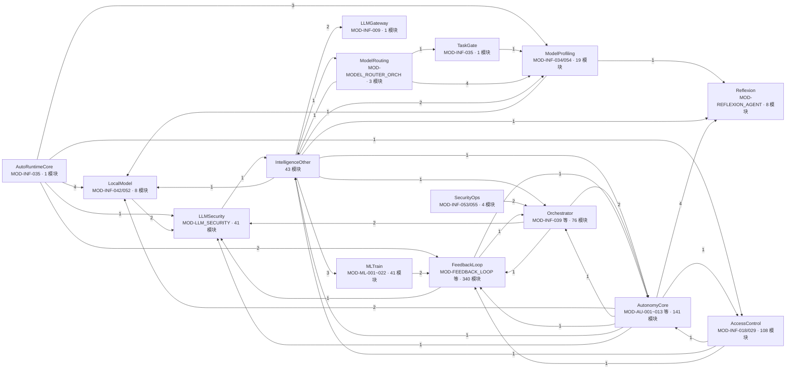

# 01 · AI 层模块依赖拓扑（跨域视图）

> **派生图声明**：本文是**视图不是真源**。生成时间 2026-08-29T23:47Z（本地 2026-08-30 07:47，UTC+8）；生成方式=aiarch 3.9 一次性批生成（长期「派生图生成器支持跨域 AI 层视图」待裁定，00 号文 §6.2 待办①）。若与真源漂移，以真源为准并重生成本文。
>
> **源真源**：depgraph PG `nodes`/`edges` 表（2026-08-30 实测快照：7893 节点/19846 边）；AI 层横切口径 = 03 号文 §2.4 裁定（AI 层不作为 depgraph 域存在，属横切视图）；簇清单 = [00_index.md](../implementation_plans/00_index.md) §5.2 施工图族。
>
> **口径注记**：`nodes.tags='ai_layer'` 实测仅 1 节点命中（src/zephyr/ml_train/ai_operator/），标签查询暂不能派生跨域视图；本图按 AI 层设施路径前缀聚合为簇（模块级 import_depends 边聚合为簇间边，权重=边数）。

## 簇清单（depgraph 实测，模块粒度）

| 簇 | 路径前缀 | 模块数 | 蓝图 ID | production | testing |
|---|---|---|---|---|---|
| AutoRuntimeCore | `trading/auto_runtime_core.py` | 1 | MOD-INF-035 | 1 | 0 |
| TaskGate | `trading/task_gate.py` | 1 | MOD-INF-035 | 1 | 0 |
| ModelProfiling | `intelligence/model_profiling/` | 19 | MOD-INF-034/054 | 16 | 0 |
| ModelRouting | `intelligence/model_routing/` | 3 | MOD-MODEL_ROUTER_ORCH | 0 | 0 |
| Reflexion | `intelligence/reflexion/` | 8 | MOD-REFLEXION_AGENT 等 | 6 | 0 |
| IntelligenceOther | `intelligence/`（其余） | 43 | MOD-INT-* 族 | 28 | 0 |
| Orchestrator | `orchestrator/` | 76 | MOD-INF-039/047/048、MOD-ORCH-* | 59 | 0 |
| AutonomyCore | `autonomy_core/` | 141 | MOD-AU-001~013、MOD-CONTEXT_ENGINE、MOD-FACTORY-*、MOD-EXE-* | 129 | 0 |
| SecurityOps | `security/ops/` | 4 | MOD-INF-053/055 | 2 | 1 |
| LLMSecurity | `security/llm_defense/` | 41 | MOD-LLM_SECURITY、MOD-SECLLM-002 | 30 | 0 |
| AccessControl | `security/access_control/` | 108 | MOD-INF-018/029 | 72 | 0 |
| LocalModel | `integration/local_model/` | 8 | MOD-INF-042/052 | 2 | 0 |
| LLMGateway | `infrastructure/pipeline/llm_gateway.py` | 1 | MOD-INF-009 | 1 | 0 |
| MLTrain | `ml_train/` | 41 | MOD-ML-* 族 | 30 | 0 |
| FeedbackLoop | `feedback_loop/` | 340 | MOD-FEEDBACK_LOOP、MOD-FBL-*、MOD-GATE_ENGINE | 309 | 0 |

> 注：MOD-CONTEXT_ENGINE 蓝图节点实测落在 `autonomy_core/` 前缀（context 子包），未单列成簇；ModuleFactory 前缀 `research/module_factory/` 实测 0 模块节点（GP1 待建），不入图。边权重为模块间 import 边计数，≥1 全列。
