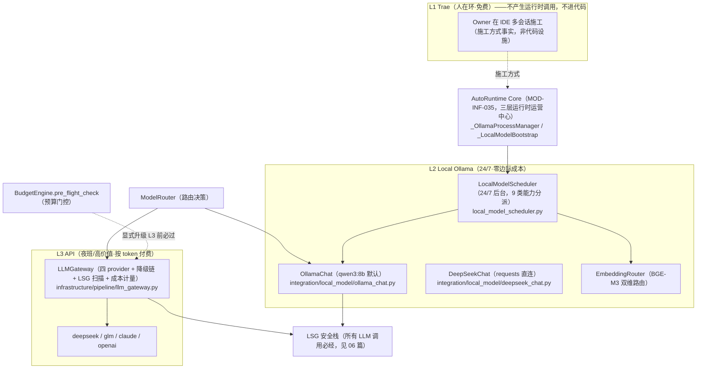

# 02 · 三层运行时编排图（L1 Trae / L2 Local Ollama / L3 API）

> **派生图声明**：本文是**视图不是真源**。生成时间 2026-08-29T23:47Z（本地 2026-08-30 07:47，UTC+8）；生成方式=aiarch 3.9 一次性批生成。若与真源漂移，以真源为准并重生成本文。
>
> **源真源**：[10_llm_infrastructure.md](../implementation_plans/10_llm_infrastructure.md) §2.1/§2.4/§3.1（三层运行时设计与设施盘点）+ `docs/02_enterprise_architecture/04_architecture_principles_decisions/README.md`「三层 AI 工作分配」+ AutoRuntime Core 蓝图（`docs/03_modules/_cross_layer/auto_runtime_core/blueprint.md`，「三层运行时运营中心」）。

## 既定口径（真源摘录）

- **三层分工**：L1 人在环免费 → L2 24/7 零成本 → L3 夜班/高价值付费（04 原则决策 README 既定表述）。
- **L1 不进代码**：61 号备忘已裁定不做 agent 编排系统；L1 是人在 IDE 的工作方式，建代码接口=过度工程（10 号文 §3.1）。
- **成本三角硬约束**：默认 L2、显式升级 L3（个人资金约束；BudgetEngine + ModelRouter 已有门控件）。
- **统一入口缺口**：L2 `ask()` 与 L3 `call(messages)` 两套签名不互通；薄门面统一入口属 GP1 施工项（10 号文 §2.2/§3.1），当前两客户端平行存在。
