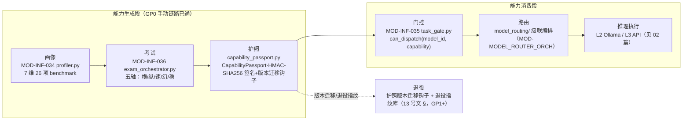

# 03 · 模型全生命周期流（画像→考试→护照→路由→推理→退役）

> **派生图声明**：本文是**视图不是真源**。生成时间 2026-08-29T23:47Z（本地 2026-08-30 07:47，UTC+8）；生成方式=aiarch 3.9 一次性批生成。若与真源漂移，以真源为准并重生成本文。
>
> **源真源**：[06_model_profiling_pipeline.md](../implementation_plans/06_model_profiling_pipeline.md) §2.1/§2.4（设施盘点与结案声明）+ MOD-INF-034（画像器/护照）/ MOD-INF-036（考试编排）/ MOD-INF-035（TaskGate）蓝图 + depgraph PG 簇实测（2026-08-30）。

## 既定口径（真源摘录）

- **链路现状**：画像/考试/护照/门控四环节代码各自 production，GP0 手动链路 5/5 PASS（P0-1~P0-5）；已产出 7 份护照（`data/brain/passports/`，deepseek-v4-flash/pro×thinking/non-thinking + qwen2.5-coder:14b/qwen3-coder:30b/qwen3:8b）。
- **画像 7 维 vs 考试五轴**：已实测裁定**互补不重复**（06 号文 §3.2）。
- **护照更新频率**：触发式更新（06 号文 §3.3 已裁定）。
- **未闭环段**：端到端自动闭环（自动画像→自动考试→自动发护照→自动门控调度器）未建，属 GP1+（06 号文结案声明）；护照落盘 schema 缺 cost/tool 字段，待下次 Standard 考试自然补齐（不单独施工）。
- **退役段**：指纹库与正式退役流为模块工厂/路由侧 GP1+ 项，本图以虚线标注设计意图。
