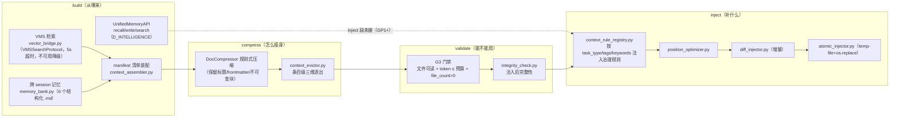

# 04 · 上下文与记忆数据流（Context Engine → 压缩 → 注入 → 记忆检索）

> **派生图声明**：本文是**视图不是真源**。生成时间 2026-08-29T23:47Z（本地 2026-08-30 07:47，UTC+8）；生成方式=aiarch 3.9 一次性批生成。若与真源漂移，以真源为准并重生成本文。
>
> **源真源**：[07_context_engine_build.md](../implementation_plans/07_context_engine_build.md) §2.1/§2.2/§2.4/§3.1（四段管道与设施盘点）+ 设施代码 `src/zephyr/autonomy_core/context/` + `src/zephyr/shared/io/doc_compressor.py` + D_INTELLIGENCE 域 `unified_memory_api.py`。

## 既定口径（真源摘录）

- **四段管道**：build→compress→validate→inject 职责分离，单段可替换可独立测试（07 号文 §3.1）；五段（+post-inject verify）已否决——integrity_check 已覆盖注入后校验。
- **Token 预算硬约束**：8000 token（单机 3090 24GB 约束），压缩与逐出是必选项。
- **压缩档位现状**：仅规则式单档落地；llm_summary（本地 Qwen 分 slot 摘要）/truncate 档为 GP1+（07 号文 §2.2）。
- **已知缺口**：inject 段生产空段（context_injector.py 返回空 InjectedContext）/InProcessContextEngine 未落地——均属 GP1+；boot_hooks 接线归 07 号文 Q2 Owner 项。
