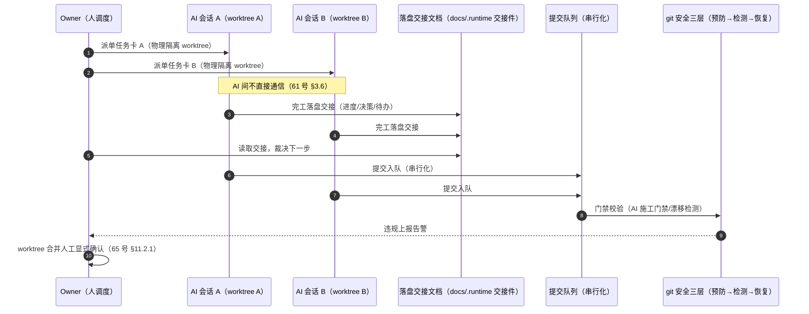

# 05 · 多 AI 协作时序图（单 AI 多会话 + 人调度 + 落盘交接）

> **派生图声明**：本文是**视图不是真源**。生成时间 2026-08-29T23:47Z（本地 2026-08-30 07:47，UTC+8）；生成方式=aiarch 3.9 一次性批生成。若与真源漂移，以真源为准并重生成本文。
>
> **源真源**：[08_multi_ai_concurrency_governance.md](../implementation_plans/08_multi_ai_concurrency_governance.md) §2.3/§3.1/§3.3（约束与协作形态设计）+ 61 号备忘 §2.3/§3.6 裁定（不做 agent 编排系统；AI 间不直接通信，交接靠文档落盘）+ 65 号备忘 §11.2.1（worktree 合并人工裁决）。

## 既定口径（真源摘录）

- **协作形态**：人调度多会话，**非 agent 自治编排**（61 号 §2.3 已裁定不做 agent 编排系统）；AI 间不直接通信，交接靠文档落盘（61 号 §3.6）。
- **会话隔离**：worktree 物理隔离；merge 必须用户显式确认——物理隔离 + 人工裁决合并正好匹配「人调度」模式，不需要自动合并 agent（08 号文 §3.1）。
- **并发安全**：提交队列串行化机制与冲突解决（08 号文 §3.3）；git 安全预防→检测→恢复三层闭环（§3.2）。
- **人力约束**：1 人全栈 + AI 协作者，无团队（08 号文 §2.3）。
