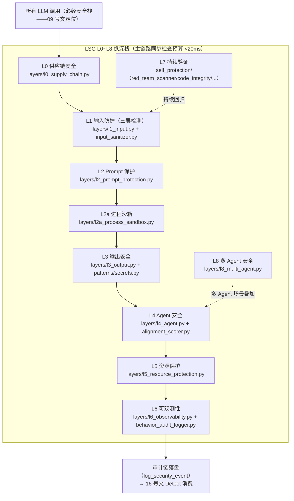

# 06 · LLM 安全栈 L0-L8 纵深防御图

> **派生图声明**：本文是**视图不是真源**。生成时间 2026-08-29T23:47Z（本地 2026-08-30 07:47，UTC+8）；生成方式=aiarch 3.9 一次性批生成。若与真源漂移，以真源为准并重生成本文。
>
> **源真源**：[09_llm_security_integration.md](../implementation_plans/09_llm_security_integration.md) §2.1（L0~L8 实现状态表，2026-08-17 磁盘实测口径）+ MOD-LLM_SECURITY 蓝图（`docs/03_modules/_cross_layer/large_language_model_security`，层内设计唯一真源）+ 代码实测 `src/zephyr/security/llm_defense/llm_security/layers/`。

## 层状态与剩余缺口（真源摘录，09 号文 §2.1）

| 层 | 职责 | 代码 | 剩余缺口（GP1+/蓝图侧） |
|---|---|---|---|
| L0 | 供应链安全 | `layers/l0_supply_chain.py` | MCP 深度安全加固部分；AI-BOM/模型卡扫描未登记 |
| L1 | 输入防护 | `layers/l1_input.py` + `input_sanitizer.py` | 间接注入误报调优；ToolResultTransform/编码逃逸部分 |
| L2 | Prompt 保护 | `layers/l2_prompt_protection.py` | 防泄露检测与模板持续同步 |
| L2a | 进程沙箱 | `layers/l2a_process_sandbox.py` | Docker/WASI 更强隔离（L3B 同族） |
| L3 | 输出安全 | `layers/l3_output.py` | 幻觉检测深度化（五层防御链） |
| L4 | Agent 安全 | `layers/l4_agent.py` | HITL 审批体验；长时域攻击防御部分 |
| L5 | 资源保护 | `layers/l5_resource_protection.py` | LSGPerformanceGuard 预算管理（蓝图 §40，0%） |
| L6 | 可观测性 | `layers/l6_observability.py` + `behavior_audit_logger.py` | 飞书告警 Webhook；日志膨胀治理 |
| L7 | 持续验证 | `self_protection/` 5 件 | Threat Intel 自动拉取；CI 安全门禁 workflow 未落盘 |
| L8 | 多 Agent 安全 | `layers/l8_multi_agent.py` | 级联注入防御扩展（本项目规模小，低优先） |

## 既定口径

- **延迟约束**：LSG 主链路同步检查总预算 <20ms，单次请求 P95<50ms / P99<100ms；异步检查（L1C 越狱 LLM 辅助、L3D 幻觉、L3B 沙箱）不计入主链路（09 号文 §2.3）。
- **硬件约束**：LSG 信号处理可用 4 核、GPU 不参与；LLM 辅助检测必须走本地小模型或异步排队，不挤占推理 GPU（09 号文 §2.3）。
- **接口**：L6 安全事件经 `behavior_audit_logger.log_security_event()` 写审计链，16 号文 Detect 环节消费；KILLSWITCH 触发时 LSG 侧 = L5 全量熔断 + fail-closed 闸门关闭（16 号文 §4.5 接口节）。
