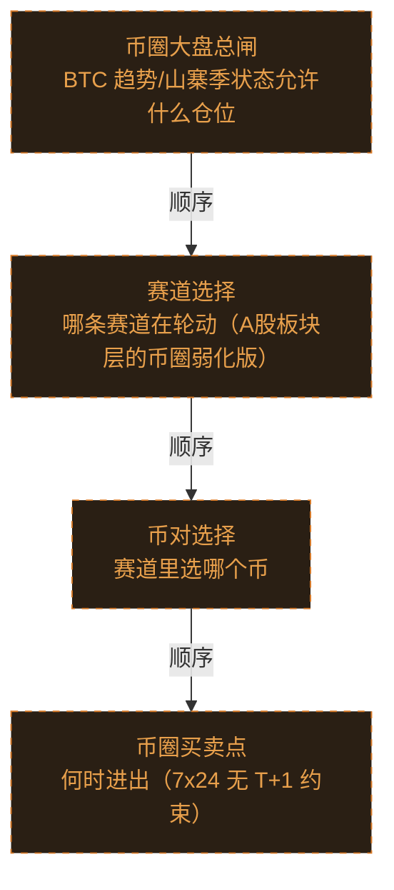

# 交易决策地图 · 总览·横切层与四流骨架（自动派生）

> **本文件由生成器自动派生，禁止手编**。真源=`config/trading_decision_map.yaml`（改动后 git commit → 运行时启动自动重生成）。
> 规模：4 节点｜🔴设计态（红节点）4｜📄paper 实盘执行 0｜图例：橙虚线=设计态，蓝底=📄paper 实盘执行节点（D18 治理阶梯）。
> 网页版（可缩放）：[_zoomable_html/trading_map_00_panorama.html](_zoomable_html/trading_map_00_panorama.html)

## 关系图

## 节点明细

| node_id | 名称 | 决策问题 | 时点 | activation | ai_autonomy | 模块锚 | 策略挂载 |
|---|---|---|---|---|---|---|---|
| TDM-C-L1🔴 | 币圈大盘总闸 | BTC 趋势/山寨季状态允许什么仓位 | 持续 | — | — | — | — |
| TDM-C-L2🔴 | 赛道选择 | 哪条赛道在轮动（A股板块层的币圈弱化版） | 持续 | — | — | — | — |
| TDM-C-L3🔴 | 币对选择 | 赛道里选哪个币 | 持续 | — | — | — | — |
| TDM-C-L4🔴 | 币圈买卖点 | 何时进出（7x24 无 T+1 约束） | 持续 | — | — | — | — |

## 挂载清单

（本文件无挂载）
