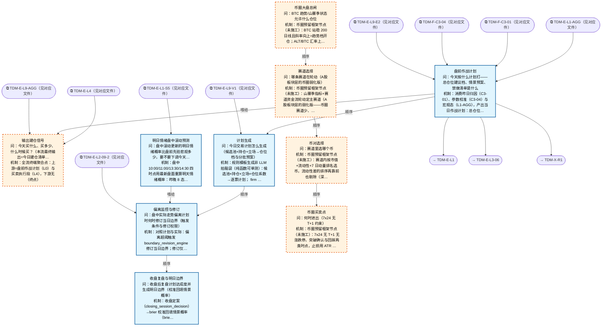

# 交易决策地图 · 总览·横切层与四流骨架（自动派生）

> **本文件由生成器自动派生，禁止手编**。真源=`config/trading_decision_map.yaml`（改动后 git commit → 运行时启动自动重生成）。
> 规模：10 节点｜🔴设计态（红节点）5｜📄paper 实盘执行 0｜图例：橙虚线=设计态，蓝底=📄paper 实盘执行节点（D18 治理阶梯）。
> 每个节点的完整机制（怎么算/依据什么/裁定原文）见下方「节点详解」区。
> **[可缩放 HTML 版 / Zoomable HTML](http://localhost:8765/docs/02_enterprise_architecture/10_trading_map/_zoomable_html/trading_map_00_panorama.html)** — Ctrl+滚轮缩放 ｜ 双击重置 ｜ Ctrl+Shift+D 切换拖动/选择模式

## 关系图

## 节点明细（速览）

| node_id | 名称 | 怎么算（大白话） | 时点 | 档位 | 模块锚 |
|---|---|---|---|---|---|
| TDM-E-FLOW🔴 | 输出建仓信号 | 全流终端聚合点：上游=盘前作战计划（L0）与买卖执行段（L4），下游无（终点）。组成=计划（L0）→选什么（L2 板块/L3 个股）→怎么买（L4 执行）。本节点只承载结构与指向，不写机制不存实时数据。 | 持续 | — | — |
| TDM-E-L0 | 盘前作战计划 | 消费昨日归因（C3-01）、参数校准（C3-04）与宏观态（L1-AGG），产出当日作战计划：总仓位建议档、 分批建仓预案、禁做清单（sit_out_list 三源合成）、应急触发线。计划是输入不是第二决策点—— 开闸仍由 L1 大盘总闸唯一裁定（Owner 2026-09-09 定界）。跨日闭环：盘后 L0-03 生成明日边界， 次日盘前 premarket_constraint_loader 装载回本节点（DAG 不画跨日自环，语义记此）。 | 盘前 | daily_review | MOD-PLAN-018 |
| TDM-E-L0-01 | 计划生成 | 规则模板生成非 LLM 拍脑袋（纯函数可单测）：候选池×持仓×立场×仓位系数→逐票计划； firm 单票 8% 硬顶恒生效，A 股整手折算，不足一手跳过+notes 留痕。产出=作战室"今日交易计划"卡。情景概率输入=scenario_probability_model（DAL-SCEN-PROB，MOD-PLAN-017）：技术面因子×相似日统计 出九格（涨/跌/震荡×幅度档）情景概率，计划生成据此定当日立场档（2026-09-20 final3 P5 接线）。 | 盘前 | auto | MOD-PLAN-011 |
| TDM-E-L0-02 | 偏离监控与修订 | 对照计划与实际：偏离超阈触发 boundary_revision_engine 修订当日边界；修订仅当日有效， 跨日/过期消费拒发（明日边界归 L0-03）。计划外操作记执行不一致（作战室归因）。 | 盘中 | auto | MOD-PLAN-022 |
| TDM-E-L0-03 | 收盘复盘与明日边界 | 收盘定案（closing_session_decision）→brier 校准回填情景概率（brier_calibration）→ 盘后生成明日边界（tomorrow_boundary_planner；边界层坏=致命暂停操作）。明日边界喂次日买卖融合（对应本图 L3-06 环境开关/L4 执行/X 离场的预案约束）。 | 盘后 | auto | MOD-PLAN-001 |
| TDM-E-L0-04 | 明日情绪盘中滚动预测 | 盘中 10:00/11:00/13:30/14:30 四时点用最新盘面重算明天情绪概率：昨晚 8 态转移先验 打底（next_day_8state_forecast），相似日推理按今天盘中走势找历史相似日修正 （similar_day_inference），Brier 校准连错的输入自动降权（brier_calibration）。合成结果比盘前先验悲观一档以上→发"明日降档预警"喂偏离监控提前减仓（拿不准明天 就今天减）。只出概率不出点位；预警是建议，修订权在偏离监控。昨日先验由 L0-03 盘后落库、本节点盘中读缓存。学界佐证：隔夜收益延续+盘中情绪可更新（Lou-Poli-Gao 经典；Renault JBF 2017 半小时情绪更新预测尾盘；SSRN 5599654 CSI300 隔夜预测）。组合器=intraday_tomorrow_forecast（纯函数核零 IO，三零件产出由调用方注入）： 预警判据=融合最可能态悲观档比先验最可能态悲观 ≥1 档（悲观档位序 8 态全序见蓝图 §2）。 | 盘中 | auto | MOD-PLAN-025 |
| TDM-C-L1🔴 | 币圈大盘总闸 | 币圈预留框架节点（未施工）：BTC 站稳 200 日线且斜率向上=趋势档开仓；ALT/BTC 汇率上行=山寨季开进攻档；BTC 破位则总闸收紧只留核心仓。v1 空壳，等 A 股链路验证后移植。 | 持续 | — | — |
| TDM-C-L2🔴 | 赛道选择 | 币圈预留框架节点（未施工）：山寨季指标+赛道资金流轮动定主赛道（A 股板块层的弱化版——币圈赛道少、轮动快，直接看资金流排名前 3）。 | 持续 | — | — |
| TDM-C-L3🔴 | 币对选择 | 币圈预留框架节点（未施工）：赛道内按市值+流动性+7 日动量排名选币，流动性差的排序再靠前也剔除（深度不足吃不掉滑点）。 | 持续 | — | — |
| TDM-C-L4🔴 | 币圈买卖点 | 币圈预留框架节点（未施工）：7x24 无 T+1 无涨跌停，突破确认与回踩两类时点，止损用 ATR 倍数（2×ATR）移动式。 | 持续 | — | — |

## 节点详解（机制怎么产生）

### TDM-E-FLOW 输出建仓信号 🔴

**问**：今天买什么、买多少、什么时候买？（本流最终输出=今日建仓清单）

**机制（怎么算）**：全流终端聚合点：上游=盘前作战计划（L0）与买卖执行段（L4），下游无（终点）。组成=计划（L0）→选什么（L2 板块/L3 个股）→怎么买（L4 执行）。本节点只承载结构与指向，不写机制不存实时数据。

**治理**：激活=continuous

### TDM-E-L0 盘前作战计划

**问**：今天按什么计划打——总仓位建议档、情景预案、禁做清单是什么

**机制（怎么算）**：消费昨日归因（C3-01）、参数校准（C3-04）与宏观态（L1-AGG），产出当日作战计划：总仓位建议档、 分批建仓预案、禁做清单（sit_out_list 三源合成）、应急触发线。计划是输入不是第二决策点—— 开闸仍由 L1 大盘总闸唯一裁定（Owner 2026-09-09 定界）。跨日闭环：盘后 L0-03 生成明日边界， 次日盘前 premarket_constraint_loader 装载回本节点（DAG 不画跨日自环，语义记此）。

**治理**：激活=premarket ｜ 档位=daily_review ｜ 模块=MOD-PLAN-018

### TDM-E-L0-01 计划生成

**问**：今日交易计划怎么生成（候选池+持仓+立场→仓位档与分批预案）

**机制（怎么算）**：规则模板生成非 LLM 拍脑袋（纯函数可单测）：候选池×持仓×立场×仓位系数→逐票计划； firm 单票 8% 硬顶恒生效，A 股整手折算，不足一手跳过+notes 留痕。产出=作战室"今日交易计划"卡。情景概率输入=scenario_probability_model（DAL-SCEN-PROB，MOD-PLAN-017）：技术面因子×相似日统计 出九格（涨/跌/震荡×幅度档）情景概率，计划生成据此定当日立场档（2026-09-20 final3 P5 接线）。

**依据锚**：算法 DAL-SCEN-PROB
**治理**：激活=premarket ｜ 档位=auto ｜ 模块=MOD-PLAN-011

### TDM-E-L0-02 偏离监控与修订

**问**：盘中实际走势偏离计划时何时修订当日边界（触发条件与修订权限）

**机制（怎么算）**：对照计划与实际：偏离超阈触发 boundary_revision_engine 修订当日边界；修订仅当日有效， 跨日/过期消费拒发（明日边界归 L0-03）。计划外操作记执行不一致（作战室归因）。

**治理**：激活=intraday ｜ 档位=auto ｜ 模块=MOD-PLAN-022

### TDM-E-L0-03 收盘复盘与明日边界

**问**：收盘后复盘计划达成度并生成明日边界（校准回填情景概率）

**机制（怎么算）**：收盘定案（closing_session_decision）→brier 校准回填情景概率（brier_calibration）→ 盘后生成明日边界（tomorrow_boundary_planner；边界层坏=致命暂停操作）。明日边界喂次日买卖融合（对应本图 L3-06 环境开关/L4 执行/X 离场的预案约束）。

**依据锚**：算法 DAL-8STATE-FCST
**治理**：激活=postmarket ｜ 档位=auto ｜ 模块=MOD-PLAN-001

### TDM-E-L0-04 明日情绪盘中滚动预测

**问**：盘中滚动更新的明日情绪概率比盘前先验悲观多少，要不要下调今天仓位档

**机制（怎么算）**：盘中 10:00/11:00/13:30/14:30 四时点用最新盘面重算明天情绪概率：昨晚 8 态转移先验 打底（next_day_8state_forecast），相似日推理按今天盘中走势找历史相似日修正 （similar_day_inference），Brier 校准连错的输入自动降权（brier_calibration）。合成结果比盘前先验悲观一档以上→发"明日降档预警"喂偏离监控提前减仓（拿不准明天 就今天减）。只出概率不出点位；预警是建议，修订权在偏离监控。昨日先验由 L0-03 盘后落库、本节点盘中读缓存。学界佐证：隔夜收益延续+盘中情绪可更新（Lou-Poli-Gao 经典；Renault JBF 2017 半小时情绪更新预测尾盘；SSRN 5599654 CSI300 隔夜预测）。组合器=intraday_tomorrow_forecast（纯函数核零 IO，三零件产出由调用方注入）： 预警判据=融合最可能态悲观档比先验最可能态悲观 ≥1 档（悲观档位序 8 态全序见蓝图 §2）。

**依据锚**：数据 DS-150、DS-082、DS-107 ｜ 算法 DAL-8STATE-FCST
**治理**：激活=intraday ｜ 档位=auto ｜ 模块=MOD-PLAN-025

### TDM-C-L1 币圈大盘总闸 🔴

**问**：BTC 趋势/山寨季状态允许什么仓位

**机制（怎么算）**：币圈预留框架节点（未施工）：BTC 站稳 200 日线且斜率向上=趋势档开仓；ALT/BTC 汇率上行=山寨季开进攻档；BTC 破位则总闸收紧只留核心仓。v1 空壳，等 A 股链路验证后移植。

**治理**：激活=continuous

### TDM-C-L2 赛道选择 🔴

**问**：哪条赛道在轮动（A股板块层的币圈弱化版）

**机制（怎么算）**：币圈预留框架节点（未施工）：山寨季指标+赛道资金流轮动定主赛道（A 股板块层的弱化版——币圈赛道少、轮动快，直接看资金流排名前 3）。

**治理**：激活=continuous

### TDM-C-L3 币对选择 🔴

**问**：赛道里选哪个币

**机制（怎么算）**：币圈预留框架节点（未施工）：赛道内按市值+流动性+7 日动量排名选币，流动性差的排序再靠前也剔除（深度不足吃不掉滑点）。

**治理**：激活=continuous

### TDM-C-L4 币圈买卖点 🔴

**问**：何时进出（7x24 无 T+1 约束）

**机制（怎么算）**：币圈预留框架节点（未施工）：7x24 无 T+1 无涨跌停，突破确认与回踩两类时点，止损用 ATR 倍数（2×ATR）移动式。

**治理**：激活=continuous

## 挂载清单

**模块锚（MOD）**：MOD-PLAN-001 src/zephyr/plan_engine/tomorrow_boundary_planner.py、MOD-PLAN-011 src/zephyr/plan_engine/daily_trade_plan.py、MOD-PLAN-018 src/zephyr/plan_engine/daily_warroom_pipeline.py、MOD-PLAN-022 src/zephyr/plan_engine/plan_deviation_monitor.py、MOD-PLAN-025 src/zephyr/plan_engine/intraday_tomorrow_forecast.py
