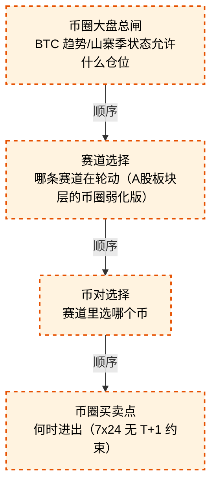

# 交易决策地图 · 总览·横切层与四流骨架（自动派生）

> **本文件由生成器自动派生，禁止手编**。真源=`config/trading_decision_map.yaml`（改动后 git commit → 运行时启动自动重生成）。
> 规模：4 节点｜🔴设计态（红节点）4｜📄paper 实盘执行 0｜图例：橙虚线=设计态，蓝底=📄paper 实盘执行节点（D18 治理阶梯）。
> **[可缩放 HTML 版 / Zoomable HTML](http://localhost:8765/docs/02_enterprise_architecture/10_trading_map/_zoomable_html/trading_map_00_panorama.html)** — Ctrl+滚轮缩放 ｜ 双击重置 ｜ Ctrl+Shift+D 切换拖动/选择模式

## 关系图

## 节点明细

| node_id | 名称 | 怎么算（大白话） | 时点 | 档位 | 模块锚 |
|---|---|---|---|---|---|
| TDM-C-L1🔴 | 币圈大盘总闸 | 币圈预留框架节点（未施工）：BTC 站稳 200 日线且斜率向上=趋势档开仓；ALT/BTC 汇率上行=山寨季开进攻档；BTC 破位则总闸收紧只留核心仓。 v1 空壳，等 A 股链路验证后移植。 | 持续 | — | — |
| TDM-C-L2🔴 | 赛道选择 | 币圈预留框架节点（未施工）：山寨季指标+赛道资金流轮动定主赛道（A 股板块层的弱化版——币圈赛道少、轮动快，直接看资金流排名前 3）。 | 持续 | — | — |
| TDM-C-L3🔴 | 币对选择 | 币圈预留框架节点（未施工）：赛道内按市值+流动性+7 日动量排名选币，流动性差的排序再靠前也剔除（深度不足吃不掉滑点）。 | 持续 | — | — |
| TDM-C-L4🔴 | 币圈买卖点 | 币圈预留框架节点（未施工）：7x24 无 T+1 无涨跌停，突破确认与回踩两类时点，止损用 ATR 倍数（2×ATR）移动式。 | 持续 | — | — |

## 挂载清单

（本文件无挂载）
