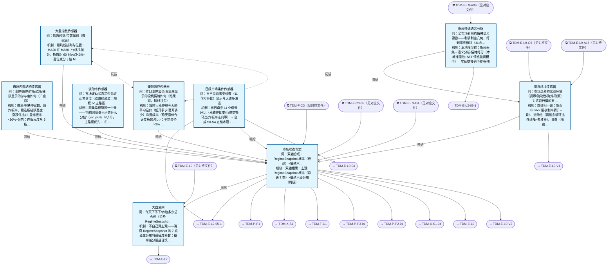

# 交易决策地图 · 建仓流 L1·大盘判定（四层温度计）（自动派生）

> **本文件由生成器自动派生，禁止手编**。真源=`config/trading_decision_map.yaml`（改动后 git commit → 运行时启动自动重生成）。
> 规模：9 节点｜🔴设计态（红节点）0｜📄paper 实盘执行 0｜图例：橙虚线=设计态，蓝底=📄paper 实盘执行节点（D18 治理阶梯）。
> 每个节点的完整机制（怎么算/依据什么/裁定原文）见下方「节点详解」区。
> **[可缩放 HTML 版 / Zoomable HTML](http://localhost:8765/docs/02_enterprise_architecture/10_trading_map/_zoomable_html/trading_map_01_e_l1_regime.html)** — Ctrl+滚轮缩放 ｜ 双击重置 ｜ Ctrl+Shift+D 切换拖动/选择模式

## 关系图

## 节点明细（速览）

| node_id | 名称 | 怎么算（大白话） | 时点 | 档位 | 模块锚 |
|---|---|---|---|---|---|
| TDM-E-L1 | 大盘总闸 | 不自己算宏观——消费 RegimeSnapshot 的 7 态概率分布当谨慎度系数：概率越分裂越谨慎；没供数时同样按最谨慎档处理（R-055a 数值侧 fail-closed：缺数落地板值 0.30 并带 risk_signal_source 溯源，禁把降级读作'确无风险'）。再查六段情绪预算带（如吸筹 30-50%/点火 50-70%/扩张 60-80%/亢奋封顶 30% 只卖不买），月级定大档、日级水温微调，输出当日总仓位上限。已建成叠加波动率目标化仓位系数（凯利简版：滚动 σ 目标化）： src/zephyr/pf_alloc/core/vol_target_allocator.py（MOD-BT-082）， 蓝图=docs/_working/2026-09-13-tdm-upgrade-blueprint.md；Phase 2 完整凯利待车道 E 分布预测。（2026-09-15 ALGO_FLOW 块出仓至 docs/03_modules/_domain_regime/algo_flow/regime_detector.yaml：算法推导图外迁，算法口径不变） （裁定#304 2026-09-17：HMM 组件跨季锚定落地——r4 槽=训练窗负斜率、r1-r3 槽=波动率升序， 态名跨季可比；实证警示 r4/r10/r1 无稳定方向信息（反弹溢价），谨慎度按风险分档口径读，方向判别归因子层） （R-055a 2026-09-18 数值侧 fail-closed，方向=加严：RiskSignal 缺供数不再取 1.0（原口径把'没数'读成 '没风险'=fail-open），改落地板值 0.30=本模块聚合 clamp 下界；主腿门改判正证据——只有 13 参数齐且 #1≥1.0 才屏蔽覆盖层危机概率，断供时 r10 危机概率保留不清零。实测同一危机场景断一条腿：改前 Shrinkage 0.255→0.800 （放量 3.137 倍、dominant 从 r10 翻成 r1），改后 0.255→0.255（只收紧不放松）；{} / None / params 空壳 / 缺 #1 四形态与'13 参数全正常'不再逐位相同，新增 risk_signal_source（params_supplied / neutral_fail_closed） 与 degraded_legs + WARNING 三件溯源。检测器档 0.80 与分配器档 0.30 统一到哪一档=A16 待 Owner 裁定， 本次未改任何已定档位数值） | 盘前 | — | MOD-REGIME-001 |
| TDM-E-L1-S1 | 大盘指数传感器 | 看均线排列与位置：MA20 在 MA60 上=多头加分，指数距 60 日高点<3%=高位减分；破 MA20 减一档、破 MA60 减两档。输出指数趋势分（-2~+2）。 | 盘前 | — | MOD-REGIME-016 |
| TDM-E-L1-S2 | 市场内部结构传感器 | 数涨停/跌停家数、算炸板率、看连板梯队高度：涨跌停比>3 且炸板率<30%=强势；连板高度从 5 板断崖到 2 板=退潮预警。广度结构给市场参与度打分。（2026-09-15 ALGO_FLOW 块出仓至 docs/03_modules/_domain_signal/algo_flow/limit_up_followthrough.yaml：算法推导图外迁，算法口径不变） | 盘中 | — | MOD-SIG-078 |
| TDM-E-L1-S3 | 赚钱效应传感器 | 算昨日涨停股今天的平均溢价（低开多少/高开多少）和晋级率（昨天涨停今天又板的占比）：平均溢价>2% 且晋级率>50%=情绪健康；连续两天负溢价=退潮确认。这是短线最领先的指标——打板资金赚不赚钱直接决定明天还敢不敢接。注：2026-09-13 DEDUP 批将本节点引用的公共分析原语抽取至 core/analysis_utils 共享实现，行为等价 （2026-09-15 ALGO_FLOW 块出仓至 docs/03_modules/_domain_signal/algo_flow/lhb_premium_analyzer.yaml：算法推导图外迁，算法口径不变） | 盘前 | — | MOD-SIG-057 |
| TDM-E-L1-S4 | 波动率传感器 | 两条路径算同一个量——"当前恐慌处于历史什么分位"（vix_pct∈[0,1]），主路径优先： ① 主路径（期权 IV 曲面）：取 50ETF+300ETF 期权 IV 曲面，按 ATM 筛子 ／abs(delta)-0.5／<0.15   选平值档，跨到期日插值成 CBOE 简化 VIX，再取 250 日滚动分位。SVX-1-P0 治本（2026-09-16）：进料口此前未声明 delta 列⇒全库 delta 恒 0⇒ATM 筛子   把 9653/9653 行全排除⇒主路径半年零产出且静默回退；现 delta 由本行反解 iv 经   BS 真源 calc_bs_greeks 导出，反解失败的行不落库并出声，消费侧 iv<=0 伪装值不入池、   曲面有行而池空必发 WARNING（区分"进料口事故"与"当日确无平值档"两种成因）。② 后备路径（仅依赖 close）：期权数据缺失时用**下行半偏差分位** synthetic_vix_pct——   只计负收益的年化下行波动率取 250 日分位，危机特异性强于总波动率。两路径均失败⇒返回 None⇒s1_vix_panic/s2_vix 回退 vol_pct（C1 不退化）。语义：波动两端的行情都不适合正常仓位，故进决策的是分位而非绝对值。（2026-09-15 ALGO_FLOW 块出仓至 docs/03_modules/_domain_regime/algo_flow/synthetic_vix.yaml） | 盘前 | — | MOD-REGIME-002 |
| TDM-E-L1-S0 | 宏观环境传感器 | 四维扫一遍：货币（Shibor 隔夜利率骤升=紧）、流动性（两融余额环比连续降=去杠杆）、海外（隔夜纳指跌>2%=压制）、政策（监管动态人工录入）。输出宏观支撑/压制分。 | 盘前 | — | MOD-ALT-010 |
| TDM-E-L1-S0-1 | 新闻情绪语义分析 | 本地模型链：新闻采集→语义分析/情绪打分（本地推理池+SFT 情感微调模型）→实体链接到个股/板块。输出市场级+板块级情绪读数，喂 L1-S0 宏观判定与 L2-09 事件链。新闻/图谱流水线本体是数据底座不进图 （经 DS/module_ref 引用，同预案引擎先例）。（2026-09-15 ALGO_FLOW 块出仓至 docs/03_modules/_domain_intelligence/algo_flow/news_sentiment_analyzer.yaml：算法推导图外迁，算法口径不变） | 持续 | auto | MOD-INT-AISA |
| TDM-E-L1-S5 | 日级市场条件传感器 | 当日盘中 11 个信号环比（涨跌停比变化/成交额环比/炸板率走向等）→ 合成 S0-S4 五档水温：水烫=当日可激进，水冰=当日只看不动。9:35 首算，盘中可更新，是唯一盘中可变的 L1 输入。 | 盘中 | — | MOD-SIG-135 |
| TDM-E-L1-AGG | 市场状态判定 | 双轴相乘：宏观 RegimeSnapshot 概率（月级 7 态）×情绪六段分布（周级）。两轴指向一致=直接取结论；指向分裂（熵值超阈）=按'就低不就高'仲裁；缺供数时按最谨慎档处置（R-055a fail-closed，细则见下）。输出三件套：预算带（给 C1）+六段状态（给全流）+策略路由（哪些 sleeve 今天开），一次判定 broadcast 全图。（2026-09-15 ALGO_FLOW 块出仓至 docs/03_modules/_domain_regime/algo_flow/regime_detector.yaml：算法推导图外迁，算法口径不变； 裁定#304 2026-09-17：HMM 组件跨季锚定落地（r4=负斜率槽，r1-r3=波动率升序），r4/r10/r1 方向语义退役， 概率轴消费口径=风险分档，方向判别归因子层； 裁定 R-055a 2026-09-18：本节点降级口径由 fail-open 改 fail-closed——RiskSignal 缺供数（整包缺 / params 空壳 / 主腿 #1 为 NULL）不再取 1.0，改落地板值 0.30，且主腿未报平静时不得把覆盖层危机概率清零。实测危机中断一条腿 Shrinkage 从放量 3.137 倍（0.255→0.800、dominant r10→r1）改为持平收紧（0.255）；四形态缺数与 13 参数全正常 （0.800）可区分，新增 risk_signal_source=neutral_fail_closed 溯源。档位数值未动，两套档表统一到哪一档待 A16 裁定） | 盘前 | — | MOD-REGIME-001 |

## 节点详解（机制怎么产生）

### TDM-E-L1 大盘总闸

**问**：今天下不下单/给多少总仓位（消费 RegimeSnapshot 概率=谨慎度，六段预算带见 C1）

**机制（怎么算）**：不自己算宏观——消费 RegimeSnapshot 的 7 态概率分布当谨慎度系数：概率越分裂越谨慎；没供数时同样按最谨慎档处理（R-055a 数值侧 fail-closed：缺数落地板值 0.30 并带 risk_signal_source 溯源，禁把降级读作'确无风险'）。再查六段情绪预算带（如吸筹 30-50%/点火 50-70%/扩张 60-80%/亢奋封顶 30% 只卖不买），月级定大档、日级水温微调，输出当日总仓位上限。已建成叠加波动率目标化仓位系数（凯利简版：滚动 σ 目标化）： src/zephyr/pf_alloc/core/vol_target_allocator.py（MOD-BT-082）， 蓝图=docs/_working/2026-09-13-tdm-upgrade-blueprint.md；Phase 2 完整凯利待车道 E 分布预测。（2026-09-15 ALGO_FLOW 块出仓至 docs/03_modules/_domain_regime/algo_flow/regime_detector.yaml：算法推导图外迁，算法口径不变） （裁定#304 2026-09-17：HMM 组件跨季锚定落地——r4 槽=训练窗负斜率、r1-r3 槽=波动率升序， 态名跨季可比；实证警示 r4/r10/r1 无稳定方向信息（反弹溢价），谨慎度按风险分档口径读，方向判别归因子层） （R-055a 2026-09-18 数值侧 fail-closed，方向=加严：RiskSignal 缺供数不再取 1.0（原口径把'没数'读成 '没风险'=fail-open），改落地板值 0.30=本模块聚合 clamp 下界；主腿门改判正证据——只有 13 参数齐且 #1≥1.0 才屏蔽覆盖层危机概率，断供时 r10 危机概率保留不清零。实测同一危机场景断一条腿：改前 Shrinkage 0.255→0.800 （放量 3.137 倍、dominant 从 r10 翻成 r1），改后 0.255→0.255（只收紧不放松）；{} / None / params 空壳 / 缺 #1 四形态与'13 参数全正常'不再逐位相同，新增 risk_signal_source（params_supplied / neutral_fail_closed） 与 degraded_legs + WARNING 三件溯源。检测器档 0.80 与分配器档 0.30 统一到哪一档=A16 待 Owner 裁定， 本次未改任何已定档位数值）

**依据锚**：因子 FCT-SENT-009、FCT-TECH-062、FCT-TECH-061 ｜ 数据 DS-150 ｜ 策略挂载 STR-VREV-025、STR-VREV-026、STR-MOMTREND-033、STR-VREV-027
**治理**：激活=premarket ｜ 模块=MOD-REGIME-001

### TDM-E-L1-S1 大盘指数传感器

**问**：指数趋势/位置如何（数据面）

**机制（怎么算）**：看均线排列与位置：MA20 在 MA60 上=多头加分，指数距 60 日高点<3%=高位减分；破 MA20 减一档、破 MA60 减两档。输出指数趋势分（-2~+2）。

**依据锚**：数据 DS-150 ｜ 算法 DAL-MA-ALIGN ｜ 周期 CYC-STAT-001、CYC-STAT-004、CYC-STAT-013
**治理**：激活=premarket ｜ 模块=MOD-REGIME-016

### TDM-E-L1-S2 市场内部结构传感器

**问**：涨停/跌停/炸板/连板梯队显示的参与度如何（广度面）

**机制（怎么算）**：数涨停/跌停家数、算炸板率、看连板梯队高度：涨跌停比>3 且炸板率<30%=强势；连板高度从 5 板断崖到 2 板=退潮预警。广度结构给市场参与度打分。（2026-09-15 ALGO_FLOW 块出仓至 docs/03_modules/_domain_signal/algo_flow/limit_up_followthrough.yaml：算法推导图外迁，算法口径不变）

**依据锚**：数据 DS-082、DS-108 ｜ 算法 DAL-BREADTH-SCORE
**治理**：激活=intraday ｜ 模块=MOD-SIG-078

### TDM-E-L1-S3 赚钱效应传感器

**问**：昨日涨停溢价/晋级率显示的投机情绪如何（结果面，短线领先）

**机制（怎么算）**：算昨日涨停股今天的平均溢价（低开多少/高开多少）和晋级率（昨天涨停今天又板的占比）：平均溢价>2% 且晋级率>50%=情绪健康；连续两天负溢价=退潮确认。这是短线最领先的指标——打板资金赚不赚钱直接决定明天还敢不敢接。注：2026-09-13 DEDUP 批将本节点引用的公共分析原语抽取至 core/analysis_utils 共享实现，行为等价 （2026-09-15 ALGO_FLOW 块出仓至 docs/03_modules/_domain_signal/algo_flow/lhb_premium_analyzer.yaml：算法推导图外迁，算法口径不变）

**依据锚**：数据 DS-082、DS-107
**治理**：激活=premarket ｜ 模块=MOD-SIG-057

### TDM-E-L1-S4 波动率传感器

**问**：市场波动状态是否允许正常仓位（双路径通道：期权 IV 主路径 + 合成 VIX 后备）

**机制（怎么算）**：两条路径算同一个量——"当前恐慌处于历史什么分位"（vix_pct∈[0,1]），主路径优先： ① 主路径（期权 IV 曲面）：取 50ETF+300ETF 期权 IV 曲面，按 ATM 筛子 |abs(delta)-0.5|<0.15   选平值档，跨到期日插值成 CBOE 简化 VIX，再取 250 日滚动分位。SVX-1-P0 治本（2026-09-16）：进料口此前未声明 delta 列⇒全库 delta 恒 0⇒ATM 筛子   把 9653/9653 行全排除⇒主路径半年零产出且静默回退；现 delta 由本行反解 iv 经   BS 真源 calc_bs_greeks 导出，反解失败的行不落库并出声，消费侧 iv<=0 伪装值不入池、   曲面有行而池空必发 WARNING（区分"进料口事故"与"当日确无平值档"两种成因）。② 后备路径（仅依赖 close）：期权数据缺失时用**下行半偏差分位** synthetic_vix_pct——   只计负收益的年化下行波动率取 250 日分位，危机特异性强于总波动率。两路径均失败⇒返回 None⇒s1_vix_panic/s2_vix 回退 vol_pct（C1 不退化）。语义：波动两端的行情都不适合正常仓位，故进决策的是分位而非绝对值。（2026-09-15 ALGO_FLOW 块出仓至 docs/03_modules/_domain_regime/algo_flow/synthetic_vix.yaml）

**依据锚**：数据 DS-150
**治理**：激活=premarket ｜ 模块=MOD-REGIME-002

### TDM-E-L1-S0 宏观环境传感器

**问**：市场之外的宏观环境（货币/流动性/海外/政策）对这段行情的支撑或压制

**机制（怎么算）**：四维扫一遍：货币（Shibor 隔夜利率骤升=紧）、流动性（两融余额环比连续降=去杠杆）、海外（隔夜纳指跌>2%=压制）、政策（监管动态人工录入）。输出宏观支撑/压制分。

**依据锚**：数据 DS-098 ｜ 事件 EVT-MACRO-001 ｜ 宏观 MAC-CN-005、MAC-CN-006、MAC-CN-007、MAC-CN-008、MAC-CN-009、MAC-CN-011、MAC-US-001、MAC-US-002
**治理**：激活=premarket ｜ 模块=MOD-ALT-010

### TDM-E-L1-S0-1 新闻情绪语义分析

**问**：全市场新闻的情绪语义读数——利多利空几何、打到哪些板块（本地模型打分）

**机制（怎么算）**：本地模型链：新闻采集→语义分析/情绪打分（本地推理池+SFT 情感微调模型）→实体链接到个股/板块。输出市场级+板块级情绪读数，喂 L1-S0 宏观判定与 L2-09 事件链。新闻/图谱流水线本体是数据底座不进图 （经 DS/module_ref 引用，同预案引擎先例）。（2026-09-15 ALGO_FLOW 块出仓至 docs/03_modules/_domain_intelligence/algo_flow/news_sentiment_analyzer.yaml：算法推导图外迁，算法口径不变）

**治理**：激活=continuous ｜ 档位=auto ｜ 模块=MOD-INT-AISA

### TDM-E-L1-S5 日级市场条件传感器

**问**：当日盘面骤变读数（11 信号环比）显示今天该多激进

**机制（怎么算）**：当日盘中 11 个信号环比（涨跌停比变化/成交额环比/炸板率走向等）→ 合成 S0-S4 五档水温：水烫=当日可激进，水冰=当日只看不动。9:35 首算，盘中可更新，是唯一盘中可变的 L1 输入。

**依据锚**：数据 DS-082、DS-059、DS-150
**治理**：激活=intraday ｜ 模块=MOD-SIG-135

### TDM-E-L1-AGG 市场状态判定

**问**：双轴合成：RegimeSnapshot 概率（宏观）×情绪六段分布（微观）；输出预算带+策略路由+冲突仲裁（熵高分裂市→降档+Owner 接管）；日级水温受月/周档位封顶

**机制（怎么算）**：双轴相乘：宏观 RegimeSnapshot 概率（月级 7 态）×情绪六段分布（周级）。两轴指向一致=直接取结论；指向分裂（熵值超阈）=按'就低不就高'仲裁；缺供数时按最谨慎档处置（R-055a fail-closed，细则见下）。输出三件套：预算带（给 C1）+六段状态（给全流）+策略路由（哪些 sleeve 今天开），一次判定 broadcast 全图。（2026-09-15 ALGO_FLOW 块出仓至 docs/03_modules/_domain_regime/algo_flow/regime_detector.yaml：算法推导图外迁，算法口径不变； 裁定#304 2026-09-17：HMM 组件跨季锚定落地（r4=负斜率槽，r1-r3=波动率升序），r4/r10/r1 方向语义退役， 概率轴消费口径=风险分档，方向判别归因子层； 裁定 R-055a 2026-09-18：本节点降级口径由 fail-open 改 fail-closed——RiskSignal 缺供数（整包缺 / params 空壳 / 主腿 #1 为 NULL）不再取 1.0，改落地板值 0.30，且主腿未报平静时不得把覆盖层危机概率清零。实测危机中断一条腿 Shrinkage 从放量 3.137 倍（0.255→0.800、dominant r10→r1）改为持平收紧（0.255）；四形态缺数与 13 参数全正常 （0.800）可区分，新增 risk_signal_source=neutral_fail_closed 溯源。档位数值未动，两套档表统一到哪一档待 A16 裁定）

**依据锚**：数据 DS-098
**治理**：激活=premarket ｜ 模块=MOD-REGIME-001

## 挂载清单

**模块锚（MOD）**：MOD-ALT-010 src/zephyr/alt_data/policy_expectation_analyzer.py、MOD-INT-AISA src/zephyr/intelligence/news_sentiment_analyzer.py、MOD-REGIME-001 src/zephyr/regime/core/regime_detector.py、MOD-REGIME-002 src/zephyr/regime/features/synthetic_vix.py、MOD-REGIME-016 src/zephyr/regime/features/index_sensor.py、MOD-SIG-057 src/zephyr/signal_ashare/limit_up/lhb_premium_analyzer.py、MOD-SIG-078 src/zephyr/signal_ashare/limit_up/limit_up_followthrough.py、MOD-SIG-135 src/zephyr/signal_ashare/core/daily_condition_sensor.py

**策略挂载（STR）**：STR-MOMTREND-033、STR-VREV-025、STR-VREV-026、STR-VREV-027
