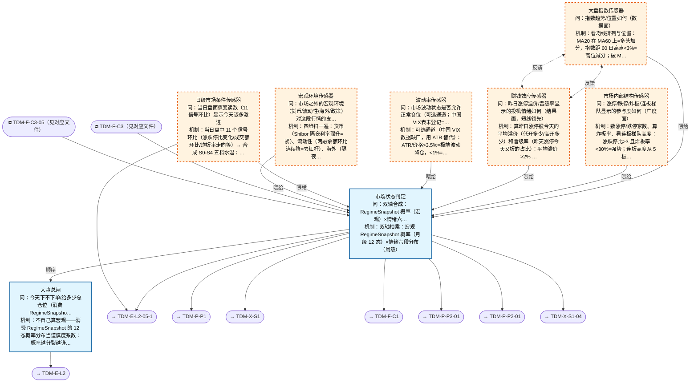

# 交易决策地图 · 建仓流 L1·大盘判定（四层温度计）（自动派生）

> **本文件由生成器自动派生，禁止手编**。真源=`config/trading_decision_map.yaml`（改动后 git commit → 运行时启动自动重生成）。
> 规模：8 节点｜🔴设计态（红节点）6｜📄paper 实盘执行 0｜图例：橙虚线=设计态，蓝底=📄paper 实盘执行节点（D18 治理阶梯）。
> 每个节点的完整机制（怎么算/依据什么/裁定原文）见下方「节点详解」区。
> **[可缩放 HTML 版 / Zoomable HTML](http://localhost:8765/docs/02_enterprise_architecture/10_trading_map/_zoomable_html/trading_map_01_e_l1_regime.html)** — Ctrl+滚轮缩放 ｜ 双击重置 ｜ Ctrl+Shift+D 切换拖动/选择模式

## 关系图

## 节点明细（速览）

| node_id | 名称 | 怎么算（大白话） | 时点 | 档位 | 模块锚 |
|---|---|---|---|---|---|
| TDM-E-L1 | 大盘总闸 | 不自己算宏观——消费 RegimeSnapshot 的 12 态概率分布当谨慎度系数：概率越分裂越谨慎。再查六段情绪预算带（如吸筹 30-50%/点火 50-70%/扩张 60-80%/亢奋封顶 30% 只卖不买），月级定大档、日级水温微调，输出当日总仓位上限。 | 盘前 | — | MOD-REGIME-001 |
| TDM-E-L1-S1🔴 | 大盘指数传感器 | 看均线排列与位置：MA20 在 MA60 上=多头加分，指数距 60 日高点<3%=高位减分；破 MA20 减一档、破 MA60 减两档。输出指数趋势分（-2~+2）。 | 盘前 | — | — |
| TDM-E-L1-S2🔴 | 市场内部结构传感器 | 数涨停/跌停家数、算炸板率、看连板梯队高度：涨跌停比>3 且炸板率<30%=强势；连板高度从 5 板断崖到 2 板=退潮预警。广度结构给市场参与度打分。 | 盘中 | — | — |
| TDM-E-L1-S3🔴 | 赚钱效应传感器 | 算昨日涨停股今天的平均溢价（低开多少/高开多少）和晋级率（昨天涨停今天又板的占比）：平均溢价>2% 且晋级率>50%=情绪健康；连续两天负溢价=退潮确认。这是短线最领先的指标——打板资金赚不赚钱直接决定明天还敢不敢接。 | 盘前 | — | — |
| TDM-E-L1-S4🔴 | 波动率传感器 | 可选通道（中国 VIX 数据缺口，用 ATR 替代）：ATR/价格>3.5%=极端波动降仓，<1%=死水难做降仓，中间正常。波动两端的行情都不适合正常仓位。 | 盘前 | — | — |
| TDM-E-L1-S0🔴 | 宏观环境传感器 | 四维扫一遍：货币（Shibor 隔夜利率骤升=紧）、流动性（两融余额环比连续降=去杠杆）、海外（隔夜纳指跌>2%=压制）、政策（监管动态人工录入）。输出宏观支撑/压制分。 | 盘前 | — | — |
| TDM-E-L1-S5🔴 | 日级市场条件传感器 | 当日盘中 11 个信号环比（涨跌停比变化/成交额环比/炸板率走向等）→ 合成 S0-S4 五档水温：水烫=当日可激进，水冰=当日只看不动。9:35 首算，盘中可更新，是唯一盘中可变的 L1 输入。 | 盘中 | — | — |
| TDM-E-L1-AGG | 市场状态判定 | 双轴相乘：宏观 RegimeSnapshot 概率（月级 12 态）×情绪六段分布（周级）。两轴指向一致=直接取结论；指向分裂（熵值超阈）=按'就低不就高'仲裁。输出三件套：预算带（给 C1）+六段状态（给全流）+策略路由（哪些 sleeve 今天开），一次判定 broadcast 全图。 | 盘前 | — | MOD-REGIME-001 |

## 节点详解（机制怎么产生）

### TDM-E-L1 大盘总闸

**问**：今天下不下单/给多少总仓位（消费 RegimeSnapshot 概率=谨慎度，六段预算带见 C1）

**机制（怎么算）**：不自己算宏观——消费 RegimeSnapshot 的 12 态概率分布当谨慎度系数：概率越分裂越谨慎。再查六段情绪预算带（如吸筹 30-50%/点火 50-70%/扩张 60-80%/亢奋封顶 30% 只卖不买），月级定大档、日级水温微调，输出当日总仓位上限。

**依据锚**：数据 DS-150
**治理**：模块=MOD-REGIME-001

**设计备注（裁定/欠账原文）**：
- ── 建仓流 entry_flow（cn_a，内嵌 Owner 主观漏斗 L1-L4）──────────────────
- 真源对齐（v1.2.2，Owner 裁定 B 方案=第一性原理）：
- 宏观段状态（周/日线级 1-3 月）= D_REGIME 12 态系统【已实现】——RegimeSnapshot 7 维概率分布
- （4 态 HMM r1-r4 + CRISIS/RECOVERY/BREAKOUT overlay），总闸消费它算谨慎度，不自算宏观态
- 真源：10_regime_detector_spec.md（D-SIGNAL-04）+ src/zephyr/regime/core/regime_detector.py
- 微观情绪相位（1-2 周短线）= 本矩阵列轴六段（定稿词汇，10 号 spec 五态的细分扩展：
- 冰点→capitulation / 反核→accumulation+ignition / 主升→expansion / 疯狂→euphoria / 退潮→distribution）
- 当日预案（今天冲高回落怎么应对）= 作战预案引擎（D_PLAN/BM-PLAN-01-C）管辖，地图只挂引用不重建
- 正名登记（D23）：现名"作战预案引擎"→未来正名"每日作战计划引擎（Game Plan Engine）"——
- 专业两层结构：Playbook（静态招式手册=策略库+作战手册，已有）vs Game Plan（当日动态作战计划）；
- "预案"为口语，专业词=Game Plan；改名执行时同步 D_PLAN 域/BM-PLAN-01-C 锚点/相关备忘录编号
- 升级需求清单（D24）：6 项功能全要（IF-THEN 强制格式/今日不做什么负面清单/心理状态检查门/
- 预警位联动/Skip log/盘前盘中职责分离）——需求真源=69 号备忘录 §2.13，施工归 D_PLAN 域升级批次

### TDM-E-L1-S1 大盘指数传感器 🔴

**问**：指数趋势/位置如何（数据面）

**机制（怎么算）**：看均线排列与位置：MA20 在 MA60 上=多头加分，指数距 60 日高点<3%=高位减分；破 MA20 减一档、破 MA60 减两档。输出指数趋势分（-2~+2）。

**依据锚**：数据 DS-150 ｜ 周期 CYC-STAT-001、CYC-STAT-004、CYC-STAT-013

**设计备注（裁定/欠账原文）**：
- L1 四路传感器阵列（D6：指数↔情绪双向、短线情绪领先）
- 因子层缺口说明：情绪类因子在 REG-FCT-001 仅到 family 级（family_id=sentiment），
- 尚无 FCT-* 级条目（涨停家数/炸板率/晋级率等）——factor_refs 留空=地图缺口节点，
- 补登因子后回填引用（缺口检测语义）
- （D109 终裁）：攻防板块特征入本层——券商指数 5 日超额/银行指数 5 日超额/券商÷银行涨幅比（>1 且放量=进攻态；银行独涨+科技跌=避险标签；银行与科技 20 日同涨且相关性转正=哑铃市双主线）；数据=DS-170 板块 K 线；先产特征不联动仓位，回测验证预测力后联动

### TDM-E-L1-S2 市场内部结构传感器 🔴

**问**：涨停/跌停/炸板/连板梯队显示的参与度如何（广度面）

**机制（怎么算）**：数涨停/跌停家数、算炸板率、看连板梯队高度：涨跌停比>3 且炸板率<30%=强势；连板高度从 5 板断崖到 2 板=退潮预警。广度结构给市场参与度打分。

**依据锚**：数据 DS-082

### TDM-E-L1-S3 赚钱效应传感器 🔴

**问**：昨日涨停溢价/晋级率显示的投机情绪如何（结果面，短线领先）

**机制（怎么算）**：算昨日涨停股今天的平均溢价（低开多少/高开多少）和晋级率（昨天涨停今天又板的占比）：平均溢价>2% 且晋级率>50%=情绪健康；连续两天负溢价=退潮确认。这是短线最领先的指标——打板资金赚不赚钱直接决定明天还敢不敢接。

**依据锚**：数据 DS-082、DS-107

### TDM-E-L1-S4 波动率传感器 🔴

**问**：市场波动状态是否允许正常仓位（可选通道；中国VIX表未登记=数据缺口）

**机制（怎么算）**：可选通道（中国 VIX 数据缺口，用 ATR 替代）：ATR/价格>3.5%=极端波动降仓，<1%=死水难做降仓，中间正常。波动两端的行情都不适合正常仓位。

**依据锚**：数据 DS-150

### TDM-E-L1-S0 宏观环境传感器 🔴

**问**：市场之外的宏观环境（货币/流动性/海外/政策）对这段行情的支撑或压制

**机制（怎么算）**：四维扫一遍：货币（Shibor 隔夜利率骤升=紧）、流动性（两融余额环比连续降=去杠杆）、海外（隔夜纳指跌>2%=压制）、政策（监管动态人工录入）。输出宏观支撑/压制分。

**依据锚**：数据 DS-098 ｜ 事件 EVT-MACRO-001 ｜ 宏观 MAC-CN-005、MAC-CN-006、MAC-CN-007、MAC-CN-008、MAC-CN-009、MAC-CN-011、MAC-US-001、MAC-US-002

**设计备注（裁定/欠账原文）**：
- 日级温度计传感器（D20：四层架构第三支温度计=日级条件层，补业界 Daily Condition 缺位）
- 11 信号全上（Owner 裁定：先大而全跑数据，后数据裁噪；A组实战 8+ B组机构 3）：
- A1 涨停家数环比 / A2 连板高度梯队 / A3 炸板率(>50% 追高必埋) / A4 跌停+核按钮(批量=退潮确认)
- A5 昨日涨停溢价(≤-5% 退潮) / A6 红盘家数(<1500 绝对回避) / A7 量能匹配(缩量冲高+放量跳水=诱多)
- A8 板块联动(一天换主线=混沌) / B1 宽度领先原则 / B2 对坏消息的反应 / B3 市值分层宽度
- 原始数据与 S2/S3 同源（DS-082/DS-059/DS-150），用法不同：本节点消费"当日读数+环比骤变"
- 裁噪预留：同源指标重复计票（冗余即静默杀手）→ 灰度合成阶段用相关性去重
- ── S0 宏观环境传感器（D25：月级温度计的市场外进水管，非第五层）──
- Owner 裁定：宏观完全交给系统算法（人工不消费），四组信号全上（先大而全，D21 三防弹衣适用）：
- A 货币政策（降准降息节奏/政策利率/央行方向，领先 0-6 月，机构 signal hierarchy 顶点）
- B 流动性与信用（社融/M1-M2 剪刀差/信用利差/两融 DS-098/五大央行方向，领先 3-12 月）
- C 海外与汇率（美债 10Y/美元/中美利差/全球 risk-off 合成/港股联动）
- D 增长与政策（PMI/产业政策风向/监管周期——A股范式变迁后权重上调，广发研报：
- 传统"货币→信贷→盈利"链失效，新链=产业政策→产业预期→股市，"M1 定买卖"失效）
- 方法论=复用周级三步法（滚动分位→加权合成→天气分 0-100），输出喂月级谨慎度修正
- A股范式权重修正：政策/产业因子权重↑、总量因子权重↓

### TDM-E-L1-S5 日级市场条件传感器 🔴

**问**：当日盘面骤变读数（11 信号环比）显示今天该多激进

**机制（怎么算）**：当日盘中 11 个信号环比（涨跌停比变化/成交额环比/炸板率走向等）→ 合成 S0-S4 五档水温：水烫=当日可激进，水冰=当日只看不动。9:35 首算，盘中可更新，是唯一盘中可变的 L1 输入。

**依据锚**：数据 DS-082、DS-059、DS-150

### TDM-E-L1-AGG 市场状态判定

**问**：双轴合成：RegimeSnapshot 概率（宏观）×情绪六段分布（微观）；输出预算带+策略路由+冲突仲裁（熵高分裂市→降档+Owner 接管）；日级水温受月/周档位封顶

**机制（怎么算）**：双轴相乘：宏观 RegimeSnapshot 概率（月级 12 态）×情绪六段分布（周级）。两轴指向一致=直接取结论；指向分裂（熵值超阈）=按'就低不就高'仲裁。输出三件套：预算带（给 C1）+六段状态（给全流）+策略路由（哪些 sleeve 今天开），一次判定 broadcast 全图。

**依据锚**：数据 DS-098
**治理**：模块=MOD-REGIME-001

**设计备注（裁定/欠账原文）**：
- 双轴合成（v1.2.2 B 方案定稿）：①谨慎度轴=消费 D_REGIME RegimeSnapshot 7 维概率
- （module_ref 已挂）→ 决定预算带位置（C1）；②机会轴=情绪六段分布（灰度）→ 决定策略路由
- （矩阵列轴）；③仲裁三规则：多数表决+历史可靠度加权（C3 养成）+分布熵高→分裂市降档+人工接管
- 四层架构（D20）：月级 12 态/周级六段/日级 S5 三温度计独立判定；跨层合成两规则——
- 封顶：周级退潮→日级最高 RISK_OFF；月级危机→日级最高 RISK_OFF（封顶不覆盖，日级如实报告）
- 对齐加成：月+周+日三层同向→预算带取上限（业界三级共振）；冲突→取下限+高层赢
- （D90 终裁 2026-09-07）：六段冲突场景=听弱的（预算带按较弱信号降一档机械执行，废除人工接管）；量×轮动二维状态机（成交额 250 日滚动分位<25%=存量博弈：小盘题材加权/主线降权/持仓≤2-3 天；>60%=主线放行；轮动强度>80% 分位=电风扇市=无主线不推大板块）；二值权限门滞回=进段连续 2 日隶属度>60%、退出<40%

## 挂载清单

**模块锚（MOD）**：MOD-REGIME-001 src/zephyr/regime/core/regime_detector.py
