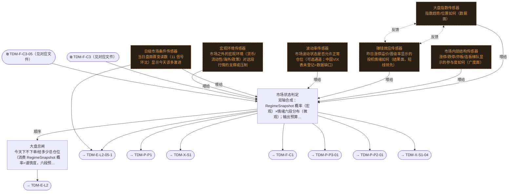

# 交易决策地图 · 建仓流 L1·大盘判定（四层温度计）（自动派生）

> **本文件由生成器自动派生，禁止手编**。真源=`config/trading_decision_map.yaml`（改动后 git commit → 运行时启动自动重生成）。
> 规模：8 节点｜🔴设计态（红节点）6｜📄paper 实盘执行 0｜图例：橙虚线=设计态，蓝底=📄paper 实盘执行节点（D18 治理阶梯）。
> **[可缩放 HTML 版 / Zoomable HTML](http://localhost:8765/docs/02_enterprise_architecture/10_trading_map/_zoomable_html/trading_map_01_e_l1_regime.html)** — Ctrl+滚轮缩放 ｜ 双击重置 ｜ Ctrl+Shift+D 切换拖动/选择模式

## 关系图

## 节点明细

| node_id | 名称 | 决策问题 | 时点 | activation | ai_autonomy | 模块锚 | 策略挂载 |
|---|---|---|---|---|---|---|---|
| TDM-E-L1 | 大盘总闸 | 今天下不下单/给多少总仓位（消费 RegimeSnapshot 概率=谨慎度，六段预算带见 C1） | 盘前 | — | — | src/zephyr/regime/core/regime_detector.py（MOD-REGIME-001） | — |
| TDM-E-L1-S1🔴 | 大盘指数传感器 | 指数趋势/位置如何（数据面） | 盘前 | — | — | — | — |
| TDM-E-L1-S2🔴 | 市场内部结构传感器 | 涨停/跌停/炸板/连板梯队显示的参与度如何（广度面） | 盘中 | — | — | — | — |
| TDM-E-L1-S3🔴 | 赚钱效应传感器 | 昨日涨停溢价/晋级率显示的投机情绪如何（结果面，短线领先） | 盘前 | — | — | — | — |
| TDM-E-L1-S4🔴 | 波动率传感器 | 市场波动状态是否允许正常仓位（可选通道；中国VIX表未登记=数据缺口） | 盘前 | — | — | — | — |
| TDM-E-L1-S0🔴 | 宏观环境传感器 | 市场之外的宏观环境（货币/流动性/海外/政策）对这段行情的支撑或压制 | 盘前 | — | — | — | — |
| TDM-E-L1-S5🔴 | 日级市场条件传感器 | 当日盘面骤变读数（11 信号环比）显示今天该多激进 | 盘中 | — | — | — | — |
| TDM-E-L1-AGG | 市场状态判定 | 双轴合成：RegimeSnapshot 概率（宏观）×情绪六段分布（微观）；输出预算带+策略路由+冲突仲裁（熵高分裂市→… | 盘前 | — | — | src/zephyr/regime/core/regime_detector.py（MOD-REGIME-001） | — |

## 挂载清单

**模块锚（MOD）**：MOD-REGIME-001 src/zephyr/regime/core/regime_detector.py
