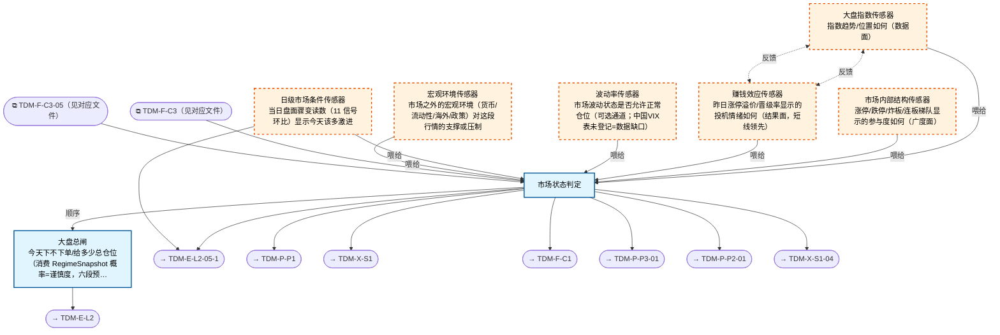

# 交易决策地图 · 建仓流 L1·大盘判定（四层温度计）（自动派生）

> **本文件由生成器自动派生，禁止手编**。真源=`config/trading_decision_map.yaml`（改动后 git commit → 运行时启动自动重生成）。
> 规模：8 节点｜🔴设计态（红节点）6｜📄paper 实盘执行 0｜图例：橙虚线=设计态，蓝底=📄paper 实盘执行节点（D18 治理阶梯）。
> **[可缩放 HTML 版 / Zoomable HTML](http://localhost:8765/docs/02_enterprise_architecture/10_trading_map/_zoomable_html/trading_map_01_e_l1_regime.html)** — Ctrl+滚轮缩放 ｜ 双击重置 ｜ Ctrl+Shift+D 切换拖动/选择模式

## 关系图

## 节点明细

| node_id | 名称 | 怎么算（大白话） | 时点 | 档位 | 模块锚 |
|---|---|---|---|---|---|
| TDM-E-L1 | 大盘总闸 | 不自己算宏观——消费 RegimeSnapshot 的 12 态概率分布当谨慎度系数：概率越分裂越谨慎。 再查六段情绪预算带（如吸筹 30-50%/点火 50-70%/扩张 60-80%/亢奋封顶 30% 只卖不买），月级定大档、日级水温微调，输出当日总仓位上限。 | 盘前 | — | MOD-REGIME-001 |
| TDM-E-L1-S1🔴 | 大盘指数传感器 | 看均线排列与位置：MA20 在 MA60 上=多头加分，指数距 60 日高点<3%=高位减分；破 MA20 减一档、破 MA60 减两档。 输出指数趋势分（-2~+2）。 | 盘前 | — | — |
| TDM-E-L1-S2🔴 | 市场内部结构传感器 | 数涨停/跌停家数、算炸板率、看连板梯队高度：涨跌停比>3 且炸板率<30%=强势；连板高度从 5 板断崖到 2 板=退潮预警。 广度结构给市场参与度打分。 | 盘中 | — | — |
| TDM-E-L1-S3🔴 | 赚钱效应传感器 | 算昨日涨停股今天的平均溢价（低开多少/高开多少）和晋级率（昨天涨停今天又板的占比）：平均溢价>2% 且晋级率>50%=情绪健康；连续两天负溢价=退潮确认。 这是短线最领先的指标——打板资金赚不赚钱直接决定明天还敢不敢接。 | 盘前 | — | — |
| TDM-E-L1-S4🔴 | 波动率传感器 | 可选通道（中国 VIX 数据缺口，用 ATR 替代）：ATR/价格>3.5%=极端波动降仓，<1%=死水难做降仓，中间正常。 波动两端的行情都不适合正常仓位。 | 盘前 | — | — |
| TDM-E-L1-S0🔴 | 宏观环境传感器 | 四维扫一遍：货币（Shibor 隔夜利率骤升=紧）、流动性（两融余额环比连续降=去杠杆）、海外（隔夜纳指跌>2%=压制）、政策（监管动态人工录入）。 输出宏观支撑/压制分。 | 盘前 | — | — |
| TDM-E-L1-S5🔴 | 日级市场条件传感器 | 当日盘中 11 个信号环比（涨跌停比变化/成交额环比/炸板率走向等）→ 合成 S0-S4 五档水温：水烫=当日可激进，水冰=当日只看不动。 9:35 首算，盘中可更新，是唯一盘中可变的 L1 输入。 | 盘中 | — | — |
| TDM-E-L1-AGG | 市场状态判定 | 双轴相乘：宏观 RegimeSnapshot 概率（月级 12 态）×情绪六段分布（周级）。 两轴指向一致=直接取结论；指向分裂（熵值超阈）=按'就低不就高'仲裁。 输出三件套：预算带（给 C1）+六段状态（给全流）+策略路由（哪些 sleeve 今天开），一次判定 broadcast 全图。 双轴合成：RegimeSnapshot 概率（宏观）×情绪六段分布（微观）；输出预算带+策略路由+冲突仲裁（熵高分裂市→降档+Owner 接管）；日级水温受月/周档位封顶 | 盘前 | — | MOD-REGIME-001 |

## 挂载清单

**模块锚（MOD）**：MOD-REGIME-001 src/zephyr/regime/core/regime_detector.py
