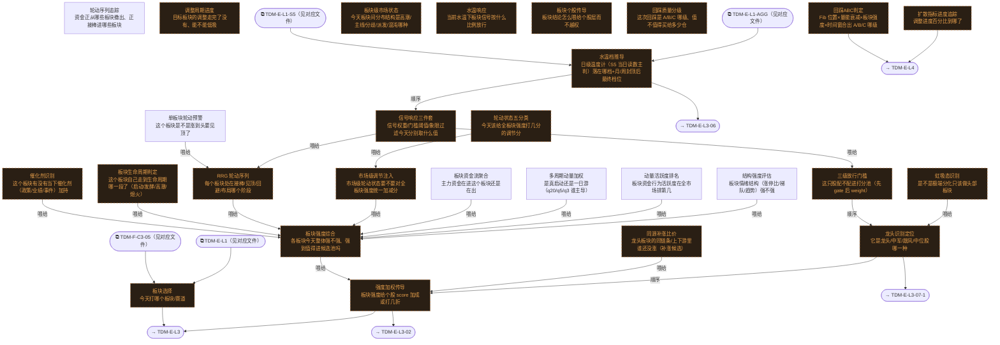

# 交易决策地图 · 建仓流 L2·板块漏斗（自动派生）

> **本文件由生成器自动派生，禁止手编**。真源=`config/trading_decision_map.yaml`（改动后 git commit → 运行时启动自动重生成）。
> 规模：27 节点｜🔴设计态（红节点）21｜📄paper 实盘执行 0｜图例：橙虚线=设计态，蓝底=📄paper 实盘执行节点（D18 治理阶梯）。
> **[可缩放 HTML 版 / Zoomable HTML](http://localhost:8765/docs/02_enterprise_architecture/10_trading_map/_zoomable_html/trading_map_02_e_l2_sector.html)** — Ctrl+滚轮缩放 ｜ 双击重置 ｜ Ctrl+Shift+D 切换拖动/选择模式

## 关系图

## 节点明细

| node_id | 名称 | 决策问题 | 时点 | activation | ai_autonomy | 模块锚 | 策略挂载 |
|---|---|---|---|---|---|---|---|
| TDM-E-L2🔴 | 板块选择 | 今天打哪个板块/赛道 | 盘前 | — | — | — | — |
| TDM-E-L2-01🔴 | 板块强度综合 | 各板块今天整体强不强、强到值得进候选池吗 | 盘后 | postmarket | auto | — | — |
| TDM-E-L2-01-1 | 结构强度评估 | 板块情绪结构（涨停比/梯队/趋势）强不强 | 盘后 | postmarket | auto | src/zephyr/signal_ashare/sector_analyzer.py（MOD-SIG-026） | STR-DABAN-003(proposed) |
| TDM-E-L2-01-2 | 动量活跃度排名 | 板块资金行为活跃度在全市场排第几 | 盘后 | postmarket | auto | src/zephyr/data/sector_ranking_engine.py（MOD-L00-004） | — |
| TDM-E-L2-01-3 | 多周期动量加权 | 是真启动还是一日游（q20/q5/q3 谁主导） | 盘后 | postmarket | auto | src/zephyr/signal_ashare/sector_momentum.py（MOD-SIG-026） | — |
| TDM-E-L2-01-4 | 板块资金流聚合 | 主力资金在进这个板块还是在出 | 盘后 | postmarket | auto | src/zephyr/signal_ashare/sector_breadth.py（MOD-SIG-026） | STR-DABAN-002(proposed) |
| TDM-E-L2-01-5🔴 | 市场级调节注入 | 市场级轮动状态要不要对全板块强度统一加减分 | 盘后 | postmarket | auto | — | — |
| TDM-E-L2-02 | 轮动序列追踪 | 资金正从哪些板块撤出、正接棒进哪些板块 | 盘后 | postmarket | auto | src/zephyr/signal_ashare/sector_divergence.py（MOD-SIG-060） | — |
| TDM-E-L2-02-1🔴 | RRG 轮动序列 | 每个板块处在接棒/见顶/回避/布局哪个阶段 | 盘后 | postmarket | auto | — | — |
| TDM-E-L2-02-2 | 单板块轮动预警 | 这个板块是不是涨到头要见顶了 | 盘中 | intraday | auto | src/zephyr/signal_ashare/sector_analyzer.py（MOD-SIG-026） | — |
| TDM-E-L2-03🔴 | 调整周期进度 | 目标板块的调整走完了没有、能不能低吸 | 盘后 | postmarket | auto | — | — |
| TDM-E-L2-03-1🔴 | 扩散指标进度追踪 | 调整进度百分比到哪了 | 盘后 | postmarket | auto | — | — |
| TDM-E-L2-04🔴 | 板块级市场状态 | 今天板块间分布结构是高潮/主线/分歧/派发/混沌哪种 | 盘后 | postmarket | auto | — | — |
| TDM-E-L2-04-1🔴 | 轮动状态五分类 | 今天该给全板块强度打几分的调节分 | 盘后 | postmarket | auto | — | — |
| TDM-E-L2-04-2🔴 | 虹吸态识别 | 是不是极端分化只该做头部板块 | 盘后 | postmarket | auto | — | — |
| TDM-E-L2-05🔴 | 水温响应 | 当前水温下板块信号按什么比例放行 | 盘前 | premarket | auto | — | — |
| TDM-E-L2-05-1🔴 | 水温档推导 | 日级温度计（S5 当日读数主判）落在哪档+月/周封顶后最终档位 | 盘前 | premarket | auto | — | — |
| TDM-E-L2-05-2🔴 | 信号响应三件套 | 信号权重/门槛阈值/象限过滤今天分别取什么值 | 盘前 | premarket | auto | — | — |
| TDM-E-L2-06🔴 | 板块个股传导 | 板块结论怎么喂给个股层而不越权 | 盘后 | postmarket | auto | — | — |
| TDM-E-L2-06-1🔴 | 三级放行门槛 | 这只股配不配进打分池（先 gate 后 weight） | 盘中 | intraday | auto | — | — |
| TDM-E-L2-06-2🔴 | 龙头识别定位 | 它是龙头/中军/跟风/中位股哪一种 | 盘中 | intraday | auto | — | — |
| TDM-E-L2-06-3🔴 | 强度加权传导 | 板块强度给个股 score 加成或打几折 | 盘后 | postmarket | auto | — | — |
| TDM-E-L2-07🔴 | 回踩质量分级 | 这次回踩是 A/B/C 哪级、值不值得买给多少仓 | 盘中 | intraday | auto | — | — |
| TDM-E-L2-07-1🔴 | 回踩ABC判定 | Fib 位置×量能衰减×板块强度×时间窗合出 A/B/C 哪级 | 盘中 | intraday | auto | — | — |
| TDM-E-L2-08🔴 | 板块生命周期判定 | 这个板块自己走到生命周期哪一段了（启动/发酵/高潮/熄火） | 盘后 | postmarket | auto | — | STR-MOMTREND-003(proposed) |
| TDM-E-L2-09🔴 | 催化剂识别 | 这个板块有没有当下催化剂（政策/业绩/事件）加持 | 盘前 | premarket | auto | — | — |
| TDM-E-L2-10🔴 | 同源补涨比价 | 龙头板块的同链条/上下游里谁还没涨（补涨候选） | 盘后 | postmarket | auto | — | — |

## 挂载清单

**模块锚（MOD）**：MOD-L00-004 src/zephyr/data/sector_ranking_engine.py、MOD-SIG-026 src/zephyr/signal_ashare/sector_analyzer.py、MOD-SIG-026 src/zephyr/signal_ashare/sector_breadth.py、MOD-SIG-026 src/zephyr/signal_ashare/sector_momentum.py、MOD-SIG-060 src/zephyr/signal_ashare/sector_divergence.py

**策略挂载（STR）**：STR-DABAN-002、STR-DABAN-003、STR-MOMTREND-003
