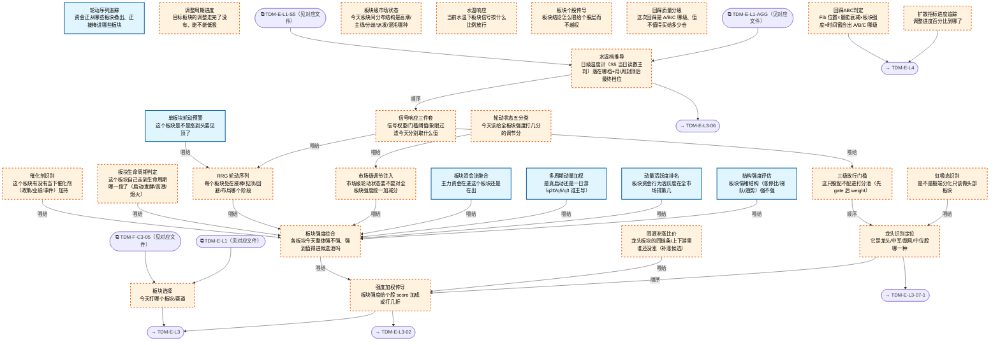

# 交易决策地图 · 建仓流 L2·板块漏斗（自动派生）

> **本文件由生成器自动派生，禁止手编**。真源=`config/trading_decision_map.yaml`（改动后 git commit → 运行时启动自动重生成）。
> 规模：27 节点｜🔴设计态（红节点）21｜📄paper 实盘执行 0｜图例：橙虚线=设计态，蓝底=📄paper 实盘执行节点（D18 治理阶梯）。
> **[可缩放 HTML 版 / Zoomable HTML](http://localhost:8765/docs/02_enterprise_architecture/10_trading_map/_zoomable_html/trading_map_02_e_l2_sector.html)** — Ctrl+滚轮缩放 ｜ 双击重置 ｜ Ctrl+Shift+D 切换拖动/选择模式

## 关系图

## 节点明细

| node_id | 名称 | 怎么算（大白话） | 时点 | 档位 | 模块锚 |
|---|---|---|---|---|---|
| TDM-E-L2🔴 | 板块选择 | 板块层总枢纽：下有 10 个子环节（强度/轮动/调整进度/市场状态/水温响应/个股传导/回踩质量/生命周期/催化剂/补涨比价），产出当日板块候选池（3-5 个主攻板块）排序喂给 L3 个股层。 | 盘前 | — | — |
| TDM-E-L2-01🔴 | 板块强度综合 | 四路合分：结构强度（子1）+动量活跃（子2）+多周期动量（子3）+资金流（子4），再加市场级调节（子5）。 总分进前 15% 的板块进候选池。 | 盘后 | auto | — |
| TDM-E-L2-01-1 | 结构强度评估 | 板块情绪结构三件：板块内涨停股占比（>8%=强）、连板梯队是否完整（有 2 板有 3 板=接力健康）、板块指数趋势（20 日线上方）。 合出结构分 0-10。 | 盘后 | auto | MOD-SIG-026 |
| TDM-E-L2-01-2 | 动量活跃度排名 | 板块成交额占全市场比+环比变化，排名前 10% 的板块=资金扎堆活跃区。 活跃度是必要条件——没量的板块再强的形态也是假象。 | 盘后 | auto | MOD-L00-004 |
| TDM-E-L2-01-3 | 多周期动量加权 | q20（20日）/q5（5日）/q3（3日）动量加权：q3 主导=刚点火（好）、q5 主导=进行中（可）、q20 主导=涨了很久（谨慎追）。 区分真启动与一日游。 | 盘后 | auto | MOD-SIG-026 |
| TDM-E-L2-01-4 | 板块资金流聚合 | 板块主力净流入 3 日累计+当日大单净额：连续 3 日净流入=资金在建仓，当日大单净流出>流入 2 倍=出货嫌疑。 资金流权重占板块总分 25%。 | 盘后 | auto | MOD-SIG-026 |
| TDM-E-L2-01-5🔴 | 市场级调节注入 | 市场级轮动状态（子4 的五分类）统一给全板块加/减分：主线态给头部板块+10%，派发态全体-15%。 防止板块层只看自己不看大盘。 | 盘后 | auto | — |
| TDM-E-L2-02 | 轮动序列追踪 | 看板块指数与资金的移动方向：谁在连涨+资金连进=接棒区，谁在连跌+资金连出=撤离区。 输出接棒榜单（资金正在去的方向）。 | 盘后 | auto | MOD-SIG-060 |
| TDM-E-L2-02-1🔴 | RRG 轮动序列 | RRG（相对旋转图）：板块相对大盘收益率×动量双轴，转一圈分四象限——改善（领先）/走弱（见顶）/落后（回避）/改善中（布局）。 目标=刚进领先象限的板块。 | 盘后 | auto | — |
| TDM-E-L2-02-2 | 单板块轮动预警 | 单板块见顶预警三信号：RSI 日线>75、板块成交额创 20 日新高但指数滞涨（放量不涨）、龙头股率先破位。 命中两个=该板块从候选池降级。 | 盘中 | auto | MOD-SIG-026 |
| TDM-E-L2-03🔴 | 调整周期进度 | 目标板块从高点回撤算进度：回撤 5-8 天+缩量到高峰 1/3 以下=调整近尾声，可进低吸观察名单；还在放量下跌=调整没走完不碰。 | 盘后 | auto | — |
| TDM-E-L2-03-1🔴 | 扩散指标进度追踪 | 扩散指标：板块内站上 20 日线的个股占比。 从 <30% 回升穿 50%=调整结束信号；从 >80% 掉头向下=见顶信号。 给出进度百分比。 | 盘后 | auto | — |
| TDM-E-L2-04🔴 | 板块级市场状态 | 看全市场板块分布结构定当日生态：主线清晰（1-2 个板块吸走 30%+成交额）=聚焦做；高潮（涨停潮遍地）=第二天大概率分歧；混沌（无主线）=降仓等待。 | 盘后 | auto | — |
| TDM-E-L2-04-1🔴 | 轮动状态五分类 | 五分类规则：按'板块强度方差+涨停集中度'分 高潮/主线/分歧/派发/混沌 五态，每态给全板块强度统一调节分（主线+10%/派发-15%），喂给子5 注入。 | 盘后 | auto | — |
| TDM-E-L2-04-2🔴 | 虹吸态识别 | 虹吸态=极端分化：头部板块吸金时其余板块缺血。 判定：前 3 板块成交占比>40% 时只做头部板块候选，其余板块候选池清空——虹吸期做非头部=接飞刀。 | 盘后 | auto | — |
| TDM-E-L2-05🔴 | 水温响应 | 把 L1 的水温档翻译成板块信号放行比例：水烫（S4）=信号全放行+门槛降一档；水冰（S0-S1）=只放行最强信号（前 5%）+门槛升一档。 水温是板块层的总开关。 | 盘前 | auto | — |
| TDM-E-L2-05-1🔴 | 水温档推导 | 日级 S5 水温为主判，月级 12 态封顶：比如日级水烫但月级熊市反弹=最终档取'温'（月级有权一票否决激进度）。 防止反弹期当牛市做。 | 盘前 | auto | — |
| TDM-E-L2-05-2🔴 | 信号响应三件套 | 三件套联动：信号权重×（0.5~1.2 水温系数）、打分门槛随水温升降、象限过滤（水冰时只放主线象限板块）。 一套参数随档位查表切换。 | 盘前 | auto | — |
| TDM-E-L2-06🔴 | 板块个股传导 | 板块结论喂个股层的边界规则：只传'板块强度调节分+龙头定位'两个字段，个股层不得直接引用板块的买卖结论——层级隔离防越权。 | 盘后 | auto | — |
| TDM-E-L2-06-1🔴 | 三级放行门槛 | 三级放行门槛（先 gate 后 weight）：①板块强度分>6；②个股自身强度>5；③流动性达标（日成交>2 亿）。 三关全过才进打分池，过不了连被板块加成的资格都没有。 | 盘中 | auto | — |
| TDM-E-L2-06-2🔴 | 龙头识别定位 | 龙头四定位：板块强度榜第一+最先涨停=龙头；跟涨大盘股=中军；后涨小票=跟风；不上不下的=中位股。 定位决定持股预期与止损宽度（龙头宽/跟风窄）。 | 盘中 | auto | — |
| TDM-E-L2-06-3🔴 | 强度加权传导 | 强度传导系数：板块强度 10 分制映射个股加成（10 分板块=个股 score+15%，6 分=+5%，<6 分=反而-10%）。 强板块的弱票也加分，弱板块的强票打折。 | 盘后 | auto | — |
| TDM-E-L2-07🔴 | 回踩质量分级 | 回踩分 A/B/C 三级决定给不给仓：A 级（黄金坑）给满额、B 级给半仓、C 级只观察。 回踩是买点质量的核心判据——追高和低吸的胜负率差一倍。 | 盘中 | auto | — |
| TDM-E-L2-07-1🔴 | 回踩ABC判定 | 四因子合成：Fib 回撤位置（38.2% 附近=A 的必要条件）×量能衰减（回调缩到峰值 1/3）×板块强度（>7）×时间窗（回调 3-8 天）。 四因子各 0-1 分加权定 A/B/C。 | 盘中 | auto | — |
| TDM-E-L2-08🔴 | 板块生命周期判定 | 板块生命周期四段：启动（首板潮+题材发酵）、发酵（二板三板+跟风涌现）、高潮（板块涨停潮+媒体热炒）、熄火（龙头断板+炸板率>40%）。 只做启动和发酵段，高潮只持有不开新，熄火清仓。 | 盘后 | auto | — |
| TDM-E-L2-09🔴 | 催化剂识别 | 催化剂扫描：政策（部委文件/产业规划）、业绩（行业龙头超预期）、事件（涨价/突破/签约）。 有当下催化剂的板块加权 20%——有故事的资金才敢接力。 | 盘前 | auto | — |
| TDM-E-L2-10🔴 | 同源补涨比价 | 龙头板块的同链条补涨：龙头股翻倍后，找同题材未涨股（涨幅<20%）+同产业链上下游。 补涨股启动滞后 3-5 天，胜率低于龙头但位置安全。 | 盘后 | auto | — |

## 挂载清单

**模块锚（MOD）**：MOD-L00-004 src/zephyr/data/sector_ranking_engine.py、MOD-SIG-026 src/zephyr/signal_ashare/sector_analyzer.py、MOD-SIG-026 src/zephyr/signal_ashare/sector_breadth.py、MOD-SIG-026 src/zephyr/signal_ashare/sector_momentum.py、MOD-SIG-060 src/zephyr/signal_ashare/sector_divergence.py

**策略挂载（STR）**：STR-DABAN-002、STR-DABAN-003、STR-MOMTREND-003
