# 交易决策地图 · 建仓流 L2·板块漏斗（自动派生）

> **本文件由生成器自动派生，禁止手编**。真源=`config/trading_decision_map.yaml`（改动后 git commit → 运行时启动自动重生成）。
> 规模：29 节点｜🔴设计态（红节点）2｜📄paper 实盘执行 0｜图例：橙虚线=设计态，蓝底=📄paper 实盘执行节点（D18 治理阶梯）。
> 每个节点的完整机制（怎么算/依据什么/裁定原文）见下方「节点详解」区。
> **[可缩放 HTML 版 / Zoomable HTML](http://localhost:8765/docs/02_enterprise_architecture/10_trading_map/_zoomable_html/trading_map_02_e_l2_sector.html)** — Ctrl+滚轮缩放 ｜ 双击重置 ｜ Ctrl+Shift+D 切换拖动/选择模式

## 关系图

```mermaid
flowchart TD
  TDM_E_L2["板块选择<br/>问：今天打哪个板块/赛道<br/>机制：板块层总枢纽：下有 10 个子环节（强度/轮动/调整进度/市场状态/水温响应/个股传导/回踩质量/生…"]
  TDM_E_L2_01["板块强度综合<br/>问：各板块今天整体强不强、强到值得进候选池吗<br/>机制：四路子分（结构强度/动量活跃/多周期动量/资金流，各 0-100）等权 0.25 合成，加市场级调节…"]
  TDM_E_L2_01_1["结构强度评估<br/>问：板块情绪结构（涨停比/梯队/趋势）强不强<br/>机制：板块情绪结构三件：板块内涨停股占比（>8%=强）、连板梯队是否完整（有 2 板有 3 板=接力健康）…"]
  TDM_E_L2_01_2["动量活跃度排名<br/>问：板块资金行为活跃度在全市场排第几<br/>机制：板块成交额占全市场比+环比变化，排名前 10% 的板块=资金扎堆活跃区"]
  TDM_E_L2_01_3["多周期动量加权<br/>问：是真启动还是一日游（q20/q5/q3 谁主导）<br/>机制：q20（20日）/q5（5日）/q3（3日）动量加权：q3 主导=刚点火（好）、q5 主导=进行中（…"]
  TDM_E_L2_01_4["板块资金流聚合<br/>问：主力资金在进这个板块还是在出<br/>机制：板块主力净流入 3 日累计+当日大单净额：连续 3 日净流入=资金在建仓，当日大单净流出>流入 2 …"]
  TDM_E_L2_01_5["市场级调节注入<br/>问：市场级轮动状态要不要对全板块强度统一加减分<br/>机制：市场级轮动状态（子4 的五分类）统一给全板块加/减分：主线态给头部板块+10%，派发态全体-15%"]
  TDM_E_L2_02["轮动序列追踪<br/>问：资金正从哪些板块撤出、正接棒进哪些板块<br/>机制：看板块指数与资金的移动方向：谁在连涨+资金连进=接棒区，谁在连跌+资金连出=撤离区"]
  TDM_E_L2_02_1["RRG 轮动序列<br/>问：每个板块处在接棒/见顶/回避/布局哪个阶段<br/>机制：RRG（相对旋转图）：板块相对大盘收益率×动量双轴，转一圈分四象限——改善（领先）/走弱（见顶）/落…"]
  TDM_E_L2_02_2["单板块轮动预警<br/>问：这个板块是不是涨到头要见顶了<br/>机制：单板块见顶预警三信号：RSI 日线>75、板块成交额创 20 日新高但指数滞涨（放量不涨）、龙头股率…"]
  TDM_E_L2_03["调整周期进度<br/>问：目标板块的调整走完了没有、能不能低吸<br/>机制：目标板块从高点回撤算进度：回撤 5-8 天+缩量到高峰 1/3 以下=调整近尾声，可进低吸观察名单；…"]
  TDM_E_L2_03_1["扩散指标进度追踪<br/>问：调整进度百分比到哪了<br/>机制：扩散指标：板块内站上 20 日线的个股占比"]
  TDM_E_L2_04["板块级市场状态<br/>问：今天板块间分布结构是高潮/主线/分歧/派发/混沌哪种<br/>机制：三态封闭判定（优先级 高潮>主线清晰>混沌）：高潮分≥90=次日分歧警示；梯队连击≥2 且 Top2…"]
  TDM_E_L2_04_1["轮动状态五分类<br/>问：今天该给全板块强度打几分的调节分<br/>机制：五分类规则：按'板块强度方差+涨停集中度'分 高潮/主线/分歧/派发/混沌 五态，每态给全板块强度统…"]
  TDM_E_L2_04_2["虹吸态识别<br/>问：是不是极端分化只该做头部板块<br/>机制：虹吸态=极端分化：头部板块吸金时其余板块缺血"]
  TDM_E_L2_05["水温响应<br/>问：当前水温下板块信号按什么比例放行<br/>机制：把 L1 的水温档翻译成板块信号放行比例：水烫（S4）=信号全放行+门槛降一档；水冰（S0-S1）=…"]
  TDM_E_L2_05_1["水温档推导<br/>问：日级温度计（S5 当日读数主判）落在哪档+月/周封顶后最终档…<br/>机制：日级 S5 水温为主判，月级 7 态封顶：比如日级水烫但月级熊市反弹=最终档取'温'（月级有权一票否…"]
  TDM_E_L2_05_2["信号响应三件套<br/>问：信号权重/门槛阈值/象限过滤今天分别取什么值<br/>机制：三件套联动：信号权重×（0.5~1.2 水温系数）、打分门槛随水温升降、象限过滤（水冰时只放主线象限…"]
  TDM_E_L2_06["板块个股传导<br/>问：板块结论怎么喂给个股层而不越权<br/>机制：板块结论喂个股层的边界规则：只传'板块强度调节分+龙头定位'两个字段，个股层不得直接引用板块的买卖结…"]
  TDM_E_L2_06_1["三级放行门槛<br/>问：这只股配不配进打分池（先 gate 后 weight）<br/>机制：三级放行门槛（先 gate 后 weight）：①板块强度分>6；②个股自身强度>5；③流动性达标（…"]
  TDM_E_L2_06_2["龙头识别定位<br/>问：它是龙头/中军/跟风/中位股哪一种<br/>机制：龙头四定位：板块强度榜第一+最先涨停=龙头；跟涨大盘股=中军；后涨小票=跟风；不上不下的=中位股"]
  TDM_E_L2_06_3["强度加权传导<br/>问：板块强度给个股 score 加成或打几折<br/>机制：强度传导系数：板块强度 10 分制映射个股加成（10 分板块=个股 score+15%，6 分=+5…"]
  TDM_E_L2_07["回踩质量分级<br/>问：这次回踩是 A/B/C 哪级、值不值得买给多少仓<br/>机制：回踩分 A/B/C 三级决定给不给仓：A 级（黄金坑）给满额、B 级给半仓、C 级只观察"]
  TDM_E_L2_07_1["回踩ABC判定<br/>问：Fib 位置×量能衰减×板块强度×时间窗合出 A/B/C 哪…<br/>机制：四因子合成：Fib 回撤位置（38.2% 附近=A 的必要条件）×量能衰减（回调缩到峰值 1/3）×…"]
  TDM_E_L2_08["板块生命周期判定<br/>问：这个板块自己走到生命周期哪一段了（启动/发酵/高潮/熄火）<br/>机制：板块生命周期四段：启动（首板潮+题材发酵）、发酵（二板三板+跟风涌现）、高潮（板块涨停潮+媒体热炒）…"]
  TDM_E_L2_09["催化剂识别<br/>问：这个板块有没有当下催化剂（政策/业绩/事件）加持<br/>机制：催化剂扫描：政策（部委文件/产业规划）、业绩（行业龙头超预期）、事件（涨价/突破/签约）"]
  TDM_E_L2_09_1["事件图谱传导<br/>问：这条新闻/事件打在产业链哪个节点上、几分可信<br/>机制：新闻实体/事件词 → 产业链图谱节点匹配（news_symbol_linker 思路升维到 ig_*…"]
  TDM_E_L2_09_2["冲击标的生成<br/>问：受击节点沿产业链/供应链扩散后，今天动哪些标的、利好还是利空<br/>机制：图谱节点受冲击→上下游 N 跳扩散（含全球链/股权维度）→受影响标的/板块清单+方向分级（利好/利空…"]
  TDM_E_L2_10["同源补涨比价<br/>问：龙头板块的同链条/上下游里谁还没涨（补涨候选）<br/>机制：龙头板块的同链条补涨：龙头股翻倍后，找同题材未涨股（涨幅<20%）+同产业链上下游"]
  EXT_TDM_E_L1_AGG(["⧉ TDM-E-L1-AGG（见对应文件）"])
  EXT_TDM_E_L1_S5(["⧉ TDM-E-L1-S5（见对应文件）"])
  EXT_TDM_E_L1(["⧉ TDM-E-L1（见对应文件）"])
  EXT_TDM_F_C3_05(["⧉ TDM-F-C3-05（见对应文件）"])
  EXT_TDM_E_L1_S0_1(["⧉ TDM-E-L1-S0-1（见对应文件）"])
  EXT_TDM_E_L9_G1(["⧉ TDM-E-L9-G1（见对应文件）"])
  EXT_TDM_E_L9_V2(["⧉ TDM-E-L9-V2（见对应文件）"])
  EXT_TDM_E_L9_V3(["⧉ TDM-E-L9-V3（见对应文件）"])
  EXT_TDM_E_L9_A03(["⧉ TDM-E-L9-A03（见对应文件）"])
  EXT_TDM_E_L9_A06(["⧉ TDM-E-L9-A06（见对应文件）"])
  TDM_E_L2_01_1 -->|喂给| TDM_E_L2_01
  TDM_E_L2_01_2 -->|喂给| TDM_E_L2_01
  TDM_E_L2_01_3 -->|喂给| TDM_E_L2_01
  TDM_E_L2_01_4 -->|喂给| TDM_E_L2_01
  TDM_E_L2_01_5 -->|喂给| TDM_E_L2_01
  TDM_E_L2_02_1 -->|喂给| TDM_E_L2_01
  TDM_E_L2_04_1 -->|喂给| TDM_E_L2_01_5
  TDM_E_L2_04_2 -->|喂给| TDM_E_L2_06_2
  EXT_TDM_E_L1_AGG --> TDM_E_L2_05_1
  EXT_TDM_E_L1_S5 --> TDM_E_L2_05_1
  TDM_E_L2_05_1 -->|顺序| TDM_E_L2_05_2
  TDM_E_L2_05_2 -->|喂给| TDM_E_L2_06_1
  TDM_E_L2_05_2 -->|喂给| TDM_E_L2_02_1
  TDM_E_L2_06_1 -->|顺序| TDM_E_L2_06_2
  TDM_E_L2_06_2 -->|顺序| TDM_E_L2_06_3
  TDM_E_L2_06_3 --> EXT_OUT_TDM_E_L3([→ TDM-E-L3])
  TDM_E_L2_03_1 --> EXT_OUT_TDM_E_L4([→ TDM-E-L4])
  TDM_E_L2_07_1 --> EXT_OUT_TDM_E_L4([→ TDM-E-L4])
  TDM_E_L2_08 -->|喂给| TDM_E_L2_01
  TDM_E_L2_09 -->|喂给| TDM_E_L2_01
  TDM_E_L2_10 -->|喂给| TDM_E_L2_06_3
  TDM_E_L2_05_1 --> EXT_OUT_TDM_E_L3_06([→ TDM-E-L3-06])
  TDM_E_L2_06_2 --> EXT_OUT_TDM_E_L3_07_1([→ TDM-E-L3-07-1])
  TDM_E_L2_06_3 --> EXT_OUT_TDM_E_L3_02([→ TDM-E-L3-02])
  EXT_TDM_E_L1 --> TDM_E_L2
  TDM_E_L2 --> EXT_OUT_TDM_E_L3([→ TDM-E-L3])
  TDM_E_L2_01 -->|喂给| TDM_E_L2_06_3
  TDM_E_L2_02_2 -->|喂给| TDM_E_L2_02_1
  EXT_TDM_F_C3_05 --> TDM_E_L2
  EXT_TDM_E_L1_S0_1 --> TDM_E_L2_09_1
  TDM_E_L2_09_1 -->|顺序| TDM_E_L2_09_2
  TDM_E_L2_09_2 --> EXT_OUT_TDM_E_L3_04([→ TDM-E-L3-04])
  TDM_E_L2_09_2 --> EXT_OUT_TDM_E_L0_02([→ TDM-E-L0-02])
  EXT_TDM_E_L9_G1 --> TDM_E_L2_06
  TDM_E_L2_04 --> EXT_OUT_TDM_E_L9_V3([→ TDM-E-L9-V3])
  EXT_TDM_E_L9_V2 --> TDM_E_L2_05
  EXT_TDM_E_L9_V3 --> TDM_E_L2_01
  EXT_TDM_E_L9_A03 --> TDM_E_L2_01_2
  EXT_TDM_E_L9_A06 --> TDM_E_L2_01_4
  classDef production fill:#e1f5fe,stroke:#01579b,stroke-width:2px,color:#000;
  classDef design fill:#fff3e0,stroke:#e65100,stroke-width:2px,color:#000,stroke-dasharray: 5 5;
  classDef paper fill:#e8f5e9,stroke:#2e7d32,stroke-width:2.5px,color:#000;
  class TDM_E_L2_01,TDM_E_L2_01_1,TDM_E_L2_01_2,TDM_E_L2_01_3,TDM_E_L2_01_4,TDM_E_L2_01_5,TDM_E_L2_02,TDM_E_L2_02_1,TDM_E_L2_02_2,TDM_E_L2_03,TDM_E_L2_03_1,TDM_E_L2_04,TDM_E_L2_04_1,TDM_E_L2_04_2,TDM_E_L2_05_1,TDM_E_L2_05_2,TDM_E_L2_06,TDM_E_L2_06_1,TDM_E_L2_06_2,TDM_E_L2_06_3,TDM_E_L2_07,TDM_E_L2_07_1,TDM_E_L2_08,TDM_E_L2_09,TDM_E_L2_09_1,TDM_E_L2_09_2,TDM_E_L2_10 production;
  class TDM_E_L2,TDM_E_L2_05 design;
```

## 节点明细（速览）

| node_id | 名称 | 怎么算（大白话） | 时点 | 档位 | 模块锚 |
|---|---|---|---|---|---|
| TDM-E-L2🔴 | 板块选择 | 板块层总枢纽：下有 10 个子环节（强度/轮动/调整进度/市场状态/水温响应/个股传导/回踩质量/生命周期/催化剂/补涨比价），产出当日板块候选池（3-5 个主攻板块）排序喂给 L3 个股层。 | 盘前 | — | — |
| TDM-E-L2-01 | 板块强度综合 | 四路子分（结构强度/动量活跃/多周期动量/资金流，各 0-100）等权 0.25 合成，加市场级调节 ±10 后 clamp [0,100]，总分前 15% 进候选池；实现锚=sector_strength_aggregator（MOD-SIG-142，纯函数零 IO，等权先验待 IC 重校）。（2026-09-20 UP-4 接线，final3 P5）：板块分布比较建议通道——六指数（000001/000016/000300/ 000905/000852/399006）独立分位数回归（PIT，q05/q50/q95），按预测收益-风险比排序出板块优先 序列表（DAL-SECTOR-DIST，MOD-PA-023），作本节点强度分的排序叠加通道，不改树枝结构。 | 盘后 | auto | MOD-SIG-142 |
| TDM-E-L2-01-1 | 结构强度评估 | 板块情绪结构三件：板块内涨停股占比（>8%=强）、连板梯队是否完整（有 2 板有 3 板=接力健康）、板块指数趋势（20 日线上方）。合出结构分 0-10。（2026-09-15 ALGO_FLOW 块出仓至 docs/03_modules/_domain_signal/algo_flow/sector_analyzer.yaml：算法推导图外迁，算法口径不变） | 盘后 | auto | MOD-SIG-026 |
| TDM-E-L2-01-2 | 动量活跃度排名 | 板块成交额占全市场比+环比变化，排名前 10% 的板块=资金扎堆活跃区。活跃度是必要条件——没量的板块再强的形态也是假象。（2026-09-15 ALGO_FLOW 块出仓至 docs/03_modules/_domain_data/algo_flow/sector_ranking_engine.yaml：算法推导图外迁，算法口径不变） （2026-09-18 深度审查修正：相对强度因子去 abs 保符号——弱于大盘的板块不再反向加分（rpt_p12）；note_confirmed: 2026-09-18） | 盘后 | auto | MOD-L00-004 |
| TDM-E-L2-01-3 | 多周期动量加权 | q20（20日）/q5（5日）/q3（3日）动量加权：q3 主导=刚点火（好）、q5 主导=进行中（可）、q20 主导=涨了很久（谨慎追）。区分真启动与一日游。（2026-09-15 ALGO_FLOW 块出仓至 docs/03_modules/_domain_signal/algo_flow/sector_momentum.yaml：算法推导图外迁，算法口径不变） | 盘后 | auto | MOD-SIG-026 |
| TDM-E-L2-01-4 | 板块资金流聚合 | 板块主力净流入 3 日累计+当日大单净额：连续 3 日净流入=资金在建仓，当日大单净流出>流入 2 倍=出货嫌疑。资金流权重占板块总分 25%。（2026-09-15 ALGO_FLOW 块出仓至 docs/03_modules/_domain_signal/algo_flow/sector_breadth.yaml：算法推导图外迁，算法口径不变） | 盘后 | auto | MOD-SIG-026 |
| TDM-E-L2-01-5 | 市场级调节注入 | 市场级轮动状态（子4 的五分类）统一给全板块加/减分：主线态给头部板块+10%，派发态全体-15%。防止板块层只看自己不看大盘。（2026-09-15 ALGO_FLOW 块出仓至 docs/03_modules/_domain_regime/algo_flow/market_forecast_fusion.yaml：算法推导图外迁，算法口径不变） （2026-09-18 深度审查修正：外部预测分布校验补 NaN/Inf 拒收 fail-closed（rpt_d04）；note_confirmed: 2026-09-18） | 盘后 | auto | MOD-REGIME-012 |
| TDM-E-L2-02 | 轮动序列追踪 | 看板块指数与资金的移动方向：谁在连涨+资金连进=接棒区，谁在连跌+资金连出=撤离区。输出接棒榜单（资金正在去的方向）。注：2026-09-13 DEDUP 批将本节点引用的公共分析原语抽取至 core/analysis_utils 共享实现，行为等价 （2026-09-15 ALGO_FLOW 块出仓至 docs/03_modules/_domain_signal/algo_flow/sector_divergence.yaml：算法推导图外迁，算法口径不变） | 盘后 | auto | MOD-SIG-060 |
| TDM-E-L2-02-1 | RRG 轮动序列 | RRG（相对旋转图）：板块相对大盘收益率×动量双轴，转一圈分四象限——改善（领先）/走弱（见顶）/落后（回避）/改善中（布局）。目标=刚进领先象限的板块。（2026-09-15 ALGO_FLOW 块出仓至 docs/03_modules/_domain_signal/algo_flow/sector_rrg.yaml：算法推导图外迁，算法口径不变） | 盘后 | auto | MOD-SIG-026 |
| TDM-E-L2-02-2 | 单板块轮动预警 | 单板块见顶预警三信号：RSI 日线>75、板块成交额创 20 日新高但指数滞涨（放量不涨）、龙头股率先破位。命中两个=该板块从候选池降级。（2026-09-15 ALGO_FLOW 块出仓至 docs/03_modules/_domain_signal/algo_flow/sector_analyzer.yaml：算法推导图外迁，算法口径不变） | 盘中 | auto | MOD-SIG-026 |
| TDM-E-L2-03 | 调整周期进度 | 目标板块从高点回撤算进度：回撤 5-8 天+缩量到高峰 1/3 以下=调整近尾声，可进低吸观察名单；还在放量下跌=调整没走完不碰。实现锚=sector_adjustment 三维进度（时间 0.4+回撤 0.3+扩散 0.3，≥80% LATE 才放行动作门控）；量能缩量维为设计语言待扩展。（2026-09-15 ALGO_FLOW 块出仓至 docs/03_modules/_domain_signal/algo_flow/sector_adjustment.yaml：算法推导图外迁，算法口径不变） | 盘后 | auto | MOD-SIG-040 |
| TDM-E-L2-03-1 | 扩散指标进度追踪 | 扩散指标：板块内站上 20 日线的个股占比。从 <30% 回升穿 50%=调整结束信号；从 >80% 掉头向下=见顶信号。给出进度百分比。注：2026-09-13 DEDUP 批将本节点引用的公共分析原语抽取至 core/analysis_utils 共享实现，行为等价 （2026-09-15 ALGO_FLOW 块出仓至 docs/03_modules/_domain_signal/algo_flow/adjustment_cycle_tracker.yaml：算法推导图外迁，算法口径不变） | 盘后 | auto | MOD-SIG-040 |
| TDM-E-L2-04 | 板块级市场状态 | 三态封闭判定（优先级 高潮>主线清晰>混沌）：高潮分≥90=次日分歧警示；梯队连击≥2 且 Top2 集中度≥30%=主线清晰聚焦做；其余混沌降仓等待；实现锚=sector_ecology_judge（MOD-SIG-143，纯函数零 IO，阈值全取自既有文档口径）。 | 盘后 | auto | MOD-SIG-143 |
| TDM-E-L2-04-1 | 轮动状态五分类 | 五分类规则：按'板块强度方差+涨停集中度'分 高潮/主线/分歧/派发/混沌 五态，每态给全板块强度统一调节分（主线+10%/派发-15%），喂给子5 注入。（2026-09-15 ALGO_FLOW 块出仓至 docs/03_modules/_domain_signal/algo_flow/sector_rotation_state.yaml：算法推导图外迁，算法口径不变） | 盘后 | auto | MOD-SIG-026 |
| TDM-E-L2-04-2 | 虹吸态识别 | 虹吸态=极端分化：头部板块吸金时其余板块缺血。判定：前 3 板块成交占比>40% 时只做头部板块候选，其余板块候选池清空——虹吸期做非头部=接飞刀。（2026-09-15 ALGO_FLOW 块出仓至 docs/03_modules/_domain_signal/algo_flow/sector_siphon.yaml：算法推导图外迁，算法口径不变） | 盘后 | auto | MOD-SIG-026 |
| TDM-E-L2-05🔴 | 水温响应 | 把 L1 的水温档翻译成板块信号放行比例：水烫（S4）=信号全放行+门槛降一档；水冰（S0-S1）=只放行最强信号（前 5%）+门槛升一档。水温是板块层的总开关。 | 盘前 | auto | — |
| TDM-E-L2-05-1 | 水温档推导 | 日级 S5 水温为主判，月级 7 态封顶：比如日级水烫但月级熊市反弹=最终档取'温'（月级有权一票否决激进度）。防止反弹期当牛市做。（2026-09-15 ALGO_FLOW 块出仓至 docs/03_modules/_domain_signal/algo_flow/sentiment_cycle.yaml：算法推导图外迁，算法口径不变） | 盘前 | auto | MOD-SIG-140 |
| TDM-E-L2-05-2 | 信号响应三件套 | 三件套联动：信号权重×（0.5~1.2 水温系数）、打分门槛随水温升降、象限过滤（水冰时只放主线象限板块）。一套参数随档位查表切换。（2026-09-15 ALGO_FLOW 块出仓至 docs/03_modules/_domain_signal/algo_flow/sector_gate.yaml：算法推导图外迁，算法口径不变） | 盘前 | auto | MOD-SIG-026 |
| TDM-E-L2-06 | 板块个股传导 | 板块结论喂个股层的边界规则：只传'板块强度调节分+龙头定位'两个字段，个股层不得直接引用板块的买卖结论——层级隔离防越权。实现锚=core/sector_conduction（强度调节分乘数封闭 10→+15%/6→+5%/<6→-10%，只调分不重排名=层级隔离承载）；龙头定位字段由 sector_leader（L2-06-2）供给。 | 盘后 | auto | MOD-SIG-136 |
| TDM-E-L2-06-1 | 三级放行门槛 | 三级放行门槛（先 gate 后 weight）：①板块强度分>6；②个股自身强度>5；③流动性达标（日成交>2 亿）。三关全过才进打分池，过不了连被板块加成的资格都没有。（2026-09-15 ALGO_FLOW 块出仓至 docs/03_modules/_domain_signal/algo_flow/sector_gate.yaml：算法推导图外迁，算法口径不变） | 盘中 | auto | MOD-SIG-026 |
| TDM-E-L2-06-2 | 龙头识别定位 | 龙头四定位：板块强度榜第一+最先涨停=龙头；跟涨大盘股=中军；后涨小票=跟风；不上不下的=中位股。定位决定持股预期与止损宽度（龙头宽/跟风窄）。注：2026-09-13 DEDUP 批将本节点引用的公共分析原语抽取至 core/analysis_utils 共享实现，行为等价 （2026-09-15 ALGO_FLOW 块出仓至 docs/03_modules/_domain_signal/algo_flow/sector_leader.yaml：算法推导图外迁，算法口径不变） | 盘中 | auto | MOD-SIG-062 |
| TDM-E-L2-06-3 | 强度加权传导 | 强度传导系数：板块强度 10 分制映射个股加成（10 分板块=个股 score+15%，6 分=+5%，<6 分=反而-10%）。强板块的弱票也加分，弱板块的强票打折。 | 盘后 | auto | MOD-SIG-136 |
| TDM-E-L2-07 | 回踩质量分级 | 回踩分 A/B/C 三级决定给不给仓：A 级（黄金坑）给满额、B 级给半仓、C 级只观察。回踩是买点质量的核心判据——追高和低吸的胜负率差一倍。实现锚=sector_pullback grade_pullback（Fib×量能×强度三维取最弱档定级；A=满额优先建仓/B=半仓分批/C=观望，pullback_action 映射在码）。（2026-09-15 ALGO_FLOW 块出仓至 docs/03_modules/_domain_signal/algo_flow/sector_pullback.yaml：算法推导图外迁，算法口径不变） | 盘中 | auto | MOD-SIG-026 |
| TDM-E-L2-07-1 | 回踩ABC判定 | 四因子合成：Fib 回撤位置（38.2% 附近=A 的必要条件）×量能衰减（回调缩到峰值 1/3）×板块强度（>7）×时间窗（回调 3-8 天）。四因子各 0-1 分加权定 A/B/C。（2026-09-15 ALGO_FLOW 块出仓至 docs/03_modules/_domain_signal/algo_flow/sector_pullback.yaml：算法推导图外迁，算法口径不变） | 盘中 | auto | MOD-SIG-026 |
| TDM-E-L2-08 | 板块生命周期判定 | 板块生命周期四段：启动（首板潮+题材发酵）、发酵（二板三板+跟风涌现）、高潮（板块涨停潮+媒体热炒）、熄火（龙头断板+炸板率>40%）。只做启动和发酵段，高潮只持有不开新，熄火清仓。 | 盘后 | auto | MOD-SIG-098 |
| TDM-E-L2-09 | 催化剂识别 | 催化剂扫描：政策（部委文件/产业规划）、业绩（行业龙头超预期）、事件（涨价/突破/签约）。有当下催化剂的板块加权 20%——有故事的资金才敢接力。事件链血肉（2026-09-09 骨架落盘）：见 09-1 事件图谱传导 / 09-2 冲击标的生成。（2026-09-15 ALGO_FLOW 块出仓至 docs/03_modules/_domain_signal/algo_flow/event_driven_screener.yaml：算法推导图外迁，算法口径不变） | 盘前 | auto | MOD-SIG-049 |
| TDM-E-L2-09-1 | 事件图谱传导 | 新闻实体/事件词 → 产业链图谱节点匹配（news_symbol_linker 思路升维到 ig_* 图谱节点）+置信度。上游=新闻情绪语义分析（S0-1）与事件评分；下游=冲击标的生成（09-2）。回填留痕（2026-09-11）：接线会话 wiring-news-ig-001 W3 交付回填，模块 MOD-INT-NEWS-CHAIN（testing）， 55 单测全绿+红蓝对抗 9 手法+端到端 dry-run 实证（24h 窗 800 新闻→图谱命中 10，5.5s）。规格卡=docs/_working/2026-09-11-news-chain-wiring-spec-cards.md 卡 1。 | 持续 | auto | MOD-INT-NEWS-CHAIN |
| TDM-E-L2-09-2 | 冲击标的生成 | 图谱节点受冲击→上下游 N 跳扩散（含全球链/股权维度）→受影响标的/板块清单+方向分级（利好/利空/中性）， 与 event_score 融合口径。利空子集喂 L3-04 负面否决；冲击流喂 L0-02 盘中偏离监控。回填留痕（2026-09-11）：接线会话 W4 交付回填，模块 MOD-INT_CHAIN_IMPACT（testing，23 单测全绿）。扩散口径=ig_edge 无向 BFS 默认 2 跳×每跳置信 0.6 衰减；方向=情绪 polarity ±0.15 死区外映射 利好/利空、全链同向（成本反号传导留事件类型细分后迭代）。规格卡=同上 卡 2。 | 持续 | auto | MOD-INT-CHAIN-IMPACT |
| TDM-E-L2-10 | 同源补涨比价 | 龙头板块的同链条补涨：龙头股翻倍后，找同题材未涨股（涨幅<20%）+同产业链上下游。补涨股启动滞后 3-5 天，胜率低于龙头但位置安全。（2026-09-15 ALGO_FLOW 块出仓至 docs/03_modules/_domain_signal/algo_flow/supply_chain_momentum.yaml：算法推导图外迁，算法口径不变） | 盘后 | auto | MOD-SIG-118 |

## 节点详解（机制怎么产生）

### TDM-E-L2 板块选择 🔴

**问**：今天打哪个板块/赛道

**机制（怎么算）**：板块层总枢纽：下有 10 个子环节（强度/轮动/调整进度/市场状态/水温响应/个股传导/回踩质量/生命周期/催化剂/补涨比价），产出当日板块候选池（3-5 个主攻板块）排序喂给 L3 个股层。

**依据锚**：数据 DS-059、DS-170
**治理**：激活=premarket

### TDM-E-L2-01 板块强度综合

**问**：各板块今天整体强不强、强到值得进候选池吗

**机制（怎么算）**：四路子分（结构强度/动量活跃/多周期动量/资金流，各 0-100）等权 0.25 合成，加市场级调节 ±10 后 clamp [0,100]，总分前 15% 进候选池；实现锚=sector_strength_aggregator（MOD-SIG-142，纯函数零 IO，等权先验待 IC 重校）。（2026-09-20 UP-4 接线，final3 P5）：板块分布比较建议通道——六指数（000001/000016/000300/ 000905/000852/399006）独立分位数回归（PIT，q05/q50/q95），按预测收益-风险比排序出板块优先 序列表（DAL-SECTOR-DIST，MOD-PA-023），作本节点强度分的排序叠加通道，不改树枝结构。

**依据锚**：数据 DS-059、DS-170 ｜ 算法 DAL-SECTOR-DIST
**治理**：激活=postmarket ｜ 档位=auto ｜ 模块=MOD-SIG-142 ｜ 兜底=任一维度缺失时按剩余维度归一化输出并标注置信衰减

### TDM-E-L2-01-1 结构强度评估

**问**：板块情绪结构（涨停比/梯队/趋势）强不强

**机制（怎么算）**：板块情绪结构三件：板块内涨停股占比（>8%=强）、连板梯队是否完整（有 2 板有 3 板=接力健康）、板块指数趋势（20 日线上方）。合出结构分 0-10。（2026-09-15 ALGO_FLOW 块出仓至 docs/03_modules/_domain_signal/algo_flow/sector_analyzer.yaml：算法推导图外迁，算法口径不变）

**依据锚**：因子 FCT-MOM-011、FCT-SENT-012 ｜ 数据 DS-059 ｜ 策略挂载 STR-DABAN-003
**治理**：激活=postmarket ｜ 失效=板块内封板率<70%时结构分×0.8（情绪虚高），以封板率终值复核 ｜ 档位=auto ｜ 模块=MOD-SIG-026 ｜ 兜底=涨停比字段缺失→降级用涨停绝对数并标记不可跨板块比较

### TDM-E-L2-01-2 动量活跃度排名

**问**：板块资金行为活跃度在全市场排第几

**机制（怎么算）**：板块成交额占全市场比+环比变化，排名前 10% 的板块=资金扎堆活跃区。活跃度是必要条件——没量的板块再强的形态也是假象。（2026-09-15 ALGO_FLOW 块出仓至 docs/03_modules/_domain_data/algo_flow/sector_ranking_engine.yaml：算法推导图外迁，算法口径不变） （2026-09-18 深度审查修正：相对强度因子去 abs 保符号——弱于大盘的板块不再反向加分（rpt_p12）；note_confirmed: 2026-09-18）

**依据锚**：数据 DS-059、DS-170
**治理**：激活=postmarket ｜ 档位=auto ｜ 模块=MOD-L00-004 ｜ 兜底=基准 880001.SH 缺失→用全板块均值基准（与 RRG 同源规则）

### TDM-E-L2-01-3 多周期动量加权

**问**：是真启动还是一日游（q20/q5/q3 谁主导）

**机制（怎么算）**：q20（20日）/q5（5日）/q3（3日）动量加权：q3 主导=刚点火（好）、q5 主导=进行中（可）、q20 主导=涨了很久（谨慎追）。区分真启动与一日游。（2026-09-15 ALGO_FLOW 块出仓至 docs/03_modules/_domain_signal/algo_flow/sector_momentum.yaml：算法推导图外迁，算法口径不变）

**依据锚**：数据 DS-170
**治理**：激活=postmarket ｜ 档位=auto ｜ 模块=MOD-SIG-026 ｜ 兜底=q3 数据不足 3 日→退回 q5/q20 双因子并标注

### TDM-E-L2-01-4 板块资金流聚合

**问**：主力资金在进这个板块还是在出

**机制（怎么算）**：板块主力净流入 3 日累计+当日大单净额：连续 3 日净流入=资金在建仓，当日大单净流出>流入 2 倍=出货嫌疑。资金流权重占板块总分 25%。（2026-09-15 ALGO_FLOW 块出仓至 docs/03_modules/_domain_signal/algo_flow/sector_breadth.yaml：算法推导图外迁，算法口径不变）

**依据锚**：因子 FCT-LIQ-040、FCT-MOM-021 ｜ 数据 DS-181、DS-186 ｜ 策略挂载 STR-DABAN-002
**治理**：激活=postmarket ｜ 档位=auto ｜ 模块=MOD-SIG-026 ｜ 兜底=money_flow 缺失→资金维度降权（结构+动量两维归一化）

### TDM-E-L2-01-5 市场级调节注入

**问**：市场级轮动状态要不要对全板块强度统一加减分

**机制（怎么算）**：市场级轮动状态（子4 的五分类）统一给全板块加/减分：主线态给头部板块+10%，派发态全体-15%。防止板块层只看自己不看大盘。（2026-09-15 ALGO_FLOW 块出仓至 docs/03_modules/_domain_regime/algo_flow/market_forecast_fusion.yaml：算法推导图外迁，算法口径不变） （2026-09-18 深度审查修正：外部预测分布校验补 NaN/Inf 拒收 fail-closed（rpt_d04）；note_confirmed: 2026-09-18）

**治理**：激活=postmarket ｜ 档位=auto ｜ 模块=MOD-REGIME-012 ｜ 兜底=watch_score 缺失→按 0 处理（中性）

### TDM-E-L2-02 轮动序列追踪

**问**：资金正从哪些板块撤出、正接棒进哪些板块

**机制（怎么算）**：看板块指数与资金的移动方向：谁在连涨+资金连进=接棒区，谁在连跌+资金连出=撤离区。输出接棒榜单（资金正在去的方向）。注：2026-09-13 DEDUP 批将本节点引用的公共分析原语抽取至 core/analysis_utils 共享实现，行为等价 （2026-09-15 ALGO_FLOW 块出仓至 docs/03_modules/_domain_signal/algo_flow/sector_divergence.yaml：算法推导图外迁，算法口径不变）

**依据锚**：数据 DS-170
**治理**：激活=postmarket ｜ 档位=auto ｜ 模块=MOD-SIG-060

### TDM-E-L2-02-1 RRG 轮动序列

**问**：每个板块处在接棒/见顶/回避/布局哪个阶段

**机制（怎么算）**：RRG（相对旋转图）：板块相对大盘收益率×动量双轴，转一圈分四象限——改善（领先）/走弱（见顶）/落后（回避）/改善中（布局）。目标=刚进领先象限的板块。（2026-09-15 ALGO_FLOW 块出仓至 docs/03_modules/_domain_signal/algo_flow/sector_rrg.yaml：算法推导图外迁，算法口径不变）

**依据锚**：数据 DS-170 ｜ 算法 DAL-RRG-SEQ
**治理**：激活=postmarket ｜ 失效=象限转移须连续 2-3 日确认，单日跳变不采信；transition 概率<10% 异常路径加 1 日确认 ｜ 档位=auto ｜ 模块=MOD-SIG-026 ｜ 兜底=板块日K 不足 62 日（DualEma 最小数据量）→该板块不参与序列排名

### TDM-E-L2-02-2 单板块轮动预警

**问**：这个板块是不是涨到头要见顶了

**机制（怎么算）**：单板块见顶预警三信号：RSI 日线>75、板块成交额创 20 日新高但指数滞涨（放量不涨）、龙头股率先破位。命中两个=该板块从候选池降级。（2026-09-15 ALGO_FLOW 块出仓至 docs/03_modules/_domain_signal/algo_flow/sector_analyzer.yaml：算法推导图外迁，算法口径不变）

**依据锚**：数据 DS-059
**治理**：激活=intraday ｜ 档位=auto ｜ 模块=MOD-SIG-026

### TDM-E-L2-03 调整周期进度

**问**：目标板块的调整走完了没有、能不能低吸

**机制（怎么算）**：目标板块从高点回撤算进度：回撤 5-8 天+缩量到高峰 1/3 以下=调整近尾声，可进低吸观察名单；还在放量下跌=调整没走完不碰。实现锚=sector_adjustment 三维进度（时间 0.4+回撤 0.3+扩散 0.3，≥80% LATE 才放行动作门控）；量能缩量维为设计语言待扩展。（2026-09-15 ALGO_FLOW 块出仓至 docs/03_modules/_domain_signal/algo_flow/sector_adjustment.yaml：算法推导图外迁，算法口径不变）

**依据锚**：数据 DS-170
**治理**：激活=postmarket ｜ 档位=auto ｜ 模块=MOD-SIG-040

### TDM-E-L2-03-1 扩散指标进度追踪

**问**：调整进度百分比到哪了

**机制（怎么算）**：扩散指标：板块内站上 20 日线的个股占比。从 <30% 回升穿 50%=调整结束信号；从 >80% 掉头向下=见顶信号。给出进度百分比。注：2026-09-13 DEDUP 批将本节点引用的公共分析原语抽取至 core/analysis_utils 共享实现，行为等价 （2026-09-15 ALGO_FLOW 块出仓至 docs/03_modules/_domain_signal/algo_flow/adjustment_cycle_tracker.yaml：算法推导图外迁，算法口径不变）

**依据锚**：数据 DS-170
**治理**：激活=postmarket ｜ 档位=auto ｜ 模块=MOD-SIG-040 ｜ 兜底=扩散指标滞后（震荡/快轮动期）→以 RRG 序列交叉验证（22号声明分工）

### TDM-E-L2-04 板块级市场状态

**问**：今天板块间分布结构是高潮/主线/分歧/派发/混沌哪种

**机制（怎么算）**：三态封闭判定（优先级 高潮>主线清晰>混沌）：高潮分≥90=次日分歧警示；梯队连击≥2 且 Top2 集中度≥30%=主线清晰聚焦做；其余混沌降仓等待；实现锚=sector_ecology_judge（MOD-SIG-143，纯函数零 IO，阈值全取自既有文档口径）。

**依据锚**：数据 DS-059、DS-170
**治理**：激活=postmarket ｜ 档位=auto ｜ 模块=MOD-SIG-143

### TDM-E-L2-04-1 轮动状态五分类

**问**：今天该给全板块强度打几分的调节分

**机制（怎么算）**：五分类规则：按'板块强度方差+涨停集中度'分 高潮/主线/分歧/派发/混沌 五态，每态给全板块强度统一调节分（主线+10%/派发-15%），喂给子5 注入。（2026-09-15 ALGO_FLOW 块出仓至 docs/03_modules/_domain_signal/algo_flow/sector_rotation_state.yaml：算法推导图外迁，算法口径不变）

**依据锚**：数据 DS-059、DS-170
**治理**：激活=postmarket ｜ 档位=auto ｜ 模块=MOD-SIG-026 ｜ 兜底=四维输入缺失→默认 NEUTRAL_MIXED（0 分）

### TDM-E-L2-04-2 虹吸态识别

**问**：是不是极端分化只该做头部板块

**机制（怎么算）**：虹吸态=极端分化：头部板块吸金时其余板块缺血。判定：前 3 板块成交占比>40% 时只做头部板块候选，其余板块候选池清空——虹吸期做非头部=接飞刀。（2026-09-15 ALGO_FLOW 块出仓至 docs/03_modules/_domain_signal/algo_flow/sector_siphon.yaml：算法推导图外迁，算法口径不变）

**依据锚**：数据 DS-059、DS-181 ｜ 算法 DAL-SIPHON-ID
**治理**：激活=postmarket ｜ 档位=auto ｜ 模块=MOD-SIG-026 ｜ 兜底=虹吸样本<3 个月阈值未标定→score 输出但不触发收紧

### TDM-E-L2-05 水温响应 🔴

**问**：当前水温下板块信号按什么比例放行

**机制（怎么算）**：把 L1 的水温档翻译成板块信号放行比例：水烫（S4）=信号全放行+门槛降一档；水冰（S0-S1）=只放行最强信号（前 5%）+门槛升一档。水温是板块层的总开关。

**依据锚**：数据 DS-150
**治理**：激活=premarket ｜ 档位=auto

### TDM-E-L2-05-1 水温档推导

**问**：日级温度计（S5 当日读数主判）落在哪档+月/周封顶后最终档位

**机制（怎么算）**：日级 S5 水温为主判，月级 7 态封顶：比如日级水烫但月级熊市反弹=最终档取'温'（月级有权一票否决激进度）。防止反弹期当牛市做。（2026-09-15 ALGO_FLOW 块出仓至 docs/03_modules/_domain_signal/algo_flow/sentiment_cycle.yaml：算法推导图外迁，算法口径不变）

**依据锚**：数据 DS-150、DS-082、DS-059
**治理**：激活=premarket ｜ 档位=auto ｜ 模块=MOD-SIG-140 ｜ 兜底=S5 当日读数缺失→沿用前一交易日档位并告警（不自行判定）

### TDM-E-L2-05-2 信号响应三件套

**问**：信号权重/门槛阈值/象限过滤今天分别取什么值

**机制（怎么算）**：三件套联动：信号权重×（0.5~1.2 水温系数）、打分门槛随水温升降、象限过滤（水冰时只放主线象限板块）。一套参数随档位查表切换。（2026-09-15 ALGO_FLOW 块出仓至 docs/03_modules/_domain_signal/algo_flow/sector_gate.yaml：算法推导图外迁，算法口径不变）

**治理**：激活=premarket ｜ 档位=auto ｜ 模块=MOD-SIG-026

### TDM-E-L2-06 板块个股传导

**问**：板块结论怎么喂给个股层而不越权

**机制（怎么算）**：板块结论喂个股层的边界规则：只传'板块强度调节分+龙头定位'两个字段，个股层不得直接引用板块的买卖结论——层级隔离防越权。实现锚=core/sector_conduction（强度调节分乘数封闭 10→+15%/6→+5%/<6→-10%，只调分不重排名=层级隔离承载）；龙头定位字段由 sector_leader（L2-06-2）供给。

**治理**：激活=postmarket ｜ 档位=auto ｜ 模块=MOD-SIG-136

### TDM-E-L2-06-1 三级放行门槛

**问**：这只股配不配进打分池（先 gate 后 weight）

**机制（怎么算）**：三级放行门槛（先 gate 后 weight）：①板块强度分>6；②个股自身强度>5；③流动性达标（日成交>2 亿）。三关全过才进打分池，过不了连被板块加成的资格都没有。（2026-09-15 ALGO_FLOW 块出仓至 docs/03_modules/_domain_signal/algo_flow/sector_gate.yaml：算法推导图外迁，算法口径不变）

**依据锚**：数据 DS-059
**治理**：激活=intraday ｜ 档位=auto ｜ 模块=MOD-SIG-026 ｜ 兜底=Top 热门列表缺失→只走超强个股通配通道（≥0.80）

### TDM-E-L2-06-2 龙头识别定位

**问**：它是龙头/中军/跟风/中位股哪一种

**机制（怎么算）**：龙头四定位：板块强度榜第一+最先涨停=龙头；跟涨大盘股=中军；后涨小票=跟风；不上不下的=中位股。定位决定持股预期与止损宽度（龙头宽/跟风窄）。注：2026-09-13 DEDUP 批将本节点引用的公共分析原语抽取至 core/analysis_utils 共享实现，行为等价 （2026-09-15 ALGO_FLOW 块出仓至 docs/03_modules/_domain_signal/algo_flow/sector_leader.yaml：算法推导图外迁，算法口径不变）

**依据锚**：数据 DS-059
**治理**：激活=intraday ｜ 失效=封单不稳/率先掉队→定位实时降级（中位股=禁区禁触） ｜ 档位=auto ｜ 模块=MOD-SIG-062

### TDM-E-L2-06-3 强度加权传导

**问**：板块强度给个股 score 加成或打几折

**机制（怎么算）**：强度传导系数：板块强度 10 分制映射个股加成（10 分板块=个股 score+15%，6 分=+5%，<6 分=反而-10%）。强板块的弱票也加分，弱板块的强票打折。

**依据锚**：数据 DS-059
**治理**：激活=postmarket ｜ 档位=auto ｜ 模块=MOD-SIG-136

### TDM-E-L2-07 回踩质量分级

**问**：这次回踩是 A/B/C 哪级、值不值得买给多少仓

**机制（怎么算）**：回踩分 A/B/C 三级决定给不给仓：A 级（黄金坑）给满额、B 级给半仓、C 级只观察。回踩是买点质量的核心判据——追高和低吸的胜负率差一倍。实现锚=sector_pullback grade_pullback（Fib×量能×强度三维取最弱档定级；A=满额优先建仓/B=半仓分批/C=观望，pullback_action 映射在码）。（2026-09-15 ALGO_FLOW 块出仓至 docs/03_modules/_domain_signal/algo_flow/sector_pullback.yaml：算法推导图外迁，算法口径不变）

**依据锚**：数据 DS-170
**治理**：激活=intraday ｜ 档位=auto ｜ 模块=MOD-SIG-026

### TDM-E-L2-07-1 回踩ABC判定

**问**：Fib 位置×量能衰减×板块强度×时间窗合出 A/B/C 哪级

**机制（怎么算）**：四因子合成：Fib 回撤位置（38.2% 附近=A 的必要条件）×量能衰减（回调缩到峰值 1/3）×板块强度（>7）×时间窗（回调 3-8 天）。四因子各 0-1 分加权定 A/B/C。（2026-09-15 ALGO_FLOW 块出仓至 docs/03_modules/_domain_signal/algo_flow/sector_pullback.yaml：算法推导图外迁，算法口径不变）

**依据锚**：数据 DS-170 ｜ 算法 DAL-PULLBACK-ABC
**治理**：激活=intraday ｜ 失效=回踩>15 交易日转横盘失效；<2 日属盘中洗盘不入级；>78.6% 趋势结构破坏 ｜ 档位=auto ｜ 模块=MOD-SIG-026

### TDM-E-L2-08 板块生命周期判定

**问**：这个板块自己走到生命周期哪一段了（启动/发酵/高潮/熄火）

**机制（怎么算）**：板块生命周期四段：启动（首板潮+题材发酵）、发酵（二板三板+跟风涌现）、高潮（板块涨停潮+媒体热炒）、熄火（龙头断板+炸板率>40%）。只做启动和发酵段，高潮只持有不开新，熄火清仓。

**依据锚**：因子 FCT-MOM-005、FCT-MOM-022 ｜ 数据 DS-059、DS-170 ｜ 策略挂载 STR-MOMTREND-003
**治理**：激活=postmarket ｜ 失效=熄火信号命中任一（PE 泡沫化/机构减持/新主流分流/政策转向）→周期判定降档 ｜ 档位=auto ｜ 模块=MOD-SIG-098

### TDM-E-L2-09 催化剂识别

**问**：这个板块有没有当下催化剂（政策/业绩/事件）加持

**机制（怎么算）**：催化剂扫描：政策（部委文件/产业规划）、业绩（行业龙头超预期）、事件（涨价/突破/签约）。有当下催化剂的板块加权 20%——有故事的资金才敢接力。事件链血肉（2026-09-09 骨架落盘）：见 09-1 事件图谱传导 / 09-2 冲击标的生成。（2026-09-15 ALGO_FLOW 块出仓至 docs/03_modules/_domain_signal/algo_flow/event_driven_screener.yaml：算法推导图外迁，算法口径不变）

**依据锚**：数据 DS-107
**治理**：激活=premarket ｜ 档位=auto ｜ 模块=MOD-SIG-049 ｜ 兜底=DS-107 缺失→催化剂维度降权（纯量价判定）

### TDM-E-L2-09-1 事件图谱传导

**问**：这条新闻/事件打在产业链哪个节点上、几分可信

**机制（怎么算）**：新闻实体/事件词 → 产业链图谱节点匹配（news_symbol_linker 思路升维到 ig_* 图谱节点）+置信度。上游=新闻情绪语义分析（S0-1）与事件评分；下游=冲击标的生成（09-2）。回填留痕（2026-09-11）：接线会话 wiring-news-ig-001 W3 交付回填，模块 MOD-INT-NEWS-CHAIN（testing）， 55 单测全绿+红蓝对抗 9 手法+端到端 dry-run 实证（24h 窗 800 新闻→图谱命中 10，5.5s）。规格卡=docs/_working/2026-09-11-news-chain-wiring-spec-cards.md 卡 1。

**依据锚**：数据 DS-224、DS-225
**治理**：激活=continuous ｜ 档位=auto ｜ 模块=MOD-INT-NEWS-CHAIN

### TDM-E-L2-09-2 冲击标的生成

**问**：受击节点沿产业链/供应链扩散后，今天动哪些标的、利好还是利空

**机制（怎么算）**：图谱节点受冲击→上下游 N 跳扩散（含全球链/股权维度）→受影响标的/板块清单+方向分级（利好/利空/中性）， 与 event_score 融合口径。利空子集喂 L3-04 负面否决；冲击流喂 L0-02 盘中偏离监控。回填留痕（2026-09-11）：接线会话 W4 交付回填，模块 MOD-INT_CHAIN_IMPACT（testing，23 单测全绿）。扩散口径=ig_edge 无向 BFS 默认 2 跳×每跳置信 0.6 衰减；方向=情绪 polarity ±0.15 死区外映射 利好/利空、全链同向（成本反号传导留事件类型细分后迭代）。规格卡=同上 卡 2。

**依据锚**：数据 DS-224
**治理**：激活=continuous ｜ 档位=auto ｜ 模块=MOD-INT-CHAIN-IMPACT

### TDM-E-L2-10 同源补涨比价

**问**：龙头板块的同链条/上下游里谁还没涨（补涨候选）

**机制（怎么算）**：龙头板块的同链条补涨：龙头股翻倍后，找同题材未涨股（涨幅<20%）+同产业链上下游。补涨股启动滞后 3-5 天，胜率低于龙头但位置安全。（2026-09-15 ALGO_FLOW 块出仓至 docs/03_modules/_domain_signal/algo_flow/supply_chain_momentum.yaml：算法推导图外迁，算法口径不变）

**依据锚**：数据 DS-186、DS-170
**治理**：激活=postmarket ｜ 档位=auto ｜ 模块=MOD-SIG-118 ｜ 兜底=产业链映射缺失→退化为纯涨幅横向比价

## 挂载清单

**模块锚（MOD）**：MOD-INT-CHAIN-IMPACT src/zephyr/intelligence/chain_impact_resolver.py、MOD-INT-NEWS-CHAIN src/zephyr/intelligence/news_chain_node_linker.py、MOD-L00-004 src/zephyr/data/sector_ranking_engine.py、MOD-REGIME-012 src/zephyr/regime/market_forecast_fusion.py、MOD-SIG-026 src/zephyr/signal_ashare/sector/sector_analyzer.py、MOD-SIG-026 src/zephyr/signal_ashare/sector/sector_breadth.py、MOD-SIG-026 src/zephyr/signal_ashare/sector/sector_gate.py、MOD-SIG-026 src/zephyr/signal_ashare/sector/sector_momentum.py、MOD-SIG-026 src/zephyr/signal_ashare/sector/sector_pullback.py、MOD-SIG-026 src/zephyr/signal_ashare/sector/sector_rotation_state.py、MOD-SIG-026 src/zephyr/signal_ashare/sector/sector_rrg.py、MOD-SIG-026 src/zephyr/signal_ashare/sector/sector_siphon.py、MOD-SIG-040 src/zephyr/signal_ashare/adjustment_cycle_tracker.py、MOD-SIG-040 src/zephyr/signal_ashare/sector/sector_adjustment.py、MOD-SIG-049 src/zephyr/signal_ashare/screening/event_driven_screener.py、MOD-SIG-060 src/zephyr/signal_ashare/sector/sector_divergence.py、MOD-SIG-062 src/zephyr/signal_ashare/sector/sector_leader.py、MOD-SIG-098 src/zephyr/signal_ashare/sector/sector_momentum_persistence.py、MOD-SIG-118 src/zephyr/signal_ashare/supply_chain_momentum.py、MOD-SIG-136 src/zephyr/signal_ashare/core/sector_conduction.py、MOD-SIG-140 src/zephyr/signal_ashare/sentiment/sentiment_cycle.py、MOD-SIG-142 src/zephyr/signal_ashare/core/sector_strength_aggregator.py、MOD-SIG-143 src/zephyr/signal_ashare/core/sector_ecology_judge.py

**策略挂载（STR）**：STR-DABAN-002、STR-DABAN-003、STR-MOMTREND-003
