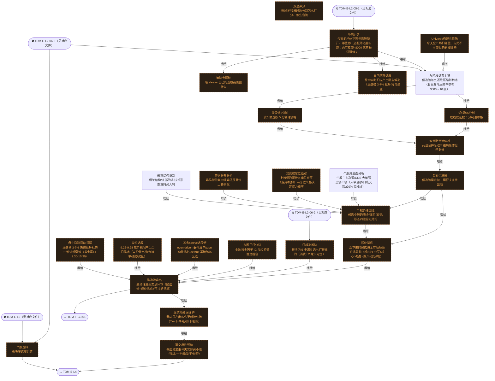

# 交易决策地图 · 建仓流 L3·个股漏斗（自动派生）

> **本文件由生成器自动派生，禁止手编**。真源=`config/trading_decision_map.yaml`（改动后 git commit → 运行时启动自动重生成）。
> 规模：25 节点｜🔴设计态（红节点）22｜📄paper 实盘执行 0｜图例：橙虚线=设计态，蓝底=📄paper 实盘执行节点（D18 治理阶梯）。
> 网页版（可缩放）：[_zoomable_html/trading_map_03_e_l3_stock.html](_zoomable_html/trading_map_03_e_l3_stock.html)

## 关系图

## 节点明细

| node_id | 名称 | 决策问题 | 时点 | activation | ai_autonomy | 模块锚 | 策略挂载 |
|---|---|---|---|---|---|---|---|
| TDM-E-L3🔴 | 个股选择 | 板块里选哪只票 | 盘前 | — | — | — | daban-sleeve(proposed)、multifactor-sleev… |
| TDM-E-L3-01🔴 | Universe构建与剔除 | 今天全市场扫哪些、先把不可交易的删掉哪些 | 盘后 | postmarket | auto | — | STR-MULTIFACTOR-043(proposed)、STR-MULTIF… |
| TDM-E-L3-02 | 九阶段选票主链 | 候选池怎么逐级压缩到精选（业界漏斗压缩率参考 3000→10 级） | 盘后 | postmarket | auto | src/zephyr/signal_fundamental/selection_funnel.py（MOD-SIG-08… | STR-MULTIFACTOR-042(proposed) |
| TDM-E-L3-03🔴 | 双池评分 | 短线池和波段池分别怎么打分、怎么合流 | 盘后 | postmarket | auto | — | — |
| TDM-E-L3-03-1🔴 | 短线池5分制 | 短线候选按 5 分制谁够格 | 盘后 | postmarket | auto | — | STR-MOMTREND-008(proposed) |
| TDM-E-L3-03-2🔴 | 波段池5分制 | 波段候选按 5 分制谁够格 | 盘后 | postmarket | auto | — | STR-MOMTREND-009(proposed) |
| TDM-E-L3-03-3🔴 | 双策略合流体检 | 两池合并后过三维共振体检还剩谁 | 盘后 | postmarket | auto | — | STR-MULTIFACTOR-045(proposed)、STR-MULTIF… |
| TDM-E-L3-04🔴 | 负面否决器 | 候选池里谁被一票否决直接出池 | 盘后 | postmarket | auto | — | STR-MULTIFACTOR-034(proposed)、STR-MULTIF… |
| TDM-E-L3-05🔴 | 顺位排序 | 活下来的候选按全市场顺位谁排最前（妖>龙>中军>核心>趋势>跟风+加分项） | 盘后 | postmarket | auto | — | — |
| TDM-E-L3-06🔴 | 环境开关 | 今天的档位下哪些选股链开、哪些停（首板筛选器实证：两市成交<8000 亿首板链暂停；板块 RPS<90 降仓） | 盘前 | premarket | auto | — | — |
| TDM-E-L3-07🔴 | 策略专属链 | 各 sleeve 自己的选股链跑出什么 | 盘后 | postmarket | auto | — | — |
| TDM-E-L3-07-1🔴 | 打板选股链 | 板块内 5 步漏斗选出打板标的（消费 L2 龙头定位） | 盘中 | intraday | auto | — | STR-DABAN-001(proposed)、STR-MULTIFACTOR-… |
| TDM-E-L3-07-2🔴 | 多因子打分链 | 全池按多因子 IC 加权打分谁进组合 | 盘后 | postmarket | auto | — | — |
| TDM-E-L3-07-3🔴 | 其余sleeve选股链 | eventdriven 事件清单/topn 动量排名/default 基础池怎么选 | 盘后 | postmarket | auto | — | — |
| TDM-E-L3-08🔴 | 候选池输出 | 最终谁进买卖点环节（候选池+顺位排序+否决后清单） | 盘后 | postmarket | auto | — | — |
| TDM-E-L3-09🔴 | 股票池分层维护 | 漏斗日产出怎么更新持久池（Tier 升降级+陈旧剔除） | 盘后 | postmarket | auto | — | STR-MULTIFACTOR-033(proposed) |
| TDM-E-L3-10🔴 | 可交易性预检 | 候选池里谁今天实际买不进（停牌/一字板/笼子/权限） | 盘前 | premarket | auto | — | — |
| TDM-E-L3-11🔴 | 日内动态选股 | 盘中实时扫描产出哪些候选（涨速榜 3-7% 拉升/异动资金） | 盘中 | intraday | auto | — | — |
| TDM-E-L3-11-1🔴 | 竞价选股 | 9:26-9:28 竞价瞬间产出当日候选（竞价量比/资金挂单/涨停试盘） | 盘中 | intraday | auto | — | — |
| TDM-E-L3-11-2🔴 | 盘中涨速异动扫描 | 涨速榜 3-7% 快速拉升标的中谁进观察池（黄金窗口 9:30-10:30） | 盘中 | intraday | auto | — | STR-MULTIFACTOR-031(proposed) |
| TDM-E-L3-12🔴 | 个股多维验证 | 候选个股的资金/席位/筹码/形态四维验证结论 | 盘后 | postmarket | auto | — | — |
| TDM-E-L3-12-1 | 个股资金面分析 | 个股主力净额/DDE 大单强度够不够（大单金额/日成交额≥20% 实战线） | 盘后 | postmarket | auto | src/zephyr/signal_ashare/capital_flow_pattern_analyzer.py（MO… | — |
| TDM-E-L3-12-2🔴 | 龙虎榜席位追踪 | 上榜标的是什么席位在买（游资/机构）—席位风格决定接力概率 | 盘后 | postmarket | auto | — | — |
| TDM-E-L3-12-3🔴 | 筹码分布分析 | 筹码低位集中吸筹还是高位上移派发 | 盘后 | postmarket | auto | — | — |
| TDM-E-L3-12-4 | 形态结构识别 | 缠论结构/底部确认/技术形态支持买入吗 | 盘后 | postmarket | auto | src/zephyr/signal_ashare/chanlun_structure.py（MOD-SIG-072） | — |

## 挂载清单

**模块锚（MOD）**：MOD-SIG-022 src/zephyr/signal_ashare/capital_flow_pattern_analyzer.py、MOD-SIG-072 src/zephyr/signal_ashare/chanlun_structure.py、MOD-SIG-086 src/zephyr/signal_fundamental/selection_funnel.py

**策略挂载（STR）**：STR-DABAN-001、STR-MOMTREND-008、STR-MOMTREND-009、STR-MULTIFACTOR-031、STR-MULTIFACTOR-033、STR-MULTIFACTOR-034、STR-MULTIFACTOR-035、STR-MULTIFACTOR-037、STR-MULTIFACTOR-039、STR-MULTIFACTOR-040、STR-MULTIFACTOR-041、STR-MULTIFACTOR-042、STR-MULTIFACTOR-043、STR-MULTIFACTOR-044、STR-MULTIFACTOR-045、STR-MULTIFACTOR-046、STR-MULTIFACTOR-048、daban-sleeve、default-equity、eventdriven-sleeve、multifactor-sleeve、topn-momentum
