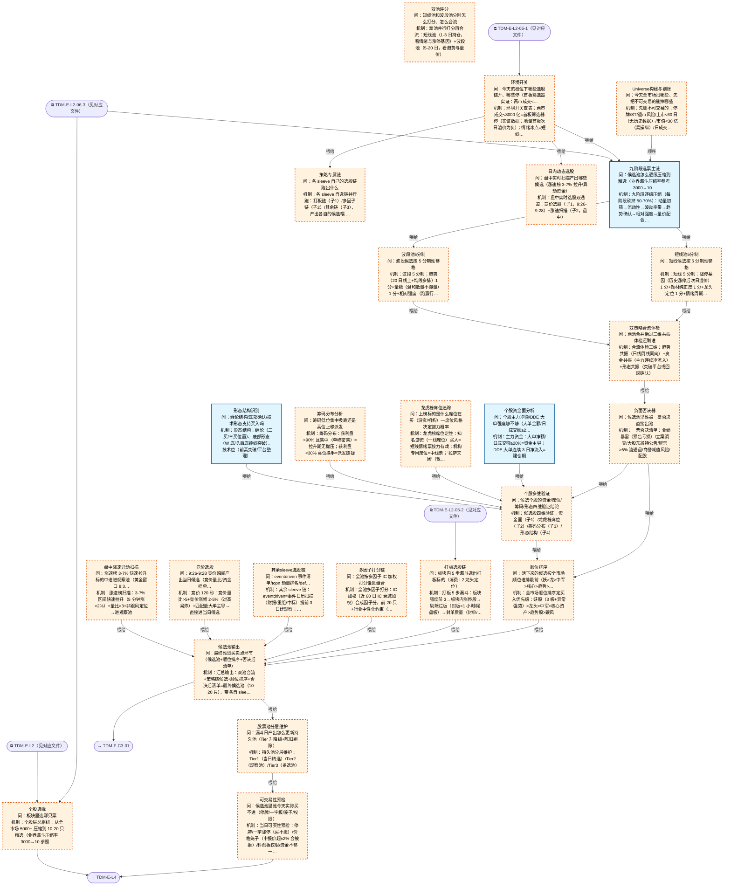

# 交易决策地图 · 建仓流 L3·个股漏斗（自动派生）

> **本文件由生成器自动派生，禁止手编**。真源=`config/trading_decision_map.yaml`（改动后 git commit → 运行时启动自动重生成）。
> 规模：25 节点｜🔴设计态（红节点）22｜📄paper 实盘执行 0｜图例：橙虚线=设计态，蓝底=📄paper 实盘执行节点（D18 治理阶梯）。
> 每个节点的完整机制（怎么算/依据什么/裁定原文）见下方「节点详解」区。
> **[可缩放 HTML 版 / Zoomable HTML](http://localhost:8765/docs/02_enterprise_architecture/10_trading_map/_zoomable_html/trading_map_03_e_l3_stock.html)** — Ctrl+滚轮缩放 ｜ 双击重置 ｜ Ctrl+Shift+D 切换拖动/选择模式

## 关系图

## 节点明细（速览）

| node_id | 名称 | 怎么算（大白话） | 时点 | 档位 | 模块锚 |
|---|---|---|---|---|---|
| TDM-E-L3🔴 | 个股选择 | 个股层总枢纽：从全市场 5000+ 压缩到 10-20 只精选（业界漏斗压缩率 3000→10 参照），子环节含 Universe 剔除/九阶段主链/双池评分/负面否决/顺位排序/环境开关/策略专属链/可交易性预检。 | 盘前 | — | — |
| TDM-E-L3-01🔴 | Universe构建与剔除 | 先删不可交易的：停牌/ST/退市风险/上市<60 日（无历史数据）/市值<30 亿（易操纵）/日成交<5000 万（进出困难）。剩下约 3000 只进 Universe。 | 盘后 | auto | — |
| TDM-E-L3-02 | 九阶段选票主链 | 九阶段逐级压缩（每阶段砍掉 50-70%）：动量初筛→流动性→波动率带→趋势确认→相对强度→量价配合→形态过滤→负面剔除→最终精选。3000→10 的主链骨架。 | 盘后 | auto | MOD-SIG-086 |
| TDM-E-L3-03🔴 | 双池评分 | 双池并行打分再合流：短线池（1-3 日持仓，看情绪与涨停基因）+波段池（5-20 日，看趋势与量价）。两池 5 分制各自打分，合流后过三维共振体检（趋势/资金/形态）。 | 盘后 | auto | — |
| TDM-E-L3-03-1🔴 | 短线池5分制 | 短线 5 分制：涨停基因（历史涨停后次日溢价）1 分+题材纯正度 1 分+龙头定位 1 分+情绪周期位置 1 分+分时强度 1 分。≥4 分进短线精选。 | 盘后 | auto | — |
| TDM-E-L3-03-2🔴 | 波段池5分制 | 波段 5 分制：趋势（20 日线上+均线多排）1 分+量能（温和放量不爆量）1 分+相对强度（跑赢行业指数）1 分+回踩质量（A/B 级）1 分+筹码（低位集中）1 分。≥4 分进波段精选。 | 盘后 | auto | — |
| TDM-E-L3-03-3🔴 | 双策略合流体检 | 合流体检三维：趋势共振（日线周线同向）+资金共振（主力连续净流入）+形态共振（突破平台或回踩确认）。三维至少两维达标才保留，防单因子幻觉。 | 盘后 | auto | — |
| TDM-E-L3-04🔴 | 负面否决器 | 一票否决清单：业绩暴雷（预告亏损）/立案调查/大股东减持公告/解禁>5% 流通盘/商誉减值风险/配股圈钱。命中任一条直接出池，不管打分多高——负面清单优先级高于一切加分项。 | 盘后 | auto | — |
| TDM-E-L3-05🔴 | 顺位排序 | 全市场顺位排序定买入优先级：妖股（3 板+异常强势）>龙头>中军>核心资产>趋势股>跟风。顺位=资金分配顺序，同分时顺位高的先买。 | 盘后 | auto | — |
| TDM-E-L3-06🔴 | 环境开关 | 环境开关查表：两市成交<8000 亿=首板筛选器停（实证数据：地量首板次日溢价为负）；情绪冰点=短线链全停只留波段链；极端高潮=反向收紧。开关表按 L1 六段状态查。 | 盘前 | auto | — |
| TDM-E-L3-07🔴 | 策略专属链 | 各 sleeve 自选链并行跑：打板链（子1）/多因子链（子2）/其余链（子3），产出各自的候选喂 L3-08 汇总。策略间不共享中间结果，防耦合。 | 盘后 | auto | — |
| TDM-E-L3-07-1🔴 | 打板选股链 | 打板 5 步漏斗：板块强度前 3→板块内涨停股→剔除烂板（封板<1 小时/尾盘板）→封单质量（封单/流通盘>2%）→龙头定位。最终 1-3 只进打板候选。 | 盘中 | auto | — |
| TDM-E-L3-07-2🔴 | 多因子打分链 | 全池多因子打分：IC 加权（近 60 日 IC 衰减加权）合成因子分，前 20 只+行业中性化约束（单行业≤4 只）进多因子候选。因子权重月度校准（C3-04）。 | 盘后 | auto | — |
| TDM-E-L3-07-3🔴 | 其余sleeve选股链 | 其余 sleeve 链：eventdriven=事件日历扫描（财报/重组/中标）提前 3 日建观察；topn=20 日动量排名前 N；default-equity=宽基 ETF 网格。各链独立产出。 | 盘后 | auto | — |
| TDM-E-L3-08🔴 | 候选池输出 | 汇总输出：双池合流+策略链候选+顺位排序+否决后清单=最终候选池（10-20 只），带各自 sleeve 标签与顺位分，喂 L4 买卖点层。 | 盘后 | auto | — |
| TDM-E-L3-09🔴 | 股票池分层维护 | 持久池分层维护：Tier1（当日精选）/Tier2（观察池）/Tier3（备选池）。日产出更新各 Tier：连续 2 日达标升 Tier、5 日不达标降级、10 日陈旧剔除。防止每天从零重扫。 | 盘后 | auto | — |
| TDM-E-L3-10🔴 | 可交易性预检 | 当日可买性预检：停牌/一字涨停（买不进）/价格笼子（申报价超±2% 会被拒）/科创板权限/资金不够一手。买不进的标记跳过，防止下单层空转报错。 | 盘前 | auto | — |
| TDM-E-L3-11🔴 | 日内动态选股 | 盘中实时选股双通道：竞价选股（子1，9:26-9:28）+涨速扫描（子2，盘中）。与盘前选股互补——盘前管计划内，盘中抓计划外机会。 | 盘中 | auto | — |
| TDM-E-L3-11-1🔴 | 竞价选股 | 竞价 120 秒：竞价量比>5+竞价涨幅 2-5%（过高易炸）+匹配量大单主导→直接进当日候选。竞价是全天第一个情绪确认窗口。 | 盘中 | auto | — |
| TDM-E-L3-11-2🔴 | 盘中涨速异动扫描 | 涨速榜扫描：3-7% 区间快速拉升（5 分钟涨>2%）+量比>3+非跟风定位→进观察池。黄金窗口 9:30-10:00，午后拉尾谨慎（尾盘偷袭板质量差）。 | 盘中 | auto | — |
| TDM-E-L3-12🔴 | 个股多维验证 | 候选股四维验证：资金面（子1）/龙虎榜席位（子2）/筹码分布（子3）/形态结构（子4）。四维至少三维正面才进最终池——多维验证压单维误判。 | 盘后 | auto | — |
| TDM-E-L3-12-1 | 个股资金面分析 | 主力资金：大单净额/日成交额≥20%=资金主导；DDE 大单连续 3 日净流入=建仓期。单日大进大出（>50% 占比）警惕对倒。 | 盘后 | auto | MOD-SIG-022 |
| TDM-E-L3-12-2🔴 | 龙虎榜席位追踪 | 龙虎榜席位定性：知名游资（一线席位）买入=短线情绪票接力有戏；机构专用席位=中线票；'拉萨天团'（散户大本营）=次日溢价差。席位风格决定这只票的玩法。 | 盘后 | auto | — |
| TDM-E-L3-12-3🔴 | 筹码分布分析 | 筹码分布：获利盘>90% 且集中（单峰密集）=拉升期无抛压；获利盘<30% 高位换手=派发嫌疑。筹码低位单峰密集是最干净的形态。 | 盘后 | auto | — |
| TDM-E-L3-12-4 | 形态结构识别 | 形态结构：缠论（二买/三买位置）、底部形态（W 底/头肩底颈线突破）、技术位（前高突破/平台整理）。形态给买点定位，不单独构成买入理由。 | 盘后 | auto | MOD-SIG-072 |

## 节点详解（机制怎么产生）

### TDM-E-L3 个股选择 🔴

**问**：板块里选哪只票

**机制（怎么算）**：个股层总枢纽：从全市场 5000+ 压缩到 10-20 只精选（业界漏斗压缩率 3000→10 参照），子环节含 Universe 剔除/九阶段主链/双池评分/负面否决/顺位排序/环境开关/策略专属链/可交易性预检。

**依据锚**：因子 FCT-MOM-003 ｜ 策略挂载 daban-sleeve、multifactor-sleeve、eventdriven-sleeve、topn-momentum、default-equity

### TDM-E-L3-01 Universe构建与剔除 🔴

**问**：今天全市场扫哪些、先把不可交易的删掉哪些

**机制（怎么算）**：先删不可交易的：停牌/ST/退市风险/上市<60 日（无历史数据）/市值<30 亿（易操纵）/日成交<5000 万（进出困难）。剩下约 3000 只进 Universe。

**依据锚**：因子 FCT-QUAL-001 ｜ 数据 DS-150 ｜ 事件 EVT-CA-002、EVT-CA-003、EVT-EARN-001 ｜ 票池 UNI-RULE-001、UNI-DYNAMIC-001、UNI-RULE-002 ｜ 策略挂载 STR-MULTIFACTOR-043、STR-MULTIFACTOR-044
**治理**：激活=postmarket ｜ 档位=auto ｜ 兜底=扫描数据缺→沿用昨日池并标注时效

**设计备注（裁定/欠账原文）**：
- ── E-L3 血肉 v1.5（D28：8 树枝 14 节点；策略库 12 条选股规则上图；调研=RankGLU/Learning-to-Rank/Value-Screen 四层流水线/Progressive 5-Stage Funnel/三套 A股条件表）──
- 两新增（Owner 确认）：05 顺位排序（全市场顺位：妖>龙>中军>核心>趋势>跟风+加分项）、06 环境开关（水温/情绪档→选股链启停，首板筛选器实证：两市成交<8000 亿首板链暂停）
- 负面否决器=一票否决语义（L3 特色树枝）；07-3 其他 sleeve 链内容薄=红节点

### TDM-E-L3-02 九阶段选票主链

**问**：候选池怎么逐级压缩到精选（业界漏斗压缩率参考 3000→10 级）

**机制（怎么算）**：九阶段逐级压缩（每阶段砍掉 50-70%）：动量初筛→流动性→波动率带→趋势确认→相对强度→量价配合→形态过滤→负面剔除→最终精选。3000→10 的主链骨架。

**依据锚**：因子 FCT-MOM-009、FCT-MOM-010 ｜ 数据 DS-150、DS-181 ｜ 策略挂载 STR-MULTIFACTOR-042
**治理**：激活=postmarket ｜ 档位=auto ｜ 模块=MOD-SIG-086

### TDM-E-L3-03 双池评分 🔴

**问**：短线池和波段池分别怎么打分、怎么合流

**机制（怎么算）**：双池并行打分再合流：短线池（1-3 日持仓，看情绪与涨停基因）+波段池（5-20 日，看趋势与量价）。两池 5 分制各自打分，合流后过三维共振体检（趋势/资金/形态）。

**依据锚**：数据 DS-150
**治理**：激活=postmarket ｜ 档位=auto

### TDM-E-L3-03-1 短线池5分制 🔴

**问**：短线候选按 5 分制谁够格

**机制（怎么算）**：短线 5 分制：涨停基因（历史涨停后次日溢价）1 分+题材纯正度 1 分+龙头定位 1 分+情绪周期位置 1 分+分时强度 1 分。≥4 分进短线精选。

**依据锚**：因子 FCT-TECH-070 ｜ 数据 DS-150 ｜ 策略挂载 STR-MOMTREND-008
**治理**：激活=postmarket ｜ 档位=auto

### TDM-E-L3-03-2 波段池5分制 🔴

**问**：波段候选按 5 分制谁够格

**机制（怎么算）**：波段 5 分制：趋势（20 日线上+均线多排）1 分+量能（温和放量不爆量）1 分+相对强度（跑赢行业指数）1 分+回踩质量（A/B 级）1 分+筹码（低位集中）1 分。≥4 分进波段精选。

**依据锚**：因子 FCT-TECH-071 ｜ 数据 DS-150 ｜ 策略挂载 STR-MOMTREND-009
**治理**：激活=postmarket ｜ 档位=auto

### TDM-E-L3-03-3 双策略合流体检 🔴

**问**：两池合并后过三维共振体检还剩谁

**机制（怎么算）**：合流体检三维：趋势共振（日线周线同向）+资金共振（主力连续净流入）+形态共振（突破平台或回踩确认）。三维至少两维达标才保留，防单因子幻觉。

**依据锚**：因子 FCT-TECH-085 ｜ 策略挂载 STR-MULTIFACTOR-045、STR-MULTIFACTOR-046
**治理**：激活=postmarket ｜ 档位=auto

### TDM-E-L3-04 负面否决器 🔴

**问**：候选池里谁被一票否决直接出池

**机制（怎么算）**：一票否决清单：业绩暴雷（预告亏损）/立案调查/大股东减持公告/解禁>5% 流通盘/商誉减值风险/配股圈钱。命中任一条直接出池，不管打分多高——负面清单优先级高于一切加分项。

**依据锚**：因子 FCT-TECH-083、FCT-TECH-077 ｜ 数据 DS-150 ｜ 策略挂载 STR-MULTIFACTOR-034、STR-MULTIFACTOR-035、STR-MULTIFACTOR-037、STR-MULTIFACTOR-039、STR-MULTIFACTOR-040、STR-MULTIFACTOR-041
**治理**：激活=postmarket ｜ 档位=auto

### TDM-E-L3-05 顺位排序 🔴

**问**：活下来的候选按全市场顺位谁排最前（妖>龙>中军>核心>趋势>跟风+加分项）

**机制（怎么算）**：全市场顺位排序定买入优先级：妖股（3 板+异常强势）>龙头>中军>核心资产>趋势股>跟风。顺位=资金分配顺序，同分时顺位高的先买。

**依据锚**：数据 DS-150
**治理**：激活=postmarket ｜ 档位=auto ｜ 兜底=顺位评分数据缺→退化为双池分数排序

### TDM-E-L3-06 环境开关 🔴

**问**：今天的档位下哪些选股链开、哪些停（首板筛选器实证：两市成交<8000 亿首板链暂停；板块 RPS<90 降仓）

**机制（怎么算）**：环境开关查表：两市成交<8000 亿=首板筛选器停（实证数据：地量首板次日溢价为负）；情绪冰点=短线链全停只留波段链；极端高潮=反向收紧。开关表按 L1 六段状态查。

**依据锚**：数据 DS-150
**治理**：激活=premarket ｜ 档位=auto ｜ 兜底=断流/档位缺失→不开新仓（昨日已计划的卖出动作照做）（D103 终裁）

### TDM-E-L3-07 策略专属链 🔴

**问**：各 sleeve 自己的选股链跑出什么

**机制（怎么算）**：各 sleeve 自选链并行跑：打板链（子1）/多因子链（子2）/其余链（子3），产出各自的候选喂 L3-08 汇总。策略间不共享中间结果，防耦合。

**治理**：激活=postmarket ｜ 档位=auto

### TDM-E-L3-07-1 打板选股链 🔴

**问**：板块内 5 步漏斗选出打板标的（消费 L2 龙头定位）

**机制（怎么算）**：打板 5 步漏斗：板块强度前 3→板块内涨停股→剔除烂板（封板<1 小时/尾盘板）→封单质量（封单/流通盘>2%）→龙头定位。最终 1-3 只进打板候选。

**依据锚**：因子 FCT-SENT-007、FCT-MOM-016 ｜ 数据 DS-150、DS-082 ｜ 策略挂载 STR-DABAN-001、STR-MULTIFACTOR-048
**治理**：激活=intraday ｜ 档位=auto

### TDM-E-L3-07-2 多因子打分链 🔴

**问**：全池按多因子 IC 加权打分谁进组合

**机制（怎么算）**：全池多因子打分：IC 加权（近 60 日 IC 衰减加权）合成因子分，前 20 只+行业中性化约束（单行业≤4 只）进多因子候选。因子权重月度校准（C3-04）。

**依据锚**：数据 DS-150、DS-181
**治理**：激活=postmarket ｜ 档位=auto

### TDM-E-L3-07-3 其余sleeve选股链 🔴

**问**：eventdriven 事件清单/topn 动量排名/default 基础池怎么选

**机制（怎么算）**：其余 sleeve 链：eventdriven=事件日历扫描（财报/重组/中标）提前 3 日建观察；topn=20 日动量排名前 N；default-equity=宽基 ETF 网格。各链独立产出。

**依据锚**：数据 DS-150
**治理**：激活=postmarket ｜ 档位=auto

### TDM-E-L3-08 候选池输出 🔴

**问**：最终谁进买卖点环节（候选池+顺位排序+否决后清单）

**机制（怎么算）**：汇总输出：双池合流+策略链候选+顺位排序+否决后清单=最终候选池（10-20 只），带各自 sleeve 标签与顺位分，喂 L4 买卖点层。

**治理**：激活=postmarket ｜ 档位=auto

### TDM-E-L3-09 股票池分层维护 🔴

**问**：漏斗日产出怎么更新持久池（Tier 升降级+陈旧剔除）

**机制（怎么算）**：持久池分层维护：Tier1（当日精选）/Tier2（观察池）/Tier3（备选池）。日产出更新各 Tier：连续 2 日达标升 Tier、5 日不达标降级、10 日陈旧剔除。防止每天从零重扫。

**依据锚**：因子 FCT-MOM-003 ｜ 数据 DS-150 ｜ 策略挂载 STR-MULTIFACTOR-033
**治理**：激活=postmarket ｜ 档位=auto

**设计备注（裁定/欠账原文）**：
- ── D29 补缺：漏斗是"日算"的，池是"持久"的——L3 缺池生命周期与可交易性预检 ──
- 09 股票池分层维护（业界三层就绪度池：Tier1 活跃 5-10/Tier2 培育 10-20/Tier3 雷达 20-50；
- 每日升降级+陈旧剔除；与 03 双池正交——双池按风格、Tier 按就绪度）；STR-MULTIFACTOR-033 上挂
- 池成员状态存储=治理状态表/新 DS（待登记施工，外审 M-41）；回测侧升降级规则若对历史确定可重算则标可合成

### TDM-E-L3-10 可交易性预检 🔴

**问**：候选池里谁今天实际买不进（停牌/一字板/笼子/权限）

**机制（怎么算）**：当日可买性预检：停牌/一字涨停（买不进）/价格笼子（申报价超±2% 会被拒）/科创板权限/资金不够一手。买不进的标记跳过，防止下单层空转报错。

**依据锚**：数据 DS-082、DS-150
**治理**：激活=premarket ｜ 档位=auto ｜ 兜底=预检数据缺→标记未预检（执行层兜底拦截）

**设计备注（裁定/欠账原文）**：
- 10 可交易性预检（A股刚需：停牌/一字板/价格笼子±2%/权限门槛/异常交易监控——预案给一字板票=白写）

### TDM-E-L3-11 日内动态选股 🔴

**问**：盘中实时扫描产出哪些候选（涨速榜 3-7% 拉升/异动资金）

**机制（怎么算）**：盘中实时选股双通道：竞价选股（子1，9:26-9:28）+涨速扫描（子2，盘中）。与盘前选股互补——盘前管计划内，盘中抓计划外机会。

**依据锚**：数据 DS-150、DS-082
**治理**：激活=intraday ｜ 档位=auto

**设计备注（裁定/欠账原文）**：
- ── D31 L3 补缺：日内动态选股（竞价/盘中）+ 个股多维验证（资金/龙虎榜/筹码/形态）──
- Owner 判定成立：L3 粒度欠账——候选大头来自盘中扫描（涨速异动）与竞价（9:26-9:28），原结构全盘后
- 首日上市标的暂不入池（新股买入侧档位待 D71 扩展裁定，外审 m-25）

### TDM-E-L3-11-1 竞价选股 🔴

**问**：9:26-9:28 竞价瞬间产出当日候选（竞价量比/资金挂单/涨停试盘）

**机制（怎么算）**：竞价 120 秒：竞价量比>5+竞价涨幅 2-5%（过高易炸）+匹配量大单主导→直接进当日候选。竞价是全天第一个情绪确认窗口。

**依据锚**：数据 DS-082、DS-150
**治理**：激活=intraday ｜ 失效=9:25 前数据为假象密集区，不作为选股依据 ｜ 档位=auto

### TDM-E-L3-11-2 盘中涨速异动扫描 🔴

**问**：涨速榜 3-7% 快速拉升标的中谁进观察池（黄金窗口 9:30-10:30）

**机制（怎么算）**：涨速榜扫描：3-7% 区间快速拉升（5 分钟涨>2%）+量比>3+非跟风定位→进观察池。黄金窗口 9:30-10:00，午后拉尾谨慎（尾盘偷袭板质量差）。

**依据锚**：因子 FCT-MOM-030 ｜ 数据 DS-150、DS-082 ｜ 策略挂载 STR-MULTIFACTOR-031
**治理**：激活=intraday ｜ 档位=auto

### TDM-E-L3-12 个股多维验证 🔴

**问**：候选个股的资金/席位/筹码/形态四维验证结论

**机制（怎么算）**：候选股四维验证：资金面（子1）/龙虎榜席位（子2）/筹码分布（子3）/形态结构（子4）。四维至少三维正面才进最终池——多维验证压单维误判。

**依据锚**：数据 DS-181
**治理**：激活=postmarket ｜ 档位=auto

### TDM-E-L3-12-1 个股资金面分析

**问**：个股主力净额/DDE 大单强度够不够（大单金额/日成交额≥20% 实战线）

**机制（怎么算）**：主力资金：大单净额/日成交额≥20%=资金主导；DDE 大单连续 3 日净流入=建仓期。单日大进大出（>50% 占比）警惕对倒。

**依据锚**：数据 DS-181
**治理**：激活=postmarket ｜ 档位=auto ｜ 模块=MOD-SIG-022

### TDM-E-L3-12-2 龙虎榜席位追踪 🔴

**问**：上榜标的是什么席位在买（游资/机构）—席位风格决定接力概率

**机制（怎么算）**：龙虎榜席位定性：知名游资（一线席位）买入=短线情绪票接力有戏；机构专用席位=中线票；'拉萨天团'（散户大本营）=次日溢价差。席位风格决定这只票的玩法。

**依据锚**：席位 SEAT-INST-001、SEAT-INST-002、SEAT-INST-003、SEAT-YOUZI-001、SEAT-YOUZI-002、SEAT-YOUZI-003
**治理**：激活=postmarket ｜ 档位=auto

### TDM-E-L3-12-3 筹码分布分析 🔴

**问**：筹码低位集中吸筹还是高位上移派发

**机制（怎么算）**：筹码分布：获利盘>90% 且集中（单峰密集）=拉升期无抛压；获利盘<30% 高位换手=派发嫌疑。筹码低位单峰密集是最干净的形态。

**依据锚**：数据 DS-150
**治理**：激活=postmarket ｜ 档位=auto

### TDM-E-L3-12-4 形态结构识别

**问**：缠论结构/底部确认/技术形态支持买入吗

**机制（怎么算）**：形态结构：缠论（二买/三买位置）、底部形态（W 底/头肩底颈线突破）、技术位（前高突破/平台整理）。形态给买点定位，不单独构成买入理由。

**依据锚**：数据 DS-150 ｜ 形态 PAT-CLL-002、PAT-CLL-006、PAT-CLL-007、PAT-CLL-013、PAT-CHART-004、PAT-CHART-016
**治理**：激活=postmarket ｜ 档位=auto ｜ 模块=MOD-SIG-072

## 挂载清单

**模块锚（MOD）**：MOD-SIG-022 src/zephyr/signal_ashare/capital_flow_pattern_analyzer.py、MOD-SIG-072 src/zephyr/signal_ashare/chanlun_structure.py、MOD-SIG-086 src/zephyr/signal_fundamental/selection_funnel.py

**策略挂载（STR）**：STR-DABAN-001、STR-MOMTREND-008、STR-MOMTREND-009、STR-MULTIFACTOR-031、STR-MULTIFACTOR-033、STR-MULTIFACTOR-034、STR-MULTIFACTOR-035、STR-MULTIFACTOR-037、STR-MULTIFACTOR-039、STR-MULTIFACTOR-040、STR-MULTIFACTOR-041、STR-MULTIFACTOR-042、STR-MULTIFACTOR-043、STR-MULTIFACTOR-044、STR-MULTIFACTOR-045、STR-MULTIFACTOR-046、STR-MULTIFACTOR-048、daban-sleeve、default-equity、eventdriven-sleeve、multifactor-sleeve、topn-momentum
