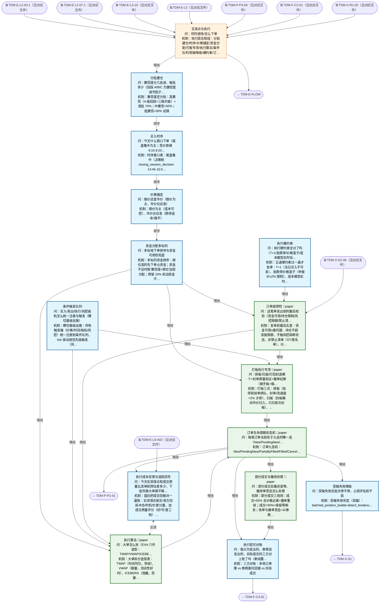

# 交易决策地图 · 建仓流 L4·执行（自动派生）

> **本文件由生成器自动派生，禁止手编**。真源=`config/trading_decision_map.yaml`（改动后 git commit → 运行时启动自动重生成）。
> 规模：15 节点｜🔴设计态（红节点）1｜📄paper 实盘执行 5｜图例：橙虚线=设计态，蓝底=📄paper 实盘执行节点（D18 治理阶梯）。
> 每个节点的完整机制（怎么算/依据什么/裁定原文）见下方「节点详解」区。
> **[可缩放 HTML 版 / Zoomable HTML](http://localhost:8765/docs/02_enterprise_architecture/10_trading_map/_zoomable_html/trading_map_04_e_l4_exec.html)** — Ctrl+滚轮缩放 ｜ 双击重置 ｜ Ctrl+Shift+D 切换拖动/选择模式

## 关系图

## 节点明细（速览）

| node_id | 名称 | 怎么算（大白话） | 时点 | 档位 | 模块锚 |
|---|---|---|---|---|---|
| TDM-E-L4🔴 | 买卖点与执行 | 执行层总枢纽：分批建仓/时序/价格锚定/资金分配/打板专项/执行算法/条件队列/突破降级/硬约束/订单九态/部分成交/预检/容灾对账 13 子环节。管'什么时候、怎么把单下出去'。 | 盘中 | — | — |
| TDM-E-L4-01 | 分批建仓 | 置信度定分批：高置信（A 级回踩+三维共振）=首批 70%；中置信=50%；低置信=30% 试探。剩余额度等确认信号（涨 2% 或站稳分时均线）再进。回踩 A/B/C 是置信度调节因子。（2026-09-15 ALGO_FLOW 块出仓至 docs/03_modules/_domain_execution_core/algo_flow/order_splitter.yaml：算法推导图外迁，算法口径不变） | 盘中 | auto | MOD-EX-014 |
| TDM-E-L4-02 | 买入时序 | 时序窗口表：尾盘集中（决策侧 closing_session_decision 14:45-15:00 定加减仓；执行侧 batched_position_builder 14:50-14:57 挂单主窗+14:57-15:00 收盘竞价兜底），全天信息确认后隔夜风险最小；竞价铁律=9:15-9:20 可撤挂单密集不参与、9:20-9:25 不可撤观察不动作；开盘 30 分钟只执行盘前计划单不新开。 | 盘中 | auto | MOD-PLAN-003 |
| TDM-E-L4-03 | 价格锚定 | 限价为主（成本可控），市价仅应急（跌停逃命/强平）。限价锚：买=卖一价+1 tick 保证成交又不追高；突破买=突破价上方 0.5% 挂单等着成交。（2026-09-15 ALGO_FLOW 块出仓至 docs/03_modules/_domain_execution_core/algo_flow/pricing_policy.yaml：算法推导图外迁，算法口径不变） | 盘中 | auto | MOD-L06-001 |
| TDM-E-L4-04 | 资金分配多标的 | 多标的资金排序：顺位高的先下单占资金；资金不足时按'置信度×顺位'加权分配；预留 10% 机动资金不分配（应对盘中机会）。 | 盘中 | auto | MOD-L03-001 |
| TDM-E-L4-05 | 打板执行专项 | 打板三式：排板（涨停前挂单排队，封单/流通盘>2% 才排）、扫板（封板瞬间市价扫入，只扫首次封板）、打回封（炸板后回封确认再进）。换手板优于缩量板（换手充分=接力意愿强）；撤单纪律=封单骤减 20% 立即撤。（2026-09-15 ALGO_FLOW 块出仓至 docs/03_modules/_domain_execution_core/algo_flow/daban_execution.yaml：算法推导图外迁，算法口径不变） | 盘中 | paper | MOD-EX-001 |
| TDM-E-L4-06 | 执行算法 | 大单拆分选型表：TWAP（时间均匀，常规）、VWAP（跟量，流动性好时）、ICEBERG（隐藏，防暴露）、IS（急单，前重后轻）。>500 万单必拆；单笔≤盘口一档 50%；冲击成本预算 0.3%。 | 盘中 | paper | MOD-XS-011 |
| TDM-E-L4-07 | 条件触发队列 | 横切基础设施：所有触发器（价格/时间/指标/风控）统一注册到条件队列，tick 驱动按优先级触发（风控>卖出>买入）。一处注册全图复用，防各策略各写各的触发器打架。（2026-09-15 ALGO_FLOW 块出仓至 docs/03_modules/_domain_execution_core/algo_flow/local_order_queue.yaml：算法推导图外迁，算法口径不变） | 持续 | auto | MOD-L06-001 |
| TDM-E-L4-08 | 突破失败降级 | 突破失败判定（双锚）：batched_position_builder.detect_breakout_failure=收盘价连续 2 根 K 线（防日内假跌破）跌破首仓入场价→暂停确认仓+止损评估；收盘跌破前低（10 日回看）→暂停全部后续批次+止损卖出；breakout_failure_detector=K≥3 次突破失败→强制清仓（最高优先级）。突破买入的批次控制——首仓失败不加仓。 | 盘中 | auto | MOD-SELL-003 |
| TDM-E-L4-09 | 执行硬约束 | 五道硬约束过一遍才发单：T+1（当日买入不可卖）、涨跌停价格笼子（申报价±2% 限制）、成本模型实时估（预期冲击+佣金是否吃掉预期收益 1/3）、资金可用、持仓限额。（2026-09-15 ALGO_FLOW 块出仓至 docs/03_modules/_domain_execution_core/algo_flow/price_cage.yaml：算法推导图外迁，算法口径不变） | 持续 | auto | MOD-L06-001 |
| TDM-E-L4-10 | 订单生命周期状态机 | 订单九态机：New/PendingNew/PartiallyFilled/Filled/Cancelled/PendingCancel/Rejected/Expired/Suspended。每态有明确的超时与重试策略（如 PendingNew>3 秒重发确认）。（2026-09-15 ALGO_FLOW 块出仓至 docs/03_modules/_domain_execution_core/algo_flow/order_manager.yaml：算法推导图外迁，算法口径不变） | 持续 | paper | MOD-L06-001 |
| TDM-E-L4-11 | 部分成交与撤改处理 | 部分成交三规则：成交<50% 且价格远离=撤单重挂；成交>50%=保留等剩余；改单与撤单竞态=以券商回报为准+本地加锁。部分成交的仓位按已成交部分管理。（2026-09-15 ALGO_FLOW 块出仓至 docs/03_modules/_domain_execution_core/algo_flow/fill_handler.yaml：算法推导图外迁，算法口径不变） | 盘中 | paper | MOD-EX-001 |
| TDM-E-L4-12 | 订单级预检 | 发单前最后五查：资金可用≥委托额、持仓不超该股限额、不触风控熔断状态、非禁止清单（ST/黑名单）、价格在笼子内。任何一条不过=拒单并记录原因。（2026-09-15 ALGO_FLOW 块出仓至 docs/03_modules/_domain_execution_core/algo_flow/pre_execution_checker.yaml：算法推导图外迁，算法口径不变） | 盘中 | paper | MOD-EX-024 |
| TDM-E-L4-13 | 执行容灾对账 | 三方对账：本地订单簿 vs 券商委托回报 vs 实际成交。断线重连后先全量对账再恢复交易；孤儿单（券商有我无）=立即同步并评估处理；日终对不平=挂起次日竞价处理。（2026-09-15 ALGO_FLOW 块出仓至 docs/03_modules/_domain_trading/algo_flow/three_way_reconciliation.yaml：算法推导图外迁，算法口径不变） | 持续 | auto | MOD-TRADING-013 |
| TDM-E-L4-14 | 执行成本反馈与选型回写 | 盘后把成交回报对一遍账：实测滑点按买/卖方向拆冲击/时机/价差分量，加成交质量评分（好/可/差三档）， 与 L4-09 发单前的成本预估比对；偏差按执行算法分桶累积，喂执行算法选择器当评分输入—— 某算法连续实测比预估差就降它的权重，下批同类单换算法（Almgren-Chriss 2000 经典：执行=冲击成本与时机风险的权衡）。三零件全在且 production（滑点分析器+质量评分器+算法选择器），缺把三者接成环的接线—— 质量评分器的消费者行写着"选择器反馈环"，但选择器代码还没消费它（断链实证 2026-09-10）。RL 执行为远期候选（A 股 T+1/涨跌停/拆单限制需改造，挂晨审）。 | 盘后 | auto | MOD-XS-018 |

## 节点详解（机制怎么产生）

### TDM-E-L4 买卖点与执行 🔴

**问**：何时进场/怎么下单

**机制（怎么算）**：执行层总枢纽：分批建仓/时序/价格锚定/资金分配/打板专项/执行算法/条件队列/突破降级/硬约束/订单九态/部分成交/预检/容灾对账 13 子环节。管'什么时候、怎么把单下出去'。

**依据锚**：因子 FCT-INTRADAY-028 ｜ 策略挂载 daban-sleeve
**治理**：激活=intraday

### TDM-E-L4-01 分批建仓

**问**：置信度分几批进、每批多少（回踩 A/B/C 为置信度调节因子）

**机制（怎么算）**：置信度定分批：高置信（A 级回踩+三维共振）=首批 70%；中置信=50%；低置信=30% 试探。剩余额度等确认信号（涨 2% 或站稳分时均线）再进。回踩 A/B/C 是置信度调节因子。（2026-09-15 ALGO_FLOW 块出仓至 docs/03_modules/_domain_execution_core/algo_flow/order_splitter.yaml：算法推导图外迁，算法口径不变）

**依据锚**：数据 DS-150
**治理**：激活=intraday ｜ 档位=auto ｜ 模块=MOD-EX-014

### TDM-E-L4-02 买入时序

**问**：今天什么窗口下单（尾盘集中为主；竞价铁律 9:15-9:20 可撤假象多/9:20-9:25 只挂不撤/14:57-15:00 尾盘竞价不可撤；时间锚 2:30 背离与 2:57 竞价）

**机制（怎么算）**：时序窗口表：尾盘集中（决策侧 closing_session_decision 14:45-15:00 定加减仓；执行侧 batched_position_builder 14:50-14:57 挂单主窗+14:57-15:00 收盘竞价兜底），全天信息确认后隔夜风险最小；竞价铁律=9:15-9:20 可撤挂单密集不参与、9:20-9:25 不可撤观察不动作；开盘 30 分钟只执行盘前计划单不新开。

**依据锚**：因子 FCT-INTRADAY-024、FCT-INTRADAY-027 ｜ 数据 DS-150 ｜ 策略挂载 STR-MULTIFACTOR-028、STR-MOMTREND-004
**治理**：激活=intraday ｜ 失效=9:15-9:20 时段禁止决策（假单密集） ｜ 档位=auto ｜ 模块=MOD-PLAN-003

### TDM-E-L4-03 价格锚定

**问**：限价还是市价（限价为主，市价仅应急）

**机制（怎么算）**：限价为主（成本可控），市价仅应急（跌停逃命/强平）。限价锚：买=卖一价+1 tick 保证成交又不追高；突破买=突破价上方 0.5% 挂单等着成交。（2026-09-15 ALGO_FLOW 块出仓至 docs/03_modules/_domain_execution_core/algo_flow/pricing_policy.yaml：算法推导图外迁，算法口径不变）

**治理**：激活=intraday ｜ 档位=auto ｜ 模块=MOD-L06-001

### TDM-E-L4-04 资金分配多标的

**问**：多标地下单排序与资金可用性兜底

**机制（怎么算）**：多标的资金排序：顺位高的先下单占资金；资金不足时按'置信度×顺位'加权分配；预留 10% 机动资金不分配（应对盘中机会）。

**治理**：激活=intraday ｜ 档位=auto ｜ 模块=MOD-L03-001

### TDM-E-L4-05 打板执行专项

**问**：排板/扫板/打回封选哪个+封单质量验证+撤单纪律（换手板>缩量板/封单要实且递增/黄金排队窗口 5-15 分钟/封单被快速吃掉或大盘跳水即撤）

**机制（怎么算）**：打板三式：排板（涨停前挂单排队，封单/流通盘>2% 才排）、扫板（封板瞬间市价扫入，只扫首次封板）、打回封（炸板后回封确认再进）。换手板优于缩量板（换手充分=接力意愿强）；撤单纪律=封单骤减 20% 立即撤。（2026-09-15 ALGO_FLOW 块出仓至 docs/03_modules/_domain_execution_core/algo_flow/daban_execution.yaml：算法推导图外迁，算法口径不变）

**依据锚**：数据 DS-082
**治理**：激活=intraday ｜ 失效=封单被快速大额吃掉且无同力度补单→撤单；大盘突发跳水→无论封单多稳先撤（系统性风险优先）；QMT 约束=handlebar 主线程下单+隔 1-2 秒查委托回执，查不到标记疑似丢单 ｜ 档位=paper ｜ 模块=MOD-EX-001

### TDM-E-L4-06 执行算法

**问**：大单怎么拆（EXA 六件选型：TWAP/VWAP/ICEBERG/IS/POV/ALT；参与率纪律≤市场量 10-20%）

**机制（怎么算）**：大单拆分选型表：TWAP（时间均匀，常规）、VWAP（跟量，流动性好时）、ICEBERG（隐藏，防暴露）、IS（急单，前重后轻）。>500 万单必拆；单笔≤盘口一档 50%；冲击成本预算 0.3%。

**依据锚**：算法 EXA-TWAP-001、EXA-VWAP-001、EXA-ICEBERG-001、EXA-IS-001、EXA-POV-001、EXA-ALT-001
**治理**：激活=intraday ｜ 档位=paper ｜ 模块=MOD-XS-011

### TDM-E-L4-07 条件触发队列

**问**：买入/卖出/执行/风控扳机怎么统一注册与触发（横切基础设施）

**机制（怎么算）**：横切基础设施：所有触发器（价格/时间/指标/风控）统一注册到条件队列，tick 驱动按优先级触发（风控>卖出>买入）。一处注册全图复用，防各策略各写各的触发器打架。（2026-09-15 ALGO_FLOW 块出仓至 docs/03_modules/_domain_execution_core/algo_flow/local_order_queue.yaml：算法推导图外迁，算法口径不变）

**治理**：激活=continuous ｜ 档位=auto ｜ 模块=MOD-L06-001 ｜ 兜底=队列积压→降级批量处理+告警（41 号降级语义）

### TDM-E-L4-08 突破失败降级

**问**：突破失败后批次停不停、止损评估启不启

**机制（怎么算）**：突破失败判定（双锚）：batched_position_builder.detect_breakout_failure=收盘价连续 2 根 K 线（防日内假跌破）跌破首仓入场价→暂停确认仓+止损评估；收盘跌破前低（10 日回看）→暂停全部后续批次+止损卖出；breakout_failure_detector=K≥3 次突破失败→强制清仓（最高优先级）。突破买入的批次控制——首仓失败不加仓。

**依据锚**：数据 DS-150
**治理**：激活=intraday ｜ 档位=auto ｜ 模块=MOD-SELL-003

### TDM-E-L4-09 执行硬约束

**问**：执行硬约束全过了吗（T+1/涨跌停/价格笼子/成本模型实时估算——佣金+印花税+滑点）

**机制（怎么算）**：五道硬约束过一遍才发单：T+1（当日买入不可卖）、涨跌停价格笼子（申报价±2% 限制）、成本模型实时估（预期冲击+佣金是否吃掉预期收益 1/3）、资金可用、持仓限额。（2026-09-15 ALGO_FLOW 块出仓至 docs/03_modules/_domain_execution_core/algo_flow/price_cage.yaml：算法推导图外迁，算法口径不变）

**依据锚**：数据 DS-082 ｜ 成本模型 CST-ASTOCK-001
**治理**：激活=continuous ｜ 档位=auto ｜ 模块=MOD-L06-001

### TDM-E-L4-10 订单生命周期状态机

**问**：每笔订单当前处于九态的哪一态（New/PendingNew/Accepted/Partial/Filled/PendingCancel/Cancelled/Rejected/Expired）

**机制（怎么算）**：订单九态机：New/PendingNew/PartiallyFilled/Filled/Cancelled/PendingCancel/Rejected/Expired/Suspended。每态有明确的超时与重试策略（如 PendingNew>3 秒重发确认）。（2026-09-15 ALGO_FLOW 块出仓至 docs/03_modules/_domain_execution_core/algo_flow/order_manager.yaml：算法推导图外迁，算法口径不变）

**治理**：激活=continuous ｜ 失效=PendingCancel 窗口内原单仍可成交=竞态，必须以交易所回执为准 ｜ 档位=paper ｜ 模块=MOD-L06-001

### TDM-E-L4-11 部分成交与撤改处理

**问**：部分成交后撤还是等、撤改单竞态怎么处理

**机制（怎么算）**：部分成交三规则：成交<50% 且价格远离=撤单重挂；成交>50%=保留等剩余；改单与撤单竞态=以券商回报为准+本地加锁。部分成交的仓位按已成交部分管理。（2026-09-15 ALGO_FLOW 块出仓至 docs/03_modules/_domain_execution_core/algo_flow/fill_handler.yaml：算法推导图外迁，算法口径不变）

**治理**：激活=intraday ｜ 档位=paper ｜ 模块=MOD-EX-001

### TDM-E-L4-12 订单级预检

**问**：这笔单发出前的最后校验（资金可用/持仓限制/风控限额/禁止清单）过了吗

**机制（怎么算）**：发单前最后五查：资金可用≥委托额、持仓不超该股限额、不触风控熔断状态、非禁止清单（ST/黑名单）、价格在笼子内。任何一条不过=拒单并记录原因。（2026-09-15 ALGO_FLOW 块出仓至 docs/03_modules/_domain_execution_core/algo_flow/pre_execution_checker.yaml：算法推导图外迁，算法口径不变）

**治理**：激活=intraday ｜ 失效=任一校验不过→拒绝发送（15c3-5 pre-trade 语义，发送边界前执行） ｜ 档位=paper ｜ 模块=MOD-EX-024

### TDM-E-L4-13 执行容灾对账

**问**：我以为发出的、券商说发出的、实际成交的三方对上账了吗（断线重连/对账/RTO<5min）

**机制（怎么算）**：三方对账：本地订单簿 vs 券商委托回报 vs 实际成交。断线重连后先全量对账再恢复交易；孤儿单（券商有我无）=立即同步并评估处理；日终对不平=挂起次日竞价处理。（2026-09-15 ALGO_FLOW 块出仓至 docs/03_modules/_domain_trading/algo_flow/three_way_reconciliation.yaml：算法推导图外迁，算法口径不变）

**治理**：激活=continuous ｜ 档位=auto ｜ 模块=MOD-TRADING-013 ｜ 兜底=对账不平→halt 新单+人工介入（宪章约束五 RTO 语义）

### TDM-E-L4-14 执行成本反馈与选型回写

**问**：今天实测滑点和成交质量比发单前预估差多少，下批同类大单换不换算法

**机制（怎么算）**：盘后把成交回报对一遍账：实测滑点按买/卖方向拆冲击/时机/价差分量，加成交质量评分（好/可/差三档）， 与 L4-09 发单前的成本预估比对；偏差按执行算法分桶累积，喂执行算法选择器当评分输入—— 某算法连续实测比预估差就降它的权重，下批同类单换算法（Almgren-Chriss 2000 经典：执行=冲击成本与时机风险的权衡）。三零件全在且 production（滑点分析器+质量评分器+算法选择器），缺把三者接成环的接线—— 质量评分器的消费者行写着"选择器反馈环"，但选择器代码还没消费它（断链实证 2026-09-10）。RL 执行为远期候选（A 股 T+1/涨跌停/拆单限制需改造，挂晨审）。

**依据锚**：数据 DS-008
**治理**：激活=postmarket ｜ 档位=auto ｜ 模块=MOD-XS-018

## 挂载清单

**模块锚（MOD）**：MOD-EX-001 src/zephyr/ex_core/daban_execution.py、MOD-EX-001 src/zephyr/ex_core/fill_handler.py、MOD-EX-014 src/zephyr/ex_core/order_splitter.py、MOD-EX-024 src/zephyr/ex_core/pre_execution_checker.py、MOD-L03-001 src/zephyr/signal_fundamental/capital/capital_allocator.py、MOD-L06-001 src/zephyr/ex_core/local_order_queue.py、MOD-L06-001 src/zephyr/ex_core/order_manager.py、MOD-L06-001 src/zephyr/ex_core/price_cage.py、MOD-L06-001 src/zephyr/ex_core/pricing_policy.py、MOD-PLAN-003 src/zephyr/plan_engine/closing_session_decision.py、MOD-SELL-003 src/zephyr/sell_decision/core/breakout_failure_detector.py、MOD-TRADING-013 src/zephyr/trading/three_way_reconciliation.py、MOD-XS-011 src/zephyr/ex_sor/core/algo_execution_selector.py、MOD-XS-018 src/zephyr/ex_sor/services/execution_quality_scorer.py

**策略挂载（STR）**：STR-MOMTREND-004、STR-MULTIFACTOR-028、daban-sleeve
