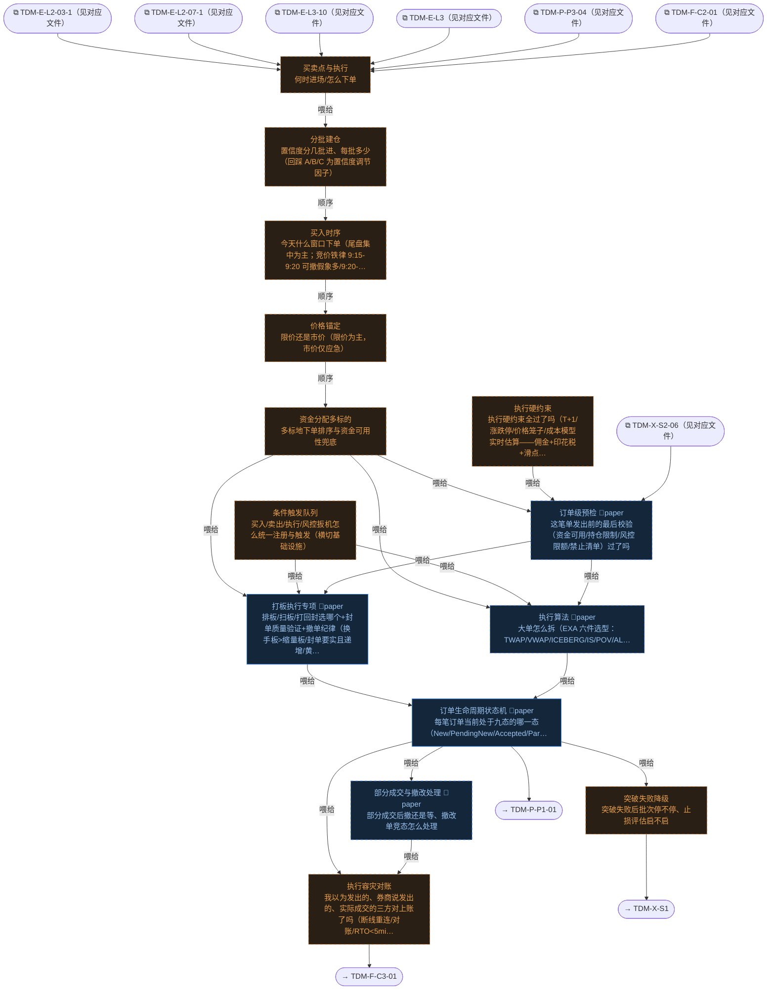

# 交易决策地图 · 建仓流 L4·执行（自动派生）

> **本文件由生成器自动派生，禁止手编**。真源=`config/trading_decision_map.yaml`（改动后 git commit → 运行时启动自动重生成）。
> 规模：14 节点｜🔴设计态（红节点）12｜📄paper 实盘执行 5｜图例：橙虚线=设计态，蓝底=📄paper 实盘执行节点（D18 治理阶梯）。
> **[可缩放 HTML 版 / Zoomable HTML](http://localhost:8765/docs/02_enterprise_architecture/10_trading_map/_zoomable_html/trading_map_04_e_l4_exec.html)** — Ctrl+滚轮缩放 ｜ 双击重置 ｜ Ctrl+Shift+D 切换拖动/选择模式

## 关系图

## 节点明细

| node_id | 名称 | 决策问题 | 时点 | activation | ai_autonomy | 模块锚 | 策略挂载 |
|---|---|---|---|---|---|---|---|
| TDM-E-L4🔴 | 买卖点与执行 | 何时进场/怎么下单 | 盘中 | — | — | — | daban-sleeve(proposed) |
| TDM-E-L4-01🔴 | 分批建仓 | 置信度分几批进、每批多少（回踩 A/B/C 为置信度调节因子） | 盘中 | intraday | auto | — | — |
| TDM-E-L4-02🔴 | 买入时序 | 今天什么窗口下单（尾盘集中为主；竞价铁律 9:15-9:20 可撤假象多/9:20-9:25 只挂不撤/14:57-15… | 盘中 | intraday | auto | — | STR-MULTIFACTOR-028(proposed)、STR-MOMTRE… |
| TDM-E-L4-03🔴 | 价格锚定 | 限价还是市价（限价为主，市价仅应急） | 盘中 | intraday | auto | — | — |
| TDM-E-L4-04🔴 | 资金分配多标的 | 多标地下单排序与资金可用性兜底 | 盘中 | intraday | auto | — | — |
| TDM-E-L4-05 | 打板执行专项 | 排板/扫板/打回封选哪个+封单质量验证+撤单纪律（换手板>缩量板/封单要实且递增/黄金排队窗口 5-15 分钟/封单被快… | 盘中 | intraday | paper | src/zephyr/ex_core/daban_execution.py（MOD-EX-001） | — |
| TDM-E-L4-06🔴 | 执行算法 | 大单怎么拆（EXA 六件选型：TWAP/VWAP/ICEBERG/IS/POV/ALT；参与率纪律≤市场量 10-20%… | 盘中 | intraday | paper | — | — |
| TDM-E-L4-07🔴 | 条件触发队列 | 买入/卖出/执行/风控扳机怎么统一注册与触发（横切基础设施） | 持续 | continuous | auto | — | — |
| TDM-E-L4-08🔴 | 突破失败降级 | 突破失败后批次停不停、止损评估启不启 | 盘中 | intraday | auto | — | — |
| TDM-E-L4-09🔴 | 执行硬约束 | 执行硬约束全过了吗（T+1/涨跌停/价格笼子/成本模型实时估算——佣金+印花税+滑点） | 持续 | continuous | auto | — | — |
| TDM-E-L4-10 | 订单生命周期状态机 | 每笔订单当前处于九态的哪一态（New/PendingNew/Accepted/Partial/Filled/Pendin… | 持续 | continuous | paper | src/zephyr/ex_core/async_fill_dispatcher.py（MOD-L06-001） | — |
| TDM-E-L4-11🔴 | 部分成交与撤改处理 | 部分成交后撤还是等、撤改单竞态怎么处理 | 盘中 | intraday | paper | — | — |
| TDM-E-L4-12🔴 | 订单级预检 | 这笔单发出前的最后校验（资金可用/持仓限制/风控限额/禁止清单）过了吗 | 盘中 | intraday | paper | — | — |
| TDM-E-L4-13🔴 | 执行容灾对账 | 我以为发出的、券商说发出的、实际成交的三方对上账了吗（断线重连/对账/RTO<5min） | 持续 | continuous | auto | — | — |

## 挂载清单

**模块锚（MOD）**：MOD-EX-001 src/zephyr/ex_core/daban_execution.py、MOD-L06-001 src/zephyr/ex_core/async_fill_dispatcher.py

**策略挂载（STR）**：STR-MOMTREND-004、STR-MULTIFACTOR-028、daban-sleeve
