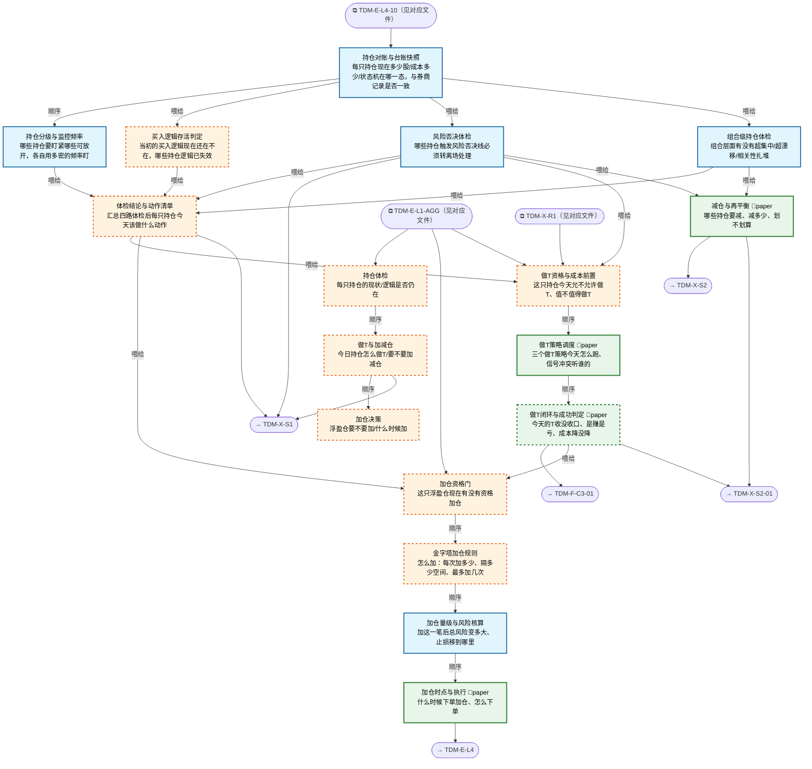

# 交易决策地图 · 持仓流 P·体检/做T/加仓（自动派生）

> **本文件由生成器自动派生，禁止手编**。真源=`config/trading_decision_map.yaml`（改动后 git commit → 运行时启动自动重生成）。
> 规模：17 节点｜🔴设计态（红节点）9｜📄paper 实盘执行 4｜图例：橙虚线=设计态，蓝底=📄paper 实盘执行节点（D18 治理阶梯）。
> **[可缩放 HTML 版 / Zoomable HTML](http://localhost:8765/docs/02_enterprise_architecture/10_trading_map/_zoomable_html/trading_map_05_p_position.html)** — Ctrl+滚轮缩放 ｜ 双击重置 ｜ Ctrl+Shift+D 切换拖动/选择模式

## 关系图

## 节点明细

| node_id | 名称 | 怎么算（大白话） | 时点 | 档位 | 模块锚 |
|---|---|---|---|---|---|
| TDM-P-P1🔴 | 持仓体检 | 持仓体检枢纽：六个子环节（对账/分级/逻辑存活/风险否决/组合级/结论汇总）盘前并行跑一遍+盘中持续，输出每只持仓的当日动作清单。 | 盘前 | — | — |
| TDM-P-P2🔴 | 做T与加减仓 | 做T与加减仓枢纽：资格前置→策略调度→闭环判定，加减仓在 P3。 做T=在底仓上高抛低吸赚差价降成本，与加减仓是三件事（做T 不改变底仓股数）。 | 盘中 | — | — |
| TDM-P-P3🔴 | 加仓决策 | 加仓决策枢纽：资格门→金字塔规则→量级核算→时点执行四步。 核心纪律=只加浮盈仓（赚钱的才加，亏钱的禁补——补亏损仓=扩大错误）。 | 盘中 | — | — |
| TDM-P-P1-01 | 持仓对账与台账快照 | 对账三步：读 QMT 桥持仓文件（Stock.csv）→与本地 strategy_book 逐笔核对股数/成本→不平账标红人工核对。 输出富台账：代码/股数/成本/归属策略/开仓日/状态机态（六态）。 | 盘前 | auto | MOD-POS-002 |
| TDM-P-P1-02 | 持仓分级与监控频率 | 分级三档定盯盘频率：WATCH（浮亏>3% 或临近止损）秒级盯；MONITOR（浮盈浮亏 3% 内）5 分钟盯；HOLD（深度浮盈安全区）事件驱动（涨停/公告才看）。 分级依据=盈亏态+ATR 距止损距离。 | 持续 | auto | MOD-SELL-000 |
| TDM-P-P1-03🔴 | 买入逻辑存活判定 | 按买入理由逐仓回查：打板仓查情绪梯队还在不在（板块还热吗）；多因子仓查因子暴露漂移（当初的因子还强吗）；事件仓查事件衰减（利好兑现没）；做T底仓查趋势没破。 输出 成立/弱化/失效 三态，失效=转离场评估。 | 盘前 | auto | — |
| TDM-P-P1-04 | 风险否决体检 | 四类否决线逐仓核对：生死线（-7% 破位）、时间止损（盈利仓 5 日不涨/亏损仓 3 日不回）、财报前 1 日解禁前 3 日（事件禁区）、板块退潮（板块进熄火段）。 触发任一=标记转 X 流离场+冻结做T/加仓资格。 | 盘前 | auto | MOD-RK-09 |
| TDM-P-P1-05 | 组合级持仓体检 | 组合层三查：单票>20% 总仓位（超集中）、实际权重偏离目标>25%（漂移越带）、同题材持仓>3 只（扎堆）。 越带者下发 P2-04 减仓指令。 单票看对错，组合看结构。 | 持续 | auto | MOD-POS-003 |
| TDM-P-P1-06🔴 | 体检结论与动作清单 | 汇总五路体检（对账/分级/逻辑/风险/组合）→每只持仓出一条当日动作：维持/可做T/可加仓/减仓/转离场。 动作过裁决中心（position_adjudication_center）+落审计。 任一子项异常=该持仓置'人工确认'默认态。 | 盘前 | auto | — |
| TDM-P-P2-01🔴 | 做T资格与成本前置 | 做T资格三道门：状态门（大盘在吸筹/扩张段才做，退潮期做T=送钱）+振幅门（该股 20 日平均振幅≥3%，振幅不够差价盖不住双边成本 0.15%）+成本门（预期价差≥0.3%，CST-T0-001 正期望线）。 三关全过才进调度。 | 盘前 | auto | — |
| TDM-P-P2-02 | 做T策略调度 | 三策略并发扫描持仓：冲高回落（intraday-surge-fall，分时急拉 3%+遇阻回落空）、盘口失衡（orderbook-imbalance，买盘挂单远大于卖盘先买后卖）、VWAP 回归（vwap-reversion，价格偏离均线 2%+ 回落空）。 同标的多信号按策略适配度仲裁；单次做T量≤底仓 30%。 | 盘中 | paper | MOD-SELL-018 |
| TDM-P-P2-03🔴 | 做T闭环与成功判定 | 盘中每 5 分钟核对当日做T买卖是否闭环；14:50 还没闭环的不管盈亏无条件平掉敞口（不留隔夜 T）。 收盘判定：股数不变+总成本降=成功。 成功/失败/损耗统计喂 C3 归因——做T是降成本工具不是独立盈利来源。 | 盘中 | paper | — |
| TDM-P-P2-04 | 减仓与再平衡 | 减仓触发两路：P1-05 漂移越带（超配的减回来）+置换机会（新标的预期收益>现持仓 1.5 倍时换仓）。 减多少=回到目标权重；划不划算=减仓改善>2×交易成本才动。 风控减仓优先级高于做T（冲突时丢做T保减仓）。 | 盘中 | paper | MOD-POS-004 |
| TDM-P-P3-01🔴 | 加仓资格门 | 加仓资格四重门：①只加浮盈仓（现价>成本，禁补亏损仓=红线）；②情绪段权限（点火/扩张段才开加仓，退潮/亢奋关）；③策略亲和度>0（该策略在当前段的适配为正）；④非熔断禁加期（日亏 4% 熔断触发时全禁）。 全过才进规则层。 | 盘前 | auto | — |
| TDM-P-P3-02🔴 | 金字塔加仓规则 | 金字塔三规则：递减（首加占剩余预算 50%，逐次减半——越加越少防重仓在顶部）、阶梯（较上次买价涨幅≥2.5-3% 才加下一笔，禁止平加）、限次（最多 3 次）。 跌破上次加仓价=停止后续计划。 加仓=新交易，需重新确认入场条件仍成立。 | 盘中 | auto | — |
| TDM-P-P3-03 | 加仓量级与风险核算 | 量级双算：仓位引擎四轨融合（风险预算/波动率目标/策略置信/现金约束）定这笔加多少；风险恒定校验=加仓后总风险额不超首仓风险预算（止损等比上移实现）。 加仓完成后全部止损上移保本。 | 盘中 | auto | MOD-POS-001 |
| TDM-P-P3-04 | 加仓时点与执行 | 时点二选一：缩量回调守住支撑（回踩不破前低+量缩）即时加；尾盘窗口（14:45 后确认当日强势，BM-PLAN-02：明日高开概率>70% 触发）尾盘加。 下单复用建仓执行件（分批+限价+硬约束预检）；未成交不追价，次日重走资格门。 | 盘中 | paper | MOD-POS-010 |

## 挂载清单

**模块锚（MOD）**：MOD-POS-001 src/zephyr/position/core/position_sizing_engine.py、MOD-POS-002 src/zephyr/position/core/position_state_machine.py、MOD-POS-003 src/zephyr/position/core/position_drift_monitor.py、MOD-POS-004 src/zephyr/position/core/rebalance_engine.py、MOD-POS-010 src/zephyr/position/core/position_limit_enforcer.py、MOD-RK-09 src/zephyr/risk/core/ashare_stop_loss_engine.py、MOD-SELL-000 src/zephyr/sell_decision/core/position_triage.py、MOD-SELL-018 src/zephyr/sell_decision/core/t_trade_coordinator.py

**策略挂载（STR）**：intraday-surge-fall、orderbook-imbalance、vwap-reversion
