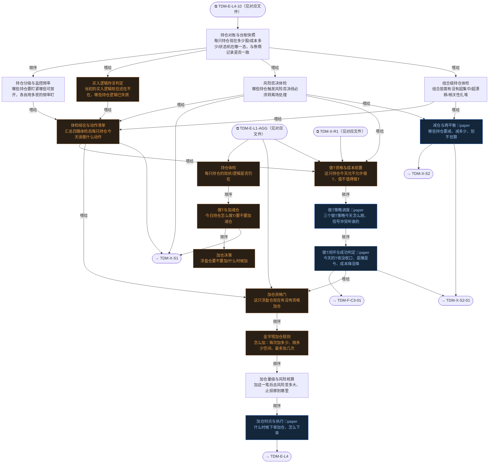

# 交易决策地图 · 持仓流 P·体检/做T/加仓（自动派生）

> **本文件由生成器自动派生，禁止手编**。真源=`config/trading_decision_map.yaml`（改动后 git commit → 运行时启动自动重生成）。
> 规模：17 节点｜🔴设计态（红节点）9｜📄paper 实盘执行 4｜图例：橙虚线=设计态，蓝底=📄paper 实盘执行节点（D18 治理阶梯）。
> 网页版（可缩放）：[_zoomable_html/trading_map_05_p_position.html](_zoomable_html/trading_map_05_p_position.html)

## 关系图

## 节点明细

| node_id | 名称 | 决策问题 | 时点 | activation | ai_autonomy | 模块锚 | 策略挂载 |
|---|---|---|---|---|---|---|---|
| TDM-P-P1🔴 | 持仓体检 | 每只持仓的现状/逻辑是否仍在 | 盘前 | — | — | — | — |
| TDM-P-P2🔴 | 做T与加减仓 | 今日持仓怎么做T/要不要加减仓 | 盘中 | — | — | — | intraday-surge-fall(proposed)、orderbook-… |
| TDM-P-P3🔴 | 加仓决策 | 浮盈仓要不要加/什么时候加 | 盘中 | — | — | — | — |
| TDM-P-P1-01 | 持仓对账与台账快照 | 每只持仓现在多少股/成本多少/状态机在哪一态，与券商记录是否一致 | 盘前 | premarket | auto | src/zephyr/position/core/position_state_machine.py（MOD-POS-0… | — |
| TDM-P-P1-02 | 持仓分级与监控频率 | 哪些持仓要盯紧哪些可放开，各自用多密的频率盯 | 持续 | continuous | auto | src/zephyr/sell_decision/core/position_triage.py（MOD-SELL-00… | — |
| TDM-P-P1-03🔴 | 买入逻辑存活判定 | 当初的买入逻辑现在还在不在，哪些持仓逻辑已失效 | 盘前 | premarket | auto | — | — |
| TDM-P-P1-04 | 风险否决体检 | 哪些持仓触发风险否决线必须转离场处理 | 盘前 | premarket | auto | src/zephyr/risk/core/ashare_stop_loss_engine.py（MOD-RK-09） | — |
| TDM-P-P1-05 | 组合级持仓体检 | 组合层面有没有超集中/超漂移/相关性扎堆 | 持续 | continuous | auto | src/zephyr/position/core/position_drift_monitor.py（MOD-POS-0… | — |
| TDM-P-P1-06🔴 | 体检结论与动作清单 | 汇总四路体检后每只持仓今天该做什么动作 | 盘前 | premarket | auto | — | — |
| TDM-P-P2-01🔴 | 做T资格与成本前置 | 这只持仓今天允不允许做T、值不值得做T | 盘前 | premarket | auto | — | — |
| TDM-P-P2-02 | 做T策略调度 | 三个做T策略今天怎么跑、信号冲突听谁的 | 盘中 | intraday | paper | src/zephyr/sell_decision/core/t_trade_coordinator.py（MOD-SEL… | intraday-surge-fall(proposed)、orderbook-… |
| TDM-P-P2-03🔴 | 做T闭环与成功判定 | 今天的T收没收口、是赚是亏、成本降没降 | 盘中 | intraday | paper | — | — |
| TDM-P-P2-04 | 减仓与再平衡 | 哪些持仓要减、减多少、划不划算 | 盘中 | intraday | paper | src/zephyr/position/core/rebalance_engine.py（MOD-POS-004） | — |
| TDM-P-P3-01🔴 | 加仓资格门 | 这只浮盈仓现在有没有资格加仓 | 盘前 | premarket | auto | — | — |
| TDM-P-P3-02🔴 | 金字塔加仓规则 | 怎么加：每次加多少、隔多少空间、最多加几次 | 盘中 | on_demand | auto | — | — |
| TDM-P-P3-03 | 加仓量级与风险核算 | 加这一笔后总风险变多大、止损移到哪里 | 盘中 | on_demand | auto | src/zephyr/position/core/position_sizing_engine.py（MOD-POS-0… | — |
| TDM-P-P3-04 | 加仓时点与执行 | 什么时候下单加仓、怎么下单 | 盘中 | intraday | paper | src/zephyr/position/core/position_limit_enforcer.py（MOD-POS-… | — |

## 挂载清单

**模块锚（MOD）**：MOD-POS-001 src/zephyr/position/core/position_sizing_engine.py、MOD-POS-002 src/zephyr/position/core/position_state_machine.py、MOD-POS-003 src/zephyr/position/core/position_drift_monitor.py、MOD-POS-004 src/zephyr/position/core/rebalance_engine.py、MOD-POS-010 src/zephyr/position/core/position_limit_enforcer.py、MOD-RK-09 src/zephyr/risk/core/ashare_stop_loss_engine.py、MOD-SELL-000 src/zephyr/sell_decision/core/position_triage.py、MOD-SELL-018 src/zephyr/sell_decision/core/t_trade_coordinator.py

**策略挂载（STR）**：intraday-surge-fall、orderbook-imbalance、vwap-reversion
