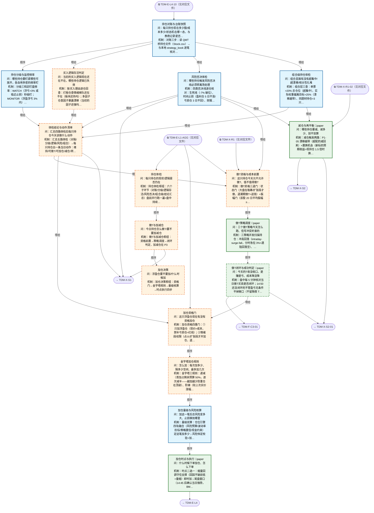

# 交易决策地图 · 持仓流 P·体检/做T/加仓（自动派生）

> **本文件由生成器自动派生，禁止手编**。真源=`config/trading_decision_map.yaml`（改动后 git commit → 运行时启动自动重生成）。
> 规模：17 节点｜🔴设计态（红节点）9｜📄paper 实盘执行 4｜图例：橙虚线=设计态，蓝底=📄paper 实盘执行节点（D18 治理阶梯）。
> 每个节点的完整机制（怎么算/依据什么/裁定原文）见下方「节点详解」区。
> **[可缩放 HTML 版 / Zoomable HTML](http://localhost:8765/docs/02_enterprise_architecture/10_trading_map/_zoomable_html/trading_map_05_p_position.html)** — Ctrl+滚轮缩放 ｜ 双击重置 ｜ Ctrl+Shift+D 切换拖动/选择模式

## 关系图

## 节点明细（速览）

| node_id | 名称 | 怎么算（大白话） | 时点 | 档位 | 模块锚 |
|---|---|---|---|---|---|
| TDM-P-P1🔴 | 持仓体检 | 持仓体检枢纽：六个子环节（对账/分级/逻辑存活/风险否决/组合级/结论汇总）盘前并行跑一遍+盘中持续，输出每只持仓的当日动作清单。 | 盘前 | — | — |
| TDM-P-P2🔴 | 做T与加减仓 | 做T与加减仓枢纽：资格前置→策略调度→闭环判定，加减仓在 P3。做T=在底仓上高抛低吸赚差价降成本，与加减仓是三件事（做T 不改变底仓股数）。 | 盘中 | — | — |
| TDM-P-P3🔴 | 加仓决策 | 加仓决策枢纽：资格门→金字塔规则→量级核算→时点执行四步。核心纪律=只加浮盈仓（赚钱的才加，亏钱的禁补——补亏损仓=扩大错误）。 | 盘中 | — | — |
| TDM-P-P1-01 | 持仓对账与台账快照 | 对账三步：读 QMT 桥持仓文件（Stock.csv）→与本地 strategy_book 逐笔核对股数/成本→不平账标红人工核对。输出富台账：代码/股数/成本/归属策略/开仓日/状态机态（六态）。 | 盘前 | auto | MOD-POS-002 |
| TDM-P-P1-02 | 持仓分级与监控频率 | 分级三档定盯盘频率：WATCH（浮亏>3% 或临近止损）秒级盯；MONITOR（浮盈浮亏 3% 内）5 分钟盯；HOLD（深度浮盈安全区）事件驱动（涨停/公告才看）。分级依据=盈亏态+ATR 距止损距离。 | 持续 | auto | MOD-SELL-000 |
| TDM-P-P1-03🔴 | 买入逻辑存活判定 | 按买入理由逐仓回查：打板仓查情绪梯队还在不在（板块还热吗）；多因子仓查因子暴露漂移（当初的因子还强吗）；事件仓查事件衰减（利好兑现没）；做T底仓查趋势没破。输出 成立/弱化/失效 三态，失效=转离场评估。 | 盘前 | auto | — |
| TDM-P-P1-04 | 风险否决体检 | 四类否决线逐仓核对：生死线（-7% 破位）、时间止损（盈利仓 5 日不涨/亏损仓 3 日不回）、财报前 1 日解禁前 3 日（事件禁区）、板块退潮（板块进熄火段）。触发任一=标记转 X 流离场+冻结做T/加仓资格。 | 盘前 | auto | MOD-RK-09 |
| TDM-P-P1-05 | 组合级持仓体检 | 组合层三查：单票>20% 总仓位（超集中）、实际权重偏离目标>25%（漂移越带）、同题材持仓>3 只（扎堆）。越带者下发 P2-04 减仓指令。单票看对错，组合看结构。 | 持续 | auto | MOD-POS-003 |
| TDM-P-P1-06🔴 | 体检结论与动作清单 | 汇总五路体检（对账/分级/逻辑/风险/组合）→每只持仓出一条当日动作：维持/可做T/可加仓/减仓/转离场。动作过裁决中心（position_adjudication_center）+落审计。任一子项异常=该持仓置'人工确认'默认态。 | 盘前 | auto | — |
| TDM-P-P2-01🔴 | 做T资格与成本前置 | 做T资格三道门：状态门（大盘在吸筹/扩张段才做，退潮期做T=送钱）+振幅门（该股 20 日平均振幅≥3%，振幅不够差价盖不住双边成本 0.15%）+成本门（预期价差≥0.3%，CST-T0-001 正期望线）。三关全过才进调度。 | 盘前 | auto | — |
| TDM-P-P2-02 | 做T策略调度 | 三策略并发扫描持仓：冲高回落（intraday-surge-fall，分时急拉 3%+遇阻回落空）、盘口失衡（orderbook-imbalance，买盘挂单远大于卖盘先买后卖）、VWAP 回归（vwap-reversion，价格偏离均线 2%+ 回落空）。同标的多信号按策略适配度仲裁；单次做T量≤底仓 30%。 | 盘中 | paper | MOD-SELL-018 |
| TDM-P-P2-03🔴 | 做T闭环与成功判定 | 盘中每 5 分钟核对当日做T买卖是否闭环；14:50 还没闭环的不管盈亏无条件平掉敞口（不留隔夜 T）。收盘判定：股数不变+总成本降=成功。成功/失败/损耗统计喂 C3 归因——做T是降成本工具不是独立盈利来源。 | 盘中 | paper | — |
| TDM-P-P2-04 | 减仓与再平衡 | 减仓触发两路：P1-05 漂移越带（超配的减回来）+置换机会（新标的预期收益>现持仓 1.5 倍时换仓）。减多少=回到目标权重；划不划算=减仓改善>2×交易成本才动。风控减仓优先级高于做T（冲突时丢做T保减仓）。 | 盘中 | paper | MOD-POS-004 |
| TDM-P-P3-01🔴 | 加仓资格门 | 加仓资格四重门：①只加浮盈仓（现价>成本，禁补亏损仓=红线）；②情绪段权限（点火/扩张段才开加仓，退潮/亢奋关）；③策略亲和度>0（该策略在当前段的适配为正）；④非熔断禁加期（日亏 4% 熔断触发时全禁）。全过才进规则层。 | 盘前 | auto | — |
| TDM-P-P3-02🔴 | 金字塔加仓规则 | 金字塔三规则：递减（首加占剩余预算 50%，逐次减半——越加越少防重仓在顶部）、阶梯（较上次买价涨幅≥2.5-3% 才加下一笔，禁止平加）、限次（最多 3 次）。跌破上次加仓价=停止后续计划。加仓=新交易，需重新确认入场条件仍成立。 | 盘中 | auto | — |
| TDM-P-P3-03 | 加仓量级与风险核算 | 量级双算：仓位引擎四轨融合（风险预算/波动率目标/策略置信/现金约束）定这笔加多少；风险恒定校验=加仓后总风险额不超首仓风险预算（止损等比上移实现）。加仓完成后全部止损上移保本。 | 盘中 | auto | MOD-POS-001 |
| TDM-P-P3-04 | 加仓时点与执行 | 时点二选一：缩量回调守住支撑（回踩不破前低+量缩）即时加；尾盘窗口（14:45 后确认当日强势，BM-PLAN-02：明日高开概率>70% 触发）尾盘加。下单复用建仓执行件（分批+限价+硬约束预检）；未成交不追价，次日重走资格门。 | 盘中 | paper | MOD-POS-010 |

## 节点详解（机制怎么产生）

### TDM-P-P1 持仓体检 🔴

**问**：每只持仓的现状/逻辑是否仍在

**机制（怎么算）**：持仓体检枢纽：六个子环节（对账/分级/逻辑存活/风险否决/组合级/结论汇总）盘前并行跑一遍+盘中持续，输出每只持仓的当日动作清单。

### TDM-P-P2 做T与加减仓 🔴

**问**：今日持仓怎么做T/要不要加减仓

**机制（怎么算）**：做T与加减仓枢纽：资格前置→策略调度→闭环判定，加减仓在 P3。做T=在底仓上高抛低吸赚差价降成本，与加减仓是三件事（做T 不改变底仓股数）。

**依据锚**：因子 FCT-INTRADAY-025、FCT-INTRADAY-015 ｜ 策略挂载 intraday-surge-fall、orderbook-imbalance、vwap-reversion

### TDM-P-P3 加仓决策 🔴

**问**：浮盈仓要不要加/什么时候加

**机制（怎么算）**：加仓决策枢纽：资格门→金字塔规则→量级核算→时点执行四步。核心纪律=只加浮盈仓（赚钱的才加，亏钱的禁补——补亏损仓=扩大错误）。

### TDM-P-P1-01 持仓对账与台账快照

**问**：每只持仓现在多少股/成本多少/状态机在哪一态，与券商记录是否一致

**机制（怎么算）**：对账三步：读 QMT 桥持仓文件（Stock.csv）→与本地 strategy_book 逐笔核对股数/成本→不平账标红人工核对。输出富台账：代码/股数/成本/归属策略/开仓日/状态机态（六态）。

**依据锚**：数据 DS-009、DS-067
**治理**：激活=premarket ｜ 档位=auto ｜ 模块=MOD-POS-002 ｜ 兜底=QMT 桥持仓文件缺失→沿用 T-1 快照+数据四态灯黄+人工核对

**设计备注（裁定/欠账原文）**：
- ── P 流血肉（D39-D49，Owner 2026-09-07 终裁；3 树枝 14 节点，树深 2）──
- 资产盘点结论：_domain_position 16/16 已落码，本轮以"引用+编排"为主；
- 三处空白新写血肉=P1 体检汇总编排（P1-06 红节点）/P2 做T统一调度（MOD-SELL-018 planned）/
- P3 金字塔加仓规则（P3-02 红节点，69 号 §2.26 为真源）
- P1 树枝：体检链=对账→{分级/逻辑/风险/组合}→结论动作清单（WealthBee 五步 checklist 同构）
- D49 欠账注释：停牌持仓须冻结时间止损计时+复牌补跌预案，施工归公司行动处理（26 号 corporate_action_processor 消费侧）
- D50 欠账注释（事后分析带审计，69 号 §2.27）：台账须增 MFE/MAE 追踪字段（持仓期最大浮盈/浮亏+发生时点）——
- 回答"逻辑死了但 MFE 很大=出场问题非选股问题"；胜者 MAE 95% 分位校准止损距离、MFE 捕获率<50%=止盈过早；
- 施工归 position 域台账补强批次
- 盘中桥心跳检测经 93 号 playbook 承载（外审 m-29）；回测持仓状态合成口径见《拼装回测协议 V0》合成状态清单（外审 B-05）

### TDM-P-P1-02 持仓分级与监控频率

**问**：哪些持仓要盯紧哪些可放开，各自用多密的频率盯

**机制（怎么算）**：分级三档定盯盘频率：WATCH（浮亏>3% 或临近止损）秒级盯；MONITOR（浮盈浮亏 3% 内）5 分钟盯；HOLD（深度浮盈安全区）事件驱动（涨停/公告才看）。分级依据=盈亏态+ATR 距止损距离。

**依据锚**：数据 DS-150 ｜ 算法 IND-VOL-001
**治理**：激活=continuous ｜ 档位=auto ｜ 模块=MOD-SELL-000 ｜ 兜底=ATR 数据缺失→按盈亏百分比粗分级

**设计备注（裁定/欠账原文）**：
- D58 欠账（第二轮审计，69 号 §2.28）：①监控频率矩阵数值化——HOLD=5min 快照/MONITOR=1min/WATCH=秒级
- （封单/关键位逐 tick），配警报去抖三件套（边沿触发+每规则 5min cooldown+复合条件替代单阈值）；
- ②封单监控器（涨停持仓盘中管理主体，D56）：封成比分级（>10 极强/3-10 强/1-3 一般/<1 弱板）+
- 封单衰减警报（开板预警）+开板回封判定（回封且封单放大=洗盘留/不回封=出货走）+封板时间质量
- （10:00 前封板溢价高/14:30 后弱板）——涨停封板期卖出=涨停价成交，开板后=回落价，监控优化卖出时点；
- 与 24 号微结构监控合并设计防撞车；③stale 行情熔断（快照>2s 判 stale 暂停该标的下单流）
- stale 熔断暂停范围=仅限新开仓/买单，卖出保护单豁免（欠账期默认，外审 M-27）；停牌仓监控=SUSPENDED 档（事件驱动免秒级轮询，m-26）；封单历史口径=tick 买一档量代理（DS-195，2025-01 起，m-46）；Triage 频率表（D104 终裁：以 D58 口径为准=WATCH 秒级/MONITOR 1min/HOLD 5min；42 号与 X-S1-01 旧口径作废改齐；3 秒级监控列 V2 观察项）

### TDM-P-P1-03 买入逻辑存活判定 🔴

**问**：当初的买入逻辑现在还在不在，哪些持仓逻辑已失效

**机制（怎么算）**：按买入理由逐仓回查：打板仓查情绪梯队还在不在（板块还热吗）；多因子仓查因子暴露漂移（当初的因子还强吗）；事件仓查事件衰减（利好兑现没）；做T底仓查趋势没破。输出 成立/弱化/失效 三态，失效=转离场评估。

**依据锚**：因子 FCT-SENT-012、FCT-MOM-022 ｜ 数据 DS-082、DS-107
**治理**：激活=premarket ｜ 档位=auto ｜ 兜底=因子缺失→按盈亏与持仓天数粗判

**设计备注（裁定/欠账原文）**：
- D40：分类型判据=打板查情绪梯队/多因子查暴露漂移（25 号 HoldingDriftMonitor）/事件查衰减（26 号）/
- 做T底仓查趋势；机构 thesis 卡片机制（失效条件显式化）已登记不施工，本节点为红节点

### TDM-P-P1-04 风险否决体检

**问**：哪些持仓触发风险否决线必须转离场处理

**机制（怎么算）**：四类否决线逐仓核对：生死线（-7% 破位）、时间止损（盈利仓 5 日不涨/亏损仓 3 日不回）、财报前 1 日解禁前 3 日（事件禁区）、板块退潮（板块进熄火段）。触发任一=标记转 X 流离场+冻结做T/加仓资格。

**依据锚**：风险限额 RLM-DRAWDOWN-005、RLM-DRAWDOWN-006 ｜ 事件 EVT-CA-002、EVT-CA-003、EVT-EARN-001
**治理**：激活=premarket ｜ 档位=auto ｜ 模块=MOD-RK-09 ｜ 兜底=止损引擎未接线→阈值比对降级实现

**设计备注（裁定/欠账原文）**：
- MOD-RK-09 现状=已建成 38 测试全绿、零生产消费（Owner 2026-09-06 接线里程碑）；地图不越权催接线

### TDM-P-P1-05 组合级持仓体检

**问**：组合层面有没有超集中/超漂移/相关性扎堆

**机制（怎么算）**：组合层三查：单票>20% 总仓位（超集中）、实际权重偏离目标>25%（漂移越带）、同题材持仓>3 只（扎堆）。越带者下发 P2-04 减仓指令。单票看对错，组合看结构。

**依据锚**：数据 DS-009 ｜ 风险限额 RLM-CONCENTRATION-001、RLM-CONCENTRATION-003、RLM-CONCENTRATION-004
**治理**：激活=continuous ｜ 档位=auto ｜ 模块=MOD-POS-003 ｜ 兜底=监控缺→盘前人工核对权重表

**设计备注（裁定/欠账原文）**：
- 漂移带阈值（组合±2%/单标的±3%）语义由 MOD-POS-003 模块自带承载；alert 库 THD-DRIFT 族为
- 数据/特征漂移 PSI 语义不同轴，不挂（D47 修正）

### TDM-P-P1-06 体检结论与动作清单 🔴

**问**：汇总四路体检后每只持仓今天该做什么动作

**机制（怎么算）**：汇总五路体检（对账/分级/逻辑/风险/组合）→每只持仓出一条当日动作：维持/可做T/可加仓/减仓/转离场。动作过裁决中心（position_adjudication_center）+落审计。任一子项异常=该持仓置'人工确认'默认态。

**治理**：激活=premarket ｜ 档位=auto ｜ 兜底=任一子项异常→该持仓动作置人工确认默认态

**设计备注（裁定/欠账原文）**：
- 红节点（P 流三空白之一：体检汇总编排面）；动作过 position_adjudication_center（MOD-POS-024）+审计；
- 引用轴皆空=接受 R25 warning（与 E 流 17 空转叶子同池，血肉阶段欠账）

### TDM-P-P2-01 做T资格与成本前置 🔴

**问**：这只持仓今天允不允许做T、值不值得做T

**机制（怎么算）**：做T资格三道门：状态门（大盘在吸筹/扩张段才做，退潮期做T=送钱）+振幅门（该股 20 日平均振幅≥3%，振幅不够差价盖不住双边成本 0.15%）+成本门（预期价差≥0.3%，CST-T0-001 正期望线）。三关全过才进调度。

**依据锚**：因子 FCT-INTRADAY-028 ｜ 数据 DS-150 ｜ 成本模型 CST-T0-001
**治理**：激活=premarket ｜ 失效=盘中转单边（跌停潮/板块崩塌）→当日做T资格全部作废 ｜ 档位=auto ｜ 兜底=成本模型不可用→降级人工判定做T资格

**设计备注（裁定/欠账原文）**：
- P2 树枝：资格门→调度→闭环，减仓/再平衡并行（冲突规则：风控减仓 > 做T收口 > 做T新开，收口 BM-SELL-06 废弃语义；
- conflict_priority 字段为 schema v1.8 候选，当前以注释承载）
- 五道门=状态门（矩阵仅 accumulation/expansion 段开做T，L1-AGG 直喂）+标的质量门（振幅/流动性达标）+
- 成本门（D111 终裁改版=绝对金额制：每笔保本价差 s*(N)=来回费用÷N+滑点余量，预期价差>s*(N) 才做；单笔下限 N_floor=5 元÷佣金率（实盘万0.854→≈5.86 万）；费率=CST-ASTOCK-001 核算、CST-T0-001 保守档回测压力）+风险否决冻结（P1-04）+熔断停做T（X-R1 中断）（外审 R2-08 枚举对齐入边）；红节点（编排缺口）
- D58 欠账（第二轮审计）：①做T时段准入矩阵——9:30-9:40 禁开新T（开盘价差最宽 L 型衰减）/9:50-10:10
- sell-first 黄金窗/10:20-11:00 方向定型胜率最高段/11:00-11:30 缩量禁T/13:30-14:20 第二波核心段/
- 14:40 后只平不开；笔数波动自适应（D111：步长=max(K×ATR14, m×tick)，K∈[1/3,1]；n_plan=min(10, floor(底仓×1/3÷N_floor))；波动小=0 笔合法）；②量能闸门——量能<5日均量0.8倍禁开新T；
- ③T量盘口匹配——单笔≤对手一档可见量50%（防自打穿盘口），单日参与≤1-5% ADV
- 持仓级时间止损三档（RLM-DRAWDOWN-006）只评底仓不评 T 腿（外审 m-12）
- （D111 风控层）：趋势过滤（ADX>25 停正T）/失败腿（正T 浮亏>max(1%,0.5×step) 止损、倒T 卖后涨>max(2%,1×step) 回补）/流动性门（个股日均成交<5000 万或两市<8000 亿停做）/资金冗余≥底仓 10-15%/拥挤熔断（连 5 日净收益<费用停 3 日）

### TDM-P-P2-02 做T策略调度

**问**：三个做T策略今天怎么跑、信号冲突听谁的

**机制（怎么算）**：三策略并发扫描持仓：冲高回落（intraday-surge-fall，分时急拉 3%+遇阻回落空）、盘口失衡（orderbook-imbalance，买盘挂单远大于卖盘先买后卖）、VWAP 回归（vwap-reversion，价格偏离均线 2%+ 回落空）。同标的多信号按策略适配度仲裁；单次做T量≤底仓 30%。

**依据锚**：因子 FCT-INTRADAY-029、FCT-INTRADAY-030、FCT-INTRADAY-017、FCT-INTRADAY-021 ｜ 算法 EXA-VWAP-001、EXA-TWAP-001 ｜ 策略挂载 intraday-surge-fall、orderbook-imbalance、vwap-reversion
**治理**：激活=intraday ｜ 失效=单边趋势确认→当日做T资格作废（与 P2-01 联动） ｜ 档位=paper ｜ 模块=MOD-SELL-018 ｜ 兜底=协调器未建成→单策略顺序执行+人工确认

**设计备注（裁定/欠账原文）**：
- t_trade_coordinator 已落码（X 流血肉 D60 轮发现，原 planned 状态过时；BM-SELL-08 锚，
- 参数真源：单次≤底仓30%/净收益≥1.5%/失误止损1.5% proposed）；
- 做T方向术语=buy-first 先买后卖/sell-first 先卖后买（D41，禁用社区正T/反T，terminology_glossary 已登记）；
- 指令过 position_adjudication_center；执行侧异常兜底=strategy_abnormal_exit（MOD-TRADING-008）
- D58 欠账（第二轮审计）：①单笔T双轨止损——价差止损 0.3-0.5%（买价下方）+时间止损（预期窗口未反弹
- 收盘前强制复原）；②sell-first 复原铁律：接回失败尾盘必须复原仓位，禁止把T+0做成T+1加仓（最大隐蔽漏洞）；
- ③连败熔断——当日连续 2 笔做反对称即停，禁报复性补T；④主策略减仓信号优先于做T overlay
- （先平T仓让位主策略，禁做T锁仓阻止离场）
- （D111 终裁 2026-09-07）：以 D58 框架为准并按 D111 修订（成本门绝对金额制+笔数波动自适应+风控层，详见 P2-01 注释与协议 §11）；t_trade_coordinator 的 1.5% 族=代码历史参数，施工对齐时清除；身份=proposed 假说，回测验证通过前不生效（D5 管道）

### TDM-P-P2-03 做T闭环与成功判定 🔴

**问**：今天的T收没收口、是赚是亏、成本降没降

**机制（怎么算）**：盘中每 5 分钟核对当日做T买卖是否闭环；14:50 还没闭环的不管盈亏无条件平掉敞口（不留隔夜 T）。收盘判定：股数不变+总成本降=成功。成功/失败/损耗统计喂 C3 归因——做T是降成本工具不是独立盈利来源。

**依据锚**：成本模型 CST-T0-001
**治理**：激活=intraday ｜ 档位=paper ｜ 兜底=14:50 平仓失败→次日竞价优先处理并标记

**设计备注（裁定/欠账原文）**：
- 成功判定=收盘股数不变+总成本下降（社区共识口径）；14:50 未闭环无条件平（冠军规则）；
- 统计喂 C3 归因；D49 欠账：除权除息自动改成本价会污染做T成本归因，施工归公司行动处理；
- D50 欠账（69 号 §2.27）：①做T配对核算器——多笔买卖按序配对（数量不等取小方）产出分项报表
- （净收益/费用分项/做T后理论成本摊薄），做T系统的成绩单，施工归 position 域；
- ②底仓复原语义+笔数偏差熔断（QMT 网格策略参照：尾盘按开盘前股数复原，买卖笔数差超阈撤单停手，
- 防做T单边漂移——与 14:50 强平互补：一个清敞口一个回底仓）
- 跨窗规则（外审 m-13）：14:50 强平单 14:55 未成交——深市留集合竞价、沪市 14:56 前撤改重挂；次日竞价处理=复原性质卖单不占做T笔数、豁免 9:30-9:40 禁开新T（m-22）

### TDM-P-P2-04 减仓与再平衡

**问**：哪些持仓要减、减多少、划不划算

**机制（怎么算）**：减仓触发两路：P1-05 漂移越带（超配的减回来）+置换机会（新标的预期收益>现持仓 1.5 倍时换仓）。减多少=回到目标权重；划不划算=减仓改善>2×交易成本才动。风控减仓优先级高于做T（冲突时丢做T保减仓）。

**依据锚**：数据 DS-009 ｜ 风险限额 RLM-POSITION-011
**治理**：激活=intraday ｜ 档位=paper ｜ 模块=MOD-POS-004 ｜ 兜底=再平衡引擎不可用→减仓指令降级人工确认

**设计备注（裁定/欠账原文）**：
- 冲突优先级：风控减仓 > 做T收口 > 做T新开（D44，收口 BM-SELL-06 deprecated 遗留；schema v1.8 候选字段化）；
- 与 MOD-SELL-006 replacement_rebalance_seller 共享触发（置换减仓）；执行面走 X-S2 离场执行件
- D55 欠账（隔夜风险包，69 号 §2.28）：隔夜资格门——收盘前 14:30-14:57 窗口逐仓判定"值不值得扛隔夜"
- （浮盈保护垫/流动性门槛/次日事件前置三合一；社区标准：干净 setup 半仓扛夜/周五跨周末减半/
- 大事件前清仓）；配套隔夜风险预算=情绪阶段×隔夜总敞口上限二维表（联动 C1）；
- 节前决策表（春节低开 69%/国庆 63% 但节后5日上涨 60-70%，牛市持股弱势持币+两融环比监控）
- 资格门只评底仓/隔夜候选仓（不含待强平 T 腿，底仓-活仓隔离，外审 m-14）；减仓动作执行不迟于 14:55（避深市不可撤段），14:55 后判定顺延次日竞价（待确认，m-21）；节前判定依赖交易日历数据源（待登记，M-26）

### TDM-P-P3-01 加仓资格门 🔴

**问**：这只浮盈仓现在有没有资格加仓

**机制（怎么算）**：加仓资格四重门：①只加浮盈仓（现价>成本，禁补亏损仓=红线）；②情绪段权限（点火/扩张段才开加仓，退潮/亢奋关）；③策略亲和度>0（该策略在当前段的适配为正）；④非熔断禁加期（日亏 4% 熔断触发时全禁）。全过才进规则层。

**依据锚**：因子 FCT-MOM-022 ｜ 风险限额 RLM-POSITION-004、RLM-POSITION-009、RLM-POSITION-013、RLM-KILL-SWITCH-006
**治理**：激活=premarket ｜ 失效=熔断或回撤协议触发→全部加仓资格即时作废 ｜ 档位=auto

**设计备注（裁定/欠账原文）**：
- P3 树枝：资格门→金字塔规则→量级风险核算→时点执行（流水线）；euphoria 段无加仓权限（只卖不买，取严）
- 四重门=只加浮盈仓（BM-BUY-08 四项严禁"被套补仓"红线）+情绪段权限（仅 ignition/expansion 开加仓）+
- 策略亲和 strategy_affinity>0（28 号）+无熔断禁加期；红节点（编排缺口）
- （D94 终裁）：单票默认≤10%（RLM-CONCENTRATION-001 已落值）；凯利波段≤3%；earned 豁免≤20% 且本节点显式留痕记录豁免理由；（D110 原则性例外边界）：超跌反转信号仅限新信号开仓，严禁给套牢仓补仓（BM-BUY-08 红线不破）

### TDM-P-P3-02 金字塔加仓规则 🔴

**问**：怎么加：每次加多少、隔多少空间、最多加几次

**机制（怎么算）**：金字塔三规则：递减（首加占剩余预算 50%，逐次减半——越加越少防重仓在顶部）、阶梯（较上次买价涨幅≥2.5-3% 才加下一笔，禁止平加）、限次（最多 3 次）。跌破上次加仓价=停止后续计划。加仓=新交易，需重新确认入场条件仍成立。

**治理**：激活=on_demand ｜ 失效=跌破上次加仓点→停止后续加仓计划 ｜ 档位=auto

**设计备注（裁定/欠账原文）**：
- 红节点（P 流三空白之三：金字塔规则全网+全项目核查均无承载，69 号 §2.26 为参数真源）；
- 参数全 proposed：正金字塔递减（首加占剩余预算50%逐次减半）/次数≤3/价格阶梯较上次买点涨幅≥2.5-3%/
- 只顺势不加逆/加仓=新交易需重新确认入场条件/Case B 总 dollar risk 不超首仓风险预算（欧奈尔/Minervini 纪律）
- D58 欠账（第二轮审计）：①批次止损=合并风险预算制（每加一层重算总风险≤首仓预算，止损抬至上层触发位下方）；
- ②批次账本加"可卖时点"字段——T+1 下卖出顺序=可卖性 FIFO（只能卖旧批）；③涨停价加仓自动切排板模式
- （队列位置跟踪器+封单质量门 封单/流通盘>3%+炸板默认撤单+14:50 排板单强撤不过夜）；
- ④批次计划持久化先于下单+恢复后信号复验门（原触发条件仍成立才续加，禁静默作废/盲目续加两极）
- 排板门"封单/流通盘>3%"命名=封单流通比，与封成比（封单量/成交量，P1-02 四档）分母不同勿混用（外审 m-16）

### TDM-P-P3-03 加仓量级与风险核算

**问**：加这一笔后总风险变多大、止损移到哪里

**机制（怎么算）**：量级双算：仓位引擎四轨融合（风险预算/波动率目标/策略置信/现金约束）定这笔加多少；风险恒定校验=加仓后总风险额不超首仓风险预算（止损等比上移实现）。加仓完成后全部止损上移保本。

**依据锚**：风险限额 RLM-POSITION-006、RLM-POSITION-021、RLM-CONCENTRATION-001
**治理**：激活=on_demand ｜ 档位=auto ｜ 模块=MOD-POS-001

### TDM-P-P3-04 加仓时点与执行

**问**：什么时候下单加仓、怎么下单

**机制（怎么算）**：时点二选一：缩量回调守住支撑（回踩不破前低+量缩）即时加；尾盘窗口（14:45 后确认当日强势，BM-PLAN-02：明日高开概率>70% 触发）尾盘加。下单复用建仓执行件（分批+限价+硬约束预检）；未成交不追价，次日重走资格门。

**依据锚**：算法 EXA-TWAP-001、EXA-IS-001
**治理**：激活=intraday ｜ 档位=paper ｜ 模块=MOD-POS-010 ｜ 兜底=部分成交→按 TDM-E-L4-11 部分成交处理；未成交不追价、次日重走资格门

**设计备注（裁定/欠账原文）**：
- 时点=缩量回调守住支撑或尾盘窗口（BM-PLAN-02：明日高开概率>70% 触发）；
- 下单复用建仓流执行件（→TDM-E-L4 feed 边）；硬约束预检=MOD-POS-010+cash_manager（MOD-POS-006）

## 挂载清单

**模块锚（MOD）**：MOD-POS-001 src/zephyr/position/core/position_sizing_engine.py、MOD-POS-002 src/zephyr/position/core/position_state_machine.py、MOD-POS-003 src/zephyr/position/core/position_drift_monitor.py、MOD-POS-004 src/zephyr/position/core/rebalance_engine.py、MOD-POS-010 src/zephyr/position/core/position_limit_enforcer.py、MOD-RK-09 src/zephyr/risk/core/ashare_stop_loss_engine.py、MOD-SELL-000 src/zephyr/sell_decision/core/position_triage.py、MOD-SELL-018 src/zephyr/sell_decision/core/t_trade_coordinator.py

**策略挂载（STR）**：intraday-surge-fall、orderbook-imbalance、vwap-reversion
