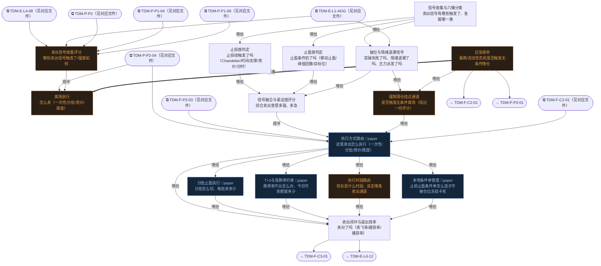

# 交易决策地图 · 离场流 X·信号/执行/R1 应急（自动派生）

> **本文件由生成器自动派生，禁止手编**。真源=`config/trading_decision_map.yaml`（改动后 git commit → 运行时启动自动重生成）。
> 规模：15 节点｜🔴设计态（红节点）7｜📄paper 实盘执行 4｜图例：橙虚线=设计态，蓝底=📄paper 实盘执行节点（D18 治理阶梯）。
> 网页版（可缩放）：[_zoomable_html/trading_map_06_x_exit.html](_zoomable_html/trading_map_06_x_exit.html)

## 关系图

## 节点明细

| node_id | 名称 | 决策问题 | 时点 | activation | ai_autonomy | 模块锚 | 策略挂载 |
|---|---|---|---|---|---|---|---|
| TDM-X-S1🔴 | 卖出信号收集评分 | 哪些卖出信号触发了/强度如何 | 持续 | — | — | — | — |
| TDM-X-S2🔴 | 离场执行 | 怎么卖（一次性/分批/竞价/尾盘） | 盘中 | — | — | — | — |
| TDM-X-R1🔴 | 应急保命 | 暴跌/流动性危机是否触发无条件降仓 | 持续 | — | — | — | — |
| TDM-X-S1-01 | 信号收集与六桶分类 | 卖出信号有哪些触发了、各属哪一类 | 持续 | continuous | auto | src/zephyr/sell_decision/core/sell_signal_collector.py（MOD-S… | — |
| TDM-X-S1-02 | 止损族判定 | 止损线触发了吗（Chandelier/时间/支撑/竞价/分时） | 持续 | continuous | auto | src/zephyr/sell_decision/core/stop_loss_strategy.py（MOD-SELL… | — |
| TDM-X-S1-03 | 止盈族判定 | 止盈条件到了吗（移动止盈/峰值回撤/目标位） | 持续 | continuous | auto | src/zephyr/sell_decision/core/take_profit_strategy.py（MOD-SE… | — |
| TDM-X-S1-04 | 破位与情绪退潮信号 | 突破失败了吗、情绪退潮了吗、主力派发了吗 | 持续 | continuous | auto | src/zephyr/sell_decision/core/breakout_failure_detector.py（M… | — |
| TDM-X-S1-05 | 信号融合与紧迫度评分 | 综合卖出意愿多强、多急 | 持续 | continuous | auto | src/zephyr/sell_decision/core/sell_signal_fusion_engine.py（M… | — |
| TDM-X-S1-06🔴 | 强制清仓绕过通道 | 是否触发无条件离场（绕过一切评分） | 持续 | continuous | auto | — | — |
| TDM-X-S2-01 | 执行方式路由 | 这笔卖出怎么执行（一次性/分批/竞价/尾盘） | 盘中 | intraday | paper | src/zephyr/sell_decision/core/sell_execution_planner.py（MOD-… | — |
| TDM-X-S2-02🔴 | T+1与涨跌停约束 | 跌停卖不出怎么办、今日可卖额度多少 | 盘中 | intraday | paper | — | — |
| TDM-X-S2-03🔴 | 执行时段路由 | 现在是什么时段、该走哪条卖出通道 | 盘中 | intraday | auto | — | — |
| TDM-X-S2-04🔴 | 本地条件单管理 | 止损止盈条件单怎么挂才不被仓位冻结卡死 | 持续 | continuous | paper | — | — |
| TDM-X-S2-05 | 分批止盈执行 | 分批怎么切、每批卖多少 | 盘中 | intraday | paper | src/zephyr/sell_decision/core/scaling_out.py（MOD-SELL-017） | — |
| TDM-X-S2-06 | 卖出闭环与退出效率 | 卖对了吗（卖飞率/避损率/捕获率） | 盘后 | postmarket | auto | src/zephyr/sell_decision/core/sell_execution_quality_tracker… | — |

## 挂载清单

**模块锚（MOD）**：MOD-SELL-001 src/zephyr/sell_decision/core/sell_signal_collector.py、MOD-SELL-003 src/zephyr/sell_decision/core/breakout_failure_detector.py、MOD-SELL-004 src/zephyr/sell_decision/core/take_profit_strategy.py、MOD-SELL-005 src/zephyr/sell_decision/core/stop_loss_strategy.py、MOD-SELL-007 src/zephyr/sell_decision/core/sell_signal_fusion_engine.py、MOD-SELL-012 src/zephyr/sell_decision/core/sell_execution_quality_tracker.py、MOD-SELL-017 src/zephyr/sell_decision/core/scaling_out.py、MOD-SELL-019 src/zephyr/sell_decision/core/sell_execution_planner.py
