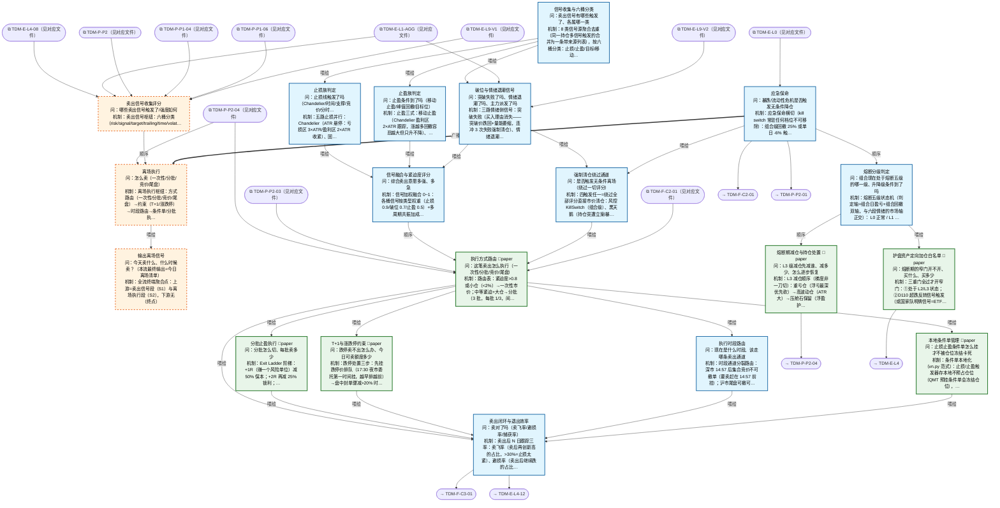

# 交易决策地图 · 离场流 X·信号/执行/R1 应急（自动派生）

> **本文件由生成器自动派生，禁止手编**。真源=`config/trading_decision_map.yaml`（改动后 git commit → 运行时启动自动重生成）。
> 规模：19 节点｜🔴设计态（红节点）3｜📄paper 实盘执行 6｜图例：橙虚线=设计态，蓝底=📄paper 实盘执行节点（D18 治理阶梯）。
> 每个节点的完整机制（怎么算/依据什么/裁定原文）见下方「节点详解」区。
> **[可缩放 HTML 版 / Zoomable HTML](http://localhost:8765/docs/02_enterprise_architecture/10_trading_map/_zoomable_html/trading_map_06_x_exit.html)** — Ctrl+滚轮缩放 ｜ 双击重置 ｜ Ctrl+Shift+D 切换拖动/选择模式

## 关系图

## 节点明细（速览）

| node_id | 名称 | 怎么算（大白话） | 时点 | 档位 | 模块锚 |
|---|---|---|---|---|---|
| TDM-X-FLOW🔴 | 输出离场信号 | 全流终端聚合点：上游=卖出信号段（S1）与离场执行段（S2），下游无（终点）。组成=信号收集评分（S1，含应急保命 R1 横切）→执行路由（S2）。本节点只承载结构与指向，不写机制不存实时数据。 | 持续 | — | — |
| TDM-X-S1🔴 | 卖出信号收集评分 | 卖出信号枢纽：六桶分类（risk/signal/target/trailing/time/volatility）收集→止损族/止盈族/破位退潮族并行判定→融合评分→强制清仓旁路。产出'卖不卖+多急'。 | 持续 | — | — |
| TDM-X-S2🔴 | 离场执行 | 离场执行枢纽：方式路由（一次性/分批/竞价/尾盘）→约束（T+1/涨跌停）→时段路由→条件单/分批执行→闭环复盘。'卖不卖'定了之后管'怎么卖'。 | 盘中 | — | — |
| TDM-X-R1 | 应急保命 | 应急保命横切（kill switch 常驻任何档位不可移除）：组合级回撤 25% 或单日 -6% 触发→无条件全清仓+冻结所有开仓通道，只能 Owner 手动解除。AI 熔断只降档不升档。这是系统的'拔电源'。（2026-09-20 UP-5 接线，final3 P5）：尾部对冲信号建议通道——组合预测 CVaR(5%) 破风控阈值 （默认 -3% 日损，阈值冻结禁挪门柱）→ 生成对冲建议（DAL-TAIL-HEDGE，MOD-PA-024）；信号仅供 决策参考非执行指令，喂 R1-03 白名单通道（D107 尾部弹药回测验证前维持休眠 fallback；期权 对冲执行另案，数据窗口短）。 | 持续 | — | MOD-INF-018 |
| TDM-X-R1-01 | 熔断分级判定 | 熔断五级状态机（判定轴=组合日盈亏+组合回撤双轴，与六段情绪的市场轴正交）： L0 正常 / L1 警戒（日亏≥2%：禁加仓） / L2 禁开仓（日亏≥4%：停新开仓+白名单窄门开启） / L3 减仓（日亏≥6%：梯度减仓） / L4 保命（组合回撤≥25% 或生死线：清仓+Owner 人工接管）。迟滞解除：当日无新低+修复当日跌幅 50% 才降一级，禁 V 型直接回满。（2026-09-15 ALGO_FLOW 块出仓至 docs/03_modules/_domain_risk/algo_flow/drawdown_state_machine.yaml：算法推导图外迁，算法口径不变） | 持续 | auto | MOD-RK-049 |
| TDM-X-R1-02 | 熔断期减仓与持仓处置 | L3 减仓顺序（梯度非一刀切）：重亏仓（浮亏最深优先砍）→高波动仓（ATR 大）→压舱石保留（浮盈护盘属性资产最后动）。减仓指令路由 P2-04 执行；恢复规则=组合回撤修复 50% 后逐级加回风险预算，禁 V 型回满。L4 全清仓走 S1-06 绕过通道（既有边不动）。（2026-09-15 ALGO_FLOW 块出仓至 docs/03_modules/_domain_risk/algo_flow/drawdown_liquidation_guard.yaml：算法推导图外迁，算法口径不变） | 盘中 | paper | MOD-RK-050 |
| TDM-X-R1-03 | 护盘资产定向加仓白名单 | 三重门全过才开窄门：①处于 L2/L3 状态；②D110 超跌反转信号触发（或国家队明牌信号=ETF 天量成交/官方增持公告）； ③金字塔法分批（首笔 1/3 预算，确认收复再加）。白名单：宽基 ETF（沪深300/中证500/1000/红利）优先，银行/高股息次之；仓位=D107 尾部弹药预算，上限总资金 5-10%。风险声明：政策底≠市场底（历史滞后 40 天~半年）——分批+确认信号是铁律，严禁一次到位。 | 盘中 | paper | MOD-POS-026 |
| TDM-X-S1-01 | 信号收集与六桶分类 | 8 类信号源聚合去重（同一持仓多信号触发的合并为一条带来源列表），按六桶分类：止损/止盈/目标/移动/时间/波动。分类决定后续走哪条判定链+什么确认模式（止损类立即执行不辩论，止盈类等收盘确认）。 | 持续 | auto | MOD-SELL-001 |
| TDM-X-S1-02 | 止损族判定 | 五路止损并行：Chandelier（ATR 悬停：亏损区 3×ATR/盈利区 2×ATR 收紧）、固定 -7% 生死线、支撑破位（关键位下方 1%）、时间止损（盈利仓 5 日不涨/亏损仓 3 日）、分时破位（盘中跌破分时均线 30 分钟）。止损只升不降（棘轮）。（2026-09-18 深度审查修正：ATR 缺失降级锚由入场价改为锚点同构 max(最高收盘,入场价)，消除盈利期止损悬崖（rpt_e03）；note_confirmed: 2026-09-18） （2026-09-20 UP-2 接线，final3 P5）：前瞻概率止损建议通道——滚动预测 P(跌)≥0.65（阈值冻结 禁挪门柱）触发止损评审建议（DAL-FWD-STOP，MOD-PA-020：正常→评审→执行三态，评审是建议 非强制平仓，修订权仍在本节点五路止损）；composite_stop_score 版用 q05/q50/q95 三分布位点 插值 P(跌)+左尾厚比（≥0.60）作程度灰度。 | 持续 | auto | MOD-SELL-005 |
| TDM-X-S1-03 | 止盈族判定 | 止盈三式：移动止盈（Chandelier 盈利区 2×ATR 跟踪，涨越多回撤容忍越大但只升不降）、峰值回撤（从最高浮盈回落 30% 兑现——赚过没拿住是最大利润漏点）、目标位（预期涨幅达成即了结，打板票=次日不板走）。 | 持续 | auto | MOD-SELL-004 |
| TDM-X-S1-04 | 破位与情绪退潮信号 | 三路情绪侧信号：突破失败（买入理由消失——突破价跌回+量能萎缩，连冲 3 次失败强制清仓）、情绪退潮（L1 六段进入 distribution+该股为情绪票→加权卖出）、龙虎榜派发（高位游资上卖方榜/三日榜净卖出=诱多出货）。 | 持续 | auto | MOD-SELL-003 |
| TDM-X-S1-05 | 信号融合与紧迫度评分 | 信号加权融合 0~1：各桶信号按类型权重（止损 0.9/破位 0.7/止盈 0.5）+多周期共振加成（日线周线同向+0.2）。紧迫度三档：>0.8 立即市价（S2-01 快速通道）、0.5-0.8 分批从容走、<0.5 等确认。去抖与强制清仓互斥（救命单不等去抖）。 | 持续 | auto | MOD-SELL-007 |
| TDM-X-S1-06 | 强制清仓绕过通道 | 四触发任一=绕过全部评分直接市价清仓：风控 KillSwitch（组合级）、黑天鹅（持仓突遭立案/暴雷）、K≥3 连续破位失败、主力弃庄（龙虎榜机构清仓式卖出）。资金安全>一切优化，紧迫度直接置 1.0。与 R1 分工：R1 管组合熔断，本节点管单仓强清。（2026-09-15 ALGO_FLOW 块出仓至 docs/03_modules/_domain_trading/algo_flow/strategy_abnormal_exit_orchestrator.yaml：算法推导图外迁，算法口径不变） | 持续 | auto | MOD-TRADING-008 |
| TDM-X-S2-01 | 执行方式路由 | 路由表：紧迫度>0.8 或小仓（<2%）→一次性市价；中等紧迫+大仓→分批（3 批，每批 1/3，间隔 5 分钟）；不急+流动性差→尾盘集中；隔夜风险单→竞价挂跌停价逃命。卖出前三查：单笔≤买一档挂单量、日量×10% 参与率、持仓市值/20 日均额>1% 禁市价。 | 盘中 | paper | MOD-SELL-019 |
| TDM-X-S2-02 | T+1与涨跌停约束 | 跌停处置三步：先挂跌停价排队（17:30 夜市委托第一时间挂，越早排越前）→盘中封单骤减>20% 时撤旧单改买一价重挂（撤单重挂会重置排队位次，只在封单明显松动时做）→次日竞价再处理残余。可卖额度=t1_sellable 核对（当日买入不可卖）。 | 盘中 | paper | MOD-POS-028 |
| TDM-X-S2-03 | 执行时段路由 | 时段通道分裂路由：深市 14:57 后集合竞价不可撤单（要卖赶在 14:57 前挂）；沪市尾盘可撤可改。竞价逃命单=9:15 后挂跌停价（按开盘价成交，排队最优先）。14:30-14:45 跳水窗谨慎挂单、14:50 决策窗处理做T收口。 | 盘中 | auto | MOD-XS-016 |
| TDM-X-S2-04 | 本地条件单管理 | 条件单本地化（vn.py 范式）：止损/止盈触发器存本地不预占仓位（QMT 预挂条件单会冻结仓位），tick 触发后才发限价单；每根 K 线收盘 cancel 重挂刷新价位；本地双停止单 OCO（一个触发自动撤另一个）。（2026-09-15 ALGO_FLOW 块出仓至 docs/03_modules/_domain_execution_core/algo_flow/local_order_queue.yaml：算法推导图外迁，算法口径不变） | 持续 | paper | MOD-L06-001 |
| TDM-X-S2-05 | 分批止盈执行 | Exit Ladder 阶梯：+1R（赚一个风险单位）减 50% 保本；+2R 再减 25% 锁利；尾仓 25% 跟踪止盈跑趋势。信号强度定密度：弱信号一次走完、强信号留 runner。MFE 捕获率<50%=卖太早，反馈校准 S1 权重。 | 盘中 | paper | MOD-SELL-017 |
| TDM-X-S2-06 | 卖出闭环与退出效率 | 卖出后 N 日跟踪三率：卖飞率（卖后再创新高的占比，>30%=止损太紧）、避损率（卖出后继续跌的占比，衡量止损价值）、MFE 捕获率（拿到行情的百分比）。六分类复盘（止损/止盈/时间/逻辑/置换/恐慌）——PANIC 占比>10%=纪律失效告警。 | 盘后 | auto | MOD-SELL-012 |

## 节点详解（机制怎么产生）

### TDM-X-FLOW 输出离场信号 🔴

**问**：今天卖什么、什么时候卖？（本流最终输出=今日离场清单）

**机制（怎么算）**：全流终端聚合点：上游=卖出信号段（S1）与离场执行段（S2），下游无（终点）。组成=信号收集评分（S1，含应急保命 R1 横切）→执行路由（S2）。本节点只承载结构与指向，不写机制不存实时数据。

**治理**：激活=continuous

### TDM-X-S1 卖出信号收集评分 🔴

**问**：哪些卖出信号触发了/强度如何

**机制（怎么算）**：卖出信号枢纽：六桶分类（risk/signal/target/trailing/time/volatility）收集→止损族/止盈族/破位退潮族并行判定→融合评分→强制清仓旁路。产出'卖不卖+多急'。

**依据锚**：风险限额 RLM-DRAWDOWN-001、RLM-DRAWDOWN-002、RLM-DRAWDOWN-006
**治理**：激活=continuous

### TDM-X-S2 离场执行 🔴

**问**：怎么卖（一次性/分批/竞价/尾盘）

**机制（怎么算）**：离场执行枢纽：方式路由（一次性/分批/竞价/尾盘）→约束（T+1/涨跌停）→时段路由→条件单/分批执行→闭环复盘。'卖不卖'定了之后管'怎么卖'。

**治理**：激活=intraday

### TDM-X-R1 应急保命

**问**：暴跌/流动性危机是否触发无条件降仓

**机制（怎么算）**：应急保命横切（kill switch 常驻任何档位不可移除）：组合级回撤 25% 或单日 -6% 触发→无条件全清仓+冻结所有开仓通道，只能 Owner 手动解除。AI 熔断只降档不升档。这是系统的'拔电源'。（2026-09-20 UP-5 接线，final3 P5）：尾部对冲信号建议通道——组合预测 CVaR(5%) 破风控阈值 （默认 -3% 日损，阈值冻结禁挪门柱）→ 生成对冲建议（DAL-TAIL-HEDGE，MOD-PA-024）；信号仅供 决策参考非执行指令，喂 R1-03 白名单通道（D107 尾部弹药回测验证前维持休眠 fallback；期权 对冲执行另案，数据窗口短）。

**依据锚**：风险限额 RLM-KILLSW-003、RLM-KILLSW-005、RLM-KILL-SWITCH-004、RLM-KILL-SWITCH-005 ｜ 阈值 THD-DRAWDOWN-001、THD-DRAWDOWN-002、THD-DRAWDOWN-003 ｜ 算法 DAL-TAIL-HEDGE
**治理**：激活=continuous ｜ 模块=MOD-INF-018

### TDM-X-R1-01 熔断分级判定

**问**：组合现在处于熔断五级的哪一级、升降级条件到了吗

**机制（怎么算）**：熔断五级状态机（判定轴=组合日盈亏+组合回撤双轴，与六段情绪的市场轴正交）： L0 正常 / L1 警戒（日亏≥2%：禁加仓） / L2 禁开仓（日亏≥4%：停新开仓+白名单窄门开启） / L3 减仓（日亏≥6%：梯度减仓） / L4 保命（组合回撤≥25% 或生死线：清仓+Owner 人工接管）。迟滞解除：当日无新低+修复当日跌幅 50% 才降一级，禁 V 型直接回满。（2026-09-15 ALGO_FLOW 块出仓至 docs/03_modules/_domain_risk/algo_flow/drawdown_state_machine.yaml：算法推导图外迁，算法口径不变）

**依据锚**：风险限额 RLM-KILL-SWITCH-006、RLM-KILLSW-005、RLM-KILL-SWITCH-004、RLM-KILLSW-003 ｜ 阈值 THD-DRAWDOWN-001、THD-DRAWDOWN-002、THD-DRAWDOWN-003 ｜ 算法 DAL-CIRCUIT-5
**治理**：激活=continuous ｜ 失效=L4 触发后仅 Owner 人工解除可回 L0（fail-closed） ｜ 档位=auto ｜ 模块=MOD-RK-049 ｜ 兜底=状态判定数据断流→维持当前级别不降级（fail-closed，D103 语义）

### TDM-X-R1-02 熔断期减仓与持仓处置

**问**：L3 级减仓先减谁、减多少、怎么逐步恢复

**机制（怎么算）**：L3 减仓顺序（梯度非一刀切）：重亏仓（浮亏最深优先砍）→高波动仓（ATR 大）→压舱石保留（浮盈护盘属性资产最后动）。减仓指令路由 P2-04 执行；恢复规则=组合回撤修复 50% 后逐级加回风险预算，禁 V 型回满。L4 全清仓走 S1-06 绕过通道（既有边不动）。（2026-09-15 ALGO_FLOW 块出仓至 docs/03_modules/_domain_risk/algo_flow/drawdown_liquidation_guard.yaml：算法推导图外迁，算法口径不变）

**治理**：激活=intraday ｜ 档位=paper ｜ 模块=MOD-RK-050 ｜ 兜底=减仓指令通道故障→降级 X-S1-06 单仓强清通道

### TDM-X-R1-03 护盘资产定向加仓白名单

**问**：熔断期的窄门开不开、买什么、买多少

**机制（怎么算）**：三重门全过才开窄门：①处于 L2/L3 状态；②D110 超跌反转信号触发（或国家队明牌信号=ETF 天量成交/官方增持公告）； ③金字塔法分批（首笔 1/3 预算，确认收复再加）。白名单：宽基 ETF（沪深300/中证500/1000/红利）优先，银行/高股息次之；仓位=D107 尾部弹药预算，上限总资金 5-10%。风险声明：政策底≠市场底（历史滞后 40 天~半年）——分批+确认信号是铁律，严禁一次到位。

**治理**：激活=intraday ｜ 失效=白名单买入后窄门条件消失（信号失效/状态升 L4）→停止后续加仓批次，存量按 X 流信号管理 ｜ 档位=paper ｜ 模块=MOD-POS-026 ｜ 兜底=尾部弹药预算未启用（D107 回测验证前）→本节点整节点休眠

### TDM-X-S1-01 信号收集与六桶分类

**问**：卖出信号有哪些触发了、各属哪一类

**机制（怎么算）**：8 类信号源聚合去重（同一持仓多信号触发的合并为一条带来源列表），按六桶分类：止损/止盈/目标/移动/时间/波动。分类决定后续走哪条判定链+什么确认模式（止损类立即执行不辩论，止盈类等收盘确认）。

**依据锚**：因子 FCT-TECH-077、FCT-TECH-083 ｜ 数据 DS-082、DS-150
**治理**：激活=continuous ｜ 档位=auto ｜ 模块=MOD-SELL-001

### TDM-X-S1-02 止损族判定

**问**：止损线触发了吗（Chandelier/时间/支撑/竞价/分时）

**机制（怎么算）**：五路止损并行：Chandelier（ATR 悬停：亏损区 3×ATR/盈利区 2×ATR 收紧）、固定 -7% 生死线、支撑破位（关键位下方 1%）、时间止损（盈利仓 5 日不涨/亏损仓 3 日）、分时破位（盘中跌破分时均线 30 分钟）。止损只升不降（棘轮）。（2026-09-18 深度审查修正：ATR 缺失降级锚由入场价改为锚点同构 max(最高收盘,入场价)，消除盈利期止损悬崖（rpt_e03）；note_confirmed: 2026-09-18） （2026-09-20 UP-2 接线，final3 P5）：前瞻概率止损建议通道——滚动预测 P(跌)≥0.65（阈值冻结 禁挪门柱）触发止损评审建议（DAL-FWD-STOP，MOD-PA-020：正常→评审→执行三态，评审是建议 非强制平仓，修订权仍在本节点五路止损）；composite_stop_score 版用 q05/q50/q95 三分布位点 插值 P(跌)+左尾厚比（≥0.60）作程度灰度。

**依据锚**：风险限额 RLM-DRAWDOWN-001 ｜ 算法 IND-VOL-001、DAL-FWD-STOP
**治理**：激活=continuous ｜ 档位=auto ｜ 模块=MOD-SELL-005 ｜ 兜底=ATR 缺失→固定%止损降级（短线 4%/中长线 8%）

### TDM-X-S1-03 止盈族判定

**问**：止盈条件到了吗（移动止盈/峰值回撤/目标位）

**机制（怎么算）**：止盈三式：移动止盈（Chandelier 盈利区 2×ATR 跟踪，涨越多回撤容忍越大但只升不降）、峰值回撤（从最高浮盈回落 30% 兑现——赚过没拿住是最大利润漏点）、目标位（预期涨幅达成即了结，打板票=次日不板走）。

**治理**：激活=continuous ｜ 档位=auto ｜ 模块=MOD-SELL-004

### TDM-X-S1-04 破位与情绪退潮信号

**问**：突破失败了吗、情绪退潮了吗、主力派发了吗

**机制（怎么算）**：三路情绪侧信号：突破失败（买入理由消失——突破价跌回+量能萎缩，连冲 3 次失败强制清仓）、情绪退潮（L1 六段进入 distribution+该股为情绪票→加权卖出）、龙虎榜派发（高位游资上卖方榜/三日榜净卖出=诱多出货）。

**依据锚**：因子 FCT-SENT-012 ｜ 数据 DS-082 ｜ 席位 SEAT-INST-001、SEAT-INST-002、SEAT-INST-003、SEAT-YOUZI-001、SEAT-YOUZI-002、SEAT-YOUZI-003
**治理**：激活=continuous ｜ 档位=auto ｜ 模块=MOD-SELL-003

### TDM-X-S1-05 信号融合与紧迫度评分

**问**：综合卖出意愿多强、多急

**机制（怎么算）**：信号加权融合 0~1：各桶信号按类型权重（止损 0.9/破位 0.7/止盈 0.5）+多周期共振加成（日线周线同向+0.2）。紧迫度三档：>0.8 立即市价（S2-01 快速通道）、0.5-0.8 分批从容走、<0.5 等确认。去抖与强制清仓互斥（救命单不等去抖）。

**治理**：激活=continuous ｜ 档位=auto ｜ 模块=MOD-SELL-007 ｜ 兜底=融合引擎异常→各族信号直通 S2-01 人工确认

### TDM-X-S1-06 强制清仓绕过通道

**问**：是否触发无条件离场（绕过一切评分）

**机制（怎么算）**：四触发任一=绕过全部评分直接市价清仓：风控 KillSwitch（组合级）、黑天鹅（持仓突遭立案/暴雷）、K≥3 连续破位失败、主力弃庄（龙虎榜机构清仓式卖出）。资金安全>一切优化，紧迫度直接置 1.0。与 R1 分工：R1 管组合熔断，本节点管单仓强清。（2026-09-15 ALGO_FLOW 块出仓至 docs/03_modules/_domain_trading/algo_flow/strategy_abnormal_exit_orchestrator.yaml：算法推导图外迁，算法口径不变）

**依据锚**：风险限额 RLM-KILL-SWITCH-004、RLM-KILL-SWITCH-005
**治理**：激活=continuous ｜ 档位=auto ｜ 模块=MOD-TRADING-008

### TDM-X-S2-01 执行方式路由

**问**：这笔卖出怎么执行（一次性/分批/竞价/尾盘）

**机制（怎么算）**：路由表：紧迫度>0.8 或小仓（<2%）→一次性市价；中等紧迫+大仓→分批（3 批，每批 1/3，间隔 5 分钟）；不急+流动性差→尾盘集中；隔夜风险单→竞价挂跌停价逃命。卖出前三查：单笔≤买一档挂单量、日量×10% 参与率、持仓市值/20 日均额>1% 禁市价。

**依据锚**：成本模型 CST-ASTOCK-001
**治理**：激活=intraday ｜ 档位=paper ｜ 模块=MOD-SELL-019 ｜ 兜底=路由异常→限价单默认通道+人工确认

### TDM-X-S2-02 T+1与涨跌停约束

**问**：跌停卖不出怎么办、今日可卖额度多少

**机制（怎么算）**：跌停处置三步：先挂跌停价排队（17:30 夜市委托第一时间挂，越早排越前）→盘中封单骤减>20% 时撤旧单改买一价重挂（撤单重挂会重置排队位次，只在封单明显松动时做）→次日竞价再处理残余。可卖额度=t1_sellable 核对（当日买入不可卖）。

**依据锚**：风险限额 RLM-DRAWDOWN-003
**治理**：激活=intraday ｜ 档位=paper ｜ 模块=MOD-POS-028 ｜ 兜底=排队失败→次日竞价优先处理并标记

### TDM-X-S2-03 执行时段路由

**问**：现在是什么时段、该走哪条卖出通道

**机制（怎么算）**：时段通道分裂路由：深市 14:57 后集合竞价不可撤单（要卖赶在 14:57 前挂）；沪市尾盘可撤可改。竞价逃命单=9:15 后挂跌停价（按开盘价成交，排队最优先）。14:30-14:45 跳水窗谨慎挂单、14:50 决策窗处理做T收口。

**治理**：激活=intraday ｜ 档位=auto ｜ 模块=MOD-XS-016

### TDM-X-S2-04 本地条件单管理

**问**：止损止盈条件单怎么挂才不被仓位冻结卡死

**机制（怎么算）**：条件单本地化（vn.py 范式）：止损/止盈触发器存本地不预占仓位（QMT 预挂条件单会冻结仓位），tick 触发后才发限价单；每根 K 线收盘 cancel 重挂刷新价位；本地双停止单 OCO（一个触发自动撤另一个）。（2026-09-15 ALGO_FLOW 块出仓至 docs/03_modules/_domain_execution_core/algo_flow/local_order_queue.yaml：算法推导图外迁，算法口径不变）

**治理**：激活=continuous ｜ 档位=paper ｜ 模块=MOD-L06-001

### TDM-X-S2-05 分批止盈执行

**问**：分批怎么切、每批卖多少

**机制（怎么算）**：Exit Ladder 阶梯：+1R（赚一个风险单位）减 50% 保本；+2R 再减 25% 锁利；尾仓 25% 跟踪止盈跑趋势。信号强度定密度：弱信号一次走完、强信号留 runner。MFE 捕获率<50%=卖太早，反馈校准 S1 权重。

**治理**：激活=intraday ｜ 档位=paper ｜ 模块=MOD-SELL-017 ｜ 兜底=分批模块异常→降级一次性执行

### TDM-X-S2-06 卖出闭环与退出效率

**问**：卖对了吗（卖飞率/避损率/捕获率）

**机制（怎么算）**：卖出后 N 日跟踪三率：卖飞率（卖后再创新高的占比，>30%=止损太紧）、避损率（卖出后继续跌的占比，衡量止损价值）、MFE 捕获率（拿到行情的百分比）。六分类复盘（止损/止盈/时间/逻辑/置换/恐慌）——PANIC 占比>10%=纪律失效告警。

**治理**：激活=postmarket ｜ 档位=auto ｜ 模块=MOD-SELL-012

## 挂载清单

**模块锚（MOD）**：MOD-INF-018 src/zephyr/security/access_control/kill_switch.py、MOD-L06-001 src/zephyr/ex_core/local_order_queue.py、MOD-POS-026 src/zephyr/position/core/defensive_asset_whitelist.py、MOD-POS-028 src/zephyr/position/core/t1_sellable.py、MOD-RK-049 src/zephyr/risk/core/drawdown_state_machine.py、MOD-RK-050 src/zephyr/risk/core/drawdown_liquidation_guard.py、MOD-SELL-001 src/zephyr/sell_decision/core/sell_signal_collector.py、MOD-SELL-003 src/zephyr/sell_decision/core/breakout_failure_detector.py、MOD-SELL-004 src/zephyr/sell_decision/core/take_profit_strategy.py、MOD-SELL-005 src/zephyr/sell_decision/core/stop_loss_strategy.py、MOD-SELL-007 src/zephyr/sell_decision/core/sell_signal_fusion_engine.py、MOD-SELL-012 src/zephyr/sell_decision/core/sell_execution_quality_tracker.py、MOD-SELL-017 src/zephyr/sell_decision/core/scaling_out.py、MOD-SELL-019 src/zephyr/sell_decision/core/sell_execution_planner.py、MOD-TRADING-008 src/zephyr/trading/strategy_abnormal_exit_orchestrator.py、MOD-XS-016 src/zephyr/ex_sor/core/sell_session_router.py
